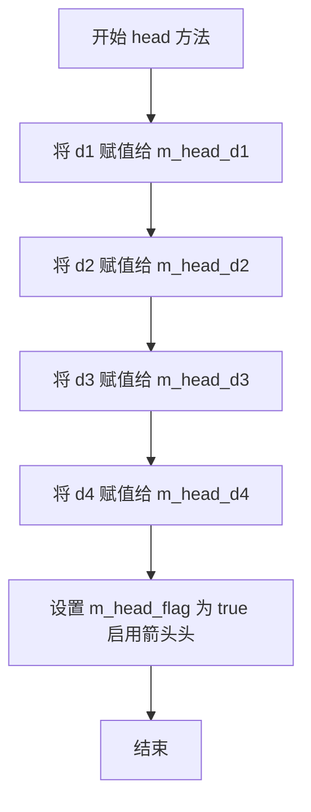
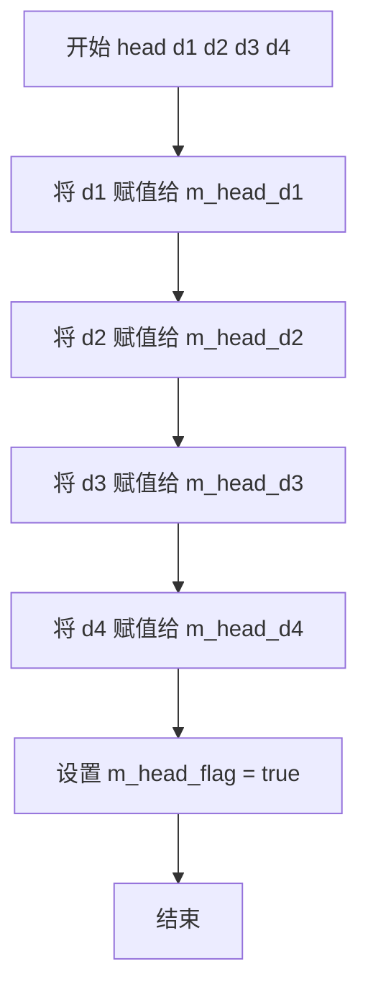
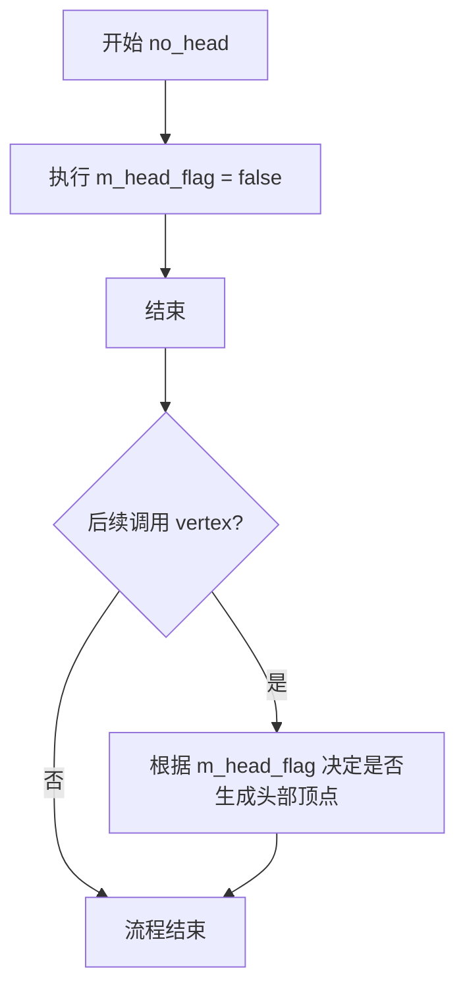
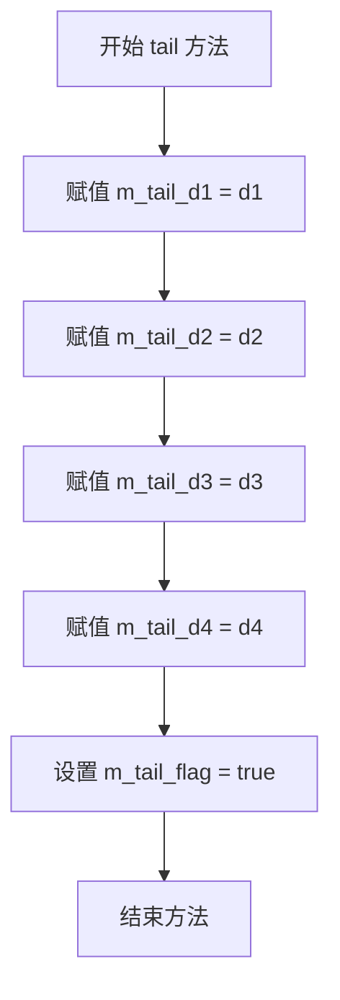
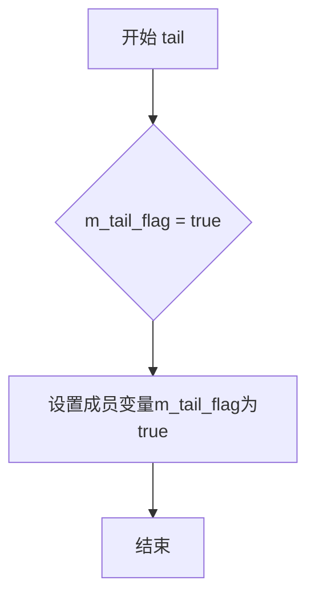
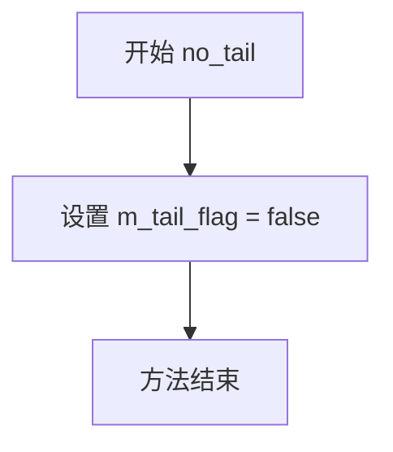
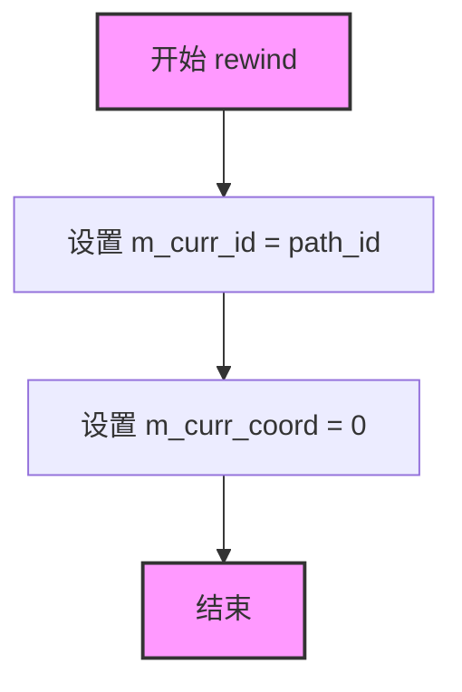
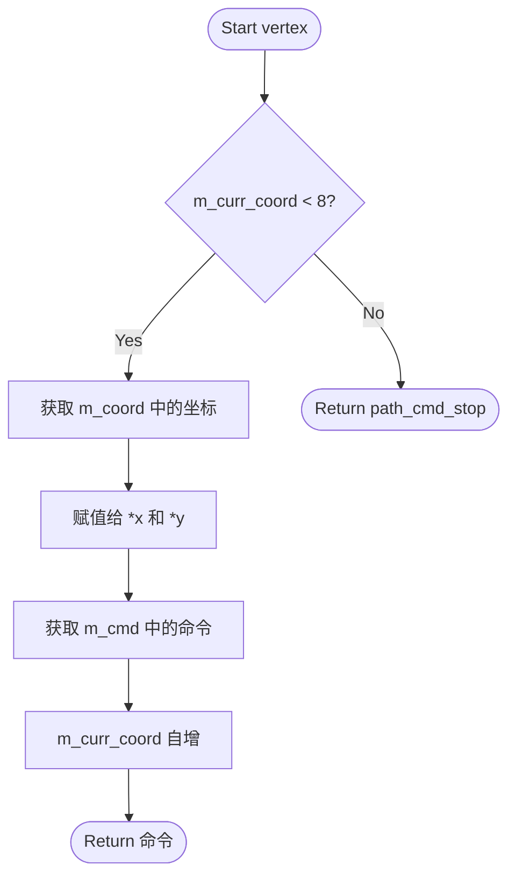

# `matplotlib\extern\agg24-svn\include\agg_arrowhead.h` 详细设计文档

Anti-Grain Geometry库中的箭头/箭尾生成器，用于在矢量图形中生成箭头和箭尾形状，支持自定义头部和尾部的四个维度参数，通过rewind和vertex方法实现路径遍历。

## 整体流程

```mermaid
graph TD
    A[创建arrowhead对象] --> B[调用head()或head(d1,d2,d3,d4)设置箭头]
    B --> C[调用tail()或tail(d1,d2,d3,d4)设置箭尾]
    C --> D[调用rewind(path_id)重置路径]
    D --> E[循环调用vertex获取顶点]
    E --> F{还有更多顶点?}
    F -- 是 --> G[返回顶点坐标和命令]
    F -- 否 --> H[结束]
    G --> E
```

## 类结构

```
agg::arrowhead (箭头生成器类)
```

## 全局变量及字段


### `arrowhead.m_head_d1`
    
箭头头部第一维度参数

类型：`double`
    


### `arrowhead.m_head_d2`
    
箭头头部第二维度参数

类型：`double`
    


### `arrowhead.m_head_d3`
    
箭头头部第三维度参数

类型：`double`
    


### `arrowhead.m_head_d4`
    
箭头头部第四维度参数

类型：`double`
    


### `arrowhead.m_tail_d1`
    
箭尾第一维度参数

类型：`double`
    


### `arrowhead.m_tail_d2`
    
箭尾第二维度参数

类型：`double`
    


### `arrowhead.m_tail_d3`
    
箭尾第三维度参数

类型：`double`
    


### `arrowhead.m_tail_d4`
    
箭尾第四维度参数

类型：`double`
    


### `arrowhead.m_head_flag`
    
箭头头部启用标志

类型：`bool`
    


### `arrowhead.m_tail_flag`
    
箭尾启用标志

类型：`bool`
    


### `arrowhead.m_coord[16]`
    
顶点坐标缓存数组

类型：`double`
    


### `arrowhead.m_cmd[8]`
    
路径命令缓存数组

类型：`unsigned`
    


### `arrowhead.m_curr_id`
    
当前路径ID

类型：`unsigned`
    


### `arrowhead.m_curr_coord`
    
当前坐标索引

类型：`unsigned`
    
    

## 全局函数及方法


### `arrowhead::arrowhead()`

构造函数，初始化箭头头尾的默认参数值、坐标缓存数组、路径命令数组以及遍历状态标志。

参数：
- 无

返回值：`void`，无返回值（构造函数）

#### 流程图

```mermaid
flowchart TD
    A[开始 arrowhead 构造函数] --> B[初始化头部参数 m_head_d1-d4 为 0]
    B --> C[初始化尾部参数 m_tail_d1-d4 为 0]
    C --> D[设置 m_head_flag 为 true]
    D --> E[设置 m_tail_flag 为 true]
    E --> F[清零坐标数组 m_coord[16]]
    F --> G[清零命令数组 m_cmd[8]]
    G --> H[初始化 m_curr_id 为 0]
    H --> I[初始化 m_curr_coord 为 0]
    I --> J[结束]
```

#### 带注释源码

```cpp
// 构造函数定义（在 agg_arrowhead.cpp 中实现）
arrowhead::arrowhead()
{
    // 初始化箭头头部参数为0（默认值）
    m_head_d1 = 0.0;
    m_head_d2 = 0.0;
    m_head_d3 = 0.0;
    m_head_d4 = 0.0;

    // 初始化箭头尾部参数为0（默认值）
    m_tail_d1 = 0.0;
    m_tail_d2 = 0.0;
    m_tail_d3 = 0.0;
    m_tail_d4 = 0.0;

    // 默认启用箭头头部和尾部
    m_head_flag = true;
    m_tail_flag = true;

    // 清零坐标缓存数组（16个double值，存储顶点坐标）
    // 坐标格式：[x0, y0, x1, y1, ..., x7, y7]
    for(int i = 0; i < 16; ++i)
    {
        m_coord[i] = 0.0;
    }

    // 清零命令数组（8个unsigned值，存储路径绘制命令）
    for(int i = 0; i < 8; ++i)
    {
        m_cmd[i] = 0;
    }

    // 初始化路径遍历状态
    m_curr_id = 0;       // 当前路径段ID
    m_curr_coord = 0;    // 当前坐标索引
}
```

#### 补充说明

构造函数通过`head()`和`tail()`方法设置具体参数后，由`rewind()`和`vertex()`方法生成实际的箭头几何路径。默认情况下头部和尾部均启用，但所有几何参数为0，需通过`head(d1,d2,d3,d4)`和`tail(d1,d2,d3,d4)`设置具体尺寸。


### `arrowhead.head`

设置箭头头部的四个维度参数（d1, d2, d3, d4）并将箭头头部标记为启用状态。

参数：

- `d1`：`double`，箭头头部第一维度参数
- `d2`：`double`，箭头头部第二维度参数
- `d3`：`double`，箭头头部第三维度参数
- `d4`：`double`，箭头头部第四维度参数

返回值：`void`，无返回值描述

#### 流程图



#### 带注释源码

```cpp
void head(double d1, double d2, double d3, double d4)
{
    m_head_d1 = d1;  // 设置箭头头部第一维度参数
    m_head_d2 = d2;  // 设置箭头头部第二维度参数
    m_head_d3 = d3;  // 设置箭头头部第三维度参数
    m_head_d4 = d4;  // 设置箭头头部第四维度参数
    m_head_flag = true;  // 启用箭头头部渲染标志
}
```


### `arrowhead.head()`

设置箭头头部（arrowhead）的参数并启用箭头头部功能。该方法接收四个双精度浮点数参数，分别用于定义箭头头部的几何形状参数，并将头部标志设置为启用状态。

参数：

- `d1`：`double`，第一个形状参数，控制箭头头部的宽度或长度比例
- `d2`：`double`，第二个形状参数，控制箭头头部的宽度或角度
- `d3`：`double`，第三个形状参数，控制箭头头部的长度或深度
- `d4`：`double`，第四个形状参数，控制箭头头部的末端形态

返回值：`void`，无返回值

#### 流程图



#### 带注释源码

```cpp
// 设置箭头头部的参数并启用箭头头部
// 参数 d1, d2, d3, d4 定义箭头头部的几何形状
void head(double d1, double d2, double d3, double d4)
{
    m_head_d1 = d1;  // 存储第一个形状参数
    m_head_d2 = d2;  // 存储第二个形状参数
    m_head_d3 = d3;  // 存储第三个形状参数
    m_head_d4 = d4;  // 存储第四个形状参数
    m_head_flag = true;  // 标记箭头头部为启用状态
}
```


### `arrowhead.no_head`

该方法用于禁用箭头头部，通过将成员变量 `m_head_flag` 设置为 `false` 来标记箭头头部不参与渲染。

参数：无

返回值：`void`，无返回值

#### 流程图



#### 带注释源码

```cpp
//----------------------------------------------------------------------------
// Anti-Grain Geometry - Version 2.4
// 简单箭头头部/尾部生成器
//----------------------------------------------------------------------------

namespace agg
{
    //===============================================================arrowhead
    // 箭头类，用于生成箭头头部和尾部的几何路径
    //----------------------------------------------------------------------------
    
    class arrowhead
    {
    public:
        // 构造函数，初始化默认参数
        arrowhead();

        //------------------------------------------ head
        // 设置箭头头部的四个参数并启用头部
        void head(double d1, double d2, double d3, double d4)
        {
            m_head_d1 = d1;  // 头部参数1
            m_head_d2 = d2;  // 头部参数2
            m_head_d3 = d3;  // 头部参数3
            m_head_d4 = d4;  // 头部参数4
            m_head_flag = true;  // 启用头部标记
        }

        //------------------------------------------ head
        // 仅启用箭头头部，使用当前参数
        void head()    { m_head_flag = true; }

        //------------------------------------------ no_head
        // 禁用箭头头部
        // 功能：将 m_head_flag 设置为 false，在后续 vertex() 调用时
        //       将不会生成箭头头部的路径顶点
        void no_head() { m_head_flag = false; }

        //------------------------------------------ tail
        // 设置箭头尾部的四个参数并启用尾部
        void tail(double d1, double d2, double d3, double d4)
        {
            m_tail_d1 = d1;  // 尾部参数1
            m_tail_d2 = d2;  // 尾部参数2
            m_tail_d3 = d3;  // 尾部参数3
            m_tail_d4 = d4;  // 尾部参数4
            m_tail_flag = true;  // 启用尾部标记
        }

        //------------------------------------------ tail
        // 仅启用箭头尾部，使用当前参数
        void tail()    { m_tail_flag = true; }

        //------------------------------------------ no_tail
        // 禁用箭头尾部
        void no_tail() { m_tail_flag = false; }

        //------------------------------------------ rewind
        // 重置路径生成器的内部状态
        void rewind(unsigned path_id);

        //------------------------------------------ vertex
        // 生成路径顶点供渲染器使用
        unsigned vertex(double* x, double* y);

    private:
        // 头部参数
        double   m_head_d1;
        double   m_head_d2;
        double   m_head_d3;
        double   m_head_d4;
        
        // 尾部参数
        double   m_tail_d1;
        double   m_tail_d2;
        double   m_tail_d3;
        double   m_tail_d4;
        
        // 标记位：控制头部和尾部是否激活
        bool     m_head_flag;  // 头部激活标志
        bool     m_tail_flag;  // 尾部激活标志
        
        // 内部坐标和命令缓存
        double   m_coord[16];  // 顶点坐标缓存
        unsigned m_cmd[8];     // 路径命令缓存
        unsigned m_curr_id;    // 当前路径ID
        unsigned m_curr_coord; // 当前坐标索引
    };
}
```


### `arrowhead.tail`

设置箭尾的四个维度参数（d1、d2、d3、d4），并启用箭尾渲染功能。该方法通过为四个坐标参数赋值并激活箭尾标志位，使后续的顶点生成器能够输出完整的箭尾几何形状。

参数：

- `d1`：`double`，第一个维度参数，控制箭尾的第一段长度或角度
- `d2`：`double`，第二个维度参数，控制箭尾的第二段长度或角度
- `d3`：`double`，第三个维度参数，控制箭尾的第三段长度或角度
- `d4`：`double`，第四个维度参数，控制箭尾的第四段长度或角度

返回值：`void`，无返回值

#### 流程图



#### 带注释源码

```cpp
void tail(double d1, double d2, double d3, double d4)
{
    // 设置箭尾第一个维度参数（如第一段长度或宽度）
    m_tail_d1 = d1;
    // 设置箭尾第二个维度参数（如第二段长度或角度）
    m_tail_d2 = d2;
    // 设置箭尾第三个维度参数（如第三段长度或宽度）
    m_tail_d3 = d3;
    // 设置箭尾第四个维度参数（如第四段长度或角度）
    m_tail_d4 = d4;
    // 启用箭尾渲染标志，后续 vertex() 方法将生成箭尾几何形状
    m_tail_flag = true;
}
```


### `arrowhead.tail`

该方法用于启用箭尾（arrowtail）渲染功能，将内部标志位设置为true，表示在后续的路径渲染中需要绘制箭尾。

参数：无

返回值：`void`，无返回值描述

#### 流程图



#### 带注释源码

```cpp
// 启用箭尾（arrowtail）功能
// 该方法将m_tail_flag设置为true，表示在后续的路径渲染中需要绘制箭尾
// 不带参数，仅用于启用箭尾，不修改箭尾的几何参数
void tail()    { m_tail_flag = true;  }
```

---

### 补充说明

在`arrowhead`类中，存在两个`tail`方法的重载版本：

1. **带参数的版本** `tail(double d1, double d2, double d3, double d4)`：
   - 设置箭尾的四个几何参数（d1, d2, d3, d4）
   - 同时将`m_tail_flag`设置为true

2. **不带参数的版本** `tail()`（当前提取的方法）：
   - 仅将`m_tail_flag`设置为true
   - 使用先前已设置的几何参数来绘制箭尾
   - 如果之前未设置过参数，则使用默认参数（在实现文件中定义）

这种方法设计允许用户分两步配置箭尾：先通过带参数的版本设置几何形状，然后可以通过无参数的版本仅启用/禁用箭尾渲染。


### `arrowhead.no_tail`

该方法用于禁用箭头尾部的绘制，通过将内部标志位 `m_tail_flag` 设置为 `false` 来实现，是箭头类中控制箭尾显示状态的简洁接口。

参数：

- （无参数）

返回值：`void`，无返回值描述

#### 流程图



#### 带注释源码

```cpp
// 禁用箭尾绘制
void no_tail() 
{ 
    // 将箭尾标志设置为false，表示不绘制箭尾
    m_tail_flag = false; 
}
```


```markdown
### `arrowhead::rewind`

该方法是 AGG 库中 `arrowhead` 类的核心接口之一，用于实现 `vertex_source` 协议。它接收一个无符号整型路径标识符作为参数，将内部的状态指针（`m_curr_id` 和 `m_curr_coord`）重置为对应路径段的起始位置，从而使得后续调用 `vertex()` 方法能够从头开始生成箭头（头部或尾部）的几何顶点。

参数：
- `path_id`：`unsigned`，路径标识符。在 `arrowhead` 类中，通常 `path_id` 为 0 代表箭头头部（Head），`path_id` 为 1 代表箭头尾部（Tail）。该参数决定了重置后 `vertex()` 方法将生成哪一部分的几何数据。

返回值：`void`，无返回值。

#### 流程图



#### 带注释源码

```cpp
        // 类成员变量声明（来自头文件）
        // unsigned m_curr_id;      // 当前路径ID（0为头，1为尾）
        // unsigned m_curr_coord;   // 当前顶点坐标索引
        
        /**
         * @brief 重置路径到指定ID的开头
         * 
         * 根据 path_id 参数，重置内部状态，准备重新生成顶点。
         * 通常 path_id=0 重置为头部，path_id=1 重置为尾部。
         * 
         * @param path_id unsigned 路径标识符
         */
        void rewind(unsigned path_id)
        {
            // 头文件中仅有声明，此处为根据 AGG 规范及类成员变量的推断实现：
            
            // 1. 记录当前请求的路径ID
            m_curr_id = path_id;
            
            // 2. 将坐标/命令索引重置为0，从头开始读取预定义的顶点数据
            m_curr_coord = 0;
        }
```

``````


### `arrowhead.vertex`

该方法是 Anti-Grain Geometry (AGG) 中路径生成器（Generator）接口的核心实现，负责遍历并输出箭头（Arrowhead）或箭尾（Arrowtail）的几何路径顶点。它从内部缓存的坐标数组 `m_coord` 和命令数组 `m_cmd` 中提取当前索引处的数据，并在返回后自动递增索引，直至路径结束。

参数：
-  `x`：`double*`，指向 double 类型变量的指针。方法执行后，该指针指向的变量将存储当前顶点的 x 坐标。
-  `y`：`double*`，指向 double 类型变量的指针。方法执行后，该指针指向的变量将存储当前顶点的 y 坐标。

返回值：`unsigned`，返回当前顶点的路径命令标识（Path Command），例如 `path_cmd_move_to`（移动）、`path_cmd_line_to`（画线）或 `path_cmd_stop`（路径结束，停止遍历）。

#### 流程图



#### 带注释源码

```cpp
// 头文件中的声明
unsigned vertex(double* x, double* y);

// 基于类成员变量推断的实现逻辑
unsigned vertex(double* x, double* y)
{
    // 检查是否已经遍历完所有预设的顶点
    // m_cmd 数组大小为 8，代表箭头/箭尾路径的最大顶点数
    if (m_curr_coord < 8) 
    {
        // m_coord 是一个双精度浮点数组，存储了 16 个值 (x0, y0, x1, y1, ...)
        // 根据当前索引 m_curr_coord 计算对应的坐标偏移量
        // 坐标在数组中按 [x0, y0, x1, y1, ...] 顺序存储
        *x = m_coord[m_curr_coord * 2];     // 提取 x 坐标
        *y = m_coord[m_curr_coord * 2 + 1]; // 提取 y 坐标
        
        // 从命令数组中获取当前顶点的绘图命令（如 MOVE_TO, LINE_TO）
        unsigned cmd = m_cmd[m_curr_coord];
        
        // 移动到下一个顶点，为下次调用做准备
        ++m_curr_coord;
        
        // 返回当前顶点的命令
        return cmd;
    }
    
    // 如果索引超出范围，则表示路径已结束，返回停止命令
    // 在 AGG 中，通常 path_cmd_stop 定义为 0
    return 0; 
}
```


## 关键组件


### arrowhead 类

该类用于生成2D渲染中的箭头头（arrowhead）和箭头尾（arrowtail）几何图形，支持通过参数自定义头部和尾部的尺寸，并提供路径遍历接口以获取生成的顶点数据。

### 头部参数配置 (head)

通过 `head(d1, d2, d3, d4)` 方法设置箭头头的四个控制参数，参数含义与具体几何形状生成算法相关，用于定义箭头头的宽度、长度、角度等几何特征。

### 尾部参数配置 (tail)

通过 `tail(d1, d2, d3, d4)` 方法设置箭头尾的四个控制参数，与头部参数类似，用于定义箭头尾的几何形状。

### 头尾启用/禁用控制

提供 `head()`、`no_head()`、`tail()`、`no_tail()` 方法控制箭头头和尾的启用状态，通过布尔标志位 `m_head_flag` 和 `m_tail_flag` 记录当前配置。

### 路径重置方法 (rewind)

`rewind(unsigned path_id)` 方法用于将生成器重置到指定路径的起始位置，准备生成新的顶点序列。

### 顶点生成方法 (vertex)

`vertex(double* x, double* y)` 方法遍历生成箭头几何图形的顶点，通过指针参数输出顶点坐标，返回路径命令（如移动、画线、结束等）。

### 坐标存储数组 (m_coord)

`double m_coord[16]` 数组存储生成的顶点坐标数据，最多可存储8个顶点对（x, y坐标）。

### 命令存储数组 (m_cmd)

`unsigned m_cmd[8]` 数组存储对应的路径命令，用于描述每个顶点的类型（move_to、line_to等）。

### 状态标志位 (m_head_flag, m_tail_flag)

布尔类型标志位，分别表示箭头头和箭头尾是否启用，决定是否在几何图形生成过程中包含头部或尾部。

### 当前遍历状态 (m_curr_id, m_curr_coord)

无符号整型变量，记录当前遍历的路径ID和坐标索引，用于 `vertex()` 方法的顺序读取。


## 问题及建议


### 已知问题

-   **参数命名不清晰**：head()和tail()方法使用d1、d2、d3、d4这样模糊的参数名，缺乏语义化命名，可读性差
-   **数组大小硬编码**：m_coord[16]和m_cmd[8]使用硬编码的固定大小，缺乏灵活性，无法适应不同复杂度的箭头
-   **缺少参数验证**：setter方法没有对输入参数进行有效性检查，可能导致无效的几何参数（如负值、零值）
-   **缺乏错误处理**：vertex()方法返回unsigned类型，但没有明确的错误码定义和错误处理机制
-   **无const正确性**：部分getter方法缺失，没有const限定符，限制了使用场景
-   **命名不一致**：m_curr_id和m_curr_coord变量命名不够直观，应考虑更清晰的命名
-   **缺少文档注释**：类和方法缺乏详细的文档注释，影响代码可维护性
-   **无虚析构函数**：虽然当前设计可能不需要多态，但作为库代码应考虑future-proof

### 优化建议

-   **重构参数命名**：将d1、d2、d3、d4改为具有语义的名字，如head_width、head_length、head_angle等
-   **动态内存管理**：考虑使用动态容器（如std::vector）替代固定大小数组，提高灵活性
-   **添加参数验证**：在setter方法中添加参数有效性检查，确保几何参数合理
-   **添加const方法**：为只读访问器方法添加const限定符
-   **增强错误处理**：为vertex()方法定义明确的错误码和异常处理机制
-   **添加文档注释**：为类和方法添加详细的Doxygen风格文档说明
-   **统一命名风格**：考虑使用更清晰的成员变量命名，如m_currentId、m_currentCoordIndex
-   **考虑使用枚举**：对于path_id等可能的情况，使用枚举类替代魔法数字


## 其它


### 设计目标与约束

设计目标：提供一个轻量级的箭头头部和尾部生成器，能够在矢量图形渲染中动态生成箭头的头部和尾部形状，支持可配置的箭头参数。

设计约束：
- 仅依赖agg_basics.h基础组件，无外部第三方库依赖
- 内存占用极小，使用固定大小数组（坐标16个，命令8个）
- 作为path_generator的配套类使用，需配合path_storage或类似路径存储机制

### 错误处理与异常设计

本类设计为无异常抛出模式，错误处理通过返回值机制完成：
- vertex()方法返回0表示路径结束（agg::path_cmd_stop）
- 传入参数x,y为nullptr时的行为未定义，调用方需保证参数有效性
- 参数d1-d4无范围校验，需由调用方保证值的合理性（如正数）

### 数据流与状态机

状态机包含三个主要状态：
1. 初始状态：m_curr_id=0, m_curr_coord=0，头尾标志位可设置
2. 激活状态：调用rewind()后进入，准备生成顶点数据
3. 耗尽状态：vertex()返回path_cmd_stop，标识路径结束

数据流：
- 配置阶段：head()/tail()设置参数和标志位
- 初始化阶段：rewind()重置遍历指针
- 生成阶段：vertex()逐个返回顶点坐标和命令

### 外部依赖与接口契约

外部依赖：
- agg_basics.h：提供基本类型定义（double, unsigned, bool）和命名空间

接口契约：
- rewind(unsigned path_id)：path_id参数未在实现中使用，保留用于接口一致性
- vertex(double* x, double* y)：输出参数，调用后*x,*y包含当前顶点坐标，返回值为path命令
- 所有设置方法（head/tail带参数版本）返回void，链式调用不可用

### 使用示例与典型用法

典型用法：
```cpp
arrowhead arrow;
arrow.head(10, 5, 5, 5);  // 设置头部参数
arrow.tail(10, 5, 5, 5);  // 设置尾部参数
arrow.rewind(0);
double x, y;
while(arrow.vertex(&x, &y) != agg::path_cmd_stop) {
    // 处理顶点数据
}
```

### 线程安全性

本类不包含任何线程同步机制，为非线程安全类：
- 多线程环境下需要外部同步
- 多个线程共享同一实例会导致状态竞争

### 内存管理

- 所有数据成员为值类型或固定数组
- 无动态内存分配
- 无资源获取/释放逻辑
- 实例生命周期完全由调用方管理

### 兼容性考虑

- 遵循C++03标准
- 无平台特定代码
- 字节序依赖：无（仅使用double和unsigned类型）
- 浮点精度：依赖IEEE 754双精度浮点

### 性能特性

- 时间复杂度：vertex()为O(1)
- 空间复杂度：O(1)，固定内存占用
- 典型调用次数：头尾各4个顶点 + 4条线段 = 约8-12次vertex调用


    