# `matplotlib\extern\agg24-svn\include\agg_basics.h` 详细设计文档

Anti-Grain Geometry库的基础头文件，定义了核心数据类型（int8~int64及无符号变体）、内存分配策略模板、几何辅助函数（数值取整、角度转换）、基础数据结构（矩形、点、顶点、行信息）以及路径命令与标志枚举，为上层图形渲染功能提供底层基础设施。

## 整体流程

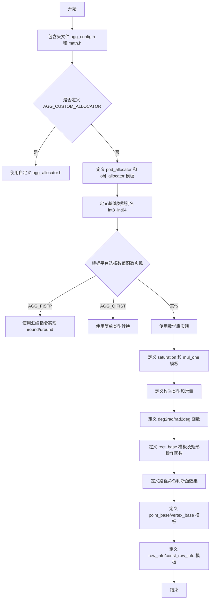

## 类结构

```
agg (命名空间)
├── pod_allocator<T> (模板结构体-内存分配)
├── obj_allocator<T> (模板结构体-单对象分配)
├── saturation<Limit> (模板结构体-饱和度处理)
├── mul_one<Shift> (模板结构体-乘法优化)
├── rect_base<T> (模板结构体-矩形基类)
│   ├── rect_i (int特化)
│   ├── rect_f (float特化)
│   └── rect_d (double特化)
├── point_base<T> (模板结构体-点基类)
│   ├── point_i
│   ├── point_f
│   └── point_d
├── vertex_base<T> (模板结构体-顶点基类)
│   ├── vertex_i
│   ├── vertex_f
│   └── vertex_d
├── row_info<T> (模板结构体-行信息)
└── const_row_info<T> (模板结构体-常量行信息)
```

## 全局变量及字段


### `agg::int8`
    
8位有符号整数类型

类型：`AGG_INT8 (signed char)`
    


### `agg::int8u`
    
8位无符号整数类型

类型：`AGG_INT8U (unsigned char)`
    


### `agg::int16`
    
16位有符号整数类型

类型：`AGG_INT16 (short)`
    


### `agg::int16u`
    
16位无符号整数类型

类型：`AGG_INT16U (unsigned short)`
    


### `agg::int32`
    
32位有符号整数类型

类型：`AGG_INT32 (int)`
    


### `agg::int32u`
    
32位无符号整数类型

类型：`AGG_INT32U (unsigned)`
    


### `agg::int64`
    
64位有符号整数类型

类型：`AGG_INT64 (signed long long)`
    


### `agg::int64u`
    
64位无符号整数类型

类型：`AGG_INT64U (unsigned long long)`
    


### `agg::cover_type`
    
覆盖类型，用于区域渲染时的覆盖值（0-255）

类型：`unsigned char`
    


### `agg::rect_i`
    
整数坐标矩形模板实例

类型：`rect_base<int>`
    


### `agg::rect_f`
    
浮点数坐标矩形模板实例

类型：`rect_base<float>`
    


### `agg::rect_d`
    
双精度浮点数坐标矩形模板实例

类型：`rect_base<double>`
    


### `agg::point_i`
    
整数坐标点模板实例

类型：`point_base<int>`
    


### `agg::point_f`
    
浮点数坐标点模板实例

类型：`point_base<float>`
    


### `agg::point_d`
    
双精度浮点数坐标点模板实例

类型：`point_base<double>`
    


### `agg::vertex_i`
    
整数坐标顶点模板实例

类型：`vertex_base<int>`
    


### `agg::vertex_f`
    
浮点数坐标顶点模板实例

类型：`vertex_base<float>`
    


### `agg::vertex_d`
    
双精度浮点数坐标顶点模板实例

类型：`vertex_base<double>`
    


### `agg::pi`
    
圆周率常量

类型：`const double`
    


### `rect_base<T>.x1`
    
矩形左上角x坐标

类型：`T`
    


### `rect_base<T>.y1`
    
矩形左上角y坐标

类型：`T`
    


### `rect_base<T>.x2`
    
矩形右下角x坐标

类型：`T`
    


### `rect_base<T>.y2`
    
矩形右下角y坐标

类型：`T`
    


### `rect_base<T>.value_type`
    
模板参数类型别名

类型：`T`
    


### `rect_base<T>.self_type`
    
自身类型别名

类型：`rect_base<T>`
    


### `point_base<T>.x`
    
点的x坐标

类型：`T`
    


### `point_base<T>.y`
    
点的y坐标

类型：`T`
    


### `point_base<T>.value_type`
    
模板参数类型别名

类型：`T`
    


### `vertex_base<T>.x`
    
顶点的x坐标

类型：`T`
    


### `vertex_base<T>.y`
    
顶点的y坐标

类型：`T`
    


### `vertex_base<T>.cmd`
    
顶点命令（路径命令）

类型：`unsigned`
    


### `vertex_base<T>.value_type`
    
模板参数类型别名

类型：`T`
    


### `row_info<T>.x1`
    
行的起始列索引

类型：`int`
    


### `row_info<T>.x2`
    
行的结束列索引

类型：`int`
    


### `row_info<T>.ptr`
    
指向行数据的指针

类型：`T*`
    


### `const_row_info<T>.x1`
    
行的起始列索引

类型：`int`
    


### `const_row_info<T>.x2`
    
行的结束列索引

类型：`int`
    


### `const_row_info<T>.ptr`
    
指向常量行数据的指针

类型：`const T*`
    
    

## 全局函数及方法


### `agg::iround`

该函数实现将双精度浮点数舍入到最接近的整数的功能，根据数值是正数还是负数采用不同的偏移策略，以确保四舍五入的准确性。

参数：
- `v`：`double`，要舍入的双精度浮点数

返回值：`int`，舍入后的整数结果

#### 流程图

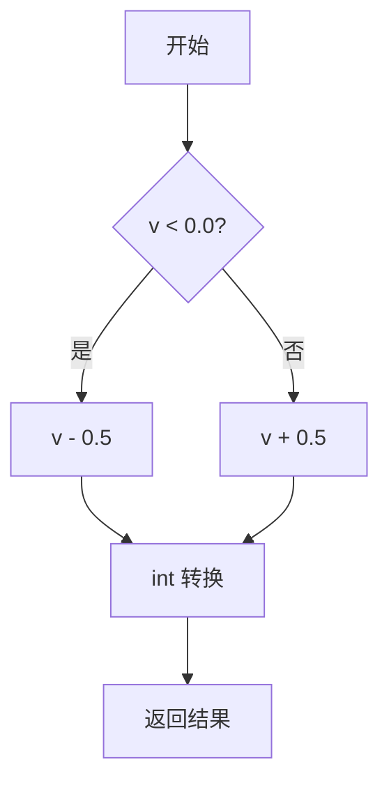

#### 带注释源码

```cpp
// 将double类型值四舍五入到最接近的整数
// 如果值为负数，则减去0.5；否则加上0.5，然后取整
// 这样可以正确处理正负数的四舍五入
AGG_INLINE int iround(double v)
{
    return int((v < 0.0) ? v - 0.5 : v + 0.5);
}
```


### `agg::uround`

该函数是 Anti-Grain Geometry 库中的数学辅助函数，用于将双精度浮点数四舍五入为无符号整数。根据不同的平台配置，可能使用汇编指令或标准数学库实现。

参数：

- `v`：`double`，要四舍五入的双精度浮点数

返回值：`unsigned`，四舍五入后的无符号整数

#### 流程图

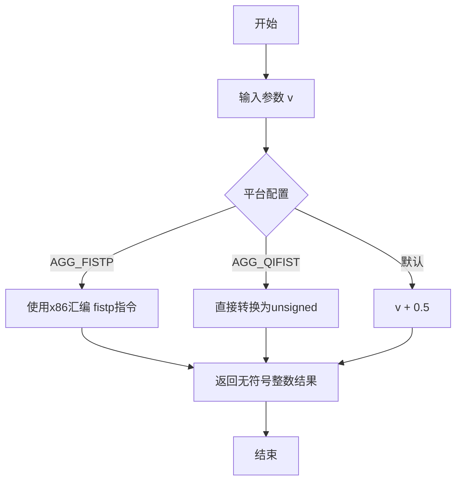

#### 带注释源码

```cpp
// 平台1: 使用x86汇编指令实现高速舍入
#if defined(AGG_FISTP)
#pragma warning(push)
#pragma warning(disable : 4035) // 禁用"无返回值"警告

    // 使用FISTP指令将浮点数存储为整数
    AGG_INLINE unsigned uround(double v)         //-------uround
    {
        unsigned t;
        __asm fld   qword ptr [v]    // 加载双精度浮点数到FPU栈
        __asm fistp dword ptr [t]   // 存储整数并弹出FPU栈
        __asm mov eax, dword ptr [t] // 将结果移入返回值寄存器
    }

#pragma warning(pop)

// 平台2: 快速整数转换（牺牲精度换取速度）
#elif defined(AGG_QIFIST)
    AGG_INLINE unsigned uround(double v)
    {
        return unsigned(v);  // 直接转换为无符号整数
    }

// 平台3: 默认实现，使用标准数学运算
#else
    AGG_INLINE unsigned uround(double v)
    {
        // 四舍五入算法: 正数加上0.5后取整
        // 注意: 负数直接转换会导致不正确结果
        return unsigned(v + 0.5);
    }
#endif
```


### `agg::ifloor`

该函数是 Anti-Grain Geometry (AGG) 库中的基础数学工具函数，用于将 double 类型的浮点数向下取整为 int 类型的整数。根据不同的编译器宏定义（AGG_FISTP、AGG_QIFIST 或默认），该函数有三种不同的实现方式，均能正确处理正负数的向下取整。

参数：

- `v`：`double`，需要向下取整的浮点数

返回值：`int`，向下取整后的整数值

#### 流程图

```mermaid
flowchart TD
    A[开始] --> B{判断宏定义}
    B -->|AGG_FISTP| C[使用 floor 函数]
    B -->|AGG_QIFIST| D[使用 floor 函数]
    B -->|默认| E[手动取整逻辑]
    C --> F[int(v)]
    D --> F
    E --> G[i = int(v)]
    G --> H{判断 i > v}
    H -->|是| I[返回 i - 1]
    H -->|否| J[返回 i]
    F --> K[返回 int(floor(v))]
    I --> L[返回结果]
    J --> L
    K --> L
```

#### 带注释源码

```cpp
// 该函数根据不同的编译器宏定义有三种实现版本

// 版本1: AGG_FISTP 宏定义 - 使用 x86 汇编指令 FISTP 进行快速取整
#if defined(AGG_FISTP)
    AGG_INLINE int ifloor(double v)
    {
        return int(floor(v));  // 调用标准库 floor 函数取整
    }

// 版本2: AGG_QIFIST 宏定义 - 同样是使用 floor 函数
#elif defined(AGG_QIFIST)
    AGG_INLINE int ifloor(double v)
    {
        return int(floor(v));  // 调用标准库 floor 函数取整
    }

// 版本3: 默认实现 - 手动处理向下取整逻辑
#else
    AGG_INLINE int ifloor(double v)
    {
        int i = int(v);        // 将 double 强制转换为 int（ truncation，向零取整）
        return i - (i > v);    // 如果转换后的整数大于原值，说明原值为负数且被截断了，需要减1
    }
#endif
```

#### 设计说明

1. **三种实现策略**：
   - `AGG_FISTP`：使用 x86 汇编指令 `fistp` 进行高效的浮点数到整数的转换
   - `AGG_QIFIST`：使用简单的类型转换
   - **默认实现**：手动处理负数的向下取整，确保无论正负数都能正确向下取整

2. **负数处理**：默认实现中 `i - (i > v)` 的技巧很巧妙：
   - 当 `v` 为正数时，`int(v)` 会截断小数部分，由于截断后的 `i` 不大于 `v`，`(i > v)` 为 false，结果为 `i`
   - 当 `v` 为负数时（如 -3.7），`int(-3.7)` 结果为 -3（向零取整），而 `-3 > -3.7` 为 true，所以结果是 `-3 - 1 = -4`，这正是向下取整的正确结果


### `agg::ufloor(double)`

该函数是 Anti-Grain Geometry (AGG) 库中的数学工具函数，用于将双精度浮点数向下取整并转换为无符号整数。根据不同的编译条件（平台特性），函数可能有不同的实现方式，但核心逻辑都是将浮点数向下取整后返回其无符号整数值。

参数：
- `v`：`double`，要向下取整的双精度浮点数输入值

返回值：`unsigned`，返回向下取整后的无符号整数值

#### 流程图

```mermaid
flowchart TD
    A[开始 ufloor] --> B{检查编译条件}
    B -->|AGG_FISTP 定义| C[使用 unsigned floor(v)]
    B -->|AGG_QIFIST 定义| D[使用 unsigned floor(v)]
    B -->|默认情况| E[直接使用 unsigned 转换]
    C --> F[返回 unsigned 结果]
    D --> F
    E --> F
    F --> G[结束]
```

#### 带注释源码

```cpp
// 根据不同的平台特性，ufloor 函数有多个实现版本
// 第一个版本：当定义了 AGG_FISTP 时使用
#if defined(AGG_FISTP)
    // 使用 floor 函数进行向下取整，然后转换为 unsigned
    // 注意：这个版本有重复定义，实际代码中只有部分被展示
    AGG_INLINE unsigned ufloor(double v)         //-------ufloor
    {
        return unsigned(floor(v));
    }

// 第二个版本：当定义了 AGG_QIFIST 时使用
#elif defined(AGG_QIFIST)
    // 同样使用 floor 函数进行向下取整
    AGG_INLINE unsigned ufloor(double v)
    {
        return unsigned(floor(v));
    }

// 第三个版本：默认实现（当没有定义特殊宏时）
#else
    // 默认实现：直接将 double 转换为 unsigned
    // 这种实现会截断小数部分，相当于向零取整而非向下取整
    // 注意：这与函数名称'ufloor'（向下取整）的语义不完全一致
    AGG_INLINE unsigned ufloor(double v)
    {
        return unsigned(v);
    }
#endif
```


### `agg::iceil(double)`

该函数是 Anti-Grain Geometry (AGG) 库中的数学辅助函数，用于将双精度浮点数向上取整为整数。它根据不同的编译器平台和宏定义，可能使用内联汇编、标准库函数或算术运算来实现高效的向上取整操作。

参数：

- `v`：`double`，需要向上取整的双精度浮点数。

返回值：`int`，返回大于或等于输入浮点数的最小整数。

#### 流程图

```mermaid
graph TD
    A[开始: 输入double v] --> B{根据平台宏选择实现}
    B --> C1[使用__asm汇编: fistp指令]
    B --> C2[使用int转换: int(v)]
    B --> C3[使用算术运算: v + 0.5]
    C1 --> D[调用ceil函数]
    C2 --> D
    C3 --> D
    D --> E[将结果转换为int]
    E --> F[返回int类型的向上取整结果]
```

#### 带注释源码

```cpp
// 在AGG_FISTP宏定义下（使用x86汇编指令）
AGG_INLINE int iceil(double v)
{
    return int(ceil(v));  // 调用标准库ceil函数并转换为int
}

// 在AGG_QIFIST宏定义下（使用快速整数转换）
AGG_INLINE int iceil(double v)
{
    return int(ceil(v));  // 同样调用ceil函数
}

// 在默认情况下（无特殊优化）
AGG_INLINE int iceil(double v)
{
    return int(ceil(v));  // 使用标准库函数实现向上取整
}

// 注意：实际代码中根据宏条件编译其中一个版本
// 该函数被声明为inline，以减少函数调用开销
```


### `agg::uceil`

该函数用于计算给定双精度浮点数的上取整（ceiling）值，并将结果转换为无符号整数。在 AGG 库中，针对不同的编译器优化选项，提供了三个实现版本，但核心逻辑相同：调用标准库的 `ceil()` 函数并将结果强制转换为 `unsigned` 类型。

参数：

- `v`：`double`，输入的双精度浮点数

返回值：`unsigned`，返回参数 `v` 的上取整值（不小于 `v` 的最小整数）

#### 流程图

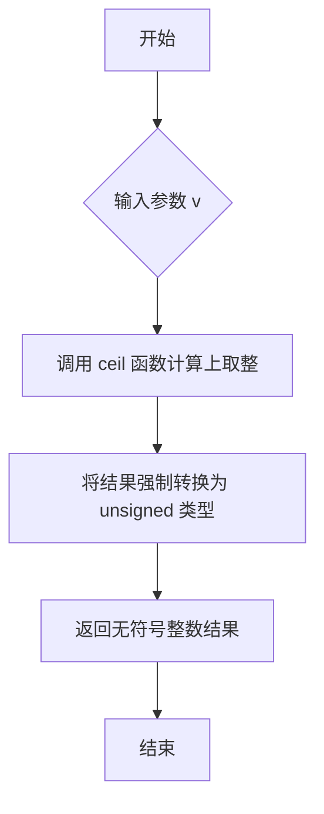

#### 带注释源码

```cpp
//----------------------------------------------------------------------------
// Anti-Grain Geometry - Version 2.4
// 根据不同的编译器定义，存在三个版本的 uceil 函数实现
//----------------------------------------------------------------------------

// 版本1: 当定义了 AGG_FISTP 时的实现
// 使用内联汇编实现，但 uceil 部分直接调用 ceil
#if defined(AGG_FISTP)
    AGG_INLINE unsigned uceil(double v)          //--------uceil
    {
        return unsigned(ceil(v));               // 调用标准库 ceil 并转换为无符号整数
    }

// 版本2: 当定义了 AGG_QIFIST 时的实现
#elif defined(AGG_QIFIST)
    AGG_INLINE unsigned uceil(double v)
    {
        return unsigned(ceil(v));               // 调用标准库 ceil 并转换为无符号整数
    }

// 版本3: 默认实现（当未定义上述宏时使用）
// 使用标准的 C 库函数实现
#else
    AGG_INLINE unsigned uceil(double v)
    {
        return unsigned(ceil(v));               // 调用标准库 ceil 并转换为无符号整数
    }
#endif
```

**备注**：该函数是 AGG 库中的基础数学工具函数，主要用于图形渲染中的坐标计算和像素对齐。所有三个实现版本的功能完全一致，均通过调用标准库函数 `<cmath>` 中的 `ceil()` 来完成上取整运算，然后将其结果强制转换为 `unsigned` 类型返回。这种设计允许库在不同编译器环境下选择最优的实现方式。


### `agg::deg2rad`

该函数是Anti-Grain Geometry库中的数学工具函数，用于将角度值（度）转换为弧度值。函数通过简单的数学公式 deg * π / 180.0 实现单位转换，是图形处理中常用的角度转换工具。

参数：

- `deg`：`double`，要转换的角度值，以度为单位

返回值：`double`，转换后的弧度值

#### 流程图

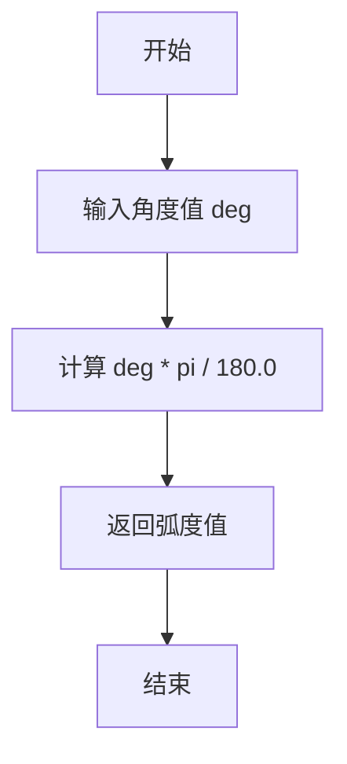

#### 带注释源码

```cpp
//------------------------------------------------------------------deg2rad
// 函数：deg2rad
// 功能：将角度（度）转换为弧度
// 参数：deg - double类型，表示角度值（以度为单位）
// 返回值：double类型，表示对应的弧度值
inline double deg2rad(double deg)
{
    return deg * pi / 180.0;  // 使用π将角度转换为弧度
}
```


### agg::rad2deg

该函数用于将弧度值转换为角度值，是AGG几何引擎中最基础的数学转换工具之一。通过将弧度乘以180并除以圆周率π，实现弧度到角度的转换。

参数：

- `rad`：`double`，待转换的弧度值

返回值：`double`，转换后的角度值

#### 流程图


#### 带注释源码

```cpp
//------------------------------------------------------------------rad2deg
// 函数：rad2deg
// 功能：将弧度转换为角度
// 参数：rad - 输入的弧度值（double类型）
// 返回值：转换后的角度值（double类型）
// 原理：角度 = 弧度 × (180 / π)
inline double rad2deg(double rad)
{
    return rad * 180.0 / pi;  // 使用π常量将弧度转换为角度
}
```


### `agg::is_vertex`

该函数用于判断给定的路径命令码是否表示一个有效的顶点命令（即是否为 path_cmd_move_to、path_cmd_line_to、path_cmd_curve3、path_cmd_curve4 等绘制命令，而非停止或多边形结束命令）。

参数：

-  `c`：`unsigned`，路径命令码，用于表示路径操作类型的整数值

返回值：`bool`，如果参数 c 在 path_cmd_move_to（值为1）到 path_cmd_end_poly（值为15）之间（包括 move_to 但不包括 end_poly），则返回 true，表示该命令是一个有效的顶点绘制命令；否则返回 false。

#### 流程图

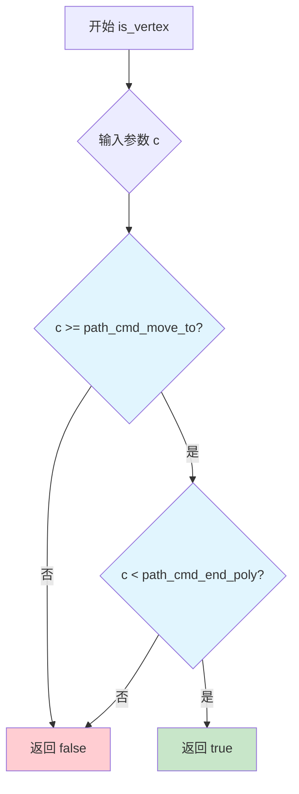

#### 带注释源码

```cpp
//---------------------------------------------------------------is_vertex
// 函数：is_vertex
// 功能：判断给定的路径命令码是否表示一个有效的顶点命令
// 参数：c - unsigned类型的路径命令码
// 返回值：bool - 如果c是顶点命令返回true，否则返回false
inline bool is_vertex(unsigned c)
{
    // 路径顶点命令的范围是从 path_cmd_move_to (值为1) 到 path_cmd_end_poly (值为15) 之前
    // 即有效顶点命令为：move_to(1), line_to(2), curve3(3), curve4(4), curveN(5), catrom(6), ubspline(7)
    return c >= path_cmd_move_to && c < path_cmd_end_poly;
}
```


### `agg::is_drawing`

该函数用于判断给定的路径命令码是否属于绘制命令（即线条、多段线或曲线命令），通过检查命令码是否落在`path_cmd_line_to`到`path_cmd_end_poly`（不含）之间来实现。

参数：
-  `c`：`unsigned`，路径命令码（path command），用于标识具体路径操作类型的整数值

返回值：`bool`，如果命令码在`path_cmd_line_to`和`path_cmd_end_poly`之间返回true，表示这是一个绘制命令；否则返回false

#### 流程图

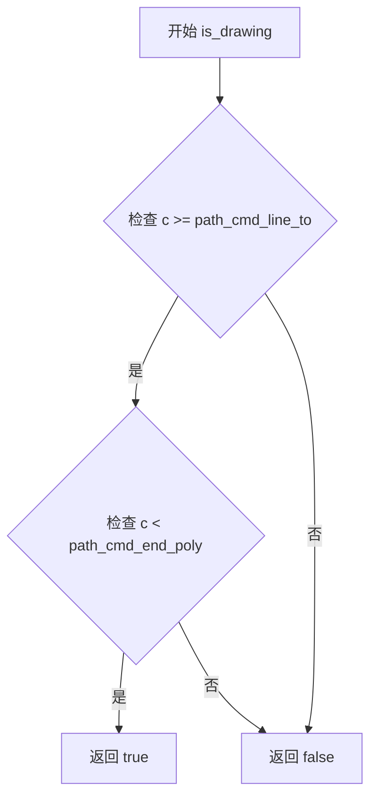

#### 带注释源码

```cpp
//--------------------------------------------------------------is_drawing
// 函数：检查给定的路径命令码是否为绘制命令
// 绘制命令包括：path_cmd_line_to, path_cmd_curve3, path_cmd_curve4,
//              path_cmd_curveN, path_cmd_catrom, path_cmd_ubspline
inline bool is_drawing(unsigned c)
{
    // 判断命令码是否在 path_cmd_line_to(2) 和 path_cmd_end_poly(15) 之间
    // 如果 c >= 2 且 c < 15，则为绘制命令，返回 true
    // 否则返回 false
    return c >= path_cmd_line_to && c < path_cmd_end_poly;
}
```


### `agg::is_stop`

该函数用于检查给定的路径命令代码是否为停止命令（path_cmd_stop），是AGG图形库中判断路径命令类型的工具函数之一。

参数：

-  `c`：`unsigned`，要检查的路径命令代码

返回值：`bool`，如果 `c` 等于 `path_cmd_stop`（值为0）则返回 `true`，否则返回 `false`

#### 流程图

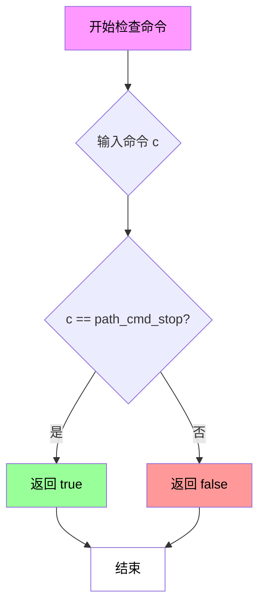

#### 带注释源码

```cpp
//-----------------------------------------------------------------is_stop
// 函数：is_stop
// 命名空间：agg
// 功能：检查给定的路径命令是否为停止命令
// 参数：
//   - c: unsigned类型的路径命令代码
// 返回值：
//   - bool: 如果c等于path_cmd_stop则返回true，否则返回false
inline bool is_stop(unsigned c)
{ 
    // path_cmd_stop 在 path_commands_e 枚举中定义为 0
    // 该函数简单地比较输入命令与停止命令的值
    return c == path_cmd_stop;
}
```

#### 关联信息

- **path_cmd_stop**：在 `path_commands_e` 枚举中定义，值为 `0`，表示路径命令的停止操作
- **相关函数**：
  - `is_vertex(unsigned c)`：检查是否为顶点命令
  - `is_drawing(unsigned c)`：检查是否为绘图命令
  - `is_move_to(unsigned c)`：检查是否为移动命令
  - `is_line_to(unsigned c)`：检查是否为直线命令
  - `is_curve(unsigned c)`：检查是否为曲线命令
  - `is_end_poly(unsigned c)`：检查是否为多边形结束命令
  - `is_close(unsigned c)`：检查是否为关闭命令
  - `is_next_poly(unsigned c)`：检查是否为下一个多边形的起始命令

#### 设计目标

- **目的**：提供一种轻量级的方式来识别路径命令中的停止命令
- **约束**：该函数为内联函数，专注于单一职责，不进行复杂的状态管理

#### 潜在优化空间

1. **无明显技术债务**：该函数实现简洁明了，符合AGG库的设计风格
2. **可能的优化**：如果需要频繁调用且对性能要求极高，可考虑将函数声明为宏以消除函数调用开销（但当前内联已足够）
3. **扩展性**：目前仅支持与 `path_cmd_stop` 的精确匹配，如需支持位掩码比较（如 `is_end_poly` 的实现方式），可考虑增加额外的标志参数


### `agg::is_move_to(unsigned)`

该函数是 Anti-Grain Geometry 库中的路径命令判断辅助函数，用于检查给定的路径命令值是否为 `move_to` 命令（即路径的起点命令）。

参数：

-  `c`：`unsigned`，路径命令值，用于判断是否为 move_to 命令

返回值：`bool`，如果命令值等于 path_cmd_move_to 则返回 true，否则返回 false

#### 流程图

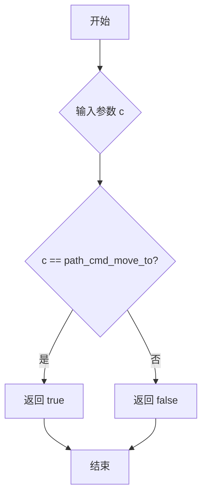

#### 带注释源码

```cpp
//--------------------------------------------------------------is_move_to
// 函数功能：检查给定的路径命令值是否为 move_to 命令
// path_cmd_move_to 在 agg 库中定义为 1，表示路径的起点命令
inline bool is_move_to(unsigned c)
{
    // 比较输入的命令值 c 是否等于 path_cmd_move_to (值为1)
    return c == path_cmd_move_to;
}
```


### `agg::is_line_to(unsigned)`

该函数用于判断给定的路径命令标识符是否为 `line_to`（画线）命令，是 AGG 图形库中路径命令判断的辅助函数，属于基础工具函数。

参数：

-  `c`：`unsigned`，路径命令标识符，用于判断是否为 line_to 命令

返回值：`bool`，如果参数 `c` 等于 `path_cmd_line_to` 则返回 true，否则返回 false

#### 流程图

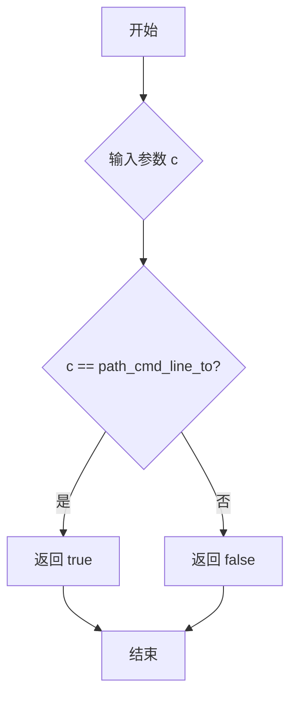

#### 带注释源码

```cpp
//--------------------------------------------------------------is_line_to
// 判断给定的路径命令标识符是否为 line_to 命令
// 参数 c: unsigned 类型的路径命令标识符
// 返回值: bool，如果 c 等于 path_cmd_line_to 则返回 true
inline bool is_line_to(unsigned c)
{
    return c == path_cmd_line_to;
}
```


### `agg::is_curve`

该函数用于判断给定的路径命令是否为曲线命令（即三次贝塞尔曲线path_cmd_curve3或四次贝塞尔曲线path_cmd_curve4）。

参数：

- `c`：`unsigned`，待检测的路径命令标识符

返回值：`bool`，如果命令是 curve3 或 curve4 则返回 true，否则返回 false

#### 流程图

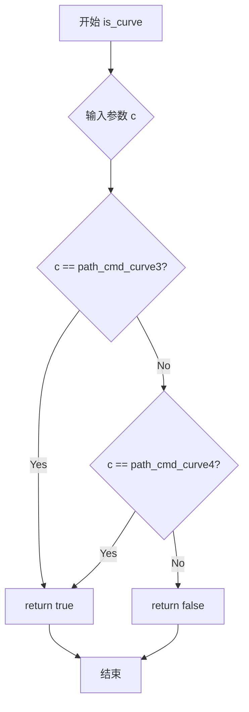

#### 带注释源码

```cpp
//-----------------------------------------------------------------is_curve
// 判断给定的路径命令是否为曲线命令
// 参数 c: unsigned 类型的路径命令标识符
// 返回值: bool - 如果是 curve3 或 curve4 命令返回 true，否则返回 false
inline bool is_curve(unsigned c)
{
    // 检查命令是否等于三次贝塞尔曲线命令或四次贝塞尔曲线命令
    return c == path_cmd_curve3 || c == path_cmd_curve4;
}
```


### `agg::is_curve3`

该函数用于检查给定的路径命令是否三次贝塞尔曲线命令（curve3），是AGG几何库中用于路径命令类型判断的辅助函数。

参数：

- `c`：`unsigned`，路径命令值，用于检查是否为三次贝塞尔曲线命令

返回值：`bool`，如果输入的命令等于三次贝塞尔曲线命令（path_cmd_curve3），则返回true，否则返回false

#### 流程图

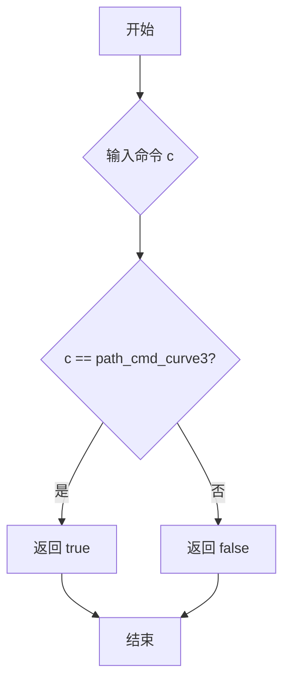

#### 带注释源码

```cpp
//---------------------------------------------------------------is_curve3
// 功能：检查给定的路径命令是否为三次贝塞尔曲线命令
// 参数：c - 无符号整数，表示路径命令值
// 返回值：布尔值，如果c等于path_cmd_curve3则返回true，否则返回false
inline bool is_curve3(unsigned c)
{
    return c == path_cmd_curve3;
}
```


### `agg::is_curve4`

该函数用于判断给定的路径命令标识符是否为四次贝塞尔曲线（curve4）命令，是AGG几何库中路径命令类型判断的辅助函数之一。

参数：

- `c`：`unsigned`，要检查的路径命令标识符

返回值：`bool`，如果传入的命令等于`path_cmd_curve4`（值为4），则返回`true`，否则返回`false`

#### 流程图

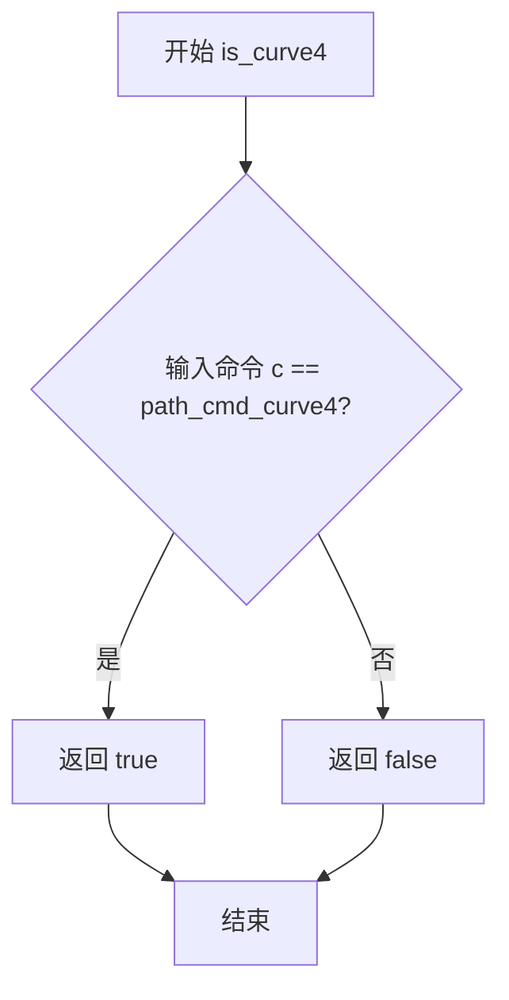

#### 带注释源码

```cpp
//---------------------------------------------------------------is_curve4
// 函数功能：判断给定的路径命令是否为四次贝塞尔曲线命令
// 参数：c - unsigned类型，表示路径命令标识符
// 返回值：bool类型，true表示命令是curve4，false表示不是
inline bool is_curve4(unsigned c)
{
    // path_cmd_curve4 是枚举值，定义为4
    // 该函数通过简单的等于比较来判断是否为curve4命令
    return c == path_cmd_curve4;
}
```


### `agg::is_end_poly`

该函数用于检查给定的路径命令值是否表示多边形的结束命令。它通过将命令值与掩码进行按位与运算，然后与结束多边形的命令常量进行比较来判断。

参数：

- `c`：`unsigned`，路径命令值，用于判断的原始命令值

返回值：`bool`，如果命令值是多边形的结束命令则返回 true，否则返回 false

#### 流程图

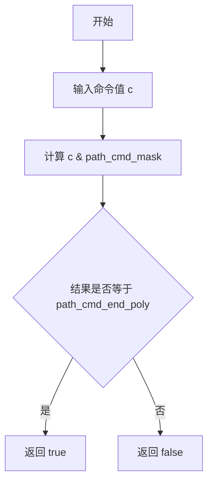

#### 带注释源码

```cpp
//-------------------------------------------------------------is_end_poly
// 检查给定的路径命令值是否为结束多边形命令
inline bool is_end_poly(unsigned c)
{
    // path_cmd_mask = 0x0F，用于提取命令的低4位
    // path_cmd_end_poly = 0x0F，表示结束多边形命令
    // 通过按位与运算提取命令类型部分，并与结束多边形命令比较
    return (c & path_cmd_mask) == path_cmd_end_poly;
}
```


### `agg::is_close`

该函数用于检查给定的路径命令标识符是否表示闭合多边形的结束命令。它通过清除方向标志（顺时针或逆时针）后与预定义的闭合结束命令进行比较来判断。

参数：

- `c`：`unsigned`，待检查的路径命令标识符

返回值：`bool`，如果命令是闭合多边形的结束命令（即去掉方向标志后等于 `path_cmd_end_poly | path_flags_close`），返回 true，否则返回 false

#### 流程图

```mermaid
flowchart TD
    A[开始 is_close] --> B[输入: unsigned c]
    B --> C[计算掩码: ~path_flags_cw | path_flags_ccw]
    C --> D[c & mask 清除方向标志]
    E[计算目标: path_cmd_end_poly | path_flags_close]
    D --> F{比较结果是否等于目标?}
    E --> F
    F -->|是| G[返回 true]
    F -->|否| H[返回 false]
    G --> I[结束]
    H --> I
```

#### 带注释源码

```cpp
//----------------------------------------------------------------is_close
// 检查给定的路径命令是否表示闭合多边形的结束命令
// 参数: c - 路径命令标识符，包含命令类型和标志位
// 返回: bool - 如果是闭合结束命令返回true，否则返回false
inline bool is_close(unsigned c)
{
    // 清除方向标志（顺时针CW和逆时针CCW）
    // path_flags_cw = 0x20, path_flags_ccw = 0x10
    // ~ (path_flags_cw | path_flags_ccw) = ~0x30 = 0xFFFFFFFFFFFFFFCF (在32位上为 0xFFFFFFCF)
    // 
    // path_cmd_end_poly = 0x0F (00001111)
    // path_flags_close = 0x40 (01000000)
    // 目标值 = 0x0F | 0x40 = 0x4F (01001111)
    //
    // 通过 & 运算清除方向标志，然后与目标值比较
    return (c & ~(path_flags_cw | path_flags_ccw)) ==
           (path_cmd_end_poly | path_flags_close); 
}
```

#### 相关常量说明

| 常量名称 | 值 | 描述 |
|---------|-----|------|
| `path_cmd_end_poly` | 0x0F | 结束多边形命令 |
| `path_flags_close` | 0x40 | 闭合标志 |
| `path_flags_cw` | 0x20 | 顺时针方向标志 |
| `path_flags_ccw` | 0x10 | 逆时针方向标志 |


### `agg.is_next_poly`

判断给定的路径命令码是否表示多边形的下一个起始点或结束点（即停止、移动到或结束多边形命令）。

参数：

- `c`：`unsigned`，路径命令码，用于判断该命令是否表示多边形的开始或结束

返回值：`bool`，如果参数 `c` 是停止命令(`path_cmd_stop`)、移动到命令(`path_cmd_move_to`)或结束多边形命令(`path_cmd_end_poly`)则返回 `true`，否则返回 `false`

#### 流程图

```mermaid
flowchart TD
    A[开始 is_next_poly] --> B[输入参数 c]
    B --> C{is_stop(c)?}
    C -->|Yes| D[返回 true]
    C -->|No| E{is_move_to(c)?}
    E -->|Yes| D
    E -->|No| F{is_end_poly(c)?}
    F -->|Yes| D
    F -->|No| G[返回 false]
    D --> H[结束]
    G --> H
```

#### 带注释源码

```cpp
//------------------------------------------------------------is_next_poly
// 判断给定命令是否表示多边形的下一个起始点或结束点
// 参数: c - 路径命令码
// 返回: bool - 如果是停止、移动到或结束多边形命令返回true
inline bool is_next_poly(unsigned c)
{
    // 综合判断：只要满足以下任一条件即返回true
    // 1. is_stop(c): 命令为path_cmd_stop，表示路径结束
    // 2. is_move_to(c): 命令为path_cmd_move_to，表示开始新路径/多边形
    // 3. is_end_poly(c): 命令为path_cmd_end_poly，表示多边形边界结束
    return is_stop(c) || is_move_to(c) || is_end_poly(c);
}
```


### `agg::is_cw`

该函数是 Anti-Grain Geometry (AGG) 库中的一个内联工具函数，用于检测给定的路径命令标志（path command flags）是否包含顺时针（Clockwise, CW）标志位。它通过位运算快速判断路径的方向性。

参数：

-  `c`：`unsigned`，表示路径命令标志，包含路径类型和方向标志（如 path_flags_cw、path_flags_ccw 等）

返回值：`bool`，如果参数 `c` 包含 `path_flags_cw`（即顺时针方向标志）则返回 `true`，否则返回 `false`

#### 流程图

```mermaid
flowchart TD
    A[开始 is_cw] --> B{检查标志位}
    B --> C[计算 c & path_flags_cw]
    C --> D{结果是否非零?}
    D -->|是| E[返回 true]
    D -->|否| F[返回 false]
```

#### 带注释源码

```cpp
//-------------------------------------------------------------------is_cw
// 函数名: is_cw
// 功能: 检查路径命令标志是否包含顺时针(CW)标志
// 参数: 
//   - c: unsigned类型, 路径命令标志值
//        该值包含路径类型(如path_cmd_move_to, path_cmd_line_to等)
//        以及方向标志(如path_flags_cw, path_flags_ccw, path_flags_close)
// 返回值: 
//   - bool: 如果c包含path_flags_cw标志返回true, 否则返回false
//-------------------------------------------------------------------is_cw
inline bool is_cw(unsigned c)
{
    // 使用位与运算检查c中是否包含path_flags_cw位
    // path_flags_cw定义在path_flags_e枚举中，值为0x20
    // 如果c与path_flags_cw的位与结果非零，说明设置了顺时针标志
    return (c & path_flags_cw) != 0;
}
```

#### 关联信息

- **相关枚举**：`path_flags_e`（定义在 agg_basics.hpp 中）
- **配合使用**：
  - `is_ccw(unsigned c)`：检查逆时针标志
  - `is_oriented(unsigned c)`：检查是否包含任意方向标志
  - `get_orientation(unsigned c)`：获取方向标志
  - `set_orientation(unsigned c, unsigned o)`：设置方向标志


### `agg::is_ccw`

该函数用于检查给定的路径命令标志（path command flags）是否包含逆时针方向（Counter-Clockwise, CCW）标志。这是AGG（Anti-Grain Geometry）库中判断多边形顶点顺序方向的基本工具函数。

参数：

- `c`：`unsigned`，路径命令标志，包含方向信息（CW或CCW）的标志位

返回值：`bool`，如果参数`c`包含`path_flags_ccw`标志（值为0x10），则返回`true`；否则返回`false`

#### 流程图

```mermaid
flowchart TD
    A[开始] --> B{检查 c & path_flags_ccw != 0}
    B -->|是| C[返回 true]
    B -->|否| D[返回 false]
    C --> E[结束]
    D --> E
```

#### 带注释源码

```cpp
//------------------------------------------------------------------is_ccw
// 函数：is_ccw
// 功能：检查路径命令标志是否包含逆时针方向(CW标志的相反方向)
// 参数：unsigned c - 路径命令标志，包含方向信息
// 返回：bool - 如果包含CCW标志返回true，否则返回false
inline bool is_ccw(unsigned c)
{
    // path_flags_ccw 定义为 0x10 (二进制: 00010000)
    // 通过按位与操作检查第5位是否被设置
    return (c & path_flags_ccw) != 0;
}
```

---

**补充说明**：

- `path_flags_ccw` 在代码中定义为 `0x10`（即 `path_flags_e` 枚举中的 `path_flags_ccw = 0x10`）
- 该函数通常与 `is_cw()` 函数配合使用，用于判断多边形的填充方向
- 这是AGG库中路径处理的基础工具函数，属于轻量级内联函数，无性能开销


### `agg::is_oriented`

该函数用于判断给定的路径命令是否包含方向标志（顺时针或逆时针）。如果路径命令中设置了 `path_flags_cw` 或 `path_flags_ccw` 标志，则返回 true，表示该路径具有明确的方向性。

参数：

-  `c`：`unsigned`，路径命令标识符，包含路径操作命令和标志位

返回值：`bool`，如果命令包含顺时针（path_flags_cw）或逆时针（path_flags_ccw）方向标志则返回 true，否则返回 false

#### 流程图

```mermaid
flowchart TD
    A[开始 is_oriented] --> B{检查参数 c}
    B --> C{按位与运算 c & (path_flags_cw | path_flags_ccw)}
    C --> D{结果是否不等于 0?}
    D -->|是| E[返回 true]
    D -->|否| F[返回 false]
    E --> G[结束]
    F --> G
    
    style C fill:#f9f,stroke:#333
    style E fill:#9f9,stroke:#333
    style F fill:#f99,stroke:#333
```

#### 带注释源码

```cpp
//-------------------------------------------------------------is_oriented
// 函数：is_oriented
// 功能：判断路径命令是否具有方向性（顺时针或逆时针）
// 参数：
//   c - unsigned类型的路径命令标识符
// 返回值：
//   bool - 如果设置了方向标志返回true，否则返回false
inline bool is_oriented(unsigned c)
{
    // path_flags_cw = 0x20 (0010 0000)
    // path_flags_ccw = 0x10 (0001 0000)
    // 组合标志 = 0x30 (0011 0000)
    // 检查c是否包含这两个方向标志中的任意一个
    return (c & (path_flags_cw | path_flags_ccw)) != 0; 
}
```


### `agg::is_closed`

该函数用于检查给定的路径命令是否包含关闭标志（path_flags_close），即判断一条路径是否已闭合。

参数：

- `c`：`unsigned`，路径命令/标志值

返回值：`bool`，如果路径命令包含关闭标志则返回 true，否则返回 false

#### 流程图

```mermaid
flowchart TD
    A[开始 is_closed] --> B{检查 c & path_flags_close != 0}
    B -->|是| C[返回 true]
    B -->|否| D[返回 false]
```

#### 带注释源码

```cpp
//---------------------------------------------------------------is_closed
// 检查路径命令是否包含关闭标志
inline bool is_closed(unsigned c)
{
    // 使用按位与操作检查 c 是否包含 path_flags_close 标志
    // path_flags_close 定义为 0x40
    // 如果 c 的对应位被设置，则返回 true，表示路径已关闭
    return (c & path_flags_close) != 0; 
}
```


### `agg::get_close_flag`

该函数用于从路径命令标识符中提取关闭标志（close flag），通过按位与操作获取路径命令中的闭合状态信息。

参数：

- `c`：`unsigned`，路径命令标识符（path command），包含命令类型和标志信息

返回值：`unsigned`，返回路径命令中的关闭标志（`path_flags_close`，值为 0x40）

#### 流程图

```mermaid
flowchart TD
    A[开始] --> B[输入: 路径命令标识符 c]
    B --> C{执行按位与操作}
    C --> D[c & path_flags_close]
    D --> E[返回结果]
    E --> F[结束]
    
    style C fill:#f9f,stroke:#333
    style D fill:#ff9,stroke:#333
```

#### 带注释源码

```cpp
//----------------------------------------------------------get_close_flag
// 该函数从路径命令标识符中提取关闭标志
// 参数: c - 路径命令标识符，包含命令类型和标志位
// 返回: 关闭标志（path_flags_close = 0x40）
inline unsigned get_close_flag(unsigned c)
{
    return c & path_flags_close;  // 使用按位与操作提取关闭标志位
}
```

#### 相关上下文信息

- **所在命名空间**：`agg`
- **定义位置**：约在代码的第 310 行附近（在 `agg_basics.h` 头文件中）
- **关联枚举**：
  - `path_flags_e` 枚举中的 `path_flags_close = 0x40`
  - 用于判断路径是否闭合
- **配套函数**：
  - `is_close(unsigned c)` - 判断是否为闭合路径
  - `is_closed(unsigned c)` - 检查关闭标志位是否设置
  - `clear_orientation(unsigned c)` - 清除方向标志
  - `get_orientation(unsigned c)` - 获取方向标志
  - `set_orientation(unsigned c, unsigned o)` - 设置方向标志


### `agg::clear_orientation`

清除路径命令中的方向标志（顺时针或逆时针），返回只保留路径命令而清除方向标志的新值。

参数：

- `c`：`unsigned`，包含路径命令和方向标志的无符号整数

返回值：`unsigned`，清除方向标志后的路径命令和标志值

#### 流程图

```mermaid
flowchart TD
    A["开始<br>输入: unsigned c"] --> B["计算 ~path_flags_cw | path_flags_ccw"]
    B --> C["执行按位与运算<br>c & ~(path_flags_cw | path_flags_ccw)"]
    C --> D["返回结果<br>清除方向标志的值"]
```

#### 带注释源码

```cpp
//-------------------------------------------------------clear_orientation
// 功能：清除路径命令中的方向标志（顺时针path_flags_cw或逆时针path_flags_ccw）
// 参数：c - 包含路径命令和标志的无符号整数
// 返回值：unsigned - 清除方向标志后的路径命令和标志值
inline unsigned clear_orientation(unsigned c)
{
    // 使用按位与操作清除方向标志位
    // path_flags_cw = 0x20 (0010 0000)
    // path_flags_ccw = 0x10 (0001 0000)
    // ~(path_flags_cw | path_flags_ccw) = ~(0011 0000) = 1100 1111
    // 通过与运算清除bit4和bit5（方向标志位）
    return c & ~(path_flags_cw | path_flags_ccw);
}
```


### `agg::get_orientation`

该函数用于从路径命令标志中提取方向信息（顺时针或逆时针），通过按位与操作获取 `path_flags_cw` 或 `path_flags_ccw` 标志位。

参数：

-  `c`：`unsigned`，路径命令标志，包含方向信息

返回值：`unsigned`，返回方向标志（`path_flags_cw` 或 `path_flags_ccw`）

#### 流程图

```mermaid
flowchart TD
    A[开始 get_orientation] --> B[输入: 无符号整数 c]
    B --> C[执行按位与运算: c & (path_flags_cw | path_flags_ccw)]
    C --> D[提取方向标志位]
    D --> E[返回方向标志 unsigned]
    E --> F[结束]
    
    style C fill:#f9f,stroke:#333
    style D fill:#bbf,stroke:#333
```

#### 带注释源码

```cpp
//---------------------------------------------------------get_orientation
// 功能：从路径命令标志中提取方向信息（顺时针或逆时针）
// 参数：c - 包含方向标志的路径命令
// 返回：方向标志 (path_flags_cw = 0x20 或 path_flags_ccw = 0x10)
inline unsigned get_orientation(unsigned c)
{
    // 使用按位与运算提取方向标志位
    // path_flags_cw = 0x20 (0010 0000) - 顺时针标志
    // path_flags_ccw = 0x10 (0001 0000) - 逆时针标志
    // 组合后: 0x30 (0011 0000)，用于提取方向位
    return c & (path_flags_cw | path_flags_ccw);
}
```


### `agg::set_orientation`

设置路径命令的方向（顺时针或逆时针），通过清除原有方向标志并组合新的方向标志来更新路径命令。

参数：

- `c`：`unsigned`，路径命令标识，包含现有命令和方向信息
- `o`：`unsigned`，方向标志，指定要设置的方向（`path_flags_cw` 或 `path_flags_ccw`）

返回值：`unsigned`，返回更新后的路径命令标识

#### 流程图

```mermaid
flowchart TD
    A[开始 set_orientation] --> B[输入: 命令c, 方向o]
    B --> C[调用 clear_orientation(c)]
    C --> D[清除c中的方向标志 CW/CCW]
    D --> E[将清除方向后的命令与o进行按位或运算]
    E --> F[返回更新后的命令]
```

#### 带注释源码

```cpp
//---------------------------------------------------------set_orientation
// 设置路径命令的方向标志
// 参数: c - 原始路径命令, o - 要设置的方向标志
// 返回: 带有新方向标志的路径命令
inline unsigned set_orientation(unsigned c, unsigned o)
{
    // 先清除原有的方向标志(CW或CCW),然后按位或上新的方向标志o
    return clear_orientation(c) | o;
}
```


### `agg::intersect_rectangles<Rect>`

该函数是一个模板函数，用于计算两个矩形（Rect）的交集（intersection），通过比较两个矩形的边界坐标，返回一个新的矩形，其边界为两个矩形边界的交集。

参数：

- `r1`：`const Rect&`，第一个参与交集计算的矩形
- `r2`：`const Rect&`，第二个参与交集计算的矩形

返回值：`Rect`，返回两个矩形的交集区域，如果两个矩形不相交，返回的矩形可能无效（需要调用方自行检查 `is_valid()`）

#### 流程图

```mermaid
flowchart TD
    A[开始 intersect_rectangles] --> B[复制 r1 到 r 作为结果矩形]
    B --> C{当前右边界 r.x2 > r2.x2?}
    C -->|是| D[r.x2 = r2.x2]
    C -->|否| E{当前下边界 r.y2 > r2.y2?}
    D --> E
    E -->|是| F[r.y2 = r2.y2]
    E -->|否| G{当前左边界 r.x1 < r2.x1?}
    F --> G
    G -->|是| H[r.x1 = r2.x1]
    G -->|否| I{当前上边界 r.y1 < r2.y1?}
    H --> I
    I -->|是| J[r.y1 = r2.y1]
    I -->|否| K[返回结果矩形 r]
    J --> K
```

#### 带注释源码

```cpp
//-----------------------------------------------------intersect_rectangles
// 计算两个矩形的交集（intersection）
// 模板参数 Rect 必须包含 x1, y1, x2, y2 四个坐标属性
//-----------------------------------------------------
template<class Rect> 
inline Rect intersect_rectangles(const Rect& r1, const Rect& r2)
{
    // 复制第一个矩形作为结果的基础
    Rect r = r1;

    // 首先处理 x2, y2 因为其他顺序 
    // 在 Microsoft Visual C++ .NET 2003 69462-335-0000007-18038 
    // "Maximize Speed" 优化选项下会导致内部编译器错误。
    //-----------------
    
    // 如果当前右边界大于第二个矩形的右边界，则缩小右边界
    if(r.x2 > r2.x2) r.x2 = r2.x2; 
    
    // 如果当前下边界大于第二个矩形的下边界，则缩小下边界
    if(r.y2 > r2.y2) r.y2 = r2.y2;
    
    // 如果当前左边界小于第二个矩形的左边界，则扩大左边界
    if(r.x1 < r2.x1) r.x1 = r2.x1;
    
    // 如果当前上边界小于第二个矩形的上边界，则扩大上边界
    if(r.y1 < r2.y1) r.y1 = r2.y1;
    
    // 返回交集后的矩形
    return r;
}
```


### `agg::unite_rectangles<Rect>(const Rect&, const Rect&)`

该函数是一个模板函数，用于计算两个矩形的并集（Union），即合并两个矩形并返回能够包含这两个矩形所有点的最小边界矩形。

参数：

- `r1`：`const Rect&`，第一个输入矩形
- `r2`：`const Rect&`，第二个输入矩形

返回值：`Rect`，返回包含两个输入矩形的最小边界矩形（并集矩形）

#### 流程图

```mermaid
flowchart TD
    A[开始] --> B[复制r1到临时变量r]
    B --> C{r.x2 < r2.x2?}
    C -->|是| D[r.x2 = r2.x2]
    C -->|否| E{r.y2 < r2.y2?}
    D --> E
    E -->|是| F[r.y2 = r2.y2]
    E -->|否| G{r.x1 > r2.x1?}
    F --> G
    G -->|是| H[r.x1 = r2.x1]
    G -->|否| I{r.y1 > r2.y1?}
    H --> I
    I -->|是| J[r.y1 = r2.y1]
    I -->|否| K[返回r]
    J --> K
```

#### 带注释源码

```cpp
//---------------------------------------------------------unite_rectangles
// 模板函数：计算两个矩形的并集（边界矩形）
// template<class Rect> 表示这是一个函数模板，Rect类型参数由调用时推断
template<class Rect> 
inline Rect unite_rectangles(const Rect& r1, const Rect& r2)
{
    // 步骤1：将第一个矩形r1复制到临时变量r中，作为结果的初始值
    Rect r = r1;

    // 步骤2：扩展右边界（x2）
    // 如果r的右边界小于r2的右边界，则扩展r的右边界到r2的右边界
    if(r.x2 < r2.x2) r.x2 = r2.x2;

    // 步骤3：扩展下边界（y2）
    // 如果r的下边界小于r2的下边界，则扩展r的下边界到r2的下边界
    if(r.y2 < r2.y2) r.y2 = r2.y2;

    // 步骤4：扩展左边界（x1）
    // 如果r的左边界大于r2的左边界，则扩展r的左边界到r2的左边界
    if(r.x1 > r2.x1) r.x1 = r2.x1;

    // 步骤5：扩展上边界（y1）
    // 如果r的上边界大于r2的上边界，则扩展r的上边界到r2的上边界
    if(r.y1 > r2.y1) r.y1 = r2.y1;

    // 步骤6：返回合并后的矩形
    // 返回的矩形是包含r1和r2所有点的最小矩形
    return r;
}
```


### `agg::is_equal_eps`

这是一个模板函数，用于比较两个数值是否在指定的epsilon（误差范围）内相等，常用于浮点数的近似相等判断。

参数：

- `v1`：`T`，第一个要比较的数值
- `v2`：`T`，第二个要比较的数值
- `epsilon`：`T`，允许的误差/容忍度范围

返回值：`bool`，如果两个值的差的绝对值小于等于epsilon返回true，否则返回false

#### 流程图

```mermaid
flowchart TD
    A[开始] --> B[计算差值: v1 - v2]
    B --> C[取绝对值: fabs&#40;v1 - v2&#41;]
    C --> D{绝对值 <= epsilon?}
    D -->|是| E[返回 true]
    D -->|否| F[返回 false]
    E --> G[结束]
    F --> G
```

#### 带注释源码

```cpp
//------------------------------------------------------------is_equal_eps
// 模板函数：比较两个值是否在epsilon范围内相等
// 参数：
//   v1      - 第一个要比较的值
//   v2      - 第二个要比较的值
//   epsilon - 允许的误差范围
// 返回值：
//   bool    - 如果两个值的差的绝对值小于等于epsilon返回true，否则返回false
template<class T> inline bool is_equal_eps(T v1, T v2, T epsilon)
{
    // 计算两个值的差的绝对值，并与epsilon进行比较
    // 使用double类型进行转换以确保计算的精度
    return fabs(v1 - v2) <= double(epsilon);
}
```


### `pod_allocator<T>::allocate`

该方法是一个静态模板方法，用于分配指定数量的 T 类型对象的数组内存，并返回指向该内存块的指针。

参数：

- `num`：`unsigned`，要分配的元素数量

返回值：`T*`，返回指向新分配的 T 类型数组的指针，若分配失败则抛出 `std::bad_alloc` 异常

#### 流程图

```mermaid
flowchart TD
    A[开始 allocate] --> B{接收 num}
    B --> C[使用 new T[num] 分配内存]
    C --> D[返回分配内存的指针]
    D --> E[结束]
    
    style C fill:#e1f5fe
    style D fill:#e1f5fe
```

#### 带注释源码

```cpp
//----------------------------------------------------------------------------
// Anti-Grain Geometry - Version 2.4
// pod_allocator 模板结构体 - 用于分配 POD（Plain Old Data）类型对象的内存
//----------------------------------------------------------------------------
template<class T> struct pod_allocator
{
    //-------------------------------------------------------------------------
    // 分配 num 个 T 类型对象的数组
    //-------------------------------------------------------------------------
    // 参数:
    //   num - unsigned 类型, 指定要分配的元素数量
    // 返回值:
    //   T* 类型, 指向新分配的数组首元素的指针
    //         如果分配失败, C++ 会抛出 std::bad_alloc 异常
    // 说明:
    //   使用 new[] 分配内存, 不会调用 T 的构造函数
    //   (POD 类型不需要构造函数)
    //-------------------------------------------------------------------------
    static T*   allocate(unsigned num)       
    { 
        return new T [num];   // 分配 num 个 T 对象的数组并返回指针
    }
    
    //-------------------------------------------------------------------------
    // 释放之前分配的内存
    //-------------------------------------------------------------------------
    // 参数:
    //   ptr - T* 类型, 要释放的内存指针
    //   unsigned - 块大小(此实现中未使用)
    //-------------------------------------------------------------------------
    static void deallocate(T* ptr, unsigned) 
    { 
        delete [] ptr;        // 使用 delete[] 释放数组内存
    }
};
```


### `pod_allocator<T>::deallocate`

该函数是pod_allocator模板类的静态成员方法，用于释放先前分配的数组内存。它接收一个指向待释放内存的指针和块大小（虽然在此实现中未使用），然后使用delete[]运算符释放内存。

参数：

- `ptr`：`T*`，指向需要释放的内存块的指针
- `unsigned`（参数名在源码中省略，仅作为占位符）：`unsigned`，已分配内存块的元素数量（此实现中未使用）

返回值：`void`，无返回值

#### 流程图

```mermaid
flowchart TD
    A[开始 deallocate] --> B{检查指针是否有效}
    B -->|有效| C[执行 delete[] ptr]
    B -->|空指针| D[无操作]
    C --> E[结束]
    D --> E
```

#### 带注释源码

```cpp
// pod_allocator 模板结构体，用于管理 POD（Plain Old Data）类型对象的内存分配
// 策略是所有 AGG 容器和一般内存分配策略不需要显式构造分配的数据
// 这意味着分配器可以非常简单；甚至可以用 malloc/free 替换 new/delete
// 在这种情况下不会调用构造函数和析构函数，但一切仍能正常工作
// deallocate() 的第二个参数是分配块的大小，如果需要可以使用此信息
//------------------------------------------------------------pod_allocator
template<class T> struct pod_allocator
{
    // 分配 num 个 T 类型对象的数组
    // 返回指向新分配内存的指针
    static T*   allocate(unsigned num)       
    { 
        return new T [num]; 
    }
    
    // 释放先前分配的数组内存
    // 参数 ptr: 指向待释放内存的指针
    // 参数 unsigned: 块大小（此实现中未使用，符合 AGG 策略）
    // 使用 delete[] 释放数组内存，确保调用每个元素的析构函数
    static void deallocate(T* ptr, unsigned) 
    { 
        delete [] ptr;      
    }
};
```


### `obj_allocator<T>.allocate()`

该函数是 AGG (Anti-Grain Geometry) 库中对象分配器的静态方法，用于分配单个类型为 T 的对象内存空间。它使用 C++ 的 `new` 操作符进行内存分配，不接受任何参数，返回指向新分配对象的指针。

参数：
- （无参数）

返回值：`T*`，返回新分配的 T 类型对象的指针

#### 流程图

```mermaid
flowchart TD
    A[开始 allocate] --> B{调用 new T}
    B --> C[分配内存并构造对象]
    C --> D[返回对象指针]
    D --> E[结束]
```

#### 带注释源码

```cpp
//------------------------------------------------------------obj_allocator
// 对象分配器模板结构体
// 用于分配单个对象而非对象数组，与 pod_allocator（ POD 类型数组分配器）区别开来
//------------------------------------------------------------obj_allocator
template<class T> struct obj_allocator
{
    // 分配单个对象
    // 使用 new T 进行内存分配，会调用 T 的构造函数
    // 返回指向新分配对象的指针
    static T*   allocate()         { return new T; }
    
    // 释放单个对象
    // 使用 delete 释放内存，会调用 T 的析构函数
    static void deallocate(T* ptr) { delete ptr;   }
};
```

#### 关键设计说明

| 项目 | 说明 |
|------|------|
| **设计目标** | 提供简单但符合 AGG 内存分配策略的单一对象分配机制 |
| **与 pod_allocator 的区别** | pod_allocator 使用 `new T[num]` 分配数组，不调用构造函数；obj_allocator 分配单个对象，会调用构造函数 |
| **线程安全性** | 非线程安全，调用底层的 `new` 操作符 |
| **错误处理** | 依赖 C++ 标准的 `new` 行为，内存分配失败时抛出 `std::bad_alloc` 异常 |
| **优化建议** | 可考虑使用内存池（memory pool）来减少碎片和提高性能 |


### `obj_allocator<T>.deallocate`

释放单个对象的内存空间，使用 delete 运算符销毁对象并释放其内存。

参数：

- `ptr`：`T*`，指向需要释放的对象的指针

返回值：`void`，无返回值

#### 流程图

```mermaid
flowchart TD
    A[开始 deallocate] --> B{ptr 是否为空?}
    B -->|是| C[直接返回]
    B -->|否| D[执行 delete ptr]
    D --> E[结束]
```

#### 带注释源码

```cpp
// 单对象分配器模板结构体
// 用于分配和释放单个对象，与 pod_allocator（数组分配器）不同，
// obj_allocator 会调用对象的构造函数和析构函数
template<class T> struct obj_allocator
{
    // 分配单个对象
    // 返回值：指向新分配对象的指针
    static T*   allocate()         { return new T; }
    
    // 释放单个对象
    // 参数 ptr：指向需要释放的对象的指针
    // 行为：调用 delete 运算符销毁对象并释放内存
    // 注意：如果 ptr 为空指针，delete 操作是安全的（no-op）
    static void deallocate(T* ptr) { delete ptr;   }
};
```


### `saturation<Limit>::iround`

该函数是一个模板结构体的静态方法，用于将浮点数四舍五入到指定的范围内。如果输入值超过上限或下限，则返回对应的边界值；否则调用标准的 `agg::iround` 函数进行四舍五入。

参数：

- `v`：`double`，需要进行四舍五入处理的浮点数值

返回值：`int`，四舍五入后的整数值，且结果会被限制在 [-Limit, Limit] 范围内

#### 流程图

```mermaid
flowchart TD
    A[开始] --> B{v < -Limit?}
    B -- 是 --> C[返回 -Limit]
    B -- 否 --> D{v > Limit?}
    D -- 是 --> E[返回 Limit]
    D -- 否 --> F[调用 agg::iround]
    F --> G[返回结果]
    C --> H[结束]
    E --> H
    G --> H
```

#### 带注释源码

```cpp
//---------------------------------------------------------------saturation
template<int Limit> struct saturation
{
    // 饱和四舍五入函数，将结果限制在 [-Limit, Limit] 范围内
    AGG_INLINE static int iround(double v)
    {
        // 如果值小于下限，返回下限
        if(v < double(-Limit)) return -Limit;
        
        // 如果值大于上限，返回上限
        if(v > double( Limit)) return  Limit;
        
        // 否则调用标准的 agg::iround 进行四舍五入
        return agg::iround(v);
    }
};
```


### `mul_one<Shift>.static mul`

该方法是一个模板结构体的静态成员函数，通过位运算实现高效的整数乘法运算，常用于亚像素坐标的快速缩放计算，避免使用浮点数带来的性能开销。

参数：

- `a`：`unsigned`，第一个无符号整数乘数
- `b`：`unsigned`，第二个无符号整数乘数

返回值：`unsigned`，返回经过移位舍入后的乘法结果

#### 流程图

```mermaid
flowchart TD
    A[开始 mul 方法] --> B[输入参数 a 和 b]
    B --> C[计算 1 << (Shift-1) 作为舍入因子]
    C --> D[计算 q = a * b + 舍入因子]
    D --> E[计算 q >> Shift]
    E --> F[计算 q + (q >> Shift)]
    F --> G[最终右移 Shift 位: (q + (q >> Shift)) >> Shift]
    G --> H[返回结果]
```

#### 带注释源码

```cpp
//------------------------------------------------------------------mul_one
// 模板结构体：通过位运算实现高效的整数乘法（用于亚像素缩放）
template<unsigned Shift> struct mul_one
{
    // 静态乘法方法：使用移位和加法实现乘法和舍入
    // 参数：
    //   a - 第一个乘数（无符号整数）
    //   b - 第二个乘数（无符号整数）
    // 返回值：舍入后的乘积结果（无符号整数）
    AGG_INLINE static unsigned mul(unsigned a, unsigned b)
    {
        // 步骤1：计算基本乘积 a * b
        // 步骤2：加上 2^(Shift-1) 作为舍入因子，实现四舍五入
        //        Shift 通常为 8（对应 256 级别），所以这里加 128
        unsigned q = a * b + (1 << (Shift-1));
        
        // 步骤3：(q + q>>Shift) >> Shift
        //        这是一个高效的除以 2^Shift 的方法，同时包含舍入
        //        q >> Shift 相当于 q / 2^Shift
        //        加上这个值后再右移，实现四舍五入除法
        return (q + (q >> Shift)) >> Shift;
    }
};
```


### `rect_base<T>.init`

该方法用于初始化矩形对象的四个边界坐标值（x1, y1, x2, y2），是矩形类最基础的核心方法之一。

参数：

- `x1_`：T，矩形左上角的 X 坐标
- `y1_`：T，矩形左上角的 Y 坐标
- `x2_`：T，矩形右下角的 X 坐标
- `y2_`：T，矩形右下角的 Y 坐标

返回值：`void`，无返回值

#### 流程图

```mermaid
graph TD
    A[开始 init] --> B[接收四个坐标参数 x1_, y1_, y1_, y2_]
    B --> C[将 x1_ 赋值给 x1]
    C --> D[将 y1_ 赋值给 y1]
    D --> E[将 x2_ 赋值给 x2]
    E --> F[将 y2_ 赋值给 y2]
    F --> G[结束]
```

#### 带注释源码

```cpp
//----------------------------------------------------------------------------
// Anti-Grain Geometry - Version 2.4
// Copyright (C) 2002-2005 Maxim Shemanarev (http://www.antigrain.com)
//
// Permission to copy, use, modify, sell and distribute this software 
// is granted provided this copyright notice appears in all copies. 
// This software is provided "as is" without express or implied
// warranty, and with no claim as to its suitability for any purpose.
//
//----------------------------------------------------------------------------
// Contact: mcseem@antigrain.com
//          mcseemagg@yahoo.com
//          http://www.antigrain.com
//----------------------------------------------------------------------------

#ifndef AGG_BASICS_INCLUDED
#define AGG_BASICS_INCLUDED

#include <math.h>
#include "agg_config.h"

// ... (前面的代码省略)

//------------------------------------------------------------------rect_base
// rect_base 是一个模板结构体，用于表示矩形区域
// 包含四个坐标值：x1, y1, x2, y2
template<class T> struct rect_base
{
    // 定义类型别名
    typedef T            value_type;      // 坐标值的类型
    typedef rect_base<T> self_type;       // 自身的类型
    
    // 矩形的四个边界坐标
    T x1, y1, x2, y2;                     // x1:左上X, y1:左上Y, x2:右下X, y2:右下Y

    // 默认构造函数
    rect_base() {}

    // 带参数的构造函数，直接初始化四个坐标
    rect_base(T x1_, T y1_, T x2_, T y2_) :
        x1(x1_), y1(y1_), x2(x2_), y2(y2_) {}

    // init 方法：初始化/重置矩形的四个坐标值
    // 参数：
    //   x1_: 矩形左上角的 X 坐标
    //   y1_: 矩形左上角的 Y 坐标
    //   x2_: 矩形右下角的 X 坐标
    //   y2_: 矩形右下角的 Y 坐标
    // 返回值：无 (void)
    void init(T x1_, T y1_, T x2_, T y2_) 
    {
        // 将参数值赋给成员变量
        x1 = x1_; y1 = y1_; x2 = x2_; y2 = y2_; 
    }

    // ... (后续其他方法省略)
};

//-----------------------------------------------------intersect_rectangles
// ... (后续代码省略)

#endif
```


### `rect_base<T>.normalize()`

该方法用于规范化矩形坐标，确保左上角坐标(x1, y1)小于等于右下角坐标(x2, y2)。如果发现x1>x2或y1>y2，则交换相应的坐标值，从而保证矩形始终是有效的。

参数：此方法无参数。

返回值：`const self_type&`，返回规范后的矩形自身引用，便于链式调用。

#### 流程图

```mermaid
flowchart TD
    A[开始 normalize] --> B{检查 x1 > x2?}
    B -- 是 --> C[交换 x1 和 x2]
    B -- 否 --> D{检查 y1 > y2?}
    C --> D
    D -- 是 --> E[交换 y1 和 y2]
    D -- 否 --> F[返回 *this]
    E --> F
    F[结束]
```

#### 带注释源码

```cpp
const self_type& normalize()
{
    T t;  // 用于交换的临时变量
    
    // 如果左边界大于右边界，则交换两者
    if(x1 > x2) { t = x1; x1 = x2; x2 = t; }
    
    // 如果上边界大于下边界，则交换两者
    if(y1 > y2) { t = y1; y1 = y2; y2 = t; }
    
    // 返回对自身的引用，支持链式调用
    return *this;
}
```


### `rect_base<T>.clip()`

该方法用于将当前矩形裁剪到指定矩形 `r` 的边界范围内，通过比较并调整矩形的 x1、y1、x2、y2 四个边界，使得裁剪后的矩形完全位于参数矩形 `r` 内部，并返回裁剪结果是否有效。

参数：
- `r`：`const self_type&`（即 `const rect_base<T>&`），用于裁剪的参考矩形（裁剪框）

返回值：`bool`，如果裁剪后矩形仍然有效（x1 <= x2 且 y1 <= y2）返回 true，否则返回 false

#### 流程图

```mermaid
flowchart TD
    A[开始 clip] --> B{接收参数 r}
    B --> C{x2 > r.x2?}
    C -->|是| D[x2 = r.x2]
    C -->|否| E{y2 > r.y2?}
    D --> E
    E -->|是| F[y2 = r.y2]
    E -->|否| G{x1 < r.x1?}
    F --> G
    G -->|是| H[x1 = r.x1]
    G -->|否| I{y1 < r.y1?}
    H --> I
    I -->|是| J[y1 = r.y1]
    I -->|否| K{检查有效性}
    J --> K
    K --> L{x1 <= x2 && y1 <= y2}
    L -->|是| M[返回 true]
    L -->|否| N[返回 false]
```

#### 带注释源码

```cpp
// 裁剪矩形到指定矩形 r 的边界范围内
// 参数: r - 用于裁剪的参考矩形
// 返回: bool - 裁剪后矩形是否有效
bool clip(const self_type& r)
{
    // 如果当前矩形的右边界大于参考矩形的右边界，则缩小右边界
    if(x2 > r.x2) x2 = r.x2;
    
    // 如果当前矩形的下边界大于参考矩形的下边界，则缩小下边界
    if(y2 > r.y2) y2 = r.y2;
    
    // 如果当前矩形的左边界小于参考矩形的左边界，则扩大左边界
    if(x1 < r.x1) x1 = r.x1;
    
    // 如果当前矩形的上边界小于参考矩形的上边界，则扩大上边界
    if(y1 < r.y1) y1 = r.y1;
    
    // 返回裁剪结果：如果左边界 <= 右边界 且 上边界 <= 下边界，则矩形有效
    return x1 <= x2 && y1 <= y2;
}
```


### `rect_base<T>.is_valid()`

该方法是一个模板类成员函数，用于检查矩形对象的几何有效性，通过比较左上角坐标(x1, y1)与右下角坐标(x2, y2)的大小关系来判定矩形是否有效。

参数：（无显式参数，const成员函数隐式接收this指针）

返回值：`bool`，返回true表示矩形有效（x1 <= x2 且 y1 <= y2），返回false表示矩形无效

#### 流程图

```mermaid
flowchart TD
    A[开始 is_valid] --> B{检查 x1 <= x2}
    B -->|是| C{检查 y1 <= y2}
    B -->|否| D[返回 false]
    C -->|是| E[返回 true]
    C -->|否| D
```

#### 带注释源码

```cpp
// 检查矩形是否有效
// 有效条件：x1 <= x2 且 y1 <= y2（即左边界不超过右边界，上边界不超过下边界）
bool is_valid() const
{
    // 同时检查x坐标和y坐标的大小关系
    // x1 <= x2 确保左边界在右边界的左侧或重合
    // y1 <= y2 确保上边界在下边界的上方或重合
    return x1 <= x2 && y1 <= y2;
}
```


### `rect_base<T>.hit_test`

该方法用于检测给定点是否位于矩形区域内（包括边界）。通过比较点的坐标与矩形的边界坐标，判断点是否在矩形内部。

参数：

- `x`：`T`，测试点的X坐标
- `y`：`T`，测试点的Y坐标

返回值：`bool`，如果点(x, y)在矩形内（包括边界）返回true，否则返回false

#### 流程图

```mermaid
flowchart TD
    A[开始 hit_test] --> B{检查 x >= x1}
    B -->|是| C{检查 x <= x2}
    B -->|否| H[返回 false]
    C -->|是| D{检查 y >= y1}
    C -->|否| H
    D -->|是| E{检查 y <= y2}
    D -->|否| H
    E -->|是| F[返回 true]
    E -->|否| H
```

#### 带注释源码

```cpp
// hit_test: 检测点(x, y)是否在矩形区域内（包括边界）
// 参数:
//   x - 测试点的X坐标
//   y - 测试点的Y坐标
// 返回值:
//   bool - 点在矩形内返回true，否则返回false
bool hit_test(T x, T y) const
{
    // 检查点的X坐标是否在矩形X边界范围内
    // 检查点的Y坐标是否在矩形Y边界范围内
    // 只有当两个坐标都满足条件时才返回true
    return (x >= x1 && x <= x2 && y >= y1 && y <= y2);
}
```


### `rect_base<T>.overlaps()`

检查当前矩形与另一个矩形是否在空间上发生重叠，通过比较两个矩形的边界坐标来确定是否存在重叠区域。

参数：

- `r`：`const self_type&`，要检查重叠的另一个矩形（类型为 `rect_base<T>` 的常量引用）

返回值：`bool`，返回 `true` 表示两个矩形存在重叠区域，返回 `false` 表示两个矩形不相交

#### 流程图

```mermaid
flowchart TD
    A[开始 overlaps 检查] --> B{输入矩形r的左边界 > 当前矩形右边界?}
    B -->|是| C[返回 false - 不重叠]
    B -->|否| D{输入矩形r的右边界 < 当前矩形左边界?}
    D -->|是| C
    D -->|否| E{输入矩形r的上边界 > 当前矩形下边界?}
    E -->|是| C
    E -->|否| F{输入矩形r的下边界 < 当前矩形上边界?}
    F -->|是| C
    F -->|否| G[返回 true - 重叠]
```

#### 带注释源码

```cpp
// 检查两个矩形是否重叠的成员函数
// 参数: r - 要进行比较的另一个矩形（rect_base<T>类型）
// 返回: bool - 如果两个矩形有任何重叠区域返回true，否则返回false
bool overlaps(const self_type& r) const
{
    // 使用反向逻辑判断：如果满足以下任一条件，则两个矩形不相交
    // 1. 对方矩形的左边界 > 当前矩形的右边界（对方在右侧）
    // 2. 对方矩形的右边界 < 当前矩形的左边界（对方在左侧）
    // 3. 对方矩形的上边界 > 当前矩形的下边界（对方在下侧）
    // 4. 对方矩形的下边界 < 当前矩形的上边界（对方在上侧）
    // 如果以上条件都不满足，说明两个矩形有重叠区域
    return !(r.x1 > x2 || r.x2 < x1
          || r.y1 > y2 || r.y2 < y1);
}
```

## 关键组件


### pod_allocator

 POD类型内存分配器模板，支持简单的数组内存分配和释放，不调用构造函数和析构函数，适用于AGG容器和一般内存分配策略。

### obj_allocator

 单对象内存分配器模板，负责单个对象的分配和释放，会调用构造函数和析构函数。

### 基本类型别名

 agg命名空间下的基本整数类型别名，包括int8、int8u、int16、int16u、int32、int32u、int64、int64u，用于跨平台兼容性。

### 数学舍入函数

 包括iround、uround、ifloor、ufloor、iceil、uceil等函数，提供不同平台下的高效浮点数到整数的转换实现，支持汇编优化。

### saturation

 饱和运算模板结构，用于将数值限制在指定范围内，常用于图像处理中的颜色值裁剪。

### mul_one

 乘法优化模板结构，使用位移和加法实现高效的定点数乘法，避免浮点运算开销。

### cover_type

 覆盖类型别名（unsigned char），用于表示抗锯齿渲染中的覆盖值，支持256级覆盖等级。

### cover_scale_e

 覆盖比例枚举常量，定义cover_shift=8、cover_size=256、cover_mask=255等，用于抗锯齿渲染的覆盖计算。

### poly_subpixel_scale_e

 多边形子像素比例枚举常量，定义subpixel_shift=8和subpixel_scale=256，用于提高矢量图形渲染的精度。

### filling_rule_e

 填充规则枚举，包括fill_non_zero和fill_even_odd两种，用于确定多边形的填充方式。

### pi

 数学常量π的双精度浮点值，精确到15位小数。

### deg2rad

 角度转弧度函数，将角度值转换为弧度值。

### rad2deg

 弧度转角度函数，将弧度值转换为角度值。

### rect_base

 矩形基类模板，存储矩形的四个坐标(x1, y1, x2, y2)，提供normalize、clip、is_valid、hit_test、overlaps等操作方法。

### intersect_rectangles

 矩形相交运算函数模板，计算两个矩形的交集区域。

### unite_rectangles

 矩形合并运算函数模板，计算两个矩形的并集区域。

### path_commands_e

 路径命令枚举，定义path_cmd_stop、path_cmd_move_to、path_cmd_line_to、path_cmd_curve3、path_cmd_curve4等路径操作命令。

### path_flags_e

 路径标志枚举，定义path_flags_ccw、path_flags_cw、path_flags_close等标志，用于表示路径的方向和闭合状态。

### 路径判断函数群

 包括is_vertex、is_drawing、is_stop、is_move_to、is_line_to、is_curve、is_curve3、is_curve4、is_end_poly、is_close、is_next_poly、is_cw、is_ccw、is_oriented、is_closed等函数，用于判断路径命令的类型和属性。

### get_close_flag

 获取路径闭合标志的函数。

### clear_orientation

 清除路径方向标志的函数。

### get_orientation

 获取路径方向标志的函数。

### set_orientation

 设置路径方向标志的函数。

### point_base

 点基类模板，存储二维坐标(x, y)，提供基本的点数据结构和构造函数。

### vertex_base

 顶点基类模板，存储顶点坐标(x, y)和命令(cmd)，用于描述路径顶点。

### row_info

 行信息模板结构，存储扫描线的起始列(x1)、结束列(x2)和像素指针(ptr)，用于图像扫描线处理。

### const_row_info

 常量行信息模板结构，与row_info类似但指针为常量指针，用于只读扫描线访问。

### is_equal_eps

 容差相等比较函数模板，判断两个浮点数值在给定epsilon范围内的近似相等性。


## 问题及建议


### 已知问题

- **整数溢出风险**：`ifloor` 函数中的 `int i = int(v)` 当 v 超出 int 范围时可能导致未定义行为；`ufloor` 直接使用 `unsigned(v)` 转换负数会导致异常结果
- **浮点数比较问题**：`rect_base::normalize()` 和 `clip()` 中使用 `>` 比较浮点数/整数，可能存在精度问题
- **平台特定代码**：大量使用 `#if defined(_MSC_VER)` 和 `#if defined(__BORLANDC__)` 条件编译，导致代码可移植性差和维护困难
- **内联汇编依赖**：使用 `__asm` 汇编指令仅适用于 MSVC/Borland 编译器，其他平台可能被忽略
- **类型转换风险**：多处使用 C 风格强制转换（如 `unsigned(v)`, `int(v)`），可能导致精度丢失或未定义行为
- **模板元编程限制**：`pod_allocator` 和 `obj_allocator` 不支持自定义内存池，且未使用 C++11 的 `std::unique_ptr` 等现代智能指针
- **无异常处理**：分配函数 `allocate` 失败时直接使用 `new` 抛出异常，缺乏自定义错误处理机制
- **配置头依赖**：代码依赖外部 `agg_config.h` 配置文件，但未提供默认配置或配置验证

### 优化建议

- 使用 `std::numeric_limits` 或静态断言来验证类型范围，防止整数溢出
- 考虑使用 C++11 的 `std::round`, `std::floor`, `std::ceil` 替代手写实现
- 将平台特定代码提取到独立的头文件，使用抽象接口统一管理
- 使用 `static_assert` 和类型特征（type traits）进行编译期类型检查
- 考虑引入 `std::nothrow` 或自定义错误回调机制处理内存分配失败
- 将配置宏集中管理，添加配置验证和文档说明
- 使用 `constexpr` 函数替代部分宏定义，提高类型安全
- 考虑使用 C++20 概念（Concepts）约束模板参数，提高代码清晰度

## 其它


### 设计目标与约束

该代码作为Anti-Grain Geometry (AGG) 库的基础头文件，旨在提供跨平台的高性能2D图形渲染底层构件，包括基础类型定义、数学函数、内存分配策略和数据结构。核心目标是轻量级、无运行时依赖，并允许用户自定义内存分配器。约束包括：跨平台支持（通过条件编译适应MSVC、BorLANDC++、GCC等编译器）、基本类型可配置（通过宏定义整数类型宽度）、以及无异常设计（依赖返回值和断言处理错误）。

### 错误处理与异常设计

代码中未使用C++异常，而是采用轻量级错误处理机制。主要方式包括：返回值检查（如rect_base::clip()和is_valid()返回bool表示操作是否成功）、调试断言（可能通过agg_config.h包含的assert.h实现）、以及饱和运算模板（saturation类通过限制值范围避免溢出）。这种设计符合高性能和低开销的设计原则。

### 数据流与状态机

数据流方面，该代码提供基础数据结构（如rect_base、point_base、vertex_base）被AGG库其他模块用于路径渲染和坐标变换。状态机方面，定义了path_commands_e枚举表示路径命令（move_to、line_to、curve3、curve4等）和path_flags_e枚举表示路径标志（cw、ccw、close等），并通过辅助函数（如is_vertex、is_move_to、is_close等）解析命令，构成简单的状态机控制绘制流程。

### 外部依赖与接口契约

外部依赖包括标准库头文件<math.h>（提供floor、ceil、fabs等数学函数）和项目内部头文件agg_config.h（用于配置内存分配器、编译选项等）。接口契约通过命名空间agg导出类型别名（如int8、int16）、模板类（如pod_allocator、rect_base）、枚举（如cover_scale_e）和全局函数（如iround、deg2rad），隐式定义在头文件声明中，无正式文档。

### 内存管理策略

提供两个模板类用于内存分配：pod_allocator<T>用于分配数组内存（使用new[]和delete[]），obj_allocator<T>用于分配单个对象（使用new和delete）。默认使用标准分配器，但可通过定义AGG_CUSTOM_ALLOCATOR宏并包含agg_allocator.h替换为自定义实现。设计原则是分配的数据不需要显式构造，以简化内存管理并允许使用malloc/free替代。

### 配置与可扩展性

代码通过多个条件编译宏提供配置：AGG_CUSTOM_ALLOCATOR启用自定义内存分配器；AGG_INLINE定义内联关键字（MSVC使用__forceinline，其他使用inline）；AGG_FISTP和AGG_QIFIST选择浮点数取整实现；基本类型宏（如AGG_INT8、AGG_INT16）允许覆盖默认类型定义。可扩展性体现在模板类参数化类型（如rect_base<T>允许自定义数值类型）以及saturation<Limit>和mul_one<Shift>模板允许自定义限制和移位参数。

    