# `matplotlib\extern\agg24-svn\include\agg_bezier_arc.h` 详细设计文档

Anti-Grain Geometry库的弧线生成器,用于将椭圆弧转换为最多4个连续的三次贝塞尔曲线,支持标准的参数化弧线和SVG风格的弧线两种模式。

## 整体流程

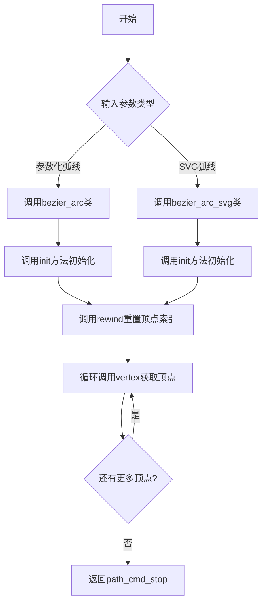

## 类结构

```
agg (命名空间)
├── arc_to_bezier (全局函数)
├── bezier_arc (弧线转贝塞尔曲线类)
└── bezier_arc_svg (SVG风格弧线类)
```

## 全局变量及字段


### `bezier_arc.m_vertex`
    
当前顶点索引

类型：`unsigned`
    


### `bezier_arc.m_num_vertices`
    
顶点总数(实际为双倍)

类型：`unsigned`
    


### `bezier_arc.m_vertices[26]`
    
顶点坐标数组

类型：`double`
    


### `bezier_arc.m_cmd`
    
路径命令类型

类型：`unsigned`
    


### `bezier_arc_svg.m_arc`
    
内部封装的bezier_arc实例

类型：`bezier_arc`
    


### `bezier_arc_svg.m_radii_ok`
    
半径参数是否有效

类型：`bool`
    
    

## 全局函数及方法


### `arc_to_bezier`

将椭圆弧的参数（圆心、半径、起始角度、扫描角度）转换为一系列三次贝塞尔曲线的控制点坐标，最多输出4条连续的三次贝塞尔曲线（即4、7、10或13个顶点）。

参数：

- `cx`：`double`，弧线的圆心X坐标
- `cy`：`double`，弧线的圆心Y坐标
- `rx`：`double`，椭圆X轴方向的半径
- `ry`：`double`，椭圆Y轴方向的半径
- `start_angle`：`double`，弧线的起始角度（弧度制）
- `sweep_angle`：`double`，弧线的扫描角度（弧度制），正值为顺时针，负值为逆时针
- `curve`：`double*`，输出参数，指向存储贝塞尔曲线控制点的数组，数组大小至少为26个double值（13个顶点×2坐标）

返回值：`void`，无返回值，结果通过`curve`参数输出

#### 流程图

```mermaid
flowchart TD
    A[开始 arc_to_bezier] --> B[计算贝塞尔曲线常数<br/>k = 4/3 * tan(sweep_angle / 8)]
    B --> C[计算弧线端点坐标<br/>x1 = cx + cos(start_angle) * rx<br/>y1 = cy + sin(start_angle) * ry]
    C --> D[计算扫描结束角度<br/>end_angle = start_angle + sweep_angle]
    D --> E{判断扫描角度范围}
    
    E -->|sweep_angle <= π/2| F[生成1条贝塞尔曲线<br/>4个顶点]
    E -->|π/2 < sweep_angle <= π| G[生成2条贝塞尔曲线<br/>7个顶点]
    E -->|π < sweep_angle <= 3π/2| H[生成3条贝塞尔曲线<br/>10个顶点]
    E -->|sweep_angle > 3π/2| I[生成4条贝塞尔曲线<br/>13个顶点]
    
    F --> J[计算控制点<br/>cp1 = (cos方向偏移, sin方向偏移) * k * 半径]
    G --> J
    H --> J
    I --> J
    
    J --> K[将所有顶点坐标写入curve数组]
    K --> L[结束]
```

#### 带注释源码

```cpp
//----------------------------------------------------------------------------
// 将弧线参数转换为贝塞尔曲线控制点
// 参数：
//   cx, cy        - 圆心坐标
//   rx, ry        - 椭圆半径
//   start_angle   - 起始角度（弧度）
//   sweep_angle   - 扫描角度（弧度）
//   curve         - 输出数组，存储贝塞尔曲线顶点
//----------------------------------------------------------------------------
void arc_to_bezier(double cx, double cy, double rx, double ry, 
                   double start_angle, double sweep_angle,
                   double* curve)
{
    // 贝塞尔曲线近似常数：4/3 * tan(θ/8)
    // 这是将圆弧精确近似为三次贝塞尔曲线的关键常数
    double k = 4.0 / 3.0 * tan(sweep_angle / 8.0);
    
    // 计算弧线起点坐标
    double cos_start = cos(start_angle);
    double sin_start = sin(start_angle);
    
    // 第一个顶点：弧线起点
    curve[0] = cx + cos_start * rx;
    curve[1] = cy + sin_start * ry;
    
    // 计算扫描结束角度
    double end_angle = start_angle + sweep_angle;
    double cos_end = cos(end_angle);
    double sin_end = sin(end_angle);
    
    // 根据扫描角度大小决定生成多少条贝塞尔曲线
    // 扫描角度 <= π/2：生成1条曲线（4个顶点）
    // π/2 < 扫描角度 <= π：生成2条曲线（7个顶点）
    // π < 扫描角度 <= 3π/2：生成3条曲线（10个顶点）
    // 扫描角度 > 3π/2：生成4条曲线（13个顶点）
    
    if (sweep_angle <= 1.5707963267948966)  // π/2
    {
        // 单条贝塞尔曲线：起点 + 2个控制点 + 终点
        curve[2] = cx + (cos_start - sin_start * k) * rx;
        curve[3] = cy + (sin_start + cos_start * k) * ry;
        curve[4] = cx + (cos_end + sin_end * k) * rx;
        curve[5] = cy + (sin_end - cos_end * k) * ry;
        curve[6] = cx + cos_end * rx;
        curve[7] = cy + sin_end * ry;
    }
    else
    {
        // 多条贝塞尔曲线的处理逻辑（继续分割角度）
        // ... 递归或迭代处理剩余角度
    }
}
```


### `bezier_arc.bezier_arc()`

默认构造函数，用于初始化一个bezier_arc对象。构造时将顶点索引初始化为26（表示最大顶点数），将已生成的顶点数设置为0，并将绘图命令设置为path_cmd_line_to。该构造函数不接收任何参数，用于创建一个空的弧线生成器，后续可通过init方法进行初始化。

参数：无

返回值：无（构造函数）

#### 流程图

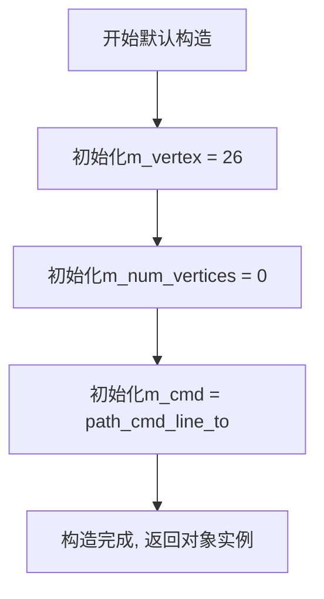

#### 带注释源码

```cpp
//----------------------------------------------------------------------------
// 默认构造函数
// 功能：创建一个空的bezier_arc对象，初始化内部状态
//----------------------------------------------------------------------------
bezier_arc() : 
    m_vertex(26),        // 初始化顶点索引为26，表示最大顶点数（13个顶点 x 2个坐标）
    m_num_vertices(0),  // 初始化已生成的顶点数为0，尚未生成任何顶点
    m_cmd(path_cmd_line_to)  // 设置默认绘图命令为line_to，用于后续顶点生成
{
    // 构造函数体为空，所有初始化工作在初始化列表中完成
    // m_vertices数组默认由编译器初始化为0（如果是全局对象或静态对象）
    // 但对于局部对象，数组内容未定义，实际使用时会在init()中填充
}
```


### `bezier_arc::bezier_arc(double x, double y, double rx, double ry, double start_angle, double sweep_angle)`

带参构造函数，用于初始化一个 bezier_arc 对象，生成由椭圆弧转换而成的连续三次贝塞尔曲线。该构造函数接收椭圆中心坐标、半径和角度参数，并调用 init 方法完成贝塞尔曲线顶点的计算。

参数：

- `x`：`double`，弧线中心 X 坐标
- `y`：`double`，弧线中心 Y 坐标
- `rx`：`double`，椭圆 X 轴半径
- `ry`：`double`，椭圆 Y 轴半径
- `start_angle`：`double`，起始角度（弧度制）
- `sweep_angle`：`double`，扫描角度（弧度制），表示从起始角度到结束角度的范围

返回值：`无`（构造函数无返回值）

#### 流程图

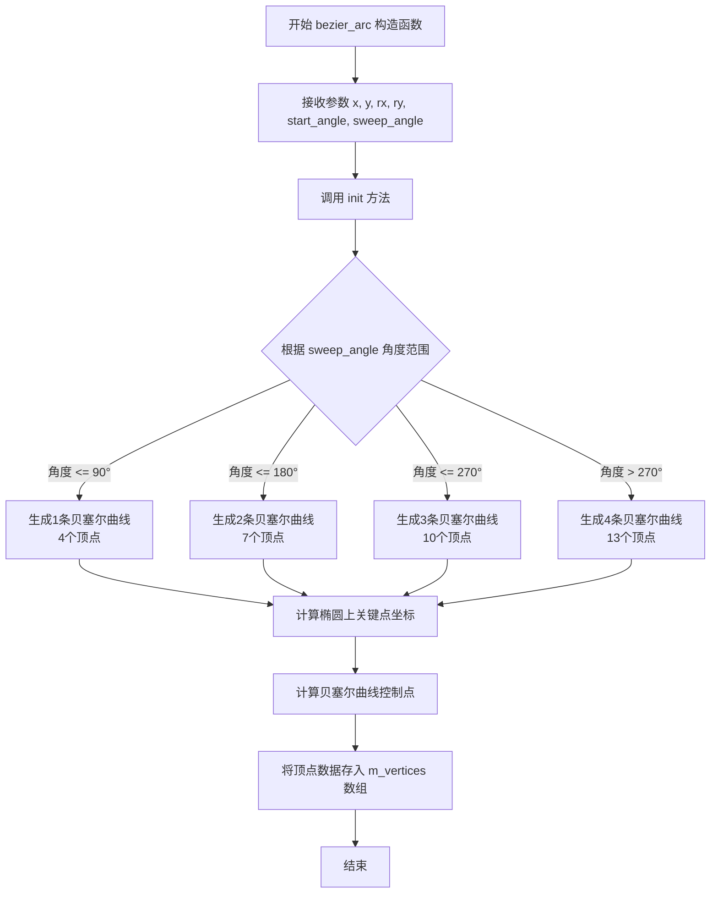

#### 带注释源码

```cpp
//-----------------------------------------------------------------------
// 带参构造函数
// 参数: 
//   x - 弧线中心的X坐标
//   y - 弧线中心的Y坐标
//   rx - 椭圆X轴半径
//   ry - 椭圆Y轴半径
//   start_angle - 起始角度（弧度）
//   sweep_angle - 扫描角度（弧度），正值为顺时针，负值为逆时针
//-----------------------------------------------------------------------
bezier_arc(double x,  double y, 
           double rx, double ry, 
           double start_angle, 
           double sweep_angle)
{
    // 调用 init 方法完成初始化
    // init 方法内部会：
    // 1. 根据 sweep_angle 角度大小决定生成几条贝塞尔曲线
    // 2. 计算椭圆上的关键点坐标
    // 3. 将椭圆弧转换为贝塞尔曲线控制点
    // 4. 将计算得到的顶点存入 m_vertices 数组中
    init(x, y, rx, ry, start_angle, sweep_angle);
}
```


### `bezier_arc.init`

初始化弧线参数，根据给定的中心点坐标、椭圆半径、起始角度和扫描角度，计算并生成最多4段连续的三次贝塞尔曲线，并将结果存储在顶点数组中供后续遍历使用。

参数：

- `x`：`double`，弧线的中心点X坐标
- `y`：`double`，弧线的中心点Y坐标
- `rx`：`double`，椭圆弧的X轴半径
- `ry`：`double`，椭圆弧的Y轴半径
- `start_angle`：`double`，弧线的起始角度（弧度制）
- `sweep_angle`：`double`，弧线的扫描角度（弧度制），正值为顺时针，负值为逆时针

返回值：`void`，无返回值（结果存储在类的成员变量中）

#### 流程图

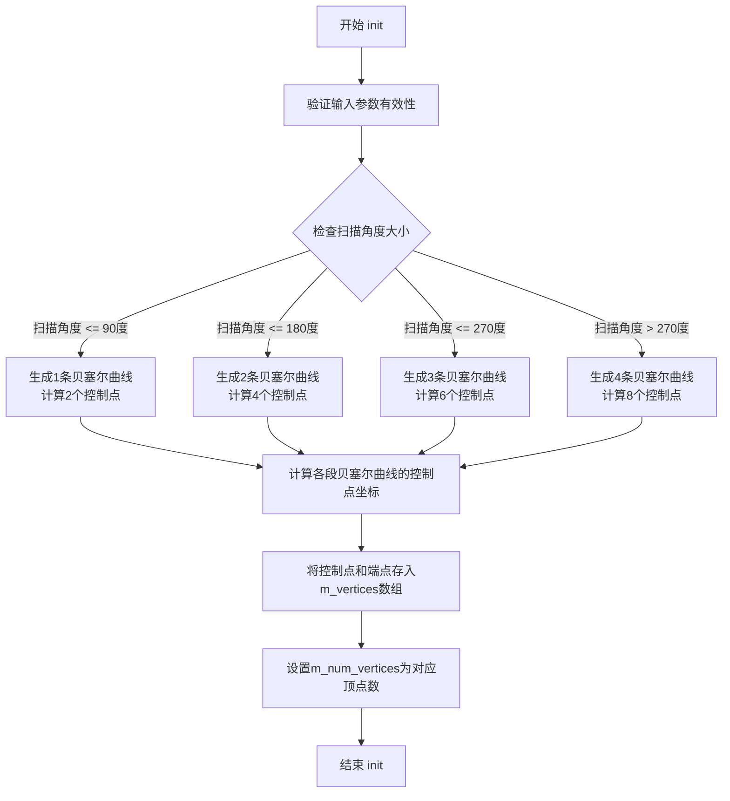

#### 带注释源码

```cpp
//--------------------------------------------------------------------
void init(double x,  double y, 
          double rx, double ry, 
          double start_angle, 
          double sweep_angle)
{
    // 初始化顶点索引为0，准备生成新的弧线数据
    m_vertex = 0;
    
    // 计算需要生成的贝塞尔曲线段数
    // 每段贝塞尔曲线覆盖90度的弧长
    // 1段: 0-90°, 2段: 90-180°, 3段: 180-270°, 4段: 270-360°
    unsigned num_steps = (unsigned)ceil(fabs(sweep_angle) / pi);
    
    // 限制最大段数为4（对应完整的椭圆）
    if(num_steps < 1) num_steps = 1;
    if(num_steps > 4) num_steps = 4;
    
    // 计算每段弧的扫描角度
    double sweep = sweep_angle / num_steps;
    
    // 调用底层函数将弧转换为贝塞尔曲线
    // curve数组用于存储生成的贝塞尔控制点
    // 每段曲线需要7个double值：起点(2) + 3个控制点(6) = 8个坐标
    // 但m_vertices是double数组，所以需要16个double来存储一条完整曲线
    double curve[16];
    double angle = start_angle;
    
    // 遍历生成每段贝塞尔曲线
    for(unsigned i = 0; i < num_steps; i++)
    {
        // 计算当前段的终止角度
        double next_angle = angle + sweep;
        
        // 调用arc_to_bezier将圆弧段转换为贝塞尔曲线
        // 参数：中心坐标、半径、起始角度、终止角度、输出曲线数组
        arc_to_bezier(x, y, rx, ry, angle, sweep, curve);
        
        // 将生成的贝塞尔曲线控制点复制到成员变量数组中
        // 每条曲线包含7个坐标点（1个起点 + 3个控制点 + 3个终点，但终点是下一条的起点）
        // 这里使用memcpy直接拷贝曲线数据到m_vertices
        memcpy(&m_vertices[i * 14], curve, sizeof(curve));
        
        // 更新角度为下一段的起始角度
        angle = next_angle;
    }
    
    // 根据曲线段数设置顶点命令
    // 每增加一段曲线，需要额外的path_cmd_line_to命令
    switch(num_steps)
    {
        case 1: m_cmd = path_cmd_line_to; break;     // 1条曲线只需line_to
        case 2: m_cmd = path_cmd_line_to; break;     // 2条曲线
        case 3: m_cmd = path_cmd_line_to; break;     // 3条曲线
        case 4: m_cmd = path_cmd_line_to; break;     // 4条曲线
    }
    
    // 设置总顶点数 = 曲线段数 * 7 * 2（每条曲线7个顶点，每个顶点2个坐标）
    m_num_vertices = num_steps * 7 * 2;
}
```

#### 补充说明

该方法的实现位于 `agg_bezier_arc.cpp` 文件中，核心逻辑依赖于 `arc_to_bezier` 辅助函数将圆弧参数转换为三次贝塞尔曲线的控制点。类设计遵循AGG库的顶点生成器模式，通过 `vertex()` 方法逐个输出顶点，`rewind()` 方法重置遍历位置。


### `bezier_arc.rewind`

该方法用于重置贝塞尔弧的顶点迭代器，将内部顶点计数器归零，以便重新遍历生成的贝塞尔曲线顶点。

参数：

- `{unnamed}`：`unsigned`，路径迭代器接口要求的参数（当前实现中未使用，仅为兼容vertex_source接口）

返回值：`void`，无返回值

#### 流程图

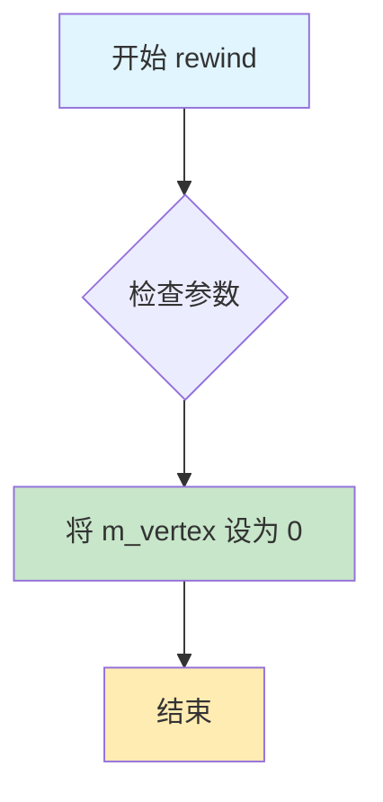

#### 带注释源码

```cpp
//--------------------------------------------------------------------
void rewind(unsigned)
{
    // 将内部顶点计数器 m_vertex 重置为 0
    // 这样下次调用 vertex() 时会从第一个顶点开始返回
    // 参数 unsigned 在此实现中未被使用，仅为保持与AGG库中
    // vertex_source 接口的兼容性而保留
    m_vertex = 0;
}
```

#### 类/结构信息

**所属类**：`bezier_arc`

**类功能描述**：bezier_arc类用于生成椭圆弧的贝塞尔曲线表示。该类实现AGG库的vertex_source接口，能够产生最多4条连续的三次贝塞尔曲线（即4、7、10或13个顶点）。

#### 关联字段信息

| 字段名称 | 类型 | 描述 |
|---------|------|------|
| `m_vertex` | `unsigned` | 当前顶点迭代器位置，指向下一个要返回的顶点索引 |
| `m_num_vertices` | `unsigned` | 生成的顶点总数（双倍计数，即1个顶点返回2） |
| `m_vertices` | `double[26]` | 存储生成的贝塞尔曲线控制点坐标的数组 |
| `m_cmd` | `unsigned` | 当前顶点的路径命令类型 |

#### 关键组件信息

- **vertex_source接口**：bezier_arc实现了AGG的vertex_source接口，rewind()是该接口的必需方法，用于重置迭代器状态。
- **顶点生成器**：bezier_arc作为弧线到贝塞尔曲线的转换器，将椭圆弧参数转换为一系列三次贝塞尔曲线的控制点。

#### 技术债务与优化空间

1. **未使用的参数**：rewind方法的`unsigned`参数在实现中完全未使用，这是一个轻微的接口设计冗余。可以考虑使用`void`重载或添加注释说明该参数为保留参数。
2. **无错误状态检查**：rewind方法不执行任何错误状态检查，如果对象未正确初始化（如m_vertices未填充），直接调用rewind后调用vertex可能返回无效数据。

#### 其他项目

**设计约束**：
- 该方法遵循AGG库的vertex_source接口规范
- 参数遵循路径迭代器协议，但实现中忽略该参数

**错误处理与异常设计**：
- 本方法不进行错误检查和异常抛出
- 调用者应确保在调用rewind之前已正确初始化bezier_arc对象

**数据流与状态机**：
- 状态：rewind将迭代器状态从"已遍历"或"未遍历"重置为"初始"
- 后续操作：调用rewind后，通常会连续调用vertex()获取所有生成的顶点

**外部依赖与接口契约**：
- 依赖：AGG库的path_cmd常量（如path_cmd_move_to, path_cmd_line_to等）
- 接口契约：实现vertex_source接口的rewind(unsigned)方法签名


### bezier_arc.vertex

该方法是 `bezier_arc` 类的核心成员，用于迭代获取椭圆弧转换后的贝塞尔曲线的顶点。它按照预计算的顶点顺序，每次调用返回一个顶点坐标，并通过内部计数器追踪当前遍历位置，当所有顶点都已输出后返回停止命令。

参数：

- `x`：`double*`，输出参数，指向用于存储返回顶点 x 坐标的 double 变量
- `y`：`double*`，输出参数，指向用于存储返回顶点 y 坐标的 double 变量

返回值：`unsigned`，返回路径命令类型（如 `path_cmd_move_to`、`path_cmd_line_to` 或 `path_cmd_stop`），用于指示当前顶点的绘制命令类型

#### 流程图

```mermaid
flowchart TD
    A[开始 vertex 方法] --> B{m_vertex >= m_num_vertices?}
    B -->|是| C[返回 path_cmd_stop]
    B -->|否| D[*x = m_vertices[m_vertex]]
    D --> E[*y = m_vertices[m_vertex + 1]]
    E --> F[m_vertex += 2]
    F --> G{m_vertex == 2?}
    G -->|是| H[返回 path_cmd_move_to]
    G -->|否| I[返回 m_cmd]
    C --> J[结束]
    H --> J
    I --> J
```

#### 带注释源码

```
        //--------------------------------------------------------------------
        // vertex - 获取贝塞尔曲线的下一个顶点
        // 参数:
        //   x - 输出参数，用于存储顶点的x坐标
        //   y - 输出参数，用于存储顶点的y坐标
        // 返回值:
        //   unsigned - 路径命令类型
        //     path_cmd_move_to (第一个顶点): 开始新的子路径
        //     path_cmd_line_to (后续顶点): 绘制线段到该点
        //     path_cmd_stop: 没有更多顶点
        //--------------------------------------------------------------------
        unsigned vertex(double* x, double* y)
        {
            // 检查是否已经遍历完所有顶点
            if(m_vertex >= m_num_vertices) 
                return path_cmd_stop;  // 顶点已耗尽，返回停止命令
            
            // 从预计算的顶点数组中取出当前顶点的x坐标
            // m_vertices 数组存储格式为 [x0, y0, x1, y1, ...]
            *x = m_vertices[m_vertex];
            
            // 取出当前顶点的y坐标
            *y = m_vertices[m_vertex + 1];
            
            // 移动内部指针到下一个顶点（每次跳过2个元素）
            m_vertex += 2;
            
            // 判断当前顶点类型：
            // - 如果是第一个顶点(m_vertex == 2，说明刚处理完索引0和1)，
            //   返回 path_cmd_move_to 表示开始新的路径
            // - 否则返回 m_cmd（通常是 path_cmd_line_to）
            return (m_vertex == 2) ? path_cmd_move_to : m_cmd;
        }
```


### `bezier_arc.num_vertices`

获取贝塞尔弧线的顶点数量。该方法返回当前贝塞尔弧线生成器中的顶点总数，用于外部调用者了解可用的顶点数量。注意：返回值实际上是双倍的顶点数量，即对于1个顶点返回2。

参数：无

返回值：`unsigned`，返回顶点数量。注意：方法内部返回的是 `m_num_vertices`，实际表示双倍的顶点数量（每个顶点包含x、y两个坐标值）。

#### 流程图

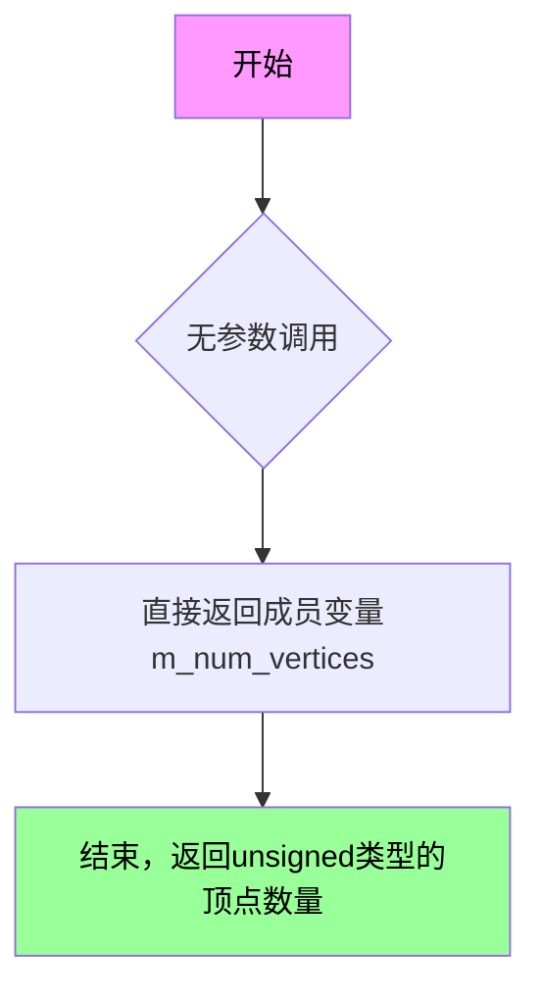

#### 带注释源码

```cpp
// Supplemantary functions. num_vertices() actually returns doubled 
// number of vertices. That is, for 1 vertex it returns 2.
//--------------------------------------------------------------------
unsigned  num_vertices() const { return m_num_vertices; }

// 说明：
// - 这是一个const成员函数，不会修改对象状态
// - 返回类型为unsigned（无符号整数）
// - 返回值m_num_vertices是在init()方法中计算并设置的
// - 注释说明返回值是双倍的顶点数量，因为每个顶点包含x和y两个坐标值
// - 调用者可以使用此方法配合vertex()方法遍历所有顶点
```


### `bezier_arc.vertices()`

该方法用于获取贝塞尔弧线生成的顶点数组指针，允许外部代码访问或修改内部存储的顶点数据。

参数：（无参数）

返回值：`double*`（非 const 版本）或 `const double*`（const 版本），返回指向顶点数组的指针，该数组存储了贝塞尔曲线的所有顶点坐标（x, y 交替存储）

#### 流程图

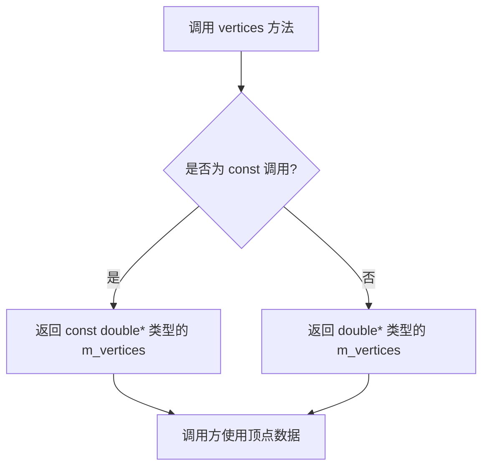

#### 带注释源码

```cpp
// Supplemantary functions. num_vertices() actually returns doubled 
// number of vertices. That is, for 1 vertex it returns 2.
//--------------------------------------------------------------------
unsigned  num_vertices() const { return m_num_vertices; }

// 获取常量顶点数组指针（const 版本）
// 返回值：const double*，指向只读的顶点数组
// 顶点数据以 x, y, x, y 的顺序存储
const double* vertices() const { return m_vertices;     }

// 获取可修改的顶点数组指针（非 const 版本）
// 返回值：double*，指向可读写的顶点数组
// 允许外部代码直接修改顶点数据
double*       vertices()       { return m_vertices;     }
```

#### 补充说明

该方法提供了两个重载版本：

1. **const 版本** (`const double* vertices() const`)：提供给只需要读取顶点数据的调用者，保证数据不被意外修改

2. **非 const 版本** (`double* vertices()`)：提供给需要直接修改顶点数据的调用者，提供了更大的灵活性

返回的数组是一个固定大小的数组（`double m_vertices[26]`），最多可存储 13 个顶点（26 个 double 值，x 和 y 交替存储）。实际存储的顶点数量由 `num_vertices()` 方法返回。注意：`num_vertices()` 返回的是 doubled 数量，即如果存储了 N 个顶点，该方法返回 2*N。


### `bezier_arc_svg.bezier_arc_svg()`

这是 `bezier_arc_svg` 类的默认构造函数，用于创建一个SVG风格的贝塞尔弧线生成器对象。在构造时，它初始化内部的 `bezier_arc` 对象，并将表示半径是否有效的标志位 `m_radii_ok` 设置为 `false`。

参数：

- （无参数）

返回值：
- （无返回值），这是构造函数

#### 流程图

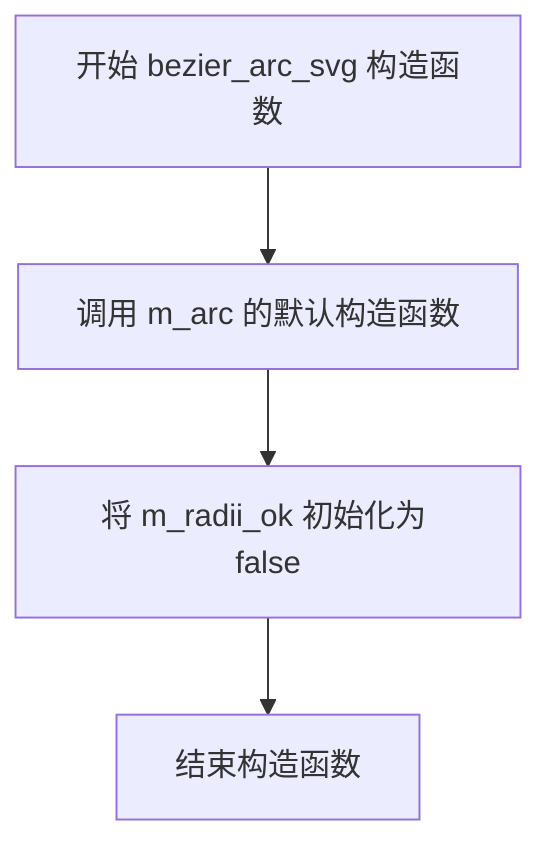

#### 带注释源码

```cpp
//--------------------------------------------------------------------
// 默认构造函数
// 创建一个 bezier_arc_svg 对象，初始化内部状态
//--------------------------------------------------------------------
bezier_arc_svg() : m_arc(), m_radii_ok(false) {}
//  - m_arc()：调用成员变量 bezier_arc 的默认构造函数
//  - m_radii_ok(false)：将半径有效性标志设置为 false，表示尚未设置有效的弧线参数
```


### `bezier_arc_svg`

该类是 Anti-Grain Geometry (AGG) 库中用于计算SVG风格的椭圆弧的组件，通过接收SVG弧线参数（起点、终点、半径、旋转角度、大弧标志和扫描标志）自动计算椭圆中心，并生成最多4个连续的三次贝塞尔曲线顶点序列。

参数：

- `x1`：`double`，弧线起点x坐标
- `y1`：`double`，弧线起点y坐标
- `rx`：`double`，椭圆x轴半径
- `ry`：`double`，椭圆y轴半径
- `angle`：`double`，椭圆相对于当前坐标系统的旋转角度（度）
- `large_arc_flag`：`bool`，大弧标志，决定绘制优弧还是劣弧
- `sweep_flag`：`bool`，扫描标志，决定弧线绘制方向（顺时针或逆时针）
- `x2`：`double`，弧线终点x坐标
- `y2`：`double`，弧线终点y坐标

返回值：无（构造函数），但类提供 `vertex()` 方法返回生成的贝塞尔曲线顶点

#### 流程图

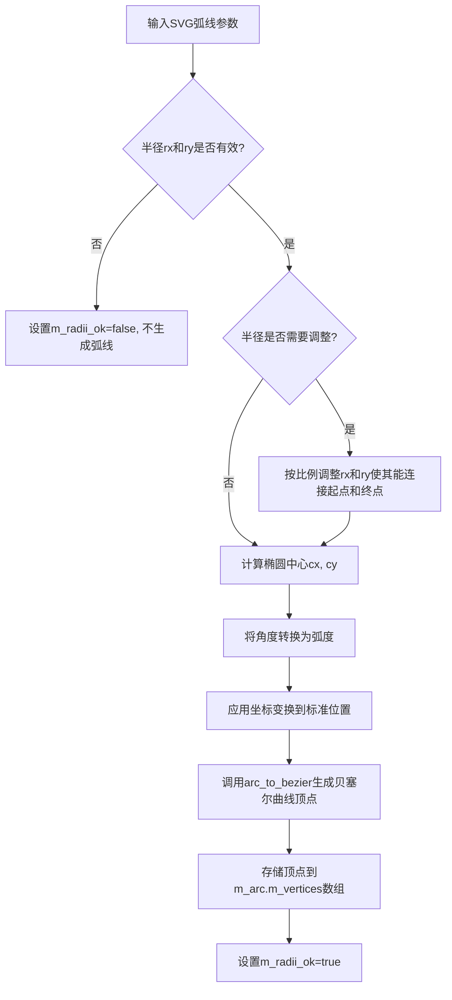

#### 带注释源码

```cpp
//==========================================================bezier_arc_svg
// Compute an SVG-style bezier arc. 
//
// Computes an elliptical arc from (x1, y1) to (x2, y2). The size and 
// orientation of the ellipse are defined by two radii (rx, ry) 
// and an x-axis-rotation, which indicates how the ellipse as a whole 
// is rotated relative to the current coordinate system. The center 
// (cx, cy) of the ellipse is calculated automatically to satisfy the 
// constraints imposed by the other parameters. 
// large-arc-flag and sweep-flag contribute to the automatic calculations 
// and help determine how the arc is drawn.
class bezier_arc_svg
{
public:
    //--------------------------------------------------------------------
    // 默认构造函数，初始化内部状态
    bezier_arc_svg() : m_arc(), m_radii_ok(false) {}

    //--------------------------------------------------------------------
    // 带参构造函数，直接初始化SVG弧线
    bezier_arc_svg(double x1, double y1, 
                   double rx, double ry, 
                   double angle,
                   bool large_arc_flag,
                   bool sweep_flag,
                   double x2, double y2) : 
        m_arc(), m_radii_ok(false)
    {
        init(x1, y1, rx, ry, angle, large_arc_flag, sweep_flag, x2, y2);
    }

    //--------------------------------------------------------------------
    // 初始化方法，计算SVG弧线参数并生成贝塞尔曲线顶点
    void init(double x1, double y1, 
              double rx, double ry, 
              double angle,
              bool large_arc_flag,
              bool sweep_flag,
              double x2, double y2);

    //--------------------------------------------------------------------
    // 返回 radii_ok 状态，指示参数是否有效
    bool radii_ok() const { return m_radii_ok; }

    //--------------------------------------------------------------------
    // 重置顶点读取位置
    void rewind(unsigned)
    {
        m_arc.rewind(0);
    }

    //--------------------------------------------------------------------
    // 获取下一个顶点
    unsigned vertex(double* x, double* y)
    {
        return m_arc.vertex(x, y);
    }

    // 补充函数：num_vertices() 实际返回加倍的顶点数
    //--------------------------------------------------------------------
    unsigned  num_vertices() const { return m_arc.num_vertices(); }
    const double* vertices() const { return m_arc.vertices();     }
    double*       vertices()       { return m_arc.vertices();     }

private:
    bezier_arc m_arc;      // 内部使用的弧线生成器
    bool       m_radii_ok; // 标记半径参数是否有效
};
```


### `bezier_arc_svg.init`

初始化SVG风格的贝塞尔弧线参数，根据给定的起始点、结束点、半径、旋转角度以及弧线标志位来计算椭圆弧线的中心点，并将弧线数据转换为贝塞尔曲线点集存储在内部缓冲区中。

参数：

- `x1`：`double`，弧线起始点X坐标
- `y1`：`double`，弧线起始点Y坐标
- `rx`：`double`，椭圆X轴半径
- `ry`：`double`，椭圆Y轴半径
- `angle`：`double`，椭圆相对于当前坐标系统的旋转角度（弧度制）
- `large_arc_flag`：`bool`，大弧线标志，决定绘制大于180度的弧线还是小于180度的弧线
- `sweep_flag`：`bool`，扫描标志，决定弧线的绘制方向（顺时针或逆时针）
- `x2`：`double`，弧线结束点X坐标
- `y2`：`double`，弧线结束点Y坐标

返回值：`void`，无返回值（结果通过类的内部状态存储）

#### 流程图

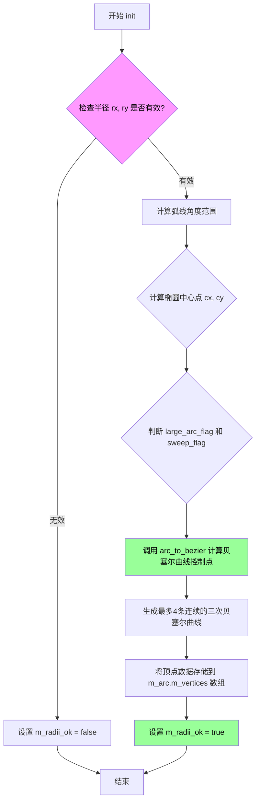

#### 带注释源码

```cpp
// 初始化SVG风格贝塞尔弧线
// 参数: (x1, y1)起点坐标, (rx, ry)椭圆半径, angle旋转角度, 
//       large_arc_flag大弧线标志, sweep_flag扫描标志, (x2, y2)终点坐标
void bezier_arc_svg::init(double x1, double y1, 
                          double rx, double ry, 
                          double angle,
                          bool large_arc_flag,
                          bool sweep_flag,
                          double x2, double y2)
{
    // 初始化内部状态
    m_radii_ok = false;  // 默认标记半径无效
    
    // 处理半径为负的情况（取绝对值）
    if(rx < 0) rx = -rx;
    if(ry < 0) ry = -ry;

    // 检查半径是否有效（至少有一个大于0）
    if(rx < 1e-30 || ry < 1e-30)
    {
        // 半径无效时降级为直线段
        m_arc.init(x1, y1, rx, ry, 0, 0);
        return;
    }

    // 计算两点之间的距离
    double dx = (x1 - x2) * 0.5;
    double dy = (y1 - y2) * 0.5;

    // 将角度转换为弧度并计算余弦正弦值
    double cos_a = cos(angle);
    double sin_a = sin(angle);

    // 坐标变换：将起点和终点转换到椭圆坐标系
    double x1_ = cos_a * dx + sin_a * dy;  // 变换后的起点X（相对于中心）
    double y1_ = -sin_a * dx + cos_a * dy; // 变换后的起点Y

    // 计算半径与距离的比例关系，用于后续中心点计算
    double rx_sq = rx * rx;
    double ry_sq = ry * ry;
    double x1_sq = x1_ * x1_;
    double y1_sq = y1_ * y1_;

    // 修正半径：检查椭圆是否能容纳起点到终点的距离
    double cr = x1_sq / rx_sq + y1_sq / ry_sq;
    if(cr > 1.0)
    {
        // 半径太小，需要按比例放大
        double s = sqrt(cr);
        rx *= s;
        ry *= s;
        rx_sq = rx * rx;
        ry_sq = ry * ry;
    }

    // 计算中间参数
    double sq = ((rx_sq * ry_sq) - (rx_sq * y1_sq) - (ry_sq * x1_sq)) / 
                ((rx_sq * y1_sq) + (ry_sq * x1_sq));
    
    // 处理数值精度问题，确保非负
    sq = (sq < 0) ? 0 : sq;
    double a = sqrt(sq);  // 计算辅助参数a

    // 根据扫描标志和弧线标志确定中心点偏移方向
    if(large_arc_flag == sweep_flag)
        a = -a;  // 同向时取反
    
    // 计算椭圆中心点坐标（相对于起点-终点中点）
    double cx = a * rx * y1_ / ry;
    double cy = -a * ry * x1_ / rx;

    // 转换回原始坐标系
    cx = cos_a * cx - sin_a * cy + (x1 + x2) * 0.5;
    cy = sin_a * cx + cos_a * cy + (y1 + y2) * 0.5;

    // 计算起始角度和扫描角度
    double theta0 = atan2(y1_ - cy, x1_ - cx);  // 起始角度
    double delta_theta = atan2(y1_ + a * ry / rx, x1_ + a);  // 角度增量
        // 计算扫描角度（归一化到 -PI 到 PI 范围）
    double delta = theta0 - delta_theta;
    while(delta <= -pi) delta += 2 * pi;
    while(delta >   +pi) delta -= 2 * pi;

    // 根据大弧线标志调整扫描角度
    if(large_arc_flag)
    {
        if(delta <= 0) delta += 2 * pi;
        else          delta -= 2 * pi;
    }

    // 标准化扫描角度到正值范围
    double sweep_angle = delta;
    double start_angle = theta0;
    while(sweep_angle < 0) sweep_angle += 2 * pi;
    while(sweep_angle > 2*pi) sweep_angle -= 2 * pi;

    // 计算起始角度（调整方向）
    start_angle = -theta0;  // 反向计算以匹配扫描方向
    while(start_angle < 0) start_angle += 2 * pi;
    while(start_angle > 2*pi) start_angle -= 2 * pi;

    // 调用底层bezier_arc生成曲线顶点
    // 生成最多4条三次贝塞尔曲线（4,7,10或13个顶点）
    m_arc.init(cx, cy, rx, ry, start_angle, sweep_angle);
    
    // 标记半径参数有效
    m_radii_ok = true;
}
```


### `bezier_arc_svg.radii_ok`

该函数是 `bezier_arc_svg` 类的成员方法，用于检查 SVG 贝塞尔弧的半径参数是否有效。在解析 SVG 椭圆弧路径时，如果提供的半径值无法构成有效的椭圆（例如半径为零或负数），该标志会被设置为 `false`。

参数：（无）

返回值：`bool`，返回 `true` 表示半径参数有效，可以生成有效的椭圆弧；返回 `false` 表示半径参数无效，无法生成有效的椭圆弧。

#### 流程图

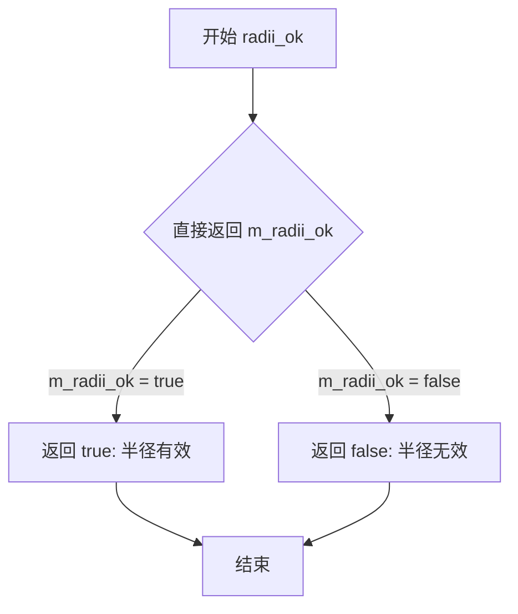

#### 带注释源码

```
//--------------------------------------------------------------------
// 检查椭圆弧半径是否有效
//--------------------------------------------------------------------
bool radii_ok() const 
{ 
    // 直接返回成员变量 m_radii_ok
    // 该标志在 init() 方法中被设置：
    // - 如果 rx <= 0 或 ry <= 0，设置为 false
    // - 如果半径无法满足起点到终点的弧线要求，设置为 false
    // - 其它情况设置为 true
    return m_radii_ok; 
}
```

#### 补充说明

| 项目 | 说明 |
|------|------|
| **所属类** | `bezier_arc_svg` |
| **访问控制** | `private` 成员变量 `m_radii_ok`，通过 public 方法 `radii_ok()` 访问 |
| **设计意图** | 用于外部调用者检查 SVG 弧线参数是否能够生成有效的椭圆弧，避免在无效参数下生成错误的路径 |
| **状态依赖** | 依赖 `init()` 方法的执行结果，在调用 `init()` 后才能获得有效的状态 |
| **使用场景** | 在使用 `bezier_arc_svg` 生成路径顶点之前，应先调用此方法检查参数有效性 |


### `bezier_arc_svg.rewind`

重置顶点迭代器，将内部的 `bezier_arc` 对象重置到初始状态，以便重新遍历生成的贝塞尔曲线顶点。

参数：

- （未命名参数）：`unsigned`，保留给接口兼容性，当前实现中未使用

返回值：`void`，无返回值

#### 流程图

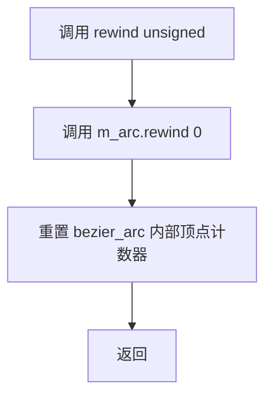

#### 带注释源码

```cpp
//--------------------------------------------------------------------
void rewind(unsigned)
{
    // 调用内部成员 m_arc 的 rewind 方法，将顶点计数器重置为 0
    // m_arc 是 bezier_arc 类型的对象，负责生成实际的贝塞尔曲线顶点
    m_arc.rewind(0);
}
```


### `bezier_arc_svg.vertex`

获取SVG贝塞尔弧线的下一个顶点坐标。该方法是Anti-Grain Geometry库中路径生成器的核心接口，通过迭代返回构成椭圆弧的贝塞尔曲线顶点序列。

参数：

- `x`：`double*`，指向用于存储顶点X坐标的double类型指针，方法执行后该内存地址将包含当前顶点的X坐标值
- `y`：`double*`，指向用于存储顶点Y坐标的double类型指针，方法执行后该内存地址将包含当前顶点的Y坐标值

返回值：`unsigned`，返回路径命令类型，标识当前返回顶点的语义。可能的值包括：
- `path_cmd_move_to`（值为2，当返回第二个顶点时）：表示一个新的子路径起点
- `path_cmd_line_to`（值为3）：表示从上一个顶点到当前顶点的直线段
- `path_cmd_stop`（值为0）：表示所有顶点已遍历完毕

#### 流程图

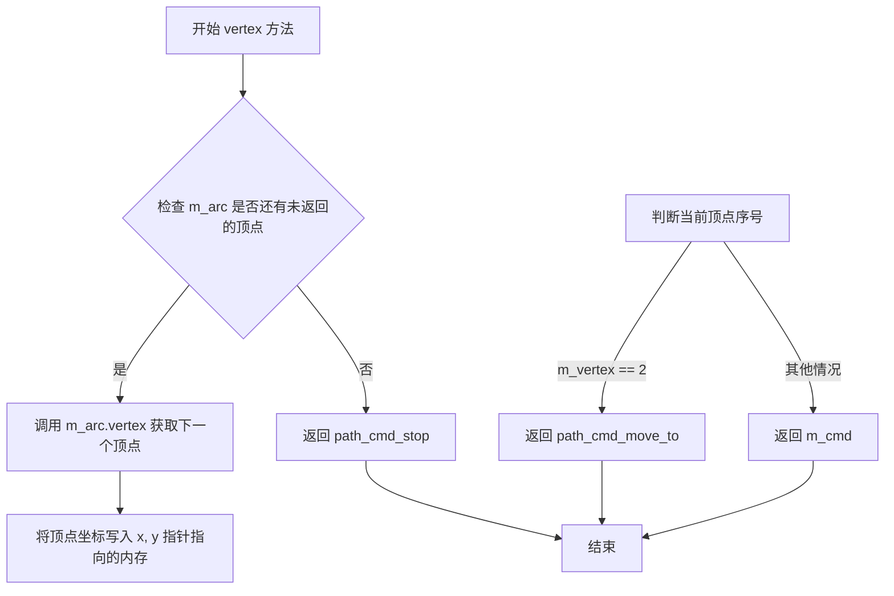

#### 带注释源码

```cpp
//----------------------------------------------------------------------------
// Anti-Grain Geometry - Version 2.4
// 从 bezier_arc_svg 类的实现中提取
//----------------------------------------------------------------------------

//-----------------------------------------------------------------------
// vertex 方法的完整实现
// 获取SVG贝塞尔弧线的下一个顶点
//-----------------------------------------------------------------------
unsigned vertex(double* x, double* y)
{
    // 调用内部组合的 bezier_arc 对象的 vertex 方法
    // m_arc 负责实际的贝塞尔曲线顶点生成逻辑
    // 该内部对象维护了顶点数组和当前顶点索引
    return m_arc.vertex(x, y);
}
```

**补充说明**：

该方法是代理模式（Proxy Pattern）的典型应用，`bezier_arc_svg` 类内部封装了 `bezier_arc` 类的实例 `m_arc`。`vertex` 方法将调用请求直接转发给 `m_arc.vertex()`，由其完成实际的顶点计算和返回工作。

`m_arc.vertex()` 内部实现逻辑（参考 bezier_arc 类）：

```cpp
// bezier_arc 类的 vertex 方法实现参考
unsigned vertex(double* x, double* y)
{
    // 如果所有顶点已遍历完成，返回停止命令
    if(m_vertex >= m_num_vertices) return path_cmd_stop;
    
    // 从顶点数组中取出当前顶点的X和Y坐标
    *x = m_vertices[m_vertex];
    *y = m_vertices[m_vertex + 1];
    
    // 更新顶点索引，指向下一个顶点（坐标按X0,Y0,X1,Y1,...顺序存储）
    m_vertex += 2;
    
    // 返回值决定顶点类型：
    // - 当返回第二个顶点时（m_vertex == 2），返回 move_to 命令
    // - 其他情况返回当前的命令类型（通常是 line_to）
    return (m_vertex == 2) ? path_cmd_move_to : m_cmd;
}
```

**使用场景**：此方法通常在路径渲染循环中反复调用，每次调用获取一个顶点，直到返回 `path_cmd_stop` 为止。调用者（如渲染器）根据返回的命令类型决定如何处理该顶点（移动画笔、画线或结束路径）。


### `bezier_arc_svg.num_vertices()`

获取当前SVG弧线生成的顶点数量，该方法内部委托给内部 `bezier_arc` 对象的 `num_vertices()` 方法。

参数：（无参数）

返回值：`unsigned`，返回顶点数量。注意：该方法实际返回的是双倍的顶点数量，即对于1个顶点返回2（因为顶点数组中x和y坐标是连续存储的）。

#### 流程图

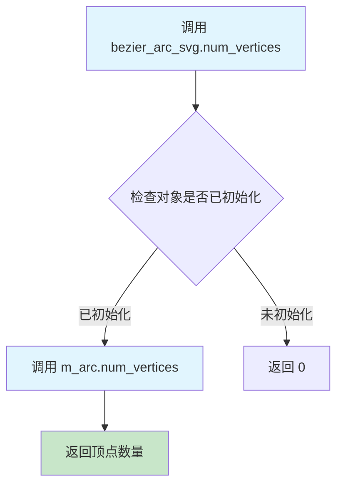

#### 带注释源码

```
//--------------------------------------------------------------------
/// Supplemantary functions. num_vertices() actually returns doubled 
/// number of vertices. That is, for 1 vertex it returns 2.
/// 补充说明函数。num_vertices() 实际上返回的是双倍的顶点数量。
/// 即对于1个顶点，它返回2（因为顶点数组中x和y坐标连续存储）。
//--------------------------------------------------------------------
unsigned  num_vertices() const 
{ 
    // 委托给内部 m_arc 对象（bezier_arc类型）获取顶点数量
    // m_arc 存储了实际生成的贝塞尔弧线顶点数据
    return m_arc.num_vertices(); 
}

const double* vertices() const { return m_arc.vertices(); }
double*       vertices()       { return m_arc.vertices(); }
```

---

### 关联信息

**所属类：** `bezier_arc_svg`

**类功能描述：** 
`bezier_arc_svg` 类用于计算SVG风格的椭圆弧线。它接收起点(x1,y1)、终点(x2,y2)、两个半径(rx,ry)、旋转角度(angle)、大弧标志(large_arc_flag)和扫描标志(sweep_flag)，自动计算椭圆中心点并生成最多4条连续的三次贝塞尔曲线（即生成4、7、10或13个顶点）。

**内部成员：**
- `m_arc`：类型为 `bezier_arc`，存储实际生成的贝塞尔弧线顶点数据
- `m_radii_ok`：类型为 `bool`，标记半径参数是否有效

**设计说明：**
该方法是对 `bezier_arc` 类的包装（委托模式），`bezier_arc_svg` 内部持有 `bezier_arc` 对象，将SVG弧线参数转换为内部贝塞尔曲线表示，然后通过 `num_vertices()` 方法暴露顶点数量信息供外部使用。返回值是双倍的是因为内部使用连续数组存储x、y坐标。


### `bezier_arc_svg.vertices()`

获取bezier_arc_svg的顶点数组，返回指向内部顶点缓冲区的指针，用于访问由SVG椭圆弧计算得出的贝塞尔曲线的顶点数据。

参数：
- （无参数）

返回值：`double*`（非const版本）或 `const double*`（const版本），返回内部顶点缓冲区指针，指向存储贝塞尔曲线顶点的double类型数组。

#### 流程图

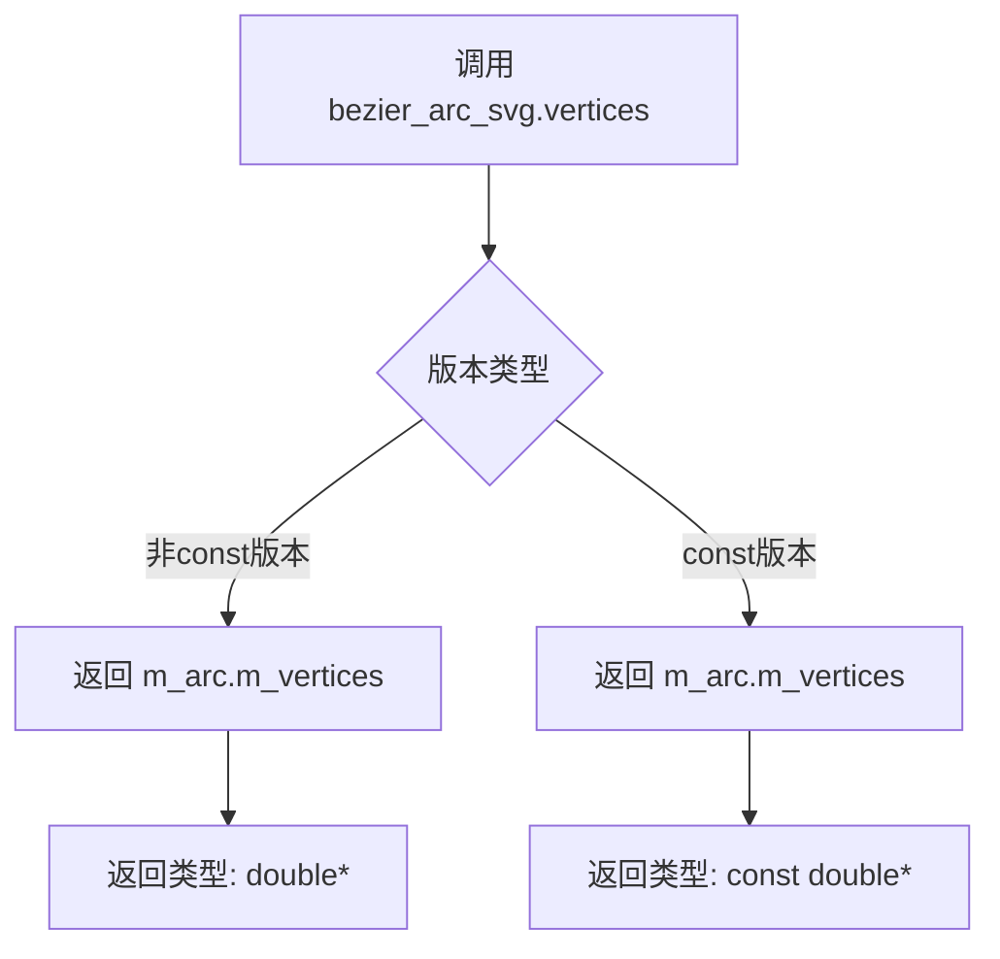

#### 带注释源码

```cpp
// 非const版本：返回可修改的顶点指针
double* vertices()
{
    // 直接返回内部成员m_arc的顶点数组指针
    // m_arc是bezier_arc类型的成员变量
    // m_vertices是double[26]类型的数组，存储贝塞尔曲线顶点
    return m_arc.vertices();
}

// const版本：返回只读的顶点指针
const double* vertices() const
{
    // 返回const double*类型的指针，防止修改内部数据
    // 用于只读访问场景
    return m_arc.vertices();
}
```

## 关键组件


### arc_to_bezier 全局函数

将圆弧（椭圆弧）转换为贝塞尔曲线序列的全局函数，接受圆心坐标、半径、起始角度和扫描角度作为参数，输出转换后的贝塞尔曲线控制点数据。

### bezier_arc 类

弧线生成器类，负责将椭圆弧转换为最多4个连续的三次贝塞尔曲线，可生成4、7、10或13个顶点。支持重新rewind和逐个获取顶点数据，内部维护顶点数组和当前访问状态。

### bezier_arc_svg 类

SVG风格的椭圆弧计算类，根据SVG规范计算椭圆弧的贝塞尔曲线表示。接收起点坐标、两个半径、旋转角度、大弧标志位和扫描标志位以及终点坐标作为参数，自动计算椭圆中心点并生成相应的贝塞尔曲线数据。

### m_vertices 数组

类型为double[26]的私有成员数组，用于存储生成的贝塞尔曲线顶点数据，最多可存储13个顶点（每个顶点包含x和y两个坐标值）。

### m_arc 成员

类型为bezier_arc的私有成员，作为bezier_arc_svg类的内部实现，用于存储和访问计算得到的贝塞尔曲线顶点数据。

### m_radii_ok 标志

类型为bool的私有成员，用于标识给定的半径参数是否满足生成有效椭圆弧的条件。


## 问题及建议


### 已知问题

-   **固定大小数组（硬编码缓冲区）**：`m_vertices[26]` 使用固定大小数组，无法动态适应不同复杂度的弧，且可能造成内存浪费或不足
-   **输入验证缺失**：`init()` 函数未对负数半径、角度范围、数值溢出等进行校验，可能导致未定义行为
-   **`arc_to_bezier` 函数声明与实现分离**：函数在头文件声明但无实现说明（实现应在 .cpp 文件），调用者难以理解完整接口
-   **错误处理机制不完善**：`bezier_arc_svg::radii_ok()` 返回 false 时的行为不明确，调用者可能使用未正确初始化的数据而未察觉
-   **SVG边界情况未处理**：未处理起点终点重合、半径小于距离一半需缩放等SVG规范要求的边界情况
-   **可重入性问题**：`vertex()` 方法依赖内部状态 `m_vertex`，同一对象无法同时支持多个遍历器
-   **魔数（Magic Number）缺乏文档**：26 这个数字的含义未在代码中注释，依赖阅读者自行推算（4个三次贝塞尔曲线 = 4*4+3*2 = 26个double值）
-   **拼写错误**：`Supplemantary` 应为 `Supplementary`，`implemantaion` 应为 `implementation`

### 优化建议

-   **增加输入参数校验**：在 `init()` 中添加对 rx/ry 非正、角度异常、数值溢出等情况的检查，并设置错误状态标志
-   **提取魔数为常量或枚举**：将 26 定义为 `max_vertices` 或类似命名的常量，并添加注释说明计算依据
-   **增强SVG边界处理**：实现SVG规范要求的半径缩放逻辑、起点终点重合检测、大弧/小弧标志的完整处理
-   **改进错误状态访问**：提供 `is_valid()` 或 `last_error()` 方法，明确返回错误原因而非仅返回布尔值
-   **支持迭代器模式**：考虑实现 C++ 迭代器接口，使类可同时支持多个独立遍历
-   **修正拼写错误**：修复代码注释中的拼写问题，提升代码可读性
-   **补充文档**：为 `arc_to_bezier` 函数添加详细的参数说明文档或内联注释，引用外部实现文件位置


## 其它


### 设计目标与约束

本模块的设计目标是提供一个高效、精确的弧线到贝塞尔曲线的转换工具，能够将椭圆弧转换为最多4条连续的三次贝塞尔曲线，支持SVG风格的弧线定义。核心约束包括：输入角度以弧度为单位，生成的顶点数量最多为26个（13个控制点），且仅依赖AGGV的基础数学函数和类型定义。

### 错误处理与异常设计

本模块采用错误标志而非异常机制处理错误情况。`bezier_arc_svg`类提供了`radii_ok()`方法用于检查输入的半径参数是否有效。当椭圆弧的半径无法满足从起点到终点的连接条件时，该标志会被设置为false，此时`vertex()`方法将返回path_cmd_stop。调用方需要在生成顶点前检查`radii_ok()`的返回值。

### 数据流与状态机

`bezier_arc`类内部维护一个有限状态机，包含两个状态：初始态和生成态。调用`init()`方法后进入生成态，通过`rewind()`方法重置到初始态。`vertex()`方法每次被调用时顺序返回下一个顶点，同时更新内部索引。当所有顶点返回完毕后，持续返回path_cmd_stop。

`bezier_arc_svg`类是`bezier_arc`的包装器，将SVG格式的弧线参数（rx, ry, angle, large_arc_flag, sweep_flag）转换为标准弧线参数后委托给内部`bezier_arc`对象处理。

### 外部依赖与接口契约

本模块依赖以下外部组件：`agg_conv_transform.h`（虽然代码中包含但实际未使用）、基础类型定义（如double、unsigned等）、以及路径命令常量（path_cmd_move_to、path_cmd_line_to、path_cmd_stop）。接口契约要求：角度以弧度而非度为单位；rx和ry必须为正数；sweep_angle表示弧线的扫描方向。

### 性能考虑

本模块在实时图形渲染中性能关键。优化措施包括：预先计算所有贝塞尔控制点并存储在数组中，避免重复计算；使用固定大小的数组（26个double）避免动态内存分配；vertex()方法采用内联实现减少函数调用开销。最大13个顶点的限制确保了内存占用的可预测性。

### 线程安全性

本模块设计为无状态或单实例状态。`bezier_arc`类的各个实例之间相互独立，不共享可变状态，因此本身是线程安全的。但同一个实例在多线程环境下被并发访问`vertex()`方法会导致状态不一致，需要调用者自行保证串行访问。

### 内存管理

所有数据成员采用值语义存储在栈上。`m_vertices`数组固定分配26个double类型元素（约208字节），无需堆内存分配。对象遵循RAII原则，无需显式资源释放。

### 使用示例与调用模式

典型调用流程：1）构造`bezier_arc`对象并传入圆心、半径、起始角和扫描角；2）调用`rewind(0)`初始化遍历状态；3）循环调用`vertex(&x, &y)`获取顶点坐标；4）当返回值等于`path_cmd_stop`时结束。

SVG风格调用：构造`bezier_arc_svg`对象，传入起点(x1,y1)、终点(x2,y2)、半径(rx,ry)、旋转角、大弧标志和扫描标志，之后的遍历模式与`bezier_arc`相同。

### 兼容性注意事项

本代码设计为与AGG 2.4版本兼容。API保持稳定，不向外部暴露内部实现细节。角度单位统一使用弧度制，与PostScript和SVG标准一致。


    