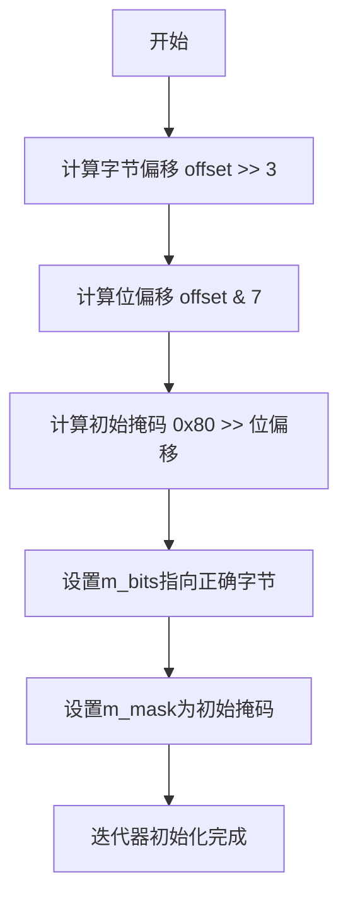

# `matplotlib\extern\agg24-svn\include\agg_bitset_iterator.h` 详细设计文档

Anti-Grain Geometry库中的位图迭代器类，提供对位数组的高效遍历功能，支持按位迭代并返回当前位的值（0或1），通过掩码机制实现跨字节边界的连续遍历。

## 整体流程

```mermaid
graph TD
A[创建bitset_iterator] --> B[计算初始字节位置: m_bits = bits + (offset >> 3)]
B --> C[计算初始掩码: m_mask = 0x80 >> (offset & 7)]
C --> D{调用operator++}
D --> E[m_mask >>= 1]
E --> F{m_mask == 0?}
F -- 是 --> G[++m_bits 移动到下一字节]
G --> H[m_mask = 0x80 重置掩码]
F -- 否 --> I[继续使用当前字节]
H --> J[遍历完成]
I --> J
J --> K{调用bit()}
K --> L[返回 (*m_bits) & m_mask]
```

## 类结构

```
agg命名空间
└── bitset_iterator类
```

## 全局变量及字段


### `bitset_iterator.m_bits`
    
指向位数据数组的指针

类型：`const int8u*`
    


### `bitset_iterator.m_mask`
    
当前位的掩码值，用于提取特定位

类型：`int8u`
    
    

## 全局函数及方法


### `bitset_iterator`

构造函数，根据位数组和偏移量初始化迭代器，用于遍历位数组中的每一位。

参数：

-  `bits`：`const int8u*`，位数据数组指针
-  `offset`：`unsigned`，起始偏移量，默认为0

返回值：无（构造函数）

#### 流程图



#### 带注释源码

```cpp
//----------------------------------------------------------------------------
// Anti-Grain Geometry - Version 2.4
// Copyright (C) 2002-2005 Maxim Shemanarev (http://www.antigrain.com)
//
// Permission to copy, use, modify, sell and distribute this software 
// is granted provided this copyright notice appears in all copies. 
// This software is provided "as is" without express or implied
// warranty, and with no claim as to its suitability for any purpose.
//
//----------------------------------------------------------------------------
// Contact: mcseem@antigrain.com
//          mcseemagg@yahoo.com
//          http://www.antigrain.com
//----------------------------------------------------------------------------

#ifndef AGG_BITSET_ITERATOR_INCLUDED
#define AGG_BITSET_ITERATOR_INCLUDED

#include "agg_basics.h"

namespace agg
{
    // bitset_iterator类：位图迭代器，用于遍历位数组中的每一位
    // 该类实现了一个轻量级的位迭代器，可以高效地按位遍历字节数组
    class bitset_iterator
    {
    public:
        // 构造函数：根据位数组和偏移量初始化迭代器
        // 参数：
        //   bits: 指向位数据数组的指针（uint8_t数组）
        //   offset: 起始偏移量（以位为单位），默认为0
        // 逻辑：
        //   1. 将offset除以8得到字节偏移量，m_bits指向对应字节
        //   2. 计算位在字节内的位置（0-7），用于确定初始掩码
        //   3. 掩码从0x80开始，根据位偏移右移相应位数
        bitset_iterator(const int8u* bits, unsigned offset = 0) :
            // 计算字节偏移：offset >> 3 相当于 offset / 8
            m_bits(bits + (offset >> 3)),
            // 计算位掩码：0x80 >> (offset & 7)
            // offset & 7 相当于 offset % 8，取低位3位
            // 例如：offset=10，则offset>>3=1（字节），offset&7=2（位）
            // 掩码从0x80(10000000b)右移2位变成0x20(00100000b)
            m_mask(0x80 >> (offset & 7))
        {}

        // 前置递增运算符：移动到下一位
        // 工作流程：
        //   1. 将掩码右移一位，检查是否越出当前字节范围
        //   2. 如果掩码变为0，说明当前字节的所有位已遍历完
        //   3. 移动到下一个字节，并重置掩码为0x80
        void operator ++ ()
        {
            // 右移掩码，检查下一位
            m_mask >>= 1;
            // 如果掩码为0，表示当前字节已遍历完
            if(m_mask == 0)
            {
                // 移动到下一个字节
                ++m_bits;
                // 重置掩码为最高位（0x80 = 10000000b）
                m_mask = 0x80;
            }
        }

        // 获取当前位的值
        // 返回值：
        //   0：当前位为0
        //   非0：当前位为1（实际返回掩码值本身）
        // 原理：使用按位与操作提取当前位
        unsigned bit() const
        {
            // 返回当前字节与掩码的按位与结果
            return (*m_bits) & m_mask;
        }

    private:
        // 指向当前字节的指针
        const int8u* m_bits;
        // 当前位的掩码（用于提取特定位）
        // 格式：0x80(10000000), 0x40(01000000), ..., 0x01(00000001)
        int8u        m_mask;
    };

}

#endif
```


### `bitset_iterator.operator++`

前置递增运算符，用于将位图迭代器移动到当前字节的下一位；如果当前字节的所有位已被遍历，则移动到下一个字节并重置掩码。

参数：
- （无）

返回值：`void`，无返回值。

#### 流程图

```mermaid
flowchart TD
    A([开始 operator++]) --> B[m_mask 向右位移1位<br>m_mask >>= 1]
    B --> C{判断 m_mask == 0?}
    C -->|是 (当前字节遍历完毕)| D[移动指针到下一字节<br>++m_bits]
    D --> E[重置掩码为0x80<br>m_mask = 0x80]
    C -->|否| F([结束])
    E --> F
```

#### 带注释源码

```cpp
        // 前置递增运算符，将迭代器移动到下一位
        void operator ++ ()
        {
            // 1. 将当前掩码右移一位，指向当前字节中的下一位
            //    例如从 0x80 (1000 0000) 变为 0x40 (0100 0000)
            m_mask >>= 1;
            
            // 2. 检查掩码是否为0。如果为0，表示当前字节的8位已经全部遍历完毕
            if(m_mask == 0)
            {
                // 3. 移动到常量指针指向的下一个字节
                ++m_bits;
                
                // 4. 重置掩码为最高位 (0x80)，准备遍历新字节的最高位
                m_mask = 0x80;
            }
        }
```


### `bitset_iterator.bit`

返回当前位的值（0或1）

参数： 无

返回值：`unsigned`，返回当前位的值（0或1）

#### 流程图

```mermaid
flowchart TD
    A[开始 bit] --> B[获取 m_bits 指向的字节值]
    B --> C{计算按位与}
    C -->|(*m_bits) & m_mask| D[返回结果]
    D --> E[结束]
    
    subgraph "bit() 方法"
    B -.->|"(*m_bits) & m_mask"| C
    end
```

#### 带注释源码

```cpp
// 返回当前位的值（0或1）
// 该方法执行按位与操作，检查当前位是否被设置
unsigned bit() const
{
    // (*m_bits): 解引用指针，获取当前字节的值
    // & m_mask: 与掩码进行按位与操作
    //   - m_mask 当前指向特定位（通过之前的 operator++ 移动）
    //   - 如果该位被设置，结果为非零；否则为零
    // 返回值：0 表示该位未设置，非零（实际为掩码值）表示该位已设置
    return (*m_bits) & m_mask;
}
```


## 关键组件


### bitset_iterator 类

核心迭代器类，用于遍历位图（bitset）中的各个位，支持按字节偏移和位偏移进行高效迭代。

### 构造函数

初始化位迭代器，根据起始偏移量计算位指针位置和初始掩码值，实现从任意位位置开始遍历。

### operator++ 前置递增运算符

实现位迭代器的递增逻辑，当掩码值右移为0时跳转到下一个字节，实现连续的位遍历。

### bit() 方法

返回当前掩码位置的位值，通过按位与操作提取特定位的状态（0或1）。

### m_bits 成员变量

指向位图数据缓冲区的常量指针，存储位数据的起始地址。

### m_mask 成员变量

当前位的掩码值（int8u类型），用于定位和提取当前遍历的位位置。


## 问题及建议


### 已知问题

- **缺少迭代器终止机制**：没有提供 end() 方法或迭代器比较操作符，用户无法判断迭代是否结束，必须自行跟踪迭代次数
- **operator++ 返回值不符合标准**：前置 ++ 运算符没有返回 *this，违反了迭代器基本约定，不支持 ++it 链式调用
- **无默认构造函数**：无法创建未初始化的迭代器实例，在某些需要默认构造的场景下受限
- **const 成员函数中的非 const 指针**：bit() 方法返回当前位值但不接受任何参数，却仍保留修改能力的设计缺陷
- **offset 参数未验证**：构造函数直接使用 offset 进行指针运算，未对 offset 的合法性进行检查，可能导致未定义行为
- **掩码初始化逻辑假设**：假设字节内位序从高位到低位（0x80 开始），这种硬编码假设降低了通用性

### 优化建议

- 添加 end() 方法或提供迭代器比较操作符（operator==、operator!=），使迭代器符合标准迭代器模式
- 修改 operator++ 返回 *this 引用，支持链式调用
- 添加默认构造函数或提供 set_offset() 方法以便复用迭代器实例
- 在构造函数或 bit() 方法中添加必要的边界检查和断言
- 考虑添加模板参数以支持不同的位序约定（大端/小端）
- 添加 const 版本的方法重载以提高 const 正确性
- 考虑添加迭代距离计算方法（operator-）以支持随机访问迭代器的部分特性


## 其它


### 设计目标与约束

该类的设计目标是提供一种高效遍历位图中单个比特位的迭代器，支持按偏移量定位到任意比特位置。设计约束包括：仅向前迭代（不支持后退）、依赖小端字节序的位操作顺序（最高位优先）、不支持空指针检查（调用者需保证bits参数有效）。

### 错误处理与异常设计

该类不进行显式的错误处理和异常抛出，采用防御性编程策略。调用者需确保：bits参数非空、offset参数不超过位图实际范围。构造函数和迭代操作均为内联函数，无异常安全需求。

### 数据流与状态机

迭代器状态转移如下：初始状态（根据offset计算起始字节和位掩码）→ 迭代中状态（m_mask非零）→ 字节边界状态（m_mask为0时重置）→ 结束状态（当m_mask为0时切换到下一字节）。状态转换由operator++()方法驱动，bit()方法仅读取当前状态不改变状态。

### 外部依赖与接口契约

依赖agg命名空间下的int8u类型定义（来自agg_basics.h）。接口契约包括：构造函数接受bits指针和可选offset参数，operator++()无返回值且不抛异常，bit()返回unsigned类型（0或非零），copyable and movable。

### 性能考虑

该类设计为极致性能优化：所有方法均为inline内联函数，无动态内存分配，无边界检查，使用位操作而非除法运算，掩码预计算减少运行时开销。适合对性能敏感的图形渲染场景。

### 线程安全性

该类本身不包含静态状态，实例安全取决于调用者传入的bits指针指向的内存是否线程安全。多个bitset_iterator实例可并发操作不同内存区域。

### 内存管理

该类不管理内存，依赖外部传入的位数组生命周期。m_bits指针指向只读内存（const int8u*），无内存泄漏风险。栈上分配，无堆内存使用。

### 使用示例

```cpp
const int8u bitmap[] = {0xFF, 0x00, 0xF0};
agg::bitset_iterator it(bitmap, 5); // 从第5位开始
for(unsigned i = 0; i < 15; ++i, ++it) {
    unsigned bit = it.bit(); // 获取当前比特值
}
```

### 已知问题和改进空间

1. 缺乏边界检查，可能导致越界访问；2. 不支持随机访问跳转；3. 无end()迭代器语义；4. 缺少C++11/14/17风格的迭代器接口（begin/end）；5. 建议添加 noexcept 标记和 constexpr 支持现代C++标准。

    