# `matplotlib\extern\agg24-svn\include\agg_blur.h` 详细设计文档

Anti-Grain Geometry库的图像模糊处理模块，实现了Stack Blur（堆栈模糊）、Recursive Blur（递归模糊）和Slight Blur三种算法，支持灰度、RGB和RGBA多种颜色格式的图像模糊处理。

## 整体流程

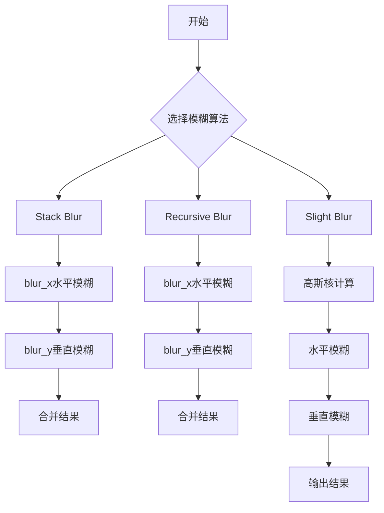

## 类结构

```
agg::stack_blur_tables<T> (模板结构体)
├── g_stack_blur8_mul[255] (静态查找表乘数)
└── g_stack_blur8_shr[255] (静态查找表移位)
agg::stack_blur<ColorT, CalculatorT> (模板类)
├── blur_x() 水平模糊方法
├── blur_y() 垂直模糊方法
└── blur() 组合模糊方法
agg::stack_blur_calc_rgba<T> (RGBA计算器)
agg::stack_blur_calc_rgb<T> (RGB计算器)
agg::stack_blur_calc_gray<T> (灰度计算器)
agg::stack_blur_gray8 (灰度图像模糊函数)
agg::stack_blur_rgb24 (RGB图像模糊函数)
agg::stack_blur_rgba32 (RGBA图像模糊函数)
agg::recursive_blur<ColorT, CalculatorT> (递归模糊模板类)
├── blur_x() 水平递归模糊
├── blur_y() 垂直递归模糊
└── blur() 组合递归模糊
agg::recursive_blur_calc_rgba<T> (递归RGBA计算器)
agg::recursive_blur_calc_rgb<T> (递归RGB计算器)
agg::recursive_blur_calc_gray<T> (递归灰度计算器)
agg::slight_blur<PixFmt> (轻量级模糊类)
├── radius() 设置模糊半径
└── blur() 执行模糊
辅助函数
├── apply_slight_blur() 重载函数
```

## 全局变量及字段


### `g_stack_blur8_mul[255]`
    
Stack Blur 8位乘数查找表，用于替代除法运算

类型：`int16u const[255]`
    


### `g_stack_blur8_shr[255]`
    
Stack Blur 8位移位查找表，用于快速近似计算

类型：`int8u const[255]`
    


### `stack_blur.m_buf`
    
模糊计算缓冲区，存储每行模糊后的像素结果

类型：`pod_vector<color_type>`
    


### `stack_blur.m_stack`
    
堆栈模糊的堆栈数组，用于维护滑动窗口内的像素值

类型：`pod_vector<color_type>`
    


### `stack_blur_calc_rgba.r, g, b, a`
    
RGBA四个通道的累加值

类型：`value_type`
    


### `stack_blur_calc_rgb.r, g, b`
    
RGB三个通道的累加值

类型：`value_type`
    


### `stack_blur_calc_gray.v`
    
灰度通道的累加值

类型：`value_type`
    


### `recursive_blur.m_sum1`
    
前向累加和数组，用于递归模糊计算

类型：`agg::pod_vector<calculator_type>`
    


### `recursive_blur.m_sum2`
    
后向累加和数组，用于递归模糊计算

类型：`agg::pod_vector<calculator_type>`
    


### `recursive_blur.m_buf`
    
临时缓冲区，存储模糊后的像素值

类型：`agg::pod_vector<color_type>`
    


### `recursive_blur_calc_rgba.r, g, b, a`
    
RGBA四个通道的计算值

类型：`value_type`
    


### `recursive_blur_calc_rgb.r, g, b`
    
RGB三个通道的计算值

类型：`value_type`
    


### `recursive_blur_calc_gray.v`
    
灰度通道的计算值

类型：`value_type`
    


### `slight_blur.m_g0`
    
高斯权重0，用于中心像素的权重

类型：`double`
    


### `slight_blur.m_g1`
    
高斯权重1，用于相邻像素的权重

类型：`double`
    


### `slight_blur.m_buf`
    
行缓冲，存储三行像素数据用于模糊计算

类型：`pod_vector<pixel_type>`
    
    

## 全局函数及方法


### `stack_blur_gray8`

该函数是灰度图像的Stack Blur（堆栈模糊）算法的实现，用于对8位灰度图像进行快速高斯模糊。它通过使用预计算的乘法和移位表来替代昂贵的除法运算，实现了O(n)时间复杂度的快速模糊效果。函数首先在水平方向进行模糊，然后在垂直方向进行模糊，支持不同的水平和垂直模糊半径。

参数：

- `img`：`Img&`，待模糊的灰度图像对象，通过引用传递，函数会原地修改图像数据
- `rx`：`unsigned`，水平方向的模糊半径，有效范围为1-254，超过254会被截断为254
- `ry`：`unsigned`，垂直方向的模糊半径，有效范围为1-254，超过254会被截断为254

返回值：`void`，无返回值，模糊结果直接写入输入图像中

#### 流程图

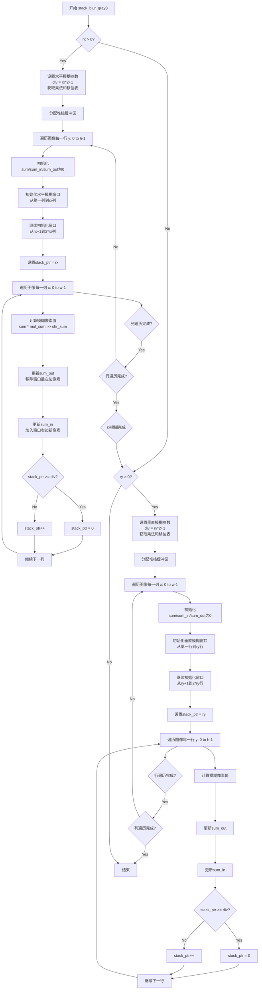

#### 带注释源码

```cpp
//========================================================stack_blur_gray8
// 灰度图像的Stack Blur模糊函数实现
// 使用堆栈数据结构维护滑动窗口，实现O(n)时间复杂度的快速模糊
// 
// 算法原理：
// 1. 使用一个固定大小的环形堆栈存储窗口内的像素值
// 2. 通过维护三个累加和(sum, sum_in, sum_out)实现快速计算
// 3. 使用预计算的乘法和移位表替代昂贵的除法运算
// 
// 模板参数：
// - Img: 图像类型，必须支持width(), height(), pix_ptr(), stride()方法
//
// 参数：
// - img: 待模糊的灰度图像，引用传递，原地修改
// - rx: 水平方向模糊半径，有效范围1-254
// - ry: 垂直方向模糊半径，有效范围1-254
//
template<class Img> 
void stack_blur_gray8(Img& img, unsigned rx, unsigned ry)
{
    // 循环计数器
    unsigned x, y, xp, yp, i;
    // 堆栈指针：指向当前处理的堆栈位置
    unsigned stack_ptr;
    // 堆栈起始位置：用于计算环形索引
    unsigned stack_start;

    // 源像素指针和目标像素指针
    const int8u* src_pix_ptr;
          int8u* dst_pix_ptr;
    // 当前像素值和堆栈像素值
    unsigned pix;
    unsigned stack_pix;
    // 累加和：
    // sum: 当前窗口内所有像素值的总和
    // sum_in: 新进入窗口的像素值总和
    // sum_out: 离开窗口的像素值总和
    unsigned sum;
    unsigned sum_in;
    unsigned sum_out;

    // 获取图像尺寸
    unsigned w   = img.width();   // 图像宽度
    unsigned h   = img.height();  // 图像高度
    unsigned wm  = w - 1;         // 右侧边界索引
    unsigned hm  = h - 1;         // 底部边界索引

    // 模糊参数：
    // div: 窗口大小 (radius * 2 + 1)
    // mul_sum: 乘法因子，从预计算表获取
    // shr_sum: 移位因子，从预计算表获取
    unsigned div;
    unsigned mul_sum;
    unsigned shr_sum;

    // 环形堆栈：存储窗口内的像素值
    pod_vector<int8u> stack;

    // ==================== 水平方向模糊 ====================
    if(rx > 0)
    {
        // 限制最大模糊半径为254（表的大小）
        if(rx > 254) rx = 254;
        
        // 计算窗口大小
        div = rx * 2 + 1;
        
        // 获取预计算的乘法和移位因子
        // 这些表将除法转换为乘法和移位，大幅提升性能
        mul_sum = stack_blur_tables<int>::g_stack_blur8_mul[rx];
        shr_sum = stack_blur_tables<int>::g_stack_blur8_shr[rx];
        
        // 分配堆栈空间
        stack.allocate(div);

        // 逐行处理
        for(y = 0; y < h; y++)
        {
            // 初始化累加和
            sum = sum_in = sum_out = 0;

            // 获取当前行的起始像素指针
            src_pix_ptr = img.pix_ptr(0, y);
            pix = *src_pix_ptr;
            
            // 初始化堆栈：填充第一行像素到堆栈前部
            // i从0到rx：将起始像素复制rx+1次到堆栈
            for(i = 0; i <= rx; i++)
            {
                stack[i] = pix;                    // 填充堆栈
                sum     += pix * (i + 1);          // 累加加权和
                sum_out += pix;                    // 记录总输出
            }
            
            // 继续填充堆栈：处理第rx+1到第2*rx个像素
            // 这些像素构成窗口的右侧部分
            for(i = 1; i <= rx; i++)
            {
                // 移动到下一个像素（边界检查）
                if(i <= wm) src_pix_ptr += Img::pix_width; 
                pix = *src_pix_ptr; 
                stack[i + rx] = pix;               // 填充堆栈右侧
                sum    += pix * (rx + 1 - i);      // 累加加权和
                sum_in += pix;                     // 记录新进入的像素
            }

            // 设置初始堆栈指针位置
            stack_ptr = rx;
            
            // 计算初始窗口右侧边界
            xp = rx;
            if(xp > wm) xp = wm;
            
            // 获取源和目标像素指针
            src_pix_ptr = img.pix_ptr(xp, y);
            dst_pix_ptr = img.pix_ptr(0, y);
            
            // 逐列处理：执行水平模糊
            for(x = 0; x < w; x++)
            {
                // 计算模糊后的像素值：使用乘法和移位替代除法
                // 公式: (sum * mul_sum) >> shr_sum 等价于 sum / div
                *dst_pix_ptr = (sum * mul_sum) >> shr_sum;
                dst_pix_ptr += Img::pix_width;

                // 从总和中减去离开窗口的像素值
                sum -= sum_out;
       
                // 计算环形堆栈索引
                stack_start = stack_ptr + div - rx;
                if(stack_start >= div) stack_start -= div;
                
                // 减去离开窗口的像素值
                sum_out -= stack[stack_start];

                // 将窗口向右移动：加入新像素
                if(xp < wm) 
                {
                    src_pix_ptr += Img::pix_width;
                    pix = *src_pix_ptr;
                    ++xp;
                }
        
                // 将新像素放入堆栈
                stack[stack_start] = pix;
        
                // 更新累加和
                sum_in += pix;
                sum    += sum_in;
        
                // 更新堆栈指针（环形移动）
                ++stack_ptr;
                if(stack_ptr >= div) stack_ptr = 0;
                stack_pix = stack[stack_ptr];

                // 更新输出累加和
                sum_out += stack_pix;
                sum_in  -= stack_pix;
            }
        }
    }

    // ==================== 垂直方向模糊 ====================
    if(ry > 0)
    {
        // 限制最大模糊半径
        if(ry > 254) ry = 254;
        
        // 计算窗口大小
        div = ry * 2 + 1;
        
        // 获取预计算的乘法和移位因子
        mul_sum = stack_blur_tables<int>::g_stack_blur8_mul[ry];
        shr_sum = stack_blur_tables<int>::g_stack_blur8_shr[ry];
        
        // 分配堆栈空间
        stack.allocate(div);

        // 获取图像行间距（字节数）
        int stride = img.stride();
        
        // 逐列处理（注意：这里是x外循环，y内循环，实现垂直模糊）
        for(x = 0; x < w; x++)
        {
            // 初始化累加和
            sum = sum_in = sum_out = 0;

            // 获取当前列的起始像素指针
            src_pix_ptr = img.pix_ptr(x, 0);
            pix = *src_pix_ptr;
            
            // 初始化垂直堆栈
            for(i = 0; i <= ry; i++)
            {
                stack[i] = pix;
                sum     += pix * (i + 1);
                sum_out += pix;
            }
            
            // 继续填充堆栈
            for(i = 1; i <= ry; i++)
            {
                // 向下移动（按stride跳跃）
                if(i <= hm) src_pix_ptr += stride; 
                pix = *src_pix_ptr; 
                stack[i + ry] = pix;
                sum    += pix * (ry + 1 - i);
                sum_in += pix;
            }

            // 设置初始堆栈指针
            stack_ptr = ry;
            
            // 计算初始窗口底部边界
            yp = ry;
            if(yp > hm) yp = hm;
            
            // 获取源和目标像素指针
            src_pix_ptr = img.pix_ptr(x, yp);
            dst_pix_ptr = img.pix_ptr(x, 0);
            
            // 逐行处理：执行垂直模糊
            for(y = 0; y < h; y++)
            {
                // 计算模糊后的像素值
                *dst_pix_ptr = (sum * mul_sum) >> shr_sum;
                dst_pix_ptr += stride;

                // 更新累加和
                sum -= sum_out;
       
                // 计算环形堆栈索引
                stack_start = stack_ptr + div - ry;
                if(stack_start >= div) stack_start -= div;
                sum_out -= stack[stack_start];

                // 将窗口向下移动
                if(yp < hm) 
                {
                    src_pix_ptr += stride;
                    pix = *src_pix_ptr;
                    ++yp;
                }
        
                // 更新堆栈
                stack[stack_start] = pix;
        
                // 更新累加和
                sum_in += pix;
                sum    += sum_in;
        
                // 更新堆栈指针
                ++stack_ptr;
                if(stack_ptr >= div) stack_ptr = 0;
                stack_pix = stack[stack_ptr];

                // 更新输出累加和
                sum_out += stack_pix;
                sum_in  -= stack_pix;
            }
        }
    }
}
```


### `stack_blur_rgb24`

对RGB24格式图像应用Stack Blur算法，实现快速的高斯模糊效果。该函数通过水平方向和垂直方向的两遍扫描，利用查表乘法替代除法运算，在保证模糊质量的同时显著提升性能。

参数：

- `img`：`Img&`，模板类型图像对象引用，需包含`color_type`、`order_type`、`width()`、`height()`、`pix_ptr()`、`stride()`等接口
- `rx`：`unsigned`，水平方向模糊半径，有效范围0-254，超过254会被截断
- `ry`：`unsigned`，垂直方向模糊半径，有效范围0-254，超过254会被截断

返回值：`void`，无返回值，结果直接写入输入图像对象中

#### 流程图

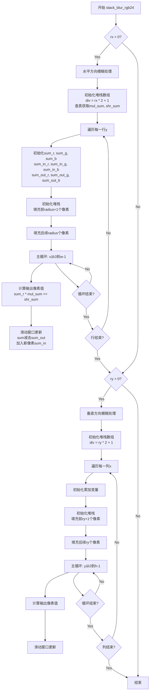

#### 带注释源码

```cpp
//========================================================stack_blur_rgb24
// 对RGB24图像应用Stack Blur模糊算法
// 模板参数Img: 图像类型，需提供color_type、order_type、width()、height()等接口
template<class Img> 
void stack_blur_rgb24(Img& img, unsigned rx, unsigned ry)
{
    // 从图像类型中提取颜色类型和通道顺序
    typedef typename Img::color_type color_type;
    typedef typename Img::order_type order_type;
    
    // 通道枚举: R=红色通道索引, G=绿色通道索引, B=蓝色通道索引
    enum order_e 
    { 
        R = order_type::R, 
        G = order_type::G, 
        B = order_type::B 
    };

    // 循环变量声明
    unsigned x, y, xp, yp, i;           // x,y: 当前像素坐标, xp,yp: 边界限制坐标, i: 堆栈索引
    unsigned stack_ptr;                 // 堆栈指针，指向当前滑窗中心
    unsigned stack_start;               // 堆栈起始位置，用于环形缓冲

    // 像素指针: 源像素和目标像素的指针
    const int8u* src_pix_ptr;
          int8u* dst_pix_ptr;
    color_type*  stack_pix_ptr;         // 堆栈中的像素颜色

    // 通道累加器: R/G/B三通道的滑动窗口和
    unsigned sum_r, sum_g, sum_b;       // 当前窗口内像素值的总和
    unsigned sum_in_r, sum_in_g, sum_in_b;    // 即将进入窗口的像素值之和
    unsigned sum_out_r, sum_out_g, sum_out_b; // 即将离开窗口的像素值之和

    // 图像尺寸
    unsigned w   = img.width();         // 图像宽度
    unsigned h   = img.height();         // 图像高度
    unsigned wm  = w - 1;               // 宽度边界索引(最大值)
    unsigned hm  = h - 1;               // 高度边界索引(最大值)

    // 模糊参数
    unsigned div;                       // 滑窗大小 = radius * 2 + 1
    unsigned mul_sum;                   // 乘法因子(查表获得，避免除法)
    unsigned shr_sum;                   // 右移位数(查表获得，配合mul_sum实现除法)

    // 堆栈数组: 用于存储滑窗内的像素颜色，实现环形缓冲
    pod_vector<color_type> stack;

    // ==================== 水平方向模糊 ====================
    if(rx > 0)
    {
        // 半径限制: 最大254(因查表数组大小为255)
        if(rx > 254) rx = 254;
        
        // 计算滑窗大小
        div = rx * 2 + 1;
        
        // 查表获取乘法和移位参数(替代除法，提升性能)
        mul_sum = stack_blur_tables<int>::g_stack_blur8_mul[rx];
        shr_sum = stack_blur_tables<int>::g_stack_blur8_shr[rx];
        
        // 分配堆栈内存
        stack.allocate(div);

        // 逐行处理
        for(y = 0; y < h; y++)
        {
            // 初始化所有累加器为0
            sum_r = sum_g = sum_b = 
            sum_in_r = sum_in_g = sum_in_b = 
            sum_out_r = sum_out_g = sum_out_b = 0;

            // 获取当前行起始像素指针
            src_pix_ptr = img.pix_ptr(0, y);
            
            // 初始化堆栈: 填充前(radius+1)个像素
            // 这些像素将被复制到堆栈前端，用于计算初始窗口和
            for(i = 0; i <= rx; i++)
            {
                stack_pix_ptr    = &stack[i];
                stack_pix_ptr->r = src_pix_ptr[R];
                stack_pix_ptr->g = src_pix_ptr[G];
                stack_pix_ptr->b = src_pix_ptr[B];
                sum_r           += src_pix_ptr[R] * (i + 1);
                sum_g           += src_pix_ptr[G] * (i + 1);
                sum_b           += src_pix_ptr[B] * (i + 1);
                sum_out_r       += src_pix_ptr[R];
                sum_out_g       += src_pix_ptr[G];
                sum_out_out_b   += src_pix_ptr[B];
            }
            
            // 继续填充剩余的radius个像素到堆栈
            for(i = 1; i <= rx; i++)
            {
                if(i <= wm) src_pix_ptr += Img::pix_width; 
                stack_pix_ptr = &stack[i + rx];
                stack_pix_ptr->r = src_pix_ptr[R];
                stack_pix_ptr->g = src_pix_ptr[G];
                stack_pix_ptr->b = src_pix_ptr[B];
                sum_r           += src_pix_ptr[R] * (rx + 1 - i);
                sum_g           += src_pix_ptr[G] * (rx + 1 - i);
                sum_b           += src_pix_ptr[B] * (rx + 1 - i);
                sum_in_r        += src_pix_ptr[R];
                sum_in_g        += src_pix_ptr[G];
                sum_in_b        += src_pix_ptr[B];
            }

            // 设置初始堆栈指针位置
            stack_ptr = rx;
            xp = rx;
            if(xp > wm) xp = wm;
            
            // 获取源像素和目标像素指针
            src_pix_ptr = img.pix_ptr(xp, y);
            dst_pix_ptr = img.pix_ptr(0, y);
            
            // 主循环: 水平扫描每个像素
            for(x = 0; x < w; x++)
            {
                // 计算输出像素: 使用乘法和移位替代除法
                // 公式: value = (sum * mul_sum) >> shr_sum
                // 等价于: value = sum / div，但避免了除法运算
                dst_pix_ptr[R] = (sum_r * mul_sum) >> shr_sum;
                dst_pix_ptr[G] = (sum_g * mul_sum) >> shr_sum;
                dst_pix_ptr[B] = (sum_b * mul_sum) >> shr_sum;
                dst_pix_ptr   += Img::pix_width;

                // 滑动窗口: 从总和中减去即将离开窗口的像素
                sum_r -= sum_out_r;
                sum_g -= sum_out_g;
                sum_b -= sum_out_b;
       
                // 计算堆栈中即将离开的像素位置(环形缓冲)
                stack_start = stack_ptr + div - rx;
                if(stack_start >= div) stack_start -= div;
                stack_pix_ptr = &stack[stack_start];

                // 从输出总和中减去离开的像素
                sum_out_r -= stack_pix_ptr->r;
                sum_out_g -= stack_pix_ptr->g;
                sum_out_b -= stack_pix_ptr->b;

                // 如果还未到达右边界，则读取下一个像素
                if(xp < wm) 
                {
                    src_pix_ptr += Img::pix_width;
                    ++xp;
                }
        
                // 将新像素放入堆栈(替代已离开的像素位置)
                stack_pix_ptr->r = src_pix_ptr[R];
                stack_pix_ptr->g = src_pix_ptr[G];
                stack_pix_ptr->b = src_pix_ptr[B];
        
                // 将新像素加入输入总和
                sum_in_r += src_pix_ptr[R];
                sum_in_g += src_pix_ptr[G];
                sum_in_b += src_pix_ptr[B];
                
                // 更新当前窗口总和: 加入新像素，输入总和累加
                sum_r    += sum_in_r;
                sum_g    += sum_in_g;
                sum_b    += sum_in_b;
        
                // 移动堆栈指针(环形)
                ++stack_ptr;
                if(stack_ptr >= div) stack_ptr = 0;
                stack_pix_ptr = &stack[stack_ptr];

                // 将新中心像素加入输出总和，从输入总和中移除
                sum_out_r += stack_pix_ptr->r;
                sum_out_g += stack_pix_ptr->g;
                sum_out_b += stack_pix_ptr->b;
                sum_in_r  -= stack_pix_ptr->r;
                sum_in_g  -= stack_pix_ptr->g;
                sum_in_b  -= stack_pix_ptr->b;
            }
        }
    }

    // ==================== 垂直方向模糊 ====================
    // 逻辑与水平方向相同，只是遍历方向改为列方向
    if(ry > 0)
    {
        if(ry > 254) ry = 254;
        div = ry * 2 + 1;
        mul_sum = stack_blur_tables<int>::g_stack_blur8_mul[ry];
        shr_sum = stack_blur_tables<int>::g_stack_blur8_shr[ry];
        stack.allocate(div);

        int stride = img.stride();  // 行跨度(字节数)
        
        // 逐列处理
        for(x = 0; x < w; x++)
        {
            sum_r = sum_g = sum_b = 
            sum_in_r = sum_in_g = sum_in_b = 
            sum_out_r = sum_out_g = sum_out_b = 0;

            src_pix_ptr = img.pix_ptr(x, 0);
            
            // 初始化堆栈
            for(i = 0; i <= ry; i++)
            {
                stack_pix_ptr    = &stack[i];
                stack_pix_ptr->r = src_pix_ptr[R];
                stack_pix_ptr->g = src_pix_ptr[G];
                stack_pix_ptr->b = src_pix_ptr[B];
                sum_r           += src_pix_ptr[R] * (i + 1);
                sum_g           += src_pix_ptr[G] * (i + 1);
                sum_b           += src_pix_ptr[B] * (i + 1);
                sum_out_r       += src_pix_ptr[R];
                sum_out_g       += src_pix_ptr[G];
                sum_out_b       += src_pix_ptr[B];
            }
            for(i = 1; i <= ry; i++)
            {
                if(i <= hm) src_pix_ptr += stride; 
                stack_pix_ptr = &stack[i + ry];
                stack_pix_ptr->r = src_pix_ptr[R];
                stack_pix_ptr->g = src_pix_ptr[G];
                stack_pix_ptr->b = src_pix_ptr[B];
                sum_r           += src_pix_ptr[R] * (ry + 1 - i);
                sum_g           += src_pix_ptr[G] * (ry + 1 - i);
                sum_b           += src_pix_ptr[B] * (ry + 1 - i);
                sum_in_r        += src_pix_ptr[R];
                sum_in_g        += src_pix_ptr[G];
                sum_in_b        += src_pix_ptr[B];
            }

            stack_ptr = ry;
            yp = ry;
            if(yp > hm) yp = hm;
            src_pix_ptr = img.pix_ptr(x, yp);
            dst_pix_ptr = img.pix_ptr(x, 0);
            
            // 主循环: 垂直扫描每个像素
            for(y = 0; y < h; y++)
            {
                dst_pix_ptr[R] = (sum_r * mul_sum) >> shr_sum;
                dst_pix_ptr[G] = (sum_g * mul_sum) >> shr_sum;
                dst_pix_ptr[B] = (sum_b * mul_sum) >> shr_sum;
                dst_pix_ptr += stride;

                sum_r -= sum_out_r;
                sum_g -= sum_out_g;
                sum_b -= sum_out_b;
       
                stack_start = stack_ptr + div - ry;
                if(stack_start >= div) stack_start -= div;

                stack_pix_ptr = &stack[stack_start];
                sum_out_r -= stack_pix_ptr->r;
                sum_out_g -= stack_pix_ptr->g;
                sum_out_b -= stack_pix_ptr->b;

                if(yp < hm) 
                {
                    src_pix_ptr += stride;
                    ++yp;
                }
        
                stack_pix_ptr->r = src_pix_ptr[R];
                stack_pix_ptr->g = src_pix_ptr[G];
                stack_pix_ptr->b = src_pix_ptr[B];
        
                sum_in_r += src_pix_ptr[R];
                sum_in_g += src_pix_ptr[G];
                sum_in_b += src_pix_ptr[B];
                sum_r    += sum_in_r;
                sum_g    += sum_in_g;
                sum_b    += sum_in_b;
        
                ++stack_ptr;
                if(stack_ptr >= div) stack_ptr = 0;
                stack_pix_ptr = &stack[stack_ptr];

                sum_out_r += stack_pix_ptr->r;
                sum_out_g += stack_pix_ptr->g;
                sum_out_b += stack_pix_ptr->b;
                sum_in_r  -= stack_pix_ptr->r;
                sum_in_g  -= stack_pix_ptr->g;
                sum_in_b  -= stack_pix_ptr->b;
            }
        }
    }
}
```


### `stack_blur_rgba32`

对RGBA图像执行Stack Blur模糊算法，先进行水平方向模糊（rx > 0时），再进行垂直方向模糊（ry > 0时）。该函数使用Mario Klingemann提出的Stack Blur算法，通过预计算的乘法和移位表避免昂贵的除法运算，从而在8位通道且半径不超过254时获得高性能。

参数：

- `img`：`Img&`，待模糊的图像对象引用，需支持`width()`、`height()`、`pix_ptr()`、`stride()`等接口
- `rx`：`unsigned`，水平方向模糊半径，若为0则跳过水平模糊
- `ry`：`unsigned`，垂直方向模糊半径，若为0则跳过垂直模糊

返回值：`void`，直接在输入的img对象上修改像素值，无返回值

#### 流程图

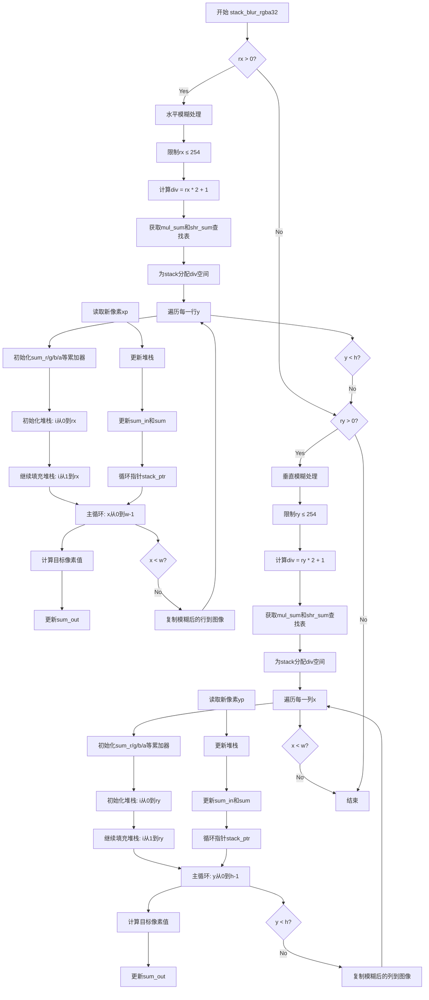

#### 带注释源码

```cpp
//=======================================================stack_blur_rgba32
// 对RGBA 32位图像执行Stack Blur模糊算法
// template参数Img: 图像类型，需支持pix_ptr/width/height/stride等接口
template<class Img> 
void stack_blur_rgba32(Img& img, unsigned rx, unsigned ry)
{
    // 定义图像的颜色类型和通道顺序
    typedef typename Img::color_type color_type;
    typedef typename Img::order_type order_type;
    enum order_e 
    { 
        R = order_type::R, 
        G = order_type::G, 
        B = order_type::B,
        A = order_type::A 
    };

    // 循环变量声明
    unsigned x, y, xp, yp, i;
    unsigned stack_ptr;      // 指向当前堆栈位置
    unsigned stack_start;    // 堆栈起始索引

    // 源和目标像素指针
    const int8u* src_pix_ptr;
          int8u* dst_pix_ptr;
    color_type*  stack_pix_ptr;  // 堆栈中的像素颜色

    // RGBA四通道的累加器：当前窗口内像素值之和
    unsigned sum_r, sum_g, sum_b, sum_a;
    // 进入窗口的像素值之和（窗口前端）
    unsigned sum_in_r, sum_in_g, sum_in_b, sum_in_a;
    // 离开窗口的像素值之和（窗口后端）
    unsigned sum_out_r, sum_out_g, sum_out_b, sum_out_a;

    // 获取图像尺寸
    unsigned w   = img.width();
    unsigned h   = img.height();
    unsigned wm  = w - 1;  // 宽度边界索引
    unsigned hm  = h - 1;  // 高度边界索引

    // 模糊参数
    unsigned div;          // 窗口大小 = radius * 2 + 1
    unsigned mul_sum;      // 快速除法用的乘数
    unsigned shr_sum;      // 快速除法用的移位量

    // 堆栈：存储窗口内的像素颜色，用于计算模糊
    pod_vector<color_type> stack;

    // ==================== 水平方向模糊 ====================
    if(rx > 0)
    {
        // 限制最大半径为254，避免数组越界
        if(rx > 254) rx = 254;
        
        // 计算滑动窗口大小
        div = rx * 2 + 1;
        
        // 使用查找表进行快速除法（替代昂贵的除法运算）
        mul_sum = stack_blur_tables<int>::g_stack_blur8_mul[rx];
        shr_sum = stack_blur_tables<int>::g_stack_blur8_shr[rx];
        
        // 为堆栈分配空间
        stack.allocate(div);

        // 遍历每一行
        for(y = 0; y < h; y++)
        {
            // 初始化所有累加器为0
            sum_r = sum_g = sum_b = sum_a = 
            sum_in_r = sum_in_g = sum_in_b = sum_in_a = 
            sum_out_r = sum_out_g = sum_out_b = sum_out_a = 0;

            // 获取当前行起始像素指针
            src_pix_ptr = img.pix_ptr(0, y);
            
            // 初始化堆栈：填入第一个像素（边界扩展）
            for(i = 0; i <= rx; i++)
            {
                stack_pix_ptr    = &stack[i];
                stack_pix_ptr->r = src_pix_ptr[R];
                stack_pix_ptr->g = src_pix_ptr[G];
                stack_pix_ptr->b = src_pix_ptr[B];
                stack_pix_ptr->a = src_pix_ptr[A];
                // 权重为 i+1，越靠近中心权重越大
                sum_r += src_pix_ptr[R] * (i + 1);
                sum_g += src_pix_ptr[G] * (i + 1);
                sum_b += src_pix_ptr[B] * (i + 1);
                sum_a += src_pix_ptr[A] * (i + 1);
                // 记录窗口后端的像素值（即将离开窗口的）
                sum_out_r += src_pix_ptr[R];
                sum_out_g += src_pix_ptr[G];
                sum_out_b += src_pix_ptr[B];
                sum_out_a += src_pix_ptr[A];
            }
            
            // 继续填充堆栈：填入半径范围内的像素
            for(i = 1; i <= rx; i++)
            {
                // 移动指针到下一个像素（不超过边界）
                if(i <= wm) src_pix_ptr += Img::pix_width; 
                stack_pix_ptr = &stack[i + rx];
                stack_pix_ptr->r = src_pix_ptr[R];
                stack_pix_ptr->g = src_pix_ptr[G];
                stack_pix_ptr->b = src_pix_ptr[B];
                stack_pix_ptr->a = src_pix_ptr[A];
                // 权重递减
                sum_r += src_pix_ptr[R] * (rx + 1 - i);
                sum_g += src_pix_ptr[G] * (rx + 1 - i);
                sum_b += src_pix_ptr[B] * (rx + 1 - i);
                sum_a += src_pix_ptr[A] * (rx + 1 - i);
                // 记录进入窗口的像素值
                sum_in_r += src_pix_ptr[R];
                sum_in_g += src_pix_ptr[G];
                sum_in_b += src_pix_ptr[B];
                sum_in_a += src_pix_ptr[A];
            }

            // 初始化堆栈指针和x方向扫描起点
            stack_ptr = rx;
            xp = rx;
            if(xp > wm) xp = wm;
            src_pix_ptr = img.pix_ptr(xp, y);
            dst_pix_ptr = img.pix_ptr(0, y);
            
            // 水平扫描主循环：对每个像素进行模糊
            for(x = 0; x < w; x++)
            {
                // 使用快速移位替代除法计算目标像素值
                dst_pix_ptr[R] = (sum_r * mul_sum) >> shr_sum;
                dst_pix_ptr[G] = (sum_g * mul_sum) >> shr_sum;
                dst_pix_ptr[B] = (sum_b * mul_sum) >> shr_sum;
                dst_pix_ptr[A] = (sum_a * mul_sum) >> shr_sum;
                dst_pix_ptr += Img::pix_width;

                // 从总和中减去离开窗口的像素值
                sum_r -= sum_out_r;
                sum_g -= sum_out_g;
                sum_b -= sum_out_b;
                sum_a -= sum_out_a;
       
                // 计算即将离开窗口的堆栈位置（环形缓冲）
                stack_start = stack_ptr + div - rx;
                if(stack_start >= div) stack_start -= div;
                stack_pix_ptr = &stack[stack_start];

                // 更新离开窗口的累加器
                sum_out_r -= stack_pix_ptr->r;
                sum_out_g -= stack_pix_ptr->g;
                sum_out_b -= stack_pix_ptr->b;
                sum_out_a -= stack_pix_ptr->a;

                // 读取下一个要加入窗口的像素
                if(xp < wm) 
                {
                    src_pix_ptr += Img::pix_width;
                    ++xp;
                }
        
                // 将新像素放入堆栈
                stack_pix_ptr->r = src_pix_ptr[R];
                stack_pix_ptr->g = src_pix_ptr[G];
                stack_pix_ptr->b = src_pix_ptr[B];
                stack_pix_ptr->a = src_pix_ptr[A];
        
                // 更新进入窗口的累加器和总和
                sum_in_r += src_pix_ptr[R];
                sum_in_g += src_pix_ptr[G];
                sum_in_b += src_pix_ptr[B];
                sum_in_a += src_pix_ptr[A];
                sum_r    += sum_in_r;
                sum_g    += sum_in_g;
                sum_b    += sum_in_b;
                sum_a    += sum_in_a;
        
                // 移动堆栈指针（环形）
                ++stack_ptr;
                if(stack_ptr >= div) stack_ptr = 0;
                stack_pix_ptr = &stack[stack_ptr];

                // 将新进入窗口的像素加入out累加器，从in中移除
                sum_out_r += stack_pix_ptr->r;
                sum_out_g += stack_pix_ptr->g;
                sum_out_b += stack_pix_ptr->b;
                sum_out_a += stack_pix_ptr->a;
                sum_in_r  -= stack_pix_ptr->r;
                sum_in_g  -= stack_pix_ptr->g;
                sum_in_b  -= stack_pix_ptr->b;
                sum_in_a  -= stack_pix_ptr->a;
            }
        }
    }

    // ==================== 垂直方向模糊 ====================
    if(ry > 0)
    {
        // 限制最大半径为254
        if(ry > 254) ry = 254;
        div = ry * 2 + 1;
        mul_sum = stack_blur_tables<int>::g_stack_blur8_mul[ry];
        shr_sum = stack_blur_tables<int>::g_stack_blur8_shr[ry];
        stack.allocate(div);

        // 获取行间距（垂直方向扫描需要）
        int stride = img.stride();
        
        // 遍历每一列
        for(x = 0; x < w; x++)
        {
            // 初始化所有累加器
            sum_r = sum_g = sum_b = sum_a = 
            sum_in_r = sum_in_g = sum_in_b = sum_in_a = 
            sum_out_r = sum_out_g = sum_out_b = sum_out_a = 0;

            src_pix_ptr = img.pix_ptr(x, 0);
            
            // 初始化堆栈：填入第一个像素
            for(i = 0; i <= ry; i++)
            {
                stack_pix_ptr    = &stack[i];
                stack_pix_ptr->r = src_pix_ptr[R];
                stack_pix_ptr->g = src_pix_ptr[G];
                stack_pix_ptr->b = src_pix_ptr[B];
                stack_pix_ptr->a = src_pix_ptr[A];
                sum_r += src_pix_ptr[R] * (i + 1);
                sum_g += src_pix_ptr[G] * (i + 1);
                sum_b += src_pix_ptr[B] * (i + 1);
                sum_a += src_pix_ptr[A] * (i + 1);
                sum_out_r += src_pix_ptr[R];
                sum_out_g += src_pix_ptr[G];
                sum_out_b += src_pix_ptr[B];
                sum_out_a += src_pix_ptr[A];
            }
            
            // 继续填充堆栈
            for(i = 1; i <= ry; i++)
            {
                if(i <= hm) src_pix_ptr += stride; 
                stack_pix_ptr = &stack[i + ry];
                stack_pix_ptr->r = src_pix_ptr[R];
                stack_pix_ptr->g = src_pix_ptr[G];
                stack_pix_ptr->b = src_pix_ptr[B];
                stack_pix_ptr->a = src_pix_ptr[A];
                sum_r += src_pix_ptr[R] * (ry + 1 - i);
                sum_g += src_pix_ptr[G] * (ry + 1 - i);
                sum_b += src_pix_ptr[B] * (ry + 1 - i);
                sum_a += src_pix_ptr[A] * (ry + 1 - i);
                sum_in_r += src_pix_ptr[R];
                sum_in_g += src_pix_ptr[G];
                sum_in_b += src_pix_ptr[B];
                sum_in_a += src_pix_ptr[A];
            }

            // 初始化堆栈指针和y方向扫描起点
            stack_ptr = ry;
            yp = ry;
            if(yp > hm) yp = hm;
            src_pix_ptr = img.pix_ptr(x, yp);
            dst_pix_ptr = img.pix_ptr(x, 0);
            
            // 垂直扫描主循环
            for(y = 0; y < h; y++)
            {
                // 计算目标像素值
                dst_pix_ptr[R] = (sum_r * mul_sum) >> shr_sum;
                dst_pix_ptr[G] = (sum_g * mul_sum) >> shr_sum;
                dst_pix_ptr[B] = (sum_b * mul_sum) >> shr_sum;
                dst_pix_ptr[A] = (sum_a * mul_sum) >> shr_sum;
                dst_pix_ptr += stride;

                // 更新累加器
                sum_r -= sum_out_r;
                sum_g -= sum_out_g;
                sum_b -= sum_out_b;
                sum_a -= sum_out_a;
       
                stack_start = stack_ptr + div - ry;
                if(stack_start >= div) stack_start -= div;

                stack_pix_ptr = &stack[stack_start];
                sum_out_r -= stack_pix_ptr->r;
                sum_out_g -= stack_pix_ptr->g;
                sum_out_b -= stack_pix_ptr->b;
                sum_out_a -= stack_pix_ptr->a;

                if(yp < hm) 
                {
                    src_pix_ptr += stride;
                    ++yp;
                }
        
                stack_pix_ptr->r = src_pix_ptr[R];
                stack_pix_ptr->g = src_pix_ptr[G];
                stack_pix_ptr->b = src_pix_ptr[B];
                stack_pix_ptr->a = src_pix_ptr[A];
        
                sum_in_r += src_pix_ptr[R];
                sum_in_g += src_pix_ptr[G];
                sum_in_b += src_pix_ptr[B];
                sum_in_a += src_pix_ptr[A];
                sum_r    += sum_in_r;
                sum_g    += sum_in_g;
                sum_b    += sum_in_b;
                sum_a    += sum_in_a;
        
                ++stack_ptr;
                if(stack_ptr >= div) stack_ptr = 0;
                stack_pix_ptr = &stack[stack_ptr];

                sum_out_r += stack_pix_ptr->r;
                sum_out_g += stack_pix_ptr->g;
                sum_out_b += stack_pix_ptr->b;
                sum_out_a += stack_pix_ptr->a;
                sum_in_r  -= stack_pix_ptr->r;
                sum_in_g  -= stack_pix_ptr->g;
                sum_in_b  -= stack_pix_ptr->b;
                sum_in_a  -= stack_pix_ptr->a;
            }
        }
    }
}
```


### `apply_slight_blur`

应用轻量级模糊（Light-weight Gaussian blur）到图像的辅助函数，提供四个重载版本，分别支持直接对 PixFmt 图像进行全图或局部模糊，以及对 renderer_base 包装的图像进行模糊处理。

参数：

- `img`：`PixFmt&`，要模糊的像素格式图像对象引用
- `img`：`renderer_base<PixFmt>&`，要模糊的渲染器基类对象引用
- `bounds`：`const rect_i&`，模糊区域的边界矩形（可选参数）
- `r`：`double = 1`，模糊半径，默认为 1.0

返回值：`void`，无返回值

#### 流程图

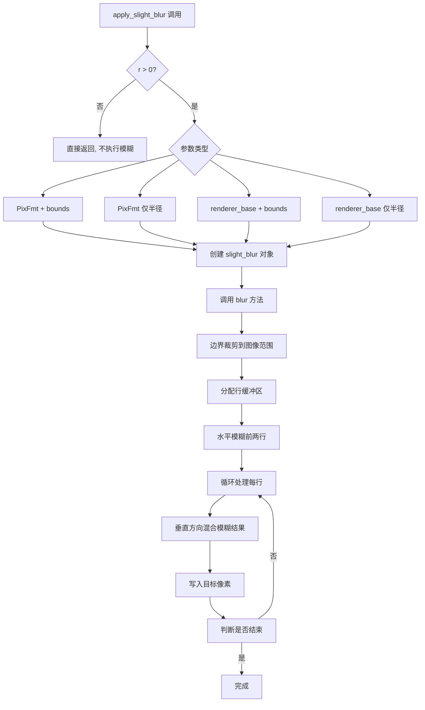

#### 带注释源码

```cpp
//============================================================================
// apply_slight_blur - 轻量级模糊辅助函数
//============================================================================

//------------------------------------------------------------------------------
// 重载版本 1: 对 PixFmt 图像应用指定区域模糊
//------------------------------------------------------------------------------
template<class PixFmt>
void apply_slight_blur(PixFmt& img, const rect_i& bounds, double r = 1)
{
    // 仅当半径大于0时执行模糊操作
    if (r > 0)
    {
        // 创建轻量级模糊器并执行模糊
        // 内部会创建 slight_blur<PixFmt> 对象并调用其 blur 方法
        slight_blur<PixFmt>(r).blur(img, bounds);
    }
}

//------------------------------------------------------------------------------
// 重载版本 2: 对 PixFmt 图像应用全图模糊
//------------------------------------------------------------------------------
template<class PixFmt>
void apply_slight_blur(PixFmt& img, double r = 1)
{
    if (r > 0)
    {
        // 创建覆盖整个图像的边界矩形
        rect_i bounds(0, 0, img.width() - 1, img.height() - 1);
        slight_blur<PixFmt>(r).blur(img, bounds);
    }
}

//------------------------------------------------------------------------------
// 重载版本 3: 对 renderer_base 包装的图像应用指定区域模糊
//------------------------------------------------------------------------------
template<class PixFmt>
void apply_slight_blur(renderer_base<PixFmt>& img, const rect_i& bounds, double r = 1)
{
    if (r > 0)
    {
        // 从 renderer_base 获取内部的 PixFmt 渲染器对象
        slight_blur<PixFmt>(r).blur(img.ren(), bounds);
    }
}

//------------------------------------------------------------------------------
// 重载版本 4: 对 renderer_base 包装的图像应用全图模糊
// 使用渲染器的裁剪框作为模糊区域
//------------------------------------------------------------------------------
template<class PixFmt>
void apply_slight_blur(renderer_base<PixFmt>& img, double r = 1)
{
    if (r > 0)
    {
        // 使用渲染器的裁剪区域作为模糊边界
        slight_blur<PixFmt>(r).blur(img.ren(), img.clip_box());
    }
}
```


### `stack_blur<ColorT, CalculatorT>::blur_x`

对图像进行水平方向的Stack Blur模糊处理，使用滑动窗口算法在O(radius)时间内完成每个像素的模糊计算，通过预计算的乘法和移位表替代昂贵的除法操作。

参数：

- `img`：`Img&`，待模糊的图像对象，需支持width()、height()、pixel()和copy_color_hspan()接口
- `radius`：`unsigned`，模糊半径，范围[1, 254]，值越大模糊效果越强

返回值：`void`，直接修改传入的图像对象

#### 流程图

```mermaid
flowchart TD
    A[开始 blur_x] --> B{radius < 1?}
    B -->|是| C[直接返回]
    B -->|否| D[初始化变量: x, y, xp, i, stack_ptr, stack_start]
    D --> E[获取图像尺寸: w, h, wm]
    E --> F[计算div = radius * 2 + 1]
    F --> G{条件判断<br/>max_val <= 255 && radius < 255?}
    G -->|是| H[使用快速算法: mul_sum, shr_sum]
    G -->|否| I[使用普通算法: div_sum]
    H --> J[分配缓冲区: m_buf[w], m_stack[div]]
    I --> J
    J --> K[遍历每行 y: 0 到 h-1]
    K --> L[初始化 sum, sum_in, sum_out]
    L --> M[取第一列像素pix]
    M --> N[填充初始窗口: i从0到radius]
    N --> O[填充右侧窗口: i从1到radius]
    O --> P[设置stack_ptr = radius]
    P --> Q[遍历每列 x: 0 到 w-1]
    Q --> R{使用快速算法?}
    R -->|是| S[计算m_buf[x]使用mul_sum和shr_sum]
    R -->|否| T[计算m_buf[x]使用div_sum]
    S --> U[sum减去sum_out]
    T --> U
    U --> V[计算stack_start并获取栈像素]
    V --> W[sum_out减去栈像素]
    W --> X[获取右侧新像素xp]
    X --> Y[将新像素放入栈]
    Y --> Z[更新sum_in和sum]
    Z --> AA[stack_ptr递增并循环]
    AA --> AB{stack_ptr >= div?}
    AB -->|是| AC[stack_ptr = 0]
    AB -->|否| AD[继续]
    AC --> AD
    AD --> AE[更新sum_out和sum_in]
    AE --> AF{列循环结束?}
    AF -->|否| Q
    AF -->|是| AG[复制模糊行到图像: copy_color_hspan]
    AG --> AH{行循环结束?}
    AH -->|否| K
    AH -->|是| AI[结束]
```

#### 带注释源码

```cpp
//-----------------------------------------------------------------------------
// Stack Blur - 水平方向模糊实现
// 基于Mario Klingemann的Stack Blur算法
//-----------------------------------------------------------------------------
template<class ColorT, class CalculatorT> class stack_blur
{
public:
    typedef ColorT      color_type;
    typedef CalculatorT calculator_type;

    //--------------------------------------------------------------------
    // 水平方向模糊主函数
    // @param img  图像对象引用，支持pixel()和copy_color_hspan()接口
    // @param radius 模糊半径，范围[1, 254]
    //--------------------------------------------------------------------
    template<class Img> void blur_x(Img& img, unsigned radius)
    {
        // 半径为0或1以下不需要模糊，直接返回
        if(radius < 1) return;

        // 声明循环变量
        unsigned x, y, xp, i;          // x,y:当前像素坐标; xp:右侧像素坐标; i:循环计数
        unsigned stack_ptr;            // 栈指针，指向当前窗口中心
        unsigned stack_start;          // 栈起始位置，用于环形缓冲

        // 像素和计算器变量
        color_type      pix;            // 当前像素颜色值
        color_type*     stack_pix;      // 栈中的像素指针
        calculator_type sum;            // 当前窗口内像素加权和
        calculator_type sum_in;         // 窗口内新进入像素的和
        calculator_type sum_out;        // 窗口内离开像素的和

        // 获取图像尺寸
        unsigned w   = img.width();     // 图像宽度
        unsigned h   = img.height();    // 图像高度
        unsigned wm  = w - 1;           // 最后一个有效列索引
        unsigned div = radius * 2 + 1; // 窗口大小（直径）

        // 预计算除数相关变量
        unsigned div_sum = (radius + 1) * (radius + 1);  // 用于普通除法
        unsigned mul_sum = 0;             // 快速乘数（mul_sum * sum >> shr_sum 代替除法）
        unsigned shr_sum = 0;             // 右移位数
        unsigned max_val = color_type::base_mask;  // 颜色通道最大值

        // 针对8位通道和较小半径使用快速算法
        // 避免使用昂贵的除法操作，改用乘法和位移
        if(max_val <= 255 && radius < 255)
        {
            mul_sum = stack_blur_tables<int>::g_stack_blur8_mul[radius];
            shr_sum = stack_blur_tables<int>::g_stack_blur8_shr[radius];
        }

        // 分配行缓冲区和栈缓冲区
        m_buf.allocate(w, 128);   // 存储一行的模糊结果
        m_stack.allocate(div, 32); // 环形栈，存储窗口内的像素

        // 逐行处理
        for(y = 0; y < h; y++)
        {
            // 初始化累加器
            sum.clear();
            sum_in.clear();
            sum_out.clear();

            // 获取当前行第一个像素
            pix = img.pixel(0, y);
            
            // 填充初始窗口（左半部分）：将第一个像素复制radius+1次到栈中
            // 这样处理边界：窗口左侧没有像素时使用边缘像素
            for(i = 0; i <= radius; i++)
            {
                m_stack[i] = pix;              // 将边缘像素放入栈
                sum.add(pix, i + 1);           // 累加加权和（越靠近中心权重越大）
                sum_out.add(pix);              // 累加到输出总和
            }
            
            // 填充窗口右半部分
            for(i = 1; i <= radius; i++)
            {
                // 获取右侧像素（不超过图像边界）
                pix = img.pixel((i > wm) ? wm : i, y);
                m_stack[i + radius] = pix;    // 放入栈的右半部分
                sum.add(pix, radius + 1 - i); // 权重递减
                sum_in.add(pix);               // 累加到输入总和
            }

            // 设置栈指针指向窗口中心
            stack_ptr = radius;
            
            // 水平滑动窗口处理每一列
            for(x = 0; x < w; x++)
            {
                // 计算当前像素的模糊值
                // 使用快速算法（乘法和位移）或普通除法算法
                if(mul_sum) 
                    sum.calc_pix(m_buf[x], mul_sum, shr_sum);
                else        
                    sum.calc_pix(m_buf[x], div_sum);

                // 窗口向右滑动一个像素：首先移除最左侧像素的贡献
                sum.sub(sum_out);
       
                // 计算栈中的起始位置（环形缓冲）
                stack_start = stack_ptr + div - radius;
                if(stack_start >= div) stack_start -= div;
                stack_pix = &m_stack[stack_start];

                // 从输出总和中移除即将离开窗口的像素
                sum_out.sub(*stack_pix);

                // 获取窗口右侧新像素的坐标
                xp = x + radius + 1;
                if(xp > wm) xp = wm;
                pix = img.pixel(xp, y);
            
                // 将新像素放入栈中（替换即将离开的位置）
                *stack_pix = pix;
            
                // 添加新像素的贡献
                sum_in.add(pix);
                sum.add(sum_in);  // 更新总sum（包含输入和输出的差值）
            
                // 移动栈指针到下一个位置（环形）
                ++stack_ptr;
                if(stack_ptr >= div) stack_ptr = 0;
                stack_pix = &m_stack[stack_ptr];

                // 添加新中心像素到输出总和
                sum_out.add(*stack_pix);
                // 从输入总和中减去中心像素（因为窗口已移动）
                sum_in.sub(*stack_pix);
            }
            
            // 将模糊后的整行写入图像
            img.copy_color_hspan(0, y, w, &m_buf[0]);
        }
    }

private:
    // 成员变量：行缓冲区和栈缓冲区
    pod_vector<color_type> m_buf;   // 临时存储一行的模糊结果
    pod_vector<color_type> m_stack; // 环形栈，存储窗口内的像素值
};
```


### `stack_blur.blur_y`

该方法是 Stack Blur 模糊算法的垂直方向实现，通过将图像转置后调用水平模糊方法来实现垂直方向的模糊效果，利用 `pixfmt_transposer` 将行与列互换，从而复用 `blur_x` 的逻辑完成垂直模糊。

参数：

- `img`：`Img&`，图像对象引用，待模糊的图像缓冲区
- `radius`：`unsigned`，模糊半径，值越大模糊效果越强，范围建议 0-254

返回值：`void`，无返回值，直接在原图像缓冲区修改

#### 流程图

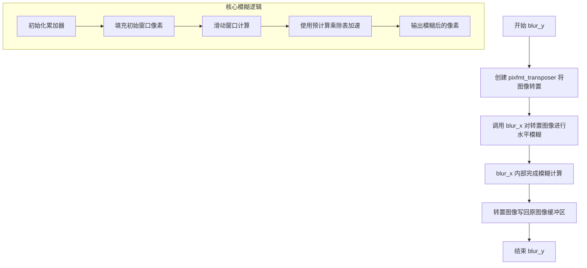

#### 带注释源码

```cpp
//--------------------------------------------------------------------
/// @brief 垂直方向 Stack Blur 模糊
/// @tparam Img 图像类型，需支持 pixfmt_transposer 转置
/// @param img 输入输出图像引用
/// @param radius 模糊半径，范围 0-254
template<class Img> void blur_y(Img& img, unsigned radius)
{
    // 如果半径为0，不进行模糊处理
    if(radius < 1) return;

    // 使用 pixfmt_transposer 将图像转置
    // 转置后，原来的垂直方向变为水平方向
    // 这样就可以复用 blur_x 的实现来执行垂直模糊
    pixfmt_transposer img2(img);
    
    // 对转置后的图像调用水平模糊
    // 执行完毕后，原图像的垂直方向已被模糊
    blur_x(img2, radius);
}
```

#### 技术说明

该方法的核心思想是利用图像转置技巧：将垂直方向的模糊转化为水平方向的模糊。具体流程如下：

1. **转置操作**：创建 `pixfmt_transposer` 对象，将图像的行和列互换
2. **水平模糊**：调用 `blur_x` 对转置后的图像进行水平方向模糊
3. **写回原图**：由于 `pixfmt_transposer` 对原图像的引用语义，模糊结果直接写回原图像缓冲区的对应位置

这种设计避免了重复实现垂直方向的模糊算法，体现了代码复用思想。`blur_x` 内部使用滑动窗口算法，配合预计算的乘法表（`g_stack_blur8_mul`）和移位表（`g_stack_blur8_shr`）实现高效的整数运算，避免了除法操作。


### `stack_blur.blur`

这是 Stack Blur 模糊算法的二维模糊入口函数，通过先对图像进行水平方向模糊，再利用转置器进行垂直方向模糊，实现完整的二维高斯模糊效果。该函数是类 `stack_blur` 的公共方法，提供了对任意图像类型进行 Stack Blur 模糊处理的能力。

参数：

- `img`：`Img&`，待模糊的图像对象引用，支持任意符合AGG图像接口规范的图像类型（如 `pixfmt_gray8`、`pixfmt_rgb24`、`pixfmt_rgba32` 等）
- `radius`：`unsigned`，模糊半径，值越大模糊效果越强，但最大有效值为254（代码中对超过254的半径进行了截断）

返回值：`void`，无返回值，模糊结果直接写入到输入的图像对象中

#### 流程图

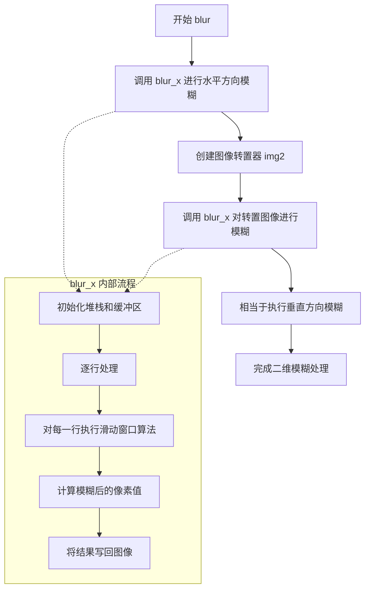

#### 带注释源码

```cpp
//--------------------------------------------------------------------
/// @brief 对图像进行完整的二维Stack Blur模糊处理
/// @tparam Img 图像类型，需提供width()、height()、pixel()、copy_color_hspan()等接口
/// @param img 待处理的图像对象引用，模糊结果直接修改原图像
/// @param radius 模糊半径，范围1-254，超过254的值会被截断
//--------------------------------------------------------------------
template<class Img> void blur(Img& img, unsigned radius)
{
    // 第一步：执行水平方向的模糊处理
    // blur_x 会对图像的每一行进行一维Stack Blur处理
    blur_x(img, radius);
    
    // 第二步：进行垂直方向的模糊
    // 由于Stack Blur算法本质上是针对一维序列设计的，
    // 这里利用 pixfmt_transposer 将图像转置，
    // 这样原来的垂直方向就变成了水平方向，可以复用 blur_x 函数
    // 转置操作不复制数据，只是改变访问方式
    pixfmt_transposer img2(img);
    
    // 对转置后的图像再次执行水平模糊，
    // 实际上等价于对原始图像执行了垂直模糊
    blur_x(img2, radius);
    
    // 完成：此时图像已经经历了完整的二维模糊处理
    // 效果等价于先水平模糊再垂直模糊（或相反顺序）
}
```

#### 类详细信息

**类名**：stack_blur

**类描述**：基于 Mario Klingemann 提出的 Stack Blur 算法实现的图像模糊类，采用模板设计支持多种图像格式和颜色类型。该算法通过预计算的乘法和位移表替代了传统模糊算法中的除法操作，大大提高了计算效率。

**类字段**：

- `m_buf`：`pod_vector<color_type>`，行缓冲区，用于存储模糊计算过程中的临时像素值
- `m_stack`：`pod_vector<color_type>`，堆栈缓冲区，用于存储滑动窗口内的像素值队列

**类方法**：

- `blur_x(Img& img, unsigned radius)`：执行水平方向的一维模糊，内部实现滑动窗口算法
- `blur_y(Img& img, unsigned radius)`：通过转置图像调用 blur_x 实现垂直模糊
- `blur(Img& img, unsigned radius)`：完整的二维模糊实现

#### 关键组件信息

- **stack_blur_tables**：预计算的乘法和位移查找表，用于将除法转换为乘法和位移操作，提升性能
- **pixfmt_transposer**：图像转置器，提供了将二维图像数据按行列转置访问的能力，用于将垂直模糊转换为水平模糊
- **stack_blur_calc_rgba / stack_blur_calc_rgb / stack_blur_calc_gray**：不同颜色格式的计算器模板，封装了模糊计算的具体逻辑

#### 潜在技术债务与优化空间

1. **代码重复**：水平模糊和垂直模糊的代码逻辑高度相似，虽然通过转置器复用了一套代码，但直接实现的垂直模糊函数（如 `stack_blur_gray8`、`stack_blur_rgb24` 等）仍有大量重复代码
2. **类型特化**：针对不同像素格式（灰度、RGB、RGBA）存在多个独立的函数实现，可以使用模板元编程进一步统一
3. **内存分配**：每次调用都会重新分配 `m_buf` 和 `m_stack` 的内存，可以考虑使用对象池或预分配策略
4. **边界处理**：代码中大量的边界检查（如 `if(xp > wm) xp = wm;`）可能影响性能，可以考虑使用边界镜像或环绕策略

#### 其它项目

**设计目标与约束**：
- 目标：提供一种高效的图像模糊实现，时间复杂度为 O(radius × width × height)
- 约束：radius 最大值为254（受预计算表大小限制），图像类型必须符合AGG的图像接口规范

**错误处理与异常设计**：
- 当 radius < 1 时，函数直接返回，不进行任何处理
- 半径超过254时会被自动截断到254
- 未进行图像有效性检查，调用者需确保图像对象有效

**数据流与状态机**：
- 数据流：输入图像 → 水平模糊 → 转置 → 垂直模糊 → 输出图像
- 状态机：blur 方法内部没有显式状态机，主要逻辑是顺序执行两次模糊操作

**外部依赖与接口契约**：
- 依赖 `agg_array.h`（pod_vector）、`agg_pixfmt_base.h`（像素格式）、`agg_pixfmt_transposer.h`（转置器）
- 调用者需提供实现了 width()、height()、pixel()、copy_color_hspan() 等接口的图像对象


### `stack_blur_calc_rgba.clear`

该方法是 `stack_blur_calc_rgba` 结构体的成员函数，用于将 RGBA 四个通道的累加器值清零，为下一行的模糊计算做准备。

参数：无

返回值：`void`，无返回值

#### 流程图

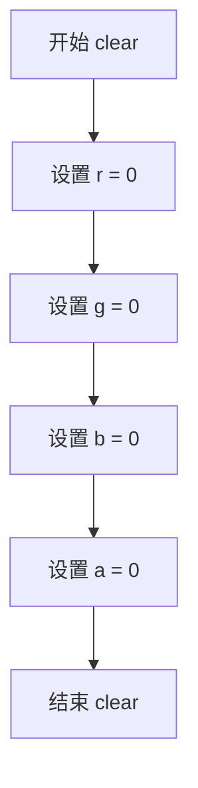

#### 带注释源码

```cpp
//====================================================stack_blur_calc_rgba
// 结构体模板：用于 Stack Blur 算法的 RGBA 颜色通道计算累加器
//====================================================
template<class T=unsigned> struct stack_blur_calc_rgba
{
    // 类型定义：使用模板参数 T 作为值类型
    typedef T value_type;
    
    // RGBA 四个通道的累加器值
    value_type r;  // 红色通道累加值
    value_type g;  // 绿色通道累加值
    value_type b;  // 蓝色通道累加值
    value_type a;  // 透明通道累加值

    //-----------------------------------------------------------------------
    // 方法：clear - 清零所有通道累加器
    //-----------------------------------------------------------------------
    AGG_INLINE void clear() 
    { 
        // 将 RGBA 四个通道的值全部设置为 0
        // 为下一次扫描线的模糊计算初始化累加器状态
        r = g = b = a = 0; 
    }
    // ...
};
```

#### 详细说明

| 项目 | 描述 |
|------|------|
| **所属类/结构体** | `stack_blur_calc_rgba` |
| **方法类型** | 成员方法 |
| **内联标记** | `AGG_INLINE`（编译期内联优化） |
| **功能说明** | 将 RGBA 四个通道的累加器值清零，用于在 Stack Blur 算法中重置行扫描状态 |
| **调用场景** | 在 `stack_blur<ColorT, CalculatorT>::blur_x` 方法中，每行像素处理开始时被调用，用于初始化 `sum`、`sum_in`、`sum_out` 三个计算器对象 |
| **设计意图** | 避免累加器值在多次调用间产生错误残留，确保每次行扫描计算从零开始 |


### `stack_blur_calc_rgba.add`

该函数是 AGG (Anti-Grain Geometry) 库中堆栈模糊算法的一部分，属于 `stack_blur_calc_rgba` 结构体的模板成员方法，用于在执行堆栈模糊（Stack Blur）算法时累加像素的 RGBA 颜色值。它接收一个具有 r、g、b、a 四个颜色通道分量的对象（如像素颜色），将其各通道值累加到当前计算器的内部累加器中，是实现快速模糊滤波的核心操作之一。

参数：

- `v`：`const ArgT&`，待添加的颜色值对象，必须包含 r、g、b、a 四个颜色通道分量（如像素颜色结构体）

返回值：`void`，无返回值。该方法直接修改调用对象的内部状态（累加器 r、g、b、a），通过引用传递的颜色值 v 被读取但不修改。

#### 流程图

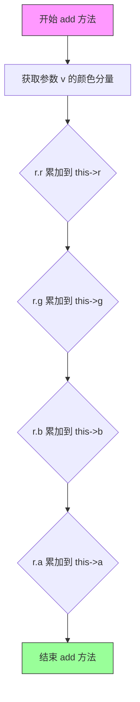

#### 带注释源码

```cpp
//====================================================stack_blur_calc_rgba
// 模板结构体：用于 RGBA 颜色计算的堆栈模糊计算器
// T: 内部计算使用的数值类型，默认为 unsigned
//====================================================
template<class T=unsigned> struct stack_blur_calc_rgba
{
    // 类型定义：value_type 为模板参数 T
    typedef T value_type;
    
    // RGBA 四个通道的累加器，用于在模糊过程中累积颜色值
    value_type r,g,b,a;

    //--------------------------------------------------------------------
    // 方法：clear - 清零累加器
    //--------------------------------------------------------------------
    AGG_INLINE void clear() 
    { 
        // 将 RGBA 四个通道的累加器全部置零
        r = g = b = a = 0; 
    }

    //--------------------------------------------------------------------
    // 方法：add - 添加颜色值（无权重版本）
    // 功能：将参数颜色对象的 RGBA 分量累加到当前累加器
    //--------------------------------------------------------------------
    template<class ArgT> AGG_INLINE void add(const ArgT& v)
    {
        // 累加红色通道
        r += v.r;
        // 累加绿色通道
        g += v.g;
        // 累加蓝色通道
        b += v.b;
        // 累加透明度通道
        a += v.a;
    }

    //--------------------------------------------------------------------
    // 方法：add - 添加颜色值（带权重版本）
    // 功能：将参数颜色对象的 RGBA 分量乘以权重 k 后累加到累加器
    //--------------------------------------------------------------------
    template<class ArgT> AGG_INLINE void add(const ArgT& v, unsigned k)
    {
        // 红色通道加权累加
        r += v.r * k;
        // 绿色通道加权累加
        g += v.g * k;
        // 蓝色通道加权累加
        b += v.b * k;
        // 透明度通道加权累加
        a += v.a * k;
    }

    //--------------------------------------------------------------------
    // 方法：sub - 减去颜色值
    // 功能：从累加器中减去参数颜色对象的 RGBA 分量
    //--------------------------------------------------------------------
    template<class ArgT> AGG_INLINE void sub(const ArgT& v)
    {
        r -= v.r;
        g -= v.g;
        b -= v.b;
        a -= v.a;
    }

    //--------------------------------------------------------------------
    // 方法：calc_pix - 计算最终像素值（除法版本）
    // 功能：将累加器中的值除以除数 div，得到平均后的像素颜色
    //--------------------------------------------------------------------
    template<class ArgT> AGG_INLINE void calc_pix(ArgT& v, unsigned div)
    {
        // 获取目标像素类型的值类型
        typedef typename ArgT::value_type value_type;
        // 计算红色通道平均值
        v.r = value_type(r / div);
        // 计算绿色通道平均值
        v.g = value_type(g / div);
        // 计算蓝色通道平均值
        v.b = value_type(b / div);
        // 计算透明度通道平均值
        v.a = value_type(a / div);
    }

    //--------------------------------------------------------------------
    // 方法：calc_pix - 计算最终像素值（乘法和移位版本）
    // 功能：使用乘法和移位操作代替除法，提高性能
    //--------------------------------------------------------------------
    template<class ArgT> 
    AGG_INLINE void calc_pix(ArgT& v, unsigned mul, unsigned shr)
    {
        typedef typename ArgT::value_type value_type;
        // 红色通道：乘以 mul 后右移 shr 位
        v.r = value_type((r * mul) >> shr);
        // 绿色通道
        v.g = value_type((g * mul) >> shr);
        // 蓝色通道
        v.b = value_type((b * mul) >> shr);
        // 透明度通道
        v.a = value_type((a * mul) >> shr);
    }
};
```


### `stack_blur_calc_rgba.add`

带权重的添加颜色值，将传入的颜色值乘以权重系数后累加到当前对象的RGBA四个通道上，用于Stack Blur算法中计算滑动窗口内的颜色累积。

参数：

- `v`：`const ArgT&`，要添加的颜色值对象，需包含r、g、b、a四个通道的分量
- `k`：`unsigned`，权重系数，用于控制每个颜色通道的累加权重

返回值：`void`，无返回值（直接修改调用对象的内部状态）

#### 流程图

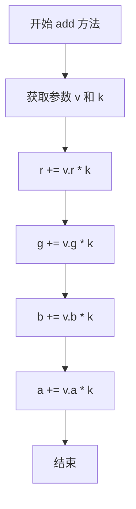

#### 带注释源码

```cpp
// 带权重的添加颜色值
// template<class ArgT> 表示这是一个函数模板，ArgT 可以是任何包含 r,g,b,a 属性的颜色类型
template<class ArgT> AGG_INLINE void add(const ArgT& v, unsigned k)
{
    // 将颜色值 v 的各个通道乘以权重 k 后累加到当前对象的对应通道上
    r += v.r * k;  // 红色通道加权累加
    g += v.g * k;  // 绿色通道加权累加
    b += v.b * k;  // 蓝色通道加权累加
    a += v.a * k;  // 透明度通道加权累加
}
```


### `stack_blur_calc_rgba.sub`

该方法是 `stack_blur_calc_rgba` 结构体的成员函数，用于在 Stack Blur 算法中从累积和中减去颜色值（即减去窗口边缘像素的颜色分量），以支持滑动窗口的动态计算。

参数：

- `v`：`const ArgT&`，泛型参数引用，表示待减去的颜色值对象，需包含 r、g、b、a 四个颜色分量

返回值：`void`，无返回值，直接修改内部成员变量

#### 流程图

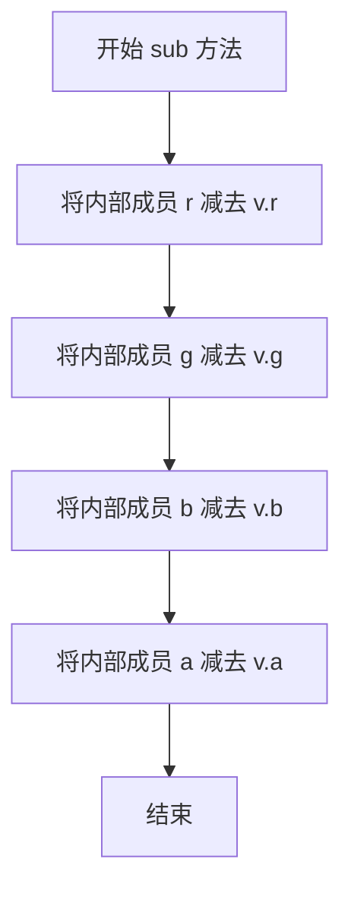

#### 带注释源码

```cpp
//====================================================stack_blur_calc_rgba
template<class T=unsigned> struct stack_blur_calc_rgba
{
    typedef T value_type;
    value_type r,g,b,a;  // 累积和的四个分量：红、绿、蓝、Alpha

    // 清除累积和，将所有分量置零
    AGG_INLINE void clear() 
    { 
        r = g = b = a = 0; 
    }

    // 添加颜色值到累积和（无权重）
    template<class ArgT> AGG_INLINE void add(const ArgT& v)
    {
        r += v.r;
        g += v.g;
        b += v.b;
        a += v.a;
    }

    // 添加颜色值到累积和（带权重 k）
    template<class ArgT> AGG_INLINE void add(const ArgT& v, unsigned k)
    {
        r += v.r * k;
        g += v.g * k;
        b += v.b * k;
        a += v.a * k;
    }

    //------------------- 本次提取的方法 ------------------------
    // 从累积和中减去颜色值 v，用于滑动窗口移除旧像素
    // 对应 Stack Blur 算法中的 sum_out 减去操作
    template<class ArgT> AGG_INLINE void sub(const ArgT& v)
    {
        r -= v.r;  // 红色分量减去 v.r
        g -= v.g;  // 绿色分量减去 v.g
        b -= v.b;  // 蓝色分量减去 v.b
        a -= v.a;  // Alpha 分量减去 v.a
    }
    //-------------------------------------------------------------

    // 使用除法计算最终像素值（标准路径）
    template<class ArgT> AGG_INLINE void calc_pix(ArgT& v, unsigned div)
    {
        typedef typename ArgT::value_type value_type;
        v.r = value_type(r / div);
        v.g = value_type(g / div);
        v.b = value_type(b / div);
        v.a = value_type(a / div);
    }

    // 使用乘法和位移计算最终像素值（优化路径，避免除法）
    // 通过预计算的 mul 和 shr 参数进行快速近似除法
    template<class ArgT> 
    AGG_INLINE void calc_pix(ArgT& v, unsigned mul, unsigned shr)
    {
        typedef typename ArgT::value_type value_type;
        v.r = value_type((r * mul) >> shr);
        v.g = value_type((g * mul) >> shr);
        v.b = value_type((b * mul) >> shr);
        v.a = value_type((a * mul) >> shr);
    }
};
```


### `stack_blur_calc_rgba.calc_pix`

使用除法方式计算模糊后的像素值，将 RGBA 四个通道的累加值分别除以指定的除数，得到平均后的像素颜色值。

参数：

- `v`：`ArgT&`，目标像素值引用，用于存储计算后的结果（传入输出像素对象）
- `div`：`unsigned`，除数，表示模糊半径范围内的像素总数，用于将累加的通道值除以该值得到平均值

返回值：`void`，无返回值，结果通过引用参数 `v` 直接修改

#### 流程图

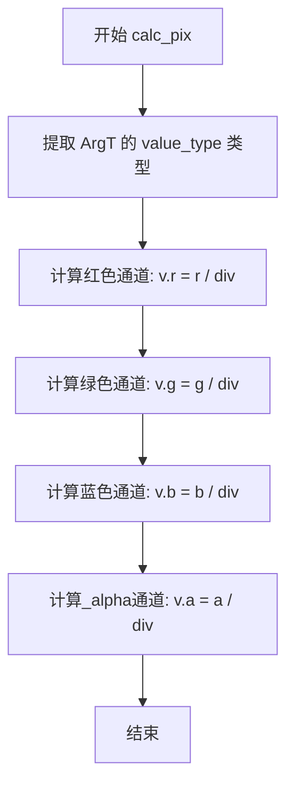

#### 带注释源码

```cpp
// 使用除法方式计算模糊后的像素值
// 将累加的 RGBA 通道值分别除以除数，得到平均颜色值
template<class ArgT> 
AGG_INLINE void calc_pix(ArgT& v, unsigned div)
{
    // 提取目标像素类型的值类型（通常是 uint8 或 uint16）
    typedef typename ArgT::value_type value_type;
    
    // 将红色通道累加值除以除数，转换为目标值类型并赋值
    v.r = value_type(r / div);
    
    // 将绿色通道累加值除以除数，转换为目标值类型并赋值
    v.g = value_type(g / div);
    
    // 将蓝色通道累加值除以除数，转换为目标值类型并赋值
    v.b = value_type(b / div);
    
    // 将_alpha通道累加值除以除数，转换为目标值类型并赋值
    v.a = value_type(a / div);
}
```


### `stack_blur_calc_rgba.calc_pix`

该函数是 `stack_blur_calc_rgba` 结构体的核心成员，用于在 Stack Blur（堆栈模糊）算法中计算模糊后的像素值。它接收累积的通道和（存储在当前结构体实例的 `r, g, b, a` 成员中）以及预计算的乘数（mul）和移位量（shr），利用移位运算 `(sum * mul) >> shr` 近似代替除法运算，从而高效地得出模糊后的像素颜色值并写入目标对象。

参数：

- `v`：`ArgT&`，目标像素对象的引用，模糊计算后的颜色值将写入此对象。`ArgT` 通常是像素格式类型（如 `color_type`）。
- `mul`：`unsigned`，预计算的乘法因子，用于等效除法。
- `shr`：`unsigned`，预计算的移位量，用于等效除法。

返回值：`void`，无直接返回值，结果通过引用参数 `v` 输出。

#### 流程图

```mermaid
graph TD
    A[开始 calc_pix] --> B{输入参数}
    B -->|r, g, b, a| C[读取结构体成员变量]
    B -->|mul, shr| D[读取参数]
    
    C --> E[提取目标类型 value_type]
    D --> E
    
    E --> F[计算 R: (r * mul) >> shr]
    E --> G[计算 G: (g * mul) >> shr]
    E --> H[计算 B: (b * mul) >> shr]
    E --> I[计算 A: (a * mul) >> shr]
    
    F --> J[转换为 value_type 并赋值给 v.r]
    G --> K[转换为 value_type 并赋值给 v.g]
    H --> L[转换为 value_type 并赋值给 v.b]
    I --> M[转换为 value_type 并赋值给 v.a]
    
    J --> N[结束]
    K --> N
    L --> N
    M --> N
```

#### 带注释源码

```cpp
// 定义计算 RGBA 像素值的模板函数，使用乘法和移位近似除法
// @param v    : 目标像素引用，计算结果将写入此对象
// @param mul  : 预计算的乘法因子，用于等效除法运算
// @param shr  : 预计算的移位量，用于等效除法运算
template<class ArgT> 
AGG_INLINE void calc_pix(ArgT& v, unsigned mul, unsigned shr)
{
    // 提取目标像素类型的数据类型（例如 unsigned char 或 float）
    typedef typename ArgT::value_type value_type;

    // 使用移位运算代替除法：v.r = r / div 等价于 v.r = (r * mul) >> shr
    // 这是在 Stack Blur 算法中避免昂贵除法操作的关键优化
    v.r = value_type((r * mul) >> shr);
    v.g = value_type((g * mul) >> shr);
    v.b = value_type((b * mul) >> shr);
    v.a = value_type((a * mul) >> shr);
}
```


### `stack_blur_calc_rgb.clear`

该函数是 `stack_blur_calc_rgb` 结构体的成员方法，用于将 RGB 三个通道的累加值清零，为下一次模糊计算做准备。

参数：无

返回值：`void`，无返回值描述

#### 流程图

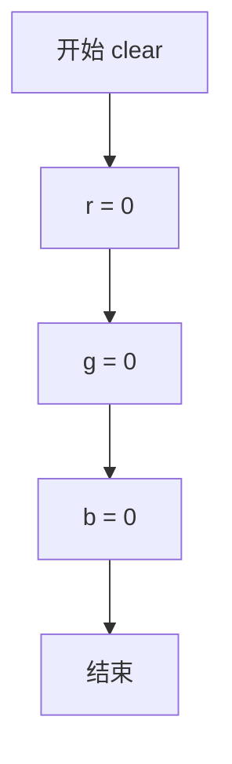

#### 带注释源码

```cpp
//=====================================================stack_blur_calc_rgb
// 结构体模板：用于 Stack Blur 算法的 RGB 通道计算
//=====================================================
template<class T=unsigned> struct stack_blur_calc_rgb
{
    // 类型定义：value_type 由模板参数 T 指定，默认为 unsigned
    typedef T value_type;
    
    // RGB 三个通道的累加值
    value_type r;  // 红色通道累加器
    value_type g;  // 绿色通道累加器
    value_type b;  // 蓝色通道累加器

    //--------------------------------------------------------------------
    // 方法：clear - 清零所有通道的累加值
    //--------------------------------------------------------------------
    AGG_INLINE void clear() 
    { 
        // 将 r、g、b 三个通道的值全部设置为 0
        // 为下一次滑动窗口的累加计算做准备
        r = g = b = 0; 
    }
    
    // ... 其他成员方法
};
```


### `stack_blur_calc_rgb.add`

该方法是 Stack Blur 算法中用于累加 RGB 颜色分量的核心函数，通过将传入像素的 r、g、b 通道值累加到当前计算器的对应分量上，实现模糊算法中的滑动窗口求和功能。

参数：

- `v`：`const ArgT&`，待添加的颜色值，包含 r、g、b 三个通道分量
- `k`（重载版本）：`unsigned`，权重系数，用于带权重的累加

返回值：`void`，无返回值，直接修改内部状态

#### 流程图

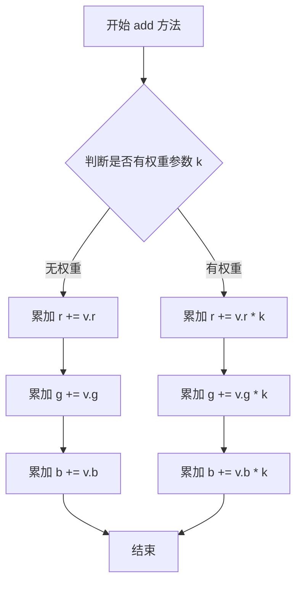

#### 带注释源码

```cpp
//=====================================================stack_blur_calc_rgb
// 用于 RGB 三通道的堆栈模糊计算器
template<class T=unsigned> struct stack_blur_calc_rgb
{
    typedef T value_type;        // 值类型，默认 unsigned
    value_type r, g, b;          // 累加器三个通道的值

    // 清除累加器，将 r、g、b 置零
    AGG_INLINE void clear() 
    { 
        r = g = b = 0; 
    }

    // 无权重版本：将颜色值 v 的各通道累加到累加器
    // @param v 待添加的颜色值，需包含 r、g、b 三个通道分量
    template<class ArgT> AGG_INLINE void add(const ArgT& v)
    {
        r += v.r;    // 累加红色通道
        g += v.g;    // 累加绿色通道
        b += v.b;    // 累加蓝色通道
    }

    // 带权重版本：将颜色值 v 的各通道乘以权重 k 后累加
    // @param v 待添加的颜色值
    // @param k 权重系数，用于计算加权平均
    template<class ArgT> AGG_INLINE void add(const ArgT& v, unsigned k)
    {
        r += v.r * k;    // 累加红色通道的加权值
        g += v.g * k;    // 累加绿色通道的加权值
        b += v.b * k;    // 累加蓝色通道的加权值
    }

    // 减法操作：从累加器中减去颜色值 v 的各通道
    template<class ArgT> AGG_INLINE void sub(const ArgT& v)
    {
        r -= v.r;
        g -= v.g;
        b -= v.b;
    }

    // 使用除法计算最终像素值（适用于小半径模糊）
    template<class ArgT> AGG_INLINE void calc_pix(ArgT& v, unsigned div)
    {
        typedef typename ArgT::value_type value_type;
        v.r = value_type(r / div);
        v.g = value_type(g / div);
        v.b = value_type(b / div);
    }

    // 使用乘法和移位计算最终像素值（适用于 8 位通道且半径 <= 254）
    // 通过预计算的乘数和移位值替代除法，提高性能
    template<class ArgT> 
    AGG_INLINE void calc_pix(ArgT& v, unsigned mul, unsigned shr)
    {
        typedef typename ArgT::value_type value_type;
        v.r = value_type((r * mul) >> shr);
        v.g = value_type((g * mul) >> shr);
        v.b = value_type((b * mul) >> shr);
    }
};
```


### `stack_blur_calc_rgb.add`

带权重的添加颜色值方法，用于在Stack Blur算法中累加颜色分量（RGB通道）。

参数：

-  `v`：`const ArgT&`，要添加的颜色值，包含r、g、b通道
-  `k`：`unsigned`，权重系数，表示该颜色值需要乘以的倍数

返回值：`void`，无返回值

#### 流程图

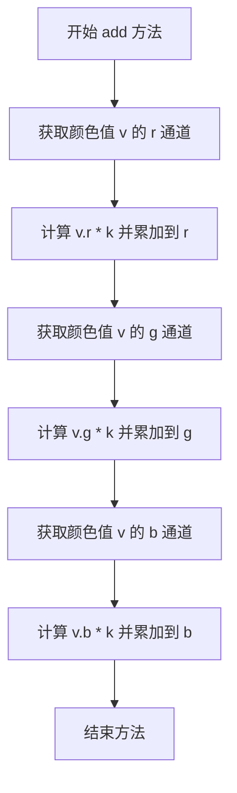

#### 带注释源码

```cpp
// 带权重的添加颜色值（RGB通道）
// 该方法用于Stack Blur算法中，在滑动窗口内累加颜色分量
// @param v 包含r、g、b通道的颜色值对象
// @param k 权重系数，用于控制该颜色值的贡献度
template<class ArgT> AGG_INLINE void add(const ArgT& v, unsigned k)
{
    // 将颜色值v的红色通道乘以权重k后累加到当前累计红色分量
    r += v.r * k;
    
    // 将颜色值v的绿色通道乘以权重k后累加到当前累计绿色分量
    g += v.g * k;
    
    // 将颜色值v的蓝色通道乘以权重k后累加到当前累计蓝色分量
    b += v.b * k;
}
```


### `stack_blur_calc_rgb.sub`

该方法是 `stack_blur_calc_rgb` 结构体的成员函数，用于在 Stack Blur 算法中减去颜色值。它从当前累积的 RGB 值中减去传入颜色值的各个分量。

参数：

- `v`：`const ArgT&`，待减去的颜色值引用，需包含 r、g、b 成员

返回值：`void`，无返回值（操作直接在调用对象的成员变量上完成）

#### 流程图

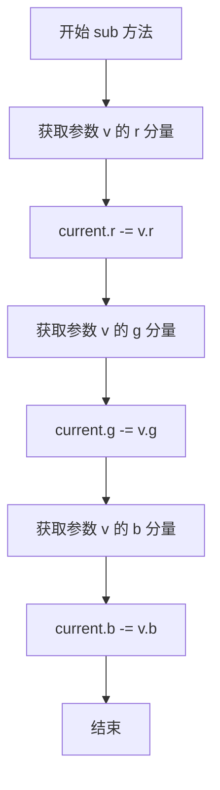

#### 带注释源码

```cpp
//=====================================================stack_blur_calc_rgb
template<class T=unsigned> struct stack_blur_calc_rgb
{
    typedef T value_type;
    value_type r,g,b;  // 存储RGB三通道的累积值

    // ... 其他成员方法 ...

    //--------------------------------------------------------------------
    // sub - 减去颜色值
    // 功能：从当前累积的RGB值中减去传入颜色值的各个分量
    // 参数：v - 待减去的颜色值，需包含r、g、b成员
    // 返回值：无
    //--------------------------------------------------------------------
    template<class ArgT> AGG_INLINE void sub(const ArgT& v)
    {
        // 红色通道：减去传入颜色值的r分量
        r -= v.r;
        
        // 绿色通道：减去传入颜色值的g分量
        g -= v.g;
        
        // 蓝色通道：减去传入颜色值的b分量
        b -= v.b;
    }

    // ... 其他成员方法 ...
};
```


### `stack_blur_calc_rgb.calc_pix`

计算像素值。根据传入的参数不同，使用两种不同的计算方法：一种是通过除法计算平均值，另一种是通过乘法和移位（快速整数算法）来计算模糊结果。

参数：

-  `v`：`ArgT&`，目标像素引用，用于输出计算后的RGB值
-  `div`：`unsigned`，除数，用于平均计算（当使用除法算法时）
-  `mul`：`unsigned`，乘数，用于快速整数算法（当使用乘移算法时）
-  `shr`：`unsigned`，移位量，用于快速整数算法（当使用乘移算法时）

返回值：`void`，无返回值，结果直接写入到参数 `v` 中

#### 流程图

```mermaid
flowchart TD
    A[开始 calc_pix] --> B{检查 mul 参数是否有效}
    B -->|是| C[使用乘移算法]
    B -->|否| D[使用除法算法]
    
    C --> E[计算红色分量: v.r = value_type((r * mul) >> shr)]
    E --> F[计算绿色分量: v.g = value_type((g * mul) >> shr)]
    F --> G[计算蓝色分量: v.b = value_type((b * mul) >> shr)]
    G --> H[结束]
    
    D --> I[计算红色分量: v.r = value_type(r / div)]
    I --> J[计算绿色分量: v.g = value_type(g / div)]
    J --> K[计算蓝色分量: v.b = value_type(b / div)]
    K --> H
```

#### 带注释源码

```cpp
//=====================================================stack_blur_calc_rgb
// 结构体模板：用于Stack Blur算法的RGB颜色计算器
// 该结构体维护RGB通道的累积值，并提供计算模糊像素的方法
template<class T=unsigned> struct stack_blur_calc_rgb
{
    // 类型定义
    typedef T value_type;  // 值类型，默认无符号整型
    
    // RGB通道累积值
    value_type r;  // 红色通道累积值
    value_type g;  // 绿色通道累积值
    value_type b;  // 蓝色通道累积值

    // 清除累积值
    AGG_INLINE void clear() 
    { 
        r = g = b = 0; 
    }

    // 添加像素值（无权重）
    template<class ArgT> AGG_INLINE void add(const ArgT& v)
    {
        r += v.r;
        g += v.g;
        b += v.b;
    }

    // 添加像素值（带权重k）
    template<class ArgT> AGG_INLINE void add(const ArgT& v, unsigned k)
    {
        r += v.r * k;
        g += v.g * k;
        b += v.b * k;
    }

    // 减去像素值
    template<class ArgT> AGG_INLINE void sub(const ArgT& v)
    {
        r -= v.r;
        g -= v.g;
        b -= v.b;
    }

    // 方法1：使用除法计算像素值（标准算法）
    // div是除数，等于(radius+1)*(radius+1)
    template<class ArgT> AGG_INLINE void calc_pix(ArgT& v, unsigned div)
    {
        // 获取目标像素的值类型
        typedef typename ArgT::value_type value_type;
        // 将累积的RGB值除以div得到平均值
        v.r = value_type(r / div);
        v.g = value_type(g / div);
        v.b = value_type(b / div);
    }

    // 方法2：使用乘法和移位计算像素值（快速整数算法）
    // 通过预计算的mul和shr参数，避免除法操作，提高性能
    // 这种方法适用于8位颜色通道且半径小于255的情况
    template<class ArgT> 
    AGG_INLINE void calc_pix(ArgT& v, unsigned mul, unsigned shr)
    {
        // 获取目标像素的值类型
        typedef typename ArgT::value_type value_type;
        // 使用乘移算法计算模糊值：乘以mul后右移shr位
        // 等价于除以div，但避免了浮点运算和除法指令
        v.r = value_type((r * mul) >> shr);
        v.g = value_type((g * mul) >> shr);
        v.b = value_type((b * mul) >> shr);
    }
};
```


### `stack_blur_calc_gray.clear`

该方法用于在 Stack Blur 算法中清零灰度累加器，将内部的灰度值 v 重置为 0，以便开始新一轮的模糊计算。

参数：无

返回值：`void`，无返回值描述

#### 流程图

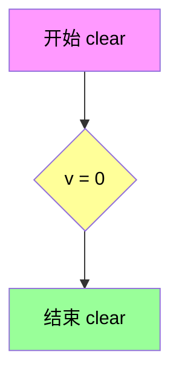

#### 带注释源码

```cpp
//====================================================stack_blur_calc_gray
// 结构体：stack_blur_calc_gray
// 用途：用于 Stack Blur 算法的灰度颜色计算器
//====================================================
template<class T=unsigned> struct stack_blur_calc_gray
{
    // 类型定义：value_type 为模板参数 T，默认值为 unsigned
    typedef T value_type;
    
    // 灰度值成员变量 v，存储当前累加的灰度值
    value_type v;

    //--------------------------------------------------------------------
    // 方法：clear
    // 功能：清零灰度值，将 v 重置为 0
    // 参数：无
    // 返回值：void
    //--------------------------------------------------------------------
    AGG_INLINE void clear() 
    { 
        // 将灰度值 v 设为 0，准备进行下一轮模糊计算
        v = 0; 
    }

    //--------------------------------------------------------------------
    // 方法：add (重载版本1)
    // 功能：将另一个灰度值累加到当前值
    // 参数：a - 输入的灰度参数
    // 返回值：void
    //--------------------------------------------------------------------
    template<class ArgT> AGG_INLINE void add(const ArgT& a)
    {
        v += a.v;
    }

    //--------------------------------------------------------------------
    // 方法：add (重载版本2)
    // 功能：将另一个灰度值乘以系数 k 后累加
    // 参数：a - 输入的灰度参数；k - 加权系数
    // 返回值：void
    //--------------------------------------------------------------------
    template<class ArgT> AGG_INLINE void add(const ArgT& a, unsigned k)
    {
        v += a.v * k;
    }

    //--------------------------------------------------------------------
    // 方法：sub
    // 功能：从当前值中减去另一个灰度值
    // 参数：a - 输入的灰度参数
    // 返回值：void
    //--------------------------------------------------------------------
    template<class ArgT> AGG_INLINE void sub(const ArgT& a)
    {
        v -= a.v;
    }

    //--------------------------------------------------------------------
    // 方法：calc_pix (重载版本1)
    // 功能：使用除法计算最终像素值
    // 参数：a - 输出像素；div - 除数
    // 返回值：void
    //--------------------------------------------------------------------
    template<class ArgT> AGG_INLINE void calc_pix(ArgT& a, unsigned div)
    {
        typedef typename ArgT::value_type value_type;
        a.v = value_type(v / div);
    }

    //--------------------------------------------------------------------
    // 方法：calc_pix (重载版本2)
    // 功能：使用乘法和移位计算最终像素值（优化版本）
    // 参数：a - 输出像素；mul - 乘数；shr - 移位量
    // 返回值：void
    //--------------------------------------------------------------------
    template<class ArgT> 
    AGG_INLINE void calc_pix(ArgT& a, unsigned mul, unsigned shr)
    {
        typedef typename ArgT::value_type value_type;
        a.v = value_type((v * mul) >> shr);
    }
};
```


### `stack_blur_calc_gray.add`

该方法是 `stack_blur_calc_gray` 结构体的成员函数，用于在 Stack Blur 灰度图像模糊算法中累加像素的灰度值。它接收一个带有灰度分量 `v` 的参数对象，并将该值累加到当前对象的累加器 `v` 中，支持不带权重和带权重（乘以系数 k）两种调用方式。

参数：

- `a`：`const ArgT&`，待添加的像素颜色对象，需包含灰度分量 `v`（如 `stack_blur_calc_gray` 或其他具有 `v` 成员的结构体）

返回值：`void`，无返回值，直接修改成员变量 `v` 的值

#### 流程图

```mermaid
flowchart TD
    A["开始 add 方法"] --> B{"判断是否存在权重参数 k"}
    B -->|有 k| C["计算 a.v * k"]
    C --> D["v = v + a.v * k"]
    B -->|无 k| E["v = v + a.v"]
    D --> F["结束"]
    E --> F
```

#### 带注释源码

```cpp
//====================================================stack_blur_calc_gray
template<class T=unsigned> struct stack_blur_calc_gray
{
    typedef T value_type;
    value_type v;  // 灰度值累加器

    // 清除累加器，将灰度值置为0
    AGG_INLINE void clear() 
    { 
        v = 0; 
    }

    // 无权重版本的 add 方法，将参数对象的灰度值直接累加到累加器
    // 参数 a: 包含灰度分量 v 的任意类型对象（如另一个 calc_gray 或像素颜色类型）
    template<class ArgT> AGG_INLINE void add(const ArgT& a)
    {
        v += a.v;  // 将参数对象的灰度值 v 累加到当前对象的累加器 v
    }

    // 带权重版本的 add 方法，将参数对象的灰度值乘以系数 k 后累加
    // 参数 a: 包含灰度分量 v 的任意类型对象
    // 参数 k: 无符号整数权重系数，用于加权累加
    template<class ArgT> AGG_INLINE void add(const ArgT& a, unsigned k)
    {
        v += a.v * k;  // 将参数对象的灰度值 v 乘以权重 k 后累加到累加器
    }

    // 减去操作，从累加器中减去参数对象的灰度值
    template<class ArgT> AGG_INLINE void sub(const ArgT& a)
    {
        v -= a.v;
    }

    // 使用除法计算最终像素值（用于普通模糊半径）
    template<class ArgT> AGG_INLINE void calc_pix(ArgT& a, unsigned div)
    {
        typedef typename ArgT::value_type value_type;
        a.v = value_type(v / div);  // 累加值除以模糊核大小得到平均灰度
    }

    // 使用乘法和移位计算最终像素值（优化版本，避免除法）
    template<class ArgT> 
    AGG_INLINE void calc_pix(ArgT& a, unsigned mul, unsigned shr)
    {
        typedef typename ArgT::value_type value_type;
        a.v = value_type((v * mul) >> shr);  // 乘以预计算系数后右移
    }
};
```


### `stack_blur_calc_gray.add`（带权重版本）

带权重的添加灰度值方法，用于在Stack Blur算法中累加像素的灰度值。该方法将输入参数的灰度值乘以权重系数后累加到当前对象的灰度值上，是实现模糊算法的核心计算步骤之一。

参数：

- `a`：`ArgT`（模板参数），灰度值来源对象，需包含灰度成员 `v`
- `k`：`unsigned`，权重系数，用于控制该灰度值的贡献权重

返回值：`void`，无返回值，直接修改对象内部状态

#### 流程图

```mermaid
flowchart TD
    A[开始 add 方法] --> B[获取输入参数 a 和权重 k]
    B --> C[计算乘积: a.v * k]
    C --> D[累加到当前对象: v += a.v * k]
    D --> E[结束]
```

#### 带注释源码

```cpp
//====================================================stack_blur_calc_gray
// Stack Blur 灰度计算器 - 用于在Stack Blur算法中累加和计算灰度值
//====================================================
template<class T=unsigned> struct stack_blur_calc_gray
{
    // 灰度值类型定义
    typedef T value_type;
    
    // 存储灰度值
    value_type v;

    // 清除灰度值，将v设为0
    AGG_INLINE void clear() 
    { 
        v = 0; 
    }

    // 不带权重的添加方法（另一个重载）
    // 将参数a的灰度值直接加到当前对象的灰度值上
    template<class ArgT> AGG_INLINE void add(const ArgT& a)
    {
        v += a.v;
    }

    // 带权重的添加方法 - 核心操作
    // 参数:
    //   a: 灰度值来源对象，需包含成员v（灰度值）
    //   k: 权重系数，决定a.v对最终结果的贡献程度
    // 返回: void（无返回值）
    // 功能: 将a的灰度值乘以权重k后累加到当前对象的灰度值v上
    //       这是Stack Blur算法中滑动窗口求和的关键操作
    template<class ArgT> AGG_INLINE void add(const ArgT& a, unsigned k)
    {
        v += a.v * k;  // 累加带权重的灰度值
    }

    // 不带权重的减法操作
    template<class ArgT> AGG_INLINE void sub(const ArgT& a)
    {
        v -= a.v;
    }

    // 使用除法计算最终像素值（普通模糊半径）
    template<class ArgT> AGG_INLINE void calc_pix(ArgT& a, unsigned div)
    {
        typedef typename ArgT::value_type value_type;
        a.v = value_type(v / div);
    }

    // 使用乘法和位移计算最终像素值（优化的8位模糊）
    // 通过预计算的乘数和位移值替代除法，提高性能
    template<class ArgT> 
    AGG_INLINE void calc_pix(ArgT& a, unsigned mul, unsigned shr)
    {
        typedef typename ArgT::value_type value_type;
        a.v = value_type((v * mul) >> shr);
    }
};
```


### `stack_blur_calc_gray.sub`

该方法用于从当前灰度值中减去传入参数的灰度值，是 Stack Blur 算法中计算滑动窗口灰度值的关键操作。

参数：

- `a`：`const ArgT&`，待减去的灰度值参数，必须包含 `v` 成员（通常为灰度像素值）

返回值：`void`，无返回值，直接修改内部灰度值 `v`

#### 流程图

```mermaid
flowchart TD
    A[开始 sub 方法] --> B[获取参数 a 的灰度值 a.v]
    B --> C[current_gray_value = v - a.v]
    C --> D[将结果存回 v]
    E[结束 sub 方法]
```

#### 带注释源码

```cpp
//====================================================stack_blur_calc_gray
// 用于 Stack Blur 灰度图像计算的辅助结构体
template<class T=unsigned> struct stack_blur_calc_gray
{
    typedef T value_type;       // 灰度值类型，默认 unsigned
    value_type v;               // 存储当前累积的灰度值

    // ... 其他方法 ...

    //------------------------------------------------------------------------
    // sub - 从当前灰度值中减去传入参数的灰度值
    // 用于在 Stack Blur 算法滑动窗口中，当像素移出窗口时，
    // 从累积和中减去该像素的灰度值
    //------------------------------------------------------------------------
    template<class ArgT> AGG_INLINE void sub(const ArgT& a)
    {
        // 从累积值 v 中减去要移除的像素的灰度值 a.v
        v -= a.v;
    }

    // ... 其他方法 ...
};
```


### `stack_blur_calc_gray.calc_pix`

这是一个用于灰度图像堆栈模糊算法的像素值计算函数，属于 `stack_blur_calc_gray` 结构体。该函数通过累加的灰度值计算当前像素的模糊结果，提供两种计算方式：一种使用除法，另一种使用乘法和移位来近似除法（针对8位通道的优化）。

参数：

- `a`：`ArgT&`，目标像素引用，用于存储计算后的灰度值
- `div`：`unsigned`，除数，用于计算平均模糊值
- `mul`：`unsigned`，乘数，用于乘法和移位近似的乘法因子
- `shr`：`unsigned`，右移位数，用于乘法和移位近似的移位因子

返回值：`void`，无返回值，结果直接写入参数 `a` 中

#### 流程图

```mermaid
flowchart TD
    A[开始 calc_pix] --> B{选择重载版本}
    B -->|版本1: div| C[获取内部累加值 v]
    C --> D[v / div]
    D --> E[转换为目标类型 value_type]
    E --> F[写入 a.v]
    F --> G[结束]
    
    B -->|版本2: mul, shr| H[获取内部累加值 v]
    H --> I[(v * mul) >> shr]
    I --> J[转换为目标类型 value_type]
    J --> K[写入 a.v]
    K --> G
```

#### 带注释源码

```cpp
//====================================================stack_blur_calc_gray
// 灰度图像堆栈模糊计算器
// 该结构体提供累加和像素计算功能，用于灰度图像的模糊处理
//====================================================
template<class T=unsigned> struct stack_blur_calc_gray
{
    // 定义值类型
    typedef T value_type;
    
    // 灰度值存储
    value_type v;

    // 清除累加器，将灰度值重置为0
    AGG_INLINE void clear() 
    { 
        v = 0; 
    }

    // 累加像素的灰度值
    template<class ArgT> AGG_INLINE void add(const ArgT& a)
    {
        v += a.v;
    }

    // 带权重的累加像素灰度值
    // 参数k为权重因子，用于加权累加
    template<class ArgT> AGG_INLINE void add(const ArgT& a, unsigned k)
    {
        v += a.v * k;
    }

    // 减去像素的灰度值
    template<class ArgT> AGG_INLINE void sub(const ArgT& a)
    {
        v -= a.v;
    }

    //====================================================
    // calc_pix 重载版本1：使用除法计算像素值
    // 参数:
    //   a - 目标像素引用，用于输出计算结果
    //   div - 除数，等于模糊半径范围内的像素数量
    // 功能：
    //   将累加的灰度值除以div，得到平均模糊后的灰度值
    //   并将结果转换为目标像素类型后写入a.v
    //====================================================
    template<class ArgT> AGG_INLINE void calc_pix(ArgT& a, unsigned div)
    {
        // 定义目标像素的值类型
        typedef typename ArgT::value_type value_type;
        // 计算平均值并转换类型后写入目标像素
        a.v = value_type(v / div);
    }

    //====================================================
    // calc_pix 重载版本2：使用乘法和移位近似除法
    // 参数:
    //   a - 目标像素引用，用于输出计算结果
    //   mul - 乘数，预计算的乘法因子
    //   shr - 右移位数，用于近似除法
    // 功能：
    //   针对8位通道的优化版本，避免除法运算
    //   使用乘法和移位代替除法，提高计算效率
    //   计算公式: (v * mul) >> shr 等价于 v * mul / 2^shr
    //====================================================
    template<class ArgT> 
    AGG_INLINE void calc_pix(ArgT& a, unsigned mul, unsigned shr)
    {
        // 定义目标像素的值类型
        typedef typename ArgT::value_type value_type;
        // 使用乘法和移位计算模糊值，并转换类型后写入目标像素
        a.v = value_type((v * mul) >> shr);
    }
};
```


### `recursive_blur.blur_x`

对图像进行水平方向的递归模糊（Recursive Blur），利用递归滤波器实现高效的高斯模糊效果。该方法通过预计算的系数对图像每行像素进行前向和后向两次递归扫描，从而在水平方向上产生模糊。

参数：

-  `img`：`Img&`，待模糊的图像对象引用，需支持 `width()`, `height()`, `pixel()`, `copy_color_hspan()` 等接口。
-  `radius`：`double`，模糊半径，若小于 0.62 则不进行模糊处理。

返回值：`void`，无返回值。

#### 流程图

```mermaid
graph TD
    A[开始 blur_x] --> B{radius < 0.62?}
    B -->|Yes| C[直接返回]
    B --> D{img.width() < 3?}
    D -->|Yes| C
    D --> E[计算模糊系数 b0, b1, b2, b3]
    E --> F[分配缓冲区 m_sum1, m_sum2, m_buf]
    F --> G[遍历图像每一行 y]
    G --> H[初始化前向递归: 计算前3个像素的m_sum1]
    H --> I[前向递归计算: x = 3 到 w-1]
    I --> J[初始化后向递归: 计算最后3个像素的m_sum2]
    J --> K[后向递归计算: x = wm-3 到 0]
    K --> L[将m_buf写入图像行]
    L --> M{下一行?}
    M -->|Yes| G
    M -->|No| N[结束]
```

#### 带注释源码

```cpp
//--------------------------------------------------------------------
template<class Img> void blur_x(Img& img, double radius)
{
    // 如果半径太小或图像宽度不足，则不进行模糊处理
    if(radius < 0.62) return;
    if(img.width() < 3) return;

    // 计算中间参数s和q，用于确定模糊系数
    calc_type s = calc_type(radius * 0.5);
    calc_type q = calc_type((s < 2.5) ?
                            3.97156 - 4.14554 * sqrt(1 - 0.26891 * s) :
                            0.98711 * s - 0.96330);

    // 计算q的平方和立方
    calc_type q2 = calc_type(q * q);
    calc_type q3 = calc_type(q2 * q);

    // 计算递归滤波器的系数b0, b1, b2, b3
    calc_type b0 = calc_type(1.0 / (1.578250 + 
                                    2.444130 * q + 
                                    1.428100 * q2 + 
                                    0.422205 * q3));

    calc_type b1 = calc_type( 2.44413 * q + 
                              2.85619 * q2 + 
                              1.26661 * q3);

    calc_type b2 = calc_type(-1.42810 * q2 + 
                             -1.26661 * q3);

    calc_type b3 = calc_type(0.422205 * q3);

    // 计算归一化系数b
    calc_type b  = calc_type(1 - (b1 + b2 + b3) * b0);

    // 对b1, b2, b3进行归一化
    b1 *= b0;
    b2 *= b0;
    b3 *= b0;

    // 获取图像尺寸
    int w = img.width();
    int h = img.height();
    int wm = w-1; // 最后一个像素的索引
    int x, y;

    // 分配临时缓冲区
    m_sum1.allocate(w);
    m_sum2.allocate(w);
    m_buf.allocate(w);

    // 遍历每一行
    for(y = 0; y < h; y++)
    {
        calculator_type c;
        
        // ----- 前向递归计算 -----
        // 初始化前两个像素的边界条件
        c.from_pix(img.pixel(0, y));
        m_sum1[0].calc(b, b1, b2, b3, c, c, c, c);
        c.from_pix(img.pixel(1, y));
        m_sum1[1].calc(b, b1, b2, b3, c, m_sum1[0], m_sum1[0], m_sum1[0]);
        c.from_pix(img.pixel(2, y));
        m_sum1[2].calc(b, b1, b2, b3, c, m_sum1[1], m_sum1[0], m_sum1[0]);

        // 继续前向递归计算剩余像素
        for(x = 3; x < w; ++x)
        {
            c.from_pix(img.pixel(x, y));
            m_sum1[x].calc(b, b1, b2, b3, c, m_sum1[x-1], m_sum1[x-2], m_sum1[x-3]);
        }
 
        // ----- 后向递归计算 -----
        // 初始化后向递归的边界条件
        m_sum2[wm  ].calc(b, b1, b2, b3, m_sum1[wm  ], m_sum1[wm  ], m_sum1[wm], m_sum1[wm]);
        m_sum2[wm-1].calc(b, b1, b2, b3, m_sum1[wm-1], m_sum2[wm  ], m_sum2[wm], m_sum2[wm]);
        m_sum2[wm-2].calc(b, b1, b2, b3, m_sum1[wm-2], m_sum2[wm-1], m_sum2[wm], m_sum2[wm]);
        
        // 将计算结果转换并存入缓冲区
        m_sum2[wm  ].to_pix(m_buf[wm  ]);
        m_sum2[wm-1].to_pix(m_buf[wm-1]);
        m_sum2[wm-2].to_pix(m_buf[wm-2]);

        // 完成后向递归计算
        for(x = wm-3; x >= 0; --x)
        {
            m_sum2[x].calc(b, b1, b2, b3, m_sum1[x], m_sum2[x+1], m_sum2[x+2], m_sum2[x+3]);
            m_sum2[x].to_pix(m_buf[x]);
        }
        
        // 将该行的模糊结果写入图像
        img.copy_color_hspan(0, y, w, &m_buf[0]);
    }
}
```


### `recursive_blur.blur_y`

对图像进行垂直方向的递归模糊（Recursive Blur），通过将图像转置为水平方向，然后调用 `blur_x` 方法实现垂直方向的模糊效果。

参数：

- `img`：`Img&`，待处理的图像对象引用，支持任意图像类型
- `radius`：`double`，模糊半径，当值小于 0.62 时不进行模糊处理

返回值：`void`，无返回值

#### 流程图

```mermaid
flowchart TD
    A[开始 blur_y] --> B{检查 radius >= 0.62?}
    B -->|否| C[直接返回, 不处理]
    B -->|是| D[创建 pixfmt_transposer 对象 img2]
    D --> E[调用 blur_x 方法, 传入转置后的图像 img2 和 radius]
    E --> F[blur_x 内部进行水平方向模糊<br/>但因为图像已转置, 实际处理垂直方向]
    F --> G[将模糊结果写回原图像]
    G --> H[结束 blur_y]
```

#### 带注释源码

```cpp
//--------------------------------------------------------------------
template<class Img> void blur_y(Img& img, double radius)
{
    // 创建图像转置器，将垂直方向转换为水平方向处理
    pixfmt_transposer img2(img);
    
    // 调用 blur_x 方法，实际处理的是转置后的图像
    // 这样就能实现垂直方向的递归模糊效果
    blur_x(img2, radius);
}
```


### `recursive_blur.blur`

完整二维递归模糊函数，使用递归滤波器在图像上执行高斯模糊。该函数首先对图像进行水平方向的递归模糊，然后通过转置图像进行垂直方向的递归模糊，从而实现完整的二维模糊效果。

参数：

- `img`：`Img&`，输入输出图像引用，支持任意图像类型
- `radius`：`double`，模糊半径，值越大模糊效果越强

返回值：`void`，直接在输入图像上修改，不返回新图像

#### 流程图

```mermaid
flowchart TD
    A[开始 blur] --> B[调用 blur_x 水平模糊]
    B --> C[创建图像转置器 img2]
    C --> D[调用 blur_x 对转置图像进行模糊]
    D --> E[结束]
    
    subgraph blur_x 内部流程
    F1[计算滤波器系数 q, b0-b3] --> F2[分配累加器缓冲区]
    F2 --> F3[遍历每一行 y]
    F3 --> F4[前向递归计算 m_sum1]
    F4 --> F5[反向递归计算 m_sum2]
    F5 --> F6[写入模糊后的行到图像]
    F6 --> F3
    end
```

#### 带注释源码

```cpp
//--------------------------------------------------------------------
/// 执行完整的二维递归模糊
/// @param img 输入输出图像引用
/// @param radius 模糊半径，值越大模糊效果越强
//--------------------------------------------------------------------
template<class Img> void blur(Img& img, double radius)
{
    // 第一步：水平方向模糊
    blur_x(img, radius);
    
    // 第二步：创建图像转置器，将图像转置
    // 这样可以将垂直方向的模糊转化为水平方向的模糊
    pixfmt_transposer img2(img);
    
    // 第三步：对转置后的图像进行水平方向模糊
    // 相当于对原图像进行垂直方向模糊
    blur_x(img2, radius);
}
```


### `recursive_blur_calc_rgba.from_pix`

这是一个模板成员函数，用于将像素颜色值（RGBA）从任意颜色类型提取并存储到当前计算器对象的内部变量中，以便后续进行递归模糊计算。

参数：

- `c`：`const ColorT&`，模板参数，表示任意颜色类型（如 `rgba8`、`rgba16` 等）的像素颜色对象引用

返回值：`void`，无返回值（直接修改对象内部状态）

#### 流程图

```mermaid
flowchart TD
    A[开始 from_pix] --> B[输入: 颜色对象 c]
    B --> C[将 c.r 赋值给 r]
    C --> D[将 c.g 赋值给 g]
    D --> E[将 c.b 赋值给 b]
    E --> F[将 c.a 赋值给 a]
    F --> G[结束]
```

#### 带注释源码

```cpp
//=================================================recursive_blur_calc_rgba
// 递归模糊计算器 - RGBA版本模板结构体
// T: 计算所使用的数值类型，默认为double
template<class T=double> struct recursive_blur_calc_rgba
{
    // 定义自身类型别名
    typedef T value_type;
    typedef recursive_blur_calc_rgba<T> self_type;

    // 存储RGBA四个通道的累加值
    value_type r,g,b,a;

    //--------------------------------------------------------from_pix
    // 从像素颜色提取数据到计算器
    // 功能：将输入颜色对象的r,g,b,a通道值分别复制到当前对象的
    //       r,g,b,a成员中，用于后续的模糊计算累加
    template<class ColorT> 
    AGG_INLINE void from_pix(const ColorT& c)
    {
        // 提取红色通道值
        r = c.r;
        // 提取绿色通道值
        g = c.g;
        // 提取蓝色通道值
        b = c.b;
        // 提取Alpha通道值
        a = c.a;
    }
    // ... 其余方法见下方
};
```


### `recursive_blur_calc_rgba.calc`

执行递归模糊算法的核心计算，对四个颜色分量（r, g, b, a）进行加权求和，计算公式为 `result = b1*c1 + b2*c2 + b3*c3 + b4*c4`。

参数：

- `b1`：`value_type`，第一个加权系数（主系数）
- `b2`：`value_type`，第二个加权系数
- `b3`：`value_type`，第三个加权系数
- `b4`：`value_type`，第四个加权系数
- `c1`：`const self_type&`，第一个颜色样本（当前像素）
- `c2`：`const self_type&`，第二个颜色样本（前一个像素）
- `c3`：`const self_type&`，第三个颜色样本（前两个像素）
- `c4`：`const self_type&`，第四个颜色样本（前三个像素）

返回值：`void`（结果直接写入当前对象的 r, g, b, a 成员）

#### 流程图

```mermaid
flowchart TD
    A[开始计算] --> B[计算红色分量 r]
    B --> C[计算绿色分量 g]
    C --> D[计算蓝色分量 b]
    D --> E[计算透明度分量 a]
    E --> F[结束]
    
    B --> B1[r = b1*c1.r + b2*c2.r + b3*c3.r + b4*c4.r]
    C --> C1[g = b1*c1.g + b2*c2.g + b3*c3.g + b4*c4.g]
    D --> D1[b = b1*c1.b + b2*c2.b + b3*c3.b + b4*c4.b]
    E --> E1[a = b1*c1.a + b2*c2.a + b3*c3.a + b4*c4.a]
```

#### 带注释源码

```cpp
//=================================================recursive_blur_calc_rgba
template<class T=double> struct recursive_blur_calc_rgba
{
    // 类型定义：value_type 为模板参数 T，默认 double
    // self_type 为当前模板实例的类型别名
    typedef T value_type;
    typedef recursive_blur_calc_rgba<T> self_type;

    // 存储四个颜色通道的累加值（使用浮点类型以保持精度）
    value_type r,g,b,a;

    // 从像素颜色结构体中提取 RGBA 值到累加器
    template<class ColorT> 
    AGG_INLINE void from_pix(const ColorT& c)
    {
        r = c.r;
        g = c.g;
        b = c.b;
        a = c.a;
    }

    // 核心计算函数：执行递归模糊的加权求和
    // b1, b2, b3, b4 是从递归滤波器系数计算得出的权重
    // c1, c2, c3, c4 是四个相邻像素的样本值（用于递归滤波）
    AGG_INLINE void calc(value_type b1, 
                         value_type b2, 
                         value_type b3, 
                         value_type b4,
                         const self_type& c1, 
                         const self_type& c2, 
                         const self_type& c3, 
                         const self_type& c4)
    {
        // 对每个颜色通道执行加权线性组合
        // 这是递归模糊算法的核心：利用前几个像素的值进行加权计算
        r = b1*c1.r + b2*c2.r + b3*c3.r + b4*c4.r;
        g = b1*c1.g + b2*c2.g + b3*c3.g + b4*c4.g;
        b = b1*c1.b + b2*c2.b + b3*c3.b + b4*c4.b;
        a = b1*c1.a + b2*c2.a + b3*c3.a + b4*c4.a;
    }

    // 将计算结果转换回像素格式
    // cv_type 是目标像素类型的值类型
    template<class ColorT> 
    AGG_INLINE void to_pix(ColorT& c) const
    {
        typedef typename ColorT::value_type cv_type;
        c.r = cv_type(r);
        c.g = cv_type(g);
        c.b = cv_type(b);
        c.a = cv_type(a);
    }
};
```


### `recursive_blur_calc_rgba.to_pix`

将递归模糊计算结果（双精度浮点 RGBA 值）转换为像素颜色格式。

参数：

- `c`：`ColorT&`，引用目标像素颜色对象，用于接收转换后的 RGBA 值（通常为 8 位无符号整数）

返回值：`void`，无返回值，结果直接写入传入的颜色参数 `c`

#### 流程图

```mermaid
graph TD
    A[开始 to_pix] --> B{获取 ColorT 的值类型}
    B --> C[将 r 转换为 cv_type 并赋值给 c.r]
    C --> D[将 g 转换为 cv_type 并赋值给 c.g]
    D --> E[将 b 转换为 cv_type 并赋值给 c.b]
    E --> F[将 a 转换为 cv_type 并赋值给 c.a]
    F --> G[结束]
```

#### 带注释源码

```cpp
//=================================================recursive_blur_calc_rgba
template<class T=double> struct recursive_blur_calc_rgba
{
    typedef T value_type;                       // 双精度浮点计算类型
    typedef recursive_blur_calc_rgba<T> self_type;

    value_type r,g,b,a;                         // 存储 RGBA 通道的累加值（双精度）

    // ... from_pix 和 calc 方法 ...

    // 将计算结果转换为像素颜色格式
    // 参数: c - 目标像素颜色引用（通常为 8 位颜色格式如 rgba8）
    // 返回: void（直接修改传入的颜色对象）
    template<class ColorT> 
    AGG_INLINE void to_pix(ColorT& c) const
    {
        // 获取目标颜色类型的值类型（如 unsigned char）
        typedef typename ColorT::value_type cv_type;
        
        // 将双精度浮点值转换为像素值并赋值
        c.r = cv_type(r);    // 红色通道：双精度 → 像素值
        c.g = cv_type(g);    // 绿色通道：双精度 → 像素值
        c.b = cv_type(b);    // 蓝色通道：双精度 → 像素值
        c.a = cv_type(a);    // 透明通道：双精度 → 像素值
    }
};
```


### `recursive_blur_calc_rgb.from_pix`

该方法用于将像素颜色对象的 RGB 分量提取并存储到当前计算器结构中，是递归模糊算法中从图像像素读取颜色数据的关键步骤。

参数：

- `c`：`const ColorT&`，模板参数类型，表示任意支持 r、g、b 分量的颜色对象（如像素格式颜色）

返回值：`void`，无返回值。该方法通过引用修改结构体内部的 `r`、`g`、`b` 成员变量来输出结果。

#### 流程图

```mermaid
flowchart TD
    A[开始 from_pix] --> B[接收颜色对象 c]
    B --> C[提取 c.r]
    C --> D[提取 c.g]
    D --> E[提取 c.b]
    E --> F[赋值给结构体成员 this.r]
    F --> G[赋值给结构体成员 this.g]
    G --> H[赋值给结构体成员 this.b]
    H --> I[结束]
```

#### 带注释源码

```cpp
//=================================================recursive_blur_calc_rgb
// 递归模糊计算器 - RGB 版本
// 用于递归模糊算法中，进行 RGB 三通道的数值累积与计算
//=================================================
template<class T=double> 
struct recursive_blur_calc_rgb
{
    // 类型定义
    typedef T value_type;                    // 数值计算类型（默认 double）
    typedef recursive_blur_calc_rgb<T> self_type; // 自身类型别名

    // RGB 通道累加器
    value_type r;  // 红色通道累加值
    value_type g;  // 绿色通道累加值
    value_type b;  // 蓝色通道累加值

    //-------------------------------------------------
    // from_pix: 从像素颜色提取 RGB 分量
    // 功能：将任意颜色对象的 r、g、b 分量提取到结构体成员中
    // 参数：
    //   - c: const ColorT&，模板参数，任意支持 r/g/b 分量的颜色类型
    // 返回值：void（通过引用修改内部成员）
    //-------------------------------------------------
    template<class ColorT> 
    AGG_INLINE void from_pix(const ColorT& c)
    {
        // 从颜色对象中提取红色分量并赋值给内部累加器
        r = c.r;
        
        // 从颜色对象中提取绿色分量并赋值给内部累加器
        g = c.g;
        
        // 从颜色对象中提取蓝色分量并赋值给内部累加器
        b = c.b;
    }

    // 其他方法：calc（递归模糊核心计算）、to_pix（转换回像素格式）等...
};
```


### `recursive_blur_calc_rgb`

用于递归高斯模糊计算的RGB颜色通道计算器，负责在递归模糊算法中执行颜色值的累加、计算和像素转换操作。

参数：

- `from_pix` 方法：
  - `c`：`const ColorT&`，模板参数，源像素颜色对象，从中提取r、g、b通道值
- `calc` 方法：
  - `b1`：`value_type`，递归滤波系数b1
  - `b2`：`value_type`，递归滤波系数b2
  - `b3`：`value_type`，递归滤波系数b3
  - `b4`：`value_type`，递归滤波系数b4（即b0）
  - `c1`：`const self_type&`，当前像素的计算值
  - `c2`：`const self_type&`，前一像素的计算值
  - `c3`：`const self_type&`，前两像素的计算值
  - `c4`：`const self_type&`，前三像素的计算值
- `to_pix` 方法：
  - `c`：`ColorT&`，模板参数，目标像素颜色对象，用于存储计算后的r、g、b通道值

返回值：所有方法均为 `void`，通过引用参数返回结果

#### 流程图

```mermaid
flowchart TD
    A[开始] --> B[from_pix: 提取像素RGB值]
    B --> C{调用方法}
    
    C --> D[calc: 递归计算]
    D --> D1[计算 r = b1*c1.r + b2*c2.r + b3*c3.r + b4*c4.r]
    D --> D2[计算 g = b1*c1.g + b2*c2.g + b3*c3.g + b4*c4.g]
    D --> D3[计算 b = b1*c1.b + b2*c2.b + b3*c3.b + b4*c4.b]
    D1 --> E[to_pix: 转换回像素]
    D2 --> E
    D3 --> E
    
    E --> F[结束]
    
    style D fill:#f9f,stroke:#333
    style B fill:#9f9,stroke:#333
    style E fill:#9f9,stroke:#333
```

#### 带注释源码

```cpp
//=================================================recursive_blur_calc_rgb
// 递归模糊计算的RGB通道计算器模板结构体
// 用于在recursive_blur类中执行递归高斯模糊的颜色通道计算
// 采用四阶递归滤波器算法: b0*b0*c1 + b1*b0*c2 + b2*b0*c3 + b3*b0*c4
//------------------------------------------------------------------------
template<class T=double> 
struct recursive_blur_calc_rgb
{
    // 定义值类型别名
    typedef T value_type;
    // 定义自身类型别名，便于在calc方法中使用
    typedef recursive_blur_calc_rgb<T> self_type;

    // RGB三个颜色通道的累加器，使用浮点类型以保证计算精度
    value_type r, g, b;

    //--------------------------------------------------------------------
    // from_pix: 从像素颜色对象提取RGB通道值
    // 将任意颜色格式的r、g、b分量提取到内部累加器中
    //--------------------------------------------------------------------
    template<class ColorT> 
    AGG_INLINE void from_pix(const ColorT& c)
    {
        r = c.r;  // 提取红色通道
        g = c.g;  // 提取绿色通道
        b = c.b;  // 提取蓝色通道
    }

    //--------------------------------------------------------------------
    // calc: 执行递归模糊的核心计算
    // 使用四阶递归滤波器公式进行卷积计算
    // 公式: result = b0*current + b1*prev1 + b2*prev2 + b3*prev3
    // 其中b4即为b0（滤波器的归一化系数）
    //--------------------------------------------------------------------
    AGG_INLINE void calc(value_type b1, 
                         value_type b2, 
                         value_type b3, 
                         value_type b4,
                         const self_type& c1, 
                         const self_type& c2, 
                         const self_type& c3, 
                         const self_type& c4)
    {
        // 红色通道: 加权求和
        r = b1*c1.r + b2*c2.r + b3*c3.r + b4*c4.r;
        // 绿色通道: 加权求和
        g = b1*c1.g + b2*c2.g + b3*c3.g + b4*c4.g;
        // 蓝色通道: 加权求和
        b = b1*c1.b + b2*c2.b + b3*c3.b + b4*c4.b;
    }

    //--------------------------------------------------------------------
    // to_pix: 将计算结果转换回像素颜色格式
    // 将浮点类型的计算结果强制转换为目标像素格式的值类型
    //--------------------------------------------------------------------
    template<class ColorT> 
    AGG_INLINE void to_pix(ColorT& c) const
    {
        // 获取目标颜色类型的值类型
        typedef typename ColorT::value_type cv_type;
        // 将计算结果强制转换为目标类型并写入像素
        c.r = cv_type(r);
        c.g = cv_type(g);
        c.b = cv_type(b);
    }
};
```


### `recursive_blur_calc_rgb.to_pix`

将递归模糊计算结果（RGB通道的浮点数值）转换为目标像素格式的颜色值。

参数：

- `c`：`ColorT &`，目标像素颜色对象的引用，用于接收转换后的颜色值

返回值：`void`，无返回值，结果直接写入传入的颜色引用参数中

#### 流程图

```mermaid
flowchart TD
    A["开始 to_pix"] --> B{"模板实例化<br/>ColorT::value_type"}
    B --> C["将 r 转换为 cv_type<br/>c.r = cv_type(r)"]
    C --> D["将 g 转换为 cv_type<br/>c.g = cv_type(g)"]
    D --> E["将 b 转换为 cv_type<br/>c.b = cv_type(b)"]
    E --> F["结束"]
```

#### 带注释源码

```cpp
//=================================================recursive_blur_calc_rgb
// 递归模糊计算的RGB通道计算器（仅处理RGB，不含Alpha通道）
template<class T=double> struct recursive_blur_calc_rgb
{
    // 类型定义：value_type为模板参数T（默认为double），self_type为自身类型
    typedef T value_type;
    typedef recursive_blur_calc_rgb<T> self_type;

    // RGB三个通道的累积值（使用浮点类型以保证计算精度）
    value_type r,g,b;

    //--------------------------------------------------------------------
    // from_pix: 从像素颜色对象提取RGB通道值
    // 将源图像像素的颜色分量提取到内部计算变量中
    template<class ColorT> 
    AGG_INLINE void from_pix(const ColorT& c)
    {
        r = c.r;
        g = c.g;
        b = c.b;
    }

    //--------------------------------------------------------------------
    // calc: 执行递归模糊的核心计算
    // 使用四个系数(b1-b4)和四个相邻像素值计算当前像素的模糊结果
    // 这是递归IIR滤波器的核心公式
    AGG_INLINE void calc(value_type b1, 
                         value_type b2, 
                         value_type b3, 
                         value_type b4,
                         const self_type& c1, 
                         const self_type& c2, 
                         const self_type& c3, 
                         const self_type& c4)
    {
        r = b1*c1.r + b2*c2.r + b3*c3.r + b4*c4.r;
        g = b1*c1.g + b2*c2.g + b3*c3.g + b4*c4.g;
        b = b1*c1.b + b2*c2.b + b3*c3.b + b4*c4.b;
    }

    //--------------------------------------------------------------------
    // to_pix: 将计算结果转换回像素颜色格式
    // 将浮点计算结果（r,g,b）强制转换为目标颜色类型的值类型
    // 这是递归模糊算法输出阶段的关键步骤
    // 
    // 参数:
    //   c - 目标像素颜色对象的引用，结果直接写入此对象
    //
    // 注意:
    //   使用cv_type（ColorT::value_type）进行类型转换
    //   这确保了计算结果适配目标像素格式的精度要求
    template<class ColorT> 
    AGG_INLINE void to_pix(ColorT& c) const
    {
        // 提取目标颜色类型的值类型（如uint8, int8u等）
        typedef typename ColorT::value_type cv_type;
        
        // 将浮点计算结果转换为目标像素格式
        // 使用C风格转换，可能涉及截断（double转uint8）或缩放
        c.r = cv_type(r);
        c.g = cv_type(g);
        c.b = cv_type(b);
    }
};
```


### `recursive_blur_calc_gray.from_pix`

该方法用于从像素颜色对象中提取灰度值 'v'，并将其存储到内部值字段中，以供递归模糊计算使用。

参数：

- `c`：`const ColorT&`，模板类型参数，表示像素颜色对象，从中提取灰度值

返回值：`void`，无返回值，通过修改内部状态（设置 `v` 字段）来完成操作

#### 流程图

```mermaid
flowchart TD
    A[开始 from_pix] --> B{检查输入像素颜色对象 c}
    B --> C[提取像素的 v 属性]
    C --> D[将提取的 v 值赋给内部成员变量 this->v]
    E[结束 from_pix]
    
    style A fill:#f9f,color:#000
    style E fill:#f9f,color:#000
```

#### 带注释源码

```cpp
//================================================recursive_blur_calc_gray
// 递归模糊计算器 - 灰度版本
// 用于在递归模糊算法中进行灰度通道的计算
//================================================
template<class T=double> struct recursive_blur_calc_gray
{
    // 类型定义
    typedef T value_type;                          // 数值类型（默认为 double）
    typedef recursive_blur_calc_gray<T> self_type; // 自身类型别名

    value_type v;                                  // 灰度值存储变量

    //--------------------------------------------------------------------
    // from_pix: 从像素颜色对象提取灰度值
    //--------------------------------------------------------------------
    template<class ColorT> 
    AGG_INLINE void from_pix(const ColorT& c)
    {
        // 从像素颜色对象 c 中提取灰度分量 v
        // 这是一个模板方法，可以接受任何具有 .v 属性的颜色类型
        v = c.v;
    }

    //--------------------------------------------------------------------
    // calc: 执行递归模糊的核心计算
    // 使用四个系数和四个相邻像素值进行加权计算
    //--------------------------------------------------------------------
    AGG_INLINE void calc(value_type b1, 
                         value_type b2, 
                         value_type b3, 
                         value_type b4,
                         const self_type& c1, 
                         const self_type& c2, 
                         const self_type& c3, 
                         const self_type& c4)
    {
        // 递归滤波器计算公式: result = b1*c1 + b2*c2 + b3*c3 + b4*c4
        v = b1*c1.v + b2*c2.v + b3*c3.v + b4*c4.v;
    }

    //--------------------------------------------------------------------
    // to_pix: 将计算结果写回像素颜色对象
    //--------------------------------------------------------------------
    template<class ColorT> 
    AGG_INLINE void_pix(ColorT& c) const
    {
        typedef typename ColorT::value_type cv_type;
        // 将计算得到的灰度值转换为目标颜色类型的值
        c.v = cv_type(v);
    }
};
```


### `recursive_blur_calc_gray.calc`

该方法实现递归高斯模糊的核心计算逻辑，通过接收四个权重系数（b1、b2、b3、b4）和四个相邻像素的灰度值，使用加权求和公式计算当前像素的模糊结果。这是递归模糊算法中沿扫描线方向进行一维模糊处理的关键步骤，利用前向和后向递归滤波实现高效的高斯模糊效果。

参数：

- `b1`：`value_type`（模板参数T，默认为double），第一个权重系数，对应当前像素的权重
- `b2`：`value_type`，第二个权重系数，对应当前像素前一个位置的权重
- `b3`：`value_type`，第三个权重系数，对应当前像素前两个位置的权重
- `b4`：`value_type`，第四个权重系数，对应当前像素前三个位置的权重
- `c1`：`const self_type&`，当前像素位置的灰度值计算器实例
- `c2`：`const self_type&`，前一像素位置的灰度值计算器实例
- `c3`：`const self_type&`，前二像素位置的灰度值计算器实例
- `c4`：`const self_type&`，前三像素位置的灰度值计算器实例

返回值：`void`，计算结果直接存储在结构体的成员变量 `v` 中（灰度值）

#### 流程图

```mermaid
flowchart TD
    A[开始 calc 方法] --> B[接收参数 b1, b2, b3, b4, c1, c2, c3, c4]
    B --> C[提取 c1.v, c2.v, c3.v, c4.v]
    C --> D[计算 v = b1*c1.v + b2*c2.v + b3*c3.v + b4*c4.v]
    D --> E[将结果存储到成员变量 v]
    E --> F[结束]
```

#### 带注释源码

```cpp
//================================================recursive_blur_calc_gray
// 递归模糊计算器 - 灰度版本
// 用于在递归模糊算法中进行灰度像素的一维模糊计算
template<class T=double> struct recursive_blur_calc_gray
{
    // 类型定义
    typedef T value_type;                    // 模板参数T作为计算用的数值类型（默认double）
    typedef recursive_blur_calc_gray<T> self_type;  // 自身类型别名

    // 灰度值存储
    value_type v;                             // 存储计算后的灰度值

    //--------------------------------------------------------------------
    // 从像素颜色中提取灰度值
    // 将传入的彩色像素类型的灰度分量提取到成员变量v中
    template<class ColorT> 
    AGG_INLINE void from_pix(const ColorT& c)
    {
        v = c.v;                              // 从彩色像素中获取灰度分量
    }

    //--------------------------------------------------------------------
    // 核心递归模糊计算方法
    // 使用四个权重系数对四个相邻像素的灰度值进行加权求和
    // 这实现了递归滤波器的一维模糊计算
    AGG_INLINE void calc(value_type b1,     // 第一个权重系数（当前像素权重）
                         value_type b2,     // 第二个权重系数（前一像素权重）
                         value_type b3,     // 第三个权重系数（前二像素权重）
                         value_type b4,     // 第四权重系数（前三像素权重）
                         const self_type& c1,  // 当前像素位置的灰度计算器
                         const self_type& c2,  // 前一像素位置的灰度计算器
                         const self_type& c3,  // 前二像素位置的灰度计算器
                         const self_type& c4)  // 前三像素位置的灰度计算器
    {
        // 递归模糊核心公式：v = b1*c1 + b2*c2 + b3*c3 + b4*c4
        // 使用四个相邻像素的加权组合来实现高斯模糊的递归近似
        v = b1*c1.v + b2*c2.v + b3*c3.v + b4*c4.v;
    }

    //--------------------------------------------------------------------
    // 将计算结果转换回像素颜色格式
    // 将成员变量v中的灰度值写入目标像素类型
    template<class ColorT> 
    AGG_INLINE void to_pix(ColorT& c) const
    {
        typedef typename ColorT::value_type cv_type;  // 目标像素的值类型
        c.v = cv_type(v);                             // 将计算结果转换为目标类型并写入
    }
};
```


### `recursive_blur_calc_gray.to_pix`

该方法是 `recursive_blur_calc_gray` 结构体的成员函数，负责将递归模糊算法中间计算出的高精度灰度值（`value_type`）转换为目标像素格式（`ColorT`）的灰度分量，并写入到目标像素对象中。

参数：

-  `c`：`ColorT &`，引用传递的目标像素对象，用于存储转换后的灰度值。

返回值：`void`，无返回值，结果通过引用参数 `c` 输出。

#### 流程图

```mermaid
graph TD
    A((开始)) --> B[输入: 自身对象 this (包含计算结果 v) 与 目标像素引用 c]
    B --> C{获取目标像素类型}
    C -->|提取 ColorT::value_type 定义为 cv_type| D[类型转换]
    D -->|将 value_type v 强制转换为 cv_type| E[赋值操作]
    E -->|将转换后的值赋给 c.v| F((结束))
```

#### 带注释源码

```cpp
//================================================recursive_blur_calc_gray
// 递归模糊计算器（灰度版本）
// T默认为double，用于存储高精度中间计算结果
template<class T=double> struct recursive_blur_calc_gray
{
    typedef T value_type;                 // 内部计算用的数值类型
    typedef recursive_blur_calc_gray<T> self_type;

    value_type v; // 存储灰度通道的累积值

    // ... (省略 from_pix 和 calc 方法) ...

    //------------------------------------------------to_pix
    // 功能：将内部计算的高精度灰度值 v 写入到像素颜色对象 c 中
    // 参数：c - 引用传递的目标像素对象（通常为像素格式结构体）
    template<class ColorT> 
    AGG_INLINE void to_pix(ColorT& c) const
    {
        // 提取目标像素格式的值类型（例如 int8u）
        typedef typename ColorT::value_type cv_type;
        
        // 将计算值转换为目标像素格式的值类型，并赋值给目标像素的 v 分量
        c.v = cv_type(v);
    }
};
```


### `slight_blur.radius`

设置轻微模糊滤镜的模糊半径，该方法根据给定的半径参数计算高斯权重系数，用于后续的模糊计算。

参数：

- `r`：`double`，高斯模糊的半径值，用于计算标准差为 r/2 的高斯曲线权重

返回值：`void`，无返回值（直接修改类成员变量 m_g0 和 m_g1）

#### 流程图

```mermaid
flowchart TD
    A[开始 radius] --> B{r > 0?}
    B -->|是| C[计算 n = 2 / r]
    B -->|否| D[设置 m_g0 = 1, m_g1 = 0]
    D --> H[结束]
    C --> E[计算 m_g0 = 1 / sqrt(2π)]
    E --> F[计算 m_g1 = m_g0 * exp(-n²)]
    F --> G[归一化: m_g0 = m_g0 / (m_g0 + 2×m_g1), m_g1 = m_g1 / (m_g0 + 2×m_g1)]
    G --> H
```

#### 带注释源码

```cpp
//================================================slight_blur
// Special-purpose filter for applying a Gaussian blur with a radius small enough 
// that the blur only affects adjacent pixels. A Gaussian curve with a standard
// deviation of r/2 is used, as per the HTML/CSS spec. At 3 standard deviations, 
// the contribution drops to less than 0.005, i.e. less than half a percent, 
// therefore the radius can be at least 1.33 before errors become significant.
// This filter is useful for smoothing artifacts caused by detail rendered 
// at the pixel scale, e.g. single-pixel lines. Note that the filter should 
// only be used with premultiplied pixel formats (or those without alpha).
// See the "line_thickness" example for a demonstration.
template<class PixFmt>
class slight_blur
{
public:
    typedef typename PixFmt::pixel_type pixel_type;
    typedef typename PixFmt::value_type value_type;
    typedef typename PixFmt::order_type order_type;

    // 构造函数，默认半径为1.33
    slight_blur(double r = 1.33)
    {
        radius(r);
    }

    // 设置模糊半径的方法
    void radius(double r)
    {
        // 只有当半径大于0时才进行计算
        if (r > 0)
        {
            // Sample the gaussian curve at 0 and r/2 standard deviations. 
            // At 3 standard deviations, the response is < 0.005.
            // 计算π的近似值
            double pi = 3.14159;
            // 计算n = 2 / r，用于确定在r/2标准差处采样
            double n = 2 / r;
            // 计算高斯曲线在0处（中心）的值：g0 = 1 / sqrt(2π)
            m_g0 = 1 / sqrt(2 * pi);
            // 计算高斯曲线在r/2标准差处的值：g1 = g0 * exp(-n²)
            m_g1 = m_g0 * exp(-n * n);

            // Normalize.
            // 归一化权重，使g0 + 2*g1 = 1
            double sum = m_g0 + 2 * m_g1;
            m_g0 /= sum;
            m_g1 /= sum;
        }
        else
        {
            // 如果半径<=0，设置默认值：中心权重为1，边缘权重为0
            m_g0 = 1;
            m_g1 = 0;
        }
    }
    // ... 后续代码省略
```


### `slight_blur.blur`

对图像执行轻量级高斯模糊，仅影响相邻像素。该模糊使用半径为r/2的高斯曲线（遵循HTML/CSS规范），主要用于平滑像素级细节渲染产生的伪影，例如单像素线条。

参数：

- `img`：`PixFmt&`，目标像素格式图像对象
- `bounds`：`rect_i`，应用模糊的矩形区域边界

返回值：`void`，无返回值

#### 流程图

```mermaid
flowchart TD
    A[开始 blur] --> B[边界裁剪确保在图像范围内]
    B --> C{宽度≥3 且 高度≥3?}
    C -->|否| Z[直接返回]
    C -->|是| D[分配3行缓冲区空间]
    D --> E[设置行指针 r0, r1, r2]
    E --> F[水平模糊第一行到 r0]
    F --> G[复制 r0 到 r1]
    G --> H[循环遍历每一行]
    H --> I[获取当前行像素指针]
    I --> J{还有下一行?}
    J -->|是| K[水平模糊下一行到 r2]
    J -->|否| L[复制 r1 到 r2]
    K --> M[组合 r0 r1 r2 到目标像素]
    L --> M
    M --> N[y+1 ≥ h?]
    N -->|否| H
    N -->|是| O[结束]
    
    O --> P[重置行指针到缓冲区开始]
    P --> Z
```

#### 带注释源码

```cpp
//================================================slight_blur
// Special-purpose filter for applying a Gaussian blur with a radius small enough 
// that the blur only affects adjacent pixels. A Gaussian curve with a standard
// deviation of r/2 is used, as per the HTML/CSS spec. At 3 standard deviations, 
// the contribution drops to less than 0.005, i.e. less than half a percent, 
// therefore the radius can be at least 1.33 before errors become significant.
// This filter is useful for smoothing artifacts caused by detail rendered 
// at the pixel scale, e.g. single-pixel lines. Note that the filter should 
// only be used with premultiplied pixel formats (or those without alpha).
// See the "line_thickness" example for a demonstration.
template<class PixFmt>
class slight_blur
{
public:
    typedef typename PixFmt::pixel_type pixel_type;
    typedef typename PixFmt::value_type value_type;
    typedef typename PixFmt::order_type order_type;

    // 构造函数，默认半径1.33
    slight_blur(double r = 1.33)
    {
        radius(r);
    }

    // 设置模糊半径，同时计算高斯系数
    void radius(double r)
    {
        if (r > 0)
        {
            // 在0和r/2标准差处采样高斯曲线
            // 在3个标准差处，响应<0.005
            double pi = 3.14159;
            double n = 2 / r;
            m_g0 = 1 / sqrt(2 * pi);
            m_g1 = m_g0 * exp(-n * n);

            // 归一化
            double sum = m_g0 + 2 * m_g1;
            m_g0 /= sum;
            m_g1 /= sum;
        }
        else
        {
            m_g0 = 1;
            m_g1 = 0;
        }
    }

    // 主模糊函数：对指定区域执行轻量级模糊
    void blur(PixFmt& img, rect_i bounds)
    {
        // 确保在图像范围内
        bounds.clip(rect_i(0, 0, img.width() - 1, img.height() - 1));

        // 计算区域宽高
        int w = bounds.x2 - bounds.x1 + 1;
        int h = bounds.y2 - bounds.y1 + 1;

        // 区域太小时直接返回
        if (w < 3 || h < 3) return;

        // 分配3行缓冲区空间
        m_buf.allocate(w * 3);

        // 设置行指针
        pixel_type * begin = &m_buf[0];
        pixel_type * r0 = begin;
        pixel_type * r1 = r0 + w;
        pixel_type * r2 = r1 + w;
        pixel_type * end = r2 + w;

        // 水平模糊前两行输入
        calc_row(img, bounds.x1, bounds.y1, w, r0);
        memcpy(r1, r0, w * sizeof(pixel_type));

        // 循环处理每一行
        for (int y = 0; ; )
        {
            // 获取当前行第一个像素的指针
            pixel_type* p = img.pix_value_ptr(bounds.x1, bounds.y1 + y, bounds.x1 + w);

            // 水平模糊下一行
            if (y + 1 < h)
            {
                calc_row(img, bounds.x1, bounds.y1 + y + 1, w, r2);
            }
            else
            {
                // 复制底行（边缘情况）
                memcpy(r2, r1, w * sizeof(pixel_type));
            }

            // 将模糊后的行组合到目标
            for (int x = 0; x < w; ++x)
            {
                calc_pixel(*r0++, *r1++, *r2++, *p++);
            }

            // 检查是否完成
            if (++y >= h) break;

            // 循环缓冲区指针
            if (r2 == end) r2 = begin;
            else if (r1 == end) r1 = begin;
            else if (r0 == end) r0 = begin;
        }
    }

private:
    // 计算单行的水平模糊
    void calc_row(PixFmt& img, int x, int y, int w, pixel_type* row)
    {
        const int wm = w - 1;

        pixel_type* p = img.pix_value_ptr(x, y, w);

        // 使用环形缓冲区处理边界
        pixel_type c[3];
        pixel_type* p0 = c;
        pixel_type* p1 = c + 1;
        pixel_type* p2 = c + 2;
        pixel_type* end = c + 3;
        *p0 = *p1 = *p;

        for (int x = 0; x < wm; ++x)
        {
            *p2 = *(p = p->next());

            // 对当前像素及其左右邻域应用模糊
            calc_pixel(*p0++, *p1++, *p2++, *row++);

            // 循环使用缓冲区
            if (p0 == end) p0 = c;
            else if (p1 == end) p1 = c;
            else if (p2 == end) p2 = c;
        }

        // 处理最后一行
        calc_pixel(*p0, *p1, *p1, *row);
    }

    // 模糊像素的dispatch函数
    void calc_pixel(
        pixel_type const & c1,
        pixel_type const & c2,
        pixel_type const & c3,
        pixel_type & x)
    {
        // 根据像素格式类型分发到具体实现
        calc_pixel(c1, c2, c3, x, PixFmt::pixfmt_category());
    }

    // 灰度格式的像素模糊实现
    void calc_pixel(
        pixel_type const & c1,
        pixel_type const & c2,
        pixel_type const & c3,
        pixel_type & x,
        pixfmt_gray_tag)
    {
        x.c[0] = calc_value(c1.c[0], c2.c[0], c3.c[0]);
    }

    // RGB格式的像素模糊实现
    void calc_pixel(
        pixel_type const & c1,
        pixel_type const & c2,
        pixel_type const & c3,
        pixel_type & x,
        pixfmt_rgb_tag)
    {
        enum { R = order_type::R, G = order_type::G, B = order_type::B };
        x.c[R] = calc_value(c1.c[R], c2.c[R], c3.c[R]);
        x.c[G] = calc_value(c1.c[G], c2.c[G], c3.c[G]);
        x.c[B] = calc_value(c1.c[B], c2.c[B], c3.c[B]);
    }

    // RGBA格式的像素模糊实现
    void calc_pixel(
        pixel_type const & c1,
        pixel_type const & c2,
        pixel_type const & c3,
        pixel_type & x,
        pixfmt_rgba_tag)
    {
        enum { R = order_type::R, G = order_type::G, B = order_type::B, A = order_type::A };
        x.c[R] = calc_value(c1.c[R], c2.c[R], c3.c[R]);
        x.c[G] = calc_value(c1.c[G], c2.c[G], c3.c[G]);
        x.c[B] = calc_value(c1.c[B], c2.c[B], c3.c[B]);
        x.c[A] = calc_value(c1.c[A], c2.c[A], c3.c[A]);
    }

    // 计算单个通道的模糊值：使用高斯权重 m_g1, m_g0, m_g1
    value_type calc_value(value_type v1, value_type v2, value_type v3)
    {
        return value_type(m_g1 * v1 + m_g0 * v2 + m_g1 * v3);
    }

    // 高斯系数：m_g0为中心权重，m_g1为相邻像素权重
    double m_g0, m_g1;
    // 3行缓冲区
    pod_vector<pixel_type> m_buf;
};
```


### `slight_blur.calc_row`

该方法用于计算单行像素的水平模糊。它接收一行像素数据，通过滑动窗口方式对相邻像素应用高斯模糊系数（m_g0和m_g1），将结果写入输出缓冲区。

参数：

- `img`：`PixFmt&`，图像像素格式对象，提供像素访问接口
- `x`：`int`，要计算模糊的起始X坐标
- `y`：`int`，要计算模糊的行Y坐标
- `w`：`int`，要计算模糊的像素宽度（列数）
- `row`：`pixel_type*`，输出缓冲区，存储模糊后的像素值

返回值：`void`，无返回值，直接通过row指针输出结果

#### 流程图

```mermaid
flowchart TD
    A[开始 calc_row] --> B[计算宽度边界 wm = w - 1]
    B --> C[获取行起始像素指针 p]
    C --> D[初始化像素缓存 c[3], 设置 p0=p1指向c, p2指向c+2]
    D --> E[初始化: *p0 = *p1 = *p]
    E --> F{循环 x < wm?}
    F -->|是| G[读取下一个像素: *p2 = *(p = p->next())]
    G --> H[调用calc_pixel计算模糊值: *p0++, *p1++, *p2++写入*row++]
    H --> I[循环缓存指针: 如果p0/p1/p2到达end则重置到c]
    I --> F
    F -->|否| J[处理最后一个像素: calc_pixel(*p0, *p1, *p1, *row)]
    J --> K[结束]
```

#### 带注释源码

```cpp
// 计算单行像素的水平模糊
// @param img 图像像素格式对象
// @param x 起始X坐标
// @param y 行Y坐标  
// @param w 像素宽度
// @param row 输出行缓冲区
void calc_row(PixFmt& img, int x, int y, int w, pixel_type* row)
{
    // 计算宽度边界（最后一个有效索引）
    const int wm = w - 1;

    // 获取该行像素起始指针，参数x和y是坐标，w是跨度
    pixel_type* p = img.pix_value_ptr(x, y, w);

    // 使用3个像素的循环缓冲区来实现滑动窗口
    // c[0], c[1], c[2] 存储当前窗口的3个相邻像素
    pixel_type c[3];
    pixel_type* p0 = c;      // 指向窗口左侧像素
    pixel_type* p1 = c + 1;  // 指向窗口中心像素
    pixel_type* p2 = c + 2;  // 指向窗口右侧像素
    pixel_type* end = c + 3;  // 缓冲区结束边界
    
    // 初始化：前两个缓存位置都设为起始像素值
    *p0 = *p1 = *p;

    // 遍历除最后一个像素外的所有像素
    for (int x = 0; x < wm; ++x)
    {
        // 从图像获取下一个像素（通过next()方法移动到相邻像素）
        *p2 = *(p = p->next());

        // 使用三个相邻像素计算模糊值并写入输出行
        // p0,p1,p2构成滑动窗口，row是输出位置
        calc_pixel(*p0++, *p1++, *p2++, *row++);

        // 循环使用缓存区：当指针到达末尾时重置回起点
        // 这实现了环形缓冲区的效果
        if (p0 == end) p0 = c;
        else if (p1 == end) p1 = c;
        else if (p2 == end) p2 = c;
    }

    // 处理最后一个像素：右侧边界使用中心像素的复制
    // 这是一个边界处理技巧，避免读取超出范围的像素
    calc_pixel(*p0, *p1, *p1, *row);
}
```


### `slight_blur.calc_pixel`

该函数是 `slight_blur` 类的私有成员，用于计算单个像素的高斯模糊值。它是一个重载函数，根据像素格式类型（灰度、RGB、RGBA）调用不同的实现版本，使用预计算的权重 `m_g0` 和 `m_g1` 对三个相邻像素进行加权平均。

参数：

- `c1`：`pixel_type const &`，左侧像素
- `c2`：`pixel_type const &`，中心像素（当前像素）
- `c3`：`pixel_type const &`，右侧像素
- `x`：`pixel_type &`，模糊后的输出像素

返回值：`void`，无返回值，结果直接写入 `x` 参数

#### 流程图

```mermaid
flowchart TD
    A[calc_pixel 调用] --> B{像素格式类型?}
    B -->|pixfmt_gray_tag| C[calc_pixel 灰度版本]
    B -->|pixfmt_rgb_tag| D[calc_pixel RGB版本]
    B -->|pixfmt_rgba_tag| E[calc_pixel RGBA版本]
    
    C --> F[调用 calc_value 对单个通道]
    D --> G[分别调用 calc_value 对R、G、B三个通道]
    E --> H[分别调用 calc_value 对R、G、B、A四个通道]
    
    F --> I[返回结果到输出像素]
    G --> I
    H --> I
    
    calc_value J[calc_value 函数] --> K[m_g1 * v1 + m_g0 * v2 + m_g1 * v3]
    K --> L[返回加权后的值]
```

#### 带注释源码

```cpp
// 主重载函数，根据像素格式分类调用对应的实现
void calc_pixel(
    pixel_type const & c1,  // 左侧像素
    pixel_type const & c2,  // 中心/当前像素
    pixel_type const & c3,  // 右侧像素
    pixel_type & x)         // 输出像素（引用）
{
    // 根据像素格式类型分发到具体的实现
    // pixfmt_category() 返回对应的 tag 类型
    calc_pixel(c1, c2, c3, x, PixFmt::pixfmt_category());
}

// 灰度像素格式的实现
void calc_pixel(
    pixel_type const & c1,
    pixel_type const & c2,
    pixel_type const & c3,
    pixel_type & x,
    pixfmt_gray_tag)
{
    // 灰度格式只有一个通道 c[0]，使用加权平均计算
    x.c[0] = calc_value(c1.c[0], c2.c[0], c3.c[0]);
}

// RGB 像素格式的实现
void calc_pixel(
    pixel_type const & c1,
    pixel_type const & c2,
    pixel_type const & c3,
    pixel_type & x,
    pixfmt_rgb_tag)
{
    enum { R = order_type::R, G = order_type::G, B = order_type::B };
    // 对 R、G、B 三个通道分别进行加权平均计算
    x.c[R] = calc_value(c1.c[R], c2.c[R], c3.c[R]);
    x.c[G] = calc_value(c1.c[G], c2.c[G], c3.c[G]);
    x.c[B] = calc_value(c1.c[B], c2.c[B], c3.c[B]);
}

// RGBA 像素格式的实现
void calc_pixel(
    pixel_type const & c1,
    pixel_type const & c2,
    pixel_type const & c3,
    pixel_type & x,
    pixfmt_rgba_tag)
{
    enum { R = order_type::R, G = order_type::G, B = order_type::B, A = order_type::A };
    // 对 R、G、B、A 四个通道分别进行加权平均计算
    x.c[R] = calc_value(c1.c[R], c2.c[R], c3.c[R]);
    x.c[G] = calc_value(c1.c[G], c2.c[G], c3.c[G]);
    x.c[B] = calc_value(c1.c[B], c2.c[B], c3.c[B]);
    x.c[A] = calc_value(c1.c[A], c2.c[A], c3.c[A]);
}

// 核心加权计算函数：使用高斯权重 m_g1、m_g0、m_g1 对三个像素值进行卷积
// 权重分布：两侧像素权重为 m_g1，中心像素权重为 m_g0
value_type calc_value(value_type v1, value_type v2, value_type v3)
{
    // 返回加权和：边缘像素权重较低，中心像素权重较高
    return value_type(m_g1 * v1 + m_g0 * v2 + m_g1 * v3);
}
```


### `slight_blur.calc_value`

该方法是一个私有成员函数，属于 `slight_blur` 类。它用于计算像素单个通道（Channel）的模糊值。算法使用预计算的高斯权重（`m_g1` 和 `m_g0`）对当前像素及其左右（或上下）相邻像素进行加权求和，从而实现一种极其快速的轻量级高斯模糊效果。

参数：

- `v1`：`value_type`，邻近像素（左侧/上方）的通道值。
- `v2`：`value_type`，中心像素的通道值。
- `v3`：`value_type`，邻近像素（右侧/下方）的通道值。

返回值：`value_type`，计算后的模糊通道值（经过加权求和并强制转换为像素值类型）。

#### 流程图

```mermaid
graph LR
    A[输入 v1, v2, v3] --> B[计算乘积 1: t1 = v1 * m_g1]
    A --> C[计算乘积 2: t2 = v2 * m_g0]
    A --> D[计算乘积 3: t3 = v3 * m_g1]
    B --> E[求和: Result = t1 + t2 + t3]
    C --> E
    D --> E
    E --> F[转换为 value_type 并返回]
```

#### 带注释源码

```cpp
        // 计算单个像素通道值的模糊结果
        // 使用类内预计算的权重 m_g1 (边缘权重) 和 m_g0 (中心权重)
        // 公式: m_g1 * v1 + m_g0 * v2 + m_g1 * v3
        value_type calc_value(value_type v1, value_type v2, value_type v3)
        {
            // m_g1 和 m_g0 是 double 类型，v1, v2, v3 是 value_type (如 unsigned char)
            // 这里进行混合运算并强制转换回 value_type，可能会丢失小数部分
            return value_type(m_g1 * v1 + m_g0 * v2 + m_g1 * v3);
        }
```

## 关键组件


### stack_blur_tables

预计算的乘数和移位表结构体，用于优化8位通道的模糊计算。通过模板特化提供 `g_stack_blur8_mul[255]` 和 `g_stack_blur8_shr[255]` 两个查找表，将除法替换为乘法和移位操作以提升性能。

### stack_blur

通用的堆栈模糊算法模板类，支持任意颜色类型和计算器类型。通过 `blur_x`、`blur_y` 和 `blur` 三个方法实现一维和二维模糊操作，内部使用循环缓冲区（m_stack）存储像素数据以实现O(n)时间复杂度的模糊计算。

### stack_blur_calc_rgba

RGBA颜色空间的堆栈模糊计算器结构体，提供 `clear()`、`add()`、`sub()` 和 `calc_pix()` 方法，支持带权重（k）的加法操作和两种像素计算方式（除法或乘移位）。

### stack_blur_calc_rgb

RGB颜色空间的堆栈模糊计算器结构体，功能与 `stack_blur_calc_rgba` 类似，但不包含Alpha通道的计算。

### stack_blur_calc_gray

灰度颜色空间的堆栈模糊计算器结构体，仅处理单通道（v）的模糊累加和计算。

### stack_blur_gray8

针对灰度8位图像（int8u）的特化堆栈模糊实现函数，分别处理X方向和Y方向的模糊，通过直接操作像素指针和预分配栈数组实现高效模糊。

### stack_blur_rgb24

针对24位RGB图像的特化堆栈模糊实现函数，分别处理X方向和Y方向的模糊，独立累加R、G、B三个通道的求和值。

### stack_blur_rgba32

针对32位RGBA图像的特化堆栈模糊实现函数，分别处理X方向和Y方向的模糊，独立累加R、G、B、A四个通道的求和值。

### recursive_blur

递归高斯模糊算法模板类，使用IIR（无限冲击响应）滤波器实现高质量高斯模糊。通过 `blur_x`、`blur_y` 和 `blur` 方法实现，利用 `pixfmt_transposer` 将Y方向模糊转换为X方向处理。

### recursive_blur_calc_rgba

RGBA颜色空间的递归模糊计算器结构体，提供 `from_pix()` 从像素读取数据、`calc()` 执行递归滤波计算、`to_pix()` 写入像素结果的方法。

### recursive_blur_calc_rgb

RGB颜色空间的递归模糊计算器结构体，功能与 `recursive_blur_calc_rgba` 类似，仅处理RGB三通道。

### recursive_blur_calc_gray

灰度颜色空间的递归模糊计算器结构体，处理单通道（v）的递归滤波计算。

### slight_blur

轻微高斯模糊专用滤镜模板类，针对小半径（建议1.33左右）模糊优化实现。使用预计算的Gaussian曲线采样值（m_g0、m_g1），仅影响相邻像素，适合平滑像素级渲染瑕疵。

### apply_slight_blur

轻微模糊的辅助函数模板，提供便捷的API调用方式，支持直接传入图像格式或渲染器基础对象，并可指定应用区域bounds。


## 问题及建议


### 已知问题

-   **大量重复代码**：`stack_blur_gray8`、`stack_blur_rgb24`、`stack_blur_rgba32` 三个函数的核心模糊逻辑几乎完全相同，仅在处理通道数（1/3/4）上有所不同，应该使用模板或泛型抽象。
-   **未使用的模板参数**：`stack_blur_tables<T>` 模板参数 T 未被实际使用，静态成员 `g_stack_blur8_mul` 和 `g_stack_blur8_shr` 实际类型始终为 `int`，模板设计形同虚设。
-   **缓冲区重复分配**：`stack_blur` 类中每次调用 `blur_x` 都会通过 `m_buf.allocate(w, 128)` 和 `m_stack.allocate(div, 32)` 重新分配缓冲区，未实现缓存复用。
-   **魔法数字缺乏解释**：代码中硬编码了 254、255、128、32 等数值，没有注释说明其含义（如 radius 上限为 254 的原因）。
-   **边界检查重复**：多处出现 `if(xp > wm) xp = wm;` 和 `if(ry > 254) ry = 254;` 的重复逻辑，可提取为辅助函数。
-   **API 不一致**：`stack_blur` 使用 `unsigned radius`，而 `recursive_blur` 和 `slight_blur` 使用 `double radius`，且后者对负值和零值有不同处理逻辑（如 `if(radius < 0.62) return;`）。
-   **缺乏输入验证**：大多数函数没有对 `radius` 为 0 或超出合理范围（如负数）的情况进行有效处理或报错。
-   **整数溢出风险**：在 `stack_blur_calc_rgba` 等计算器中，`r += v.r * k` 等操作可能发生整数溢出，特别是当 radius 较大时累加值可能超过 `unsigned` 范围。
-   **局部变量未初始化风险**：`slight_blur` 中 `pixel_type c[3]` 数组未完全初始化，仅初始化了前两个元素，依赖后续循环填充。

### 优化建议

-   **提取公共模糊核心**：将 `stack_blur_gray8/rgb24/rgba32` 的核心逻辑合并为一个模板函数，通过通道数参数化，减少约 70% 的重复代码。
-   **修复模板设计**：移除无用的 `stack_blur_tables<T>` 模板参数，改为普通的命名空间级常量数组，或让模板参数真正参与类型计算。
-   **实现缓冲区缓存**：在 `stack_blur` 类中添加成员变量记录上一次图像尺寸，仅在尺寸变化时重新分配缓冲区。
-   **添加常量封装**：将魔法数字提取为命名常量或枚举，并添加注释说明其用途和来源（如 `static const unsigned MAX_RADIUS = 254;`）。
-   **统一 API 设计**：考虑提供重载版本，使模糊半径参数类型统一（如全部使用 `double` 或 `unsigned`），并建立统一的边界验证逻辑。
-   **增强整数安全**：在累加计算中使用更大类型（如 `uint64_t`）防止溢出，或在计算前进行范围检查。
-   **完善输入验证**：在 `blur` 函数入口添加参数校验，对无效 radius 值抛出异常或返回错误码。
-   **初始化完整性**：修复 `pixel_type c[3]` 的初始化，确保所有元素在使用前都被正确赋值。


## 其它


### 设计目标与约束

**设计目标**：
- 提供三种不同类型的图像模糊算法：Stack Blur（快速模糊）、Recursive Blur（递归高斯模糊）、Slight Blur（轻微模糊）
- 支持多种像素格式（灰度、RGB、RGBA）
- 优化性能，避免使用昂贵的除法运算，改用乘法和位移近似计算
- 提供模板化设计，支持不同的颜色类型和计算器类型

**约束条件**：
- Stack Blur算法要求radius ≤ 254（由于查找表限制）
- Slight Blur仅适用于小半径（r ≤ 1.33），仅影响相邻像素
- Recursive Blur要求radius ≥ 0.62且图像宽度 ≥ 3
- 所有模糊操作均为原地操作，直接修改输入图像

### 错误处理与异常设计

**边界检查**：
- `blur_x`和`blur_y`方法对radius进行有效性检查
- radius为0时直接返回，不执行任何操作
- 图像尺寸过小时（如width < 3）直接返回

**数据验证**：
- 使用`clip`方法确保处理区域不超出图像边界
- 边界条件处理：xp > wm时限制为wm，yp > hm时限制为hm

**无异常抛出**：
- 本模块不抛出任何异常
- 错误情况通过提前返回处理
- 内存分配失败行为由底层`pod_vector::allocate`决定

### 数据流与状态机

**Stack Blur数据流**：
```
输入图像 → 初始化堆栈 → 水平模糊处理 → 垂直模糊处理 → 输出图像
         ↓
    循环处理每一行/列：
    1. 初始化sum、sum_in、sum_out
    2. 填充初始窗口像素到堆栈
    3. 滑动窗口计算每个位置的模糊值
    4. 更新堆栈指针和边界
```

**Slight Blur数据流**：
```
输入图像 → 裁剪处理区域 → 分配三行缓冲区 → 水平模糊前两行
         ↓
    循环处理每一行：
    1. 获取下一行并水平模糊
    2. 垂直组合三行得到最终像素值
    3. 循环缓冲区指针
         ↓
    输出到目标图像
```

**状态转换**：
- Stack Blur：无状态，每次调用独立
- Recursive Blur：需要保存m_sum1、m_sum2、m_buf中间状态
- Slight Blur：需要保存m_buf缓冲区状态

### 外部依赖与接口契约

**依赖的头文件**：
- `agg_array.h` - 提供pod_vector容器
- `agg_pixfmt_base.h` - 像素格式基类
- `agg_pixfmt_transposer.h` - 用于行列转置以实现双向模糊

**接口契约**：
- 模板参数`Img`必须支持：`width()`、`height()`、`pixel(x,y)`、`pix_ptr(x,y)`、`copy_color_hspan()`、`stride()`
- 模板参数`ColorT`必须具有：`base_mask`静态常量、`value_type`类型定义
- 模板参数`CalculatorT`必须具有：`clear()`、`add()`、`sub()`、`calc_pix()`方法
- `PixFmt`必须具有：`pixel_type`、`value_type`、`order_type`类型定义及`pixfmt_category()`静态方法

**与AGG其他模块的交互**：
- 通过`pixfmt_transposer`类实现水平和垂直模糊的复用
- 使用`renderer_base`进行轻微模糊的应用

### 算法复杂度分析

**Stack Blur**：
- 时间复杂度：O(w × h × r)，其中w为宽度，h为高度，r为模糊半径
- 空间复杂度：O(w + r)，使用行缓冲区和堆栈

**Recursive Blur**：
- 时间复杂度：O(w × h)
- 空间复杂度：O(w)，使用三个一维数组

**Slight Blur**：
- 时间复杂度：O(w × h)
- 空间复杂度：O(w × 3)，固定三行缓冲区

### 内存管理策略

**栈内存使用**：
- 所有局部变量使用栈分配
- 无递归调用（递归算法通过迭代实现）

**堆内存管理**：
- 通过`pod_vector`模板类管理动态内存
- `m_buf`和`m_stack`在每次调用时重新分配
- `m_sum1`和`m_sum2`在`recursive_blur`中预分配

**内存对齐**：
- 使用`pod_vector`确保数据连续性，有利于CPU缓存命中

### 并行化可能性与限制

**当前限制**：
- 所有模糊操作按行/列顺序处理，存在数据依赖
- 滑动窗口算法难以直接并行化

**潜在并行化方案**：
- 多线程处理不同行（对于Stack Blur的水平阶段）
- 使用SIMD指令优化乘法和加法操作
- 对于大图像，可按块并行处理后合并

### 数值精度与饱和处理

**精度考虑**：
- Stack Blur使用整数运算，最后通过乘法和位移近似除法
- Recursive Blur使用double类型计算，精度较高
- Slight Blur使用浮点计算，转换回原值类型时可能截断

**饱和处理**：
- 最终像素值通过位运算确保在有效范围内（0-255）
- 使用`base_mask`确保不超出颜色通道最大值

### 使用示例与调用模式

**基本用法**：
```cpp
// 使用模板类
typedef agg::pixfmt_rgba32 pixel_format;
typedef agg::stack_blur<pixel_format::color_type, 
                        agg::stack_blur_calc_rgba<>> blur_type;

pixel_format img(...);
blur_type blur;
blur.blur(img, 10);  // 半径为10的模糊

// 使用便捷函数
agg::stack_blur_rgba32(img, 5, 5);  // x和y方向半径
```

**Slight Blur专用场景**：
- 消除1像素线条的锯齿
- 像素级渲染的平滑处理
- 需要配合预乘alpha格式使用


    