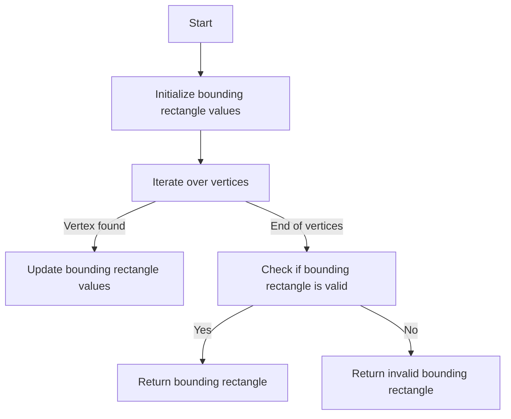
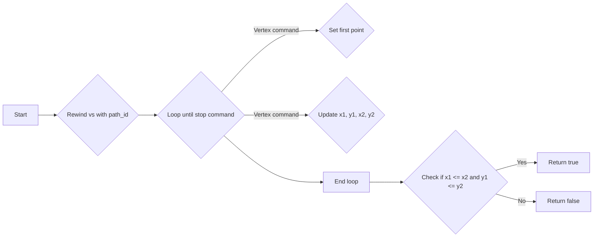
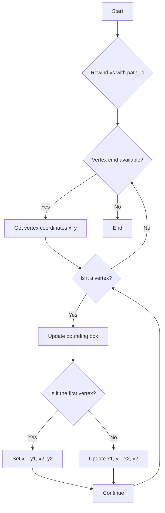

# `matplotlib\extern\agg24-svn\include\agg_bounding_rect.h` 详细设计文档

This code defines functions to calculate the bounding rectangle of a set of vertices in a graphics path, which is used for rendering optimization and collision detection.

## 整体流程



## 类结构

```
namespace agg
├── template<bool is_vertex(unsigned)>
├── template<bool is_stop(unsigned)>
├── template<class VertexSource, class GetId, class CoordT>
│   ├── bool bounding_rect(VertexSource& vs, GetId& gi, unsigned start, unsigned num, CoordT* x1, CoordT* y1, CoordT* x2, CoordT* y2)
│   └── bool bounding_rect_single(VertexSource& vs, unsigned path_id, CoordT* x1, CoordT* y1, CoordT* x2, CoordT* y2)
└── template<class VertexSource, class CoordT>
    ├── bool is_vertex(unsigned)
    ├── bool is_stop(unsigned)
    └── bool bounding_rect(VertexSource& vs, GetId& gi, unsigned start, unsigned num, CoordT* x1, CoordT* y1, CoordT* x2, CoordT* y2)
```

## 全局变量及字段


### `bounding_rect.vs`
    
Reference to the vertex source object.

类型：`VertexSource&`
    


### `bounding_rect.gi`
    
Reference to the ID getter object.

类型：`GetId&`
    


### `bounding_rect.start`
    
Starting index of the vertices to process.

类型：`unsigned`
    


### `bounding_rect.num`
    
Number of vertices to process.

类型：`unsigned`
    


### `bounding_rect.x1`
    
Pointer to store the minimum x-coordinate of the bounding rectangle.

类型：`CoordT*`
    


### `bounding_rect.y1`
    
Pointer to store the minimum y-coordinate of the bounding rectangle.

类型：`CoordT*`
    


### `bounding_rect.x2`
    
Pointer to store the maximum x-coordinate of the bounding rectangle.

类型：`CoordT*`
    


### `bounding_rect.y2`
    
Pointer to store the maximum y-coordinate of the bounding rectangle.

类型：`CoordT*`
    


### `bounding_rect_single.vs`
    
Reference to the vertex source object.

类型：`VertexSource&`
    


### `bounding_rect_single.path_id`
    
ID of the path to process.

类型：`unsigned`
    


### `bounding_rect_single.x1`
    
Pointer to store the minimum x-coordinate of the bounding rectangle.

类型：`CoordT*`
    


### `bounding_rect_single.y1`
    
Pointer to store the minimum y-coordinate of the bounding rectangle.

类型：`CoordT*`
    


### `bounding_rect_single.x2`
    
Pointer to store the maximum x-coordinate of the bounding rectangle.

类型：`CoordT*`
    


### `bounding_rect_single.y2`
    
Pointer to store the maximum y-coordinate of the bounding rectangle.

类型：`CoordT*`
    
    

## 全局函数及方法


### bounding_rect

计算给定顶点源中指定路径的边界矩形。

参数：

- `vs`：`VertexSource&`，顶点源对象，提供访问顶点信息的接口。
- `gi`：`GetId&`，获取顶点标识符的接口。
- `start`：`unsigned`，指定路径开始的索引。
- `num`：`unsigned`，指定要计算的顶点数量。
- `x1`：`CoordT*`，指向存储边界矩形左上角x坐标的变量。
- `y1`：`CoordT*`，指向存储边界矩形左上角y坐标的变量。
- `x2`：`CoordT*`，指向存储边界矩形右下角x坐标的变量。
- `y2`：`CoordT*`，指向存储边界矩形右下角y坐标的变量。

返回值：`bool`，如果成功计算边界矩形且矩形不为空，则返回`true`；否则返回`false`。

#### 流程图

```mermaid
graph TD
    A[Start] --> B{Rewind vs with gi[start + i]}
    B --> C{Vertex cmd = vs.vertex(&x, &y)}
    C -->|is_stop(cmd)?| D[End]
    C -->|is_vertex(cmd)?| E[Update bounding box]
    E --> F{Is first vertex?}
    F -->|Yes| G[Set x1, y1, x2, y2]
    F -->|No| H[Update x1, y1, x2, y2]
    H --> I[Is x < x1?]
    I -->|Yes| J[Set x1]
    I -->|No| K[Keep x1]
    J --> L[Is y < y1?]
    L -->|Yes| M[Set y1]
    L -->|No| N[Keep y1]
    K --> L
    M --> O[Is x > x2?]
    O -->|Yes| P[Set x2]
    O -->|No| Q[Keep x2]
    N --> O
    P --> R[Is y > y2?]
    R -->|Yes| S[Set y2]
    R -->|No| T[Keep y2]
    Q --> R
    S --> U[Is x1 <= x2 and y1 <= y2?]
    U -->|Yes| V[Return true]
    U -->|No| W[Return false]
    D --> X[Return false]
    G --> U
    H --> U
    J --> U
    K --> U
    L --> U
    M --> U
    N --> U
    O --> U
    P --> U
    Q --> U
    R --> U
    S --> U
    T --> U
    V --> X
    W --> X
    X --> U
```

#### 带注释源码

```cpp
template<class VertexSource, class GetId, class CoordT>
bool bounding_rect(VertexSource& vs, GetId& gi, 
                   unsigned start, unsigned num, 
                   CoordT* x1, CoordT* y1, CoordT* x2, CoordT* y2)
{
    unsigned i;
    double x;
    double y;
    bool first = true;

    *x1 = CoordT(1);
    *y1 = CoordT(1);
    *x2 = CoordT(0);
    *y2 = CoordT(0);

    for(i = 0; i < num; i++)
    {
        vs.rewind(gi[start + i]);
        unsigned cmd;
        while(!is_stop(cmd = vs.vertex(&x, &y)))
        {
            if(is_vertex(cmd))
            {
                if(first)
                {
                    *x1 = CoordT(x);
                    *y1 = CoordT(y);
                    *x2 = CoordT(x);
                    *y2 = CoordT(y);
                    first = false;
                }
                else
                {
                    if(CoordT(x) < *x1) *x1 = CoordT(x);
                    if(CoordT(y) < *y1) *y1 = CoordT(y);
                    if(CoordT(x) > *x2) *x2 = CoordT(x);
                    if(CoordT(y) > *y2) *y2 = CoordT(y);
                }
            }
        }
    }
    return *x1 <= *x2 && *y1 <= *y2;
}
```


### bounding_rect

计算给定顶点源中指定路径的边界矩形。

参数：

- `vs`：`VertexSource&`，顶点源对象，提供访问顶点信息的接口。
- `gi`：`GetId&`，获取顶点标识符的接口。
- `start`：`unsigned`，指定路径开始的索引。
- `num`：`unsigned`，指定要计算的顶点数量。
- `x1`：`CoordT*`，指向存储边界矩形左上角x坐标的变量。
- `y1`：`CoordT*`，指向存储边界矩形左上角y坐标的变量。
- `x2`：`CoordT*`，指向存储边界矩形右下角x坐标的变量。
- `y2`：`CoordT*`，指向存储边界矩形右下角y坐标的变量。

返回值：`bool`，如果计算成功且边界矩形不为空，则返回`true`；否则返回`false`。

#### 流程图

```mermaid
graph TD
    A[Start] --> B{is_stop(cmd = vs.vertex(&x, &y))}
    B -- Yes --> C[Update boundaries]
    B -- No --> B
    C --> D[End]
```

#### 带注释源码

```cpp
template<class VertexSource, class GetId, class CoordT>
bool bounding_rect(VertexSource& vs, GetId& gi, 
                   unsigned start, unsigned num, 
                   CoordT* x1, CoordT* y1, CoordT* x2, CoordT* y2)
{
    unsigned i;
    double x;
    double y;
    bool first = true;

    *x1 = CoordT(1);
    *y1 = CoordT(1);
    *x2 = CoordT(0);
    *y2 = CoordT(0);

    for(i = 0; i < num; i++)
    {
        vs.rewind(gi[start + i]);
        unsigned cmd;
        while(!is_stop(cmd = vs.vertex(&x, &y)))
        {
            if(is_vertex(cmd))
            {
                if(first)
                {
                    *x1 = CoordT(x);
                    *y1 = CoordT(y);
                    *x2 = CoordT(x);
                    *y2 = CoordT(y);
                    first = false;
                }
                else
                {
                    if(CoordT(x) < *x1) *x1 = CoordT(x);
                    if(CoordT(y) < *y1) *y1 = CoordT(y);
                    if(CoordT(x) > *x2) *x2 = CoordT(x);
                    if(CoordT(y) > *y2) *y2 = CoordT(y);
                }
            }
        }
    }
    return *x1 <= *x2 && *y1 <= *y2;
}
```


### bounding_rect

计算给定顶点源中指定路径的边界矩形。

参数：

- `vs`：`VertexSource&`，顶点源对象，包含顶点数据。
- `gi`：`GetId&`，获取顶点ID的函数对象。
- `start`：`unsigned`，指定路径开始的索引。
- `num`：`unsigned`，指定要计算的顶点数量。
- `x1`：`CoordT*`，指向存储边界矩形左下角x坐标的变量。
- `y1`：`CoordT*`，指向存储边界矩形左下角y坐标的变量。
- `x2`：`CoordT*`，指向存储边界矩形右上角x坐标的变量。
- `y2`：`CoordT*`，指向存储边界矩形右上角y坐标的变量。

返回值：`bool`，如果成功计算边界矩形则返回true，否则返回false。

#### 流程图

```mermaid
graph TD
    A[Start] --> B{Rewind vs with gi[start + i]}
    B --> C{Is stop?}
    C -- Yes --> D[End]
    C -- No --> E[Get vertex x, y]
    E --> F{Is vertex?}
    F -- Yes --> G[Update bounding box]
    F -- No --> C
    G --> H{Is first?}
    H -- Yes --> I[Set x1, y1, x2, y2]
    H -- No --> J[Update x1, y1, x2, y2]
    I --> K[Set first to false]
    J --> K
```

#### 带注释源码

```cpp
template<class VertexSource, class GetId, class CoordT>
bool bounding_rect(VertexSource& vs, GetId& gi, 
                   unsigned start, unsigned num, 
                   CoordT* x1, CoordT* y1, CoordT* x2, CoordT* y2)
{
    unsigned i;
    double x;
    double y;
    bool first = true;

    *x1 = CoordT(1);
    *y1 = CoordT(1);
    *x2 = CoordT(0);
    *y2 = CoordT(0);

    for(i = 0; i < num; i++)
    {
        vs.rewind(gi[start + i]);
        unsigned cmd;
        while(!is_stop(cmd = vs.vertex(&x, &y)))
        {
            if(is_vertex(cmd))
            {
                if(first)
                {
                    *x1 = CoordT(x);
                    *y1 = CoordT(y);
                    *x2 = CoordT(x);
                    *y2 = CoordT(y);
                    first = false;
                }
                else
                {
                    if(CoordT(x) < *x1) *x1 = CoordT(x);
                    if(CoordT(y) < *y1) *y1 = CoordT(y);
                    if(CoordT(x) > *x2) *x2 = CoordT(x);
                    if(CoordT(y) > *y2) *y2 = CoordT(y);
                }
            }
        }
    }
    return *x1 <= *x2 && *y1 <= *y2;
}
``` 


### bounding_rect_single

计算给定路径的边界矩形。

参数：

- `vs`：`VertexSource&`，路径的顶点源。
- `path_id`：`unsigned`，路径的标识符。
- `x1`：`CoordT*`，边界矩形的左上角 x 坐标。
- `y1`：`CoordT*`，边界矩形的左上角 y 坐标。
- `x2`：`CoordT*`，边界矩形的右下角 x 坐标。
- `y2`：`CoordT*`，边界矩形的右下角 y 坐标。

返回值：`bool`，如果成功计算边界矩形，则返回 true，否则返回 false。

#### 流程图



#### 带注释源码

```cpp
template<class VertexSource, class CoordT> 
bool bounding_rect_single(VertexSource& vs, unsigned path_id,
                          CoordT* x1, CoordT* y1, CoordT* x2, CoordT* y2)
{
    double x;
    double y;
    bool first = true;

    *x1 = CoordT(1);
    *y1 = CoordT(1);
    *x2 = CoordT(0);
    *y2 = CoordT(0);

    vs.rewind(path_id);
    unsigned cmd;
    while(!is_stop(cmd = vs.vertex(&x, &y)))
    {
        if(is_vertex(cmd))
        {
            if(first)
            {
                *x1 = CoordT(x);
                *y1 = CoordT(y);
                *x2 = CoordT(x);
                *y2 = CoordT(y);
                first = false;
            }
            else
            {
                if(CoordT(x) < *x1) *x1 = CoordT(x);
                if(CoordT(y) < *y1) *y1 = CoordT(y);
                if(CoordT(x) > *x2) *x2 = CoordT(x);
                if(CoordT(y) > *y2) *y2 = CoordT(y);
            }
        }
    }
    return *x1 <= *x2 && *y1 <= *y2;
}
``` 


### `agg::bounding_rect`

计算给定顶点源中指定路径的边界矩形。

参数：

- `vs`：`VertexSource&`，顶点源对象，提供访问顶点信息的接口。
- `gi`：`GetId&`，获取顶点标识符的函数对象。
- `start`：`unsigned`，指定路径开始的索引。
- `num`：`unsigned`，指定要计算的顶点数量。
- `x1`：`CoordT*`，指向存储边界矩形左上角x坐标的指针。
- `y1`：`CoordT*`，指向存储边界矩形左上角y坐标的指针。
- `x2`：`CoordT*`，指向存储边界矩形右下角x坐标的指针。
- `y2`：`CoordT*`，指向存储边界矩形右下角y坐标的指针。

返回值：`bool`，如果成功计算边界矩形且矩形不为空，则返回`true`；否则返回`false`。

#### 流程图

```mermaid
graph LR
A[Start] --> B{Rewind vs with gi[start + i]}
B --> C{Loop until is_stop(cmd = vs.vertex(&x, &y))}
C -->|is_vertex(cmd)| D{Set first = false}
C -->|else| E{Update x1, y1, x2, y2}
D --> F{Update x1, y1, x2, y2}
E --> F
F --> G{Check if x1 <= x2 and y1 <= y2}
G --> H[Return true]
G --> I[Return false]
```

#### 带注释源码

```cpp
template<class VertexSource, class GetId, class CoordT>
bool bounding_rect(VertexSource& vs, GetId& gi, 
                   unsigned start, unsigned num, 
                   CoordT* x1, CoordT* y1, CoordT* x2, CoordT* y2)
{
    unsigned i;
    double x;
    double y;
    bool first = true;

    *x1 = CoordT(1);
    *y1 = CoordT(1);
    *x2 = CoordT(0);
    *y2 = CoordT(0);

    for(i = 0; i < num; i++)
    {
        vs.rewind(gi[start + i]);
        unsigned cmd;
        while(!is_stop(cmd = vs.vertex(&x, &y)))
        {
            if(is_vertex(cmd))
            {
                if(first)
                {
                    *x1 = CoordT(x);
                    *y1 = CoordT(y);
                    *x2 = CoordT(x);
                    *y2 = CoordT(y);
                    first = false;
                }
                else
                {
                    if(CoordT(x) < *x1) *x1 = CoordT(x);
                    if(CoordT(y) < *y1) *y1 = CoordT(y);
                    if(CoordT(x) > *x2) *x2 = CoordT(x);
                    if(CoordT(y) > *y2) *y2 = CoordT(y);
                }
            }
        }
    }
    return *x1 <= *x2 && *y1 <= *y2;
}
```


### `agg::bounding_rect`

计算给定顶点源中指定路径的边界矩形。

参数：

- `vs`：`VertexSource&`，顶点源对象，提供访问顶点数据的接口。
- `gi`：`GetId&`，获取顶点标识符的接口。
- `start`：`unsigned`，指定路径开始的索引。
- `num`：`unsigned`，指定要计算的顶点数量。
- `x1`：`CoordT*`，指向存储边界矩形左上角x坐标的指针。
- `y1`：`CoordT*`，指向存储边界矩形左上角y坐标的指针。
- `x2`：`CoordT*`，指向存储边界矩形右下角x坐标的指针。
- `y2`：`CoordT*`，指向存储边界矩形右下角y坐标的指针。

返回值：`bool`，如果成功计算边界矩形且矩形不为空，则返回`true`；否则返回`false`。

#### 流程图

```mermaid
graph LR
A[Start] --> B{Rewind vs with gi[start + i]}
B --> C{Is stop?}
C -- Yes --> D[End]
C -- No --> E{Is vertex?}
E -- Yes --> F{First?}
F -- Yes --> G[Set x1, y1, x2, y2]
F -- No --> H{Update x1, y1, x2, y2}
H --> I{Is stop?}
I -- Yes --> D
I -- No --> E
```

#### 带注释源码

```cpp
template<class VertexSource, class GetId, class CoordT>
bool bounding_rect(VertexSource& vs, GetId& gi, 
                   unsigned start, unsigned num, 
                   CoordT* x1, CoordT* y1, CoordT* x2, CoordT* y2)
{
    unsigned i;
    double x;
    double y;
    bool first = true;

    *x1 = CoordT(1);
    *y1 = CoordT(1);
    *x2 = CoordT(0);
    *y2 = CoordT(0);

    for(i = 0; i < num; i++)
    {
        vs.rewind(gi[start + i]);
        unsigned cmd;
        while(!is_stop(cmd = vs.vertex(&x, &y)))
        {
            if(is_vertex(cmd))
            {
                if(first)
                {
                    *x1 = CoordT(x);
                    *y1 = CoordT(y);
                    *x2 = CoordT(x);
                    *y2 = CoordT(y);
                    first = false;
                }
                else
                {
                    if(CoordT(x) < *x1) *x1 = CoordT(x);
                    if(CoordT(y) < *y1) *y1 = CoordT(y);
                    if(CoordT(x) > *x2) *x2 = CoordT(x);
                    if(CoordT(y) > *y2) *y2 = CoordT(y);
                }
            }
        }
    }
    return *x1 <= *x2 && *y1 <= *y2;
}
```


### `agg::bounding_rect`

计算给定顶点源中指定范围内的顶点的边界矩形。

参数：

- `vs`：`VertexSource&`，顶点源对象，提供访问顶点数据的接口。
- `gi`：`GetId&`，获取顶点标识符的函数对象，用于确定顶点的索引。
- `start`：`unsigned`，指定范围内第一个顶点的索引。
- `num`：`unsigned`，指定范围内顶点的数量。
- `x1`：`CoordT*`，指向存储边界矩形左下角x坐标的变量。
- `y1`：`CoordT*`，指向存储边界矩形左下角y坐标的变量。
- `x2`：`CoordT*`，指向存储边界矩形右上角x坐标的变量。
- `y2`：`CoordT*`，指向存储边界矩形右上角y坐标的变量。

返回值：`bool`，如果成功计算边界矩形，则返回`true`；如果`start`和`num`指定的范围无效，则返回`false`。

#### 流程图

```mermaid
graph TD
    A[Start] --> B{Rewind vs with gi[start]}
    B --> C{Loop num times}
    C --> D{Vertex cmd available?}
    D -- Yes --> E{Is vertex cmd?}
    E -- Yes --> F{Update x1, y1, x2, y2}
    E -- No --> G{Is stop cmd?}
    G -- Yes --> H[End loop]
    H --> I{Return x1 <= x2 && y1 <= y2}
```

#### 带注释源码

```cpp
template<class VertexSource, class GetId, class CoordT>
bool bounding_rect(VertexSource& vs, GetId& gi, 
                   unsigned start, unsigned num, 
                   CoordT* x1, CoordT* y1, CoordT* x2, CoordT* y2)
{
    unsigned i;
    double x;
    double y;
    bool first = true;

    *x1 = CoordT(1);
    *y1 = CoordT(1);
    *x2 = CoordT(0);
    *y2 = CoordT(0);

    for(i = 0; i < num; i++)
    {
        vs.rewind(gi[start + i]);
        unsigned cmd;
        while(!is_stop(cmd = vs.vertex(&x, &y)))
        {
            if(is_vertex(cmd))
            {
                if(first)
                {
                    *x1 = CoordT(x);
                    *y1 = CoordT(y);
                    *x2 = CoordT(x);
                    *y2 = CoordT(y);
                    first = false;
                }
                else
                {
                    if(CoordT(x) < *x1) *x1 = CoordT(x);
                    if(CoordT(y) < *y1) *y1 = CoordT(y);
                    if(CoordT(x) > *x2) *x2 = CoordT(x);
                    if(CoordT(y) > *y2) *y2 = CoordT(y);
                }
            }
        }
    }
    return *x1 <= *x2 && *y1 <= *y2;
}
``` 


### `agg::bounding_rect_single`

计算给定路径的边界矩形。

参数：

- `vs`：`VertexSource&`，路径的顶点源。
- `path_id`：`unsigned`，路径的标识符。
- `x1`：`CoordT*`，边界矩形的左上角 x 坐标。
- `y1`：`CoordT*`，边界矩形的左上角 y 坐标。
- `x2`：`CoordT*`，边界矩形的右下角 x 坐标。
- `y2`：`CoordT*`，边界矩形的右下角 y 坐标。

返回值：`bool`，如果成功计算边界矩形，则返回 `true`，否则返回 `false`。

#### 流程图



#### 带注释源码

```cpp
template<class VertexSource, class CoordT> 
bool bounding_rect_single(VertexSource& vs, unsigned path_id,
                          CoordT* x1, CoordT* y1, CoordT* x2, CoordT* y2)
{
    double x;
    double y;
    bool first = true;

    *x1 = CoordT(1);
    *y1 = CoordT(1);
    *x2 = CoordT(0);
    *y2 = CoordT(0);

    vs.rewind(path_id);
    unsigned cmd;
    while(!is_stop(cmd = vs.vertex(&x, &y)))
    {
        if(is_vertex(cmd))
        {
            if(first)
            {
                *x1 = CoordT(x);
                *y1 = CoordT(y);
                *x2 = CoordT(x);
                *y2 = CoordT(y);
                first = false;
            }
            else
            {
                if(CoordT(x) < *x1) *x1 = CoordT(x);
                if(CoordT(y) < *y1) *y1 = CoordT(y);
                if(CoordT(x) > *x2) *x2 = CoordT(x);
                if(CoordT(y) > *y2) *y2 = CoordT(y);
            }
        }
    }
    return *x1 <= *x2 && *y1 <= *y2;
}
```


## 关键组件


### 张量索引与惰性加载

张量索引与惰性加载是代码中用于高效访问和操作大型数据结构（如张量）的关键组件。它允许在需要时才计算或加载数据，从而减少内存使用和提高性能。

### 反量化支持

反量化支持是代码中用于处理和转换量化数据的关键组件。它允许在量化与去量化之间进行转换，确保数据在不同量化级别之间的一致性和准确性。

### 量化策略

量化策略是代码中用于确定数据量化方法和参数的关键组件。它决定了数据在量化过程中的精度和范围，对模型的性能和资源消耗有重要影响。


## 问题及建议


### 已知问题

-   **代码可读性**：代码中使用了大量的模板和类型别名，这可能会降低代码的可读性，特别是对于不熟悉模板编程的开发者。
-   **错误处理**：函数`bounding_rect`和`bounding_rect_single`没有显式的错误处理机制，如果输入参数不正确或`VertexSource`接口的实现有误，可能会导致未定义行为。
-   **性能优化**：在循环中，每次迭代都会调用`vs.rewind(gi[start + i])`，这可能是一个性能瓶颈，尤其是在处理大量顶点时。
-   **类型转换**：在比较和赋值操作中，存在隐式的类型转换，这可能会导致精度损失。

### 优化建议

-   **增加注释**：为模板参数和类型别名添加详细的注释，以提高代码的可读性。
-   **错误处理**：实现错误处理机制，例如检查`VertexSource`接口的实现是否正确，并在必要时抛出异常。
-   **优化循环**：考虑使用更高效的算法来计算边界框，例如使用增量更新而不是每次都重置边界值。
-   **类型转换**：避免隐式类型转换，确保在比较和赋值操作中使用正确的类型，以避免精度损失。
-   **单元测试**：编写单元测试来验证函数的正确性和性能，确保在未来的修改中不会引入错误。


## 其它


### 设计目标与约束

- 设计目标：实现一个高效的函数，用于计算给定顶点源中指定路径的边界矩形。
- 约束条件：
  - 输入的顶点源必须支持rewind和vertex操作。
  - 输入的路径ID必须是有效的。
  - 输出的边界矩形坐标必须是正确的。

### 错误处理与异常设计

- 错误处理：
  - 如果顶点源不支持rewind或vertex操作，函数将返回false。
  - 如果路径ID无效，函数将返回false。
- 异常设计：
  - 函数不抛出异常，而是通过返回值来表示错误。

### 数据流与状态机

- 数据流：
  - 输入：顶点源、路径ID、边界矩形坐标指针。
  - 输出：边界矩形坐标、布尔值表示是否成功计算。
- 状态机：
  - 初始状态：设置边界矩形坐标为无穷大。
  - 执行状态：遍历顶点源中的顶点，更新边界矩形坐标。
  - 结束状态：检查边界矩形坐标是否有效。

### 外部依赖与接口契约

- 外部依赖：
  - 顶点源：必须实现rewind和vertex操作。
  - 获取ID：必须能够获取顶点的ID。
  - 坐标类型：必须支持比较和赋值操作。
- 接口契约：
  - bounding_rect和bounding_rect_single函数必须正确处理所有有效的输入。
  - 函数必须返回正确的边界矩形坐标和布尔值。

    