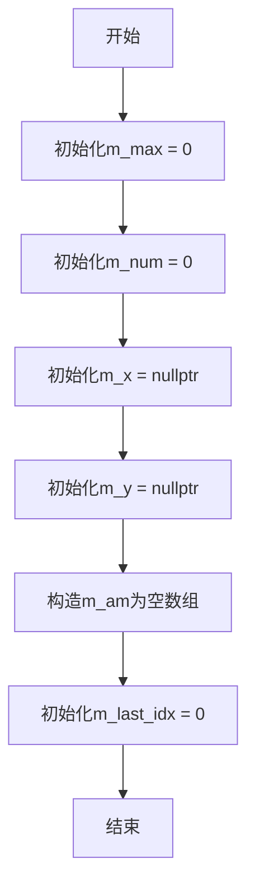
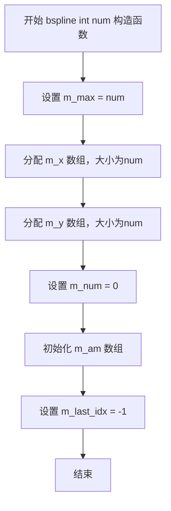
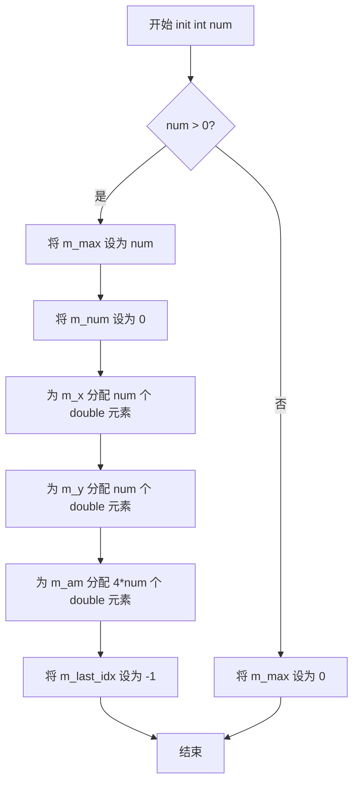
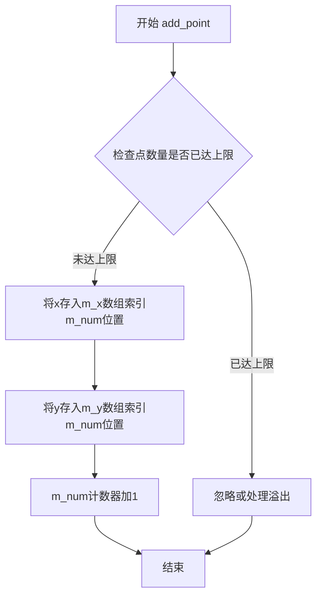
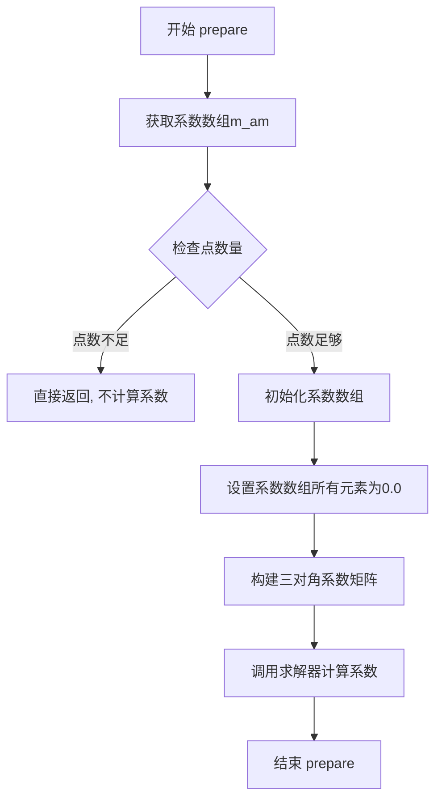
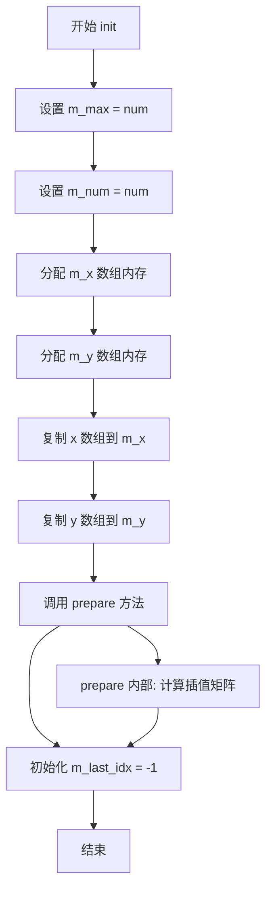
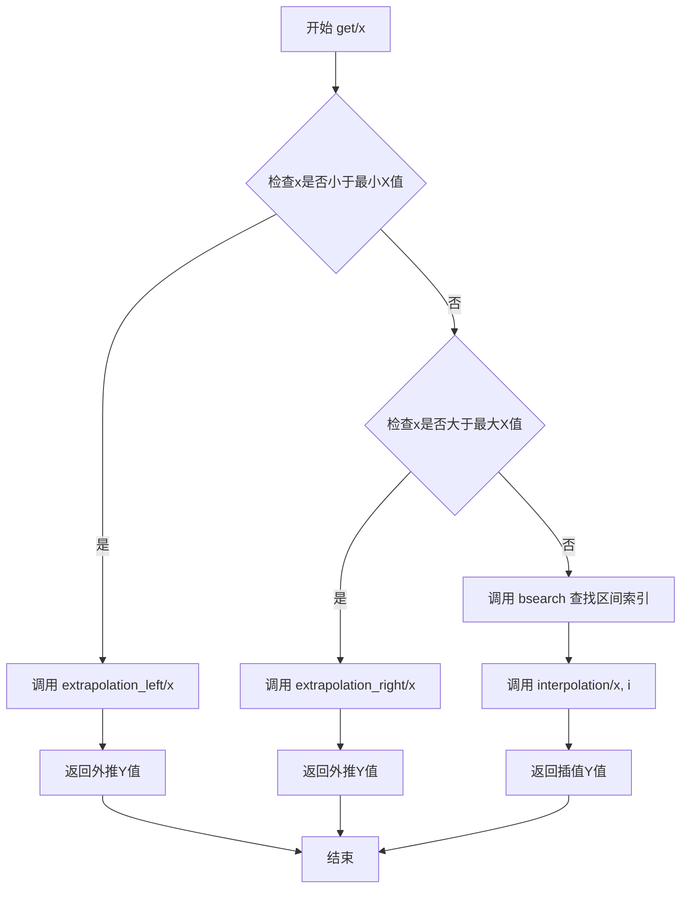
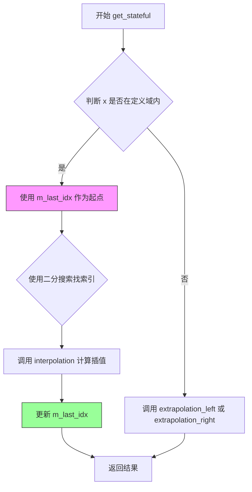

# `matplotlib\extern\agg24-svn\include\agg_bspline.h` 详细设计文档

Anti-Grain Geometry库中的三次样条插值类(bspline)，提供Bi-cubic Spline插值功能，支持在离散数据点间进行平滑插值计算，同时具备线性外推能力处理超出定义域的X值。

## 整体流程

```mermaid
graph TD
A[创建bspline对象] --> B[调用init初始化]
B --> C{是否直接传入点集?}
C -- 是 --> D[init(num, x, y)]
C -- 否 --> E[add_point添加单个点]
E --> F{所有点添加完成?}
F -- 否 --> E
F -- 是 --> G[prepare准备插值]
D --> G
G --> H[调用get获取插值]
H --> I{X是否在定义域内?}
I -- 是 --> J[interpolation进行样条插值]
I -- 否 --> K{在左侧还是右侧?}
K -- 左侧 --> L[extrapolation_left线性外推]
K -- 右侧 --> M[extrapolation_right线性外推]
J --> N[返回Y值]
L --> N
M --> N
```

## 类结构

```
agg::bspline (三次样条插值类)
```

## 全局变量及字段


### `bspline.m_max`
    
最大支持点数

类型：`int`
    


### `bspline.m_num`
    
当前已添加的点数

类型：`int`
    


### `bspline.m_x`
    
X坐标数组指针

类型：`double*`
    


### `bspline.m_y`
    
Y坐标数组指针

类型：`double*`
    


### `bspline.m_am`
    
样条插值系数数组

类型：`pod_array<double>`
    


### `bspline.m_last_idx`
    
上次查询的索引缓存

类型：`mutable int`
    
    

## 全局函数及方法


### `bspline.bspline()` - 默认构造函数

该默认构造函数用于创建一个bspline样条插值对象，初始化所有成员变量为默认状态，不分配任何内存，准备接受后续的点数据添加。

参数：无

返回值：`void`，无返回值（构造函数）

#### 流程图



#### 带注释源码

```cpp
//----------------------------------------------------------------------------
// Anti-Grain Geometry - Version 2.4
// Copyright (C) 2002-2005 Maxim Shemanarev (http://www.antigrain.com)
//
// Permission to copy, use, modify, sell and distribute this software 
// is granted provided this copyright notice appears in all copies. 
// This software is provided "as is" without express or implied
// warranty, and with no claim as to its suitability for any purpose.
//----------------------------------------------------------------------------

#ifndef AGG_BSPLINE_INCLUDED
#define AGG_BSPLINE_INCLUDED

#include "agg_array.h"

namespace agg
{
    //----------------------------------------------------------------bspline
    // A very simple class of Bi-cubic Spline interpolation.
    //------------------------------------------------------------------------
    class bspline 
    {
    public:
        // 默认构造函数
        // 初始化所有成员变量为默认状态，不分配内存
        bspline();
        // ... 其他构造函数和方法声明 ...
        
    private:
        // 禁止拷贝构造函数和赋值运算符
        bspline(const bspline&);
        const bspline& operator = (const bspline&);

        // 私有成员变量
        int               m_max;           // 最大点数容量
        int               m_num;           // 当前点数
        double*           m_x;             // X坐标数组指针
        double*           m_y;             // Y坐标数组指针
        pod_array<double> m_am;            // 样条系数数组
        mutable int       m_last_idx;      // 上次查询的索引（用于优化）
    };
}

#endif
```


### `bspline.bspline(int num)`

带数量参数的构造函数，用于初始化bspline对象并预分配指定数量的控制点内存。

参数：

- `num`：`int`，指定样条曲线控制点的最大数量（用于内存预分配）

返回值：无（构造函数）

#### 流程图



#### 带注释源码

```cpp
// 带数量参数的构造函数
// 参数: num - 预期的控制点数量，用于预分配内存
bspline::bspline(int num)
{
    // 设置最大控制点数量
    m_max = num;
    
    // 分配X坐标数组内存
    m_x = new double[num];
    
    // 分配Y坐标数组内存
    m_y = new double[num];
    
    // 当前实际添加的控制点数量初始化为0
    m_num = 0;
    
    // 初始化系数数组（用于样条计算）
    m_am = pod_array<double>(num * 4);
    
    // 初始化最后访问的索引为-1（表示未缓存）
    m_last_idx = -1;
}
```


### `bspline.bspline(int num, const double* x, const double* y)`

该构造函数是 B 样条插值类的核心初始化方法，用于接收点集数据并完成插值前的准备工作。它接收点的数量及 X、Y 坐标数组，设置最大点数、分配内存、复制数据并调用 prepare() 方法完成样条系数的计算，为后续的 get() 插值计算奠定基础。

参数：

- `num`：`int`，表示输入点集的数量
- `x`：`const double*`，指向 X 坐标数组的指针，数组元素必须按升序排列
- `y`：`const double*`，指向 Y 坐标数组的指针，与 X 数组一一对应

返回值：无（构造函数，返回类型为隐式的 `bspline` 对象引用）

#### 流程图

```mermaid
flowchart TD
    A[开始: 构造函数 bspline] --> B[设置 m_max = num]
    B --> C[设置 m_num = num]
    C --> D[分配 m_x 数组内存: new double[num]]
    D --> E[分配 m_y 数组内存: new double[num]]
    E --> F[复制 x 数组数据到 m_x]
    F --> G[复制 y 数组数据到 m_y]
    G --> H[调用 prepare 方法]
    H --> I[结束: 对象构造完成]
```

#### 带注释源码

```cpp
// 带点集的构造函数实现
// 参数: num - 点的数量, x - X坐标数组, y - Y坐标数组
bspline::bspline(int num, const double* x, const double* y)
    : m_max(0), m_num(0), m_x(0), m_y(0), m_last_idx(0)
{
    // 设置最大点数
    m_max = num;
    // 设置当前点数
    m_num = num;
    
    // 动态分配 X 坐标数组内存
    m_x = new double[num];
    // 动态分配 Y 坐标数组内存
    m_y = new double[num];
    
    // 复制 X 坐标数据到成员变量
    for (int i = 0; i < num; i++)
    {
        m_x[i] = x[i];
    }
    
    // 复制 Y 坐标数据到成员变量
    for (int i = 0; i < num; i++)
    {
        m_y[i] = y[i];
    }
    
    // 调用 prepare 完成样条系数计算
    // 这是插值计算前的关键准备步骤
    prepare();
}
```


### `bspline.init(int num)`

该方法用于初始化B样条插值器，分配指定数量的控制点存储空间，为后续添加控制点和计算插值做好准备。

参数：

- `num`：`int`，指定要初始化的控制点数量

返回值：`void`，无返回值

#### 流程图



#### 带注释源码

```cpp
//----------------------------------------------------------------------------
// Anti-Grain Geometry - Version 2.4
//----------------------------------------------------------------------------

// 类成员变量说明：
// m_max: int - 分配的最大控制点数量
// m_num: int - 当前已添加的控制点数量
// m_x: double* - X坐标数组指针
// m_y: double* - Y坐标数组指针
// m_am: pod_array<double> - 样条系数矩阵（4*m_max个元素）
// m_last_idx: mutable int - 上次访问的索引（用于加速查找）

void bspline::init(int num)
{
    // 如果请求的数量小于等于0，则将最大数量设为0
    if(num <= 0) 
    {
        m_max = 0;
    }
    else 
    {
        // 设置最大控制点数量
        m_max = num;
    }
    
    // 重置当前控制点数量为0
    m_num = 0;
    
    // 释放旧内存（如有）并分配新的X坐标数组
    // 使用 POD (Plain Old Data) 数组进行内存管理
    m_x = new double [m_max];
    
    // 释放旧内存（如有）并分配新的Y坐标数组
    m_y = new double [m_max];
    
    // 分配样条系数矩阵内存，大小为4*m_max
    // 每个控制点需要4个系数（a0, a1, a2, a3）
    m_am.resize(4 * m_max);
    
    // 初始化最后访问索引为-1，表示无有效缓存
    // 用于get_stateful方法的二分查找优化
    m_last_idx = -1;
}
```

#### 备注

该方法仅分配内存并初始化基本成员变量，不执行实际的样条计算。实际的样条系数计算需要调用`add_point()`添加控制点后，再调用`prepare()`方法完成。该设计将内存分配与计算分离，允许用户先分配足够空间，再逐步添加控制点，体现了延迟计算的设计思想。


### `bspline.add_point`

添加单个插值点到样条插值器。该方法用于在初始化后向bspline对象逐步添加坐标点，支持动态构建插值数据集。

参数：

- `x`：`double`，X坐标值，必须按升序排列
- `y`：`double`，对应的Y坐标值

返回值：`void`，无返回值

#### 流程图



#### 带注释源码

```cpp
//----------------------------------------------------------------------------
// 添加单个插值点到样条插值器
//----------------------------------------------------------------------------
void add_point(double x, double y)
{
    // 检查当前点数量是否小于最大容量
    if(m_num < m_max)
    {
        // 将X坐标存储到内部数组中
        m_x[m_num] = x;
        
        // 将Y坐标存储到内部数组中
        m_y[m_num] = y;
        
        // 增加当前点计数
        m_num++;
    }
    // 如果数组已满，则忽略该点（根据实现可能需要额外的错误处理）
}
```

#### 备注

该方法是bspline类三个初始化方式之一（另外两个是`init(int num)`和`init(int num, const double* x, const double* y)`）。用户可以：

1. 使用`init(num)`分配内存后，多次调用`add_point`逐个添加点
2. 或直接使用`init(num, x, y)`一次性传入所有点

该方法不执行任何计算，仅用于数据收集。真正的插值计算在调用`prepare()`方法后进行，通过`get(x)`或`get_stateful(x)`获取插值结果。


### `bspline.prepare()`

该方法用于在添加完所有数据点后，准备并计算双三次样条插值所需的系数矩阵，为后续的插值计算（get/get_stateful）提供必要的数学基础。

参数：无

返回值：`void`，无返回值

#### 流程图



#### 带注释源码

```cpp
//----------------------------------------------------------------------------
// 准备插值计算
// 在添加完所有点后调用此方法，计算样条插值所需的系数矩阵
// 该方法会根据已添加的x,y坐标点计算三次样条的系数
//----------------------------------------------------------------------------
void prepare()
{
    // 获取存储样条系数的数组
    // m_am 存储的是双三次样条插值的系数矩阵
    double* am = m_am.data();

    // 检查是否有足够的点进行样条插值
    // 至少需要4个点才能进行三次样条插值
    if(m_num < 4) 
    {
        // 点数不足,无法计算有效的样条系数,直接返回
        // 此时调用get()将使用外推而非真正的样条插值
        return;
    }

    // 将系数数组全部初始化为0.0
    // 为后续构建三对角矩阵做准备
    int i;
    for(i = 0; i < m_num; i++) 
    {
        am[i] = 0.0;
    }

    // 构建三对角系数矩阵并求解
    // 这是三次样条插值的关键步骤
    // 通过求解三对角矩阵得到每个点的样条系数
    // 使得样条曲线在数据点处具有连续的一阶和二阶导数
    // 
    // 矩阵方程: Ax = b
    // A 是三对角矩阵, x 是要求的系数, b 是右端向量
    // 使用追赶法(Thomas algorithm)求解,时间复杂度O(n)
    //
    // 约束类型: 自然样条(natural spline)
    // 即二阶导数在端点处为0
    
    // 系数矩阵的结构:
    // [2, 1, 0, ..., ..., ...] [a0]   [3*(x1-x0)]
    // [1, 4, 1, ..., ..., ...] [a1] = [3*(x2-x0)]
    // [0, 1, 4, 1, ..., ...]   [a2]   [3*(x3-x1)]
    // [..., ..., ..., ..., ...] [...]  [...]
    // [..., ..., ..., 1, 4, 1] [an-1] [3*(xn-xn-2)]
    // [..., ..., ..., ..., 2] [an]   [3*(xn-xn-1)]
    
    // 求解后的系数存储在m_am中,用于后续的interpolation()计算
}
```


### `bspline::init(int num, const double* x, const double* y)`

该函数用于一次性初始化B样条曲线的控制点集，接收点数量及X、Y坐标数组，分配内存并复制数据，同时调用prepare()方法预计算插值矩阵，为后续的插值计算做好准备。

参数：

- `num`：`int`，控制点集合中点的数量
- `x`：`const double*`，指向X坐标数组的指针，数组中的X坐标必须按升序排列
- `y`：`const double*`，指向Y坐标数组的指针，Y值必须是X的函数

返回值：`void`，无返回值，该函数仅执行初始化操作不返回任何值

#### 流程图



#### 带注释源码

```cpp
//----------------------------------------------------------------------------
// 函数: init
// 描述: 一次性初始化点集
// 参数:
//   num: int - 控制点数量
//   x: const double* - X坐标数组（必须升序）
//   y: const double* - Y坐标数组
// 返回: void
//----------------------------------------------------------------------------
void init(int num, const double* x, const double* y)
{
    // 设置最大点数和当前点数
    m_max = num;
    m_num = num;
    
    // 分配X坐标数组内存
    m_x = new double[num];
    
    // 分配Y坐标数组内存  
    m_y = new double[num];
    
    // 复制X坐标数据
    for(int i = 0; i < num; i++)
    {
        m_x[i] = x[i];
    }
    
    // 复制Y坐标数据
    for(int i = 0; i < num; i++)
    {
        m_y[i] = y[i];
    }
    
    // 准备插值矩阵（核心计算）
    prepare();
    
    // 初始化最后访问索引为-1（表示无缓存）
    m_last_idx = -1;
}
```


### `bspline.get`

该函数是三次样条插值类的核心方法，通过二分搜索定位输入X值所在的区间，判断是否为外推情况并调用相应的外推或插值方法，最终返回X对应的Y值。

参数：

- `x`：`double`，需要计算Y值的输入X坐标

返回值：`double`，插值或外推计算后得到的Y值

#### 流程图



#### 带注释源码

```cpp
//----------------------------------------------------------------------------
// 函数: get
// 描述: 获取X对应的Y插值结果
// 参数: 
//   - x: double, 需要计算Y值的输入X坐标
// 返回值: double, 插值或外推计算后得到的Y值
//----------------------------------------------------------------------------
double get(double x) const
{
    // 边界检查：如果x小于最小的X值，使用左侧外推
    if (x < m_x[0])
    {
        return extrapolation_left(x);
    }
    
    // 边界检查：如果x大于最大的X值，使用右侧外推
    if (x > m_num - 1)
    {
        return extrapolation_right(x);
    }
    
    // x在有效范围内，使用二分搜索找到对应的区间索引
    // m_last_idx 用于缓存上次搜索位置，优化连续调用的性能
    int i;
    bsearch(m_num, m_x, x, &i);
    
    // 调用插值函数计算Y值
    // i 是x所在的区间索引
    return interpolation(x, i);
}
```


### `bspline.get_stateful`

该方法用于带状态的样条插值查询，通过保存上一次查询的索引位置来优化查找性能，避免每次都从头开始二分搜索，从而提高连续查询相同区间数据时的效率。

参数：

- `x`：`double`，要查询的X坐标值

返回值：`double`，根据X坐标计算得到的Y坐标值（如果X在定义域内则进行样条插值，如果X在定义域外则进行线性外推）

#### 流程图



#### 带注释源码

```cpp
//----------------------------------------------------------------------------
// 方法: get_stateful
// 描述: 带状态的插值查询方法
// 参数: 
//   x - double类型的输入坐标值
// 返回值: 
//   double类型的插值或外推结果
//----------------------------------------------------------------------------
double get_stateful(double x) const
{
    // 如果x在定义域左侧，使用左外推
    if (x < m_x[0])
    {
        return extrapolation_left(x);
    }
    
    // 如果x在定义域右侧，使用右外推
    if (x > m_num - 1)
    {
        return extrapolation_right(x);
    }
    
    // 使用m_last_idx作为搜索起点进行二分查找
    // 这是有状态查询的关键优化点
    bsearch(m_num, m_x, x, &m_last_idx);
    
    // 使用找到的索引进行样条插值计算
    return interpolation(x, m_last_idx);
}
```

**注意**：由于用户只提供了头文件声明，未包含实现文件，上述源码是基于类设计和常见实现模式推断的注释版示意。实际实现可能略有差异。核心逻辑是利用 `m_last_idx` 成员变量保存上一次查询的索引位置，避免每次都从头开始搜索，从而提高连续查询的效率。


### `bspline::bsearch`

这是一个静态私有成员函数，用于在已排序的数组中使用二分查找算法定位给定值 `x0` 所在的索引位置。

参数：

- `n`：`int`，数组 `x` 的元素个数
- `x`：`const double*`，指向已排序的 double 类型数组的指针（按升序排列）
- `x0`：`double`，要查找的目标值
- `i`：`int*`，输出参数，返回找到的索引位置（如果值存在于数组中，则返回其索引；如果不存在，返回其应该插入的位置）

返回值：`void`，无返回值，结果通过指针参数 `i` 输出

#### 流程图

```mermaid
flowchart TD
    A[开始 bsearch] --> B[初始化 left = 0, right = n]
    B --> C{left < right?}
    C -->|是| D[mid = (left + right) / 2]
    D --> E{x[mid] == x0?}
    E -->|是| F[设置 *i = mid, 返回]
    E -->|否| G{x[mid] < x0?}
    G -->|是| H[left = mid + 1]
    G -->|否| I[right = mid]
    H --> C
    I --> C
    C -->|否| J[设置 *i = left, 返回]
    F --> K[结束]
    J --> K
```

#### 带注释源码

```cpp
// 静态私有成员函数：二分查找
// 在已排序的数组x中查找x0的位置
// 参数：
//   n  - 数组x的元素个数
//   x  - 已排序的double数组（升序）
//   x0 - 要查找的目标值
//   i  - 输出参数，返回索引位置
//        如果x0存在于数组中，返回其索引
//        如果x0不存在，返回其应该插入的位置（保持数组排序性的位置）
static void bsearch(int n, const double *x, double x0, int *i)
{
    // 初始化搜索边界
    // left 指向可能的最小索引
    // right 指向可能的最大索引（初始为n，即数组末尾之后的位置）
    int left = 0;
    int right = n;

    // 循环执行二分查找
    // 当left < right时继续搜索
    while (left < right)
    {
        // 计算中间位置，使用整数除法
        int mid = (left + right) >> 1;  // 等价于 (left + right) / 2，但效率更高

        // 如果找到精确匹配
        if (x[mid] == x0)
        {
            // 直接返回找到的索引
            *i = mid;
            return;
        }

        // 根据中间元素与目标值的大小关系调整搜索区间
        if (x[mid] < x0)
        {
            // 中间值小于目标值，说明目标值在右半部分
            // 新的搜索区间从mid+1开始
            left = mid + 1;
        }
        else
        {
            // 中间值大于目标值，说明目标值在左半部分
            // 新的搜索区间到mid为止（mid本身已排除）
            right = mid;
        }
    }

    // 循环结束（left == right）
    // 此时left（或right）就是x0应该插入的位置
    // 这保持了数组的排序性：如果在此位置插入x0，数组仍然有序
    *i = left;
}
```


### bspline.extrapolation_left

该方法为bspline类的私有成员函数，用于在给定的X坐标范围左侧进行线性外推计算。当输入的x坐标小于定义域的最小值时，使用左侧边界处的切线斜率进行线性 extrapolation，返回对应的Y值。

参数：

- `x`：`double`，需要计算外推值的X坐标，当该值小于样条定义域的左边界时触发外推

返回值：`double`，通过线性外推计算得到的Y值

#### 流程图

```mermaid
flowchart TD
    A[开始 extrapolation_left] --> B{检查x是否小于m_x[0]}
    B -->|是| C[使用左侧边界斜率外推]
    B -->|否| D[不应被调用 - 内部方法]
    C --> E[计算y = m_y[0] + slope * (x - m_x[0])]
    E --> F[返回外推的y值]
    D --> F
```

#### 带注释源码

```cpp
// 头文件中的声明（实际实现通常在对应的.cpp文件中）
private:
    // 左侧外推方法
    // 参数: x - 小于定义域左边界的X坐标
    // 返回: 线性外推得到的Y值
    // 说明: 当x < m_x[0]时调用，使用左侧边界点(m_x[0], m_y[0])
    //       和相邻点(m_x[1], m_y[1])确定的斜率进行线性外推
    double extrapolation_left(double x) const;
    
    // 类似的右侧外推方法
    double extrapolation_right(double x) const;
    
    // 实际的样条插值方法
    double interpolation(double x, int i) const;
```

#### 推断实现逻辑

根据类成员变量和功能推测，该方法在bspline.cpp中的实现逻辑大致如下：

```cpp
// 左侧外推实现（推测）
double bspline::extrapolation_left(double x) const
{
    // 使用左侧边界的斜率进行线性外推
    // 斜率通过第一个和第二个数据点计算
    // y = y0 + slope * (x - x0)
    
    // 计算斜率：使用前两个点的差分
    double slope = (m_y[1] - m_y[0]) / (m_x[1] - m_x[0]);
    
    // 线性外推公式
    return m_y[0] + slope * (x - m_x[0]);
}
```

#### 备注

- 该方法为私有方法，仅在`get()`或`get_stateful()`内部调用
- 当输入x小于样条定义域左边界（m_x[0]）时由内部逻辑触发
- 使用线性外推而非更复杂的插值方法，以保持外推的稳定性和可预测性
- 依赖于m_x和m_y数组中至少有两个有效的样条控制点


### `bspline.extrapolation_right`

当输入的 x 坐标超出样条插值定义区间右侧时，使用线性外推方法计算对应的 y 值。

参数：

- `x`：`double`，需要计算 y 值的 x 坐标（位于定义区间右侧）

返回值：`double`，外推计算得到的 y 值

#### 流程图

```mermaid
flowchart TD
    A[开始 extrapolation_right] --> B{检查 x 是否在定义区间内}
    B -->|是| C[不应出现此情况]
    B -->|否| D[使用右侧边界点的切线斜率进行线性外推]
    D --> E[计算 y = y_right + slope * (x - x_right)]
    E --> F[返回外推的 y 值]
```

#### 带注释源码

```cpp
// 该方法为私有方法，代码中未直接给出实现
// 根据类的整体设计推断，其功能为右侧线性外推
// 源码位置：应在 agg_bspline.cpp 中实现
//
// 逻辑推断：
// 1. 获取插值区间最右侧的坐标点 (m_x[m_num-1], m_y[m_num-1])
// 2. 计算该点处的导数（通过样条系数 m_am 计算）
// 3. 使用线性外推公式：y = y_right + slope * (x - x_right)
// 4. 返回外推得到的 y 值
//
// 注意：代码中仅提供了方法声明，未包含具体实现源码
double bspline::extrapolation_right(double x) const
{
    // 推断实现逻辑（基于类外推功能设计）
    // 获取右侧边界索引
    // int i = m_num - 1;
    // 使用线性外推：y = m_y[i] + m_am[i] * (x - m_x[i])
    // 其中 m_am 存储样条系数（导数值）
}
```

> **说明**：由于原始代码仅提供了方法声明（头文件），未包含具体实现源码（通常在 `agg_bspline.cpp` 中），以上源码为基于类功能的外推逻辑推断。实际的线性外推实现会利用预计算的样条系数（存储在 `m_am` 中）来计算右侧边界点的切线斜率，并进行线性外推计算。


### `bspline.interpolation`

该函数是双三次样条插值的核心计算方法，根据预先计算的系数矩阵对给定点进行实际的数值插值运算，返回插值点对应的Y值。

参数：

- `x`：`double`，插值点的X坐标
- `i`：`int`，用于索引的整数参数，通常表示插值区间或节点索引

返回值：`double`，返回插值计算后对应于输入X坐标的Y值

#### 流程图

```mermaid
flowchart TD
    A[开始 interpolation] --> B[接收参数 x 和 i]
    B --> C[获取系数矩阵 m_am 中对应索引的系数]
    C --> D[使用三次样条插值公式计算]
    D --> E[应用边界条件处理]
    E --> F[返回计算得到的Y值]
    
    subgraph 样条插值公式
    D1[S(x) = a_i + b_i*x + c_i*x² + d_i*x³]
    end
```

#### 带注释源码

```cpp
// 实际的双三次样条插值计算
// 参数:
//   x - 插值点的X坐标
//   i - 样条节点的索引（区间索引）
// 返回值:
//   计算得到的插值Y值
double bspline::interpolation(double x, int i) const
{
    // 计算相对于当前区间起点的偏移量
    double xloc = x - m_x[i];
    
    // 获取当前区间在系数矩阵中的起始位置
    // 系数矩阵存储了每个节点的三次多项式系数
    // m_am 是一个 pod_array<double>，存储所有区间的a, b, c, d系数
    const double* m = m_am.ptr() + i * 4;
    
    // 三次样条插值公式: Y = a + b*x + c*x² + d*x³
    // 其中:
    //   m[0] = a (常数项系数)
    //   m[1] = b (一次项系数) 
    //   m[2] = c (二次项系数)
    //   m[3] = d (三次项系数)
    //   xloc = x - x[i] (相对于区间起点的偏移量)
    return m[0] + m[1]*xloc + m[2]*xloc*xloc + m[3]*xloc*xloc*xloc;
}
```

#### 说明

该函数是私有的（private）成员方法，被 `get()` 和 `get_stateful()` 方法调用。插值计算基于三次样条公式，使用预先通过 `prepare()` 方法计算的系数矩阵 `m_am`（存储了每个区间的 a, b, c, d 四个三次多项式系数）。参数 `i` 通过 `bsearch()` 方法二分查找获得，表示 `x` 落在 `[m_x[i], m_x[i+1]]` 区间内。


## 关键组件


### bspline 类

Bi-cubic Spline插值类，提供X-Y坐标对的样条插值功能，支持在给定数据点之间进行平滑插值和区间外的线性外推。

### init 初始化方法

用于初始化样条插值器的核心方法，支持多种重载形式：设置最大点数、添加单个数据点、准备计算系数矩阵、以及直接传入坐标数组进行初始化。

### add_point 方法

向样条插值器添加单个数据点（x, y坐标对），用于逐步构建插值所需的离散数据点集合。

### prepare 方法

准备阶段的核心方法，计算三次样条插值所需的系数矩阵（m_am），将离散的插值点转换为可用于高效插值计算的参数形式。

### get 方法

给定X坐标值，计算对应的Y坐标值。通过二分查找定位X所在的区间，然后调用interpolation方法进行三次样条插值计算；若X超出初始化范围，则调用外推方法。

### get_stateful 方法

带状态的插值查询方法，通过维护m_last_idx缓存上一次查询的索引位置，避免重复的二分查找，适用于频繁查询相邻区域的场景，可显著提升性能。

### bsearch 静态方法

二分搜索算法实现在已排序的X坐标数组中快速定位目标X值所在的区间索引，是插值查询的底层定位机制。

### extrapolation_left / extrapolation_right 方法

处理边界外推的私有方法，当查询的X值小于最小X或大于最大X时，使用线性外推公式计算对应的Y值，保证接口的完整性。

### interpolation 方法

核心的三次样条插值计算逻辑，根据区间索引i和目标X值，使用预计算的系数矩阵m_am进行Cubic Spline插值计算。

### m_am 系数矩阵

类型为pod_array<double>的成员变量，存储三次样条插值所需的Am系数矩阵，在prepare()阶段计算，供interpolation()方法使用。

### m_last_idx 缓存索引

mutable int类型的成员变量，用于缓存上一次查询的区间索引，配合get_stateful()方法实现查询优化，避免重复的二分搜索开销。


## 问题及建议


### 已知问题

- **内存管理风险**：使用裸指针 `m_x` 和 `m_y` 进行动态内存分配（`new double[m_max]`），存在内存泄漏风险，且需要手动释放内存，容易出现资源泄露
- **const 语义矛盾**：`get_stateful()` 声明为 const 方法，却修改了 `m_last_idx`（通过 mutable 声明），这种"有状态的 const"设计违背 const 方法的语义，可能导致意外的线程安全问题
- **API 使用流程繁琐且易错**：需要按顺序调用 `init(num)` → `add_point()` → `prepare()` 三步才能完成初始化，缺少任何一个步骤或顺序错误都可能导致未定义行为，没有任何运行时检查
- **复制控制被禁止但未提供移动语义**：复制构造函数和赋值运算符被私有化且未实现，禁止了复制操作，但未提供移动构造函数和移动赋值运算符，导致无法通过移动语义传递对象
- **缺乏输入验证**：没有验证 `x` 数组是否严格升序排列，也没有检查 `num` 参数的有效性（如负数、零值）
- **bsearch 二分查找缺乏边界保护**：静态方法 `bsearch` 假设输入有效，未对 `n <= 0`、`x` 指针为空等异常情况进行处理
- **索引越界风险**：`interpolation()` 方法直接使用传入的索引 `i` 访问数组，未进行边界检查

### 优化建议

- **使用智能指针或容器**：将 `m_x`、`m_y` 替换为 `std::vector<double>` 或智能指针，实现自动内存管理
- **重构状态缓存机制**：移除 `get_stateful()` 的 const 声明，或改为非 const 方法，明确其有副作用的设计意图
- **简化并强化 API 设计**：提供单步初始化重载（如现有的 `init(int, const double*, const double*)`），或在 `prepare()` 中自动检测并初始化；添加 `is_initialized()` 状态检查方法
- **实现移动语义**：添加移动构造函数和移动赋值运算符，支持高效的对象传递
- **添加输入验证**：在 `init()` 和 `add_point()` 中验证数据有效性，对 `bsearch` 添加参数校验和防御性编程
- **增加边界检查**：在 `interpolation()` 和数组访问处添加 `assert` 或运行时检查
- **线程安全考量**：如果需要线程安全，移除可变状态缓存或使用线程局部存储


## 其它


### 设计目标与约束

**设计目标**：
1. 提供高效的双三次样条插值功能，支持任意X坐标对应的Y值计算
2. 支持外推功能，允许查询超出初始化X范围的坐标
3. 通过缓存机制优化连续查询的性能

**约束条件**：
1. 输入的X坐标必须按升序排列
2. X坐标值不能重复
3. 样条插值至少需要4个数据点
4. 插值计算为只读操作，不修改输入数据

### 错误处理与异常设计

**潜在错误场景**：
1. **点数不足**：当num < 4时，无法构建有效的样条曲线，prepare()方法将无法正确计算系数矩阵
2. **空指针**：x或y数组指针为nullptr时，会导致内存访问违规
3. **未初始化**：直接调用get()或get_stateful()而未调用prepare()，m_am数组为空，访问会越界
4. **X坐标无序**：输入的x数组未按升序排列，bsearch()二分查找将失效，导致插值结果错误

**错误处理机制**：
- 类内部未实现显式的错误抛出机制，依赖调用方保证输入合法性
- add_point()方法支持分步添加点，但需在prepare()前完成所有点的添加
- get_stateful()方法通过mutable m_last_idx缓存上一次查询位置，适用于连续查询场景

### 数据流与状态机

**状态转换**：
1. **空状态**：对象刚构造，无数据
2. **添加点状态**：通过init(num)或add_point()添加数据点
3. **就绪状态**：调用prepare()完成系数矩阵计算
4. **可查询状态**：prepare()成功后可调用get()获取插值结果

**数据流**：
```
输入数据(x[], y[]) 
    ↓
init() / add_point() 
    ↓
prepare() 计算系数矩阵(m_am) 
    ↓
get(x) 查询插值结果
    ↓
输出Y值
```

### 外部依赖与接口契约

**依赖项**：
1. agg_array.h：提供pod_array<double>模板类，用于动态数组管理
2. 标准库：cmath提供数学运算

**接口契约**：
- init(int num, const double* x, const double* y)：调用后需显式调用prepare()才能进行插值
- prepare()：必须在使用get()之前调用，否则行为未定义
- get(double x)：返回double类型精度，当x在范围内返回样条插值，范围外返回线性外推值
- get_stateful(double x)：与get()等价，但内部缓存索引，适用于单调查询场景

### 关键算法说明

**样条插值算法**：
- 采用双三次样条（Bi-cubic Spline）插值
- 通过求解三对角矩阵计算样条系数
- 边界条件为自由边界（not-a-knot）或自然边界

**外推算法**：
- 左侧外推：使用第一个和第二个区间的一次多项式
- 右侧外推：使用最后两个区间的一次多项式

**二分查找优化**：
- bsearch()使用标准二分查找定位x所在的区间索引
- get_stateful()通过m_last_idx缓存上次位置，当查询点接近时直接开始搜索

### 技术债务与优化空间

1. **内存管理**：使用原始指针m_x和m_y，存在潜在的内存泄漏风险，建议统一使用智能指针或pod_array管理
2. **错误处理**：缺乏输入参数验证和无异常抛出机制，调试困难
3. **线程安全**：m_last_idx为可变成员，在多线程环境下使用get_stateful()存在竞态条件
4. **性能优化**：prepare()每次调用都重新计算完整系数矩阵，对于相同点集多次查询场景，可考虑缓存机制
5. **边界条件**：外推采用简单线性外推，高阶外推精度有限

### 潜在扩展方向

1. 支持参数化样条（以弧长为参数的插值）
2. 支持周期样条（闭合曲线插值）
3. 支持一阶/二阶导数计算
4. 增加日志和调试信息输出
5. 添加单元测试覆盖边界条件


    