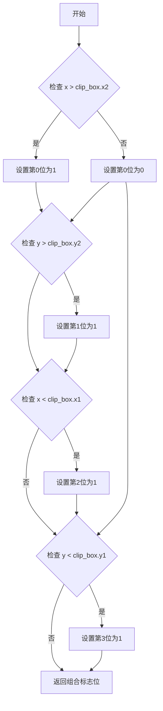
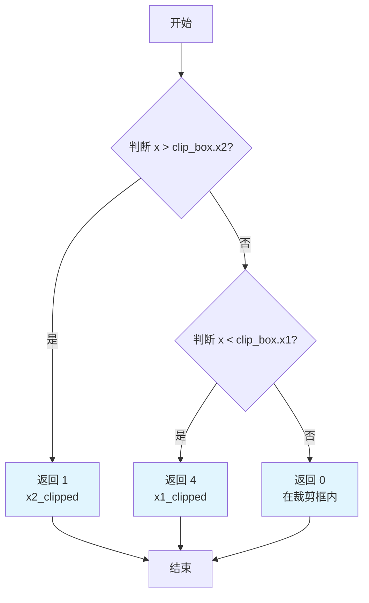
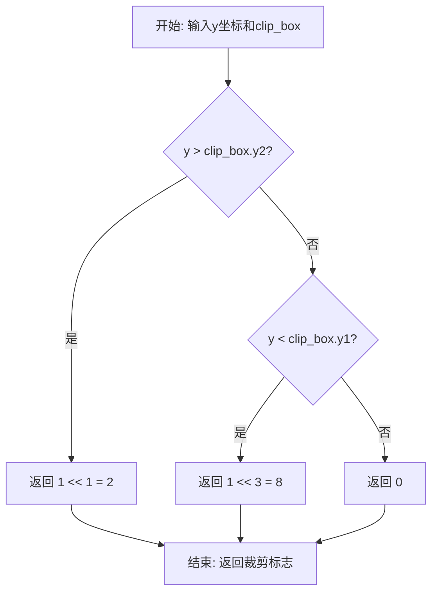
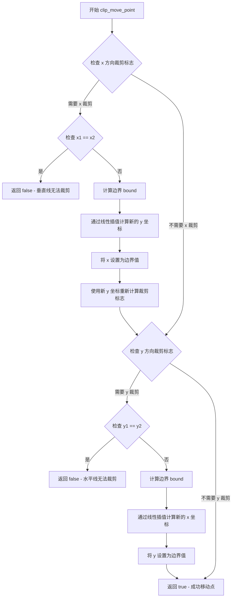

# `matplotlib\extern\agg24-svn\include\agg_clip_liang_barsky.h` 详细设计文档

这是Anti-Grain Geometry库中的一个头文件，实现了Liang-Barsky线段裁剪算法，用于计算机图形学中线段与矩形裁剪区域的快速高效裁剪，包含Cyrus-Beck裁剪标志计算、线段裁剪和点移动等核心功能。

## 整体流程

```mermaid
graph TD
    A[开始: 输入线段端点 x1,y1,x2,y2 和裁剪矩形 clip_box] --> B[计算端点1裁剪标志 f1 = clipping_flags(x1,y1,clip_box)]
    B --> C[计算端点2裁剪标志 f2 = clipping_flags(x2,y2,clip_box)]
    C --> D{判断 f1 和 f2 是否都为0?}
    D -- 是 --> E[完全可见, 返回0]
    D -- 否 --> F{判断线段是否完全在裁剪区域外?}
    F -- 是 --> G[完全不可见, 返回4]
    F -- 否 --> H{判断端点是否需要裁剪?}
    H -- 需要 --> I[调用clip_move_point移动端点]
    I --> J{端点移动后是否重叠?]
    J -- 是 --> K[返回4]
    J -- 否 --> L[返回裁剪结果标志]
    H -- 不需要 --> L
```

## 类结构

```
此文件为C++模板函数库，无传统类层次结构
主要使用agg命名空间
包含6个模板函数和1个枚举类型
依赖类型: rect_base<T> (需包含agg_basics.h)
```

## 全局变量及字段


### `nearzero`
    
防止除零错误的极小值

类型：`const double`
    


### `deltax`
    
线段x方向增量

类型：`double`
    


### `deltay`
    
线段y方向增量

类型：`double`
    


### `xin`
    
入口x边界

类型：`double`
    


### `xout`
    
出口x边界

类型：`double`
    


### `yin`
    
入口y边界

类型：`double`
    


### `yout`
    
出口y边界

类型：`double`
    


### `tinx`
    
x方向参数化位置

类型：`double`
    


### `tiny`
    
y方向参数化位置

类型：`double`
    


### `toutx`
    
出口x参数

类型：`double`
    


### `touty`
    
出口y参数

类型：`double`
    


### `tin1`
    
第一个入口参数

类型：`double`
    


### `tin2`
    
第二个入口参数

类型：`double`
    


### `tout1`
    
出口参数

类型：`double`
    


### `np`
    
输出顶点数量

类型：`unsigned int`
    


    

## 全局函数及方法


### `clipping_flags_e`

这是用于Liang-Barsky裁剪算法的标志枚举，定义了表示线段端点相对于轴对齐矩形裁剪框（clip_box）位置状态的位标志，用于Cyrus-Beck线裁剪算法中判断顶点是否超出裁剪边界。

枚举成员：

- `clipping_flags_x1_clipped`：`unsigned int`，值为4，表示端点在裁剪框左侧（x < clip_box.x1）被裁剪
- `clipping_flags_x2_clipped`：`unsigned int`，值为1，表示端点在裁剪框右侧（x > clip_box.x2）被裁剪
- `clipping_flags_y1_clipped`：`unsigned int`，值为8，表示端点在裁剪框下方（y < clip_box.y1）被裁剪
- `clipping_flags_y2_clipped`：`unsigned int`，值为2，表示端点在裁剪框上方（y > clip_box.y2）被裁剪
- `clipping_flags_x_clipped`：`unsigned int`，值为5（x1|x2），表示端点在X方向被裁剪（左右两侧任一或全部）
- `clipping_flags_y_clipped`：`unsigned int`，值为10（y1|y2），表示端点在Y方向被裁剪（上下两侧任一或全部）

返回值：无（枚举类型不返回值为函数）

#### 带注释源码

```cpp
    //------------------------------------------------------------------------
    // 裁剪标志枚举 - 用于Liang-Barsky/Cyrus-Beck线裁剪算法
    // 每个标志使用一个比特位，便于通过位运算组合多个状态
    enum clipping_flags_e
    {
        clipping_flags_x1_clipped = 4,   // 二进制0100，表示x < x1（左侧裁剪）
        clipping_flags_x2_clipped = 1,   // 二进制0001，表示x > x2（右侧裁剪）
        clipping_flags_y1_clipped = 8,  // 二进制1000，表示y < y1（下方裁剪）
        clipping_flags_y2_clipped = 2,  // 二进制0010，表示y > y2（上方裁剪）
        
        // 组合标志：通过位运算合并多个单一标志
        clipping_flags_x_clipped = clipping_flags_x1_clipped | clipping_flags_x2_clipped,  // 0100 | 0001 = 0101 (5)
        clipping_flags_y_clipped = clipping_flags_y1_clipped | clipping_flags_y2_clipped   // 1000 | 0010 = 1010 (10)
    };
```

#### 技术说明

该枚举的设计遵循以下逻辑：
1. **比特位分配**：每个方向使用独立的比特位（x1: bit2, x2: bit0, y1: bit3, y2: bit1），支持组合判断
2. **组合标志**：通过OR运算合并相关标志，便于快速判断整个方向是否被裁剪
3. **与裁剪函数配合**：与`clipping_flags()`、`clipping_flags_x()`、`clipping_flags_y()`等函数配合使用，将坐标位置编码为标志位
4. **返回值语义**：在`clip_line_segment()`函数中，返回值通过位标志表示端点是否被移动（第0位表示第一个点，第1位表示第二个点，值4表示完全不可见）


### `clipping_flags<T>`

该模板函数根据Cyrus-Beck线裁剪算法计算顶点的裁剪标志，通过比较顶点坐标与裁剪矩形边界，返回一个4位的无符号整数，每一位代表顶点相对于裁剪框不同边界的位置关系。

参数：

- `x`：`T`，待检测顶点的x坐标
- `y`：`T`，待检测顶点的y坐标
- `clip_box`：`const rect_base<T>&`，裁剪矩形区域，包含x1、x2、y1、y2四个边界值

返回值：`unsigned`，裁剪标志位，4位二进制编码表示顶点与裁剪框的位置关系（第0位：x2外、第1位：y2外、第2位：x1外、第3位：y1外）

#### 流程图



#### 带注释源码

```cpp
//----------------------------------------------------------clipping_flags
// Determine the clipping code of the vertex according to the 
// Cyrus-Beck line clipping algorithm
//
//        |        |
//  0110  |  0010  | 0011
//        |        |
// -------+--------+-------- clip_box.y2
//        |        |
//  0100  |  0000  | 0001
//        |        |
// -------+--------+-------- clip_box.y1
//        |        |
//  1100  |  1000  | 1001
//        |        |
//  clip_box.x1  clip_box.x2
//
// 参数说明：
//   x        - 顶点的x坐标
//   y        - 顶点的y坐标
//   clip_box - 裁剪矩形区域
// 返回值：
//   4位无符号整数，每一位代表：
//   bit 0 (值1): x > clip_box.x2 (右侧裁剪)
//   bit 1 (值2): y > clip_box.y2 (底部裁剪)
//   bit 2 (值4): x < clip_box.x1 (左侧裁剪)
//   bit 3 (值8): y < clip_box.y1 (顶部裁剪)
//
template<class T>
inline unsigned clipping_flags(T x, T y, const rect_base<T>& clip_box)
{
    // 使用位运算组合四个边界检测结果
    // (x > clip_box.x2)     -> bit 0, 值1
    // (y > clip_box.y2) << 1 -> bit 1, 值2
    // (x < clip_box.x1) << 2 -> bit 2, 值4
    // (y < clip_box.y1) << 3 -> bit 3, 值8
    return  (x > clip_box.x2) |
           ((y > clip_box.y2) << 1) |
           ((x < clip_box.x1) << 2) |
           ((y < clip_box.y1) << 3);
}
```


### `clipping_flags_x<T>`

这是一个模板函数，用于计算x方向的裁剪标志。该函数根据给定的x坐标与裁剪框左右边界（x1、x2）的关系，计算并返回一个无符号整数值作为裁剪标志位掩码，用于后续的线段裁剪判断。

参数：

- `x`：`T`，要检查的x坐标值
- `clip_box`：`const rect_base<T>&`，裁剪框的引用，包含x1（左边界）、x2（右边界）等边界信息

返回值：`unsigned`，返回x方向的裁剪标志位掩码，1表示x2被裁剪（x > x2），4表示x1被裁剪（x < x1），0表示在裁剪框内

#### 流程图



#### 带注释源码

```cpp
//--------------------------------------------------------clipping_flags_x
// 计算x方向的裁剪标志
// 该函数根据x坐标与裁剪框左右边界的关系返回裁剪标志
// 模板参数T可以是int、float、double等数值类型
template<class T>
inline unsigned clipping_flags_x(T x, const rect_base<T>& clip_box)
{
    // x > clip_box.x2: 返回1 (二进制0001)，表示右边被裁剪
    // x < clip_box.x1: 返回4 (二进制0100)，表示左边被裁剪
    // x在[x1, x2]范围内: 返回0，表示不需要裁剪
    // 使用位运算组合两个判断结果
    return  (x > clip_box.x2) | ((x < clip_box.x1) << 2);
}
```


### `clipping_flags_y<T>`

计算给定点在y方向相对于裁剪框的裁剪状态，返回一个无符号整数位标志，表示该点的y坐标是超出裁剪框上边界(y2)还是下边界(y1)。

参数：

- `y`：`T`，要检查的y坐标值
- `clip_box`：`const rect_base<T>&`，裁剪矩形区域，包含x1、x2、y1、y2边界

返回值：`unsigned`，裁剪标志位，可能的值包括：
- `clipping_flags_y2_clipped` (2)：y坐标超出上边界
- `clipping_flags_y1_clipped` (8)：y坐标超出下边界
- 两者的组合表示同时超出两个边界

#### 流程图



#### 带注释源码

```cpp
//--------------------------------------------------------clipping_flags_y
// 计算y方向的裁剪标志
// 该函数基于Cyrus-Beck线裁剪算法，确定顶点相对于裁剪框的y方向位置
//
// 参数:
//   y        - 要检查的y坐标
//   clip_box - 裁剪矩形区域
//
// 返回值:
//   unsigned整数，通过位掩码表示裁剪状态
//   bit 1 (值2): y > clip_box.y2 (超出上边界)
//   bit 3 (值8): y < clip_box.y1 (超出下边界)
//
// 使用示例:
//   unsigned flags = clipping_flags_y(150.0, rect(0, 0, 100, 100));
//   // flags = 2，表示y坐标超出上边界
//
template<class T>
inline unsigned clipping_flags_y(T y, const rect_base<T>& clip_box)
{
    // 如果y大于上边界y2，则设置bit 1 (值为2)
    // 如果y小于下边界y1，则设置bit 3 (值为8)
    // 可以通过位运算组合两个结果
    return ((y > clip_box.y2) << 1) | ((y < clip_box.y1) << 3);
}
```


### `clip_liang_barsky<T>`

Liang-Barsky裁剪算法的核心实现函数，通过参数化方法计算线段与轴对齐裁剪矩形的交点，返回裁剪后的顶点数量。

参数：

- `x1`：`T`，线段起点X坐标
- `y1`：`T`，线段起点Y坐标
- `x2`：`T`，线段终点X坐标
- `y2`：`T`，线段终点Y坐标
- `clip_box`：`const rect_base<T>&`，裁剪矩形区域
- `x`：`T*`，输出参数，存储裁剪后顶点的X坐标数组
- `y`：`T*`，输出参数，存储裁剪后顶点的Y坐标数组

返回值：`unsigned`，裁剪后生成的顶点数（0、1或2）

#### 流程图

```mermaid
flowchart TD
    A[开始 clip_liang_barsky] --> B[计算 deltax = x2 - x1]
    B --> C[计算 deltay = y2 - y1]
    C --> D{deltax == 0?}
    D -->|是| E[设置 deltax = ±nearzero]
    D -->|否| F{deltay == 0?}
    F -->|是| G[设置 deltay = ±nearzero]
    F -->|否| H{deltax > 0?]
    H -->|是| I[xin = clip_box.x1, xout = clip_box.x2]
    H -->|否| J[xin = clip_box.x2, xout = clip_box.x1]
    I --> K{deltay > 0?}
    J --> K
    K -->|是| L[yin = clip_box.y1, yout = clip_box.y2]
    K -->|否| M[yin = clip_box.y2, yout = clip_box.y1]
    L --> N[计算 tinx = (xin - x1) / deltax]
    M --> N
    N --> O[计算 tiny = (yin - y1) / deltay]
    O --> P{tinx < tiny?}
    P -->|是| Q[tin1 = tinx, tin2 = tiny]
    P -->|否| R[tin1 = tiny, tin2 = tinx]
    Q --> S{tin1 <= 1.0?}
    R --> S
    S -->|否| Z[返回 np=0]
    S -->|是| T{0.0 < tin1?}
    T -->|是| U[添加顶点 xin, yin, np++]
    T -->|否| V{tin2 <= 1.0?}
    U --> V
    V -->|否| Z
    V -->|是| W[计算 toutx, touty, tout1]
    W --> X{tin2 > 0.0 或 tout1 > 0.0?}
    X -->|否| Z
    X -->|是| Y{tin2 <= tout1?}
    Y -->|是| AA{添加入口点}
    Y -->|是| AB{添加出口点}
    Y -->|否| AC[添加对角点, np++]
    AA --> AB
    AB --> Z
    AC --> Z
```

#### 带注释源码

```cpp
//-------------------------------------------------------clip_liang_barsky
// Liang-Barsky 线段裁剪算法
// 参数:
//   x1, y1: 线段起点坐标
//   x2, y2: 线段终点坐标
//   clip_box: 裁剪矩形
//   x, y: 输出数组，存储裁剪后的顶点坐标
// 返回值: 裁剪后顶点数 (0, 1, 或 2)
template<class T>
inline unsigned clip_liang_barsky(T x1, T y1, T x2, T y2,
                                  const rect_base<T>& clip_box,
                                  T* x, T* y)
{
    // 避免除零的小正数
    const double nearzero = 1e-30;

    // 计算线段在X和Y方向的增量
    double deltax = x2 - x1;
    double deltay = y2 - y1; 
    
    // 裁剪边界变量
    double xin;      // X方向进入边界
    double xout;     // X方向离开边界
    double yin;      // Y方向进入边界
    double yout;     // Y方向离开边界
    
    // 参数化裁剪参数
    double tinx;     // X方向的进入参数
    double tiny;     // Y方向的进入参数
    double toutx;    // X方向的离开参数
    double touty;    // Y方向的离开参数  
    double tin1;     // 第一个进入点参数
    double tin2;     // 第二个进入点参数
    double tout1;    // 第一个离开点参数
    unsigned np = 0; // 输出顶点数

    // 处理垂直线段（deltax为0）
    if(deltax == 0.0) 
    {   
        // 水平方向 bump off，避免除零
        // 根据线段位置选择正负极小值
        deltax = (x1 > clip_box.x1) ? -nearzero : nearzero;
    }

    // 处理水平线段（deltay为0）
    if(deltay == 0.0) 
    { 
        // 垂直方向 bump off，避免除零
        deltay = (y1 > clip_box.y1) ? -nearzero : nearzero;
    }
    
    // 确定X方向的进入和离开边界
    if(deltax > 0.0) 
    {                
        // 线段向右（X增加方向）
        xin  = clip_box.x1;   // 从左边界进入
        xout = clip_box.x2;   // 从右边界离开
    }
    else 
    {
        // 线段向左（X减少方向）
        xin  = clip_box.x2;   // 从右边界进入
        xout = clip_box.x1;   // 从左边界离开
    }

    // 确定Y方向的进入和离开边界
    if(deltay > 0.0) 
    {
        // 线段向上（Y增加方向）
        yin  = clip_box.y1;   // 从下边界进入
        yout = clip_box.y2;   // 从上边界离开
    }
    else 
    {
        // 线段向下（Y减少方向）
        yin  = clip_box.y2;   // 从上边界进入
        yout = clip_box.y1;   // 从下边界离开
    }
    
    // 计算参数化位置：到达X边界和Y边界的时间参数
    tinx = (xin - x1) / deltax;
    tiny = (yin - y1) / deltay;
    
    // 确定哪个边界先到达
    if (tinx < tiny) 
    {
        // 先碰到X边界
        tin1 = tinx;   // 第一个进入点
        tin2 = tiny;   // 第二个进入点
    }
    else
    {
        // 先碰到Y边界
        tin1 = tiny;   // 第一个进入点
        tin2 = tinx;   // 第二个进入点
    }
    
    // 检查线段是否可能与裁剪框有交点
    if(tin1 <= 1.0) 
    {
        // tin1在有效范围内[0,1]，线段可能进入裁剪框
        
        // 如果起点在裁剪框内，添加第一个顶点
        if(0.0 < tin1) 
        {
            *x++ = (T)xin;     // 添加进入点X坐标
            *y++ = (T)yin;     // 添加进入点Y坐标
            ++np;              // 顶点数加1
        }

        // 检查线段是否完全在裁剪框内或有交点
        if(tin2 <= 1.0)
        {
            // 计算离开参数
            toutx = (xout - x1) / deltax;
            touty = (yout - y1) / deltay;
            
            // 取较小的离开参数
            tout1 = (toutx < touty) ? toutx : touty;
            
            // 检查线段是否确实与裁剪框相交
            if(tin2 > 0.0 || tout1 > 0.0) 
            {
                // 比较进入点和离开点
                if(tin2 <= tout1) 
                {
                    // 线段部分在裁剪框内
                    
                    // 如果tin2>0，需要添加第二个交点
                    if(tin2 > 0.0) 
                    {
                        // 根据哪个边界先进来选择添加方式
                        if(tinx > tiny) 
                        {
                            // X边界先进来：添加xin和对应y坐标
                            *x++ = (T)xin;
                            *y++ = (T)(y1 + tinx * deltay);
                        }
                        else 
                        {
                            // Y边界先进来：添加对应x坐标和yin
                            *x++ = (T)(x1 + tiny * deltax);
                            *y++ = (T)yin;
                        }
                        ++np;
                    }

                    // 处理离开点
                    if(tout1 < 1.0) 
                    {
                        // 添加离开点
                        if(toutx < touty) 
                        {
                            // 从X边界离开
                            *x++ = (T)xout;
                            *y++ = (T)(y1 + toutx * deltay);
                        }
                        else 
                        {
                            // 从Y边界离开
                            *x++ = (T)(x1 + touty * deltax);
                            *y++ = (T)yout;
                        }
                    }
                    else 
                    {
                        // 线段终点在裁剪框内，添加终点
                        *x++ = x2;
                        *y++ = y2;
                    }
                    ++np;
                }
                else 
                {
                    // 线段完全在裁剪框外但在视锥内
                    // 添加两个裁剪边界交点（对角情况）
                    if(tinx > tiny) 
                    {
                        *x++ = (T)xin;
                        *y++ = (T)yout;
                    }
                    else 
                    {
                        *x++ = (T)xout;
                        *y++ = (T)yin;
                    }
                    ++np;
                }
            }
        }
    }
    return np;  // 返回裁剪后的顶点数
}
```


### `clip_move_point<T>`

该函数是 Liang-Barsky 裁剪算法的一部分，用于将线段端点移动到裁剪矩形边界上。它根据裁剪标志判断点是否超出边界，如果是则通过线性插值计算边界上的新坐标。

参数：

- `x1`：`T`，线段起点的 x 坐标
- `y1`：`T`，线段起点的 y 坐标
- `x2`：`T`，线段终点的 x 坐标
- `y2`：`T`，线段终点的 y 坐标
- `clip_box`：`const rect_base<T>&`，裁剪矩形区域
- `x`：`T*`，输入/输出参数，需要移动的点的 x 坐标指针
- `y`：`T*`，输入/输出参数，需要移动的点的 y 坐标指针
- `flags`：`unsigned`，裁剪标志，指示点超出裁剪框的方向

返回值：`bool`，如果成功移动点返回 true；如果线段与裁剪边界平行（无法移动）返回 false

#### 流程图



#### 带注释源码

```cpp
//----------------------------------------------------------------------------
// clip_move_point<T>
// 根据裁剪标志将点移动到裁剪矩形边界上
// 参数:
//   x1, y1 - 线段起点坐标
//   x2, y2 - 线段终点坐标
//   clip_box - 裁剪矩形
//   x, y - 输入/输出的点坐标指针
//   flags - 裁剪标志,指示点超出边界的方向
// 返回:
//   true - 成功移动点
//   false - 线段与边界平行,无法移动
//----------------------------------------------------------------------------
template<class T>
bool clip_move_point(T x1, T y1, T x2, T y2, 
                     const rect_base<T>& clip_box, 
                     T* x, T* y, unsigned flags)
{
   T bound;

   // 第一步:处理 x 方向的裁剪
   if(flags & clipping_flags_x_clipped)
   {
       // 检查线段是否为垂直线(斜率无穷大)
       if(x1 == x2)
       {
           return false;  // 垂直线无法进行 x 方向裁剪
       }
       
       // 根据标志确定裁剪到左边界还是右边界
       bound = (flags & clipping_flags_x1_clipped) ? clip_box.x1 : clip_box.x2;
       
       // 使用线性插值计算边界上的 y 坐标: y = y1 + (x_bound - x1) * (y2 - y1) / (x2 - x1)
       *y = (T)(double(bound - x1) * (y2 - y1) / (x2 - x1) + y1);
       *x = bound;
   }

   // 第二步:处理 y 方向的裁剪
   // 重新计算裁剪标志,因为第一步可能改变了 y 坐标
   flags = clipping_flags_y(*y, clip_box);
   if(flags & clipping_flags_y_clipped)
   {
       // 检查线段是否为水平线(斜率为零)
       if(y1 == y2)
       {
           return false;  // 水平线无法进行 y 方向裁剪
       }
       
       // 根据标志确定裁剪到上边界还是下边界
       bound = (flags & clipping_flags_y1_clipped) ? clip_box.y1 : clip_box.y2;
       
       // 使用线性插值计算边界上的 x 坐标: x = x1 + (y_bound - y1) * (x2 - x1) / (y2 - y1)
       *x = (T)(double(bound - y1) * (x2 - x1) / (y2 - y1) + y1);
       *y = bound;
   }
   
   return true;
}
```


### `clip_line_segment<T>`

该函数是Liang-Barsky线段裁剪算法的主入口函数，用于将线段端点裁剪到指定的矩形裁剪区内，并根据裁剪结果返回相应的标志位。

参数：

- `x1`：`T*`，指向线段第一个端点X坐标的指针，函数执行后可能被修改为裁剪后的坐标
- `y1`：`T*`，指向线段第一个端点Y坐标的指针，函数执行后可能被修改为裁剪后的坐标
- `x2`：`T*`，指向线段第二个端点X坐标的指针，函数执行后可能被修改为裁剪后的坐标
- `y2`：`T*`，指向线段第二个端点Y坐标的指针，函数执行后可能被修改为裁剪后的坐标
- `clip_box`：`const rect_base<T>&`，裁剪矩形区域，包含x1、x2、y1、y2四个边界

返回值：`unsigned`，裁剪结果标志位。返回0表示线段完全可见；返回4表示线段完全在裁剪区外；返回1表示第一个端点被裁剪；返回2表示第二个端点被裁剪；返回1+2=3表示两个端点都被裁剪。

#### 流程图

```mermaid
flowchart TD
    A[开始 clip_line_segment] --> B[计算端点1的裁剪标志 f1]
    B --> C[计算端点2的裁剪标志 f2]
    C --> D{判断 (f2 | f1) == 0?}
    D -->|是| E[完全可见, 返回 0]
    D -->|否| F{判断 f1 和 f2 的X裁剪标志是否相同?}
    F -->|是| G[完全在裁剪区外, 返回 4]
    F -->|否| H{判断 f1 和 f2 的Y裁剪标志是否相同?}
    H -->|是| G
    H -->|否| I[保存原始坐标到临时变量]
    I --> J{判断 f1 是否非零?}
    J -->|是| K[调用 clip_move_point 裁剪第一个端点]
    K --> L{判断裁剪是否成功?}
    L -->|否| G
    L -->|是| M{判断两个端点是否重合?}
    M -->|是| G
    M -->|否| N[设置标志位 ret |= 1]
    J -->|否| O{判断 f2 是否非零?}
    O -->|是| P[调用 clip_move_point 裁剪第二个端点]
    P --> Q{判断裁剪是否成功?}
    Q -->|否| G
    Q -->|是| R{判断两个端点是否重合?}
    R -->|是| G
    R -->|否| S[设置标志位 ret |= 2]
    O -->|否| T[返回 ret]
    N --> T
    S --> T
```

#### 带注释源码

```cpp
//-------------------------------------------------------clip_line_segment
// 返回值说明:
//   ret >= 4        - 完全在裁剪区外
//   (ret & 1) != 0  - 第一个点已被移动（被裁剪）
//   (ret & 2) != 0  - 第二个点已被移动（被裁剪）
//
// 参数说明:
//   x1, y1: 第一个端点的坐标指针
//   x2, y2: 第二个端点的坐标指针
//   clip_box: 裁剪矩形区域
//
template<class T>
unsigned clip_line_segment(T* x1, T* y1, T* x2, T* y2,
                           const rect_base<T>& clip_box)
{
    // 计算两个端点相对于裁剪矩形的标志位
    unsigned f1 = clipping_flags(*x1, *y1, clip_box);
    unsigned f2 = clipping_flags(*x2, *y2, clip_box);
    unsigned ret = 0;

    // 如果两个端点都在裁剪区内（标志位都为0），则完全可见
    if((f2 | f1) == 0)
    {
        // 完全可见
        return 0;
    }

    // 检查X方向：如果两个端点都在裁剪框X方向的同一侧（都被裁剪或都不被裁剪）
    // 则线段完全在裁剪区外
    if((f1 & clipping_flags_x_clipped) != 0 && 
       (f1 & clipping_flags_x_clipped) == (f2 & clipping_flags_x_clipped))
    {
        // 完全裁剪
        return 4;
    }

    // 检查Y方向：如果两个端点都在裁剪框Y方向的同一侧
    // 则线段完全在裁剪区外
    if((f1 & clipping_flags_y_clipped) != 0 && 
       (f1 & clipping_flags_y_clipped) == (f2 & clipping_flags_y_clipped))
    {
        // 完全裁剪
        return 4;
    }

    // 保存原始坐标到临时变量，用于后续计算
    T tx1 = *x1;
    T ty1 = *y1;
    T tx2 = *x2;
    T ty2 = *y2;
    
    // 如果第一个端点需要裁剪
    if(f1) 
    {   
        // 调用clip_move_point进行实际裁剪计算
        if(!clip_move_point(tx1, ty1, tx2, ty2, clip_box, x1, y1, f1)) 
        {
            return 4;  // 裁剪失败（如线段与边界平行）
        }
        // 如果裁剪后两个端点重合，说明线段退化为点
        if(*x1 == *x2 && *y1 == *y2) 
        {
            return 4;
        }
        ret |= 1;  // 标记第一个端点被移动
    }
    
    // 如果第二个端点需要裁剪
    if(f2) 
    {
        // 调用clip_move_point进行实际裁剪计算
        if(!clip_move_point(tx1, ty1, tx2, ty2, clip_box, x2, y2, f2))
        {
            return 4;  // 裁剪失败
        }
        // 检查裁剪后端点是否重合
        if(*x1 == *x2 && *y1 == *y2) 
        {
            return 4;
        }
        ret |= 2;  // 标记第二个端点被移动
    }
    
    // 返回裁剪结果标志位
    return ret;
}
```


## 关键组件


### clipping_flags_e（裁剪标志枚举）

定义了用于表示直线端点与裁剪框相对位置的标志位，包括x1、x2、y1、y2方向的裁剪状态以及组合标志。

### clipping_flags<T>（裁剪标志计算函数）

根据Cyrus-Beck线裁剪算法，确定给定坐标点相对于裁剪框的位置编码，返回4位二进制标志。

### clipping_flags_x<T>（X轴裁剪标志）

仅计算x方向的裁剪标志，返回表示点位于裁剪框左侧还是右侧的编码。

### clipping_flags_y<T>（Y轴裁剪标志）

仅计算y方向的裁剪标志，返回表示点位于裁剪框上方还是下方的编码。

### clip_liang_barsky<T>（Liang-Barsky裁剪算法）

实现了经典的Liang-Barsky参数化直线裁剪算法，通过计算入射和出射参数确定线段与轴对齐裁剪框的交点。

### clip_move_point<T>（裁剪点移动）

根据裁剪标志将线段端点移动到裁剪框边界，处理斜率无穷大的特殊情况，返回裁剪是否成功。

### clip_line_segment<T>（线段裁剪）

对外接口函数，综合使用裁剪标志和裁剪点移动算法完成线段裁剪，返回裁剪结果状态码。

### rect_base<T>（裁剪框基类）

作为模板参数传入的轴对齐矩形，定义裁剪区域的x1、x2、y1、y2边界。


## 问题及建议


### 已知问题

-   **魔法数字缺乏解释**：`1e-30` 作为 nearzero 值被用于避免除零，但没有注释说明为何选择此特定值
-   **返回值语义不明确**：`clip_line_segment` 返回值的位掩码（4, 1, 2）仅在注释中简要说明，缺少详细文档
-   **类型转换风险**：大量使用 C 风格强制类型转换 `(T)` 和 `(double)`，可能导致精度损失或未定义行为
-   **除零检查不完整**：虽然对 `deltax` 和 `deltay` 进行了零值处理，但后续计算中仍存在除法操作，理论上仍有风险
-   **注释与实现不一致**：注释中提到 "Cyrus-Beck line clipping algorithm"，但函数名为 `clip_liang_barsky`，实际实现确实是 Liang-Barsky 算法
-   **输入验证缺失**：没有对输入参数（如 `clip_box` 是否有效、`x`/`y` 指针是否为空）进行验证
-   **代码重复**：`clipping_flags_x` 和 `clipping_flags_y` 存在重复逻辑，可以重构为更通用的形式

### 优化建议

-   **添加输入验证**：在关键函数入口处添加参数有效性检查，包括空指针检测和边界验证
-   **替换 C 风格类型转换**：使用 `static_cast`、`const_cast` 等现代 C++ 类型转换方式，提高类型安全
-   **提取魔法数字**：将 `1e-30` 和返回值掩码定义为具名常量或枚举，提高代码可读性和可维护性
-   **重构重复逻辑**：将 `clipping_flags_x` 和 `clipping_flags_y` 合并为模板函数或内联函数
-   **添加异常处理或错误码机制**：对于边界情况（如完全不可见的线段），考虑返回更明确的错误状态而非仅返回数值
-   **使用 `constexpr` 和 `inline` 提示编译器优化**：对于小型模板函数，添加 `constexpr` 修饰符并确保编译器能够内联展开
-   **完善文档注释**：为每个函数的返回值、参数约束和边界行为添加详细的 Doxygen 风格文档


## 其它


### 设计目标与约束

本模块实现了Liang-Barsky直线裁剪算法，核心目标是高效地计算线段与轴对齐矩形裁剪框的交点。设计约束包括：1) 算法仅支持矩形裁剪框（由rect_base<T>定义）；2) 输入坐标类型T需支持算术运算；3) 输出结果通过指针参数返回，支持多点裁剪结果存储；4) 不修改输入的原始线段坐标（clip_line_segment除外，该函数直接修改传入的指针值）。

### 错误处理与异常设计

代码未使用异常机制，而是通过返回值进行错误状态反馈。主要错误处理模式包括：1) clip_liang_barsky函数在deltax或deltay为零时使用极小值nearzero(1e-30)避免除零；2) clip_move_point函数在线段平行于裁剪边界时返回false；3) clip_line_segment返回4表示完全被裁剪，返回1表示第一点被移动，返回2表示第二点被移动；4) 代码不进行参数有效性验证，调用方需确保clip_box为有效矩形且x1!=x2或y1!=y2。

### 数据流与状态机

clip_line_segment的执行流程：1) 首先调用clipping_flags计算两端点的裁剪标志；2) 若两端点都在裁剪框内则直接返回0；3) 若两端点均在同一裁剪边界外侧则返回4（完全裁剪）；4) 否则根据裁剪标志调用clip_move_point逐点调整线段端点；5) 每次调整后检查是否退化为点若是则返回4。clip_liang_barsky函数则直接计算参数t值确定交点顺序，通过比较tinx与tiny确定哪个边界先被击中。

### 外部依赖与接口契约

本模块依赖agg_basics.h中定义的基础类型，特别是rect_base<T>模板类。导出接口包括：1) clipping_flags系列函数返回4位裁剪标志；2) clip_liang_barsky返回裁剪后顶点数；3) clip_move_point返回布尔值表示是否成功移动点；4) clip_line_segment返回裁剪状态标志。所有函数均为模板函数，支持任意数值类型T（需支持算术运算和类型转换）。

### 性能特征与复杂度分析

clipping_flags系列函数时间复杂度为O(1)，仅包含常数次比较和位运算。clip_liang_barsky时间复杂度为O(1)，包含固定数量的算术运算。clip_line_segment最坏情况调用两次clip_move_point，时间复杂度为O(1)。空间复杂度方面，所有函数仅使用常量级局部变量，额外空间开销为O(1)。该算法相对于Cohen-Sutherland算法在处理非 trivial 线段时效率更高。

### 边界条件与特殊情况处理

代码处理的特殊边界条件包括：1) 垂直线段(deltax==0)通过-bump off机制处理；2) 水平线段(deltay==0)同样采用bump机制；3) 线段与裁剪框边界重合时视为框内；4) 裁剪后线段退化为点时返回4；5) 完全在裁剪框一侧的线段返回4；6) 端点恰好在裁剪边界上时根据tin1与0的比较决定是否包含该点。

### 数值精度与稳定性

代码使用double类型进行内部计算以保证精度，最终结果强制转换为类型T。nearzero常量(1e-30)用于避免除零同时最小化对结果的影响。参数计算采用t值（0到1之间的比率），这种方法在处理大坐标值时比直接使用浮点坐标比较更稳定。输出坐标通过T类型转换可能引入精度损失，但这是模板设计的折衷方案。

    