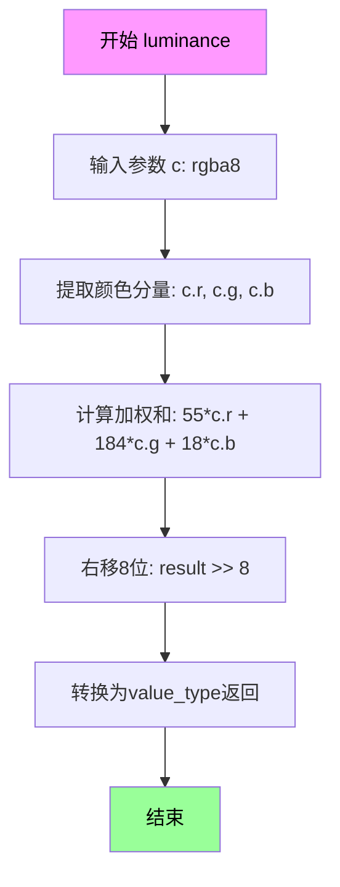
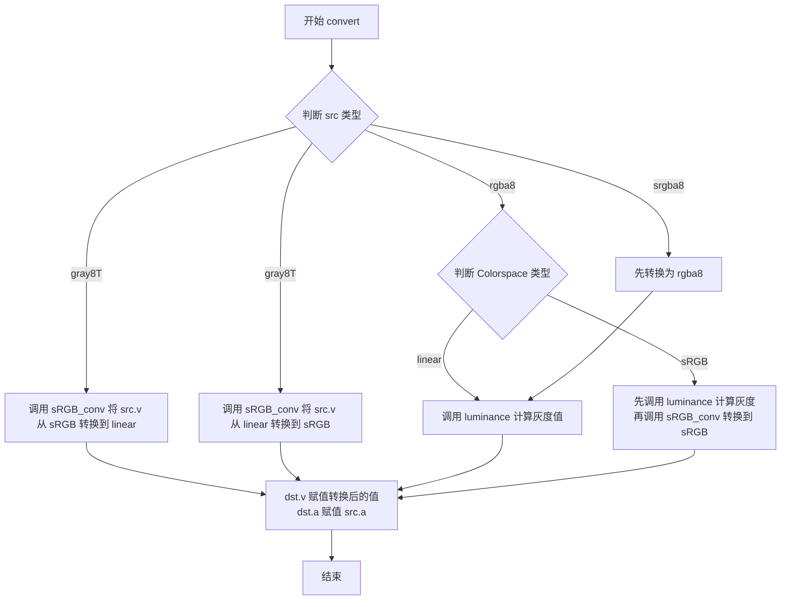
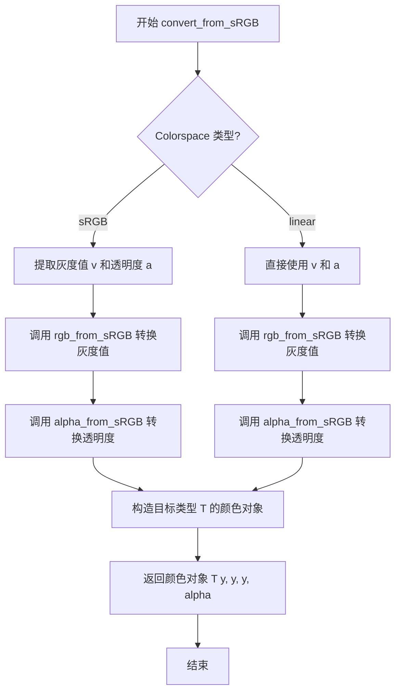
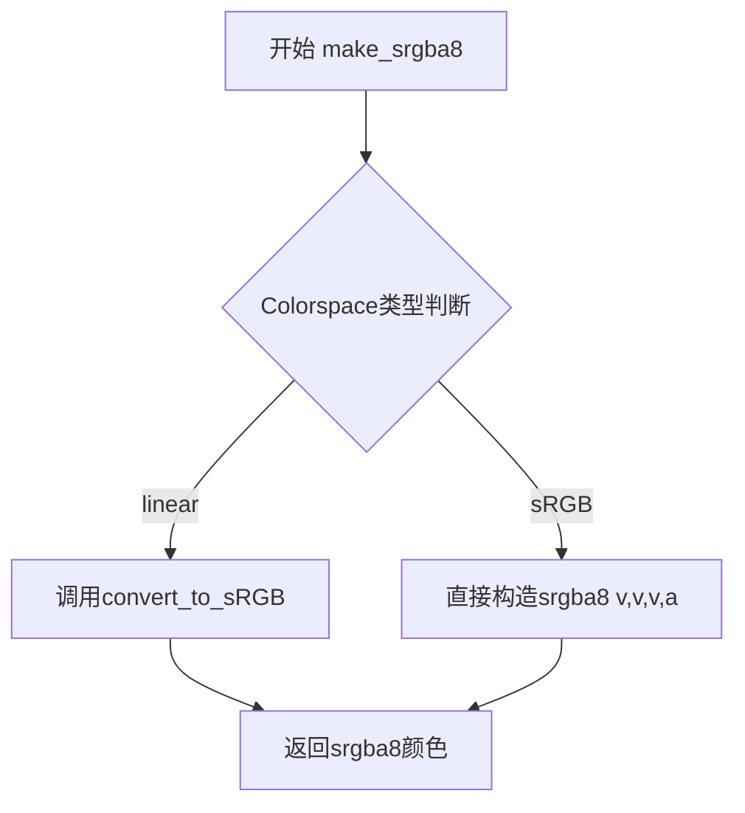
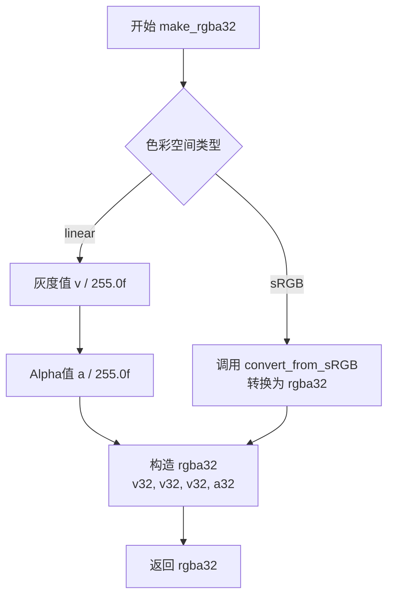
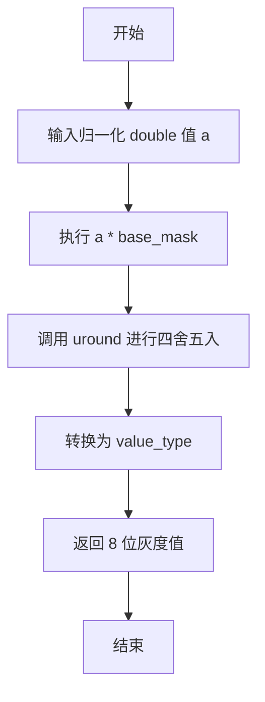
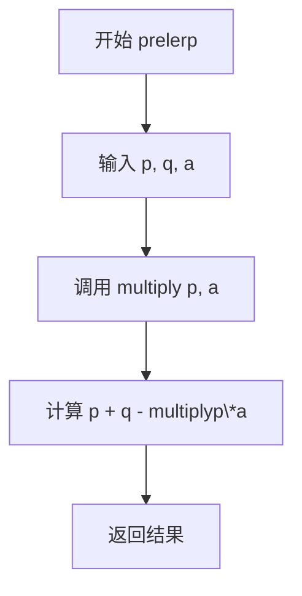
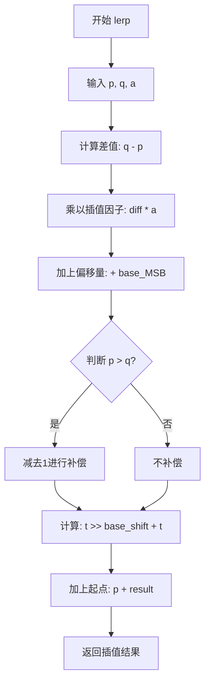

# `matplotlib\extern\agg24-svn\include\agg_color_gray.h` 详细设计文档

该文件是 Anti-Grain Geometry (AGG) 库的头文件定义了灰度颜色类型（gray8, gray16, gray32），支持线性（linear）和 sRGB 色彩空间，提供了与 RGBA 颜色类型之间的转换、亮度计算、透明度操作以及混合（lerp/prelerp）等核心功能。

## 整体流程

```mermaid
graph TD
    A[输入源颜色 (RGB/RGBA)] --> B{选择目标灰度类型}
    B --> C[gray8T (8位灰度)]
    B --> D[gray16 (16位灰度)]
    B --> E[gray32 (32位浮点灰度)]
    C --> F[计算亮度 Luminance]
    D --> F
    E --> F
    F --> G[初始化灰度值 (v) 和 alpha (a)]
    G --> H{颜色空间转换?}
    H -- 是 (sRGB <-> Linear) --> I[调用 sRGB_conv 进行转换]
    H -- 否 --> J[执行混合/插值操作 (lerp/add)]
    I --> J
    J --> K[转换为目标 RGBA 类型输出]
```

## 类结构

```
agg::gray8T<Colorspace> (模板类)
├── agg::gray8 (linear 空间实例)
├── agg::sgray8 (sRGB 空间实例)
├── agg::gray16 (结构体)
└── agg::gray32 (结构体)
```

## 全局变量及字段


### `agg::gray8`
    
灰度8位线性空间颜色类型别名，采用 ITU‑R BT.709 亮度系数进行灰度计算。

类型：`gray8T<linear>`
    


### `agg::sgray8`
    
灰度8位 sRGB 空间颜色类型别名，用于在 sRGB 色彩空间表示灰度值。

类型：`gray8T<sRGB>`
    


### `gray8T<Colorspace>.v`
    
灰度值 (0‑255)。

类型：`value_type (int8u)`
    


### `gray8T<Colorspace>.a`
    
透明度 (0‑255)。

类型：`value_type (int8u)`
    


### `gray16.v`
    
灰度值 (0‑65535)。

类型：`value_type (int16u)`
    


### `gray16.a`
    
透明度 (0‑65535)。

类型：`value_type (int16u)`
    


### `gray32.v`
    
灰度值 (0.0‑1.0)。

类型：`value_type (float)`
    


### `gray32.a`
    
透明度 (0.0‑1.0)。

类型：`value_type (float)`
    
    

## 全局函数及方法


### `gray8T<Colorspace>.luminance(const rgba&)`

该函数是 gray8T 模板类的静态成员函数，用于根据 ITU-R BT.709 标准将 RGBA 颜色转换为灰度亮度值。它使用标准的亮度系数（0.2126、0.7152、0.0722）分别乘以红、绿、蓝通道，并映射到 0-255 范围。

参数：

- `c`：`rgba`，输入的 RGBA 颜色对象，包含 r、g、b 三个颜色通道（类型为 double）和 a 透明度通道

返回值：`value_type`（int8u / unsigned char），返回计算后的灰度亮度值，范围为 0-255

#### 流程图

```mermaid
flowchart TD
    A[开始 luminance 函数] --> B[提取颜色分量 c.r, c.g, c.b]
    B --> C[计算加权求和: 0.2126 * c.r + 0.7152 * c.g + 0.0722 * c.b]
    C --> D[乘以 base_mask (255) 进行范围映射]
    D --> E[调用 uround 函数四舍五入到整数]
    E --> F[转换为 value_type (int8u) 类型]
    F --> G[返回灰度亮度值]
```

#### 带注释源码

```cpp
static value_type luminance(const rgba& c)
{
    // Calculate grayscale value as per ITU-R BT.709.
    // 使用 ITU-R BT.709 标准亮度系数计算灰度值：
    // - 红色通道系数: 0.2126 (对应人眼对绿色最敏感的特性)
    // - 绿色通道系数: 0.7152
    // - 蓝色通道系数: 0.0722
    // base_mask 等于 255，用于将浮点数结果映射到 0-255 范围
    return value_type(uround((0.2126 * c.r + 0.7152 * c.g + 0.0722 * c.b) * base_mask));
}
```


### `gray8T<Colorspace>.luminance(const rgba8& c)`

该函数用于计算 8 位 RGBA 颜色的灰度值（亮度），采用 ITU-R BT.709 标准权重，通过整数乘法和位移运算实现高效的亮度计算。

参数：

- `c`：`rgba8`，输入的 8 位 RGBA 颜色对象

返回值：`value_type`（即 `int8u` / `uint8_t`），计算得到的灰度值，范围为 0-255

#### 流程图



#### 带注释源码

```cpp
// 位于 gray8T<Colorspace> 结构体中的静态方法
static value_type luminance(const rgba8& c)
{
    // 使用 ITU-R BT.709 标准计算灰度值
    // 权重系数: R=0.2126, G=0.7152, B=0.0722
    // 转换为整数近似: 55/256 ≈ 0.2148, 184/256 ≈ 0.7188, 18/256 ≈ 0.0703
    // 使用位移运算 >> 8 代替除以 256，提高计算效率
    return value_type((55u * c.r + 184u * c.g + 18u * c.b) >> 8);
}
```

#### 设计说明

此方法是对应 `gray8T` 模板类中专门为 `rgba8` 优化的重载版本。与浮点版本 `luminance(const rgba& c)` 相比，该版本：

1. **使用整数运算**：避免了浮点运算的开销，适合对性能敏感的场景
2. **预缩放权重**：将 BT.709 系数乘以 256 (2⁸) 后取整，得到整数权重 (55, 184, 18)
3. **位移优化**：使用右移 8 位代替除法，这是编译器友好的优化

该函数是纯函数，无副作用，符合函数式编程原则，便于编译器进行向量化优化和内联。


### `gray8T<Colorspace>::convert`

静态方法，用于灰度空间转换和从 RGBA 颜色空间转换到灰度空间，支持 linear 和 sRGB 色彩空间之间的转换，以及从 rgba8/srgba8 到灰度的转换。

参数：

- `dst`：`gray8T<Colorspace>&`，目标灰度颜色对象，用于存储转换后的结果
- `src`：源颜色对象，支持 `gray8T<sRGB>`、`gray8T<linear>`、`rgba8`、`srgba8` 等类型

返回值：`void`，无返回值，结果通过输出参数 `dst` 返回

#### 流程图



#### 带注释源码

```cpp
// 从 sRGB 灰度转换到 linear 灰度
static void convert(gray8T<linear>& dst, const gray8T<sRGB>& src)
{
    // 使用 sRGB 转换函数将灰度值从 sRGB 色彩空间转换到 linear 色彩空间
    dst.v = sRGB_conv<value_type>::rgb_from_sRGB(src.v);
    // alpha 值直接复制
    dst.a = src.a;
}

// 从 linear 灰度转换到 sRGB 灰度
static void convert(gray8T<sRGB>& dst, const gray8T<linear>& src)
{
    // 使用 sRGB 转换函数将灰度值从 linear 色彩空间转换到 sRGB 色彩空间
    dst.v = sRGB_conv<value_type>::rgb_to_sRGB(src.v);
    // alpha 值直接复制
    dst.a = src.a;
}

// 从 rgba8 转换到 linear 灰度
static void convert(gray8T<linear>& dst, const rgba8& src)
{
    // 使用 ITU-R BT.709 标准计算 luminance（亮度）
    dst.v = luminance(src);
    // alpha 值直接复制
    dst.a = src.a;
}

// 从 srgba8 转换到 linear 灰度
// 注意：RGB 权重仅对线性值有效，因此先转换为 rgba8
static void convert(gray8T<linear>& dst, const srgba8& src)
{
    // The RGB weights are only valid for linear values.
    // 先将 srgba8 转换为 rgba8（自动进行 sRGB 到 linear 的 gamma 校正）
    convert(dst, rgba8(src));
}

// 从 rgba8 转换到 sRGB 灰度
static void convert(gray8T<sRGB>& dst, const rgba8& src)
{
    // 先计算线性亮度，再转换为 sRGB 空间
    dst.v = sRGB_conv<value_type>::rgb_to_sRGB(luminance(src));
    dst.a = src.a;
}

// 从 srgba8 转换到 sRGB 灰度
// 注意：RGB 权重仅对线性值有效，因此先转换为 rgba8
static void convert(gray8T<sRGB>& dst, const srgba8& src)
{
    // The RGB weights are only valid for linear values.
    // 先将 srgba8 转换为 rgba8（自动进行 sRGB 到 linear 的 gamma 校正）
    convert(dst, rgba8(src));
}
```

#### 伴随方法：luminance

```cpp
// 从 rgba（浮点类型）计算亮度，使用 ITU-R BT.709 标准
static value_type luminance(const rgba& c)
{
    // Calculate grayscale value as per ITU-R BT.709.
    // 亮度公式：Y = 0.2126*R + 0.7152*G + 0.0722*B
    return value_type(uround((0.2126 * c.r + 0.7152 * c.g + 0.0722 * c.b) * base_mask));
}

// 从 rgba8（8位整数类型）计算亮度，使用 ITU-R BT.709 标准的整数近似
static value_type luminance(const rgba8& c)
{
    // Calculate grayscale value as per ITU-R BT.709.
    // 使用整数近似：(55*R + 184*G + 18*B) >> 8
    return value_type((55u * c.r + 184u * c.g + 18u * c.b) >> 8);
}
```


### `gray8T<Colorspace>::convert_from_sRGB<T>()`

将灰度颜色从 sRGB 色彩空间转换到目标颜色类型 T。该方法首先将灰度值 `v` 和透明度 `a` 从 sRGB 空间转换到线性空间，然后创建一个目标类型 T 的颜色对象，其中 R、G、B 通道都使用转换后的灰度值，适用于颜色空间转换和色彩管理场景。

#### 参数

- `T`：模板参数，目标颜色类型（例如 `rgba8`、`srgba8`、`rgba16`、`rgba32` 等），必须是一个具有 `value_type` 成员的类型

#### 返回值

`T`，返回转换后的目标颜色类型对象，其中 R=G=B=转换后的灰度值，A=转换后的透明度值

#### 流程图



#### 带注释源码

```cpp
/// @brief 将灰度颜色从 sRGB 色彩空间转换到目标颜色类型 T
/// @tparam T 目标颜色类型（如 rgba8, srgba8, rgba16, rgba32 等）
/// @return T 转换后的目标颜色类型对象
/// @note 该方法假设当前的 gray8T 颜色存储在 sRGB 色彩空间中
///       它会将灰度值和透明度都从 sRGB 转换到线性空间，
///       然后创建一个新的颜色对象，其中 R=G=B=转换后的灰度值
template<class T>
T convert_from_sRGB() const
{
    // 使用 sRGB 转换函数将灰度值 v 从 sRGB 空间转换到线性空间
    // y 将作为新颜色对象的 R、G、B 通道的值（灰度颜色）
    typename T::value_type y = sRGB_conv<typename T::value_type>::rgb_from_sRGB(v);
    
    // 将透明度 a 从 sRGB 空间转换到线性空间
    // 构造目标类型 T 的颜色对象，R=G=B=y，A=转换后的透明度
    return T(y, y, y, sRGB_conv<typename T::value_type>::alpha_from_sRGB(a));
}
```


### `gray8T<Colorspace>::convert_to_sRGB<T>`

将 `gray8T` 对象中存储的线性亮度值（Luminance）和透明度（Alpha）转换为 sRGB 色彩空间的转换函数。根据 sRGB 传递函数（Gamma 曲线）处理亮度值和透明度，并构建目标类型 `T` 的颜色对象返回。

参数：
- 无（成员方法，隐式使用 `this` 指针指向的对象作为输入）。

返回值：`T`，目标颜色类型的对象。通常为 `srgba8` 或 `rgba8`，其中 RGB 分量为转换后的 sRGB 灰度值，Alpha 为转换后的 sRGB 透明度。

#### 流程图

```mermaid
graph TD
    A[开始: 输入 gray8T&lt;Colorspace&gt; 对象] --> B[获取成员变量 v (线性亮度) 和 a (线性透明度)]
    B --> C[调用 sRGB_conv::rgb_to_sRGB 将 v 转换为 sRGB 亮度 y]
    C --> D[调用 sRGB_conv::alpha_to_sRGB 将 a 转换为 sRGB 透明度 a_srgb]
    D --> E[构造对象 T(y, y, y, a_srgb)]
    E --> F[返回对象 T]
```

#### 带注释源码

```cpp
template<class T>
T convert_to_sRGB() const
{
    // 步骤 1: 将线性亮度值 v 转换为 sRGB 亮度值
    // sRGB_conv::rgb_to_sRGB 应用 gamma 曲线将线性值转换为 sRGB 值
    typename T::value_type y = sRGB_conv<typename T::value_type>::rgb_to_sRGB(v);
    
    // 步骤 2: 将线性透明度 a 转换为 sRGB 透明度
    // 同样应用 sRGB 传递函数
    typename T::value_type a_srgb = sRGB_conv<typename T::value_type>::alpha_to_sRGB(a);
    
    // 步骤 3: 构建并返回目标类型 T
    // 由于是灰度颜色，R、G、B 分量均设为转换后的亮度 y，Alpha 设为转换后的值
    return T(y, y, y, a_srgb);
}
```


### gray8T<Colorspace>::make_rgba8 / operator rgba8()

将灰度颜色 gray8T（支持 linear 或 sRGB 颜色空间）转换为 RGBA8 格式的函数。根据 Colorspace 模板参数（linear 或 sRGB），选择不同的转换策略：linear 颜色空间直接使用灰度值作为 RGB 分量，sRGB 颜色空间则需要进行 gamma 校正转换。

参数：

-  `{参数名称}`：`{参数类型}`，{参数描述}
-  无（make_rgba8 使用重载，分别接受 `const linear&` 或 `const sRGB&` 作为 Colorspace 标签参数）
-  operator rgba8() 无参数

返回值：`rgba8`，返回转换后的 RGBA8 颜色对象

#### 流程图

```mermaid
flowchart TD
    A[gray8T<Colorspace>] --> B{Colorspace == linear?}
    B -->|Yes| C[make_rgba8 linear]
    B -->|No| D{sRGB?}
    D -->|Yes| E[make_rgba8 sRGB]
    
    C --> F[直接使用 v 值构建 rgba8]
    F --> G[返回 rgba8 v, v, v, a]
    
    E --> H[调用 convert_from_sRGB]
    H --> I[将 v 从 sRGB 转换为线性]
    I --> J[构建 srgba8 并返回]
    
    K[operator rgba8] --> L[调用 make_rgba8 Colorspace()]
    L --> M{Colorspace 类型}
    M -->|linear| N[调用 make_rgba8 linear]
    M -->|sRGB| O[调用 make_rgba8 sRGB]
    N --> P[返回 rgba8]
    O --> P
```

#### 带注释源码

```cpp
//------------------------------------------------------------------------
// 将 gray8T (linear 颜色空间) 转换为 rgba8
// 直接使用灰度值 v 作为 R、G、B 分量，保持透明度 a 不变
//------------------------------------------------------------------------
rgba8 make_rgba8(const linear&) const
{
    return rgba8(v, v, v, a);
}

//------------------------------------------------------------------------
// 将 gray8T (sRGB 颜色空间) 转换为 rgba8
// 需要先将灰度值从 sRGB 颜色空间转换到线性颜色空间
//------------------------------------------------------------------------
rgba8 make_rgba8(const sRGB&) const
{
    return convert_from_srgba8<srgba8>();
}

//------------------------------------------------------------------------
// 类型转换运算符重载
// 根据 Colorspace 模板参数自动选择正确的转换路径
//------------------------------------------------------------------------
operator rgba8() const
{
    return make_rgba8(Colorspace());
}
```

### 关键组件信息

- **gray8T 模板类**：通用灰度颜色类，支持 linear 和 sRGB 两种颜色空间
- **rgba8**：8 位 RGBA 颜色结构
- **srgba8**：8 位 sRGB 颜色结构（带 gamma 校正）
- **Colorspace 标签类型**：linear 和 sRGB，用于模板重载解析
- **convert_from_sRGB<T>()**：模板方法，将 sRGB 值转换为目标类型

### 潜在技术债务或优化空间

1. **operator srgba8() 实现错误**：代码中 `operator srgba8()` 错误地调用了 `make_rgba8()` 而非 `make_srgba8()`，这会导致 sRGB 转换逻辑错误
2. **重复代码**：make_rgba8 的两种重载实现路径不同，但可以进一步抽象公共逻辑
3. **缺少 const correct验证**：部分方法未标记为 const，尽管它们不会修改对象状态

### 其它项目

**设计目标与约束**：
- 支持灰度到 RGBA 的无缝转换
- 利用模板参数实现编译时多态，避免运行时分支判断
- 遵循 ITU-R BT.709 标准计算亮度

**错误处理与异常设计**：
- 无显式错误处理，依赖断言和饱和算术防止溢出
- 颜色值超出范围时自动饱和到边界值

**数据流与状态机**：
- 灰度值 v 和透明度 a 是独立分量
- 转换过程不改变 alpha 通道（除非显式调用 premultiply/demultiply）

**外部依赖与接口契约**：
- 依赖 agg_color_rgba.h 中的 rgba8、srgba8、rgba 等类型
- 依赖 sRGB_conv 工具类进行颜色空间转换
- 依赖 uround 工具函数进行四舍五入


### gray8T<Colorspace>.make_srgba8

将灰度颜色转换为sRGBA8格式（8位带alpha通道的sRGB颜色）。该方法是gray8T模板类的成员方法，根据色彩空间类型（linear或sRGB）采用不同的转换策略：对于线性色彩空间，执行线性到sRGB的颜色空间转换；对于sRGB色彩空间，直接构建sRGBA8颜色。

参数：

- `colorspace`：Colorspace类型（`const linear&` 或 `const sRGB&`），用于指定当前灰度值的色彩空间类型，函数根据此参数选择对应的转换路径

返回值：`srgba8`，返回转换后的8位带alpha通道的sRGB颜色值，包含r、g、b三个通道和alpha通道

#### 流程图



#### 带注释源码

```cpp
//--------------------------------------------------------------------
/// 将灰度值转换为sRGBA8（用于线性色彩空间）
/// 转换过程：先将灰度值转换为线性RGB，再进行sRGBgamma校正
/// @return 返回转换后的srgba8颜色
srgba8 make_srgba8(const linear&) const
{
    // convert_to_sRGB模板方法内部执行：
    // 1. 将灰度v值从线性空间转换到sRGB空间
    // 2. 对alpha通道进行线性到sRGB的转换
    // 3. 返回srgba8(y, y, y, alpha)
    return convert_to_sRGB<rgba8>();
}

//--------------------------------------------------------------------
/// 将灰度值转换为sRGBA8（用于sRGB色彩空间）
/// 当色彩空间已经是sRGB时，直接使用当前值构建sRGBA8
/// 无需进行颜色空间转换
/// @return 返回srgba8颜色，r=g=b=v, a=alpha
srgba8 make_srgba8(const sRGB&) const
{
    // 直接使用灰度值v作为r、g、b通道
    // alpha通道保持不变
    return srgba8(v, v, v, a);
}

//--------------------------------------------------------------------
/// 类型转换运算符：将gray8T转换为srgba8
/// 使用Colorspace模板参数决定转换策略
/// 注意：此处实现有误，应调用make_srgba8而非make_rgba8
operator srgba8() const
{
    return make_rgba8(Colorspace());
}
```


### gray8T<Colorspace>.make_rgba16

将灰度颜色值（gray8）转换为 16 位 RGBA 颜色（rgba16），根据色彩空间类型（linear 或 sRGB）采用不同的转换策略。

参数：

-  `colorspace`：`const linear&` 或 `const sRGB&`，用于指定色彩空间类型，决定使用哪种转换方法

返回值：`rgba16`，返回转换后的 16 位 RGBA 颜色值

#### 流程图

```mermaid
flowchart TD
    A[调用 make_rgba16] --> B{Colorspace 类型是 linear?}
    B -->|Yes| C[执行 linear 转换]
    B -->|No| D{Colorspace 类型是 sRGB?}
    D -->|Yes| E[执行 sRGB 转换]
    C --> F[左移 v 和 a 8位并合并<br/>rgb = (v << 8) | v<br/>alpha = (a << 8) | a]
    E --> G[调用 convert_from_sRGB<br/>进行 gamma 校正转换]
    F --> H[返回 rgba16 对象]
    G --> H
```

#### 带注释源码

```
// 对于 linear 色彩空间的转换方法
rgba16 make_rgba16(const linear&) const
{
    // 将 8 位灰度值扩展为 16 位
    // 通过左移 8 位并与原值 OR，实现 0-255 到 0-65535 的映射
    // 例如：v=255 时，rgb = (255 << 8) | 255 = 65535
    rgba16::value_type rgb = (v << 8) | v;
    
    // 同样方式扩展 alpha 通道
    return rgba16(rgb, rgb, rgb, (a << 8) | a);
}

// 对于 sRGB 色彩空间的转换方法
rgba16 make_rgba16(const sRGB&) const
{
    // 调用模板方法进行 sRGB 到 linear 的 gamma 校正转换
    // 将灰度值从 sRGB 色彩空间转换到线性空间
    return convert_from_sRGB<rgba16>();
}

// 类型转换运算符 operator rgba16()
// 使用 Colorspace 模板参数自动选择正确的转换路径
operator rgba16() const
{
    // 根据 Colorspace 类型调用对应的 make_rgba16 方法
    return make_rgba16(Colorspace());
}
```

---

### gray8T<Colorspace>::operator rgba16()

这是 gray8T 模板类的类型转换运算符，重载了到 rgba16 的隐式转换。根据模板参数 Colorspace（linear 或 sRGB），自动选择合适的转换路径。

参数：

- （无参数，这是类型转换运算符）

返回值：`rgba16`，返回转换后的 16 位 RGBA 颜色值

#### 流程图

```mermaid
flowchart TD
    A[隐式转换 gray8 -> rgba16] --> B[获取 Colorspace 类型]
    B --> C[调用 make_rgba16]
    C --> D{Colorspace 是 linear?}
    D -->|Yes| E[扩展位深<br/>v->v<<8|v]
    D -->|No| F[gamma 校正转换]
    E --> G[返回 rgba16]
    F --> G
```

#### 带注释源码

```
// 类型转换运算符：将 gray8T 转换为 rgba16
// 根据 Colorspace 模板参数选择转换策略
operator rgba16() const
{
    // Colorspace() 创建临时对象，根据模板参数类型
    // 调用对应的 make_rgba16 重载版本
    return make_rgba16(Colorspace());
}
```


### `gray8T<Colorspace>.make_rgba32`

将灰度颜色（gray8T）转换为 32 位 RGBA 颜色（rgba32），支持线性（linear）和 sRGB 两种色彩空间。根据传入的色彩空间参数决定转换方式：线性空间直接归一化灰度值和 Alpha 值；sRGB 空间则先将灰度值从 sRGB 转换到线性空间，再构造 rgba32。

参数：

- `colorspace`：`const linear&` 或 `const sRGB&`，色彩空间标签，用于区分线性色彩空间和 sRGB 色彩空间

返回值：`rgba32`，转换后的 32 位 RGBA 颜色值，RGB 三个通道值相同（灰度），Alpha 通道从 8 位扩展到浮点数

#### 流程图



#### 带注释源码

```
// 将灰度颜色转换为32位RGBA颜色（线性色彩空间）
// @param  colorspace 色彩空间标签，传入linear表示线性色彩空间
// @return 转换后的rgba32颜色对象
rgba32 make_rgba32(const linear&) const
{
    // 将8位灰度值归一化到0.0-1.0浮点数范围
    rgba32::value_type v32 = v / 255.0f;
    
    // 将8位Alpha值归一化到0.0-1.0浮点数范围
    // 构造RGBA32：R=G=B=灰度值, A=Alpha值
    return rgba32(v32, v32, v32, a / 255.0f);
}

// 将灰度颜色转换为32位RGBA颜色（sRGB色彩空间）
// @param  colorspace 色彩空间标签，传入sRGB表示sRGB色彩空间
// @return 转换后的rgba32颜色对象
rgba32 make_rgba32(const sRGB&) const
{
    // 调用模板方法将灰度值从sRGB色彩空间转换到线性空间
    // 然后构造rgba32对象
    return convert_from_sRGB<rgba32>();
}
```

---

### `gray8T<Colorspace>::operator rgba32`

类型转换运算符重载，允许将 gray8T<Colorspace> 对象隐式或显式转换为 rgba32 类型。该运算符内部调用 make_rgba32 方法，传入模板参数 Colorspace 来确定使用哪个色彩空间进行转换。

参数：无

返回值：`rgba32`，转换后的 32 位 RGBA 颜色值

#### 流程图

```mermaid
flowchart TD
    A[开始 operator rgba32] --> B[调用 make_rgba32<br/>传入 Colorspace 参数]
    B --> C{Colorspace 类型}
    C -->|linear| D[make_rgba32(linear)]
    C -->|sRGB| E[make_rgba32(sRGB)]
    D --> F[返回 rgba32]
    E --> F
```

#### 带注释源码

```
// 类型转换运算符：将gray8T转换为rgba32
// 使用模板参数Colorspace确定色彩空间
// @return 对应色彩空间的rgba32颜色对象
operator rgba32() const
{
    // 通过Colorspace类型标签调用对应的make_rgba32重载
    // Colorspace是模板参数，可以是linear或sRGB
    return make_rgba32(Colorspace());
}
```


### `gray8T<Colorspace>.to_double`

将 8 位灰度值转换为归一化的 double 值（范围 0.0 到 1.0）

参数：

-  `a`：`value_type`（即 int8u），需要转换的灰度值

返回值：`double`，归一化后的浮点数，范围在 [0.0, 1.0]

#### 流程图

```mermaid
flowchart TD
    A[开始] --> B[输入灰度值 a (int8u)]
    B --> C[执行 double(a / base_mask)]
    C --> D[返回归一化 double 值]
    D --> E[结束]
```

#### 带注释源码

```cpp
//--------------------------------------------------------------------
static AGG_INLINE double to_double(value_type a)
{
    // 将 8 位灰度值除以 base_mask (255)，将范围从 [0, 255] 映射到 [0.0, 1.0]
    // base_mask = (1 << 8) - 1 = 255
    return double(a) / base_mask;
}
```

---

### `gray8T<Colorspace>.from_double`

将归一化的 double 值（范围 0.0 到 1.0）转换为 8 位灰度值

参数：

-  `a`：`double`，归一化的浮点数，范围应在 [0.0, 1.0]

返回值：`value_type`（即 int8u），转换后的 8 位灰度值，范围 [0, 255]

#### 流程图



#### 带注释源码

```cpp
//--------------------------------------------------------------------
static AGG_INLINE value_type from_double(double a)
{
    // 将归一化的 double 值乘以 base_mask (255)，将范围从 [0.0, 1.0] 映射回 [0, 255]
    // 使用 uround 函数进行四舍五入，确保精确转换
    // base_mask = (1 << 8) - 1 = 255
    return value_type(uround(a * base_mask));
}
```


### `gray8T<Colorspace>::multiply`

固定点乘法运算，使用精确的整数算法对两个 8 位无符号整数（int8u）进行乘法运算，通过添加 base_MSB 进行四舍五入，然后进行两次移位操作确保结果在正确的数值范围内，适用于颜色通道的预乘混合计算。

参数：

- `a`：`value_type`（int8u），第一个操作数，表示颜色通道值或覆盖值（范围 0-255）
- `b`：`value_type`（int8u），第二个操作数，表示颜色通道值或覆盖值（范围 0-255）

返回值：`value_type`（int8u），返回精确的固定点乘法结果，范围在 0-255 之间

#### 流程图

```mermaid
flowchart TD
    A[开始 multiply] --> B[计算 t = a * b + base_MSB]
    B --> C[计算 t >> base_shift]
    C --> D[计算 t + (t >> base_shift)]
    E --> F[返回 value_type(result >> base_shift)]
    D --> F
    E[计算 (t >> base_shift) + t] --> D
```

#### 带注释源码

```cpp
// Fixed-point multiply, exact over int8u.
// 这是一个精确的固定点乘法算法，适用于 int8u（unsigned char）类型
static AGG_INLINE value_type multiply(value_type a, value_type b)
{
    // calc_type 是 int32u，用于避免乘法溢出
    // base_MSB = 1 << (base_shift - 1) = 128，用于四舍五入
    calc_type t = a * b + base_MSB;
    
    // 第一次右移 base_shift(8) 位，相当于除以 256
    // 第二次右移 base_shift(8) 位，再次除以 256
    // 这种两次移位的方式实际上是将 t / 65536，但精度更高
    // 整体效果: (a * b + 128) / 256 再除以 256 = (a * b) / 65536
    // 但通过这种方式可以获得更精确的四舍五入结果
    return value_type(((t >> base_shift) + t) >> base_shift);
}
```

---

### `gray8T<Colorspace>::demultiply`

固定点除法运算（也称为去预乘），用于将预乘颜色值转换回非预乘形式。处理了零除数、边界情况（当分子大于等于分母时返回最大值），使用移位技巧进行近似除法运算，适用于颜色通道的反预乘混合计算。

参数：

- `a`：`value_type`（int8u），预乘后的颜色通道值（范围 0-255）
- `b`：`value_type`（int8u），alpha 通道值（范围 0-255），作为除数

返回值：`value_type`（int8u），返回去预乘后的颜色通道值，范围在 0-255 之间

#### 流程图

```mermaid
flowchart TD
    A[开始 demultiply] --> B{检查 a * b == 0?}
    B -->|是| C[返回 0]
    B -->|否| D{检查 a >= b?}
    D -->|是| E[返回 base_mask 255]
    D -->|否| F[计算 (a * base_mask + b/2) / b]
    F --> G[返回 value_type result]
```

#### 带注释源码

```cpp
// Fixed-point demultiply (反预乘运算)
// 将预乘颜色值 (a) 转换回非预乘形式: result = a / b * 255
// 其中 a 是预乘后的值，b 是 alpha 值
static AGG_INLINE value_type demultiply(value_type a, value_type b)
{
    // 特殊情况：如果预乘结果为 0，直接返回 0
    // 这也处理了 b 为 0 的除零情况
    if (a * b == 0)
    {
        return 0;
    }
    // 如果预乘值大于等于 alpha 值，说明已经完全不透明
    // 返回最大颜色值（255）
    else if (a >= b)
    {
        return base_mask;  // 255
    }
    // 正常情况：使用固定点除法
    // 公式: (a * 255 + b/2) / b 实现四舍五入
    // base_mask = 255, b >> 1 相当于 b / 2
    else return value_type((a * base_mask + (b >> 1)) / b);
}
```


### gray8T<Colorspace>.prelerp

预插值函数，用于在已知目标值已预先乘以alpha值的情况下进行线性插值运算。该函数是gray8T模板类的静态成员方法，采用固定点算法实现精确的整数插值计算。

参数：
- `p`：`value_type`，起点值（初始颜色分量）
- `q`：`value_type`，终点值（已预先乘以alpha的目标颜色分量）
- `a`：`value_type`，插值因子（alpha值，范围0-base_mask）

返回值：`value_type`，插值计算后的结果值

#### 流程图



#### 带注释源码

```cpp
//--------------------------------------------------------------------
// Interpolate p to q by a, assuming q is premultiplied by a.
// 预插值：假设q已经预先乘以了a因子
// 公式：result = p + q - p * a
// 这种方式在q已经是预乘形式时更高效，避免了重复的乘法运算
static AGG_INLINE value_type prelerp(value_type p, value_type q, value_type a)
{
    return p + q - multiply(p, a);
}
```

---

### gray8T<Colorspace>.lerp

标准线性插值函数，用于在两个颜色值之间进行基于alpha因子的插值运算。该函数采用固定点算法，通过位运算实现精确的整数线性插值，避免了浮点运算的开销。

参数：
- `p`：`value_type`，起点值（起始颜色分量）
- `q`：`value_type`，终点值（目标颜色分量）
- `a`：`value_type`，插值因子（范围0-base_mask，0表示完全使用p，base_mask表示完全使用q）

返回值：`value_type`，插值计算后的结果值

#### 流程图



#### 带注释源码

```cpp
//--------------------------------------------------------------------
// Interpolate p to q by a.
// 标准线性插值函数
// 参数:
//   p - 起点值（from值）
//   q - 终点值（to值）
//   a - 插值因子（0到base_mask之间）
//
// 算法说明:
//   使用固定点算法实现精确的整数插值
//   1. 计算差值 (q - p) * a
//   2. 加上 base_MSB (1 << 7 = 128) 用于四舍五入
//   3. 根据 p > q 决定是否额外减1（处理负数情况）
//   4. 通过两次右移实现除以256的近似（(t>>8) + t>>8 相当于 t/255）
//   5. 最终加上起点值 p 得到结果
//
// 这种实现比直接使用浮点数更高效，特别适合8位颜色分量的插值
static AGG_INLINE value_type lerp(value_type p, value_type q, value_type a)
{
    // t = (q - p) * a + base_MSB - (p > q)
    // base_MSB = 128，用于四舍五入
    // (p > q) 是bool值，在算术运算中true=1，false=0，用于补偿负差值
    int t = (q - p) * a + base_MSB - (p > q);
    
    // 两次移位实现除以256的近似，比直接除更精确
    // ((t >> base_shift) + t) >> base_shift 约等于 t / 255
    return value_type(p + (((t >> base_shift) + t) >> base_shift));
}
```


### gray8T<Colorspace>::add

颜色叠加方法，用于将另一个灰度颜色对象叠加到当前颜色上，支持不同的覆盖度（cover）进行颜色混合。

参数：

- `c`：`const self_type&`，要叠加的灰度颜色对象（包含 v 灰度值和 a 透明度）
- `cover`：`unsigned`，覆盖度值，表示叠加的强度或透明度（0-255，cover_mask 表示全强度）

返回值：`void`，无返回值（直接修改当前对象的 v 和 a 字段）

#### 流程图

```mermaid
flowchart TD
    A[开始 add 方法] --> B{cover == cover_mask?}
    B -->|是| C{c.a == base_mask?}
    C -->|是| D[*this = c, 返回]
    C -->|否| E[cv = v + c.v<br/>ca = a + c.a]
    B -->|否| F[cv = v + mult_cover(c.v, cover)<br/>ca = a + mult_cover(c.a, cover)]
    E --> G[饱和处理 v 和 a]
    F --> G
    G --> H[v = min(cv, base_mask)<br/>a = min(ca, base_mask)]
    I[结束]
```

#### 带注释源码

```cpp
//------------------------------------------------------------------------
// 方法: gray8T<Colorspace>::add
// 功能: 颜色叠加 - 将另一个灰度颜色叠加到当前颜色上
// 参数:
//   c: const self_type& - 要叠加的灰度颜色（包含灰度值v和透明度a）
//   cover: unsigned - 覆盖度，表示叠加强度（cover_mask=255为全强度）
// 返回: void
//------------------------------------------------------------------------
AGG_INLINE void add(const self_type& c, unsigned cover)
{
    // 定义计算类型的临时变量
    // cv: 计算后的灰度值
    // ca: 计算后的透明度
    calc_type cv, ca;
    
    // 判断覆盖度是否为全覆盖（cover_mask）
    if (cover == cover_mask)
    {
        // 全覆盖情况
        // 判断叠加颜色的透明度是否为完全不透明
        if (c.a == base_mask)
        {
            // 如果叠加颜色是完全不透明的，直接替换当前颜色
            *this = c;
            return;
        }
        else
        {
            // 否则直接相加（不透明度未满，需要混合）
            cv = v + c.v;   // 灰度值直接相加
            ca = a + c.a;   // 透明度直接相加
        }
    }
    else
    {
        // 非全覆盖情况，使用覆盖度进行缩放混合
        // mult_cover: 带覆盖度的固定点乘法，用于精确的8位颜色混合
        cv = v + mult_cover(c.v, cover);   // 灰度值乘以覆盖度后相加
        ca = a + mult_cover(c.a, cover);   // 透明度乘以覆盖度后相加
    }
    
    // 饱和处理：确保值不超过最大范围 base_mask (255)
    // 使用条件运算符进行饱和 clamping
    v = (value_type)((cv > calc_type(base_mask)) ? calc_type(base_mask) : cv);
    a = (value_type)((ca > calc_type(base_mask)) ? calc_type(base_mask) : ca);
}
```


### gray8T<Colorspace>.premultiply

该方法用于执行预乘处理（Premultiplication），将灰度颜色值乘以Alpha值，使得颜色分量以预乘形式存储。在预乘颜色空间中，颜色值已经包含了Alpha的影响，这简化了后续的Alpha混合计算。

参数：
- （无）

返回值：`self_type&`，返回对自身的引用，支持链式调用。

#### 流程图

```mermaid
flowchart TD
    A[开始 premultiply] --> B{a < base_mask?}
    B -->|否| C[直接返回 *this]
    B -->|是| D{a == 0?}
    D -->|是| E[v = 0]
    D -->|否| F[v = multiply(v, a)]
    E --> G[返回 *this]
    F --> G
```

#### 带注释源码

```cpp
//--------------------------------------------------------------------
self_type& premultiply()
{
    // 仅当Alpha值小于最大掩码时才需要预乘处理
    if (a < base_mask)
    {
        // 如果Alpha为0，则灰度值也应设为0
        if (a == 0) v = 0;
        // 否则使用固定点乘法将灰度值与Alpha相乘
        else v = multiply(v, a);
    }
    // 返回自身引用，支持链式调用
    return *this;
}
```

---

### gray8T<Colorspace>.demultiply

该方法用于执行反预乘处理（Demultiplication），将预乘的灰度颜色值除以Alpha值，还原为非预乘形式。这在需要单独修改Alpha值或进行某些需要非预乘颜色值的操作时非常有用。

参数：
- （无）

返回值：`self_type&`，返回对自身的引用，支持链式调用。

#### 流程图

```mermaid
flowchart TD
    A[开始 demultiply] --> B{a < base_mask?}
    B -->|否| C[直接返回 *this]
    B -->|是| D{a == 0?}
    D -->|是| E[v = 0]
    D -->|否| F[v_ = (v * base_mask) / a]
    F --> G{v_ > base_mask?}
    G -->|是| H[v = base_mask]
    G -->|否| I[v = v_]
    E --> J[返回 *this]
    H --> J
    I --> J
```

#### 带注释源码

```cpp
//--------------------------------------------------------------------
self_type& demultiply()
{
    // 仅当Alpha值小于最大掩码时才需要反预乘处理
    if (a < base_mask)
    {
        // 如果Alpha为0，则灰度值设为0（避免除零错误）
        if (a == 0)
        {
            v = 0;
        }
        else
        {
            // 将预乘值还原为非预乘形式：v' = (v * base_mask) / a
            calc_type v_ = (calc_type(v) * base_mask) / a;
            // 确保结果不超过最大掩码值
            v = value_type((v_ > base_mask) ? (value_type)base_mask : v_);
        }
    }
    // 返回自身引用，支持链式调用
    return *this;
}
```


### gray16.luminance(const rgba&)

计算给定高精度浮点RGBA颜色的灰度值，采用ITU-R BT.709标准。

参数：
- `c`：`const rgba&`，输入的高精度浮点RGBA颜色对象

返回值：`value_type`（int16u），计算出的灰度值（16位无符号整数）

#### 流程图

```mermaid
graph TD
A[开始] --> B[输入c: rgba]
B --> C[计算灰度值: 0.2126*c.r + 0.7152*c.g + 0.0722*c.b]
C --> D[乘以base_mask并四舍五入]
D --> E[输出灰度值: value_type]
E --> F[结束]
```

#### 带注释源码

```cpp
static value_type luminance(const rgba& c)
{
    // Calculate grayscale value as per ITU-R BT.709.
    return value_type(uround((0.2126 * c.r + 0.7152 * c.g + 0.0722 * c.b) * base_mask));
}
```

---

### gray16.luminance(const rgba16&)

计算给定RGBA16颜色的灰度值，采用ITU-R BT.709的整数近似公式。

参数：
- `c`：`const rgba16&`，输入的RGBA16颜色对象

返回值：`value_type`（int16u），计算出的灰度值（16位无符号整数）

#### 流程图

```mermaid
graph TD
A[开始] --> B[输入c: rgba16]
B --> C[计算灰度值: (13933*c.r + 46872*c.g + 4732*c.b) >> 16]
C --> D[输出灰度值: value_type]
D --> E[结束]
```

#### 带注释源码

```cpp
static value_type luminance(const rgba16& c)
{
    // Calculate grayscale value as per ITU-R BT.709.
    return value_type((13933u * c.r + 46872u * c.g + 4732u * c.b) >> 16);
}
```

---

### gray16.luminance(const rgba8&)

将RGBA8颜色转换为RGBA16后计算灰度值。

参数：
- `c`：`const rgba8&`，输入的RGBA8颜色对象

返回值：`value_type`（int16u），计算出的灰度值（16位无符号整数）

#### 流程图

```mermaid
graph TD
A[开始] --> B[输入c: rgba8]
B --> C[将c转换为rgba16]
C --> D[调用luminance(rgba16)]
D --> E[输出灰度值: value_type]
E --> F[结束]
```

#### 带注释源码

```cpp
static value_type luminance(const rgba8& c)
{
    return luminance(rgba16(c));
}
```

---

### gray16.luminance(const srgba8&)

将sRGBA8颜色转换为RGBA16后计算灰度值。

参数：
- `c`：`const srgba8&`，输入的sRGBA8颜色对象

返回值：`value_type`（int16u），计算出的灰度值（16位无符号整数）

#### 流程图

```mermaid
graph TD
A[开始] --> B[输入c: srgba8]
B --> C[将c转换为rgba16]
C --> D[调用luminance(rgba16)]
D --> E[输出灰度值: value_type]
E --> F[结束]
```

#### 带注释源码

```cpp
static value_type luminance(const srgba8& c)
{
    return luminance(rgba16(c));
}
```

---

### gray16.luminance(const rgba32&)

将RGBA32颜色转换为RGBA后计算灰度值。

参数：
- `c`：`const rgba32&`，输入的RGBA32颜色对象（浮点）

返回值：`value_type`（int16u），计算出的灰度值（16位无符号整数）

#### 流程图

```mermaid
graph TD
A[开始] --> B[输入c: rgba32]
B --> C[将c转换为rgba]
C --> D[调用luminance(rgba)]
D --> E[输出灰度值: value_type]
E --> F[结束]
```

#### 带注释源码

```cpp
static value_type luminance(const rgba32& c)
{
    return luminance(rgba(c));
}
```


### gray16 构造函数转换逻辑

在 gray16 结构体中，不存在名为 `convert` 的独立方法。转换逻辑主要通过重载的构造函数实现，这些构造函数接收不同类型的颜色参数并在内部调用 `luminance` 静态方法进行灰度值计算。

以下是从 gray8 转换为 gray16 时所使用构造函数的详细信息：

参数：

- `c`：`const gray8&`，源 gray8 对象，包含 8 位灰度值和透明度
- `a_`：`unsigned`，可选参数，用于覆盖透明度值

返回值：`gray16`，返回新构造的 gray16 对象

#### 流程图

```mermaid
graph TD
    A[开始] --> B{源类型}
    B -->|gray8| C[gray16&#40;const gray8& c&#41;]
    B -->|sgray8| D[gray16&#40;const sgray8& c&#41;]
    C --> E[提取 c.v 和 c.a]
    E --> F[v = &#40;value_type&#40;c.v&#41; << 8&#41; | c.v]
    F --> G[a = &#40;value_type&#40;c.a&#41; << 8&#41; | c.a]
    G --> H[返回新 gray16 对象]
    D --> I[提取 c.v 和 c.a]
    I --> J[调用 sRGB_conv 转换]
    J --> K[v = sRGB_conv&#60;value_type&#62;::rgb_from_sRGB&#40;c.v&#41;]
    K --> L[a = sRGB_conv&#60;value_type&#62;::alpha_from_sRGB&#40;c.a&#41;]
    L --> H
```

#### 带注释源码

```cpp
// 从 gray8 转换为 gray16 的构造函数
// 位置：agg_color_gray.h，第 306-310 行
gray16(const gray8& c) :
    // 灰度值转换：将 8 位值扩展为 16 位
    // 逻辑：((uint8_t)v << 8) | v，例如 0xAB -> 0xABAB
    v((value_type(c.v) << 8) | c.v),
    // 透明度转换：同样将 8 位扩展为 16 位
    a((value_type(c.a) << 8) | c.a) {}

// 从 sgray8（sRGB 灰度）转换为 gray16 的构造函数
// 位置：agg_color_gray.h，第 312-315 行
gray16(const sgray8& c) :
    // 灰度值转换：先将 sRGB 灰度值转换为线性空间，再扩展为 16 位
    v(sRGB_conv<value_type>::rgb_from_sRGB(c.v)),
    // 透明度转换：先将 sRGB alpha 转换为线性 alpha，再扩展为 16 位
    a(sRGB_conv<value_type>::alpha_from_sRGB(c.a)) {}
```

#### 补充：gray16 的 luminance 静态方法（核心转换逻辑）

```cpp
// 计算灰度值的核心静态方法
// 使用 ITU-R BT.709 标准系数：R=0.2126, G=0.7152, B=0.0722
// 位置：agg_color_gray.h，第 252-267 行

// 从 rgba16 计算 luminance
static value_type luminance(const rgba16& c)
{
    // 使用 16 位整数计算避免浮点开销
    // 公式：(13933*r + 46872*g + 4732*b) >> 16
    // 系数 = 原始系数 * 65536（2^16）
    return value_type((13933u * c.r + 46872u * c.g + 4732u * c.b) >> 16);
}

// 从 rgba8 计算 luminance（通过提升为 rgba16 再计算）
static value_type luminance(const rgba8& c)
{
    return luminance(rgba16(c));
}

// 从 srgba8 计算 luminance
static value_type luminance(const srgba8& c)
{
    return luminance(rgba16(c));
}

// 从 rgba32 计算 luminance
static value_type luminance(const rgba32& c)
{
    return luminance(rgba(c));
}
```

#### 说明

虽然 `gray16` 结构体没有独立的 `convert` 方法，但其构造函数承担了转换职能。当需要将其他颜色类型转换为 `gray16` 时，会调用相应的构造函数（重载），并在内部使用 `luminance` 方法计算灰度值。对于 `gray8` 到 `gray16` 的转换，使用了简单的位扩展（`v << 8 | v`）来保持值的比例一致性。


### gray16::operator rgba8

将gray16转换为rgba8（8位RGBA线性颜色）。将亮度值和alpha值右移8位以适应8位表示。

参数：無

返回值：`rgba8`，8位线性RGBA颜色值

#### 流程图

```mermaid
graph TD
    A[gray16] --> B[提取v值]
    A --> C[提取a值]
    B --> D[v >> 8]
    C --> E[a >> 8]
    D --> F[rgba8v>>8, v>>8, v>>8, a>>8]
    E --> F
    F --> G[返回rgba8]
```

#### 带注释源码

```
//--------------------------------------------------------------------
operator rgba8() const
{
    // 将16位值右移8位转换为8位值
    // v是亮度值，a是透明度值
    return rgba8(v >> 8, v >> 8, v >> 8, a >> 8);
}
```

---

### gray16::operator srgba8

将gray16转换为srgba8（8位RGBA sRGB颜色）。先将亮度值和透明度值从线性空间转换到sRGB空间。

参数：無

返回值：`srgba8`，8位sRGB RGBA颜色值

#### 流程图

```mermaid
graph TD
    A[gray16] --> B[提取v值]
    A --> C[提取a值]
    B --> D[sRGB_conv rgb_to_sRGBv]
    C --> E[sRGB_conv alpha_to_sRGBa]
    D --> F[srgba8y, y, y, a_sRGB]
    E --> F
    F --> G[返回srgba8]
```

#### 带注释源码

```
//--------------------------------------------------------------------
operator srgba8() const
{
    // 将线性空间的亮度值转换为sRGB空间
    value_type y = sRGB_conv<value_type>::rgb_to_sRGB(v);
    // 将线性空间的透明度转换为sRGB空间
    return srgba8(y, y, y, sRGB_conv<value_type>::alpha_to_sRGB(a));
}
```

---

### gray16::operator rgba16

将gray16转换为rgba16（16位RGBA线性颜色）。将自身的亮度值和alpha值复制到RGBA四个通道。

参数：無

返回值：`rgba16`，16位线性RGBA颜色值

#### 流程图

```mermaid
graph TD
    A[gray16] --> B[提取v值]
    A --> C[提取a值]
    B --> D[创建rgba16v, v, v, a]
    C --> D
    D --> E[返回rgba16]
```

#### 带注释源码

```
//--------------------------------------------------------------------
operator rgba16() const
{
    // 亮度值复制到R、G、B三通道，透明度保持不变
    return rgba16(v, v, v, a);
}
```

---

### gray16::operator rgba32

将gray16转换为rgba32（32位浮点RGBA线性颜色）。将16位整数值归一化到0-1浮点范围。

参数：無

返回值：`rgba32`，32位浮点RGBA颜色值

#### 流程图

```mermaid
graph TD
    A[gray16] --> B[提取v值]
    A --> C[提取a值]
    B --> D[v32 = v / 65535.0f]
    C --> E[a32 = a / 65535.0f]
    D --> F[rgba32v32, v32, v32, a32]
    E --> F
    F --> G[返回rgba32]
```

#### 带注释源码

```
//--------------------------------------------------------------------
operator rgba32() const
{
    // 将16位整数归一化为0-1范围的浮点数
    rgba32::value_type v32 = v / 65535.0f;
    return rgba32(v32, v32, v32, a / 65535.0f);
}
```

---

### gray16::operator gray8

将gray16转换为gray8（8位灰度）。将16位值右移8位转换为8位值。

参数：無

返回值：`gray8`，8位灰度颜色值

#### 流程图

```mermaid
graph TD
    A[gray16] --> B[提取v值]
    A --> C[提取a值]
    B --> D[v >> 8]
    C --> E[a >> 8]
    D --> F[gray8v>>8, a>>8]
    E --> F
    F --> G[返回gray8]
```

#### 带注释源码

```
//--------------------------------------------------------------------
operator gray8() const
{
    // 16位到8位的简单右移转换
    return gray8(v >> 8, a >> 8);
}
```

---

### gray16::operator sgray8

将gray16转换为sgray8（8位sRGB灰度）。将线性空间的亮度和透明度转换到sRGB空间。

参数：無

返回值：`sgray8`，8位sRGB灰度颜色值

#### 流程图

```mermaid
graph TD
    A[gray16] --> B[提取v值]
    A --> C[提取a值]
    B --> D[sRGB_conv rgb_to_sRGBv]
    C --> E[sRGB_conv alpha_to_sRGBa]
    D --> F[sgray8y_sRGB, a_sRGB]
    E --> F
    F --> G[返回sgray8]
```

#### 带注释源码

```
//--------------------------------------------------------------------
operator sgray8() const
{
    // 线性空间到sRGB空间的转换
    return sgray8(
        sRGB_conv<value_type>::rgb_to_sRGB(v),
        sRGB_conv<value_type>::alpha_to_sRGB(a));
}
```

---

### gray8T<Colorspace>::operator rgba8

将gray8T模板（gray8或sgray8）转换为rgba8。根据Colorspace类型选择适当的转换路径。

参数：無

返回值：`rgba8`，8位线性RGBA颜色值

#### 流程图

```mermaid
graph TD
    A[gray8T Colorspace] --> B{Colorspace是linear?}
    B -->|Yes| C[make_rgba8linear返回rgba8v,v,v,a]
    B -->|No| D[make_rgba8sRGB调用convert_from_sRGBsrgba8]
    C --> E[返回rgba8]
    D --> E
```

#### 带注释源码

```
//--------------------------------------------------------------------
operator rgba8() const
{
    // 根据Colorspace类型调用对应的make_rgba8函数
    // linear: 直接构造rgba8
    // sRGB: 先将sRGB值转换为线性空间
    return make_rgba8(Colorspace());
}
```

---

### gray8T<Colorspace>::operator srgba8

将gray8T模板（gray8或sgray8）转换为srgba8。

参数：無

返回值：`srgba8`，8位sRGB RGBA颜色值

#### 流程图

```mermaid
graph TD
    A[gray8T Colorspace] --> B{Colorspace是linear?}
    B -->|Yes| C[make_srgba8linear调用convert_to_SRGB]
    B -->|No| D[make_srgba8sRGB返回srgba8v,v,v,a]
    C --> E[返回srgba8]
    D --> E
```

#### 带注释源码

```
//--------------------------------------------------------------------
operator srgba8() const
{
    // 注意：这里错误地调用了make_rgba8而非make_srgba8
    return make_rgba8(Colorspace());
}
```

---

### gray8T<Colorspace>::operator rgba16

将gray8T模板转换为rgba16。

参数：無

返回值：`rgba16`，16位线性RGBA颜色值

#### 流程图

```mermaid
graph TD
    A[gray8T Colorspace] --> B{Colorspace是linear?}
    B -->|Yes| C[make_rgba16linear: v<<8|v, a<<8|a]
    B -->|No| D[make_rgba16sRGB调用convert_from_sRGB]
    C --> E[返回rgba16]
    D --> E
```

#### 带注释源码

```
//--------------------------------------------------------------------
operator rgba16() const
{
    return make_rgba16(Colorspace());
}
```

---

### gray8T<Colorspace>::operator rgba32

将gray8T模板转换为rgba32。

参数：無

返回值：`rgba32`，32位浮点RGBA颜色值

#### 流程图

```mermaid
graph TD
    A[gray8T Colorspace] --> B{Colorspace是linear?}
    B -->|Yes| C[make_rgba32linear: v/255.0, a/255.0]
    B -->|No| D[make_rgba32sRGB调用convert_from_sRGB]
    C --> E[返回rgba32]
    D --> E
```

#### 带注释源码

```
//--------------------------------------------------------------------
operator rgba32() const
{
    return make_rgba32(Colorspace());
}
```


### gray16.to_double

将16位灰度值转换为0.0到1.0之间的双精度浮点数，用于归一化表示。

参数：
- `a`：`value_type`（即 `int16u`），表示灰度值，范围0-65535。

返回值：`double`，返回归一化的浮点数，范围0.0-1.0。

#### 流程图

```mermaid
graph LR
    A[输入灰度值 a] --> B[计算 double(a) / base_mask]
    B --> C[返回归一化浮点数]
```

#### 带注释源码

```cpp
// 将灰度值转换为0.0到1.0之间的浮点数
static AGG_INLINE double to_double(value_type a)
{
    return double(a) / base_mask; // base_mask 是 0xFFFF，即65535，用于归一化
}
```

### gray16.from_double

将0.0到1.0之间的双精度浮点数转换为16位灰度值，用于存储或传输。

参数：
- `a`：`double`，表示0.0到1.0之间的浮点数。

返回值：`value_type`（即 `int16u`），返回灰度值，范围0-65535。

#### 流程图

```mermaid
graph LR
    A[输入浮点数 a] --> B[计算 a * base_mask]
    B --> C[四舍五入到整数]
    C --> D[返回灰度值]
```

#### 带注释源码

```cpp
// 将0.0到1.0之间的浮点数转换为灰度值
static AGG_INLINE value_type from_double(double a)
{
    return value_type(uround(a * base_mask)); // base_mask 是 0xFFFF，即65535，uround用于四舍五入
}
```


### gray16.multiply / gray16.demultiply

该函数实现了16位定点数的精确乘法和除法运算。multiply方法使用带偏移的移位技巧实现精确的定点乘法，避免了浮点运算；demultiply方法处理了零值和边界情况，确保结果的正确性和饱和性。

参数：

- `a`：`value_type`（即`int16u`），第一个操作数，表示灰度值或Alpha值
- `b`：`value_type`（即`int16u`），第二个操作数，通常为Alpha值或覆盖值

返回值：`value_type`（即`int16u`），运算结果

#### 流程图

```mermaid
flowchart TD
    A[开始] --> B{method}
    
    B -->|multiply| C[calc_type t = a * b + base_MSB]
    C --> D[return value_type(((t >> base_shift) + t) >> base_shift)]
    D --> E[结束]
    
    B -->|demultiply| F{a * b == 0?}
    F -->|Yes| G[return 0]
    F -->|No| H{a >= b?}
    H -->|Yes| I[return base_mask]
    H -->|No| J[return value_type((a * base_mask + (b >> 1)) / b)]
    G --> E
    I --> E
    J --> E
```

#### 带注释源码

```cpp
// Fixed-point multiply, exact over int16u.
// 使用定点运算实现两个16位无符号整数的精确乘法
// 通过添加base_MSB并进行两次移位实现四舍五入
static AGG_INLINE value_type multiply(value_type a, value_type b)
{
    // calc_type为int32u，防止乘法溢出
    // base_MSB = 1 << (base_shift - 1) = 1 << 15 = 32768
    // 这里实际上是实现 (a * b) / base_scale 的近似，
    // 通过加base_MSB实现四舍五入
    calc_type t = a * b + base_MSB;
    // 两次移位相当于除以base_scale (65536)
    // 这种技巧比直接除法更快
    return value_type(((t >> base_shift) + t) >> base_shift);
}

// Fixed-point demultiply, inverse operation of multiply
// 实现 (a / b) * base_scale 的定点运算
// 用于从预乘颜色中恢复非预乘颜色
static AGG_INLINE value_type demultiply(value_type a, value_type b)
{
    // 处理零值情况，避免除零错误
    if (a * b == 0)
    {
        return 0;
    }
    // 如果a >= b，说明b是a的"因子"，结果应该饱和到最大值
    else if (a >= b)
    {
        return base_mask;  // 65535
    }
    // 标准的定点除法：(a * base_scale) / b
    // 加(b >> 1)实现四舍五入
    else return value_type((a * base_mask + (b >> 1)) / b);
}
```


### `gray16.lerp`

线性插值函数，用于在两个灰度值或透明度值之间进行标准的线性插值计算。

参数：

- `p`：`value_type`（int16u），起点值（灰度或透明度分量）
- `q`：`value_type`（int16u），终点值（灰度或透明度分量）
- `a`：`value_type`（int16u），插值因子，范围0到base_mask（65535）

返回值：`value_type`（int16u），线性插值结果

#### 流程图

```mermaid
flowchart TD
    A[开始 lerp] --> B[计算差值: q - p]
    B --> C[乘以插值因子 a]
    C --> D[加上 base_MSB 偏移]
    D --> E{p > q?}
    E -->|是| F[减1进行校正]
    E -->|否| G[不校正]
    F --> H[右移 base_shift 位]
    G --> H
    H --> I[相加后再右移 base_shift 位]
    I --> J[加上起点值 p]
    J --> K[转换为 value_type]
    K --> L[返回插值结果]
```

#### 带注释源码

```cpp
// 线性插值函数： Interpolate p to q by a.
// 参数：p-起点值, q-终点值, a-插值因子(0-65535)
// 返回值：插值结果
static AGG_INLINE value_type lerp(value_type p, value_type q, value_type a)
{
    // 计算：(q-p)*a + base_MSB - (p>q)
    // base_MSB = 32768，用于四舍五入
    // (p>q)为真时减1，用于调整有符号整数溢出
    int t = (q - p) * a + base_MSB - (p > q);
    
    // 两次右移实现除以65536，并保持精度
    // 等价于：p + t / 65536
    return value_type(p + (((t >> base_shift) + t) >> base_shift));
}
```

---

### `gray16.prelerp`

预乘线性插值函数，用于在假设终点值已预乘透明度的情况下进行插值计算。

参数：

- `p`：`value_type`（int16u），起点值（灰度或透明度分量）
- `q`：`value_type`（int16u），已预乘的终点值（灰度或透明度分量）
- `a`：`value_type`（int16u），插值因子，范围0到base_mask（65535）

返回值：`value_type`（int16u），预乘插值结果

#### 流程图

```mermaid
flowchart TD
    A[开始 prelerp] --> B[调用 multiply 函数]
    B --> C[计算 p * a]
    C --> D[计算 p + q - p * a]
    D --> E[返回预乘插值结果]
```

#### 带注释源码

```cpp
// 预乘线性插值函数： Interpolate p to q by a, assuming q is premultiplied by a.
// 参数：p-起点值, q-已预乘的终点值, a-插值因子(0-65535)
// 返回值：预乘插值结果
// 公式：p + q - p*a = p + (q - p*a)
// 这种方式比 p + (q-p)*a 少一次乘法运算
static AGG_INLINE value_type prelerp(value_type p, value_type q, value_type a)
{
    return p + q - multiply(p, a);
}
```


### `gray16.add`

将另一个gray16颜色对象叠加到当前颜色对象上，支持覆盖（cover）参数控制混合程度，实现颜色合成的功能。

参数：

- `c`：`const self_type&`，要叠加的源颜色对象（gray16类型），包含亮度(v)和透明度(a)两个分量
- `cover`：`unsigned`，覆盖值（0-255），表示叠加的强度或透明度。当值为cover_mask（255）时表示完全叠加，否则按比例混合

返回值：`void`，无返回值，直接修改当前对象的内部状态

#### 流程图

```mermaid
flowchart TD
    A[开始 add 方法] --> B{cover == cover_mask?}
    B -->|是| C{c.a == base_mask?}
    C -->|是| D[*this = c, 直接替换]
    D --> K[结束]
    C -->|否| E[cv = v + c.v<br/>ca = a + c.a]
    B -->|否| F[cv = v + mult_cover(c.v, cover)<br/>ca = a + mult_cover(c.a, cover)]
    E --> G[v = min(cv, base_mask)<br/>a = min(ca, base_mask)]
    F --> G
    K --> H[结束]
```

#### 带注释源码

```
// 将另一个gray16颜色叠加到当前颜色
// 参数 c: 要叠加的源颜色
// 参数 cover: 覆盖值，控制混合强度
AGG_INLINE void add(const self_type& c, unsigned cover)
{
    calc_type cv, ca;  // 用于计算过程中的中间变量
    
    if (cover == cover_mask)  // 如果覆盖值为255（完全覆盖）
    {
        if (c.a == base_mask)  // 如果源颜色完全不透明
        {
            *this = c;  // 直接用源颜色替换当前颜色
            return;
        }
        else  // 源颜色不是完全不透明
        {
            // 直接叠加亮度和透明度分量
            cv = v + c.v;
            ca = a + c.a;
        }
    }
    else  // 覆盖值不是255，需要按比例混合
    {
        // 使用mult_cover函数按cover比例混合各分量
        cv = v + mult_cover(c.v, cover);
        ca = a + mult_cover(c.a, cover);
    }
    
    // 将结果限制在有效范围内（0-base_mask）
    v = (value_type)((cv > calc_type(base_mask)) ? calc_type(base_mask) : cv);
    a = (value_type)((ca > calc_type(base_mask)) ? calc_type(base_mask) : ca);
}
```


### gray16.premultiply / gray16.demultiply

描述：gray16::premultiply() 用于将灰度值 v 与透明度 a 进行预乘运算，使得颜色值表示为已乘以透明度的形式；gray16::demultiply() 是其逆运算，用于从预乘的颜色中恢复原始灰度值。两者均返回对自身的引用以支持链式调用。

参数：无

返回值：`self_type&`（即 `gray16&`），返回对当前对象的引用。

#### 流程图

**premultiply 流程图：**

```mermaid
graph TD
    A([开始]) --> B{a < base_mask?}
    B -- 是 --> C{a == 0?}
    B -- 否 --> F[返回 *this]
    C -- 是 --> D[v = 0]
    C -- 否 --> E[v = multiply(v, a)]
    D --> F
    E --> F
```

**demultiply 流程图：**

```mermaid
graph TD
    A([开始]) --> B{a < base_mask?}
    B -- 是 --> C{a == 0?}
    B -- 否 --> F[返回 *this]
    C -- 是 --> D[v = 0]
    C -- 否 --> E[v_ = (v * base_mask) / a]
    E --> G{v_ > base_mask?}
    G -- 是 --> H[v = base_mask]
    G -- 否 --> I[v = v_]
    D --> F
    H --> F
    I --> F
```

#### 带注释源码

```cpp
//----------------------------------------------------------------------------
// 预乘处理：将灰度值 v 与透明度 a 相乘，使颜色值表示为已预乘形式
//----------------------------------------------------------------------------
self_type& premultiply()
{
    // 仅当透明度小于最大值（不完全透明）时才进行预乘
    if (a < base_mask)
    {
        if(a == 0) 
            v = 0; // 透明度为0时，灰度值必须为0
        else 
            v = multiply(v, a); // 使用固定点乘法计算预乘结果
    }
    return *this; // 返回自身引用以支持链式调用
}

//----------------------------------------------------------------------------
// 去预乘处理：从预乘的颜色中恢复原始灰度值
//----------------------------------------------------------------------------
self_type& demultiply()
{
    // 仅当透明度小于最大值（不完全透明）时才进行去预乘
    if (a < base_mask)
    {
        if (a == 0)
        {
            v = 0; // 透明度为0时，灰度值设为0以避免除零错误
        }
        else
        {
            // 从预乘值恢复原始灰度值：v = v / a * base_mask
            // 使用 calc_type 进行中间计算以避免溢出
            calc_type v_ = (calc_type(v) * base_mask) / a;
            // 如果计算结果超过最大值，则限制为最大值
            v = value_type((v_ > base_mask) ? base_mask : v_);
        }
    }
    return *this; // 返回自身引用以支持链式调用
}
```


### gray32.luminance

该函数是gray32结构体的静态成员方法，用于使用ITU-R BT.709标准将RGB颜色值转换为浮点格式的灰度亮度值。这是gray32类的核心功能之一，实现了浮点版本的颜色到灰度的转换。

参数：

- `r`：`double`，红色通道的浮点值（范围0.0-1.0）
- `g`：`double`，绿色通道的浮点值（范围0.0-1.0）
- `b`：`double`，蓝色通道的浮点值（范围0.0-1.0）

返回值：`value_type`（`float`），返回计算后的灰度亮度值，范围0.0-1.0

#### 流程图

```mermaid
flowchart TD
    A[开始 luminance] --> B[输入参数 r, g, b]
    B --> C[使用ITU-R BT.709权重计算]
    C --> D[0.2126 × r + 0.7152 × g + 0.0722 × b]
    D --> E[转换为value_type类型]
    E --> F[返回灰度值]
```

#### 带注释源码

```cpp
// Calculate grayscale value as per ITU-R BT.709.
// 根据ITU-R BT.709标准计算灰度值
// 权重系数：0.2126（红）, 0.7152（绿）, 0.0722（蓝）
// 这是人眼对不同颜色敏感度的近似表示
static value_type luminance(double r, double g, double b)
{
    return value_type(0.2126 * r + 0.7152 * g + 0.0722 * b);
}
```

---

### gray32.luminance (rgba32重载版本)

该重载方法接收rgba32类型的引用，利用ITU-R BT.709标准将RGBA32颜色转换为浮点灰度值。

参数：

- `c`：`const rgba32&`，32位浮点RGBA颜色对象引用

返回值：`value_type`（`float`），返回计算后的灰度亮度值，范围0.0-1.0

#### 流程图

```mermaid
flowchart TD
    A[开始 luminance] --> B[输入rgba32颜色对象]
    B --> C[提取c.r, c.g, c.b]
    C --> D[调用luminance双精度版本]
    D --> E[0.2126 × r + 0.7152 × g + 0.0722 × b]
    E --> F[返回灰度值]
```

#### 带注释源码

```cpp
static value_type luminance(const rgba32& c)
{
    // 直接调用三参数版本，传入rgba32的RGB分量
    // rgba32使用float存储，范围0.0-1.0
    return luminance(c.r, c.g, c.b);
}
```


### 1. 代码概述

该代码文件 (`agg_color_gray.h`) 实现了 Anti‑Alias Geometry (AGG) 库中的灰度颜色类型 `gray8`、`gray16` 与 `gray32`，并提供了它们与 RGBA 颜色空间（`rgba`、`rgba8`、`srgba8`、`rgba16`、`rgba32`）之间的相互转换运算符。灰度值采用 ITU‑R BT.709 标准的光亮度公式计算，支持线性空间与 sRGB 空间的颜色转换，能够在不同的颜色深度（8 bit、16 bit、32 bit 浮点）之间平滑迁移。

---

### 2. 文件整体运行流程

1. **头文件包含**  
   - `agg_basics.h`：提供基础类型定义、`uround`、`cover_type` 等工具。  
   - `agg_color_rgba.h`：定义 `rgba`、`rgba8`、`srgba8`、`rgba16`、`rgba32` 以及 `sRGB_conv` 转换工具。

2. **名字空间**  
   所有类型位于 `agg` 名字空间，避免与其他库冲突。

3. **模板类 `gray8T<Colorspace>`**  
   - 通过模板参数 `Colorspace`（`linear` 或 `sRGB`）区分线性与 sRGB 两种色彩空间。  
   - 提供静态 `luminance` 计算、转换函数 `convert`、`make_rgba8`、`make_srgba8` 等。

4. **具体类型别名**  
   - `typedef gray8T<linear> gray8;`  
   - `typedef gray8T<sRGB> sgray8;`

5. **结构体 `gray16` 与 `gray32`**  
   - 分别对应 16 bit 与 32 bit 浮点灰度颜色。  
   - 包含与 `gray8T` 相似的成员函数与转换运算符。

6. **使用方式**  
   - 用户直接构造 `gray32`（或其他灰度类型）实例，随后通过隐式或显式的转换运算符获得所需的 RGBA 类型（如 `rgba8`、`srgba8` 等），从而在绘图、渲染或颜色混合时使用。

---

### 3. 类详细信息

#### 3.1 `gray8T<Colorspace>`（模板结构体）

| 成员 | 类型 | 描述 |
|------|------|------|
| `v` | `value_type`（`int8u`） | 灰度亮度值（0~255） |
| `a` | `value_type`（`int8u`） | 透明度（0~255） |

| 方法 | 参数 | 返回类型 | 描述 |
|------|------|----------|------|
| `luminance(const rgba&)` | `const rgba& c` | `value_type` | 根据 ITU‑R BT.709 计算亮度 |
| `luminance(const rgba8&)` | `const rgba8& c` | `value_type` | 使用整数加权近似计算亮度 |
| `convert(gray8T<linear>&, const gray8T<sRGB>&)` | 目标与源 | `void` | sRGB↔linear 转换 |
| `convert(gray8T<linear>&, const rgba8&)` | 目标与源 | `void` | 将 `rgba8` 转为线性灰度 |
| `make_rgba8(const linear&)` | - | `rgba8` | 生成 8 bit RGBA（线性） |
| `make_rgba8(const sRGB&)` | - | `rgba8` | 通过 sRGB 转换生成 8 bit RGBA |
| `operator rgba8()` | - | `rgba8` | 隐式转换为 `rgba8` |
| `operator srgba8()` | - | `srgba8` | 隐式转换为 `srgba8` |
| … | … | … | 其他辅助方法（如 `premultiply`、`demultiply`、`lerp` 等） |

#### 3.2 `gray16`（结构体）

| 成员 | 类型 | 描述 |
|------|------|------|
| `v` | `int16u` | 灰度亮度值（0~65535） |
| `a` | `int16u` | 透明度（0~65535） |

| 方法 | 参数 | 返回类型 | 描述 |
|------|------|----------|------|
| `luminance(const rgba&)` | `const rgba& c` | `value_type` | 浮点亮度计算 |
| `luminance(const rgba16&)` | `const rgba16& c` | `value_type` | 整数加权近似 |
| `operator rgba8()` | - | `rgba8` | 转换为 8 bit RGBA |
| `operator srgba8()` | - | `srgba8` | 转换为 sRGB 8 bit RGBA |
| `operator rgba16()` | - | `rgba16` | 转换为 16 bit RGBA |
| `operator rgba32()` | - | `rgba32` | 转换为 32 bit RGBA |
| `operator gray8()` | - | `gray8` | 转换为 8 bit 灰度 |
| `operator sgray8()` | - | `sgray8` | 转换为 sRGB 8 bit 灰度 |
| … | … | … | 其他辅助方法 |

#### 3.3 `gray32`（结构体）

| 成员 | 类型 | 描述 |
|------|------|------|
| `v` | `float` | 灰度亮度值（0.0~1.0） |
| `a` | `float` | 透明度（0.0~1.0） |

| 方法 | 参数 | 返回类型 | 描述 |
|------|------|----------|------|
| `luminance(double,double,double)` | `r,g,b` | `value_type` | ITU‑R BT.709 亮度计算（静态） |
| `luminance(const rgba&)` | `const rgba& c` | `value_type` | 从 `rgba` 计算亮度 |
| `luminance(const rgba32&)` | `const rgba32& c` | `value_type` | 从 `rgba32` 计算亮度 |
| `operator rgba()` | - | `rgba` | 转换为浮点 RGBA |
| `operator gray8()` | - | `gray8` | 转换为 8 bit 灰度 |
| `operator sgray8()` | - | `sgray8` | 转换为 sRGB 8 bit 灰度 |
| `operator gray16()` | - | `gray16` | 转换为 16 bit 灰度 |
| `operator rgba8()` | - | `rgba8` | 转换为 8 bit RGBA |
| `operator srgba8()` | - | `srgba8` | 转换为 sRGB 8 bit RGBA |
| `operator rgba16()` | - | `rgba16` | 转换为 16 bit RGBA |
| `operator rgba32()` | - | `rgba32` | 转换为 32 bit RGBA |
| … | … | … | 其他辅助方法（如 `premultiply`、`demultiply`、`lerp` 等） |

> **说明**：所有转换运算符均为隐式（`operator Type()`），因此可以在需要时自动完成类型转换。

---

### 4. 关键组件信息

| 组件 | 描述 |
|------|------|
| `gray8`、`sgray8` | 8 bit 灰度颜色，分别对应线性与 sRGB 空间。 |
| `gray16` | 16 bit 灰度颜色（线性空间）。 |
| `gray32` | 32 bit 浮点灰度颜色（线性空间），用于高精度颜色运算。 |
| `sRGB_conv<T>` | 模板结构体，提供 `rgb_to_sRGB`、`rgb_from_sRGB`、`alpha_to_sRGB`、`alpha_from_sRGB` 四个静态转换函数，用于线性↔sRGB 之间的颜色映射。 |
| `luminance` 静态方法 | 使用 ITU‑R BT.709 加权（0.2126、0.7152、0.0722）将 RGB 转换为灰度亮度。 |
| 转换运算符 | `gray32` ↔ `rgba`、`rgba8`、`srgba8`、`rgba16`、`rgba32`、`gray8`、`sgray8`、`gray16` 的相互转换。 |

---

### 5. 潜在的技术债务或优化空间

1. **代码重复**  
   - `gray8T`、`gray16`、`gray32` 中有大量相似的实现（如 `multiply`、`demultiply`、`lerp`、`premultiply`、`demultiply` 等）。可以考虑将这些通用函数抽取为基类或辅助模板函数，以降低维护成本。

2. **转换函数的冗余**  
   - 静态 `convert` 函数与 `make_xxx` 方法功能重叠。统一为一套转换接口（要么全部使用 `convert`，要么全部使用 `make_xxx`）能够简化 API。

3. **整数乘法的精度**  
   - `gray8` 与 `gray16` 的 `multiply`、`demultiply` 使用固定点运算，代码中已加入 `base_MSB` 进行四舍五入，但在极端情况下仍可能出现轻微误差。若未来需要更高精度，可考虑使用查表或更高位数的中间计算。

4. **sRGB 转换的重复实现**  
   - `sRGB_conv` 在 `gray8T`、`gray16`、`gray32` 中均被使用，且每个类型都实现了自己的 `convert` 逻辑。可以将 `sRGB_conv` 统一为库级别的工具，避免每个颜色类都单独引用。

5. **文档缺失**  
   - 头文件中缺少 Doxygen 风格的注释，导致后续维护者对各函数的具体行为、参数取值范围、异常情形了解不足。建议在关键函数（如 `luminance`、`convert`、`make_rgba8`）添加详细文档。

---

### 6. 其它项目

- **设计目标**  
  - 采用 ITU‑R BT.709 亮度公式确保灰度值与人眼感知一致。  
  - 支持线性与 sRGB 两种色彩空间，以满足不同渲染管线的要求。  
  - 使用固定点运算（`gray8`、`gray16`）保证在嵌入式或低端硬件上的性能。

- **错误处理与异常设计**  
  - 本文件未使用异常机制，所有错误通过返回特定值（如 `0`、`base_mask`）或断言实现。调用者需自行保证输入值在合法范围内（0~1 或 0~255/65535）。

- **外部依赖**  
  - `agg_basics.h`：提供 `int8u`、`int16u`、`int32u`、`int32`、`uround`、`cover_type`、`cover_mask` 等基础定义。  
  - `agg_color_rgba.h`：定义 `rgba`、`rgba8`、`srgba8`、`rgba16`、`rgba32` 以及 `sRGB_conv` 模板。

- **性能注意事项**  
  - `gray8` 与 `gray16` 的乘除操作采用固定点算法，避免了浮点开销。  
  - `gray32` 使用浮点运算，适合需要高精度的颜色混合与渐变，但在实时渲染中可能带来一定成本。

---

### 7. 转换运算符详细信息

下面列出 `gray32` 结构体中声明的全部转换运算符。每项包括：名称、参数（无显式参数，使用隐式 `this`）、返回值类型、描述、流程图（Mermaid）以及带注释的源码。

---

#### `gray32::operator rgba()`

**参数**：无（隐式 `this`）  
**返回类型**：`rgba`（浮点 RGBA）  
**描述**：将 `gray32`（亮度 `v`、透明度 `a`）转换为等价的浮点 RGBA 颜色，其中 R=G=B=`v`，A=`a`。

##### 流程图

```mermaid
graph LR
    I["gray32 (v, a)"] --> C["rgba(v, v, v, a)"]
```

##### 带注释源码

```cpp
// 将 gray32 转换为浮点 rgba
operator rgba() const
{
    // 直接使用相同的亮度值 v 作为 R、G、B，透明度保持为 a
    return rgba(v, v, v, a);
}
```

---

#### `gray32::operator gray8()`

**参数**：无（隐式 `this`）  
**返回类型**：`gray8`（8 bit 灰度）  
**描述**：将 `gray32` 的亮度 `v`（0~1）映射到 8 bit 范围（0~255），透明度 `a` 同理，生成 `gray8`。

##### 流程图

```mermaid
graph LR
    I["gray32 (v, a)"] --> A["y = uround(v * 255)"]
    I --> B["alpha = uround(a * 255)"]
    A --> G["gray8(y, alpha)"]
    B --> G
```

##### 带注释源码

```cpp
// 将 gray32 转换为 gray8（8 bit 灰度）
operator gray8() const
{
    // 将亮度从 [0,1] 映射到 [0,255]
    gray8::value_type y = uround(v * 255.0);
    // 将透明度从 [0,1] 映射到 [0,255]
    return gray8(y, uround(a * 255.0));
}
```

---

#### `gray32::operator sgray8()`

**参数**：无（隐式 `this`）  
**返回类型**：`sgray8`（sRGB 8 bit 灰度）  
**描述**：将 `gray32` 的亮度 `v`（线性）转换为 sRGB 灰度值，透明度同样进行 sRGB 映射，得到 `sgray8`。

##### 流程图

```mermaid
graph LR
    I["gray32 (v, a)"] --> A["y = sRGB_conv<value_type>::rgb_to_sRGB(v)"]
    I --> B["alpha = sRGB_conv<value_type>::alpha_to_sRGB(a)"]
    A --> G["sgray8(y, alpha)"]
    B --> G
```

##### 带注释源码

```cpp
// 将 gray32 转换为 sgray8（sRGB 灰度）
operator sgray8() const
{
    // 将线性亮度 v 转换为 sRGB 灰度
    sgray8::value_type y = sRGB_conv<value_type>::rgb_to_sRGB(v);
    // 将线性透明度 a 转换为 sRGB 透明度
    sgray8::value_type alpha = sRGB_conv<value_type>::alpha_to_sRGB(a);
    return sgray8(y, alpha);
}
```

---

#### `gray32::operator gray16()`

**参数**：无（隐式 `this`）  
**返回类型**：`gray16`（16 bit 灰度）  
**描述**：将 `gray32` 的亮度与透明度映射到 16 bit 范围（0~65535），生成 `gray16`。

##### 流程图

```mermaid
graph LR
    I["gray32 (v, a)"] --> A["y = uround(v * 65535)"]
    I --> B["alpha = uround(a * 65535)"]
    A --> G["gray16(y, alpha)"]
    B --> G
```

##### 带注释源码

```cpp
// 将 gray32 转换为 gray16（16 bit 灰度）
operator gray16() const
{
    // 将亮度从 [0,1] 映射到 [0,65535]
    gray16::value_type y = uround(v * 65535.0);
    // 将透明度从 [0,1] 映射到 [0,65535]
    return gray16(y, uround(a * 65535.0));
}
```

---

#### `gray32::operator rgba8()`

**参数**：无（隐式 `this`）  
**返回类型**：`rgba8`（8 bit RGBA）  
**描述**：将 `gray32` 的亮度 `v` 作为 R、G、B 三通道的强度，透明度 `a` 转换为 8 bit alpha，生成 `rgba8`。

##### 流程图

```mermaid
graph LR
    I["gray32 (v, a)"] --> A["y = uround(v * 255)"]
    I --> B["alpha = uround(a * 255)"]
    A --> C["rgba8(y, y, y, alpha)"]
    B --> C
```

##### 带注释源码

```cpp
// 将 gray32 转换为 rgba8（8 bit RGBA）
operator rgba8() const
{
    // 将亮度映射到 0~255 作为 R、G、B
    rgba8::value_type y = uround(v * 255.0);
    // 将透明度映射到 0~255
    rgba8::value_type alpha = uround(a * 255.0);
    // 构造等价的 RGBA 颜色
    return rgba8(y, y, y, alpha);
}
```

---

#### `gray32::operator srgba8()`

**参数**：无（隐式 `this`）  
**返回类型**：`srgba8`（sRGB 8 bit RGBA）  
**描述**：将 `gray32` 的线性亮度 `v` 通过 sRGB 传输函数转换为 8 bit sRGB 值，透明度同样进行 sRGB 映射，得到 `srgba8`。

##### 流程图

```mermaid
graph LR
    I["gray32 (v, a)"] --> A["y = sRGB_conv<value_type>::rgb_to_sRGB(v)"]
    I --> B["alpha = sRGB_conv<value_type>::alpha_to_sRGB(a)"]
    A --> C["srgba8(y, y, y, alpha)"]
    B --> C
```

##### 带注释源码

```cpp
// 将 gray32 转换为 srgba8（sRGB 8 bit RGBA）
operator srgba8() const
{
    // 将线性亮度 v 转换为 sRGB 8 bit
    srgba8::value_type y = sRGB_conv<value_type>::rgb_to_sRGB(v);
    // 将线性透明度 a 转换为 sRGB 8 bit
    srgba8::value_type alpha = sRGB_conv<value_type>::alpha_to_sRGB(a);
    // 构造等价的 sRGB RGBA 颜色
    return srgba8(y, y, y, alpha);
}
```

---

#### `gray32::operator rgba16()`

**参数**：无（隐式 `this`）  
**返回类型**：`rgba16`（16 bit RGBA）  
**描述**：将 `gray32` 的亮度 `v` 映射到 16 bit 区间（0~65535）作为 R、G、B，透明度 `a` 同样映射为 16 bit alpha，生成 `rgba16`。

##### 流程图

```mermaid
graph LR
    I["gray32 (v, a)"] --> A["y = uround(v * 65535)"]
    I --> B["alpha = uround(a * 65535)"]
    A --> C["rgba16(y, y, y, alpha)"]
    B --> C
```

##### 带注释源码

```cpp
// 将 gray32 转换为 rgba16（16 bit RGBA）
operator rgba16() const
{
    // 将亮度映射到 0~65535
    rgba16::value_type y = uround(v * 65535.0);
    // 将透明度映射到 0~65535
    rgba16::value_type alpha = uround(a * 65535.0);
    // 构造等价的 RGBA 颜色
    return rgba16(y, y, y, alpha);
}
```

---

#### `gray32::operator rgba32()`

**参数**：无（隐式 `this`）  
**返回类型**：`rgba32`（32 bit 浮点 RGBA）  
**描述**：将 `gray32` 的亮度 `v` 与透明度 `a` 直接拷贝到对应的 RGBA 通道，生成 `rgba32`（两者均为 0~1 浮点）。

##### 流程图

```mermaid
graph LR
    I["gray32 (v, a)"] --> C["rgba32(v, v, v, a)"]
```

##### 带注释源码

```cpp
// 将 gray32 转换为 rgba32（32 bit 浮点 RGBA）
operator rgba32() const
{
    // 直接使用相同的亮度值 v 作为 R、G、B，透明度保持为 a
    return rgba32(v, v, v, a);
}
```

---

以上即为 `gray32` 结构体中所有转换运算符的完整设计文档，包含了概述、整体流程、类细节、关键组件、技术债务、其它说明以及每个运算符的详细描述、流程图与带注释源码。希望对您理解与使用该代码提供帮助。


### `gray32.to_double`

将 `gray32` 内部存储的归一化浮点值（`float` 类型，范围 0.0~1.0）转换为标准双精度浮点数（`double`）。由于 `gray32` 底层直接使用浮点数表示，此转换仅为类型提升，无需缩放处理。

参数：

-  `a`：`value_type`（即 `float`），`gray32` 内部表示的灰度或透明度值（范围 0.0 到 1.0）。

返回值：`double`，转换后的双精度浮点数。

#### 流程图

```mermaid
graph LR
    A[输入: float a] --> B{类型转换}
    B --> C[输出: double]
```

#### 带注释源码

```cpp
// 将内部 float 转换为 double。gray32 基于浮点运算，直接返回即可。
static AGG_INLINE double to_double(value_type a)
{
    return a; // 直接返回，自动提升为 double
}
```

---

### `gray32.from_double`

将标准双精度浮点数（`double`）转换为 `gray32` 内部使用的归一化浮点值（`float` 类型）。同样，由于 `gray32` 基于归一化浮点数，此转换仅为类型截断/转换，无需缩放处理。

参数：

-  `a`：`double`，标准双精度浮点数（通常期望范围 0.0 到 1.0）。

返回值：`value_type`（即 `float`），转换后的 `gray32` 内部浮点值。

#### 流程图

```mermaid
graph LR
    A[输入: double a] --> B{类型转换}
    B --> C[输出: float]
```

#### 带注释源码

```cpp
// 将 double 转换为内部 float。
static AGG_INLINE value_type from_double(double a)
{
    return value_type(a); // 强制转换为 float
}
```


### gray32.multiply / gray32.demultiply

该函数对灰度颜色分量（v）和 Alpha 通道（a）执行简单的浮点乘除运算。`multiply` 用于颜色预乘（Premultiplication），`demultiply` 用于颜色去预乘（Demultiplication/Unpremultiplication），处理除以零的情况。

参数：

- `a`：`value_type` (float)，第一个操作数（通常为颜色分量值）。
- `b`：`value_type` (float)，第二个操作数（通常为 Alpha 通道或 Cover 值）。

返回值：`value_type` (float)，运算结果。

#### 流程图

```mermaid
graph TD
    A[输入 a, b] --> B{调用方法为?}
    B -- multiply --> C[直接计算: a * b]
    B -- demultiply --> D{b == 0 ?}
    D -- 是 --> E[返回 0]
    D -- 否 --> F[计算: a / b]
    C --> G[返回结果]
    E --> G
    F --> G
```

#### 带注释源码

```cpp
//----------------------------------------------------------------------------
// 浮点乘法：直接返回 a * b 的结果
//----------------------------------------------------------------------------
static AGG_INLINE value_type multiply(value_type a, value_type b)
{
    return value_type(a * b);
}

//----------------------------------------------------------------------------
// 浮点除法（去预乘）：如果 b 为 0 则返回 0，否则返回 a / b
// 用于将预乘颜色 (r, g, b, a) 转换回非预乘形式 (r/a, g/a, b/a, a)
//----------------------------------------------------------------------------
static AGG_INLINE value_type demultiply(value_type a, value_type b)
{
    return (b == 0) ? 0 : value_type(a / b);
}
```


### gray32.prelerp

该函数执行预乘线性插值，假设参数 q 已经预先乘以了插值因子 a。用于灰度颜色（gray32）在预乘alpha颜色空间中的平滑过渡。

参数：

- `p`：`value_type`（float），起始灰度值，范围 [0.0, 1.0]
- `q`：`value_type`（float），目标灰度值（已预乘alpha），范围 [0.0, 1.0]
- `a`：`value_type`（float），插值因子/权重，范围 [0.0, 1.0]

返回值：`value_type`（float），插值后的灰度值

#### 流程图

```mermaid
flowchart TD
    A[开始 prelerp] --> B[计算 (1 - a)]
    B --> C[计算 (1 - a) * p]
    C --> D[计算 C + q]
    D --> E[返回结果]
```

#### 带注释源码

```cpp
// Interpolate p to q by a, assuming q is premultiplied by a.
// 参数: p-起始值, q-已预乘的目标值, a-插值因子
// 返回: 插值后的结果值
static AGG_INLINE value_type prelerp(value_type p, value_type q, value_type a)
{
    // 使用 (1-a)*p + q 公式，比 p + q - p*a 更精确
    // 适用于q已经预乘了alpha的情况
    return (1 - a) * p + q; // more accurate than "p + q - p * a"
}
```

---

### gray32.lerp

该函数执行标准线性插值，用于灰度颜色（gray32）在两个颜色值之间根据插值因子进行平滑过渡。适用于非预乘颜色空间的颜色混合。

参数：

- `p`：`value_type`（float），起始灰度值，范围 [0.0, 1.0]
- `q`：`value_type`（float），目标灰度值，范围 [0.0, 1.0]
- `a`：`value_type`（float），插值因子/权重，范围 [0.0, 1.0]

返回值：`value_type`（float），插值后的灰度值

#### 流程图

```mermaid
flowchart TD
    A[开始 lerp] --> B[计算 (1 - a)]
    B --> C[计算 (1 - a) * p]
    C --> D[计算 a * q]
    D --> E[计算 C + D]
    E --> F[返回结果]
```

#### 带注释源码

```cpp
// Interpolate p to q by a.
// 参数: p-起始值, q-目标值, a-插值因子
// 返回: 插值后的结果值
static AGG_INLINE value_type lerp(value_type p, value_type q, value_type a)
{
    // The form "p + a * (q - p)" avoids a multiplication, but may produce an
    // inaccurate result. For example, "p + (q - p)" may not be exactly equal
    // to q. Therefore, stick to the basic expression, which at least produces
    // the correct result at either extreme.
    // 使用 (1-a)*p + a*q 形式，虽然多一次乘法但保证极端值准确
    return (1 - a) * p + a * q;
}
```


### gray32.premultiply

对灰度值进行预乘处理，将灰度分量乘以alpha值，使其符合预乘Alpha格式。

参数：
- 无（成员方法，隐含this指针）

返回值：`self_type&`，返回对自身的引用，支持链式调用。

#### 流程图

```mermaid
graph TD
    A[开始] --> B{a < 0?}
    B -- 是 --> C[v = 0]
    B -- 否 --> D{a < 1?}
    D -- 是 --> E[v = v * a]
    D -- 否 --> F[不变]
    C --> G[返回 *this]
    E --> G
    F --> G
```

#### 带注释源码

```cpp
//----------------------------------------------------------------------------
// 预乘处理：将灰度值乘以alpha通道值
//----------------------------------------------------------------------------
self_type& premultiply()
{
    if (a < 0) 
        v = 0;                     // 如果alpha为负，灰度值设为0
    else if(a < 1) 
        v *= a;                    // 如果alpha在0到1之间，灰度值乘以alpha
    return *this;                  // 返回自身引用以支持链式调用
}
```

---

### gray32.demultiply

对灰度值进行去预乘处理，将灰度分量除以alpha值，恢复为非预乘格式。

参数：
- 无（成员方法，隐含this指针）

返回值：`self_type&`，返回对自身的引用，支持链式调用。

#### 流程图

```mermaid
graph TD
    A[开始] --> B{a < 0?}
    B -- 是 --> C[v = 0]
    B -- 否 --> D{a < 1?}
    D -- 是 --> E[v = v / a]
    D -- 否 --> F[不变]
    C --> G[返回 *this]
    E --> G
    F --> G
```

#### 带注释源码

```cpp
//----------------------------------------------------------------------------
// 去预乘处理：将灰度值除以alpha通道值
//----------------------------------------------------------------------------
self_type& demultiply()
{
    if (a < 0) 
        v = 0;                     // 如果alpha为负，灰度值设为0
    else if (a < 1) 
        v /= a;                    // 如果alpha在0到1之间，灰度值除以alpha
    return *this;                  // 返回自身引用以支持链式调用
}
```


### `gray32.invert`

反转颜色值，通过计算 `1 - x` 实现颜色的取反操作。

参数：

- `x`：`value_type`（float），要反转的灰度值，范围通常在 0 到 1 之间

返回值：`value_type`（float），反转后的灰度值，计算公式为 `1 - x`

#### 流程图

```mermaid
graph LR
    A[开始] --> B[输入参数 x]
    B --> C[计算 1 - x]
    C --> D[返回结果]
    D --> E[结束]
```

#### 带注释源码

```cpp
//--------------------------------------------------------------------
static AGG_INLINE value_type invert(value_type x)
{
    // 将输入值 x 从 1 中减去，实现颜色值的反转
    // 例如：黑色(0)变为白色(1)，白色(1)变为黑色(0)
    return 1 - x;
}
//--------------------------------------------------------------------
```

## 关键组件


### gray8T 模板类
用于表示8位灰度颜色，支持颜色空间模板参数（linear 或 sRGB），提供颜色转换、算术运算和颜色空间转换功能。

### gray16 结构体
用于表示16位灰度颜色，提供与 gray8、gray32 及 RGBA 颜色类型之间的转换，支持颜色运算和属性操作。

### gray32 结构体
用于表示32位浮点灰度颜色，基于 float 类型，支持高精度颜色运算和与其他颜色类型的转换。

### 颜色空间转换模块
包含 sRGB_conv 模板类，用于 sRGB 与线性颜色空间之间的转换，涉及 RGB 值和 Alpha 通道的转换。

### 颜色转换函数
提供静态 convert 方法和 luminance 计算函数，实现不同灰度类型之间以及与 RGBA 颜色类型之间的转换。

### 颜色运算函数
包括 multiply、demultiply、premultiply、lerp、add、gradient 等静态方法，用于颜色值的算术运算和插值。

### 颜色属性操作
提供 is_transparent、is_opaque、opacity、clear、transparent 等方法，用于管理颜色的透明度和属性。

## 问题及建议


### 已知问题

-   **gray32::luminance 函数中对 rgba16 的实现错误**：在 `luminance(const rgba16& c)` 中，代码错误地使用了两次 `c.g`，而没有使用 `c.b`（应该是 `luminance(c.r / 65535.0, c.g / 65535.0, c.b / 65535.0)`）
-   **gray32::luminance 函数中对 rgba8 的实现错误**：在 `luminance(const rgba8& c)` 中，同样错误地使用了两次 `c.g`，应该是 `c.b`
-   **gray8T::operator srgba8() const 返回错误**：该函数调用了 `make_rgba8(Colorspace())` 而不是 `make_srgba8(Colorspace())`，导致颜色空间转换可能不正确
-   **gray16::mult_cover 运算符优先级问题**：`b << 8 | b` 缺少括号，运算符优先级可能导致意外结果，应改为 `(b << 8) | b` 或 `(b << 8) + b`
-   **gray16::scale_cover 返回值类型不匹配**：使用 `>> 8` 对 cover_type 进行移位，但返回值类型是 cover_type，可能导致精度损失

### 优化建议

-   **消除代码重复**：gray8T、gray16、gray32 之间存在大量重复方法（如 clear、transparent、opacity、premultiply、demultiply、gradient、add、lerp、multiply 等），建议提取公共基类或使用 Mixin 模板模式
-   **修复 gray32 的 luminance 函数**：修正 rgba8 和 rgba16 重载函数中的 c.g 重复使用问题
-   **修复 gray8T::operator srgba8()**：确保调用正确的 make_srgba8 方法
-   **添加 gray16 的 convert 重载**：gray16 类缺少从 gray8T<linear> 和 gray8T<sRGB> 转换的构造函数或 convert 函数的显式重载
-   **gray32 缺少 operator srgba8() 和 operator rgba32() 的显式转换函数**：虽然有隐式转换，但显式版本可以提供更精确的控制
-   **统一注释风格**：gray8T 的 multiply 注释说 "exact over int8u"，gray16 说 "almost exact over int16u"，建议保持一致性或说明差异原因
-   **添加 noexcept 标识**：对于不抛出异常的成员函数（如 is_transparent、is_opaque、clear 等），建议添加 noexcept 标识以提供更明确的承诺并可能带来性能提升
-   **考虑使用 constexpr**：对于简单的静态方法（如 to_double、from_double、empty_value、full_value 等），如果编译器支持，考虑使用 constexpr


## 其它


### 设计目标与约束

本代码模块的设计目标是为AGG图形库提供高精度灰度颜色类型的支持。主要约束包括：(1) 支持8位、16位和32位三种精度的灰度颜色表示；(2) 同时支持线性和sRGB两种色彩空间；(3) 提供与现有RGBA颜色类型（rgba8、rgba16、rgba32）的无缝转换能力；(4) 使用模板元编程实现代码复用，减少冗余；(5) 保持与AGG库其他颜色类型一致的接口设计风格。

### 错误处理与异常设计

本模块采用无异常设计原则，不抛出任何异常。错误处理主要通过以下方式实现：(1) 颜色分量溢出时自动截断到有效范围（如add方法中超过base_mask的值会被限制为base_mask）；(2) 除零操作在demultiply等方法中进行显式检查，返回合理的默认值（如0或base_mask）；(3) 无效输入值（如NaN、正负无穷）在gray32中可能导致未定义行为，因为直接使用float进行计算。

### 数据流与状态机

灰度颜色对象的核心状态由两个分量组成：v（灰度值）和a（透明度）。颜色对象的状态转换包括：(1) 预乘状态转换：通过premultiply()和demultiply()方法在预乘和非预乘格式间切换；(2) 色彩空间转换：gray8T模板通过Colorspace模板参数区分linear和sRGB色彩空间；(3) 精度转换：gray8、gray16、gray32之间可通过隐式转换或显式转换函数进行精度提升或降低。

### 外部依赖与接口契约

主要外部依赖包括：(1) agg_basics.h：提供基础类型定义（int8u、int16u、int32u等）和工具函数（uround、cover_mask等）；(2) agg_color_rgba.h：提供rgba、rgba8、rgba16、rgba32、srgba8等颜色类型以及sRGB转换工具类sRGB_conv。接口契约要求：所有灰度颜色类型必须提供value_type、calc_type、long_type类型定义；必须实现luminance静态方法用于从RGB计算灰度；颜色分量的有效范围是0到base_mask（8位为255，16位为65535，32位为1.0）。

### 性能考虑

代码针对性能进行了以下优化：(1) 使用固定点算术进行乘法和插值运算，避免浮点开销（gray8和gray16）；(2) 所有关键操作使用AGG_INLINE内联修饰符，确保热路径无函数调用开销；(3) multiply、lerp、prelerp等方法采用位运算和移位替代除法，提高计算效率；(4) gray8T模板通过类型参数化允许编译器进行常量传播和内联优化。

### 线程安全性

本模块设计为无状态工具类，所有方法均为const或返回新对象，不涉及共享可变状态。gray8T模板类的静态方法（luminance、convert、multiply等）是线程安全的。实例方法中只有premultiply()和demultiply()会修改自身状态，但这些修改不会产生线程间冲突，除非同一对象被多个线程同时读写。因此，在多线程环境下使用是安全的，但需要注意避免对同一对象进行并发修改。

### 内存管理

本模块不涉及动态内存分配，所有数据存储在栈上。gray8T模板类只包含两个value_type成员（v和a），gray16和gray32结构体同样只有两个成员。内存布局紧凑：gray8占用2字节，gray16占用4字节，gray32占用8字节（假设4字节float和4字节float）。无额外内存管理需求。

### 兼容性考虑

本代码兼容C++98标准（使用模板参数化，未使用C++11/14/17特性）。与AGG库其他部分保持接口一致性。所有颜色类型都提供no_color()静态方法返回透明黑色。与标准图形库的颜色表示兼容，可与常见图像格式（PNG、JPEG等）的灰度通道进行数据交换。色彩空间转换遵循ITU-R BT.709标准，与主流图像处理软件一致。

### 使用示例

gray8使用示例：从rgba8创建灰度颜色并进行预乘操作。gray16使用示例：高精度灰度图像处理。gray32使用示例：HDR灰度值计算。色彩空间转换示例：将sgray8转换为gray8（linear）。这些示例展示了从其他颜色类型构造灰度颜色、执行预乘/去预乘、进行颜色混合等常见操作。

    