# `matplotlib\extern\agg24-svn\include\agg_color_rgba.h` 详细设计文档

This code defines a set of classes and functions for handling color data in various formats and colorspaces, including RGB, RGBA, and sRGB, with support for different bit depths and gamma correction.

## 整体流程

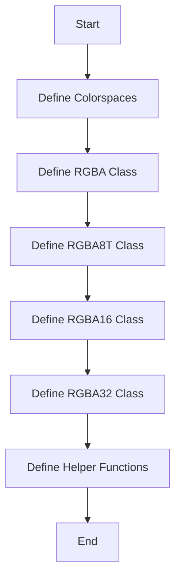

## 类结构

```
rgba
├── rgba8T<linear>
│   ├── rgba8
│   └── srgba8
├── rgba16
└── rgba32
```

## 全局变量及字段


### `r`
    
Red component of the color, ranging from 0 to 1.

类型：`double`
    


### `g`
    
Green component of the color, ranging from 0 to 1.

类型：`double`
    


### `b`
    
Blue component of the color, ranging from 0 to 1.

类型：`double`
    


### `a`
    
Alpha component of the color, representing opacity, ranging from 0 (fully transparent) to 1 (fully opaque).

类型：`double`
    


### `rgba.r`
    
Red component of the color, ranging from 0 to 1.

类型：`double`
    


### `rgba.g`
    
Green component of the color, ranging from 0 to 1.

类型：`double`
    


### `rgba.b`
    
Blue component of the color, ranging from 0 to 1.

类型：`double`
    


### `rgba.a`
    
Alpha component of the color, representing opacity, ranging from 0 (fully transparent) to 1 (fully opaque).

类型：`double`
    


### `rgba8T<linear>.r`
    
Red component of the color, represented as an 8-bit unsigned integer ranging from 0 to 255.

类型：`int8u`
    


### `rgba8T<linear>.g`
    
Green component of the color, represented as an 8-bit unsigned integer ranging from 0 to 255.

类型：`int8u`
    


### `rgba8T<linear>.b`
    
Blue component of the color, represented as an 8-bit unsigned integer ranging from 0 to 255.

类型：`int8u`
    


### `rgba8T<linear>.a`
    
Alpha component of the color, representing opacity, represented as an 8-bit unsigned integer ranging from 0 (fully transparent) to 255 (fully opaque).

类型：`int8u`
    


### `rgba16.r`
    
Red component of the color, represented as a 16-bit unsigned integer ranging from 0 to 65535.

类型：`int16u`
    


### `rgba16.g`
    
Green component of the color, represented as a 16-bit unsigned integer ranging from 0 to 65535.

类型：`int16u`
    


### `rgba16.b`
    
Blue component of the color, represented as a 16-bit unsigned integer ranging from 0 to 65535.

类型：`int16u`
    


### `rgba16.a`
    
Alpha component of the color, representing opacity, represented as a 16-bit unsigned integer ranging from 0 (fully transparent) to 65535 (fully opaque).

类型：`int16u`
    


### `rgba32.r`
    
Red component of the color, represented as a 32-bit floating-point number ranging from 0 to 1.

类型：`float`
    


### `rgba32.g`
    
Green component of the color, represented as a 32-bit floating-point number ranging from 0 to 1.

类型：`float`
    


### `rgba32.b`
    
Blue component of the color, represented as a 32-bit floating-point number ranging from 0 to 1.

类型：`float`
    


### `rgba32.a`
    
Alpha component of the color, representing opacity, represented as a 32-bit floating-point number ranging from 0 (fully transparent) to 1 (fully opaque).

类型：`float`
    
    

## 全局函数及方法

### from_wavelength

`from_wavelength` 是 `rgba` 类的一个静态方法，用于根据波长和伽玛值计算 RGBA 颜色。

#### 参数

- `wl`：`double`，波长值，单位为纳米。
- `gamma`：`double`，伽玛值，默认为 1.0。

#### 返回值

- `rgba`，计算得到的 RGBA 颜色。

#### 流程图

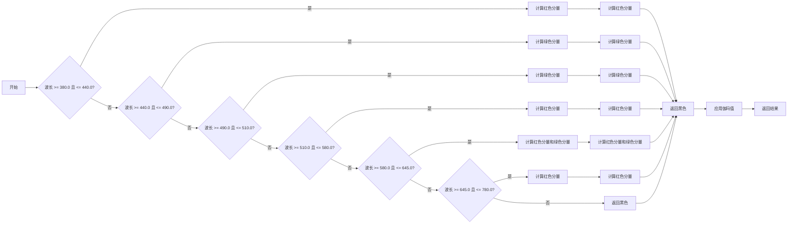

#### 带注释源码

```cpp
inline rgba rgba::from_wavelength(double wl, double gamma)
{
    rgba t(0.0, 0.0, 0.0);

    if (wl >= 380.0 && wl <= 440.0)
    {
        t.r = -1.0 * (wl - 440.0) / (440.0 - 380.0);
        t.b = 1.0;
    }
    else if (wl >= 440.0 && wl <= 490.0)
    {
        t.g = (wl - 440.0) / (490.0 - 440.0);
        t.b = 1.0;
    }
    else if (wl >= 490.0 && wl <= 510.0)
    {
        t.g = 1.0;
        t.b = -1.0 * (wl - 510.0) / (510.0 - 490.0);
    }
    else if (wl >= 510.0 && wl <= 580.0)
    {
        t.r = (wl - 510.0) / (580.0 - 510.0);
        t.g = 1.0;
    }
    else if (wl >= 580.0 && wl <= 645.0)
    {
        t.r = 1.0;
        t.g = -1.0 * (wl - 645.0) / (645.0 - 580.0);
    }
    else if (wl >= 645.0 && wl <= 780.0)
    {
        t.r = 1.0;
    }

    double s = 1.0;
    if (wl > 700.0)       s = 0.3 + 0.7 * (780.0 - wl) / (780.0 - 700.0);
    else if (wl <  420.0) s = 0.3 + 0.7 * (wl - 380.0) / (420.0 - 380.0);

    t.r = pow(t.r * s, gamma);
    t.g = pow(t.g * s, gamma);
    t.b = pow(t.b * s, gamma);
    return t;
}
```


### `rgba::no_color()`

返回一个表示完全透明的RGBA颜色的`rgba`对象。

参数：

- 无

返回值：

- `rgba`，一个RGBA颜色对象，其红色、绿色、蓝色和alpha通道值均为0，表示完全透明。

#### 流程图

```mermaid
graph LR
A[Start] --> B{Is there any parameter?}
B -- No --> C[Return rgba(0,0,0,0)]
B -- Yes --> D[Process parameters]
D --> E[Return rgba with processed parameters]
E --> F[End]
```

#### 带注释源码

```cpp
// Return a fully transparent RGBA color.
static rgba no_color() { return rgba(0,0,0,0); }
```


### `rgba_pre`

`rgba_pre` 函数用于将 RGBA 颜色值进行预乘处理。

参数：

- `r`：`double`，红色分量值
- `g`：`double`，绿色分量值
- `b`：`double`，蓝色分量值
- `a`：`double`，透明度分量值

返回值：`rgba`，预乘处理后的 RGBA 颜色值

#### 流程图

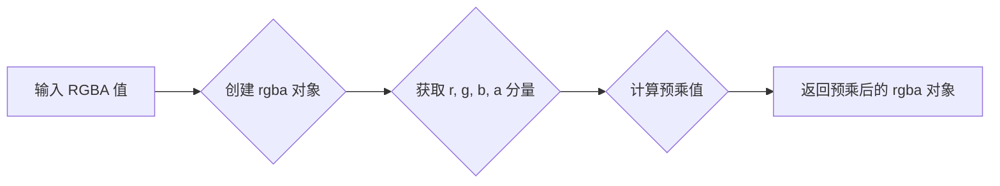

#### 带注释源码

```cpp
inline rgba rgba_pre(double r, double g, double b, double a)
{
    return rgba(r, g, b, a).premultiply();
}
```

### rgb8_packed

将一个32位无符号整数转换为`rgba8`对象。

参数：

- `v`：`unsigned`，32位无符号整数，表示颜色值。

返回值：`rgba8`，表示转换后的颜色值。

#### 流程图

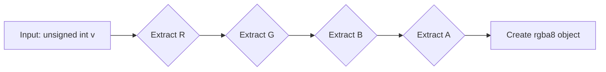

#### 带注释源码

```cpp
inline rgba8 rgb8_packed(unsigned v)
{
    return rgba8(
        (v >> 16) & 0xFF, // Extract R
        (v >> 8) & 0xFF,  // Extract G
        v & 0xFF          // Extract B
    );
}
```

### bgr8_packed

将一个32位无符号整数转换为`rgba8`对象，其中红色、绿色和蓝色分量分别位于高24位、中间8位和低8位。

参数：

- `v`：`unsigned`，32位无符号整数，表示颜色值。

返回值：`rgba8`，表示转换后的颜色值。

#### 流程图

```mermaid
graph LR
A[Input: unsigned int v] --> B{Extract R, G, B}
B --> C[rgba8(r, g, b)]
```

#### 带注释源码

```cpp
inline rgba8 bgr8_packed(unsigned v)
{
    return rgba8((v >> 16) & 0xFF, (v >> 8) & 0xFF, v & 0xFF);
}
```

### argb8_packed

将32位无符号整数的ARGB8格式转换为`rgba8`对象。

参数：

- `v`：`unsigned`，32位无符号整数，表示ARGB8格式的颜色值。

返回值：`rgba8`，表示转换后的颜色值。

#### 流程图

```mermaid
graph LR
A[输入] --> B{分割ARGB}
B --> C{R: (v >> 16) & 0xFF}
B --> D{G: (v >> 8) & 0xFF}
B --> E{B: v & 0xFF}
B --> F{A: v >> 24}
F --> G[创建rgba8对象]
G --> H[返回]
```

#### 带注释源码

```cpp
inline rgba8 argb8_packed(unsigned v)
{
    return rgba8(
        (v >> 16) & 0xFF, // R
        (v >> 8) & 0xFF,   // G
        v & 0xFF,          // B
        v >> 24            // A
    );
}
```

### rgba8_gamma_dir

`rgba8_gamma_dir` 是一个模板函数，它接受一个 `rgba8` 颜色对象和一个 `GammaLUT` 对象作为参数，并返回一个新的 `rgba8` 颜色对象，其中红色、绿色和蓝色分量经过伽玛校正。

#### 参数

- `c`：`rgba8`，表示要应用伽玛校正的颜色。
- `gamma`：`const GammaLUT&`，表示伽玛查找表。

#### 返回值

- `rgba8`，表示经过伽玛校正的颜色。

#### 流程图

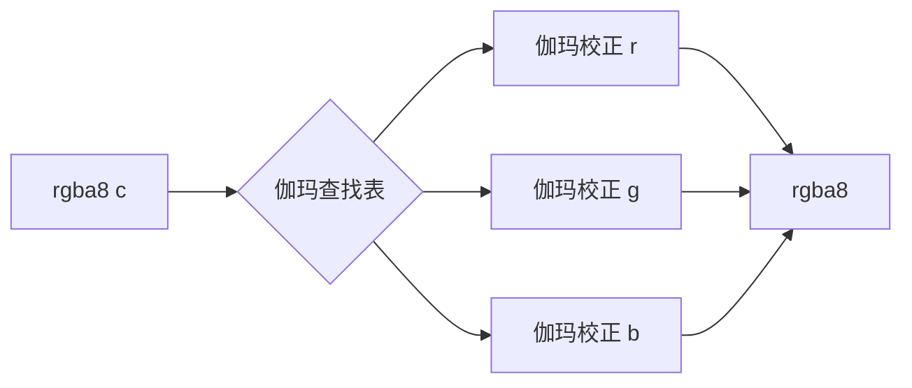

#### 带注释源码

```cpp
template<class GammaLUT>
rgba8 rgba8_gamma_dir(rgba8 c, const GammaLUT& gamma)
{
    return rgba8(gamma.dir(c.r), gamma.dir(c.g), gamma.dir(c.b), c.a);
}
```

### rgba8_gamma_inv

该函数将RGBA8颜色值中的红色、绿色和蓝色分量通过逆伽玛校正。

#### 参数

- `c`：`rgba8`，输入的RGBA8颜色值。
- `gamma`：`const GammaLUT&`，伽玛查找表。

#### 返回值

- `rgba8`，经过逆伽玛校正的RGBA8颜色值。

#### 流程图

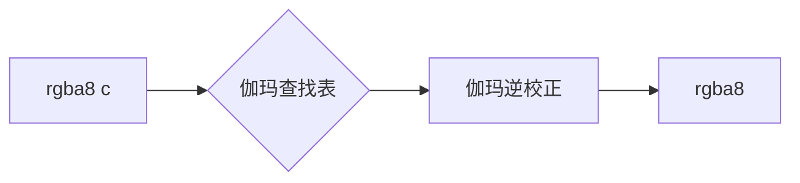

#### 带注释源码

```cpp
template<class GammaLUT>
AGG_INLINE rgba8 rgba8_gamma_inv(rgba8 c, const GammaLUT& gamma)
{
    return rgba8(gamma.inv(c.r), gamma.inv(c.g), gamma.inv(c.b), c.a);
}
```

### rgba16_gamma_dir

`rgba16_gamma_dir` 是一个模板函数，它接受一个 `rgba16` 类型的颜色对象和一个 `GammaLUT` 类型的伽玛查找表对象，然后应用伽玛查找表到颜色对象的红色、绿色和蓝色分量上，而保持其alpha（透明度）分量不变。

#### 参数

- `c`：`rgba16`，输入颜色对象，包含红色、绿色、蓝色和alpha分量。
- `gamma`：`GammaLUT`，伽玛查找表对象，用于调整颜色分量的伽玛值。

#### 返回值

- `rgba16`，调整后的颜色对象，其红色、绿色和蓝色分量已应用伽玛查找表，而alpha分量保持不变。

#### 流程图

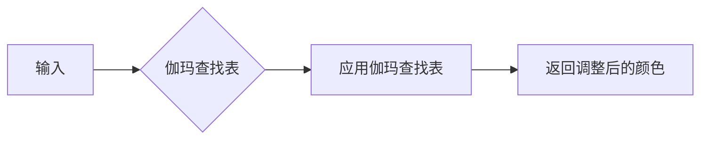

#### 带注释源码

```cpp
template<class GammaLUT>
rgba16 rgba16_gamma_dir(rgba16 c, const GammaLUT& gamma)
{
    return rgba16(gamma.dir(c.r), gamma.dir(c.g), gamma.dir(c.b), c.a);
}
```

### rgba16_gamma_inv

该函数将RGBA16颜色值中的红色、绿色和蓝色分量应用逆伽玛校正。

参数：

- `c`：`rgba16`，输入的RGBA16颜色值
- `gamma`：`const GammaLUT&`，伽玛查找表

返回值：`rgba16`，应用逆伽玛校正后的RGBA16颜色值

#### 流程图

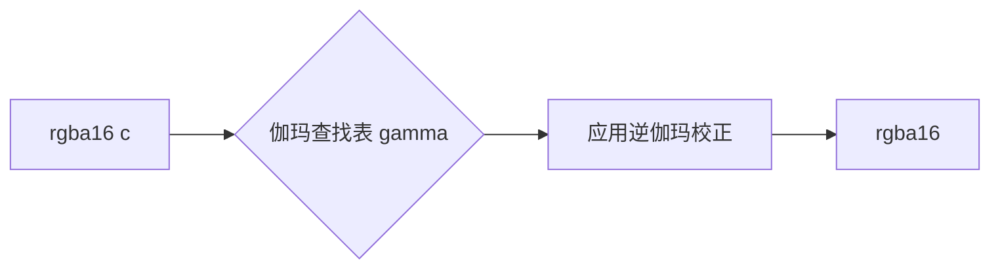

#### 带注释源码

```cpp
template<class GammaLUT>
rgba16 rgba16_gamma_inv(rgba16 c, const GammaLUT& gamma)
{
    return rgba16(gamma.inv(c.r), gamma.inv(c.g), gamma.inv(c.b), c.a);
}
```


### rgba.clear

`rgba.clear` 方法用于将 RGBA 颜色对象的所有颜色分量设置为 0，使其变为完全透明的黑色。

参数：

- 无

返回值：`rgba`，返回当前对象，以便进行链式调用。

#### 流程图

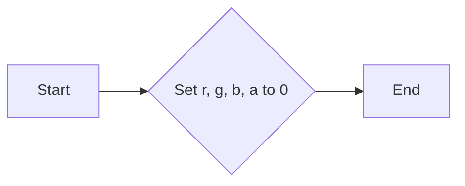

#### 带注释源码

```cpp
        //--------------------------------------------------------------------
        rgba& clear()
        {
            r = g = b = a = 0;
            return *this;
        }
```


### rgba::transparent

该函数将RGBA颜色对象的alpha通道设置为0，使其完全透明。

参数：

- 无

返回值：`rgba`，返回修改后的RGBA颜色对象

#### 流程图

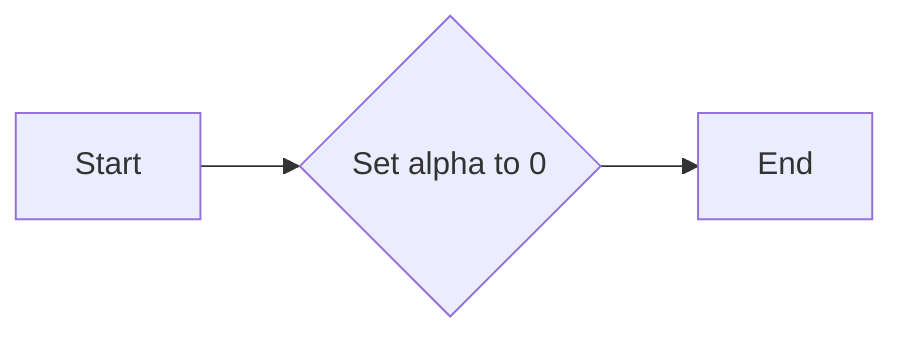

#### 带注释源码

```cpp
        //--------------------------------------------------------------------
        rgba& transparent()
        {
            a = 0;
            return *this;
        }
```


### rgba::opacity

`rgba::opacity` 方法是 `rgba` 类的一个成员函数，用于设置或获取颜色的透明度。

参数：

- `a_`：`double`，表示透明度值，范围在 0 到 1 之间。

返回值：`rgba` 对象本身，用于链式调用。

#### 流程图

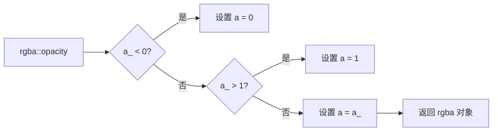

#### 带注释源码

```cpp
        //--------------------------------------------------------------------
        rgba& opacity(double a_)
        {
            if (a_ < 0) a = 0;
            else if (a_ > 1) a = 1;
            else a = a_;
            return *this;
        }
``` 


### rgba.premultiply

This method premultiplies the RGBA color by its alpha value. It scales the red, green, and blue components by the alpha value, effectively combining the color with transparency.

参数：

- `this`：`rgba`，指向当前RGBA颜色的引用
- `a_`（可选）：`double`，用于指定alpha值，默认为当前alpha值

返回值：`rgba`，返回经过预乘处理的RGBA颜色

#### 流程图

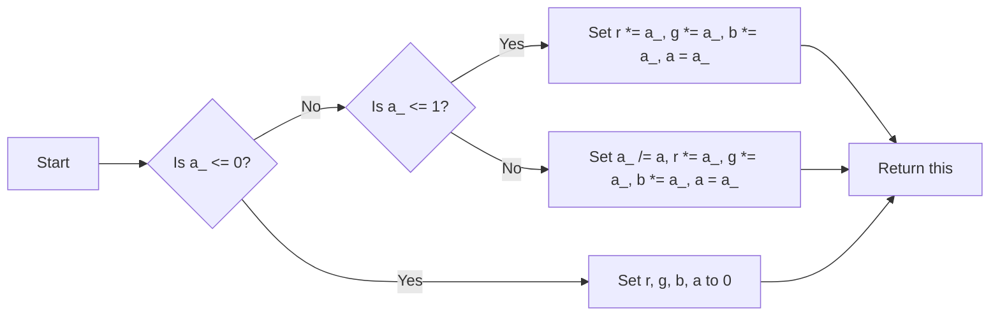

#### 带注释源码

```cpp
rgba& premultiply(double a_ = 1.0)
{
    if (a_ <= 0 || a_ <= 0)
    {
        r = g = b = a = 0;
    }
    else
    {
        a_ /= a;
        r *= a_;
        g *= a_;
        b *= a_;
        a  = a_;
    }
    return *this;
}
```


### rgba.demultiply

`rgba.demultiply` 方法是 `rgba` 类的一个成员函数，用于将预乘的 RGBA 颜色分解回未预乘的状态。

参数：

- 无

返回值：`rgba`，返回分解后的 RGBA 颜色。

#### 流程图

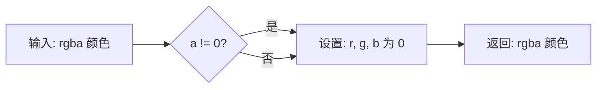

#### 带注释源码

```cpp
        //--------------------------------------------------------------------
        rgba& demultiply()
        {
            if (a == 0)
            {
                r = g = b = 0;
            }
            else
            {
                double a_ = 1.0 / a;
                r *= a_;
                g *= a_;
                b *= a_;
            }
            return *this;
        }
```


### `rgba.gradient`

该函数计算两个RGBA颜色之间的渐变。

参数：

- `c`：`rgba`，渐变的结束颜色。
- `k`：`double`，渐变因子，范围从0到1，其中0表示起始颜色，1表示结束颜色。

返回值：`rgba`，渐变后的颜色。

#### 流程图

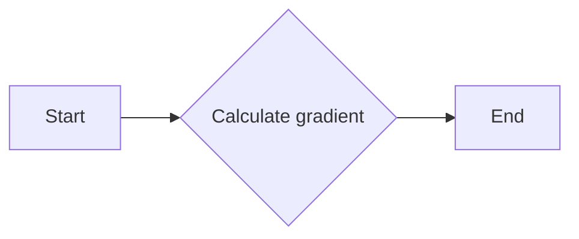

#### 带注释源码

```cpp
    //--------------------------------------------------------------------
    rgba gradient(rgba c, double k) const
    {
        rgba ret;
        ret.r = r + (c.r - r) * k;
        ret.g = g + (c.g - g) * k;
        ret.b = b + (c.b - b) * k;
        ret.a = a + (c.a - a) * k;
        return ret;
    }
```


### rgba::operator+=

增加一个RGBA颜色值到当前颜色值。

{描述}

参数：

- `c`：`const rgba&`，要增加的颜色值。

返回值：`rgba&`，当前颜色对象，增加操作后。

#### 流程图

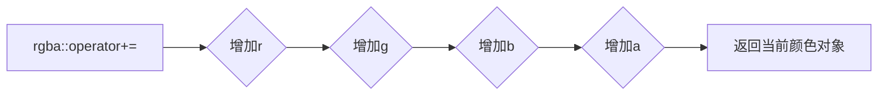

#### 带注释源码

```cpp
rgba& operator+=(const rgba& c)
{
    r += c.r;
    g += c.g;
    b += c.b;
    a += c.a;
    return *this;
}
```


### rgba::operator*=(double k)

将RGBA颜色的每个分量乘以一个标量值。

{描述}

参数：

- `k`：`double`，一个标量值，用于乘以RGBA颜色的每个分量。

返回值：`rgba&`，返回当前对象，以便进行链式调用。

#### 流程图

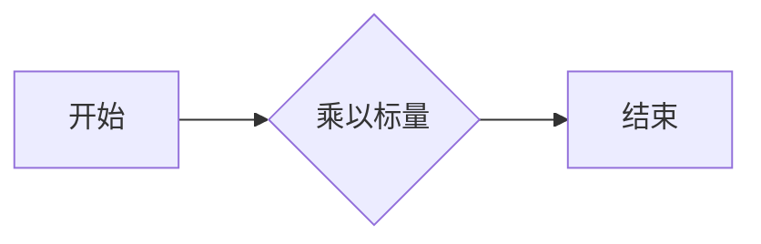

#### 带注释源码

```cpp
rgba& operator*=(double k)
{
    r *= k;
    g *= k;
    b *= k;
    a *= k;
    return *this;
}
```


### `rgba8T<linear>::convert`

将颜色从一种格式转换为另一种格式。

参数：

- `dst`：`rgba8T<linear>`，目标颜色对象，用于存储转换后的颜色值
- `src`：`const rgba8T<sRGB>&`，源颜色对象，用于提供转换前的颜色值

返回值：无

#### 流程图

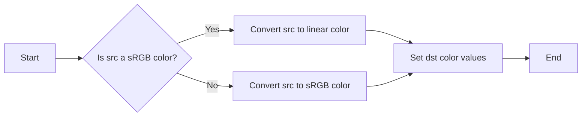

#### 带注释源码

```cpp
static void convert(rgba8T<linear>& dst, const rgba8T<sRGB>& src)
{
    dst.r = sRGB_conv<value_type>::rgb_from_sRGB(src.r);
    dst.g = sRGB_conv<value_type>::rgb_from_sRGB(src.g);
    dst.b = sRGB_conv<value_type>::rgb_from_sRGB(src.b);
    dst.a = src.a;
}
``` 


### `rgba8T<linear>::clear`

`rgba8T<linear>::clear` 方法用于将 `rgba8T<linear>` 类型的对象的所有颜色分量设置为 0，使其变为完全透明的颜色。

参数：

- 无

返回值：`self_type`，返回当前对象本身，以便进行链式调用。

#### 流程图

```mermaid
graph LR
A[Start] --> B{Set r, g, b, a to 0}
B --> C[End]
```

#### 带注释源码

```cpp
self_type& clear()
{
    r = g = b = a = 0;
    return *this;
}
```


### rgba8T<linear>.transparent

该函数将RGBA8颜色对象的alpha通道设置为透明（值为0）。

参数：

- 无

返回值：`self_type`，当前对象，alpha通道已设置为透明

#### 流程图

```mermaid
graph LR
A[开始] --> B{alpha == 0?}
B -- 是 --> C[结束]
B -- 否 --> D[设置alpha为0]
D --> C
```

#### 带注释源码

```cpp
self_type& transparent()
{
    a = 0;
    return *this;
}
```


### rgba8T<linear>.opacity

该函数用于设置或获取`rgba8T<linear>`类型的颜色对象的透明度。

参数：

- `a_`：`double`，表示透明度值，范围从0（完全透明）到1（完全不透明）。

返回值：`double`，当前颜色对象的透明度值。

#### 流程图

```mermaid
graph LR
A[开始] --> B{参数a_是否小于0?}
B -- 是 --> C[设置透明度为0]
B -- 否 --> D{参数a_是否大于1?}
D -- 是 --> E[设置透明度为1]
D -- 否 --> F[设置透明度为a_]
F --> G[返回当前透明度]
G --> H[结束]
```

#### 带注释源码

```cpp
        //--------------------------------------------------------------------
        self_type& opacity(double a_)
        {
            if (a_ < 0) a = 0;
            else if (a_ > 1) a = 1;
            else a = (value_type)uround(a_ * double(base_mask));
            return *this;
        }
``` 


### rgba8T<linear>.premultiply

This function premultiplies the color components of an `rgba8T<linear>` object by its alpha value. This is useful for handling transparency in certain graphics operations.

参数：

- `this`：`rgba8T<linear>`，指向当前对象，表示要处理的颜色
- ...

返回值：`rgba8T<linear>`，返回修改后的颜色对象，其颜色分量已根据alpha值进行预乘

#### 流程图

```mermaid
graph LR
A[Start] --> B{Is alpha non-zero?}
B -- Yes --> C[Premultiply each component by alpha]
B -- No --> D[Return unchanged object]
C --> E[End]
D --> E
```

#### 带注释源码

```cpp
AGG_INLINE self_type& premultiply()
{
    if (a != base_mask)
    {
        if (a == 0)
        {
            r = g = b = 0;
        }
        else
        {
            r = multiply(r, a);
            g = multiply(g, a);
            b = multiply(b, a);
        }
    }
    return *this;
}
``` 


### rgba8T<linear>::demultiply

This function demultiplies the RGBA color components by the alpha component to normalize the color values.

参数：

- `this`：`rgba8T<linear>`，指向当前RGBA颜色的引用
- ...

返回值：`rgba8T<linear>`，返回经过demultiply操作的RGBA颜色

#### 流程图

```mermaid
graph LR
A[Start] --> B{Check alpha value}
B -->|Alpha == 0| C[Set all color components to 0]
B -->|Alpha != 0| D{Calculate inverse of alpha}
D --> E{Demultiply each color component}
E --> F[Return result]
```

#### 带注释源码

```cpp
AGG_INLINE self_type& demultiply()
{
    if (a < base_mask)
    {
        if (a == 0)
        {
            r = g = b = 0;
        }
        else
        {
            calc_type r_ = (calc_type(r) * base_mask) / a;
            calc_type g_ = (calc_type(g) * base_mask) / a;
            calc_type b_ = (calc_type(b) * base_mask) / a;
            r = value_type((r_ > calc_type(base_mask)) ? calc_type(base_mask) : r_);
            g = value_type((g_ > calc_type(base_mask)) ? calc_type(base_mask) : g_);
            b = value_type((b_ > calc_type(base_mask)) ? calc_type(base_mask) : b_);
        }
    }
    return *this;
}
```


### `rgba8T<linear>::gradient`

该函数计算两个颜色之间的线性插值。

参数：

- `c`：`const self_type&`，要插值的第二个颜色
- `k`：`double`，插值系数，范围从0到1

返回值：`self_type`，插值后的颜色

#### 流程图

```mermaid
graph LR
A[Start] --> B{Calculate gradient}
B --> C[End]
```

#### 带注释源码

```cpp
AGG_INLINE self_type& gradient(const self_type& c, double k) const
{
    self_type ret;
    calc_type ik = uround(k * base_mask);
    ret.r = lerp(r, c.r, ik);
    ret.g = lerp(g, c.g, ik);
    ret.b = lerp(b, c.b, ik);
    ret.a = lerp(a, c.a, ik);
    return ret;
}
``` 


### `rgba8T<linear>::add`

`rgba8T<linear>::add` 方法是 `rgba8T<linear>` 类的一个成员函数，用于将两个 `rgba8T<linear>` 对象的颜色值相加。

参数：

- `c`：`const self_type&`，要添加的颜色值。
- `cover`：`unsigned`，用于控制颜色混合的方式。

返回值：`self_type&`，当前对象，其颜色值已更新为与 `c` 相加的结果。

#### 流程图

```mermaid
graph LR
A[Start] --> B{Is cover == cover_mask?}
B -- Yes --> C[Add r, g, b, a]
B -- No --> D{Is c.a == base_mask?}
D -- Yes --> E[Set this to c]
D -- No --> F[Add r, g, b, a with cover]
F --> G[End]
```

#### 带注释源码

```cpp
void add(const self_type& c, unsigned cover)
{
    calc_type cr, cg, cb, ca;
    if (cover == cover_mask)
    {
        if (c.a == base_mask)
        {
            *this = c;
            return;
        }
        else
        {
            cr = r + c.r;
            cg = g + c.g;
            cb = b + c.b;
            ca = a + c.a;
        }
    }
    else
    {
        cr = r + mult_cover(c.r, cover);
        cg = g + mult_cover(c.g, cover);
        cb = b + mult_cover(c.b, cover);
        ca = a + mult_cover(c.a, cover);
    }
    r = (value_type)((cr > calc_type(base_mask)) ? calc_type(base_mask) : cr);
    g = (value_type)((cg > calc_type(base_mask)) ? calc_type(base_mask) : cg);
    b = (value_type)((cb > calc_type(base_mask)) ? calc_type(base_mask) : cb);
    a = (value_type)((ca > calc_type(base_mask)) ? calc_type(base_mask) : ca);
}
```


### `rgba8T<linear>::apply_gamma_dir`

将颜色组件应用伽玛校正。

参数：

- `gamma`：`const GammaLUT&`，伽玛查找表对象，用于应用伽玛校正。

返回值：`void`，无返回值。

#### 流程图

```mermaid
graph LR
A[Start] --> B{Apply gamma to r}
B --> C{Apply gamma to g}
C --> D{Apply gamma to b}
D --> E[End]
```

#### 带注释源码

```cpp
template<class GammaLUT>
AGG_INLINE void apply_gamma_dir(const GammaLUT& gamma)
{
    r = gamma.dir(r);
    g = gamma.dir(g);
    b = gamma.dir(b);
}
```


### `rgba8T<linear>::apply_gamma_inv`

该函数将颜色组件应用逆伽玛校正。

参数：

- `gamma`：`const GammaLUT&`，伽玛查找表对象，用于逆伽玛校正。

返回值：`void`，无返回值。

#### 流程图

```mermaid
graph LR
A[Start] --> B{Apply gamma inverse to r}
B --> C{Apply gamma inverse to g}
C --> D{Apply gamma inverse to b}
D --> E{Apply gamma inverse to a}
E --> F[End]
```

#### 带注释源码

```cpp
template<class GammaLUT>
AGG_INLINE void apply_gamma_inv(const GammaLUT& gamma)
{
    r = gamma.inv(r);
    g = gamma.inv(g);
    b = gamma.inv(b);
}
```


### rgba16.clear

该函数用于将`rgba16`对象的所有颜色分量和透明度设置为0，使其变为完全透明的颜色。

参数：

- 无

返回值：`self_type`，返回当前对象本身，以便进行链式调用。

#### 流程图

```mermaid
graph LR
A[Start] --> B{Set r, g, b, a to 0}
B --> C[End]
```

#### 带注释源码

```cpp
self_type& clear()
{
    r = g = b = a = 0;
    return *this;
}
```


### rgba16.transparent

该函数用于将RGBA16颜色对象的alpha通道设置为透明（值为0）。

参数：

- 无

返回值：`rgba16`，返回修改后的RGBA16颜色对象，其alpha通道为0。

#### 流程图

```mermaid
graph LR
A[rgba16] --> B{a != 0?}
B -- 是 --> C[设置a = 0]
B -- 否 --> C
C --> D[返回rgba16]
```

#### 带注释源码

```cpp
self_type& transparent()
{
    a = 0;
    return *this;
}
```

### rgba16.opacity

该函数用于设置或获取`rgba16`对象的不透明度。

参数：

- `a_`：`double`，表示不透明度值，范围从0（完全透明）到1（完全不透明）。

返回值：`double`，当前对象的不透明度值。

#### 流程图

```mermaid
graph LR
A[rgba16.opacity] --> B{参数a_}
B --> C{a_ < 0?}
C -- 是 --> D{a = 0}
C -- 否 --> E{a_ > 1?}
E -- 是 --> F{a = 1}
E -- 否 --> G{a = a_}
G --> H[返回a]
```

#### 带注释源码

```cpp
AGG_INLINE self_type& opacity(double a_)
{
    if (a_ < 0) a = 0;
    else if (a_ > 1) a = 1;
    else a = value_type(uround(a_ * double(base_mask)));
    return *this;
}
```


### rgba16.premultiply

This method premultiplies the RGBA color by its alpha value. It scales the red, green, and blue components by the alpha value, effectively combining the color with transparency.

参数：

- `this`：`rgba16`，指向当前RGBA颜色的引用
- `a_`：`double`，用于调整alpha值

返回值：`rgba16`，返回调整后的RGBA颜色

#### 流程图

```mermaid
graph LR
A[Start] --> B{Is a_ <= 0?}
B -- Yes --> C[Set r, g, b, a to 0]
B -- No --> D{Is a_ > 1?}
D -- Yes --> E[Set r, g, b, a to 1]
D -- No --> F[Calculate a_ = a_ / a]
F --> G[Calculate r_ = r * a_]
G --> H[Calculate g_ = g * a_]
H --> I[Calculate b_ = b * a_]
I --> J[Set r to r_]
J --> K[Set g to g_]
K --> L[Set b to b_]
L --> M[Set a to a_]
M --> N[End]
```

#### 带注释源码

```cpp
AGG_INLINE self_type& premultiply()
{
    if (a != base_mask)
    {
        if (a == 0)
        {
            r = g = b = 0;
        }
        else
        {
            r = multiply(r, a);
            g = multiply(g, a);
            b = multiply(b, a);
        }
    }
    return *this;
}

AGG_INLINE self_type& premultiply(unsigned a_)
{
    if (a < base_mask || a_ < base_mask)
    {
        if (a == 0 || a_ == 0)
        {
            r = g = b = a = 0;
        }
        else
        {
            calc_type r_ = (calc_type(r) * a_) / a;
            calc_type g_ = (calc_type(g) * a_) / a;
            calc_type b_ = (calc_type(b) * a_) / a;
            r = value_type((r_ > a_) ? a_ : r_);
            g = value_type((g_ > a_) ? a_ : g_);
            b = value_type((b_ > a_) ? a_ : b_);
            a = value_type(a_);
        }
    }
    return *this;
}
```


### rgba16.demultiply

`rgba16.demultiply` 方法是 `rgba16` 类的一个成员函数，用于将 RGBA 颜色值进行反预乘操作。

参数：

- `this`：`rgba16`，指向当前对象，表示当前 RGBA 颜色值
- `a_`：`double`，当前 RGBA 颜色值的 alpha 通道值

返回值：`rgba16`，返回反预乘后的 RGBA 颜色值

#### 流程图

```mermaid
graph LR
A[rgba16] --> B{a == 0?}
B -- 是 --> C[返回当前对象]
B -- 否 --> D{a_ <= 0 或 a_ <= 0?}
D -- 是 --> E[设置所有颜色值为 0]
D -- 否 --> F{a_ / a}
F --> G{r * a_}
G --> H{g * a_}
H --> I{b * a_}
I --> J{a}
J --> K[返回当前对象]
```

#### 带注释源码

```cpp
AGG_INLINE self_type& demultiply()
{
    if (a == 0)
    {
        r = g = b = 0;
    }
    else
    {
        double a_ = 1.0 / a;
        r *= a_;
        g *= a_;
        b *= a_;
    }
    return *this;
}
```


### `rgba16.gradient`

该函数计算两个RGBA16颜色之间的渐变。

参数：

- `c`：`const rgba16&`，渐变的结束颜色
- `k`：`double`，渐变因子，范围从0到1，0表示起始颜色，1表示结束颜色

返回值：`rgba16`，渐变后的颜色

#### 流程图

```mermaid
graph LR
A[Start] --> B{Calculate gradient}
B --> C[End]
```

#### 带注释源码

```cpp
rgba16 gradient(rgba16 c, double k) const
{
    rgba16 ret;
    calc_type ik = uround(k * base_mask);
    ret.r = lerp(r, c.r, ik);
    ret.g = lerp(g, c.g, ik);
    ret.b = lerp(b, c.b, ik);
    ret.a = lerp(a, c.a, ik);
    return ret;
}
```

### `rgba16.add`

该函数用于将两个 `rgba16` 颜色对象相加，并考虑覆盖因子（cover）。

#### 参数

- `c`：`const self_type&`，要添加的 `rgba16` 颜色对象。
- `cover`：`unsigned`，覆盖因子，用于控制添加操作的强度。

#### 返回值

- `void`，该函数不返回值，直接修改当前对象。

#### 流程图

```mermaid
graph LR
A[Start] --> B{Is cover == cover_mask?}
B -- Yes --> C[Add r, g, b, a]
B -- No --> D{Is c.a == base_mask?}
D -- Yes --> E[Set current to c]
D -- No --> F[Add r, g, b, a with cover]
F --> G[End]
```

#### 带注释源码

```cpp
void add(const self_type& c, unsigned cover)
{
    calc_type cr, cg, cb, ca;
    if (cover == cover_mask)
    {
        if (c.a == base_mask)
        {
            *this = c;
            return;
        }
        else
        {
            cr = r + c.r;
            cg = g + c.g;
            cb = b + c.b;
            ca = a + c.a;
        }
    }
    else
    {
        cr = r + mult_cover(c.r, cover);
        cg = g + mult_cover(c.g, cover);
        cb = b + mult_cover(c.b, cover);
        ca = a + mult_cover(c.a, cover);
    }
    r = (value_type)((cr > calc_type(base_mask)) ? calc_type(base_mask) : cr);
    g = (value_type)((cg > calc_type(base_mask)) ? calc_type(base_mask) : cg);
    b = (value_type)((cb > calc_type(base_mask)) ? calc_type(base_mask) : cb);
    a = (value_type)((ca > calc_type(base_mask)) ? calc_type(base_mask) : ca);
}
```


### rgba16::apply_gamma_dir

This function applies a gamma correction to the red, green, and blue components of an RGBA16 color.

参数：

- `gamma`：`const GammaLUT&`，A reference to a GammaLUT object that contains the gamma correction tables.

返回值：`void`，No return value. The gamma correction is applied directly to the color object.

#### 流程图

```mermaid
graph LR
A[Start] --> B{Is gamma non-null?}
B -- Yes --> C[Apply gamma to red]
B -- No --> D[End]
C --> E[Apply gamma to green]
E --> F[Apply gamma to blue]
F --> D
```

#### 带注释源码

```cpp
template<class GammaLUT>
AGG_INLINE void rgba16::apply_gamma_dir(const GammaLUT& gamma)
{
    r = gamma.dir(r);
    g = gamma.dir(g);
    b = gamma.dir(b);
}
```


### rgba16::apply_gamma_inv

This function applies the inverse gamma correction to the RGB components of an RGBA16 color.

参数：

- `c`：`rgba16`，The color to apply the inverse gamma correction to.
- `gamma`：`const GammaLUT&`，The lookup table for the inverse gamma correction.

返回值：`rgba16`，The color with the inverse gamma correction applied.

#### 流程图

```mermaid
graph LR
A[Start] --> B{Apply inverse gamma to R}
B --> C{Apply inverse gamma to G}
C --> D{Apply inverse gamma to B}
D --> E[End]
```

#### 带注释源码

```cpp
template<class GammaLUT>
AGG_INLINE rgba16 rgba16::apply_gamma_inv(const GammaLUT& gamma)
{
    r = gamma.inv(r);
    g = gamma.inv(g);
    b = gamma.inv(b);
    return *this;
}
```


### rgba32.clear

该函数用于将RGBA32颜色对象的所有颜色分量设置为0，使其变为完全透明的黑色。

参数：

- 无

返回值：`self_type`，当前对象，表示当前RGBA32颜色对象。

#### 流程图

```mermaid
graph LR
A[Start] --> B{Set r, g, b, a to 0}
B --> C[End]
```

#### 带注释源码

```cpp
self_type& clear()
{
    r = g = b = a = 0;
    return *this;
}
```


### rgba32.transparent

该函数将RGBA颜色对象的alpha通道设置为0，使其完全透明。

参数：

- 无

返回值：`self_type`，当前RGBA颜色对象，其alpha通道已被设置为0。

#### 流程图

```mermaid
graph LR
A[Start] --> B{Is a <self_type> instance?}
B -- Yes --> C[Set alpha to 0]
B -- No --> D[Error: Invalid instance]
C --> E[Return self_type instance]
D --> F[Error handling]
E --> G[End]
```

#### 带注释源码

```cpp
        //--------------------------------------------------------------------
        self_type& transparent()
        {
            a = 0;
            return *this;
        }
```


### rgba32.opacity

该函数用于设置RGBA32颜色对象的透明度。

参数：

- `a_`：`double`，表示新的透明度值，范围在0到1之间。

返回值：`self_type`，表示当前RGBA32颜色对象。

#### 流程图

```mermaid
graph LR
A[rgba32.opacity] --> B{a_ < 0?}
B -- 是 --> C[设置a = 0]
B -- 否 --> D{a_ > 1?}
D -- 是 --> E[设置a = 1]
D -- 否 --> F[设置a = a_]
F --> G[返回当前rgba32对象]
```

#### 带注释源码

```cpp
        //--------------------------------------------------------------------
        AGG_INLINE self_type& opacity(double a_)
        {
            if (a_ < 0) a = 0;
            else if (a_ > 1) a = 1;
            else a = value_type(a_);
            return *this;
        }
``` 


### rgba32.premultiply

This method premultiplies the RGBA color components by the alpha value, effectively combining the color and opacity into a single value for each component.

参数：

- `this`：`rgba32`，指向当前RGBA颜色的引用
- ...

返回值：`self_type`，当前RGBA颜色对象，其颜色分量已根据alpha值进行预乘

#### 流程图

```mermaid
graph LR
A[Start] --> B{Is alpha <= 0?}
B -- Yes --> C[Set r, g, b, a to 0]
B -- No --> D{Is alpha <= 1?}
D -- Yes --> E[Set r *= alpha, g *= alpha, b *= alpha]
D -- No --> F[Set r, g, b, a to 1]
E --> G[Return this]
F --> G
C --> G
```

#### 带注释源码

```cpp
AGG_INLINE self_type& premultiply()
{
    if (a < 1)
    {
        if (a <= 0)
        {
            r = g = b = a = 0;
        }
        else
        {
            r *= a;
            g *= a;
            b *= a;
        }
    }
    return *this;
}
```


### rgba32.demultiply

`rgba32::demultiply` 方法是 `rgba32` 类的一个成员方法，用于将 RGBA 颜色值进行反预乘操作。

参数：

- 无

返回值：`rgba32`，返回反预乘后的 RGBA 颜色值

#### 流程图

```mermaid
graph LR
A[输入 rgba32 颜色值] --> B{a == 0?}
B -- 是 --> C[返回 rgba32(0, 0, 0, 0)}
B -- 否 --> D{计算 a 的倒数}
D --> E[计算 r/a, g/a, b/a]
E --> F[返回 rgba32(r/a, g/a, b/a, a)]
```

#### 带注释源码

```cpp
// Anti-Grain Geometry - Version 2.4
// Copyright (C) 2002-2005 Maxim Shemanarev (http://www.antigrain.com)
//
// Permission to copy, use, modify, sell and distribute this software
// is granted provided this copyright notice appears in all copies.
// This software is provided "as is" without express or implied
// warranty, and with no claim as to its suitability for any purpose.
//
//----------------------------------------------------------------------------
// Contact: mcseem@antigrain.com
//          mcseemagg@yahoo.com
//          http://www.antigrain.com
//----------------------------------------------------------------------------
// demultiply method in rgba32 class
self_type& demultiply()
{
    if (a == 0)
    {
        r = g = b = 0;
    }
    else
    {
        calc_type r_ = (calc_type(r) * base_mask) / a;
        calc_type g_ = (calc_type(g) * base_mask) / a;
        calc_type b_ = (calc_type(b) * base_mask) / a;
        r = value_type((r_ > calc_type(base_mask)) ? calc_type(base_mask) : r_);
        g = value_type((g_ > calc_type(base_mask)) ? calc_type(base_mask) : g_);
        b = value_type((b_ > calc_type(base_mask)) ? calc_type(base_mask) : b_);
    }
    return *this;
}
``` 


### rgba32.gradient

This function calculates a gradient between two RGBA colors based on a given interpolation factor.

参数：

- `c`：`rgba`，The color to interpolate to.
- `k`：`double`，The interpolation factor between 0 and 1.

返回值：`rgba`，The interpolated color.

#### 流程图

```mermaid
graph LR
A[Start] --> B{Calculate gradient}
B --> C[End]
```

#### 带注释源码

```cpp
rgba gradient(rgba c, double k) const
{
    rgba ret;
    ret.r = r + (c.r - r) * k;
    ret.g = g + (c.g - g) * k;
    ret.b = b + (c.b - b) * k;
    ret.a = a + (c.a - a) * k;
    return ret;
}
```


### rgba32.add

`rgba32.add` 方法是 `rgba32` 类的一个成员函数，用于将两个 `rgba32` 对象的颜色值相加。

参数：

- `c`：`const self_type&`，要添加的颜色值。
- `cover`：`unsigned`，用于控制颜色添加的方式，默认为 `cover_mask`。

返回值：`self_type&`，当前对象，添加后的颜色值。

#### 流程图

```mermaid
graph LR
A[Start] --> B{Is cover == cover_mask?}
B -- Yes --> C[Add r, g, b, a]
B -- No --> D[Add r, g, b, a with cover]
C --> E[End]
D --> E
```

#### 带注释源码

```cpp
AGG_INLINE void rgba32::add(const self_type& c, unsigned cover)
{
    if (cover == cover_mask)
    {
        if (c.is_opaque())
        {
            *this = c;
            return;
        }
        else
        {
            r += c.r;
            g += c.g;
            b += c.b;
            a += c.a;
        }
    }
    else
    {
        r += mult_cover(c.r, cover);
        g += mult_cover(c.g, cover);
        b += mult_cover(c.b, cover);
        a += mult_cover(c.a, cover);
    }
    if (a > 1) a = 1;
    if (r > a) r = a;
    if (g > a) g = a;
    if (b > a) b = a;
}
```


### rgba32.apply_gamma_dir

该函数将RGBA32颜色值中的红色、绿色和蓝色分量应用gamma校正。

参数：

- `gamma`：`const GammaLUT&`，指向gamma查找表的引用，用于应用gamma校正。

返回值：无

#### 流程图

```mermaid
graph LR
A[rgba32对象] --> B{gamma查找表}
B --> C[应用gamma校正]
C --> D[返回rgba32对象]
```

#### 带注释源码

```cpp
template<class GammaLUT>
AGG_INLINE void apply_gamma_dir(const GammaLUT& gamma)
{
    r = gamma.dir(r);
    g = gamma.dir(g);
    b = gamma.dir(b);
}
```


### rgba32.apply_gamma_inv

该函数将RGBA32颜色值中的红色、绿色和蓝色分量应用逆伽玛校正。

参数：

- `gamma`：`const GammaLUT&`，伽玛查找表对象，用于逆伽玛校正。

返回值：`void`，无返回值。

#### 流程图

```mermaid
graph LR
A[rgba32对象] --> B{伽玛查找表}
B --> C[应用逆伽玛校正]
C --> D[更新rgba32对象]
```

#### 带注释源码

```cpp
template<class GammaLUT>
AGG_INLINE void rgba32::apply_gamma_inv(const GammaLUT& gamma)
{
    r = gamma.inv(r);
    g = gamma.inv(g);
    b = gamma.inv(b);
}
```

## 关键组件


### 张量索引与惰性加载

张量索引与惰性加载是代码中用于高效处理和访问数据结构的关键组件。它们允许在需要时才计算或加载数据，从而优化内存使用和性能。

### 反量化支持

反量化支持是代码中用于处理和转换数据格式的关键组件。它允许将量化数据转换为原始数据，以便进行进一步处理和分析。

### 量化策略

量化策略是代码中用于优化数据表示和存储的关键组件。它通过减少数据精度来减少内存使用和计算需求，同时保持可接受的精度损失。


## 问题及建议


### 已知问题

-   **代码复杂度**：代码中存在大量的模板特化和类型转换，这可能导致代码难以理解和维护。
-   **性能问题**：在处理颜色转换和gamma校正时，使用了大量的浮点运算，这可能会影响性能。
-   **代码重复**：在多个颜色格式之间进行转换时，存在大量的重复代码。

### 优化建议

-   **重构模板特化和类型转换**：将模板特化和类型转换进行重构，使其更加清晰和易于理解。
-   **优化性能**：考虑使用更高效的算法来处理颜色转换和gamma校正，例如使用查找表（LUT）。
-   **减少代码重复**：通过提取公共代码或使用继承来减少代码重复。
-   **文档化**：为代码添加更详细的文档，包括每个类和方法的功能和参数。
-   **单元测试**：编写单元测试来确保代码的正确性和稳定性。


## 其它


### 设计目标与约束

- 设计目标：提供高精度颜色处理，支持多种颜色空间和颜色格式。
- 约束：代码需高效运行，占用资源少，易于集成到现有系统中。

### 错误处理与异常设计

- 错误处理：通过返回值和状态码来指示操作成功或失败。
- 异常设计：不使用异常处理机制，以避免性能开销。

### 数据流与状态机

- 数据流：颜色数据通过类方法进行转换和操作。
- 状态机：无状态机设计，所有操作都是基于输入数据直接执行。

### 外部依赖与接口契约

- 外部依赖：依赖于数学库（如math.h）和基础库（如agg_basics.h）。
- 接口契约：提供统一的接口，方便用户使用不同颜色格式和空间。

### 安全性与权限

- 安全性：代码不涉及用户输入，因此不存在安全问题。
- 权限：代码不涉及权限控制，所有用户均可访问。

### 性能考量

- 性能：代码经过优化，以减少计算量和内存占用。
- 测试：代码经过单元测试，确保性能满足要求。

### 可维护性与可扩展性

- 可维护性：代码结构清晰，易于理解和修改。
- 可扩展性：可以通过添加新的颜色格式和空间来扩展功能。

### 代码风格与规范

- 代码风格：遵循C++编码规范，代码可读性强。
- 规范：使用命名空间和头文件保护，避免命名冲突。

### 依赖关系

- 依赖关系：代码依赖于数学库和基础库，需要正确配置环境。

### 测试与验证

- 测试：代码经过单元测试，确保功能正确。
- 验证：通过实际应用场景验证代码性能和稳定性。

### 文档与注释

- 文档：提供详细的设计文档和代码注释，方便用户理解和使用。
- 注释：代码注释清晰，解释了代码的功能和实现细节。

### 版本控制

- 版本控制：使用版本控制系统管理代码，方便追踪变更和协作开发。

### 部署与维护

- 部署：代码可编译成库或可执行文件，方便部署。
- 维护：定期更新代码，修复bug和添加新功能。

### 法律与合规

- 法律：代码遵循相关法律法规，不侵犯他人知识产权。
- 合规：代码符合行业标准，确保产品质量。

### 用户反馈与支持

- 用户反馈：收集用户反馈，改进产品功能和用户体验。
- 支持服务：提供技术支持，解决用户在使用过程中遇到的问题。

### 项目管理

- 项目管理：遵循敏捷开发流程，确保项目按时完成。
- 团队协作：团队成员之间密切合作，共同推进项目进展。

### 质量保证

- 质量保证：通过代码审查和测试，确保代码质量。
- 持续集成：使用持续集成工具，自动化测试和构建过程。

### 风险管理

- 风险管理：识别项目风险，制定应对措施。
- 应对措施：针对潜在风险，制定相应的应对策略。

### 项目目标

- 项目目标：实现高精度颜色处理，满足用户需求。

### 项目范围

- 项目范围：包括颜色空间、颜色格式、颜色转换和操作等功能。

### 项目里程碑

- 项目里程碑：根据项目进度，设定关键节点和交付物。

### 项目预算

- 项目预算：根据项目规模和需求，制定合理的预算。

### 项目团队

- 项目团队：包括项目经理、开发人员、测试人员和文档编写人员。

### 项目时间表

- 项目时间表：根据项目进度，制定详细的时间表。

### 项目沟通

- 项目沟通：通过会议、邮件和即时通讯工具，保持团队成员之间的沟通。

### 项目评估

- 项目评估：根据项目目标和里程碑，评估项目进展和成果。

### 项目总结

- 项目总结：总结项目经验，为后续项目提供参考。

### 项目改进

- 项目改进：针对项目中的不足，提出改进建议。

### 项目推广

- 项目推广：通过宣传和推广，提高项目知名度和影响力。

### 项目合作

- 项目合作：与其他团队或公司合作，共同推进项目进展。

### 项目退出

- 项目退出：根据项目目标达成情况，决定项目退出时机。

### 项目评估报告

- 项目评估报告：总结项目成果、经验和教训。

### 项目验收报告

- 项目验收报告：确认项目符合预期目标，满足用户需求。

### 项目交付物

- 项目交付物：包括代码、文档、测试报告等。

### 项目验收标准

- 项目验收标准：根据项目目标和需求，制定验收标准。

### 项目验收流程

- 项目验收流程：按照验收标准，进行项目验收。

### 项目验收结果

- 项目验收结果：确认项目符合验收标准
    