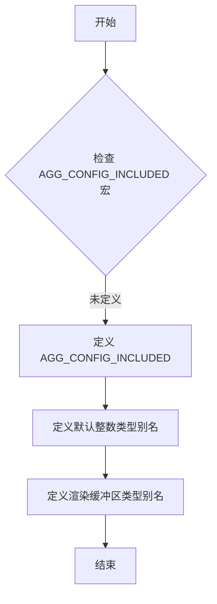

# `matplotlib\extern\agg24-svn\include\agg_config.h` 详细设计文档

AGG配置头文件，用于重新定义Anti-Grain Geometry库的基本数据类型和渲染缓冲区类型，允许用户根据编译器特性自定义整数类型和内存访问方式。

## 整体流程



## 类结构

```
无类层次结构（配置头文件）
仅包含预处理器宏定义和类型别名
```

## 全局变量及字段


    

## 全局函数及方法


## 关键组件


### AGG 基础类型重定义机制

允许用户重新定义 AGG 库的基本整数类型（INT8/INT8U/INT16/INT16U/INT32/INT32U/INT64/INT64U），以适配不支持64位整数的编译器，确保库在不同平台的可移植性。

### AGG_RENDERING_BUFFER 渲染缓冲区类型选择

提供两种渲染缓冲区实现：`row_ptr_cache<int8u>`适合大规模像素操作（如模糊、图像滤波）的快速访问；`row_accessor<int8u>`适合更廉价的创建和销毁（无内存分配）。用户可同时使用两者。

### 条件编译配置宏

通过 `#ifndef AGG_CONFIG_INCLUDED` / `#define AGG_CONFIG_INCLUDED` / `#endif` 保护机制，防止头文件被重复包含，确保配置只生效一次。

### pixfmt_rgba32 类型别名

基于 AGG_RENDERING_BUFFER 定义的默认渲染缓冲区类型，提供便捷的 rgba32 像素格式支持，简化常见图形操作。


## 问题及建议


### 已知问题

-   **文档不完整**：第2部分的注释句子被截断，"Provides faster access for massive pixel operations," 之后的内容缺失，句子不完整
-   **示例代码错误**：注释中建议使用 `#define AGG_INT64 unsigned` 作为示例，但 `unsigned` 不是一个完整的类型，应为 `unsigned int` 或 `unsigned long`
-   **缺乏类型安全**：使用 `#define` 宏定义类型而非 `typedef`，可能导致宏替换引发的意外行为和调试困难
-   **配置验证缺失**：没有对用户自定义类型进行编译时验证，若用户定义不兼容的类型，编译器只会给出难以理解的相关错误
-   **版本信息缺失**：配置文件没有版本号或变更日志，难以追踪配置选项的历史变更
-   **与现代C++特性不兼容**：未提供 `constexpr`、`using` 类型别名等现代C++特性支持，仍沿用纯C风格宏定义
-   **功能说明模糊**：注释提到 "You can still use both of them simultaneously"，但未说明具体使用场景和方式

### 优化建议

-   修复截断的注释内容，补充完整的说明文字
-   修正示例代码中的 `unsigned` 为 `unsigned int` 或 `unsigned long`
-   考虑添加 `typedef` 版本作为替代选项，或提供 C++ 版本的头文件
-   添加静态断言或类型检查机制，验证用户自定义类型的基本属性
-   在文件头部添加版本号和最后修改日期
-   增加更多可配置项，如内存对齐方式、色彩空间默认配置等
-   添加详细的使用示例和常见配置模板


## 其它


### 设计目标与约束

本配置文件旨在为AGG图形库提供编译时类型定制能力，允许用户根据目标平台和编译器特性自定义基本数据类型和渲染缓冲区实现，以平衡性能与兼容性。设计约束包括：必须保持与现有AGG接口的二进制兼容性；自定义类型必须满足AGG内部运算需求（如位宽要求）；配置必须在编译前完成，运行时不可更改。

### 错误处理与异常设计

由于本文件为纯宏定义配置，不涉及运行时错误处理。编译时错误需由用户自行保证：确保自定义类型位宽足够（建议INT64至少32位）；确保自定义类型支持无符号变体；渲染缓冲区类型必须符合AGG内部接口要求。编译器将报告类型不匹配错误。

### 外部依赖与接口契约

外部依赖包括目标编译器的C++标准支持程度和平台特性。接口契约如下：AGG_INT8/INT8U必须为带符号/无符号8位整型；AGG_INT16/INT16U必须为带符号/无符号16位整型；AGG_INT32/INT32U必须为带符号/无符号32位整型；AGG_INT64/INT64U必须为带符号/无符号至少32位整型；AGG_RENDERING_BUFFER必须符合row_ptr_cache或row_accessor模板接口。

### 平台兼容性说明

默认配置适用于主流编译器（GCC、Clang、MSVC）的现代版本。对于嵌入式平台（如8/16位微控制器），可能需要自定义INT64类型为int以避免64位支持。对于某些缺少无符号类型的古老编译器，可将AGG_INT64U定义为unsigned。

### 使用示例

典型使用场景包括：移动端优化可使用row_ptr_cache提升大规模像素操作性能；资源受限环境可使用row_accessor降低内存分配开销；跨平台项目可在项目级包含本文件的自定义版本。示例：#define AGG_INT64 long long用于MSVC旧版本。

### 版本信息与变更记录

当前版本对应AGG 2.x系列。本文件从AGG早期版本延续，主要变更为增加了更多默认类型支持和完善文档说明。无功能性变更，仅为配置能力的形式化文档。

    