# `matplotlib\extern\agg24-svn\include\agg_conv_adaptor_vcgen.h` 详细设计文档

Anti-Grain Geometry库中的一个模板适配器类，用于将顶点源（VertexSource）适配到生成器（Generator），支持可选的标记（Markers）功能，通过状态机机制累积顶点并传递给生成器处理，实现顶点数据的转换和过滤。

## 整体流程

```mermaid
graph TD
    A[开始 vertex(x, y)] --> B{状态 = initial?}
    B -- 是 --> C[清空标记]
    C --> D[获取起始顶点]
    D --> E[状态 = accumulate]
    B -- 否 --> F{状态 = accumulate?}
    F -- 是 --> G[遍历顶点源]
    G --> H{是顶点命令?}
    H -- 是 --> I[添加到生成器]
    H -- 否 --> J{是停止命令?}
    J -- 是 --> K[设置最后命令为停止]
    J -- 否 --> L{是多边形结束命令?}
    L -- 是 --> I
    K --> M[生成器rewind]
    M --> N[状态 = generate]
    F -- 否 --> O{状态 = generate?}
    O -- 是 --> P[从生成器获取顶点]
    P --> Q{是停止命令?}
    Q -- 是 --> R[状态 = accumulate]
    Q -- 否 --> S[返回顶点命令]
```

## 类结构

```
null_markers (空标记结构体)
conv_adaptor_vcgen<VertexSource, Generator, Markers> (模板适配器类)
```

## 全局变量及字段


### `conv_adaptor_vcgen.m_source`
    
指向顶点源对象的指针，用于提供原始顶点数据

类型：`VertexSource*`
    


### `conv_adaptor_vcgen.m_generator`
    
生成器实例，用于处理和转换顶点数据

类型：`Generator`
    


### `conv_adaptor_vcgen.m_markers`
    
标记器实例，用于记录路径的起始点和控制点

类型：`Markers`
    


### `conv_adaptor_vcgen.m_status`
    
内部状态机状态，表示当前处理阶段（初始、累积、生成）

类型：`status 枚举`
    


### `conv_adaptor_vcgen.m_last_cmd`
    
保存上一个读取到的路径命令类型

类型：`unsigned`
    


### `conv_adaptor_vcgen.m_start_x`
    
当前路径起始点的X坐标

类型：`double`
    


### `conv_adaptor_vcgen.m_start_y`
    
当前路径起始点的Y坐标

类型：`double`
    
    

## 全局函数及方法


### `null_markers.remove_all`

该方法是 `null_markers` 结构体的成员函数，是一个空实现（Null Object Pattern），用于清除所有标记点，实际上不执行任何操作。

参数：暂无参数

返回值：`void`，无返回值描述

#### 流程图

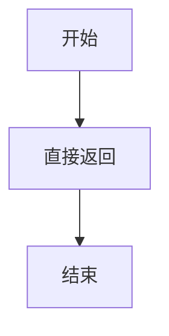

#### 带注释源码

```cpp
//------------------------------------------------------------null_markers
struct null_markers
{
    // 删除所有标记点的空实现方法
    // 该方法什么都不做，是一个Null Object模式的典型实现
    // 用于在不需要标记功能的场景下作为空操作
    void remove_all() {}

    void add_vertex(double, double, unsigned) {}
    void prepare_src() {}

    void rewind(unsigned) {}
    unsigned vertex(double*, double*) { return path_cmd_stop; }
};
```


### `null_markers.add_vertex`

该方法是 `null_markers` 结构体中的一个空操作（no-op）实现，作为标记器的占位符使用。它接收顶点坐标和路径命令参数，但不做任何处理直接返回。在 `conv_adaptor_vcgen` 模板类中作为默认模板参数使用，当不需要标记器功能时提供无操作的实现。

参数：

- `double`：第一个未命名的 `double` 类型参数，表示顶点的 x 坐标
- `double`：第二个未命名的 `double` 类型参数，表示顶点的 y 坐标
- `unsigned`：未命名的 `unsigned` 类型参数，表示路径命令（如 `path_cmd_move_to`、`path_cmd_line_to` 等）

返回值：`void`，无返回值

#### 流程图

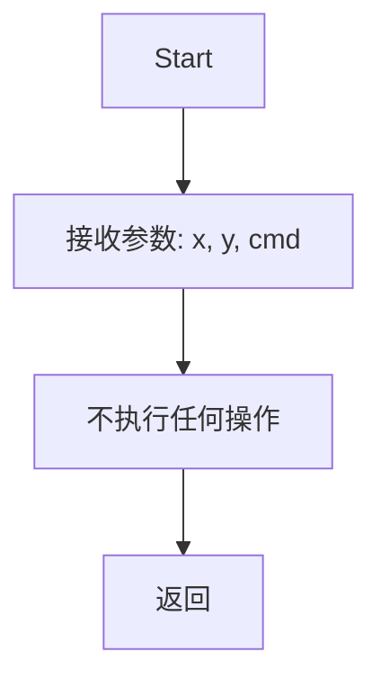

#### 带注释源码

```cpp
// null_markers 结构体的 add_vertex 方法
// 这是一个空实现，用于当不需要标记器时的默认占位符
void add_vertex(double, double, unsigned) {}
// 参数1: double - 顶点的X坐标（被忽略）
// 参数2: double - 顶点的Y坐标（被忽略）
// 参数3: unsigned - 路径命令类型（被忽略）
// 返回值: void - 无返回值
```


### `null_markers.prepare_src`

该方法是 `null_markers` 结构体的一个成员方法，作为空实现（no-op）存在。它在 `conv_adaptor_vcgen` 模板类中作为默认的 Markers 模板参数使用，满足接口契约但不做任何实际处理。

参数：无

返回值：`void`，无返回值

#### 流程图

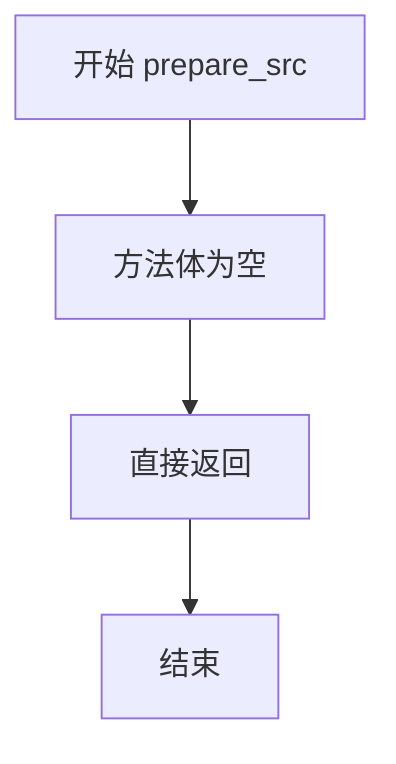

#### 带注释源码

```
// null_markers 结构体定义
// 这是一个空标记器实现，用于满足接口契约但不执行任何实际功能
struct null_markers
{
    // 移除所有标记（空实现）
    void remove_all() {}
    
    // 添加顶点到标记器（空实现）
    // 参数：x, y - 顶点坐标；cmd - 路径命令
    void add_vertex(double, double, unsigned) {}
    
    // 准备源数据（空实现）
    // 此方法在实际的标记器实现中可能用于预处理数据
    // 但在 null_markers 中为空实现
    void prepare_src() {}
    
    // 重置到指定路径（空实现）
    void rewind(unsigned) {}
    
    // 获取顶点（返回 path_cmd_stop）
    unsigned vertex(double*, double*) { return path_cmd_stop; }
};
```

#### 技术说明

`null_markers` 结构体在 `conv_adaptor_vcgen` 模板类中作为默认模板参数使用：

```cpp
template<class VertexSource, 
         class Generator, 
         class Markers=null_markers> class conv_adaptor_vcgen
```

当用户不需要标记器功能时，可以使用默认的 `null_markers`，它提供了一组接口方法但都是空实现，不会产生任何额外开销。这是一种典型的**策略模式**或**空对象模式**的应用。


### `null_markers::rewind`

该函数是 `null_markers` 结构体的成员方法，提供了一个空实现（stub），用于满足接口要求，不执行任何实际操作。

参数：

- `path_id`：`unsigned`，路径标识符，用于指定要回退的路径编号（在此空实现中未被使用）

返回值：`void`，无返回值

#### 流程图

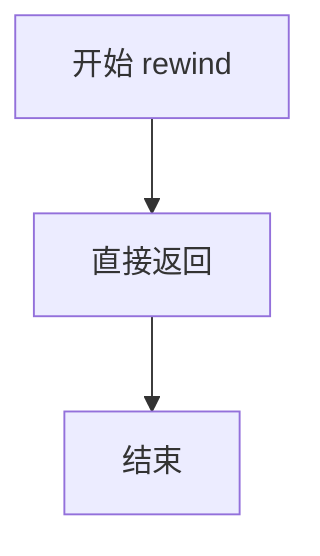

#### 带注释源码

```cpp
// null_markers 结构体定义
// 这是一个空标记器实现，用于满足接口契约而不执行任何实际操作
struct null_markers
{
    // 移除所有顶点 - 空实现
    void remove_all() {}
    
    // 添加顶点 - 空实现
    // 参数: x, y - 坐标值; cmd - 路径命令
    void add_vertex(double, double, unsigned) {}
    
    // 准备源数据 - 空实现
    void prepare_src() {}

    // 回退到路径起始位置 - 空实现
    // 参数: path_id - 路径标识符（在此实现中未使用）
    void rewind(unsigned) {}
    
    // 获取顶点 - 返回停止命令
    unsigned vertex(double*, double*) { return path_cmd_stop; }
};
```

#### 补充说明

此函数属于 Anti-Grain Geometry (AGG) 库中的 `null_markers` 结构体。该结构体作为一个空实现（Null Object 模式），用于在不需要标记功能的场景下作为模板参数传入，从而避免额外的条件判断开销。函数签名符合 `Markers` 模板参数的要求，但实际上是一个 no-op（空操作）。


### `null_markers.vertex`

该函数是 `null_markers` 结构体的一个成员方法，作为标记器（Markers）接口的空实现。它不执行任何实际操作，始终返回 `path_cmd_stop` 来表示没有更多的顶点可提供，常用作默认的标记器实现或占位符。

参数：

- `x`：`double*`，指向 `double` 类型的指针，用于输出顶点的 x 坐标（该实现中不写入任何有效值）
- `y`：`double*`，指向 `double` 类型的指针，用于输出顶点的 y 坐标（该实现中不写入任何有效值）

返回值：`unsigned`，返回 `path_cmd_stop` 常量，表示路径已结束，没有更多顶点

#### 流程图

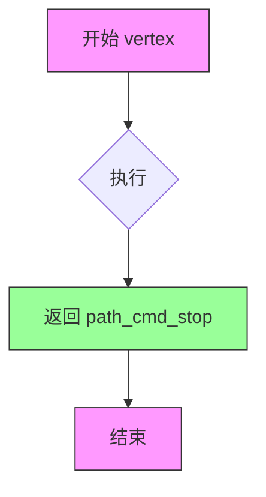

#### 带注释源码

```cpp
// null_markers 结构体的 vertex 方法
// 这是一个空实现，不产生任何顶点
unsigned vertex(double* x, double* y) 
{ 
    // 总是返回 path_cmd_stop，表示没有更多顶点
    // x 和 y 参数不会被修改，保持原值
    return path_cmd_stop; 
}
```


### `conv_adaptor_vcgen::conv_adaptor_vcgen(VertexSource&)`

这是一个模板类构造函数，用于初始化顶点源适配器，将外部的顶点源（VertexSource）连接到内部的生成器（Generator）和标记器（Markers），并设置初始状态为 initial。

参数：

-  `source`：`VertexSource&`，外部传入的顶点源引用，用于提供原始的顶点数据

返回值：无（构造函数），该函数为构造函数，不返回任何值

#### 流程图

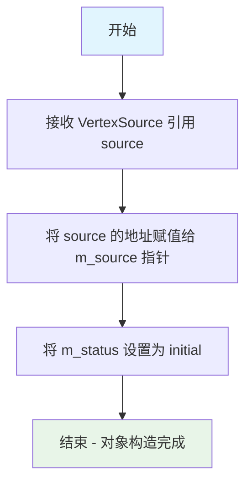

#### 带注释源码

```cpp
//----------------------------------------------------------------------------
// 构造函数：conv_adaptor_vcgen
// 功能：初始化适配器，连接顶点源并设置初始状态
//----------------------------------------------------------------------------
explicit conv_adaptor_vcgen(VertexSource& source) :  // 显式构造函数，接受顶点源引用
    m_source(&source),       // 将引用转换为指针并保存
    m_status(initial)        // 初始化状态机为 initial 状态
{}
```

#### 补充说明

这是 `conv_adaptor_vcgen` 模板类的构造函数，属于适配器模式（Adapter Pattern）的实现。该类的主要职责是：

1. **核心功能**：将 VertexSource（顶点源）适配为 Generator（生成器），在两者之间建立桥梁
2. **状态机**：内部维护三种状态（initial/accumulate/generate），用于分阶段处理顶点数据
3. **组件关系**：
   - `m_source`：指向外部的顶点源对象
   - `m_generator`：内部的生成器对象，负责生成转换后的顶点
   - `m_markers`：标记器，用于记录顶点标记信息

该构造函数是对象生命周期的起点，后续通过 `vertex()` 方法驱动整个适配器流程。


### `conv_adaptor_vcgen.attach`

该方法用于将外部的顶点源（VertexSource）对象附加到当前适配器中，更新内部维护的顶点源指针，使得适配器能够使用新的顶点源进行后续的顶点生成操作。

参数：

- `source`：`VertexSource&`，需要附加的顶点源对象的引用，该对象提供了路径顶点数据

返回值：`void`，无返回值

#### 流程图

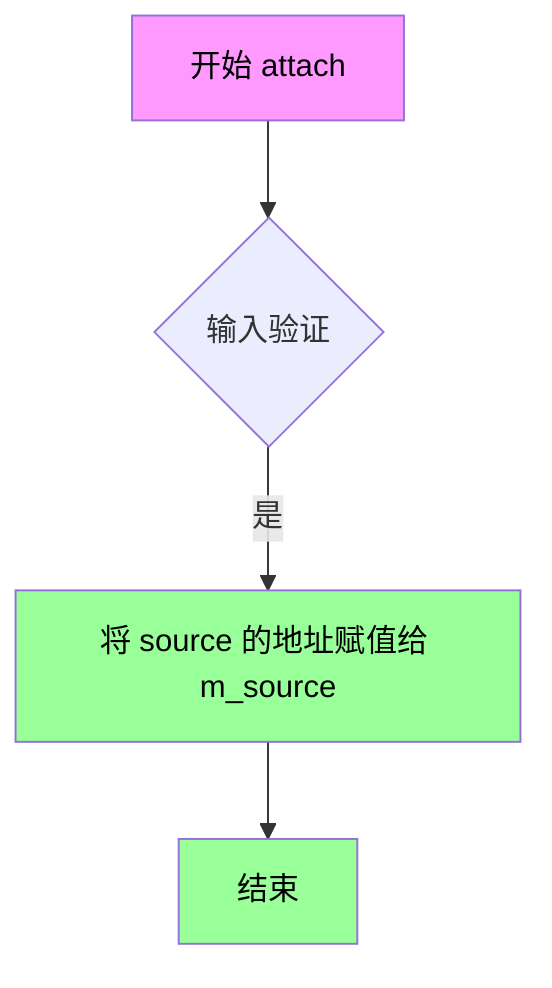

#### 带注释源码

```cpp
// 该方法属于 conv_adaptor_vcgen 模板类
// 参数：source - VertexSource 引用，要附加的顶点源
// 返回值：无
void attach(VertexSource& source) 
{ 
    // 将传入的 VertexSource 对象的地址赋值给成员指针 m_source
    // 这样适配器就可以使用新的顶点源进行顶点生成操作
    m_source = &source; 
}
```

#### 补充说明

该方法是类中简单的 setter 方法，主要用于：

1. **动态重新绑定**：允许在运行时更换顶点源，而无需创建新的适配器对象
2. **内存管理**：通过指针存储VertexSource，避免复制，同时保持灵活性
3. **设计考量**：结合类的构造函数（接受VertexSource引用），提供了两种初始化顶点源的方式


### `conv_adaptor_vcgen.generator()`

该函数是 `conv_adaptor_vcgen` 类的成员方法，用于获取内部 Generator 对象的引用，允许外部代码直接访问和操作底层生成器，实现适配器模式的核心接口。

参数：无

返回值：`Generator&`，返回内部 Generator 对象的非const引用，允许调用者修改生成器状态

#### 流程图

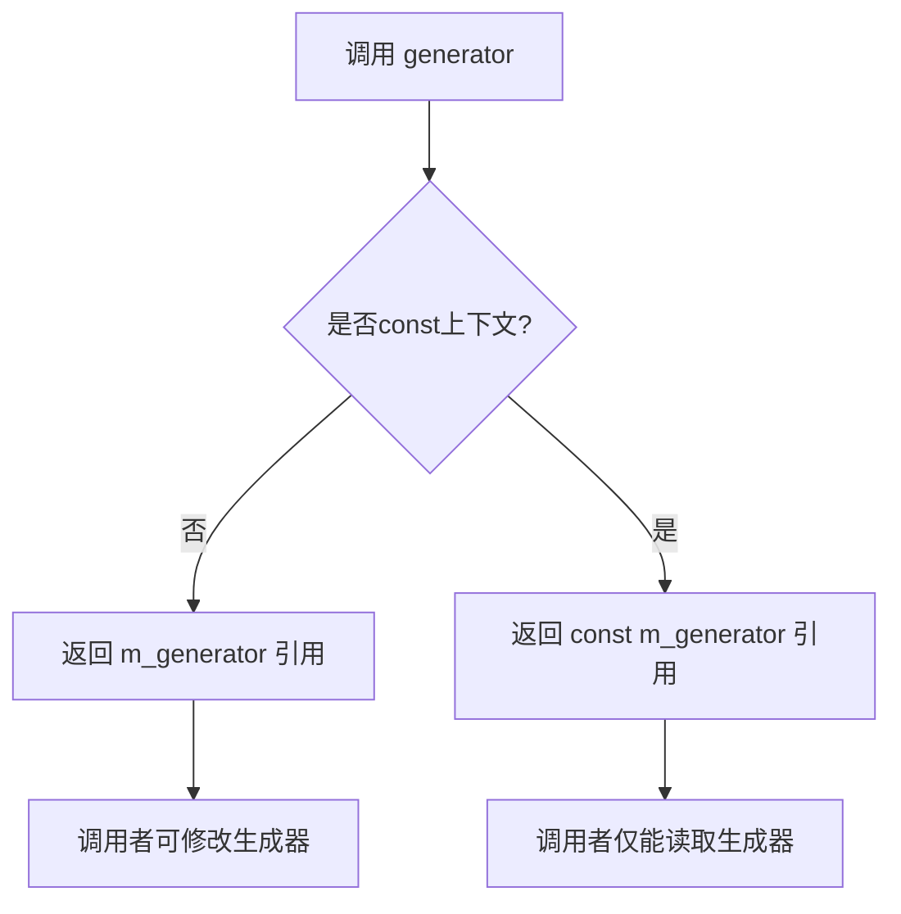

#### 带注释源码

```cpp
//----------------------------------------------------------------------------
// 获取内部 Generator 对象的引用
//----------------------------------------------------------------------------
Generator& generator() 
{ 
    // 返回成员变量 m_generator 的引用
    // 这允许外部代码直接访问和修改生成器对象
    return m_generator; 
}

//----------------------------------------------------------------------------
// 获取内部 Generator 对象的常量引用（const版本）
//----------------------------------------------------------------------------
const Generator& generator() const 
{ 
    // 返回常量引用，用于只读访问
    return m_generator; 
}
```

#### 补充说明

1. **设计目的**：提供对内部生成器的直接访问，使外部代码可以直接操作 Generator 对象，无需通过适配器的其他方法间接访问。

2. **使用场景**：当需要直接调用 Generator 的特定方法（如设置参数、获取状态等）时使用此函数。

3. **线程安全性**：返回的是原始引用而非副本，若在多线程环境下使用，需自行保证线程安全。

4. **潜在优化空间**：
   - 可考虑添加异常安全性保证（当前版本直接返回引用，无异常）
   - 可添加验证逻辑，确保返回的引用在对象生命周期内有效


### `conv_adaptor_vcgen.markers()`

该方法是 `conv_adaptor_vcgen` 模板类的成员函数，提供对内部 `Markers` 对象的访问接口。通过此方法，用户可以获取或修改与顶点生成器关联的标记器（markers）对象，用于在路径处理过程中标记特定的顶点位置。

参数：此方法无参数。

返回值：`Markers&`（非const版本）或 `const Markers&`（const版本），返回内部 `m_markers` 成员的引用。

#### 流程图

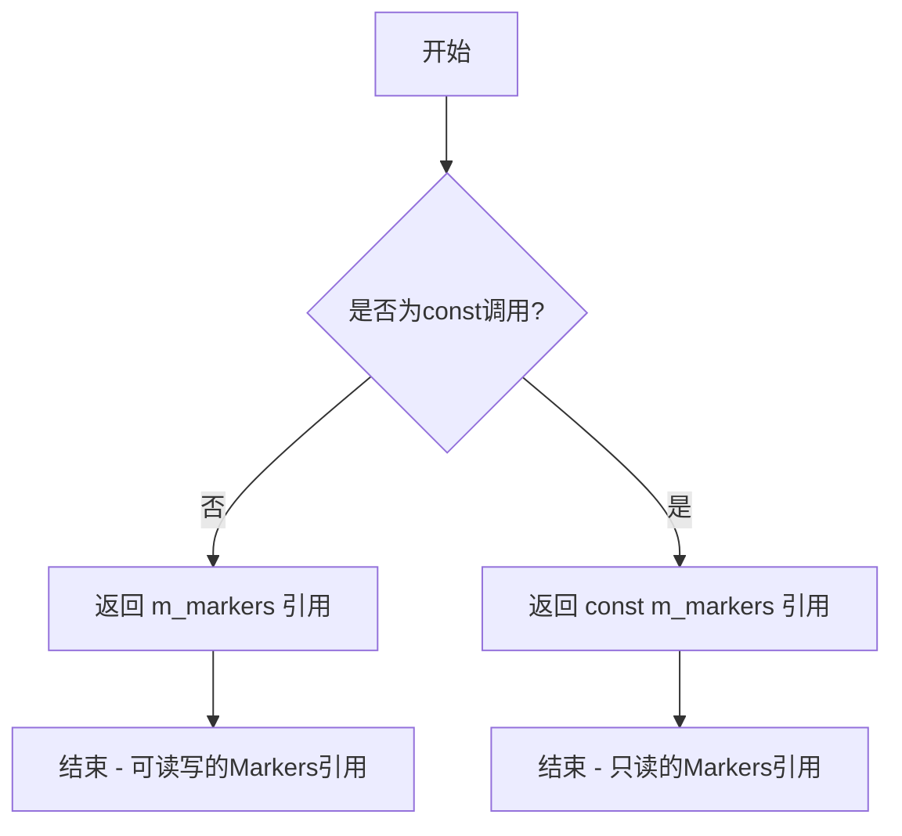

#### 带注释源码

```cpp
// 非const版本：返回可读写的Markers引用
Markers& markers() { return m_markers; }

// const版本：返回只读的Markers引用
const Markers& markers() const { return m_markers; }
```

**说明**：
- `markers()` 方法是对 `conv_adaptor_vcgen` 类中 `m_markers` 成员的访问器（getter）
- 提供了两个重载版本：非const版本返回可修改的引用，const版本返回只读引用
- `m_markers` 是 `Markers` 类型的成员变量，用于在顶点生成过程中记录和标记路径信息
- 此方法允许外部代码直接访问和操作标记器对象，如添加顶点、移除顶点等操作


### `conv_adaptor_vcgen.rewind`

重置适配器的状态，将源顶点重新回绕到指定路径ID，并初始化内部状态为初始状态，以便重新开始生成顶点。

参数：

- `path_id`：`unsigned`，指定要回绕到的路径标识符

返回值：`void`，无返回值

#### 流程图

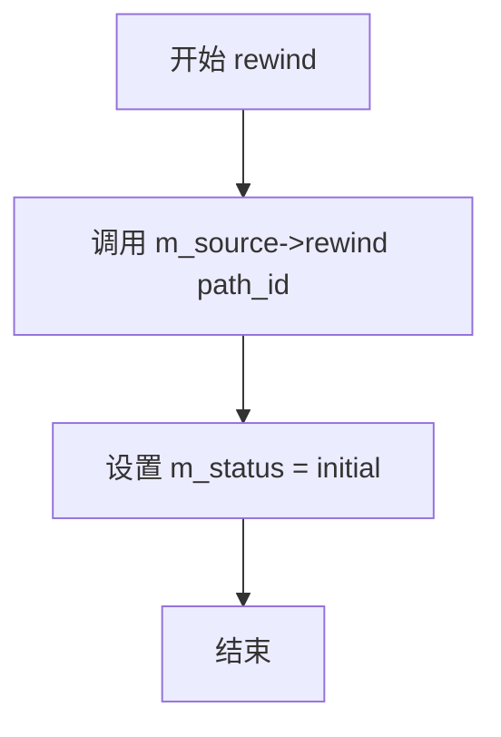

#### 带注释源码

```cpp
// 重置适配器状态，将源顶点回绕到指定路径
void rewind(unsigned path_id) 
{ 
    // 调用底层源对象的rewind方法，将顶点生成器回绕到指定路径
    m_source->rewind(path_id); 
    
    // 重置内部状态为initial，准备重新开始积累和生成顶点
    m_status = initial;
}
```

#### 备注

- 该方法是conv_adaptor_vcgen类的核心重置机制，用于支持多次遍历同一顶点源
- 通过将m_status重置为initial状态，使得后续调用vertex()方法时能够重新执行积累阶段
- 模板参数包括：VertexSource（顶点源）、Generator（生成器）、Markers（标记器）
- 内部状态机包含三个状态：initial（初始）、accumulate（积累）、generate（生成）


### `conv_adaptor_vcgen<VertexSource, Generator, Markers>::vertex`

该函数是 AGG 库中conv_adaptor_vcgen模板类的核心成员函数，实现了顶点适配器模式。它作为一个状态机运行，在"累积（accumulate）"阶段从顶点源收集顶点数据，在"生成（generate）"阶段通过生成器转换并输出顶点，实现了顶点数据的管道式处理。

参数：

- `x`：`double*`，输出参数，指向用于存储输出顶点 x 坐标的double类型指针
- `y`：`double*`，输出参数，指向用于存储输出顶点 y 坐标的double类型指针

返回值：`unsigned`，返回路径命令标识符（如 path_cmd_move_to、path_cmd_line_to、path_cmd_stop 等），表示当前返回的顶点类型或终止状态

#### 流程图

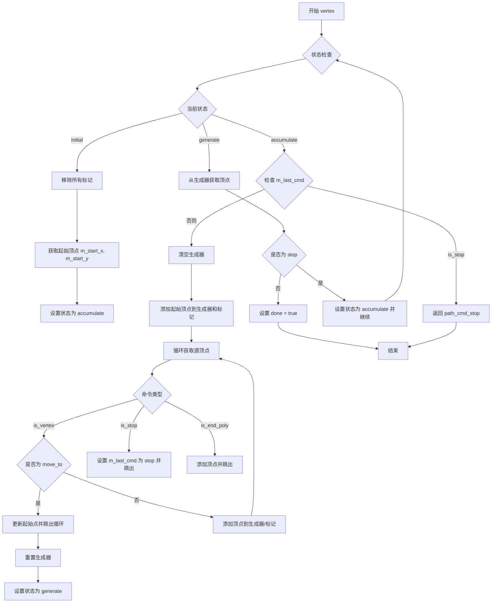

#### 带注释源码

```cpp
//------------------------------------------------------------------------
// conv_adaptor_vcgen 类的 vertex 方法实现
// 这是一个状态机实现的顶点适配器，用于将顶点源转换为生成器输出
//------------------------------------------------------------------------
template<class VertexSource, class Generator, class Markers> 
unsigned conv_adaptor_vcgen<VertexSource, Generator, Markers>::vertex(double* x, double* y)
{
    unsigned cmd = path_cmd_stop;    // 当前命令，初始化为停止命令
    bool done = false;               // 循环控制标志
    
    // 主循环：状态机处理
    while(!done)
    {
        switch(m_status)
        {
        // 状态1: initial - 初始状态，准备开始处理
        case initial:
            m_markers.remove_all();                       // 清除所有标记
            m_last_cmd = m_source->vertex(&m_start_x, &m_start_y);  // 获取第一个顶点作为起始点
            m_status = accumulate;                        // 切换到累积状态

        // 状态2: accumulate - 累积顶点阶段
        case accumulate:
            // 检查是否已经到达源顶点序列的末尾
            if(is_stop(m_last_cmd)) return path_cmd_stop;

            // 清空生成器，准备接收新的一组顶点
            m_generator.remove_all();
            
            // 将起始点添加到生成器和标记（作为 move_to 命令）
            m_generator.add_vertex(m_start_x, m_start_y, path_cmd_move_to);
            m_markers.add_vertex(m_start_x, m_start_y, path_cmd_move_to);

            // 循环遍历源顶点的其余部分
            for(;;)
            {
                cmd = m_source->vertex(x, y);  // 从源获取下一个顶点
                
                if(is_vertex(cmd))  // 如果是顶点命令
                {
                    m_last_cmd = cmd;  // 更新最后的命令
                    
                    if(is_move_to(cmd))  // 如果是移动命令（新路径开始）
                    {
                        m_start_x = *x;   // 更新起始点坐标
                        m_start_y = *y;
                        break;            // 跳出当前循环，准备处理新路径
                    }
                    
                    // 添加顶点到生成器，标记为 line_to
                    m_generator.add_vertex(*x, *y, cmd);
                    m_markers.add_vertex(*x, *y, path_cmd_line_to);
                }
                else  // 非顶点命令（可能是命令标记）
                {
                    if(is_stop(cmd))  // 如果是停止命令
                    {
                        m_last_cmd = path_cmd_stop;
                        break;
                    }
                    
                    if(is_end_poly(cmd))  // 如果是多边形结束命令
                    {
                        m_generator.add_vertex(*x, *y, cmd);
                        break;
                    }
                }
            }
            
            // 准备生成器，开始生成阶段
            m_generator.rewind(0);
            m_status = generate;

        // 状态3: generate - 生成输出顶点阶段
        case generate:
            cmd = m_generator.vertex(x, y);  // 从生成器获取转换后的顶点
            
            if(is_stop(cmd))  // 如果生成器已完成当前批次
            {
                m_status = accumulate;  // 回到累积状态，处理下一批顶点
                break;
            }
            
            done = true;  // 标记完成，返回当前顶点
            break;
        }
    }
    
    return cmd;  // 返回当前的路径命令
}
```

## 关键组件


### null_markers 结构体
一个空标记实现，提供无操作的标记接口，用于不需要标记的转换场景。

### conv_adaptor_vcgen 类模板
一个通用的路径转换适配器模板，将顶点源通过生成器转换为新的顶点序列，支持可选的标记功能。

### status 枚举
定义了适配器内部状态机，包括初始(initial)、累积(accumulate)和生成(generate)三种状态，控制顶点处理流程。

### vertex 方法
核心顶点生成方法，通过状态机遍历输入顶点并调用生成器输出转换后的顶点序列。

### attach 方法
将新的顶点源绑定到适配器，允许动态更换输入数据源。

### rewind 方法
重置适配器内部状态，将遍历位置重置到指定路径的起点。


## 问题及建议


### 已知问题

- **switch-case没有break语句**：在vertex()方法的switch中，initial和accumulate状态执行完后没有break，会自动fall-through到下一个case，这种写法容易造成误读，且C++标准中case标签后的声明可能会导致编译问题
- **m_last_cmd未初始化**：虽然有m_last_cmd成员变量，但在initial状态第一次使用前没有明确的初始值设置，可能导致未定义行为
- **指针悬空风险**：m_source是原始指针，如果外部传入的VertexSource对象被销毁但conv_adaptor_vcgen仍被使用，会产生悬空指针
- **const正确性缺失**：没有提供const版本的vertex()方法和rewind()方法，无法在const对象上调用
- **移动语义缺失**：C++11后应支持移动构造和移动赋值，但当前显式禁止复制而未实现移动语义
- **参数类型落后**：使用double*作为输出参数，不符合现代C++风格（应使用引用或返回值）
- **状态机逻辑复杂**：vertex()函数过长（约50行），混合了状态处理、顶点累加和生成逻辑，职责不单一

### 优化建议

- **添加break语句或重构状态机**：将switch-case明确化，或考虑使用状态模式/函数指针表来提高可读性
- **使用智能指针管理资源**：将m_source改为shared_ptr或weak_ptr，增强生命周期安全性
- **添加const方法**：为vertex()、rewind()等方法添加const重载版本
- **支持移动语义**：添加移动构造函数和移动赋值运算符
- **改进API设计**：使用double&替代double*，或返回pair<double, double>以符合现代C++风格
- **拆分vertex()方法**：将累加和生成逻辑分离到私有方法中，提高代码可维护性
- **增强类型安全**：考虑将null_markers改为模板空基类或使用std::tuple_element技巧

## 其它


### 设计目标与约束

该组件是AGG库中几何处理流水线的一部分，设计目标是将任意顶点源（VertexSource）的路径数据适配并转换为生成器（Generator）的输出格式。约束条件包括：模板参数VertexSource必须提供vertex()和rewind()接口，Generator必须支持add_vertex()、remove_all()和rewind()接口，Markers默认为null_markers（无操作标记器）。

### 错误处理与异常设计

该代码采用非异常设计模式，不抛出任何异常。错误通过返回值处理：path_cmd_stop表示结束，is_stop()、is_vertex()、is_move_to()、is_end_poly()等辅助函数用于检测各种路径命令。空指针检查通过attach()函数重置m_source指针实现。状态机会在异常情况下进入accumulate状态等待恢复。

### 数据流与状态机

conv_adaptor_vcgen实现了双状态机：外部状态机（initial/accumulate/generate）控制主循环，内部状态由Generator管理。数据流：VertexSource → (m_start_x, m_start_y) → Generator → 输出顶点。状态转换：initial → accumulate（首次调用）→ generate（Generator准备完毕）→ accumulate（Generator耗尽）→ 循环。

### 外部依赖与接口契约

主要依赖：agg_basics.h提供基础类型和路径命令常量。VertexSource接口要求：void rewind(unsigned path_id)、unsigned vertex(double* x, double* y)。Generator接口要求：void remove_all()、void add_vertex(double x, double y, unsigned cmd)、void rewind(unsigned)、unsigned vertex(double* x, double* y)。Markers接口要求：void remove_all()、void add_vertex(double, double, unsigned)、void prepare_src()、void rewind(unsigned)、unsigned vertex(double*, double*)。

### 性能考虑

该实现针对实时渲染优化，使用内联状态切换避免函数指针调用。m_status成员使状态机具有确定性，累积阶段连续读取源顶点避免频繁状态切换。Generator被复用而非每帧重建，减少内存分配。标记器操作在累积阶段批量完成。

### 线程安全性

该类非线程安全。多个线程同时访问同一conv_adaptor_vcgen实例会导致状态机混乱。如需多线程使用，每个线程应拥有独立实例。m_source、m_generator、m_markers等成员均为可变状态。

### 内存管理

所有成员均为值类型或指针，无动态内存分配（除非Generator/Markers自身分配）。Generator和Markers作为成员对象直接存储，生命周期与conv_adaptor_vcgen相同。m_source仅为指针引用，不管理其生命周期，调用者负责确保source有效性。

### 兼容性

代码符合C++98标准，使用模板实现多态。无平台特定代码，可跨平台移植。命名空间agg避免全局命名冲突。提供了禁止拷贝的防护措施（私有拷贝构造和赋值运算符）。

### 使用示例

典型用法：创建conv_adaptor_vcgen实例，attach顶点源，循环调用vertex()获取变换后的顶点。Generator可以是曲线生成器、轮廓转换器等几何处理器。Markers可配合stroke_gen用于记录端点/控制点。

### 配置选项

模板参数VertexSource：顶点源类型。模板参数Generator：生成器类型。模板参数Markers：标记器类型（默认null_markers）。成员函数attach()：动态更换顶点源。成员函数generator()：访问底层生成器。成员函数markers()：访问标记器。

### 边界条件处理

空路径处理：is_stop(m_last_cmd)检测并返回path_cmd_stop。单个顶点处理：move_to后立即遇到下一个move_to会正确截断当前路径。Stop命令传播：源顶点流中的stop命令正确传递到生成器。End_poly处理：保持多边形闭合命令。初始状态：构造函数将m_status设为initial确保首次调用正确初始化。

### 关键组件信息

null_markers：无操作标记器实现，提供空接口满足模板默认参数需求。conv_adaptor_vcgen：核心适配器类，实现顶点源到生成器的转换。status枚举：管理内部状态机（initial/accumulate/generate）。m_last_cmd：记录上一个路径命令用于状态判断。m_start_x/m_start_y：记录当前子路径起点。

### 潜在技术债务与优化空间

1. 状态机使用switch-case而非函数指针表，扩展性有限；2. 未使用const正确性（vertex函数参数为指针而非const）；3. 缺乏单元测试覆盖验证；4. 错误处理信息有限，难以调试；5. 模板实例化可能导致代码膨胀；6. 可考虑添加异常安全保证；7. 可添加constexpr支持编译期计算。


    