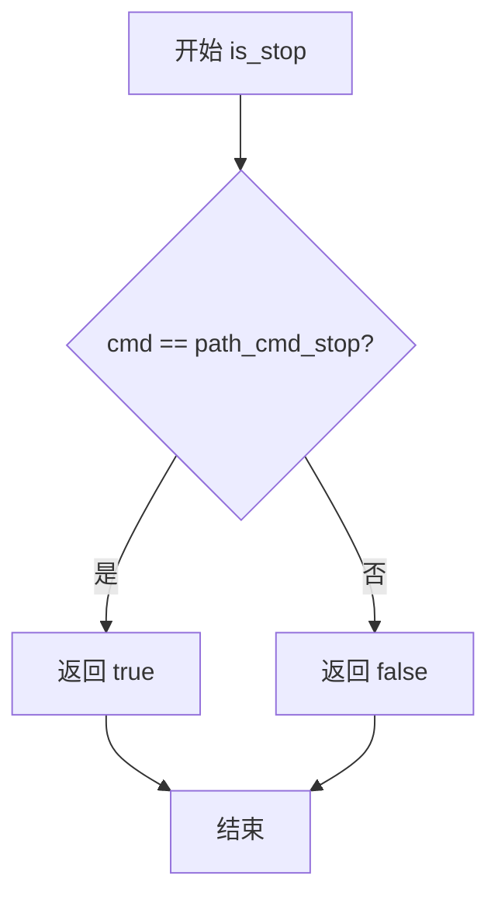
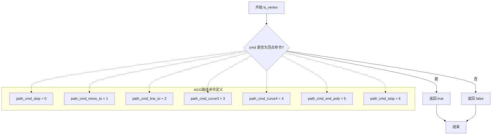
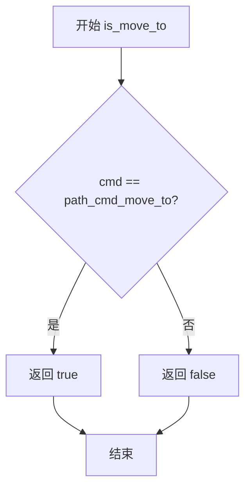
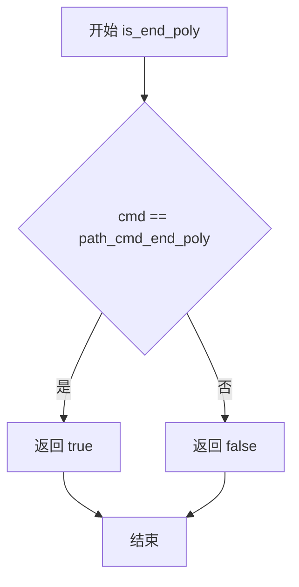
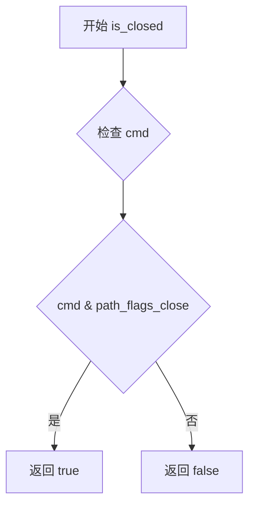
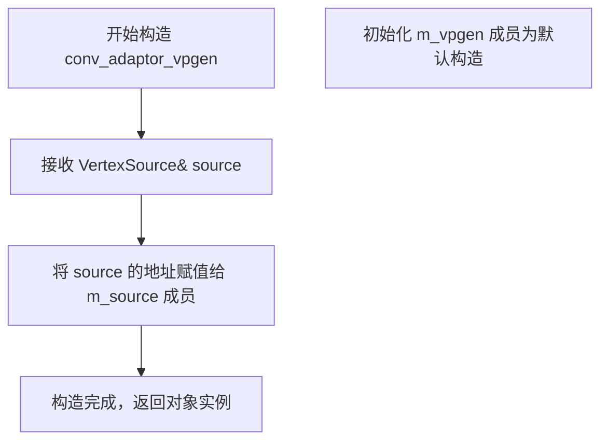
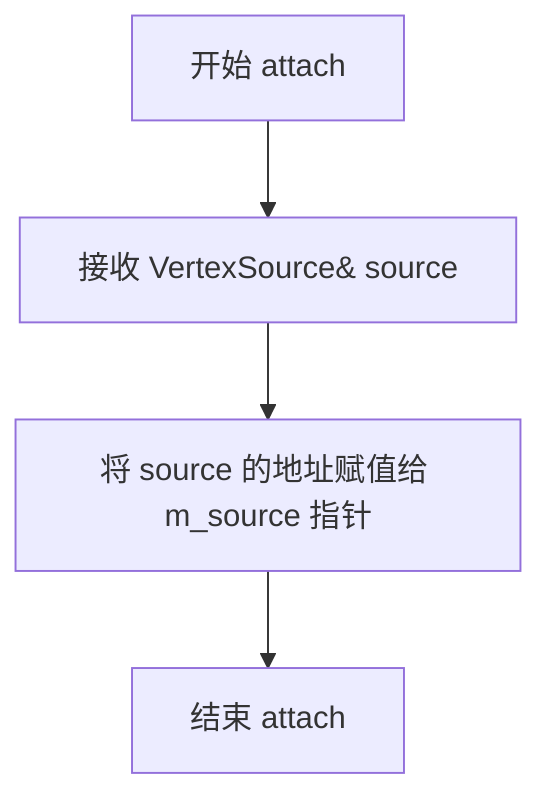
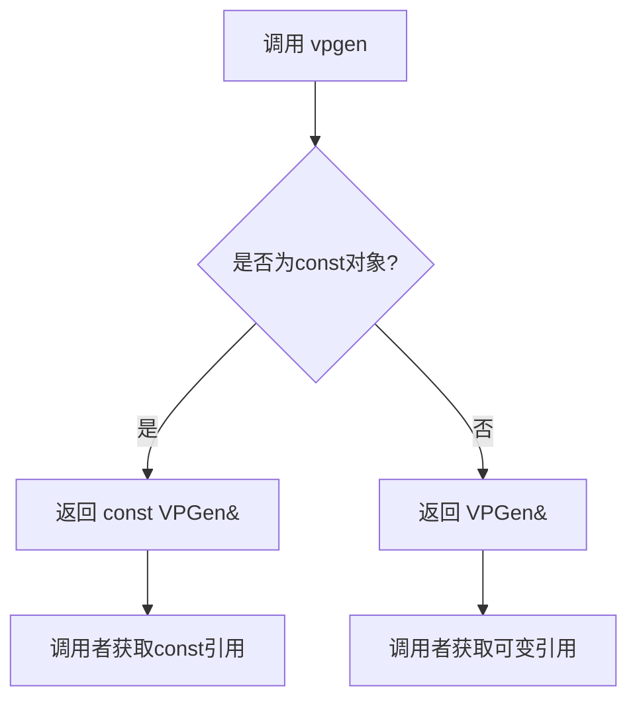
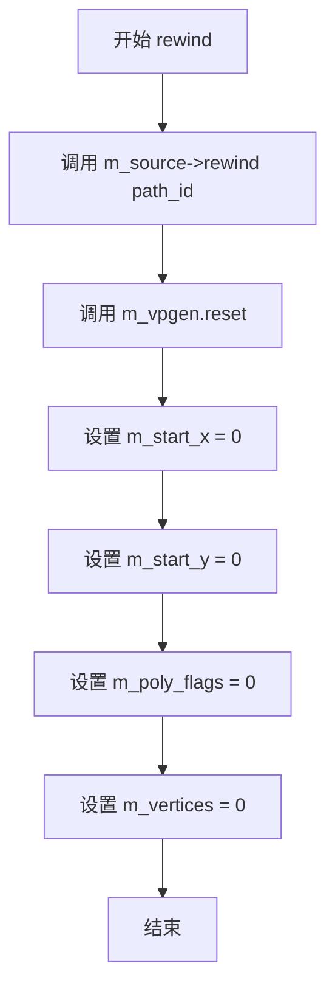
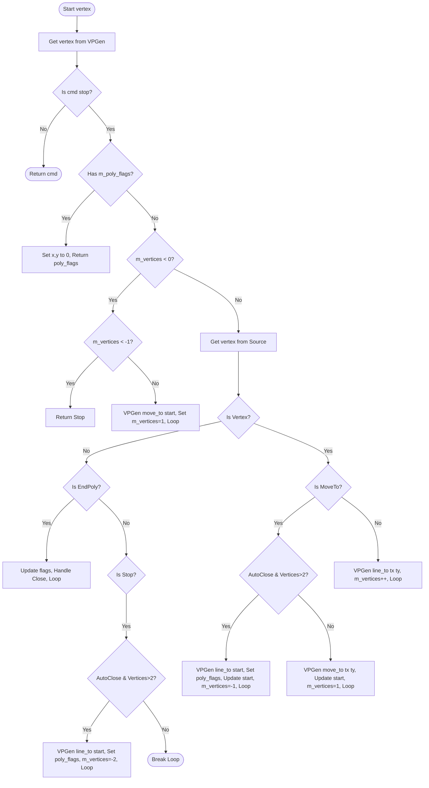

# `matplotlib\extern\agg24-svn\include\agg_conv_adaptor_vpgen.h` 详细设计文档

这是 Anti-Grain Geometry (AGG) 库中的一个模板适配器类，用于连接顶点源(VertexSource)和视口生成器(VPGen)，实现多边形的自动闭合、路径命令处理和顶点坐标转换，是2D图形渲染管道中的关键组件。

## 整体流程

```mermaid
graph TD
    A[开始 - 调用 rewind] --> B[重置 VPGen]
    B --> C[初始化坐标和标志]
    C --> D[调用 vertex(x, y)]
    D --> E{VPGen 有顶点?}
    E -- 是 --> F[返回顶点命令]
    E -- 否 --> G{检查多边形标志}
    G --> H{需要自动闭合?}
    H -- 是 --> I[添加闭合顶点]
    I --> J[获取源顶点]
    J --> K{是 move_to?}
    K -- 是 --> L[调用 VPGen move_to]
    K -- 否 --> M[调用 VPGen line_to]
    L --> N[保存起始点]
    M --> O[增加顶点数]
    O --> D
    N --> D
    H -- 否 --> J
```

## 类结构

```
agg (命名空间)
└── conv_adaptor_vpgen<VertexSource, VPGen> (模板适配器类)
    ├── 模板参数: VertexSource (顶点源接口)
    └── 模板参数: VPGen (视口生成器接口)
```

## 全局变量及字段


### `conv_adaptor_vpgen<VertexSource, VPGen>`
    
将顶点源适配到视口生成器的模板类，实现路径迭代和顶点处理逻辑

类型：`template class`
    


### `conv_adaptor_vpgen<VertexSource, VPGen>.m_source`
    
指向顶点源的指针，用于获取原始顶点数据

类型：`VertexSource*`
    


### `conv_adaptor_vpgen<VertexSource, VPGen>.m_vpgen`
    
视口生成器实例，负责生成最终的处理后的顶点

类型：`VPGen`
    


### `conv_adaptor_vpgen<VertexSource, VPGen>.m_start_x`
    
当前多边形起始点的X坐标，用于自动闭合多边形

类型：`double`
    


### `conv_adaptor_vpgen<VertexSource, VPGen>.m_start_y`
    
当前多边形起始点的Y坐标，用于自动闭合多边形

类型：`double`
    


### `conv_adaptor_vpgen<VertexSource, VPGen>.m_poly_flags`
    
多边形标志位，存储结束多边形命令和闭合状态

类型：`unsigned`
    


### `conv_adaptor_vpgen<VertexSource, VPGen>.m_vertices`
    
顶点计数，用于跟踪当前多边形的顶点数，负值表示需要自动闭合

类型：`int`
    
    

## 全局函数及方法


```xml

### `is_stop`

判断给定的路径命令标识是否为停止命令（path_cmd_stop）。

参数：

-  `cmd`：`unsigned`，路径命令标识，用于判断是否为停止命令

返回值：`bool`，如果命令标识等于 `path_cmd_stop`（停止命令）则返回 `true`，否则返回 `false`

#### 流程图



#### 带注释源码

```cpp
//----------------------------------------------------------------------------
// Anti-Grain Geometry - Version 2.4
// Copyright (C) 2002-2005 Maxim Shemanarev (http://www.antigrain.com)
//
// Permission to copy, use, modify, sell and distribute this software 
// is granted provided this copyright notice appears in all copies. 
// This software is provided "as is" without express or implied
// warranty, and with no claim as to its suitability for any purpose.
//----------------------------------------------------------------------------

// 在 agg_basics.h 中定义（需要查看该文件获取完整源码）
// is_stop 函数用于判断给定的路径命令标识是否为停止命令

// 典型的实现方式如下（在 agg_basics.h 中定义）：
/*
    inline bool is_stop(unsigned cmd)
    {
        // path_cmd_stop 通常定义为 0
        // 判断命令标识是否等于停止命令
        return cmd == path_cmd_stop;
    }
*/

// 在 conv_adaptor_vpgen::vertex 方法中的使用示例：
/*
    unsigned cmd = path_cmd_stop;
    for(;;)
    {
        cmd = m_vpgen.vertex(x, y);
        // 判断获取到的命令是否为停止命令
        // 如果不是停止命令，则跳出循环
        if(!is_stop(cmd)) break;
        
        // ... 其他处理逻辑
    }
*/
```

#### 补充说明

`is_stop` 函数是在 `agg_basics.h` 头文件中定义的辅助函数，用于判断路径命令是否为停止命令。在 `conv_adaptor_vpgen` 类的 `vertex` 方法中，通过循环调用 `m_vpgen.vertex()` 获取命令，并使用 `is_stop()` 判断是否为停止命令，如果不是则退出循环，如果是则继续处理下一个顶点或执行其他逻辑（如自动闭合多边形等）。

该函数是 AGG（Anti-Grain Geometry）库中路径命令判断系列函数之一，同系列函数还包括：
- `is_vertex(cmd)` - 判断是否为顶点命令
- `is_move_to(cmd)` - 判断是否为移动命令
- `is_line_to(cmd)` - 判断是否为画线命令
- `is_end_poly(cmd)` - 判断是否为结束多边形命令
```

```


### `is_vertex(unsigned cmd)`

该全局函数是 Anti-Grain Geometry (AGG) 库中的路径命令判断辅助函数，用于判断传入的无符号整数值是否表示一个顶点命令（如 move_to、line_to、curve 等绘图命令）。

参数：

- `cmd`：`unsigned`，路径命令标识符，用于表示不同的路径操作类型（如 move_to、line_to、stop 等）

返回值：`bool`，如果 `cmd` 是顶点命令（如 `path_cmd_move_to`、`path_cmd_line_to`、`path_cmd_curve3`、`path_cmd_curve4` 等）则返回 `true`，否则返回 `false`

#### 流程图



#### 带注释源码

```cpp
//----------------------------------------------------------------------------
// Anti-Grain Geometry - Version 2.4
//----------------------------------------------------------------------------
// is_vertex - 判断是否为顶点命令
//----------------------------------------------------------------------------

// 在 AGG 中，路径命令定义为枚举值：
// path_cmd_stop     = 0,  // 停止命令，非顶点
// path_cmd_move_to = 1,  // 移动到命令，顶点
// path_cmd_line_to = 2,  // 直线到命令，顶点
// path_cmd_curve3  = 3,  // 二次贝塞尔曲线命令，顶点
// path_cmd_curve4  = 4,  // 三次贝塞尔曲线命令，顶点
// path_cmd_end_poly= 5,  // 结束多边形命令，非顶点
// path_cmd_stop    = 6   // 停止命令，非顶点

// is_vertex 函数的典型实现（在 agg_basics.h 中定义）：
inline bool is_vertex(unsigned cmd)
{
    // 顶点命令的定义范围是从 path_cmd_move_to (1) 到 path_cmd_curve4 (4)
    // 使用命令与 path_cmd_curve4 的比较来判断
    // 如果 cmd 在 1-4 范围内（包括 move_to, line_to, curve3, curve4）
    // 则认为是顶点命令
    return cmd >= path_cmd_move_to && cmd <= path_cmd_curve4;
}

// 在 conv_adaptor_vpgen::vertex() 中的调用示例：
/*
unsigned conv_adaptor_vpgen<VertexSource, VPGen>::vertex(double* x, double* y)
{
    unsigned cmd = path_cmd_stop;
    for(;;)
    {
        cmd = m_vpgen.vertex(x, y);
        if(!is_stop(cmd)) break;
        // ... 其他逻辑 ...
        
        cmd = m_source->vertex(&tx, &ty);
        if(is_vertex(cmd))  // <--- 这里调用 is_vertex 判断是否为顶点命令
        {
            if(is_move_to(cmd)) 
            {
                // 处理 move_to 命令
                m_vpgen.move_to(tx, ty);
                m_start_x  = tx;
                m_start_y  = ty;
                m_vertices = 1;
            }
            else 
            {
                // 处理其他顶点命令（如 line_to）
                m_vpgen.line_to(tx, ty);
                ++m_vertices;
            }
        }
        else
        {
            // 处理非顶点命令（如 end_poly, stop）
            // ...
        }
    }
    return cmd;
}
*/
```


### `is_move_to(unsigned)`

判断给定的路径命令标识符是否为移动命令（move_to），用于在顶点生成过程中识别并处理移动指令。

参数：

- `cmd`：`unsigned`，路径命令标识符，用于表示不同的路径操作命令（如 move_to、line_to、close 等）

返回值：`bool`，如果命令标识符表示移动命令（path_cmd_move_to）则返回 true，否则返回 false

#### 流程图



#### 带注释源码

```
// is_move_to 函数通常定义在 agg_basics.h 中
// 这是一个内联辅助函数，用于检查路径命令是否为 move_to 命令
//
// 参数:
//   cmd - 路径命令标识符 (unsigned 类型)
// 返回值:
//   bool - 如果 cmd 等于 path_cmd_move_to 则返回 true，否则返回 false
//
// 在 conv_adaptor_vpgen::vertex 中的使用示例:
// 
//     unsigned cmd = m_source->vertex(&tx, &ty);
//     if(is_vertex(cmd))
//     {
//         if(is_move_to(cmd))  // <-- 使用 is_move_to 判断是否为移动命令
//         {
//             if(m_vpgen.auto_close() && m_vertices > 2)
//             {
//                 m_vpgen.line_to(m_start_x, m_start_y);
//                 m_poly_flags = path_cmd_end_poly | path_flags_close;
//                 m_start_x    = tx;
//                 m_start_y    = ty;
//                 m_vertices   = -1;
//                 continue;
//             }
//             m_vpgen.move_to(tx, ty);
//             m_start_x  = tx;
//             m_start_y  = ty;
//             m_vertices = 1;
//         }
//         else 
//         {
//             m_vpgen.line_to(tx, ty);
//             ++m_vertices;
//         }
//     }
//
// 该函数的作用是区分路径的起点（move_to）和其他顶点（line_to），
// 以便在顶点生成器中正确处理多边形的开启和连接操作。
```

#### 备注

由于 `is_move_to` 函数定义在 `agg_basics.h` 头文件中（该文件在此代码中通过 `#include "agg_basics.h"` 引入），其完整源代码不在此文件中。该函数通常是一个简单的内联函数或宏定义，用于将命令标识符与 `path_cmd_move_to` 常量进行比较。在 `conv_adaptor_vpgen` 类的 `vertex` 方法中，此函数用于区分移动命令和其他路径命令，从而实现对多边形顶点的正确处理。


### `is_end_poly`

该函数用于判断给定的路径命令标识符是否为结束多边形命令（path_cmd_end_poly），是 Anti-Grain Geometry 库中路径命令判断工具函数之一。

参数：

- `cmd`：`unsigned`，路径命令标识符，用于判断是否为结束多边形命令

返回值：`bool`，如果输入的命令是结束多边形命令（path_cmd_end_poly）则返回 true，否则返回 false

#### 流程图



#### 带注释源码

```cpp
// 该函数通常定义在 agg_basics.h 中
// 用于判断给定的路径命令是否为结束多边形命令

// 假设定义如下：
inline bool is_end_poly(unsigned cmd)
{
    // path_cmd_end_poly 是结束多边形的命令标识符
    // 该函数检查传入的 cmd 是否等于 path_cmd_end_poly
    return cmd == path_cmd_end_poly;
}

// 在 conv_adaptor_vpgen 中的使用示例：
/*
if(is_end_poly(cmd))  // 判断当前命令是否为结束多边形命令
{
    m_poly_flags = cmd;  // 保存命令标志
    if(is_closed(cmd) || m_vpgen.auto_close())  // 如果是多边形闭合或自动闭合
    {
        if(m_vpgen.auto_close()) m_poly_flags |= path_flags_close;  // 添加闭合标志
        if(m_vertices > 2)  // 如果顶点数大于2
        {
            m_vpgen.line_to(m_start_x, m_start_y);  // 闭合多边形
        }
        m_vertices = 0;  // 重置顶点数
    }
}
*/
```


### `is_closed`

该函数是AGG（Anti-Grain Geometry）库中的一个辅助函数，用于判断给定的路径命令是否表示闭合多边形（closed polygon）。在 `conv_adaptor_vpgen` 类的 `vertex` 方法中，当接收到 `path_cmd_end_poly` 命令时，调用此函数来判断多边形是否需要闭合。

参数：

- `cmd`：`unsigned`，路径命令标识符，用于判断该命令是否为闭合多边形的命令（如 `path_cmd_end_poly | path_flags_close`）

返回值：`bool`，返回 true 表示该命令表示闭合多边形，返回 false 表示不闭合。

#### 流程图



#### 带注释源码

由于 `is_closed` 函数定义在 `agg_basics.h` 头文件中（当前代码段未包含其实现），以下是基于代码上下文的推断实现：

```cpp
//----------------------------------------------------------------------------
// 判断路径命令是否为闭合多边形命令
//----------------------------------------------------------------------------
inline bool is_closed(unsigned cmd)
{
    // path_cmd_end_poly = 4 (命令编号)
    // path_flags_close = 1 (闭合标志)
    // 如果命令是 end_poly 并且包含 close 标志，则返回 true
    return (cmd & path_cmd_end_poly) != 0 && 
           (cmd & path_flags_close) != 0;
}
```

**注意**：该函数是AGG库的内联函数，定义在 `agg_basics.h` 中。在当前 `conv_adaptor_vpgen.cpp` 文件中仅对其进行了调用，用于判断当接收到 `path_cmd_end_poly` 命令时，多边形路径是否需要闭合。如果 `is_closed(cmd)` 返回 true，或者 `m_vpgen.auto_close()` 为 true，则表示需要自动闭合路径。


### `conv_adaptor_vpgen<VertexSource, VPGen>.conv_adaptor_vpgen(VertexSource&)`

构造函数，用于构造一个conv_adaptor_vpgen适配器实例，将传入的VertexSource对象引用绑定到内部成员指针。

参数：

- `source`：`VertexSource&`，VertexSource对象的引用，用于初始化适配器的顶点源

返回值：无（构造函数，隐式返回构造的对象实例）

#### 流程图



#### 带注释源码

```cpp
// 构造函数声明（在类定义内部）
explicit conv_adaptor_vpgen(VertexSource& source) : m_source(&source) {}

/*
 * 详细说明：
 * - explicit 关键字防止隐式类型转换
 * - 参数 source 是 VertexSource 的引用（非拥有语义）
 * - 初始化列表中将 source 的地址赋值给 m_source 指针成员
 * - m_vpgen 成员使用默认构造进行初始化
 * - 其他成员（m_start_x, m_start_y, m_poly_flags, m_vertices）使用默认构造
 * - 无返回值（构造函数）
 */
```


### `conv_adaptor_vpgen<VertexSource, VPGen>::attach`

附加顶点源到适配器，将内部存储的顶点源指针替换为新的顶点源引用，实现动态切换顶点数据源的功能。

参数：

- `source`：`VertexSource&`，要附加的顶点源引用，用于替换适配器内部现有的顶点源

返回值：`void`，无返回值

#### 流程图



#### 带注释源码

```cpp
//----------------------------------------------------------------------------
// Anti-Grain Geometry - Version 2.4
// 附加顶点源方法实现
//----------------------------------------------------------------------------

/**
 * @brief 附加顶点源到适配器
 * 
 * 将新的顶点源附加到适配器，替换内部存储的 m_source 指针。
 * 这允许在运行时动态切换顶点数据源，而无需重新创建适配器对象。
 *
 * @param source 要附加的顶点源引用，必须保持有效直到不再需要适配器
 */
void attach(VertexSource& source) 
{ 
    // 将传入的顶点源引用地址赋值给成员指针 m_source
    // 替换之前附加的顶点源
    m_source = &source; 
}
```


### `conv_adaptor_vpgen<VertexSource, VPGen>::vpgen`

获取内部 VPGen（顶点生成器）引用，允许外部直接访问和操作底层顶点生成器。

参数：
- 无

返回值：`VPGen&` / `const VPGen&`，返回成员变量 `m_vpgen` 的引用，用于访问或修改顶点生成器状态

#### 流程图



#### 带注释源码

```cpp
// 返回可变引用，允许调用者修改VPGen的内部状态
VPGen& vpgen() { return m_vpgen; }

// 返回const引用，用于只读访问VPGen
const VPGen& vpgen() const { return m_vpgen; }
```

---

### 1. 一段话描述

`conv_adaptor_vpgen` 是一个适配器模式的实现，用于将任意的 VertexSource（顶点源）与 VPGen（顶点生成器）连接起来，通过适配器统一接口，使得顶点生成过程可以被控制和定制。

---

### 2. 文件的整体运行流程

```
初始化阶段
    │
    ▼
conv_adaptor_vpgen 构造函数
    │
    ▼
attach() 或 rewind() 绑定顶点源
    │
    ▼
vertex() 被调用循环
    │
    ├──► 从 VPGen 获取顶点 ──► 若为 stop 则从 VertexSource 获取
    │
    └──► 处理各种路径命令（move_to, line_to, end_poly 等）
```

---

### 3. 类的详细信息

#### 3.1 类字段

| 名称 | 类型 | 描述 |
|------|------|------|
| `m_source` | `VertexSource*` | 指向顶点源的指针 |
| `m_vpgen` | `VPGen` | 顶点生成器实例 |
| `m_start_x` | `double` | 路径起始点 X 坐标 |
| `m_start_y` | `double` | 路径起始点 Y 坐标 |
| `m_poly_flags` | `unsigned` | 多边形标志位 |
| `m_vertices` | `int` | 顶点计数器，负值表示需要闭合路径 |

#### 3.2 类方法

| 方法名 | 参数 | 返回值 | 描述 |
|--------|------|--------|------|
| `conv_adaptor_vpgen` | `VertexSource& source` | - | 构造函数，初始化顶点源 |
| `attach` | `VertexSource& source` | `void` | 重新绑定顶点源 |
| **`vpgen`** | - | **`VPGen& / const VPGen&`** | **获取 VPGen 引用（核心方法）** |
| `rewind` | `unsigned path_id` | `void` | 重置适配器状态，准备遍历路径 |
| `vertex` | `double* x, double* y` | `unsigned` | 获取下一个顶点命令 |

---

### 4. 关键组件信息

| 组件名称 | 一句话描述 |
|----------|------------|
| `VertexSource` | 抽象顶点源接口，提供 `vertex()` 和 `rewind()` 方法 |
| `VPGen` | 顶点生成器，负责将坐标转换为路径命令 |
| `conv_adaptor_vpgen` | 适配器，桥接 VertexSource 和 VPGen |

---

### 5. 潜在的技术债务或优化空间

1. **缺乏错误处理**：代码未对空指针（`m_source` 为空）进行校验
2. **内联方法过多**：所有简单方法都定义在头文件中，不利于代码隔离
3. **状态机复杂**：`vertex()` 方法的逻辑嵌套层数过多，可读性较差

---

### 6. 其它项目

#### 设计目标与约束
- **设计模式**：适配器模式（Adapter Pattern）
- **模板参数**：支持任意类型的顶点源和顶点生成器
- **非侵入式**：不修改原有 VertexSource 和 VPGen 的实现

#### 错误处理与异常设计
- 当前实现无异常抛出机制
- 调用者需确保 `m_source` 有效，否则会导致未定义行为

#### 数据流与状态机
- `vertex()` 方法内部维护有限状态机，处理以下状态：
  - `m_vertices >= 0`：正常接收顶点
  - `m_vertices < 0`：需要自动闭合路径

#### 外部依赖与接口契约
- 依赖 `agg_basics.h` 中的基础类型和函数（如 `path_cmd_stop`, `is_stop` 等）
- 调用者需熟悉 AGG 路径命令语义


### `conv_adaptor_vpgen<VertexSource, VPGen>::rewind(unsigned)`

该方法用于初始化路径迭代，将适配器重置到指定路径的起始位置，同时重置内部的状态变量，为后续通过 `vertex()` 方法遍历顶点做准备。

参数：

- `path_id`：`unsigned`，指定要迭代的路径标识符，用于传递给底层 VertexSource

返回值：`void`，无返回值

#### 流程图



#### 带注释源码

```cpp
//------------------------------------------------------------------------
template<class VertexSource, class VPGen>
void conv_adaptor_vpgen<VertexSource, VPGen>::rewind(unsigned path_id) 
{ 
    // 调用底层顶点源的 rewind 方法，准备读取指定 path_id 的路径数据
    m_source->rewind(path_id);
    
    // 重置顶点生成器 VPGen，清除其内部状态
    m_vpgen.reset();
    
    // 初始化路径起点坐标为 (0, 0)
    m_start_x    = 0;
    m_start_y    = 0;
    
    // 重置多边形标志位为 0（表示无特殊标志）
    m_poly_flags = 0;
    
    // 重置顶点计数为 0（表示尚未读取任何顶点）
    m_vertices   = 0;
}
```


### `conv_adaptor_vpgen<VertexSource, VPGen>::vertex`

该函数是几何适配器的核心方法，负责从输入的 `VertexSource` 获取顶点，并将其转换为由 `VPGen` (顶点多边形生成器) 处理后的顶点流。它内部维护了一个状态机，处理路径的开启（MoveTo）、折线（LineTo）、多边形自动闭合（Auto-close）以及与生成器之间的缓冲协调。

参数：

- `x`：`double*`，指向用于输出顶点 X 坐标的内存指针。
- `y`：`double*`，指向用于输出顶点 Y 坐标的内存指针。

返回值：`unsigned`，返回路径命令标识符（如 `path_cmd_move_to`, `path_cmd_line_to`, `path_cmd_end_poly`, `path_cmd_stop`）。

#### 流程图



#### 带注释源码

```cpp
//------------------------------------------------------------------------
template<class VertexSource, class VPGen>
unsigned conv_adaptor_vpgen<VertexSource, VPGen>::vertex(double* x, double* y)
{
    unsigned cmd = path_cmd_stop; // 初始化命令为停止
    for(;;) // 无限循环，用于在Source和VPGen之间进行状态协调
    {
        // 1. 首先尝试从VPGen获取顶点。
        // VPGen可能已经缓冲了多个顶点（例如正在生成填充多边形），因此优先消耗其缓冲。
        cmd = m_vpgen.vertex(x, y);
        
        // 如果VPGen返回的不是Stop，说明它正在输出有效几何数据，直接返回
        if(!is_stop(cmd)) break;

        // --- 以下是VPGen需要更多输入时的处理逻辑 ---

        // 2. 检查是否需要处理之前遗留的多边形结束标志
        if(m_poly_flags && !m_vpgen.auto_unclose())
        {
            // 强制输出一个EndPoly命令来关闭之前处理过的路径
            *x = 0.0;
            *y = 0.0;
            cmd = m_poly_flags;
            m_poly_flags = 0;
            break;
        }

        // 3. 检查是否处于“等待闭合”状态（m_vertices 为负数）
        if(m_vertices < 0)
        {
            // 如果状态是-2（已经调用过LineTo闭合），则停止并返回Stop
            if(m_vertices < -1) 
            {
                m_vertices = 0;
                return path_cmd_stop;
            }
            // 状态为-1时，向VPGen注入起始点坐标以完成闭合（闭合那个多边形）
            m_vpgen.move_to(m_start_x, m_start_y);
            m_vertices = 1; // 重置为正常计数状态
            continue;       // 跳回循环开头，从VPGen读取闭合后的顶点
        }

        // 4. 从Source读取新的顶点
        double tx, ty;
        cmd = m_source->vertex(&tx, &ty);
        
        // 如果读取到的是普通顶点（MoveTo 或 LineTo）
        if(is_vertex(cmd))
        {
            if(is_move_to(cmd)) 
            {
                // 如果当前路径满足自动闭合条件（且不是第一个点）
                if(m_vpgen.auto_close() && m_vertices > 2)
                {
                    // 通知VPGen添加一条到起点的线
                    m_vpgen.line_to(m_start_x, m_start_y);
                    // 标记路径结束并闭合
                    m_poly_flags = path_cmd_end_poly | path_flags_close;
                    // 保存新路径的起点
                    m_start_x    = tx;
                    m_start_y    = ty;
                    // 设置状态为-1，表示正在等待新路径的结束
                    m_vertices   = -1;
                    continue;
                }
                // 正常处理 MoveTo：发送给VPGen
                m_vpgen.move_to(tx, ty);
                m_start_x  = tx;
                m_start_y  = ty;
                m_vertices = 1;
            }
            else // is_line_to(cmd)
            {
                // 处理 LineTo
                m_vpgen.line_to(tx, ty);
                ++m_vertices;
            }
        }
        else
        {
            // 读取到的是非顶点命令（EndPoly 或 Stop）
            if(is_end_poly(cmd))
            {
                // 记录结束标志
                m_poly_flags = cmd;
                // 如果是闭合多边形或者启用了自动闭合
                if(is_closed(cmd) || m_vpgen.auto_close())
                {
                    if(m_vpgen.auto_close()) m_poly_flags |= path_flags_close;
                    // 如果顶点数足够，手动添加闭合线
                    if(m_vertices > 2)
                    {
                        m_vpgen.line_to(m_start_x, m_start_y);
                    }
                    m_vertices = 0;
                }
            }
            else // is_stop(cmd) - 路径已结束
            {
                // 检查最后一个路径是否需要自动闭合
                if(m_vpgen.auto_close() && m_vertices > 2)
                {
                    m_vpgen.line_to(m_start_x, m_start_y);
                    m_poly_flags = path_cmd_end_poly | path_flags_close;
                    m_vertices   = -2; // 标记为已触发自动闭合，等待下一次循环处理
                    continue;
                }
                // 如果不需要闭合，则跳出循环
                break;
            }
        }
    }
    return cmd;
}
```

## 关键组件


### conv_adaptor_vpgen 类

conv_adaptor_vpgen 是一个模板适配器类，用于将顶点源（VertexSource）与视口生成器（VPGen）连接起来，实现顶点数据的转换和路径处理功能。

### 顶点源适配 (m_source)

m_source 是指向 VertexSource 类型的指针，用于获取原始顶点数据，作为整个路径处理的输入来源。

### 视口生成器 (m_vpgen)

m_vpgen 是 VPGen 类型的成员变量，负责生成和处理视口相关的顶点命令，控制路径的生成逻辑。

### 路径重置功能 (rewind)

rewind 方法负责重置适配器的内部状态，包括重置 VPGen、清除起始点坐标、重置多边形标志和顶点数，为新一轮路径处理做准备。

### 顶点生成与处理 (vertex)

vertex 方法是核心的顶点生成函数，通过循环从 VPGen 获取顶点，处理多边形的自动闭合、路径命令转换、起始点追踪等逻辑，最终返回路径命令。

### 起始点追踪 (m_start_x, m_start_y)

m_start_x 和 m_start_y 是双精度浮点型成员变量，用于记录当前路径的起始点坐标，支持多边形的自动闭合功能。

### 多边形标志管理 (m_poly_flags)

m_poly_flags 是无符号整型成员变量，用于存储多边形的标志信息，如路径结束命令和闭合标志。

### 顶点数状态管理 (m_vertices)

m_vertices 是整型成员变量，用于追踪当前路径的顶点数，支持正数（正常计数）、零（初始状态）、负数（特殊状态如自动闭合处理）等状态。


## 问题及建议


### 已知问题

- **状态管理混乱**：`m_vertices`被用作多功能状态变量，既表示顶点计数（正数），又表示特殊状态（-1, -2表示自动闭合逻辑），这种设计导致代码逻辑难以理解和维护
- **复制语义未正确实现**：复制构造函数和赋值运算符被声明为私有且未实现，虽然防止了意外复制，但若用户需要复制功能会导致链接错误而非编译时错误
- **空指针风险**：`m_source`指针在attach()和构造函数中没有进行空指针检查，可能导致潜在的空指针解引用
- **vertex()方法复杂度过高**：该方法包含超过80行代码，使用for(;;)无限循环配合多个break/continue，嵌套层级过深（最多4层），违反单一职责原则，可读性和可维护性差
- **魔法数字和状态码**：代码中大量使用如-1、-2、2等魔法数字，缺乏有意义的常量定义
- **缺乏const正确性**：vertex()方法有修改状态的副作用，但参数为裸指针而非智能指针，可能导致意外的内存修改
- **auto_unclose()和auto_close()调用未缓存**：每次循环都调用这些方法进行状态判断，未进行结果缓存

### 优化建议

- **重构状态管理**：将m_vertices的复合功能拆分为独立的成员变量，如使用枚举类定义明确的内部状态，并添加注释说明状态转换逻辑
- **添加空指针检查**：在attach()方法和构造函数中添加断言或异常处理，确保m_source指针有效
- **拆分vertex()方法**：将vertex()方法中的复杂逻辑拆分为多个私有辅助方法，如handle_auto_close()、process_vertex()、handle_poly_flags()等，每个方法负责一个明确的子任务
- **提取魔法数字**：为所有硬编码的数值定义有意义的常量或枚举，如const int MIN_VERTICES_FOR_CLOSE = 2; const int STATE_AUTO_CLOSE_PENDING = -2;
- **考虑使用RAII**：虽然当前资源管理简单，但可考虑使用智能指针管理VertexSource生命周期
- **添加文档注释**：为复杂的内部状态机和各个分支逻辑添加详细的注释，说明每种状态的含义和转换条件
- **优化循环结构**：将for(;;) + break模式重构为更清晰的控制流，减少continue的使用


## 其它


### 设计目标与约束

该conv_adaptor_vpgen类的设计目标是将任意VertexSource（顶点源）适配到VPGen（视口生成器），实现顶点流的转换和路径管理。设计约束包括：模板类设计，支持类型安全的编译时多态；无动态内存分配，依赖栈上的状态变量；不拥有VertexSource对象，仅持有指针；VPGen对象作为成员变量直接持有。

### 错误处理与异常设计

代码采用错误码而非异常机制处理错误情况。vertex()方法通过返回path_cmd_stop命令表示停止；通过m_vertices的负值状态表示特殊处理情况（如-1表示需要关闭多边形，-2表示自动闭合）；is_stop()、is_vertex()、is_end_poly()等辅助函数用于状态判断。无异常抛出，调用者需检查返回值cmd。

### 数据流与状态机

数据流为：外部调用rewind()初始化状态 -> 循环调用vertex()获取顶点 -> VPGen生成最终顶点。状态机包含三种主要状态：m_vertices >= 0表示正常读取顶点；m_vertices = -1表示遇到move_to且需要关闭前一个多边形；m_vertices = -2表示遇到stop且需要自动闭合多边形。m_poly_flags存储多边形标志（close、end_poly等）。

### 外部依赖与接口契约

依赖外部：agg_basics.h中的基础类型和函数（path_cmd_*、path_flags_*、is_stop()、is_vertex()等）。VertexSource接口要求提供rewind(unsigned)和vertex(double*, double*)方法。VPGen接口要求提供reset()、vertex(double*, double*)、move_to(double, double)、line_to(double, double)、auto_close()、auto_unclose()方法。调用者需保证VertexSource和VPGen对象在conv_adaptor_vpgen生命周期内有效。

### 性能特征与复杂度分析

rewind()方法时间复杂度O(1)，仅初始化成员变量。vertex()方法在最坏情况下为O(n)，其中n为顶点源的总顶点数；平均每次调用处理常数个工作单元。空间复杂度O(1)，仅使用固定数量成员变量。无堆内存分配，适合实时渲染场景。

### 线程安全性

该类本身不包含线程同步机制，非线程安全。多个线程同时使用同一conv_adaptor_vpgen实例会导致状态竞争。需要调用者保证在多线程环境下每个线程有独立实例，或提供外部同步。

### 内存管理模型

类采用值语义持有VPGen对象（栈上存储），指针语义持有VertexSource（外部传入，不负责生命周期）。无动态内存分配，不涉及RAII需要管理的资源。m_source指针需在构造或attach时指向有效对象，析构不会delete该指针。

### 配置参数说明

VertexSource通过构造函数或attach()方法配置。VPGen通过vpgen()方法获取引用进行配置。path_id参数在rewind()中传递给VertexSource，支持多路径数据源。自动闭合行为由VPGen的auto_close()和auto_unclose()方法控制。

    