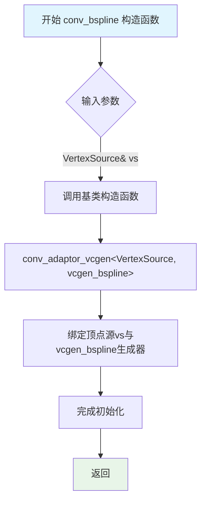
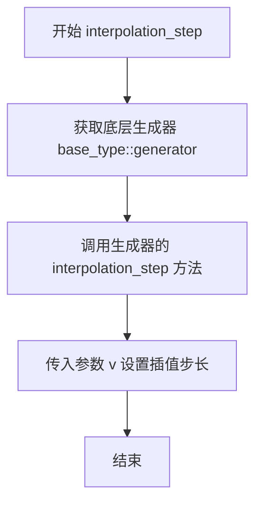
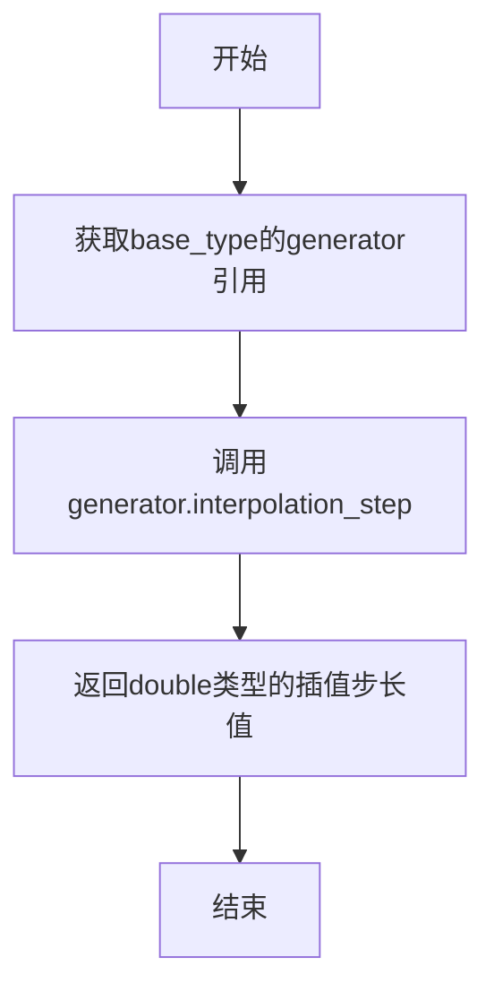

# `matplotlib\extern\agg24-svn\include\agg_conv_bspline.h` 详细设计文档

Anti-Grain Geometry库的B样条曲线插值转换器模板类，通过包装vcgen_bspline生成器实现对顶点源的B样条曲线平滑处理，提供插值步长的设置和获取功能

## 整体流程

```mermaid
graph TD
    A[创建conv_bspline对象] --> B[初始化基类conv_adaptor_vcgen]
    B --> C{调用interpolation_step设置步长?}
    C -- 是 --> D[调用base_type::generator().interpolation_step(v)]
    C -- 否 --> E[调用base_type::generator().interpolation_step()获取步长]
    D --> F[顶点数据流经B样条生成器]
    E --> F
    F --> G[输出平滑的B样条曲线顶点]
```

## 类结构

```
agg::conv_bspline<VertexSource> (模板类)
└── conv_adaptor_vcgen<VertexSource, vcgen_bspline> (基类)
    └── vcgen_bspline (内部生成器)
```

## 全局变量及字段


    

## 全局函数及方法


### `conv_bspline<VertexSource>.conv_bspline`

该函数是conv_bspline模板类的构造函数，用于初始化B样条曲线转换适配器，将传入的顶点源对象与B样条曲线生成器进行绑定，实现对顶点源的B样条曲线插值处理。

参数：

- `vs`：`VertexSource&`，顶点源对象的引用，用于提供需要插值的原始顶点数据

返回值：`void`，无返回值（构造函数）

#### 流程图



#### 带注释源码

```cpp
// 模板类conv_bspline：继承自conv_adaptor_vcgen的B样条曲线转换适配器
// VertexSource：模板参数，指定顶点源的类型
template<class VertexSource> 
struct conv_bspline : public conv_adaptor_vcgen<VertexSource, vcgen_bspline>
{
    // 类型别名，简化基类类型的引用
    typedef conv_adaptor_vcgen<VertexSource, vcgen_bspline> base_type;

    // 构造函数：初始化基类和B样条曲线生成器
    // 参数：vs - 顶点源对象的引用，用于提供需要插值的原始顶点数据
    conv_bspline(VertexSource& vs) : 
        // 显式调用基类构造函数，将顶点源vs传递给基类
        conv_adaptor_vcgen<VertexSource, vcgen_bspline>(vs) {}

    // 设置B样条曲线的插值步长
    // 参数：v - 插值步长值，控制曲线的平滑程度
    void   interpolation_step(double v) { base_type::generator().interpolation_step(v); }
    
    // 获取当前B样条曲线的插值步长
    // 返回值：double类型的插值步长值
    double interpolation_step() const { return base_type::generator().interpolation_step(); }

private:
    // 私有拷贝构造函数，防止对象被拷贝（遵循Rule of Three）
    conv_bspline(const conv_bspline<VertexSource>&);
    
    // 私有赋值运算符重载，防止对象被赋值（遵循Rule of Three）
    const conv_bspline<VertexSource>& 
        operator = (const conv_bspline<VertexSource>&);
};
```

#### 补充说明

**设计目标：**
- 提供一种将任意顶点源适配为B样条曲线输出的转换机制
- 通过模板参数支持不同类型的顶点源，具有良好的泛型特性

**设计约束：**
- VertexSource类型必须符合顶点源接口规范
- 内部委托vcgen_bspline进行实际的B样条曲线生成

**潜在优化空间：**
- 构造函数中可以考虑添加参数验证
- 可考虑添加移动语义支持（C++11以上）
- 私有拷贝构造和赋值运算符可使用delete关键字（C++11）更清晰地表达意图


### `conv_bspline<VertexSource>.interpolation_step`

该方法用于设置B样条曲线生成的插值步长，通过调用底层B样条曲线生成器的`interpolation_step`方法来配置曲线的插值精度。

参数：

- `v`：`double`，表示插值步长值，用于控制B样条曲线生成的插值精度

返回值：`void`，无返回值

#### 流程图



#### 带注释源码

```cpp
// 模板结构体 conv_bspline，继承自 conv_adaptor_vcgen
// 用于将顶点源转换为B样条曲线
template<class VertexSource> 
struct conv_bspline : public conv_adaptor_vcgen<VertexSource, vcgen_bspline>
{
    // 类型别名，简化基类类型
    typedef conv_adaptor_vcgen<VertexSource, vcgen_bspline> base_type;

    // 构造函数，接受一个顶点源引用
    conv_bspline(VertexSource& vs) : 
        conv_adaptor_vcgen<VertexSource, vcgen_bspline>(vs) {}

    // 设置B样条曲线的插值步长
    // 参数 v: double类型，表示插值步长值
    // 该方法将步长值传递给底层生成器 vcgen_bspline
    void   interpolation_step(double v) { 
        // 通过基类获取生成器对象，并调用其 interpolation_step 方法
        base_type::generator().interpolation_step(v); 
    }

    // 获取当前插值步长
    // 返回值: double类型，当前设置的插值步长值
    double interpolation_step() const { 
        return base_type::generator().interpolation_step(); 
    }

private:
    // 私有拷贝构造函数，防止拷贝
    conv_bspline(const conv_bspline<VertexSource>&);
    
    // 私有赋值运算符，防止赋值
    const conv_bspline<VertexSource>& 
        operator = (const conv_bspline<VertexSource>&);
};
```


### `conv_bspline<VertexSource>.interpolation_step() const`

该函数是 `conv_bspline` 模板类的 const 成员函数，用于获取当前 B 样条曲线的插值步长（interpolation step）值。它通过调用底层生成器 `vcgen_bspline` 的 `interpolation_step()` 方法来获取并返回该值。

参数：无参数

返回值：`double`，返回当前的插值步长值，用于控制 B 样条曲线的平滑程度

#### 流程图



#### 带注释源码

```cpp
// 模板类 conv_bspline，继承自 conv_adaptor_vcgen
// VertexSource: 顶点源类型参数
template<class VertexSource> 
struct conv_bspline : public conv_adaptor_vcgen<VertexSource, vcgen_bspline>
{
    // 使用类型别名简化基类类型
    typedef conv_adaptor_vcgen<VertexSource, vcgen_bspline> base_type;

    // 构造函数，接受一个 VertexSource 引用
    conv_bspline(VertexSource& vs) : 
        conv_adaptor_vcgen<VertexSource, vcgen_bspline>(vs) {}

    // 非 const 版本的 setter：设置插值步长
    void   interpolation_step(double v) { base_type::generator().interpolation_step(v); }
    
    // const 版本的 getter：获取当前插值步长值
    // 返回类型：double
    // 功能：返回底层生成器 vcgen_bspline 的当前插值步长
    double interpolation_step() const { 
        return base_type::generator().interpolation_step(); 
    }

private:
    // 私有拷贝构造函数，防止拷贝（设计为非可复制）
    conv_bspline(const conv_bspline<VertexSource>&);
    
    // 私有赋值运算符，防止赋值（设计为非可赋值）
    const conv_bspline<VertexSource>& 
        operator = (const conv_bspline<VertexSource>&);
};
```


## 关键组件


### conv_bspline

B样条曲线转换器模板类，继承自conv_adaptor_vcgen，用于将输入的顶点源（如折线、多边形等）转换为光滑的B样条曲线。

### conv_adaptor_vcgen

曲线生成适配器基类模板，封装了VertexSource和vcgen_bspline生成器，提供统一的接口用于曲线生成。

### vcgen_bspline

B样条曲线生成器，负责实际计算B样条插值顶点。

### interpolation_step

设置和获取B样条曲线插值步长的方法，用于控制曲线的精度和光滑度。

### VertexSource 模板参数

顶点源类型参数，接收任意提供顶点迭代能力的几何对象。

### base_type::generator()

返回底层vcgen_bspline生成器实例的访问方法，用于配置生成器参数。


## 问题及建议


### 已知问题

- **移动语义缺失**：显式禁用了拷贝构造函数和赋值运算符，但未提供移动语义（C++11），导致无法高效转移资源
- **模板参数无约束**：VertexSource 模板参数没有任何约束或接口要求，可能导致编译错误或运行时错误
- **基类实现过度耦合**：直接调用 `base_type::generator()` 依赖于基类内部实现细节，基类变化会导致此代码失效
- **const 方法与非 const 基类方法**：const 方法 `interpolation_step()` 中调用 `base_type::generator()` 可能存在潜在的 const 正确性问题
- **构造函数缺乏默认值**：用户必须手动设置插值步长，缺少合理的默认值
- **文档严重不足**：缺少对 B 样条算法原理、interpolation_step 参数影响、异常安全性等方面的说明

### 优化建议

- 添加移动构造函数和移动赋值运算符，或使用 `= delete` 明确禁止所有拷贝/移动操作
- 为 VertexSource 模板参数添加概念约束（ C++20 concepts）或使用 SFINAE 验证必需接口
- 封装 generator 访问，通过受保护方法或显式接口提供，避免直接依赖基类实现
- 重构 const 方法，确保调用链中所有方法都是 const 正确的
- 在构造函数中提供默认的 interpolation_step 值（如 1.0 或基于源数据的自动计算值）
- 添加详细的类文档，包括算法原理、参数含义、使用示例和异常安全性保证
- 考虑使用模板参数推导指南（C++17）简化对象创建

## 其它


### 设计目标与约束

本代码实现B样条曲线插值转换器，设计目标是将任意顶点源（如折线、多边形等）通过B样条插值转换为平滑的曲线。约束条件：1) 模板参数VertexSource必须是一个符合AGG顶点源接口的类；2) 依赖于vcgen_bspline生成器和conv_adaptor_vcgen适配器；3) 不允许拷贝构造和赋值操作。

### 错误处理与异常设计

本类设计为无异常抛出模式，错误处理通过返回值和状态查询实现。interpolation_step(double v)方法未对参数v进行范围验证，调用者需确保v值在合理范围内（通常为正数）。如需严格验证，可在内层生成器中添加参数范围检查。

### 数据流与状态机

数据流：VertexSource（原始顶点） → conv_bspline（插值处理） → 平滑曲线输出。状态转换依赖于内部vcgen_bspline生成器的状态机，主要包含：初始态、顶点枚举态、曲线生成态。interpolation_step控制插值密度但不影响状态机流转。

### 外部依赖与接口契约

外部依赖：1) agg_basics.h - 基础类型定义；2) agg_vcgen_bspline.h - B样条曲线生成器；3) agg_conv_adaptor_vcgen.h - 顶点源适配器基类。接口契约：VertexSource需提供begin()、next()、vertex()等标准AGG顶点源接口方法；conv_bspline本身作为conv_adaptor_vcgen的派生类，自动继承顶点源接口。

### 性能特征

conv_bspline为轻量级模板包装器，主要性能开销在内层vcgen_bspline生成器的B样条计算。插值步长interpolation_step值越小，生成的曲线越平滑但计算量越大。典型应用场景下性能开销可忽略不计。

### 线程安全性

本类本身不包含线程相关代码，属于无状态转换器（仅持有对VertexSource的引用和生成器），不涉及线程安全问题的直接处理。线程安全性取决于底层VertexSource和vcgen_bspline的并发访问安全性。

### 内存管理

conv_bspline不管理额外内存，仅持有对输入VertexSource的引用和一个vcgen_bspline生成器实例。内存生命周期由调用者控制，conv_bspline析构时不释放关联资源。

### 使用示例

```cpp
// 典型用法示例
agg::pod_bvector<agg::point_d> points;
// 填充点数据...
agg::conv_bspline<agg::pod_bvector<agg::point_d>> spline(points);
spline.interpolation_step(1.0); // 设置插值步长
// 使用spline作为顶点源进行渲染
```

    