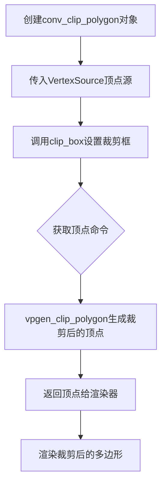
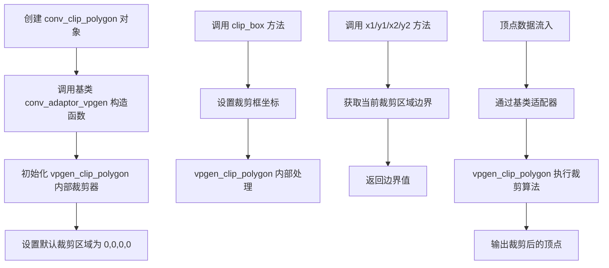
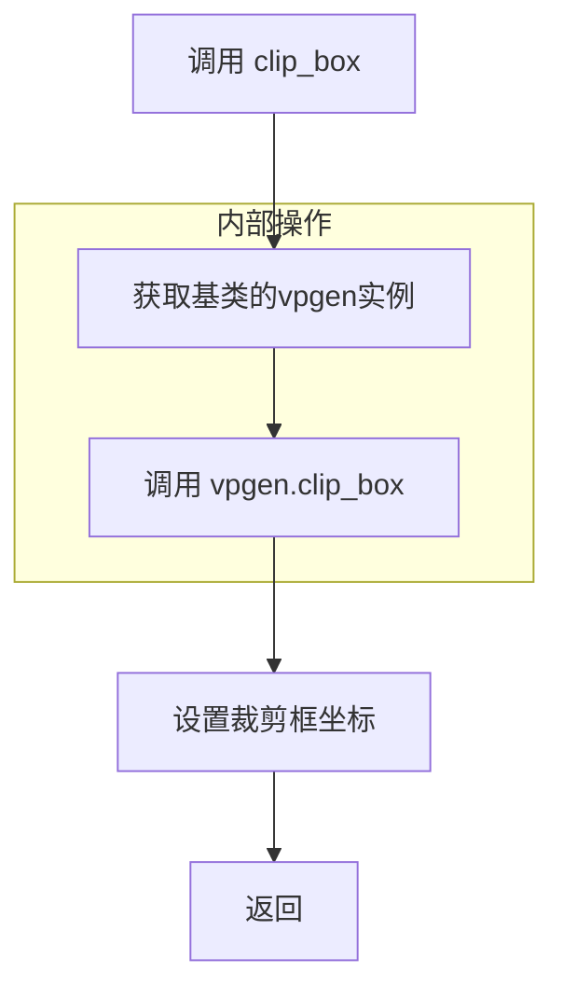
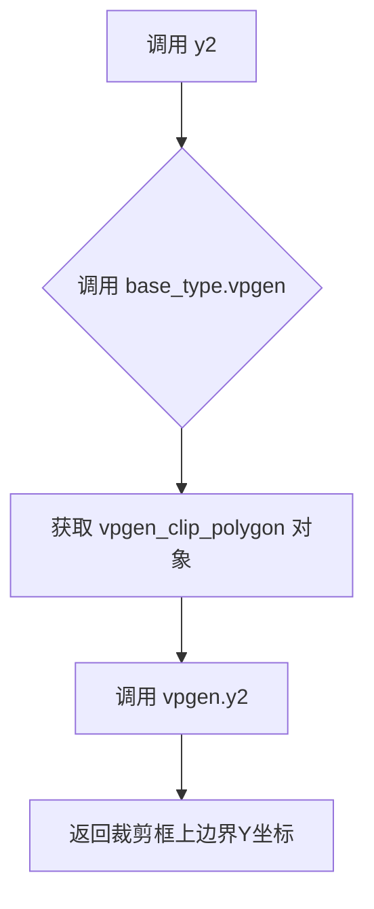

# `matplotlib\extern\agg24-svn\include\agg_conv_clip_polygon.h` 详细设计文档

这是一个多边形裁剪转换器模板类，属于Anti-Grain Geometry (AGG) 2D图形库的组成部分。该类使用Liang-Basky算法对多边形进行裁剪，通过封装vpgen_clip_polygon顶点生成器来实现可配置的裁剪框功能，支持设置裁剪区域的坐标并获取当前裁剪框参数。

## 整体流程



## 类结构

```
agg::conv_adaptor_vpgen<VertexSource, vpgen_clip_polygon> (基类)
└── conv_clip_polygon<VertexSource> (裁剪多边形转换器)
```

## 全局变量及字段


    

## 全局函数及方法


### `conv_clip_polygon<VertexSource>`

conv_clip_polygon 是一个模板结构体，用作多边形裁剪转换器（Converter）。它继承自 conv_adaptor_vpgen，通过内置的 vpgen_clip_polygon 顶点生成器实现 Sutherland-Hodgman 多边形裁剪算法。该转换器接收任意顶点源（VertexSource），并将其输出顶点限制在指定的矩形裁剪区域内，适用于2D图形渲染中的可见区域裁剪操作。

参数：

- `VertexSource& vs`：顶点源引用，任意支持顶点输出接口的类

返回值：`void`，构造函数无返回值

#### 流程图



#### 带注释源码

```cpp
//=============================================================================
// Anti-Grain Geometry - 多边形裁剪转换器
// 使用优化的 Liang-Basky 算法进行多边形裁剪
// 该算法不会优化退化边，即不会将闭合多边形分割成多个
// 退化边会与裁剪边界重合
//=============================================================================

#ifndef AGG_CONV_CLIP_POLYGON_INCLUDED
#define AGG_CONV_CLIP_POLYGON_INCLUDED

#include "agg_basics.h"           // 基础类型定义
#include "agg_conv_adaptor_vpgen.h" // 顶点生成器适配器基类
#include "agg_vpgen_clip_polygon.h" // 多边形裁剪顶点生成器

namespace agg
{

    //=======================================================conv_clip_polygon
    // 模板结构体：多边形裁剪转换器
    // VertexSource: 顶点源类型，需提供顶点迭代接口
    // 继承自 conv_adaptor_vpgen，提供统一的顶点转换接口
    //========================================================================
    template<class VertexSource> 
    struct conv_clip_polygon : public conv_adaptor_vpgen<VertexSource, vpgen_clip_polygon>
    {
        // 类型别名，简化基类引用
        typedef conv_adaptor_vpgen<VertexSource, vpgen_clip_polygon> base_type;

        //------------------------------------------------------------------------
        // 构造函数
        // vs: 顶点源引用，用于提供原始顶点数据
        // 初始化基类适配器，传入顶点源
        //------------------------------------------------------------------------
        conv_clip_polygon(VertexSource& vs) : 
            conv_adaptor_vpgen<VertexSource, vpgen_clip_polygon>(vs) {}

        //------------------------------------------------------------------------
        // clip_box
        // 设置裁剪框的矩形区域
        // 参数:
        //   x1, y1: 裁剪框左上角坐标
        //   x2, y2: 裁剪框右下角坐标
        // 说明: 裁剪框坐标应满足 x1 < x2, y1 < y2
        //------------------------------------------------------------------------
        void clip_box(double x1, double y1, double x2, double y2)
        {
            // 委托给 vpgen_clip_polygon 处理
            base_type::vpgen().clip_box(x1, y1, x2, y2);
        }

        //------------------------------------------------------------------------
        // x1
        // 获取裁剪框左边界 X 坐标
        // 返回: 裁剪框最小 X 坐标
        //------------------------------------------------------------------------
        double x1() const { return base_type::vpgen().x1(); }
        
        //------------------------------------------------------------------------
        // y1
        // 获取裁剪框上边界 Y 坐标
        // 返回: 裁剪框最小 Y 坐标
        //------------------------------------------------------------------------
        double y1() const { return base_type::vpgen().y1(); }
        
        //------------------------------------------------------------------------
        // x2
        // 获取裁剪框右边界 X 坐标
        // 返回: 裁剪框最大 X 坐标
        //------------------------------------------------------------------------
        double x2() const { return base_type::vpgen().x2(); }
        
        //------------------------------------------------------------------------
        // y2
        // 获取裁剪框下边界 Y 坐标
        // 返回: 裁剪框最大 Y 坐标
        //------------------------------------------------------------------------
        double y2() const { return base_type::vpgen().y2(); }

    private:
        //------------------------------------------------------------------------
        // 禁用拷贝构造函数，防止拷贝
        // 多边形裁剪器包含内部状态，拷贝语义不清晰
        //------------------------------------------------------------------------
        conv_clip_polygon(const conv_clip_polygon<VertexSource>&);
        
        //------------------------------------------------------------------------
        // 禁用赋值运算符，防止赋值
        // 原因同上
        //------------------------------------------------------------------------
        const conv_clip_polygon<VertexSource>& 
            operator = (const conv_clip_polygon<VertexSource>&);
    };

}

#endif
```

### 关键组件信息

| 组件名称 | 一句话描述 |
|---------|-----------|
| conv_clip_polygon | 多边形裁剪转换器模板类，对顶点源进行矩形区域裁剪 |
| conv_adaptor_vpgen | 顶点生成器适配器基类，提供统一的转换器接口 |
| vpgen_clip_polygon | 实际执行裁剪算法的顶点生成器，使用Sutherland-Hodgman算法 |
| VertexSource | 模板参数，表示任意顶点源类型，需符合AGG顶点源接口 |

### 潜在的技术债务或优化空间

1. **算法局限性**：注释中提到算法不优化退化边，可能产生冗余的退化边（长度为0的边），虽然光栅化器能容忍，但增加了不必要的顶点处理开销。

2. **裁剪框验证缺失**：`clip_box()` 方法未验证输入坐标的合法性（如 x1 >= x2 或 y1 >= y2 的情况），可能导致未定义行为。

3. **拷贝语义处理不完整**：虽然禁用了拷贝构造和赋值运算符，但若需要拷贝功能，应考虑实现正确的深拷贝或使用智能指针管理内部状态。

4. **缺少边界检查方法**：没有提供 `rewind()` 和 `vertex()` 方法的重写，无法直接控制顶点迭代行为。

### 其它项目

**设计目标与约束**：
- 目标：提供高效的2D多边形裁剪功能，适用于图形渲染流水线
- 约束：裁剪算法基于Liang-Basky（实际为Sutherland-Hodgman变体），仅支持矩形裁剪区域

**错误处理与异常设计**：
- 无异常抛出机制，错误通过返回值或内部状态管理
- 裁剪框坐标需调用者保证合法性

**数据流与状态机**：
- 数据流向：VertexSource → conv_clip_polygon → vpgen_clip_polygon → 裁剪后顶点
- 内部状态：仅保存裁剪框坐标，状态转换通过 clip_box() 触发

**外部依赖与接口契约**：
- 依赖 agg_basics.h 中的基础类型定义
- 依赖 conv_adaptor_vpgen 提供的适配器接口
- 依赖 vpgen_clip_polygon 的实际裁剪实现
- VertexSource 需符合AGG顶点源接口规范（通常包含 rewind() 和 vertex() 方法）


### `conv_clip_polygon.clip_box`

设置多边形裁剪框的坐标，定义裁剪区域的范围。该方法通过调用内部vpgen（顶点生成器）的clip_box方法来实际设置裁剪框，用于后续对顶点源进行多边形裁剪操作。

参数：

- `x1`：`double`，裁剪框左上角的X坐标
- `y1`：`double`，裁剪框左上角的Y坐标
- `x2`：`double`，裁剪框右下角的X坐标
- `y2`：`double`，裁剪框右下角的Y坐标

返回值：`void`，无返回值

#### 流程图



#### 带注释源码

```cpp
// 设置多边形裁剪框的坐标
// 参数分别为裁剪框的左上角(x1, y1)和右下角(x2, y2)坐标
void clip_box(double x1, double y1, double x2, double y2)
{
    // 通过base_type获取vpgen（顶点生成器）实例
    // 并调用其clip_box方法设置裁剪框
    // vpgen_clip_polygon 负责实际的裁剪算法实现
    base_type::vpgen().clip_box(x1, y1, x2, y2);
}
```


### `conv_clip_polygon.x1`

该方法是 `conv_clip_polygon` 模板类的成员函数，用于获取多边形裁剪框的左边界 x 坐标。它是一个简单的访问器方法，通过调用内部 vpgen 对象的 x1() 方法返回裁剪区域的左边界位置。

参数： 无

返回值：`double`，返回多边形裁剪框的左边界 x 坐标值（x1）

#### 流程图

```mermaid
flowchart TD
    A[调用 x1] --> B{const方法}
    B --> C[返回 base_type::vpgen().x1]
    C --> D[返回 double 类型值]
```

#### 带注释源码

```cpp
// 获取裁剪框左边界 x 坐标
// 该方法是一个 const 成员函数，不会修改对象状态
// 返回值类型为 double，表示裁剪区域左边界的位置
double x1() const 
{ 
    // 通过基类 vpgen 对象获取 x1 坐标
    // base_type::vpgen() 返回 vpgen_clip_polygon 实例的引用
    // 然后调用该实例的 x1() 方法获取左边界
    return base_type::vpgen().x1(); 
}
```


### `conv_clip_polygon.y1`

该方法返回多边形裁剪器的顶部边界y坐标（裁剪框的最小y值），用于获取当前裁剪区域的顶部边界位置。

参数： 无

返回值：`double`，返回裁剪框的顶部y坐标（最小y值）

#### 流程图

```mermaid
flowchart TD
    A[调用 y1 方法] --> B{检查裁剪器}
    B --> C[调用 vpgen().y1]
    C --> D[返回 double 类型的 y1 坐标值]
```

#### 带注释源码

```cpp
// 返回裁剪框的顶部y坐标（最小y值）
// 该方法继承自基类，通过 vpgen_clip_polygon 裁剪器获取裁剪区域的顶部边界
double y1() const 
{ 
    // base_type::vpgen() 获取 vpgen_clip_polygon 实例
    // 调用其 y1() 方法返回裁剪框的最小y坐标
    return base_type::vpgen().y1(); 
}
```


### `conv_clip_polygon.x2`

获取剪裁矩形右侧边界X坐标的访问器方法，返回剪裁盒的右边界X坐标值。

参数：

- （无参数）

返回值：`double`，返回剪裁矩形的右边界X坐标（x2）

#### 流程图

```mermaid
flowchart TD
    A[开始调用x2方法] --> B{检查vpgen是否有效}
    B -->|是| C[调用base_type::vpgen().x2]
    B -->|否| D[返回未定义值]
    C --> E[返回double类型坐标值]
    E --> F[结束]
```

#### 带注释源码

```cpp
// 获取剪裁矩形的右边界X坐标
// 该方法是const成员函数，不修改对象状态
// 返回值类型为double，表示剪裁框的右侧边界
double x2() const 
{ 
    // 通过基类的vpgen()获取vpgen_clip_polygon实例
    // 并调用其x2()方法获取右边界坐标
    return base_type::vpgen().x2(); 
}
```

#### 补充说明

此方法是对内部 vpgen_clip_polygon 生成器的封装，属于访问器（getter）模式。它提供了对剪裁矩形右边界坐标的只读访问，不接受任何参数，返回值描述剪裁区域在X轴方向上的最大边界。


### `conv_clip_polygon<VertexSource>.y2`

该方法是一个常量成员函数，用于获取多边形裁剪器的裁剪框右上角纵坐标（y2值），即裁剪区域的上边界Y坐标。

参数：无

返回值：`double`，返回裁剪框的y2坐标，即裁剪区域上边界的Y坐标值。

#### 流程图



#### 带注释源码

```cpp
// 模板类 conv_clip_polygon 的成员函数 y2()
// 位于命名空间 agg 中
// 该函数返回裁剪框的y2坐标（上边Y坐标）
template<class VertexSource> 
struct conv_clip_polygon : public conv_adaptor_vpgen<VertexSource, vpgen_clip_polygon>
{
    // 继承自基类 conv_adaptor_vpgen
    typedef conv_adaptor_vpgen<VertexSource, vpgen_clip_polygon> base_type;

    // 构造函数，接受一个顶点源引用
    conv_clip_polygon(VertexSource& vs) : 
        conv_adaptor_vpgen<VertexSource, vpgen_clip_polygon>(vs) {}

    // 设置裁剪框坐标
    void clip_box(double x1, double y1, double x2, double y2)
    {
        // 委托给 vpgen_clip_polygon 处理
        base_type::vpgen().clip_box(x1, y1, x2, y2);
    }

    // 获取裁剪框左边界X坐标
    double x1() const { return base_type::vpgen().x1(); }
    
    // 获取裁剪框上边界Y坐标
    double y1() const { return base_type::vpgen().y1(); }
    
    // 获取裁剪框右边界X坐标
    double x2() const { return base_type::vpgen().x2(); }
    
    // 获取裁剪框下边界Y坐标
    double y2() const { return base_type::vpgen().y2(); }

private:
    // 私有拷贝构造函数，禁止拷贝
    conv_clip_polygon(const conv_clip_polygon<VertexSource>&);
    
    // 私有赋值运算符，禁止赋值
    const conv_clip_polygon<VertexSource>& 
        operator = (const conv_clip_polygon<VertexSource>&);
};
```


## 关键组件


### conv_clip_polygon

多边形裁剪转换器模板类，继承自conv_adaptor_vpgen，使用Liang-Basky算法对顶点源进行多边形裁剪，支持设置和获取裁剪框坐标。

### conv_adaptor_vpgen

基础适配器类，作为conv_clip_polygon的基类，提供顶点源和顶点生成器之间的适配功能。

### vpgen_clip_polygon

实际的多边形裁剪顶点生成器类，负责实现Liang-Basky裁剪算法的核心逻辑。

### clip_box

设置多边形裁剪框的坐标范围，参数为裁剪区域的左上角(x1, y1)和右下角(x2, y2)。

### x1/y1/x2/y2

获取裁剪框的边界坐标，分别返回裁剪区域的左、上、右、下边界值。


## 问题及建议


### 已知问题

- **拷贝控制不明确**：虽然通过私有未实现的拷贝构造和赋值运算符防止了拷贝，但这种做法在现代C++中已过时，应使用`= delete`声明，使意图更清晰
- **缺乏输入参数验证**：`clip_box`方法未验证坐标的合法性（如x2必须大于x1，y2必须大于y1），可能导致裁剪行为异常或未定义行为
- **文档缺失**：类本身缺少Doxygen风格的文档注释，开发者无法快速理解类的用途和使用约束
- **模板实现全部位于头文件**：所有实现细节都放在头文件中，在大型项目中会导致编译时间增加和代码膨胀
- **类型硬编码**：坐标类型直接使用`double`固定，若需要支持整数坐标或其他精度类型，需修改源码，缺乏灵活性

### 优化建议

- 使用`= delete`明确删除拷贝构造和赋值运算符
- 在`clip_box`方法中添加参数验证逻辑，确保`x2 > x1`且`y2 > y1`，或提供断言/异常处理
- 为类添加详细的文档注释，说明裁剪算法限制（Liang-Basky算法不优化退化边）
- 考虑将实现细节移至分离的源文件，使用显式实例化或traits机制减少编译依赖
- 引入类型别名或模板参数支持不同坐标类型（如`coord_type`）
- 考虑添加`reset`方法或`clear`接口以重用转换器对象
- 检查基类`conv_adaptor_vpgen`是否具有虚析构函数，确保多态删除行为正确


## 其它


### 设计目标与约束

使用 Liang-Barsky 算法的优化版本将输入顶点源裁剪到指定的矩形裁剪框内。设计约束包括：不优化退化边（即不会将封闭多边形分割成两个或多个），允许退化边与裁剪边界重合，因为光栅化器可以很好地容忍这种情况而不会产生显著的性能开销。

### 错误处理与异常设计

无显式错误处理机制。错误情况通常通过返回无效或不生成顶点来处理。调用方需要确保clip_box参数合法（x1 <= x2, y1 <= y2）。

### 数据流与状态机

数据流：VertexSource（输入顶点） -> conv_clip_polygon（裁剪处理） -> 生成裁剪后的顶点。状态转换由内部vpgen_clip_polygon对象管理，包括初始化、裁剪计算、顶点生成等状态。

### 外部依赖与接口契约

依赖：agg_basics.h（基础类型定义）、agg_conv_adaptor_vpgen（适配器基类）、agg_vpgen_clip_polygon（实际裁剪算法实现）。接口契约：VertexSource需提供顶点生成接口；clip_box设置裁剪矩形；x1/y1/x2/y2获取当前裁剪框边界。

### 性能考虑与优化空间

当前实现使用Liang-Barsky算法，已进行一定优化。主要优化空间：可考虑添加退化边优化逻辑，但需权衡额外数学计算开销；可添加缓存机制避免重复计算裁剪框。

### 使用示例与调用模式

典型用法：创建conv_clip_polygon对象，传入顶点源，调用clip_box设置裁剪区域，然后遍历生成裁剪后的顶点。

### 线程安全性

非线程安全。多个线程同时使用同一conv_clip_polygon实例可能导致未定义行为。

### 内存管理

无动态内存分配。内部持有vpgen_clip_polygon实例，采用值语义管理生命周期。

### 兼容性考虑

C++标准：需支持模板实例化。头文件设计符合AGG库的统一风格，使用命名空间agg避免符号冲突。

    