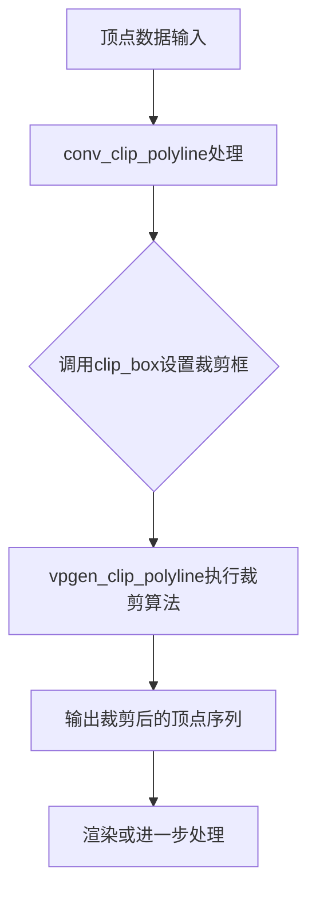
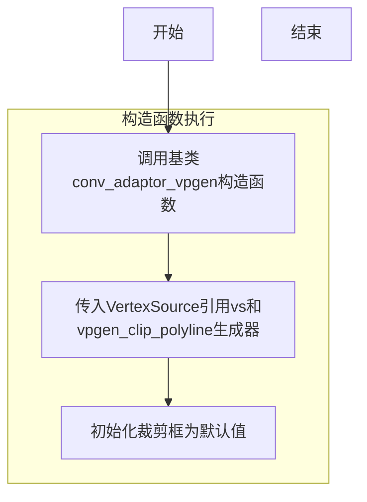
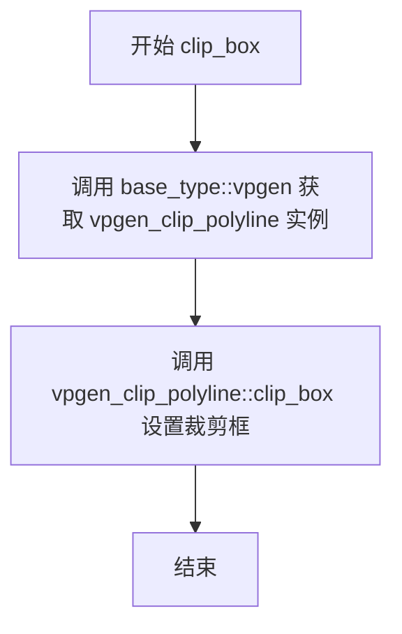
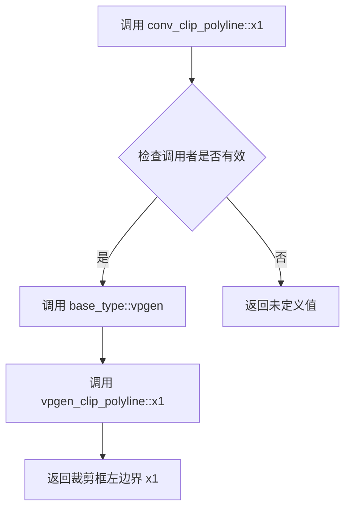
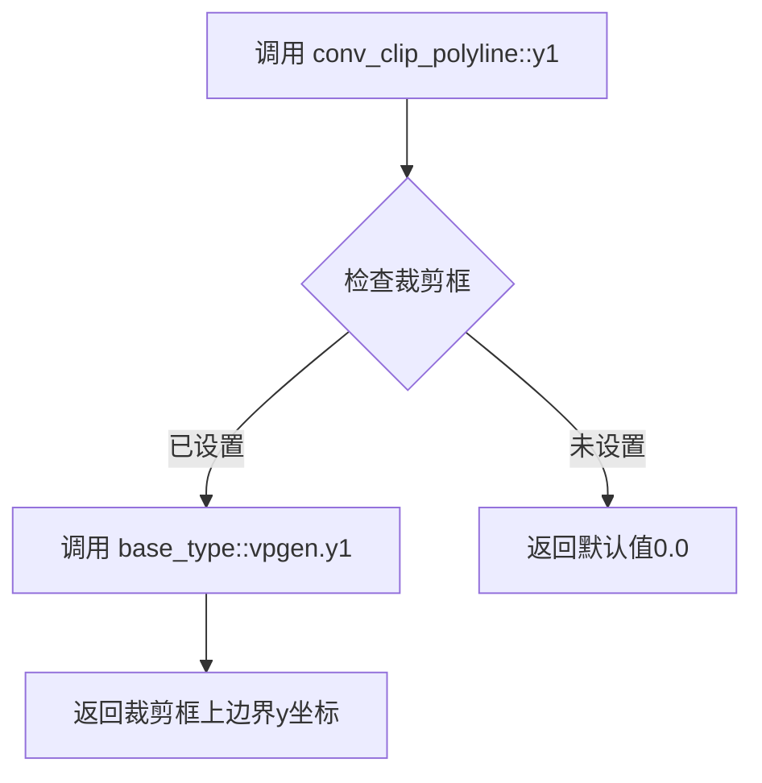
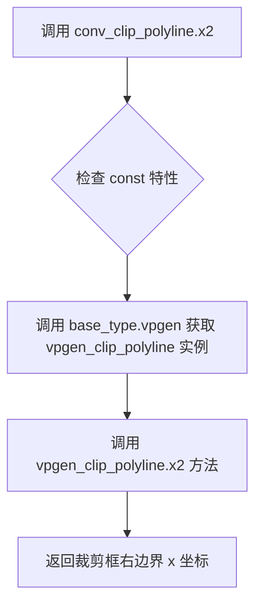

# `matplotlib\extern\agg24-svn\include\agg_conv_clip_polyline.h` 详细设计文档

这是一个多边形裁剪转换器模板类，使用优化的Liang-Barsky算法对多边形线段进行裁剪，适用于将顶点数据限制在指定的矩形裁剪框内，是Anti-Grain Geometry图形库中用于可视化的关键组件。

## 整体流程



## 类结构

```
agg::conv_clip_polyline<VertexSource> (模板类)
└── 继承自 conv_adaptor_vpgen<VertexSource, vpgen_clip_polyline>
    └── 内部组合 vpgen_clip_polyline 顶点生成器
```

## 全局变量及字段


    

## 全局函数及方法


### `conv_clip_polyline<VertexSource>.conv_clip_polyline`

该函数是 `conv_clip_polyline` 模板结构体的构造函数，用于将顶点源（VertexSource）适配到多边形裁剪转换器中，以便对折线进行矩形区域裁剪处理。

参数：

- `vs`：`VertexSource&`，顶点源引用，提供需要被裁剪的折线顶点数据

返回值：无返回值（构造函数）

#### 流程图



#### 带注释源码

```
//=======================================================conv_clip_polyline
// 模板结构体：多边形裁剪折线转换器
// VertexSource - 顶点源类型，用于提供原始折线顶点
//=======================================================
template<class VertexSource> 
struct conv_clip_polyline : public conv_adaptor_vpgen<VertexSource, vpgen_clip_polyline>
{
    // 类型别名，引用基类类型
    typedef conv_adaptor_vpgen<VertexSource, vpgen_clip_polyline> base_type;

    //--------------------------------------------------------------------
    // 构造函数
    // 功能：将传入的顶点源vs封装到裁剪转换器中
    // 参数：vs - VertexSource引用，需裁剪的折线顶点来源
    //--------------------------------------------------------------------
    conv_clip_polyline(VertexSource& vs) : 
        // 初始化列表调用基类构造函数，传入顶点源和裁剪生成器
        conv_adaptor_vpgen<VertexSource, vpgen_clip_polyline>(vs) {}

    //--------------------------------------------------------------------
    // clip_box: 设置裁剪矩形区域
    // 参数：x1, y1 - 裁剪区域左上角坐标
    //       x2, y2 - 裁剪区域右下角坐标
    //--------------------------------------------------------------------
    void clip_box(double x1, double y1, double x2, double y2)
    {
        base_type::vpgen().clip_box(x1, y1, x2, y2);
    }

    // 获取裁剪区域各边界坐标的访问器方法
    double x1() const { return base_type::vpgen().x1(); }
    double y1() const { return base_type::vpgen().y1(); }
    double x2() const { return base_type::vpgen().x2(); }
    double y2() const { return base_type::vpgen().y2(); }

private:
    // 私有拷贝构造函数，防止拷贝（不可复制）
    conv_clip_polyline(const conv_clip_polyline<VertexSource>&);
    
    // 私有赋值运算符重载，防止赋值（不可赋值）
    const conv_clip_polyline<VertexSource>& 
        operator = (const conv_clip_polyline<VertexSource>&);
};
```


### `conv_clip_polyline<VertexSource>::clip_box`

设置多段线裁剪器的裁剪框坐标，用于定义裁剪区域的范围。

参数：

- `x1`：`double`，裁剪框左上角 X 坐标
- `y1`：`double`，裁剪框左上角 Y 坐标
- `x2`：`double`，裁剪框右下角 X 坐标
- `y2`：`double`，裁剪框右下角 Y 坐标

返回值：`void`，无返回值描述

#### 流程图



#### 带注释源码

```cpp
// 设置多段线裁剪器的裁剪框
// 该方法将裁剪框坐标传递给内部的 vpgen_clip_polyline 生成器
// x1, y1 为裁剪框左上角坐标，x2, y2 为裁剪框右下角坐标
void clip_box(double x1, double y1, double x2, double y2)
{
    // 通过基类获取 vpgen_clip_polyline 实例，并调用其 clip_box 方法
    base_type::vpgen().clip_box(x1, y1, x2, y2);
}
```


### `conv_clip_polyline<VertexSource>::x1() const`

该函数是 `conv_clip_polyline` 模板类的成员方法，用于获取裁剪框的左边界 x 坐标。它通过调用内部 `vpgen`（顶点生成器）的 `x1()` 方法来返回裁剪区域的左边界值。

参数：

- （无参数）

返回值：`double`，裁剪框的左边界 x 坐标值

#### 流程图



#### 带注释源码

```cpp
// 获取裁剪框左边界 x 坐标
// 该函数是 const 成员函数，不修改对象状态
// 返回值：裁剪框的左边界 x 坐标值（double 类型）
double x1() const 
{ 
    // 通过基类 conv_adaptor_vpgen 访问内部的 vpgen_clip_polyline 实例
    // 委托调用 vpgen 的 x1() 方法获取裁剪边界
    return base_type::vpgen().x1(); 
}
```


### `conv_clip_polyline<VertexSource>::y1() const`

获取裁剪多边形的最小y坐标（裁剪区域的上边界）

参数： 无

返回值：`double`，返回裁剪框的y1坐标（上边界的y值）

#### 流程图



#### 带注释源码

```cpp
// 获取裁剪框的最小y坐标（上边界）
// 该函数返回裁剪多边形的y1值，即裁剪区域的顶部边界
// @return double 裁剪框的y1坐标值
double y1() const 
{ 
    // 通过base_type获取vpgen_clip_polyline实例
    // 然后调用其y1()方法获取裁剪框的上边界y坐标
    return base_type::vpgen().y1(); 
}
```


### `conv_clip_polyline<VertexSource>.x2() const`

该函数是裁剪多边形转换器的成员方法，用于返回裁剪框的右边界 x 坐标。它通过调用底层 `vpgen_clip_polyline` 生成器的 `x2()` 方法来获取裁剪区域的右边界值，属于只读查询接口，不修改任何内部状态。

参数：无

返回值：`double`，返回裁剪框的右边界 x 坐标

#### 流程图



#### 带注释源码

```cpp
// 获取裁剪框右边界 x 坐标的只读访问器方法
// 该方法使用 const 限定符确保不会修改对象状态
// 实际实现委托给底层的 vpgen_clip_polyline 生成器
double x2() const 
{ 
    // 通过基类模板的 vpgen() 方法获取 vpgen_clip_polyline 实例
    // 然后调用其 x2() 方法返回裁剪区域的右边界坐标
    return base_type::vpgen().x2(); 
}
```

#### 相关方法说明

| 方法名 | 返回类型 | 功能描述 |
|--------|----------|----------|
| `x1()` | `double` | 返回裁剪框左边界 x 坐标 |
| `y1()` | `double` | 返回裁剪框上边界 y 坐标 |
| `y2()` | `double` | 返回裁剪框下边界 y 坐标 |
| `clip_box(...)` | `void` | 设置裁剪框的四个边界坐标 |

#### 设计说明

- **委托模式**：该方法采用委托模式，将请求转发给底层的 `vpgen_clip_polyline` 对象处理，体现了适配器模式的典型应用
- **只读访问**：const 限定符表明该方法仅用于查询，不修改内部状态
- **模板设计**：作为模板类的方法，在实例化时确定具体类型，支持不同的顶点源类型


### `conv_clip_polyline<VertexSource>.y2()`

获取裁剪多边形的右上角y坐标。该方法是一个const成员函数，返回裁剪框（clip box）的y2坐标值（即右上角的垂直位置），通过委托给内部vpgen对象的y2()方法实现。

参数：

- （无参数）

返回值：`double`，裁剪框的右上角y坐标值

#### 流程图

```mermaid
flowchart TD
    A[调用 y2 方法] --> B{检查 vpgen 是否有效}
    B -->|是| C[调用 base_type::vpgen().y2]
    C --> D[返回 double 类型的 y2 坐标值]
    B -->|否| E[返回未定义行为]
```

#### 带注释源码

```cpp
// 获取裁剪框的右上角y坐标
// 该方法为const成员函数，保证不会修改对象状态
// 返回值类型为double，表示裁剪矩形框的顶部y坐标
double y2() const { 
    // 通过base_type获取vpgen_clip_polyline实例
    // 并调用其y2()方法获取裁剪框的y2坐标
    return base_type::vpgen().y2(); 
}
```


## 关键组件


### conv_clip_polyline

多边形线段裁剪转换器模板类，继承自conv_adaptor_vpgen，使用Liang-Barsky算法对顶点源进行裁剪，提供clip_box设置裁剪区域及坐标访问器方法。

### conv_adaptor_vpgen

适配器基类模板，提供顶点源与vpgen裁剪生成器之间的桥接。

### vpgen_clip_polyline

内部裁剪生成器，实现了Liang-Barsky多边形线段裁剪算法，负责实际的坐标裁剪计算。

### clip_box

设置裁剪框坐标的方法，接收四个double参数(x1, y1, x2, y2)定义裁剪区域。

### x1/y1/x2/y2

裁剪框坐标访问器方法，返回double类型的裁剪边界值。

### 模板参数VertexSource

顶点源类型参数，允许该转换器适配各种顶点生成器实现。

### Liang-Barsky算法

代码注释中提到的裁剪算法实现，属于Cohen-Sutherland算法的优化版本，适用于矩形裁剪区域。


## 问题及建议


### 已知问题

-   **输入参数验证缺失**：clip_box方法未验证x1<=x2、y1<=2的合法性，可能导致裁剪结果异常或断言失败
-   **移动语义未实现**：显式删除了拷贝构造和赋值运算符，但未实现移动构造函数和移动赋值运算符，导致无法高效转移资源
-   **算法次优问题**：代码注释承认使用非优化的Liang-Barsky算法，会产生与裁剪边界重合的退化边，虽不影响光栅化但非最优解
-   **无错误状态反馈**：clip_box方法无返回值，无法向调用者反馈裁剪操作是否成功或参数是否合法
-   **const兼容性局限**：仅支持非const VertexSource，无法直接包装const对象或临时对象

### 优化建议

-   **添加参数验证**：在clip_box中添加参数有效性检查，对于非法参数可抛出异常或使用assert/边界约束
-   **实现移动语义**：添加移动构造函数和移动赋值运算符，提升临时对象和资源转移效率
-   **优化裁剪算法**：评估实现完整优化的Liang-Barsky算法或Cohen-Sutherland算法的成本收益，避免退化边
-   **增加API返回类型**：考虑返回bool或引用自身的*this以支持链式调用，或提供状态查询接口
-   **支持const VertexSource**：添加const版本的构造函数或使用std::conditional_t模板参数支持const兼容
-   **增强文档注释**：为公共方法添加详细文档，说明参数范围、异常抛出和调用前提条件
-   **添加noexcept规范**：对于不会抛出异常的查询方法添加noexcept声明，提升编译器优化能力


## 其它


### 设计目标与约束

设计目标：提供一个高效的多边形线裁剪转换器，能够对输入的顶点序列进行多边形边界裁剪，使用优化的 Liang-Barsky 算法，适用于线段和多边形的渲染场景。约束：算法不优化退化边（即不会将闭合多边形分割成多个），允许退化边与裁剪边界重合，rasterizer 能够容忍这种次优解而不产生明显性能开销。

### 错误处理与异常设计

代码本身不抛出异常，错误处理主要依赖于传入参数的有效性验证。clip_box 方法接受任意数值，但需保证 x1 <= x2, y1 <= y2，否则可能导致未定义行为。类内部包含私有拷贝构造函数和赋值运算符以防止意外复制。

### 数据流与状态机

数据流：VertexSource（顶点源）→ conv_clip_polyline（裁剪转换）→ vpgen_clip_polyline（生成器）→ 输出顶点序列。状态机主要体现在 vpgen_clip_polyline 内部的裁剪状态管理，包括当前顶点位置、裁剪边界、线段交点计算等状态。

### 外部依赖与接口契约

依赖项：agg_basics.h（基础类型定义）、agg_conv_adaptor_vpgen（适配器基类）、agg_vpgen_clip_polyline（实际裁剪生成器）。接口契约：VertexSource 必须提供 begin(), next(), vertex() 接口以产生顶点序列；输出通过 vpgen_clip_polyline 的 vertex() 方法获取裁剪后的顶点。

### 性能考虑

Liang-Barsky 算法相比其他裁剪算法具有较低的计算复杂度，适用于线段裁剪场景。由于不退化边进行优化，节省了额外的数学运算开销，对于 rasterizer 而言可以忽略不计。模板实现允许编译器进行内联优化。

### 线程安全性

该类本身不包含线程相关机制，线程安全性完全依赖于传入的 VertexSource 和 vpgen_clip_polyline 实例是否线程安全。在多线程环境下，每个线程应使用独立的实例或确保共享实例的线程安全访问。

### 内存管理

类内部不管理动态内存，所有数据通过引用传递。裁剪边界坐标存储在基类的 vpgen 实例中，由 vpgen_clip_polyline 负责管理。

### 兼容性考虑

该代码遵循 AGG 库的许可证（Permission to copy, use, modify, sell and distribute this software is granted provided this copyright notice appears in all copies）。使用标准 C++ 模板实现，具有良好的跨平台兼容性。

### 使用示例

```cpp
// 典型用法
agg::conv_clip_polyline<my_vertex_source> clipper(vertex_source);
clipper.clip_box(0, 0, 800, 600);
// 通过 clipper 获取裁剪后的顶点
```

### 测试策略

应测试：正常裁剪场景（线段完全在裁剪框内/外/相交）、裁剪框边界情况（顶点恰好在边界上）、退化边处理、闭合多边形裁剪、输入顶点源为空或只有单个点的情况。

### 参考文献/算法参考

Liang-Barsky 算法参考：Liang, Y. D., and Barsky, B. A., "A New Concept and Algorithm for Line Clipping", ACM Transactions on Graphics, 1984。该实现基于 AGG 库的实际应用优化版本。

    