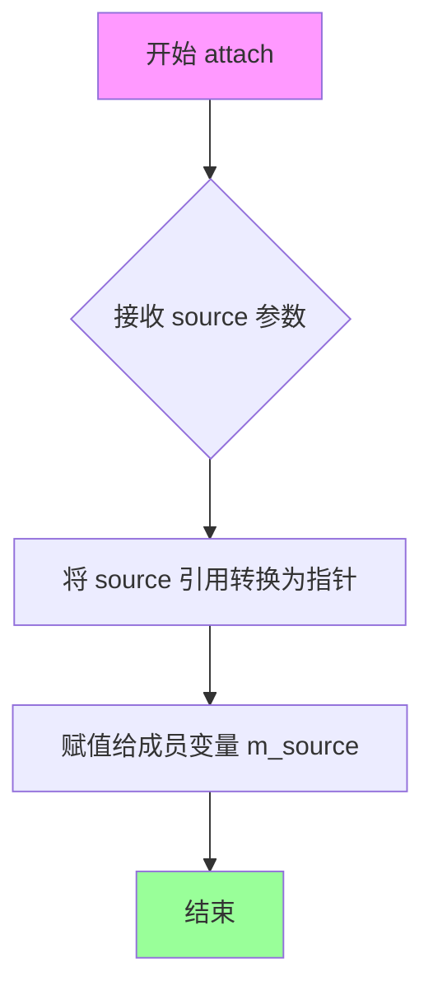
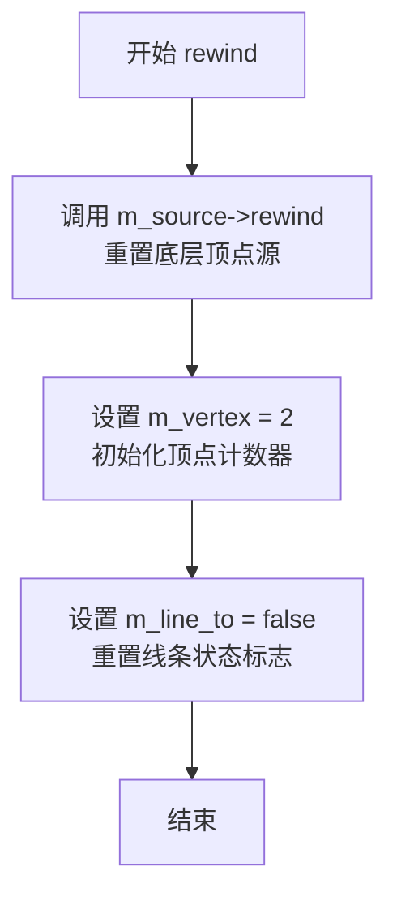

# `matplotlib\extern\agg24-svn\include\agg_conv_close_polygon.h` 详细设计文档

Anti-Grain Geometry库中的conv_close_polygon是一个模板转换器类，用于确保多边形被正确关闭，通过在处理来自VertexSource的顶点数据时自动添加path_flags_close标志的end_poly命令。

## 整体流程

```mermaid
graph TD
    A[开始 rewind] --> B[调用 m_source->rewind(path_id)]
    B --> C[设置 m_vertex = 2]
    C --> D[设置 m_line_to = false]
    D --> E[vertex 方法开始]
    E --> F{m_vertex < 2?}
    F -- 是 --> G[返回预存储坐标 m_x[m_vertex], m_y[m_vertex]]
    G --> H[m_vertex++]
    F -- 否 --> I[调用 m_source->vertex(x, y)]
    I --> J{is_end_poly(cmd)?}
    J -- 是 --> K[添加 path_flags_close]
    K --> L[返回命令并退出]
    J -- 否 --> M{is_stop(cmd)?}
    M -- 是 --> N{m_line_to == true?}
    N -- 是 --> O[设置 m_cmd[0] = path_cmd_end_poly | path_flags_close]
    O --> P[设置 m_cmd[1] = path_cmd_stop]
    P --> Q[m_vertex = 0]
    Q --> R[m_line_to = false]
    R --> S[continue 继续循环]
    N -- 否 --> L
    M -- 否 --> T{is_move_to(cmd)?}
    T -- 是 --> U{m_line_to == true?}
    U -- 是 --> V[设置闭合多边形坐标]
    V --> W[m_vertex = 0 继续循环]
    U -- 否 --> X[break 退出循环]
    T -- 否 --> Y{is_vertex(cmd)?}
    Y -- 是 --> Z[设置 m_line_to = true]
    Z --> L
    Y -- 否 --> I
```

## 类结构

```
agg 命名空间
└── conv_close_polygon<VertexSource> (模板类)
```

## 全局变量及字段


### `conv_close_polygon<VertexSource>.m_source`
    
指向顶点源对象的指针，用于获取原始顶点数据

类型：`VertexSource*`
    


### `conv_close_polygon<VertexSource>.m_cmd`
    
存储预定义的命令数组，用于缓存end_poly和stop命令

类型：`unsigned[2]`
    


### `conv_close_polygon<VertexSource>.m_x`
    
存储x坐标数组，用于缓存需要闭合多边形的坐标

类型：`double[2]`
    


### `conv_close_polygon<VertexSource>.m_y`
    
存储y坐标数组，用于缓存需要闭合多边形的坐标

类型：`double[2]`
    


### `conv_close_polygon<VertexSource>.m_vertex`
    
当前顶点索引，控制预存储坐标的返回顺序

类型：`unsigned`
    


### `conv_close_polygon<VertexSource>.m_line_to`
    
标志位，标记是否已经处理过line_to命令（存在非闭合路径）

类型：`bool`
    
    

## 全局函数及方法


### conv_close_polygon

该类是一个模板适配器（Convolution Adapter），用于将开放的多边形路径转换为封闭的多边形路径。它通过拦截顶点源的顶点数据，在适当位置自动插入闭合多边形的命令（path_cmd_end_poly | path_flags_close），确保绘制的多边形始终是封闭的。

参数：

-  `vs`：`VertexSource&`，顶点源引用，用于提供原始的顶点数据流

返回值：`void`，无返回值（构造函数）

#### 流程图

```mermaid
flowchart TD
    A[创建 conv_close_polygon 对象] --> B[调用 rewind 初始化状态]
    B --> C{调用 vertex 获取顶点}
    C --> D{m_vertex < 2?}
    D -->|是| E[返回缓存的顶点<br/>m_cmd[0]/m_cmd[1]]
    D -->|否| F[从 m_source 获取下一个命令]
    F --> G{is_end_poly?}
    G -->|是| H[添加闭合标志<br/>path_flags_close]
    G -->|否| I{is_stop?}
    I -->|是| J{m_line_to?}
    J -->|是| K[生成闭合命令<br/>回到状态0继续]
    J -->|否| L[返回 stop 命令]
    I -->|否| M{is_move_to?}
    M -->|是| N{m_line_to?}
    N -->|是| O[生成闭合命令<br/>回到状态0继续]
    N -->|否| P[返回 move_to 命令]
    M -->|否| Q{is_vertex?}
    Q -->|是| R[设置 m_line_to=true<br/>返回该顶点]
    Q -->|否| L
    
    style H fill:#90EE90
    style K fill:#90EE90
    style O fill:#90EE90
    style R fill:#90EE90
```

#### 带注释源码

```cpp
//----------------------------------------------------------------------------
// Anti-Grain Geometry - Version 2.4
// 模板适配器类：将开放多边形转换为封闭多边形
//----------------------------------------------------------------------------

#ifndef AGG_CONV_CLOSE_POLYGON_INCLUDED
#define AGG_CONV_CLOSE_POLYGON_INCLUDED

#include "agg_basics.h"

namespace agg
{
    //======================================================conv_close_polygon
    // 模板类：多边形闭合适配器
    // VertexSource：顶点源类型，需提供 rewind() 和 vertex(x,y) 接口
    //======================================================
    template<class VertexSource> class conv_close_polygon
    {
    public:
        // 显式构造函数，接受顶点源引用并初始化成员变量
        // 参数：vs - 顶点源引用
        explicit conv_close_polygon(VertexSource& vs) : m_source(&vs) {}
        
        // 附加新的顶点源
        // 参数：source - 新的顶点源引用
        void attach(VertexSource& source) { m_source = &source; }

        // 重置适配器状态，准备遍历路径
        // 参数：path_id - 路径标识符
        void rewind(unsigned path_id);
        
        // 获取下一个顶点
        // 参数：x, y - 输出参数，用于存储顶点坐标
        // 返回值：路径命令（path commands）
        unsigned vertex(double* x, double* y);

    private:
        // 私有拷贝构造函数，禁止复制
        conv_close_polygon(const conv_close_polygon<VertexSource>&);
        
        // 私有赋值运算符，禁止赋值
        const conv_close_polygon<VertexSource>& 
            operator = (const conv_close_polygon<VertexSource>&);

        //------------------- 成员变量 --------------------
        
        VertexSource* m_source;    // 顶点源指针
        unsigned      m_cmd[2];    // 命令缓存数组（用于存储闭合命令）
        double        m_x[2];      // x坐标缓存数组
        double        m_y[2];      // y坐标缓存数组
        unsigned      m_vertex;    // 当前顶点索引（控制缓存读写）
        bool          m_line_to;   // 标志位：是否已有line_to命令（表示需要闭合）
    };

    //------------------------------------------------------------------------
    // rewind: 初始化迭代器状态
    // 调用底层顶点源的rewind，并重置自身状态
    //------------------------------------------------------------------------
    template<class VertexSource> 
    void conv_close_polygon<VertexSource>::rewind(unsigned path_id)
    {
        m_source->rewind(path_id);  // 委托给底层顶点源
        m_vertex = 2;               // 设置为2，表示缓存为空
        m_line_to = false;          // 重置line_to标志
    }


    
    //------------------------------------------------------------------------
    // vertex: 核心状态机 - 获取下一个顶点并自动插入闭合命令
    // 
    // 状态转换逻辑：
    // 1. 首先检查缓存（m_vertex < 2），若有则返回缓存的闭合命令
    // 2. 从底层顶点源获取命令，根据命令类型决定行为
    // 3. 遇到 end_poly：添加闭合标志后返回
    // 4. 遇到 stop：若有 line_to 则生成闭合命令，否则返回 stop
    // 5. 遇到 move_to：若有 line_to 则生成闭合命令，否则返回 move_to
    // 6. 遇到普通顶点：设置 line_to 标志并返回该顶点
    //------------------------------------------------------------------------
    template<class VertexSource> 
    unsigned conv_close_polygon<VertexSource>::vertex(double* x, double* y)
    {
        unsigned cmd = path_cmd_stop;  // 默认返回 stop 命令
        
        // 状态机主循环：不断获取命令直到可返回
        for(;;)
        {
            // 状态1：检查缓存中是否有待输出的闭合命令
            if(m_vertex < 2)
            {
                *x = m_x[m_vertex];
                *y = m_y[m_vertex];
                cmd = m_cmd[m_vertex];
                ++m_vertex;  // 移动到下一个缓存位置
                break;
            }

            // 状态2：从底层顶点源获取下一个命令
            cmd = m_source->vertex(x, y);

            // 状态3：遇到 end_poly（多边形结束命令）
            if(is_end_poly(cmd))
            {
                // 强制添加闭合标志，确保多边形封闭
                cmd |= path_flags_close;
                break;
            }

            // 状态4：遇到 stop（路径结束命令）
            if(is_stop(cmd))
            {
                if(m_line_to)
                {
                    // 如果之前有line_to，生成闭合命令
                    m_cmd[0]  = path_cmd_end_poly | path_flags_close;  // 闭合多边形
                    m_cmd[1]  = path_cmd_stop;                          // 停止
                    m_vertex  = 0;                                       // 重置索引指向缓存开头
                    m_line_to = false;                                   // 重置标志
                    continue;                                           // 继续循环返回缓存命令
                }
                break;  // 直接返回 stop
            }

            // 状态5：遇到 move_to（移动命令，表示新子路径开始）
            if(is_move_to(cmd))
            {
                if(m_line_to)
                {
                    // 如果之前有line_to，生成闭合命令
                    m_x[0]    = 0.0;                                      // 起点设为原点
                    m_y[0]    = 0.0;
                    m_cmd[0]  = path_cmd_end_poly | path_flags_close;    // 闭合前一个多边形
                    m_x[1]    = *x;                                       // 缓存当前位置
                    m_y[1]    = *y;
                    m_cmd[1]  = cmd;                                      // 缓存move_to命令
                    m_vertex  = 0;                                        // 重置索引
                    m_line_to = false;                                    // 重置标志
                    continue;                                             // 继续循环
                }
                break;  // 没有需要闭合的，直接返回 move_to
            }

            // 状态6：遇到普通顶点命令
            if(is_vertex(cmd))
            {
                m_line_to = true;  // 标记已有line_to，后续遇到新路径需闭合
                break;
            }
        }
        return cmd;
    }

}

#endif
```

### 关键组件信息

| 组件名称 | 一句话描述 |
|---------|----------|
| conv_close_polygon | 模板适配器类，将开放多边形路径自动转换为封闭路径 |
| m_source | 底层顶点源指针，用于获取原始顶点数据 |
| m_cmd/m_x/m_y | 缓存数组，用于临时存储待输出的闭合命令和坐标 |
| m_vertex | 缓存索引，控制缓存数据的读写位置 |
| m_line_to | 布尔标志，标记是否存在待闭合的路径段 |

### 潜在技术债务或优化空间

1. **缓存容量固定**：当前仅支持缓存2个顶点/命令，对于复杂多边形嵌套场景可能不足
2. **状态机复杂度**：`vertex()` 方法的 for 循环状态机逻辑较复杂，可读性有待提升
3. **无错误处理**：未对底层顶点源的异常行为进行错误处理
4. **内存对齐**：m_cmd/m_x/m_y 三个数组分离，可能导致缓存不命中，可考虑结构体数组

### 其它项目

**设计目标**：确保多边形路径始终闭合，无需调用者手动处理闭合逻辑

**约束**：
- VertexSource 必须提供 `rewind(unsigned)` 和 `vertex(double*, double*)` 接口
- 适用于需要强制闭合的渲染场景

**错误处理**：
- 当前未实现错误处理机制，依赖底层顶点源的正确性

**数据流**：
```
VertexSource -> conv_close_polygon -> 添加闭合标志 -> 输出路径命令
```


### `conv_close_polygon.attach`

重新附加不同的顶点源到转换器，允许在不创建新转换器对象的情况下切换底层顶点数据源。

参数：

- `source`：`VertexSource&`，新的顶点源引用

返回值：`void`，无返回值

#### 流程图



#### 带注释源码

```
//----------------------------------------------------------------------------
// Anti-Grain Geometry - Version 2.4
//----------------------------------------------------------------------------

namespace agg
{
    //=========================================conv_close_polygon 类定义
    template<class VertexSource> class conv_close_polygon
    {
    public:
        // 构造函数，使用初始化列表将传入的顶点源引用绑定到成员指针
        explicit conv_close_polygon(VertexSource& vs) : m_source(&vs) {}
        
        //------------------------------------------------------------------------
        // 方法：attach
        // 功能：重新附加不同的顶点源到转换器
        // 参数：source - 新的顶点源引用
        // 返回值：void
        //------------------------------------------------------------------------
        void attach(VertexSource& source) 
        { 
            // 将传入的VertexSource引用转换为指针
            // 并赋值给成员变量m_source，实现顶点源的动态切换
            m_source = &source; 
        }

        void rewind(unsigned path_id);
        unsigned vertex(double* x, double* y);

    private:
        // 私有拷贝构造函数，防止意外拷贝
        conv_close_polygon(const conv_close_polygon<VertexSource>&);
        
        // 私有赋值运算符，防止意外赋值
        const conv_close_polygon<VertexSource>& 
            operator = (const conv_close_polygon<VertexSource>&);

        // 成员变量
        VertexSource* m_source;    // 顶点源指针，指向当前的顶点数据源
        unsigned      m_cmd[2];    // 路径命令数组，存储路径操作命令
        double        m_x[2];      // X坐标缓存数组
        double        m_y[2];      // Y坐标缓存数组
        unsigned      m_vertex;    // 顶点索引，记录当前处理的顶点位置
        bool          m_line_to;   // 标志位，标记是否已执行line_to操作
    };
}
```


### `conv_close_polygon.rewind`

重置转换器状态，准备重新遍历顶点数据。该方法将底层顶点源的游标重置到指定路径的起始位置，并初始化内部状态变量，以便正确处理多边形的闭合操作。

参数：

- `path_id`：`unsigned`，路径标识符，指定要遍历的路径编号

返回值：`void`，无返回值

#### 流程图



#### 带注释源码

```cpp
//------------------------------------------------------------------------
// conv_close_polygon 模板类的 rewind 方法实现
// 功能：重置转换器状态，准备重新遍历顶点数据
// 参数：path_id - 路径标识符，指定要遍历的路径编号
// 返回值：无
//------------------------------------------------------------------------
template<class VertexSource> 
void conv_close_polygon<VertexSource>::rewind(unsigned path_id)
{
    // 调用底层顶点源的 rewind 方法，将游标重置到路径起始位置
    m_source->rewind(path_id);
    
    // 初始化顶点计数器为 2，指向内部缓存的起始位置
    // 该缓存用于存储需要额外输出的端点坐标
    m_vertex = 2;
    
    // 重置线条状态标志为 false，表示尚未遇到需要闭合的线条
    // 当遇到 move_to 命令且之前有 line_to 时，设置为 true
    m_line_to = false;
}
```


### `conv_close_polygon.vertex`

获取下一个顶点命令和坐标，确保多边形被正确关闭。该方法实现了多边形闭合逻辑：当检测到路径结束时，自动添加闭合命令；当遇到新的移动命令时，会先闭合当前多边形再开始新的路径。

参数：

- `x`：`double*`，输出参数，返回顶点的x坐标
- `y`：`double*`，输出参数，返回顶点的y坐标

返回值：`unsigned`，返回路径命令（path command），用于控制多边形的绘制，包括 path_cmd_stop、path_cmd_end_poly、path_cmd_move_to 等

#### 流程图

```mermaid
flowchart TD
    A[开始 vertex 方法] --> B{检查 m_vertex < 2?}
    B -->|是| C[从缓存数组获取坐标]
    C --> D[获取缓存的命令 m_cmd[m_vertex]]
    D --> E[递增 m_vertex]
    E --> F[返回命令并退出]
    
    B -->|否| G[从源获取下一个顶点]
    G --> H{命令是 end_poly?}
    H -->|是| I[添加 path_flags_close 标志]
    I --> F
    
    H -->|否| J{命令是 stop?}
    J -->|是| K{m_line_to 为真?}
    K -->|是| L[设置闭合多边形命令到缓存]
    L --> M[重置 m_vertex 为 0]
    M --> N[设置 m_line_to 为 false]
    N --> G
    
    K -->|否| O[跳出循环]
    O --> F
    
    J -->|否| P{命令是 move_to?}
    P -->|是| Q{m_line_to 为真?}
    Q -->|是| R[缓存当前点和移动命令]
    R --> M
    Q -->|否| O
    
    P -->|否| S{是普通顶点命令?}
    S -->|是| T[设置 m_line_to 为 true]
    T --> O
    S -->|否| O
```

#### 带注释源码

```cpp
//------------------------------------------------------------------------
template<class VertexSource> 
unsigned conv_close_polygon<VertexSource>::vertex(double* x, double* y)
{
    // 初始化命令为停止命令，作为默认返回值
    unsigned cmd = path_cmd_stop;
    
    // 使用无限循环来状态机式地处理顶点
    for(;;)
    {
        // 步骤1：如果缓存中还有未返回的顶点（m_vertex < 2）
        // 从缓存数组中取出之前保存的坐标和命令并返回
        if(m_vertex < 2)
        {
            *x = m_x[m_vertex];
            *y = m_y[m_vertex];
            cmd = m_cmd[m_vertex];
            ++m_vertex;  // 移动到下一个缓存位置
            break;
        }

        // 步骤2：从源顶点迭代器获取下一个顶点
        cmd = m_source->vertex(x, y);

        // 步骤3：如果命令是 end_poly（多边形结束）
        // 添加 path_flags_close 标志确保多边形闭合
        if(is_end_poly(cmd))
        {
            cmd |= path_flags_close;
            break;
        }

        // 步骤4：如果命令是 stop（路径结束）
        if(is_stop(cmd))
        {
            // 如果之前有 line_to 操作，说明需要闭合多边形
            if(m_line_to)
            {
                // 设置闭合多边形命令到缓存
                m_cmd[0]  = path_cmd_end_poly | path_flags_close;
                m_cmd[1]  = path_cmd_stop;
                m_vertex  = 0;      // 重置缓存索引，从头开始返回
                m_line_to = false;  // 重置 line_to 标志
                continue;           // 继续循环，返回缓存的闭合命令
            }
            break;  // 没有需要闭合的多边形，直接结束
        }

        // 步骤5：如果命令是 move_to（移动到新起点）
        if(is_move_to(cmd))
        {
            // 如果之前有 line_to，说明当前多边形需要先闭合
            if(m_line_to)
            {
                // 将起点设为原点 (0,0)
                m_x[0]    = 0.0;
                m_y[0]    = 0.0;
                // 闭合当前多边形
                m_cmd[0]  = path_cmd_end_poly | path_flags_close;
                // 保存当前 move_to 命令和坐标
                m_x[1]    = *x;
                m_y[1]    = *y;
                m_cmd[1]  = cmd;
                m_vertex  = 0;      // 重置缓存索引
                m_line_to = false;  // 重置标志
                continue;           // 继续循环，返回缓存的命令
            }
            break;  // 没有待闭合的多边形，直接结束
        }

        // 步骤6：如果命令是普通顶点（line_to、line_to 等）
        if(is_vertex(cmd))
        {
            m_line_to = true;  // 标记已经有过顶点，开始绘制多边形
            break;
        }
    }
    return cmd;  // 返回处理后的命令
}
```


## 关键组件


### conv_close_polygon 模板类

核心转换器类，用于将开放路径自动闭合为多边形。通过拦截顶点源的所有路径命令，在遇到路径结束时自动添加闭合标志，确保所有绘制的多边形都被正确闭合。

### VertexSource 抽象接口

模板参数类型，表示任意顶点源。类通过 `m_source` 指针持有顶点源的引用，调用其 `rewind()` 和 `vertex()` 方法获取原始路径数据，实现与具体顶点源类型的解耦。

### m_cmd、m_x、m_y 缓冲区数组

长度为2的数组，用于暂存待输出的顶点命令和坐标。当检测到需要闭合多边形时（如遇到 stop 命令或新的 move_to 命令），将闭合命令和坐标存入缓冲区，由后续调用逐个取出。

### m_vertex 状态变量

无符号整型，追踪缓冲区中当前待输出的顶点索引（0或1）。值为2时表示缓冲区为空，需要从源顶点源获取新顶点；值为0或1时表示缓冲区中有待输出数据。

### m_line_to 标志

布尔类型，标记自上一次 move_to 命令后是否遇到过实际顶点（line_to、curve_to等）。用于判断当前路径是否包含有效线段，只有存在有效线段的路径才需要添加闭合命令。

### m_source 指针

VertexSource 类型的指针，持有对原始顶点源的引用。通过 `attach()` 方法可以动态更换顶点源，实现转换器的复用。

### rewind 方法

初始化方法，调用源顶点源的 rewind 并重置内部状态。将 m_vertex 设为2（缓冲区空），m_line_to 设为 false（无待闭合路径）。

### vertex 方法

核心处理方法，遍历顶点源的所有顶点，并自动注入闭合命令。包含完整的状态机逻辑：处理缓冲区中的待输出顶点、检查 end_poly 命令并添加闭合标志、处理 stop 命令（条件性添加闭合）、处理 move_to 命令（条件性添加闭合）、透传普通顶点。

### 路径命令与标志常量

使用 `path_cmd_stop`、`path_cmd_end_poly`、`path_flags_close`、`path_cmd_move_to` 等常量进行路径命令判断和构造。`is_end_poly()`、`is_stop()`、`is_move_to()`、`is_vertex()` 四个辅助函数用于检测命令类型。

### 惰性闭合机制

多边形闭合并非立即执行，而是延迟到下一次获取顶点时。通过 `m_line_to` 标志和缓冲区设计，在合适的时机（stop 命令或新的 move_to 命令）才注入闭合命令，避免错误的空闭合。


## 问题及建议


### 已知问题

- **使用私有未实现的拷贝构造函数和赋值运算符**：代码使用了旧的C++风格来禁止拷贝（将拷贝构造和赋值运算符声明为私有且不实现），在现代C++中应使用`= delete`声明。
- **数组大小使用幻数**：`m_cmd[2]`、`m_x[2]`、`m_y[2]`使用硬编码的数组大小2，应提取为有名称的常量以提高可读性和可维护性。
- **缺乏空指针检查**：`vertex(double* x, double* y)`方法没有对输入参数x和y进行空指针检查，如果传入空指针将导致未定义行为（空指针解引用）。
- **缺少`const`成员函数**：类的两个主要方法`rewind()`和`vertex()`都未标记为`const`，即使它们不修改对象状态，这限制了使用灵活性。
- **缺乏文档注释**：类和方法缺少详细的文档注释，特别是关于状态机行为、path_id参数用途、以及vertex()方法的内部逻辑流程。
- **全局函数依赖**：代码依赖于`is_end_poly()`、`is_stop()`、`is_move_to()`、`is_vertex()`、`path_cmd_stop`、`path_cmd_end_poly`、`path_flags_close`等全局函数和常量，但没有在代码中看到这些定义，需要依赖外部头文件。

### 优化建议

- 将拷贝构造和赋值运算符改为`conv_close_polygon(const conv_close_polygon&) = delete;`和`conv_close_polygon& operator=(const conv_close_polygon&) = delete;`。
- 定义枚举或常量如`enum { buffer_size = 2 };`并使用`m_cmd[buffer_size]`替代硬编码的数组大小。
- 在`vertex()`方法入口添加参数验证：`if(x == nullptr || y == nullptr) return path_cmd_stop;`。
- 将`rewind()`和`vertex()`方法标记为`const`，如果它们确实不修改对象状态。
- 为类添加Doxygen风格的文档注释，说明模板参数含义、状态机转换逻辑和path_id的使用。
- 考虑使用`std::array<double, 2>`替代C风格数组，以提高类型安全和STL兼容性。


## 其它


### 设计目标与约束

该类是AGG库中路径转换器(converter)的一部分，核心目标是将未闭合的多边形路径自动闭合。设计约束包括：模板参数VertexSource必须提供rewind()和vertex()方法；该转换器不复制原始顶点数据，仅保存指针引用；仅处理path_cmd_stop、path_cmd_move_to、path_cmd_line_to等基本绘图命令。

### 错误处理与异常设计

该类不抛出异常。错误处理采用状态标记方式：m_line_to标记是否已经输出了可闭合的线段；当检测到无效状态时，函数通过continue跳出当前循环继续处理，而非直接返回错误。m_vertex索引越界通过循环条件if(m_vertex < 2)进行保护。

### 数据流与状态机

该类实现有限状态机逻辑。状态转换：初始状态(m_vertex=2, m_line_to=false) → 读取源顶点 → 若遇到end_poly则闭合 → 若遇到stop且m_line_to=true则自动添加闭合命令 → 若遇到move_to且之前有line_to则插入end_poly+move_to序列 → 若遇到普通顶点则标记m_line_to=true。m_cmd[2]、m_x[2]、m_y[2]用于缓冲待输出的闭合命令。

### 外部依赖与接口契约

依赖agg_basics.h中定义的基础类型和函数：path_cmd_stop、path_cmd_end_poly、path_cmd_move_to、path_flags_close、is_end_poly()、is_stop()、is_move_to()、is_vertex()。VertexSource模板参数必须实现void rewind(unsigned)和unsigned vertex(double*, double*)接口。

### 性能考虑

该类设计为零拷贝(zero-copy)模式，仅保存源对象指针。缓冲区m_cmd、m_x、m_y为固定大小数组(2个元素)，避免动态内存分配。vertex()方法采用for(;;)循环+break模式，减少分支判断开销。

### 线程安全

该类非线程安全。多个线程同时访问同一conv_close_polygon实例会导致m_vertex、m_line_to等状态变量竞争。建议每个线程创建独立实例或外部加锁。

### 内存管理

所有成员变量均为值类型或指针，无动态内存分配。m_source为原始指针而非智能指针，调用者需确保VertexSource对象生命周期长于conv_close_polygon实例。

### 使用示例

```cpp
agg::conv_close_polygon<agg::path_storage> closer(path_storage_instance);
closer.rewind(0);
double x, y;
unsigned cmd;
while((cmd = closer.vertex(&x, &y)) != agg::path_cmd_stop) {
    // 处理顶点
}
```

### 兼容性考虑

该代码符合C++98标准。模板实现放在头文件中，支持显式实例化。命名空间agg避免全局符号冲突。整数类型使用unsigned而非size_t，确保跨平台一致性。


    