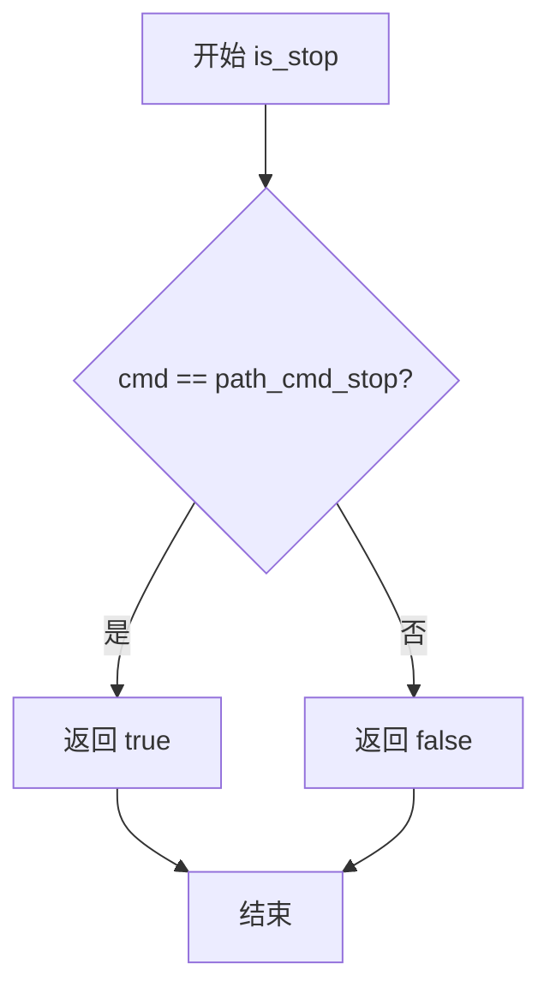
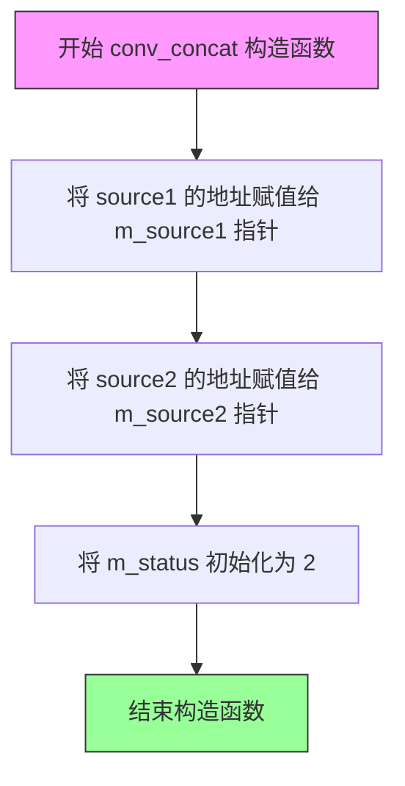
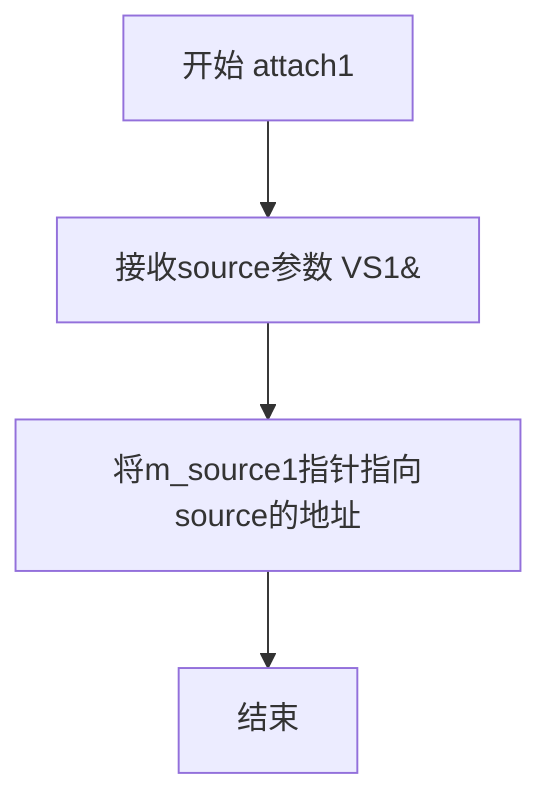
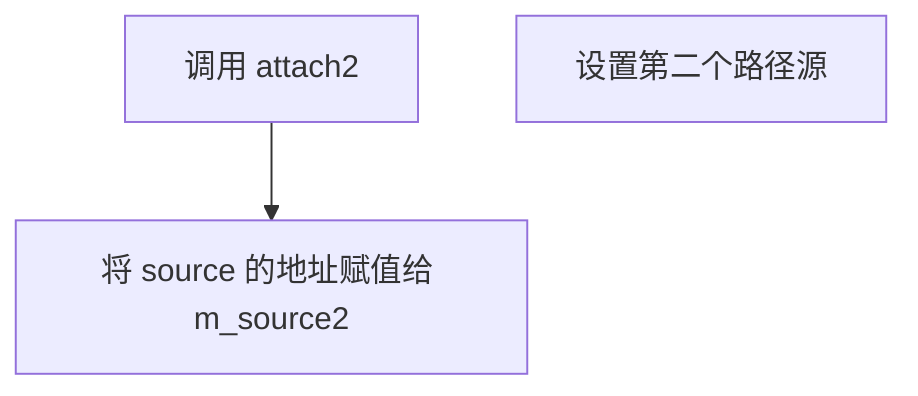
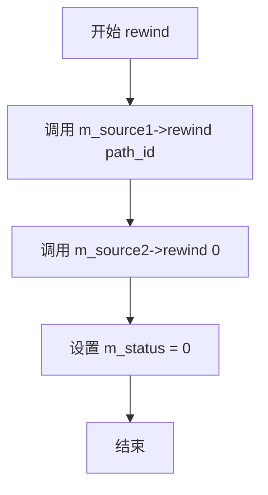
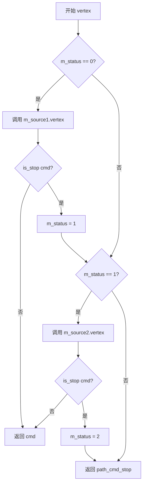

# `matplotlib\extern\agg24-svn\include\agg_conv_concat.h` 详细设计文档

这是 Anti-Grain Geometry 库中的一个路径转换器模板类，用于将两条路径（如线条和箭头标记）串联在一起，实现路径的顺序访问和顶点迭代。

## 整体流程

```mermaid
graph TD
    A[开始: 用户调用 vertex()] --> B{状态 == 0?}
    B -- 是 --> C[从 source1 获取顶点]
    C --> D{不是 path_cmd_stop?}
    D -- 是 --> E[返回顶点命令]
    D -- 否 --> F[设置状态 = 1]
    B -- 否 --> G{状态 == 1?}
    G -- 是 --> H[从 source2 获取顶点]
    H --> I{不是 path_cmd_stop?}
    I -- 是 --> J[返回顶点命令]
    I -- 否 --> K[设置状态 = 2]
    G -- 否 --> L[返回 path_cmd_stop]
    E --> M[结束]
    J --> M
    K --> L
    L --> M
```

## 类结构

```
agg::conv_concat<VS1, VS2> (模板类)
```

## 全局变量及字段


### `conv_concat.m_source1`
    
指向第一个源路径的指针

类型：`VS1*`
    


### `conv_concat.m_source2`
    
指向第二个源路径的指针

类型：`VS2*`
    


### `conv_concat.m_status`
    
当前遍历状态，0=第一个源，1=第二个源，2=结束

类型：`int`
    
    

## 全局函数及方法


### `is_stop(unsigned cmd)`

该函数继承自 `agg_basics.h` 头文件，用于判断传入的路径命令是否为停止命令（path_cmd_stop）。在 `conv_concat` 类的 `vertex` 方法中，通过调用 `is_stop` 来判断当前获取的顶点命令是否为停止命令，如果是则切换到下一个源路径继续获取顶点。

参数：

- `cmd`：`unsigned`，待检测的路径命令值

返回值：`bool`，如果 `cmd` 等于停止命令标识（path_cmd_stop）则返回 `true`，否则返回 `false`

#### 流程图



#### 带注释源码

```cpp
// 该函数定义在 agg_basics.h 中
// 用于判断路径命令是否为停止命令
// 参数 cmd: unsigned 类型的路径命令标识
// 返回值: bool 类型，true 表示该命令是停止命令，false 表示不是停止命令

inline bool is_stop(unsigned cmd)
{
    // path_cmd_stop 是预定义的停止命令常量
    // 当 vertex 函数返回 path_cmd_stop 时，表示当前路径已结束
    return cmd == path_cmd_stop;
}
```

> **注**：由于 `is_stop` 函数定义在 `agg_basics.h` 中，上述源码为基于 `agg_basics.h` 标准实现的推断代码。在 `conv_concat` 类的 `vertex` 方法中，该函数被用于判断当前源路径是否已经输出完毕，如果输出完毕则切换到下一个源路径继续处理。


### `conv_concat.conv_concat`

这是 `conv_concat` 类的构造函数，用于初始化两个源路径指针和一个状态变量，将两个路径源（通常是线条或曲线与标记如箭头）连接起来，以便顺序遍历组合后的路径。

参数：

- `source1`：`VS1&`，第一个路径源（通常是主路径，如线条或曲线）的引用
- `source2`：`VS2&`，第二个路径源（通常是标记路径，如箭头）的引用

返回值：无（构造函数）

#### 流程图



#### 带注释源码

```cpp
//----------------------------------------------------------------------------
// Anti-Grain Geometry - Version 2.4
// 模板类 conv_concat 的构造函数实现
// 用于连接两个路径源（通常用于组合线条/曲线与标记如箭头）
//----------------------------------------------------------------------------

template<class VS1, class VS2> class conv_concat
{
public:
    // 构造函数：初始化两个源路径指针和状态变量
    // 参数：
    //   source1 - 第一个路径源的引用（主路径，如线条或曲线）
    //   source2 - 第二个路径源的引用（标记路径，如箭头）
    conv_concat(VS1& source1, VS2& source2) :
        // 初始化成员指针，指向两个源路径对象
        m_source1(&source1), 
        m_source2(&source2), 
        // 设置状态为2，表示尚未开始遍历
        // 0表示正在遍历第一个源，1表示正在遍历第二个源，2表示都已遍历完成
        m_status(2) {}
    
    // ... 其他成员函数 ...
    
private:
    // 私有成员变量
    VS1* m_source1;  // 指向第一个路径源的指针
    VS2* m_source2;  // 指向第二个路径源的指针
    int  m_status;   // 遍历状态：0-遍历第一个源，1-遍历第二个源，2-已完成
    
    // 私有拷贝构造函数和赋值运算符（禁用拷贝）
    conv_concat(const conv_concat<VS1, VS2>&);
    const conv_concat<VS1, VS2>& 
        operator = (const conv_concat<VS1, VS2>&);
};
```

#### 设计说明

1. **设计目标**：实现两个路径源的顺序连接，使它们能够被作为一个连续的路径进行遍历。

2. **状态机设计**：
   - `m_status = 0`：正在遍历第一个源路径
   - `m_status = 1`：正在遍历第二个源路径
   - `m_status = 2`：两个源都已遍历完成（初始状态）

3. **指针初始化**：使用指针而非引用存储源对象，允许在运行时动态更换路径源（通过 `attach1` 和 `attach2` 方法）。

4. **拷贝语义**：显式删除拷贝构造函数和赋值运算符，防止意外的对象复制。


### `conv_concat.attach1`

附加第一个源路径，用于重新设置连接器的第一个路径源

参数：

- `source`：`VS1&`，第一个源路径的引用，用于替换当前的第一个路径源

返回值：`void`，无返回值

#### 流程图



#### 带注释源码

```
// 附加第一个源路径
// 参数: source - VS1类型的引用，新的第一个路径源
// 功能: 将m_source1指针重新指向传入的source对象
//       允许在运行时动态更换第一个路径源
void attach1(VS1& source) 
{ 
    m_source1 = &source;  // 将成员指针m_source1指向新的source对象地址
}
```


### `conv_concat.attach2`

附加第二个源路径到连接器，使连接器能够同时处理两个路径源。

参数：

-  `source`：`VS2&`，要附加的第二个路径源（通常用于标记如箭头等）

返回值：`void`，无返回值

#### 流程图



#### 带注释源码

```cpp
//----------------------------------------------------------------------------
// 附加第二个源路径到连接器
//----------------------------------------------------------------------------
// 参数:
//   source - VS2& 类型，第二个路径源引用（通常用于标记如箭头等）
// 返回值:
//   void - 无返回值
//----------------------------------------------------------------------------
void attach2(VS2& source) 
{ 
    // 将传入的第二个源路径的地址赋值给成员变量 m_source2
    // 这样连接器就知道从哪里读取第二个路径数据
    m_source2 = &source; 
}
```


### `conv_concat.rewind`

重绕到指定路径的开始位置，将两个源路径（source1和source2）都重绕到起始点，并重置内部状态为0，以便后续的顶点迭代操作可以从第一个源路径开始。

参数：

- `path_id`：`unsigned`，路径标识符，指定要重绕的路径ID，该ID会被传递给第一个源路径（m_source1）的rewind方法

返回值：`void`，无返回值

#### 流程图



#### 带注释源码

```cpp
void rewind(unsigned path_id)
{ 
    // 调用第一个源路径的rewind方法，传入指定的path_id
    // 这将把第一个路径（通常是主路径，如线条或曲线）重绕到起始位置
    m_source1->rewind(path_id);
    
    // 调用第二个源路径的rewind方法，传入0
    // 第二个路径通常是装饰性路径（如箭头标记），固定使用path_id=0
    m_source2->rewind(0);
    
    // 重置内部状态为0，表示下一次vertex调用将从第一个源路径开始获取顶点
    // 状态说明：0-从第一个源获取顶点，1-从第二个源获取顶点，2-已结束
    m_status = 0;
}
```


### `conv_concat::vertex`

获取下一个顶点，返回路径命令。该函数是路径连接器的核心方法，通过状态机机制依次从两个源路径中读取顶点数据，当第一个源路径读取完毕后自动切换到第二个源路径，直到两个源路径都读取完毕为止。

参数：

- `x`：`double*`，指向接收顶点X坐标的指针，用于输出顶点的水平位置
- `y`：`double*`，指向接收顶点Y坐标的指针，用于输出顶点的垂直位置

返回值：`unsigned`，返回路径命令（如 MoveTo、LineTo、Curve3、Curve4、Stop 等），用于描述顶点的类型和后续操作

#### 流程图



#### 带注释源码

```cpp
// 获取下一个顶点，返回路径命令
// 参数 x: 输出顶点的X坐标
// 参数 y: 输出顶点的Y坐标
// 返回: 路径命令（move_to, line_to, curve3, curve4, stop 等）
unsigned vertex(double* x, double* y)
{
    unsigned cmd;  // 存储当前获取的路径命令
    
    // 状态0：正在处理第一个源路径（m_source1）
    if(m_status == 0)
    {
        // 从第一个源获取顶点
        cmd = m_source1->vertex(x, y);
        
        // 如果不是停止命令，直接返回该命令和顶点
        if(!is_stop(cmd)) return cmd;
        
        // 第一个源已耗尽，切换到第二个源
        m_status = 1;
    }
    
    // 状态1：正在处理第二个源路径（m_source2）
    if(m_status == 1)
    {
        // 从第二个源获取顶点
        cmd = m_source2->vertex(x, y);
        
        // 如果不是停止命令，直接返回该命令和顶点
        if(!is_stop(cmd)) return cmd;
        
        // 第二个源也已耗尽
        m_status = 2;
    }
    
    // 状态2：两个源都已耗尽，返回停止命令
    return path_cmd_stop;
}
```


## 关键组件


### conv_concat 模板类

AGG库中的路径连接器，用于将两个路径（如线条和箭头标记）顺序连接起来形成单一连续路径的模板类。

### 路径源 attachment 方法组

attach1 和 attach2 方法，分别用于绑定第一个和第二个源路径（VS1和VS2类型），支持运行时动态更换路径源。

### 路径重置 rewind 方法

将连接器状态初始化为起始位置，同时重置两个源路径的读取位置，为遍历准备。

### 顶点获取 vertex 方法

核心状态机实现，按顺序从两个源路径依次获取顶点数据，通过m_status状态控制遍历流程，遇到停止命令时切换到下一源路径。

### 状态机 m_status

整型状态变量，控制当前正在读取哪个源路径：0表示正在读取source1，1表示正在读取source2，2表示已读取完毕。

### 路径源指针 m_source1, m_source2

两个模板类型的指针，分别指向第一个和第二个要连接的路径对象，支持任意符合AGG路径接口的类。

### 私有拷贝控制

私有拷贝构造函数和赋值运算符，防止对象被复制，保证资源管理的安全性。


## 问题及建议


### 已知问题

- **复制控制使用旧式声明**：使用 private 声明但不实现的方式来禁用复制构造和赋值运算符，这是 C++98 的写法，现代 C++ 应使用 `= delete` 语法
- **空指针风险**：构造函数和 attach 方法未对传入的指针进行空值检查，可能导致后续调用时空指针解引用
- **硬编码路径 ID**：`rewind` 方法中 `m_source2->rewind(0)` 硬编码了路径 ID，缺乏灵活性
- **指针参数未校验**：`vertex` 方法接收的 `x` 和 `y` 指针参数没有进行空值校验
- **状态变量类型不当**：`m_status` 使用 `int` 类型，但实际只存储 0、1、2 三个状态值，浪费内存
- **缺少 const 修饰符**：所有成员函数都未标记为 const，对于只读操作（如 attach 之外的读取方法）应该提供 const 版本

### 优化建议

- 使用 `= delete` 明确禁用复制构造和赋值运算符：`conv_concat(const conv_concat&) = delete;`
- 在构造函数和 attach 方法中添加断言或异常处理来校验指针非空
- 将 `m_status` 类型改为 `unsigned` 或 `uint8_t`，并考虑使用枚举类定义状态值
- 对 `vertex` 方法的输出指针参数进行空值检查或使用断言
- 将 `rewind` 方法改为接收两个路径 ID 参数，增加灵活性
- 考虑添加 `const` 版本的 `rewind`、`vertex`、`attach1`、`attach2` 方法
- 考虑实现移动语义（C++11+），允许资源所有权转移
- 添加文档注释说明模板类型 `VS1` 和 `VS2` 需要满足的接口要求（如需要有 `rewind` 和 `vertex` 方法）


## 其它


### 设计目标与约束

**设计目标**：提供一个通用的路径连接模板类，用于将两个独立的路径源（VS1和VS2）无缝连接起来，形成单一的连续路径流。该类采用适配器模式（Adapter Pattern），在不修改原有路径源的情况下实现路径的串接功能。

**设计约束**：
- 模板参数VS1和VS2必须提供`void rewind(unsigned path_id)`和`unsigned vertex(double* x, double* y)`接口方法
- 连接后的路径保持原有路径的顶点顺序，先输出source1的所有顶点，再输出source2的所有顶点
- 该类不持有路径数据的副本，仅持有路径源的指针引用

### 错误处理与异常设计

**异常处理策略**：本类采用无异常设计（no-throw guarantee），所有方法均不抛出异常。

**错误处理机制**：
- 顶点获取失败时返回`path_cmd_stop`命令，表示路径结束
- 内部状态机`m_status`确保顶点迭代的合法性
- 指针成员（m_source1、m_source2）默认为有效指针，由调用者保证传入参数的生命周期
- 复制构造函数和赋值运算符声明为私有并已禁用，防止意外的对象复制

### 数据流与状态机

**状态机设计**：
```
┌─────────────────────────────────────────────┐
│              conv_concat 状态机              │
├─────────────────────────────────────────────┤
│                                             │
│   m_status = 2 (初始状态)                    │
│          │                                   │
│          │ rewind() 被调用                   │
│          ▼                                   │
│   m_status = 0 (输出 source1)                │
│          │                                   │
│          │ source1 顶点耗尽                   │
│          │ is_stop(cmd) == true             │
│          ▼                                   │
│   m_status = 1 (输出 source2)                │
│          │                                   │
│          │ source2 顶点耗尽                   │
│          │ is_stop(cmd) == true             │
│          ▼                                   │
│   m_status = 2 (结束，返回 stop)              │
│                                             │
└─────────────────────────────────────────────┘
```

**数据流**：
- 输入：两个路径源（VS1& source1, VS2& source2）
- 处理：通过状态机控制两个路径源的顶点输出顺序
- 输出：连续的顶点序列（x, y坐标 + path_cmd命令）

### 外部依赖与接口契约

**依赖的外部接口**：
- `agg_basics.h`：提供基础类型定义（unsigned、double）和路径命令常量（path_cmd_stop等）
- 路径源接口要求：
  - `void rewind(unsigned path_id)`：重置路径读取位置
  - `unsigned vertex(double* x, double* y)`：获取下一个顶点，返回路径命令

**接口契约**：
- 调用者必须在conv_concat对象生命周期内保持源对象有效
- 首次调用`rewind()`后，才能调用`vertex()`获取顶点
- `vertex()`的输出参数（x, y）仅在返回非stop命令时有效
- `rewind()`的path_id参数仅传递给第一个源，第二个源始终使用path_id=0

### 模板参数约束与类型要求

**模板参数**：
- VS1：第一个路径源类型，必须实现路径访问接口
- VS2：第二个路径源类型，必须实现路径访问接口

**类型要求**：
- VS1和VS2可以是相同类型，也可以是不同类型
- 典型的模板实例化包括：conv_concat<path_adapter, path_adapter>、conv_concat<stroke, arrowhead>等

### 使用场景与典型用例

**典型使用场景**：
1. 绘制带箭头标记的线条：连接线条路径与箭头标记路径
2. 组合多个独立路径为单一路径
3. 在现有路径起点或终点添加装饰性元素

**使用示例**：
```cpp
// 伪代码示例
agg::conv_concat<source_type1, source_type2> concat(line_source, arrow_source);
concat.rewind(0);
while(cmd != agg::path_cmd_stop) {
    double x, y;
    cmd = concat.vertex(&x, &y);
    // 处理顶点...
}
```

### 性能特性

**性能考虑**：
- 时间复杂度：O(n)，n为输出顶点总数
- 空间复杂度：O(1)，仅存储三个成员变量（两个指针 + 一个状态整数）
- 每次`vertex()`调用最多触发一次源对象的`vertex()`调用
- 无动态内存分配，无数据拷贝

### 并发安全性

**线程安全**：
- 该类本身不包含线程间共享的可变状态
- 但不保证线程安全：多个线程同时访问同一conv_concat对象或共享的源对象时，需要外部同步
- 建议：每个线程使用独立的conv_concat实例，或使用互斥锁保护共享访问

### 兼容性注意事项

**版本兼容性**：
- 该代码属于AGG 2.4版本（2002-2005）
- 依赖于AGG的基础类型和常量定义
- 模板实现位于头文件中，支持编译时实例化

**平台兼容性**：
- 标准C++模板实现，无平台特定代码
- 依赖C++编译器的模板实例化机制


    