# `matplotlib\extern\agg24-svn\include\agg_conv_contour.h` 详细设计文档

这是Anti-Grain Geometry库中的一个模板类conv_contour，用于将顶点源路径转换为带有轮廓（描边）的路径，继承自conv_adaptor_vcgen适配器，通过vcgen_contour生成器实现轮廓线的生成与属性配置。

## 整体流程

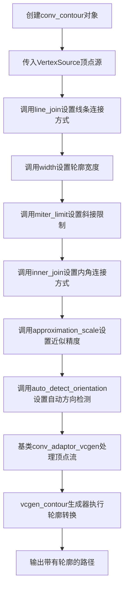

## 类结构

```
conv_adaptor_vcgen<VertexSource, vcgen_contour> (基类适配器)
└── conv_contour<VertexSource> (轮廓转换模板类)
```

## 全局变量及字段


### `conv_contour.base_type`
    
基类类型别名，继承自conv_adaptor_vcgen，用于包装顶点源和轮廓生成器

类型：`conv_adaptor_vcgen<VertexSource, vcgen_contour>`
    


### `conv_contour.conv_contour(VertexSource& vs)`
    
构造函数，接受一个顶点源引用并初始化基类conv_adaptor_vcgen

类型：`constructor`
    


### `conv_contour.line_join(line_join_e lj)`
    
设置线段连接方式，委托给底层vcgen_contour生成器

类型：`void`
    


### `conv_contour.inner_join(inner_join_e ij)`
    
设置内角连接方式，委托给底层vcgen_contour生成器

类型：`void`
    


### `conv_contour.width(double w)`
    
设置轮廓宽度，委托给底层vcgen_contour生成器

类型：`void`
    


### `conv_contour.miter_limit(double ml)`
    
设置斜接限制，委托给底层vcgen_contour生成器

类型：`void`
    


### `conv_contour.miter_limit_theta(double t)`
    
通过角度设置斜接限制，委托给底层vcgen_contour生成器

类型：`void`
    


### `conv_contour.inner_miter_limit(double ml)`
    
设置内角斜接限制，委托给底层vcgen_contour生成器

类型：`void`
    


### `conv_contour.approximation_scale(double as)`
    
设置近似精度比例，委托给底层vcgen_contour生成器

类型：`void`
    


### `conv_contour.auto_detect_orientation(bool v)`
    
设置是否自动检测方向，委托给底层vcgen_contour生成器

类型：`void`
    


### `conv_contour.line_join()`
    
获取当前线段连接方式，从底层vcgen_contour生成器获取

类型：`line_join_e`
    


### `conv_contour.inner_join()`
    
获取当前内角连接方式，从底层vcgen_contour生成器获取

类型：`inner_join_e`
    


### `conv_contour.width()`
    
获取当前轮廓宽度，从底层vcgen_contour生成器获取

类型：`double`
    


### `conv_contour.miter_limit()`
    
获取当前斜接限制，从底层vcgen_contour生成器获取

类型：`double`
    


### `conv_contour.inner_miter_limit()`
    
获取当前内角斜接限制，从底层vcgen_contour生成器获取

类型：`double`
    


### `conv_contour.approximation_scale()`
    
获取当前近似精度比例，从底层vcgen_contour生成器获取

类型：`double`
    


### `conv_contour.auto_detect_orientation()`
    
获取当前是否自动检测方向，从底层vcgen_contour生成器获取

类型：`bool`
    


### `conv_contour.operator=`
    
赋值运算符私有化，防止拷贝赋值

类型：`const conv_contour<VertexSource>&`
    


### `conv_contour.conv_contour(const conv_contour<VertexSource>&)`
    
拷贝构造函数私有化，防止拷贝构造

类型：`copy constructor`
    
    

## 全局函数及方法


### conv_contour<VertexSource>.conv_contour

该函数是 `conv_contour` 模板类的构造函数，用于初始化轮廓转换适配器，将顶点源连接到轮廓生成器。

参数：

- `vs`：`VertexSource&`，引用到顶点源对象，用于生成轮廓线

返回值：`void`（构造函数无返回值，用于构造对象实例）

#### 流程图

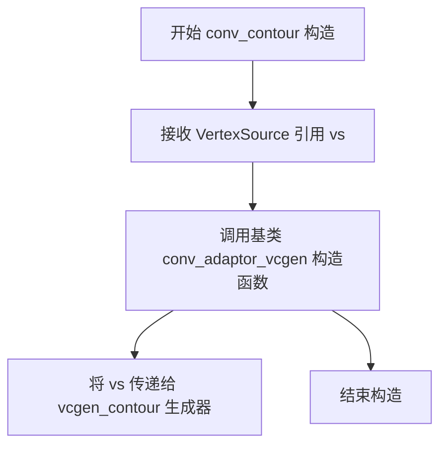

#### 带注释源码

```cpp
//----------------------------------------------------------------------------
// conv_contour 模板类的构造函数
//----------------------------------------------------------------------------
template<class VertexSource> 
struct conv_contour : public conv_adaptor_vcgen<VertexSource, vcgen_contour>
{
    // 类型别名，定义基类类型
    typedef conv_adaptor_vcgen<VertexSource, vcgen_contour> base_type;

    //-------------------------------------------------------------------------
    // 构造函数
    // 功能：初始化轮廓转换适配器，将 VertexSource 连接到 vcgen_contour 生成器
    // 参数：vs - VertexSource 引用，指向顶点源对象
    //-------------------------------------------------------------------------
    conv_contour(VertexSource& vs) : 
        // 初始化列表：调用基类构造函数，传递顶点源
        conv_adaptor_vcgen<VertexSource, vcgen_contour>(vs)
    {
        // 构造函数体为空，所有初始化工作在基类构造函数中完成
    }

    // ... 其他成员方法
};
```

---

### 补充信息

**类完整信息：**

- **类名**：`conv_contour<VertexSource>`
- **基类**：`conv_adaptor_vcgen<VertexSource, vcgen_contour>`
- **头文件**：`agg_conv_contour.h`
- **命名空间**：`agg`

**构造函数描述：**
该构造函数是模板类 `conv_contour` 的唯一构造函数，采用初始化列表方式将传入的 `VertexSource` 引用传递给基类 `conv_adaptor_vcgen` 的构造函数。基类内部会创建 `vcgen_contour` 对象并将其与顶点源关联，从而实现将顶点序列转换为轮廓线的功能。此设计遵循适配器模式，允许用户通过统一的接口操作不同类型的顶点源。


### `conv_contour<VertexSource>.line_join(line_join_e lj)`

该函数是 `conv_contour` 模板类的成员方法，用于设置轮廓生成器（vcgen_contour）的线段连接方式（line join），控制线条转角处的绘制风格。

参数：

-  `lj`：`line_join_e`，线段连接方式枚举值，用于指定轮廓生成器的线条转角类型（如尖角、圆角、斜切等）

返回值：`void`，无返回值

#### 流程图

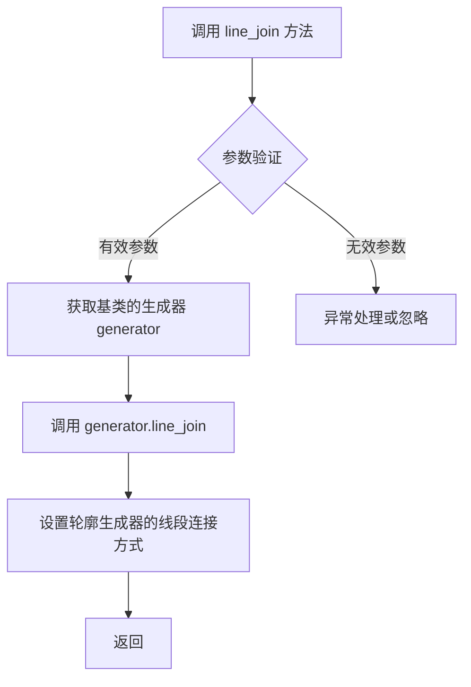

#### 带注释源码

```cpp
//----------------------------------------------------------------------------
// 函数：line_join
// 参数：lj - line_join_e 类型，表示线段连接方式
// 功能：设置轮廓生成器的线段连接方式，控制线条转角处的绘制风格
//----------------------------------------------------------------------------
void line_join(line_join_e lj) 
{ 
    // 通过基类 conv_adaptor_vcgen 获取生成器（vcgen_contour）的引用
    // 并调用其 line_join 方法设置连接方式
    base_type::generator().line_join(lj); 
}
```


### `conv_contour<VertexSource>.line_join() const`

获取当前轮廓生成器的线段连接风格（line join style），该风格决定了路径中相邻线段如何连接。

参数：
- （无参数）

返回值：`line_join_e`，表示当前使用的线段连接风格（如 miter、round、bevel）。

#### 流程图

```mermaid
flowchart TD
    A[调用 line_join() const] --> B{调用 base_type::generator().line_join()}
    B --> C[从 vcgen_contour 获取 line_join_e 枚举值]
    C --> D[返回 line_join_e 类型]
```

#### 带注释源码

```cpp
// 获取当前的线段连接风格
// 该方法调用基类的 generator（即 vcgen_contour 实例）的 line_join() 方法
// 返回值为 line_join_e 枚举类型，表示轮廓线的连接方式
line_join_e line_join() const 
{ 
    return base_type::generator().line_join(); 
}
```


### `conv_contour<VertexSource>.inner_join(inner_join_e ij)`

该方法用于设置轮廓生成器的内部连接类型（inner join style），通过调用底层 `vcgen_contour` 生成器的 `inner_join` 方法来配置轮廓曲线的内部转角处理方式。

参数：

- `ij`：`inner_join_e`，内部连接类型枚举值，用于定义路径内部转角的连接方式

返回值：`void`，无返回值

#### 流程图

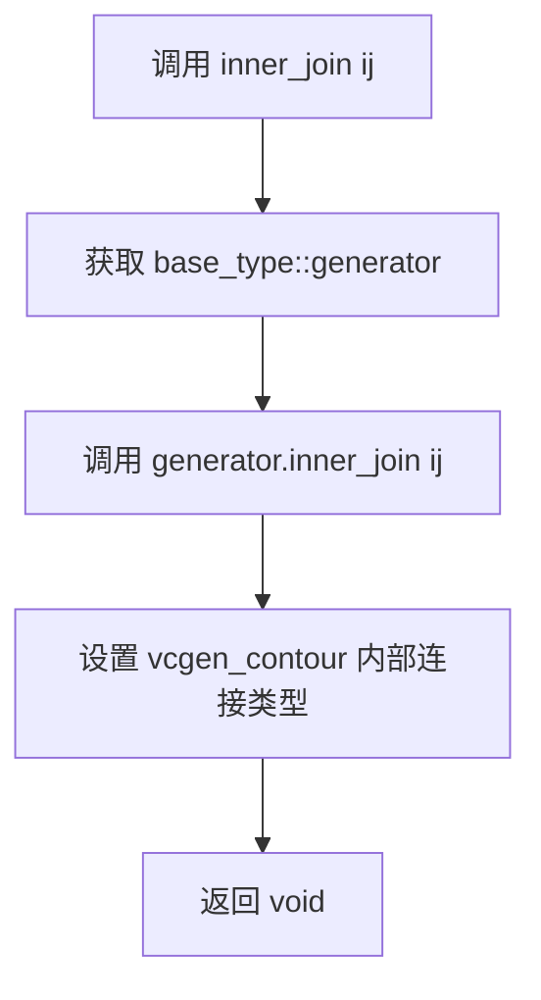

#### 带注释源码

```cpp
// 设置轮廓生成器的内部连接类型
// 参数 ij: inner_join_e 枚举类型，指定内部连接方式
void inner_join(inner_join_e ij) 
{ 
    // 委托给基类的生成器对象（vcgen_contour）设置内部连接类型
    base_type::generator().inner_join(ij); 
}
```


### `conv_contour<VertexSource>.inner_join() const`

该方法用于获取轮廓转换器的内部连接类型（inner join type），该类型定义了当轮廓路径产生内角时的连接方式。它通过调用底层 `vcgen_contour` 生成器的 `inner_join()` 方法来获取当前设置的内部连接类型，并返回一个 `inner_join_e` 枚举值。

参数：

- （无参数）

返回值：`inner_join_e`，返回当前设置的内部连接类型，用于定义轮廓路径内角的连接方式。

#### 流程图

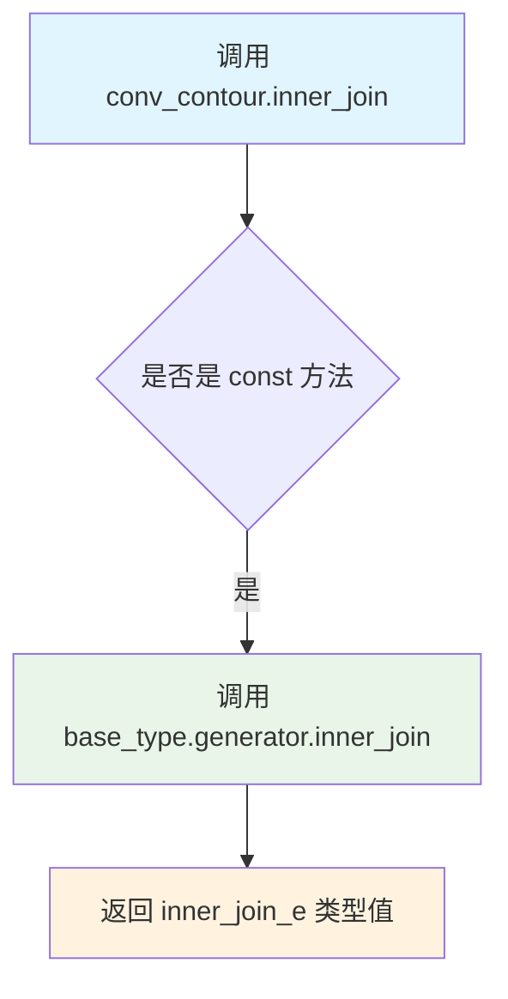

#### 带注释源码

```cpp
// 获取内部连接类型
// 该方法返回当前轮廓生成器使用的内部连接类型（inner_join_e 枚举值）
// 内部连接类型定义了当路径产生内角时如何连接线段
inner_join_e inner_join() const 
{ 
    // 通过基类获取底层 vcgen_contour 生成器，并调用其 inner_join() 方法
    // 返回的 inner_join_e 枚举值表示当前设置的连接方式
    return base_type::generator().inner_join(); 
}
```


### `conv_contour<VertexSource>::width`

该方法是 `conv_contour` 模板类的宽度设置函数，用于设置轮廓线的宽度。它通过委托调用底层生成器 `vcgen_contour` 的 `width()` 方法来设置轮廓宽度值。

参数：

- `w`：`double`，要设置的轮廓宽度值

返回值：`void`，无返回值

#### 流程图

```mermaid
flowchart TD
    A[开始 width 方法] --> B{接收参数 w}
    B --> C[调用 base_type::generator().width&#40;w&#41;]
    C --> D[vcgen_contour 内部设置宽度]
    D --> E[返回 void]
    E --> F[结束]
    
    style A fill:#e1f5fe
    style F fill:#e1f5fe
    style C fill:#fff3e0
```

#### 带注释源码

```cpp
//----------------------------------------------------------------------------
// conv_contour 模板类中的 width 方法
// 位置: agg_conv_contour.h 文件中
//----------------------------------------------------------------------------

// 宽度设置函数
// 功能: 设置轮廓线的宽度，该值被传递给底层的 vcgen_contour 生成器
// 参数: w - double 类型，表示要设置的轮廓宽度值
// 返回: void，无返回值
void width(double w) 
{ 
    // 委托调用基类的生成器（vcgen_contour）的 width 方法
    // base_type 是 conv_adaptor_vcgen<VertexSource, vcgen_contour>
    // generator() 返回内部的 vcgen_contour 实例
    base_type::generator().width(w); 
}
```

#### 上下文源码（完整方法列表）

```cpp
// 完整的 conv_contour 类width相关方法对

//------------------------------------------------------------- setter 方法
// 设置轮廓宽度
void width(double w) { base_type::generator().width(w); }

//------------------------------------------------------------- getter 方法
// 获取当前轮廓宽度
double width() const { return base_type::generator().width(); }
```

#### 关键信息说明

| 项目 | 说明 |
|------|------|
| 委托模式 | 该方法采用委托模式，将调用转发给 `vcgen_contour` 生成器 |
| 基类引用 | `base_type::generator()` 返回 `vcgen_contour` 类型的引用 |
| 线程安全 | 该方法本身不涉及线程存储，具体线程安全性取决于调用者 |
| 设计模式 | 适配器模式（Adapter Pattern）的变体 |


### `conv_contour<VertexSource>::width()`

该方法用于获取当前轮廓线（contour）的宽度设置值，通过调用内部生成器的width()方法返回轮廓线的宽度参数。

参数：

- （无参数）

返回值：`double`，返回当前设置的轮廓线宽度值

#### 流程图

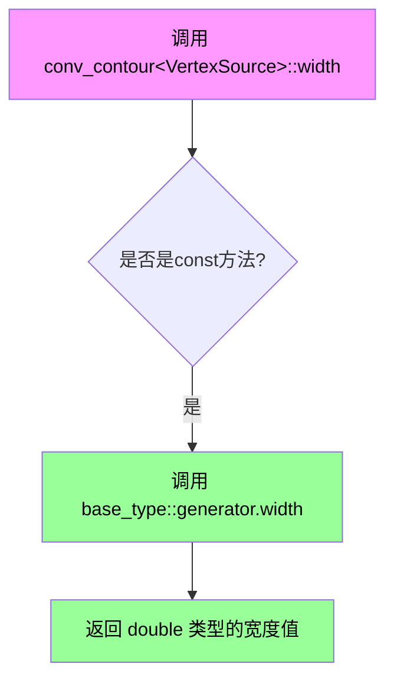

#### 带注释源码

```cpp
// 获取轮廓线宽度的getter方法
// 该方法是const的，因为其只读取状态而不修改对象
double width() const 
{ 
    // base_type 是 conv_adaptor_vcgen<VertexSource, vcgen_contour>
    // generator() 返回内部的 vcgen_contour 生成器实例
    // 调用生成器的 width() 方法获取当前设置的宽度值
    return base_type::generator().width(); 
}
```


### `conv_contour<VertexSource>.miter_limit(double ml)`

设置轮廓生成器的miter限值，用于控制尖角（miter joints）的延伸长度，防止在尖角处产生过长的尖刺。

参数：

- `ml`：`double`，miter限值，用于控制尖角处外延伸与线宽的比值。当尖角角度较小时，miter join产生的尖刺长度可能超过此限值，此时将转换为bevel join。

返回值：`void`，无返回值。

#### 流程图

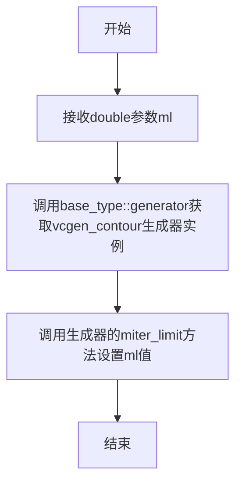

#### 带注释源码

```cpp
// 设置miter限值
// 参数ml: double类型，表示miter限值
// 该值用于控制尖角（miter joints）的延伸长度
// 当尖角角度很小时，miter join会产生过长的尖刺
// 此时系统会自动转换为bevel join以避免此问题
void miter_limit(double ml) 
{ 
    // 通过基类获取轮廓生成器(vcgen_contour)实例
    // 并调用其miter_limit方法设置限值
    base_type::generator().miter_limit(ml); 
}
```


### `conv_contour<VertexSource>.miter_limit() const`

获取轮廓线的miter limit值，用于控制路径转角处尖角的延伸长度。该方法通过调用底层生成器的miter_limit()函数返回当前的miter limit参数。

参数：无

返回值：`double`，当前设置的miter limit值

#### 流程图

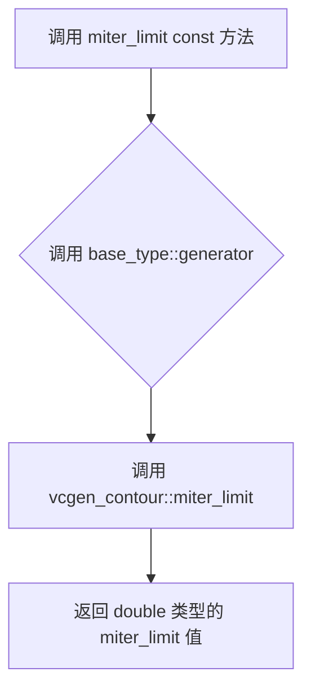

#### 带注释源码

```cpp
// 获取当前的miter_limit值
// 该值用于控制路径转角处尖角的延伸长度限制
// 返回值: double类型的miter_limit值
double miter_limit() const 
{ 
    // 通过基类模板获取vcgen_contour生成器
    // 并调用其miter_limit()获取ter_limit参数值
    return base_type::generator().miter_limit(); 
}
```


### `conv_contour<VertexSource>.miter_limit_theta(double t)`

该方法用于设置斜接（Miter）角度限制，通过给定角度值（弧度）来控制路径拐角处斜接的角度阈值，当拐角角度小于该限制时会转换为斜切（Bevel）连接。

参数：

- `t`：`double`，角度值（弧度），用于计算斜接限制的角度阈值

返回值：`void`，无返回值

#### 流程图

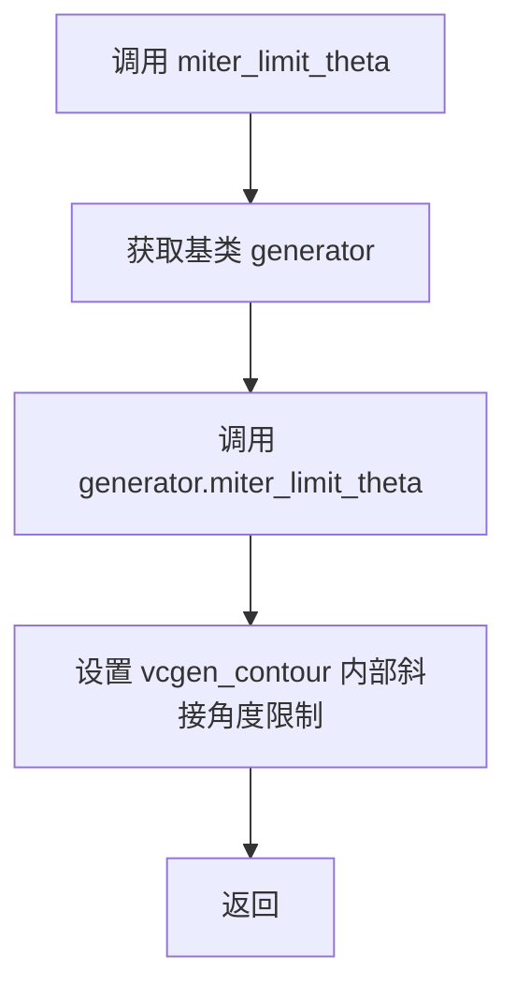

#### 带注释源码

```cpp
// 该方法是 conv_contour 类的成员方法，用于设置斜接角度限制
// 参数 t: double 类型，以弧度表示的角度值
// 该角度用于计算 miter_limit 值：miter_limit = 1.0 / sin(t / 2.0)
// 当路径拐角角度小于 2*t 时，斜接连接会转换为斜切连接
void miter_limit_theta(double t) 
{ 
    // 调用基类 conv_adaptor_vcgen 的 generator（即 vcgen_contour）的 miter_limit_theta 方法
    base_type::generator().miter_limit_theta(t); 
}
```


### `conv_contour<VertexSource>.inner_miter_limit`

该方法是一个设置器（Setter），用于将内部斜接限制（Inner Miter Limit）参数传递给底层的轮廓生成器（`vcgen_contour`），以控制路径转角处内角的延伸长度。

参数：
- `ml`：`double`，要设置的内部斜接限制值。

返回值：`void`，无返回值。

#### 流程图

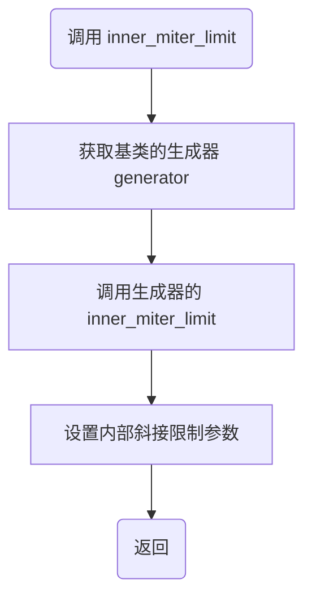

#### 带注释源码

```cpp
// 类定义位于 agg_conv_contour.h
template<class VertexSource> 
struct conv_contour : public conv_adaptor_vcgen<VertexSource, vcgen_contour>
{
    // ... 构造函数和其他方法 ...

    //-----------------------------------------------------inner_miter_limit
    // 设置内部斜接限制。当线条在拐角处延伸时，如果超过此限制，
    // 拐角可能会被截断以保持在该范围内。单位通常与坐标系统一致。
    void inner_miter_limit(double ml) 
    { 
        // 委托给内部持有的生成器对象 (vcgen_contour) 执行实际设置
        base_type::generator().inner_miter_limit(ml); 
    }

    // ... 其他方法 ...
};
```

#### 潜在的技术债务或优化空间

1.  **缺乏参数校验**：方法直接接受 `double` 类型的 `ml` 并传递给生成器，没有检查 `ml` 是否为负数或极小值（如0）。虽然底层生成器可能有校验，但在适配器层增加校验可以提供更早的错误报告。
2.  **功能单一**：该方法仅作为一个透传（Pass-through）函数，没有包含任何额外的业务逻辑或状态管理，这虽然是适配器模式的典型特征，但在调用链较长时可能会增加调试难度（断点往往停在适配器层而非实际逻辑层）。


### `conv_contour<VertexSource>.inner_miter_limit() const`

获取轮廓转换器的内部斜接限制值，用于控制路径内角转折处的斜接角度限制，防止在尖锐角度处产生过长的斜接线。

参数：  
无

返回值：`double`，返回内部斜接限制值。

#### 流程图

```mermaid
flowchart TD
    A[开始] --> B[调用 base_type::generator().inner_miter_limit]
    B --> C[返回内部斜接限制值]
    C --> D[结束]
```

#### 带注释源码

```cpp
// 获取内部斜接限制值
// 该值用于控制轮廓生成器在内角处的斜接延伸限制
double inner_miter_limit() const 
{ 
    // 通过基类的生成器获取内部斜接限制值
    return base_type::generator().inner_miter_limit(); 
}
```


### `conv_contour<VertexSource>::approximation_scale`

设置轮廓生成器的近似缩放比例，用于控制曲线逼近的精度。该方法将参数转发给内部的 vcgen_contour 生成器。

参数：

- `as`：`double`，近似缩放比例参数，用于控制曲线逼近的精度，值越大生成的顶点越多，逼近越精确

返回值：`void`，无返回值

#### 流程图

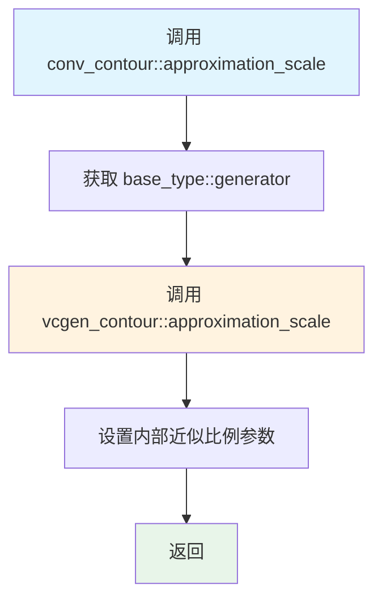

#### 带注释源码

```cpp
//----------------------------------------------------------------------------
// Anti-Grain Geometry - Version 2.4
// 设置轮廓生成器的近似缩放比例
//----------------------------------------------------------------------------
template<class VertexSource>
void conv_contour<VertexSource>::approximation_scale(double as)
{ 
    // 委托给基类的生成器（vcgen_contour）进行实际设置
    // 基类 conv_adaptor_vcgen 包含一个 vcgen_contour 生成器实例
    // approximation_scale 控制曲线逼近的精度
    base_type::generator().approximation_scale(as); 
}
```


### `conv_contour<VertexSource>.approximation_scale()`

该函数是 Anti-Grain Geometry 库中 `conv_contour` 模板类的成员方法，用于获取轮廓生成器的近似比例尺（approximation scale）。近似比例尺用于控制曲线到多边形的逼近精度，值越大逼近越粗糙，值越小逼近越精细。

参数：
- （无参数）

返回值：`double`，返回当前设置的近似比例尺值，该值控制曲线逼近的精度

#### 流程图

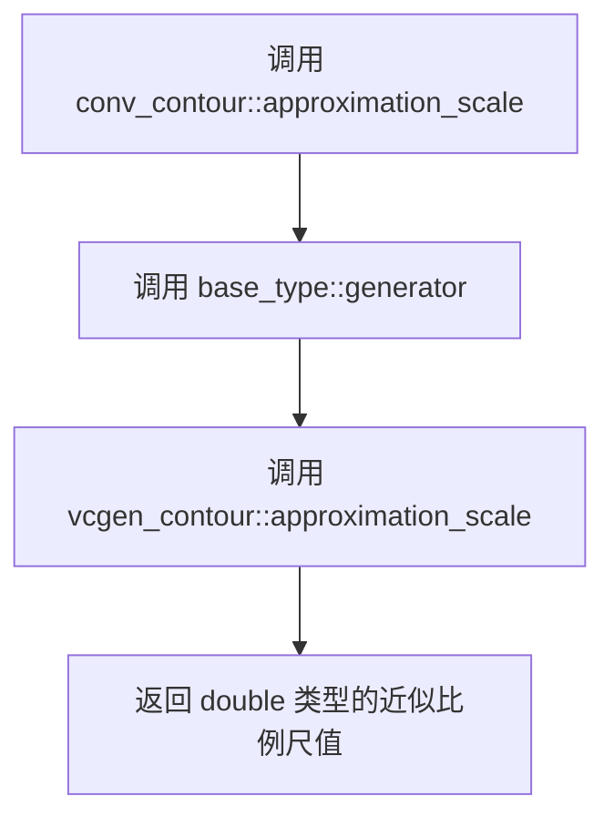

#### 带注释源码

```cpp
// 获取近似比例尺
// 该值控制曲线（如贝塞尔曲线）到多边形的逼近精度
// 较大的值产生较粗糙的逼近，较小的值产生较精细的逼近
double approximation_scale() const 
{ 
    // 通过基类模板获取轮廓生成器，并调用其 approximation_scale 方法
    // base_type 是 conv_adaptor_vcgen<VertexSource, vcgen_contour>
    // generator() 返回 vcgen_contour 类型的引用
    return base_type::generator().approximation_scale(); 
}
```


### `conv_contour<VertexSource>::auto_detect_orientation(bool v)`

该方法是 `conv_contour` 模板类的成员函数，用于设置轮廓生成器（vcgen_contour）是否自动检测输入路径的方向（顺时针或逆时针），以便正确处理填充规则。

参数：

- `v`：`bool`，指定是否启用自动方向检测。`true` 表示启用自动检测，`false` 表示禁用

返回值：`void`，无返回值

#### 流程图

```mermaid
flowchart TD
    A[调用 auto_detect_orientation] --> B{检查参数 v}
    B -->|true| C[启用自动检测方向]
    B -->|false| D[禁用自动检测方向]
    C --> E[调用 base_type.generator().auto_detect_orientation true]
    D --> F[调用 base_type.generator().auto_detect_orientation false]
    E --> G[设置 vcgen_contour 生成器自动检测标志]
    F --> G
    G --> H[方法返回]
```

#### 带注释源码

```cpp
// 设置轮廓生成器是否自动检测路径方向
// 参数: v - true启用自动检测, false禁用
// 返回: void
void auto_detect_orientation(bool v) 
{ 
    // 通过基类模板获取底层 vcgen_contour 生成器对象
    // 并调用其 auto_detect_orientation 方法设置标志
    base_type::generator().auto_detect_orientation(v); 
}
```


### `conv_contour<VertexSource>::auto_detect_orientation`

该函数是 `conv_contour` 模板类的 const 成员方法，用于获取轮廓生成器的自动方向检测功能是否启用。它通过调用基类 `conv_adaptor_vcgen` 中封装的 `vcgen_contour` 生成器的 `auto_detect_orientation()` 方法来获取当前设置，并返回布尔值。

参数：该函数无参数。

返回值：`bool`，返回当前自动检测方向功能的启用状态（true 表示启用，false 表示未启用）。

#### 流程图

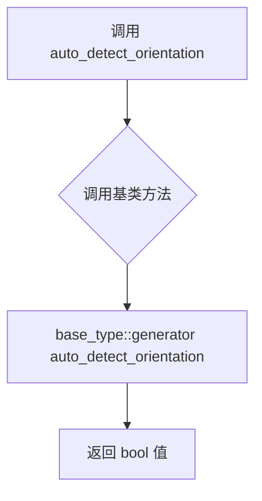

#### 带注释源码

```cpp
// 获取自动检测轮廓方向的状态
// 该方法是 const 类型的，只读访问，不修改对象状态
bool auto_detect_orientation() const 
{ 
    // 通过 base_type::generator() 获取 vcgen_contour 生成器实例
    // 并调用其 auto_detect_orientation() 方法获取当前设置
    // 返回布尔值表示是否启用了自动方向检测
    return base_type::generator().auto_detect_orientation(); 
}
```


## 关键组件


### conv_contour 模板类

轮廓转换器模板类，继承自conv_adaptor_vcgen，用于将顶点源生成的直线转换为带轮廓的几何图形，支持线段连接方式、内侧连接方式、宽度、斜接限制等属性配置。

### conv_adaptor_vcgen 适配器基类

顶点源与轮廓生成器之间的适配器模板类，封装了底层vcgen_contour生成器的调用，提供统一的接口访问。

### vcgen_contour 轮廓生成器

实际的轮廓生成实现类，负责将输入的顶点序列转换为带宽度和轮廓的输出序列，管理线型、斜接限制等渲染参数。

### line_join 线条连接方式配置

设置线条转角处的连接样式（尖角、斜切、圆角），对应line_join_e枚举类型。

### inner_join 内侧连接方式配置

设置轮廓内侧角落的连接样式（尖角、斜切、圆角），对应inner_join_e枚举类型。

### width 轮廓宽度配置

设置轮廓的宽度参数，控制生成轮廓线的粗细程度。

### miter_limit 斜接限制配置

设置斜接长度的上限，当尖角超过此限制时转换为斜切连接。

### miter_limit_theta 角度斜接限制

通过角度计算斜接限制值，提供更直观的斜接控制方式。

### inner_miter_limit 内侧斜接限制

设置内侧角落的斜接长度上限，防止内侧尖角过于尖锐。

### approximation_scale 近似比例

控制曲线逼近的精度比例，影响轮廓生成的细节程度。

### auto_detect_orientation 自动方向检测

控制是否自动检测多边形的环绕方向（顺时针/逆时针）。


## 问题及建议


### 已知问题

- **缺乏参数验证**：所有 setter 方法（如 `width()`、`miter_limit()`、`miter_limit_theta()` 等）未对输入参数进行有效性检查，可能导致运行时异常或未定义行为。例如 `width()` 应拒绝非正值，`miter_limit_theta()` 应验证角度范围。
- **无文档注释**：类和方法缺少 Doxygen 或其他格式的文档注释，开发者无法快速理解参数含义、取值范围及副作用。
- **模板类型约束不足**：`VertexSource` 模板参数未使用 `concept` 或 `static_assert` 进行约束，导致编译错误信息不友好，难以调试。
- **缺少错误处理机制**：未定义异常抛出策略，调用者无法得知操作失败的具体原因。
- **拷贝控制不完整**：虽然禁用了拷贝构造函数和赋值运算符，但未实现移动语义（C++11+），影响性能。
- **属性访问不一致**：部分 getter 方法返回 `const` 引用（如 `line_join()`），部分返回值（如 `width()`），API 设计不统一。
- **无线程安全说明**：多线程环境下对 `conv_contour` 实例的配置修改未考虑同步机制。

### 优化建议

- 为所有 setter 方法添加参数范围校验并抛出自定义异常（如 `std::invalid_argument`），或使用断言进行调试模式检查。
- 添加完整的文档注释，包括参数说明、返回值范围、异常规范及使用示例。
- 使用 C++20 `concept` 约束 `VertexSource` 模板参数，提供清晰的编译期错误信息。
- 统一 getter 方法的返回语义，建议返回 `const` 引用以避免不必要的拷贝。
- 显式删除拷贝并添加移动构造函数和移动赋值运算符。
- 在类注释中说明线程安全属性，必要时提供线程安全的配置接口。
- 考虑添加工厂方法或静态创建函数，简化实例构造过程。
- 建议添加 `noexcept` 说明符标记不会抛出异常的方法，提升代码可读性和编译器优化空间。


## 其它


### 设计目标与约束

conv_contour 模板类的设计目标是将任意顶点源（VertexSource）的路径转换为带有轮廓宽度的轮廓线。该类遵循AGG库的设计原则，提供无状态的转换器模式，通过适配器模式包装 vcgen_contour 生成器。约束条件包括：模板参数 VertexSource 必须提供有效的顶点迭代器接口，宽度值必须为非负数，角度限制参数必须符合数学约束。

### 错误处理与异常设计

该类采用非异常设计模式，不抛出异常。错误情况通过返回值或默认参数处理。例如，负数宽度会被内部生成器忽略或使用默认值。配置参数（如 miter_limit_theta）传入非法值时，生成器内部会进行边界检查并使用安全的默认值。调用者负责确保传入有效的顶点源和合理的参数范围。

### 数据流与状态机

conv_contour 本身不维护状态数据，所有状态存储在基类 conv_adaptor_vcgen 和内部生成器 vcgen_contour 中。数据流如下：外部输入顶点序列 → conv_contour 适配器 → vcgen_contour 生成器 → 输出轮廓顶点序列。生成器内部维护 IDLE、READY、PROCESSING 等状态，用于管理轮廓生成流程。轮廓生成采用流水线模式，依次处理直线、曲线、闭合路径等图元。

### 外部依赖与接口契约

主要依赖包括：agg_basics.h（基础类型定义）、agg_vcgen_contour.h（轮廓生成器）、agg_conv_adaptor_vcgen.h（适配器基类）。VertexSource 模板参数必须符合顶点源接口契约，提供 rewind() 和 vertex() 方法。输出通过 base_type 继承的 generate() 方法获取轮廓顶点。line_join_e、inner_join_e 等枚举类型定义在 agg_basics.h 中。

### 性能考虑

该类设计为零开销抽象（zero-overhead abstraction），所有方法调用直接转发到底层生成器，无额外运行时开销。模板实现避免了虚函数调用开销。内存占用仅为基类和一个被禁止的拷贝构造函数（用于防止意外拷贝）。建议在性能敏感场景下使用内联调用，并确保 VertexSource 实现为高效迭代器。

### 线程安全性

该类本身不包含可变状态，线程安全取决于底层 VertexSource 和 vcgen_contour 生成器的实现。如果 VertexSource 是只读的且生成器不共享状态，则该实例可安全用于多线程环境。但需要注意每个线程应使用独立的 conv_contour 实例或确保生成器状态的线程本地存储。

### 内存管理

该类不进行动态内存分配，依赖栈空间和模板参数类型的内存管理。内部生成器 vcgen_contour 的内存布局由具体实现决定，可能包含缓冲区用于存储中间计算结果。用户应确保 VertexSource 在整个生成周期内保持有效生命周期。

### 使用示例与调用模式

典型使用模式：创建顶点源（如 agg::path_storage）→ 构造 conv_contour 实例 → 配置轮廓参数（宽度、连接方式等）→ 通过生成器获取输出顶点。示例代码：
```
path_storage ps;
ps.move_to(0, 0);
ps.line_to(100, 0);
conv_contour<path_storage> cc(ps);
cc.width(5.0);
cc.line_join(round_join);
```

    