# `matplotlib\extern\agg24-svn\include\agg_conv_curve.h` 详细设计文档

Anti-Grain Geometry 库中的曲线转换器模板类，用于将路径存储中的贝塞尔曲线命令（curve3 二次曲线和 curve4 三次曲线）实时转换为直线段序列，支持配置近似方法、比例、角度容忍度和尖点限制等参数。

## 整体流程

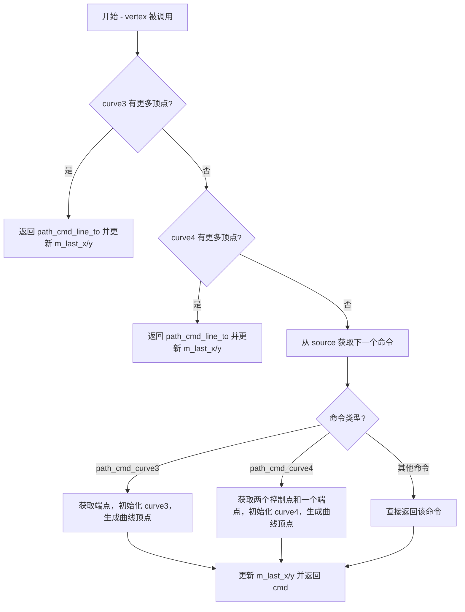

## 类结构

```
agg 命名空间
└── conv_curve<VertexSource, Curve3, Curve4> (模板类)
```

## 全局变量及字段


### `conv_curve.m_source`
    
指向顶点源的指针

类型：`VertexSource*`
    


### `conv_curve.m_last_x`
    
上一个顶点的X坐标

类型：`double`
    


### `conv_curve.m_last_y`
    
上一个顶点的Y坐标

类型：`double`
    


### `conv_curve.m_curve3`
    
二次贝塞尔曲线对象

类型：`curve3_type`
    


### `conv_curve.m_curve4`
    
三次贝塞尔曲线对象

类型：`curve4_type`
    
    

## 全局函数及方法


### 类概述

`conv_curve` 是 Anti-Grain Geometry (AGG) 库中的一个曲线转换器模板类。它的核心功能是接收包含抽象曲线命令（如 `path_cmd_curve3` 和 `path_cmd_curve4`）的顶点源，并将这些曲线实时插值计算为一系列具体的直线段（`path_cmd_line_to`），供下游渲染器使用。该类本身不存储顶点序列，而是充当一个“过滤器”或“适配器”，在获取顶点时动态计算曲线。

### 文件整体运行流程

1.  **输入阶段**：应用程序创建一个包含曲线控制点的路径存储（`VertexSource`），例如 `path_storage`。
2.  **转换阶段**：将上述路径作为 `VertexSource` 传递给 `conv_curve` 实例。
3.  **迭代阶段**：调用 `conv_curve::rewind(0)` 重置路径，并循环调用 `conv_curve::vertex(&x, &y)` 获取顶点。
    *   在 `vertex` 方法内部，如果检测到曲线命令，会调用内部的 `m_curve3` 或 `m_curve4` 对象进行插值计算。
    *   插值器会连续生成多个 `line_to` 命令，直到曲线计算完毕。
4.  **渲染阶段**：获取到的直线顶点序列被传递给扫描线渲染器（Renderer）进行绘制。

### 类的详细信息

#### 1. 类字段

- **`m_source`**：`<VertexSource*>`, 指向原始顶点源的指针，用于获取原始路径命令。
- **`m_last_x`**：`<double>`, 记录上一个顶点的 X 坐标，用于构建曲线时的起点计算。
- **`m_last_y`**：`<double>`, 记录上一个顶点的 Y 坐标，用于构建曲线时的起点计算。
- **`m_curve3`**：`<curve3_type>`, 二次贝塞尔曲线插值器实例。
- **`m_curve4`**：`<curve4_type>`, 三次贝塞尔曲线插值器实例。

#### 2. 类方法

- **`conv_curve(VertexSource& source)`**：构造函数，初始化顶点源。
- **`attach(VertexSource& source)`**：重新绑定顶点源。
- **`approximation_method(...)` / `approximation_method(...)`**：设置/获取曲线逼近方法（如 `curve_div`）。
- **`approximation_scale(...)` / `approximation_scale(...)`**：设置/获取曲线逼近精度。
- **`angle_tolerance(...)` / `angle_tolerance(...)`**：设置/获取角度容忍度。
- **`cusp_limit(...)` / `cusp_limit(...)`**：设置/获取尖角限制。
- **`rewind(unsigned path_id)`**：倒回（重置）路径到指定 ID，并重置曲线状态。
- **`vertex(double* x, double* y)`**：核心方法，获取下一个顶点，如果是曲线则进行插值计算。

---

### `conv_curve::conv_curve(VertexSource& source)` 详情

#### 描述

这是 `conv_curve` 类的构造函数。它接收一个对 `VertexSource` 对象的引用，并将其地址存储在内部指针 `m_source` 中。同时，它将上一次处理的顶点坐标 `m_last_x` 和 `m_last_y` 初始化为原点 (0,0)，为第一次处理路径命令做好准备。

#### 参数

- `source`：`VertexSource&`，对顶点源（如路径存储）的引用。

#### 返回值

无（构造函数）。

#### 流程图

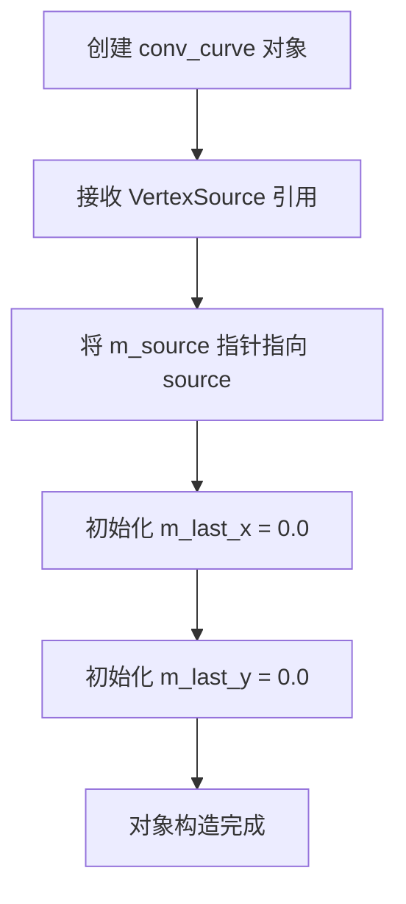

#### 带注释源码

```cpp
// 构造函数声明
// 关键字 explicit 防止隐式类型转换
// 参数 source: 传入的顶点源引用
explicit conv_curve(VertexSource& source) :
    // 初始化列表：将传入的引用转换为指针并赋值给 m_source
    m_source(&source), 
    // 初始化列表：将上一次坐标重置为 0.0，作为路径的起始点
    m_last_x(0.0), 
    m_last_y(0.0) 
{
    // 注意：m_curve3 和 m_curve4 使用默认构造函数初始化
    // 构造函数体为空，因为初始化工作在初始化列表中已完成
}
```

---

### 关键组件信息

1.  **`m_curve3` / `m_curve4`**: 内部封装的曲线插值器。它们是实现曲线到直线转换的核心算法引擎。
2.  **模板参数 `VertexSource`**: 采用了策略模式（Strategy Pattern），使得 `conv_curve` 可以与任何符合接口规范的顶点产生器（如文件读取器、生成器）配合使用。

### 潜在的技术债务或优化空间

1.  **状态初始化硬编码**: 构造函数将 `m_last_x/y` 硬编码为 0.0。在某些应用场景中，如果顶点源不是从 (0,0) 开始，这可能会导致在 `rewind` 之前调用 `vertex` 时产生一条从 (0,0) 到起点的额外线段。不过，`rewind` 方法总是会在使用前被调用，这减轻了这个问题。
2.  **缺乏所有权语义**: `m_source` 仅是一个原始指针，类本身不管理其生命周期。如果外部 `VertexSource` 在 `conv_curve` 之前被销毁，将导致悬挂指针（Dangling Pointer）。

### 其它项目

#### 设计目标与约束
- **非拥有性（Non-owning）**: 该类不负责释放 `VertexSource` 的内存。
- **无状态重置（Stateless Reset）**: 依赖于显式调用 `rewind` 来设置路径 ID 和重置内部曲线状态。

#### 错误处理与异常设计
- **AGG 风格**: 该代码基于 AGG 库的风格，不使用异常，而是依赖返回值（如 `path_cmd_stop`）来指示结束或错误。
- **断言**: 可能在调试模式下使用断言检查 `m_source` 是否为空，但在提供的代码片段中未明显体现。

#### 数据流与状态机
- **状态依赖**: `vertex` 方法的实现高度依赖 `m_last_x` 和 `m_last_y` 的状态。它通过保存“上一个顶点”来作为当前曲线的起始点，这是状态机的典型表现。


### `conv_curve.attach`

该方法用于将新的顶点源（VertexSource）附加到conv_curve转换器对象中，以便对新的路径存储进行曲线拟合处理。

参数：

- `source`：`VertexSource&`，要附加的顶点源引用

返回值：`void`，无返回值

#### 流程图

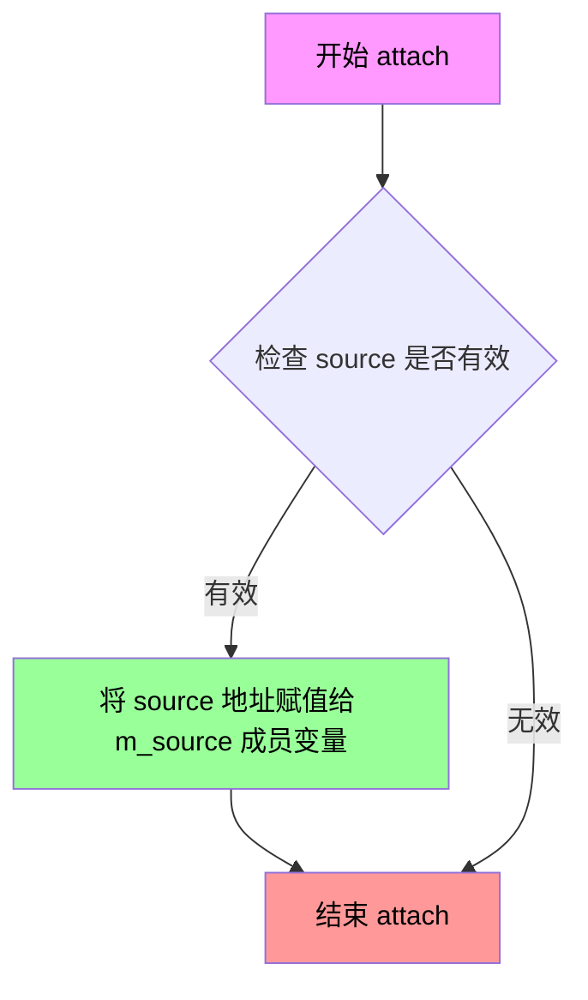

#### 带注释源码

```cpp
//----------------------------------------------------------------------------
// conv_curve::attach - 附加新的顶点源
//----------------------------------------------------------------------------
// 参数:
//   VertexSource& source - 要附加的顶点源引用
// 返回值:
//   void - 无返回值
//----------------------------------------------------------------------------
void attach(VertexSource& source) 
{ 
    // 将传入的VertexSource对象的地址赋值给成员指针m_source
    // 这会替换之前附加的任何顶点源
    m_source = &source; 
}
```


### `conv_curve.approximation_method`

该方法用于设置曲线（Curve）的近似算法策略。在 `conv_curve` 转换器类中，它充当一个配置传递者，将指定的近似方法同时应用到内部持有的三次贝塞尔曲线对象（`m_curve3`）和四次贝塞尔曲线对象（`m_curve4`）上，从而决定这些数学曲线在离散化（渲染为线段）时的精度和分布方式。

参数：

-  `v`：`curve_approximation_method_e`，枚举类型，指定曲线逼近的方法（例如是基于角度偏差、还是基于等距节点等）。

返回值：`void`，无返回值。

#### 流程图

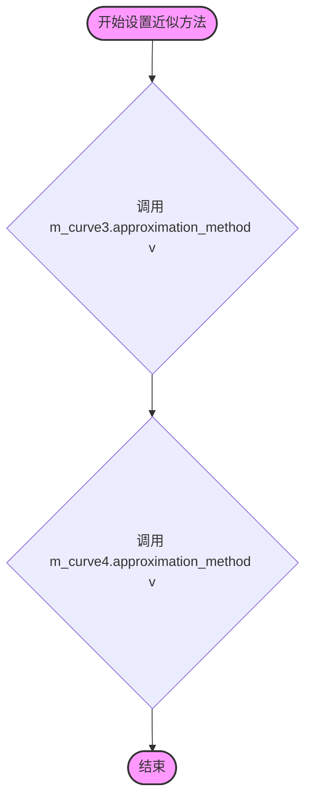

#### 带注释源码

```cpp
// 设置曲线近似方法
// 参数: v - curve_approximation_method_e 类型的枚举值，定义了曲线离散化的策略
void approximation_method(curve_approximation_method_e v) 
{ 
    // 将设置传递给内部的三次曲线对象 (curve3)
    m_curve3.approximation_method(v);
    
    // 将设置传递给内部的三次曲线对象 (curve4)
    m_curve4.approximation_method(v);
}
```


### `conv_curve.approximation_method() const`

该函数是conv_curve类的常量成员方法，用于获取当前曲线近似方法（approximation method）。它通过调用内部成员m_curve4的approximation_method()方法返回曲线近似方式，调用者可以据此了解曲线是如何被近似的（如使用直线段近似曲线的策略）。

参数：无

返回值：`curve_approximation_method_e`，返回当前曲线近似方法，该枚举值定义了曲线逼近的具体方式（如角度容差、细分程度等）。

#### 流程图

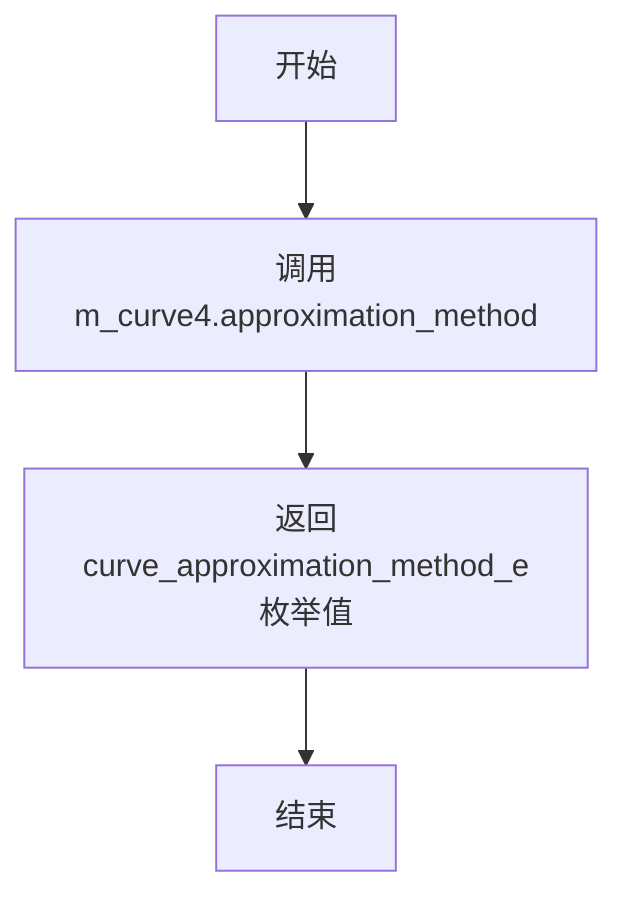

#### 带注释源码

```cpp
//----------------------------------------------------------------------------
// 获取曲线近似方法
// 该函数返回当前曲线逼近所使用的方法
// 内部委托给m_curve4对象来完成实际获取操作
//----------------------------------------------------------------------------
curve_approximation_method_e approximation_method() const 
{ 
    // 调用成员变量m_curve4（curve4类型对象）的approximation_method()方法
    // curve4对象维护着曲线的近似参数设置
    // 返回值为curve_approximation_method_e枚举类型，表示曲线的近似方式
    return m_curve4.approximation_method();
}
```

#### 补充说明

该函数的设计采用了委托模式，将实际的获取逻辑委托给内部维护的curve4类型成员对象m_curve4。虽然类中同时包含m_curve3和m_curve4两个曲线对象，但出于一致性考虑，直接返回m_curve4的近似方法设置。这种设计意味着curve3和curve4应保持相同的近似方法设置（在setter方法`approximation_method(curve_approximation_method_e v)`中确实对两者进行了同步设置）。


### `conv_curve.approximation_scale`

设置曲线近似的比例因子，用于控制曲线转换为线段时的精度。该方法同时设置三次贝塞尔曲线（curve3）和四次贝塞尔曲线（curve4）的近似比例，以确保不同阶数的曲线使用一致的近似精度。

参数：

- `s`：`double`，近似比例因子，用于调整曲线逼近的精度。较小的值会产生更精确的曲线逼近（更多线段），较大的值则产生较粗糙的逼近（更少线段）。

返回值：`void`，无返回值。

#### 流程图

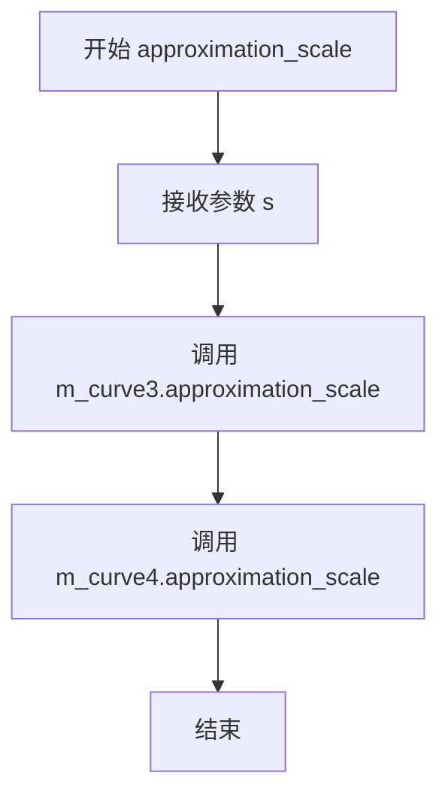

#### 带注释源码

```cpp
//----------------------------------------------------------------------------
// 函 数 名: conv_curve::approximation_scale
// 功能描述: 设置曲线近似的比例因子
// 输入参数: 
//   - s: double类型，表示近似比例因子，用于控制曲线逼近的精度
// 输出参数: 无
// 返回值: void
//----------------------------------------------------------------------------
void approximation_scale(double s) 
{ 
    // 设置三次贝塞尔曲线（curve3）的近似比例
    m_curve3.approximation_scale(s); 
    
    // 设置四次贝塞尔曲线（curve4）的近似比例
    // 两者同时设置以保持一致性
    m_curve4.approximation_scale(s); 
}
```


### `conv_curve.approximation_scale()`

获取曲线近似的比例因子（approximation scale）。该函数返回当前曲线逼近算法所使用的缩放比例，用于控制曲线分段的数量和精度。比例因子越大，曲线被分割的线段越多，曲线越平滑。

参数：该函数无参数。

返回值：`double`，返回当前设置的近似比例因子值。该值决定了曲线逼近的精度，值越大表示精度越高（线段越多）。

#### 流程图

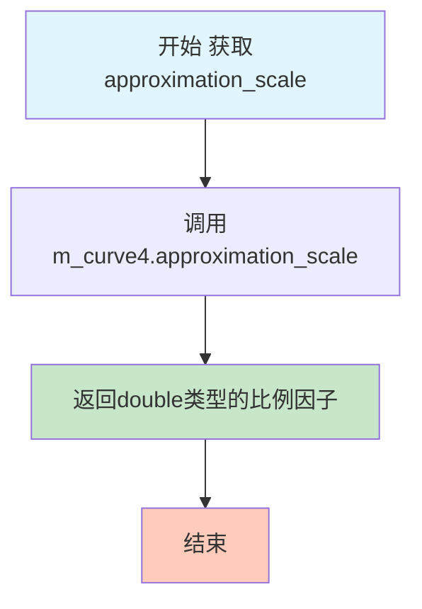

#### 带注释源码

```cpp
//----------------------------------------------------------------------------
// 获取近似比例因子
// 该函数返回当前曲线逼近算法所使用的缩放比例
// 比例因子影响曲线被离散化为直线段的数量
//----------------------------------------------------------------------------
double approximation_scale() const 
{ 
    // 直接返回成员变量m_curve4的近似比例因子
    // curve3和curve4共享相同的比例因子设置
    // 因此只需获取其中一个的值即可
    return m_curve4.approximation_scale();  
}
```


### `conv_curve.angle_tolerance`

设置曲线近似算法的角度容忍度，同时作用于 Curve3 和 Curve4 两种曲线类型。角度容忍度决定了曲线逼近的精度，较小的值会产生更多的线段从而获得更平滑的曲线。

参数：

- `v`：`double`，角度容忍度值，用于控制曲线逼近的精度

返回值：`void`，无返回值

#### 流程图

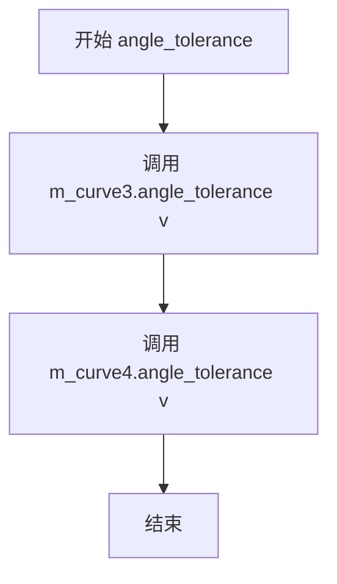

#### 带注释源码

```cpp
// 设置角度容忍度
// 参数: v - double类型的角度容忍度值
// 功能: 将角度容忍度同时传递给内部的curve3和curve4对象
//       用于控制曲线逼近时的角度精度
void angle_tolerance(double v) 
{ 
    // 调用curve3对象的setter方法设置角度容忍度
    m_curve3.angle_tolerance(v); 
    // 调用curve4对象的setter方法设置角度容忍度
    m_curve4.angle_tolerance(v); 
}
```


### `conv_curve.angle_tolerance()`

获取曲线逼近的角度容忍度（angle tolerance）。该方法是一个const成员函数，返回当前曲线逼近所使用的角度容忍度值，该值用于控制曲线逼近的精度，通过调用内部成员m_curve4的angle_tolerance()方法获取。

参数： 无

返回值：`double`，返回当前设置的angle_tolerance（角度容忍度）值，用于控制curve4曲线类型逼近时的角度精度。

#### 流程图

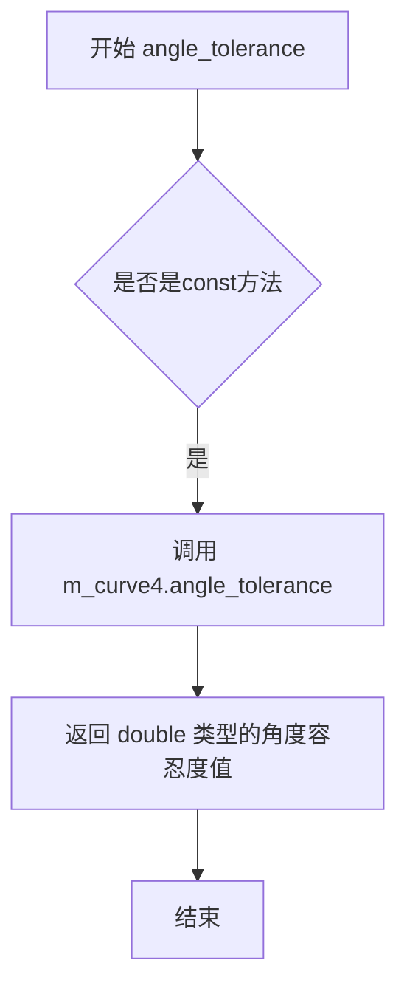

#### 带注释源码

```cpp
// 获取角度容忍度
// 返回值：double - 当前设置的angle_tolerance值
// 该值用于控制曲线逼近的角度精度
double angle_tolerance() const 
{ 
    // 通过m_curve4获取角度容忍度
    // 注意：这里使用curve4对象的值，因为curve3和curve4的angle_tolerance
    // 在setter方法中是被同步设置的
    return m_curve4.angle_tolerance();  
}
```


### `conv_curve.cusp_limit`

设置曲线尖点限制，用于控制曲线逼近时尖点的处理方式。

参数：

- `v`：`double`，尖点限制值，用于控制曲线生成时尖角的处理阈值

返回值：`void`，无返回值

#### 流程图

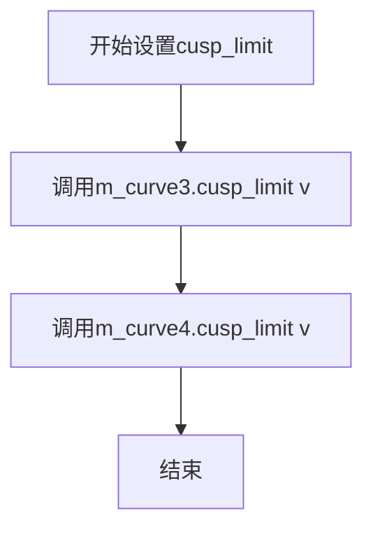

#### 带注释源码

```
void cusp_limit(double v) 
{ 
    // 设置curve3类型的尖点限制
    m_curve3.cusp_limit(v); 
    // 设置curve4类型的尖点限制
    m_curve4.cusp_limit(v); 
}
```

#### 配套的getter方法

```
double cusp_limit() const 
{ 
    // 返回curve4的尖点限制值
    return m_curve4.cusp_limit();  
}
```

#### 上下文说明

该方法是`conv_curve`模板类的成员函数，用于配置曲线逼近器（`curve3`和`curve4`）的尖点限制参数。尖点限制决定了曲线在逼近时如何处理尖锐角度——当角度小于此限制值时，该点被视为尖点并采取特殊处理。


### `conv_curve.cusp_limit()`

获取曲线的尖点限制值（cusp limit），该值用于控制曲线生成时对尖点的处理方式。

参数： 无

返回值： `double`，返回曲线的尖点限制值

#### 流程图

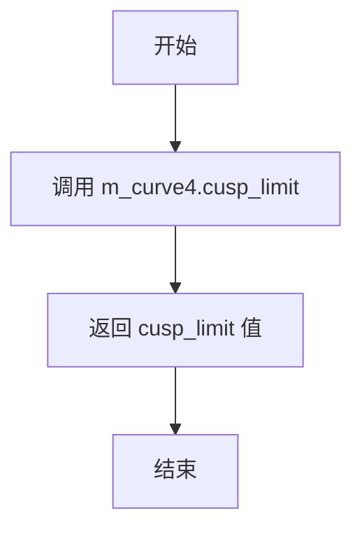

#### 带注释源码

```cpp
// 获取曲线的尖点限制值
// 该方法委托给内部的 curve4 对象来获取尖点限制
// 尖点限制用于控制曲线逼近时的尖点处理
// 如果角度超过此限制，则将尖点处作为直线端点处理
double cusp_limit() const 
{ 
    return m_curve4.cusp_limit();  
}
```


### `conv_curve.rewind`

重置曲线转换器到指定路径的起始位置，同时初始化内部状态和曲线对象。

参数：

- `path_id`：`unsigned`，指定要重置到的路径ID，用于定位路径存储中的特定路径

返回值：`void`，无返回值

#### 流程图

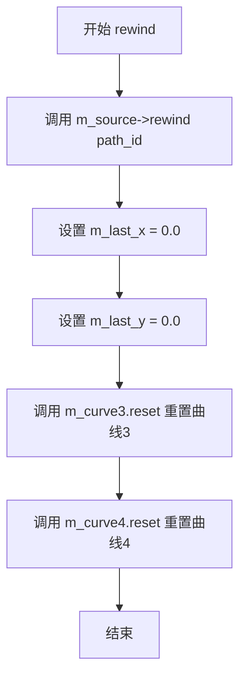

#### 带注释源码

```cpp
//------------------------------------------------------------------------
template<class VertexSource, class Curve3, class Curve4>
void conv_curve<VertexSource, Curve3, Curve4>::rewind(unsigned path_id)
{
    // 调用底层源对象的 rewind 方法，将路径迭代器重置到指定 path_id 的起始位置
    m_source->rewind(path_id);
    
    // 重置上一顶点的 X 坐标为 0.0
    m_last_x = 0.0;
    
    // 重置上一顶点的 Y 坐标为 0.0
    m_last_y = 0.0;
    
    // 重置曲线3对象，清除其内部状态，为后续曲线计算做准备
    m_curve3.reset();
    
    // 重置曲线4对象，清除其内部状态，为后续曲线计算做准备
    m_curve4.reset();
}
```


### `conv_curve.vertex`

该函数是曲线转换器的核心方法，负责从路径源获取下一个顶点，并将曲线命令（curve3/curve4）转换为一系列直线命令，是将贝塞尔曲线近似为多段直线的关键实现。

参数：

- `x`：`double*`，指向用于输出顶点X坐标的指针
- `y`：`double*`，指向用于输出顶点Y坐标的指针

返回值：`unsigned`，返回路径命令类型（如`path_cmd_line_to`、`path_cmd_move_to`、`path_cmd_stop`等），表示下一个顶点的命令类型

#### 流程图

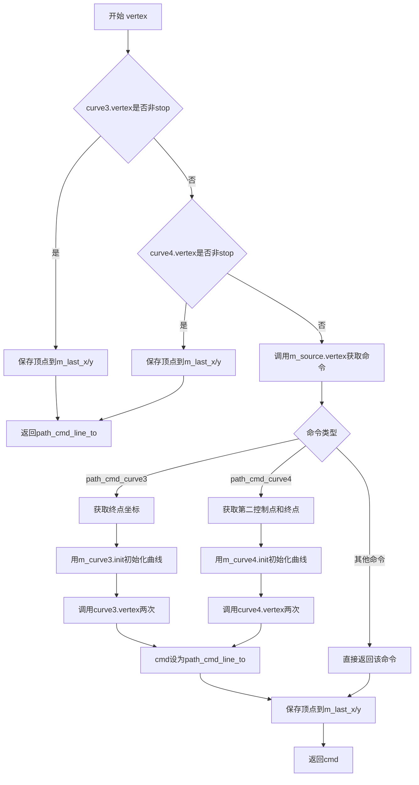

#### 带注释源码

```cpp
//------------------------------------------------------------------------
template<class VertexSource, class Curve3, class Curve4>
unsigned conv_curve<VertexSource, Curve3, Curve4>::vertex(double* x, double* y)
{
    // 首先检查curve3是否还有待输出的顶点（内部缓冲区）
    if(!is_stop(m_curve3.vertex(x, y)))
    {
        // 保存当前顶点作为下一段曲线的起点参考
        m_last_x = *x;
        m_last_y = *y;
        // 曲线近似产生的顶点都以line_to命令输出
        return path_cmd_line_to;
    }

    // 检查curve4是否还有待输出的顶点
    if(!is_stop(m_curve4.vertex(x, y)))
    {
        m_last_x = *x;
        m_last_y = *y;
        return path_cmd_line_to;
    }

    // 临时变量用于存储控制点和终点坐标
    double ct2_x;
    double ct2_y;
    double end_x;
    double end_y;

    // 从原始路径源获取下一个命令和顶点
    unsigned cmd = m_source->vertex(x, y);
    
    // 根据命令类型处理不同的曲线
    switch(cmd)
    {
    case path_cmd_curve3:
        // 获取curve3的终点（第二个控制点已被m_source->vertex获取）
        m_source->vertex(&end_x, &end_y);

        // 使用起点、起点、控制点、终点初始化curve3
        // m_last_x/y是上一条命令的终点，作为curve3的起点
        // *x/*y是当前获取的控制点
        m_curve3.init(m_last_x, m_last_y, 
                      *x,       *y, 
                      end_x,     end_y);

        // 第一次调用返回path_cmd_move_to，用于启动路径
        m_curve3.vertex(x, y);    // First call returns path_cmd_move_to
        // 第二次调用获取曲线上的第一个顶点
        m_curve3.vertex(x, y);    // This is the first vertex of the curve
        // 将命令转换为line_to，后续顶点都是直线段
        cmd = path_cmd_line_to;
        break;

    case path_cmd_curve4:
        // 获取curve4的第二个控制点和终点
        m_source->vertex(&ct2_x, &ct2_y);
        m_source->vertex(&end_x, &end_y);

        // 使用起点、控制点1、控制点2、终点初始化curve4
        m_curve4.init(m_last_x, m_last_y, 
                      *x,       *y, 
                      ct2_x,    ct2_y, 
                      end_x,    end_y);

        // 第一次调用返回path_cmd_move_to
        m_curve4.vertex(x, y);    // First call returns path_cmd_move_to
        // 第二次调用获取曲线上的第一个顶点
        m_curve4.vertex(x, y);    // This is the first vertex of the curve
        cmd = path_cmd_line_to;
        break;
    }
    
    // 更新最后顶点坐标，供下次曲线初始化使用
    m_last_x = *x;
    m_last_y = *y;
    
    // 返回当前命令，可能是line_to、move_to、stop或其他
    return cmd;
}
```


## 关键组件


### conv_curve 模板类

核心曲线转换器模板类，负责将贝塞尔曲线命令（path_cmd_curve3 和 path_cmd_curve4）转换为由直线段组成的 move_to/line_to 顶点序列，实现曲线的动态近似计算而非预先存储所有顶点。

### VertexSource 模板参数

曲线转换器的顶点数据源接口，提供了 vertex() 和 rewind() 方法用于遍历路径存储中的顶点序列，是曲线转换的输入提供者。

### curve3_type 和 curve4_type 模板参数

分别代表二次贝塞尔曲线和三次贝塞尔曲线的近似计算类，负责根据控制点实时计算曲线的离散顶点，支持多种近似方法和参数配置。

### m_source 成员变量

类型为 VertexSource 指针，存储当前绑定的顶点源引用，用于从底层路径存储获取原始曲线命令和顶点数据。

### m_last_x/m_last_y 成员变量

类型为 double，记录上一次输出的顶点坐标，用于曲线初始化时作为起点，以及在曲线命令中获取控制点和终点坐标。

### m_curve3/m_curve4 成员变量

分别为 curve3_type 和 curve4_type 类型，用于管理曲线3和曲线4的近似计算状态，包括内部状态重置和顶点生成。

### approximation_method 方法

设置曲线近似方法（直线段数量或曲线长度阈值），同时影响 curve3 和 curve4 的近似策略，用于控制曲线逼近的精度和计算方式。

### approximation_scale 方法

设置曲线近似缩放因子，调节曲线近似的整体精度尺度，数值越大产生的直线段越多、曲线越平滑。

### angle_tolerance 方法

设置角度容忍度参数，控制曲线段之间的角度变化阈值，用于在保持视觉准确性的同时减少不必要的顶点生成。

### cusp_limit 方法

设置尖点限制参数，控制曲线尖角的处理方式，用于决定何时将曲线段连接处视为尖点并应用特殊处理。

### rewind 方法

重置转换器状态，将内部曲线对象和最后坐标重置为初始值，并调用源对象的 rewind 方法准备遍历指定路径ID。

### vertex 方法

核心顶点生成方法，通过状态机逻辑依次处理 curve3、curve4 命令或将源顶点直接输出，最终返回路径命令类型并通过输出参数返回顶点坐标。

### 曲线命令识别与转换逻辑

识别 path_cmd_curve3 和 path_cmd_curve4 命令，从源获取控制点和终点坐标，初始化对应的曲线近似对象，并将曲线顶点序列转换为 path_cmd_line_to 命令输出。

### 惰性加载机制

通过 on-demand 方式实时计算曲线顶点而非预先存储完整序列，在 vertex 方法被调用时才触发曲线近似计算，有效节省内存开销。


## 问题及建议


### 已知问题

- **未实现的拷贝控制成员**：拷贝构造函数和赋值运算符被声明为 private 但未实现，这会导致链接错误或未定义行为，如果用户尝试拷贝该类实例
- **空指针风险**：`m_source` 指针在 `rewind()` 和 `vertex()` 方法中使用时没有进行空指针检查，可能导致程序崩溃
- **vertex() 方法返回值处理不当**：在处理 curve3 和 curve4 时，连续两次调用 `m_curve3.vertex(x, y)` 或 `m_curve4.vertex(x, y)`，第一次调用返回 `path_cmd_move_to`，但这个返回值被直接丢弃，没有被使用或验证
- **状态同步问题**：`attach()` 方法允许更换数据源，但不会重置 `m_last_x`、`m_last_y` 以及曲线对象的状态，可能导致状态不一致
- **初始位置假设**：成员变量 `m_last_x` 和 `m_last_y` 初始化为 0.0，但如果连接的 `VertexSource` 不是从原点开始，曲线初始化会使用错误的历史位置

### 优化建议

- 移除未实现的拷贝构造函数和赋值运算符，或提供正确的实现/删除它们（使用 `= delete`）
- 在 `rewind()` 和 `vertex()` 方法开始处添加 `m_source` 的空指针检查
- 修复 `vertex()` 方法中对 curve3/curve4 的处理，丢弃第一次 `curve.vertex()` 调用（move_to 命令），或明确处理该返回值
- 在 `attach()` 方法中重置所有状态变量，或在文档中明确说明调用此方法前需要手动重置
- 考虑添加默认参数检查或静态断言，确保模板参数 `Curve3` 和 `Curve4` 符合预期接口
- 考虑使用 `std::optional` 或其他方式显式处理初始位置未知的情况，而不是默认假设为 (0,0)


## 其它


### 设计目标与约束

该conv_curve模板类的设计目标是将VertexSource中的曲线命令（path_cmd_curve3和path_cmd_curve4）实时转换为直线段序列（path_cmd_line_to），实现曲线的近似渲染。设计约束包括：1) VertexSource必须提供vertex()和rewind()接口；2) Curve3和Curve4必须符合曲线接口规范；3) 不存储转换后的完整顶点序列，而是按需计算以节省内存；4) 转换过程对用户透明，无需修改原始数据源。

### 错误处理与异常设计

代码采用错误码而非异常机制。关键错误处理点：1) vertex()函数中使用is_stop()宏判断曲线是否结束；2) 当m_curve3和m_curve4都返回stop命令时，从m_source读取下一个命令；3) 如果VertexSource返回未处理的命令（如path_cmd_curve3/4之外的命令），直接透传；4) 未对空指针m_source做防御性检查，依赖调用者保证source有效性；5) 数值计算不产生异常，主要依靠返回值判断状态。

### 数据流与状态机

conv_curve内部维护有限状态机：1) 初始状态等待从m_source读取命令；2) 遇到path_cmd_curve3时，初始化m_curve3并开始生成线段；3) 遇到path_cmd_curve4时，初始化m_curve4并开始生成线段；4) 曲线生成期间持续调用m_curve3.vertex()或m_curve4.vertex()；5) 曲线结束后返回初始状态。状态转换由m_last_x/m_last_y维护上一个顶点的位置，用于计算曲线起始点。

### 外部依赖与接口契约

核心依赖包括：1) agg_basics.h - 提供基本类型定义和is_stop()宏；2) agg_curves.h - 提供curve3和curve4类的接口规范；3) VertexSource模板参数需实现void rewind(unsigned)和unsigned vertex(double*, double*)接口。接口契约：VertexSource的vertex()返回path_cmd_*枚举值，curve3/curve4需提供void init(...)、unsigned vertex(double*, double*)和void reset()方法。

### 内存管理策略

该类采用零动态内存分配设计：1) 所有状态存储在栈上（m_source指针、m_last_x/y、m_curve3、m_curve4）；2) 曲线顶点按需计算，不缓存历史顶点；3) 内存占用固定为O(1)，与路径复杂度无关；4) 依赖的curve3/curve4内部实现也应为栈分配。调用者需保证VertexSource生命周期覆盖conv_curve使用期间。

### 线程安全考虑

该类本身不包含锁或原子操作，非线程安全。设计要点：1) m_source指针无同步保护，多线程访问同一VertexSource需外部同步；2) m_last_x/y和曲线状态为实例私有，线程隔离无冲突；3) 多个conv_curve实例可并行使用不同的VertexSource副本。

### 性能特性

性能特征：1) 时间复杂度为O(n)，n为输出顶点数，无额外遍历；2) 曲线近似精度由approximation_scale()控制，默认值需参考curve4实现；3) angle_tolerance()和cusp_limit()影响曲线细分程度；4) 内联优化友好，关键方法vertex()和rewind()实现较简洁；5) 无虚拟函数调用，模板实例化支持编译器内联。

### 使用示例

典型用法：
```cpp
// 创建带曲线的路径
agg::path_storage ps;
ps.move_to(0, 0);
ps.curve3(10, 100, 50, 100);  // 二次Bezier
ps.curve4(60, 100, 80, 50, 100, 50);  // 三次Bezier

// 包装为曲线转换器
agg::conv_curve<agg::path_storage> converter(ps);

// 渲染时获取顶点序列
converter.rewind(0);
double x, y;
unsigned cmd;
while ((cmd = converter.vertex(&x, &y)) != agg::path_cmd_stop) {
    // 渲染直线段...
}
```

### 术语表

- VertexSource: 顶点数据源接口，遵循访问者模式
- curve3: 二次Bezier曲线（2个控制点）
- curve4: 三次Bezier曲线（4个控制点），亦可近似圆弧
- approximation: 曲线到直线段的近似算法
- path_cmd_*: 路径命令枚举（move_to, line_to, curve3, curve4, stop等）

    