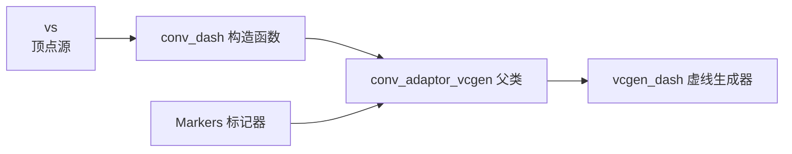
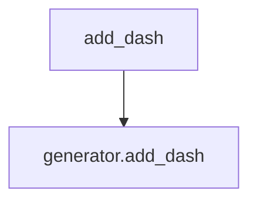
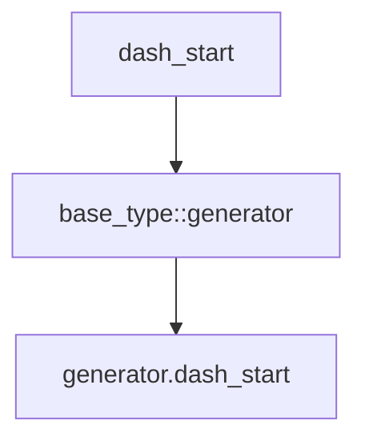
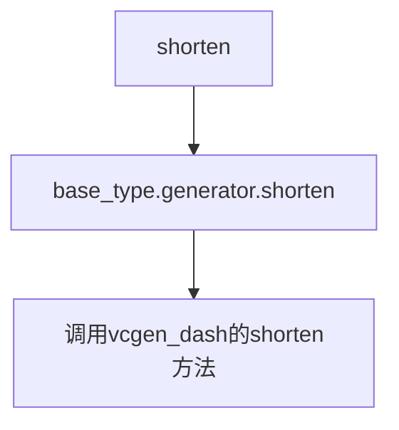
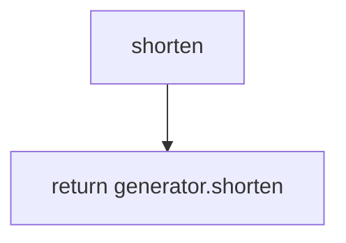

# `matplotlib\extern\agg24-svn\include\agg_conv_dash.h` 详细设计文档

这是 Anti-Grain Geometry (AGG) 图形库中的一个头文件，定义了一个用于将顶点源转换为虚线轮廓的模板类 conv_dash。该类继承自 conv_adaptor_vcgen，提供了添加、删除虚线图案以及控制虚线起始位置和缩短距离的功能。

## 整体流程

```mermaid
graph TD
    A[开始] --> B[实例化 conv_dash 对象]
    B --> C[传入 VertexSource]
    C --> D{需要添加虚线?}
    D -- 是 --> E[调用 add_dash(dash_len, gap_len)]
    D -- 否 --> F[调用 dash_start 设置起始位置]
    E --> G{需要调整虚线长度?}
    F --> G
    G -- 是 --> H[调用 shorten 调整]
    G -- 否 --> I[处理顶点生成]
    H --> I
    I --> J[输出虚线轮廓]
```

## 类结构

```
conv_adaptor_vcgen<VertexSource, vcgen_dash, Markers> (基类)
└── conv_dash<VertexSource, Markers> (模板类)
```

## 全局变量及字段


### `conv_dash.base_type::generator()`
    
虚线生成器，通过基类的 generator() 方法访问

类型：`vcgen_dash`
    
    

## 全局函数及方法


### `conv_dash`

构造函数，初始化基类 conv_adaptor_vcgen，用于将虚线生成器适配到顶点源

参数：

- `vs`：`VertexSource&`，顶点源引用

返回值：`无（构造函数）`，无返回值

#### 流程图



#### 带注释源码

```
//----------------------------------------------------------------------------
// Anti-Grain Geometry - Version 2.4
// conv_dash 模板结构体 - 虚线转换器
//----------------------------------------------------------------------------

template<class VertexSource, class Markers=null_markers> 
// 模板参数：
//   VertexSource: 顶点源类型
//   Markers: 标记器类型，默认为 null_markers
struct conv_dash : public conv_adaptor_vcgen<VertexSource, vcgen_dash, Markers>
// 继承自 conv_adaptor_vcgen，将虚线生成器 vcgen_dash 适配到顶点源
{
    typedef Markers marker_type;
    // 标记器类型别名

    typedef conv_adaptor_vcgen<VertexSource, vcgen_dash, Markers> base_type;
    // 基类类型别名

    // 构造函数
    conv_dash(VertexSource& vs) : 
        // 初始化列表调用基类构造函数
        conv_adaptor_vcgen<VertexSource, vcgen_dash, Markers>(vs)
        // 将顶点源 vs 传递给基类 conv_adaptor_vcgen
    {
    }

    // 删除所有虚线模式
    void remove_all_dashes() 
    { 
        base_type::generator().remove_all_dashes(); 
    }

    // 添加虚线模式（虚线长度和间隙长度）
    void add_dash(double dash_len, double gap_len) 
    { 
        base_type::generator().add_dash(dash_len, gap_len); 
    }

    // 设置虚线起始偏移
    void dash_start(double ds) 
    { 
        base_type::generator().dash_start(ds); 
    }

    // 设置虚线缩短长度
    void shorten(double s) { base_type::generator().shorten(s); }
    // 获取虚线缩短长度
    double shorten() const { return base_type::generator().shorten(); }

private:
    // 禁用拷贝构造函数
    conv_dash(const conv_dash<VertexSource, Markers>&);
    // 禁用赋值运算符
    const conv_dash<VertexSource, Markers>& 
        operator = (const conv_dash<VertexSource, Markers>&);
};
```


### `conv_dash.remove_all_dashes`

删除所有虚线图案。该方法用于清除当前已添加的所有虚线段，使路径渲染不再使用虚线样式。

参数：无需参数

返回值：`void`，无返回值描述

#### 流程图

```mermaid
graph TD
    A[remove_all_dashes 方法被调用] --> B[调用 base_type::generator().remove_all_dashes]
    B --> C[vcgen_dash 内部移除所有虚线段]
    C --> D[返回]
```

#### 带注释源码

```cpp
// 移除所有已添加的虚线图案
// 该方法调用基类的生成器对象（vcgen_dash）来清除所有虚线段
void remove_all_dashes() 
{ 
    // 通过基类 conv_adaptor_vcgen 获取内部的 vcgen_dash 生成器实例
    // 并调用其 remove_all_dashes 方法清除所有虚线定义
    base_type::generator().remove_all_dashes(); 
}
```


### `conv_dash.add_dash`

添加一个虚线-间隙图案到线段生成器，用于后续的虚线渲染。

参数：

- `dash_len`：`double`，虚线段长度
- `gap_len`：`double`，间隙长度

返回值：`void`，无返回值

#### 流程图



#### 带注释源码

```cpp
// conv_dash.h
// Anti-Grain Geometry - Version 2.4
// 虚线转换器模板类

namespace agg
{
    //---------------------------------------------------------------conv_dash
    // 虚线转换器：将顶点源转换为带虚线图案的线段生成器
    // @tparam VertexSource 顶点源类型
    // @tparam Markers 标记器类型，默认为null_markers
    template<class VertexSource, class Markers=null_markers> 
    struct conv_dash : public conv_adaptor_vcgen<VertexSource, vcgen_dash, Markers>
    {
        // 构造函数
        // @param vs 顶点源引用
        conv_dash(VertexSource& vs) : 
            conv_adaptor_vcgen<VertexSource, vcgen_dash, Markers>(vs)
        {
        }

        // 移除所有虚线-间隙图案
        void remove_all_dashes() 
        { 
            base_type::generator().remove_all_dashes(); 
        }

        // 添加一个虚线-间隙图案
        // @param dash_len 虚线段长度
        // @param gap_len 间隙长度
        void add_dash(double dash_len, double gap_len) 
        { 
            // 调用底层vcgen_dash生成器的add_dash方法
            base_type::generator().add_dash(dash_len, gap_len); 
        }

        // 设置虚线起始偏移
        // @param ds 起始偏移量
        void dash_start(double ds) 
        { 
            base_type::generator().dash_start(ds); 
        }

        // 设置线段缩短长度
        void shorten(double s) { base_type::generator().shorten(s); }
        
        // 获取线段缩短长度
        double shorten() const { return base_type::generator().shorten(); }

    private:
        // 私有拷贝构造函数，防止拷贝
        conv_dash(const conv_dash<VertexSource, Markers>&);
        
        // 私有赋值运算符，防止赋值
        const conv_dash<VertexSource, Markers>& 
            operator = (const conv_dash<VertexSource, Markers>&);
    };
}
```


### `conv_dash.dash_start`

设置虚线的起始偏移量，用于控制虚线模式中第一条虚线的起始位置。

参数：

- `ds`：`double`，虚线起始偏移量

返回值：`void`，无返回值

#### 流程图



#### 带注释源码

```cpp
void dash_start(double ds) 
{ 
    // 调用基类的generator的dash_start方法，设置虚线起始偏移量
    // ds: 虚线起始偏移量，用于控制虚线绘制起点
    base_type::generator().dash_start(ds); 
}
```


### `conv_dash.shorten`

设置虚线的缩短距离，用于控制虚线段末端的缩短量。

参数：

-  `s`：`double`，缩短距离

返回值：`void`，无返回值

#### 流程图



#### 带注释源码

```cpp
// 缩短虚线末端距离
// @param s double 缩短距离值
void shorten(double s) 
{ 
    // 委托给底层vcgen_dash生成器的shorten方法
    base_type::generator().shorten(s); 
}
```


### `conv_dash.shorten`

获取当前虚线的缩短距离。该方法是 conv_dash 模板类的 const 成员函数，用于返回虚线生成器中当前设置的缩短距离值。

参数：

- （无参数）

返回值：`double`，返回当前虚线的缩短距离

#### 流程图



#### 带注释源码

```
// 获取当前虚线的缩短距离
// 返回值：double - 当前设置的缩短距离值
double shorten() const 
{ 
    // 通过基类的 generator 获取 shorten 值并返回
    return base_type::generator().shorten(); 
}
```


## 关键组件


### conv_dash

核心转换适配器类，继承自 `conv_adaptor_vcgen`，用于将虚线（dash）模式应用到顶点源（VertexSource），支持添加、移除虚线模式以及控制虚线起始位置和缩短长度。

### conv_adaptor_vcgen

基类适配器，提供通用的顶点生成器封装接口，将 VertexSource 与 vcgen_dash 生成器连接起来。

### vcgen_dash

虚线生成器类，负责实际的虚线生成逻辑，包含在 agg_vcgen_dash 头文件中。

### Markers（模板参数）

标记类型模板参数，默认为 null_markers，用于在虚线生成过程中跟踪位置信息。

### remove_all_dashes()

清除所有已定义的虚线模式，将虚线列表重置为空。

### add_dash(double dash_len, double gap_len)

添加一个虚线-间隙（dash-gap）模式，dash_len 定义虚线段长度，gap_len 定义间隙长度。

### dash_start(double ds)

设置虚线序列的起始偏移量，控制虚线从哪个位置开始生成。

### shorten(double s)

设置虚线端点的缩短距离，可用于创建虚线末端与完整端点之间的间隙。

### shorten() const

获取当前虚线端点缩短距离的取值。


## 问题及建议


### 已知问题

-   **缺少移动语义支持**：私有拷贝构造函数和赋值运算符被删除（禁用），但未实现移动构造和移动赋值操作符，C++11 环境下无法高效转移对象
-   **参数验证缺失**：`add_dash(double dash_len, double gap_len)` 函数未对负值或零值进行验证，可能导致未定义行为
-   **设计局限性**：当前仅支持单一的 dash_len 和 gap_len 参数，无法实现复杂的虚线模式（如 [dash, gap, dash, gap] 数组）
-   **shorten 方法语义不明确**：`shorten` 方法缺乏文档说明，参数和返回值的含义不清晰
-   **模板代码膨胀风险**：作为模板类，不同模板参数组合会生成多份代码，可能增加最终二进制体积

### 优化建议

-   **添加参数校验**：在 `add_dash` 函数中添加参数有效性检查，拒绝负值或零值，并考虑抛出异常或使用断言
-   **实现移动语义**：添加移动构造和移动赋值运算符，提升性能并符合现代 C++ 最佳实践
-   **增强文档**：为 `shorten` 方法和关键函数添加详细的文档注释，说明参数含义、返回值和边界行为
-   **考虑扩展性**：当前 dash 模式为线性，未来可考虑支持更复杂的虚线数组模式
-   **添加异常规格说明**：明确函数的异常安全性保证


## 其它


### 设计目标与约束

conv_dash模板类的设计目标是为AGG（Anti-Grain Geometry）库提供一种将连续顶点流转换为带有虚线模式的顶点序列的通用机制。设计约束包括：1）必须是模板类以支持不同的顶点源类型；2）必须继承自conv_adaptor_vcgen以保持与AGG转换器框架的一致性；3）使用空标记类null_markers作为默认模板参数以保持灵活性；4）不允许拷贝构造和赋值操作以防止意外的资源共享。

### 错误处理与异常设计

该代码不包含显式的错误处理或异常抛出机制。所有错误情况通过返回值或无效状态表示，例如：dash_len和gap_len参数未进行有效性验证，负值可能导致未定义行为；shorten参数同样未进行边界检查。设计遵循AGG库的传统风格，不依赖异常机制，而是通过状态查询和返回值为调用者提供错误检测手段。

### 数据流与状态机

conv_dash作为管道过滤器模式的一部分，其数据流为：外部顶点源 → conv_dash → vcgen_dash生成器 → 标记器 → 输出顶点。内部状态由vcgen_dash生成器维护，包括当前虚线段长度、间隙长度、累计距离等。dash_start方法用于设置起始偏移量，实现虚线图案的相位调整。

### 外部依赖与接口契约

主要外部依赖包括：1）agg_basics.h提供基础类型定义；2）agg_vcgen_dash.h提供vcgen_dash生成器类；3）agg_conv_adaptor_vcgen.h提供conv_adaptor_vcgen基类。接口契约要求VertexSource必须提供有效的顶点生成接口，Markers类型必须符合AGG标记器接口规范。所有公共方法均为内联实现，无运行时多态开销。

### 性能考虑

所有公共方法均为内联实现，零虚函数开销。模板机制允许编译器进行静态派发和内联优化。remove_all_dashes、add_dash、dash_start、shorten等操作的时间复杂度为O(1)。由于继承自conv_adaptor_vcgen，顶点生成过程遵循流式处理模式，内存占用最小化。

### 线程安全性

该类本身不包含任何线程同步机制。线程安全性完全依赖于底层VertexSource和Markers的实现。多个conv_dash实例操作不同的顶点源时是线程安全的，但操作同一顶点源的多线程调用需要外部同步。

### 使用示例

典型使用场景：创建路径对象 → 包装于conv_dash转换器 → 添加虚线模式 → 渲染器消费生成的顶点。例如：conv_dash<path_storage> dash(path); dash.add_dash(10.0, 5.0); dash.dash_start(2.5); renderer.render(dash);

### 版本历史与变更记录

该代码属于AGG 2.4版本，版权声明显示2002-2005年。原始作者为Maxim Shemanarev。代码结构在AGG库中保持稳定，属于基础转换器组件。

### 相关参考与引用

主要参考资料：AGG官方网站http://www.antigrain.com；vcgen_dash生成器详细文档；conv_adaptor_vcgen适配器基类规范；AGG渲染管线文档。相关概念：贝塞尔曲线虚线化、路径分解、顶点生成器模式。

    