# `matplotlib\extern\agg24-svn\include\agg_conv_gpc.h` 详细设计文档

Anti-Grain Geometry库中的多边形裁剪器，基于GPC (General Polygon Clipper)库实现，提供并(Union)、交(Intersection)、异或(XOR)、A-B、B-A五种布尔运算，实现了Vertex Source接口可作为AGG的图形过滤器使用。

## 整体流程

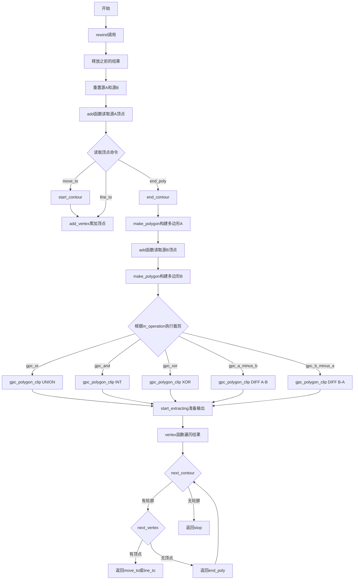

## 类结构

```
agg (命名空间)
└── conv_gpc<VSA, VSB> (模板类)
    ├── 内部枚举: status (status_move_to, status_line_to, status_stop)
    ├── 内部结构体: contour_header_type
    ├── 类型别名: vertex_array_type, contour_header_array_type
    └── 公有接口: rewind, vertex, attach1, attach2, operation
```

## 全局变量及字段


### `gpc_or`
    
GPC布尔运算：并集

类型：`enum value`
    


### `gpc_and`
    
GPC布尔运算：交集

类型：`enum value`
    


### `gpc_xor`
    
GPC布尔运算：异或

类型：`enum value`
    


### `gpc_a_minus_b`
    
GPC布尔运算：A减B

类型：`enum value`
    


### `gpc_b_minus_a`
    
GPC布尔运算：B减A

类型：`enum value`
    


### `status_move_to`
    
顶点遍历状态：移动到

类型：`enum value`
    


### `status_line_to`
    
顶点遍历状态：画线到

类型：`enum value`
    


### `status_stop`
    
顶点遍历状态：停止

类型：`enum value`
    


### `conv_gpc<VSA, VSB>.conv_gpc`
    
多边形裁剪转换器模板类，支持并、交、异或、A-B、B-A等布尔运算

类型：`模板类`
    


### `conv_gpc<VSA, VSB>.m_src_a`
    
源多边形A的指针

类型：`source_a_type*`
    


### `conv_gpc<VSA, VSB>.m_src_b`
    
源多边形B的指针

类型：`source_b_type*`
    


### `conv_gpc<VSA, VSB>.m_status`
    
当前遍历状态

类型：`status`
    


### `conv_gpc<VSA, VSB>.m_vertex`
    
当前顶点索引

类型：`int`
    


### `conv_gpc<VSA, VSB>.m_contour`
    
当前轮廓索引

类型：`int`
    


### `conv_gpc<VSA, VSB>.m_operation`
    
当前布尔运算类型

类型：`gpc_op_e`
    


### `conv_gpc<VSA, VSB>.m_vertex_accumulator`
    
顶点累加器

类型：`vertex_array_type`
    


### `conv_gpc<VSA, VSB>.m_contour_accumulator`
    
轮廓头累加器

类型：`contour_header_array_type`
    


### `conv_gpc<VSA, VSB>.m_poly_a`
    
多边形A的数据结构

类型：`gpc_polygon`
    


### `conv_gpc<VSA, VSB>.m_poly_b`
    
多边形B的数据结构

类型：`gpc_polygon`
    


### `conv_gpc<VSA, VSB>.m_result`
    
裁剪结果多边形

类型：`gpc_polygon`
    


### `conv_gpc<VSA, VSB>.contour_header_type`
    
轮廓头结构，用于存储轮廓信息

类型：`内部结构体`
    


### `contour_header_type.num_vertices`
    
顶点数

类型：`int`
    


### `contour_header_type.hole_flag`
    
洞标志

类型：`int`
    


### `contour_header_type.vertices`
    
顶点数组指针

类型：`gpc_vertex*`
    
    

## 全局函数及方法


### `conv_gpc::free_polygon`

释放 gpc_polygon 结构体中分配的所有内存资源，包括顶点数组和轮廓数组，并将结构体重置为初始零状态。

参数：

- `p`：`gpc_polygon&`，待释放的多边形引用，包含需要释放的顶点和轮廓数据

返回值：`void`，无返回值

#### 流程图

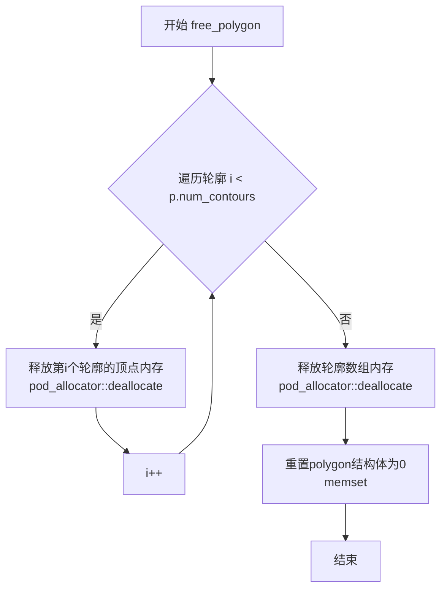

#### 带注释源码

```cpp
//------------------------------------------------------------------------
template<class VSA, class VSB> 
void conv_gpc<VSA, VSB>::free_polygon(gpc_polygon& p)
{
    int i;
    // 遍历多边形的每个轮廓，释放每个轮廓的顶点数组内存
    for(i = 0; i < p.num_contours; i++)
    {
        // 释放第i个轮廓的顶点内存块
        // 使用pod_allocator将之前分配的gpc_vertex数组归还给内存池
        pod_allocator<gpc_vertex>::deallocate(p.contour[i].vertex, 
                                              p.contour[i].num_vertices);
    }
    // 释放轮廓头数组本身的内存（gpc_vertex_list数组）
    pod_allocator<gpc_vertex_list>::deallocate(p.contour, p.num_contours);
    
    // 将整个gpc_polygon结构体清零，重置为初始状态
    // 避免悬挂指针和未定义状态
    memset(&p, 0, sizeof(gpc_polygon));
}
```


### `conv_gpc::free_result`

该函数用于释放由 GPC（General Polygon Clipper）多边形裁剪操作产生的结果多边形，释放其内部动态分配的内存，并将结果多边形结构重置为零状态，以防止悬挂指针和内存泄漏。

参数：
- 无

返回值：`void`，无返回值

#### 流程图

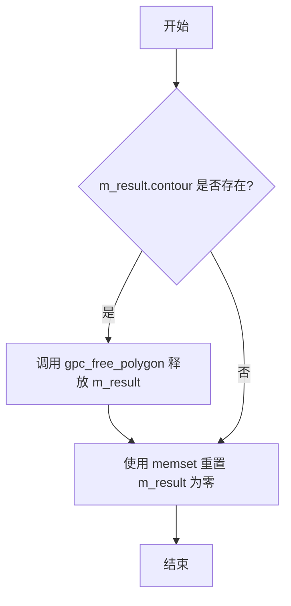

#### 带注释源码

```cpp
//------------------------------------------------------------------------
// 释放裁剪结果
//------------------------------------------------------------------------
template<class VSA, class VSB> 
void conv_gpc<VSA, VSB>::free_result()
{
    // 检查结果多边形是否有轮廓数据（即是否包含有效的多边形顶点）
    if(m_result.contour)
    {
        // 调用 GPC 库函数释放动态分配的多边形内存
        gpc_free_polygon(&m_result);
    }
    // 将结果多边形结构体的所有字节设置为 0，确保无悬挂指针
    memset(&m_result, 0, sizeof(m_result));
}
```


### `conv_gpc.free_gpc_data`

释放所有GPC（General Polygon Clipper）相关的多边形数据，包括两个源多边形（m_poly_a、m_poly_b）和一个结果多边形（m_result），防止内存泄漏。该函数在析构函数中被调用，确保对象销毁时所有堆内存被正确释放。

参数：  
无参数

返回值：`void`，无返回值，仅执行内存释放操作

#### 流程图

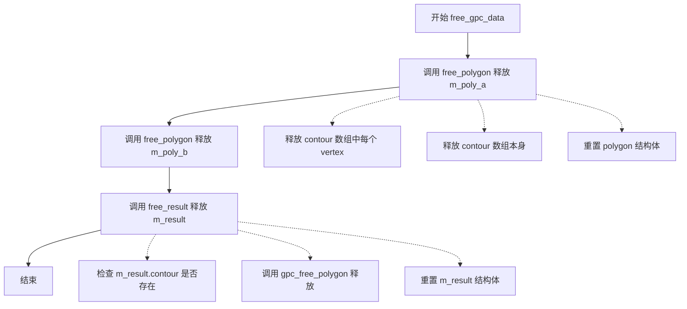

#### 带注释源码

```cpp
//------------------------------------------------------------------------
// 释放所有GPC相关数据
// 该函数是 conv_gpc 类的私有成员方法，负责释放三个多边形结构体的内存：
// m_poly_a（第一个源多边形）、m_poly_b（第二个源多边形）和 m_result（结果多边形）
//------------------------------------------------------------------------
template<class VSA, class VSB> 
void conv_gpc<VSA, VSB>::free_gpc_data()
{
    // 释放第一个源多边形 m_poly_a 的内存
    free_polygon(m_poly_a);
    
    // 释放第二个源多边形 m_poly_b 的内存
    free_polygon(m_poly_b);
    
    // 释放结果多边形 m_result 的内存
    free_result();
}
```

---

#### 相关辅助函数信息

| 函数名称 | 所在类 | 功能描述 |
|---------|--------|---------|
| `free_polygon` | `conv_gpc` | 释放单个 gpc_polygon 结构体的内存，包括 contour 数组和 vertex 数组 |
| `free_result` | `conv_gpc` | 专门释放结果多边形 m_result，使用 gpc_free_polygon 进行释放 |


### `conv_gpc.start_contour`

初始化一个新轮廓，为后续顶点的添加做准备。该函数创建一个空的轮廓头结构体并将其添加到轮廓累加器中，同时清空顶点累加器以接收新的顶点数据。

参数：无

返回值：`void`，无返回值

#### 流程图

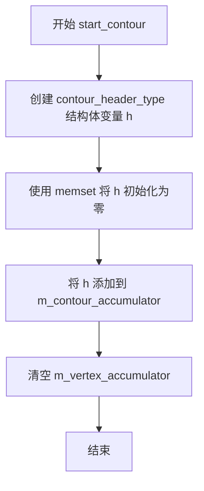

#### 带注释源码

```cpp
//------------------------------------------------------------------------
template<class VSA, class VSB> 
void conv_gpc<VSA, VSB>::start_contour()
{
    // 创建一个新的轮廓头结构体
    contour_header_type h;
    
    // 使用 memset 将结构体全部初始化为 0，确保所有字段干净
    memset(&h, 0, sizeof(h));
    
    // 将新的空轮廓头添加到轮廓累加器中
    // 轮廓累加器用于存储多边形的所有轮廓信息
    m_contour_accumulator.add(h);
    
    // 清空顶点累加器，为新轮廓的顶点收集做准备
    // 这样可以确保新轮廓从零开始收集顶点
    m_vertex_accumulator.remove_all();
}
```


### `conv_gpc.add_vertex`

将给定的坐标(x, y)封装为GPC顶点并添加到顶点累加器中。

参数：

- `x`：`double`，顶点的X坐标
- `y`：`double`，顶点的Y坐标

返回值：`void`，无返回值

#### 流程图

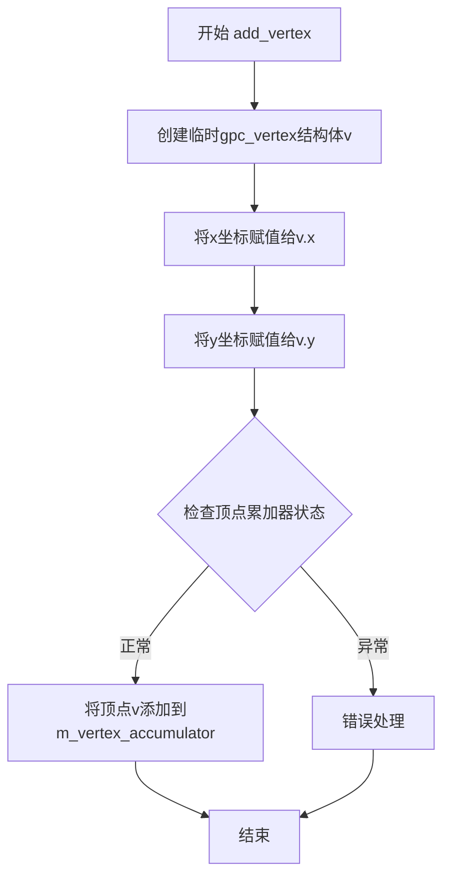

#### 带注释源码

```cpp
//------------------------------------------------------------------------
template<class VSA, class VSB> 
inline void conv_gpc<VSA, VSB>::add_vertex(double x, double y)
{
    // 创建一个临时的GPC顶点结构体，用于存储传入的坐标
    gpc_vertex v;
    
    // 将传入的X坐标赋值给临时顶点的X成员
    v.x = x;
    
    // 将传入的Y坐标赋值给临时顶点的Y成员
    v.y = y;
    
    // 将封装好的顶点添加到成员变量m_vertex_accumulator中
    // 该累加器是一个pod_bvector类型的容器，用于临时存储当前轮廓的顶点
    m_vertex_accumulator.add(v);
}
```


### `conv_gpc::end_contour`

该函数用于完成轮廓的构建，将顶点累加器中的顶点数据转移到轮廓头部结构中，如果顶点数量不足3个则移除最后一个顶点。

参数：

- `orientation`：`unsigned`，表示轮廓的方向（顺时针或逆时针），用于后续判断是否为孔洞

返回值：`void`，无返回值

#### 流程图

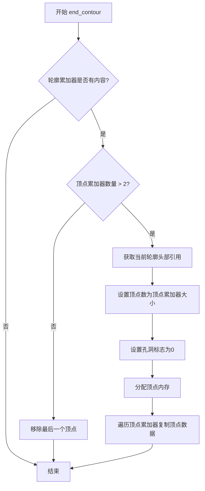

#### 带注释源码

```cpp
//------------------------------------------------------------------------
template<class VSA, class VSB> 
void conv_gpc<VSA, VSB>::end_contour(unsigned orientation)
{
    // 检查轮廓累加器中是否有待处理的轮廓
    if(m_contour_accumulator.size())
    {
        // 检查当前轮廓的顶点数量是否大于2（构成多边形至少需要3个顶点）
        if(m_vertex_accumulator.size() > 2)
        {
            // 获取当前轮廓的头部结构引用
            contour_header_type& h = 
                m_contour_accumulator[m_contour_accumulator.size() - 1];

            // 设置当前轮廓的顶点数
            h.num_vertices = m_vertex_accumulator.size();
            
            // 默认设置孔洞标志为0（非孔洞）
            h.hole_flag = 0;

            // TO DO: Clarify the "holes"
            // 如果方向为顺时针，可将孔洞标志设为1（待实现）
            //if(is_cw(orientation)) h.hole_flag = 1;

            // 为顶点数组分配内存
            h.vertices = pod_allocator<gpc_vertex>::allocate(h.num_vertices);
            
            // 将顶点数据从累加器复制到轮廓头部
            gpc_vertex* d = h.vertices;
            int i;
            for(i = 0; i < h.num_vertices; i++)
            {
                const gpc_vertex& s = m_vertex_accumulator[i];
                d->x = s.x;
                d->y = s.y;
                ++d;
            }
        }
        else
        {
            // 如果顶点数量不足3个，移除最后一个顶点（无效的退化的轮廓）
            m_vertex_accumulator.remove_last();
        }
    }
}
```


### `conv_gpc<VSA, VSB>::make_polygon`

将内部轮廓累加器数据转换为 GPC 多边形结构。该方法负责分配必要的内存并将累积的轮廓数据填充到 GPC 库所需的 `gpc_polygon` 结构中，是从顶点源构建多边形数据的关键步骤。

参数：

- `p`：`gpc_polygon&`，目标多边形结构的引用，用于存储转换后的多边形数据

返回值：`void`，无返回值

#### 流程图

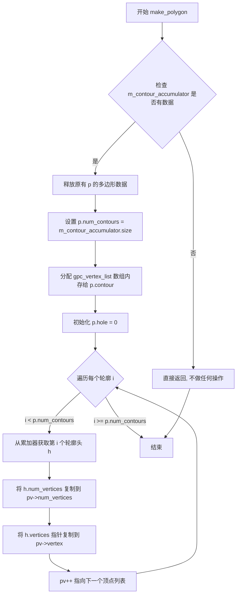

#### 带注释源码

```cpp
//------------------------------------------------------------------------
// 将内部轮廓累加器转换为 GPC 多边形结构
// 该方法将 m_contour_accumulator 中的轮廓数据填充到 gpc_polygon 结构中
// 参数 p: 目标 gpc_polygon 结构的引用
//------------------------------------------------------------------------
template<class VSA, class VSB> 
void conv_gpc<VSA, VSB>::make_polygon(gpc_polygon& p)
{
    // 首先释放目标多边形中可能已存在的旧数据
    // 避免内存泄漏
    free_polygon(p);
    
    // 检查是否有累积的轮廓数据
    if(m_contour_accumulator.size())
    {
        // 设置结果多边形的轮廓数量
        p.num_contours = m_contour_accumulator.size();

        // 初始化孔洞标志（0 表示无孔洞）
        p.hole = 0;
        
        // 为轮廓数组分配内存
        // 使用 pod_allocator 进行内存分配，这是 AGG 的内存管理方式
        p.contour = pod_allocator<gpc_vertex_list>::allocate(p.num_contours);

        int i;
        // 遍历所有累积的轮廓
        gpc_vertex_list* pv = p.contour;
        for(i = 0; i < p.num_contours; i++)
        {
            // 从轮廓头部数组中获取当前轮廓的信息
            const contour_header_type& h = m_contour_accumulator[i];
            
            // 复制顶点数
            pv->num_vertices = h.num_vertices;
            
            // 直接复制顶点数组指针（所有权转移）
            // 注意：这里不复制顶点数据，只是转移指针的所有权
            pv->vertex = h.vertices;
            
            // 移动到下一个顶点列表
            ++pv;
        }
    }
}
```


### `conv_gpc.start_extracting`

该方法用于重置内部提取状态，准备从裁剪后的结果多边形中提取顶点。它将状态重置为 `status_move_to`，并将轮廓和顶点索引初始化为 -1，以便后续调用 `vertex` 方法可以正确遍历结果。

参数：

- （无参数）

返回值：`void`，无返回值描述

#### 流程图

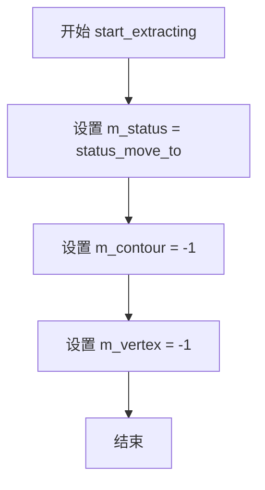

#### 带注释源码

```cpp
//------------------------------------------------------------------------
template<class VSA, class VSB> 
void conv_gpc<VSA, VSB>::start_extracting()
{
    // 重置状态为移动到模式，准备开始提取新的轮廓
    m_status = status_move_to;
    
    // 将当前轮廓索引重置为-1，表示尚未开始处理任何轮廓
    m_contour = -1;
    
    // 将当前顶点索引重置为-1，表示尚未开始处理当前轮廓的任何顶点
    m_vertex = -1;
}
```


### `conv_gpc::next_contour`

获取下一轮廓，用于在裁剪结果中迭代遍历所有轮廓。

参数：无

返回值：`bool`，如果存在下一轮廓则返回 `true`，否则返回 `false`

#### 流程图

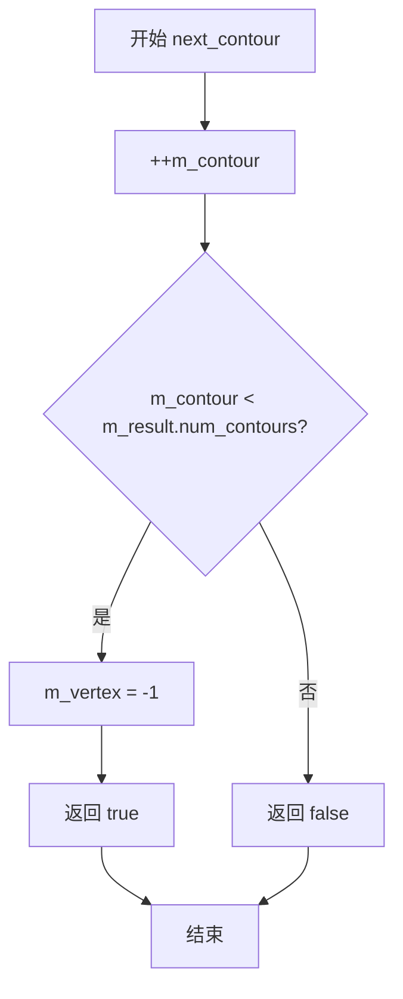

#### 带注释源码

```cpp
//------------------------------------------------------------------------
template<class VSA, class VSB> 
bool conv_gpc<VSA, VSB>::next_contour()
{
    // 增加轮廓索引，尝试移动到下一个轮廓
    if(++m_contour < m_result.num_contours)
    {
        // 重置顶点索引为-1，表示从头开始获取该轮廓的顶点
        m_vertex = -1;
        // 成功获取到下一轮廓
        return true;
    }
    // 没有更多轮廓
    return false;
}
```


### `conv_gpc<VSA, VSB>.next_vertex`

获取结果多边形中的下一个顶点。如果当前轮廓中还有未访问的顶点，则通过输出参数返回顶点的x和y坐标，并返回true；否则返回false，表示当前轮廓已访问完毕。

参数：

- `x`：`double*`，指向存储顶点x坐标的double类型指针，用于输出顶点的x坐标
- `y`：`double*`，指向存储顶点y坐标的double类型指针，用于输出顶点的y坐标

返回值：`bool`，如果成功获取到下一个顶点则返回true，否则返回false（表示当前轮廓已结束）

#### 流程图

```mermaid
flowchart TD
    A[开始 next_vertex] --> B[获取当前轮廓的顶点列表 vlist = m_result.contour[m_contour]]
    B --> C[增加顶点索引 m_vertex++]
    C --> D{检查 m_vertex < vlist.num_vertices}
    D -->|是| E[获取顶点 v = vlist.vertex[m_vertex]]
    E --> F[通过输出参数返回顶点坐标 *x = v.x, *y = v.y]
    F --> G[返回 true]
    D -->|否| H[返回 false]
    G --> I[结束]
    H --> I
```

#### 带注释源码

```cpp
//------------------------------------------------------------------------
// 获取结果多边形中的下一个顶点
// template<class VSA, class VSB> 
inline bool conv_gpc<VSA, VSB>::next_vertex(double* x, double* y)
{
    // 获取当前轮廓（由m_contour索引）的顶点列表
    const gpc_vertex_list& vlist = m_result.contour[m_contour];
    
    // 先增加顶点索引，然后检查是否越界
    if(++m_vertex < vlist.num_vertices)
    {
        // 获取当前索引处的顶点数据
        const gpc_vertex& v = vlist.vertex[m_vertex];
        
        // 通过输出参数返回顶点的x和y坐标
        *x = v.x;
        *y = v.y;
        
        // 成功获取到顶点，返回true
        return true;
    }
    
    // 当前轮廓的所有顶点已访问完毕，返回false
    return false;
}
```


### `conv_gpc::rewind`

该函数是conv_gpc类的主控制流程方法，负责执行多边形裁剪操作。它首先释放之前的结果，然后从两个源读取顶点数据构建多边形，根据设置的操作类型（并、交、异或、A-B、B-A）调用GPC库进行裁剪，最后初始化提取状态以准备输出裁剪后的结果。

参数：

- `path_id`：`unsigned`，路径标识符，用于指定要读取的路径

返回值：`void`，无返回值

#### 流程图

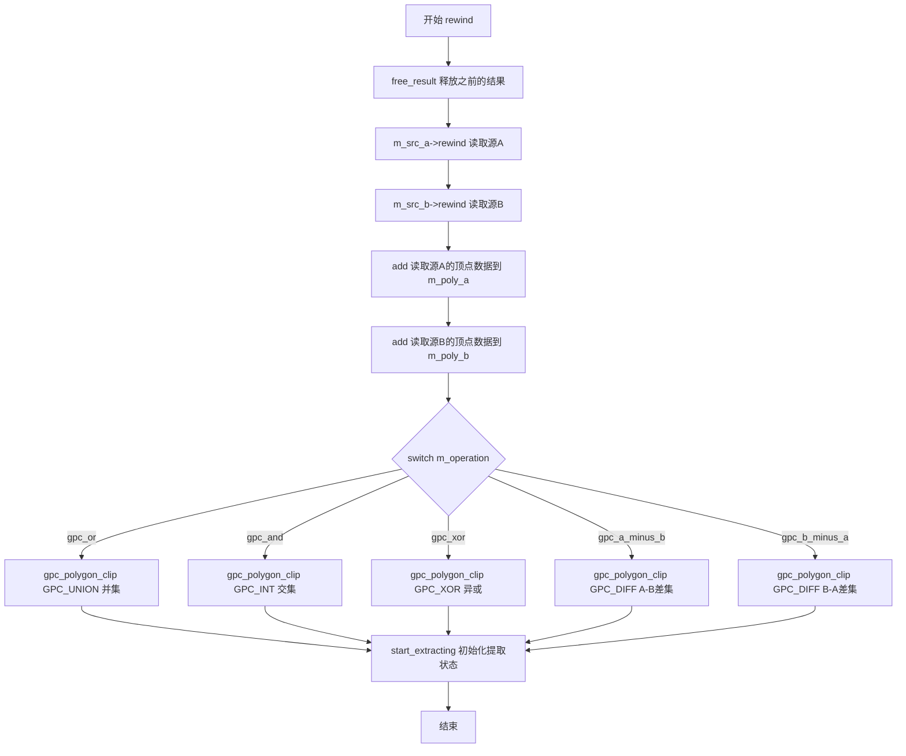

#### 带注释源码

```cpp
//------------------------------------------------------------------------
template<class VSA, class VSB> 
void conv_gpc<VSA, VSB>::rewind(unsigned path_id)
{
    // 1. 释放之前计算的结果多边形，释放内存
    free_result();
    
    // 2. 重新读取两个源顶点的指定路径
    m_src_a->rewind(path_id);
    m_src_b->rewind(path_id);
    
    // 3. 从两个源提取顶点数据，构建GPC多边形结构
    add(*m_src_a, m_poly_a);
    add(*m_src_b, m_poly_b);
    
    // 4. 根据操作类型调用GPC库进行多边形裁剪
    switch(m_operation)
    {
       // 并集操作：计算两个多边形的并集
       case gpc_or:
            gpc_polygon_clip(GPC_UNION,
                             &m_poly_a,
                             &m_poly_b,
                             &m_result);
           break;

       // 交集操作：计算两个多边形的交集
       case gpc_and:
            gpc_polygon_clip(GPC_INT,
                             &m_poly_a,
                             &m_poly_b,
                             &m_result);
           break;

       // 异或操作：计算两个多边形的异或
       case gpc_xor:
            gpc_polygon_clip(GPC_XOR,
                             &m_poly_a,
                             &m_poly_b,
                             &m_result);
           break;

       // A-B差集：从A中减去B
       case gpc_a_minus_b:
            gpc_polygon_clip(GPC_DIFF,
                             &m_poly_a,
                             &m_poly_b,
                             &m_result);
           break;

       // B-A差集：从B中减去A
       case gpc_b_minus_a:
            gpc_polygon_clip(GPC_DIFF,
                             &m_poly_b,
                             &m_poly_a,
                             &m_result);
           break;
    }
    
    // 5. 初始化提取状态，准备后续通过vertex()方法输出结果
    start_extracting();
}
```


### `conv_gpc::vertex`

该方法是conv_gpc类的顶点源接口实现，用于遍历并返回多边形布尔运算（并、交、异或、差集）结果中的顶点序列。通过内部状态机控制，依次输出各个轮廓的顶点，并根据顶点类型返回相应的路径命令（move_to、line_to、end_poly、stop）。

参数：

- `x`：`double*`，输出参数，接收顶点的x坐标
- `y`：`double*`，输出参数，接收顶点的y坐标

返回值：`unsigned`，返回路径命令标识符，可能是path_cmd_move_to（移动到）、path_cmd_line_to（画线到）、path_cmd_end_poly | path_flags_close（闭合多边形）或path_cmd_stop（停止）

#### 流程图

```mermaid
flowchart TD
    A[开始 vertex] --> B{m_status == status_move_to?}
    B -->|是| C{next_contour?}
    C -->|是| D{next_vertex?}
    D -->|是| E[设置m_status = status_line_to]
    E --> F[返回 path_cmd_move_to]
    D -->|否| G[设置m_status = status_stop]
    G --> H[返回 path_cmd_end_poly | path_flags_close]
    C -->|否| I[返回 path_cmd_stop]
    B -->|否| J{next_vertex?}
    J -->|是| K[返回 path_cmd_line_to]
    J -->|否| L[设置m_status = status_move_to]
    L --> M[返回 path_cmd_end_poly | path_flags_close]
```

#### 带注释源码

```
//------------------------------------------------------------------------
// conv_gpc类的vertex方法实现
// 输出结果多边形的顶点序列，实现Vertex Source接口
//------------------------------------------------------------------------
template<class VSA, class VSB> 
unsigned conv_gpc<VSA, VSB>::vertex(double* x, double* y)
{
    // 状态机逻辑：如果是初始状态（move_to），尝试获取第一个轮廓的第一个顶点
    if(m_status == status_move_to)
    {
        // 尝试移动到下一个轮廓
        if(next_contour()) 
        {
            // 如果存在下一个轮廓，尝试获取该轮廓的第一个顶点
            if(next_vertex(x, y))
            {
                // 成功获取顶点，状态切换为line_to，准备后续的line_to命令
                m_status = status_line_to;
                // 返回move_to命令，表示开始一个新的子路径
                return path_cmd_move_to;
            }
            // 该轮廓没有顶点，设置状态为停止，返回闭合多边形命令
            m_status = status_stop;
            return path_cmd_end_poly | path_flags_close;
        }
    }
    else
    {
        // 状态为line_to，尝试获取当前轮廓的下一个顶点
        if(next_vertex(x, y))
        {
            // 成功获取顶点，返回line_to命令
            return path_cmd_line_to;
        }
        else
        {
            // 当前轮廓顶点已遍历完，设置状态为move_to，准备处理下一个轮廓
            m_status = status_move_to;
        }
        // 返回闭合多边形命令，标志当前轮廓结束
        return path_cmd_end_poly | path_flags_close;
    }
    // 所有轮廓都已遍历完成，返回停止命令
    return path_cmd_stop;
}
```


### `conv_gpc<VSA, VSB>::add`

该模板函数是 `conv_gpc` 类的私有成员函数，用于将顶点源（Vertex Source）中的路径数据读取并转换为 GPC（General Polygon Clipper）多边形格式。函数遍历顶点源的每个顶点，根据 `move_to` 和 `line_to` 命令构建轮廓（contour），处理多边形的闭合和方向，最后调用 `make_polygon` 生成 GPC 多边形结构。

参数：

- `src`：`VS&`，顶点源对象，提供顶点数据（需实现 vertex 接口）
- `p`：`gpc_polygon&`，输出参数，用于存储生成的 GPC 多边形数据

返回值：`void`，无返回值

#### 流程图

```mermaid
flowchart TD
    A[开始 add 函数] --> B[初始化变量: cmd, x, y, start_x, start_y, line_to, orientation]
    B --> C{m_src_accumulator.remove_all}
    C --> D{循环: cmd = src.vertex(&x, &y), 直到 is_stop}
    D -->|是 stop| E{line_to?}
    D -->|否| F{is_vertex?}
    
    F -->|是| G{is_move_to?}
    G -->|是| H{line_to?}
    H -->|是| I[end_contour orientation]
    I --> J[start_contour]
    H -->|否| J
    J --> K[start_x = x, start_y = y]
    K --> L[add_vertex x, y]
    L --> M[line_to = true]
    M --> D
    
    G -->|否| N{is_end_poly?}
    N -->|是| O[orientation = get_orientation cmd]
    O --> P{line_to && is_closed?}
    P -->|是| Q[add_vertex start_x, start_y]
    P -->|否| D
    Q --> D
    N -->|否| D
    
    F -->|否| R{is_end_poly?}
    R -->|是| S[同 O]
    R -->|否| D
    
    E -->|是| T[end_contour orientation]
    E -->|否| U[make_polygon p]
    T --> U
    U --> V[结束]
```

#### 带注释源码

```cpp
//--------------------------------------------------------------------
template<class VSA, class VSB>
template<class VS>
void conv_gpc<VSA, VSB>::add(VS& src, gpc_polygon& p)
{
    unsigned cmd;          // 顶点命令（move_to, line_to, stop, end_poly 等）
    double x, y;          // 顶点坐标
    double start_x = 0.0; // 轮廓起始点 X 坐标
    double start_y = 0.0; // 轮廓起始点 Y 坐标
    bool line_to = false; // 标记是否已有 move_to
    unsigned orientation = 0; // 轮廓方向

    // 清空轮廓累积器，准备接收新的轮廓数据
    m_contour_accumulator.remove_all();

    // 遍历顶点源中的所有顶点
    while(!is_stop(cmd = src.vertex(&x, &y)))
    {
        if(is_vertex(cmd))  // 如果是顶点命令（move_to 或 line_to）
        {
            if(is_move_to(cmd))  // 如果是 move_to 命令（新轮廓开始）
            {
                if(line_to)  // 如果之前已有 line_to，需要结束当前轮廓
                {
                    end_contour(orientation);
                    orientation = 0;
                }
                start_contour();  // 开始新轮廓
                start_x = x;      // 记录轮廓起始点
                start_y = y;
            }
            add_vertex(x, y);  // 将顶点添加到顶点累积器
            line_to = true;   // 标记已有有效的 line_to
        }
        else  // 非顶点命令（通常是 end_poly）
        {
            if(is_end_poly(cmd))  // 如果是多边形结束命令
            {
                orientation = get_orientation(cmd);  // 获取多边形方向
                if(line_to && is_closed(cmd))  // 如果需要闭合且有顶点
                {
                    add_vertex(start_x, start_y);  // 添加起始点以闭合多边形
                }
            }
        }
    }
    
    // 如果有未结束的轮廓，结束它
    if(line_to)
    {
        end_contour(orientation);
    }
    
    // 根据累积的数据创建 GPC 多边形
    make_polygon(p);
}
```


### `conv_gpc::~conv_gpc`

析构函数，用于释放GPC（General Polygon Clipper）相关的所有数据资源，包括多边形A、多边形B以及运算结果。

参数：无

返回值：无（析构函数不返回任何值）

#### 流程图

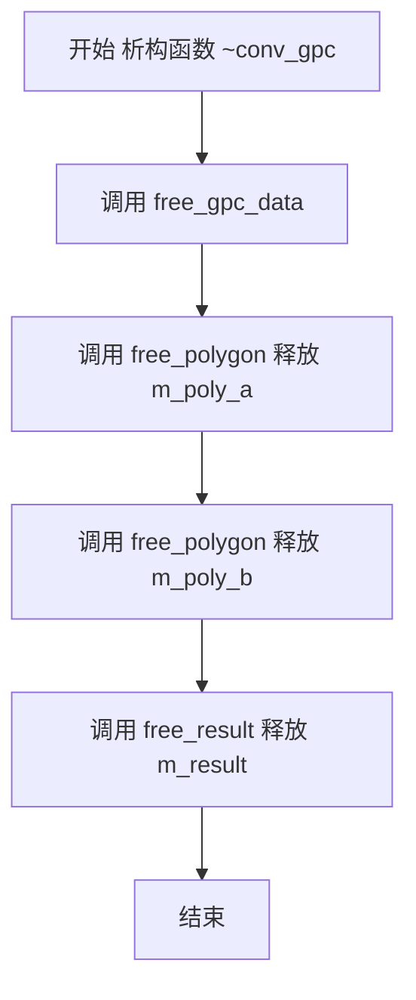

#### 带注释源码

```cpp
/// 析构函数 - 释放GPC数据
/// 功能：释放所有与GPC多边形相关的数据内存，包括：
///       1. m_poly_a - 源多边形A的数据
///       2. m_poly_b - 源多边形B的数据
///       3. m_result - 多边形运算结果
~conv_gpc()
{
    /// 调用free_gpc_data()释放所有GPC相关数据
    /// 该方法会依次调用:
    ///   - free_polygon(m_poly_a) 释放多边形A的顶点和轮廓数据
    ///   - free_polygon(m_poly_b) 释放多边形B的顶点和轮廓数据
    ///   - free_result() 释放运算结果的内存
    free_gpc_data();
}
```


### `conv_gpc::conv_gpc`（构造函数）

该构造函数是 `conv_gpc` 类的初始化方法，用于初始化成员变量并设置默认操作类型，同时为零化内部多边形数据结构。

参数：

- `a`：`source_a_type&`，源多边形A的引用，作为第一个输入的顶点源
- `b`：`source_b_type&`，源多边形B的引用，作为第二个输入的顶点源
- `op`：`gpc_op_e`，操作类型，默认为 `gpc_or`（并集运算），支持交（and）、异或（xor）、A-B差集、B-A差集

返回值：无返回值（构造函数）

#### 流程图

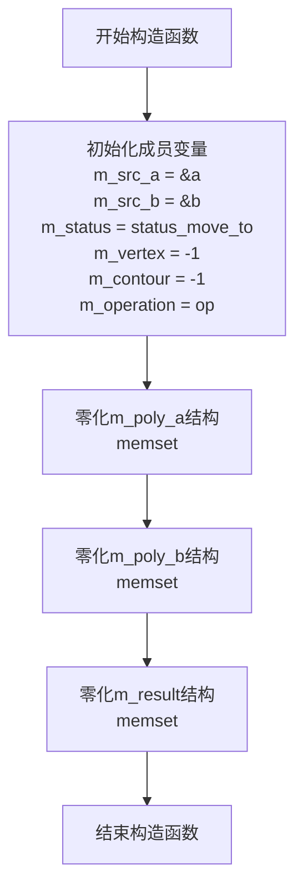

#### 带注释源码

```cpp
//------------------------------------------------------------------------
// 构造函数：初始化conv_gpc转换器
// 参数：
//   a - 第一个源多边形的引用（顶点源）
//   b - 第二个源多边形的引用（顶点源）
//   op - GPC操作类型，默认为gpc_or（并集）
//------------------------------------------------------------------------
conv_gpc(source_a_type& a, source_b_type& b, gpc_op_e op = gpc_or) :
    // 初始化成员变量列表
    m_src_a(&a),           // 保存第一个源多边形的指针
    m_src_b(&b),           // 保存第二个源多边形的指针
    m_status(status_move_to),  // 初始状态为move_to
    m_vertex(-1),          // 顶点索引初始化为-1
    m_contour(-1),         // 轮廓索引初始化为-1
    m_operation(op)        // 设置GPC操作类型
{
    // 使用memset将三个gpc_polygon结构体全部置零
    // 确保在后续使用前数据结构处于已知的安全状态
    
    memset(&m_poly_a, 0, sizeof(m_poly_a));  // 零化多边形A的数据结构
    memset(&m_poly_b, 0, sizeof(m_poly_b));  // 零化多边形B的数据结构
    memset(&m_result, 0, sizeof(m_result)); // 零化结果多边形的数据结构
}
```

#### 成员变量初始化说明

| 成员变量 | 类型 | 初始值 | 描述 |
|---------|------|--------|------|
| `m_src_a` | `source_a_type*` | `&a` | 指向第一个源多边形的指针 |
| `m_src_b` | `source_b_type*` | `&b` | 指向第二个源多边形的指针 |
| `m_status` | `status` | `status_move_to` | 当前顶点输出状态 |
| `m_vertex` | `int` | `-1` | 当前顶点索引（用于遍历） |
| `m_contour` | `int` | `-1` | 当前轮廓索引（用于遍历） |
| `m_operation` | `gpc_op_e` | `op` | 多边形布尔操作类型 |

#### 设计要点

1. **零初始化**：通过 `memset` 确保所有 `gpc_polygon` 结构在使用前被完全置零，避免未定义行为
2. **默认操作**：提供默认的并集（`gpc_or`）操作，便于简单使用场景
3. **引用语义**：接收源多边形的引用而非拷贝，提高效率并支持大数据量处理


### `conv_gpc.attach1`

该方法用于将新的源A（source A）附加到当前的多边形裁剪器中，替换原有的源A引用。通过将源A对象的地址赋值给内部指针m_src_a，使得裁剪器能够使用新的源A数据进行后续的多边形布尔运算。

参数：

- `source`：`VSA&`，要附加的源A对象的引用，VSA是模板参数，表示源A的类型

返回值：`void`，无返回值

#### 流程图

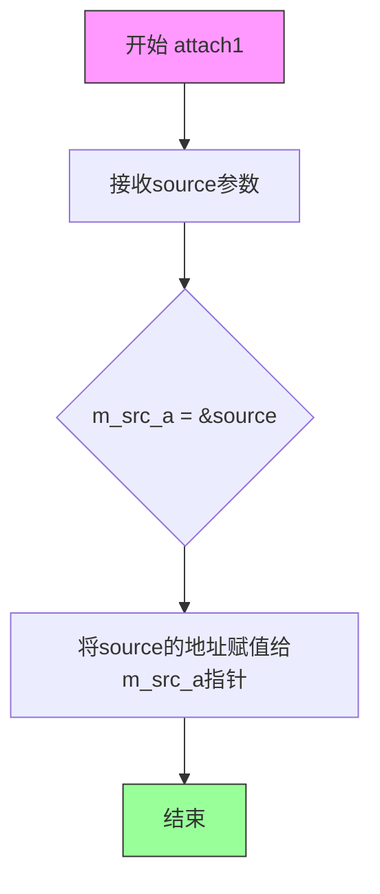

#### 带注释源码

```cpp
//----------------------------------------------------------------------------
// attach1 - 附加源A的方法
//----------------------------------------------------------------------------
// 参数:
//   source: VSA& - 要附加的源A对象的引用
// 返回值: void - 无返回值
// 功能: 将新的源A附加到裁剪器,替换m_src_a指向的源A
//----------------------------------------------------------------------------
void attach1(VSA& source) 
{ 
    // 将source的地址赋值给成员指针m_src_a
    // 这样裁剪器就会使用新的源A进行后续的布尔运算
    m_src_a = &source; 
}
```

#### 关联信息

| 项目 | 说明 |
|------|------|
| 所属类 | `conv_gpc<VSA, VSB>` |
| 访问权限 | public |
| 相似方法 | `attach2(VSB& source)` - 附加源B |
| 关联成员 | `m_src_a` - 指向源A的成员指针 |
| 使用场景 | 在创建conv_gpc对象后,需要更换源A时调用此方法 |


### `conv_gpc.attach2`

该方法用于设置多边形剪裁器（General Polygon Clipper）的第二个输入源（Source B）。在 AGG 的渲染管线中，它允许用户在构建好剪裁转换器后，动态绑定或更改参与布尔运算的第二个多边形数据，而无需重新实例化整个转换器对象。

参数：

- `source`：`VSB&`，第二个源对象的引用。VSB 是模板参数，定义了第二个源的类型（通常为顶点源接口）。

返回值：`void`，无返回值。

#### 流程图

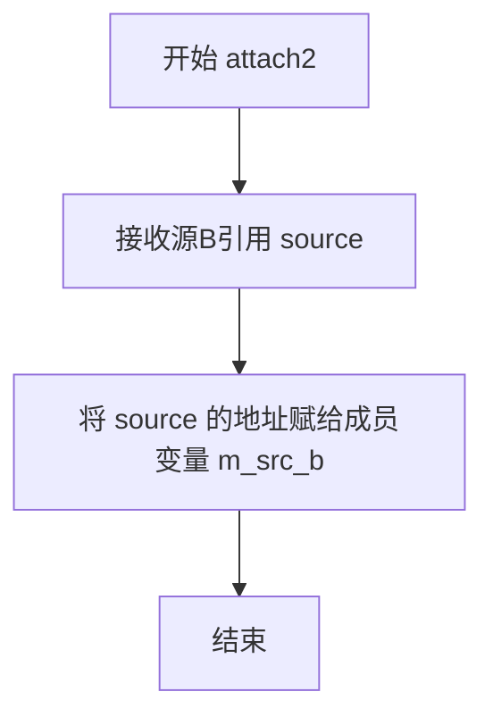

#### 带注释源码

```cpp
//----------------------------------------------------------------------------
// 类: conv_gpc<VSA, VSB>
// 方法: attach2
//----------------------------------------------------------------------------
// 参数:
//   source: VSB& - 第二个源对象的引用
// 返回:
//   void
//----------------------------------------------------------------------------
void attach2(VSB& source) 
{ 
    // 将外部传入的源B对象的地址赋值给内部成员变量 m_src_b。
    // m_src_b 是一个指向 source_a_type (模板实例化时的源B类型) 的指针。
    // 后续在 rewind() 方法中，会调用 m_src_b->rewind() 和 m_src_b->vertex()
    // 来获取源B的顶点数据以进行布尔运算。
    m_src_b = &source; 
}
```


### `conv_gpc.operation`

设置多边形裁剪的操作类型（并、交、异或、A-B、B-A），用于在后续调用 `rewind` 方法执行多边形裁剪运算时确定使用哪种布尔运算。

参数：

- `v`：`gpc_op_e`，指定要使用的裁剪操作类型，可选值包括 `gpc_or`（并集）、`gpc_and`（交集）、`gpc_xor`（异或）、`gpc_a_minus_b`（A-B差集）、`gpc_b_minus_a`（B-A差集）

返回值：`void`，无返回值

#### 流程图

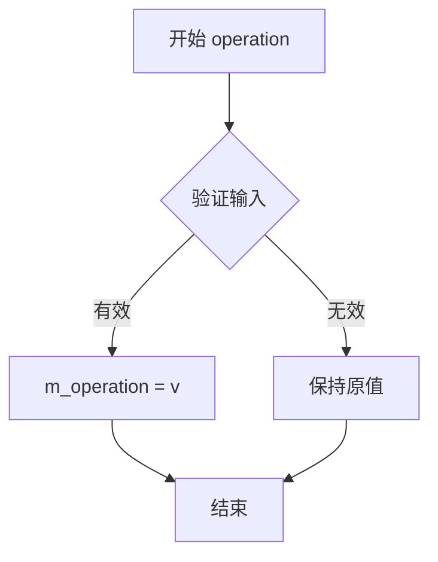

#### 带注释源码

```cpp
//----------------------------------------------------------------------------
// 设置多边形裁剪操作类型
//----------------------------------------------------------------------------
// 参数:
//   v - gpc_op_e类型的操作枚举值
//     gpc_or:       并集 (Union)
//     gpc_and:      交集 (Intersection)
//     gpc_xor:      异或 (XOR)
//     gpc_a_minus_b: A减去B (Difference A-B)
//     gpc_b_minus_a: B减去A (Difference B-A)
//----------------------------------------------------------------------------
void operation(gpc_op_e v) 
{ 
    // 将传入的操作类型赋值给成员变量 m_operation
    // 该变量在 rewind() 方法中被使用来决定调用哪个 gpc_polygon_clip 函数
    m_operation = v; 
}
```

#### 详细说明

该方法是 `conv_gpc` 模板类的成员方法，用于动态设置多边形布尔运算的类型。`conv_gpc` 类封装了 GPC（General Polygon Clipper）库的功能，提供两个输入源（`source_a_type` 和 `source_b_type`）的多边形裁剪能力。

**使用场景：**
- 用户可以在创建 `conv_gpc` 对象时通过构造函数参数指定操作类型
- 也可以在对象创建后通过调用 `operation()` 方法动态修改操作类型
- 修改后的操作类型会在下次调用 `rewind()` 方法时生效

**与 `gpc_op_e` 枚举的对应关系：**
| 枚举值 | 说明 | GPC内部常量 |
|--------|------|-------------|
| `gpc_or` | 并集 | `GPC_UNION` |
| `gpc_and` | 交集 | `GPC_INT` |
| `gpc_xor` | 异或 | `GPC_XOR` |
| `gpc_a_minus_b` | A-B差集 | `GPC_DIFF` |
| `gpc_b_minus_a` | B-A差集 | `GPC_DIFF`（参数顺序交换）|


### `conv_gpc::rewind`

重置裁剪器状态，重新读取两个源多边形数据，根据指定的操作类型（并、交、异或、差集）执行多边形裁剪，并准备提取裁剪后的结果顶点。

参数：

- `path_id`：`unsigned`，路径标识符，用于指定要处理的路径编号

返回值：`void`，无返回值。该方法执行多边形裁剪操作并缓存结果，供后续通过 `vertex()` 方法逐个获取裁剪后的顶点。

#### 流程图

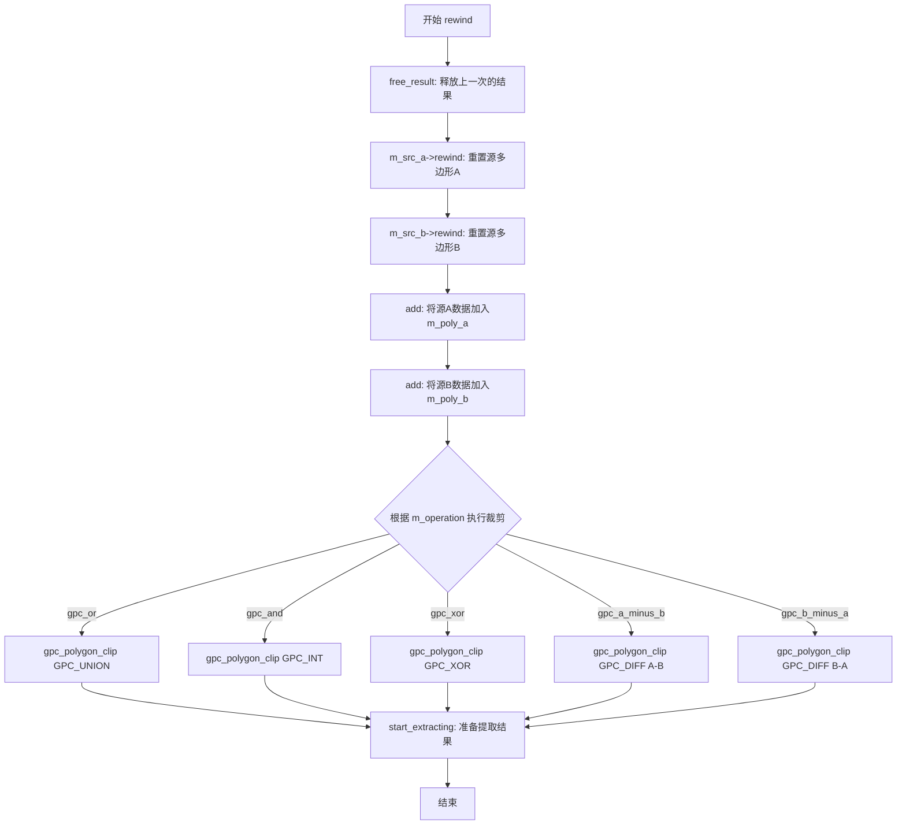

#### 带注释源码

```cpp
//------------------------------------------------------------------------
template<class VSA, class VSB> 
void conv_gpc<VSA, VSB>::rewind(unsigned path_id)
{
    // 1. 释放上一次裁剪操作产生的结果数据
    free_result();
    
    // 2. 重置两个源顶点源，使其从指定路径开始读取
    m_src_a->rewind(path_id);
    m_src_b->rewind(path_id);
    
    // 3. 从两个源读取顶点数据，构建GPC格式的多边形
    add(*m_src_a, m_poly_a);  // 将源A的顶点数据添加到m_poly_a
    add(*m_src_b, m_poly_b);  // 将源B的顶点数据添加到m_poly_b
    
    // 4. 根据操作类型执行多边形裁剪
    switch(m_operation)
    {
       case gpc_or:  // 并集 (Union)
            gpc_polygon_clip(GPC_UNION,
                             &m_poly_a,
                             &m_poly_b,
                             &m_result);
           break;

       case gpc_and:  // 交集 (Intersection)
            gpc_polygon_clip(GPC_INT,
                             &m_poly_a,
                             &m_poly_b,
                             &m_result);
           break;

       case gpc_xor:  // 异或 (XOR)
            gpc_polygon_clip(GPC_XOR,
                             &m_poly_a,
                             &m_poly_b,
                             &m_result);
           break;

       case gpc_a_minus_b:  // A - B 差集
            gpc_polygon_clip(GPC_DIFF,
                             &m_poly_a,
                             &m_poly_b,
                             &m_result);
           break;

       case gpc_b_minus_a:  // B - A 差集
            gpc_polygon_clip(GPC_DIFF,
                             &m_poly_b,
                             &m_poly_a,
                             &m_result);
           break;
    }
    
    // 5. 初始化提取状态，准备后续通过vertex()方法逐个获取结果顶点
    start_extracting();
}
```


### `conv_gpc.vertex`

获取多边形裁剪结果顶点，实现了Vertex Source接口，用于迭代输出经过GPC（General Polygon Clipper）运算后的结果多边形的顶点。

参数：

- `x`：`double*`，指向存储顶点x坐标的指针，方法执行后该位置将被写入当前顶点的x坐标值
- `y`：`double*`，指向存储顶点y坐标的指针，方法执行后该位置将被写入当前顶点的y坐标值

返回值：`unsigned`，返回路径命令标识，指示当前顶点的类型，可能的值包括：`path_cmd_move_to`（新轮廓起点）、`path_cmd_line_to`（轮廓上的普通点）、`path_cmd_end_poly | path_flags_close`（轮廓结束且闭合）、`path_cmd_stop`（所有顶点已遍历完毕）

#### 流程图

```mermaid
flowchart TD
    A[开始 vertex] --> B{m_status == status_move_to?}
    B -->|是| C{next_contour 返回 true?}
    B -->|否| D{next_vertex 返回 true?}
    C -->|是| E{next_vertex 返回 true?}
    C -->|否| F[设置状态为 status_stop<br/>返回 path_cmd_end_poly | path_flags_close]
    E -->|是| G[设置状态为 status_line_to<br/>返回 path_cmd_move_to]
    E -->|否| F
    D -->|是| H[返回 path_cmd_line_to]
    D -->|否| I[设置状态为 status_move_to<br/>返回 path_cmd_end_poly | path_flags_close]
    F --> J[结束]
    G --> J
    H --> J
    I --> J
    J --> K{还有更多顶点?}
    K -->|是| A
    K -->|否| L[返回 path_cmd_stop]
```

#### 带注释源码

```cpp
//------------------------------------------------------------------------
template<class VSA, class VSB> 
unsigned conv_gpc<VSA, VSB>::vertex(double* x, double* y)
{
    // 状态机：如果是初始状态（move_to），需要先尝试移动到下一个轮廓
    if(m_status == status_move_to)
    {
        // 尝试获取下一个轮廓
        if(next_contour()) 
        {
            // 当前轮廓存在，尝试获取该轮廓的下一个顶点
            if(next_vertex(x, y))
            {
                // 成功获取顶点，状态切换到 line_to（后续顶点都是线段）
                m_status = status_line_to;
                // 返回 move_to 命令，标识这是新轮廓的起点
                return path_cmd_move_to;
            }
            // 该轮廓没有顶点了，标记为停止状态
            m_status = status_stop;
            // 返回轮廓结束命令，包含闭合标志
            return path_cmd_end_poly | path_flags_close;
        }
    }
    else
    {
        // 状态为 line_to，说明正在遍历当前轮廓的顶点
        if(next_vertex(x, y))
        {
            // 成功获取顶点，返回线段命令
            return path_cmd_line_to;
        }
        else
        {
            // 当前轮廓顶点已遍历完，重置为 move_to 状态，准备处理下一个轮廓
            m_status = status_move_to;
        }
        // 返回当前轮廓结束命令
        return path_cmd_end_poly | path_flags_close;
    }
    // 所有轮廓都已遍历完毕，返回停止命令
    return path_cmd_stop;
}
```


### `conv_gpc.free_polygon`

释放多边形内存。该函数负责释放 `gpc_polygon` 结构体中分配的所有轮廓和顶点内存，并将结构体重置为零。

参数：

- `p`：`gpc_polygon&`，需要释放的 GPC 多边形引用

返回值：`void`，无返回值

#### 流程图

```mermaid
flowchart TD
    A[开始 free_polygon] --> B{检查轮廓数量}
    B -->|i = 0| C[获取第i个轮廓]
    C --> D[释放第i个轮廓的顶点数组]
    D --> E[i++]
    E --> F{是否遍历完所有轮廓?}
    F -->|否| C
    F -->|是| G[释放轮廓数组本身]
    G --> H[将多边形结构体内存清零]
    H --> I[结束]
```

#### 带注释源码

```cpp
//------------------------------------------------------------------------
template<class VSA, class VSB> 
void conv_gpc<VSA, VSB>::free_polygon(gpc_polygon& p)
{
    int i;
    // 遍历多边形中的所有轮廓
    for(i = 0; i < p.num_contours; i++)
    {
        // 释放每个轮廓的顶点数组内存
        // 使用 pod_allocator 进行内存释放，释放 vertex 数组
        pod_allocator<gpc_vertex>::deallocate(p.contour[i].vertex, 
                                              p.contour[i].num_vertices);
    }
    // 释放存储所有轮廓的轮廓数组内存
    // 使用 pod_allocator 释放 contour 指针数组
    pod_allocator<gpc_vertex_list>::deallocate(p.contour, p.num_contours);
    
    // 将整个 gpc_polygon 结构体内存清零
    // 避免悬挂指针和未定义行为
    memset(&p, 0, sizeof(gpc_polygon));
}
```


### `conv_gpc.free_result`

释放 GPC（通用多边形裁剪器）操作的结果多边形内存，并将结果结构体重置为零状态。

参数：

- （无参数）

返回值：`void`，无返回值描述

#### 流程图

```mermaid
flowchart TD
    A([开始 free_result]) --> B{检查 m_result.contour<br/>是否存在}
    B -->|是| C[调用 gpc_free_polygon<br/>释放多边形内存]
    B -->|否| D[跳过内存释放]
    C --> E[memset 重置 m_result<br/>为零结构]
    D --> E
    E --> F([结束])
    
    style A fill:#e1f5fe
    style C fill:#fff3e0
    style E fill:#e8f5e9
    style F fill:#f3e5f5
```

#### 带注释源码

```cpp
//------------------------------------------------------------------------
// 释放结果多边形内存并重置结果结构
//------------------------------------------------------------------------
template<class VSA, class VSB> 
void conv_gpc<VSA, VSB>::free_result()
{
    // 检查结果多边形是否有有效的轮廓数据
    if(m_result.contour)
    {
        // 调用 GPC 库的函数释放动态分配的多边形内存
        gpc_free_polygon(&m_result);
    }
    // 将结果结构体所有字节置零，确保状态为初始状态
    memset(&m_result, 0, sizeof(m_result));
}
```


### `conv_gpc.free_gpc_data`

释放 `conv_gpc` 对象中存储的所有 GPC（General Polygon Clipper）多边形数据，包括多边形 A、多边形 B 以及结果多边形，调用内部辅助函数释放由 GPC 库分配的堆内存，防止内存泄漏。

参数：
- （无）

返回值：`void`，无返回值

#### 流程图

```mermaid
graph TD
    Start((开始)) --> FreePolyA[调用 free_polygon(m_poly_a)]
    FreePolyA --> FreePolyB[调用 free_polygon(m_poly_b)]
    FreePolyB --> FreeResult[调用 free_result()]
    FreeResult --> End((结束))
```

#### 带注释源码

```cpp
    //------------------------------------------------------------------------
    // 释放所有GPC数据
    // 该方法负责清理conv_gpc类中管理的所有gpc_polygon类型的数据。
    // 它依次释放输入多边形m_poly_a、m_poly_b以及结果多边形m_result所占用的内存。
    //------------------------------------------------------------------------
    template<class VSA, class VSB> 
    void conv_gpc<VSA, VSB>::free_gpc_data()
    {
        // 释放多边形A的数据
        free_polygon(m_poly_a);
        // 释放多边形B的数据
        free_polygon(m_poly_b);
        // 释放结果多边形的数据
        free_result();
    }
```


### `conv_gpc.start_contour`

该方法为 `conv_gpc` 类模板的私有成员函数，用于在解析顶点数据时开始一个新轮廓的处理。它创建一个空的轮廓头结构并添加到轮廓累加器中，同时清空顶点累加器，为后续顶点的收集做好准备。

参数：  
无

返回值：`void`，无返回值描述

#### 流程图

```mermaid
flowchart TD
    A[开始 start_contour] --> B[创建 contour_header_type 结构体变量 h]
    B --> C[将 h 初始化为零]
    C --> D[将空轮廓头 h 添加到 m_contour_accumulator]
    D --> E[清空 m_vertex_accumulator]
    E --> F[结束]
```

#### 带注释源码

```cpp
//------------------------------------------------------------------------
template<class VSA, class VSB> 
void conv_gpc<VSA, VSB>::start_contour()
{
    // 创建一个新的轮廓头结构体变量
    contour_header_type h;
    // 将轮廓头结构体清零，确保所有成员初始化为0
    memset(&h, 0, sizeof(h));
    // 将新的空轮廓头添加到轮廓累加器数组中
    m_contour_accumulator.add(h);
    // 清空顶点累加器，为当前新轮廓的顶点收集做准备
    m_vertex_accumulator.remove_all();
}
```


### `conv_gpc.add_vertex`

将给定的 (x, y) 坐标作为顶点添加到当前累积器中，以供后续构建多边形轮廓使用。

参数：

- `x`：`double`，要添加的顶点的 X 坐标
- `y`：`double`，要添加的顶点的 Y 坐标

返回值：`void`，无返回值

#### 流程图

```mermaid
flowchart TD
    A[开始 add_vertex] --> B[创建临时 gpc_vertex 结构体 v]
    B --> C[v.x = x]
    C --> D[v.y = y]
    D --> E[调用 m_vertex_accumulator.add v 添加顶点到累积器]
    E --> F[结束]
    
    style A fill:#f9f,color:#000
    style F fill:#9f9,color:#000
```

#### 带注释源码

```cpp
//------------------------------------------------------------------------
template<class VSA, class VSB> 
inline void conv_gpc<VSA, VSB>::add_vertex(double x, double y)
{
    // 创建一个临时的 gpc_vertex 结构体来存储顶点数据
    gpc_vertex v;
    
    // 将传入的 x 坐标赋值给顶点的 x 成员
    v.x = x;
    
    // 将传入的 y 坐标赋值给顶点的 y 成员
    v.y = y;
    
    // 将构造好的顶点添加到顶点累积器中
    // m_vertex_accumulator 是一个 pod_bvector<gpc_vertex, 8> 类型
    // 用于在构建轮廓过程中临时存储顶点数据
    m_vertex_accumulator.add(v);
}
```


### `conv_gpc.end_contour`

结束当前轮廓的处理，将累积的顶点数据转移到轮廓头中，完成轮廓的构建。

参数：

- `orientation`：`unsigned`，轮廓的方向标志，用于判断轮廓是否为顺时针方向（可能影响孔洞标记）

返回值：`void`，无返回值

#### 流程图

```mermaid
flowchart TD
    A[开始 end_contour] --> B{轮廓累加器是否有数据?}
    B -->|否| Z[直接返回]
    B --> C{顶点数 > 2?}
    C -->|否| D[移除最后一个顶点]
    C -->|是| E[获取当前轮廓头]
    E --> F[设置顶点数和孔洞标志]
    F --> G[分配顶点内存]
    G --> H[遍历复制顶点数据]
    H --> I[指针递增]
    I --> Z
```

#### 带注释源码

```cpp
//------------------------------------------------------------------------
template<class VSA, class VSB> 
void conv_gpc<VSA, VSB>::end_contour(unsigned orientation)
{
    // 检查轮廓累加器是否有数据（是否有待处理的轮廓）
    if(m_contour_accumulator.size())
    {
        // 判断当前轮廓是否有足够的顶点（至少3个才能构成多边形）
        if(m_vertex_accumulator.size() > 2)
        {
            // 获取当前正在构建的轮廓头
            contour_header_type& h = 
                m_contour_accumulator[m_contour_accumulator.size() - 1];

            // 设置顶点数为累积的顶点数
            h.num_vertices = m_vertex_accumulator.size();
            // 初始化孔洞标志为0（非孔洞）
            h.hole_flag = 0;

            // TO DO: Clarify the "holes"
            // 如果是顺时针方向则标记为孔洞（待澄清的逻辑）
            //if(is_cw(orientation)) h.hole_flag = 1;

            // 为顶点数组分配内存
            h.vertices = pod_allocator<gpc_vertex>::allocate(h.num_vertices);
            // 目标指针指向分配的内存
            gpc_vertex* d = h.vertices;
            int i;
            // 将累积的顶点数据复制到轮廓头中
            for(i = 0; i < h.num_vertices; i++)
            {
                const gpc_vertex& s = m_vertex_accumulator[i];
                d->x = s.x;
                d->y = s.y;
                ++d;
            }
        }
        else
        {
            // 顶点不足3个，移除最后一个顶点（退化的轮廓）
            m_vertex_accumulator.remove_last();
        }
    }
}
```


### `conv_gpc.make_polygon`

该方法负责将类内部累积的轮廓数据（存储在 `m_contour_accumulator` 中）转换为 GPC（General Polygon Clipper）库所需的 `gpc_polygon` 结构。它实际上是将临时分配的顶点内存块的所有权转移给输出的 GPC 多边形对象。

参数：
- `p`：`gpc_polygon&`，目标 GPC 多边形结构的引用，用于存储转换后的结果。

返回值：`void`，无直接返回值，结果通过引用参数 `p` 输出。

#### 流程图

```mermaid
flowchart TD
    A([开始 make_polygon]) --> B[调用 free_polygon(p) 释放旧数据]
    B --> C{检查 m_contour_accumulator 是否有数据}
    C -->|无| D[直接返回, p 保持为空]
    C -->|有| E[设置 p.num_contours = 累加器大小]
    E --> F[为 p.contour 分配内存数组]
    F --> G[循环遍历累加器中的每个轮廓]
    G --> H[获取当前轮廓头 h]
    H --> I[将 h.num_vertices 复制到 p.contour[i]]
    I --> J[将 h.vertices 指针复制到 p.contour[i]]
    J --> K{循环结束?}
    K -->|否| G
    K -->|是| L([结束])
```

#### 带注释源码

```cpp
    //------------------------------------------------------------------------
    // 将内部轮廓累加器转换为GPC多边形结构
    //------------------------------------------------------------------------
    template<class VSA, class VSB> 
    void conv_gpc<VSA, VSB>::make_polygon(gpc_polygon& p)
    {
        // 1. 清理目标多边形p中可能存在的旧数据，防止内存泄漏
        free_polygon(p);

        // 2. 检查是否有累积的轮廓数据
        if(m_contour_accumulator.size())
        {
            // 设置多边形的轮廓数量
            p.num_contours = m_contour_accumulator.size();

            // 初始化孔洞标志 (0表示无孔洞，或作为默认设置)
            p.hole = 0;

            // 为GPC多边形分配轮廓数组内存
            // 使用pod_allocator进行内存分配，属于AGGVL内部内存管理机制
            p.contour = pod_allocator<gpc_vertex_list>::allocate(p.num_contours);

            int i;
            // 3. 遍历累加器中的所有轮廓头
            gpc_vertex_list* pv = p.contour;
            for(i = 0; i < p.num_contours; i++)
            {
                // 获取当前轮廓头结构
                const contour_header_type& h = m_contour_accumulator[i];

                // 将顶点数和顶点指针拷贝到GPC结构中
                // 注意：这里转移了内存的所有权，p现在管理这些顶点内存
                pv->num_vertices = h.num_vertices;
                pv->vertex = h.vertices;
                ++pv;
            }
        }
    }
```


### `conv_gpc.start_extracting`

该方法用于初始化结果多边形的提取状态，将遍历状态重置为初始值，为后续通过 `vertex()` 方法遍历结果多边形的顶点做好准备。

参数：无

返回值：`void`，无返回值描述

#### 流程图

```mermaid
flowchart TD
    A[开始提取] --> B[设置 m_status = status_move_to]
    B --> C[设置 m_contour = -1]
    C --> D[设置 m_vertex = -1]
    D --> E[结束]
```

#### 带注释源码

```cpp
//------------------------------------------------------------------------
template<class VSA, class VSB> 
void conv_gpc<VSA, VSB>::start_extracting()
{
    // 将顶点获取状态重置为 "move_to"，表示下一个顶点命令应为 path_cmd_move_to
    m_status = status_move_to;
    
    // 初始化轮廓索引为 -1，表示尚未开始处理第一个轮廓
    // 后续 next_contour() 会将其递增为 0 以处理第一个轮廓
    m_contour = -1;
    
    // 初始化顶点索引为 -1，表示尚未开始处理当前轮廓的顶点
    // 后续 next_vertex() 会将其递增为 0 以处理第一个顶点
    m_vertex = -1;
}
```

#### 设计意图

此方法是 `conv_gpc` 类实现**顶点源接口（Vertex Source Interface）**的关键组成部分。在调用 `rewind()` 方法执行多边形布尔运算（并、交、异或、差集）后，需要通过此方法重置内部状态，使得后续调用 `vertex()` 方法时能够正确地遍历生成的结果多边形的顶点序列。


### `conv_gpc.next_contour`

该方法用于在多边形裁剪结果中移动到下一个轮廓。它递增内部轮廓计数器，检查是否还有未遍历的轮廓，如有则重置顶点索引并返回 true，表示成功移动到下一个轮廓；否则返回 false，表示所有轮廓已遍历完毕。

参数：
- （无参数）

返回值：`bool`，返回 true 表示成功移动到下一个轮廓并可继续获取顶点；返回 false 表示所有轮廓已遍历完毕。

#### 流程图

```mermaid
flowchart TD
    A[开始 next_contour] --> B{++m_contour 是否小于 m_result.num_contours}
    B -->|是| C[设置 m_vertex = -1]
    C --> D[返回 true]
    B -->|否| E[返回 false]
    D --> F[结束]
    E --> F
```

#### 带注释源码

```cpp
//------------------------------------------------------------------------
template<class VSA, class VSB> 
bool conv_gpc<VSA, VSB>::next_contour()
{
    // 递增轮廓索引，然后检查是否在有效轮廓范围内
    if(++m_contour < m_result.num_contours)
    {
        // 重置顶点索引为-1，表示从当前轮廓的第一个顶点开始获取
        m_vertex = -1;
        // 成功移动到下一个轮廓
        return true;
    }
    // 所有轮廓已遍历完毕
    return false;
}
```


### `conv_gpc.next_vertex`

获取多边形结果中的下一个顶点坐标。该方法通过内部顶点索引遍历当前轮廓的顶点数组，将顶点坐标写入提供的指针变量，并在成功获取顶点时返回 true，当遍历完当前轮廓的所有顶点后返回 false。

参数：

- `x`：`double*`，指向用于输出顶点 X 坐标的 double 型指针
- `y`：`double*`，指向用于输出顶点 Y 坐标的 double 型指针

返回值：`bool`，成功获取下一个顶点返回 true，否则返回 false（表示当前轮廓已遍历完毕）

#### 流程图

```mermaid
flowchart TD
    A[开始 next_vertex] --> B[获取当前轮廓的顶点列表 vlist]
    B --> C[递增顶点索引 m_vertex]
    C --> D{判断 m_vertex < vlist.num_vertices?}
    D -->|是| E[获取顶点坐标 v = vlist.vertex[m_vertex]]
    E --> F[将顶点坐标写入输出参数 *x = v.x, *y = v.y]
    F --> G[返回 true]
    D -->|否| H[返回 false]
    G --> I[结束]
    H --> I
```

#### 带注释源码

```cpp
//------------------------------------------------------------------------
template<class VSA, class VSB> 
inline bool conv_gpc<VSA, VSB>::next_vertex(double* x, double* y)
{
    // 获取当前轮廓的顶点列表引用
    const gpc_vertex_list& vlist = m_result.contour[m_contour];
    
    // 递增内部顶点索引，然后检查是否在有效范围内
    if(++m_vertex < vlist.num_vertices)
    {
        // 从顶点数组中获取当前索引对应的顶点
        const gpc_vertex& v = vlist.vertex[m_vertex];
        
        // 将顶点的 x 和 y 坐标写入输出参数
        *x = v.x;
        *y = v.y;
        
        // 成功获取顶点，返回 true
        return true;
    }
    
    // 当前轮廓的所有顶点已遍历完毕，返回 false
    return false;
}
```


### `conv_gpc.add`

该模板方法`add`是`conv_gpc`类的核心成员，负责从任意符合顶点源接口的输入中读取顶点数据，根据路径命令（move_to、line_to、end_poly）构建多边形轮廓，并将累积的顶点数据转换为GPC（General Polygon Clipper）库所需的`gpc_polygon`结构。

参数：

- `src`：`VS&`，顶点源对象引用，需提供`vertex()`方法以获取路径命令和坐标
- `p`：`gpc_polygon&`，输出参数，用于接收构建完成的多边形数据

返回值：`void`，无返回值，结果通过引用参数`p`输出

#### 流程图

```mermaid
flowchart TD
    A[开始 add 方法] --> B[清空轮廓累加器]
    B --> C[从源读取顶点命令]
    C --> D{命令是否为停止?}
    D -->|是| E[退出循环]
    D -->|否| F{是否为顶点命令?}
    F -->|是| G{是否为 move_to?}
    G -->|是| H{之前是否有 line_to?}
    H -->|是| I[结束当前轮廓]
    I --> J[重置方向]
    J --> K[开始新轮廓]
    K --> L[记录起始点]
    L --> M[添加顶点到累加器]
    M --> N[设置 line_to 标志]
    N --> C
    G -->|否| M
    F -->|否| O{是否为 end_poly?}
    O -->|是| P[获取方向]
    O -->|否| C
    P --> Q{是否为闭合多边形?}
    Q -->|是| R[添加起始点闭合轮廓]
    Q -->|否| C
    R --> C
    E --> S{之前是否有 line_to?}
    S -->|是| T[结束最后一个轮廓]
    S -->|否| U[生成多边形数据]
    T --> U
    U --> V[结束]
```

#### 带注释源码

```cpp
//--------------------------------------------------------------------
template<class VS> void conv_gpc<VSA, VSB>::add(VS& src, gpc_polygon& p)
{
    // 命令标识符，用于存储从源读取的路径命令
    unsigned cmd;
    // 顶点坐标
    double x, y;
    // 记录轮廓起始点，用于闭合路径
    double start_x = 0.0;
    double start_y = 0.0;
    // 标志位：是否已经开始绘制线条（从move_to到下一个move_to之间）
    bool line_to = false;
    // 轮廓方向：0-未确定，1-顺时针，2-逆时针
    unsigned orientation = 0;

    // 清空轮廓累加器，准备接收新的多边形数据
    m_contour_accumulator.remove_all();

    // 循环遍历源中的所有顶点，直到遇到停止命令
    while(!is_stop(cmd = src.vertex(&x, &y)))
    {
        // 判断当前命令是否为顶点命令（move_to或line_to）
        if(is_vertex(cmd))
        {
            // 如果是 move_to 命令，表示开始新的子路径
            if(is_move_to(cmd))
            {
                // 如果之前已经绘制了线条，需要先结束当前轮廓
                if(line_to)
                {
                    end_contour(orientation);
                    orientation = 0;
                }
                // 开始新的轮廓
                start_contour();
                // 记录当前轮廓的起始点坐标
                start_x = x;
                start_y = y;
            }
            // 将当前顶点添加到顶点累加器中
            add_vertex(x, y);
            // 标记已经开始绘制线条
            line_to = true;
        }
        else
        {
            // 非顶点命令，检查是否是多边形结束命令
            if(is_end_poly(cmd))
            {
                // 获取多边形的方向（顺时针或逆时针）
                orientation = get_orientation(cmd);
                // 如果之前有线条绘制且多边形是闭合的，添加起始点以闭合轮廓
                if(line_to && is_closed(cmd))
                {
                    add_vertex(start_x, start_y);
                }
            }
        }
    }
    
    // 循环结束后，如果还有未结束的轮廓，进行收尾处理
    if(line_to)
    {
        end_contour(orientation);
    }
    
    // 将累积器中的数据转换为GPC多边形结构
    make_polygon(p);
}
```

## 关键组件


### conv_gpc 类模板

核心多边形裁剪转换器类，封装了GPC库的布尔运算功能，支持联合(OR)、交集(AND)、异或(XOR)、A-B差集、B-A差集五种多边形运算，实现了AGG的顶点源接口。

### gpc_op_e 枚举

定义多边形布尔操作类型，包含gpc_or(并集)、gpc_and(交集)、gpc_xor(异或)、gpc_a_minus_b(A-B差集)、gpc_b_minus_a(B-A差集)五种操作。

### vertex_array_type 和 contour_header_array_type

使用pod_bvector模板定义的顶点数组和轮廓头数组，用于临时存储多边形构建过程中的顶点和轮廓信息。

### add 函数模板

将任意顶点源的路径数据解析并转换为GPC多边形格式，内部维护start_x/start_y记录轮廓起点，处理move_to、line_to、end_poly等命令。

### rewind 函数

多边形裁剪的入口函数，释放上次结果，重置源顶点源，调用add函数转换输入多边形，然后根据m_operation执行对应的GPC布尔运算。

### vertex 函数

实现AGG顶点源接口的输出函数，按顺序返回裁剪结果多边形的顶点，包括move_to、line_to、end_poly等命令，支持多轮廓遍历。

### 内存管理函数组

包括free_polygon释放单个多边形、free_result释放结果、free_gpc_data释放所有GPC数据，负责手动管理GPC库分配的内存资源。

### 轮廓构建函数组

start_contour初始化新轮廓，add_vertex添加顶点，end_contour完成轮廓构建并处理洞标识，make_polygon将累积的轮廓数据转换为GPC多边形结构。

### 顶点提取函数组

start_extracting重置提取状态，next_contour切换到下一轮廓，next_vertex获取当前轮廓的下一个顶点，共同实现结果多边形的顺序遍历。


## 问题及建议


### 已知问题

- **内存分配失败无处理**：在`make_polygon`、`end_contour`等函数中，使用`pod_allocator`进行内存分配，但没有检查分配是否成功，分配失败将导致未定义行为
- **混合内存管理风格**：代码同时使用了C风格的`memset`初始化、`gpc_free_polygon`以及C++的`pod_allocator`，这种混合方式增加了内存泄漏风险且难以维护
- **缺少异常安全**：所有内存操作和GPC调用均无异常捕获机制，当外部依赖（如gpc库）抛出异常时，程序将直接终止
- **非POD类型初始化问题**：构造函数中使用`memset(&m_poly_a, 0, sizeof(m_poly_a))`对结构体进行零初始化，若`gpc_polygon`包含非POD成员（如std::vector），将导致析构函数行为异常
- **拷贝/赋值控制缺失**：拷贝构造函数和赋值运算符被声明为private且未实现，虽防止了浅拷贝问题，但缺乏明确的错误信息或RAII支持
- **TODO注释未完成**：代码中存在关于"holes"处理的TODO注释，表明洞识别逻辑未完成，这与gpc库的hole_flag设置相关
- **顶点数量验证不足**：`end_contour`中仅简单删除少于3个顶点的轮廓，但未记录或警告用户，可能导致几何信息意外丢失

### 优化建议

- 为所有内存分配添加失败检查，使用异常或错误码传播
- 考虑使用智能指针或RAII包装器封装gpc_polygon生命周期，统一管理内存
- 移除`memset`零初始化，改用构造函数或显式初始化函数处理gpc_polygon
- 实现完整的拷贝语义或使用`= delete`明确禁用拷贝
- 完成TODO中的hole_flag逻辑实现，确保与GPC库的语义一致
- 添加日志或回调机制，记录因顶点数不足而被丢弃的轮廓信息
- 考虑将GPC调用结果缓存，避免在每次`rewind`时重新计算相同结果的布尔运算


## 其它


### 设计目标与约束

本代码的设计目标是为AGG（Anti-Grain Geometry）图形库提供多边形布尔运算功能，支持union（并集）、intersection（交集）、XOR（异或）、A-B（A减去B）、B-A（B减去A）五种运算。设计约束包括：1）依赖外部GPC（General Polygon Clipper）库实现核心算法；2）采用模板类设计，支持任意实现了顶点源接口的VSA和VSB类型；3）遵循AGG库的内存管理约定，使用pod_bvector和pod_allocator进行内存分配；4）实现Vertex Source接口以与AGG渲染管线集成。

### 错误处理与异常设计

本代码采用传统的C风格错误处理机制，不抛出异常。错误处理方式包括：1）使用memset对结构体进行零初始化，避免未初始化内存访问；2）内存分配失败时通过返回空结果或false状态进行错误传播；3）free_polygon和free_result函数在释放内存后立即将结构体清零，防止悬挂指针；4）next_contour和next_vertex函数返回布尔值表示操作是否成功；5）vertex函数在错误情况下返回path_cmd_stop命令。潜在问题：代码未对GPC库函数调用失败进行显式错误检查，且缺少对顶点数量不足（如少于3个顶点）的有效多边形的处理反馈。

### 数据流与状态机

数据流分为两个主要阶段：输入阶段和输出阶段。输入阶段：调用rewind函数触发多边形转换，首先调用两个源对象的rewind方法，然后通过add函数将顶点源的几何数据转换为GPC格式的多边形结构（m_poly_a和m_poly_b），接着根据m_operation选择调用gpc_polygon_clip执行相应的布尔运算，结果存储在m_result中，最后调用start_extracting初始化提取状态。输出阶段：vertex函数按照状态机逻辑遍历结果多边形，状态机包含status_move_to（移动到新轮廓起点）、status_line_to（绘制线条到下一顶点）、status_stop（停止绘制）三种状态，通过next_contour切换轮廓、next_vertex获取顶点坐标。

### 外部依赖与接口契约

外部依赖包括：1）GPC库（gpc.h），提供gpc_polygon、gpc_vertex、gpc_vertex_list等数据结构以及gpc_polygon_clip、gpc_free_polygon等核心函数；2）AGG基础库（agg_basics.h），提供路径命令标识（path_cmd_move_to、path_cmd_line_to等）和辅助函数（is_stop、is_vertex、is_move_to等）；3）AGG数组库（agg_array.h），提供pod_bvector模板类和pod_allocator内存分配器。接口契约方面：1）VSA和VSB模板参数必须实现Vertex Source接口，即具有rewind(unsigned)和vertex(double*, double*)方法；2）add函数内部依赖is_stop、is_vertex、is_move_to、is_end_poly、get_orientation、is_closed等AGG辅助函数进行命令解析；3）输入顶点序列应符合AGG路径格式规范，包含move_to、line_to、end_poly等命令。

### 资源管理与生命周期

资源管理采用RAII模式的变体，通过析构函数和free_gpc_data方法确保资源正确释放。内存管理关键点：1）m_poly_a、m_poly_b、m_result三个gpc_polygon对象在构造时通过memset初始化为零；2）每次rewind调用前先调用free_result释放上一次的结果；3）add函数内部使用m_vertex_accumulator和m_contour_accumulator临时存储顶点，make_polygon函数将临时数据转移至GPC结构后清空累加器；4）析构函数调用free_gpc_data释放所有GPC多边形数据。需要注意的是，代码中vertex_accumulator和contour_accumulator的内存未显式释放，存在轻微的内存泄漏风险。

### 线程安全性分析

本代码是非线程安全的。多个线程同时操作同一个conv_gpc实例会导致数据竞争，具体风险点包括：1）m_status、m_vertex、m_contour等状态变量在读取和写入时没有同步保护；2）m_result结果多边形的遍历过程中可能被其他线程修改；3）GPC库本身的多线程安全性取决于其具体实现。使用建议：若需在多线程环境中使用，每个线程应创建独立的conv_gpc实例，或在调用rewind和vertex方法时进行外部同步。

### 性能考量与优化空间

性能特点：1）布尔运算复杂度取决于多边形顶点数和轮廓数，由GPC库决定；2）模板实现允许内联优化，但add函数实现为私有方法可能导致部分编译器无法进行完全内联；3）临时内存分配使用pod_bvector和pod_allocator，开销相对较低。优化空间：1）可考虑增加缓存机制，避免重复执行相同的布尔运算；2）对于简单的重叠检测，可提供快速判断接口；3）当前实现每次调用rewind都会重新创建多边形并执行运算，可考虑增量更新机制；4）add函数中的循环可使用指针运算替代数组索引访问以提升性能。

### 配置与扩展性

扩展性设计体现在：1）模板参数VSA和VSB支持任意顶点源类型，实现灵活的算法组合；2）gpc_op_e枚举预留了操作类型扩展接口；3）attach1和attach2方法允许在运行时动态更换数据源。配置选项：1）通过operation方法可在运行时更改布尔运算类型；2）end_contour函数中存在TODO注释，表明孔洞（hole）处理逻辑尚未完全实现，可作为未来扩展点。

### 使用示例与典型场景

典型使用场景包括：1）地理信息系统中的区域叠加分析；2）计算机图形学中的多边形裁剪和形状组合；3）CAD软件中的布尔运算操作。使用流程：创建两个顶点源（分别表示多边形A和B），实例化conv_gpc模板类，调用attach1和attach2绑定数据源，设置operation（可选，默认为gpc_or），然后像使用普通顶点源一样调用rewind和vertex方法获取结果多边形。注意事项：输入多边形应闭合且顶点数量充足（大于2），否则可能被忽略。


    