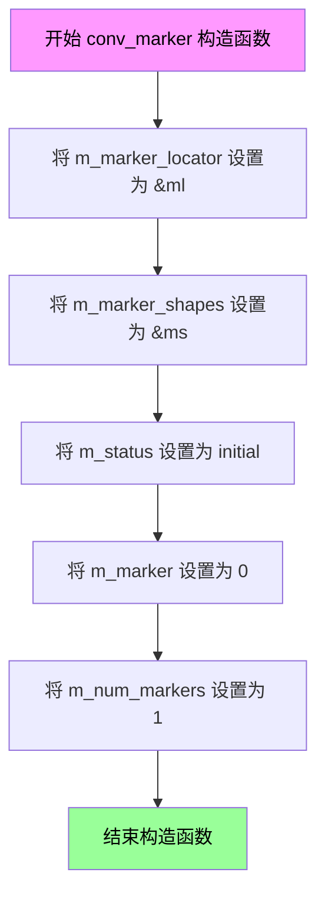
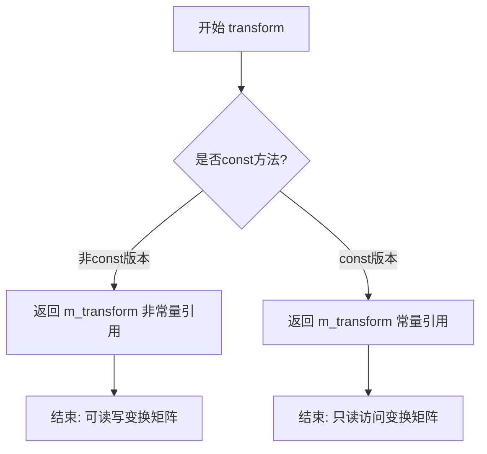
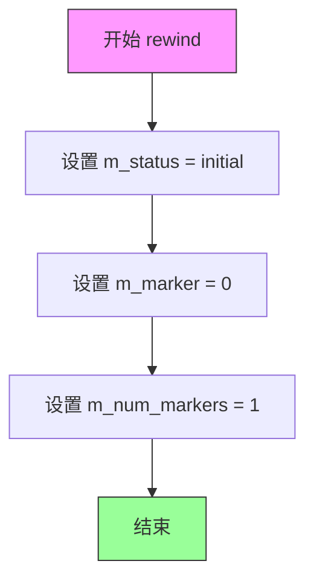
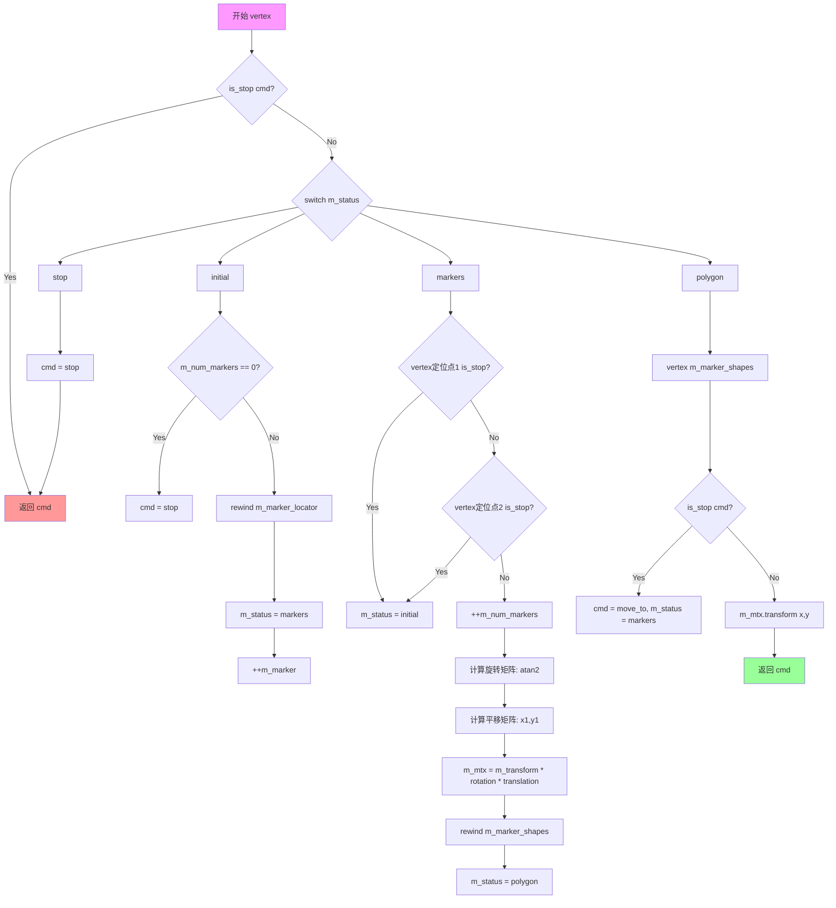

# `matplotlib\extern\agg24-svn\include\agg_conv_marker.h` 详细设计文档

conv_marker是一个模板类，用于在由MarkerLocator定义的路径上放置MarkerShapes定义的标记形状，支持自动旋转和平移标记以跟随路径方向

## 整体流程

```mermaid
graph TD
    A[开始 vertex()] --> B{状态 != stop?}
    B -- 否 --> C[返回 path_cmd_stop]
    B -- 是 --> D{状态 = initial?}
    D -- 是 --> E{标记数 = 0?}
    E -- 是 --> F[设置状态为stop并返回]
    E -- 否 --> G[重置定位器并递增标记索引]
    D -- 否 --> H{状态 = markers?}
    H -- 是 --> I{获取第一个顶点是stop?}
    I -- 是 --> J[设置状态为initial并继续]
    I -- 否 --> K{获取第二个顶点是stop?}
    K -- 是 --> L[设置状态为initial并继续]
    K -- 否 --> M[计算旋转角度并更新变换矩阵]
    H -- 否 --> N{状态 = polygon?}
    N -- 是 --> O[调用marker_shapes的vertex获取顶点]
    O --> P{顶点是stop?}
    P -- 是 --> Q[设置cmd为move_to,状态设为markers]
    P -- 否 --> R[应用变换并返回cmd]
```

## 类结构

```
agg::conv_marker<MarkerLocator, MarkerShapes> (模板类)
└── 内部枚举: status_e (initial, markers, polygon, stop)
```

## 全局变量及字段


### `conv_marker<MarkerLocator, MarkerShapes>.m_marker_locator`
    
标记定位器指针，用于获取标记的位置和方向信息

类型：`MarkerLocator*`
    


### `conv_marker<MarkerLocator, MarkerShapes>.m_marker_shapes`
    
标记形状指针，用于获取标记的几何形状顶点

类型：`MarkerShapes*`
    


### `conv_marker<MarkerLocator, MarkerShapes>.m_transform`
    
变换矩阵，定义标记的整体变换规则

类型：`trans_affine`
    


### `conv_marker<MarkerLocator, MarkerShapes>.m_mtx`
    
临时变换矩阵，用于计算每个标记的位置和旋转

类型：`trans_affine`
    


### `conv_marker<MarkerLocator, MarkerShapes>.m_status`
    
当前状态，控制顶点生成的状态机状态

类型：`status_e`
    


### `conv_marker<MarkerLocator, MarkerShapes>.m_marker`
    
当前标记索引，记录当前正在处理的标记编号

类型：`unsigned`
    


### `conv_marker<MarkerLocator, MarkerShapes>.m_num_markers`
    
标记数量，记录定位器中标记的总个数

类型：`unsigned`
    
    

## 全局函数及方法


### `conv_marker<MarkerLocator, MarkerShapes>::conv_marker`（构造函数）

该构造函数是conv_marker模板类的构造函数，用于初始化标记转换器的内部状态，接收标记定位器和标记形状两个引用参数，将它们存储为指针，并设置初始状态值。

参数：

- `ml`：`MarkerLocator&`，标记定位器引用，用于提供标记位置信息
- `ms`：`MarkerShapes&`，标记形状引用，用于提供标记的几何形状

返回值：无返回值（构造函数）

#### 流程图



#### 带注释源码

```cpp
//------------------------------------------------------------------------
// conv_marker 构造函数实现
// 模板参数: MarkerLocator - 标记定位器类型, MarkerShapes - 标记形状类型
// 参数: ml - 标记定位器引用, ms - 标记形状引用
//------------------------------------------------------------------------
template<class MarkerLocator, class MarkerShapes> 
conv_marker<MarkerLocator, MarkerShapes>::conv_marker(MarkerLocator& ml, MarkerShapes& ms) :
    // 初始化成员变量：将传入的引用转换为指针存储
    m_marker_locator(&ml),    // 存储标记定位器的地址
    m_marker_shapes(&ms),     // 存储标记形状的地址
    m_status(initial),        // 初始状态设为 initial
    m_marker(0),              // 标记索引从 0 开始
    m_num_markers(1)          // 初始标记数量为 1
{
    // 构造函数体为空，所有初始化工作在成员初始化列表中完成
    // 变换矩阵 m_transform 和 m_mtx 使用默认构造
}
```

#### 类的完整上下文信息

**类名**: `conv_marker<MarkerLocator, MarkerShapes>`

**类的功能描述**: 这是一个标记转换器模板类，用于将标记定位器提供的标记位置与标记形状提供的几何形状结合，生成带有位置和旋转信息的标记路径。

**类字段**:

| 字段名 | 类型 | 描述 |
|--------|------|------|
| `m_marker_locator` | `MarkerLocator*` | 指向标记定位器的指针 |
| `m_marker_shapes` | `MarkerShapes*` | 指向标记形状的指针 |
| `m_transform` | `trans_affine` | 用户设置的变换矩阵 |
| `m_mtx` | `trans_affine` | 临时计算用的变换矩阵 |
| `m_status` | `status_e` | 当前状态机状态 |
| `m_marker` | `unsigned` | 当前处理的标记索引 |
| `m_num_markers` | `unsigned` | 标记数量计数器 |

**状态枚举**:

| 状态名 | 描述 |
|--------|------|
| `initial` | 初始状态 |
| `markers` | 正在读取标记位置 |
| `polygon` | 正在读取标记形状顶点 |
| `stop` | 停止状态 |


### `conv_marker<MarkerLocator, MarkerShapes>::transform()`

该函数提供对内部变换矩阵 `m_transform` 的直接访问，允许外部代码获取或修改仿射变换参数，用于对标记图形进行旋转、缩放、平移等几何变换操作。

参数： 无

返回值： `trans_affine&`（非const版本）或 `const trans_affine&`（const版本），返回成员变量 `m_transform` 的引用，使调用者能够获取或修改当前的仿射变换矩阵。

#### 流程图



#### 带注释源码

```cpp
//----------------------------------------------------------------------------
// 获取变换矩阵的非常量引用（非const版本）
// 用途：允许调用者修改变换矩阵参数（旋转、缩放、平移等）
//----------------------------------------------------------------------------
trans_affine& transform() 
{ 
    return m_transform; 
}

//----------------------------------------------------------------------------
// 获取变换矩阵的常量引用（const版本）
// 用途：在只读上下文中访问变换矩阵，保证不修改对象状态
//----------------------------------------------------------------------------
const trans_affine& transform() const 
{ 
    return m_transform; 
}
```

#### 关联成员变量信息

| 变量名称 | 类型 | 描述 |
|---------|------|------|
| `m_transform` | `trans_affine` | 存储标记图形的仿射变换矩阵，用于控制标记的旋转、缩放、平移 |
| `m_mtx` | `trans_affine` | 临时变换矩阵，在顶点生成过程中计算实际变换 |
| `m_marker_locator` | `MarkerLocator*` | 标记定位器指针，用于确定标记位置 |
| `m_marker_shapes` | `MarkerShapes*` | 标记形状指针，用于获取标记的几何路径 |
| `m_status` | `status_e` | 状态机当前状态，控制顶点生成流程 |
| `m_marker` | `unsigned` | 当前标记索引 |
| `m_num_markers` | `unsigned` | 标记数量计数器 |


### `conv_marker<MarkerLocator, MarkerShapes>.rewind(unsigned)`

该方法用于重置标记器conv_marker的内部状态，将状态机恢复到初始状态，并重置标记器索引和数量，为下一轮顶点生成做准备。

参数：

- `path_id`：`unsigned`，路径标识符（当前版本中未使用，保留用于API兼容性）

返回值：`void`，无返回值

#### 流程图



#### 带注释源码

```
//------------------------------------------------------------------------
// 重置标记器状态
// 参数: path_id - 路径ID（当前实现中未使用，保留接口兼容性）
// 返回值: void
// 功能: 将conv_marker的内部状态重置为初始状态:
//       - m_status 设为 initial（初始状态）
//       - m_marker 设为 0（标记器索引重置）
//       - m_num_markers 设为 1（标记器数量重置）
// 说明: 此方法在每次开始生成新的路径顶点前调用，
//       确保从标记器的起始位置重新开始遍历
//------------------------------------------------------------------------
template<class MarkerLocator, class MarkerShapes> 
void conv_marker<MarkerLocator, MarkerShapes>::rewind(unsigned)
{
    // 将状态机重置为初始状态
    m_status = initial;
    
    // 重置标记器索引，从第一个标记器开始
    m_marker = 0;
    
    // 重置标记器数量为1（默认至少有一个标记器）
    m_num_markers = 1;
}
```


### `conv_marker<MarkerLocator, MarkerShapes>::vertex`

该函数是 `conv_marker` 模板类的核心方法，实现了标记（Marker）生成的状态机逻辑。它通过内部状态机控制，从标记定位器获取位置信息，从标记形状获取几何数据，并应用仿射变换（包括旋转和平移）来生成最终顶点。

参数：

- `x`：`double*`，指向 double 类型的指针，用于输出顶点的 x 坐标
- `y`：`double*`，指向 double 类型的指针，用于输出顶点的 y 坐标

返回值：`unsigned`，返回路径命令类型（如 `path_cmd_move_to`、`path_cmd_line_to`、`path_cmd_stop` 等），用于指示顶点类型或是否结束

#### 流程图

```mermaid
flowchart TD
    A[开始 vertex] --> B[初始化 cmd = path_cmd_move_to]
    B --> C{is_stop(cmd)?}
    C -->|否| D{switch m_status}
    
    D -->|initial| E{m_num_markers == 0?}
    E -->|是| F[cmd = path_cmd_stop]
    F --> C
    E -->|否| G[m_marker_locator->rewind<br/>++m_marker<br/>m_num_markers = 0<br/>m_status = markers]
    G --> C
    
    D -->|markers| H[m_marker_locator->vertex<br/>获取第一个点 x1,y1]
    H --> I{is_stop(vertex)?}
    I -->|是| J[m_status = initial]
    J --> C
    I -->|否| K[m_marker_locator->vertex<br/>获取第二个点 x2,y2]
    K --> L{is_stop(vertex)?}
    L -->|是| J
    L -->|否| M[++m_num_markers<br/>计算旋转角度 atan2<br/>设置变换矩阵 m_mtx<br/>m_marker_shapes->rewind<br/>m_status = polygon]
    M --> C
    
    D -->|polygon| N[m_marker_shapes->vertex<br/>获取标记形状顶点]
    N --> O{is_stop(cmd)?}
    O -->|是| P[cmd = path_cmd_move_to<br/>m_status = markers]
    P --> C
    O -->|否| Q[m_mtx.transform<br/>变换顶点坐标]
    Q --> R[return cmd]
    
    D -->|stop| S[cmd = path_cmd_stop]
    S --> C
    
    C -->|是| T[return cmd]
```

#### 带注释源码

```
//------------------------------------------------------------------------
// 获取下一个顶点
// 这是一个状态机实现，用于生成标记路径
//------------------------------------------------------------------------
template<class MarkerLocator, class MarkerShapes> 
unsigned conv_marker<MarkerLocator, MarkerShapes>::vertex(double* x, double* y)
{
    // 初始化命令为 move_to，用于标记新路径段的开始
    unsigned cmd = path_cmd_move_to;
    double x1, y1, x2, y2;  // 用于存储从标记定位器获取的坐标

    // 循环直到遇到 stop 命令
    while(!is_stop(cmd))
    {
        // 根据当前状态执行不同操作
        switch(m_status)
        {
        // 初始状态：准备处理标记
        case initial:
            if(m_num_markers == 0)
            {
               // 没有标记可处理，直接停止
               cmd = path_cmd_stop;
               break;
            }
            // 重置标记定位器到当前标记索引
            m_marker_locator->rewind(m_marker);
            ++m_marker;                           // 移动到下一个标记
            m_num_markers = 0;                    // 重置标记计数
            m_status = markers;                   // 切换到 markers 状态

        // 标记状态：从定位器获取两个点来确定位置和方向
        case markers:
            // 获取第一个点（标记锚点）
            if(is_stop(m_marker_locator->vertex(&x1, &y1)))
            {
                m_status = initial;               // 失败则回到初始状态
                break;
            }
            // 获取第二个点（用于确定方向）
            if(is_stop(m_marker_locator->vertex(&x2, &y2)))
            {
                m_status = initial;               // 失败则回到初始状态
                break;
            }
            ++m_num_markers;                      // 增加已处理标记数
            
            // 构建变换矩阵：
            // 1. 旋转：使标记方向与 (x1,y1)->(x2,y2) 方向一致
            m_mtx = m_transform;                  // 基础变换
            m_mtx *= trans_affine_rotation(atan2(y2 - y1, x2 - x1));
            // 2. 平移：移动到第一个点的位置
            m_mtx *= trans_affine_translation(x1, y1);
            
            // 重置标记形状，准备生成多边形顶点
            m_marker_shapes->rewind(m_marker - 1);
            m_status = polygon;                   // 切换到 polygon 状态

        // 多边形状态：生成标记形状的顶点
        case polygon:
            // 从标记形状获取顶点
            cmd = m_marker_shapes->vertex(x, y);
            if(is_stop(cmd))
            {
                // 标记形状结束，回到 markers 状态获取下一个标记
                cmd = path_cmd_move_to;
                m_status = markers;
                break;
            }
            // 应用之前计算的变换矩阵到顶点
            m_mtx.transform(x, y);
            return cmd;                           // 返回顶点命令

        // 停止状态：结束遍历
        case stop:
            cmd = path_cmd_stop;
            break;
        }
    }
    return cmd;                                   // 返回最终命令（通常是 stop）
}
```


## 关键组件


### 核心功能概述

conv_marker是一个AGG库中的模板卷积类，用于将标记定位器（MarkerLocator）与标记形状（MarkerShapes）结合，通过仿射变换实现标记图形的定位、旋转和渲染，支持多标记序列的状态机驱动遍历。

### 文件运行流程

1. 调用`rewind(path_id)`初始化状态机，重置标记索引和状态为initial
2. 循环调用`vertex(x, y)`获取顶点数据
3. 在状态机中依次处理：initial → markers（获取两个定位点）→ polygon（生成标记形状顶点）→ 返回顶点
4. 根据两个定位点计算旋转角度和平移量，构建变换矩阵
5. 对标记形状顶点应用变换矩阵，返回最终坐标

### 类详细信息

#### conv_marker 模板类

**类字段：**

| 名称 | 类型 | 描述 |
|------|------|------|
| m_marker_locator | MarkerLocator* | 标记定位器指针，用于获取标记位置点 |
| m_marker_shapes | MarkerShapes* | 标记形状指针，用于获取标记几何形状 |
| m_transform | trans_affine | 用户设置的外部变换矩阵 |
| m_mtx | trans_affine | 内部计算的最终变换矩阵（含旋转和平移） |
| m_status | status_e | 状态机状态：initial/markers/polygon/stop |
| m_marker | unsigned | 当前标记索引 |
| m_num_markers | unsigned | 标记数量计数器 |

**类方法：**

#### 构造函数 conv_marker(MarkerLocator& ml, MarkerShapes& ms)

| 项目 | 详情 |
|------|------|
| 参数 | ml: MarkerLocator& - 标记定位器引用；ms: MarkerShapes& - 标记形状引用 |
| 返回值 | 无 |
| 描述 | 初始化指针指向标记定位器和标记形状，设置初始状态 |

#### transform()

| 项目 | 详情 |
|------|------|
| 参数 | 无 |
| 返回值 | trans_affine& - 变换矩阵引用 |
| 描述 | 返回用户可设置的仿射变换矩阵引用 |

#### rewind(unsigned path_id)

| 项目 | 详情 |
|------|------|
| 参数 | path_id: unsigned - 路径ID（未使用） |
| 返回值 | void |
| 描述 | 重置状态机到initial状态，重置标记索引为0，标记数为1 |

#### vertex(double* x, double* y)

| 项目 | 详情 |
|------|------|
| 参数 | x: double* - 输出顶点X坐标；y: double* - 输出顶点Y坐标 |
| 返回值 | unsigned - 路径命令类型（path_cmd_move_to/path_cmd_line_to等） |
| 描述 | 状态机主循环：获取定位点→计算旋转平移矩阵→获取形状顶点→应用变换 |



```cpp
template<class MarkerLocator, class MarkerShapes> 
unsigned conv_marker<MarkerLocator, MarkerShapes>::vertex(double* x, double* y)
{
    unsigned cmd = path_cmd_move_to;
    double x1, y1, x2, y2;

    while(!is_stop(cmd))
    {
        switch(m_status)
        {
        case initial:
            if(m_num_markers == 0)
            {
               cmd = path_cmd_stop;
               break;
            }
            m_marker_locator->rewind(m_marker);
            ++m_marker;
            m_num_markers = 0;
            m_status = markers;

        case markers:
            if(is_stop(m_marker_locator->vertex(&x1, &y1)))
            {
                m_status = initial;
                break;
            }
            if(is_stop(m_marker_locator->vertex(&x2, &y2)))
            {
                m_status = initial;
                break;
            }
            ++m_num_markers;
            m_mtx = m_transform;
            m_mtx *= trans_affine_rotation(atan2(y2 - y1, x2 - x1));
            m_mtx *= trans_affine_translation(x1, y1);
            m_marker_shapes->rewind(m_marker - 1);
            m_status = polygon;

        case polygon:
            cmd = m_marker_shapes->vertex(x, y);
            if(is_stop(cmd))
            {
                cmd = path_cmd_move_to;
                m_status = markers;
                break;
            }
            m_mtx.transform(x, y);
            return cmd;

        case stop:
            cmd = path_cmd_stop;
            break;
        }
    }
    return cmd;
}
```

### 关键组件信息

### conv_marker 模板类
AGG库的标记卷积转换器，组合定位器和形状生成标记渲染数据

### MarkerLocator 接口
标记定位器抽象，提供了获取标记定位点（两个点确定位置和方向）的接口

### MarkerShapes 接口
标记形状抽象，提供了获取标记几何形状顶点的接口

### trans_affine 变换矩阵
用于计算旋转和平移的2D仿射变换矩阵，支持矩阵乘法和坐标变换

### 状态机 status_e
四状态状态机控制标记生成流程：initial→markers→polygon→循环

### 旋转计算逻辑
使用atan2(y2-y1, x2-x1)根据两个定位点计算标记的旋转角度

### 潜在技术债务

1. **缺少const正确性**：vertex方法未声明为const，但实际不修改对象状态
2. **未使用的参数**：rewind的path_id参数未被使用，可能是设计遗留
3. **状态机fall-through**：switch语句中markers和polygon case缺少break，存在隐式fall-through（可能是故意设计但缺乏注释）
4. **错误处理不足**：定位器获取顶点失败时仅重置状态，未返回错误信息
5. **模板代码膨胀**：每个模板实例生成独立代码，无共用的类型擦除实现

### 其它项目

**设计目标与约束：**
- 模板参数设计允许灵活替换MarkerLocator和MarkerShapes实现
- 状态机驱动实现避免递归，支持大数据量流式处理
- 无异常抛出设计，依赖返回值判断状态

**错误处理与异常设计：**
- 通过is_stop()检测流结束
- 定位点获取失败时回退到initial状态继续尝试
- 不抛出异常，依赖调用方检查返回值

**数据流与状态机：**
- 输入：MarkerLocator提供定位点对，MarkerShapes提供形状数据
- 处理：定位点→计算变换矩阵→应用到形状顶点
- 输出：变换后的顶点坐标和路径命令

**外部依赖：**
- agg_basics.h：基础类型定义
- agg_trans_affine.h：仿射变换实现
- 依赖命名空间agg的path_cmd_*和is_stop()函数


## 问题及建议


### 已知问题

- **危险的 Case 穿透逻辑**：`vertex()` 函数中的 `switch` 语句使用了 case 穿透（fall-through）机制，在 `markers` case 中没有 `break`，导致执行完 markers 逻辑后自动继续执行 polygon 逻辑。这种设计极易产生意外的代码路径，且难以调试和维护。
- **状态机逻辑复杂且易错**：`m_status` 的状态转换逻辑嵌套在 while 循环和 switch 中，状态流转不够清晰，特别是 `markers` 和 `polygon` 之间的切换依赖 case 穿透而非显式状态转移。
- **未使用的参数**：`rewind(unsigned path_id)` 函数接受 `path_id` 参数但函数体内完全未使用，可能导致调用者误解 API 的行为。
- **潜在的悬空指针风险**：构造函数接收引用参数但内部存储为指针，如果外部传入的对象在 `conv_marker` 生命周期内被销毁，将产生悬空指针，而类没有提供任何所有权语义或生命周期管理的说明。
- **拷贝语义不明确**：复制构造函数和赋值运算符被声明为私有且未实现（禁用拷贝），但没有任何注释说明为何禁止拷贝，可能导致未来维护困难。
- **`m_num_markers` 逻辑混乱**：`m_num_markers` 在 `initial` case 中被设为 0，但在 `markers` case 中又被设为 0 并递增，其语义不清晰，容易产生混淆。
- **缺少错误处理**：`MarkerLocator` 和 `MarkerShapes` 的方法调用没有错误处理机制，如果这些对象在调用过程中处于无效状态，行为未定义。

### 优化建议

- **重构状态机**：将状态转换逻辑显式化，使用明确的状态转移函数或状态模式替代 switch-case 的 fall-through 机制，提高代码可读性和可维护性。
- **删除或使用 path_id 参数**：如果 `path_id` 参数确实不需要，应从 API 中移除；如果需要，应在 `rewind` 中正确使用它。
- **添加智能指针或所有权语义**：考虑使用 `std::unique_ptr` 或 `shared_ptr` 管理 `MarkerLocator` 和 `MarkerShapes` 的生命周期，或者添加明确的文档说明外部对象必须在 `conv_marker` 存活期间保持有效。
- **明确拷贝语义**：添加注释说明为何禁用拷贝，或者如果需要支持拷贝，实现正确的拷贝构造函数和赋值运算符。
- **优化矩阵运算**：`m_mtx` 在每次 `vertex` 调用中都会被重新计算和赋值，考虑缓存变换矩阵以减少不必要的计算。
- **添加防御性检查**：在调用 `m_marker_locator` 和 `m_marker_shapes` 的方法前检查指针是否为空，避免潜在的空指针解引用。

## 其它


### 设计目标与约束

设计目标：提供一个通用的标记卷积转换器模板，能够将标记形状按照标记定位器（MarkerLocator）提供的位置和方向，通过仿射变换（trans_affine）放置在路径上，生成连续的顶点序列。

约束：
- 模板类依赖于MarkerLocator和MarkerShapes类型，需满足特定接口（提供rewind和vertex方法）。
- 变换操作包括旋转（基于两点连线角度）和平移，不支持缩放。
- 默认只处理一个标记（m_num_markers初始化为1），但可通过逻辑扩展。

### 错误处理与异常设计

错误处理机制：
- 代码中未使用异常，所有错误通过返回值（如path_cmd_stop）表示。
- 错误情况：
  - MarkerLocator::vertex返回path_cmd_stop时，状态重置为initial。
  - vertex参数指针为nullptr时，可能导致未定义行为（代码中未检查）。
- 调用者职责：检查vertex方法的返回值是否为path_cmd_stop，以判断数据结束。

### 数据流与状态机

数据流：
- 输入：MarkerLocator实例（提供标记位置序列）、MarkerShapes实例（提供标记形状顶点）、trans_affine变换（应用旋转和平移）。
- 输出：通过vertex方法顺序输出顶点坐标（x, y）和路径命令（path_cmd_move_to、path_cmd_line_to等）。

状态机：
- 包含四种状态：initial（初始）、markers（读取标记定位器）、polygon（生成标记多边形）、stop（停止）。
- 状态转换逻辑：
  - initial：检查标记数量，若为0则转向stop，否则重置定位器并转向markers。
  - markers：从定位器读取两个顶点（起点和终点），计算旋转角度，构建变换矩阵，然后转向polygon。
  - polygon：从形状读取顶点，应用变换，直到形状顶点耗尽，然后返回markers读取下一个标记。
  - stop：返回path_cmd_stop。

### 外部依赖与接口契约

外部依赖：
- agg_basics.h：提供基本类型（如unsigned、double）、路径命令枚举（如path_cmd_move_to、path_cmd_stop）和辅助函数（如is_stop）。
- agg_trans_affine.h：提供trans_affine类及相关变换函数（如trans_affine_rotation、trans_affine_translation）。

接口契约：
- MarkerLocator：需提供rewind(unsigned path_id)和vertex(double* x, double* y)方法，返回路径命令。
- MarkerShapes：需提供rewind(unsigned path_id)和vertex(double* x, double* y)方法，返回路径命令。
- conv_marker：提供transform()方法获取/设置trans_affine引用，rewind()方法重置状态，vertex()方法生成顶点。

### 性能考虑

性能瓶颈：
- 每次调用vertex方法时，如果状态为markers，会计算atan2(y2-y1, x2-x1)并构建变换矩阵，涉及浮点运算和三角函数。
- 变换矩阵m_mtx每次都重新计算（基于m_transform和旋转、平移），未缓存。

优化建议：
- 如果标记位置序列已知，可预计算旋转角度和变换矩阵。
- 考虑使用查找表或近似算法加速atan2计算。

### 线程安全性

线程安全声明：
- 类非线程安全。
- 多个线程同时访问同一个conv_marker实例可能导致状态（m_status、m_marker等）竞争。
- 如需多线程使用，每个线程应拥有独立的conv_marker实例。

### 内存管理

内存分配：
- 类中存储MarkerLocator和MarkerShapes的指针（m_marker_locator、m_marker_shapes），通过构造函数传入，不负责内存分配。
- trans_affine对象（m_transform、m_mtx）作为成员变量，在栈上分配。

内存生命周期：
- 调用者确保MarkerLocator和MarkerShapes对象在conv_marker对象生命周期内有效。
- conv_marker对象析构时不会释放指针指向的对象。

### 使用示例

典型使用场景：
1. 创建MarkerLocator和MarkerShapes的具体实现类对象。
2. 构造conv_marker实例，传入上述对象。
3. 可选：通过transform()方法设置旋转、平移等变换。
4. 调用rewind(0)初始化。
5. 循环调用vertex(&x, &y)获取顶点序列，直到返回path_cmd_stop。
6. 将顶点数据传递给渲染引擎。

### 参考文献

- Anti-Grain Geometry 官方文档：http://www.antigrain.com
- 代码版权：Copyright (C) 2002-2005 Maxim Shemanarev
- 相关算法：基于仿射变换的图形卷积原理

    