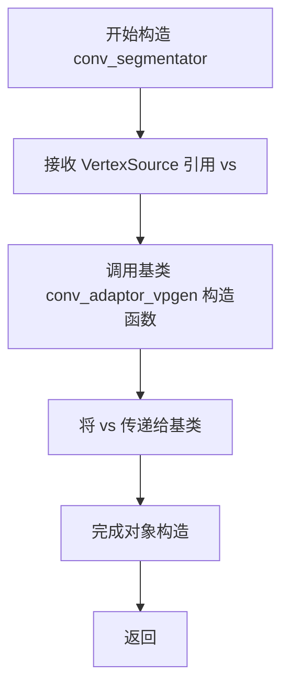
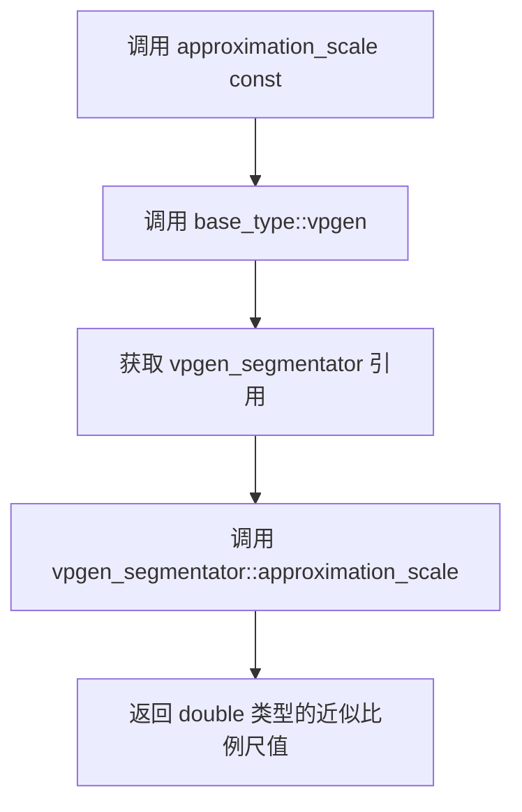

```mermaid
flowchart TD
    A[函数入口] --> B[接收参数 s: double]
    B --> C[调用 base_type::vpgen&#40;&#41;.approximation_scale&#40;s&#41;]
    C --> D[设置 vpgen_segmentator 的近似比例]
    D --> E[函数返回]
```

# `matplotlib\extern\agg24-svn\include\agg_conv_segmentator.h` 详细设计文档

Anti-Grain Geometry库中的conv_segmentator模板类，用于将顶点源的几何形状分割成更细的线段，通过内部组合vpgen_segmentator实现坐标细分功能，并提供近似比例的设置和获取方法。

## 整体流程

```mermaid
graph TD
    A[创建conv_segmentator对象] --> B[初始化基类conv_adaptor_vpgen]
    B --> C[设置顶点源VertexSource]
    C --> D{调用approximation_scale设置}
    D -- 是 --> E[调用vpgen().approximation_scale(s)]
    D -- 否 --> F[调用approximation_scale获取]
    F --> G[返回vpgen().approximation_scale()]
    E --> H[处理顶点生成]
```

## 类结构

```
agg::conv_segmentator<VertexSource> (模板结构体)
└── 继承自: conv_adaptor_vpgen<VertexSource, vpgen_segmentator>
```

## 全局变量及字段


    

## 全局函数及方法


### `conv_segmentator<VertexSource>::conv_segmentator`

该构造函数是模板结构体 conv_segmentator 的初始化方法，接受一个 VertexSource 引用作为参数，并将其传递给基类 conv_adaptor_vpgen 进行初始化，用于将顶点源适配为分段器。

参数：

- `vs`：`VertexSource&`，顶点源引用，作为被适配的输入顶点源

返回值：`void`，无返回值（构造函数）

#### 流程图



#### 带注释源码

```cpp
// 模板结构体 conv_segmentator，继承自 conv_adaptor_vpgen
// 用于将顶点源适配为分段器
template<class VertexSource> 
struct conv_segmentator : public conv_adaptor_vpgen<VertexSource, vpgen_segmentator>
{
    // 定义基类类型别名
    typedef conv_adaptor_vpgen<VertexSource, vpgen_segmentator> base_type;

    // 构造函数，接受 VertexSource 引用作为参数
    // 参数 vs: VertexSource 引用，用作顶点源
    conv_segmentator(VertexSource& vs) : 
        // 初始化列表：调用基类构造函数，将 vs 传递给基类
        conv_adaptor_vpgen<VertexSource, vpgen_segmentator>(vs) {}

    // 设置近似尺度
    void approximation_scale(double s) { base_type::vpgen().approximation_scale(s);        }
    // 获取近似尺度
    double approximation_scale() const { return base_type::vpgen().approximation_scale();  }

private:
    // 私有拷贝构造函数，禁用拷贝
    conv_segmentator(const conv_segmentator<VertexSource>&);
    // 私有赋值运算符，禁用赋值
    const conv_segmentator<VertexSource>& 
        operator = (const conv_segmentator<VertexSource>&);
};
```


### `conv_segmentator<VertexSource>.approximation_scale(double s)`

设置顶点生成器的近似比例，用于控制曲线或直线的细分程度。

参数：

- `s`：`double`，近似比例值，用于控制曲线逼近的精度

返回值：`void`，无返回值

#### 流程图



#### 带注释源码

```cpp
// 模板类 conv_segmentator 的成员函数
// 功能：设置顶点生成器的近似比例（approximation scale）
// 参数：s - double类型，近似比例值，用于控制曲线/直线细分程度
void approximation_scale(double s) 
{ 
    // 调用基类 conv_adaptor_vpgen 的 vpgen() 获取 vpgen_segmentator 实例
    // 然后调用其 approximation_scale 方法设置近似比例
    base_type::vpgen().approximation_scale(s);        
}
```


### `conv_segmentator<VertexSource>::approximation_scale`

该函数是模板结构体 `conv_segmentator` 的常量成员方法，用于获取当前顶点生成器的近似比例尺（approximation scale）值。该类是一个适配器模式实现，将顶点源（VertexSource）与分段器顶点生成器（vpgen_segmentator）结合，通过调用内部vpgen对象的相同方法来获取或设置近似比例尺，用于控制曲线逼近的精度。

参数：无

返回值：`double`，返回当前顶点生成器（vpgen_segmentator）设置的近似比例尺值。

#### 流程图



#### 带注释源码

```cpp
// 获取当前的近似比例尺值
// 该方法调用父类 conv_adaptor_vpgen 的 vpgen() 方法获取内部的 vpgen_segmentator 实例，
// 然后调用 vpgen_segmentator 的 approximation_scale() 方法获取当前设置的近似比例尺
double approximation_scale() const 
{ 
    return base_type::vpgen().approximation_scale();  // 返回 vpgen_segmentator 的近似比例尺值
}
```


## 关键组件


### conv_segmentator 模板类

conv_segmentator 是一个线段分割转换器模板类，继承自 conv_adaptor_vpgen，用于将输入的顶点源（VertexSource）通过 vpgen_segmentator 进行线段分割处理，支持设置和获取近似缩放比例。

### conv_adaptor_vpgen 基类

conv_adaptor_vpgen 是顶点源的适配器基类，采用适配器模式封装 VertexSource 和 vpgen_segmentator，提供统一的接口用于顶点生成。

### vpgen_segmentator 顶点生成器

vpgen_segmentator 是实际的线段分割顶点生成器，负责执行具体的几何分割算法，将曲线分割成直线段。

### approximation_scale 方法

approximation_scale 方法用于设置和获取近似缩放比例，控制线段分割的精度，较大的值产生更粗糙的分割，较小的值产生更精细的分割。


## 问题及建议


### 已知问题

- **文档缺失**：代码没有任何文档注释，无法了解 `conv_segmentator` 的设计目的、使用场景和注意事项
- **禁用拷贝方式陈旧**：使用私有化拷贝构造函数和赋值运算符来禁止拷贝，未使用现代 C++11 的 `= delete` 语法
- **功能过于简单**：该类仅封装了对 `vpgen_segmentator` 的 `approximation_scale` 的调用，未添加额外有价值的功能，可能存在过度封装
- **继承关系潜在风险**：`conv_adaptor_vpgen` 的虚函数表开销对于如此简单的包装类可能不必要
- **无错误处理**：设置 `approximation_scale` 时没有对参数范围进行校验（如负值检查）

### 优化建议

- 添加类级和函数级的 Doxygen 风格文档注释，说明模板参数用途和近似比例的含义
- 考虑使用 C++11 的 `= delete` 语法替代私有化拷贝构造函数和赋值运算符
- 评估是否可以直接使用 `vpgen_segmentator` 而非通过适配器，以减少继承层次
- 添加参数校验逻辑，确保 `approximation_scale` 的参数值合理（如必须大于 0）
- 如果 AGG 库计划支持现代 C++ 标准，考虑使用 `constexpr` 或 `noexcept` 修饰符
- 考虑将实现细节移至源文件（.cpp），仅在头文件中保留声明，减少编译依赖


## 其它


### 设计目标与约束

conv_segmentator的设计目标是将顶点源（VertexSource）的路径进行分段处理，通过vpgen_segmentator生成器将曲线离散化为线段。设计约束包括：1) 模板参数VertexSource必须是一个有效的顶点源接口；2) 依赖conv_adaptor_vpgen和vpgen_segmentator的实现；3) 不允许拷贝构造和赋值操作以防止浅拷贝问题。

### 错误处理与异常设计

本代码不抛出异常，采用no-throw保证设计。错误处理主要通过AGG的基础设施处理，如顶点源无效时的空操作处理。拷贝构造函数和赋值运算符被私有化并删除，防止误用导致未定义行为。

### 数据流与数据转换

数据流：VertexSource → conv_segmentator（包装） → vpgen_segmentator（分段生成） → 输出顶点。输入是原始的顶点序列（如曲线），经过conv_segmentator包装后，内部的vpgen_segmentator将曲线按approximation_scale进行离散化，输出更密集的线段顶点。

### 外部依赖与接口契约

主要依赖：1) agg_basics.h - 基础类型定义；2) agg_conv_adaptor_vpgen.h - 适配器基类；3) agg_vpgen_segmentator.h - 分段生成器。接口契约：VertexSource需要提供标准的顶点生成接口（如move_to, line_to等）；vpgen_segmentator提供approximation_scale的读写接口。

### 性能考虑

该类是一个轻量级包装器，主要开销在内部的vpgen_segmentator处理上。approximation_scale的getter/setter为内联函数，无额外性能开销。私有拷贝构造和赋值运算符确保不会有意外的拷贝开销。

### 线程安全性

该类本身不包含线程状态，不保证线程安全。如果多个线程共享同一个conv_segmentator实例，需要外部同步。vpgen_segmentator的状态也非线程安全。

### 模板参数约束

VertexSource模板参数必须满足：1) 提供顶点生成接口；2) 可被conv_adaptor_vpgen正确适配；3) 无特定的拷贝构造要求（因禁止拷贝）。

### 内存管理

该类不管理额外内存，依赖RAII模式管理内部vpgen_segmentator生命周期。所有的内存分配由底层vpgen_segmentator和VertexSource控制。

### 使用示例与典型用例

典型用途：1) 将贝塞尔曲线等高阶曲线转换为离散线段；2) 在渲染前对路径进行预处理；3) 与其他conv_xxx适配器链式使用。示例：conv_segmentator<path_storage> seg(my_path); seg.approximation_scale(2.0);

### 版本与兼容性信息

代码来自AGG 2.4版本，遵循MIT风格的Permission声明。保持了AGG库的一致命名空间（agg）和代码风格。API相对稳定，后续版本可能保持向后兼容。

    