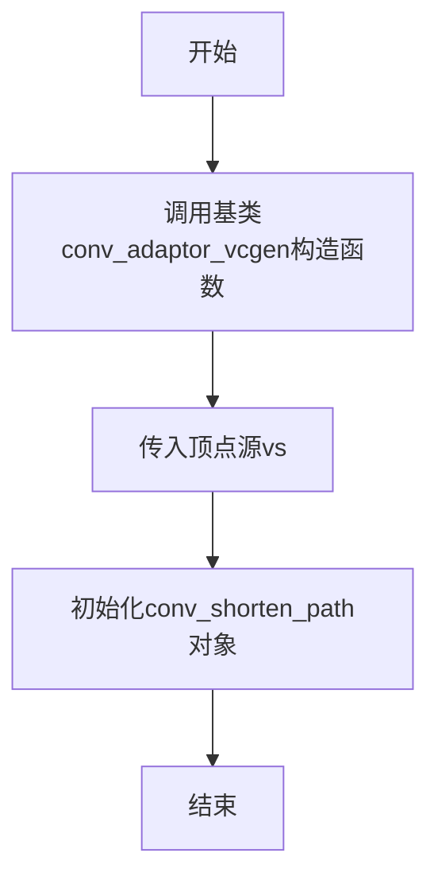
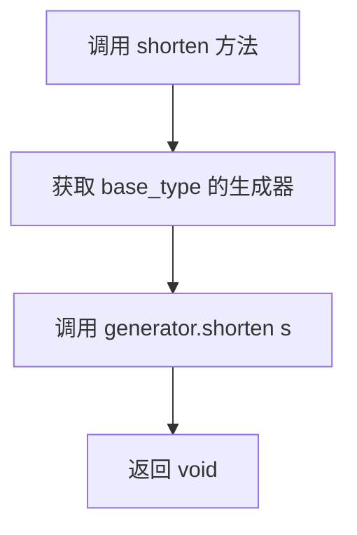
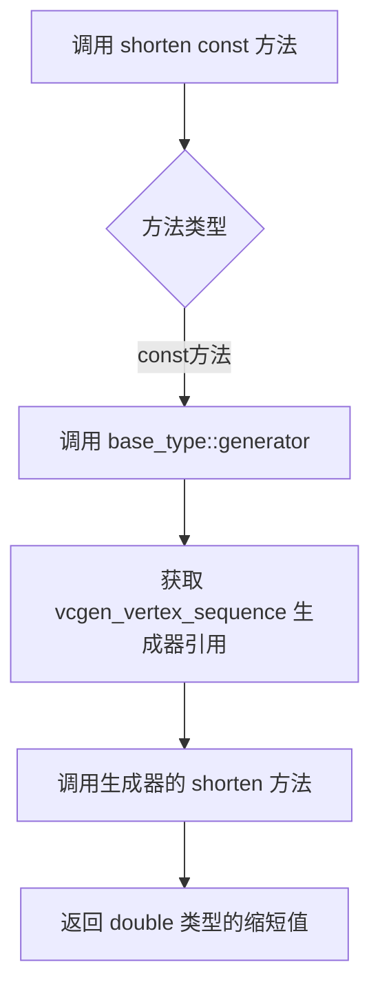

# `matplotlib\extern\agg24-svn\include\agg_conv_shorten_path.h` 详细设计文档

AGG库中的一个路径处理模板类，通过继承conv_adaptor_vcgen适配器，将输入的顶点源序列按照指定的距离进行缩短处理，用于图形渲染中的路径优化。

## 整体流程

```mermaid
graph TD
    A[创建conv_shorten_path对象] --> B[初始化基类conv_adaptor_vcgen]
    B --> C{调用shorten方法}
    C -->|设置缩短距离| D[调用基类的generator().shorten(s)]
    C -->|获取缩短距离| E[返回base_type::generator().shorten()]
    D --> F[顶点序列被缩短]
    E --> F
    F --> G[通过基类接口获取处理后的顶点]
```

## 类结构

```
agg::conv_adaptor_vcgen<VertexSource, vcgen_vertex_sequence> (基类)
└── agg::conv_shorten_path<VertexSource> (模板类)
```

## 全局变量及字段


    

## 全局函数及方法


### `conv_shorten_path<VertexSource>.conv_shorten_path`

该构造函数是 `conv_shorten_path` 模板类的构造函数，用于将指定的顶点源（VertexSource）对象适配为路径缩短功能的转换器，并初始化内部的状态。

参数：

- `vs`：`VertexSource&`，顶点源对象的引用，用于提供原始的顶点数据

返回值：`void`，构造函数无返回值

#### 流程图



#### 带注释源码

```cpp
// 构造函数模板
// 功能：将传入的顶点源对象vs初始化为路径缩短转换器
// 参数：vs - VertexSource引用，需要被处理的顶点数据源
conv_shorten_path(VertexSource& vs) : 
    // 初始化列表：调用基类conv_adaptor_vcgen的构造函数
    // 作用：将VertexSource适配为vcgen_vertex_sequence生成器
    conv_adaptor_vcgen<VertexSource, vcgen_vertex_sequence>(vs)
{
    // 构造函数体为空
    // 所有的初始化工作都在初始化列表中通过基类构造函数完成
}
```

#### 补充说明

| 项目 | 说明 |
|------|------|
| **类名** | `conv_shorten_path<VertexSource>` |
| **基类** | `conv_adaptor_vcgen<VertexSource, vcgen_vertex_sequence>` |
| **功能描述** | 这是一个路径转换器模板类，用于缩短路径顶点之间的距离 |
| **设计模式** | 适配器模式（Adapter Pattern），将VertexSource适配为支持路径缩短功能的生成器 |
| **模板参数** | `VertexSource` - 任意符合顶点源接口的类 |


### `conv_shorten_path<VertexSource>.shorten`

该方法用于设置路径顶点的缩短量，通过调用内部生成器的 `shorten` 方法来调整路径中相邻顶点之间的距离，实现路径的缩短效果。

参数：

- `s`：`double`，表示路径缩短的量，正值会使路径顶点向路径起点方向聚集，负值则相反

返回值：`void`，无返回值

#### 流程图



#### 带注释源码

```cpp
// 缩短路径的方法
// 参数 s: double 类型，表示路径缩短的量
// 内部实现通过调用基类 conv_adaptor_vcgen 的生成器来设置缩短量
void shorten(double s) 
{ 
    // base_type::generator() 获取内部 vcgen_vertex_sequence 生成器对象
    // 调用该生成器的 shorten 方法设置缩短量
    base_type::generator().shorten(s); 
}
```

#### 补充说明

该方法是 `conv_shorten_path` 模板类的核心功能方法，它充当了一个适配器角色，将对路径缩短的调用转发到底层的 `vcgen_vertex_sequence` 生成器。该类设计遵循了适配器模式，通过 `conv_adaptor_vcgen` 基类将任意的顶点源适配为支持路径缩短操作的形式。


### `conv_shorten_path<VertexSource>.shorten() const`

该方法是`conv_shorten_path`模板类的常量成员函数，用于获取路径缩短的当前值。它继承自`conv_adaptor_vcgen`适配器类，内部委托调用底层`vcgen_vertex_sequence`生成器的`shorten()`方法返回当前的缩短距离。

参数：
- （无参数）

返回值：`double`，返回当前路径缩短的距离值

#### 流程图



#### 带注释源码

```cpp
// 获取当前的路径缩短距离
// 该方法是一个const成员函数,只能读取状态不能修改对象
double shorten() const 
{ 
    // base_type 是 conv_adaptor_vcgen<VertexSource, vcgen_vertex_sequence>
    // generator() 返回底层 vcgen_vertex_sequence 生成器的引用
    // shorten() 是 vcgen_vertex_sequence 的成员方法,返回 double 类型的缩短值
    return base_type::generator().shorten(); 
}
```


## 关键组件


### conv_shorten_path 类
负责缩短路径顶点序列的卷积适配器，通过包装顶点源和顶点生成器来减少路径长度。

### conv_adaptor_vcgen 基类
提供顶点源到顶点生成器的适配模式，充当转换层。

### vcgen_vertex_sequence 生成器
管理顶点序列并实现缩短逻辑的实际生成器类。

### shorten 方法
用于设置或获取路径缩短量的访问器方法，支持读写缩短距离。


## 问题及建议


### 已知问题

-   缺少类级别和公共方法的文档注释，无法帮助使用者理解 `shorten` 参数的单位、含义及取值范围
-   私有拷贝构造函数和赋值运算符被删除但未提供任何说明，看起来像是未完成的设计或遗留代码
-   未显式声明析构函数，依赖基类的隐式生成，可能导致多态删除时的未定义行为
-   模板类没有任何编译期或运行期的参数校验，如 `shorten` 参数是否为负数或超出合理范围
-   `shorten` 方法同时作为 getter 和 setter 使用，违反了单一职责原则，且 setter 返回 `void` 不支持链式调用
-   缺少 `const` 版本的 `generator()` 访问（如果基类支持），导致在 `const` 对象上无法获取生成器状态
-   命名空间 `agg` 内部没有使用 `inline` 关键字（在 C++11 之前头文件中定义模板可能增加编译负担）

### 优化建议

-   为 `conv_shorten_path` 类添加 Doxygen 风格注释，说明其功能是将顶点源的路径按指定距离缩短，并解释 `shorten` 参数的几何意义（正值为缩短，负值为延长，单位与坐标系统一致）
-   考虑将 `shorten` 方法拆分为独立的 setter 和 getter，或提供返回 `*this` 的链式 setter（如 `conv_shorten_path& shorten(double s)`）
-   在 setter 中添加参数校验，例如 `if (s < -max_shorten) s = -max_shorten;` 并在超限时记录警告或抛出异常
-   显式声明虚析构函数 `~conv_shorten_path() override = default;` 以确保基类析构正确调用
-   如果编译器支持 C++11，建议为不抛出的方法添加 `noexcept` 说明符，提升代码清晰度和优化机会
-   考虑提供 `const` 版本的 `generator()` 访问方法，以支持在 const 对象上读取生成器状态
-   添加单元测试覆盖边界条件（如 `shorten` 为 0、超大正值、负值等）以及与不同 `VertexSource` 类型的兼容性
-   评估是否需要支持移动语义，如果需要则显式声明移动构造函数和移动赋值运算符


## 其它


### 设计目标与约束

设计目标：该类用于在AGG渲染管线中缩短顶点路径，通过修改顶点序列生成器中的shorten参数来实现路径段的长度调整。约束：模板参数VertexSource必须提供顶点迭代器接口，shorten值必须为非负数。

### 错误处理与异常设计

该类不抛出异常，采用无异常设计哲学。shorten方法接收double类型参数，若传入负值会导致内部vcgen_vertex_sequence的shorten方法行为异常（取决于具体实现）。调用者需确保参数有效性。

### 数据流与数据转换

数据流：VertexSource → conv_adaptor_vcgen适配层 → vcgen_vertex_sequence生成器 → 输出缩短后的顶点序列。转换过程在rewind和vertex方法调用时触发，shorten参数修改只影响后续生成的顶点坐标。

### 外部依赖与接口契约

外部依赖：agg_basics.h（基础类型定义）、agg_conv_adaptor_vcgen（转换器适配器基类）、agg_vcgen_vertex_sequence（顶点序列生成器）。接口契约：模板参数VertexSource需实现rewind(vertex_idx)和vertex(x,y)方法，返回顶点命令（move_to、line_to、end_poly等）。

### 线程安全性

该类本身不包含线程相关机制，线程安全性完全依赖于传入的VertexSource和vcgen_vertex_sequence实现。多线程环境下需确保各线程拥有独立的conv_shorten_path实例或适当的同步机制。

### 内存管理

无动态内存分配，继承自conv_adaptor_vcgen的内存管理机制。生命周期由使用者管理，需确保在VertexSource有效期间使用。

### 使用示例与调用模式

典型用法：创建conv_shorten_path<path_adapter> shorten(path); shorten.shorten(5.0); 然后将shorten作为新的顶点源传递给渲染器。

    