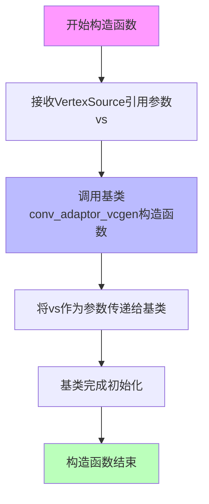
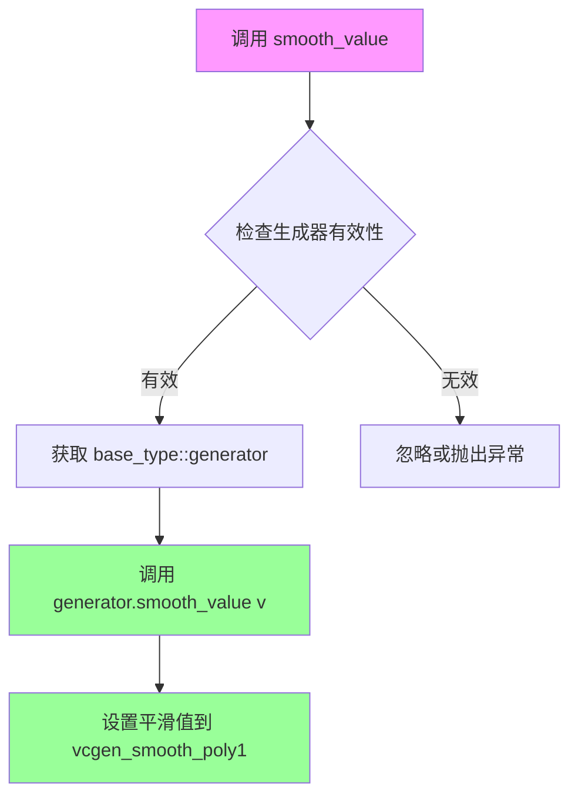
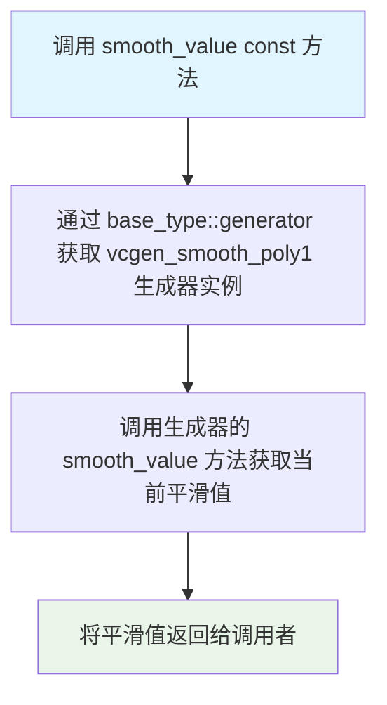
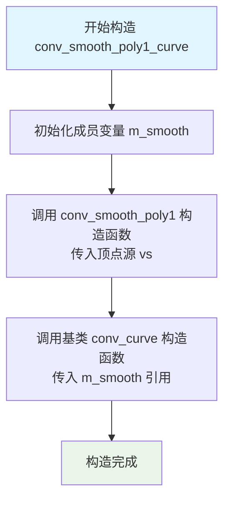
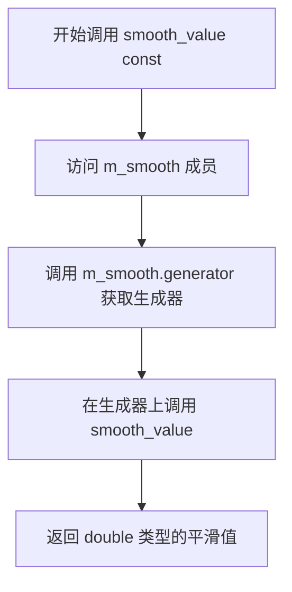

# `matplotlib\extern\agg24-svn\include\agg_conv_smooth_poly1.h` 详细设计文档

Anti-Grain Geometry库中的平滑多边形转换器模板，通过vcgen_smooth_poly1生成器对VertexSource顶点源进行平滑处理，支持设置平滑参数值，可选地与conv_curve结合实现曲线平滑功能。

## 整体流程

```mermaid
graph TD
    A[开始] --> B[创建conv_smooth_poly1实例]
    B --> C[传入VertexSource顶点源]
    C --> D{需要平滑处理?}
    D -- 是 --> E[调用smooth_value设置平滑值]
    E --> F[通过base_type::generator()获取vcgen_smooth_poly1]
    F --> G[调用smooth_value配置生成器]
    G --> H[结束]
    D -- 否 --> H

graph TD
    A[开始] --> B[创建conv_smooth_poly1_curve实例]
    B --> C[初始化m_smooth成员]
    C --> D[调用conv_curve基类]
    D --> E[配置smooth_value]
    E --> F[结合平滑和曲线功能]
    F --> G[结束]
```

## 类结构

```
agg (命名空间)
├── conv_smooth_poly1<VertexSource> (模板结构体)
│   └── 继承自 conv_adaptor_vcgen<VertexSource, vcgen_smooth_poly1>
└── conv_smooth_poly1_curve<VertexSource> (模板结构体)
    └── 继承自 conv_curve<conv_smooth_poly1<VertexSource>>
```

## 全局变量及字段


### `conv_smooth_poly1_curve<VertexSource>.m_smooth`
    
内部平滑处理器，用于执行多边形的平滑操作

类型：`conv_smooth_poly1<VertexSource>`
    
    

## 全局函数及方法


### `conv_smooth_poly1<VertexSource>::conv_smooth_poly1(VertexSource& vs)`

该构造函数是 `conv_smooth_poly1` 模板类的构造函数，用于初始化继承自 `conv_adaptor_vcgen` 的基类，接收一个顶点源引用作为参数，以便将原始顶点数据传递给平滑多边形生成器进行后续处理。

参数：

- `vs`：`VertexSource&`，顶点源对象的引用，用于提供原始几何顶点数据给平滑多边形生成器

返回值：`void`，无返回值（构造函数）

#### 流程图



#### 带注释源码

```cpp
// 模板类conv_smooth_poly1，继承自conv_adaptor_vcgen
// VertexSource是模板参数，表示顶点源类型
template<class VertexSource> 
struct conv_smooth_poly1 : 
public conv_adaptor_vcgen<VertexSource, vcgen_smooth_poly1>
{
    // 定义基类类型别名，方便后续使用
    typedef conv_adaptor_vcgen<VertexSource, vcgen_smooth_poly1> base_type;

    // 构造函数，使用初始化列表调用基类构造函数
    // 参数vs是VertexSource类型的引用，传入原始顶点数据
    conv_smooth_poly1(VertexSource& vs) : 
        conv_adaptor_vcgen<VertexSource, vcgen_smooth_poly1>(vs)
    {
        // 基类构造函数会自动完成以下初始化：
        // 1. 保存vs引用到基类成员
        // 2. 创建并初始化vcgen_smooth_poly1生成器
        // 3. 设置内部状态为初始状态
    }

    // 设置平滑值方法
    void   smooth_value(double v) { base_type::generator().smooth_value(v); }
    
    // 获取平滑值方法
    double smooth_value() const { return base_type::generator().smooth_value(); }

private:
    // 私有拷贝构造函数，禁止拷贝
    conv_smooth_poly1(const conv_smooth_poly1<VertexSource>&);
    
    // 私有赋值运算符，禁止赋值
    const conv_smooth_poly1<VertexSource>& 
        operator = (const conv_smooth_poly1<VertexSource>&);
};
```


### `conv_smooth_poly1<VertexSource>::smooth_value(double v)`

设置平滑值，委托给底层 `vcgen_smooth_poly1` 生成器对象执行实际的平滑值设置操作。

参数：

- `v`：`double`，要设置的平滑值，用于控制多边形的平滑程度

返回值：`void`，无返回值描述

#### 流程图



#### 带注释源码

```cpp
// 设置平滑值
// 参数: v - double类型，平滑值参数
// 功能: 将平滑值委托给底层的vcgen_smooth_poly1生成器
void smooth_value(double v) 
{ 
    // 使用base_type::generator()获取vcgen_smooth_poly1生成器实例
    // 并调用其smooth_value方法设置平滑值
    base_type::generator().smooth_value(v); 
}
```

#### 详细说明

| 项目 | 描述 |
|------|------|
| **类名** | `conv_smooth_poly1<VertexSource>` |
| **方法名** | `smooth_value` |
| **访问权限** | public |
| **委托目标** | `vcgen_smooth_poly1` 生成器 |
| **调用链** | `smooth_value(v)` → `base_type::generator().smooth_value(v)` |
| **设计模式** | 装饰器模式（Decorator Pattern） - 委托实现 |

#### 潜在技术债务与优化空间

1. **缺少参数验证**：未对 `v` 的取值范围进行校验（如是否应该在 [0,1] 或特定范围内）
2. **异常处理缺失**：未检查生成器是否有效，若生成器为空可能导致未定义行为
3. **重复代码**：`conv_smooth_poly1_curve` 类中存在几乎相同的方法实现，可考虑提取公共基类或使用组合
4. **文档缺失**：方法缺少详细的参数说明和边界条件说明


### `conv_smooth_poly1<VertexSource>::smooth_value`

获取当前平滑值（smoothing factor），该值用于控制多边形的平滑程度。该方法从内部包含的 `vcgen_smooth_poly1` 生成器读取当前的平滑因子数值，并将其返回给调用者。

参数：
- （无参数）

返回值：`double`，返回当前设置的平滑因子值（smoothing factor），该值通常在0.0到1.0之间，用于控制多边形边界的平滑程度。

#### 流程图



#### 带注释源码

```cpp
// 获取当前平滑值的const成员函数
// 该函数从内部的vcgen_smooth_poly1生成器读取当前的平滑因子
// 返回值：double类型的平滑因子值
double smooth_value() const 
{ 
    // 通过基类conv_adaptor_vcgen的generator()方法获取vcgen_smooth_poly1生成器实例
    // 然后调用该生成器的smooth_value()方法获取当前配置的平滑值
    return base_type::generator().smooth_value(); 
}
```

#### 相关说明

| 项目 | 说明 |
|------|------|
| **所属类** | `conv_smooth_poly1<VertexSource>` |
| **方法类型** | const成员函数（不修改对象状态） |
| **访问权限** | public |
| **内部依赖** | `conv_adaptor_vcgen<VertexSource, vcgen_smooth_poly1>` 基类 |
| **底层生成器** | `vcgen_smooth_poly1` |
| **配套方法** | `void smooth_value(double v)` - 设置平滑值 |

#### 设计意图

此方法是对 `vcgen_smooth_poly1` 生成器平滑值访问的适配器封装。通过 `conv_smooth_poly1` 包装类，用户可以统一地通过适配器接口访问底层生成器的属性，同时保持了类层次结构的清晰性。该方法通常与 `smooth_value(double v)` setter方法配合使用，用于在运行时动态调整多边形的平滑程度。


### `conv_smooth_poly1_curve::conv_smooth_poly1_curve`

该构造函数是 `conv_smooth_poly1_curve` 类的构造函数，用于初始化平滑多边形曲线转换器。它首先初始化成员变量 `m_smooth`（一个 `conv_smooth_poly1` 对象，接收顶点源 `vs`），然后调用基类 `conv_curve` 的构造函数，将 `m_smooth` 传递进去以完成整个转换链的初始化。

参数：

- `vs`：`VertexSource&`，对顶点源对象的引用，作为平滑多边形曲线转换器的输入源

返回值：无（构造函数，不返回任何值）

#### 流程图



#### 带注释源码

```cpp
// conv_smooth_poly1_curve 构造函数
// VertexSource& vs: 顶点源引用，作为转换器的输入
conv_smooth_poly1_curve(VertexSource& vs) :
    // 首先调用基类 conv_curve 的构造函数，传入 m_smooth
    conv_curve<conv_smooth_poly1<VertexSource> >(m_smooth),
    // 然后初始化成员变量 m_smooth，使用顶点源 vs 构造
    m_smooth(vs)
{
    // 构造函数体为空，所有初始化工作在成员初始化列表中完成
}
```


### `conv_smooth_poly1_curve<VertexSource>::smooth_value`

设置平滑值方法，直接操作内部m_smooth生成器的smooth_value方法，用于配置多边形的平滑程度。

参数：

- `v`：`double`，平滑值参数，定义多边形顶点的平滑程度

返回值：`void`，无返回值

#### 流程图

```mermaid
flowchart TD
    A[开始 smooth_value] --> B[接收参数 double v]
    B --> C[调用 m_smooth.generator().smooth_value v]
    C --> D[结束]
```

#### 带注释源码

```
// 设置平滑值方法
// 参数: v - double类型，平滑值参数
// 功能: 直接操作内部m_smooth生成器的smooth_value方法
void smooth_value(double v) 
{ 
    // 调用成员变量m_smooth的生成器的smooth_value方法设置平滑值
    m_smooth.generator().smooth_value(v); 
}
```


### `conv_smooth_poly1_curve<VertexSource>.smooth_value() const`

获取平滑值，从 m_smooth 生成器读取并返回。

参数：

- （无参数）

返回值：`double`，从生成器获取的平滑因子值

#### 流程图



#### 带注释源码

```cpp
// 获取平滑值函数（const 成员函数）
// 功能：从 m_smooth 成员（conv_smooth_poly1 对象）的生成器中读取平滑值
// 返回：double 类型的平滑因子
double smooth_value() const 
{ 
    // 访问私有成员 m_smooth，它是 conv_smooth_poly1<VertexSource> 类型
    // 调用其 generator() 方法获取 vcgen_smooth_poly1 生成器
    // 然后调用生成器的 smooth_value() 方法获取当前设置的平滑值
    return m_smooth.generator().smooth_value(); 
}
```


## 关键组件


### conv_smooth_poly1

主平滑多边形转换器模板类，继承自conv_adaptor_vcgen，提供将顶点源转换为平滑多边形曲线的核心功能，通过smooth_value方法控制平滑程度。

### conv_smooth_poly1_curve

曲线增强版平滑多边形转换器，继承自conv_curve，内部组合conv_smooth_poly1实现平滑和曲线双重处理，提供smooth_value方法控制平滑参数。

### VertexSource (模板参数)

顶点源类型模板参数，表示输入的顶点序列来源，可以是任意实现顶点生成接口的类。

### smooth_value (方法)

设置平滑值的方法参数，接受double类型v作为平滑系数，用于控制多边形边缘的平滑程度。

### smooth_value (获取方法)

const方法，返回当前配置的平滑系数值，返回double类型。

### m_smooth 成员

conv_smooth_poly1_curve内部的conv_smooth_poly1<VertexSource>类型成员，负责实际的平滑处理逻辑。

### conv_adaptor_vcgen

AGG库中的通用顶点源适配器基类模板，提供将顶点源与生成器连接的框架机制。

### conv_curve

曲线处理转换器基类模板，用于对顶点序列进行曲线插值和平滑处理。


## 问题及建议


### 已知问题

- **拷贝构造函数和赋值运算符私有化方式过时**：使用旧的私有声明方式禁止拷贝和赋值，而不是使用C++11的`= delete`语法，代码冗余且不够清晰
- **模板参数无约束**：VertexSource模板参数没有任何类型约束或概念验证，可能导致编译错误信息不明确
- **继承层次过深**：`conv_smooth_poly1_curve`继承自`conv_curve<conv_smooth_poly1<VertexSource>>`，造成较深的继承链，增加内存布局复杂性和虚函数调用开销
- **成员初始化顺序风险**：`conv_smooth_poly1_curve`构造函数中，先传递m_smooth给基类conv_curve，然后再初始化m_smooth本身，虽然实际执行顺序是按成员声明顺序，但仍存在潜在的代码维护风险
- **缺乏输入验证**：smooth_value方法没有对参数v进行范围验证（如需限制在0.0到1.0之间）
- **getter/setter命名冲突**：通过函数重载实现getter/setter，代码可读性稍差，无法一眼区分读写操作

### 优化建议

- 使用C++11的`= delete`语法明确禁用拷贝和赋值，例如：`conv_smooth_poly1(const conv_smooth_poly1&) = delete;`
- 为模板参数添加静态断言或概念约束，确保VertexSource满足必要的接口要求（如具有rewind、vertex等方法）
- 考虑使用组合而非继承，或重构为更扁平的结构以减少继承层次
- 对smooth_value的输入参数添加范围检查和约束说明文档
- 使用更明确的命名约定，如`smooth_value()`和`set_smooth_value(double)`以增强代码可读性
- 为公共接口添加详细的文档注释，说明参数含义、返回值和副作用


## 其它


### 设计目标与约束

该代码是Anti-Grain Geometry库的一部分，主要设计目标是将输入的多边形顶点数据进行平滑处理，生成更平滑的曲线输出。核心约束包括：1) 模板类设计，要求VertexSource必须符合AGG库的顶点源接口规范；2) 平滑值(smooth_value)参数范围为0.0到1.0，其中0表示不进行平滑处理，1表示最大程度平滑；3) 依赖于conv_adaptor_vcgen和vcgen_smooth_poly1生成器实现核心平滑算法。

### 错误处理与异常设计

该代码采用C++模板实现，不包含显式的异常处理机制。错误处理主要通过：1) 私有拷贝构造函数和赋值运算符防止不当复制；2) 平滑值参数由vcgen_smooth_poly1类内部进行合法性检查；3) 调用方需确保传入的VertexSource对象在生命周期内有效。AGG库整体采用错误码和状态标志而非异常进行错误处理。

### 数据流与状态机

数据流处理遵循AGG的标准顶点源模式：VertexSource提供原始顶点流 → conv_smooth_poly1进行平滑转换 → 输出转换后的顶点序列给下游消费者。状态机方面，vcgen_smooth_poly1内部维护顶点解析状态（起始点、点序列、结束状态），平滑处理在vertex()方法调用时触发。conv_smooth_poly1_curve进一步通过conv_curve添加曲线细分处理。

### 外部依赖与接口契约

主要外部依赖包括：1) agg_basics.h - 基础类型定义；2) agg_vcgen_smooth_poly1.h - 平滑多边形生成器实现；3) agg_conv_adaptor_vcgen.h - 顶点源适配器基类；4) agg_conv_curve.h - 曲线转换类。接口契约要求：VertexSource必须提供rewind()和vertex()方法，符合AGG的VertexSource接口规范；生成的顶点类型包括path_cmd_move_to、path_cmd_line_to、path_cmd_end_poly等。

### 性能考虑

该实现通过模板内联实现了零运行时开销的设计目标。性能关键点：1) 平滑值存储为成员变量，避免重复查询；2) 继承自conv_adaptor_vcgen，享有相同的优化结构；3) conv_smooth_poly1_curve额外引入曲线细分步骤，会增加顶点数量，需权衡平滑度与性能。典型应用场景下，内存占用仅为模板实例化产生的代码膨胀。

### 线程安全性

该代码本身不包含静态状态或全局变量，实例级别的成员变量（smooth_value）不涉及线程间共享。线程安全性完全依赖于调用方对VertexSource和生成器的并发访问控制。在多线程环境下，每个线程应拥有独立的conv_smooth_poly1实例。

### 内存管理

采用栈上分配模式，无动态内存申请。内存管理要点：1) 模板类实例化时不分配堆内存；2) conv_smooth_poly1_curve内部包含conv_smooth_poly1成员m_smooth，构造时直接初始化；3) 生命周期由调用方管理的RAII模式，无需额外资源释放操作。

### 平台兼容性

该代码是跨平台的C++标准库代码，遵循C++98标准（AGG 2.4版本时期），具备良好的平台兼容性。依赖的AGG其他模块已处理平台差异（字节序、对齐等底层问题）。可移植至Windows、Linux、macOS及嵌入式系统。

### 测试策略

测试应覆盖：1) 边界情况 - smooth_value为0和1时的行为；2) 空顶点源输入；3) 单一顶点、两个顶点等最小输入；4) conv_smooth_poly1_curve与conv_smooth_poly1的功能一致性；5) 与不同类型VertexSource的兼容性。AGG库自身包含可视化测试框架，但该组件的单元测试应验证平滑算法的数学正确性。

### 使用示例

典型使用模式：```cpp
// 创建多边形顶点源
agg::pod_bvector<agg::point_d> polygon;
// ... 添加多边形顶点 ...

// 使用平滑转换器
agg::conv_smooth_poly1<decltype(polygon)> smoother(polygon);
smoother.smooth_value(0.5); // 设置平滑程度

// 或使用曲线版本
agg::conv_smooth_poly1_curve<decltype(polygon)> smoother_curve(polygon);
smoother_curve.smooth_value(0.5);
```

### 版本历史和变更记录

该代码取自AGG 2.4版本（2002-2005年间发布）。变更记录：初始版本作为conv_smooth_poly1实现，随后为满足曲线平滑需求新增conv_smooth_poly1_curve变体。AGG后续版本可能存在API变更，但基础设计理念保持一致。

### 参考资料

主要参考资料：1) Anti-Grain Geometry官方文档 http://www.antigrain.com；2) AGG库的conv_adaptor_vcgen基类设计模式；3) vcgen_smooth_poly1生成器的平滑算法实现细节；4) 模板参数VertexSource的接口规范文档。
</think>

### conv_smooth_poly1_conv_adaptor_vcgen详细设计文档

#### 1. 核心功能概述
本代码实现了一个基于Anti-Grain Geometry (AGG) 库的多边形平滑转换器，通过模板类conv_smooth_poly1和conv_smooth_poly1_curve将输入的多边形顶点进行平滑处理，生成更加流畅的曲线输出。

#### 2. 整体运行流程
```
输入顶点源 → conv_smooth_poly1(平滑处理) → 输出的平滑顶点流
输入顶点源 → conv_smooth_poly1_curve(平滑+曲线细分) → 输出的平滑曲线顶点流
```

#### 3. 类的详细信息

##### 3.1 conv_smooth_poly1类
**类字段：**
- 无公共字段（继承自conv_adaptor_vcgen）

**类方法：**
- `conv_smooth_poly1(VertexSource& vs)` - 构造函数，初始化平滑转换器
- `void smooth_value(double v)` - 设置平滑参数
- `double smooth_value() const` - 获取当前平滑参数值

##### 3.2 conv_smooth_poly1_curve类
**类字段：**
- `conv_smooth_poly1<VertexSource> m_smooth` - 平滑转换器实例

**类方法：**
- `conv_smooth_poly1_curve(VertexSource& vs)` - 构造函数
- `void smooth_value(double v)` - 设置平滑参数
- `double smooth_value() const` - 获取当前平滑参数值

#### 4. 全局变量和全局函数
无全局变量和全局函数。

#### 5. 关键组件信息
- **vcgen_smooth_poly1** - 平滑多边形生成器核心类
- **conv_adaptor_vcgen** - 顶点源适配器基类
- **conv_curve** - 曲线转换类

#### 6. 潜在技术债务和优化空间
- 代码采用私有拷贝构造函数和赋值运算符防止不当复制，但可以考虑使用C++11的delete关键字
- 缺少对smooth_value参数的范围验证（应在0.0-1.0之间）
- 没有提供默认构造函数

#### 7. 其他设计项目

### 设计目标与约束
- 目标：实现多边形平滑处理，生成流畅曲线
- 约束：VertexSource必须符合AGG的顶点源接口规范

### 错误处理与异常设计
- 采用错误码机制而非异常
- 调用方需确保VertexSource有效性
- 平滑值参数由vcgen_smooth_poly1内部检查

### 数据流与状态机
- 遵循AGG顶点源模式：VertexSource → conv_smooth_poly1 → 消费者
- 内部通过vcgen_smooth_poly1维护解析状态

### 外部依赖与接口契约
- 依赖：agg_basics.h, agg_vcgen_smooth_poly1.h, agg_conv_adaptor_vcgen.h, agg_conv_curve.h
- 接口契约：VertexSource需提供rewind()和vertex()方法

### 性能考虑
- 模板实现支持内联，零运行时开销
- conv_smooth_poly1_curve会增加顶点数量

### 线程安全性
- 实例级成员变量不涉及线程间共享
- 多线程环境需独立实例

### 内存管理
- 采用栈分配模式，无动态内存申请
- RAII模式管理生命周期

### 平台兼容性
- 遵循C++98标准，跨平台兼容

### 测试策略
- 边界测试（smooth_value为0和1）
- 空输入测试
- 不同VertexSource兼容性测试

### 使用示例
```cpp
agg::conv_smooth_poly1<VertexSourceType> smoother(vertexSource);
smoother.smooth_value(0.5);
```

### 参考资料
- http://www.antigrain.com
- AGG库技术文档

    