# `matplotlib\extern\agg24-svn\include\agg_conv_stroke.h` 详细设计文档

conv_stroke是Anti-Grain Geometry库中的一个模板适配器类，用于将笔画(Stroke)属性（如线帽、线Join、宽度、斜接限制等）应用于顶点源(VertexSource)。它继承自conv_adaptor_vcgen，通过vcgen_stroke生成器实现笔画渲染的几何变换。

## 整体流程

```mermaid
graph TD
    A[开始] --> B[创建conv_stroke实例]
    B --> C[设置stroke参数: width, line_cap, line_join, miter_limit等]
    C --> D[调用conv_adaptor_vcgen的renumber()或next()方法]
    D --> E[vcgen_stroke生成器产生笔画顶点]
    E --> F[输出变换后的顶点序列]
```

## 类结构

```
conv_adaptor_vcgen<VertexSource, vcgen_stroke, Markers> (基类)
└── conv_stroke<VertexSource, Markers> (模板类)
```

## 全局变量及字段


### `conv_stroke.marker_type`
    
标记器类型别名，用于顶点源标记

类型：`typedef Markers`
    


### `conv_stroke.base_type`
    
基类类型别名，继承自描边适配器

类型：`typedef conv_adaptor_vcgen<VertexSource, vcgen_stroke, Markers>`
    


### `conv_stroke.line_cap`
    
设置/获取线条端点样式（线帽）

类型：`method: void(line_cap_e lc) / line_cap_e() const`
    


### `conv_stroke.line_join`
    
设置/获取线条转角样式（线join）

类型：`method: void(line_join_e lj) / line_join_e() const`
    


### `conv_stroke.inner_join`
    
设置/获取内角连接样式

类型：`method: void(inner_join_e ij) / inner_join_e() const`
    


### `conv_stroke.width`
    
设置/获取描边宽度

类型：`method: void(double w) / double() const`
    


### `conv_stroke.miter_limit`
    
设置/获取斜接长度限制

类型：`method: void(double ml) / double() const`
    


### `conv_stroke.miter_limit_theta`
    
通过角度设置斜接限制

类型：`method: void(double t)`
    


### `conv_stroke.inner_miter_limit`
    
设置/获取内斜接限制

类型：`method: void(double ml) / double() const`
    


### `conv_stroke.approximation_scale`
    
设置/获取曲线逼近比例因子

类型：`method: void(double as) / double() const`
    


### `conv_stroke.shorten`
    
设置/获取线条缩短距离

类型：`method: void(double s) / double() const`
    
    

## 全局函数及方法


### `conv_stroke<VertexSource, Markers>.conv_stroke`

这是conv_stroke模板类的构造函数，用于初始化描边（stroke）转换器，将顶点源与描边生成器适配器关联起来。

参数：

- `vs`：`VertexSource&`，顶点源引用，提供需要描边的矢量路径数据

返回值：`无`（构造函数），返回隐式的conv_stroke对象实例，用于描边处理

#### 流程图

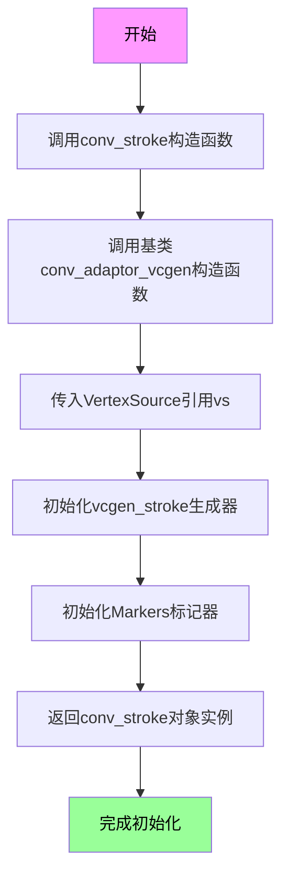

#### 带注释源码

```
// conv_stroke构造函数模板
// VertexSource: 顶点源类型，负责提供路径顶点
// Markers: 标记器类型，用于标记路径起点/终点等
template<class VertexSource, class Markers> 
struct conv_stroke : 
public conv_adaptor_vcgen<VertexSource, vcgen_stroke, Markers>
{
    // 类型别名定义
    typedef Markers marker_type;                      // 标记器类型别名
    typedef conv_adaptor_vcgen<VertexSource, vcgen_stroke, Markers> base_type; // 基类类型别名

    //---------------------------
    // 构造函数
    // 参数: vs - VertexSource引用，传入需要描边的顶点源
    // 功能: 初始化描边转换器，将顶点源与描边生成器关联
    //---------------------------
    conv_stroke(VertexSource& vs) : 
        conv_adaptor_vcgen<VertexSource, vcgen_stroke, Markers>(vs)
    {
        // 基类构造函数会自动:
        // 1. 保存VertexSource引用
        // 2. 创建vcgen_stroke生成器实例
        // 3. 创建Markers标记器实例
    }
    
    // ... 其他成员方法（setter/getter）
    
private:
    // 禁用拷贝构造函数和赋值运算符，防止意外复制
    conv_stroke(const conv_stroke<VertexSource, Markers>&);
    const conv_stroke<VertexSource, Markers>& 
        operator = (const conv_stroke<VertexSource, Markers>&);
};
```


### `conv_stroke<VertexSource, Markers>::line_cap`

该函数是conv_stroke模板类的成员方法，用于设置线条端点样式（line cap），它将指定的line_cap_e类型参数传递给底层vcgen_stroke生成器的line_cap方法，以控制路径端点的绘制样式。

参数：

- `lc`：`line_cap_e`，线条端点样式枚举值，用于指定线条端点的绘制方式（如 butt、square、round 等）

返回值：`void`，无返回值描述

#### 流程图

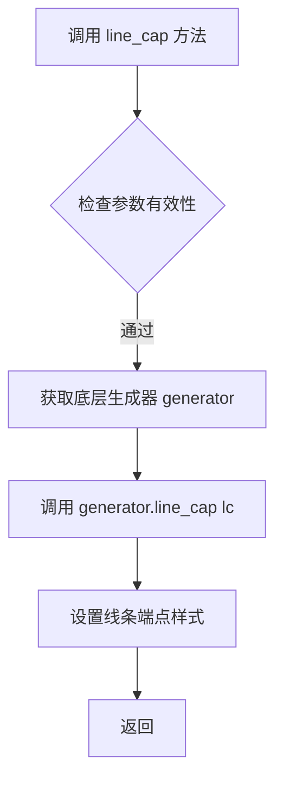

#### 带注释源码

```cpp
// 设置线条端点样式（Line Cap）
// @param lc: line_cap_e 枚举类型，指定线条端点的样式
//           可选值包括： butt（无端点）、square（方形端点）、round（圆形端点）
// @return void：无返回值
void line_cap(line_cap_e lc)     
{ 
    // 通过基类获取底层 vcgen_stroke 生成器，并调用其 line_cap 方法
    // 这里采用了委托模式，将设置工作转发给底层生成器处理
    base_type::generator().line_cap(lc);  
}
```


### `conv_stroke<VertexSource, Markers>.line_join`

设置线条转角处的连接风格（line join），该方法委托给内部生成的vcgen_stroke对象来处理。

参数：

- `lj`：`line_join_e`，指定线条转角处的连接方式（如尖角、圆角、斜角等）

返回值：`void`，无返回值，用于设置属性

#### 流程图

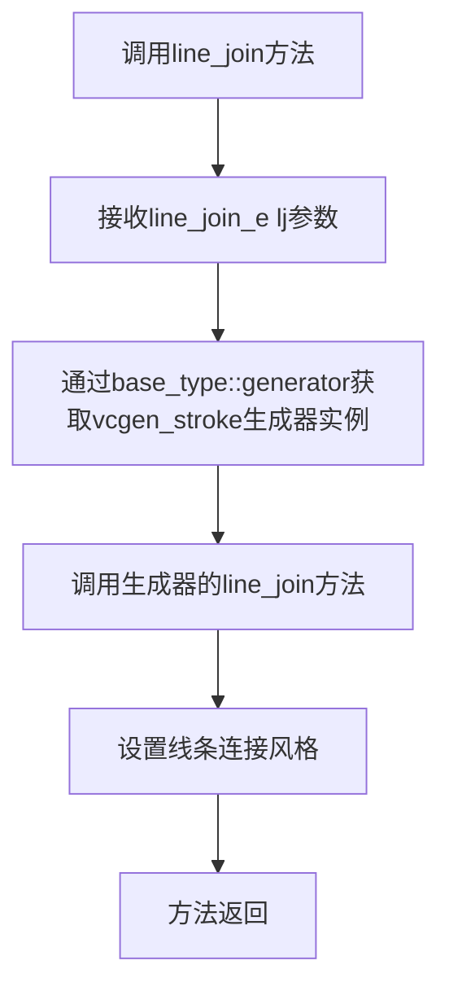

#### 带注释源码

```cpp
// 设置线条转角处的连接风格
// 参数: lj - line_join_e枚举类型，指定连接方式
//       可选值包括：miter_join（尖角）、round_join（圆角）、bevel_join（斜角）
// 返回值: void（无返回值）
void line_join(line_join_e lj)   
{ 
    // 委托给基类conv_adaptor_vcgen的generator（即vcgen_stroke）进行实际设置
    base_type::generator().line_join(lj); 
}
```


### `conv_stroke<VertexSource, Markers>.inner_join(inner_join_e ij)`

设置折线 stroke 产生器（vcgen_stroke）的内部连接方式（inner join），用于控制路径端点在尖角处的内部连接行为，例如控制线段转弯处的连接样式。

参数：

- `ij`：`inner_join_e`，内部连接类型枚举值，用于指定线段转弯处的内部连接方式（如 AGG_MITER_JOIN、AGG_ROUND_JOIN、AGG_JAG_JOIN 等）

返回值：`void`，无返回值

#### 流程图

```mermaid
flowchart TD
    A[调用 inner_join] --> B{参数验证}
    B -->|参数有效| C[调用 base_type::generator().inner_join]
    C --> D[vcgen_stroke 设置 inner_join]
    D --> E[返回]
    B -->|参数无效| E
```

#### 带注释源码

```cpp
// 模板类 conv_stroke 的成员函数
// 功能：设置 stroke 生成器的内部连接方式（inner join）
// 参数：ij - inner_join_e 枚举类型，指定内部连接类型
// 返回值：void
void inner_join(inner_join_e ij) 
{ 
    // 通过基类 conv_adaptor_vcgen 访问 vcgen_stroke 生成器
    // 将 inner_join 设置传递给底层生成器
    base_type::generator().inner_join(ij);  
}
```

#### 说明

- 该方法是 `conv_stroke` 模板类的成员函数，继承自 `conv_adaptor_vcgen<VertexSource, vcgen_stroke, Markers>` 适配器类
- 底层通过调用 `vcgen_stroke` 生成器的 `inner_join()` 方法来实现功能
- `inner_join_e` 枚举定义了三种内部连接类型：`inner_join_e`（具体值取决于 AGG 库定义，通常包括 MITER、JAG 等）
- 此设置影响折线转弯处的内部顶点生成方式，用于控制路径尖角的内部连接样式


### conv_stroke<VertexSource, Markers>.line_cap()

获取当前设置的线帽样式（Line Cap）。该方法是一个 const 访问器，通过调用底层生成器的 line_cap() 方法返回当前的线帽类型。

参数：  
无

返回值：`line_cap_e`，返回当前的线帽样式（line_cap_e 枚举类型），表示线条端点的样式（如 butt、square、round）。

#### 流程图

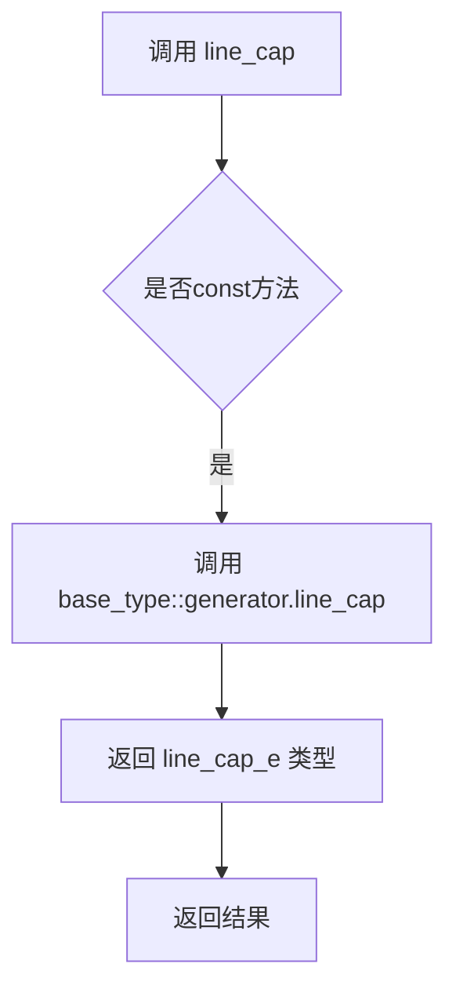

#### 带注释源码

```cpp
// 获取当前线帽样式的const成员函数
// 该函数继承自conv_adaptor_vcgen模板类
// 通过底层vcgen_stroke生成器获取当前的线帽配置
line_cap_e line_cap() const 
{ 
    // base_type::generator() 返回 vcgen_stroke 的引用
    // 调用生成器的 line_cap() 获取当前线帽类型
    return base_type::generator().line_cap();  
}
```


### `conv_stroke<VertexSource, Markers>::line_join()`

该方法是`conv_stroke`模板结构体的const成员函数，用于获取当前路径描边的连接样式（line join style）。它通过调用底层生成器（vcgen_stroke）的`line_join()`方法来返回当前的连接类型枚举值。

参数：该函数无参数。

返回值：`line_join_e`，返回当前的线条连接样式枚举值（如miter_join、round_join或bevel_join）。

#### 流程图

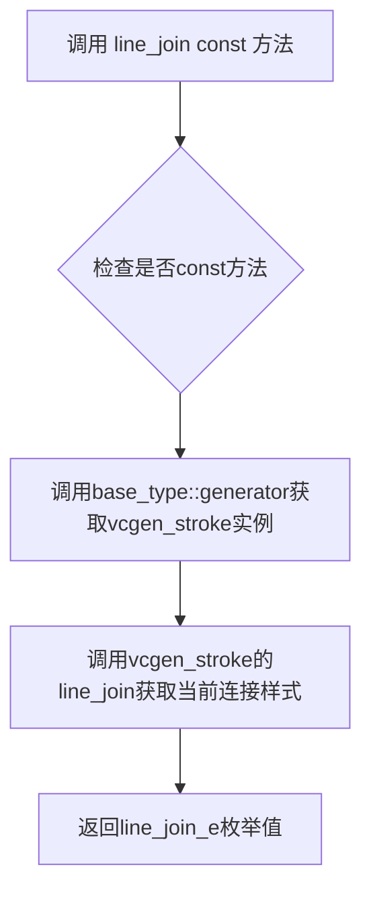

#### 带注释源码

```cpp
// 获取当前的线条连接样式
// 该方法是一个const成员函数，不修改对象状态
// 返回值类型为line_join_e，表示当前的连接类型
// line_join_e是一个枚举类型，可能包含以下值：
// - miter_join: 尖角连接
// - round_join: 圆角连接
// - bevel_join: 斜面连接
line_join_e  line_join()  const 
{ 
    // 通过base_type::generator()获取底层的vcgen_stroke生成器实例
    // 然后调用其line_join()方法获取当前的连接样式
    return base_type::generator().line_join();  
}
```

#### 对应的setter方法

```cpp
// 与该getter对应的setter方法，用于设置线条连接样式
void line_join(line_join_e lj)   
{ 
    // 将参数lj传递给底层生成器的line_join方法进行设置
    base_type::generator().line_join(lj); 
}
```


### `conv_stroke<VertexSource, Markers>.inner_join() const`

该方法用于获取当前笔划转换器中使用的内部连接类型（inner join type）。内部连接类型决定了当两条线段相交时转角处的绘制方式，是锐角连接、斜切连接还是圆角连接。

参数：
- 无

返回值：`inner_join_e`，返回当前的内部连接类型设置

#### 流程图

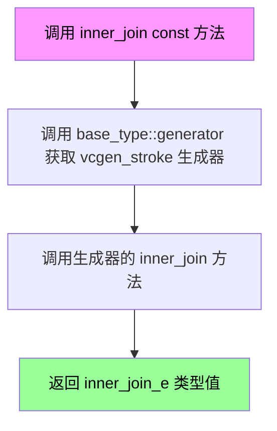

#### 带注释源码

```cpp
// 获取内部连接类型的常量成员函数
// 参数: 无
// 返回值: inner_join_e - 当前设置的内部连接类型枚举值
inner_join_e inner_join() const 
{ 
    // 通过基类获取 vcgen_stroke 生成器实例
    // 并调用其 inner_join()  getter 方法获取当前设置
    // 
    // inner_join_e 枚举值可能的取值:
    // - inner_join_bevel: 斜切连接
    // - inner_join_miter: 尖角连接（受 miter_limit 限制）
    // - inner_join_jag: 锯齿连接（已废弃）
    // - inner_join_round: 圆角连接
    return base_type::generator().inner_join();  
}
```


### `conv_stroke<VertexSource, Markers>.width`

设置笔触的宽度。该方法内部调用底层生成器 `vcgen_stroke` 的 `width` 方法来配置笔触的线条宽度参数。

参数：

- `w`：`double`，要设置的笔触宽度值

返回值：`void`，无返回值

#### 流程图

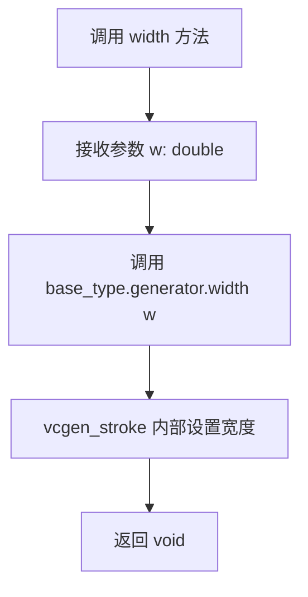

#### 带注释源码

```cpp
// 设置笔触的宽度
// 参数 w: double 类型，表示要设置的笔触宽度值
// 返回值: void，无返回值
void width(double w) 
{ 
    // 委托给基类中的生成器对象 (vcgen_stroke) 来执行实际的宽度设置操作
    base_type::generator().width(w); 
}
```


### `conv_stroke<VertexSource, Markers>::miter_limit(double ml)`

设置线条笔触的斜接限制值（miter limit），用于控制线段转角处突出部分的 最大长度。当转角角度过小导致突出部分超过此限制时，系统会自动将其截断为斜接限制线。

参数：

- `ml`：`double`，斜接限制值，指定转角处突出部分与线条宽度的最大比例

返回值：`void`，无返回值

#### 流程图

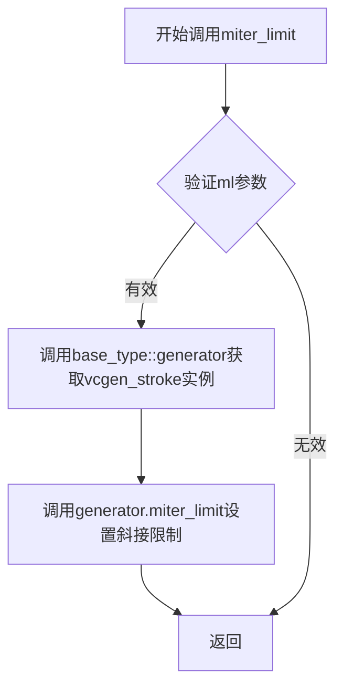

#### 带注释源码

```cpp
// 设置线条的斜接限制（miter limit）
// ml: 斜接限制值，用于控制转角处突出部分的最大长度
// 当两条线段以锐角相交时，拐角处会形成尖角突出，
// 如果突出部分超过此限制，则会被截断为斜接限制线
void miter_limit(double ml) { 
    base_type::generator().miter_limit(ml);  // 委托给vcgen_stroke生成器设置斜接限制值
}
```


### `conv_stroke<VertexSource, Markers>.miter_limit_theta`

设置斜接角度阈值，用于控制线条拐角处尖角的延伸长度。当线条夹角小于该角度时，使用斜接方式连接；否则使用其他连接方式（如圆角或斜切）。

参数：

- `t`：`double`，角度阈值（弧度），用于控制斜接限制的角度

返回值：`void`，无返回值

#### 流程图

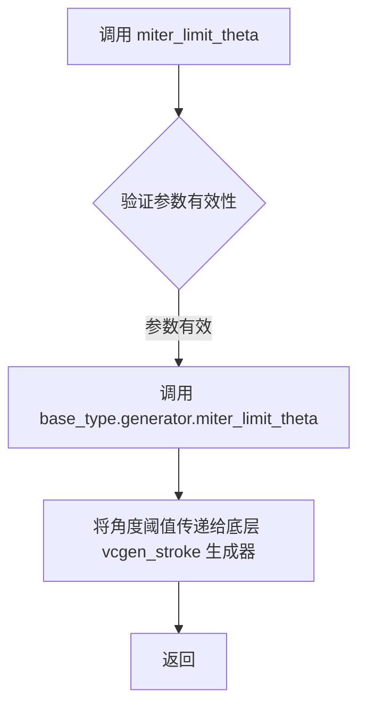

#### 带注释源码

```cpp
//----------------------------------------------------------------------------
// conv_stroke 模板类中设置斜接角度阈值的方法
//----------------------------------------------------------------------------
// 参数:
//   t - double类型，表示角度阈值（弧度）
//     该值用于控制线条拐角处斜接连接的角度限制
//     当两条线段的夹角小于此角度时，使用斜接方式绘制拐角
//     当夹角大于此角度时，使用其他连接方式（如round或bevel）
//----------------------------------------------------------------------------
// 返回值: void（无返回值）
//----------------------------------------------------------------------------
void miter_limit_theta(double t) 
{ 
    // 委托给基类的生成器（vcgen_stroke）处理实际的逻辑
    // conv_adaptor_vcgen 是适配器模式，将 VertexSource 适配为生成器接口
    // vcgen_stroke 是实际的线条生成器，负责处理线条的各种属性
    base_type::generator().miter_limit_theta(t); 
}
```

#### 相关上下文信息

**所属类**: `conv_stroke<VertexSource, Markers>`

**基类**: `conv_adaptor_vcgen<VertexSource, vcgen_stroke, Markers>`

**功能说明**: 
- `conv_stroke` 是一个模板适配器类，用于为顶点源（VertexSource）添加线条描边功能
- `miter_limit_theta` 方法设置斜接角度阈值，该值被传递给内部的 `vcgen_stroke` 生成器
- 角度 `t` 应该是弧度值，通常使用 `PI` 常量来转换角度

**调用链**:
```
用户调用 conv_stroke.miter_limit_theta(t)
    ↓
conv_stroke.miter_limit_theta(t)
    ↓
base_type.generator().miter_limit_theta(t)  // base_type 是 conv_adaptor_vcgen
    ↓
vcgen_stroke.miter_limit_theta(t)  // 实际生成器处理
```

**相关方法**:
- `miter_limit(double ml)` - 设置斜接长度限制（而非角度）
- `line_join()` / `line_join(line_join_e lj)` - 获取/设置线条连接类型
- `line_cap()` / `line_cap(line_cap_e lc)` - 获取/设置线条端点类型


### `conv_stroke::inner_miter_limit`

该方法用于设置轮廓生成器的内部斜接（miter）限制值，通过调用内部生成器的对应函数来实现配置。

参数：

- `ml`：`double`，设置内部斜接限制的具体数值，用于控制线条转折处内角的延伸范围。

返回值：`void`，无返回值，仅执行配置操作。

#### 流程图

```mermaid
graph TD
    A[调用 inner_miter_limit] --> B[调用 base_type::generator().inner_miter_limit]
    B --> C[配置 vcgen_stroke 生成器的内部斜接限制]
```

#### 带注释源码

```cpp
// 设置内部斜接限制值
// 参数 ml: double类型，表示内部斜接限制的数值
void inner_miter_limit(double ml) { 
    // 调用基类的生成器对象的inner_miter_limit方法，将参数传递进去
    base_type::generator().inner_miter_limit(ml); 
}
```


### `conv_stroke<VertexSource, Markers>.approximation_scale`

该方法用于设置笔触的近似比例因子（approximation_scale），控制曲线和转角渲染时的精度缩放。值越大表示越精细的近似计算。

参数：

- `as`：`double`，近似比例因子，值越大曲线和转角的近似精度越高

返回值：`void`，无返回值

#### 流程图

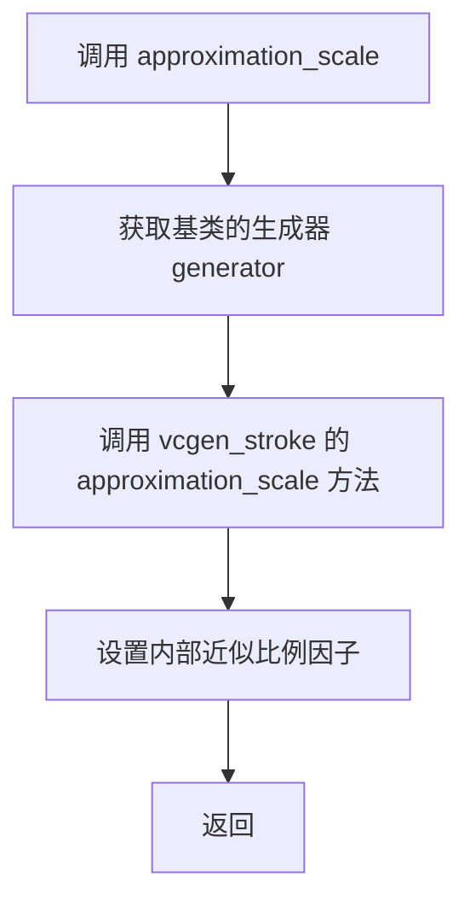

#### 带注释源码

```cpp
//----------------------------------------------------------------------------
// 名称: approximation_scale
// 功能: 设置笔触的近似比例因子,用于控制曲线和转角的近似精度
// 参数: 
//   as - double类型,近似比例因子,值越大表示近似精度越高
// 返回: void
//----------------------------------------------------------------------------
void approximation_scale(double as) 
{ 
    // 通过基类获取vcgen_stroke生成器,并调用其approximation_scale方法
    // base_type::generator() 返回 vcgen_stroke 的引用
    base_type::generator().approximation_scale(as); 
}
```


### `conv_stroke<VertexSource, Markers>.width() const`

该方法是一个常成员函数，用于获取当前设置的线条宽度（stroke width）。它通过调用基类的生成器对象的 `width()` 方法来获取并返回当前的线宽值。

参数：该方法没有参数。

返回值：`double`，返回当前设置的线条宽度值。

#### 流程图

```mermaid
flowchart TD
    A[开始] --> B[调用base_type::generator().width]
    B --> C[获取double类型的线宽值]
    C --> D[返回线宽值]
    D --> E[结束]
```

#### 带注释源码

```cpp
// 获取当前线条宽度的成员方法
// 返回值：double类型，表示当前设置的线条宽度
// 该方法为const成员函数，不会修改对象状态
double width() const 
{ 
    // 通过基类的生成器获取当前的线条宽度
    // base_type是conv_adaptor_vcgen<VertexSource, vcgen_stroke, Markers>
    // generator()返回vcgen_stroke类型的生成器对象
    // width()是vcgen_stroke的成员方法，返回double类型的线宽值
    return base_type::generator().width(); 
}
```


### `conv_stroke.miter_limit()`

该方法是一个const成员函数，用于获取当前设置的斜接限制值（miter limit），该值控制当线条使用尖角连接（miter join）时，尖角延伸的最大长度倍数。

参数：无

返回值：`double`，返回当前设置的斜接限制倍数，用于控制尖角延伸的最大长度，防止过长的尖角。

#### 流程图

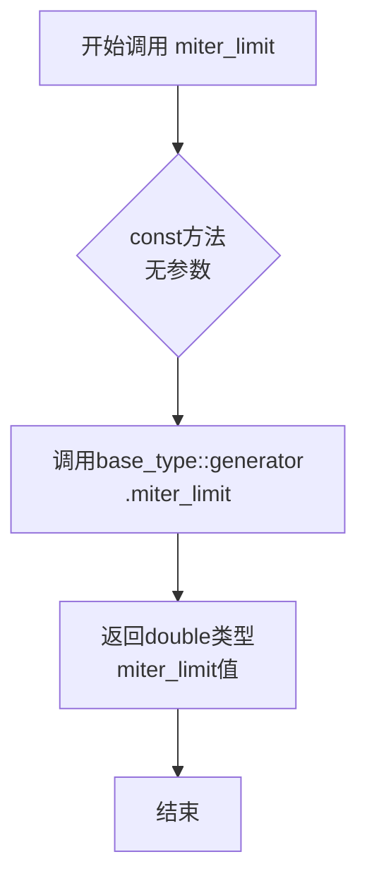

#### 带注释源码

```cpp
/// 获取斜接限制值
/// @return double 返回当前的斜接限制倍数，用于控制尖角延伸的最大长度
double miter_limit() const 
{ 
    // 通过基类的生成器获取vcgen_stroke的miter_limit值
    // 该值默认为4.0，表示尖角长度超过线宽4倍时转换为斜切
    return base_type::generator().miter_limit(); 
}
```


### `conv_stroke<VertexSource, Markers>.inner_miter_limit() const`

该方法用于获取内部斜接（inner miter）的限制值，用于控制线条拐角处的内部斜接角度。

参数：
- 无

返回值：`double`，返回内部斜接限制值。

#### 流程图

```mermaid
graph TD
    A[调用 inner_miter_limit] --> B[调用 base_type::generator().inner_miter_limit]
    B --> C[返回 double 类型的内部斜接限制值]
```

#### 带注释源码

```cpp
// 获取内部斜接限制值
// 返回值：double 类型，表示内部斜接限制值
double inner_miter_limit() const 
{ 
    // 调用基类 conv_adaptor_vcgen 的生成器 vcgen_stroke 的 inner_miter_limit 方法
    return base_type::generator().inner_miter_limit(); 
}
```


### `conv_stroke<VertexSource, Markers>.approximation_scale`

该方法为 `conv_stroke` 模板类的 const 成员函数，用于获取当前曲线逼近的比例因子（approximation scale），该因子控制曲线逼近的精度。

参数：
- （无）

返回值：`double`，返回当前的近似比例因子值，用于控制曲线逼近的精度。

#### 流程图

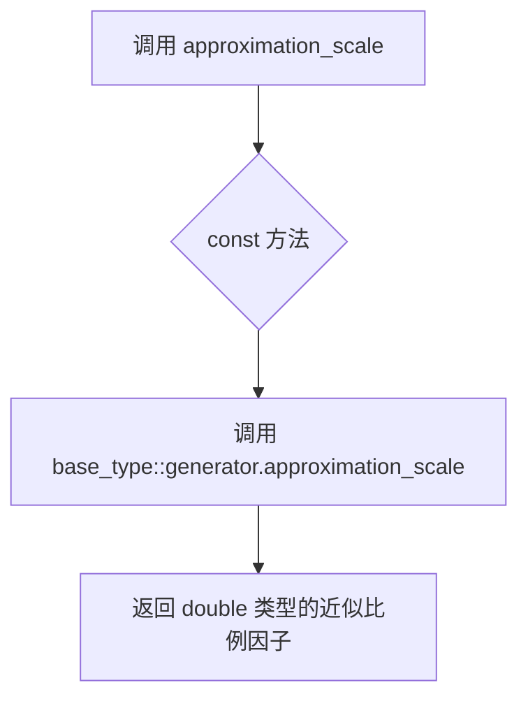

#### 带注释源码

```cpp
// 获取近似比例因子
// 该方法调用基类的 generator (vcgen_stroke) 的 approximation_scale() 方法
// 返回值: double 类型的近似比例因子，用于控制曲线逼近精度
double approximation_scale() const 
{ 
    // 通过基类 conv_adaptor_vcgen 访问 vcgen_stroke 生成器的近似比例因子
    return base_type::generator().approximation_scale(); 
}
```


### `conv_stroke<VertexSource, Markers>.shorten`

设置路径端点的缩短距离，用于控制线条路径的缩短程度，常用于在绘制线条时减少两端的长度。

参数：

- `s`：`double`，表示要缩短的距离值，正值缩短线条，负值延长线条

返回值：`void`，无返回值

#### 流程图

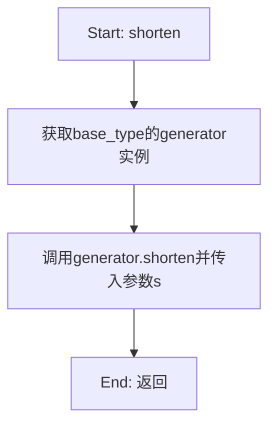

#### 带注释源码

```cpp
// 设置路径端点的缩短距离
// 参数: s - double类型，表示缩短的幅度
//       正值会使线条两端向中心缩短
//       负值会使线条两端向外延伸
void shorten(double s) 
{ 
    // 委托给基类的generator对象执行实际的shorten操作
    // base_type 是 conv_adaptor_vcgen<VertexSource, vcgen_stroke, Markers>
    // generator() 返回内部的 vcgen_stroke 生成器实例
    base_type::generator().shorten(s); 
}
```


### `conv_stroke<VertexSource, Markers>::shorten`

获取线条缩短长度。该方法返回当前设置的线条缩短值（shorten），用于控制路径端点在渲染时的缩短距离，常用于处理线条端点的精确控制。

参数：
- （无参数）

返回值：`double`，返回当前配置的线条缩短长度值。

#### 流程图

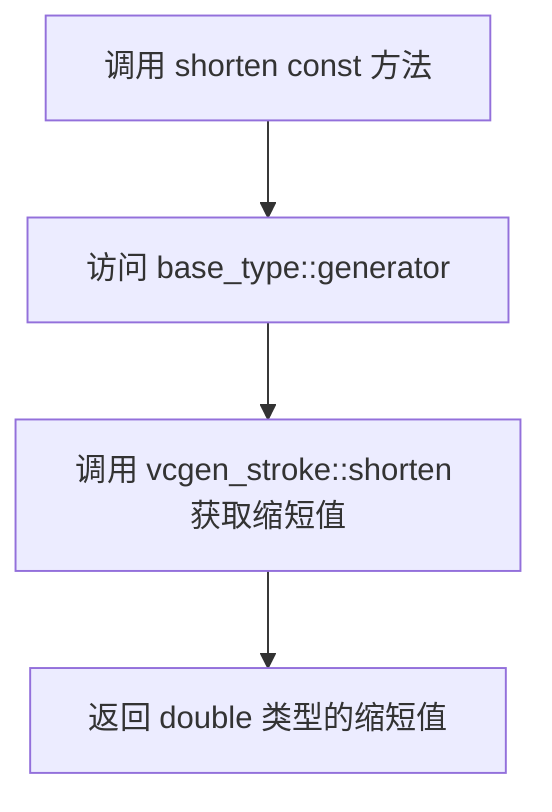

#### 带注释源码

```cpp
// 获取线条缩短长度
// 该方法为const成员函数，不修改对象状态
// 返回值：double类型的线条缩短值
// 功能：从底层vcgen_stroke生成器获取当前配置的shorten参数
//       shorten参数用于控制路径端点的缩短距离，
//       正值会使线条端点向内部收缩，负值则向外延伸
double shorten() const 
{ 
    // 通过base_type访问generator（vcgen_stroke实例）
    // 调用其shorten() getter方法获取当前配置的缩短值
    return base_type::generator().shorten(); 
}
```

#### 补充说明

| 项目 | 说明 |
|------|------|
| **所属类** | `conv_stroke<VertexSource, Markers>` |
| **方法类型** | const成员函数（getter） |
| **底层依赖** | `vcgen_stroke` 类的 shorten() 方法 |
| **设计模式** | 装饰器模式（通过 `conv_adaptor_vcgen` 适配器封装 `vcgen_stroke`） |
| **典型用途** | 在矢量图形渲染中控制线条端点的缩短，常用于折线图的线条处理或路径优化 |


## 关键组件


### conv_stroke 模板类

conv_stroke 是 AGG 库中的描边转换器模板类，继承自 conv_adaptor_vcgen，用于将顶点源转换为带有描边属性的几何图形，支持配置线帽样式、线段连接方式、描边宽度、miter 限制等描边参数。

### conv_adaptor_vcgen 基类适配器

conv_adaptor_vcgen 是顶点源与图形生成器之间的适配器模板类，提供统一的接口来调用内部的 vcgen_stroke 生成器，并支持可选的标记类型（Markers）。

### vcgen_stroke 描边生成器

vcgen_stroke 是实际的描边几何生成器，负责根据配置的描边参数（宽度、线帽、连接方式等）将顶点序列转换为描边后的几何路径。

### Markers 标记类型

Markers 是可选的标记类型模板参数，用于在描边过程中标记特定顶点（如线段端点、拐点），默认为 null_markers（无标记）。

### line_cap 线帽配置

line_cap_e 类型的线帽样式配置，用于设置线段端点的显示样式，包括 butt（平头）、round（圆头）、square（方头）三种选项。

### line_join 线段连接配置

line_join_e 类型的线段连接配置，用于设置两条线段相交时的连接样式，包括 miter（尖角）、round（圆角）、bevel（斜角）三种选项。

### inner_join 内部连接配置

inner_join_e 类型的内部连接配置，用于设置路径内部拐角的连接方式。

### width 描边宽度

double 类型的描边宽度参数，控制描边的粗细程度。

### miter_limit Miter 限制

double 类型的 miter limit 参数，控制尖角连接的延伸长度限制，防止过长的尖角。

### shorten 缩短参数

double 类型的缩短参数，用于在线段端点处缩短描边路径，实现虚线效果或调整端点位置。


## 问题及建议


### 已知问题

- **拷贝控制机制不明确**：使用旧的 private 声明方式阻止拷贝而非 C++11 的 `= delete`，代码可读性较差
- **参数验证缺失**：`width()`、`miter_limit()`、`shorten()` 等数值 setter 方法未对负数或非法值进行校验，可能导致运行时异常或未定义行为
- **缺少文档注释**：所有公共方法均无注释，调用者无法了解参数合法范围和默认值
- **异常安全无保证**：方法调用 `base_type::generator()` 的异常规范未知，调用者无法了解函数是否会抛出异常
- **const 成员函数不完整**：`line_cap()`、`line_join()` 等 getter 返回 `line_cap_e` 等枚举类型，但 `base_type::generator()` 本身可能是非 const 的，存在潜在的 const 正确性问题
- **无资源管理策略**：类中无任何资源获取/释放逻辑说明，也无 thread-safety 考量

### 优化建议

- 使用 `conv_stroke(const conv_stroke&) = delete;` 和 `operator=(const conv_stroke&) = delete;` 替代当前的 private 声明方式，提高代码意图的清晰度
- 在数值 setter 方法中添加参数校验，例如 `width(double w)` 应拒绝负值并提供明确的错误处理机制
- 为所有公共方法添加 Doxygen 风格注释，说明参数范围、默认值、抛出异常等契约
- 考虑添加 `noexcept` 声明到不抛出异常的方法，提升代码可优化性和异常安全保证
- 考虑添加 `virtual ~conv_stroke() = default;` 以确保正确的析构行为（尽管当前非基类使用）
- 提取常用参数组合为配置对象或 builder 模式，减少方法调用链长度
</think>

## 其它


### 设计目标与约束

该模板类conv_stroke是AGG库中用于将矢量路径转换为描边路径的转换器。其主要设计目标是为任意顶点源（VertexSource）提供灵活的描边功能，支持多种线端点样式（line_cap）、线连接样式（line_join）和内连接样式（inner_join）的配置。约束条件包括：1) 模板参数VertexSource必须是一个可迭代的顶点源；2) Markers类型默认为null_markers，用于标记路径的起始点和终点；3) 所有配置方法均为链式调用设计，无返回值错误。

### 错误处理与异常设计

该类不直接抛出异常，错误处理采用以下方式：1) 通过返回默认值来处理无效参数（如miter_limit返回默认的4.0）；2) 所有setter方法返回void，参数有效性由vcgen_stroke类内部保证；3) 私有拷贝构造函数和赋值运算符阻止不恰当的复制操作，避免潜在的内存问题；4) 异常传播依赖于底层vcgen_stroke生成器的实现。

### 数据流与状态机

数据流从VertexSource输入，经过conv_stroke适配器传递给vcgen_stroke生成器，最终输出描边后的顶点序列。状态机主要由vcgen_stroke内部维护，包含以下状态：初始状态（initial）、顶点生成状态（vertex）、线段生成状态（line）等。conv_stroke作为适配器层，不维护独立的状态机，仅转发配置参数和顶点数据。

### 外部依赖与接口契约

核心依赖包括：1) agg_basics.h - 基础类型定义；2) agg_vcgen_stroke.h - 描边生成器实现；3) agg_conv_adaptor_vcgen.h - 适配器基类。接口契约规定：VertexSource必须提供至少一个迭代器接口；Marker类型需符合AGG的标记器规范；所有配置方法必须在路径生成之前调用。

### 性能考虑

性能优化点包括：1) 使用模板参数实现编译时多态，避免运行时开销；2) 所有getter方法声明为const，允许编译器进行优化；3) 内部委托给vcgen_stroke实现，保留了生成器的优化策略；4) 无动态内存分配，所有配置存储在基类中。潜在性能瓶颈在于vcgen_stroke的顶点生成算法复杂度。

### 线程安全性

该类本身不包含 mutable 成员变量，配置方法均为const引用或值传递，无线程间共享状态。但需注意：1) 多线程环境下共享同一个conv_stroke实例进行读写操作是不安全的；2) 建议每个线程使用独立的实例；3) 底层vcgen_stroke生成器可能有内部状态，需确保线程隔离。

### 内存管理

内存管理策略：1) 不持有额外的动态内存，所有状态存储在基类conv_adaptor_vcgen中；2) 通过私有化拷贝构造函数和赋值运算符禁止隐式复制，鼓励使用引用或智能指针共享；3) 生命周期由用户显式管理，析构函数由基类处理。

### 使用示例

典型用法：创建一条曲线，应用conv_stroke进行描边，然后渲染。
```cpp
// 创建曲线源
agg::bezier_curve curve(x1, y1, x2, y2, x3, y3);
// 配置描边转换器
agg::conv_stroke<agg::bezier_curve> stroker(curve);
stroker.width(2.0);
stroker.line_cap(agg::round_cap);
stroker.line_join(agg::round_join);
// 渲染描边路径
agg::render_all_paths(stroker, markers, rasterizer, renderer);
```

### 兼容性考虑

该代码遵循C++98标准，具有广泛的兼容性：1) 使用模板而非C++11特性；2) 命名空间agg避免全局命名冲突；3) 条件编译宏AG G_CONV_STROKE_INCLUDED防止重复包含；4) 与AGG库的早期版本保持接口一致。

### 测试策略

建议测试覆盖：1) 不同line_cap样式（butt、round、square）的输出验证；2) 不同line_join样式（miter、round、bevel）的输出验证；3) miter_limit和inner_miter_limit的边界条件测试；4) width为0或负值时的行为；5) shorten参数对路径的影响；6) 模板参数为不同VertexSource类型时的编译测试；7) 多线程并发访问的并发安全测试。

    