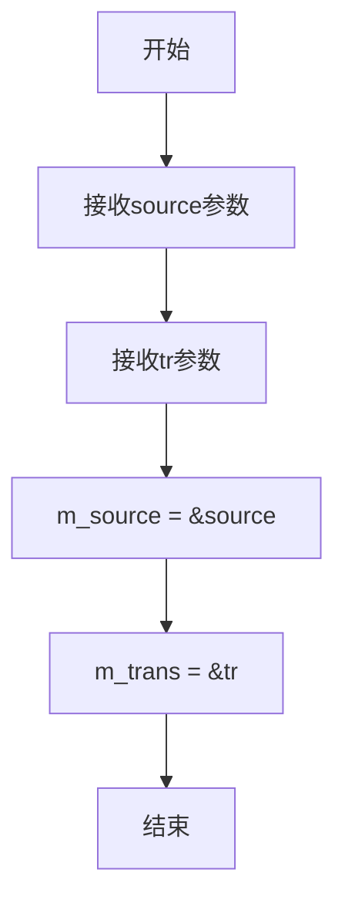
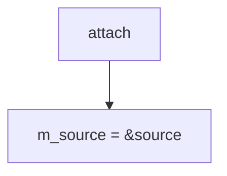
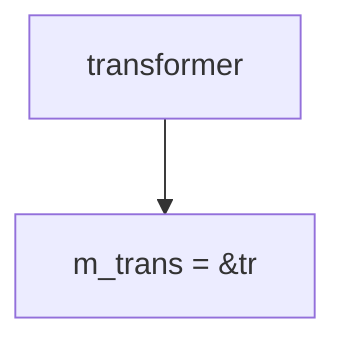

# `matplotlib\extern\agg24-svn\include\agg_conv_transform.h` 详细设计文档

一个模板类，用于包装顶点数据源并对每个顶点应用仿射变换，是AGG图形渲染管线中常用的顶点转换适配器。

## 整体流程

```mermaid
graph TD
    A[开始] --> B[调用 rewind(path_id)]
    B --> C[调用 m_source->rewind(path_id)]
    C --> D[调用 vertex(x, y)]
    D --> E{获取顶点命令}
    E --> F{is_vertex(cmd)?}
    F -- 是 --> G[调用 m_trans->transform(x, y)]
    F -- 否 --> H[直接返回cmd]
    G --> I[返回cmd]
    H --> I
```

## 类结构

```
agg (命名空间)
└── conv_transform<VertexSource, Transformer> (模板类)
    - m_source: VertexSource* (顶点源指针)
    - m_trans: Transformer* (变换器指针)
```

## 全局变量及字段


### `conv_transform<VertexSource, Transformer>.m_source`
    
指向顶点数据源的指针，用于获取原始顶点

类型：`VertexSource*`
    


### `conv_transform<VertexSource, Transformer>.m_trans`
    
指向变换器的指针，用于对顶点应用几何变换

类型：`Transformer*`
    
    

## 全局函数及方法


### conv_transform（构造函数）

构造函数，初始化顶点源和变换器指针，将输入的 VertexSource 和 Transformer 引用转换为内部指针存储。

参数：

- `source`：`VertexSource&`，顶点数据源引用
- `tr`：`Transformer&`，变换器引用

返回值：无（构造函数）

#### 流程图



#### 带注释源码

```cpp
// 构造函数模板
// VertexSource: 顶点数据源类型
// Transformer: 变换器类型，默认为trans_affine
conv_transform(VertexSource& source, Transformer& tr) :
    // 初始化列表：将source和tr的地址分别赋值给m_source和m_trans指针
    m_source(&source), m_trans(&tr) {}
```

#### 完整类结构参考

```cpp
template<class VertexSource, class Transformer=trans_affine> class conv_transform
{
public:
    // 构造函数
    conv_transform(VertexSource& source, Transformer& tr) :
        m_source(&source), m_trans(&tr) {}
    
    // 附加顶点源
    void attach(VertexSource& source) { m_source = &source; }

    // 重绕顶点源
    void rewind(unsigned path_id) 
    { 
        m_source->rewind(path_id); 
    }

    // 获取顶点并应用变换
    unsigned vertex(double* x, double* y)
    {
        unsigned cmd = m_source->vertex(x, y);
        if(is_vertex(cmd))
        {
            m_trans->transform(x, y);
        }
        return cmd;
    }

    // 更换变换器
    void transformer(Transformer& tr)
    {
        m_trans = &tr;
    }

private:
    // 禁用拷贝构造和赋值运算符（保持指针语义）
    conv_transform(const conv_transform<VertexSource>&);
    const conv_transform<VertexSource>& 
        operator = (const conv_transform<VertexSource>&);

    VertexSource*      m_source;   // 顶点数据源指针
    Transformer* m_trans;          // 变换器指针
};
```


### conv_transform.attach

重新附加新的顶点数据源

参数：

- `source`：`VertexSource&`，新的顶点数据源引用

返回值：`void`，无返回值

#### 流程图



#### 带注释源码

```
//----------------------------------------------------------------------------
// Anti-Grain Geometry - Version 2.4
//----------------------------------------------------------------------------
void attach(VertexSource& source) 
{ 
    // 重新设置顶点数据源指针，指向新的顶点数据源
    m_source = &source; 
}
```


### `conv_transform<VertexSource, Transformer>.rewind`

重置顶点读取位置，将请求转发给底层顶点源

参数：

- `path_id`：`unsigned`，路径标识符

返回值：`void`，无返回值描述

#### 流程图

```mermaid
graph TD
    A[rewind] --> B[m_source->rewind(path_id)]
```

#### 带注释源码

```
void rewind(unsigned path_id) 
{ 
    // 将path_id转发给底层顶点源，重新设置读取位置
    m_source->rewind(path_id); 
}
```


### `conv_transform<VertexSource, Transformer>::vertex`

获取下一个顶点，若为有效顶点则应用变换

参数：

- `x`：`double*`，输出参数，顶点x坐标
- `y`：`double*`，输出参数，顶点y坐标

返回值：`unsigned`，返回顶点命令标识，若为有效顶点命令则已应用变换

#### 流程图

```mermaid
graph TD
    A[vertex] --> B[调用m_source->vertex获取顶点]
    B --> C{is_vertex(cmd)?}
    C -- 是 --> D[调用m_trans->transform(x,y)]
    C -- 否 --> E[直接返回cmd]
    D --> E
```

#### 带注释源码

```cpp
unsigned vertex(double* x, double* y)
{
    // 从顶点源获取顶点数据，x和y为输出参数，用于接收顶点的坐标
    unsigned cmd = m_source->vertex(x, y);
    
    // 判断获取到的命令是否为有效顶点命令
    if(is_vertex(cmd))
    {
        // 对顶点坐标应用变换器进行变换
        m_trans->transform(x, y);
    }
    
    // 返回顶点命令标识，供调用者判断顶点类型和结束状态
    return cmd;
}
```


### `conv_transform.transformer`

替换当前的变换器对象

参数：

-  `tr`：`Transformer&`，新的变换器引用

返回值：`void`，无返回值描述

#### 流程图



#### 带注释源码

```cpp
//----------------------------------------------------------------------------
// 变换器替换函数
// 将传入的变换器引用赋值给成员变量m_trans，实现变换器的动态替换
//----------------------------------------------------------------------------
void transformer(Transformer& tr)
{
    // 将新的变换器引用地址赋值给成员指针m_trans
    // 该指针存储了当前使用的变换器对象的地址
    m_trans = &tr;
}
```


## 关键组件


### conv_transform 类模板

核心变换适配器类，用于将顶点源的几何坐标通过指定的变换器进行变换，实现几何图形的仿射变换支持。

### VertexSource 模板参数

顶点源接口，定义了rewind()和vertex()方法，用于获取几何图形的顶点数据。

### Transformer 模板参数

变换器接口，默认使用trans_affine仿射变换，负责实际的坐标计算和变换逻辑。

### m_source 成员变量

指向顶点源的指针，用于获取原始几何顶点数据。

### m_trans 成员变量

指向变换器的指针，用于执行坐标变换计算。

### attach() 方法

动态更换顶点源，允许在运行时重新绑定不同的几何数据源。

### rewind() 方法

重置顶点源的路径遍历，准备重新读取顶点数据。

### vertex() 方法

获取下一个顶点，如果当前命令是顶点则应用变换器进行坐标变换。

### transformer() 方法

动态更换变换器，允许在运行时切换不同的变换策略。


## 问题及建议


### 已知问题

- **空指针风险**：类的所有操作都直接使用 `m_source` 和 `m_trans` 指针，但没有进行任何空指针检查。如果指针未初始化或被意外置空，可能导致程序崩溃
- **缺乏所有权语义**：使用原始指针存储 `VertexSource` 和 `Transformer`，但未明确说明生命周期管理。调用者必须确保这些对象的生命周期覆盖 `conv_transform` 实例，否则会产生悬空指针
- **不可复制/不可移动**：显式删除拷贝构造函数和赋值运算符，但没有实现移动语义，可能导致在 STL 容器中使用时受限
- **API 不完整**：提供了 `attach()` 方法修改 `m_source`，也提供了 `transformer()` 方法修改 `m_transform`，但缺少对应的只读 getter 方法
- **无防御性编程**：在 `vertex()` 方法中，虽然检查了 `is_vertex(cmd)`，但未检查变换器本身的有效性
- **类型安全局限**：依赖原始指针而非智能指针，无法利用 C++ 的RAII和异常安全特性

### 优化建议

- 添加空指针检查：在 `rewind()`、`vertex()` 等关键方法入口添加断言或异常处理，确保指针有效
- 考虑使用 `std::reference_wrapper` 或智能指针替代原始指针，明确所有权的生命周期和语义
- 实现移动构造函数和移动赋值运算符，支持现代 C++ 的移动语义
- 添加 const 版本的 getter 方法，提供只读访问内部组件的能力
- 考虑添加 virtual 析构函数（尽管是模板类），为可能的继承层次提供保障
- 考虑使用 C++11 的 `override` 关键字明确虚函数覆盖意图
- 添加文档注释说明对象生命周期要求，避免使用者产生悬空引用


## 其它


### 设计目标与约束

conv_transform类的设计目标是将坐标变换功能透明地应用于顶点源，使调用者无需关心变换细节即可获得变换后的顶点。设计约束包括：1) VertexSource和Transformer必须是有效的指针，2) Transformer必须实现transform(x, y)方法，3) 模板参数必须是具体类型而非抽象接口。

### 错误处理与异常设计

该类采用非异常设计模式，不抛出任何异常。错误处理通过返回值进行：1) vertex()方法返回顶点命令，2) 如果m_source或m_trans为空指针，可能导致未定义行为，3) 调用者负责确保传入的VertexSource和Transformer对象在conv_transform生命周期内保持有效。

### 数据流与状态机

数据流为：调用者 -> rewind(path_id) -> vertex(x,y) -> m_source获取原始顶点 -> m_trans进行坐标变换 -> 返回变换后顶点。该类本身不维护状态机，仅是通道传递作用。状态由底层m_source和m_trans管理。

### 外部依赖与接口契约

主要依赖：1) agg_basics.h提供基本类型定义和辅助函数is_vertex()，2) agg_trans_affine.h提供trans_affine变换器实现。接口契约：VertexSource必须提供rewind(unsigned)和vertex(double*, double*)方法，Transformer必须提供transform(double*, double*)方法。

### 模板参数约束

VertexSource模板参数需满足：1) 具有rewind(unsigned)方法，2) 具有vertex(double*, double*)方法返回unsigned命令。Transformer模板参数需满足：1) 具有transform(double*, double&)方法修改坐标值。

### 线程安全性

该类本身不包含线程同步机制，非线程安全。m_source和m_trans指针指向的对象的线程安全性由调用者负责保证。多线程环境下，每个线程应有独立的conv_transform实例或使用同步机制保护共享实例。

### 内存管理

该类采用原始指针管理资源，不负责内存分配和释放。生命周期管理完全由调用者控制：1) m_source和m_trans指向的对象必须在conv_transform使用期间保持有效，2) 调用者负责在适当时候释放这些对象，3) 不支持拷贝构造和赋值操作，防止指针悬挂。

### 使用示例

典型用法：创建trans_affine变换对象，创建顶点源对象，将两者传入conv_transform构造函数，然后像使用普通顶点源一样调用rewind()和vertex()方法获取变换后的顶点。适用于需要对路径进行缩放、旋转、平移等变换的场景。

### 兼容性考虑

该代码兼容C++98标准，采用模板实现确保零运行时开销。使用namespace agg避免命名冲突。私有拷贝构造和赋值运算符确保RAII正确性，防止意外的对象复制导致指针管理错误。

    