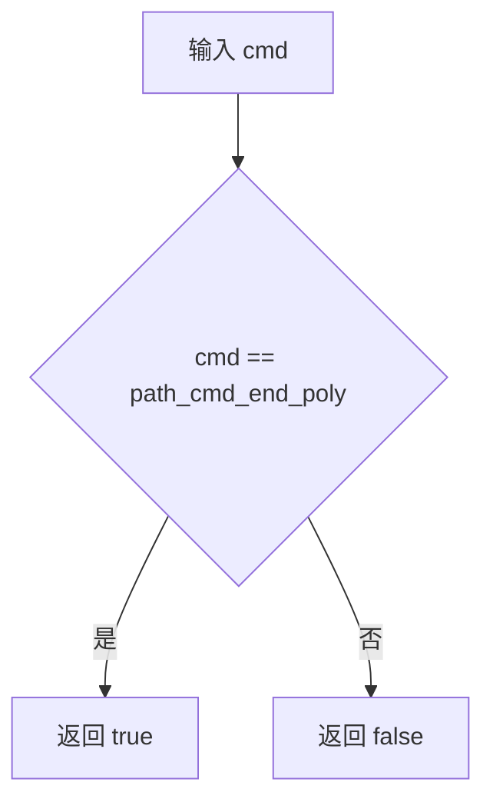
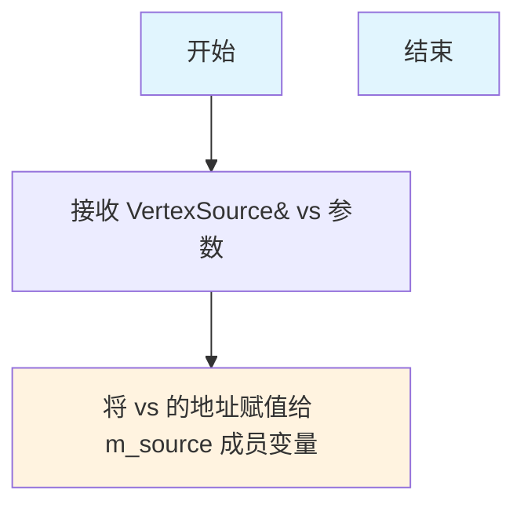
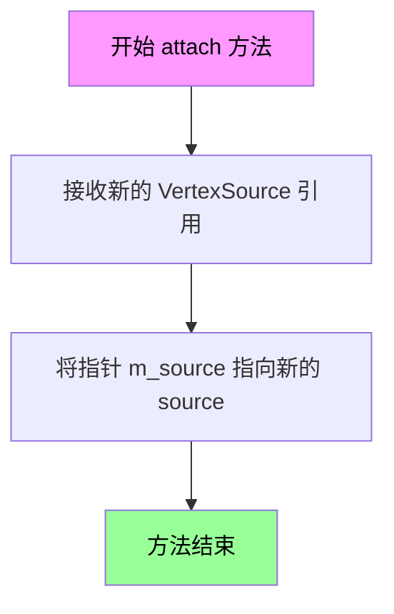
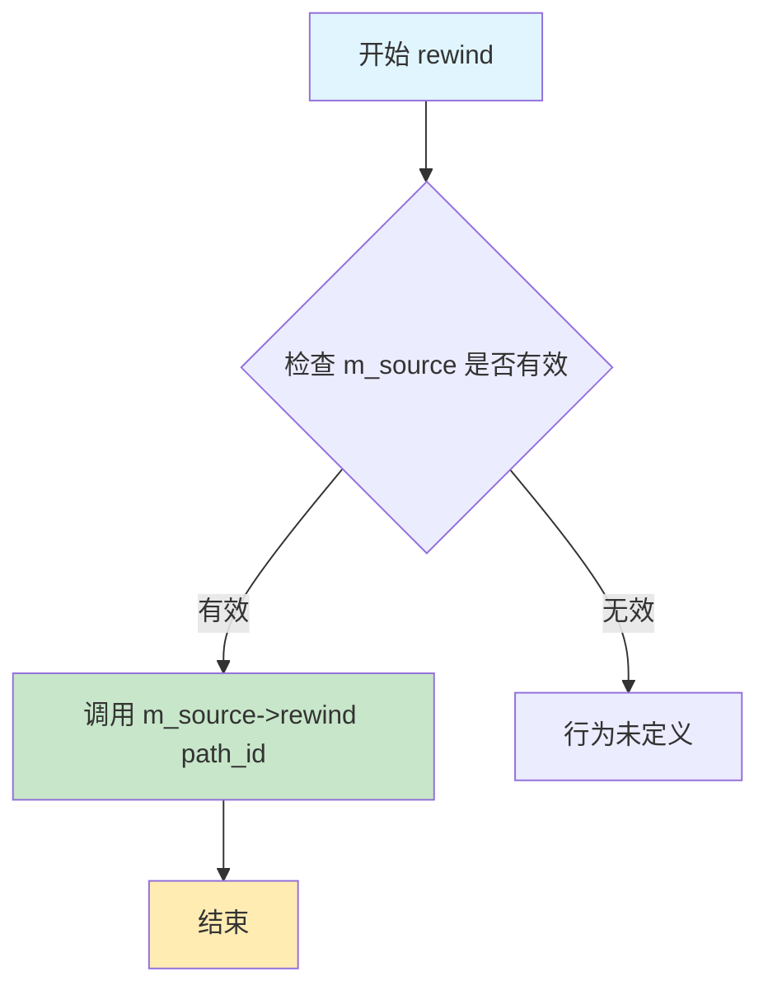
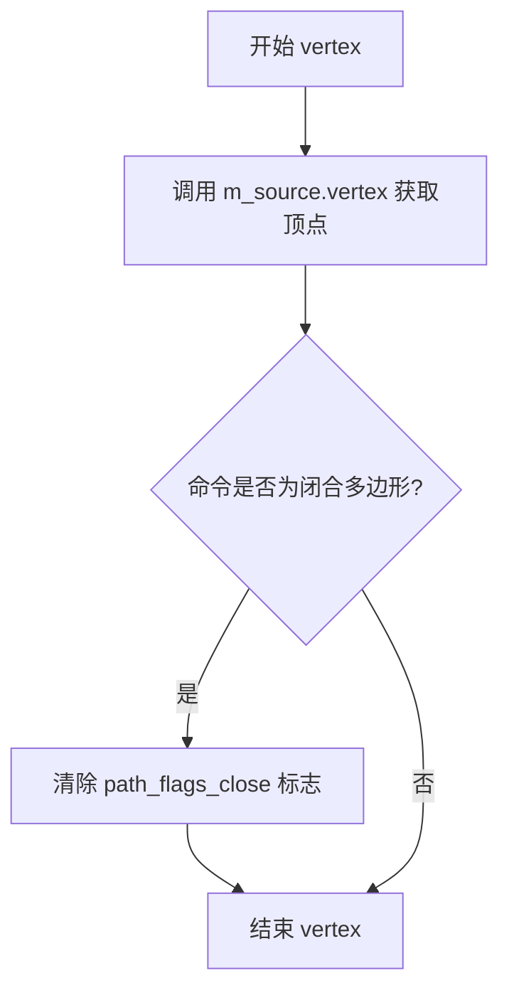

# `matplotlib\extern\agg24-svn\include\agg_conv_unclose_polygon.h` 详细设计文档

该代码定义了一个模板类conv_unclose_polygon，用于将多边形的闭合路径转换为非闭合路径，通过移除path_flags_close标志来实现

## 整体流程

```mermaid
graph TD
    A[开始] --> B[调用rewind(path_id)]
    B --> C[将调用转发给m_source->rewind]
    C --> D[调用vertex(x, y)获取顶点]
    D --> E{命令是end_poly?}
    E -- 是 --> F[移除path_flags_close标志]
    E -- 否 --> G[返回原始命令]
    F --> H[返回修改后的命令]
    G --> H
```

## 类结构

```
VertexSource (概念接口/抽象基类)
└── conv_unclose_polygon (模板转换器类)
```

## 全局变量及字段


### `conv_unclose_polygon.m_source`
    
指向顶点源的指针

类型：`VertexSource*`
    
    

## 全局函数及方法


### `is_end_poly`

该函数用于判断给定的路径命令值是否表示结束多边形的命令（end_poly），通常用于图形处理中识别多边形绘制完成的状态。

参数：

- `cmd`：`unsigned`，表示路径命令值，来自顶点源的当前命令

返回值：`bool`，如果命令是结束多边形命令则返回 true，否则返回 false

#### 流程图



#### 带注释源码

```
// is_end_poly 函数定义在 agg_basics.h 中，用于检查命令是否为结束多边形
// 此处为基于使用推断的典型实现，实际源码可能略有不同
inline bool is_end_poly(unsigned cmd)
{
    // path_cmd_end_poly 是 AGG 中定义的结束多边形命令常量
    return cmd == path_cmd_end_poly;
}
```

**注意**：由于提供的代码中未直接包含 `is_end_poly` 的定义，其实现推测自 `conv_unclose_polygon` 类中对它的使用，以及 AGG 库的标准模式。实际源码需参考 `agg_basics.h` 文件。


### `conv_unclose_polygon.conv_unclose_polygon(VertexSource& vs)`

构造函数，初始化顶点源引用，将传入的 VertexSource 对象指针存储到成员变量中，以便后续处理多边形顶点时移除闭合标志。

参数：

- `vs`：`VertexSource&`，顶点源引用，用于初始化适配器的底层顶点源

返回值：无返回值（构造函数）

#### 流程图



#### 带注释源码

```cpp
//----------------------------------------------------------------------------
// Anti-Grain Geometry - Version 2.4
// 模板类：conv_unclose_polygon（不闭合多边形转换器）
// 用于将封闭多边形的闭合标志移除，使其变为开放路径
//----------------------------------------------------------------------------

// 模板类声明，VertexSource 是模板参数
template<class VertexSource> class conv_unclose_polygon
{
public:
    // 构造函数，使用初始化列表将传入的顶点源引用存储到成员变量中
    explicit conv_unclose_polygon(VertexSource& vs) : m_source(&vs) {}
    
    // 附加方法，允许在对象构造后更换顶点源
    void attach(VertexSource& source) { m_source = &source; }

    // 重绕方法，将调用传递给底层顶点源
    void rewind(unsigned path_id)
    {
        m_source->rewind(path_id);
    }

    // 顶点获取方法，从底层顶点源获取顶点
    // 如果检测到闭合多边形命令，则移除闭合标志
    unsigned vertex(double* x, double* y)
    {
        unsigned cmd = m_source->vertex(x, y);
        // 如果是结束多边形命令，去除闭合标志
        if(is_end_poly(cmd)) cmd &= ~path_flags_close;
        return cmd;
    }

private:
    // 私有拷贝构造函数，防止对象被拷贝
    conv_unclose_polygon(const conv_unclose_polygon<VertexSource>&);
    
    // 私有赋值运算符，防止对象被赋值
    const conv_unclose_polygon<VertexSource>& 
        operator = (const conv_unclose_polygon<VertexSource>&);

    // 指向底层顶点源的指针
    VertexSource* m_source;
};
```


### `conv_unclose_polygon.attach(VertexSource& source)`

该方法用于重新附加一个新的顶点源（VertexSource）到conv_unclose_polygon转换器，允许在运行时动态更换被处理的顶点数据源，从而实现多边形闭合状态的转换处理。

参数：

- `source`：`VertexSource&`，新的顶点源引用，用于替换原有的顶点源对象

返回值：`void`，无返回值

#### 流程图



#### 带注释源码

```cpp
//----------------------------------------------------------------------------
// Anti-Grain Geometry - Version 2.4
// 类: conv_unclose_polygon
// 方法: attach
//----------------------------------------------------------------------------

namespace agg
{
    //====================================================conv_unclose_polygon
    template<class VertexSource> class conv_unclose_polygon
    {
    public:
        // 构造函数，接受一个顶点源引用
        explicit conv_unclose_polygon(VertexSource& vs) : m_source(&vs) {}
        
        //-----------------------------------------------------------------------------
        // 方法: attach
        // 功能: 重新附加一个新的顶点源
        // 参数: source - 新的顶点源引用
        // 返回: void
        //-----------------------------------------------------------------------------
        void attach(VertexSource& source) 
        { 
            // 将内部保存的顶点源指针指向新的source
            // 允许在对象创建后动态更换顶点数据来源
            m_source = &source; 
        }

        // 其他成员方法...
        
    private:
        // 禁止拷贝构造函数
        conv_unclose_polygon(const conv_unclose_polygon<VertexSource>&);
        
        // 禁止赋值运算符
        const conv_unclose_polygon<VertexSource>& 
            operator = (const conv_unclose_polygon<VertexSource>&);

        // 保存顶点源的指针
        VertexSource* m_source;
    };

}
```

#### 详细说明

| 项目 | 详情 |
|------|------|
| **所属类** | `conv_unclose_polygon<VertexSource>` |
| **方法类型** | 成员方法（非静态） |
| **访问权限** | public |
| **功能描述** | 重新设置内部保存的顶点源指针，使转换器可以处理新的顶点数据源 |
| **设计意图** | 提供动态更换顶点源的能力，无需创建新的conv_unclose_polygon对象 |
| **线程安全** | 非线程安全，多线程环境下需外部同步 |
| **异常安全性** | noexcept，不抛出异常 |


### conv_unclose_polygon.rewind

该方法用于重新初始化路径迭代器，将底层顶点源的路径迭代器重置到指定路径的起始位置。它是封装器模式的具体实现，通过委托底层 VertexSource 的 rewind 方法来实现路径重绕功能。

参数：

- `path_id`：`unsigned`，路径标识符，指定要重绕的路径编号

返回值：`void`，无返回值

#### 流程图



#### 带注释源码

```cpp
//----------------------------------------------------------------------------
// conv_unclose_polygon 类的 rewind 方法实现
// 功能：重新初始化路径迭代器，将底层顶点源的路径指针重置到起始位置
//----------------------------------------------------------------------------

// 方法名：rewind
// 参数：path_id - unsigned 类型，表示要重绕的路径标识符
// 返回值：void - 无返回值
void rewind(unsigned path_id)
{
    // 直接将调用委托给底层 VertexSource 对象
    // m_source 是指向底层顶点源的指针
    // path_id 参数被传递给底层源，用于指定要重绕的具体路径
    // 这是装饰器/封装器模式的典型应用，对底层功能进行包装
    m_source->rewind(path_id);
}
```


### conv_unclose_polygon.vertex

该方法是 `conv_unclose_polygon` 模板类的核心方法，用于从顶点源获取顶点并处理闭合标志。如果获取到的顶点命令是闭合多边形（`path_flags_close`），则清除该闭合标志，将闭合多边形转换为非闭合多边形。

参数：

- `x`：`double*`，指向存储 x 坐标的指针，用于输出顶点的 x 坐标
- `y`：`double*`，指向存储 y 坐标的指针，用于输出顶点的 y 坐标

返回值：`unsigned`，返回路径命令（path command），如 `path_cmd_move_to`、`path_cmd_line_to`、`path_cmd_end_poly` 等

#### 流程图



#### 带注释源码

```cpp
//----------------------------------------------------------------------------
// Anti-Grain Geometry - Version 2.4
// Copyright (C) 2002-2005 Maxim Shemanarev (http://www.antigrain.com)
//
// Permission to copy, use, modify, sell and distribute this software 
// is granted provided this copyright notice appears in all copies. 
// This software is provided "as is" without express or implied
// warranty, and with no claim as to its suitability for any purpose.
//----------------------------------------------------------------------------

#ifndef AGG_CONV_UNCLOSE_POLYGON_INCLUDED
#define AGG_CONV_UNCLOSE_POLYGON_INCLUDED

#include "agg_basics.h"

namespace agg
{
    //====================================================conv_unclose_polygon
    // conv_unclose_polygon 是一个模板类，用作顶点源适配器
    // 它将闭合的多边形顶点流转换为非闭合的多边形顶点流
    template<class VertexSource> class conv_unclose_polygon
    {
    public:
        // 构造函数，接受一个 VertexSource 引用
        explicit conv_unclose_polygon(VertexSource& vs) : m_source(&vs) {}
        
        // 附加新的顶点源
        void attach(VertexSource& source) { m_source = &source; }

        // 重置到指定路径的起始位置
        void rewind(unsigned path_id)
        {
            m_source->rewind(path_id);
        }

        // 获取顶点并处理闭合标志
        // 参数:
        //   x - 指向存储 x 坐标的 double 指针
        //   y - 指向存储 y 坐标的 double 指针
        // 返回值:
        //   unsigned 类型的路径命令
        unsigned vertex(double* x, double* y)
        {
            // 第一步：从底层顶点源获取顶点命令和坐标
            unsigned cmd = m_source->vertex(x, y);
            
            // 第二步：检查命令是否为闭合多边形
            // 如果是闭合多边形命令，则清除闭合标志
            // is_end_poly() 判断是否为结束多边形命令
            // path_flags_close 是闭合标志
            if(is_end_poly(cmd)) 
                cmd &= ~path_flags_close;  // 清除闭合标志，将闭合多边形转为非闭合
            
            // 第三步：返回处理后的命令
            return cmd;
        }

    private:
        // 私有拷贝构造函数，防止复制
        conv_unclose_polygon(const conv_unclose_polygon<VertexSource>&);
        
        // 私有赋值运算符，防止赋值
        const conv_unclose_polygon<VertexSource>& 
            operator = (const conv_unclose_polygon<VertexSource>&);

        // 底层顶点源的指针
        VertexSource* m_source;
    };

}

#endif
```

## 关键组件


### conv_unclose_polygon 模板类

核心转换器类，用于移除多边形的闭合标志，将已闭合的多边形转换为未闭合的多边形（开放路径）。

### VertexSource 模板参数

顶点源接口类型，表示任何提供顶点数据的对象，模板类通过此参数实现对不同顶点源的适配。

### m_source 成员变量

指向顶点源的指针，用于存储和访问输入的顶点数据，负责调用底层顶点源的遍历方法。

### attach 方法

用于重新附加顶点源，允许在运行时更换当前的顶点源对象。

### rewind 方法

路径重置方法，将内部顶点源重置到指定路径的起始位置，准备开始遍历顶点。

### vertex 方法

核心方法，获取下一个顶点并检查是否为闭合多边形标志，如果是闭合标志则移除path_flags_close标志位，返回处理后的命令。

### 潜在技术债务

该类缺少错误处理机制，未检查空指针情况；复制构造函数和赋值运算符被私有化但未实现，可能导致意外行为；缺少const版本的方法，无法用于const VertexSource。


## 问题及建议


### 已知问题

- **空指针风险**：`attach()` 方法和构造函数直接使用指针而未进行空指针检查，可能导致后续操作中的未定义行为
- **移动语义缺失**：拷贝构造函数和赋值运算符被声明为私有但未实现，且未使用 C++11 的 `= delete` 语法明确禁止拷贝，缺少移动构造函数和移动赋值运算符
- **接口不完整**：仅代理了 `rewind()` 和 `vertex()` 方法，但 VertexSource 可能还包含其他接口（如 `num_paths()`、`path_attributes()` 等），导致功能不匹配
- **无 detach 功能**：提供了 `attach()` 方法但没有对应的 `detach()` 方法，无法安全地解除关联关系
- **无 const 限定符**：类中没有提供 const 版本的接口，无法用于常量 VertexSource
- **设计冗余**：拷贝构造和赋值运算符手动声明为私有但未实现是过时的 C++98 风格

### 优化建议

- 在 `attach()` 方法和构造函数中添加 `if (m_source == nullptr)` 的空指针检查或断言
- 使用 `conv_unclose_polygon(const conv_unclose_polygon&) = delete;` 和 `conv_unclose_polygon& operator=(const conv_unclose_polygon&) = delete;` 替代手动私有声明
- 考虑添加移动语义支持：`conv_unclose_polygon(conv_unclose_polygon&&) noexcept;` 和 `conv_unclose_polygon& operator=(conv_unclose_polygon&&) noexcept;`
- 添加 `void detach() { m_source = nullptr; }` 方法以支持安全解绑
- 添加 const 版本的方法重载：`void rewind(unsigned path_id) const;` 和 `unsigned vertex(double* x, double* y) const;`
- 检查并代理 VertexSource 的其他接口方法以保持接口完整性


## 其它


### 一段话描述
conv_unclose_polygon是一个模板适配器类，位于AGG库中，用于将闭合的多边形路径转换为非闭合路径，通过在遍历顶点时移除path_flags_close标志来实现。

### 文件的整体运行流程
该文件定义在agg_conv_unclose_polygon.h中，属于AGG的路径处理模块。文件包含conv_unclose_polygon类模板，它包装一个VertexSource。在使用时，首先通过构造函数或attach方法绑定一个VertexSource实例，然后通过rewind方法初始化路径遍历，接着反复调用vertex方法获取顶点。在vertex方法中，如果检测到顶点命令是结束多边形（is_end_poly(cmd)为真），则使用按位与操作移除path_flags_close标志，从而将闭合多边形转换为开放路径。整个流程不涉及复杂状态管理，仅做简单的命令修改。

### 类的详细信息
- **类名**: conv_unclose_polygon
- **模板参数**: VertexSource（顶点源类型，需提供rewind和vertex接口）
- **类字段**:
  - m_source: VertexSource*，指向顶点源的指针，用于获取顶点数据。
- **类方法**:
  - conv_unclose_polygon(VertexSource& vs): 构造函数，接受顶点源引用并初始化m_source。
  - attach(VertexSource& source): 公共方法，将m_source重新指向新的顶点源。
  - rewind(unsigned path_id): 公共方法，内部调用m_source->rewind(path_id)重置顶点源。
  - vertex(double* x, double* y): 公共方法，从m_source获取顶点，如果命令是结束多边形，则移除闭合标志，并返回命令。
- **全局变量**: 无。
- **全局函数**: 无。

### 关键组件信息
- conv_unclose_polygon: 核心类，用于解除多边形闭合。
- VertexSource: 模板参数接口，定义顶点源的行为，需实现rewind和vertex方法。
- path_flags_close: AGG库中定义的路径标志，用于标识闭合多边形。

### 潜在的技术债务或优化空间
- 缺乏空指针检查：如果m_source为nullptr，调用其方法会导致未定义行为。
- 功能单一：仅处理闭合标志，无法直接处理其他路径标志。
- 可扩展性不足：未来可能需要支持其他路径转换，但当前设计难以扩展。

### 设计目标与约束
- **设计目标**: 提供一个轻量级的适配器，允许在运行时将闭合多边形转换为非闭合多边形，无需修改底层顶点源。
- **约束**: 模板参数VertexSource必须符合AGG的VertexSource接口（即提供rewind和vertex方法），否则编译将失败。

### 错误处理与异常设计
- 该类不抛出任何异常，假设输入的VertexSource始终有效。
- 如果VertexSource在调用过程中被销毁或变为无效（例如悬空指针），行为未定义。
- 建议在attach方法中接受引用而非指针，以减少空指针风险，但当前实现使用指针以支持attach更换顶点源。

### 数据流与状态机
- 该类不维护显式状态机，其行为是直接转发VertexSource的调用，并仅在vertex方法中修改命令。
- 数据流：用户调用rewind初始化，然后循环调用vertex获取顶点，每个顶点都可能因修改命令而改变路径类型。

### 外部依赖与接口契约
- **依赖**: agg_basics.h（提供基本类型和path_flags_close定义）和VertexSource接口。
- **接口契约**: VertexSource必须实现以下方法：
  - void rewind(unsigned path_id): 重置路径遍历。
  - unsigned vertex(double* x, double* y): 返回下一个顶点命令和坐标。
- 该类不直接依赖其他AGG组件，但通常与路径生成器一起使用。

### 性能考虑
- 该类性能开销极低，仅在vertex调用时增加一个条件判断和位操作，适合高性能图形渲染场景。
- 由于直接转发调用，避免了不必要的数据复制。

    