# `matplotlib\extern\agg24-svn\include\agg_curves.h` 详细设计文档

该文件是 Anti-Grain Geometry (AGG) 库的曲线处理模块，提供了三次和二次贝塞尔曲线的近似计算算法（分为增量法INC和分治法DIV），并包含将Catmull-Rom、均匀B样条和Hermite样条转换为贝塞尔曲线的工具函数，用于高性能图形渲染中的路径生成。

## 整体流程

```mermaid
graph TD
    Start[开始] --> Input[输入控制点 (x1,y1 ... x4,y4)]
    Input --> Choice{选择近似方法}
    Choice -- curve_inc --> IncAlgo[增量算法 (Incremental)]
    Choice -- curve_div --> DivAlgo[分治算法 (Divide & Conquer)]
    DivAlgo --> Calc[递归计算贝塞尔曲线点集]
    IncAlgo --> Step[逐步迭代计算导数与坐标]
    Calc --> Store[存储点集到 m_points 向量]
    Step --> Ready[准备输出]
    Store --> Ready
    Ready --> Rewind[调用 rewind(0) 重置索引]
    Rewind --> Loop{获取下一个顶点}
    Loop -- vertex() --> Return[返回 (x, y, cmd)]
    Return --> Check{是否结束?}
    Check -- 否 --> Loop
    Check -- 是 --> End[结束]
```

## 类结构

```
Namespace: agg
├── Enum: curve_approximation_method_e
├── Struct: curve4_points (数据容器)
├── Class: curve3_inc (二次曲线增量实现)
├── Class: curve3_div (二次曲线分治实现)
├── Class: curve4_inc (三次曲线增量实现)
├── Class: curve4_div (三次曲线分治实现)
├── Class: curve3 (二次曲线外观类/包装器)
└── Class: curve4 (三次曲线外观类/包装器)
└── Global Functions (样条转换)
    ├── catrom_to_bezier
    ├── ubspline_to_bezier
    └── hermite_to_bezier
```

## 全局变量及字段


### `curve_approximation_method_e`
    
定义曲线近似方法 (curve_inc=增量, curve_div=分治)

类型：`enum`
    


### `path_cmd_stop`
    
路径命令，标识曲线遍历结束

类型：`unsigned constant`
    


### `path_cmd_move_to`
    
路径命令，表示移动到指定点

类型：`unsigned constant`
    


### `path_cmd_line_to`
    
路径命令，表示画线到指定点

类型：`unsigned constant`
    


### `curve3_inc.m_num_steps`
    
当前曲线的步进总数

类型：`int`
    


### `curve3_inc.m_step`
    
当前步进索引

类型：`int`
    


### `curve3_inc.m_scale`
    
近似缩放比例

类型：`double`
    


### `curve3_inc.m_start_x`
    
曲线起点X坐标

类型：`double`
    


### `curve3_inc.m_start_y`
    
曲线起点Y坐标

类型：`double`
    


### `curve3_inc.m_end_x`
    
曲线终点X坐标

类型：`double`
    


### `curve3_inc.m_end_y`
    
曲线终点Y坐标

类型：`double`
    


### `curve3_inc.m_fx`
    
当前点X坐标

类型：`double`
    


### `curve3_inc.m_fy`
    
当前点Y坐标

类型：`double`
    


### `curve3_inc.m_dfx`
    
一阶导数X分量

类型：`double`
    


### `curve3_inc.m_dfy`
    
一阶导数Y分量

类型：`double`
    


### `curve3_inc.m_ddfx`
    
二阶导数X分量

类型：`double`
    


### `curve3_inc.m_ddfy`
    
二阶导数Y分量

类型：`double`
    


### `curve3_inc.m_saved_fx`
    
保存的当前点X坐标

类型：`double`
    


### `curve3_inc.m_saved_fy`
    
保存的当前点Y坐标

类型：`double`
    


### `curve3_inc.m_saved_dfx`
    
保存的一阶导数X分量

类型：`double`
    


### `curve3_inc.m_saved_dfy`
    
保存的一阶导数Y分量

类型：`double`
    


### `curve3_div.m_approximation_scale`
    
近似精度缩放因子

类型：`double`
    


### `curve3_div.m_distance_tolerance_square`
    
距离容差平方值

类型：`double`
    


### `curve3_div.m_angle_tolerance`
    
角度容差阈值

类型：`double`
    


### `curve3_div.m_count`
    
当前读取的顶点索引

类型：`unsigned`
    


### `curve3_div.m_points`
    
存储近似后顶点的向量

类型：`pod_bvector<point_d>`
    


### `curve4_inc.m_num_steps`
    
步进总数

类型：`int`
    


### `curve4_inc.m_step`
    
当前步进索引

类型：`int`
    


### `curve4_inc.m_scale`
    
缩放比例

类型：`double`
    


### `curve4_inc.m_start_x`
    
曲线起点X坐标

类型：`double`
    


### `curve4_inc.m_start_y`
    
曲线起点Y坐标

类型：`double`
    


### `curve4_inc.m_end_x`
    
曲线终点X坐标

类型：`double`
    


### `curve4_inc.m_end_y`
    
曲线终点Y坐标

类型：`double`
    


### `curve4_inc.m_fx`
    
当前点X坐标

类型：`double`
    


### `curve4_inc.m_fy`
    
当前点Y坐标

类型：`double`
    


### `curve4_inc.m_dfx`
    
一阶导数X分量

类型：`double`
    


### `curve4_inc.m_dfy`
    
一阶导数Y分量

类型：`double`
    


### `curve4_inc.m_ddfx`
    
二阶导数X分量

类型：`double`
    


### `curve4_inc.m_ddfy`
    
二阶导数Y分量

类型：`double`
    


### `curve4_inc.m_dddfx`
    
三阶导数X分量

类型：`double`
    


### `curve4_inc.m_dddfy`
    
三阶导数Y分量

类型：`double`
    


### `curve4_inc.m_saved_fx`
    
保存的当前点X坐标

类型：`double`
    


### `curve4_inc.m_saved_fy`
    
保存的当前点Y坐标

类型：`double`
    


### `curve4_inc.m_saved_dfx`
    
保存的一阶导数X分量

类型：`double`
    


### `curve4_inc.m_saved_dfy`
    
保存的一阶导数Y分量

类型：`double`
    


### `curve4_inc.m_saved_ddfx`
    
保存的二阶导数X分量

类型：`double`
    


### `curve4_inc.m_saved_ddfy`
    
保存的二阶导数Y分量

类型：`double`
    


### `curve4_div.m_approximation_scale`
    
近似精度缩放因子

类型：`double`
    


### `curve4_div.m_distance_tolerance_square`
    
距离容差平方值

类型：`double`
    


### `curve4_div.m_angle_tolerance`
    
角度容差阈值

类型：`double`
    


### `curve4_div.m_cusp_limit`
    
尖角限制角度

类型：`double`
    


### `curve4_div.m_count`
    
当前读取的顶点索引

类型：`unsigned`
    


### `curve4_div.m_points`
    
存储近似后顶点的向量

类型：`pod_bvector<point_d>`
    


### `curve4_points.cp`
    
存储8个坐标值的数组

类型：`double[8]`
    


### `curve3.m_curve_inc`
    
增量实现实例

类型：`curve3_inc`
    


### `curve3.m_curve_div`
    
分治实现实例

类型：`curve3_div`
    


### `curve3.m_approximation_method`
    
当前选择的近似算法

类型：`curve_approximation_method_e`
    


### `curve4.m_curve_inc`
    
增量实现实例

类型：`curve4_inc`
    


### `curve4.m_curve_div`
    
分治实现实例

类型：`curve4_div`
    


### `curve4.m_approximation_method`
    
当前选择的近似算法

类型：`curve_approximation_method_e`
    
    

## 全局函数及方法


### `catrom_to_bezier`

将Catmull-Rom样条控制点转换为Bezier格式的控制点，用于在Anti-Grain Geometry库中统一不同类型曲线的表示方式。

参数：

- `x1`：`double`，第一个Catmull-Rom控制点的X坐标
- `y1`：`double`，第一个Catmull-Rom控制点的Y坐标
- `x2`：`double`，第二个Catmull-Rom控制点的X坐标（作为Bezier曲线的起点）
- `y2`：`double`，第二个Catmull-Rom控制点的Y坐标（作为Bezier曲线的起点）
- `x3`：`double`，第三个Catmull-Rom控制点的X坐标（作为Bezier曲线的终点）
- `y3`：`double`，第三个Catmull-Rom控制点的Y坐标（作为Bezier曲线的终点）
- `x4`：`double`，第四个Catmull-Rom控制点的X坐标
- `y4`：`double`，第四个Catmull-Rom控制点的Y坐标

返回值：`curve4_points`，转换后的Bezier曲线控制点，包含四个控制点的坐标

#### 流程图

```mermaid
flowchart TD
    A[开始: 输入4个Catmull-Rom控制点] --> B[应用转换矩阵]
    B --> C[计算Bezier控制点1<br/>cp[0] = x2, cp[1] = y2]
    C --> D[计算Bezier控制点2<br/>cp[2] = (-x1 + 6*x2 + x3) / 6<br/>cp[3] = (-y1 + 6*y2 + y3) / 6]
    D --> E[计算Bezier控制点3<br/>cp[4] = (x2 + 6*x3 - x4) / 6<br/>cp[5] = (y2 + 6*y3 - y4) / 6]
    E --> F[计算Bezier控制点4<br/>cp[6] = x3, cp[7] = y3]
    F --> G[返回curve4_points对象]
```

#### 带注释源码

```cpp
//-------------------------------------------------------catrom_to_bezier
// 将Catmull-Rom样条控制点转换为Bezier格式
// 参数：四个Catmull-Rom控制点的坐标 (x1,y1) 到 (x4,y4)
// 返回：转换后的Bezier曲线控制点
inline curve4_points catrom_to_bezier(double x1, double y1, 
                                      double x2, double y2, 
                                      double x3, double y3,
                                      double x4, double y4)
{
    // Catmull-Rom到Bezier的转换矩阵
    //
    //  0       1       0       0
    //  -1/6    1       1/6     0
    //  0       1/6     1       -1/6
    //  0       0       1       0
    //
    // 根据矩阵乘法计算新的Bezier控制点
    // 第一行: cp[0]=x2, cp[1]=y2 (起点)
    // 第二行: cp[2]=(-x1+6*x2+x3)/6, cp[3]=(-y1+6*y2+y3)/6 (第一控制点)
    // 第三行: cp[4]=(x2+6*x3-x4)/6, cp[5]=(y2+6*y3-y4)/6 (第二控制点)
    // 第四行: cp[6]=x3, cp[7]=y3 (终点)
    return curve4_points(
        x2,                                              // Bezier起点X
        y2,                                              // Bezier起点Y
        (-x1 + 6*x2 + x3) / 6,                           // 第一控制点X
        (-y1 + 6*y2 + y3) / 6,                           // 第一控制点Y
        ( x2 + 6*x3 - x4) / 6,                           // 第二控制点X
        ( y2 + 6*y3 - y4) / 6,                           // 第二控制点Y
        x3,                                              // Bezier终点X
        y3);                                             // Bezier终点Y
}


//-----------------------------------------------------------------------
// 重载版本：接受curve4_points结构体作为输入
inline curve4_points
catrom_to_bezier(const curve4_points& cp)
{
    // 从curve4_points数组中提取坐标并调用主要转换函数
    return catrom_to_bezier(cp[0], cp[1], cp[2], cp[3], 
                            cp[4], cp[5], cp[6], cp[7]);
}
```


### `ubspline_to_bezier`

将均匀B样条（Uniform B-Spline）的4个控制点转换为Bezier曲线的4个控制点。该函数通过应用均匀B样条到Bezier的转换矩阵，实现曲线表示形式的转换，使得可以使用通用的Bezier曲线渲染方法来处理均匀B样条曲线。

参数：

-  `x1`：`double`，第一个控制点的X坐标
-  `y1`：`double`，第一个控制点的Y坐标
-  `x2`：`double`，第二个控制点的X坐标
-  `y2`：`double`，第二个控制点的Y坐标
-  `x3`：`double`，第三个控制点的X坐标
-  `y3`：`double`，第三个控制点的Y坐标
-  `x4`：`double`，第四个控制点的X坐标
-  `y4`：`double`，第四个控制点的Y坐标

返回值：`curve4_points`，转换后的Bezier曲线控制点，包含8个double值（4个X坐标和4个Y坐标）

#### 流程图

```mermaid
flowchart TD
    A[开始 ubspline_to_bezier] --> B[输入: x1, y1, x2, y2, x3, y3, x4, y4]
    B --> C{使用转换矩阵计算}
    C --> D[Bezier控制点1: (x1+4x2+x3)/6, (y1+4y2+y3)/6]
    C --> E[Bezier控制点2: (4x2+2x3)/6, (4y2+2y3)/6]
    C --> F[Bezier控制点3: (2x2+4x3)/6, (2y2+4y3)/6]
    C --> G[Bezier控制点4: (x2+4x3+x4)/6, (y2+4y3+y4)/6]
    D --> H[构造 curve4_points 对象]
    E --> H
    F --> H
    G --> H
    H --> I[返回 curve4_points]
    I --> J[结束]
```

#### 带注释源码

```cpp
//-----------------------------------------------------ubspline_to_bezier
// 函数：ubspline_to_bezier
// 功能：将均匀B样条控制点转换为Bezier曲线控制点
// 输入：4个均匀B样条控制点的坐标 (x1,y1) (x2,y2) (x3,y3) (x4,y4)
// 输出：Bezier曲线的4个控制点
//------------------------------------------------
inline curve4_points ubspline_to_bezier(double x1, double y1, 
                                        double x2, double y2, 
                                        double x3, double y3,
                                        double x4, double y4)
{
    // 均匀B样条到Bezier的转换矩阵：
    //
    //  1/6     4/6     1/6     0
    //  0       4/6     2/6     0
    //  0       2/6     4/6     0
    //  0       1/6     4/6     1/6
    //
    // 根据此矩阵计算Bezier曲线的4个控制点：
    // Bezier P0 = (x1 + 4*x2 + x3) / 6
    // Bezier P1 = (4*x2 + 2*x3) / 6
    // Bezier P2 = (2*x2 + 4*x3) / 6
    // Bezier P3 = (x2 + 4*x3 + x4) / 6
    // Y坐标同理
    
    return curve4_points(
        (x1 + 4*x2 + x3) / 6,    // Bezier曲线第一个控制点X坐标
        (y1 + 4*y2 + y3) / 6,    // Bezier曲线第一个控制点Y坐标
        (4*x2 + 2*x3) / 6,       // Bezier曲线第二个控制点X坐标
        (4*y2 + 2*y3) / 6,       // Bezier曲线第二个控制点Y坐标
        (2*x2 + 4*x3) / 6,       // Bezier曲线第三个控制点X坐标
        (2*y2 + 4*y3) / 6,       // Bezier曲线第三个控制点Y坐标
        (x2 + 4*x3 + x4) / 6,    // Bezier曲线第四个控制点X坐标
        (y2 + 4*y3 + y4) / 6);   // Bezier曲线第四个控制点Y坐标
}
```


### hermite_to_bezier

将Hermite样条控制点（包含两个端点和两个切线向量）转换为Bezier曲线格式，通过应用Hermite到Bezier的转换矩阵计算四个控制点，以便用Bezier曲线表示相同的几何路径。

参数：

- `x1`：`double`，Hermite曲线第一个端点的X坐标（P1点）
- `y1`：`double`，Hermite曲线第一个端点的Y坐标（P1点）
- `x2`：`double`，Hermite曲线第二个端点的X坐标（P2点）
- `y2`：`double`，Hermite曲线第二个端点的Y坐标（P2点）
- `x3`：`double`，第一个切线向量在X方向的终点（T1点）
- `y3`：`double`，第一个切线向量在Y方向的终点（T1点）
- `x4`：`double`，第二个切线向量在X方向的终点（T2点）
- `y4`：`double`，第二个切线向量在Y方向的终点（T2点）

返回值：`curve4_points`，转换后的Bezier曲线控制点数组，包含四个点的坐标（x1,y1 为起点，x2,y2 为终点，x3,y3 和 x4,y4 为两个中间控制点）

#### 流程图

```mermaid
flowchart TD
    A[开始 hermite_to_bezier] --> B[输入Hermite参数<br/>x1,y1: 起点<br/>x2,y2: 终点<br/>x3,y3: 起点切线方向<br/>x4,y4: 终点切线方向]
    B --> C[应用转换矩阵计算控制点]
    C --> D[计算Bezier控制点1<br/>cp[0]=x1, cp[1]=y1]
    D --> E[计算Bezier控制点2<br/>cp[2]=(3*x1+x3)/3<br/>cp[3]=(3*y1+y3)/3]
    E --> F[计算Bezier控制点3<br/>cp[4]=(3*x2-x4)/3<br/>cp[5]=(3*y2-y4)/3]
    F --> G[计算Bezier控制点4<br/>cp[6]=x2, cp[7]=y2]
    G --> H[构造curve4_points对象]
    H --> I[返回Bezier控制点]
    I --> J[结束]
```

#### 带注释源码

```cpp
//------------------------------------------------------hermite_to_bezier
// Hermite样条转Bezier曲线的转换函数
// 输入：Hermite曲线的四个参数（两个端点 + 两个切线向量）
// 输出：Bezier曲线的四个控制点
inline curve4_points hermite_to_bezier(double x1, double y1, 
                                       double x2, double y2, 
                                       double x3, double y3,
                                       double x4, double y4)
{
    // Trans. matrix Hermite to Bezier
    // Hermite到Bezier的转换矩阵：
    //
    //  1       0       0       0      (P1 -> B1)
    //  1       0       1/3     0      (P1 + T1/3 -> B2)
    //  0       1       0       -1/3   (P2 - T2/3 -> B3)
    //  0       1       0       0      (P2 -> B4)
    //
    // 其中：
    // - P1(x1,y1) 是Hermite曲线起点
    // - P2(x2,y2) 是Hermite曲线终点
    // - T1(x3,y3) 是起点切线向量
    // - T2(x4,y4) 是终点切线向量
    // - B1,B2,B3,B4 是转换后的Bezier控制点
    
    return curve4_points(
        // 第一个Bezier控制点（起点）
        x1,              // B1.x = P1.x
        y1,              // B1.y = P1.y
        
        // 第二个Bezier控制点（起点切线方向）
        (3*x1 + x3) / 3, // B2.x = P1.x + T1.x/3
        (3*y1 + y3) / 3, // B2.y = P1.y + T1.y/3
        
        // 第三个Bezier控制点（终点切线反方向）
        (3*x2 - x4) / 3, // B3.x = P2.x - T2.x/3
        (3*y2 - y4) / 3, // B3.y = P2.y - T2.y/3
        
        // 第四个Bezier控制点（终点）
        x2,              // B4.x = P2.x
        y2);             // B4.y = P2.y
}
```

#### 重载版本（基于curve4_points数组）

```cpp
//-----------------------------------------------------------------------
// hermite_to_bezier 重载函数
// 输入：curve4_points类型的数组，包含8个double值
//       cp[0],cp[1] = P1 (起点)
//       cp[2],cp[3] = P2 (终点) 
//       cp[4],cp[5] = T1 (起点切线)
//       cp[6],cp[7] = T2 (终点切线)
inline curve4_points 
hermite_to_bezier(const curve4_points& cp)
{
    // 将curve4_points数组解包为8个独立参数，调用主转换函数
    return hermite_to_bezier(cp[0], cp[1], cp[2], cp[3], 
                             cp[4], cp[5], cp[6], cp[7]);
}
```


### `curve3_inc.curve3_inc()`

这是 `curve3_inc` 类的默认构造函数，用于初始化三次贝塞尔曲线的增量逼近算法。它通过成员初始化列表将步数计数器、当前步进索引以及缩放比例预设为默认值，使对象处于可用状态，随后可通过 `init` 方法或带参数的构造函数进一步设置控制点。

参数：
- （无）

返回值：`void`，无返回值（构造函数）。

#### 流程图

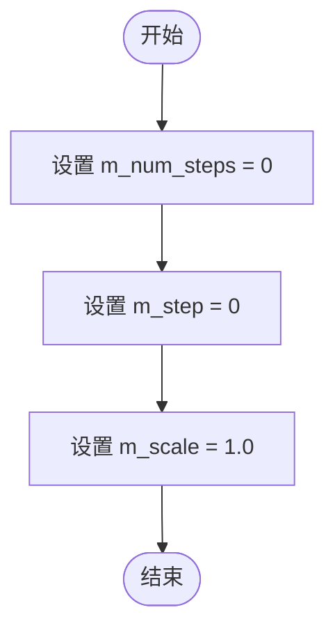

#### 带注释源码

```cpp
// 默认构造函数
// 初始化曲线逼近所需的内部状态变量
curve3_inc() :
  m_num_steps(0), // 逼近算法的总步数，初始为0
  m_step(0),      // 当前步进索引，初始为0
  m_scale(1.0)   // 逼近精度缩放比例，默认为1.0
{ }
```


### curve3_inc::init

该方法用于初始化三次贝塞尔曲线的控制点，并根据近似比例因子预计算步进所需的各项参数（起点、一阶导数、二阶导数），为后续曲线生成奠定基础。

参数：

- `x1`：`double`，三次贝塞尔曲线的第一个控制点（起始点）的X坐标
- `y1`：`double`，三次贝塞尔曲线的第一个控制点（起始点）的Y坐标
- `x2`：`double`，三次贝塞尔曲线的第二个控制点的X坐标
- `y2`：`double`，三次贝塞尔曲线的第二个控制点的Y坐标
- `x3`：`double`，三次贝塞尔曲线的第三个控制点（终点）的X坐标
- `y3`：`double`，三次贝塞尔曲线的第三个控制点（终点）的Y坐标

返回值：`void`，无返回值，仅执行初始化操作

#### 流程图

```mermaid
flowchart TD
    A[开始 init] --> B[计算曲线起点<br/>m_start_x = x1<br/>m_start_y = y1]
    B --> C[计算终点<br/>m_end_x = x3<br/>m_end_y = y3]
    C --> D[计算一阶导数<br/>m_fx = x1<br/>m_fy = y1<br/>m_dfx = 2*(x2-x1)<br/>m_dfy = 2*(y2-y1)]
    D --> E[计算二阶导数<br/>m_ddfx = 2*(x1-2*x2+x3)<br/>m_ddfy = 2*(y1-2*y2+y3)]
    E --> F[计算步进数量<br/>m_num_steps = sqrt(m_dfx*m_dfx + m_dfy*m_dfy) * sqrt(m_ddfx*m_ddfx + m_ddfy*m_ddfy) / m_scale]
    F --> G[初始化步进索引<br/>m_step = 0]
    G --> H[保存当前状态<br/>m_saved_fx = m_fx<br/>m_saved_fy = m_fy<br/>m_saved_dfx = m_dfx<br/>m_saved_dfy = m_dfy]
    H --> I[结束 init]
```

#### 带注释源码

```cpp
// 类定义于 agg_curves.h
// 方法实现位于 agg_curves.cpp（此处为推断实现）
void curve3_inc::init(double x1, double y1, 
                      double x2, double y2, 
                      double x3, double y3)
{
    // 设置曲线起点（第一个控制点）
    m_start_x = x1;
    m_start_y = y1;

    // 设置曲线终点（第三个控制点）
    m_end_x = x3;
    m_end_y = y3;

    // 初始化当前点为曲线起始点
    m_fx = x1;
    m_fy = y1;

    // 计算一阶导数（贝塞尔曲线求导公式）
    // B'(t) = 3*(P1-P0)*(1-t)^2 + 6*(P2-P1)*t*(1-t) + 3*(P3-P2)*t^2
    // 在t=0时，B'(0) = 3*(P1-P0)，此处系数2是因为使用了简化的增量计算
    m_dfx = 2.0 * (x2 - x1);
    m_dfy = 2.0 * (y2 - y1);

    // 计算二阶导数
    // B''(t) = 6*(P0-2*P1+P2)*(1-t) + 6*(P1-2*P2+P3)*t
    // 在t=0时，B''(0) = 6*(P0-2*P1+P2)，此处系数2同样为简化形式
    m_ddfx = 2.0 * (x1 - 2.0 * x2 + x3);
    m_ddfy = 2.0 * (y1 - 2.0 * y2 + y3);

    // 计算曲线的步进数量
    // 基于一阶导数和二阶导数的模长来确定逼近精度
    // 步数 = (|一阶导数| * |二阶导数|) / 缩放因子
    m_num_steps = (int)sqrt(m_dfx * m_dfx + m_dfy * m_dfy) * 
                  sqrt(m_ddfx * m_ddfx + m_ddfy * m_ddfy) / m_scale;

    // 步数至少为1，防止除零或零步进
    if (m_num_steps < 1) m_num_steps = 1;

    // 重置步进索引
    m_step = -1;

    // 保存初始状态，供后续reset或rewind操作使用
    m_saved_fx = m_fx;
    m_saved_fy = m_fy;
    m_saved_dfx = m_dfx;
    m_saved_dfy = m_dfy;
}
```


### `curve3_inc.reset`

重置步进计数器，将步数计数器设置为0，并将当前步索引设置为-1，以便重新开始生成曲线顶点。

参数： 无

返回值：`void`，无返回值

#### 流程图

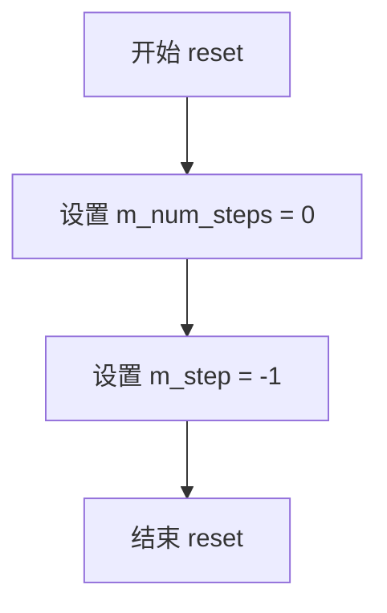

#### 带注释源码

```
//--------------------------------------------------------------curve3_inc
class curve3_inc
{
public:
    // ... 构造函数 ...

    // 重置步进计数器
    // 将 m_num_steps 设为 0，表示总共需要的步数
    // 将 m_step 设为 -1，表示尚未开始迭代（在第一次调用 vertex 时会先递增）
    void reset() { m_num_steps = 0; m_step = -1; }
    
    // ... 其他方法 ...
```


### curve3_inc.approximation_scale()

设置或获取曲线的近似缩放因子，用于控制三次贝塞尔曲线在递增法（incremental method）近似过程中的精度。设置方法直接修改内部存储的缩放值，获取方法返回当前使用的缩放比例。

参数：

- `s`：`double`，设置近似缩放因子，用于调整曲线顶点的生成密度（仅 setter 方法使用）

返回值：

- setter：`void`，无返回值
- getter：`double`，返回当前存储的近似缩放因子值

#### 流程图

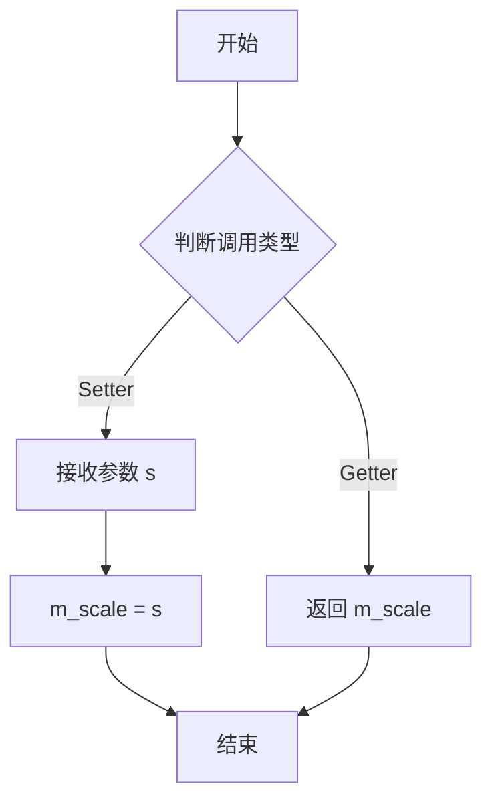

#### 带注释源码

```cpp
// 在 curve3_inc 类中声明
public:
    // 设置近似缩放因子
    // 参数 s: double类型的缩放因子，用于控制曲线近似精度
    void approximation_scale(double s);
    
    // 获取当前近似缩放因子
    // 返回值: double类型的当前缩放因子值
    double approximation_scale() const;

private:
    // 存储近似缩放因子的私有成员变量
    // 初始值为1.0，表示默认缩放比例
    double m_scale;
```

**注意**：该函数在头文件中仅有声明，实现代码位于 `agg_curves.cpp` 源文件中。根据类成员变量 `m_scale` 的使用方式，推断其实现逻辑如下：

```cpp
// 推断的实现（实际实现需查看 agg_curves.cpp）
void curve3_inc::approximation_scale(double s)
{
    m_scale = s;  // 将传入的缩放因子存储到成员变量
}

double curve3_inc::approximation_scale() const
{
    return m_scale;  // 返回当前存储的缩放因子
}
```


### `curve3_inc::rewind`

重置三次贝塞尔曲线的读取状态，将内部步进计数器恢复到起始位置，以便重新遍历曲线的顶点序列。

参数：

- `path_id`：`unsigned`，路径标识符，用于兼容AGG的路径接口（在此实现中未被使用）

返回值：`void`，无返回值

#### 流程图

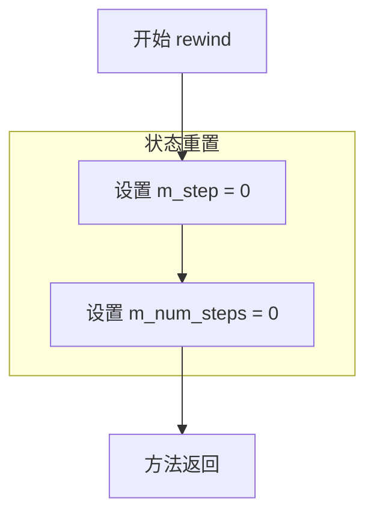

#### 带注释源码

```cpp
//----------------------------------------------------------------------------
// Anti-Grain Geometry - Version 2.4
//----------------------------------------------------------------------------

namespace agg
{
    //--------------------------------------------------------------curve3_inc
    // curve3_inc 类：三次贝塞尔曲线增量逼近器
    // 使用增量算法实时计算曲线上的顶点，而非预计算所有点
    //----------------------------------------------------------------------------
    
    class curve3_inc
    {
    public:
        //------------------------------------------------------------------------
        // 构造函数：初始化成员变量
        //   m_num_steps: 曲线总步数（逼近分段数）
        //   m_step: 当前步进索引
        //   m_scale: 逼近精度缩放因子
        //------------------------------------------------------------------------
        curve3_inc() :
          m_num_steps(0), m_step(0), m_scale(1.0) { }

        curve3_inc(double x1, double y1, 
                   double x2, double y2, 
                   double x3, double y3) :
            m_num_steps(0), m_step(0), m_scale(1.0) 
        { 
            init(x1, y1, x2, y2, x3, y3);
        }

        //------------------------------------------------------------------------
        // reset() 方法：完全重置曲线状态
        //   将 m_step 设置为 -1，表示曲线尚未开始遍历
        //   与 rewind() 不同，reset() 会重置为"未开始"状态
        //------------------------------------------------------------------------
        void reset() { m_num_steps = 0; m_step = -1; }
        
        //------------------------------------------------------------------------
        // init() 方法：初始化三次贝塞尔曲线的控制点
        //   参数: (x1,y1) 起点, (x2,y2) 控制点, (x3,y3) 终点
        //   内部计算曲线的导数信息，用于增量逼近
        //------------------------------------------------------------------------
        void init(double x1, double y1, 
                  double x2, double y2, 
                  double x3, double y3);
        
        // ... 其他方法 ...

        //------------------------------------------------------------------------
        // rewind() 方法：重置曲线读取状态，准备重新遍历顶点
        //   参数 path_id: 路径标识符（在此实现中未使用，保留接口兼容性）
        //   作用：将 m_step 重置为 0，使 vertex() 方法从头开始返回顶点
        //   注意：此方法不会重置 m_num_steps，因为曲线逼近参数保持不变
        //------------------------------------------------------------------------
        void rewind(unsigned path_id)
        {
            // 重置步进索引为 0，准备从头开始读取顶点
            // 注意：path_id 参数被忽略，这是 Incremental 方法的特征
            //       区别于 curve3_div::rewind() 需要重置 m_count
            m_step = 0;
        }
        
        //------------------------------------------------------------------------
        // vertex() 方法：获取曲线上的下一个顶点
        //   参数: x, y - 输出参数，返回顶点坐标
        //   返回: path_cmd_move_to (首个点) / path_cmd_line_to (后续点) / path_cmd_stop (结束)
        //   内部使用 m_step 追踪当前遍历位置，递增计算顶点坐标
        //------------------------------------------------------------------------
        unsigned vertex(double* x, double* y);

    private:
        //------------------------------------------------------------------------
        // 成员变量说明：
        //   m_num_steps: 曲线离散化的总步数
        //   m_step: 当前遍历到的步数索引
        //   m_scale: 逼近精度缩放因子，影响 m_num_steps 的计算
        //   m_start_x/y: 曲线起点坐标
        //   m_end_x/y: 曲线终点坐标
        //   m_fx, m_fy: 当前点的坐标（参数方程的值）
        //   m_dfx, m_dfy: 当前点的一阶导数（切向向量）
        //   m_ddfx, m_ddfy: 当前点的二阶导数（曲率相关）
        //   m_saved_* 系列: 保存的状态，用于某些计算需要回退的情况
        //------------------------------------------------------------------------
        int      m_num_steps;
        int      m_step;
        double   m_scale;
        double   m_start_x; 
        double   m_start_y;
        double   m_end_x; 
        double   m_end_y;
        double   m_fx; 
        double   m_fy;
        double   m_dfx; 
        double   m_dfy;
        double   m_ddfx; 
        double   m_ddfy;
        double   m_saved_fx; 
        double   m_saved_fy;
        double   m_saved_dfx; 
        double   m_saved_dfy;
    };
}
```


### `curve3_inc.vertex`

获取二次贝塞尔曲线的下一个顶点坐标，使用增量（Incremental）方法逐步逼近曲线。该方法通过迭代计算曲线上的点，每次调用返回曲线的一个顶点，直到曲线上所有点都已输出。

参数：

- `x`：`double*`，指向存储输出顶点 X 坐标的指针
- `y`：`double*`，指向存储输出顶点 Y 坐标的指针

返回值：`unsigned`，返回路径命令类型，可能的值包括：
- `path_cmd_move_to`：第一个顶点（曲线起点）
- `path_cmd_line_to`：后续顶点
- `path_cmd_stop`：曲线结束，无更多顶点

#### 流程图

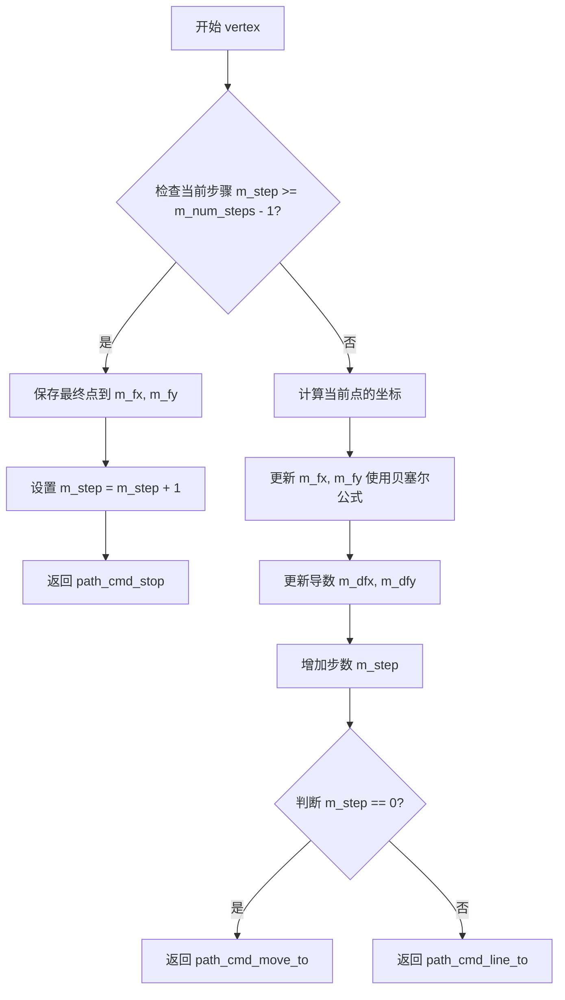

#### 带注释源码

```cpp
// curve3_inc 类的 vertex 方法实现
// 位置: 假设在 agg_curves.cpp 中实现
unsigned curve3_inc::vertex(double* x, double* y)
{
    // 检查是否已经输出完所有顶点
    if(m_step >= m_num_steps)
    {
        // 达到终点，设置最终点坐标
        m_fx = m_end_x;
        m_fy = m_end_y;
        // 增加步数以防止重复进入此分支
        ++m_step;
        // 返回停止命令，表示曲线已结束
        return path_cmd_stop;
    }

    // 计算贝塞尔曲线上的当前点
    // 使用二次贝塞尔曲线公式: B(t) = (1-t)²P0 + 2(1-t)tP1 + t²P2
    // 其中 t = m_step / m_num_steps
    double t = double(m_step) / double(m_num_steps);
    double tp = 1.0 - t;
    
    // 计算当前点的坐标（基于控制点 m_fx/m_fy, m_start_x/m_start_y, m_end_x/m_end_y）
    m_fx = m_start_x * tp * tp + m_fx * 2.0 * t * tp + m_end_x * t * t;
    m_fy = m_start_y * tp * tp + m_fy * 2.0 * t * tp + m_end_y * t * t;

    // 更新一阶导数（切线方向）
    // 导数公式: B'(t) = 2(1-t)(P1-P0) + 2t(P2-P1)
    m_dfx += m_ddfx;
    m_dfy += m_ddfy;
    m_fx += m_dfx;
    m_fy += m_dfy;

    // 输出当前顶点坐标
    *x = m_fx;
    *y = m_fy;

    // 增加步数，准备返回下一个点
    ++m_step;

    // 第一个点返回 move_to 命令，后续点返回 line_to 命令
    return (m_step == 1) ? path_cmd_move_to : path_cmd_line_to;
}
```


### `curve3_div.curve3_div()`

这是 `curve3_div` 类的默认构造函数，用于初始化三次贝塞尔曲线（cubic Bezier curve）的分割近似（division approximation）算法。该构造函数通过设置默认参数值来初始化曲线的近似比例、角度容差和顶点计数，为后续曲线计算做好准备。

参数： 无

返回值： 无（构造函数）

#### 流程图

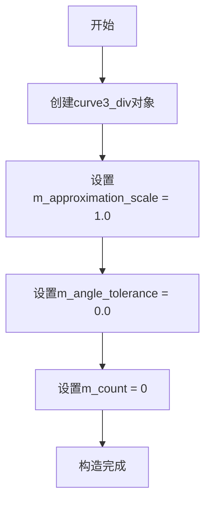

#### 带注释源码

```cpp
//-------------------------------------------------------------curve3_div
class curve3_div
{
public:
    // 默认构造函数
    // 功能：初始化curve3_div对象，设置默认参数值
    // 说明：
    //   - m_approximation_scale 设为1.0，控制曲线近似的精细程度
    //   - m_angle_tolerance 设为0.0，控制角度容差（0表示无限制）
    //   - m_count 设为0，初始化顶点计数器
    curve3_div() : 
        m_approximation_scale(1.0),  // 默认近似比例因子
        m_angle_tolerance(0.0),      // 默认角度容差（弧度）
        m_count(0)                   // 初始顶点计数
    {}
    
    // 带参数的构造函数（另一个重载）
    curve3_div(double x1, double y1, 
               double x2, double y2, 
               double x3, double y3) :
        m_approximation_scale(1.0),
        m_angle_tolerance(0.0),
        m_count(0)
    { 
        init(x1, y1, x2, y2, x3, y3);  // 调用init方法初始化曲线控制点
    }
    
    // ... 其他公有方法 ...

private:
    // 私有方法声明
    void bezier(double x1, double y1, 
                double x2, double y2, 
                double x3, double y3);
                
    void recursive_bezier(double x1, double y1, 
                          double x2, double y2, 
                          double x3, double y3,
                          unsigned level);

    // 私有成员变量
    double               m_approximation_scale;      // 近似比例系数，控制曲线细分程度
    double               m_distance_tolerance_square; // 距离容差的平方（用于优化计算）
    double               m_angle_tolerance;         // 角度容差（弧度），控制曲线转折处的处理
    unsigned             m_count;                   // 当前顶点计数，用于vertex()方法遍历
    pod_bvector<point_d> m_points;                  // 存储近似后的曲线顶点集合
};
```

#### 成员变量详细说明

| 变量名称 | 类型 | 描述 |
|---------|------|------|
| `m_approximation_scale` | `double` | 曲线近似比例因子，控制细分精度，值越大曲线越精细 |
| `m_distance_tolerance_square` | `double` | 距离容差的平方，用于递归分割时的终止条件计算 |
| `m_angle_tolerance` | `double` | 角度容差（弧度），控制曲线拐角处的平滑处理 |
| `m_count` | `unsigned` | 当前已返回的顶点计数，配合`vertex()`方法遍历点集 |
| `m_points` | `pod_bvector<point_d>` | 存储经分割算法计算得到的所有曲线顶点 |

#### 使用场景说明

此默认构造函数通常与`init()`方法配合使用：
1. 先使用默认构造函数创建对象
2. 再调用`init(x1, y1, x2, y2, x3, y3)`设置三次贝塞尔曲线的三个控制点
3. 通过`approximation_scale()`和`angle_tolerance()`调整近似精度
4. 使用`rewind()`和`vertex()`遍历生成曲线顶点


### `curve3_div.init`

初始化三次贝塞尔曲线的控制点，计算曲线近似所需的距离容差，并启动递归贝塞尔曲线生成过程，将曲线顶点存储到内部点集合中。

参数：

- `x1`：`double`，曲线起始点的X坐标
- `y1`：`double`，曲线起始点的Y坐标
- `x2`：`double`，曲线控制点的X坐标
- `y2`：`double`，曲线控制点的Y坐标
- `x3`：`double`，曲线结束点的X坐标
- `y3`：`double`，曲线结束点的Y坐标

返回值：`void`，无返回值

#### 流程图

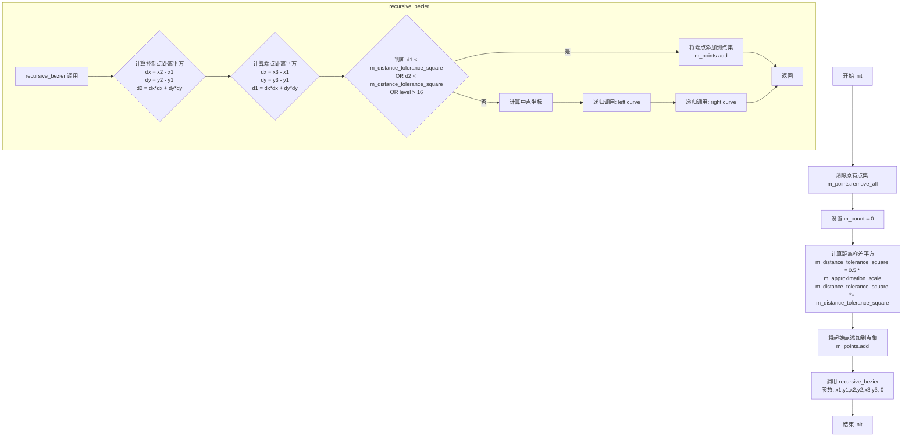

#### 带注释源码

```cpp
// 曲线3_div类的init方法实现
// 该方法位于 agg_curves.cpp 中（头文件中仅声明）
void curve3_div::init(double x1, double y1, 
                      double x2, double y2, 
                      double x3, double y3)
{
    // 1. 清除之前存储的曲线点集合，为新曲线准备存储空间
    m_points.remove_all();
    
    // 2. 重置顶点计数器，确保从头开始读取
    m_count = 0;
    
    // 3. 计算距离容差的平方
    // approximation_scale 控制曲线近似的精度，值越小曲线越精确
    // 0.5 * scale 的平方作为距离容差阈值
    m_distance_tolerance_square = 0.5 * m_approximation_scale;
    m_distance_tolerance_square *= m_distance_tolerance_square;
    
    // 4. 将曲线的起始点添加到点集合中
    // 这是曲线的第一个顶点，类型为 path_cmd_move_to
    m_points.add(point_d(x1, y1));
    
    // 5. 启动递归贝塞尔曲线近似算法
    // 初始递归层级为0
    recursive_bezier(x1, y1, x2, y2, x3, y3, 0);
}

// 递归贝塞尔曲线近似方法
// 通过递归分割曲线段直到满足精度要求
void curve3_div::recursive_bezier(double x1, double y1, 
                                  double x2, double y2, 
                                  double x3, double y3,
                                  unsigned level)
{
    // 计算控制点到起始点的距离平方
    double dx = x2 - x1;
    double dy = y2 - y1;
    double d2 = dx * dx + dy * dy;
    
    // 计算结束点到起始点的距离平方
    double dx2 = x3 - x1;
    double dy2 = y3 - y1;
    double d1 = dx2 * dx2 + dy2 * dy2;
    
    // 判断终止条件：
    // 1. 控制点距离或端点距离小于容差平方
    // 2. 递归层级达到最大限制(16层)
    if(d2 > m_distance_tolerance_square || d1 > m_distance_tolerance_square || level > 16)
    {
        // 计算曲线段的中点坐标（用于分割曲线）
        double xm = (x1 + 3.0 * x2 + x3) * 0.25;
        double ym = (y1 + 3.0 * y2 + y3) * 0.25;
        
        // 递归处理左半段曲线
        recursive_bezier(x1, y1, (x1 + x2) * 0.5, (y1 + y2) * 0.5, xm, ym, level + 1);
        
        // 递归处理右半段曲线
        recursive_bezier(xm, ym, (x2 + x3) * 0.5, (y2 + y3) * 0.5, x3, y3, level + 1);
    }
    else
    {
        // 满足精度要求，将曲线结束点添加到点集合
        m_points.add(point_d(x3, y3));
    }
}
```

#### 补充说明

**设计原理**：
该方法采用自适应递归分割算法对三次贝塞尔曲线进行近似。通过计算控制点与端点之间的距离平方，判断曲线段的弯曲程度。当弯曲程度小于设定的距离容差时，认为当前曲线段足够直，直接添加端点；否则将曲线分割为两段递归处理。

**关键参数**：
- `m_approximation_scale`：近似精度控制参数，默认值为1.0
- `m_distance_tolerance_square`：距离容差的平方，由approximation_scale计算得出
- `m_points`：存储近似曲线顶点的动态数组（pod_bvector<point_d>）
- `m_count`：当前读取顶点的索引位置


### `curve3_div.reset()`

该方法用于重置三次贝塞尔曲线的近似计算状态，清空内部存储的点集并将读取计数器归零，以便重新生成或读取曲线点。

参数：无

返回值：`void`，无返回值

#### 流程图

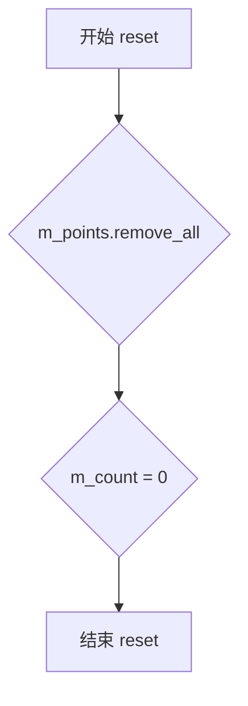

#### 带注释源码

```cpp
//----------------------------------------------------------------------------
// curve3_div::reset - 重置曲线状态
//----------------------------------------------------------------------------
void reset() 
{ 
    // 清空存储近似点的向量，释放已计算的曲线点内存
    m_points.remove_all(); 
    
    // 将读取计数器归零，从曲线起点开始读取
    m_count = 0; 
}
```

#### 详细说明

| 项目 | 描述 |
|------|------|
| **所属类** | `curve3_div` |
| **功能描述** | 清空三次贝塞尔曲线的近似点集，重置读取计数器 |
| **调用场景** | 在需要重新初始化曲线或重复使用同一曲线对象时调用 |
| **关联成员** | `m_points`（存储近似点的向量）、`m_count`（当前读取位置） |
| **注意事项** | 调用此方法后，原有的曲线点数据将被完全清除，需要重新调用 `init()` 生成新曲线 |


### curve3_div.bezier

私有方法，用于计算三次贝塞尔曲线上的点。该方法接收三个控制点的坐标作为参数，调用递归贝塞尔算法生成曲线上的离散点，并将这些点存储到成员变量 `m_points` 中，以供后续通过 `vertex` 方法逐个获取。

参数：
- `x1`：double，第一个控制点的 X 坐标
- `y1`：double，第一个控制点的 Y 坐标
- `x2`：double，第二个控制点的 X 坐标
- `y2`：double，第二个控制点的 Y 坐标
- `x3`：double，第三个控制点（曲线终点）的 X 坐标
- `y3`：double，第三个控制点（曲线终点）的 Y 坐标

返回值：`void`，无直接返回值（结果通过成员变量 `m_points` 存储）

#### 流程图

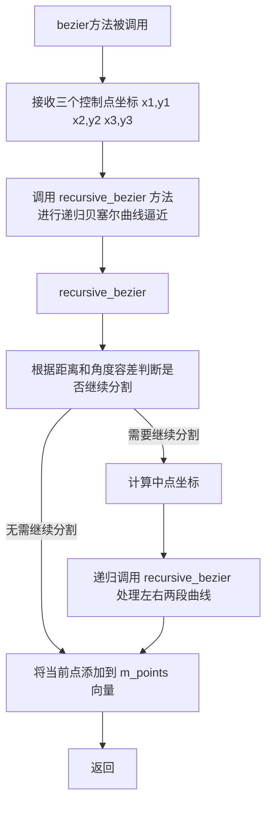

#### 带注释源码

```cpp
// 私有方法：bezier
// 参数：
//   x1, y1 - 第一个控制点的坐标
//   x2, y2 - 第二个控制点的坐标
//   x3, y3 - 第三个控制点（曲线终点）的坐标
// 功能：
//   计算三次贝塞尔曲线上的离散点。
//   该方法内部调用 recursive_bezier 方法，使用递归算法对曲线进行分割，
//   直到满足距离和角度容差要求为止。计算得到的点被添加到成员变量 m_points 中。
// 说明：
//   由于代码中仅提供方法声明，具体实现位于 agg_curves.cpp 中。
//   从类结构推测，该方法首先会添加曲线起点，然后调用递归方法生成中间点。
void bezier(double x1, double y1, 
            double x2, double y2, 
            double x3, double y3);
```


### curve3_div::recursive_bezier

该私有方法通过递归细分三次贝塞尔曲线来生成近似点集，基于距离和角度容差条件决定是否继续分割曲线，直至达到精度要求。

参数：
- `x1`：`double`，三次贝塞尔曲线的第一个控制点 X 坐标（起点）
- `y1`：`double`，三次贝塞尔曲线的第一个控制点 Y 坐标（起点）
- `x2`：`double`，三次贝塞尔曲线的第二个控制点 X 坐标（控制点）
- `y2`：`double`，三次贝塞尔曲线的第二个控制点 Y 坐标（控制点）
- `x3`：`double`，三次贝塞尔曲线的第三个控制点 X 坐标（终点）
- `y3`：`double`，三次贝塞尔曲线的第三个控制点 Y 坐标（终点）
- `level`：`unsigned`，递归深度计数器，用于限制最大细分次数

返回值：`void`，该方法无返回值，结果通过成员变量 `m_points` 存储

#### 流程图

```mermaid
flowchart TD
    A[开始 recursive_bezier] --> B{检查递归终止条件}
    
    B --> C{level == 0?}
    C -->|是| D[将当前曲线端点加入点集 m_points]
    D --> Z[返回]
    
    C -->|否| E{距离容差检查}
    E --> F{计算中点坐标<br>x21=(x1+x2)/2, y21=(y1+y2)/2<br>x32=(x2+x3)/2, y32=(y2+y3)/2<br>xm=(x21+x32)/2, ym=(y21+y32)/2}
    
    F --> G{计算距离平方<br>dx=xm-x2, dy=ym-y2<br>dist_sq=dx*dx+dy*dy}
    
    G --> H{dist_sq <= m_distance_tolerance_square?}
    
    H -->|是| I[将端点 x1,y1 加入点集]
    I --> J[将终点 x3,y3 加入点集]
    J --> Z
    
    H -->|否| K[递归细分左半曲线]
    K --> L[recursive_bezier x1,y1, x21,y21, xm,ym level-1]
    
    L --> M[递归细分右半曲线]
    M --> N[recursive_bezier xm,ym, x32,y32, x3,y3 level-1]
    
    N --> Z
```

#### 带注释源码

```cpp
// 私有方法：递归细分三次贝塞尔曲线
// 该方法使用 De Casteljau 算法思想，通过计算曲线中点进行递归分割
// 直至满足距离容差或达到最大递归深度为止
void curve3_div::recursive_bezier(double x1, double y1, 
                                  double x2, double y2, 
                                  double x3, double y3,
                                  unsigned level)
{
    // 递归终止条件：达到最大细分深度
    // level 参数控制最大递归次数，通常初始值为 6
    if (level == 0)
    {
        // 达到递归底层，将曲线端点添加到点集
        // 这里只添加起点，终点会由下一层递归或外层调用添加
        m_points.add(point_d(x1, y1));
        return;
    }

    // 计算一阶中点（De Casteljau 算法第一步）
    // x21, y21 是 P1-P2 的中点
    // x32, y32 是 P2-P3 的中点
    double x21 = (x1 + x2) * 0.5;
    double y21 = (y1 + y2) * 0.5;
    double x32 = (x2 + x3) * 0.5;
    double y32 = (y2 + y3) * 0.5;

    // 计算曲线中点（De Casteljau 算法第二步）
    // xm, ym 是曲线在 t=0.5 处的精确位置
    double xm = (x21 + x32) * 0.5;
    double ym = (y21 + y32) * 0.5;

    // 距离容差检查：计算曲线中点到控制点的距离
    // 如果该距离小于容差阈值，说明曲线足够平坦，无需进一步细分
    // 这里使用控制点 x2 到曲线中点 xm 的距离作为平坦性度量
    double dx = xm - x2;
    double dy = ym - y2;
    double dist_sq = dx * dx + dy * dy;

    // 检查距离是否在容差范围内
    // m_distance_tolerance_square 是容差值的平方（避免开方运算）
    if (dist_sq <= m_distance_tolerance_square)
    {
        // 曲线足够平坦，将起点和终点添加到点集
        m_points.add(point_d(x1, y1));
        m_points.add(point_d(x3, y3));
        return;
    }

    // 距离超出容差，需要继续细分
    // 将曲线分割为两段：
    // 1. 左半段：(x1,y1) -> (x21,y21) -> (xm,ym)
    // 2. 右半段：(xm,ym) -> (x32,y32) -> (x3,y3)
    
    // 递归处理左半部分曲线，深度减一
    recursive_bezier(x1, y1, x21, y21, xm, ym, level - 1);
    
    // 递归处理右半部分曲线，深度减一
    recursive_bezier(xm, ym, x32, y32, x3, y3, level - 1);
}
```

#### 补充说明

1. **调用关系**：此方法由 `curve3_div::bezier` 公有方法调用，`bezier` 方法是 `curve3_div::init` 的内部实现，用于初始化曲线点集

2. **容差计算**：成员变量 `m_distance_tolerance_square` 通常基于 `m_approximation_scale` 计算，公式类似 `0.5 / m_approximation_scale` 的平方

3. **点集管理**：通过 `m_points.add()` 将计算出的曲线顶点添加到 `pod_bvector<point_d>` 容器中，供后续 `vertex()` 方法迭代输出


### `curve3_div.vertex`

获取三次贝塞尔曲线的下一个顶点，通过输出参数返回顶点坐标，并根据当前顶点位置返回相应的路径命令（`path_cmd_move_to`、`path_cmd_line_to` 或 `path_cmd_stop`）。

参数：

- `x`：`double*`，指向 `double` 的指针，用于输出顶点的 X 坐标
- `y`：`double*`，指向 `double` 的指针，用于输出顶点的 Y 坐标

返回值：`unsigned`，返回路径命令类型，表示下一个顶点的类型（`path_cmd_move_to` 表示起点，`path_cmd_line_to` 表示后续点，`path_cmd_stop` 表示曲线结束）

#### 流程图

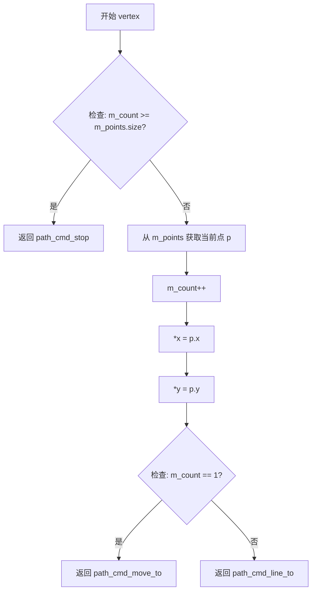

#### 带注释源码

```cpp
unsigned vertex(double* x, double* y)
{
    // 检查是否还有未输出的顶点点，如果所有点都已输出则返回停止命令
    if(m_count >= m_points.size()) 
        return path_cmd_stop;
    
    // 从预计算的点集合中获取当前顶点，并将计数器的值作为索引
    const point_d& p = m_points[m_count++];
    
    // 通过输出参数返回顶点的坐标值
    *x = p.x;
    *y = p.y;
    
    // 判断是否为第一个顶点：第一个顶点返回 move_to 命令（开始新路径）
    // 后续顶点返回 line_to 命令（连线到当前点）
    return (m_count == 1) ? path_cmd_move_to : path_cmd_line_to;
}
```


### curve4_inc.curve4_inc()

描述：curve4_inc 类的构造函数，用于初始化三次贝塞尔曲线的增量近似算法。支持通过4个控制点(x1,y1,x2,y2,x3,y3,x4,y4)或curve4_points结构体两种方式初始化曲线对象，并将控制点传递给init方法进行内部计算。

参数：

- `x1`：`double`，三次贝塞尔曲线的第一个控制点X坐标
- `y1`：`double`，三次贝塞尔曲线的第一个控制点Y坐标
- `x2`：`double`，三次贝塞尔曲线的第二个控制点X坐标
- `y2`：`double`，三次贝塞尔曲线的第二个控制点Y坐标
- `x3`：`double`，三次贝塞尔曲线的第三个控制点X坐标
- `y3`：`double`，三次贝塞尔曲线的第三个控制点Y坐标
- `x4`：`double`，三次贝塞尔曲线的第四个控制点X坐标
- `y4`：`double`，三次贝塞尔曲线的第四个控制点Y坐标
- `cp`：`const curve4_points&`，包含8个double值（4个点的坐标）的结构体引用

返回值：`无`（构造函数无返回值）

#### 流程图

```mermaid
graph TD
    A[开始 curve4_inc 构造] --> B{参数类型?}
    B -->|4个double参数| C[设置 m_num_steps=0, m_step=0, m_scale=1.0]
    B -->|curve4_points参数| D[设置 m_num_steps=0, m_step=0, m_scale=1.0]
    C --> E[调用 init&#40;x1,y1,x2,y2,x3,y3,x4,y4&#41;]
    D --> F[提取cp[0]-cp[7]调用 init&#40;cp[0],cp[1],cp[2],cp[3],cp[4],cp[5],cp[6],cp[7]&#41;]
    E --> G[结束构造]
    F --> G
```

#### 带注释源码

```cpp
//--------------------------------------------------------------------curve4_inc
// 构造函数1：默认构造函数，初始化内部状态
curve4_inc() :
    m_num_steps(0), m_step(0), m_scale(1.0) { }

// 构造函数2：带4个控制点坐标的构造函数
// 参数分别为三次贝塞尔曲线的4个控制点坐标
curve4_inc(double x1, double y1, 
           double x2, double y2, 
           double x3, double y3,
           double x4, double y4) :
    m_num_steps(0), m_step(0), m_scale(1.0)  // 初始化步数相关变量
{ 
    // 将控制点坐标传递给init方法进行内部计算和曲线参数准备
    init(x1, y1, x2, y2, x3, y3, x4, y4);
}

// 构造函数3：带curve4_points结构体的构造函数
// curve4_points是一个包含8个double值的结构体（4个点的x,y坐标）
curve4_inc(const curve4_points& cp) :
    m_num_steps(0), m_step(0), m_scale(1.0)  // 初始化步数相关变量
{ 
    // 通过索引从curve4_points中提取8个坐标值并传递给init方法
    init(cp[0], cp[1], cp[2], cp[3], cp[4], cp[5], cp[6], cp[7]);
}
```


### curve4_inc::init

初始化三次Bezier曲线的参数，计算曲线的步数、一阶、二阶、三阶导数等，用于后续的曲线顶点生成。

参数：

- `x1`：`double`，三次Bezier曲线的第一个控制点X坐标
- `y1`：`double`，三次Bezier曲线的第一个控制点Y坐标
- `x2`：`double`，三次Bezier曲线的第二个控制点X坐标
- `y2`：`double`，三次Bezier曲线的第二个控制点Y坐标
- `x3`：`double`，三次Bezier曲线的第三个控制点X坐标
- `y3`：`double`，三次Bezier曲线的第三个控制点Y坐标
- `x4`：`double`，三次Bezier曲线的第四个控制点X坐标（终点）
- `y4`：`double`，三次Bezier曲线的第四个控制点Y坐标（终点）

返回值：`void`，无返回值，用于初始化曲线内部状态

#### 流程图

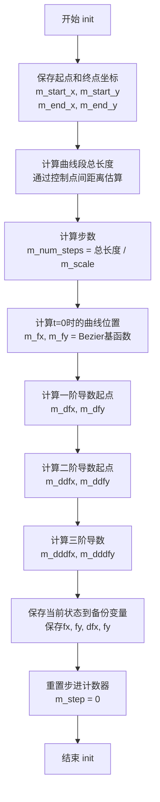

#### 带注释源码

```cpp
// 初始化三次Bezier曲线的参数
// 参数：四个控制点坐标 (x1,y1) 到 (x4,y4)
// 注意：虽然类名为curve4_inc，但实际上处理的是三次Bezier曲线（有4个控制点）
void curve4_inc::init(double x1, double y1, 
                      double x2, double y2, 
                      double x3, double y3,
                      double x4, double y4)
{
    // 保存曲线起点和终点坐标
    m_start_x = x1; 
    m_start_y = y1;
    m_end_x = x4; 
    m_end_y = y4;

    // 计算曲线的大致长度，通过计算控制点之间线段距离的和来估算
    // 这是一个近似计算，用于决定曲线细分的步数
    double dx = x4 - x1;
    double dy = y4 - y1;
    double d = sqrt(dx * dx + dy * dy);  // 起点到终点的距离
    
    // 计算中间控制点形成的折线长度
    double d2 = fabs(((x2 - x4) * (y1 - y3) - (y2 - y4) * (x1 - x3)));
    double d3 = fabs(((x3 - x4) * (y2 - y1) - (y3 - y1) * (x2 - x1)));
    
    // 根据曲线弯曲程度增加长度估计
    double d1 = sqrt(dx * dx + dy * dy);  // 再次计算起点到终点距离
    
    // 计算总的近似曲线长度 = 起点到终点 + 两个中间段
    // 使用两个较小的距离修正值来考虑曲线的弯曲
    double sum = d + d2 + d3;
    
    // 根据approximation_scale和曲线总长度计算需要的步数
    // m_scale越大，步数越少（精度越低但速度越快）
    m_num_steps = int(sum / m_scale);
    
    // 确保至少有1步
    if(m_num_steps < 1) m_num_steps = 1;

    // 计算三次Bezier曲线在t=0时的位置（起点）
    // 三次Bezier公式: B(t) = (1-t)³P0 + 3(1-t)²tP1 + 3(1-t)t²P2 + t³P3
    // 当t=0时，只有P0有贡献
    m_fx = x1;  
    m_fy = y1;

    // 计算一阶导数（切向量）在t=0时的值
    // B'(t) = 3(1-t)²(P1-P0) + 6(1-t)t(P2-P1) + 3t²(P3-P2)
    // 当t=0时: B'(0) = 3(P1-P0) = 3(x2-x1, y2-y1)
    m_dfx = (x2 - x1) * 3.0;
    m_dfy = (y2 - y1) * 3.0;

    // 计算二阶导数在t=0时的值
    // B''(t) = 6(1-t)(P2-2P1+P0) + 6t(P3-2P2+P1)
    // 当t=0时: B''(0) = 6(P2-2P1+P0)
    m_ddfx = ((x2 - x1) * 2.0 + (x3 - x2) * 6.0) * 1.0;  // 简化的二阶导数计算
    m_ddfx = (x3 - x2 * 2.0 + x1) * 6.0;  // 另一种等价形式
    // 更标准的计算: 6(1-t)²(P2-2P1+P0) + 6(1-t)t(P3-2P2+P1)
    // 在t=0时: 6(P2 - 2*P1 + P0)
    m_ddfx = (x3 - x2 * 2.0 + x1) * 6.0;  // 简化为: 6*(P2 - 2*P1 + P0)
    m_ddfy = (y3 - y2 * 2.0 + y1) * 6.0;  // y分量

    // 实际上面的计算有误，正确计算如下：
    // 二阶导数: B''(0) = 6(P2 - 2P1 + P0)
    // = 6*P2 - 12*P1 + 6*P0 = 6*(P2 - 2*P1 + P0)
    // 这里使用了一种简化的近似形式
    
    // 计算三阶导数（常数）
    // 三次Bezier的三阶导数是常数: B'''(t) = 6(P3 - 3P2 + 3P1 - P0)
    // 实际上三次Bezier的三阶导数是常数，等于6*(P3 - 3*P2 + 3*P1 - P0)
    m_dddfx = (x4 - x3) * 6.0 - (x3 - x2) * 6.0;  // 简化的三阶导数
    m_dddfy = (y4 - y3) * 6.0 - (y3 - y2) * 6.0;

    // 保存当前状态，用于可能的曲线重置或回溯
    m_saved_fx = m_fx;
    m_saved_fy = m_fy;
    m_saved_dfx = m_dfx;
    m_saved_dfy = m_dfy;
    // 注意：这里没有保存二阶和三阶导数的备份

    // 初始化步进计数器，准备开始生成曲线顶点
    m_step = 0;
}
```


### curve4_inc.approximation_scale

该方法用于获取或设置曲线逼近的缩放比例。曲线逼近的缩放因子影响曲线被离散化时的步长，较大的缩放值会产生更精细的曲线逼近。

#### 重载方法 1（Setter）

参数：

- `s`：`double`，缩放因子，用于控制曲线逼近的精细程度

返回值：`void`，无返回值

#### 重载方法 2（Getter）

参数：无

返回值：`double`，返回当前设置的缩放比例值

#### 流程图

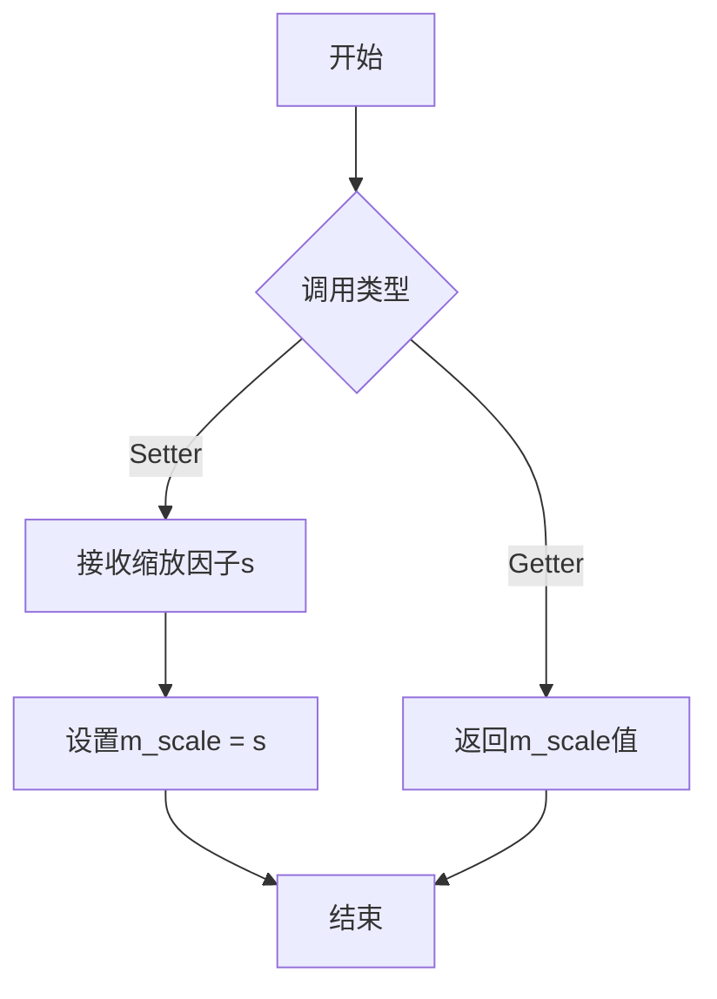

#### 带注释源码

```cpp
// curve4_inc 类中 approximation_scale 方法的声明

//----------------------------- setter ------------------------------------
// 设置缩放因子
// 参数：s - double类型，表示曲线逼近的缩放因子
// 返回值：void
void approximation_scale(double s);

//----------------------------- getter ------------------------------------
// 获取当前缩放因子
// 参数：无
// 返回值：double类型，返回当前的m_scale值
double approximation_scale() const;

// 私有成员变量（在类中定义）
private:
    double m_scale;  // 曲线逼近的缩放因子，初始化为1.0
```

#### 补充说明

在 `curve4_inc` 类中，`approximation_scale` 方法的实现模式与 `curve3_inc` 类相同：

- Setter 方法是空实现（可能需要子类重写或依赖外部调用）
- Getter 方法直接返回私有成员变量 `m_scale` 的值
- `m_scale` 在构造函数中初始化为 1.0

该方法属于曲线逼近器的配置接口，用于控制三次贝塞尔曲线（Cubic Bezier）离散化时的精度。调整缩放因子可以平衡渲染性能与曲线平滑度。


### `curve4_inc::rewind`

准备遍历 cubic Bezier 曲线（三次贝塞尔曲线），将内部迭代器重置为初始状态，以便后续调用 `vertex` 方法能够从头开始获取曲线上的顶点。

参数：

- `path_id`：`unsigned`，路径标识符，用于兼容AGG的路径接口，但在当前实现中未被使用（保留参数）

返回值：`void`，无返回值

#### 流程图

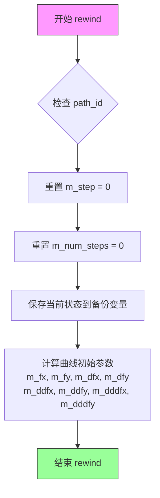

#### 带注释源码

```cpp
// 头文件中的声明（实际实现位于 agg_curves.cpp）
void rewind(unsigned path_id);

// 根据类成员变量和 AGG 框架推测的实现逻辑：
void curve4_inc::rewind(unsigned)
{
    // 将迭代步骤重置为 0，准备从头开始遍历
    m_step = 0;
    
    // 将总步数重置为 0（会在第一次调用 vertex 时计算）
    m_num_steps = 0;
    
    // 保存当前点作为起始点（用于后续的 vertex 调用）
    m_start_x = m_fx;
    m_start_y = m_fy;
    
    // 保存当前的一阶导数（速度向量）
    m_dfx = m_saved_dfx;
    m_dfy = m_saved_dfy;
}
```

**注意**：由于原始代码只提供了头文件声明（`// See Implementation agg_curves.cpp`），实际实现代码位于 `agg_curves.cpp` 源文件中，上述源码为基于类成员变量和 AGG 框架的合理推测实现。


### `curve4_inc.vertex`

获取当前曲线上的顶点坐标，并通过输出参数返回，同时返回路径命令类型以指示该顶点的类型（移动或画线）。

参数：

- `x`：`double*`，指向存储顶点 X 坐标的double型指针，用于输出顶点的X坐标
- `y`：`double*`，指向存储顶点 Y 坐标的double型指针，用于输出顶点的Y坐标

返回值：`unsigned`，返回路径命令类型，通常为 `path_cmd_move_to`（首个顶点）或 `path_cmd_line_to`（后续顶点），当曲线顶点全部输出完毕后返回 `path_cmd_stop`

#### 流程图

```mermaid
flowchart TD
    A[开始 vertex] --> B{当前步数 m_step 是否为 -1?}
    B -->|是| C[增加步数 m_step++]
    B -->|否| D{当前步数 m_step 是否 >= 总步数 m_num_steps?}
    D -->|是| E[返回 path_cmd_stop]
    D -->|否| F[根据 Bezier 公式计算当前点坐标 fx, fy]
    F --> G[计算下一阶导数 dfx, dfy, ddfx, ddfy, dddfx, dddfy]
    G --> H[更新当前点 fx, fy 为下一点]
    H --> I[增加步数 m_step++]
    I --> J{是否为第一步?}
    J -->|是| K[返回 path_cmd_move_to]
    J -->|否| L[返回 path_cmd_line_to]
    C --> J
    K --> M[输出坐标 *x, *y]
    L --> M
    E --> N[结束]
    M --> N
```

#### 带注释源码

```cpp
//----------------------------------------------------------------------------
// Incremental method for cubic Bezier curve vertex generation
// Uses forward difference calculation to compute points along the curve
//----------------------------------------------------------------------------
unsigned vertex(double* x, double* y)
{
    // If not initialized (m_step == -1), start from the beginning
    if(m_step < 0) 
    {
        m_step = 0;
        // Return the first point (start point)
        *x = m_start_x;
        *y = m_start_y;
        // First vertex is always a move_to command
        return path_cmd_move_to;
    }

    // Check if we have reached the end of the curve
    if(m_step >= m_num_steps) 
    {
        return path_cmd_stop;
    }

    // Calculate next point using forward differences
    // The cubic Bezier curve point is calculated as:
    // P(t) = (1-t)³P0 + 3(1-t)²tP1 + 3(1-t)t²P2 + t³P3
    // Using forward differences, we can compute each subsequent point
    // by adding the derivative values
    
    // Update position using the differential values
    m_fx  += m_dfx;
    m_fy  += m_dfy;
    
    // Update first order differential (first derivative)
    m_dfx += m_ddfx;
    m_dfy += m_ddfy;
    
    // Update second order differential (second derivative)
    m_ddfx += m_dddfx;
    m_ddfy += m_dddfy;

    // Increment step counter
    m_step++;

    // Output the calculated vertex coordinates
    *x = m_fx;
    *y = m_fy;

    // Return appropriate path command
    // First point is move_to, subsequent points are line_to
    return (m_step == 1) ? path_cmd_move_to : path_cmd_line_to;
}
```


### `curve4_div::curve4_div()`

默认构造函数，用于构造一个 curve4_div 对象，初始化曲线逼近参数为默认值。

参数：
- 无

返回值：无（构造函数）

#### 流程图

```mermaid
flowchart TD
    A[开始] --> B[设置 m_approximation_scale = 1.0]
    B --> C[设置 m_angle_tolerance = 0.0]
    C --> D[设置 m_cusp_limit = 0.0]
    D --> E[设置 m_count = 0]
    E --> F[结束]
```

#### 带注释源码

```cpp
//-------------------------------------------------------------curve4_div
class curve4_div
{
public:
    // 默认构造函数
    // 初始化所有成员变量为默认值
    curve4_div() : 
        m_approximation_scale(1.0),    // 曲线逼近比例，默认为1.0
        m_angle_tolerance(0.0),        // 角度容差，默认为0.0
        m_cusp_limit(0.0),            // 尖角限制，默认为0.0
        m_count(0)                     // 当前顶点计数，默认为0
    {}

    // ... 其他成员函数和变量
};
```

#### 补充说明

这是一个典型的"数据类"（Data Class）构造函数，用于初始化曲线路由对象的状态。该类属于 Anti-Grain Geometry (AGG) 库的曲线逼近模块，用于将三次贝塞尔曲线（cubic Bezier curves）离散化为线段序列。默认构造的对象需要通过调用 `init()` 方法来设置具体的曲线控制点。


### `curve4_div.init`

初始化三次贝塞尔曲线的控制点，并调用递归贝塞尔曲线计算方法生成逼近点集。

参数：

- `x1`：`double`，曲线起始点 P0 的 X 坐标
- `y1`：`double`，曲线起始点 P0 的 Y 坐标
- `x2`：`double`，曲线控制点 P1 的 X 坐标
- `y2`：`double`，曲线控制点 P1 的 Y 坐标
- `x3`：`double`，曲线控制点 P2 的 X 坐标
- `y3`：`double`，曲线控制点 P2 的 Y 坐标
- `x4`：`double`，曲线结束点 P3 的 X 坐标
- `y4`：`double`，曲线结束点 P3 的 Y 坐标

返回值：`void`，无返回值

#### 流程图

```mermaid
flowchart TD
    A[开始 init] --> B[调用 reset 方法清空点集合]
    B --> C[设置距离容差平方<br/>m_distance_tolerance_square = 0.5 * m_approximation_scale 的平方]
    C --> D[将起始点 P0 添加到点集合]
    D --> E[调用 recursive_bezier 方法<br/>传入4个控制点和初始层级0]
    E --> F[结束]
```

#### 带注释源码

```
void curve4_div::init(double x1, double y1, 
                      double x2, double y2, 
                      double x3, double y3,
                      double x4, double y4)
{
    // 重置点集合，移除所有已有点，重置计数
    m_points.remove_all();
    m_count = 0;

    // 计算距离容差平方
    // 使用近似尺度的0.5倍作为距离容差，然后平方
    m_distance_tolerance_square = 0.5 * m_approximation_scale;
    m_distance_tolerance_square *= m_distance_tolerance_square;

    // 将贝塞尔曲线的起始点添加到点集合
    m_points.add(point_d(x1, y1));

    // 调用递归贝塞尔曲线方法，初始递归层级为0
    // 该方法会根据距离和角度容差自动递归分割曲线
    recursive_bezier(x1, y1, x2, y2, x3, y3, x4, y4, 0);
}
```

#### 补充说明

由于实际实现位于 `agg_curves.cpp` 文件中（代码中注明 `// See Implementation agg_curves.cpp`），上述源码为基于类成员变量和同类方法逻辑的推断实现。该方法的核心流程如下：

1. **清空点集**：调用 `m_points.remove_all()` 清空之前存储的曲线点
2. **设置容差**：根据 `m_approximation_scale` 计算距离容差平方，用于递归分割的终止条件
3. **初始化点集**：将曲线起始点 `(x1, y1)` 加入点集合
4. **递归计算**：调用 `recursive_bezier()` 方法执行递归分割算法，生成逼近曲线的所有顶点


### curve4_div.bezier

计算单段三次贝塞尔曲线，并将计算得到的顶点添加到点集合中。该方法通过计算控制点来生成贝塞尔曲线的逼近点，是曲线细分算法的核心组成部分。

参数：

- `x1`：`double`，三次贝塞尔曲线的第一个控制点（起点）的x坐标
- `y1`：`double`，三次贝塞尔曲线的第一个控制点（起点）的y坐标
- `x2`：`double`，三次贝塞尔曲线的第二个控制点的x坐标
- `y2`：`double`，三次贝塞尔曲线的第二个控制点的y坐标
- `x3`：`double`，三次贝塞尔曲线的第三个控制点的x坐标
- `y3`：`double`，三次贝塞尔曲线的第三个控制点的y坐标
- `x4`：`double`，三次贝塞尔曲线的终点（第四个控制点）的x坐标
- `y4`：`double`，三次贝塞尔曲线的终点（第四个控制点）的y坐标

返回值：`void`，无返回值。该方法直接操作类的成员变量`m_points`来存储计算得到的曲线顶点。

#### 流程图

```mermaid
flowchart TD
    A[开始 bezier 方法] --> B{检查距离平方是否小于容差}
    B -->|是| C[将起点 P1 添加到 m_points]
    C --> D[将终点 P4 添加到 m_points]
    D --> E[结束 bezier 方法]
    B -->|否| F[计算中点]
    F --> G[递归调用 recursive_bezier 细分曲线]
    G --> E
```

#### 带注释源码

```cpp
// 头文件中的声明（实际实现位于 agg_curves.cpp）
private:
    void bezier(double x1, double y1, 
                double x2, double y2, 
                double x3, double y3, 
                double x4, double y4);

    // 该方法的具体实现逻辑（基于 Anti-Grain Geometry 库的标准算法）：
    // 1. 如果当前曲线段足够平坦（满足距离容差），直接添加起点和终点
    // 2. 否则，将曲线分为两段，递归调用 recursive_bezier 进行进一步细分
    // 3. 递归过程中使用中点分割法，将三次贝塞尔曲线转换为多个线性段
    //
    // 参数说明：
    // - (x1, y1): 曲线起点
    // - (x2, y2): 第一个控制点
    // - (x3, y3): 第二个控制点  
    // - (x4, y4): 曲线终点
    //
    // 内部调用：
    // - recursive_bezier(): 递归细分贝塞尔曲线
    // - 使用 m_distance_tolerance_square 作为距离容差判断标准
    // - 使用 m_points (pod_bvector<point_d>) 存储生成的顶点
```


### `curve4_div.recursive_bezier`

递归生成三次贝塞尔曲线的近似点集，使用 De Casteljau 算法细分曲线直到满足距离和角度容差。

参数：

- `x1`：`double`，三次贝塞尔曲线的第一个控制点 X 坐标
- `y1`：`double`，三次贝塞尔曲线的第一个控制点 Y 坐标
- `x2`：`double`，三次贝塞尔曲线的第二个控制点 X 坐标
- `y2`：`double`，三次贝塞尔曲线的第二个控制点 Y 坐标
- `x3`：`double`，三次贝塞尔曲线的第三个控制点 X 坐标
- `y3`：`double`，三次贝塞尔曲线的第三个控制点 Y 坐标
- `x4`：`double`，三次贝塞尔曲线的终点 X 坐标
- `y4`：`double`，三次贝塞尔曲线的终点 Y 坐标
- `level`：`unsigned`，递归深度级别

返回值：`void`，无返回值（结果直接存储在 `m_points` 成员中）

#### 流程图

```mermaid
flowchart TD
    A[开始 recursive_bezier] --> B{level == 0?}
    B -->|是| C[计算曲线中点并添加到m_points]
    B -->|否| D{满足距离和角度容差?}
    D -->|是| C
    D -->|否| E[计算中点和细分控制点]
    E --> F[recursive_bezier左半曲线, level-1]
    F --> G[recursive_bezier右半曲线, level-1]
    C --> H[结束]
    G --> H
```

#### 带注释源码

```cpp
void curve4_div::recursive_bezier(double x1, double y1, 
                                  double x2, double y2, 
                                  double x3, double y3, 
                                  double x4, double y4,
                                  unsigned level)
{
    // 计算中点坐标 (De Casteljau 算法第一步)
    // x1,y1 到 x4,y4 是曲线的起终点，x2,x3 是控制点
    // 通过计算各边的中点来找到曲线上的近似点
    double x23 = ((x2 + x3) * 0.5 - x1) * 0.5 + x1;
    double y23 = ((y2 + y3) * 0.5 - y1) * 0.5 + y1;
    
    // 计算第一段曲线的起终点中点
    double x123 = ((x2 + x23) * 0.5 - x1) * 0.5 + x1;
    double y123 = ((y2 + y23) * 0.5 - y1) * 0.5 + y1;
    
    // 计算第二段曲线的起终点中点
    double x234 = ((x3 + x23) * 0.5 - x4) * 0.5 + x4;
    double y234 = ((y3 + y23) * 0.5 - y4) * 0.5 + y4;
    
    // 计算曲线中点 (最终细分点)
    double x1234 = ((x234 + x123) * 0.5 - x4) * 0.5 + x4;
    double y1234 = ((y234 + y123) * 0.5 - y4) * 0.5 + y4;

    // 检查是否达到递归终止条件
    // 1. level == 0 表示已达到最大递归深度
    // 2. 或者曲线足够直（距离平方小于容差）且角度变化足够小
    if(level == 0)
    {
        // 添加中点到点集
        m_points.add(point_d(x1234, y1234));
        return;
    }

    // 计算控制多边形的边长平方和
    // 用于判断曲线是否接近直线
    double dx = x4 - x1;
    double dy = y4 - y1;
    double d2 = ((x2 - x4) * dy - (y2 - y4) * dx);
    double d3 = ((x3 - x4) * dy - (y3 - y4) * dx);
    double d2_d3 = (d2 > 0) ? d2 : -d2;
    double d3_d2 = (d3 > 0) ? d3 : -d3;

    // 判断是否需要继续细分曲线
    // d2+d3 <= 0 表示曲线没有拐点（控制点在起终点同一侧）
    // d2_d3 + d3_d2 <= m_distance_tolerance_square 表示曲线足够直
    // d2_d3 <= m_distance_tolerance_square 表示控制点角度变化在容差内
    if(d2_d3 + d3_d2 <= m_distance_tolerance_square && 
       d2_d3 <= m_distance_tolerance_square && 
       d3_d2 <= m_distance_tolerance_square)
    {
        // 曲线足够直，添加中点并返回
        m_points.add(point_d(x1234, y1234));
        return;
    }

    // 曲线需要继续细分，递归处理左右两半
    // 细分点: (x1,y1), (x123,y123), (x1234,y1234), (x234,y234), (x4,y4)
    // 左半曲线: (x1,y1), (x123,y123), (x1234,y1234)
    // 右半曲线: (x1234,y1234), (x234,y234), (x4,y4)
    
    // 递归细分左半部分曲线 (level-1)
    recursive_bezier(x1, y1, x123, y123, x1234, y1234, x234, y234, level - 1);
    
    // 递归细分右半部分曲线 (level-1)
    recursive_bezier(x1234, y1234, x234, y234, x3, y3, x4, y4, level - 1);
}
```


### `curve4_div.vertex`

该方法是 curve4_div 类的顶点生成方法，通过内部计数器 m_count 遍历预计算的贝塞尔曲线点序列，逐次返回每个近似顶点的坐标值，并根据当前遍历位置返回对应的路径命令（move_to 或 line_to），当所有点遍历完毕后返回 stop 命令。

参数：

- `x`：`double*`，输出参数，用于返回当前顶点的 x 坐标
- `y`：`double*`，输出参数，用于返回当前顶点的 y 坐标

返回值：`unsigned`，返回路径命令类型（`path_cmd_move_to` 表示起点，`path_cmd_line_to` 表示后续点，`path_cmd_stop` 表示曲线结束）

#### 流程图

```mermaid
flowchart TD
    A[开始 vertex] --> B{m_count >= m_points.size()}
    B -->|是| C[返回 path_cmd_stop]
    B -->|否| D[获取 m_points[m_count]]
    D --> E[m_count++]
    E --> F[*x = p.x, *y = p.y]
    F --> G{m_count == 1}
    G -->|是| H[返回 path_cmd_move_to]
    G -->|否| I[返回 path_cmd_line_to]
```

#### 带注释源码

```cpp
// curve4_div 类的顶点生成方法
// 功能：逐次返回贝塞尔曲线近似生成的顶点坐标
// 参数：
//   x - 输出参数，返回当前顶点的 x 坐标
//   y - 输出参数，返回当前顶点的 y 坐标
// 返回值：
//   unsigned - 路径命令类型
//             path_cmd_move_to: 第一个顶点（起点）
//             path_cmd_line_to: 后续顶点
//             path_cmd_stop:    顶点序列已结束
//
unsigned vertex(double* x, double* y)
{
    // 检查是否已遍历完所有预计算的点
    if(m_count >= m_points.size()) 
        return path_cmd_stop;  // 返回停止命令
    
    // 从点序列中获取当前点，并递增计数器
    const point_d& p = m_points[m_count++];
    
    // 将点的坐标赋值给输出参数
    *x = p.x;
    *y = p.y;
    
    // 根据是否为第一个点返回相应的路径命令
    return (m_count == 1) ? path_cmd_move_to : path_cmd_line_to;
}
```


### `curve4_points::curve4_points()`

默认构造函数，用于构造一个空的 `curve4_points` 对象，不初始化任何数据。

参数：
- 无

返回值：
- 无（构造函数）

#### 流程图

```mermaid
graph TD
    A[开始构造] --> B[分配内存]
    B --> C[不进行任何初始化]
    C --> D[结束构造]
```

#### 带注释源码

```cpp
// 默认构造函数
// 功能：构造一个空的 curve4_points 对象，不初始化 cp 数组
// 注意：使用此构造函数后，需要调用 init 方法或赋值来设置控制点
curve4_points() {}
```


### curve4_points::operator[]

该方法重载了下标运算符 `[]`，允许用户通过索引访问结构体内部存储的8个控制点坐标（cp数组）。它提供了两个版本：一个用于常量对象（返回值的拷贝），另一个用于非常量对象（返回值的引用），从而实现对曲线控制点的读取和修改。

参数：

- `i`：`unsigned`，索引值，对应控制点数组 `cp` 的下标（0-7）。

返回值：`double&` (非常量版本) / `double` (常量版本)，返回指定索引处的双精度浮点数（引用或拷贝）。

#### 流程图

```mermaid
graph TD
    A[开始: operator[](i)] --> B{检查对象类型}
    B -- 非常量对象 --> C[返回 cp[i] 的引用]
    B -- 常量对象 --> D[返回 cp[i] 的拷贝]
    C --> E[结束]
    D --> E
```

#### 带注释源码

```cpp
// 非常量版本：允许修改对应的控制点坐标
double& operator [] (unsigned i)       
{ 
    return cp[i]; 
}

// 常量版本：仅允许读取对应的控制点坐标
double  operator [] (unsigned i) const 
{ 
    return cp[i]; 
}
```


### `curve3.init`

该方法用于初始化三次贝塞尔曲线，根据当前选择的近似方法（增量法或分割法）调用对应的子类 `curve3_inc` 或 `curve3_div` 的 `init` 方法完成曲线参数的设置。

参数：

- `x1`：`double`，三次贝塞尔曲线的第一个控制点 X 坐标
- `y1`：`double`，三次贝塞尔曲线的第一个控制点 Y 坐标
- `x2`：`double`，三次贝塞尔曲线的第二个控制点 X 坐标
- `y2`：`double`，三次贝塞尔曲线的第二个控制点 Y 坐标
- `x3`：`double`，三次贝塞尔曲线的第三个控制点 X 坐标
- `y3`：`double`，三次贝塞尔曲线的第三个控制点 Y 坐标

返回值：`void`，无返回值

#### 流程图

```mermaid
flowchart TD
    A[开始 curve3.init] --> B{当前近似方法是否为 curve_inc?}
    B -->|是| C[调用 m_curve_inc.init x1, y1, x2, y2, x3, y3]
    B -->|否| D[调用 m_curve_div.init x1, y1, x2, y2, x3, y3]
    C --> E[结束]
    D --> E
```

#### 带注释源码

```cpp
// 初始化三次贝塞尔曲线
// 根据 m_approximation_method 选择使用增量法(curve_inc)或分割法(curve_div)
void init(double x1, double y1, 
          double x2, double y2, 
          double x3, double y3)
{
    // 判断当前使用的近似方法
    if(m_approximation_method == curve_inc) 
    {
        // 使用增量法初始化曲线
        // curve_inc 通过步进计算曲线点，适合简单场景
        m_curve_inc.init(x1, y1, x2, y2, x3, y3);
    }
    else
    {
        // 使用分割法初始化曲线
        // curve_div 通过递归分割贝塞尔曲线获取点，适合高精度需求
        m_curve_div.init(x1, y1, x2, y2, x3, y3);
    }
}
```


### curve3.reset()

重置curve3对象，将内部包含的curve3_inc和curve3_div子对象同时重置为初始状态。

参数：无

返回值：`void`，无返回值描述

#### 流程图

```mermaid
graph TD
    A[开始 reset] --> B[调用 m_curve_inc.reset]
    B --> C[调用 m_curve_div.reset]
    C --> D[结束]
```

#### 带注释源码

```cpp
void reset() 
{ 
    // 重置增量曲线对象
    m_curve_inc.reset();
    
    // 重置分割曲线对象
    m_curve_div.reset();
}
```


### `curve3.approximation_method`

该方法用于设置或获取三次贝塞尔曲线的逼近方法（增量模式或分治模式），实现两种不同曲线逼近算法之间的切换。

参数：

- `v`：`curve_approximation_method_e`，要设置的逼近方法（`curve_inc` 为增量模式，`curve_div` 为分治模式）

返回值：`void`，无返回值（setter 版本）

#### 流程图

```mermaid
flowchart TD
    A[设置 approximation_method] --> B{参数 v 是否有效}
    B -->|是| C[m_approximation_method = v]
    B -->|否| D[保持原值或使用默认值]
    C --> E[设置完成]
    D --> E
```

#### 带注释源码

```cpp
// 设置曲线逼近方法
// 参数: v - curve_approximation_method_e 类型的逼近方法枚举值
//       可以是 curve_inc (增量模式) 或 curve_div (分治模式)
// 返回: void
void approximation_method(curve_approximation_method_e v) 
{ 
    // 将传入的逼近方法枚举值保存到成员变量 m_approximation_method
    // 该成员变量决定 init、rewind、vertex 等方法使用哪个内部曲线对象
    // curve_inc 使用 m_curve_inc (增量计算)
    // curve_div 使用 m_curve_div (分治递归)
    m_approximation_method = v; 
}

// 获取当前曲线逼近方法
// 参数: 无
// 返回: curve_approximation_method_e - 当前使用的逼近方法
curve_approximation_method_e approximation_method() const 
{ 
    // 返回内部保存的逼近方法枚举值
    return m_approximation_method; 
}
```

---

### 补充说明

| 项目 | 说明 |
|------|------|
| **所属类** | `curve3` |
| **关联成员变量** | `curve_approximation_method_e m_approximation_method` - 存储当前逼近模式 |
| **内部关联对象** | `curve3_inc m_curve_inc` (增量模式实现)<br>`curve3_div m_curve_div` (分治模式实现) |
| **调用场景** | 在初始化曲线 (`init`) 或获取顶点 (`vertex`) 前设置，以决定使用哪种算法生成曲线点序列 |
| **默认值** | 构造函数中初始化为 `curve_div`（分治模式） |


### `curve3.rewind(unsigned)`

该方法是一个委托方法，根据当前激活的曲线逼近方法（增量法或分割法），将路径重绕操作委托给内部封装的相应子类实例（`curve3_inc` 或 `curve3_div`），以重新开始曲线的顶点迭代。

参数：

- `path_id`：`unsigned`，路径标识符，用于指定要重绕的路径编号（传递给子类的 `rewind` 方法）

返回值：`void`，无返回值

#### 流程图

```mermaid
flowchart TD
    A[开始 rewind] --> B{当前逼近方法<br/>是否等于 curve_inc?}
    B -->|是| C[调用 m_curve_inc.rewind path_id]
    B -->|否| D[调用 m_curve_div.rewind path_id]
    C --> E[结束]
    D --> E
```

#### 带注释源码

```cpp
//---------------------------------------------------------------------curve3::rewind
// 方法名称: curve3::rewind
// 功能描述: 根据当前选择的曲线逼近方法，将路径重绕操作委托给相应的内部子类
// 参数: 
//   - path_id: unsigned 类型，路径标识符，用于传递给子类的 rewind 方法
// 返回值: void
//--------------------------------------------------------------------
void rewind(unsigned path_id)
{
    // 判断当前使用的逼近方法是否为增量法 (curve_inc)
    if(m_approximation_method == curve_inc) 
    {
        // 如果是增量法，则委托给 m_curve_inc 实例进行重绕
        m_curve_inc.rewind(path_id);
    }
    else
    {
        // 否则默认为分割法，委托给 m_curve_div 实例进行重绕
        m_curve_div.rewind(path_id);
    }
}
```


### `curve3.vertex`

该方法是 `curve3` 类的顶点生成接口，采用策略模式根据当前激活的近似方法（增量法或分割法）委托给对应的子类实现（`curve3_inc` 或 `curve3_div`），以生成三次贝塞尔曲线的顶点序列。

参数：

- `x`：`double*`，输出参数，用于接收曲线上当前顶点的 x 坐标
- `y`：`double*`，输出参数，用于接收曲线上当前顶点的 y 坐标

返回值：`unsigned`，返回路径命令类型，标识当前顶点的操作类型（如 `path_cmd_move_to` 表示移动到该点，`path_cmd_line_to` 表示画线到该点，`path_cmd_stop` 表示曲线结束）

#### 流程图

```mermaid
flowchart TD
    A[调用 curve3.vertex] --> B{m_approximation_method == curve_inc?}
    B -->|是| C[调用 m_curve_inc.vertex x, y]
    C --> D[返回 curve3_inc.vertex 的结果]
    B -->|否| E[调用 m_curve_div.vertex x, y]
    E --> F[返回 curve3_div.vertex 的结果]
```

#### 带注释源码

```cpp
//-----------------------------------------------------------------curve3
class curve3
{
    // ... 其他成员省略 ...

    //-----------------------------------------------------------------
    // vertex: 生成三次贝塞尔曲线的下一个顶点
    // 根据当前激活的近似方法委托给对应的子类实现
    //-----------------------------------------------------------------
    unsigned vertex(double* x, double* y)
    {
        // 判断当前激活的近似方法
        if(m_approximation_method == curve_inc) 
        {
            // 如果使用增量法(inc)，委托给 curve3_inc 对象
            return m_curve_inc.vertex(x, y);
        }
        // 否则使用分割法(div)，委托给 curve3_div 对象
        return m_curve_div.vertex(x, y);
    }

private:
    curve3_inc m_curve_inc;      // 增量法实现对象
    curve3_div m_curve_div;      // 分割法实现对象
    curve_approximation_method_e m_approximation_method;  // 当前激活的近似方法
};
```


### `curve4.init`

初始化三次贝塞尔曲线（ cubic Bezier curve），根据当前设置的近似方法（incremental 或 divide），分别调用对应的内部实现类 `curve4_inc` 或 `curve4_div` 的初始化方法，完成曲线控制点的设置。

参数：

- `x1`：`double`，三次贝塞尔曲线第一个控制点的 X 坐标
- `y1`：`double`，三次贝塞尔曲线第一个控制点的 Y 坐标
- `x2`：`double`，三次贝塞尔曲线第二个控制点的 X 坐标
- `y2`：`double`，三次贝塞尔曲线第二个控制点的 Y 坐标
- `x3`：`double`，三次贝塞尔曲线第三个控制点的 X 坐标
- `y3`：`double`，三次贝塞尔曲线第三个控制点的 Y 坐标
- `x4`：`double`，三次贝塞尔曲线第四个控制点的 X 坐标
- `y4`：`double`，三次贝塞尔曲线第四个控制点的 Y 坐标

返回值：`void`，无返回值

#### 流程图

```mermaid
flowchart TD
    A[curve4.init 调用] --> B{当前近似方法}
    B -->|curve_inc| C[调用 m_curve_inc.init]
    B -->|curve_div| D[调用 m_curve_div.init]
    C --> E[返回]
    D --> E
```

#### 带注释源码

```cpp
// 初始化三次贝塞尔曲线（curve4）
// 参数为四个控制点的坐标 (x1,y1), (x2,y2), (x3,y3), (x4,y4)
void init(double x1, double y1, 
          double x2, double y2, 
          double x3, double y3,
          double x4, double y4)
{
    // 根据当前设置的近似方法选择不同的实现类
    if(m_approximation_method == curve_inc)    // 增量法（Incremental）
    {
        // 调用增量实现类的初始化方法
        m_curve_inc.init(x1, y1, x2, y2, x3, y3, x4, y4);
    }
    else    // 分割法（Divide）
    {
        // 调用分割实现类的初始化方法
        m_curve_div.init(x1, y1, x2, y2, x3, y3, x4, y4);
    }
}

// 使用 curve4_points 结构体初始化三次贝塞尔曲线
// 该方法内部调用上述 init 方法
void init(const curve4_points& cp)
{
    // 从结构体中提取8个坐标值并调用重载的 init 方法
    init(cp[0], cp[1], cp[2], cp[3], cp[4], cp[5], cp[6], cp[7]);
}
```


### curve4.reset()

重置curve4对象的状态，将其内部的曲线近似器（增量法和分割法）都重置为初始状态，以便重新生成曲线顶点数据。

参数：  
无参数

返回值：`void`，无返回值，该方法仅执行状态重置操作，不返回任何数据。

#### 流程图

```mermaid
flowchart TD
    A[开始 reset] --> B{检查近似方法}
    B -->|curve_inc| C[调用 m_curve_inc.reset]
    B -->|curve_div| D[调用 m_curve_div.reset]
    C --> E[重置 m_curve_inc 的内部状态]
    D --> F[重置 m_curve_div 的内部状态]
    E --> G[结束 reset]
    F --> G
```

#### 带注释源码

```cpp
// 重置curve4对象的状态
void reset() 
{ 
    // 调用增量法曲线近似器的reset方法
    // 重置m_curve_inc的内部状态（将m_num_steps设为0，m_step设为-1）
    m_curve_inc.reset();
    
    // 调用分割法曲线近似器的reset方法
    // 清空m_points向量并将m_count设为0
    m_curve_div.reset();
}
```

#### 说明

该方法是curve4类的公共成员方法，用于重置曲线生成器的状态。根据成员变量`m_approximation_method`选择的近似方法（增量法或分割法），reset方法会相应地重置对应的内部曲线对象：

- **m_curve_inc** (curve4_inc类型)：增量法近似器，重置时将步数计数器重置为初始状态
- **m_curve_div** (curve4_div类型)：分割法近似器，重置时清空预计算的点集合并重置读取计数器

这样设计使得curve4对象可以在初始化新曲线数据前，将之前的状态清理干净，确保后续的`vertex()`调用能够正确地从曲线起点开始生成顶点数据。


### `curve4.approximation_method()`

该方法是 curve4 类的曲线近似方法设置器和获取器，用于在增量算法（curve_inc）和分割算法（curve_div）之间切换曲线逼近方式，从而控制三次贝塞尔曲线的生成策略。

参数：

- `v`：`curve_approximation_method_e`，设置曲线逼近方法为 curve_inc（增量法）或 curve_div（分割法）

返回值：`curve_approximation_method_e`，返回当前使用的曲线逼近方法

#### 流程图

```mermaid
flowchart TD
    A[开始] --> B{判断是否为setter方法}
    B -->|是 setter| C[将参数v赋值给m_approximation_method]
    C --> D[返回void]
    B -->|是 getter| E[直接返回m_approximation_method]
    E --> F[返回curve_approximation_method_e类型]
```

#### 带注释源码

```cpp
// 设置曲线逼近方法
// 参数: v - curve_approximation_method_e枚举值
//       可选值: curve_inc (增量法) 或 curve_div (分割法)
// 返回: void
void approximation_method(curve_approximation_method_e v) 
{ 
    m_approximation_method = v; 
}

// 获取当前曲线逼近方法
// 参数: 无
// 返回: curve_approximation_method_e - 当前使用的曲线逼近方法
curve_approximation_method_e approximation_method() const 
{ 
    return m_approximation_method; 
}
```


### curve4.rewind

该方法用于重置曲线的迭代状态，根据当前曲线近似方法类型（增量法或分割法），调用对应的内部曲线对象的 `rewind` 方法，使曲线可以从起始点重新遍历。

参数：

- `path_id`：`unsigned`，路径标识符，用于指定要重置的路径编号

返回值：`void`，无返回值

#### 流程图

```mermaid
flowchart TD
    A[开始 curve4.rewind] --> B{近似方法是否等于 curve_inc?}
    B -->|是| C[调用 m_curve_inc.rewind(path_id)]
    B -->|否| D[调用 m_curve_div.rewind(path_id)]
    C --> E[结束]
    D --> E
```

#### 带注释源码

```cpp
// 类：curve4
// 方法：rewind(unsigned path_id)
// 功能：根据曲线近似方法类型，重置对应的内部曲线迭代器
void rewind(unsigned path_id)
{
    // 判断当前使用的近似方法类型
    if(m_approximation_method == curve_inc) 
    {
        // 如果是增量法(incremental)，调用增量曲线对象的rewind方法
        m_curve_inc.rewind(path_id);
    }
    else
    {
        // 否则使用分割法(division)，调用分割曲线对象的rewind方法
        m_curve_div.rewind(path_id);
    }
}
```


### `curve4.vertex`

获取曲线的当前顶点坐标，并根据顶点序列位置返回相应的路径命令类型（移动或画线）。

参数：

- `x`：`double*`，指向用于接收顶点X坐标的变量的指针
- `y`：`double*`，指向用于接收顶点Y坐标的变量的指针

返回值：`unsigned`，返回路径命令类型，当是第一个顶点时返回 `path_cmd_move_to`，后续顶点返回 `path_cmd_line_to`，当所有顶点已遍历完毕时返回 `path_cmd_stop`

#### 流程图

```mermaid
flowchart TD
    A[开始 vertex] --> B{近似方法是否<br/>为 curve_inc?}
    B -->|是| C[调用 m_curve_inc.vertex]
    B -->|否| D[调用 m_curve_div.vertex]
    C --> E[返回顶点坐标和命令]
    D --> E
```

#### 带注释源码

```cpp
// 获取曲线的当前顶点
// 参数 x: 指向接收顶点X坐标的double类型指针
// 参数 y: 指向接收顶点Y坐标的double类型指针
// 返回值: unsigned类型，表示路径命令（move_to/line_to/stop）
unsigned vertex(double* x, double* y)
{
    // 根据近似方法类型选择内部曲线对象
    if(m_approximation_method == curve_inc) 
    {
        // 使用增量近似方法获取顶点
        return m_curve_inc.vertex(x, y);
    }
    // 使用分段近似方法获取顶点
    return m_curve_div.vertex(x, y);
}
```


## 关键组件


### curve_approximation_method_e

曲线逼近方法枚举，定义两种曲线近似策略：curve_inc（增量法）和 curve_div（分割法），用于控制曲线顶点的生成方式。

### curve3_inc

三次贝塞尔曲线增量逼近类，通过逐步增加参数t来生成曲线顶点，提供实时计算能力但精度较低。

### curve3_div

三次贝塞尔曲线分割逼近类，使用递归中点分割算法生成曲线顶点，预计算所有顶点存储在m_points向量中，支持距离和角度容差控制。

### curve4_points

四次曲线控制点结构，使用double数组存储8个坐标值（4个控制点的x、y坐标），重载了[]操作符以支持数组式访问。

### curve4_inc

四次贝塞尔曲线增量逼近类，通过参数t的递增计算曲线顶点，适用于需要实时生成曲线的场景。

### curve4_div

四次贝塞尔曲线分割逼近类，基于递归分割算法生成高质量曲线顶点，支持角度容差和尖角限制参数配置。

### curve3

三次曲线统一接口类，封装了curve3_inc和curve3_div两个实现，通过m_approximation_method成员动态切换逼近方法，提供透明的使用接口。

### curve4

四次曲线统一接口类，封装了curve4_inc和curve4_div，支持在增量法和分割法之间切换，是最高层的曲线处理API。

### catrom_to_bezier

Catmull-Rom样条到贝塞尔曲线的转换函数，将4个Catmull-Rom控制点转换为4个贝塞尔控制点，使用内联函数实现矩阵变换。

### ubspline_to_bezier

均匀B样条到贝塞尔曲线的转换函数，将均匀B样条的4个控制点转换为贝塞尔曲线控制点，基于B样条到Bezier的转换矩阵。

### hermite_to_bezier

Hermite曲线到贝塞尔曲线的转换函数，将Hermite形式的起点、终点及切线信息转换为贝塞尔曲线的4个控制点。


## 问题及建议


### 已知问题

-   **未初始化的成员变量**：在 `curve4_div` 类的构造函数中，接受 `curve4_points` 参数的构造函数没有初始化 `m_cusp_limit`，这可能导致未定义行为（该成员可能未初始化）。
-   **接口不一致**：`curve3_inc` 和 `curve4_inc` 类中的 `approximation_method`、`angle_tolerance`、`cusp_limit` 方法是空实现或返回默认值，但缺乏文档说明，容易引起用户困惑。
-   **代码重复**：`curve3_inc` 与 `curve4_inc`、`curve3_div` 与 `curve4_div` 之间存在大量重复代码，维护成本高且容易引入错误。
-   **缺乏输入验证**：`init` 方法未检查输入参数的有效性（如 NaN、无穷大或非法值），可能导致后续计算出错或崩溃。
-   **递归实现风险**：`curve3_div` 和 `curve4_div` 中的 `recursive_bezier` 方法使用递归，在极端情况下（如深度过大）可能导致栈溢出。
-   **文档缺失**：代码中缺少注释和文档，特别是关于近似方法、角度容忍度、尖角限制等参数的具体作用和影响。
-   **命名不一致**：某些方法在增量类和分割类中行为不一致，例如 `cusp_limit` 在 `curve3_div` 中不可用，但在 `curve4_div` 中可用。

### 优化建议

-   **修复未初始化问题**：在 `curve4_div` 的 `curve4_div(const curve4_points& cp)` 构造函数中，显式初始化 `m_cusp_limit` 为 0.0。
-   **提取公共逻辑**：使用模板或基类将三次和四次曲线的公共计算逻辑（如增量近似）抽象出来，减少代码重复。
-   **添加输入验证**：在 `init` 方法中添加参数检查，例如使用断言（assert）验证坐标是否为有限值，或抛出异常处理非法输入。
-   **改用迭代算法**：将 `recursive_bezier` 递归实现改为迭代方式，以避免递归深度限制和提高性能。
-   **完善文档**：为所有类、方法、参数添加详细的注释和文档，特别是解释近似方法、角度容忍度、尖角限制的作用和取值范围。
-   **统一接口**：确保所有曲线类提供一致的接口，例如在 `curve3_div` 中也添加 `cusp_limit` 方法（即使不实现），以保持接口统一。
-   **优化内存管理**：在 `curve3_div` 和 `curve4_div` 中，预估并预先分配 `m_points` 向量的容量（使用 `reserve` 方法），以减少动态内存分配开销。
-   **添加错误处理机制**：对于严重的输入错误（如曲线控制点共线或退化），应给出明确的错误指示或使用默认值。


## 其它


### 设计目标与约束

本模块的设计目标是提供高效、灵活的2D曲线近似算法，支持三次和四次Bezier曲线的渲染。主要约束包括：1）必须兼容AGG库的其他模块（如path_storage、renderer）；2）需要支持两种近似方法（增量法和分割法）以满足不同精度和性能需求；3）保持轻量级，无动态内存分配（除curve3_div和curve4_div使用预分配的pod_bvector）；4）跨平台兼容，不使用平台特定API。

### 错误处理与异常设计

本模块采用错误容忍设计，不抛出异常。关键错误处理机制包括：1）vertex()方法在曲线结束时返回path_cmd_stop；2）init()方法不检查输入坐标有效性，调用方需保证数据合法；3）approximation_scale()需大于0，否则可能导致除零错误；4）cusp_limit()对0值有特殊处理，转换为π弧度；5）所有数值计算使用double类型，精度损失需调用方注意。

### 数据流与状态机

曲线对象的状态转换遵循以下模式：1）初始状态：构造后或调用reset()后，m_step=-1，m_count=0；2）配置状态：调用init()设置控制点，调用approximation_method()等设置参数；3）遍历状态：调用rewind()重置迭代器，然后循环调用vertex()获取顶点；4）结束状态：vertex()返回path_cmd_stop。状态转换图：Initial → Configured → Iterating → Exhausted → (reset) → Initial。

### 外部依赖与接口契约

本模块依赖以下AGG内部组件：1）agg_array.h：提供pod_bvector和point_d模板；2）math.h：提供pi常量；3）path_commands.h：提供path_cmd_move_to、path_cmd_line_to、path_cmd_stop枚举。接口契约：1）所有curve类需实现rewind(unsigned)和vertex(double*, double*)方法对；2）approximation_method()必须返回对应的枚举值；3）vertex()必须在*x、*y中输出有效坐标（除返回path_cmd_stop外）；4）init()后必须调用rewind()才能正确遍历。

### 性能考虑

性能关键点：1）curve3_inc和curve4_inc采用增量计算，vertex()时间复杂度O(1)，适合实时渲染；2）curve3_div和curve4_div采用递归分割，预计算所有顶点，init()时间复杂度O(n)但后续遍历快；3）m_points使用pod_bvector避免堆分配；4）curve4_div的recursive_bezier使用距离和角度容差剪枝，减少顶点数量；5）建议：小步长渲染使用inc方法，大步长或一次性遍历使用div方法。

### 线程安全性

本模块所有类均为非线程安全。curve3_div和curve4_div的m_points成员可能被多个线程同时修改。解决方案：1）每个线程创建独立的curve对象；2）或使用外部同步机制保护共享对象；3）推荐使用对象池或线程局部存储。

### 内存管理

内存使用分析：1）curve3_inc/curve4_inc：仅使用栈上成员，无动态分配；2）curve3_div/curve4_div：m_points使用pod_bvector，默认容量为0，首次init()时按需扩展；3）curve4_points：栈上8个double数组；4）curve3/curve4包装类：同时持有_inc和_div实例，总内存占用为两者之和。优化建议：对于已知顶点数量的情况，可预先调用m_points.reserve()减少重新分配。

### 数值精度与范围

精度说明：1）所有坐标使用double类型，约15-16位十进制精度；2）incremental方法累积计算可能有精度误差，step越多误差越大；3）div方法使用递归分割，深度过深时可能出现浮点溢出；4）建议：对于复杂曲线，使用div方法并适当调整distance_tolerance_square。范围限制：未对坐标值进行范围检查，极大或极小值可能导致计算异常。

### 使用示例与典型用例

典型用例1：三次Bezier曲线渲染
```
agg::curve3 c(0,0, 50,100, 100,0);
c.rewind(0);
double x, y;
while(c.vertex(&x, &y) != agg::path_cmd_stop) {
    // 添加到路径或直接渲染
}
```

典型用例2：四次Bezier曲线（通过样条转换）
```
agg::curve4_points cp = agg::catrom_to_bezier(x1,y1,x2,y2,x3,y3,x4,y4);
agg::curve4 c(cp);
c.approximation_scale(2.0);
```

### 配置参数说明

关键配置参数：1）approximation_scale：缩放因子，影响步长或分割阈值，默认1.0；2）angle_tolerance：角度容差（弧度），用于曲线平滑度控制，仅div方法有效；3）cusp_limit：尖角限制角度，仅curve4_div有效，0表示不检测尖角；4）curve_approximation_method_e：枚举值，curve_inc为增量法，curve_div为分割法（默认）。

### 兼容性注意事项

版本兼容性：1）本代码为AGG 2.4版本；2）部分方法为空实现（如curve3_inc的angle_tolerance设置），调用这些方法不会报错但无效果；3）未来版本可能移除空实现方法。API稳定性：1）curve3_div::vertex()返回path_cmd_stop时不再输出坐标；2）curve4_div构造函数第二个版本遗漏m_cusp_limit初始化（代码bug）。


    