# `matplotlib\extern\agg24-svn\include\agg_dda_line.h` 详细设计文档

这是Anti-Grain Geometry库中直线插值器的实现文件，包含三个类用于图形渲染中的直线扫描转换算法，实现了DDA（数字微分分析仪）和Bresenham直线插值算法，能够在两点之间高效计算中间点的坐标值。

## 整体流程

```mermaid
graph TD
    A[开始] --> B[创建插值器对象]
    B --> C{选择插值算法类型}
    C --> D[dda_line_interpolator]
    C --> E[dda2_line_interpolator]
    C --> F[line_bresenham_interpolator]
    D --> G[设置FractionShift和YShift参数]
    E --> H[计算count、lft、rem、mod、y]
    F --> I[判断是水平还是垂直线]
    I --> J[调用dda2_line_interpolator]
    G --> K[重载++、--、+=、-=运算符]
    H --> L[重载++、--、save、load方法]
    J --> M[提供hstep、vstep横向/纵向步进]
    K --> N[调用y()获取插值点]
    L --> N
    M --> N
```

## 类结构

```
agg命名空间
├── dda_line_interpolator<FractionShift, YShift> (模板类)
│   ├── 字段: m_y, m_inc, m_dy
│   └── 方法: operator++, operator--, operator+=, operator-=, y(), dy()
├── dda2_line_interpolator (普通类)
│   ├── 字段: m_cnt, m_lft, m_rem, m_mod, m_y
│   └── 方法: 构造函数, save(), load(), operator++, operator--, adjust_forward(), adjust_backward(), mod(), rem(), lft(), y()
└── line_bresenham_interpolator (普通类)
    ├── 字段: m_x1_lr, m_y1_lr, m_x2_lr, m_y2_lr, m_ver, m_len, m_inc, m_interpolator
    └── 方法: line_lr(), 构造函数, is_ver(), len(), inc(), hstep(), vstep(), x1(), y1(), x2(), y2(), x2_hr(), y2_hr()
```

## 全局变量及字段


### `dda_line_interpolator.m_y`
    
当前y坐标基准值，用于计算插值结果

类型：`int`
    


### `dda_line_interpolator.m_inc`
    
每步y坐标的增量，通过分数位移计算得出

类型：`int`
    


### `dda_line_interpolator.m_dy`
    
累积的y坐标偏移量，用于高精度计算

类型：`int`
    


### `dda2_line_interpolator.m_cnt`
    
分母/计数参数，确保除法不为零

类型：`int`
    


### `dda2_line_interpolator.m_lft`
    
整数部分（商），每步y坐标的基础增量

类型：`int`
    


### `dda2_line_interpolator.m_rem`
    
余数部分，用于误差累积计算

类型：`int`
    


### `dda2_line_interpolator.m_mod`
    
调整后的模值，用于决定何时调整y值

类型：`int`
    


### `dda2_line_interpolator.m_y`
    
当前插值的y坐标值

类型：`int`
    


### `line_bresenham_interpolator.m_x1_lr`
    
起点x坐标的低分辨率值（经过次像素处理）

类型：`int`
    


### `line_bresenham_interpolator.m_y1_lr`
    
起点y坐标的低分辨率值（经过次像素处理）

类型：`int`
    


### `line_bresenham_interpolator.m_x2_lr`
    
终点x坐标的低分辨率值（经过次像素处理）

类型：`int`
    


### `line_bresenham_interpolator.m_y2_lr`
    
终点y坐标的低分辨率值（经过次像素处理）

类型：`int`
    


### `line_bresenham_interpolator.m_ver`
    
标志位，标识当前线段是否为垂直方向（斜率大于1）

类型：`bool`
    


### `line_bresenham_interpolator.m_len`
    
线段在主移动方向上的像素长度

类型：`unsigned`
    


### `line_bresenham_interpolator.m_inc`
    
次方向上的步进方向（+1或-1）

类型：`int`
    


### `line_bresenham_interpolator.m_interpolator`
    
用于主方向插值的DDA2线段插值器实例

类型：`dda2_line_interpolator`
    
    

## 全局函数及方法


### `line_bresenham_interpolator.line_lr`

该静态方法属于 `line_bresenham_interpolator` 类，用于将亚像素精度的坐标值通过右移操作转换为整数坐标值，是Bresenham直线算法中坐标插值的关键组成部分。

参数：

- `v`：`int`，输入的亚像素精度坐标值（包含小数部分的固定点数值）

返回值：`int`，右移 `subpixel_shift` (8) 位后的整数部分，即像素坐标值

#### 流程图

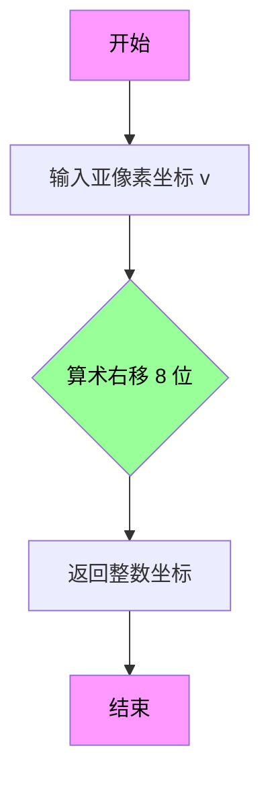

#### 带注释源码

```
//----------------------------------------------------------------------------
// Anti-Grain Geometry - Version 2.4
//----------------------------------------------------------------------------
// 类: line_bresenham_interpolator
// 方法: line_lr (静态方法)
//----------------------------------------------------------------------------

// 静态方法：将亚像素坐标转换为整数坐标
// 参数: v - 亚像素精度坐标值（固定点数格式，小数部分占8位）
// 返回值: int - 整数像素坐标值
static int line_lr(int v) 
{ 
    // 通过算术右移8位来提取整数部分
    // subpixel_shift = 8 表示亚像素精度为256 (2^8)
    // 例如: v = 0x0123 (十进制291) -> 返回 1 (291 / 256)
    return v >> subpixel_shift; 
}
```

#### 关键组件信息

| 组件名称 | 一句话描述 |
|---------|-----------|
| `line_bresenham_interpolator` | 实现Bresenham直线算法插值器，用于直线扫描转换 |
| `dda_line_interpolator` | 模板类，实现DDA（数字微分分析器）直线插值 |
| `dda2_line_interpolator` | 改进版DDA插值器，支持前向和后向调整 |
| `subpixel_shift` | 亚像素精度常量，值为8，表示1像素=256亚像素 |
| `line_lr` | 静态工具方法，将亚像素坐标转换为整数坐标 |

#### 技术债务与优化空间

1. **硬编码的移位量**：虽然 `subpixel_shift` 被定义为枚举值，但 `line_lr` 方法直接使用该常量而非参数化，若需要不同精度则需修改类定义
2. **缺乏溢出检查**：对于极端值（如 INT_MIN 或 INT_MAX），右移操作可能产生未定义行为
3. **命名可读性**：`line_lr` 的命名不够直观，建议改为 `subpixel_to_integer` 或 `pixel_coordinate`

#### 其它说明

- **设计目标**：该方法是Bresenham算法中坐标转换的核心工具，确保亚像素精度的起始和结束坐标能够正确转换为整数像素坐标
- **约束条件**：输入值 `v` 应为带符号整数，采用固定点数格式（小数部分占8位）
- **调用场景**：在 `line_bresenham_interpolator` 构造函数中用于初始化 `m_x1_lr`, `m_y1_lr`, `m_x2_lr`, `m_y2_lr` 等成员变量


### `dda_line_interpolator.operator++`

该函数是 `dda_line_interpolator` 类的前置自增运算符重载，用于在直线插值计算中累加增量值，使内部状态推进一个步长。

参数：无

返回值：`void`，无返回值描述

#### 流程图

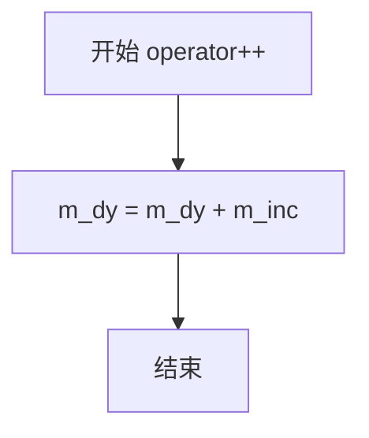

#### 带注释源码

```cpp
//--------------------------------------------------------------------
/// 前置自增运算符重载
/// 
/// 功能：将内部增量累加到累积值 m_dy 上，实现插值器状态向前推进一个步长
/// 
/// 实现原理：
///   - m_inc 是预先计算好的每步增量：((y2 - y1) << FractionShift) / count
///   - 每次调用 operator++ 时，将增量累加到 m_dy
///   - 后续通过 y() 方法可以获取当前插值点的 Y 坐标
//--------------------------------------------------------------------
void operator ++ ()
{
    m_dy += m_inc;  // 将步进增量累加到累积变量 m_dy
}
```


### `dda_line_interpolator.operator--`

该方法为dda_line_interpolator类的前置递减运算符，用于将内部累计值m_dy递减m_inc，实现沿直线反向插值。

参数：无

返回值：`void`，无返回值

#### 流程图

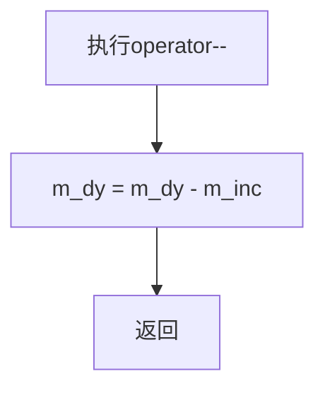

#### 带注释源码

```cpp
//--------------------------------------------------------------------
void operator -- ()
{
    // 将累计增量m_dy减去步进增量m_inc
    // 实现沿直线方向反向移动一个单位
    m_dy -= m_inc;
}
```


### `dda_line_interpolator.operator+=`

该方法用于将插值器内部累计值增加指定步数，通过将增量乘以步数后加到累积值上，实现跨越多个像素点的直线插值计算。

参数：

- `n`：`unsigned`，表示要前进的步数，即需要累加的增量倍数

返回值：`void`，无返回值描述

#### 流程图

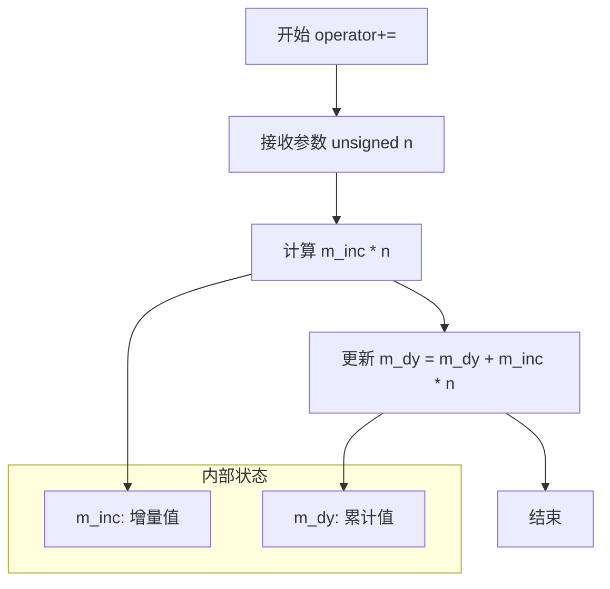

#### 带注释源码

```cpp
//--------------------------------------------------------------------
void operator += (unsigned n)
{
    // 将增量 m_inc 乘以步数 n，然后加到累计值 m_dy 上
    // 这实现了跳过 n 个像素点的插值计算
    // m_inc 在构造函数中根据 (y2-y1) << FractionShift / count 计算得出
    m_dy += m_inc * n;
}
```


### `dda_line_interpolator.operator-=`

该方法是一个重载的减法赋值运算符，用于在直线光栅化（Line Rasterization）或插值计算中，将插值器的内部状态（即当前累加值 `m_dy`）向后回退 `n` 个步长。这允许调用者快速跳过一段距离，而无需逐次调用递减运算符。

参数：

-  `n`：`unsigned int`，表示要向后回退的步数。

返回值：`void`，无返回值。

#### 流程图

```mermaid
flowchart TD
    A((Start)) --> B[输入: n (回退步数)]
    B --> C[计算回退增量: step = m_inc * n]
    C --> D[更新内部状态: m_dy = m_dy - step]
    D --> E((End))
```

#### 带注释源码

```cpp
        //--------------------------------------------------------------------
        // 该运算符用于将插值器倒回 n 步。
        // m_inc 是每个步长对应的固定点数增量 (scaled by FractionShift)。
        // m_dy 是当前累积的 Y 轴增量。
        // 通过一次性减去 n 倍的增量，可以直接定位到 n 步之前的位置。
        //--------------------------------------------------------------------
        void operator -= (unsigned n)
        {
            m_dy -= m_inc * n;
        }
```


### `dda_line_interpolator`

dda_line_interpolator 是一个模板类，实现了 DDA（数字微分分析仪）直线插值算法，用于在两点之间生成中间值。该类主要用于 Anti-Grain Geometry 库中的直线光栅化，提供固定点算术的精确插值功能。

参数：

- `FractionShift`：`int` 模板参数，控制分数精度（固定点算术的移位量）
- `YShift`：`int` 模板参数，可选的 Y 坐标移位值（默认为 0）
- `y1`：`int`，起始 Y 坐标
- `y2`：`int`，终止 Y 坐标
- `count`：`unsigned`，插值步数

返回值：`int`，返回当前插值的 Y 坐标值

#### 流程图

```mermaid
flowchart TD
    A[开始] --> B[初始化: m_y = y1]
    B --> C[计算增量: m_inc = (y2 - y1) << FractionShift / count]
    C --> D[设置m_dy = 0]
    D --> E{调用操作符}
    E --> F[++操作符: m_dy += m_inc]
    E --> G[--操作符: m_dy -= m_inc]
    E --> H[+=操作符: m_dy += m_inc * n]
    E --> I[-=操作符: m_dy -= m_inc * n]
    F --> J[y方法: return m_y + (m_dy >> (FractionShift - YShift))]
    G --> J
    H --> J
    I --> J
    J --> K[返回插值结果]
```

#### 带注释源码

```cpp
//===================================================dda_line_interpolator
// DDA直线插值器模板类
// FractionShift: 控制固定点算术的精度（移位量）
// YShift: 可选的Y坐标移位值，默认为0
template<int FractionShift, int YShift=0> class dda_line_interpolator
{
public:
    //--------------------------------------------------------------------
    // 默认构造函数
    dda_line_interpolator() {}

    //--------------------------------------------------------------------
    // 参数构造函数
    // y1: 起始Y坐标
    // y2: 终止Y坐标
    // count: 插值步数
    dda_line_interpolator(int y1, int y2, unsigned count) :
        m_y(y1),                          // 初始化当前Y值
        m_inc(((y2 - y1) << FractionShift) / int(count)),  // 计算固定点增量
        m_dy(0)                           // 初始累积增量为0
    {
    }

    //--------------------------------------------------------------------
    // 前置递增操作符：向前插值一步
    void operator ++ ()
    {
        m_dy += m_inc;  // 累加增量
    }

    //--------------------------------------------------------------------
    // 前置递减操作符：向后插值一步
    void operator -- ()
    {
        m_dy -= m_inc;  // 减去增量
    }

    //--------------------------------------------------------------------
    // 加法赋值操作符：向前插值n步
    void operator += (unsigned n)
    {
        m_dy += m_inc * n;  // 累加n个增量
    }

    //--------------------------------------------------------------------
    // 减法赋值操作符：向后插值n步
    void operator -= (unsigned n)
    {
        m_dy -= m_inc * n;  // 减去n个增量
    }


    //--------------------------------------------------------------------
    // 获取当前插值的Y坐标
    // 返回值：int类型的插值Y坐标
    int y()  const { return m_y + (m_dy >> (FractionShift-YShift)); }
    
    //--------------------------------------------------------------------
    // 获取当前的delta Y值
    // 返回值：int类型的累积增量
    int dy() const { return m_dy; }


private:
    int m_y;    // 当前Y基准值
    int m_inc;  // 固定点格式的增量值
    int m_dy;   // 累积的增量值（固定点格式）
};
```


### `dda_line_interpolator.dy`

该方法是DDA（Digital Differential Analyzer）直线插值器的成员函数，用于获取当前累积的增量值（m_dy），该值用于计算直线上的像素位置。

参数：
- （无参数）

返回值：`int`，返回累积的增量值m_dy，用于插值计算过程中的增量追踪。

#### 流程图

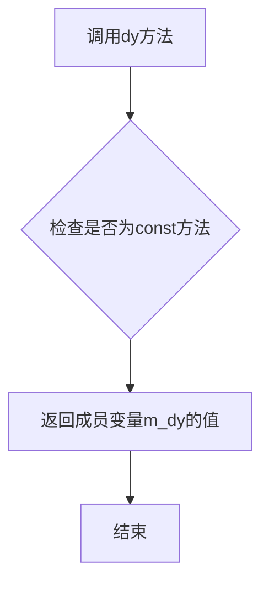

#### 带注释源码

```cpp
//--------------------------------------------------------------------
int dy() const { return m_dy; }
//--------------------------------------------------------------------
/*
 * 方法说明：
 * - 这是一个const成员函数，不会修改对象状态
 * - 返回成员变量m_dy的当前值
 * - m_dy是累积的增量值，通过operator++、operator--、operator+=、operator-=等操作更新
 * - 在计算直线插值时，m_dy与m_y结合通过y()方法计算当前y坐标
 *
 * 使用场景：
 * - 用于调试和验证插值计算过程
 * - 用于需要获取当前累积增量值的外部逻辑
 *
 * 与y()方法的关系：
 * - y()方法返回计算后的实际y坐标：m_y + (m_dy >> (FractionShift-YShift))
 * - dy()方法只返回原始的m_dy值，未经过位移计算
 */
```

#### 补充信息

**类完整信息**：

`dda_line_interpolator` 是一个模板类，用于DDA直线插值。

**类字段**：
- `m_y`：`int`，起始y坐标值
- `m_inc`：`int`，每步增量，计算公式为 `((y2 - y1) << FractionShift) / count`
- `m_dy`：`int`，累积增量，通过运算符重载操作

**类方法**：
- 构造函数：`dda_line_interpolator(int y1, int y2, unsigned count)`，初始化插值器
- `operator ++`：前向步进，增加累积增量
- `operator --`：后向步进，减少累积增量
- `operator +=`：增加n步
- `operator -=`：减少n步
- `y()`：返回计算后的y坐标
- `dy()`：返回累积增量（当前方法）

**设计目标**：
- 实现高效的直线插值算法
- 通过模板参数FractionShift和YShift支持不同精度要求

**潜在技术债务**：
- 缺少输入参数合法性检查（如count为0的情况）
- 没有异常处理机制
- 错误处理依赖于调用者保证参数正确性


### `dda2_line_interpolator.save`

该方法用于将dda2_line_interpolator插值器的当前内部状态（模值m_mod和当前y坐标m_y）保存到指定的整型数组中，以便后续可以通过load方法恢复状态。这是一个常函数（const），不会修改插值器自身的状态。

参数：

- `data`：`save_data_type*`（即`int*`），指向用于保存数据的数组，长度至少为2

返回值：`void`，无返回值

#### 流程图

```mermaid
flowchart TD
    A[开始 save] --> B{检查 data 指针有效性}
    B -->|有效| C[将 m_mod 写入 data[0]]
    C --> D[将 m_y 写入 data[1]]
    D --> E[结束 save]
    B -->|无效| F[直接返回]
    F --> E
```

#### 带注释源码

```cpp
//--------------------------------------------------------------------
// 保存插值器状态到数组
// @param data 指向整型数组的指针，用于存储插值器的当前状态
//             数组长度至少为2，data[0]存储m_mod，data[1]存储m_y
//--------------------------------------------------------------------
void save(save_data_type* data) const
{
    // 将当前模值（m_mod）保存到数组第一个元素
    // m_mod 表示 Bresenham 算法的误差累加器，用于决定何时增加y值
    data[0] = m_mod;
    
    // 将当前y坐标（m_y）保存到数组第二个元素
    // m_y 是插值线在当前x位置的y坐标值
    data[1] = m_y;
}
```


### `dda2_line_interpolator.load`

该方法用于从外部数据数组中恢复`dda2_line_interpolator`对象的内部状态，通常与`save`方法配合使用以实现插值器状态的保存和恢复功能。

参数：

- `data`：`const save_data_type*`，指向包含已保存状态的数组的指针，其中data[0]保存m_mod值，data[1]保存m_y值

返回值：`void`，无返回值

#### 流程图

```mermaid
flowchart TD
    A[开始 load 方法] --> B[读取 data[0]]
    B --> C[将 data[0] 赋值给 m_mod]
    C --> D[读取 data[1]]
    D --> E[将 data[1] 赋值给 m_y]
    E --> F[结束]
```

#### 带注释源码

```cpp
//--------------------------------------------------------------------
void load(const save_data_type* data)
{
    // 从保存的数据数组中恢复模值（m_mod）
    // data[0] 存储了之前 save() 时保存的 m_mod 值
    m_mod = data[0];
    
    // 从保存的数据数组中恢复当前y坐标（m_y）
    // data[1] 存储了之前 save() 时保存的 m_y 值
    m_y   = data[1];
}
```


### `dda2_line_interpolator::operator++`

该方法为 `dda2_line_interpolator` 类的前置自增运算符，用于在线段插值计算中向前移动到下一个采样点。它根据Bresenham线算法思想，通过整数运算精确计算每个采样点的y坐标，避免浮点运算开销。

参数： 无

返回值：`void`，无返回值

#### 流程图

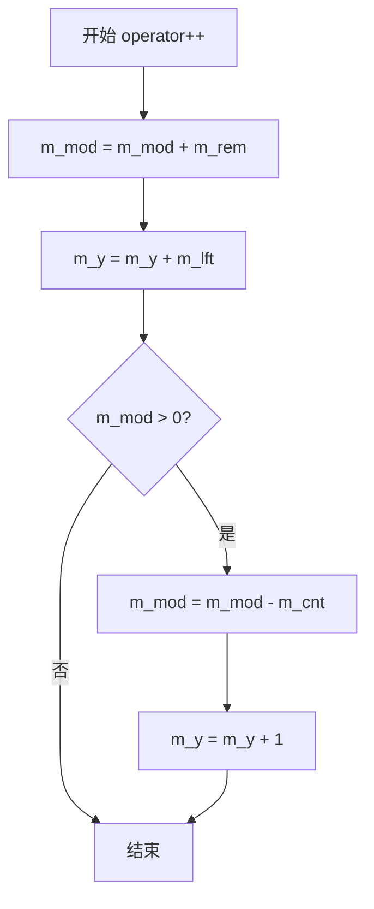

#### 带注释源码

```cpp
//--------------------------------------------------------------------
void operator++()
{
    // 将余数累加到模值，用于决定何时增加y坐标
    m_mod += m_rem;
    
    // 基础步长：加上左因子（整数除法的商）
    m_y += m_lft;
    
    // 如果模值大于0，说明需要额外增加一个像素
    // 这是Bresenham算法处理斜率误差的核心逻辑
    if(m_mod > 0)
    {
        // 从模值中减去总步数，相当于"归还"多借的步长
        m_mod -= m_cnt;
        
        // y坐标额外增加1，表示在该采样点y坐标要向上移动一行
        m_y++;
    }
}
```

#### 技术说明

该实现采用了**Bresenham直线算法**的整数变体：
- `m_cnt` 表示总步数（像素数量）
- `m_rem` 表示余数（y2-y1除以count的余数）
- `m_lft` 表示左因子（整数商）
- `m_mod` 是累积的模值，用于决定何时"借位"

当 `m_mod > 0` 时，表明累积误差超过了阈值，需要在本步额外增加y值，从而保证在count步后精确到达目标y坐标。


### `dda2_line_interpolator.operator--`

该方法为`dda2_line_interpolator`类的后置递减运算符重载，用于在线段绘制时向后（反向）移动插值器的状态，通过模运算和余数比较来计算每一步的y坐标变化，实现Bresenham直线算法中的后向步进。

参数：（无参数）

返回值：`void`，无返回值

#### 流程图

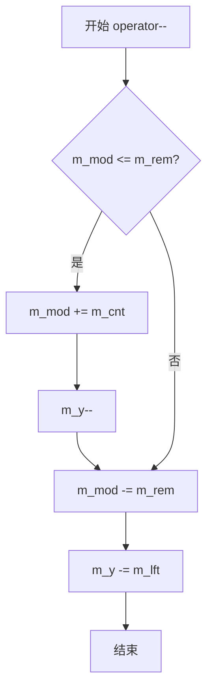

#### 带注释源码

```cpp
//--------------------------------------------------------------------
void operator--()
{
    // 如果当前模值小于等于余数，需要先进行调整
    // 这是因为在反向迭代时，当模值不足时需要"借用"一个计数单位
    if(m_mod <= m_rem)
    {
        // 加上计数，调整模值
        m_mod += m_cnt;
        // y坐标后退一步
        m_y--;
    }
    
    // 模值减去余数
    m_mod -= m_rem;
    // y坐标减去左移值（每一步的基础增量）
    m_y -= m_lft;
}
```

#### 详细说明

该方法是`dda2_line_interpolator`类的后向递减运算符，用于在直线插值过程中向后移动。与前向递增`operator++`相对应，`operator--`实现了反向的Bresenham直线算法逻辑：

- **m_mod**：当前累积的模值，用于决定何时需要额外的步进
- **m_rem**：余数，表示y方向总变化量除以步数的余数
- **m_lft**：左移值（商），表示每一步的基础y增量
- **m_cnt**：总步数（计数）
- **m_y**：当前y坐标

算法逻辑：
1. 如果当前模值小于等于余数，说明需要"借用"一个步进来补偿，因此先加上计数并减少y
2. 然后用模减去余数，y减去基础增量
3. 这样可以确保在反向遍历时得到与正向遍历对称的坐标序列


### `dda2_line_interpolator.adjust_forward`

该方法用于在正向插值过程中调整内部模值，通过将成员变量 `m_mod` 减去 `m_cnt` 来实现前向调整，为后续的直线步进计算做准备。

参数：
- （无参数）

返回值：`void`，无返回值

#### 流程图

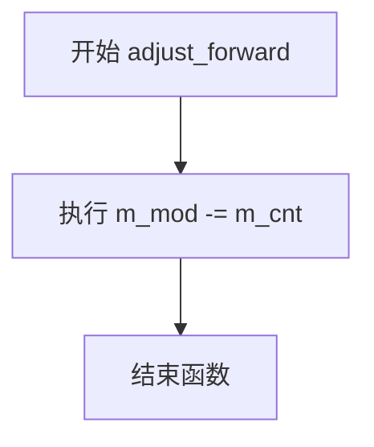

#### 带注释源码

```cpp
//--------------------------------------------------------------------
void adjust_forward()
{
    // 将内部模值 m_mod 减去总步数 m_cnt
    // 这个操作用于在前向迭代前调整误差项
    // 通常在直线绘制算法中与 operator++ 配合使用
    // 用于在绘制直线时正确计算每个采样点的位置
    m_mod -= m_cnt;
}
```

#### 类 `dda2_line_interpolator` 完整信息

**类字段：**
- `m_cnt`：`int`，总步数或迭代次数
- `m_lft`：`int`，左侧调整值（整数部分）
- `m_rem`：`int`，余数（误差项的余数部分）
- `m_mod`：`int`，模调整值（误差项的当前累积值）
- `m_y`：`int`，当前y坐标值

**类方法：**
- 构造函数 `dda2_line_interpolator(int y1, int y2, int count)`：前向调整的直线插值器初始化
- 构造函数 `dda2_line_interpolator(int y1, int y2, int count, int)`：后向调整的直线插值器初始化
- 构造函数 `dda2_line_interpolator(int y, int count)`：仅使用y值的初始化
- `save(save_data_type* data)`：保存当前状态到数组
- `load(const save_data_type* data)`：从数组加载状态
- `operator++()`：前向迭代运算符
- `operator--()`：后向迭代运算符
- `adjust_forward()`：前向调整方法（当前方法）
- `adjust_backward()`：后向调整方法
- `mod()`：获取当前模值
- `rem()`：获取余数
- `lft()`：获取左侧值
- `y()`：获取当前y坐标


### `dda2_line_interpolator.adjust_backward`

该方法是 `dda2_line_interpolator` 类的成员函数，用于执行向后调整操作。它将成员变量 `m_cnt` 加到 `m_mod` 上，以调整插值器的状态，实现向后（逆序）遍历线段时的修正。该方法常与 `operator--` 配合使用，用于Bresenham直线算法中的逆向插值计算。

参数：无需参数

返回值：`void`，无返回值

#### 流程图

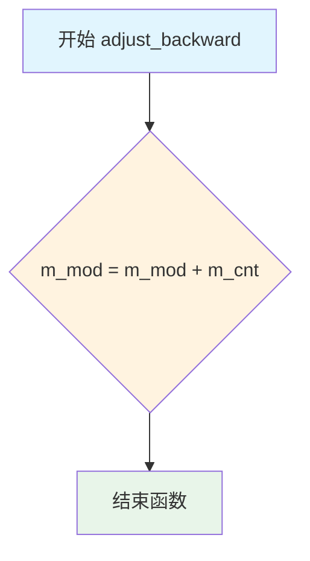

#### 带注释源码

```
//--------------------------------------------------------------------
void adjust_backward()
{
    // 将 m_cnt 加到 m_mod 上，实现向后调整
    // m_mod: 当前累加器/调制值
    // m_cnt: 迭代总数（线段步数）
    // 此操作通常与 operator-- 配合使用，在逆向遍历线段时
    // 调整插值器的内部状态，确保正确的像素步进
    m_mod += m_cnt;
}
```

#### 关联信息

**所属类**：`dda2_line_interpolator`

**类功能描述**：
`dda2_line_interpolator` 是一个用于直线插值的类，实现了DDA（数字微分分析器）算法的变体，专门优化用于Bresenham直线绘制算法中的Y坐标插值。该类通过整数运算模拟浮点数线性插值，支持前向调整（`adjust_forward`）和后向调整（`adjust_forward`）两种模式。

**类字段**：
- `m_cnt`：`int` 类型，表示线段的步数（迭代次数）
- `m_lft`：`int` 类型，表示每次迭代的整数部分增量
- `m_rem`：`int` 类型，表示除法余数
- `m_mod`：`int` 类型，当前累加/调制值，用于决定何时增加y值
- `m_y`：`int` 类型，当前y坐标值

**相关方法**：
- `adjust_forward()`：向前调整，将 `m_cnt` 从 `m_mod` 中减去
- `operator++()`：前向迭代运算符
- `operator--()`：后向迭代运算符
- `mod()`：返回当前的 `m_mod` 值
- `rem()`：返回 `m_rem` 值
- `lft()`：返回 `m_lft` 值
- `y()`：返回当前y坐标 `m_y`


### `agg.dda2_line_interpolator`

dda2_line_interpolator 是一个用于直线光栅化的数字微分分析器（DDA）插值器类，通过整数运算实现高效的直线插值，用于计算直线在光栅设备上的离散坐标点。

参数：

构造函数：

- `()`：默认构造函数，无参数
- `(int y1, int y2, int count)`：前向调整直线插值器
  - `y1`：`int`，起始y坐标
  - `y2`：`int`，结束y坐标  
  - `count`：`int`，步数/点数
- `(int y1, int y2, int count, int)`：后向调整直线插值器（第四个参数为哑元）
- `(int y, int count)`：后向调整直线插值器（从0开始）

方法参数：

- `save(save_data_type* data)`：
  - `data`：`save_data_type*`，保存数据的数组指针
- `load(const save_data_type* data)`：
  - `data`：`const save_data_type*`，要加载的数据数组指针

返回值：

- `save()`：`void`，无返回值
- `load()`：`void`，无返回值
- `operator++()`：`void`，无返回值，前向移动插值器
- `operator--()`：`void`，无返回值，后向移动插值器
- `adjust_forward()`：`void`，无返回值，前向调整
- `adjust_backward()`：`void`，无返回值，后向调整
- `mod()`：`int`，返回模值
- `rem()`：`int`，返回余数
- `lft()`：`int`，返回左侧增量
- `y()`：`int`，返回当前y坐标

#### 流程图

```mermaid
graph TD
    A[创建 dda2_line_interpolator] --> B{构造函数类型}
    B --> C[默认构造]
    B --> D[前向调整构造 y1, y2, count]
    B --> E[后向调整构造 y1, y2, count, 哑元]
    B --> F[后向调整构造 y, count]
    
    C --> G[初始化成员变量为0/默认值]
    D --> H[计算 m_lft = (y2-y1)/m_cnt<br/>m_rem = (y2-y1)%m_cnt<br/>m_mod = m_rem]
    E --> H
    F --> I[计算 m_lft = y/m_cnt<br/>m_rem = y%m_cnt<br/>m_mod = m_rem]
    
    H --> J{m_mod <= 0?}
    I --> J
    J -->|是| K[m_mod += count<br/>m_rem += count<br/>m_lft--]
    J -->|否| L[m_mod -= count]
    K --> L
    
    L --> M[正常工作状态]
    
    M --> N[operator++]
    N --> O[m_mod += m_rem<br/>m_y += m_lft<br/>m_mod > 0?]
    O -->|是| P[m_mod -= m_cnt<br/>m_y++]
    O -->|否| Q[保持当前值]
    P --> R[返回新坐标]
    Q --> R
    
    M --> S[operator--]
    S --> T{m_mod <= m_rem?}
    T -->|是| U[m_mod += m_cnt<br/>m_y--]
    T -->|否| V[m_mod -= m_rem<br/>m_y -= m_lft]
    U --> W[返回新坐标]
    V --> W
    
    M --> X[save/load]
    X --> Y[保存/恢复 m_mod 和 m_y 状态]
```

#### 带注释源码

```cpp
//=================================================dda2_line_interpolator
// DDA2直线插值器类 - 用于直线光栅化
class dda2_line_interpolator
{
public:
    // 保存数据类型定义
    typedef int save_data_type;
    // 保存数据大小（2个int值：m_mod 和 m_y）
    enum save_data_e { save_size = 2 };

    //--------------------------------------------------------------------
    // 默认构造函数
    dda2_line_interpolator() {}

    //-------------------------------------------- Forward-adjusted line
    // 前向调整直线插值器构造函数
    // 参数：y1-起始y坐标, y2-结束y坐标, count-步数
    dda2_line_interpolator(int y1, int y2, int count) :
        m_cnt(count <= 0 ? 1 : count),  // 确保count至少为1
        m_lft((y2 - y1) / m_cnt),        // 整数除法得到线性增量
        m_rem((y2 - y1) % m_cnt),        // 余数
        m_mod(m_rem),                    // 初始模值等于余数
        m_y(y1)                          // 初始y坐标
    {
        if(m_mod <= 0)                   // 如果模值<=0，需要调整
        {
            m_mod += count;              // 调整模值
            m_rem += count;              // 调整余数
            m_lft--;                     // 线性增量减1
        }
        m_mod -= count;                  // 初始调整（向前一步）
    }

    //-------------------------------------------- Backward-adjusted line
    // 后向调整直线插值器构造函数（第三个参数为哑元，用于区分重载）
    dda2_line_interpolator(int y1, int y2, int count, int) :
        m_cnt(count <= 0 ? 1 : count),
        m_lft((y2 - y1) / m_cnt),
        m_rem((y2 - y1) % m_cnt),
        m_mod(m_rem),
        m_y(y1)
    {
        if(m_mod <= 0)
        {
            m_mod += count;
            m_rem += count;
            m_lft--;
        }
        // 注意：此处没有 m_mod -= count，这是与前向调整的区别
    }

    //-------------------------------------------- Backward-adjusted line
    // 后向调整直线插值器（从y=0开始）
    dda2_line_interpolator(int y, int count) :
        m_cnt(count <= 0 ? 1 : count),
        m_lft(y / m_cnt),
        m_rem(y % m_cnt),
        m_mod(m_rem),
        m_y(0)                           // 初始y从0开始
    {
        if(m_mod <= 0)
        {
            m_mod += count;
            m_rem += count;
            m_lft--;
        }
    }


    //--------------------------------------------------------------------
    // 保存插值器状态
    // data[0] 保存 m_mod, data[1] 保存 m_y
    void save(save_data_type* data) const
    {
        data[0] = m_mod;
        data[1] = m_y;
    }

    //--------------------------------------------------------------------
    // 加载插值器状态
    void load(const save_data_type* data)
    {
        m_mod = data[0];
        m_y   = data[1];
    }

    //--------------------------------------------------------------------
    // 前向运算符++：移动到下一个点
    // 使用Bresenham算法思想，通过整数运算避免浮点
    void operator++()
    {
        m_mod += m_rem;                  // 累加余数
        m_y += m_lft;                    // 加上线性增量
        if(m_mod > 0)                    // 如果模值大于0
        {
            m_mod -= m_cnt;              // 减去步数
            m_y++;                       // y坐标额外加1（处理"进位"）
        }
    }

    //--------------------------------------------------------------------
    // 后向运算符--：移动到上一个点
    void operator--()
    {
        if(m_mod <= m_rem)               // 如果模值<=余数
        {
            m_mod += m_cnt;              // 加上步数
            m_y--;                       // y坐标减1
        }
        m_mod -= m_rem;                  // 减去余数
        m_y -= m_lft;                    // 减去线性增量
    }

    //--------------------------------------------------------------------
    // 前向调整：预先调整模值
    void adjust_forward()
    {
        m_mod -= m_cnt;
    }

    //--------------------------------------------------------------------
    // 后向调整：预先调整模值
    void adjust_backward()
    {
        m_mod += m_cnt;
    }

    //--------------------------------------------------------------------
    // 获取模值
    int mod() const { return m_mod; }
    // 获取余数
    int rem() const { return m_rem; }
    // 获取左侧增量（整数除法结果）
    int lft() const { return m_lft; }

    //--------------------------------------------------------------------
    // 获取当前y坐标
    int y() const { return m_y; }

private:
    int m_cnt;    // 步数计数器
    int m_lft;    // 左侧增量（线性增量，整数除法结果）
    int m_rem;    // 余数（整数取模结果）
    int m_mod;    // 模值（用于Bresenham式调整）
    int m_y;      // 当前y坐标
};
```


### `dda2_line_interpolator`

dda2_line_interpolator 类是 Anti-Grain Geometry 库中用于直线插值的核心类，采用数字微分分析仪（DDA）算法实现。该类通过整数运算高效地计算直线上的Y坐标值，支持前向和后向两种调整模式，常用于光栅图形绘制中的扫描线插值。

参数：

- `y1`：`int`，直线的起始Y坐标
- `y2`：`int`，直线的结束Y坐标
- `count`：`int`，分割数量（即直线经过的像素点数）
- `data`：`const save_data_type*`，保存状态数据的数组指针（用于load方法）
- `save_data_type* data`：保存状态数据的数组指针（用于save方法）

返回值：大部分方法返回 `int` 类型的值，表示相应的坐标或参数；`save` 和 `load` 方法返回 `void`。

#### 流程图

```mermaid
flowchart TD
    A[开始] --> B{构造函数类型}
    
    B --> C[前向调整构造函数<br/>dda2_line_interpolator(y1, y2, count)]
    B --> D[后向调整构造函数<br/>dda2_line_interpolator(y1, y2, count, dummy)]
    B --> E[简化后向调整构造函数<br/>dda2_line_interpolator(y, count)]
    
    C --> F[计算m_cnt = max(1, count)]
    D --> F
    E --> F
    
    F --> G[计算m_lft = (y2-y1) / m_cnt<br/>m_rem = (y2-y1) % m_cnt]
    G --> H[m_mod = m_rem]
    H --> I{m_mod <= 0?}
    I -->|是| J[m_mod += count<br/>m_rem += count<br/>m_lft--]
    I -->|否| K[m_mod -= count]
    J --> L[初始化完成<br/>m_y = y1 或 0]
    K --> L
    
    L --> M[operator++]
    M --> N[m_mod += m_rem<br/>m_y += m_lft]
    N --> O{m_mod > 0?}
    O -->|是| P[m_mod -= m_cnt<br/>m_y++]
    O -->|否| Q[返回当前m_y]
    P --> Q
    
    L --> R[operator--]
    R --> S{m_mod <= m_rem?}
    S -->|是| T[m_mod += m_cnt<br/>m_y--]
    S --> U[m_mod -= m_rem<br/>m_y -= m_lft]
    T --> U
    
    L --> V[adjust_forward<br/>m_mod -= m_cnt]
    L --> W[adjust_backward<br/>m_mod += m_cnt]
    
    L --> X[save/load<br/>保存/恢复状态]
    
    M --> Y[返回插值后的y坐标]
    R --> Y
    V --> Y
    W --> Y
    X --> Y
```

#### 带注释源码

```cpp
//=================================================dda2_line_interpolator
// DDA2直线插值器类 - 使用整数运算进行高效直线插值
class dda2_line_interpolator
{
public:
    // 保存数据类型定义
    typedef int save_data_type;
    // 保存数据大小（2个int值：m_mod和m_y）
    enum save_size_e { save_size = 2 };

    //--------------------------------------------------------------------
    // 默认构造函数
    dda2_line_interpolator() {}

    //-------------------------------------------- Forward-adjusted line
    // 前向调整直线插值构造函数
    // 参数: y1-起始Y坐标, y2-结束Y坐标, count-分割数
    dda2_line_interpolator(int y1, int y2, int count) :
        // 确保count至少为1，避免除零错误
        m_cnt(count <= 0 ? 1 : count),
        // 计算整数部分（每步的Y增量）
        m_lft((y2 - y1) / m_cnt),
        // 计算余数部分
        m_rem((y2 - y1) % m_cnt),
        // 初始化模值
        m_mod(m_rem),
        // 初始化当前Y坐标
        m_y(y1)
    {
        // 处理负余数情况，进行前向调整
        if(m_mod <= 0)
        {
            m_mod += count;   // 调整模值
            m_rem += count;   // 调整余数
            m_lft--;          // 减少左值
        }
        // 初始调整，为第一次迭代做准备
        m_mod -= count;
    }

    //-------------------------------------------- Backward-adjusted line
    // 后向调整直线插值构造函数（带额外参数区分）
    dda2_line_interpolator(int y1, int y2, int count, int) :
        m_cnt(count <= 0 ? 1 : count),
        m_lft((y2 - y1) / m_cnt),
        m_rem((y2 - y1) % m_cnt),
        m_mod(m_rem),
        m_y(y1)
    {
        // 处理负余数，进行后向调整
        if(m_mod <= 0)
        {
            m_mod += count;
            m_rem += count;
            m_lft--;
        }
        // 注意：这里没有初始的m_mod调整
    }

    //-------------------------------------------- Backward-adjusted line
    // 简化版后向调整构造函数（用于从0开始的插值）
    dda2_line_interpolator(int y, int count) :
        m_cnt(count <= 0 ? 1 : count),
        m_lft(y / m_cnt),
        m_rem(y % m_cnt),
        m_mod(m_rem),
        m_y(0)
    {
        if(m_mod <= 0)
        {
            m_mod += count;
            m_rem += count;
            m_lft--;
        }
    }

    //--------------------------------------------------------------------
    // 保存当前插值状态到数组
    // 参数: data-保存数据的数组（至少2个元素）
    void save(save_data_type* data) const
    {
        data[0] = m_mod;  // 保存模值
        data[1] = m_y;    // 保存当前Y坐标
    }

    //--------------------------------------------------------------------
    // 从数组加载插值状态
    // 参数: data-保存数据的数组（至少2个元素）
    void load(const save_data_type* data)
    {
        m_mod = data[0];  // 恢复模值
        m_y   = data[1];  // 恢复当前Y坐标
    }

    //--------------------------------------------------------------------
    // 前向迭代运算符：移动到下一个像素位置
    void operator++()
    {
        m_mod += m_rem;   // 累加余数
        m_y += m_lft;     // 加上基础增量
        // 如果模值大于0，需要额外调整（处理余数累积）
        if(m_mod > 0)
        {
            m_mod -= m_cnt;  // 减去总数，调整模值
            m_y++;           // Y坐标加1（处理进位）
        }
    }

    //--------------------------------------------------------------------
    // 后向迭代运算符：移动到上一个像素位置
    void operator--()
    {
        // 检查是否需要向后调整
        if(m_mod <= m_rem)
        {
            m_mod += m_cnt;  // 加上总数进行调整
            m_y--;           // Y坐标减1
        }
        m_mod -= m_rem;      // 减去余数
        m_y -= m_lft;        // 减去基础增量
    }

    //--------------------------------------------------------------------
    // 前向调整：减少模值，为前向扫描做准备
    void adjust_forward()
    {
        m_mod -= m_cnt;
    }

    //--------------------------------------------------------------------
    // 后向调整：增加模值，为后向扫描做准备
    void adjust_backward()
    {
        m_mod += m_cnt;
    }

    //--------------------------------------------------------------------
    // 获取当前模值
    int mod() const { return m_mod; }
    // 获取余数
    int rem() const { return m_rem; }
    // 获取左值（每步的基础增量）
    int lft() const { return m_lft; }

    //--------------------------------------------------------------------
    // 获取当前插值的Y坐标
    int y() const { return m_y; }

private:
    int m_cnt;    // 分割数（总数）
    int m_lft;    // 左值（整数部分增量）
    int m_rem;    // 余数
    int m_mod;    // 模值（用于累积调整）
    int m_y;      // 当前Y坐标
};
```


### `dda2_line_interpolator.lft`

该方法是一个简单的getter函数，用于获取线段插值器中的左侧调整值（m_lft），该值表示在Bresenham直线算法中进行后向调整时的基础增量。

参数：无

返回值：`int`，返回线段插值的左侧调整值（m_lft），即直线y坐标变化的基础增量（floor((y2-y1)/count)）。

#### 流程图

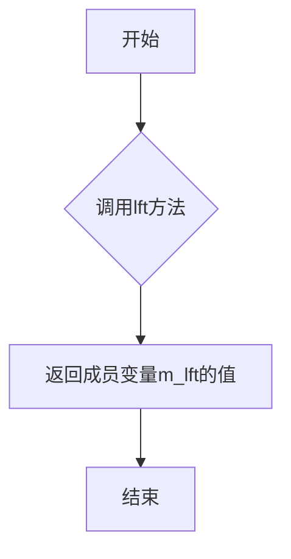

#### 带注释源码

```cpp
//--------------------------------------------------------------------
/// 获取左侧调整值（left adjustment）
/// 
/// 该方法返回直线插值中的左侧调整值，即直线y坐标变化的基础增量。
/// 在后向调整（backward-adjusted）的Bresenham算法中，m_lft表示
/// floor((y2-y1)/count)的值，用于在每个步骤中更新y坐标。
///
/// @return int 返回m_lft成员变量的值，表示直线的基础增量
//--------------------------------------------------------------------
int lft() const { return m_lft; }
```

#### 相关成员变量信息

| 名称 | 类型 | 描述 |
|------|------|------|
| `m_cnt` | `int` | 插值步骤总数（count），至少为1 |
| `m_lft` | `int` | 左侧调整值，表示直线y坐标变化的基础增量（(y2-y1)/count的整数部分） |
| `m_rem` | `int` | 余数，表示(y2-y1)%count的余数部分 |
| `m_mod` | `int` | 当前模值，用于决定何时进行额外的y坐标调整 |
| `m_y` | `int` | 当前y坐标值 |


### `dda2_line_interpolator.y`

该方法是 `dda2_line_interpolator` 类的成员方法，用于获取直线插值过程中当前的y坐标值，是Bresenham直线算法实现中的关键访问器。

参数： 无

返回值：`int`，返回当前插值计算过程中的y坐标值 `m_y`

#### 流程图

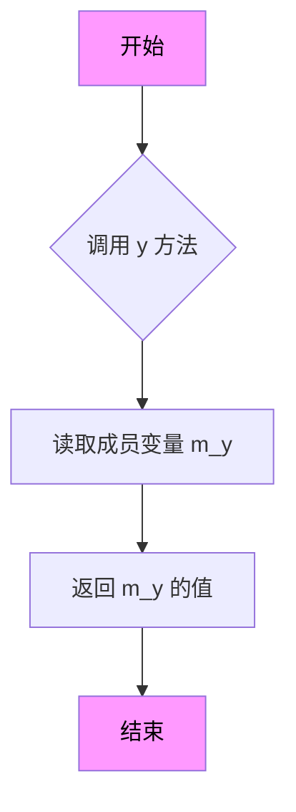

#### 带注释源码

```cpp
//--------------------------------------------------------------------
/// 获取当前插值点的y坐标值
/// 
/// 该方法返回直线插值计算过程中累积的y坐标值。
/// 在Bresenham直线算法中，y坐标会根据误差项的累积决定是否递增。
/// 
/// @return int 返回当前的y坐标值（整型）
/// 
/// @note 这是一个const方法，不会修改对象状态
/// @note 返回值直接反映当前插值位置
int y() const { return m_y; }
```

#### 完整类结构参考

```cpp
//=================================================dda2_line_interpolator
class dda2_line_interpolator
{
public:
    typedef int save_data_type;
    enum save_size_e { save_size = 2 };

    //--------------------------------------------------------------------
    // 构造函数 - 前向调整直线插值器
    dda2_line_interpolator(int y1, int y2, int count);
    
    //--------------------------------------------------------------------
    // 构造函数 - 后向调整直线插值器
    dda2_line_interpolator(int y1, int y2, int count, int);
    
    //--------------------------------------------------------------------
    // 构造函数 - 简化版本
    dda2_line_interpolator(int y, int count);

    //--------------------------------------------------------------------
    // 保存插值器状态
    void save(save_data_type* data) const;
    
    //--------------------------------------------------------------------
    // 加载插值器状态
    void load(const save_data_type* data);

    //--------------------------------------------------------------------
    // 前向迭代运算符
    void operator++();
    
    //--------------------------------------------------------------------
    // 后向迭代运算符
    void operator--();

    //--------------------------------------------------------------------
    // 前向调整
    void adjust_forward();
    
    //--------------------------------------------------------------------
    // 后向调整
    void adjust_backward();

    //--------------------------------------------------------------------
    // 获取误差修正值
    int mod() const;
    
    //--------------------------------------------------------------------
    // 获取余数
    int rem() const;
    
    //--------------------------------------------------------------------
    // 获取步进值
    int lft() const;

    //--------------------------------------------------------------------
    // 获取当前y坐标值 ← 本方法
    int y() const;

private:
    int m_cnt;   // 步进总数
    int m_lft;   // 左侧步进值（商）
    int m_rem;   // 余数
    int m_mod;   // 误差修正值
    int m_y;     // 当前y坐标
};
```


### `line_bresenham_interpolator.line_lr`

这是一个静态成员函数，用于将亚像素精度的坐标值转换为整数坐标值。它通过按位右移操作（相当于除以2的subpixel_shift次方）将亚像素坐标转换为像素坐标。

参数：

- `v`：`int`，输入的亚像素精度坐标值（通常是经过亚像素缩放的整数）

返回值：`int`，转换后的整数坐标值（像素坐标）

#### 流程图

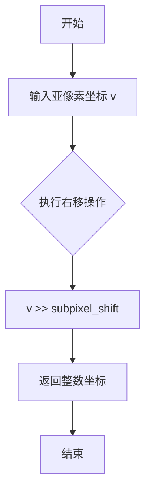

#### 带注释源码

```cpp
//--------------------------------------------------------------------
static int line_lr(int v) { return v >> subpixel_shift; }
//--------------------------------------------------------------------
/**
 * 将亚像素坐标转换为整数坐标
 * @param v 亚像素坐标值（int类型）
 * @return 整数坐标值（int类型）
 * 
 * 实现原理：
 * - subpixel_shift = 8
 * - subpixel_scale = 256 (1 << 8)
 * - 通过右移8位实现除以256的整数除法
 * - 等价于: v / 256
 * 
 * 示例：
 * - 输入: v = 512 (表示2个像素)
 * - 输出: 2 (512 >> 8 = 2)
 */
```


### `line_bresenham_interpolator.is_ver`

该方法用于判断当前直线插值器是否工作在垂直模式（即线段在垂直方向上的投影长度大于水平方向，表示线条更陡峭）。

参数：
- 无

返回值：`bool`，如果线段更接近垂直方向（`|Δx| < |Δy|`），返回 `true`；否则返回 `false`。

#### 流程图

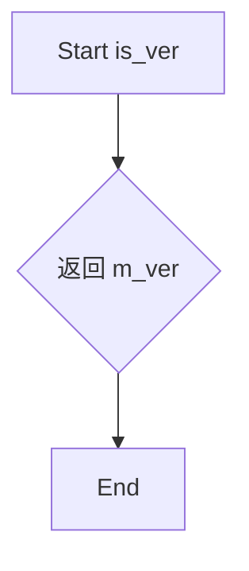

#### 带注释源码

```cpp
//--------------------------------------------------------------------
/// 判断是否为垂直模式。
/// 如果水平差值的绝对值小于垂直差值的绝对值，
/// 则线段更陡峭，视为垂直模式，返回 true。
bool is_ver() const { return m_ver; }
```


### `line_bresenham_interpolator.len`

该方法用于获取Bresenham线段插值器的线段长度，返回线段在主方向上的像素距离（根据线段是垂直还是水平走向，返回Δx或Δy的绝对值）。

参数： 无

返回值：`unsigned`，返回线段的长度（以像素为单位），即线段在主移动方向上的步数。

#### 流程图

```mermaid
flowchart TD
    A[开始 len 方法] --> B{const方法}
    B --> C[直接返回成员变量 m_len]
    C --> D[结束，返回 unsigned 类型的线段长度]
    
    style A fill:#f9f,color:#000
    style C fill:#9f9,color:#000
    style D fill:#ff9,color:#000
```

#### 带注释源码

```cpp
//--------------------------------------------------------------------
/// 获取线段长度
/// @return unsigned 返回线段在主方向上的像素距离
///         如果是垂直线（|Δx| < |Δy|），返回 |y2 - y1|
///         如果是水平线（|Δx| >= |Δy|），返回 |x2 - x1|
//--------------------------------------------------------------------
unsigned len() const 
{ 
    return m_len;  // 返回预先计算的线段长度（像素单位）
}
```


### `line_bresenham_interpolator`

该类是Anti-Grain Geometry库中的Bresenham直线插值器实现，用于在低分辨率整数坐标和高分辨率亚像素坐标之间进行线性插值，支持水平步进和垂直步进两种模式，适用于光栅图形渲染中的直线扫描转换。

参数：

-  `x1`：`int`，直线起点的X坐标（亚像素精度）
-  `y1`：`int`，直线起点的Y坐标（亚像素精度）
-  `x2`：`int`，直线终点的X坐标（亚像素精度）
-  `y2`：`int`，直线终点的Y坐标（亚像素精度）

返回值：无（构造函数）

#### 流程图

```mermaid
graph TD
    A[开始] --> B[计算低分辨率坐标<br/>m_x1_lr = x1 >> 8<br/>m_y1_lr = y1 >> 8<br/>m_x2_lr = x2 >> 8<br/>m_y2_lr = y2 >> 8]
    B --> C{判断方向<br/>abs(m_x2_lr - m_x1_lr) < abs(m_y2_lr - m_y1_lr)?}
    C -->|是| D[设置垂直模式<br/>m_ver = true<br/>m_len = abs(m_y2_lr - m_y1_lr)<br/>m_inc = (y2 > y1) ? 1 : -1]
    C -->|否| E[设置水平模式<br/>m_ver = false<br/>m_len = abs(m_x2_lr - m_x1_lr)<br/>m_inc = (x2 > x1) ? 1 : -1]
    D --> F[初始化DDA插值器<br/>使用x1,x2作为参数]
    E --> F
    F --> G[结束]

    H[hstep方法] --> H1[m_interpolator++<br/>m_x1_lr += m_inc]
    H1 --> H2[结束]

    I[vstep方法] --> I1[m_interpolator++<br/>m_y1_lr += m_inc]
    I1 --> I2[结束]
```

#### 带注释源码

```cpp
//---------------------------------------------line_bresenham_interpolator
class line_bresenham_interpolator
{
public:
    // 枚举定义：亚像素精度配置
    enum subpixel_scale_e
    {
        subpixel_shift = 8,          // 亚像素位移量（2^8 = 256）
        subpixel_scale = 1 << subpixel_shift,  // 亚像素比例因子 = 256
        subpixel_mask  = subpixel_scale - 1     // 亚像素掩码 = 255
    };

    //--------------------------------------------------------------------
    // 静态方法：将亚像素坐标转换为低分辨率整数坐标
    // 参数：v - 亚像素精度的值
    // 返回：右移8位后的整数值
    static int line_lr(int v) { return v >> subpixel_shift; }

    //--------------------------------------------------------------------
    // 构造函数：初始化Bresenham插值器
    // 参数：x1,y1 - 起点坐标；x2,y2 - 终点坐标（均为亚像素精度）
    line_bresenham_interpolator(int x1, int y1, int x2, int y2) :
        m_x1_lr(line_lr(x1)),                    // 起点X低分辨率值
        m_y1_lr(line_lr(y1)),                    // 起点Y低分辨率值
        m_x2_lr(line_lr(x2)),                    // 终点X低分辨率值
        m_y2_lr(line_lr(y2)),                    // 终点Y低分辨率值
        m_ver(abs(m_x2_lr - m_x1_lr) < abs(m_y2_lr - m_y1_lr)),  // 判断是否垂直主导
        m_len(m_ver ? abs(m_y2_lr - m_y1_lr) :   // 线段长度（像素数）
                      abs(m_x2_lr - m_x1_lr)),
        m_inc(m_ver ? ((y2 > y1) ? 1 : -1) :      // 步进方向：垂直模式用Y，水平模式用X
                      ((x2 > x1) ? 1 : -1)),
        m_interpolator(m_ver ? x1 : y1,          // 根据模式选择DDA插值的起点
                       m_ver ? x2 : y2,          // 根据模式选择DDA插值的终点
                       m_len)                    // 插值步数
    {
    }
    
    //--------------------------------------------------------------------
    // 判断是否为垂直模式（线条斜率绝对值大于1）
    bool     is_ver() const { return m_ver; }
    // 获取线段长度
    unsigned len()    const { return m_len; }
    // 获取步进方向
    int      inc()    const { return m_inc; }

    //--------------------------------------------------------------------
    // 水平步进：在水平方向移动一个像素
    // 同时更新DDA插值器和当前X坐标
    void hstep()
    {
        ++m_interpolator;       // DDA插值器前进一步
        m_x1_lr += m_inc;       // X坐标按步进方向移动
    }

    //--------------------------------------------------------------------
    // 垂直步进：在垂直方向移动一个像素
    // 同时更新DDA插值器和当前Y坐标
    void vstep()
    {
        ++m_interpolator;       // DDA插值器前进一步
        m_y1_lr += m_inc;       // Y坐标按步进方向移动
    }

    //--------------------------------------------------------------------
    // 获取起点坐标（低分辨率）
    int x1() const { return m_x1_lr; }
    int y1() const { return m_y1_lr; }
    
    // 获取终点坐标（从DDA插值器计算得到的低分辨率值）
    int x2() const { return line_lr(m_interpolator.y()); }
    int y2() const { return line_lr(m_interpolator.y()); }
    
    // 获取终点的高分辨率坐标（亚像素精度）
    int x2_hr() const { return m_interpolator.y(); }
    int y2_hr() const { return m_interpolator.y(); }

private:
    int                    m_x1_lr;           // 起点X低分辨率坐标
    int                    m_y1_lr;           // 起点Y低分辨率坐标
    int                    m_x2_lr;           // 终点X低分辨率坐标
    int                    m_y2_lr;           // 终点Y低分辨率坐标
    bool                   m_ver;             // 是否为垂直主导模式
    unsigned               m_len;             // 线段长度（像素数）
    int                    m_inc;             // 步进方向（+1或-1）
    dda2_line_interpolator m_interpolator;    // DDA插值器实例，用于计算中间点
};
```


### `line_bresenham_interpolator::hstep`

水平步进方法，用于 Bresenham 直线插值算法中沿水平方向移动一个像素。该方法递增 DDA 插值器并更新当前 x 坐标，为绘制直线提供水平步进功能。

参数： 无

返回值：`void`，无返回值描述

#### 流程图

```mermaid
flowchart TD
    A[开始 hstep] --> B[++m_interpolator]
    B --> C[m_x1_lr += m_inc]
    C --> D[结束]
    
    subgraph "更新插值器"
    B
    end
    
    subgraph "水平移动"
    C
    end
```

#### 带注释源码

```cpp
//--------------------------------------------------------------------
void hstep()
{
    // 递增 DDA 插值器，计算下一个点的坐标
    // 这里调用 dda2_line_interpolator::operator++()
    // 会根据误差累积调整 m_mod 和 m_y 值
    ++m_interpolator;
    
    // 沿水平方向移动当前 x 坐标
    // m_inc 值为 1 或 -1，取决于直线方向（从 x1 到 x2）
    // 这是 Bresenham 算法的核心：沿主轴方向步进
    m_x1_lr += m_inc;
}
```


### `line_bresenham_interpolator.vstep`

该方法实现了Bresenham直线算法中的垂直步进操作，通过递增插值器并更新垂直坐标来完成直线扫描转换的关键步骤。

参数：
- 无

返回值：`void`，无返回值描述

#### 流程图

```mermaid
flowchart TD
    A[开始 vstep] --> B[调用 ++m_interpolator]
    B --> C[m_y1_lr += m_inc]
    C --> D[结束]
```

#### 带注释源码

```
//--------------------------------------------------------------------
void vstep()
// 垂直步进方法，用于在Bresenham直线算法中执行垂直方向的步进
// 当直线更倾向于垂直方向时（is_ver()返回true），使用此方法步进
{
    ++m_interpolator;    // 调用dda2_line_interpolator的operator++，更新插值器状态
    m_y1_lr += m_inc;    // 根据增量方向更新当前Y坐标（低分辨率整数）
}
```


### line_bresenham_interpolator

该类是Bresenham直线插值器的实现，用于在低分辨率网格上高效地绘制直线，通过DDA（数字微分分析器）算法计算直线上的采样点，并支持水平步进和垂直步进两种遍历方式。

参数：

-  `x1`：`int`，起点的X坐标（高分辨率亚像素坐标）
-  `y1`：`int`，起点的Y坐标（高分辨率亚像素坐标）
-  `x2`：`int`，终点的X坐标（高分辨率亚像素坐标）
-  `y2`：`int`，终点的Y坐标（高分辨率亚像素坐标）

返回值：该类为实体类，无传统返回值，主要通过成员方法获取插值结果

#### 流程图

```mermaid
flowchart TD
    A[开始构造 line_bresenham_interpolator] --> B[计算低分辨率起点终点坐标<br/>m_x1_lr = line_lr(x1)<br/>m_y1_lr = line_lr(y1)<br/>m_x2_lr = line_lr(x2)<br/>m_y2_lr = line_lr(y2)]
    B --> C{判断方向<br/>abs(m_x2_lr - m_x1_lr) < abs(m_y2_lr - m_y1_lr)?}
    C -->|是| D[设置为垂直模式<br/>m_ver = true]
    C -->|否| E[设置为水平模式<br/>m_ver = false]
    D --> F[计算长度和步进方向<br/>m_len = abs(m_y2_lr - m_y1_lr)<br/>m_inc = (y2 > y1) ? 1 : -1]
    E --> G[计算长度和步进方向<br/>m_len = abs(m_x2_lr - m_x1_lr)<br/>m_inc = (x2 > x1) ? 1 : -1]
    F --> H[初始化DDA插值器<br/>m_interpolator]
    G --> H
    H --> I[构造完成]
    
    J[hstep方法] --> J1[调用++m_interpolator<br/>更新插值器状态]
    J1 --> J2[m_x1_lr += m_inc<br/>沿水平方向步进]
    J2 --> J3[返回新的插值点]
    
    K[vstep方法] --> K1[调用++m_interpolator<br/>更新插值器状态]
    K1 --> K2[m_y1_lr += m_inc<br/>沿垂直方向步进]
    K2 --> K3[返回新的插值点]
    
    L[x1/y1方法] --> L1[返回低分辨率起点坐标]
    M[x2/y2方法] --> M1[返回line_lr(m_interpolator.y())<br/>低分辨率终点坐标]
    N[x2_hr/y2_hr方法] --> N1[返回m_interpolator.y()<br/>高分辨率终点坐标]
```

#### 带注释源码

```cpp
//---------------------------------------------line_bresenham_interpolator
// Bresenham直线插值器类
// 用于在低分辨率网格上进行直线扫描转换
class line_bresenham_interpolator
{
public:
    //------------------------------------------------------------ enum定义
    // 亚像素精度相关常量
    enum subpixel_scale_e
    {
        subpixel_shift = 8,        // 亚像素位移位数（2^8 = 256）
        subpixel_scale = 1 << subpixel_shift,  // 亚像素比例因子 = 256
        subpixel_mask  = subpixel_scale - 1     // 亚像素掩码 = 255
    };

    //--------------------------------------------------------------------
    // 静态方法：将高分辨率亚像素坐标转换为低分辨率整数坐标
    // 参数：v - 高分辨率坐标值
    // 返回：低分辨率整数坐标（右移8位）
    static int line_lr(int v) { return v >> subpixel_shift; }

    //--------------------------------------------------------------------
    // 构造函数：初始化Bresenham插值器
    // 参数：
    //   x1, y1 - 起点坐标（高分辨率亚像素精度）
    //   x2, y2 - 终点坐标（高分辨率亚像素精度）
    line_bresenham_interpolator(int x1, int y1, int x2, int y2) :
        // 计算低分辨率起点坐标
        m_x1_lr(line_lr(x1)),
        m_y1_lr(line_lr(y1)),
        // 计算低分辨率终点坐标
        m_x2_lr(line_lr(x2)),
        m_y2_lr(line_lr(y2)),
        // 判断是否为垂直线（斜率大于1的线视为垂直处理）
        m_ver(abs(m_x2_lr - m_x1_lr) < abs(m_y2_lr - m_y1_lr)),
        // 计算直线长度（沿主轴方向）
        m_len(m_ver ? abs(m_y2_lr - m_y1_lr) : 
                      abs(m_x2_lr - m_x1_lr)),
        // 计算步进方向（正向或负向）
        m_inc(m_ver ? ((y2 > y1) ? 1 : -1) : ((x2 > x1) ? 1 : -1)),
        // 初始化DDA插值器（沿主轴方向插值）
        m_interpolator(m_ver ? x1 : y1, 
                       m_ver ? x2 : y2, 
                       m_len)
    {
    }
 
    
    //--------------------------------------------------------------------
    // 检查是否为垂直/对角线模式（长轴为Y方向）
    bool     is_ver() const { return m_ver; }
    // 获取直线长度（主轴方向的像素数）
    unsigned len()    const { return m_len; }
    // 获取步进方向（+1或-1）
    int      inc()    const { return m_inc; }

    //--------------------------------------------------------------------
    // 水平步进方法：沿水平方向（主轴为X）步进一个像素
    // 1. 调用插值器前进
    // 2. 起点X坐标增加步进值
    void hstep()
    {
        ++m_interpolator;      // DDA插值器前进一步
        m_x1_lr += m_inc;      // 水平方向步进
    }

    //--------------------------------------------------------------------
    // 垂直步进方法：沿垂直方向（主轴为Y）步进一个像素
    // 1. 调用插值器前进
    // 2. 起点Y坐标增加步进值
    void vstep()
    {
        ++m_interpolator;      // DDA插值器前进一步
        m_y1_lr += m_inc;      // 垂直方向步进
    }

    //--------------------------------------------------------------------
    // 获取低分辨率起点X坐标
    int x1() const { return m_x1_lr; }
    // 获取低分辨率起点Y坐标
    int y1() const { return m_y1_lr; }
    // 获取低分辨率终点X坐标（通过插值器计算）
    int x2() const { return line_lr(m_interpolator.y()); }
    // 获取低分辨率终点Y坐标（通过插值器计算）
    int y2() const { return line_lr(m_interpolator.y()); }
    // 获取高分辨率终点X坐标（亚像素精度）
    int x2_hr() const { return m_interpolator.y(); }
    // 获取高分辨率终点Y坐标（亚像素精度，与x2_hr相同值）
    int y2_hr() const { return m_interpolator.y(); }

private:
    //----------------------- 私有成员变量 -----------------------
    int                    m_x1_lr;  // 起点X坐标（低分辨率）
    int                    m_y1_lr;  // 起点Y坐标（低分辨率）
    int                    m_x2_lr;  // 终点X坐标（低分辨率）
    int                    m_y2_lr;  // 终点Y坐标（低分辨率）
    bool                   m_ver;    // 垂直模式标志（true=主轴为Y，false=主轴为X）
    unsigned               m_len;    // 直线长度（主轴方向的像素数）
    int                    m_inc;    // 步进方向（+1或-1）
    dda2_line_interpolator m_interpolator;  // DDA2插值器实例

};
```

#### 关键组件信息

| 组件名称 | 一句话描述 |
|---------|-----------|
| dda2_line_interpolator | 数字微分分析器插值器，用于在直线段上进行数值插值计算 |
| subpixel_scale_e | 亚像素精度枚举，定义8位亚像素精度（256倍） |
| m_interpolator | 内部DDA插值器，负责实际的数值计算 |

#### 潜在技术债务与优化空间

1. **冗余方法**：x2_hr()和y2_hr()返回相同值（m_interpolator.y()），这是设计冗余
2. **边界条件**：未对极端值（如INT_MAX）进行溢出检查，可能导致计算溢出
3. **性能优化**：可考虑使用SIMD指令加速DDA插值计算
4. **可读性**：m_ver命名不够直观，建议改为m_vertical或m_major_axis_is_y
5. **错误处理**：count为0或负数时虽在dda2_line_interpolator中有处理，但可增加更明确的错误码

#### 其它项目

**设计目标与约束：**
- 目标：高效实现Bresenham直线算法，支持亚像素精度渲染
- 约束：使用固定8位亚像素精度（subpixel_shift=8），不可配置

**错误处理与异常设计：**
- count≤0时自动调整为1，防止除零
- 负数坐标支持，通过m_inc处理方向

**数据流与状态机：**
- 构造时计算主轴方向（水平/垂直）
- 通过hstep()和vstep()逐步遍历直线上的像素点
- 插值器内部维护当前点和误差项

**外部依赖与接口契约：**
- 依赖dda2_line_interpolator类进行数值计算
- 依赖agg_basics.h中的基础类型定义
- 无异常抛出，错误通过返回值或内部调整处理


### `line_bresenham_interpolator.y1`

该方法返回Bresenham直线插值器中线段起始点的Y坐标（低分辨率整数形式），用于获取当前线段的起始垂直位置。

参数： 无

返回值： `int`，返回线段起始点的Y坐标（低分辨率整数值）

#### 流程图

```mermaid
flowchart TD
    A[调用y1方法] --> B[直接返回成员变量m_y1_lr的值]
    B --> C[返回类型为int的Y坐标值]
```

#### 带注释源码

```cpp
//--------------------------------------------------------------------
int y1() const { return m_y1_lr; }
```

**源码解析：**

- `y1()` 是一个const成员方法，表明它不会修改对象状态
- 该方法没有参数
- 直接返回成员变量 `m_y1_lr`，该变量存储了线段起始点的Y坐标（经过低分辨率处理，即右移8位 subpixel_shift）
- 返回值类型为 `int`，表示有符号整数坐标

**在类中的上下文：**

```cpp
class line_bresenham_interpolator
{
    // ... 省略其他成员 ...
    
    //--------------------------------------------------------------------
    // 获取起始点Y坐标（低分辨率整数）
    int y1() const { return m_y1_lr; }
    
    // 获取起始点X坐标（低分辨率整数）
    int x1() const { return m_x1_lr; }
    
    // 获取终点Y坐标（通过插值器计算）
    int y2() const { return line_lr(m_interpolator.y()); }
    
    // 获取终点X坐标（通过插值器计算）
    int x2() const { return line_lr(m_interpolator.y()); }

private:
    int                    m_y1_lr;  // 起始点Y坐标（低分辨率）
    // ... 其他私有成员 ...
};
```

**相关方法：**

- `x1()`: 返回起始点X坐标
- `y2()`: 返回终点Y坐标
- `x2()`: 返回终点X坐标
- `line_lr(int v)`: 静态方法，将高分辨率坐标转换为低分辨率（v >> 8）


### line_bresenham_interpolator

该类是Anti-Grain Geometry库中实现的Bresenham直线插值器，用于在亚像素精度下进行直线扫描转换。它通过dda2_line_interpolator实现高效的数值计算，支持水平步进和垂直步进两种模式，能够准确计算直线上的每个采样点坐标。

参数：

- `x1`：`int`，直线起点x坐标（亚像素精度）
- `y1`：`int`，直线起点y坐标（亚像素精度）
- `x2`：`int`，直线终点x坐标（亚像素精度）
- `y2`：`int`，直线终点y坐标（亚像素精度）

返回值：无（构造函数）

#### 流程图

```mermaid
flowchart TD
    A[开始] --> B[计算低分辨率坐标<br/>line_lr转换]
    B --> C{判断方向<br/>absΔx < absΔy?}
    C -->|是| D[垂直模式 m_ver=true]
    C -->|否| E[水平模式 m_ver=false]
    D --> F[计算长度和增量<br/>基于y坐标差]
    E --> F
    F --> G[初始化dda2_line_interpolator<br/>m_interpolator]
    G --> H[返回插值器对象]
    
    H --> I{外部调用}
    I --> J[hstep水平步进]
    I --> K[vstep垂直步进]
    
    J --> L[++m_interpolator<br/>m_x1_lr += m_inc]
    K --> M[++m_interpolator<br/>m_y1_lr += m_inc]
    
    L --> N[返回新坐标<br/>x1/y1/x2/y2]
    M --> N
```

#### 带注释源码

```cpp
//---------------------------------------------line_bresenham_interpolator
class line_bresenham_interpolator
{
public:
    // 枚举定义：亚像素精度参数
    enum subpixel_scale_e
    {
        subpixel_shift = 8,           // 亚像素位移量（2^8 = 256）
        subpixel_scale = 1 << subpixel_shift,  // 亚像素比例因子 = 256
        subpixel_mask  = subpixel_scale - 1     // 亚像素掩码 = 255
    };

    //--------------------------------------------------------------------
    // 静态辅助函数：将亚像素坐标转换为低分辨率整数坐标
    // 参数：v - 亚像素精度坐标值
    // 返回值：右移subpixel_shift位后的整数值
    static int line_lr(int v) { return v >> subpixel_shift; }

    //--------------------------------------------------------------------
    // 构造函数：初始化Bresenham插值器
    // 参数：x1,y1 - 起点坐标；x2,y2 - 终点坐标（均为亚像素精度）
    // 功能：计算直线方向、长度，初始化DDA插值器
    line_bresenham_interpolator(int x1, int y1, int x2, int y2) :
        m_x1_lr(line_lr(x1)),         // 起点x低分辨率值
        m_y1_lr(line_lr(y1)),         // 起点y低分辨率值
        m_x2_lr(line_lr(x2)),         // 终点x低分辨率值
        m_y2_lr(line_lr(y2)),         // 终点y低分辨率值
        m_ver(abs(m_x2_lr - m_x1_lr) < abs(m_y2_lr - m_y1_lr)),  // 判断是否为垂直主导方向
        m_len(m_ver ? abs(m_y2_lr - m_y1_lr) : 
                      abs(m_x2_lr - m_x1_lr)),  // 步进长度（步数）
        m_inc(m_ver ? ((y2 > y1) ? 1 : -1) : ((x2 > x1) ? 1 : -1)),  // 步进方向
        m_interpolator(m_ver ? x1 : y1,   // 根据主方向选择插值参数
                       m_ver ? x2 : y2, 
                       m_len)
    {
    }
    
    //--------------------------------------------------------------------
    // 判断是否为垂直步进模式
    // 返回值：true表示垂直主导（|Δy| > |Δx|），false表示水平主导
    bool     is_ver() const { return m_ver; }
    
    // 获取线段长度（步数）
    // 返回值：需要步进的次数
    unsigned len()    const { return m_len; }
    
    // 获取步进增量方向
    // 返回值：+1或-1，表示坐标递增或递减方向
    int      inc()    const { return m_inc; }

    //--------------------------------------------------------------------
    // 水平步进：沿水平方向移动到下一个像素
    // 功能：插值器前进一步，起点x坐标按步进方向更新
    void hstep()
    {
        ++m_interpolator;              // DDA插值器前进一步
        m_x1_lr += m_inc;              // 更新当前x坐标
    }

    //--------------------------------------------------------------------
    // 垂直步进：沿垂直方向移动到下一个像素
    // 功能：插值器前进一步，起点y坐标按步进方向更新
    void vstep()
    {
        ++m_interpolator;              // DDA插值器前进一步
        m_y1_lr += m_inc;              // 更新当前y坐标
    }

    //--------------------------------------------------------------------
    // 获取当前起点坐标（低分辨率整数值）
    int x1() const { return m_x1_lr; }
    int y1() const { return m_y1_lr; }
    
    //--------------------------------------------------------------------
    // 获取终点坐标（通过插值器计算）
    // line_lr()将高分辨率值转换为低分辨率
    int x2() const { return line_lr(m_interpolator.y()); }
    int y2() const { return line_lr(m_interpolator.y()); }
    
    //--------------------------------------------------------------------
    // 获取高分辨率坐标（亚像素精度）
    // 直接返回插值器的原始y值（未经位移转换）
    int x2_hr() const { return m_interpolator.y(); }
    int y2_hr() const { return m_interpolator.y(); }

private:
    int                    m_x1_lr;   // 起点x低分辨率坐标
    int                    m_y1_lr;   // 起点y低分辨率坐标
    int                    m_x2_lr;   // 终点x低分辨率坐标（仅用于初始化判断）
    int                    m_y2_lr;   // 终点y低分辨率坐标（仅用于初始化判断）
    bool                   m_ver;     // 垂直模式标志
    unsigned               m_len;     // 步进长度（像素数）
    int                    m_inc;     // 步进方向（+1或-1）
    dda2_line_interpolator m_interpolator;  // DDA插值器实例
};
```


### line_bresenham_interpolator

该类是Anti-Grain Geometry库中用于Bresenham直线插值的核心类，通过DDA（Digital Differential Analyzer）算法在亚像素精度下计算直线上的点，支持水平步进和垂直步进两种模式，适用于光栅图形渲染中的直线扫描转换。

参数：

- `x1`：`int`，起点x坐标（亚像素精度）
- `y1`：`int`，起点y坐标（亚像素精度）
- `x2`：`int`，终点x坐标（亚像素精度）
- `y2`：`int`，终点y坐标（亚像素精度）

返回值：`line_bresenham_interpolator`，返回构造的插值器对象实例

#### 流程图

```mermaid
flowchart TD
    A[开始构造] --> B[计算低分辨率坐标<br/>line_lr转换]
    B --> C{判断方向<br/>abs(dx) < abs(dy)?}
    C -->|是| D[垂直线模式<br/>m_ver = true]
    C -->|否| E[水平线模式<br/>m_ver = false]
    D --> F[计算长度和步进方向]
    E --> F
    F --> G[初始化DDA2插值器<br/>m_interpolator]
    G --> H[构造完成]

    I[调用hstep] --> J[插值器前进一步<br/>++m_interpolator]
    J --> K[x坐标步进<br/>m_x1_lr += m_inc]
    K --> L[返回]

    M[调用vstep] --> N[插值器前进一步<br/>++m_interpolator]
    N --> O[y坐标步进<br/>m_y1_lr += m_inc]
    O --> P[返回]

    Q[获取坐标方法] --> R[x1/y1直接返回<br/>m_x1_lr/m_y1_lr]
    Q --> S[x2/y2通过line_lr转换<br/>m_interpolator.y]
    Q --> T[x2_hr/y2_hr返回高精度<br/>m_interpolator.y]
```

#### 带注释源码

```cpp
//---------------------------------------------line_bresenham_interpolator
class line_bresenham_interpolator
{
public:
    // 枚举定义：亚像素精度比例因子
    // subpixel_shift = 8 表示2^8 = 256个亚像素单元等于1个像素
    enum subpixel_scale_e
    {
        subpixel_shift = 8,           // 亚像素位移量
        subpixel_scale = 1 << subpixel_shift,  // 256
        subpixel_mask  = subpixel_scale - 1     // 255，用于取模运算
    };

    //--------------------------------------------------------------------
    // 静态工具函数：将亚像素坐标转换为低分辨率整数坐标
    // 通过右移8位实现除以256的效果
    static int line_lr(int v) { return v >> subpixel_shift; }

    //--------------------------------------------------------------------
    // 构造函数：初始化Bresenham插值器
    // 参数：起点(x1,y1)和终点(x2,y2)的亚像素坐标
    line_bresenham_interpolator(int x1, int y1, int x2, int y2) :
        // 将亚像素坐标转换为低分辨率整数坐标（像素坐标）
        m_x1_lr(line_lr(x1)),
        m_y1_lr(line_lr(y1)),
        m_x2_lr(line_lr(x2)),
        m_y2_lr(line_lr(y2)),
        // 判断是否为垂直线：比较x和y方向的距离
        // 如果|y2-y1| < |x2-x1|则为水平主导，否则为垂直主导
        m_ver(abs(m_x2_lr - m_x1_lr) < abs(m_y2_lr - m_y1_lr)),
        // 计算直线长度（步数）
        m_len(m_ver ? abs(m_y2_lr - m_y1_lr) : 
                      abs(m_x2_lr - m_x1_lr)),
        // 根据方向设置步进增量（+1或-1）
        m_inc(m_ver ? ((y2 > y1) ? 1 : -1) : ((x2 > x1) ? 1 : -1)),
        // 初始化DDA2插值器
        // 根据直线方向选择参数：垂直线用x坐标插值，水平线用y坐标插值
        m_interpolator(m_ver ? x1 : y1, 
                       m_ver ? x2 : y2, 
                       m_len)
    {
    }
    
    //--------------------------------------------------------------------
    // 判断是否为垂直线模式
    bool     is_ver() const { return m_ver; }
    // 获取直线长度（步数）
    unsigned len()    const { return m_len; }
    // 获取步进方向
    int      inc()    const { return m_inc; }

    //--------------------------------------------------------------------
    // 水平步进函数：沿水平方向移动到下一个像素
    // 用于水平主导的直线，在每一步中x坐标增加
    void hstep()
    {
        ++m_interpolator;       // DDA插值器前进一步
        m_x1_lr += m_inc;       // x坐标按步进方向增加
    }

    //--------------------------------------------------------------------
    // 垂直步进函数：沿垂直方向移动到下一个像素
    // 用于垂直主导的直线，在每一步中y坐标增加
    void vstep()
    {
        ++m_interpolator;       // DDA插值器前进一步
        m_y1_lr += m_inc;       // y坐标按步进方向增加
    }

    //--------------------------------------------------------------------
    // 获取当前点坐标的接口函数
    int x1() const { return m_x1_lr; }       // 起点x坐标（低分辨率）
    int y1() const { return m_y1_lr; }       // 起点y坐标（低分辨率）
    // 终点坐标通过插值器计算
    int x2() const { return line_lr(m_interpolator.y()); }
    int y2() const { return line_lr(m_interpolator.y()); }
    // 高精度版本（亚像素精度）
    int x2_hr() const { return m_interpolator.y(); }
    int y2_hr() const { return m_interpolator.y(); }

private:
    // 成员变量声明
    int                    m_x1_lr;         // 起点x坐标（低分辨率/像素级）
    int                    m_y1_lr;         // 起点y坐标（低分辨率/像素级）
    int                    m_x2_lr;         // 终点x坐标（低分辨率/像素级）
    int                    m_y2_lr;         // 终点y坐标（低分辨率/像素级）
    bool                   m_ver;           // 是否为垂直线模式
    unsigned               m_len;           // 直线长度（步数）
    int                    m_inc;           // 步进方向（+1或-1）
    dda2_line_interpolator m_interpolator;  // DDA2插值器实例，用于计算中间点

};
```


### `line_bresenham_interpolator.x2_hr`

该方法用于获取Bresenham直线插值器在结束点的高分辨率x坐标。

参数：None

返回值：`int`，返回插值器当前的y值（高分辨率），对应于结束点的x坐标（高分辨率）。

#### 流程图

```mermaid
flowchart TD
    A[开始] --> B[返回 m_interpolator.y]
    B --> C[结束]
```

#### 带注释源码

```cpp
// 返回插值器当前的y值，这个值实际上对应于结束点的x坐标（高分辨率）
// 注意：虽然方法名是x2_hr，但它返回的是m_interpolator.y()，这可能是一个历史遗留的命名问题或设计选择
int x2_hr() const { return m_interpolator.y(); }
```


### `line_bresenham_interpolator.y2_hr`

该方法用于获取线段终点的高分辨率Y坐标（亚像素精度），通过调用内部插值器的y()方法实现。

参数：
- （无参数）

返回值：`int`，返回高分辨率（亚像素精度）的终点Y坐标值

#### 流程图

```mermaid
flowchart TD
    A[开始 y2_hr] --> B{是否是const方法}
    B -->|是| C[直接访问成员变量 m_interpolator]
    C --> D[调用 m_interpolator.y]
    D --> E[返回 int 类型的y坐标值]
    E --> F[结束]
    
    style A fill:#e1f5fe
    style F fill:#e1f5fe
    style E fill:#c8e6c9
```

#### 带注释源码

```cpp
//--------------------------------------------------------------------
/// 获取高分辨率（亚像素精度）的终点Y坐标
/// @return int 返回亚像素精度的终点Y坐标（未经过subpixel_shift右移）
/// @note 该方法直接调用内部dda2_line_interpolator的y()方法
///       返回的值为高分辨率整数，可通过line_lr()转换为低分辨率坐标
int y2_hr() const { return m_interpolator.y(); }
```

#### 详细说明

| 属性 | 值 |
|------|-----|
| 方法所属类 | `line_bresenham_interpolator` |
| 访问权限 | private (仅类内部可访问) |
| 常量性 | const (不会修改对象状态) |
| 调用关系 | 依赖成员变量 `m_interpolator` (类型: `dda2_line_interpolator`) |
| 精度说明 | 返回高分辨率坐标（亚像素级别），精度为 `subpixel_scale = 256` |
| 对称方法 | `x2_hr()` - 获取高分辨率终点X坐标 |
| 低分辨率版本 | `y2()` - 返回右移subpixel_shift位后的低分辨率坐标 |


## 关键组件


### dda_line_interpolator

基于模板的DDA（数字微分分析器）线插值器，通过分数移位实现亚像素精度，用于在两点之间生成插值y值，支持前向和后向迭代。

### dda2_line_interpolator

改进的DDA线插值器实现，支持前向调整和后向调整两种模式，通过整数除法和取模运算实现精确的直线插值，可保存和恢复插值状态，适用于Bresenham算法。

### line_bresenham_interpolator

Bresenham直线算法的完整实现，自动判断直线方向（水平或垂直），结合dda2_line_interpolator进行亚像素级插值，提供水平步进和垂直步进方法。

### 插值核心算法

DDA和Bresenham直线光栅化算法的核心实现，通过整数运算避免浮点开销，实现高效的直线渲染。

### 亚像素精度支持

通过subpixel_shift（值为8）和subpixel_scale（256）实现8位亚像素精度，将坐标放大256倍处理后在输出时右移8位恢复。

### 状态保存与恢复

dda2_line_interpolator提供save和load方法，支持插值状态的序列化和反序列化，便于断点续传和状态回滚。


## 问题及建议


### 已知问题

-   **模板参数未验证**：`dda_line_interpolator`模板类的`y()`方法中使用`(m_dy >> (FractionShift-YShift))`，未验证`FractionShift > YShift`，可能导致负数位移（right-shift of negative value）在C++中的未定义行为。
-   **潜在整数溢出**：多个构造函数和运算符中使用`int`类型进行位移和乘法运算（如`(y2 - y1) << FractionShift`），在处理大坐标值时可能发生整数溢出。
-   **函数返回相同值**：`line_bresenham_interpolator`类中`x2_hr()`和`y2_hr()`两个方法返回相同的值`m_interpolator.y()`，这显然是一个实现错误，应该是分别返回x和y的高精度值。
-   **重复代码**：三个`dda2_line_interpolator`构造函数中包含大量重复的初始化逻辑，特别是`m_mod <= 0`的处理分支重复出现。
-   **除零风险**：虽然对`count <= 0`做了处理，但`m_cnt`仍可能被设为1，导致后续除法计算可能不够精确。
-   **缺少const限定符**：`line_bresenham_interpolator`类的`is_ver()`、`len()`、`inc()`等查询方法应该声明为const。
-   **使用裸指针**：`save()`和`load()`方法使用`int*`裸指针而非更安全的智能指针或容器。

### 优化建议

-   在模板类中添加static_assert或运行时检查，确保`FractionShift > YShift`。
-   考虑使用`int64_t`或`long long`进行中间计算以避免溢出，或添加溢出检查。
-   修复`x2_hr()`和`y2_hr()`的返回值问题，应该分别返回x和y坐标。
-   将重复的构造函数逻辑提取到私有初始化函数中。
-   为所有查询方法添加const限定符。
-   使用`std::array<int, 2>`或`std::vector<int>`替代原始指针作为`save_data_type*`参数。
-   将硬编码的魔术数字（如默认值1）提取为命名常量。
-   添加详细的文档注释解释各算法的数学原理和使用场景。
-   考虑使用`enum class`替代传统enum以提供更强的类型安全。


## 其它


### 设计目标与约束

本模块的核心设计目标是实现高效的直线插值算法，用于计算机图形学中的直线光栅化。设计约束包括：1) 仅使用整数运算避免浮点开销；2) 支持亚像素级精度（通过subpixel_shift参数）；3) 提供前向和后向两种调整模式以适应不同的扫描顺序；4) 模板参数FractionShift控制分数位宽度，默认为8位亚像素精度。

### 错误处理与异常设计

本模块采用防御性编程策略，主要通过以下方式处理错误：1) count参数为0或负值时，自动修正为1以避免除零错误；2) 取模运算结果为0时，调整m_mod和m_rem的值以保证正确的递增行为；3) 不使用异常机制，所有错误通过条件判断和内部修正处理；4) 模板类无默认构造函数，使用前必须正确初始化。

### 数据流与状态机

dda_line_interpolator状态由(y, dy)两个整数变量维护，插值过程为简单的线性累加。dda2_line_interpolator内部维护(mod, rem, lft, y, cnt)状态，通过operator++()和operator--()实现状态转移，状态机逻辑包含：m_mod > 0时触发借位调整，m_mod <= m_rem时触发进位调整。line_bresenham_interpolator根据直线斜率选择水平或垂直方向作为主扫描轴，使用Bresenham算法决策每步的移动方向。

### 外部依赖与接口契约

本模块依赖以下外部组件：1) <stdlib.h>提供abs()函数；2) agg_basics.h提供基础类型定义和工具函数。接口契约包括：dda_line_interpolator的y()和dy()方法返回当前插值点坐标；dda2_line_interpolator的save()/load()方法成对使用用于状态持久化；line_bresenham_interpolator的hstep()和vstep()必须成对调用以完成直线绘制。

### 性能特性与复杂度分析

时间复杂度分析：dda_line_interpolator的运算符操作均为O(1)；dda2_line_interpolator的operator++()包含条件判断，平均时间复杂度O(1)；line_bresenham_interpolator绘制完整直线需len次迭代。空间复杂度：所有类均为栈上对象，固定内存占用，无动态分配。性能优势：完全使用整数运算，无除法（编译期常量除外），适合实时渲染场景。

### 使用示例与用例

典型用例1：使用dda2_line_interpolator进行Y轴方向直线插值，适合逐行扫描的图像处理。典型用例2：使用line_bresenham_interpolator进行完整直线光栅化，通过交替调用hstep()和vstep()绘制直线。典型用例3：在亚像素精度下使用dda_line_interpolator，通过FractionShift参数控制细分精度。

### 线程安全性

本模块所有类均为非线程安全设计。类内部不包含静态成员变量，方法不涉及共享状态修改。多个线程同时使用独立实例时安全，但同一实例在多线程环境下被并发访问则存在数据竞争风险，需要用户自行保证线程隔离。

### 内存管理模型

所有类均设计为值类型栈对象，不涉及堆内存动态分配。dda2_line_interpolator提供save()/load()接口支持外部状态保存，适用于需要中断和恢复插值过程的场景。line_bresenham_interpolator内部组合dda2_line_interpolator对象，无额外内存管理职责。

### 兼容性说明

本代码遵循ANSI C++标准，使用模板和命名空间。编译需支持整数类型（如int）的位运算。subpixel_shift默认值为8，兼容常见的8位亚像素精度需求。枚举类型save_size_e和subpixel_scale_e用于编译期常量计算，兼容性好。

### 版本历史与变更记录

原始代码来自Anti-Grain Geometry v2.4，由Maxim Shemanarev开发。本代码片段保持了原始许可证声明和版权信息。类结构自初始版本稳定，未见后续修改记录。代码设计年代较早，但算法实现经典且高效。

    