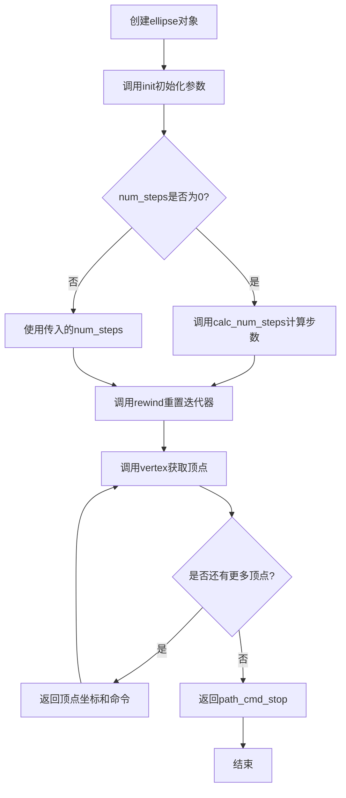
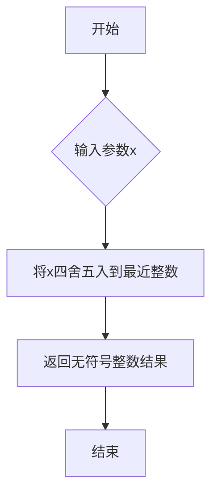
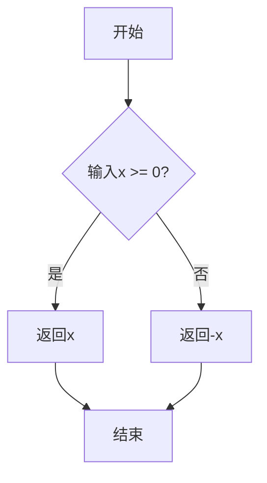
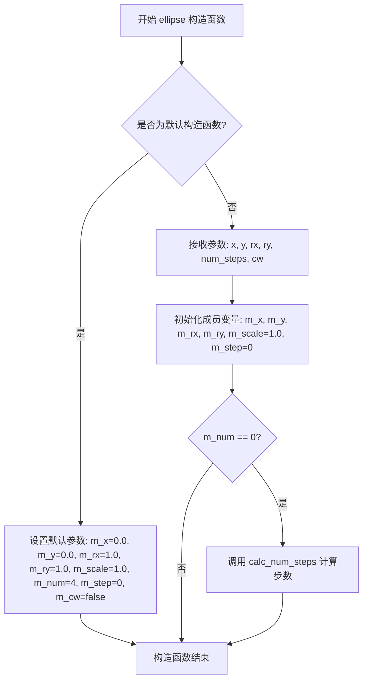
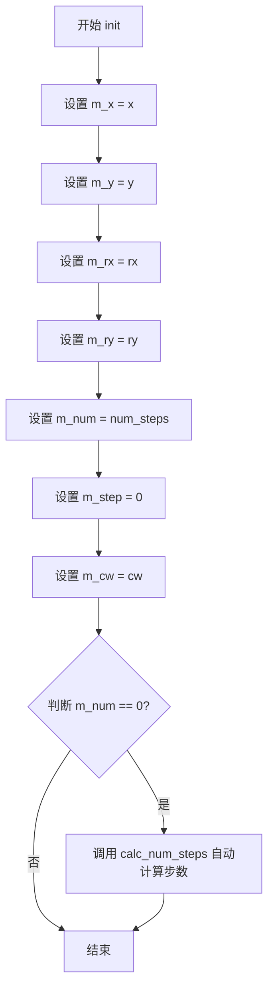
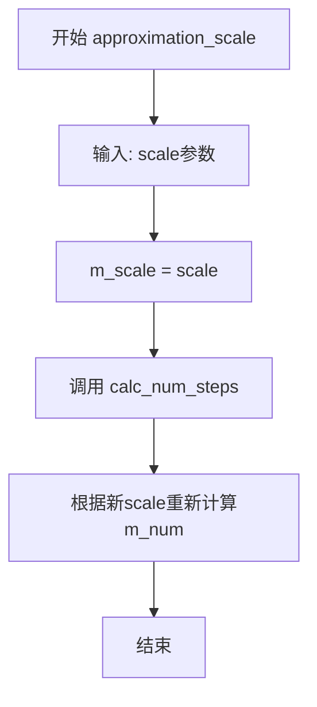
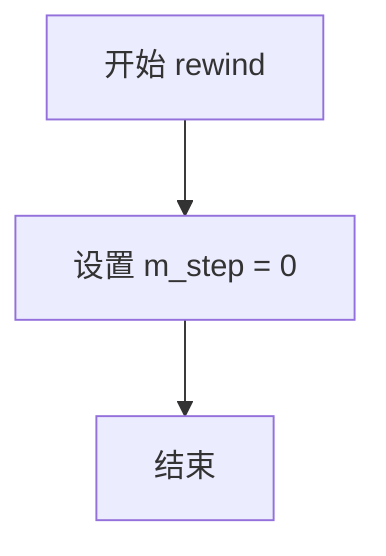

# `matplotlib\extern\agg24-svn\include\agg_ellipse.h` 详细设计文档

Anti-Grain Geometry库中的ellipse类是一个路径生成器，用于计算和输出椭圆曲线上的顶点数据。该类通过迭代方式生成椭圆路径，支持自定义采样步数和顺/逆时针方向，可用于渲染椭圆或椭圆弧。

## 整体流程



## 类结构

```
agg::ellipse (具体类)
└── 实现了路径生成器接口（隐式）
```

## 全局变量及字段


### `pi`
    
全局常量 - 圆周率π的值（在agg_basics.h中定义）

类型：`const double`
    


### `ellipse.m_x`
    
椭圆中心X坐标

类型：`double`
    


### `ellipse.m_y`
    
椭圆中心Y坐标

类型：`double`
    


### `ellipse.m_rx`
    
椭圆X轴半径

类型：`double`
    


### `ellipse.m_ry`
    
椭圆Y轴半径

类型：`double`
    


### `ellipse.m_scale`
    
近似缩放因子，控制采样精度

类型：`double`
    


### `ellipse.m_num`
    
椭圆采样总步数

类型：`unsigned`
    


### `ellipse.m_step`
    
当前迭代步数

类型：`unsigned`
    


### `ellipse.m_cw`
    
顺时针方向标志

类型：`bool`
    
    

## 全局函数及方法


### `uround`

全局函数 `uround` 是一个四舍五入函数，用于将浮点数四舍五入到最近的整数。在椭圆（ellipse）类中用于计算近似多边形的步数，确保步数为整数。

参数：

-  `x`：`double`，需要四舍五入的浮点数值

返回值：`unsigned int`，四舍五入后的整数值

#### 流程图



#### 带注释源码

```
// 定义在 agg_basics.h 中（声明）
// 这是一个全局内联函数，用于将double值四舍五入到最近的unsigned整数
// 在ellipse::calc_num_steps()中被调用，计算近似多边形的步数

inline unsigned uround(double x)
{
    // 使用 floor(x + 0.5) 实现四舍五入
    // 当x为正数时，加0.5后floor得到整数部分
    // 当x为负数时，需要特殊处理
    // AGG库中通常使用更精确的实现，考虑浮点数精度问题
    
    // 典型实现方式：
    // return (unsigned)(x + 0.5);  // 简单实现，但对于负数有问题
    
    // 或更健壮的实现：
    // return (unsigned)floor(x + 0.5);
}
```

#### 实际使用示例（在ellipse类中）

```
//------------------------------------------------------------------------
inline void ellipse::calc_num_steps()
{
    double ra = (fabs(m_rx) + fabs(m_ry)) / 2;           // 计算平均半径
    double da = acos(ra / (ra + 0.125 / m_scale)) * 2;   // 计算角度步长
    m_num = uround(2*pi / da);                           // 四舍五入得到步数
}
```

**说明**：由于 `uround` 函数的实际定义在 `agg_basics.h` 文件中（该文件未在当前代码片段中展示），以上信息是基于代码中实际调用情况的推断。函数的核心功能是将浮点数参数四舍五入返回无符号整数，在椭圆近似计算中确保多边形步数为整数。


### `fabs`

`fabs` 是C标准库 `<math.h>` 中的数学函数，用于计算浮点数的绝对值。在本代码中，它被用于计算椭圆长轴和短轴半径的绝对值，以确保计算过程中不会出现负数。

参数：

- `x`：`double`，要计算绝对值的浮点数

返回值：`double`，返回输入浮点数的绝对值

#### 流程图



#### 带注释源码

```cpp
#include <math.h>

// fabs 函数原型（来自标准库）
// double fabs(double x);
// 计算浮点数的绝对值

// 在本项目中的使用示例：
double ra = (fabs(m_rx) + fabs(m_ry)) / 2;

// 注释：
// m_rx: 椭圆的X轴半径（可能为负值）
// m_ry: 椭圆的Y轴半径（可能为负值）
// fabs(m_rx): 确保X轴半径为正数
// fabs(m_ry): 确保Y轴半径为正数
// ra: 椭圆平均半径，用于后续计算椭圆近似多边形的边数
```


### `acos`

`acos` 是 C++ 标准库 `<cmath>` (或 `<math.h>`) 提供的数学函数，用于计算给定值的反余弦（arccosine）。在 `ellipse::calc_num_steps()` 方法中，该函数用于计算椭圆近似的步数，通过计算角度增量来确定需要多少个顶点来近似椭圆曲线。

参数：

- `x`：`double`，反余弦的输入值，范围应为 [-1, 1]。当输入值超出此范围时，函数行为未定义（在某些实现中可能返回 NaN）

返回值：`double`，反余弦的结果（弧度），返回值的范围是 [0, π]。如果输入值超出 [-1, 1] 范围，某些实现可能返回 NaN 或触发域错误

#### 流程图

```mermaid
flowchart TD
    A[开始 acos 计算] --> B{输入 x 是否在 [-1, 1] 范围内?}
    B -- 是 --> C[计算反余弦值<br/>使用泰勒级数或查表法]
    C --> D[返回结果 rad ∈ [0, π]]
    B -- 否 --> E[返回 NaN 或<br/>触发域错误]
    D --> F[结束]
    E --> F
```

#### 带注释源码

```cpp
// 标准库函数声明 (C++98/03 标准)
// 原型: double acos(double x);
// 原型: float acos(float x);
// 原型: long double acos(long double x);

// 在 ellipse 类中的实际使用示例：
inline void ellipse::calc_num_steps()
{
    // 计算椭圆半轴的平均半径
    double ra = (fabs(m_rx) + fabs(m_ry)) / 2;
    
    // 使用 acos 计算角度增量 da
    // 算法原理：基于椭圆曲率近似
    // 通过反余弦函数将半径比值转换为角度
    // ra / (ra + 0.125 / m_scale) 的值永远在 (0, 1) 范围内
    // 因为分母大于分子，所以结果永远小于1，符合 acos 的输入要求
    double da = acos(ra / (ra + 0.125 / m_scale)) * 2;
    
    // 计算所需的步数：总角度 (2π) 除以每步的角度增量
    // uround 是 AGG 库中的四舍五入函数
    m_num = uround(2*pi / da);
}
```

#### 数学原理说明

在 `ellipse::calc_num_steps()` 中使用 `acos` 的数学原理：

- 目标：确定用多少条直线段来近似椭圆曲线
- 方法：基于曲率变化计算角度步长
- 公式推导：
  - `ra` 是椭圆半轴的平均半径
  - `ra / (ra + 0.125 / m_scale)` 产生一个 (0, 1) 区间的值
  - `acos()` 将这个比值转换为角度
  - 角度增量 `da` 代表每段弦对应的中心角
  - 总步数 `m_num = 2π / da`

此用法利用了 `acos` 函数将几何比例转换为角度的特性，是 AGG 库中经典的数值计算技巧。


### `cos` - 数学库函数 - 余弦

在 `ellipse::vertex` 方法中，`cos` 函数用于计算椭圆上各顶点的 X 坐标值，通过将角度转换为该角度对应的余弦值，再乘以椭圆 X 轴半径得到顶点的相对 X 偏移量。

参数：

- `angle`：`double`，弧度值，表示椭圆上的角度位置（0 到 2π 之间）

返回值：`double`，返回给定弧度角度的余弦值（-1 到 1 之间）

#### 流程图

```mermaid
flowchart TD
    A[开始计算顶点] --> B{判断是否结束}
    B -->|是| C[返回路径结束命令]
    B -->|否| D{判断是否已超过总步数}
    D -->|是| E[返回停止命令]
    D -->|否| F[计算当前角度]
    F --> G[逆时针处理角度]
    G --> H[计算cos值]
    H --> I[计算X坐标: m_x + cos(angle) * m_rx]
    I --> J[返回顶点命令]
```

#### 带注释源码

```cpp
//------------------------------------------------------------------------
// 在 ellipse::vertex 方法中调用 cos 函数
//------------------------------------------------------------------------
inline unsigned ellipse::vertex(double* x, double* y)
{
    // 检查是否已经输出完所有顶点
    if(m_step == m_num) 
    {
        // 返回多边形结束命令，包含闭合和逆时针标志
        ++m_step;
        return path_cmd_end_poly | path_flags_close | path_flags_ccw;
    }
    // 如果步数超过总步数，则停止
    if(m_step > m_num) return path_cmd_stop;
    
    // 计算当前顶点的角度：将当前步数转换为弧度角
    // 公式：step / num * 2π，得到 0 到 2π 的角度
    double angle = double(m_step) / double(m_num) * 2.0 * pi;
    
    // 如果是顺时针方向，则将角度反转
    if(m_cw) angle = 2.0 * pi - angle;
    
    // 使用 cos 函数计算椭圆上该角度对应的 X 坐标
    // cos(angle) 返回 -1 到 1 之间的值，乘以 m_rx（X轴半径）得到偏移量
    // 再加上椭圆中心 m_x 得到绝对 X 坐标
    *x = m_x + cos(angle) * m_rx;
    
    // 使用 sin 函数计算椭圆上该角度对应的 Y 坐标
    // sin(angle) 返回 -1 到 1 之间的值，乘以 m_ry（Y轴半径）得到偏移量
    // 再加上椭圆中心 m_y 得到绝对 Y 坐标
    *y = m_y + sin(angle) * m_ry;
    
    // 步数递增
    m_step++;
    
    // 如果是第一个顶点，返回移动命令；否则返回画线命令
    return ((m_step == 1) ? path_cmd_move_to : path_cmd_line_to);
}
```


### `sin` (数学库函数)

描述：在椭圆顶点生成算法中，使用正弦函数计算椭圆上各顶点的Y坐标。该函数根据当前角度计算对应的正弦值，结合椭圆的长半轴和短半轴参数，生成椭圆路径的Y坐标。

参数：
- `angle`：double类型，弧度制的角度值，表示椭圆上当前顶点的角度位置

返回值：double类型，返回给定角度的正弦值（-1到1之间），用于计算椭圆在该角度下的Y坐标

#### 流程图

```mermaid
graph TD
    A[开始计算顶点] --> B[计算角度: angle = m_step / m_num * 2π]
    B --> C{是否为顺时针方向?}
    C -->|是| D[angle = 2π - angle]
    C -->|否| E[继续]
    D --> E
    E --> F[计算X坐标: x = m_x + cos(angle) * m_rx]
    E --> G[计算Y坐标: y = m_y + sin(angle) * m_ry]
    F --> H[返回顶点命令]
    G --> H
```

#### 带注释源码

```cpp
//------------------------------------------------------------------------
// ellipse类的vertex方法中sin函数的使用
//------------------------------------------------------------------------

inline unsigned ellipse::vertex(double* x, double* y)
{
    // 如果已经完成所有步骤，返回多边形结束命令
    if(m_step == m_num) 
    {
        ++m_step;
        return path_cmd_end_poly | path_flags_close | path_flags_ccw;
    }
    // 如果超过总步数，停止路径生成
    if(m_step > m_num) return path_cmd_stop;
    
    // 计算当前角度：基于当前步数和总步数，将0-2π映射到整个椭圆
    double angle = double(m_step) / double(m_num) * 2.0 * pi;
    
    // 如果是顺时针方向，反转角度方向
    if(m_cw) angle = 2.0 * pi - angle;
    
    // 计算椭圆上当前角度对应的X坐标
    // 使用cos函数计算水平偏移量
    *x = m_x + cos(angle) * m_rx;
    
    // 计算椭圆上当前角度对应的Y坐标
    // 使用sin函数计算垂直偏移量
    // m_y: 椭圆的中心Y坐标
    // m_ry: 椭圆的Y轴半径（短半轴）
    *y = m_y + sin(angle) * m_ry;
    
    // 步数递增
    m_step++;
    
    // 返回顶点命令：第一步是move_to，后续步骤是line_to
    return ((m_step == 1) ? path_cmd_move_to : path_cmd_line_to);
}
```

#### 技术细节说明

1. **函数原型**：标准库函数 `sin(double radians)`，定义在 `<math.h>` 或 `<cmath>` 头文件中
2. **参数范围**：angle应为弧度值，范围通常为0到2π
3. **数学意义**：sin(angle)给出角度angle对应的Y坐标比例因子，与m_ry相乘得到实际Y偏移量
4. **坐标变换**：通过将sin值乘以Y轴半径m_ry，实现椭圆Y坐标的计算
5. **步进精度**：通过m_step/m_num的比例，将椭圆均匀分割为m_num个顶点段


### `ellipse.ellipse()`

该构造函数用于初始化椭圆对象，设置椭圆的中心坐标、半轴长度、逼近步数以及绘制方向等属性，是 Anti-Grain Geometry 库中椭圆图元生成的核心入口。

参数：

- `x`：`double`，椭圆的中心 X 坐标
- `y`：`double`，椭圆的中心 Y 坐标
- `rx`：`double`，椭圆 X 轴方向的半径（半轴长度）
- `ry`：`double`，椭圆 Y 轴方向的半径（半轴长度）
- `num_steps`：`unsigned`，椭圆逼近的步数，默认为 0 表示自动计算
- `cw`：`bool`，是否按顺时针方向生成顶点，默认为 false（逆时针）

返回值：`void`，构造函数无返回值

#### 流程图



#### 带注释源码

```cpp
//----------------------------------------------------------------------------
// 椭圆类的参数化构造函数
// 参数:
//   x         - 椭圆中心X坐标
//   y         - 椭圆中心Y坐标
//   rx        - 椭圆X轴方向半径
//   ry        - 椭圆Y轴方向半径
//   num_steps - 逼近步数（0表示自动计算）
//   cw        - 是否顺时针生成
//----------------------------------------------------------------------------
ellipse(double x, double y, double rx, double ry, 
        unsigned num_steps=0, bool cw=false) :
    // 初始化列表：直接初始化各个成员变量
    m_x(x),        // 设置椭圆中心X坐标
    m_y(y),        // 设置椭圆中心Y坐标
    m_rx(rx),      // 设置X轴半径
    m_ry(ry),      // 设置Y轴半径
    m_scale(1.0),  // 默认逼近缩放因子为1.0
    m_num(num_steps), // 设置逼近步数（若为0稍后自动计算）
    m_step(0),     // 初始化当前步为0（用于vertex迭代）
    m_cw(cw)       // 设置旋转方向
{
    // 如果用户未指定步数，则自动计算合适的步数
    // 这保证了椭圆在不同尺寸下都有平滑的逼近效果
    if(m_num == 0) calc_num_steps();
}
```

#### 默认构造函数源码

```cpp
//----------------------------------------------------------------------------
// 椭圆类的默认构造函数
// 创建一个单位圆（半径为1，中心在原点）
//----------------------------------------------------------------------------
ellipse() : 
    m_x(0.0),      // 默认中心X = 0
    m_y(0.0),      // 默认中心Y = 0
    m_rx(1.0),     // 默认X轴半径 = 1
    m_ry(1.0),     // 默认Y轴半径 = 1
    m_scale(1.0),  // 默认逼近缩放 = 1
    m_num(4),      // 默认步数 = 4（正方形逼近）
    m_step(0),     // 当前步初始为0
    m_cw(false)    // 默认逆时针方向
{}
```

#### 完整类结构参考

```cpp
// 类成员变量说明
private:
    double m_x;      // 椭圆中心X坐标
    double m_y;      // 椭圆中心Y坐标
    double m_rx;     // X轴方向半径
    double m_ry;     // Y轴方向半径
    double m_scale;  // 逼近缩放因子
    unsigned m_num;  // 逼近总步数
    unsigned m_step; // 当前迭代步数
    bool m_cw;       // 顺时针标志
```


### `ellipse.init()`

初始化椭圆参数的方法，用于设置椭圆的几何属性（中心点坐标、半径）和绘制参数（分段数、绘制方向）。

参数：

- `x`：`double`，椭圆中心点的 X 坐标
- `y`：`double`，椭圆中心点的 Y 坐标
- `rx`：`double`，椭圆 X 轴方向的半径
- `ry`：`double`，椭圆 Y 轴方向的半径
- `num_steps`：`unsigned`，可选参数，表示绘制椭圆时的分段步数，默认为 0（自动计算）
- `cw`：`bool`，可选参数，表示是否顺时针绘制，默认为 false（逆时针）

返回值：`void`，无返回值

#### 流程图



#### 带注释源码

```cpp
//------------------------------------------------------------------------
// 初始化椭圆参数
// 参数说明：
//   x         - 椭圆中心 X 坐标
//   y         - 椭圆中心 Y 坐标
//   rx        - 椭圆 X 轴半径
//   ry        - 椭圆 Y 轴半径
//   num_steps - 绘制椭圆的分段步数（0 表示自动计算）
//   cw        - 是否顺时针绘制（true 为顺时针，false 为逆时针）
//------------------------------------------------------------------------
inline void ellipse::init(double x, double y, double rx, double ry, 
                          unsigned num_steps, bool cw)
{
    // 设置椭圆中心坐标
    m_x = x;
    m_y = y;
    
    // 设置椭圆半径
    m_rx = rx;
    m_ry = ry;
    
    // 设置分段步数
    m_num = num_steps;
    
    // 重置当前步进计数器（用于 vertex() 方法遍历）
    m_step = 0;
    
    // 设置绘制方向
    m_cw = cw;
    
    // 如果未指定步数，则自动计算合适的步数
    if(m_num == 0) calc_num_steps();
}
```


### `ellipse.approximation_scale`

设置椭圆近似的精度缩放因子，通过调整m_scale值并重新计算椭圆绘制所需的步数，以控制椭圆曲线的近似精度。

参数：

- `scale`：`double`，近似精度缩放因子，值越大表示精度越高（步数越多）

返回值：`void`，无返回值

#### 流程图



#### 带注释源码

```cpp
//------------------------------------------------------------------------
// 设置椭圆近似的精度缩放因子
// 参数: scale - 精度缩放因子，值越大精度越高
//------------------------------------------------------------------------
inline void ellipse::approximation_scale(double scale)
{   
    m_scale = scale;           // 保存精度缩放因子
    calc_num_steps();          // 重新计算绘制椭圆所需的步数
}
```


### ellipse.rewind

该方法用于将椭圆（ellipse）的顶点生成迭代器重置到起始位置，以便重新遍历椭圆的顶点序列。

参数：
-  `path_id`：`unsigned`，路径标识符。在当前实现中未被使用，仅为保持与AGG图形基类接口的一致性。

返回值：`void`，无返回值。

#### 流程图



#### 带注释源码

```cpp
    //------------------------------------------------------------------------
    // 重置迭代器到起点
    // 参数 path_id 为路径ID，虽然在此类中未直接使用，但保留以符合接口规范
    //------------------------------------------------------------------------
    inline void ellipse::rewind(unsigned)
    {
        // 将内部步进计数器 m_step 设为 0
        // 这样下次调用 vertex() 时将从椭圆的起始点（角度0或2*pi）开始生成坐标
        m_step = 0;
    }
```


### ellipse.vertex

获取椭圆路径的下一个顶点数据，通过迭代方式返回椭圆上的每个顶点坐标。

参数：

- `x`：`double*`，指向用于存储顶点 x 坐标的输出参数
- `y`：`double*`，指向用于存储顶点 y 坐标的输出参数

返回值：`unsigned`，返回路径命令类型，包括：

- `path_cmd_move_to`（首个顶点）
- `path_cmd_line_to`（后续顶点）
- `path_cmd_end_poly | path_flags_close | path_flags_ccw`（闭合多边形）
- `path_cmd_stop`（结束）

#### 流程图

```mermaid
flowchart TD
    A[开始 vertex] --> B{m_step == m_num?}
    B -->|是| C[++m_step]
    C --> D[返回 path_cmd_end_poly<br/>| path_flags_close<br/>| path_flags_ccw]
    B -->|否| E{m_step > m_num?}
    E -->|是| F[返回 path_cmd_stop]
    E -->|否| G[计算角度<br/>angle = m_step / m_num * 2π]
    G --> H{m_cw == true?}
    H -->|是| I[angle = 2π - angle]
    H -->|否| J[保持 angle]
    I --> K[计算顶点坐标]
    J --> K
    K --> L[*x = m_x + cos(angle) * m_rx<br/>*y = m_y + sin(angle) * m_ry]
    L --> M[++m_step]
    M --> N{m_step == 1?}
    N -->|是| O[返回 path_cmd_move_to]
    N -->|否| P[返回 path_cmd_line_to]
```

#### 带注释源码

```cpp
//------------------------------------------------------------------------
// ellipse::vertex - 获取椭圆路径的下一个顶点
// 参数：
//   x - 输出参数，指向存储顶点x坐标的double指针
//   y - 输出参数，指向存储顶点y坐标的double指针
// 返回值：
//   unsigned - 路径命令类型
//------------------------------------------------------------------------
inline unsigned ellipse::vertex(double* x, double* y)
{
    // 步骤1：如果已到达最后一个顶点，返回闭合多边形命令
    if(m_step == m_num) 
    {
        ++m_step;  // 增加步数以标记已处理完毕
        // 返回结束多边形命令，包含闭合和逆时针标志
        return path_cmd_end_poly | path_flags_close | path_flags_ccw;
    }
    
    // 步骤2：如果步数超出范围，返回停止命令
    if(m_step > m_num) return path_cmd_stop;
    
    // 步骤3：计算当前角度（归一化到 [0, 2π) 范围）
    double angle = double(m_step) / double(m_num) * 2.0 * pi;
    
    // 步骤4：如果为顺时针方向，反转角度方向
    if(m_cw) angle = 2.0 * pi - angle;
    
    // 步骤5：根据椭圆参数方程计算顶点坐标
    // x = x0 + rx * cos(θ)
    // y = y0 + ry * sin(θ)
    *x = m_x + cos(angle) * m_rx;
    *y = m_y + sin(angle) * m_ry;
    
    // 步骤6：增加步数，为下一次调用做准备
    m_step++;
    
    // 步骤7：返回路径命令
    // 第一个顶点返回 move_to 命令，后续顶点返回 line_to 命令
    return ((m_step == 1) ? path_cmd_move_to : path_cmd_line_to);
}
```


### `ellipse.calc_num_steps()`

该私有方法根据椭圆的半轴长度和近似比例尺，计算绘制椭圆所需的多边形顶点步数，通过弧度近似算法确定步长，确保椭圆能够以指定精度被离散化为多边形进行渲染。

参数：无（该方法为私有成员方法，通过访问类的成员变量获取所需参数）

返回值：`void`，无返回值，计算结果直接存储在成员变量 `m_num` 中

#### 流程图

```mermaid
flowchart TD
    A[开始 calc_num_steps] --> B[计算平均半径<br/>ra = (|m_rx| + |m_ry|) / 2]
    B --> C[计算角度步长<br/>da = acos(ra / (ra + 0.125 / m_scale)) * 2]
    C --> D[计算总步数<br/>m_num = uround(2π / da)]
    D --> E[结束]
    
    style A fill:#e1f5fe
    style E fill:#e1f5fe
    style B fill:#fff3e0
    style C fill:#fff3e0
    style D fill:#fff3e0
```

#### 带注释源码

```cpp
//------------------------------------------------------------------------
// 计算椭圆近似所需的步数
// 该方法根据椭圆的尺寸和缩放因子，确定用多少个顶点来近似椭圆
//------------------------------------------------------------------------
inline void ellipse::calc_num_steps()
{
    // 计算椭圆半轴的平均半径
    // 使用两半轴的平均值作为参考半径，用于步数计算
    // fabs() 确保处理负数输入的情况
    double ra = (fabs(m_rx) + fabs(m_ry)) / 2;
    
    // 计算角度步长
    // 算法原理：基于弧长近似，使用 acos 函数计算角度增量
    // 0.125 / m_scale 是近似精度因子，m_scale 越大精度越高（步数越多）
    // 乘以2是因为上下半弧都需要考虑
    double da = acos(ra / (ra + 0.125 / m_scale)) * 2;
    
    // 计算总步数：用完整圆周(2π)除以单步角度得到需要多少个顶点
    // uround 是四舍五入函数，确保得到整数步数
    // m_num 存储最终计算出的步数，用于 vertex() 方法生成顶点
    m_num = uround(2*pi / da);
}
```

#### 技术细节说明

| 项目 | 说明 |
|------|------|
| **算法原理** | 基于弧长近似法，使用 `acos` 函数计算保证椭圆曲线的采样精度 |
| **精度控制** | 通过 `m_scale` 参数控制，值越大步数越多、曲线越平滑 |
| **数值稳定性** | 使用 `fabs()` 处理负数输入，避免因负半轴导致的计算错误 |
| **调用场景** | 构造函数中 `num_steps=0` 时自动调用，或在 `approximation_scale()` 改变缩放后重新计算 |

## 关键组件


### ellipse
用于生成椭圆路径的类，提供参数化椭圆顶点生成功能。

### init
初始化椭圆的中心坐标、半轴长度、细分步数以及绘制方向。

### approximation_scale
设置近似精度比例尺，重新计算椭圆所需的细分步数。

### rewind
将椭圆顶点生成器重置到起始位置，以便重新遍历。

### vertex
返回椭圆轮廓的下一个顶点坐标并提供相应的路径命令。

### calc_num_steps
根据椭圆半径和近似比例计算细分的步数，确保拟合精度。

### m_x
椭圆中心 x 坐标 (double)。

### m_y
椭圆中心 y 坐标 (double)。

### m_rx
椭圆 x 方向半轴长度 (double)。

### m_ry
椭圆 y 方向半轴长度 (double)。

### m_scale
近似精度比例因子，用于控制细分步数计算 (double)。

### m_num
椭圆轮廓的总步数 (unsigned)。

### m_step
当前顶点生成的步数索引 (unsigned)。

### m_cw
标志椭圆顶点是否按顺时针方向生成 (bool)。


## 问题及建议


### 已知问题

- **缺乏输入验证**：构造函数和`init`方法未对负数或零半径（`m_rx`、`m_ry`）进行验证，可能导致计算异常或除零错误
- **魔法数字**：`calc_num_steps()`中的`0.125`是未注释的神秘数字，公式的数学原理不明确
- **无`const`限定符**：所有访问器方法都未标记为`const`，无法在常量对象上调用
- **C风格输出参数**：使用`double* x, double* y`而非更现代的引用或返回值方式
- **重复计算**：每次调用`vertex()`都会重新计算`2.0 * pi`和其他常量表达式
- **浮点运算效率**：`sin`和`cos`在每个顶点计算时都独立调用，未利用三角函数的对称性优化
- **无显式拷贝控制**：未显式定义或删除拷贝/移动构造函数和赋值运算符，依赖编译器默认行为
- **近似缩放逻辑**：`approximation_scale`方法会无条件调用`calc_num_steps()`，即使比例未实际改变

### 优化建议

- 添加半径有效性验证（如`if(m_rx <= 0 || m_ry <= 0) return;`或抛出异常）
- 将`0.125`提取为具名常量并添加注释说明其数学意义
- 为`vertex`、`rewind`等只读方法添加`const`限定符
- 考虑使用`std::pair<double, double>`或结构体替代指针输出参数
- 预计算角度增量`angle_increment = 2.0 * pi / m_num`，在`vertex`中复用
- 显式`= default`或`= delete`拷贝/移动构造函数的声明
- 在`approximation_scale`中先检查值是否改变再重新计算步数
- 考虑使用模板参数或配置类替代硬编码的近似算法参数


## 其它


### 设计目标与约束

该类的主要设计目标是提供一个高效的椭圆路径生成器，能够生成椭圆轮廓的顶点序列，供AGG图形库的渲染流水线使用。设计约束包括：(1) 支持任意中心点、半轴长度的椭圆；(2) 支持顺时针和逆时针两种遍历方向；(3) 通过近似采样步数控制生成顶点的密度，平衡精度与性能；(4) 必须与AGG的path接口兼容（实现rewind/vertex模式）。

### 错误处理与异常设计

代码采用值式错误处理策略，不抛出异常。主要错误情况包括：(1) 如果传入的num_steps为0，则自动调用calc_num_steps()计算合理的采样步数；(2) 如果m_rx或m_ry为负数，calc_num_steps()中使用fabs()取绝对值避免计算错误；(3) vertex()方法在遍历结束后返回path_cmd_stop信号，而非抛出异常，调用方通过返回值判断状态。设计上遵循"快速失败"原则，在边界条件下有明确的返回行为。

### 数据流与状态机

该类实现了一个简单的状态机，包含两个状态：初始态和遍历态。初始态：m_step = 0，尚未开始生成顶点。遍历态：m_step > 0 且 m_step <= m_num，持续返回顶点；m_step = m_num + 1时返回path_cmd_end_poly；m_step > m_num + 1时返回path_cmd_stop。数据流：init()或构造函数设置椭圆参数 → rewind()重置遍历状态为初始态 → 循环调用vertex()获取顶点序列直到返回stop命令。

### 外部依赖与接口契约

外部依赖包括：(1) agg_basics.h - 提供基础类型定义（如uround、pi、path_cmd_*、path_flags_*常量）；(2) <math.h> - 提供acos()、cos()、sin()、fabs()数学函数。接口契约：(1) init()方法必须在使用前调用或使用对应构造函数；(2) rewind(unsigned path_id)方法接受任意path_id参数（当前未使用，为接口一致性保留）；(3) vertex(double* x, double* y)方法输出顶点坐标，返回路径命令常量，调用方必须检查返回值以确定命令类型；(4) approximation_scale()必须在rewind()之前调用以影响后续遍历。

### 关键组件信息

ellipse类：核心类，负责椭圆路径的生成和管理，实现了AGG的vertex_source接口。calc_num_steps()私有方法：根据当前半轴长度和缩放因子计算采样步数，确保椭圆近似精度。m_scale成员：控制近似精度的缩放因子，值越大生成的顶点越多、精度越高。

### 潜在的技术债务或优化空间

(1) 角度计算效率：每次vertex()调用都重新计算cos()和sin()，对于固定椭圆可预计算顶点表进行优化；(2) 常量重复计算：2.0 * pi在vertex()中每次重新计算，应定义为类静态常量；(3) 缺少参数验证：init()方法未检查rx、ry为负或为零的情况，可能导致后续计算异常；(4) 未使用的path_id参数：rewind()的path_id参数未被使用，设计上不够清晰；(5) 缺少virtual析构函数：虽然当前为非多态使用，但作为可能被继承的类，应添加virtual ~ellipse() = default以确保正确的析构行为。

    