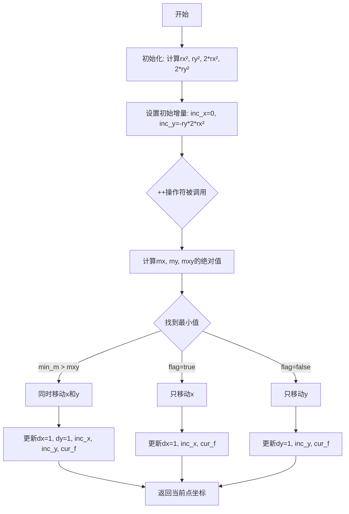
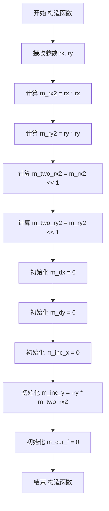
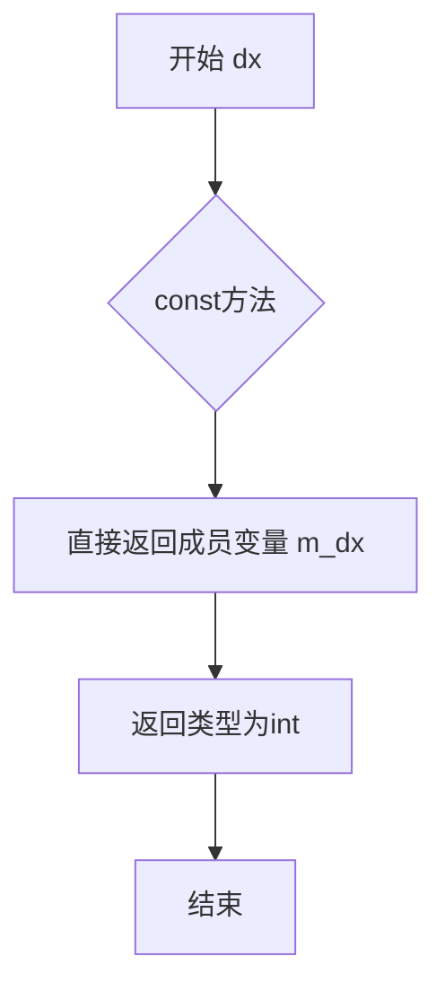
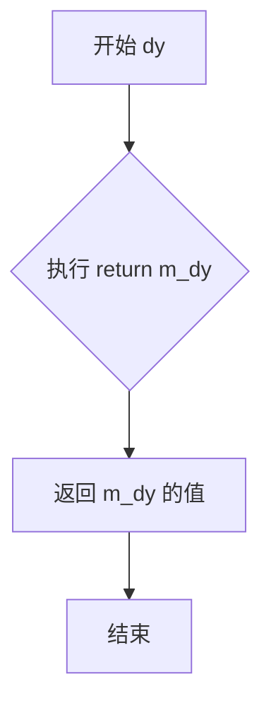
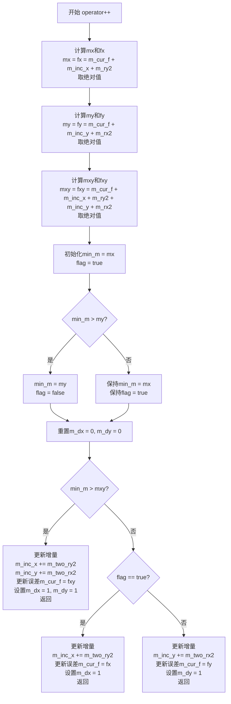

# `matplotlib\extern\agg24-svn\include\agg_ellipse_bresenham.h` 详细设计文档

这是Anti-Grain Geometry库中的一个简单Bresenham椭圆插值器实现，用于在光栅图形中通过增量计算高效地生成椭圆路径上的每个像素点坐标。

## 整体流程



## 类结构

```
agg (命名空间)
└── ellipse_bresenham_interpolator (具体类)
```

## 全局变量及字段


### `ellipse_bresenham_interpolator.m_rx2`
    
椭圆X轴半径的平方

类型：`int`
    


### `ellipse_bresenham_interpolator.m_ry2`
    
椭圆Y轴半径的平方

类型：`int`
    


### `ellipse_bresenham_interpolator.m_two_rx2`
    
2 * rx²，用于增量计算

类型：`int`
    


### `ellipse_bresenham_interpolator.m_two_ry2`
    
2 * ry²，用于增量计算

类型：`int`
    


### `ellipse_bresenham_interpolator.m_dx`
    
当前步进在X方向的增量

类型：`int`
    


### `ellipse_bresenham_interpolator.m_dy`
    
当前步进在Y方向的增量

类型：`int`
    


### `ellipse_bresenham_interpolator.m_inc_x`
    
X方向的累计增量值

类型：`int`
    


### `ellipse_bresenham_interpolator.m_inc_y`
    
Y方向的累计增量值

类型：`int`
    


### `ellipse_bresenham_interpolator.m_cur_f`
    
Bresenham算法的决策参数

类型：`int`
    
    

## 全局函数及方法


### `ellipse_bresenham_interpolator.ellipse_bresenham_interpolator(int rx, int ry)`

这是 Anti-Grain Geometry 库中的椭圆 Bresenham 插值器类的构造函数，用于初始化椭圆扫描转换所需的成员变量，计算椭圆的初始参数（半径平方、两倍平方值等）以及设置起始的误差项和增量值。

参数：

- `rx`：`int`，椭圆的 X 轴半径（水平半轴长度）
- `ry`：`int`，椭圆的 Y 轴半径（垂直半轴长度）

返回值：`无`（构造函数无返回值）

#### 流程图



#### 带注释源码

```cpp
// 构造函数：初始化椭圆 Bresenham 插值器的所有成员变量
// 参数：rx - 椭圆 X 轴半径，ry - 椭圆 Y 轴半径
// 初始化列表中直接计算各成员变量的初始值
ellipse_bresenham_interpolator(int rx, int ry) :
    m_rx2(rx * rx),           // m_rx2: 存储 rx 的平方，用于后续误差计算
    m_ry2(ry * ry),           // m_ry2: 存储 ry 的平方，用于后续误差计算
    m_two_rx2(m_rx2 << 1),    // m_two_rx2: rx² 的两倍（即 2*rx²），用于增量计算
    m_two_ry2(m_ry2 << 1),    // m_two_ry2: ry² 的两倍（即 2*ry²），用于增量计算
    m_dx(0),                  // m_dx: X 方向步进标记，初始化为 0（尚未移动）
    m_dy(0),                  // m_dy: Y 方向步进标记，初始化为 0（尚未移动）
    m_inc_x(0),               // m_inc_x: X 方向误差项增量，初始为 0
    m_inc_y(-ry * m_two_rx2), // m_inc_y: Y 方向误差项增量，初始为 -ry * 2*rx²
    m_cur_f(0)                // m_cur_f: 当前 Bresenham 误差项，初始为 0
{}
```


### `ellipse_bresenham_interpolator.dx()`

该函数是椭圆Bresenham插值器的成员方法，用于获取当前X方向的增量值（移动步长），帮助确定在椭圆生成过程中下一步在X轴方向上的移动。

参数：
- 无参数

返回值：`int`，返回当前X方向的增量值（m_dx），表示插值过程中X轴的移动步进（0表示不移动，1表示向右移动一步）。

#### 流程图



#### 带注释源码

```cpp
//----------------------------------------------------------------------------
// 方法: dx
// 功能: 获取当前X方向的增量值
// 说明: 这是一个const成员函数,用于返回椭圆Bresenham插值算法中
//       当前步骤在X轴方向上的移动增量
// 返回: int - X方向的增量(0表示不移动,1表示向右移动一步)
//----------------------------------------------------------------------------
int dx() const 
{ 
    // 返回成员变量m_dx,该值在operator++中被更新
    // 表示椭圆绘制时X轴的移动方向和步数
    return m_dx; 
}
```

#### 关联信息

**私有成员变量 `m_dx`：**
- 类型：`int`
- 描述：存储当前X方向的增量值，由`operator++`方法根据Bresenham算法决策更新

**类中关联方法：**
- `dy()`：与`dx()`配对使用，获取Y方向的增量
- `operator++`：主迭代方法，根据椭圆Bresenham算法决策更新`m_dx`和`m_dy`的值

**设计意图：**
该方法是典型的访问器模式（Accessor Pattern），提供对私有成员的安全只读访问。在椭圆生成算法中，`dx()`和`dy()`配合使用来确定每个采样点相对于前一个点的移动方向和距离。


### `ellipse_bresenham_interpolator.dy`

该方法为`ellipse_bresenham_interpolator`类的常成员函数，用于获取当前Bresenham椭圆插值过程中Y方向的步进增量（值为0或1），反映在当前迭代步骤中是否沿Y方向移动。

参数：无

返回值：`int`，返回当前Y方向的增量值（0表示Y方向不移动，1表示Y方向移动一步）。

#### 流程图



#### 带注释源码

```cpp
// 获取当前Y方向增量
// 返回值：int类型，表示Y方向的步进值（0或1）
// 该值在operator++中根据Bresenham算法决策后设置
int dy() const 
{ 
    return m_dy;  // 返回成员变量m_dy，表示当前迭代中Y方向是否移动
}
```


### `ellipse_bresenham_interpolator.operator++()`

计算椭圆上下一个点的步进方向，通过比较当前误差值与三个候选移动方向的误差值，确定是水平移动、垂直移动还是对角线移动，并更新内部状态。

参数：

- 无显式参数（使用隐式 `this` 指针）

返回值：`void`，无返回值（通过成员变量 `m_dx` 和 `m_dy` 输出步进方向）

#### 流程图



#### 带注释源码

```cpp
void operator++ ()
{
    // 局部变量声明
    int  mx, my, mxy, min_m;  // 三个候选方向的误差值和最小值
    int  fx, fy, fxy;         // 对应的原始误差值（未取绝对值）

    // 计算水平移动的误差值（只移动x）
    // 公式：f + inc_x + ry²
    mx = fx = m_cur_f + m_inc_x + m_ry2;
    if(mx < 0) mx = -mx;  // 取绝对值用于比较

    // 计算垂直移动的误差值（只移动y）
    // 公式：f + inc_y + rx²
    my = fy = m_cur_f + m_inc_y + m_rx2;
    if(my < 0) my = -mx;  // 取绝对值用于比较

    // 计算对角线移动的误差值（同时移动x和y）
    // 公式：f + inc_x + ry² + inc_y + rx²
    mxy = fxy = m_cur_f + m_inc_x + m_ry2 + m_inc_y + m_rx2;
    if(mxy < 0) mxy = -mxy;  // 取绝对值用于比较

    // 初始化最小值为mx，flag标记表示当前最小值来自mx
    min_m = mx; 
    bool flag = true;

    // 比较my和min_m，找出最小误差方向
    if(min_m > my)  
    { 
        min_m = my; 
        flag = false;  // 更新flag表示当前最小值来自my
    }

    // 重置步进方向
    m_dx = m_dy = 0;

    // 判断是否应该走对角线（对角线误差最小）
    if(min_m > mxy) 
    { 
        // 对角线移动：x和y同时增加1
        m_inc_x += m_two_ry2;   // 更新x方向增量
        m_inc_y += m_two_rx2;   // 更新y方向增量
        m_cur_f = fxy;          // 更新当前误差值
        m_dx = 1;               // 设置x步进标志
        m_dy = 1;               // 设置y步进标志
        return;
    }

    // 判断水平移动还是垂直移动
    if(flag) 
    {
        // 水平移动：x增加1
        m_inc_x += m_two_ry2;   // 更新x方向增量
        m_cur_f = fx;           // 更新当前误差值
        m_dx = 1;               // 设置x步进标志
        return;
    }

    // 垂直移动：y增加1
    m_inc_y += m_two_rx2;       // 更新y方向增量
    m_cur_f = fy;               // 更新当前误差值
    m_dy = 1;                   // 设置y步进标志
}
```

## 关键组件


### ellipse_bresenham_interpolator 类

椭圆Bresenham插值器的核心实现类，通过维护决策函数和相关增量参数，计算椭圆光栅化过程中每一步的最优移动方向（水平、垂直或对角线）。

### 私有成员变量组

包括m_rx2（半径x平方）、m_ry2（半径y平方）、m_two_rx2（2倍x平方）、m_two_ry2（2倍y平方）用于增量计算；m_dx、m_dy存储当前步进方向；m_inc_x、m_inc_y存储决策函数增量；m_cur_f存储当前决策值。

### 构造函数

初始化椭圆插值器，接收rx、ry两个椭圆半径参数，计算半径平方及相关增量初始值，设置起始步进方向。

### dx()/dy() 访问器方法

返回当前步进的x和y方向增量，用于外部获取插值器的移动方向。

### operator++() 运算符

Bresenham椭圆算法的核心实现，通过比较三个候选位置（水平、垂直、对角线）的决策函数值，选择代价最小的方向更新m_dx、m_dy和决策函数值。


## 问题及建议


### 已知问题

-   **整数溢出风险**：构造函数中使用 `rx * rx` 和 `ry * ry` 计算平方，当 rx 或 ry 较大时可能导致整数溢出
-   **缺少参数有效性检查**：未对 rx 和 ry 的负值或零值进行检查，可能导致未定义行为
-   **operator++ 返回值不一致**：前置递增运算符没有返回值（返回 void），不符合标准迭代器模式，难以链式调用
-   **无迭代器接口**：缺少 begin/end 方法或迭代器接口，无法直接用于范围 for 循环
-   **浮点数精度损失**：算法内部完全使用整数运算，对于大半径椭圆可能产生较大累积误差
-   **注释不足**：关键算法逻辑缺乏详细注释，后续维护困难

### 优化建议

-   添加构造函数参数有效性检查，处理负值和零值情况
-   考虑使用 `long long` 或 `int64_t` 类型存储平方运算结果，避免溢出
-   为 operator++ 添加返回值，使其符合迭代器模式（如返回 `ellipse_bresenham_interpolator&`）
-   添加迭代器接口支持，方便外部遍历
-   考虑添加 `reset()` 方法支持重置状态
-   增加详细的算法注释，解释选择下一个像素点的决策逻辑
-   考虑添加单元测试覆盖边界情况（rx=1, ry=1, rx>ry, ry>rx 等）


## 其它


### 设计目标与约束

该类的设计目标是实现高效的椭圆扫描转换算法，通过Bresenham算法在像素网格上生成椭圆路径。约束条件包括：输入参数rx和ry必须为正整数，由于使用int类型，需确保rx*rx和ry*ry的值不超过int类型的最大值。

### 错误处理与异常设计

本类不进行显式的错误处理和异常抛出。调用方需确保传入的rx和ry为正整数且不会导致整数溢出。构造函数中的计算可能产生整数溢出，特别是在rx或ry较大时（当rx*rx超过INT_MAX时），这一点需要在调用层进行约束。

### 数据流与状态机

该类实现了一个迭代器模式的状态机。每次调用operator++时，根据当前决策函数值计算下一步的移动方向（水平、垂直或对角线）。状态转换依赖于决策函数f的值，它比较三个候选点的误差值：水平移动(dx=1, dy=0)、垂直移动(dx=0, dy=1)和对角线移动(dx=1, dy=1)。m_cur_f存储当前决策函数值，m_inc_x和m_inc_y在每次迭代中更新以反映位置变化。

### 外部依赖与接口契约

该类依赖agg命名空间和agg_basics.h头文件。外部调用者应按照以下契约使用：构造函数传入椭圆的半轴长度rx和ry；通过operator++推进迭代器；通过dx()和dy()获取当前点的增量值。注意该类不直接生成椭圆上的点坐标，而是提供增量信息，调用者需要自行累积坐标。

### 性能特征与复杂度分析

时间复杂度：每次迭代操作是O(1)的常数时间操作，空间复杂度为O(1)，仅使用固定数量的成员变量。该实现避免了浮点运算，全部使用整数运算，在性能上具有优势。m_rx2、m_ry2、m_two_rx2、m_two_ry2等预先计算的值避免了重复乘法运算。

### 使用场景与调用示例

该插值器通常与椭圆渲染器配合使用。基本调用模式为：创建ellipse_bresenham_interpolator对象，然后循环调用++操作符获取每个采样点的移动增量，调用者根据dx()和dy()累积实际坐标以生成椭圆路径。

### 与其他组件的关系

该类是AGG库中椭圆渲染系统的核心组件之一，通常被ellipse类或其他更高级的图形基元类所使用。它作为底层算法提供者，为上层渲染器提供像素级绘制的决策支持。与其他插值器（如line_bresenham_interpolator）共同构成了AGG的光栅化算法基础。

### 线程安全性

该类不包含任何静态成员或全局状态，每个实例都是独立的。类的成员函数不修改任何全局或静态变量，因此该类本身是线程安全的，但使用该类的上层代码需要注意多线程环境下的状态管理。

    