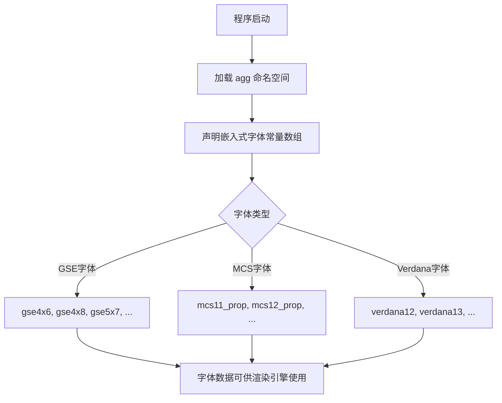

# `matplotlib\extern\agg24-svn\include\agg_embedded_raster_fonts.h` 详细设计文档

该文件是 Anti-Grain Geometry (AGG) 库的嵌入式光栅字体头文件，声明了一系列预编译的外部常量数组，存储不同尺寸和样式的字体位图数据，用于在没有外部字体文件时提供基本的内置字体渲染能力。

## 整体流程



## 类结构

```
agg 命名空间
└── 嵌入式字体常量数组集合
    ├── GSE 系列字体 (4x6 至 8x16)
    ├── MCS 系列字体 (5x10 至 7x12)
    └── Verdana 系列字体 (12 至 18)
```

## 全局变量及字段


### `gse4x6`
    
Embedded GSE 4x6 pixel font raster data.

类型：`const int8u[]`
    


### `gse4x8`
    
Embedded GSE 4x8 pixel font raster data.

类型：`const int8u[]`
    


### `gse5x7`
    
Embedded GSE 5x7 pixel font raster data.

类型：`const int8u[]`
    


### `gse5x9`
    
Embedded GSE 5x9 pixel font raster data.

类型：`const int8u[]`
    


### `gse6x12`
    
Embedded GSE 6x12 pixel font raster data.

类型：`const int8u[]`
    


### `gse6x9`
    
Embedded GSE 6x9 pixel font raster data.

类型：`const int8u[]`
    


### `gse7x11`
    
Embedded GSE 7x11 pixel font raster data.

类型：`const int8u[]`
    


### `gse7x11_bold`
    
Embedded GSE 7x11 pixel bold font raster data.

类型：`const int8u[]`
    


### `gse7x15`
    
Embedded GSE 7x15 pixel font raster data.

类型：`const int8u[]`
    


### `gse7x15_bold`
    
Embedded GSE 7x15 pixel bold font raster data.

类型：`const int8u[]`
    


### `gse8x16`
    
Embedded GSE 8x16 pixel font raster data.

类型：`const int8u[]`
    


### `gse8x16_bold`
    
Embedded GSE 8x16 pixel bold font raster data.

类型：`const int8u[]`
    


### `mcs11_prop`
    
Embedded MCS 11pt proportional font raster data.

类型：`const int8u[]`
    


### `mcs11_prop_condensed`
    
Embedded MCS 11pt proportional condensed font raster data.

类型：`const int8u[]`
    


### `mcs12_prop`
    
Embedded MCS 12pt proportional font raster data.

类型：`const int8u[]`
    


### `mcs13_prop`
    
Embedded MCS 13pt proportional font raster data.

类型：`const int8u[]`
    


### `mcs5x10_mono`
    
Embedded MCS 5x10 monospaced font raster data.

类型：`const int8u[]`
    


### `mcs5x11_mono`
    
Embedded MCS 5x11 monospaced font raster data.

类型：`const int8u[]`
    


### `mcs6x10_mono`
    
Embedded MCS 6x10 monospaced font raster data.

类型：`const int8u[]`
    


### `mcs6x11_mono`
    
Embedded MCS 6x11 monospaced font raster data.

类型：`const int8u[]`
    


### `mcs7x12_mono_high`
    
Embedded MCS 7x12 high density monospaced font raster data.

类型：`const int8u[]`
    


### `mcs7x12_mono_low`
    
Embedded MCS 7x12 low density monospaced font raster data.

类型：`const int8u[]`
    


### `verdana12`
    
Embedded Verdana 12pt font raster data.

类型：`const int8u[]`
    


### `verdana12_bold`
    
Embedded Verdana 12pt bold font raster data.

类型：`const int8u[]`
    


### `verdana13`
    
Embedded Verdana 13pt font raster data.

类型：`const int8u[]`
    


### `verdana13_bold`
    
Embedded Verdana 13pt bold font raster data.

类型：`const int8u[]`
    


### `verdana14`
    
Embedded Verdana 14pt font raster data.

类型：`const int8u[]`
    


### `verdana14_bold`
    
Embedded Verdana 14pt bold font raster data.

类型：`const int8u[]`
    


### `verdana16`
    
Embedded Verdana 16pt font raster data.

类型：`const int8u[]`
    


### `verdana16_bold`
    
Embedded Verdana 16pt bold font raster data.

类型：`const int8u[]`
    


### `verdana17`
    
Embedded Verdana 17pt font raster data.

类型：`const int8u[]`
    


### `verdana17_bold`
    
Embedded Verdana 17pt bold font raster data.

类型：`const int8u[]`
    


### `verdana18`
    
Embedded Verdana 18pt font raster data.

类型：`const int8u[]`
    


### `verdana18_bold`
    
Embedded Verdana 18pt bold font raster data.

类型：`const int8u[]`
    


    

## 全局函数及方法


## 关键组件


### 头文件保护宏 (Header Guard)

防止头文件被重复包含的预处理指令，确保编译时只被加载一次。

### 命名空间 agg

AGG库的核心命名空间，用于组织库中的所有类和函数，避免全局命名冲突。

### 嵌入式光栅字体数据数组声明

声明了多个外部常量字节数组，包含不同尺寸和字体的位图数据：
- 固定宽度字体：gse4x6、gse4x8、gse5x7、gse5x9、gse6x12、gse6x9、gse7x11、gse7x15、gse8x16 等
- 等宽字体：mcs5x10_mono、mcs5x11_mono、mcs6x10_mono、mcs6x11_mono、mcs7x12_mono_high、mcs7x12_mono_low
- Verdana系列：verdana12/13/14/16/17/18 及其粗体版本
- 可变宽度字体：mcs11_prop、mcs11_prop_condensed、mcs12_prop、mcs13_prop


## 问题及建议


### 已知问题

- **缺失字体数据定义**：该头文件仅声明了 extern 声明，但未提供实际的字体数据定义（.cpp 实现文件），这些常量数组的实际数据在另一处定义，可能导致编译链接时的隐式依赖。
- **缺乏字体元数据**：仅提供像素数据数组，未提供字体度量信息（如字符宽度、高度、字间距、行间距、字体名称等），使用者必须自行了解内部格式才能使用。
- **命名规范不一致**：字体数组使用了三种不同的前缀（gse、mcs、verdana），缺乏统一的命名约定，影响代码可读性和可维护性。
- **无类型安全封装**：直接暴露 `int8u[]` 原始数组，缺乏面向用户的抽象接口，增加了误用风险。
- **缺少 Unicode/多语言支持**：嵌入式光栅字体通常只支持有限字符集，未提供字符映射表或编码说明。
- **无内存管理机制**：所有字体数据在程序启动时全部加载，无懒加载或动态卸载机制，可能造成内存浪费。
- **文档严重不足**：无类和方法注释，未说明字体数据格式、每个数组的用途及字符覆盖范围。
- **无版本或兼容性标记**：缺少版本控制机制，无法追踪字体数据的变更历史。

### 优化建议

- **统一命名规范**：建立字体命名约定，例如 `raster_font_<名称>_<尺寸>_<属性>`，提升可维护性。
- **封装为类或结构体**：创建 `raster_font` 类或结构体，将像素数据与元数据（名称、尺寸、字符映射表）封装在一起，提供统一的访问接口。
- **添加字体描述符**：为每种字体定义描述结构体，包含名称、尺寸、是否粗体、字符范围、字形偏移表等元数据。
- **实现内存优化**：考虑使用只读数据段存储字体数据，或实现按需加载机制以降低初始内存占用。
- **补充文档注释**：为每个字体数组添加注释，说明其尺寸、字符集覆盖范围及用途。
- **提供使用示例**：添加示例代码或接口说明，帮助使用者正确解析和渲染字体。
- **考虑扩展性**：设计时可预留接口，以便未来支持更多字体格式或动态字体注册。

## 其它


### 设计目标与约束

本模块的设计目标是提供一组内置的嵌入式光栅字体数据，供AGG库在无需外部字体文件的情况下进行文本渲染。约束条件包括：字体数据以只读方式存储，字体尺寸固定且种类有限，内存占用需要控制在合理范围内。

### 错误处理与异常设计

由于本模块仅声明字体数据常量数组，不涉及运行时逻辑，因此不包含错误处理机制。字体数据的有效性由编译器在编译时确保。若字体数据损坏或格式错误，将在后续字体渲染时触发相应的错误处理。

### 数据流与状态机

本模块为静态数据声明模块，不涉及运行时数据流。字体数据以预编译的字节数组形式存在，在程序加载时由操作系统分配只读内存段，供渲染引擎读取并转换为像素位图。

### 外部依赖与接口契约

外部依赖包括：agg_basics.h 头文件（提供 int8u 类型定义）。接口契约为：所有字体数组均声明为 const int8u 类型的外部常量，数组大小和内部格式由字体定义规范决定，使用方需按照约定的位图格式解析这些数组。

### 性能考虑

字体数据以编译时常量形式存储，可通过编译器优化将数据直接嵌入到代码段中，减少运行时内存分配开销。由于数据为只读，可被多个模块共享使用，提高内存使用效率。

### 内存管理

所有字体数据声明为静态只读常量，生命周期为程序整个运行期间。内存分配由程序加载器在启动时完成，无需运行时分配和释放内存。

### 平台兼容性

本模块使用标准C++数据类型和声明方式，具有良好的跨平台兼容性。int8u 类型在 agg_basics.h 中定义，确保在不同平台上的一致性。

### 术语表

- **光栅字体（Raster Font）**：以像素位图形式存储的字体，每个字符对应一个像素数组
- **int8u**：无符号8位整数类型，用于表示像素值或字体数据字节
- **AGG**：Anti-Grain Geometry，一个高性能的2D图形渲染库


    