# `matplotlib\extern\agg24-svn\include\agg_font_cache_manager.h` 详细设计文档

这是 Anti-Grain Geometry (AGG) 库中的一个头文件，主要负责字体 glyph (字形) 数据的缓存管理。它实现了一个两级缓存系统（字体池和单个字形缓存），用于在内存中存储字形的位图或轮廓数据，以避免重复渲染，从而提高字体渲染性能。

## 整体流程

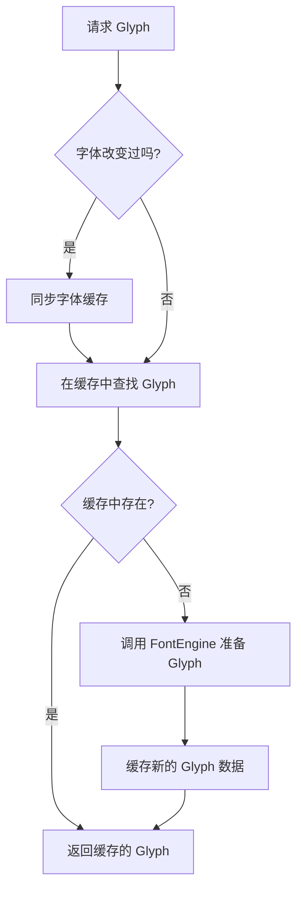

## 类结构

```
glyph_cache (结构体: 存储单个字形数据)
font_cache (类: 管理单个字体的所有字形)
font_cache_pool (类: 管理多个 font_cache 实例)
font_cache_manager<T> (模板类: 顶层接口，管理字体引擎和缓存池)
```

## 全局变量及字段


### `glyph_data_type`
    
字形数据类型枚举，定义无效、单色、灰度8位、轮廓四种类型

类型：`enum`
    


### `glyph_data_invalid`
    
字形数据类型无效

类型：`enum value`
    


### `glyph_data_mono`
    
单色字形数据类型

类型：`enum value`
    


### `glyph_data_gray8`
    
8位灰度字形数据类型

类型：`enum value`
    


### `glyph_data_outline`
    
轮廓字形数据类型

类型：`enum value`
    


### `glyph_rendering`
    
字形渲染方式枚举，定义原生单色、原生灰度、AGG单色、AGG灰度、轮廓渲染

类型：`enum`
    


### `block_size_e`
    
字体缓存块大小枚举，定义内存块大小为16384-16字节

类型：`enum`
    


### `glyph_cache.glyph_index`
    
字形索引

类型：`unsigned`
    


### `glyph_cache.data`
    
字形原始数据指针

类型：`int8u*`
    


### `glyph_cache.data_size`
    
数据大小

类型：`unsigned`
    


### `glyph_cache.data_type`
    
数据类型(单色/灰度/轮廓)

类型：`glyph_data_type`
    


### `glyph_cache.bounds`
    
字形边界框

类型：`rect_i`
    


### `glyph_cache.advance_x`
    
X轴步进距离

类型：`double`
    


### `glyph_cache.advance_y`
    
Y轴步进距离

类型：`double`
    


### `font_cache.m_allocator`
    
内存块分配器

类型：`block_allocator`
    


### `font_cache.m_glyphs`
    
二维数组(256x256)存储字形指针

类型：`glyph_cache**`
    


### `font_cache.m_font_signature`
    
字体签名标识

类型：`char*`
    


### `font_cache_pool.m_fonts`
    
字体缓存指针数组

类型：`font_cache**`
    


### `font_cache_pool.m_max_fonts`
    
最大字体数量

类型：`unsigned`
    


### `font_cache_pool.m_num_fonts`
    
当前字体数量

类型：`unsigned`
    


### `font_cache_pool.m_cur_font`
    
当前活动字体

类型：`font_cache*`
    


### `font_cache_manager.m_fonts`
    
字体池

类型：`font_cache_pool`
    


### `font_cache_manager.m_engine`
    
字体引擎引用

类型：`FontEngine&`
    


### `font_cache_manager.m_change_stamp`
    
字体变更戳

类型：`int`
    


### `font_cache_manager.m_prev_glyph`
    
上一个字形(用于连字/字距调整)

类型：`const glyph_cache*`
    


### `font_cache_manager.m_last_glyph`
    
当前字形

类型：`const glyph_cache*`
    


### `font_cache_manager.m_path_adaptor`
    
轮廓渲染适配器

类型：`path_adaptor_type`
    


### `font_cache_manager.m_gray8_adaptor`
    
灰度渲染适配器

类型：`gray8_adaptor_type`
    


### `font_cache_manager.m_mono_adaptor`
    
单色渲染适配器

类型：`mono_adaptor_type`
    
    

## 全局函数及方法


### font_cache.signature

设置当前字体的签名（标识符），用于区分不同的字体。当字体签名改变时，该方法会重置字形缓存。

参数：

- `font_signature`：`const char*`，指向以 null 终止的字符串，表示字体的唯一标识符（例如字体名称、字体文件路径等）

返回值：`void`，无返回值

#### 流程图

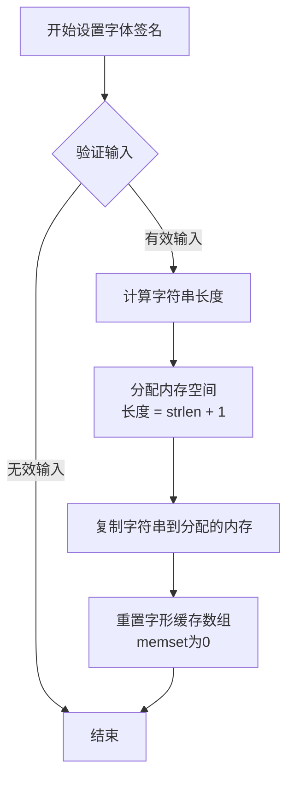

#### 带注释源码

```cpp
//--------------------------------------------------------------------
void signature(const char* font_signature)
{
    // 使用内存分配器分配足够的空间来存储字体签名字符串
    // 分配大小 = 字符串长度 + 1（用于终止空字符 '\0'）
    m_font_signature = (char*)m_allocator.allocate(strlen(font_signature) + 1);
    
    // 将传入的字体签名字符串复制到新分配的内存中
    strcpy(m_font_signature, font_signature);
    
    // 重置字形缓存数组，将所有256个指针清零
    // 这样可以确保切换字体时不会使用之前字体的缓存数据
    memset(m_glyphs, 0, sizeof(m_glyphs));
}
```


### `font_cache.font_is`

该方法用于检查传入的字体签名是否与当前缓存的字体签名匹配，是字体缓存管理的身份验证函数。

参数：

- `font_signature`：`const char*`，需要检查的字体签名字符串

返回值：`bool`，如果传入的字体签名与当前缓存的字体签名相同返回 `true`，否则返回 `false`

#### 流程图

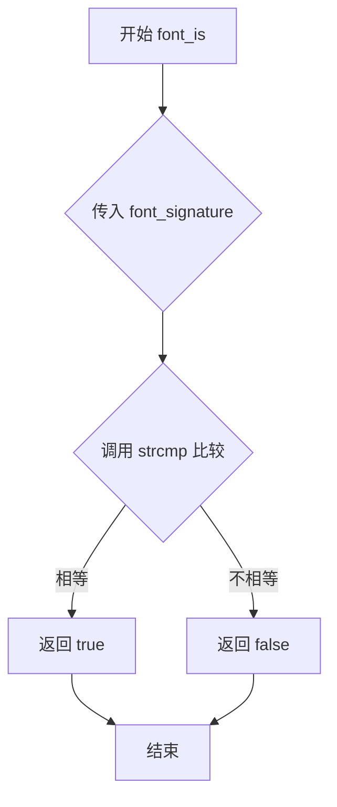

#### 带注释源码

```cpp
//--------------------------------------------------------------------
bool font_is(const char* font_signature) const
{
    // 使用标准库函数strcmp比较两个字符串
    // 如果相等返回0，此时表达式值为true
    // 如果不等返回非0，此时表达式值为false
    return strcmp(font_signature, m_font_signature) == 0;
}
```


### `font_cache.find_glyph(unsigned) const`

该函数是 `font_cache` 类中的字形查找方法，通过将字形代码的高 8 位（MSB）作为一级索引，低 8 位（LSB）作为二级索引，在两级数组结构中查找对应的字形缓存。如果找到则返回指向 `glyph_cache` 结构的指针，否则返回 `nullptr`。这是一个只读查询操作，不会修改缓存状态。

参数：

- `glyph_code`：`unsigned`，字形代码（Unicode 码点），用于唯一标识一个字符的字形

返回值：`const glyph_cache*`，指向字形缓存结构的常量指针，如果未找到对应字形则返回 `nullptr`

#### 流程图

```mermaid
flowchart TD
    A[开始查找字形] --> B[提取glyph_code的高8位作为msb索引]
    B --> C{检查m_glyphs[msb]是否存在}
    C -->|否| D[返回nullptr]
    C -->|是| E[提取glyph_code的低8位作为lsb索引]
    E --> F{检查m_glyphs[msb][lsb]是否存在}
    F -->|否| D
    F -->|是| G[返回m_glyphs[msb][lsb]指针]
    D --> H[结束查找]
    G --> H
```

#### 带注释源码

```cpp
//--------------------------------------------------------------------
const glyph_cache* find_glyph(unsigned glyph_code) const
{
    // 将字形代码右移8位并取低8位，得到高字节索引（0-255）
    unsigned msb = (glyph_code >> 8) & 0xFF;
    
    // 检查一级索引是否存在（即该高字节对应的字形数组是否已分配）
    if(m_glyphs[msb]) 
    {
        // 提取字形代码的低8位作为低字节索引
        // 返回对应字形缓存的指针
        return m_glyphs[msb][glyph_code & 0xFF];
    }
    
    // 如果一级索引不存在，说明该字形从未被缓存过
    // 返回nullptr表示未找到
    return 0;
}
```

#### 关键组件信息

- **m_glyphs**：二级指针数组 `glyph_cache** m_glyphs[256]`，存储256个指向字形缓存数组的指针，每个数组包含256个可能的字形缓存项，形成 256x256 的查找表
- **glyph_cache**：字形缓存结构体，包含字形索引、数据指针、数据大小、数据类型、边界框和前进量等信息

#### 潜在的技术债务或优化空间

1. **硬编码的索引大小**：使用 8 位索引（256）意味着只能处理 16 位的字形代码（最多 65536 个不同的字形），对于某些复杂的字体系统可能不够
2. **缺乏线程安全性**：作为并发使用场景，该类没有提供任何锁机制，在多线程环境下可能产生竞态条件
3. **返回 0 而非 nullptr**：虽然功能等价，但现代 C++ 推荐使用 `nullptr` 替代 `0` 作为空指针常量
4. **内存碎片风险**：使用 `block_allocator` 进行内存分配，虽然高效但可能导致内存碎片化

#### 其它项目

- **设计目标**：通过两级数组结构实现 O(1) 时间复杂度的字形查找，避免每次都从字体引擎加载字形数据
- **约束**：字形代码被假设为 16 位值（0x0000 - 0xFFFF），超出此范围的行为未定义
- **错误处理**：通过返回 `nullptr` 表示未找到的字形，调用者需要检查返回值是否为 `nullptr` 再使用
- **数据流**：该函数是只读查询，不修改任何缓存状态，与 `cache_glyph` 方法配合使用形成"查询-缓存"模式


### `font_cache.cache_glyph`

该函数是 `font_cache` 类的核心方法之一，负责将一个新的字形（Glyph）及其关联数据（像素数据、边界框、前进量）写入到字体缓存的内存结构中。它通过字形码的高位字节（MSB）和低位字节（LSB）构建二级索引数组来管理字形，若目标位置已存在字形则拒绝覆盖。

参数：

-  `glyph_code`：`unsigned`，字形码（Unicode 或字体特定编码），用于计算缓存索引。
-  `glyph_index`：`unsigned`，字形在底层字体引擎中的索引 ID。
-  `data_size`：`unsigned`，字形像素数据缓冲区的大小（字节）。
-  `data_type`：`glyph_data_type`，字形数据的类型枚举（如 `glyph_data_mono`, `glyph_data_gray8`, `glyph_data_outline`）。
-  `bounds`：`const rect_i&`，字形的渲染边界矩形。
-  `advance_x`：`double`，渲染完该字形后水平方向的光标前进量。
-  `advance_y`：`double`，渲染完该字形后垂直方向的光标前进量。

返回值：`glyph_cache*`，返回指向新缓存字形对象的指针；如果该字形码（MSB+LSB）已存在于缓存中，则返回 `0` 以表示未执行覆盖操作。

#### 流程图

```mermaid
flowchart TD
    A([开始 cache_glyph]) --> B[计算 MSB = (glyph_code >> 8) & 0xFF]
    B --> C{检查 m_glyphs[MSB] 数组是否存在?}
    C -- No --> D[分配 256个 glyph_cache* 指针数组]
    D --> E
    C -- Yes --> E[计算 LSB = glyph_code & 0xFF]
    E --> F{检查 m_glyphs[MSB][LSB] 是否已有字形?}
    F -- Yes --> G[返回 0 (已存在，不覆盖)]
    F -- No --> H[分配 glyph_cache 结构体内存]
    H --> I[分配字形像素数据 data 内存]
    I --> J[填充 glyph_index, data_size, data_type, bounds, advance 等字段]
    J --> K[将指针存入 m_glyphs[MSB][LSB]]
    K --> L([返回 glyph 指针])
```

#### 带注释源码

```cpp
        //--------------------------------------------------------------------
        // 缓存一个新的字形到字体缓存管理器中
        //--------------------------------------------------------------------
        glyph_cache* cache_glyph(unsigned        glyph_code, 
                                 unsigned        glyph_index,
                                 unsigned        data_size,
                                 glyph_data_type data_type,
                                 const rect_i&   bounds,
                                 double          advance_x,
                                 double          advance_y)
        {
            // 1. 计算高位字节 (MSB)，作为第一级数组索引
            unsigned msb = (glyph_code >> 8) & 0xFF;
            
            // 2. 如果该 MSB 索引下的指针数组尚未创建，则创建它
            //    这里使用了一个二维数组结构 [256][256] 来理论上支持 64k 个字形
            if(m_glyphs[msb] == 0)
            {
                m_glyphs[msb] = 
                    (glyph_cache**)m_allocator.allocate(sizeof(glyph_cache*) * 256, 
                                                        sizeof(glyph_cache*));
                // 初始化内存为零，确保所有槽位初始为空指针
                memset(m_glyphs[msb], 0, sizeof(glyph_cache*) * 256);
            }

            // 3. 计算低位字节 (LSB)，作为第二级数组索引
            unsigned lsb = glyph_code & 0xFF;
            
            // 4. 检查该具体槽位是否已被占用
            if(m_glyphs[msb][lsb]) return 0; // Already exists, do not overwrite

            // 5. 为 glyph_cache 结构体分配内存
            //    使用内存分配器进行对齐分配
            glyph_cache* glyph = 
                (glyph_cache*)m_allocator.allocate(sizeof(glyph_cache),
                                                   sizeof(double));

            // 6. 为实际的字形像素数据分配内存
            glyph->data               = m_allocator.allocate(data_size);
            
            // 7. 填充字形结构体的各个属性
            glyph->glyph_index        = glyph_index;
            glyph->data_size          = data_size;
            glyph->data_type          = data_type;
            glyph->bounds             = bounds;
            glyph->advance_x          = advance_x;
            glyph->advance_y          = advance_y;
            
            // 8. 将新分配的 glyph 指针写入缓存数组，并返回该指针
            return m_glyphs[msb][lsb] = glyph;
        }
```


### `font_cache_pool::~font_cache_pool`

这是 `font_cache_pool` 类的析构函数，负责释放该对象在其生命周期内分配的所有字体缓存资源。它首先遍历并释放数组中每个活动的 `font_cache` 对象，然后释放存储这些指针的数组内存，防止内存泄漏。

参数：

- （无）

返回值：

- `void`，无返回值

#### 流程图

```mermaid
graph TD
    A([开始]) --> B{m_num_fonts > 0}
    B -- 是 --> C[遍历 i = 0 到 m_num_fonts - 1]
    C --> D[调用 obj_allocator::deallocate 释放 m_fonts[i]]
    D --> E{i < m_num_fonts - 1}
    E -- 是 --> C
    E -- 否 --> F[调用 pod_allocator::deallocate 释放 m_fonts 数组]
    F --> G([结束])
    B -- 否 --> F
```

#### 带注释源码

```cpp
// 析构函数：释放所有字体缓存
~font_cache_pool()
{
    unsigned i;
    // 遍历当前所有已分配的字体缓存
    for(i = 0; i < m_num_fonts; ++i)
    {
        // 使用对象分配器释放每个 font_cache 实例
        obj_allocator<font_cache>::deallocate(m_fonts[i]);
    }
    // 释放存储字体指针的动态数组本身
    pod_allocator<font_cache*>::deallocate(m_fonts, m_max_fonts);
}
```


### `font_cache_pool.font`

该方法是字体缓存池的核心方法，用于根据字体签名查找现有字体缓存或在必要时创建新的字体缓存，支持可选的缓存重置功能。

参数：

- `font_signature`：`const char*`，字体的唯一标识签名，用于查找或创建对应的字体缓存
- `reset_cache`：`bool`，可选参数，默认为 false；为 true 时表示需要重置该字体的缓存数据

返回值：`void`，无返回值

#### 流程图

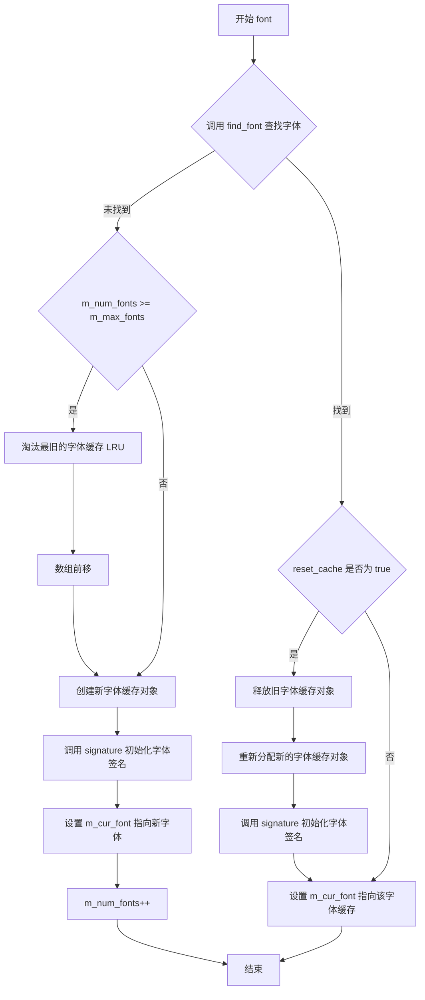

#### 带注释源码

```
//--------------------------------------------------------------------
void font(const char* font_signature, bool reset_cache = false)
{
    // 首先在字体池中查找是否已存在该字体的缓存
    int idx = find_font(font_signature);
    
    // 如果找到了对应的字体缓存
    if(idx >= 0)
    {
        // 如果需要重置该字体的缓存
        if(reset_cache)
        {
            // 释放旧的字体缓存对象占用的内存
            obj_allocator<font_cache>::deallocate(m_fonts[idx]);
            // 重新分配一个新的字体缓存对象
            m_fonts[idx] = obj_allocator<font_cache>::allocate();
            // 使用新的字体签名初始化该缓存对象
            m_fonts[idx]->signature(font_signature);
        }
        // 将当前字体指针指向找到或重新创建的字体缓存
        m_cur_font = m_fonts[idx];
    }
    else
    {
        // 未找到对应的字体缓存，需要创建新的
        
        // 检查字体池是否已满
        if(m_num_fonts >= m_max_fonts)
        {
            // 池已满，采用 LRU 策略淘汰最旧的字体（索引0）
            obj_allocator<font_cache>::deallocate(m_fonts[0]);
            // 将数组中的元素向前移动，移除第一个元素
            memcpy(m_fonts, 
                   m_fonts + 1, 
                   (m_max_fonts - 1) * sizeof(font_cache*));
            // 字体数量减一
            m_num_fonts = m_max_fonts - 1;
        }
        
        // 为新字体分配缓存对象
        m_fonts[m_num_fonts] = obj_allocator<font_cache>::allocate();
        // 初始化字体签名
        m_fonts[m_num_fonts]->signature(font_signature);
        // 设置当前字体指针
        m_cur_font = m_fonts[m_num_fonts];
        // 字体数量加一
        ++m_num_fonts;
    }
}
```


### `font_cache_pool.font() const`

获取当前活动的字体缓存对象。该方法是 `font_cache_pool` 类的常量成员函数，用于返回当前被设置为活动状态的字体缓存指针，以便调用方可以访问当前字体的缓存信息。

参数：

- （无参数）

返回值：`const font_cache*`，返回指向当前字体缓存对象的常量指针。如果没有设置当前字体（即 `m_cur_font` 为空），则返回 `nullptr`。

#### 流程图

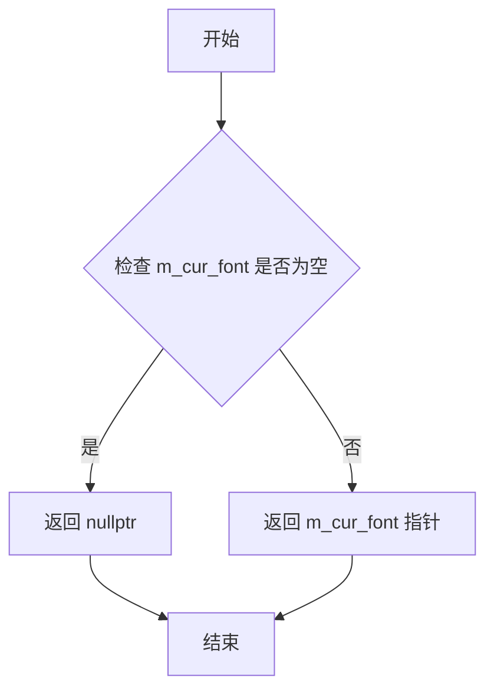

#### 带注释源码

```cpp
// 获取当前字体缓存的常量成员函数
// 返回当前活动的 font_cache 对象的指针
const font_cache* font() const
{
    // 直接返回成员变量 m_cur_font
    // 该指针指向当前被激活的字体缓存块
    // 如果尚未设置任何字体，此处返回 nullptr
    return m_cur_font;
}
```


### `font_cache_pool.find_glyph`

该函数是 `font_cache_pool` 类的常量成员方法，用于在当前字体缓存中查找指定字形代码对应的字形缓存条目。如果当前字体存在，则委托给底层 `font_cache` 对象的查找方法；若当前字体不存在，则返回空指针。

参数：

- `glyph_code`：`unsigned`，要查找的字形代码（通常是 Unicode 码点或字形索引）

返回值：`const glyph_cache*`，返回指向字形缓存条目的常量指针，如果未找到或当前字体为空则返回 `nullptr`

#### 流程图

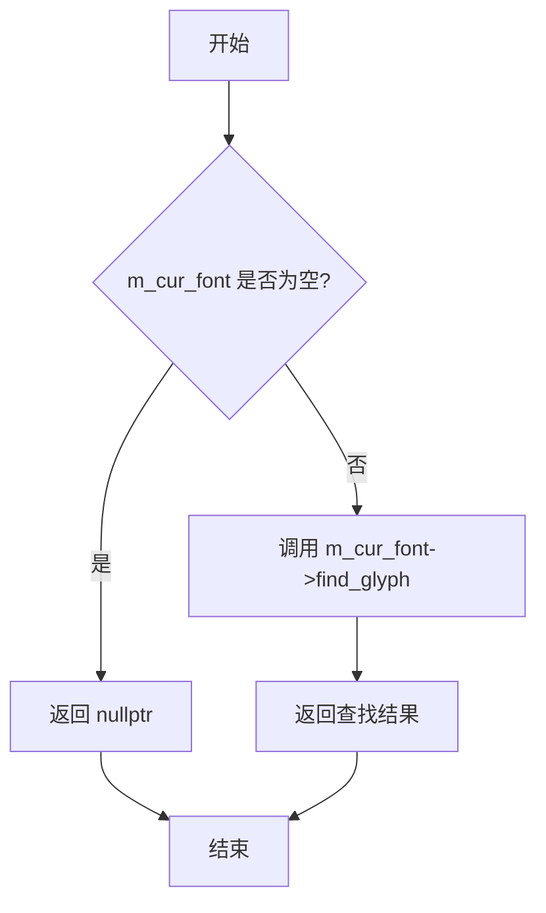

#### 带注释源码

```cpp
//--------------------------------------------------------------------
const glyph_cache* find_glyph(unsigned glyph_code) const
{
    // 检查当前字体是否已设置
    if(m_cur_font) 
    {
        // 委托给 font_cache 对象执行实际查找
        return m_cur_font->find_glyph(glyph_code);
    }
    // 当前无字体设置，返回空指针
    return 0;
}
```


### font_cache_pool.cache_glyph

该方法是 Anti-Grain Geometry (AGG) 字体缓存池管理器的核心方法，用于将字形数据缓存到当前活动字体的缓存中。它首先检查是否存在当前字体，如果存在则委托给底层 `font_cache` 对象的 `cache_glyph` 方法执行实际的缓存操作；如果没有当前字体则返回 nullptr。

参数：

- `glyph_code`：`unsigned`，字形码（通常为 Unicode 编码），用于唯一标识一个字符
- `glyph_index`：`unsigned`，字形索引，表示字形在字体文件中的索引位置
- `data_size`：`unsigned`，字形数据的大小（字节数）
- `data_type`：`glyph_data_type`，字形数据类型，枚举值包括 `glyph_data_invalid`、`glyph_data_mono`、`glyph_data_gray8`、`glyph_data_outline`
- `bounds`：`const rect_i&`，字形的边界矩形，定义了字形在画布上的位置和尺寸
- `advance_x`：`double`，X 方向的推进距离，用于计算下一个字符的起始位置
- `advance_y`：`double`，Y 方向的推进距离，用于计算下一个字符的起始位置

返回值：`glyph_cache*`，返回缓存后的字形指针；如果缓存失败（例如没有当前字体）则返回 0（nullptr）

#### 流程图

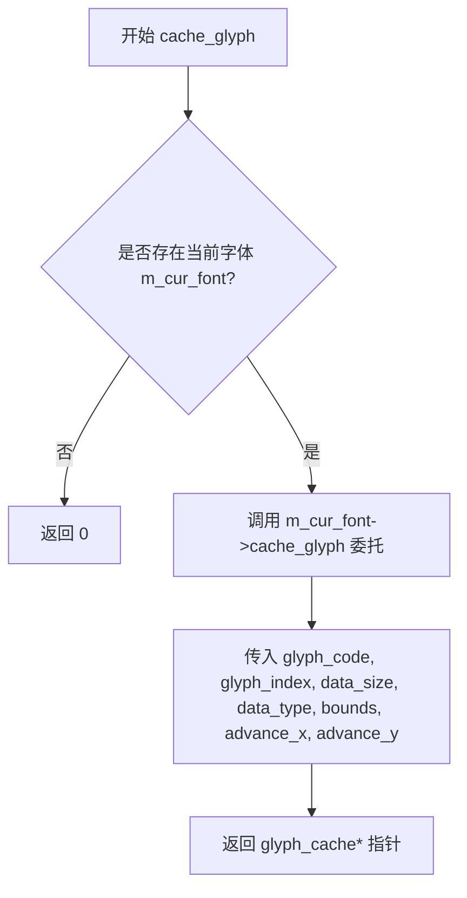

#### 带注释源码

```cpp
//---------------------------------------------------------font_cache_pool
class font_cache_pool
{
public:
    //--------------------------------------------------------------------
    // 缓存字形到当前字体的缓存池中
    // 参数:
    //   glyph_code  - 字形码(Unicode编码)
    //   glyph_index - 字形索引
    //   data_size   - 字形数据大小
    //   data_type   - 字形数据类型(单色/灰度/轮廓)
    //   bounds      - 字形边界矩形
    //   advance_x   - X方向推进距离
    //   advance_y   - Y方向推进距离
    // 返回:
    //   成功返回缓存的字形指针, 失败返回0
    //--------------------------------------------------------------------
    glyph_cache* cache_glyph(unsigned        glyph_code, 
                             unsigned        glyph_index,
                             unsigned        data_size,
                             glyph_data_type data_type,
                             const rect_i&   bounds,
                             double          advance_x,
                             double          advance_y)
    {
        // 检查是否存在当前活动的字体
        if(m_cur_font) 
        {
            // 委托给底层 font_cache 对象执行实际缓存操作
            return m_cur_font->cache_glyph(glyph_code,
                                           glyph_index,
                                           data_size,
                                           data_type,
                                           bounds,
                                           advance_x,
                                           advance_y);
        }
        // 没有当前字体,返回0表示失败
        return 0;
    }

private:
    font_cache** m_fonts;      // 字体缓存指针数组
    unsigned     m_max_fonts;  // 最大支持字体数量
    unsigned     m_num_fonts;  // 当前已缓存字体数量
    font_cache*  m_cur_font;   // 当前活动的字体缓存
};
```


### `font_cache_pool.find_font`

该函数用于在字体缓存池中查找具有指定字体签名的字体，返回其索引值；如果未找到匹配的字体会返回 -1。

参数：

- `font_signature`：`const char*`，字体的唯一标识签名，用于匹配已缓存的字体

返回值：`int`，返回找到的字体在缓存池中的索引（从 0 开始），如果未找到则返回 -1

#### 流程图

```mermaid
flowchart TD
    A[开始 find_font] --> B[初始化 i = 0]
    B --> C{i < m_num_fonts?}
    C -->|是| D[获取 m_fonts[i]]
    D --> E{m_fonts[i]->font_is(font_signature)?}
    C -->|否| F[返回 -1 未找到]
    E -->|是| G[返回索引 i]
    E -->|否| H[i++]
    H --> C
```

#### 带注释源码

```cpp
//--------------------------------------------------------------------
int find_font(const char* font_signature)
{
    unsigned i;
    // 线性遍历所有已缓存的字体
    for(i = 0; i < m_num_fonts; i++)
    {
        // 调用字体的 font_is 方法比较签名是否匹配
        if(m_fonts[i]->font_is(font_signature)) 
        {
            // 找到匹配的字体，返回其索引
            return int(i);
        }
    }
    // 遍历完所有字体均未匹配，返回 -1 表示未找到
    return -1;
}
```


### `font_cache_manager.glyph(unsigned)`

获取指定字形码的字形缓存数据，如果缓存中不存在则通过字体引擎生成并缓存该字形。

参数：

- `glyph_code`：`unsigned`，字形码（Unicode 编码点），用于标识需要获取的字形

返回值：`const glyph_cache*`，返回字形缓存指针；如果字形不存在或无法生成则返回 `nullptr`

#### 流程图

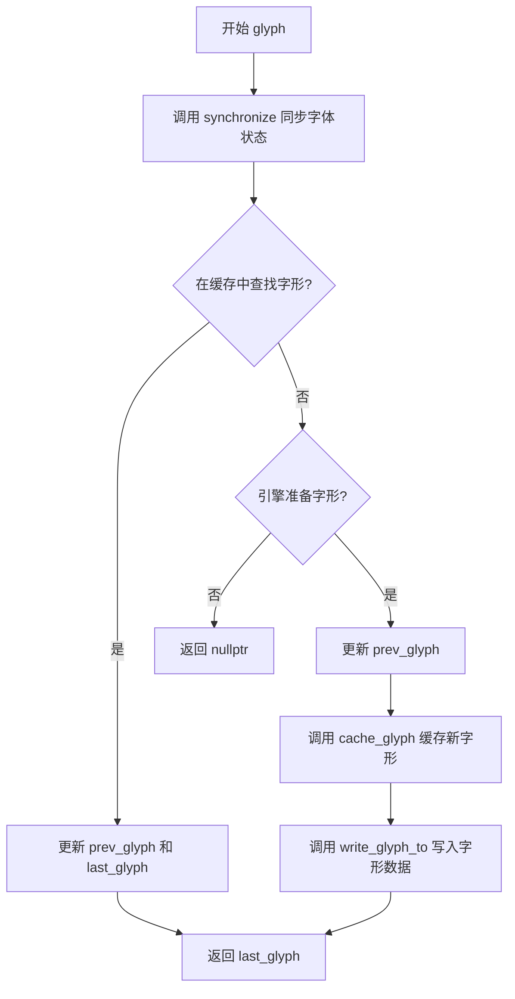

#### 带注释源码

```cpp
//----------------------------------------------------------------------------
// 获取字形的主方法
//----------------------------------------------------------------------------
const glyph_cache* glyph(unsigned glyph_code)
{
    // 第一步：同步字体状态
    // 检查字体引擎的 change_stamp 是否变化，如变化则重新加载字体缓存
    synchronize();
    
    // 第二步：在字体缓存池中查找是否已有该字形的缓存
    const glyph_cache* gl = m_fonts.find_glyph(glyph_code);
    
    // 第三步：缓存命中情况
    if(gl) 
    {
        // 将当前字形保存为上一次字形
        m_prev_glyph = m_last_glyph;
        // 更新最后访问的字形并返回
        return m_last_glyph = gl;
    }
    else
    {
        // 第四步：缓存未命中，尝试通过字体引擎生成字形
        if(m_engine.prepare_glyph(glyph_code))
        {
            // 保存上一次字形
            m_prev_glyph = m_last_glyph;
            
            // 从字体引擎获取字形各项参数，在缓存池中创建新条目
            m_last_glyph = m_fonts.cache_glyph(glyph_code, 
                                               m_engine.glyph_index(),      // 字形索引
                                               m_engine.data_size(),        // 数据大小
                                               m_engine.data_type(),        // 数据类型
                                               m_engine.bounds(),            // 边界矩形
                                               m_engine.advance_x(),        // X轴前进量
                                               m_engine.advance_y());       // Y轴前进量
            
            // 将引擎生成的字形数据写入缓存的数据区域
            m_engine.write_glyph_to(m_last_glyph->data);
            
            // 返回新缓存的字形
            return m_last_glyph;
        }
    }
    
    // 第五步：字形不存在或生成失败，返回空指针
    return 0;
}
```


### `font_cache_manager.init_embedded_adaptors`

该方法根据传入的字形缓存对象的数据类型，初始化相应的嵌入渲染适配器（单色、灰度或轮廓），用于后续的栅格化渲染操作。

参数：

- `gl`：`const glyph_cache*`，指向字形缓存对象的指针，包含字形数据和渲染类型信息
- `x`：`double`，渲染的X坐标位置
- `y`：`double`，渲染的Y坐标位置
- `scale`：`double`，渲染缩放因子，默认为1.0

返回值：`void`，无返回值

#### 流程图

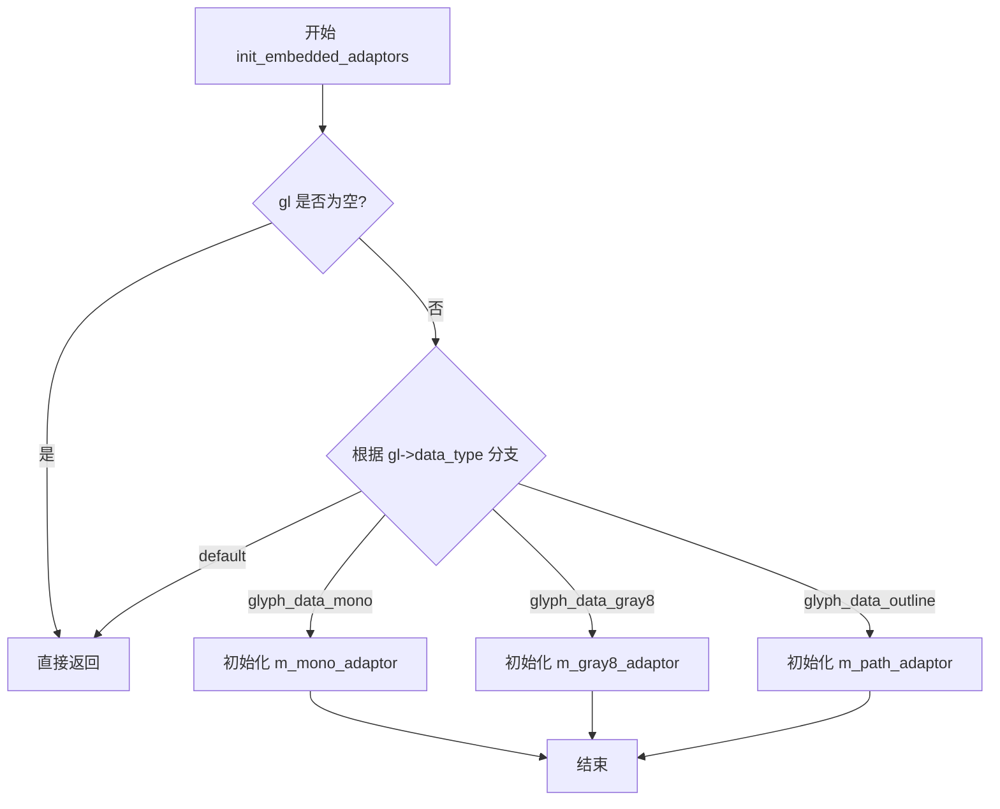

#### 带注释源码

```cpp
//----------------------------------------------------------------------------
// 方法: init_embedded_adaptors
// 描述: 根据字形缓存的数据类型初始化相应的嵌入渲染适配器
//----------------------------------------------------------------------------
void init_embedded_adaptors(const glyph_cache* gl, 
                            double x, double y, 
                            double scale=1.0)
{
    // 检查字形缓存指针是否有效
    if(gl)
    {
        // 根据字形数据类型选择合适的适配器进行初始化
        switch(gl->data_type)
        {
        default: 
            // 未知数据类型，直接返回
            return;
            
        case glyph_data_mono:
            // 单色位图格式，初始化单色适配器
            // 参数: 字形数据指针、数据大小、渲染坐标(x,y)
            m_mono_adaptor.init(gl->data, gl->data_size, x, y);
            break;

        case glyph_data_gray8:
            // 8位灰度格式，初始化灰度适配器
            // 参数: 字形数据指针、数据大小、渲染坐标(x,y)
            m_gray8_adaptor.init(gl->data, gl->data_size, x, y);
            break;

        case glyph_data_outline:
            // 轮廓(矢量)格式，初始化路径适配器
            // 参数: 字形数据指针、数据大小、渲染坐标(x,y)、缩放因子
            // 注意: 轮廓格式支持缩放，其他格式不支持
            m_path_adaptor.init(gl->data, gl->data_size, x, y, scale);
            break;
        }
    }
}
```


### `font_cache_manager.path_adaptor`

获取当前字体 glyph 的路径适配器引用，用于渲染轮廓类型的字形。该方法返回内部成员变量 `m_path_adaptor` 的引用，使调用者可以直接操作路径适配器进行矢量路径渲染。

参数： 无

返回值：`path_adaptor_type&`，返回路径适配器的引用，用于渲染 glyph 的轮廓数据

#### 流程图

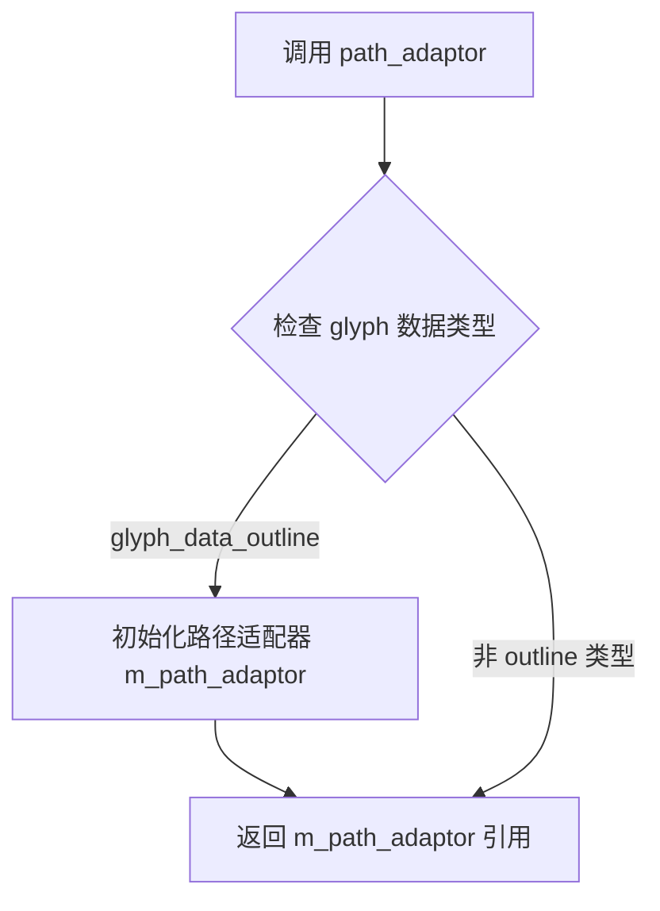

#### 带注释源码

```cpp
//--------------------------------------------------------------------
path_adaptor_type&   path_adaptor()   { return m_path_adaptor;   }
```

**源码解析：**

- `path_adaptor_type`：类型别名，定义为 `font_engine_type::path_adaptor_type`，具体类型由字体引擎模板参数决定
- `m_path_adaptor`：类的私有成员变量，类型为 `path_adaptor_type`，在 `init_embedded_adaptors` 方法中被初始化
- 返回引用而非副本：这样可以避免拷贝开销，并且允许调用者修改适配器状态
- 该方法通常与 `init_embedded_adaptors` 配合使用，先初始化适配器，再获取引用进行渲染


### `font_cache_manager.gray8_adaptor`

获取灰度8位适配器的引用，用于渲染灰度字形数据。该方法是模板类 `font_cache_manager` 的成员函数，提供对内部灰度适配器的访问，使调用者能够使用灰度渲染模式处理字形。

参数：
- （无参数）

返回值：`gray8_adaptor_type&`，返回灰度8位适配器对象的引用，用于扫描线渲染灰度字形位图。

#### 流程图

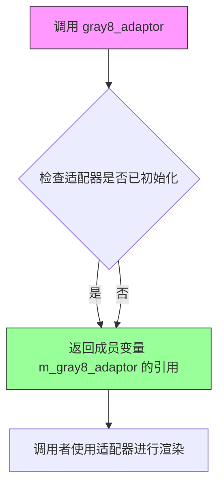

#### 带注释源码

```cpp
//----------------------------------------------------------------------------
// 获取灰度8位适配器的引用
//----------------------------------------------------------------------------
// 返回类型：gray8_adaptor_type& (模板类型，来源于 FontEngine::gray8_adaptor_type)
// 功能：返回内部成员变量 m_gray8_adaptor 的引用，该适配器用于
//       将缓存的字形数据转换为灰度扫描线进行渲染
//----------------------------------------------------------------------------
gray8_adaptor_type& gray8_adaptor()
{ 
    return m_gray8_adaptor;  // 返回灰度适配器引用，供外部渲染使用
}

//----------------------------------------------------------------------------
// 相关成员变量定义（在类模板中）
//----------------------------------------------------------------------------
private:
    // ... 其他成员变量
    gray8_adaptor_type  m_gray8_adaptor;  // 灰度8位渲染适配器实例
    // ...

//----------------------------------------------------------------------------
// 使用示例（在 init_embedded_adaptors 中初始化）
//----------------------------------------------------------------------------
/*
case glyph_data_gray8:
    m_gray8_adaptor.init(gl->data, gl->data_size, x, y);  // 初始化适配器
    break;
*/
```

---

### 补充信息

**类型来源说明：**
- `gray8_adaptor_type` 是模板参数 `FontEngine` 定义的类型别名
- 该类型通常包含 `init()` 方法用于初始化字形数据
- 该类型还包含嵌入式扫描线接口 `embedded_scanline`，可通过 `gray8_scanline()` 获取

**设计目的：**
- 提供对内部适配器的访问接口，使渲染系统可以直接使用缓存的字形数据
- 返回引用而非副本，避免不必要的数据拷贝，提高渲染效率


### `font_cache_manager.mono_adaptor`

该方法用于获取单色字形渲染的适配器引用，允许调用者直接访问内部存储的单色适配器对象，以便进行后续的扫描线渲染操作。

参数：
- 该方法无参数

返回值：`mono_adaptor_type&`，返回单色适配器的引用，用于渲染单色（1位色深）字形数据

#### 流程图

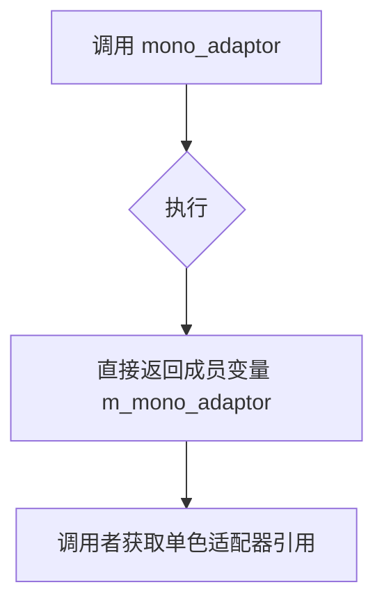

#### 带注释源码

```cpp
//--------------------------------------------------------------------
        // 获取单色适配器引用
        // 返回类型为font_engine_type::mono_adaptor_type的引用
        // 该适配器用于渲染单色字形（1位色深）
        mono_adaptor_type&   mono_adaptor()   { return m_mono_adaptor;   }
```

#### 补充说明

- **设计目的**: 提供对内部 `m_mono_adaptor` 成员的直接访问，使外部渲染引擎可以使用单色适配器进行字形扫描线渲染
- **相关方法**: 
  - `gray8_adaptor()` - 获取灰度8位适配器
  - `path_adaptor()` - 获取轮廓路径适配器
  - `mono_scanline()` - 获取单色扫描线类型
- **数据流**: 该方法返回的引用由 `init_embedded_adaptors()` 方法在 `glyph_data_mono` 类型的字形初始化时填充


### `font_cache_manager.add_kerning`

该方法用于在文本渲染时根据前一个 glyph 和当前 glyph 的索引值计算并应用字距调整（Kerning），通过引擎的 `add_kerning` 接口获取调整值并写入到传入的坐标指针中。

参数：

- `x`：`double*`，指向 X 轴字距调整值的指针，方法执行后该值将被修改为 X 方向的调整量
- `y`：`double*`，指向 Y 轴字距调整值的指针，方法执行后该值将被修改为 Y 方向的调整量

返回值：`bool`，如果成功获取到字距调整值则返回 `true`，当前后 glyph 不存在或无法计算时返回 `false`

#### 流程图

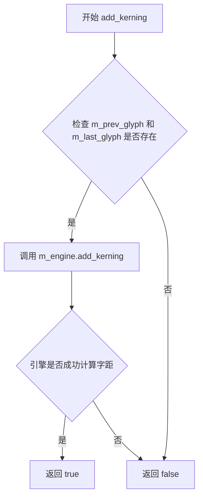

#### 带注释源码

```cpp
//--------------------------------------------------------------------
/**
 * @brief 添加字距调整
 * 
 * 根据前一个 glyph（m_prev_glyph）和当前 glyph（m_last_glyph）的索引，
 * 调用字体引擎的 add_kerning 方法计算字距调整值，并写入到 x、y 指针所指向的内存中。
 *
 * @param x 指向 X 轴调整值的指针，输出参数
 * @param y 指向 Y 轴调整值的指针，输出参数
 * @return bool 成功返回 true，失败返回 false
 */
bool add_kerning(double* x, double* y)
{
    // 检查前后两个 glyph 是否都存在
    if(m_prev_glyph && m_last_glyph)
    {
        // 调用字体引擎的 kerning 计算接口
        // 传入前后 glyph 的索引，以及调整值的输出指针
        return m_engine.add_kerning(m_prev_glyph->glyph_index, 
                                    m_last_glyph->glyph_index,
                                    x, y);
    }
    // 任意一个 glyph 不存在则无法进行字距调整
    return false;
}
```


### `font_cache_manager.precache`

该方法用于批量预缓存指定范围内的字形数据，通过遍历从起始字形码到结束字形码的每一个字形，调用内部的glyph方法将它们加载到字体缓存中，从而避免后续渲染时的延迟。

参数：

- `from`：`unsigned`，预缓存的起始字形码（包含该值）
- `to`：`unsigned`，预缓存的结束字形码（包含该值）

返回值：`void`，无返回值描述

#### 流程图

```mermaid
flowchart TD
    A[开始 precache] --> B{from <= to?}
    B -->|Yes| C[调用 glyph(from) 加载字形]
    C --> D[from++]
    D --> B
    B -->|No| E[结束]
    
    F[同步检查] -.-> C
    G[查找缓存] -.-> C
    H[引擎准备字形] -.-> C
    I[缓存字形数据] -.-> C
```

#### 带注释源码

```cpp
//--------------------------------------------------------------------
void precache(unsigned from, unsigned to)
{
    // 遍历从from到to的所有字形码
    // 对每个字形码调用glyph()方法进行加载
    // glyph()方法会：
    //   1. 首先检查缓存是否需要同步（字体切换等）
    //   2. 查找该字形是否已存在于缓存中
    //   3. 若不存在，则通过FontEngine准备字形数据
    //   4. 将字形数据缓存到font_cache中
    // 这样在后续渲染时可以直接从缓存获取，无需再加载
    for(; from <= to; ++from) glyph(from);
}
```


### `font_cache_manager.reset_cache`

该方法用于重置字体缓存管理器，清空当前字体缓存并重置字形缓存状态，确保后续字形查询从头开始。

参数：  
无

返回值：`void`，无返回值

#### 流程图

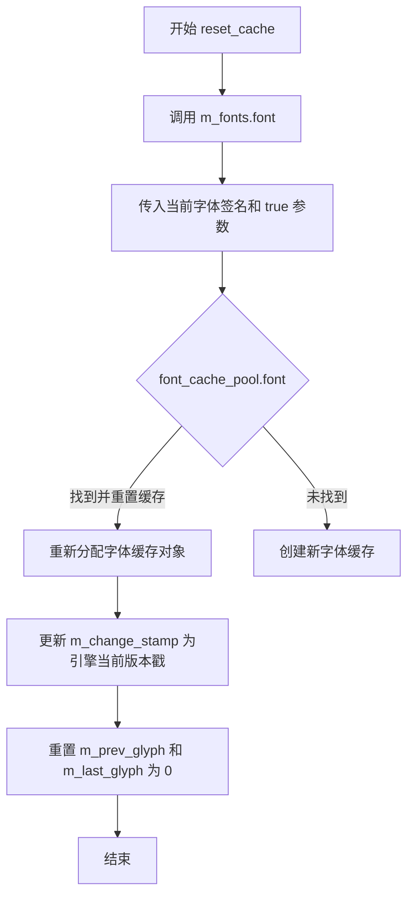

#### 带注释源码

```cpp
//--------------------------------------------------------------------
void reset_cache()
{
    // 调用 font_cache_pool 的 font 方法，传入当前字体的签名，
    // 第二个参数 true 表示需要重置该字体的缓存
    m_fonts.font(m_engine.font_signature(), true);
    
    // 同步当前引擎的 change_stamp，用于标记缓存的有效版本
    m_change_stamp = m_engine.change_stamp();
    
    // 重置上一次和当前字形指针，确保缓存状态从头开始
    m_prev_glyph = m_last_glyph = 0;
}
```


### `font_cache_manager.synchronize`

该私有方法用于同步字体缓存管理器的内部状态。它通过比较字体引擎的变更戳（change_stamp）来检测字体是否发生变化，若发生变化则更新当前字体、重置变更戳，并清空之前缓存的字符 glyph 信息，确保后续 glyph 查询使用最新的字体状态。

参数： 无

返回值：`void`，无返回值描述

#### 流程图

```mermaid
flowchart TD
    A[开始 synchronize] --> B{检查 change_stamp}
    B -->|m_change_stamp != m_engine.change_stamp()| C[字体已改变]
    B -->|相等| D[字体未改变, 直接返回]
    
    C --> E[调用 m_fonts.font 更新当前字体]
    E --> F[重置 m_change_stamp 为引擎当前值]
    F --> G[重置 m_prev_glyph 和 m_last_glyph 为 0]
    G --> H[结束]
    D --> H
```

#### 带注释源码

```cpp
//--------------------------------------------------------------------
void synchronize()
{
    // 检查字体引擎的变更戳是否改变
    if(m_change_stamp != m_engine.change_stamp())
    {
        // 字体已改变，需要同步当前字体
        m_fonts.font(m_engine.font_signature());
        
        // 更新本地变更戳为引擎当前值
        m_change_stamp = m_engine.change_stamp();
        
        // 重置之前缓存的 glyph 状态
        // 因为字体改变后，之前的 glyph 信息已经无效
        m_prev_glyph = m_last_glyph = 0;
    }
}
```

## 关键组件


### glyph_data_type 枚举

定义字形数据类型枚举，包含无效数据、单色位图、灰度8位和轮廓四种类型。

### glyph_cache 结构体

存储单个字形的缓存信息，包括字形索引、数据指针、数据大小、数据类型、边界框和前进量。

### font_cache 类

管理单个字体的字形缓存，使用块分配器分配内存，采用256x256的稀疏数组存储字形，支持字体的签名验证和字形的查找与缓存。

### font_cache_pool 类

管理多个字体缓存的池，支持动态添加和移除字体，维护当前字体指针，提供字形查找和缓存的接口。

### font_cache_manager 模板类

字体缓存管理器模板，封装字体引擎和缓存池，提供字形获取、内嵌适配器初始化、字距调整、预缓存和缓存重置功能。

### block_allocator 依赖

代码中引用的块分配器，用于高效分配字体缓存所需的内存。

### path_adaptor_type、gray8_adaptor_type、mono_adaptor_type 适配器

代码中声明的类型别名，用于访问不同渲染方式的扫描线和适配器。


## 问题及建议


### 已知问题

- **内存泄漏风险**：`font_cache` 类中 `signature()` 方法为 `m_font_signature` 分配了内存，但在类的生命周期内没有对应的析构函数来释放这块内存。
- **未使用的成员变量**：`font_cache_manager` 类中声明了 `m_dx` 和 `m_dy` 成员变量，但在整个类中未被使用。
- **类型不一致**：`font_cache::signature()` 方法接收 `const char*` 参数，但内部将其强制转换为 `char*` 并存储，违反了 const 正确性原则。
- **边界检查缺失**：`font_cache::cache_glyph()` 方法在访问 `m_glyphs[msb]` 数组时，虽然检查了 `msb` 的计算逻辑（`glyph_code >> 8 & 0xFF`），但没有对 `glyph_code` 本身进行有效性验证，可能导致意外行为。
- **API 设计不一致**：`font_cache_pool::find_font()` 方法返回 `int` 类型表示索引，但更符合习惯的做法是返回 `unsigned` 或使用 `-1` 作为错误指示时需要明确文档化。
- **const 成员函数不完整**：`font_cache::font_is()` 方法应该是 `const` 成员函数（因为它不修改对象状态），但目前未标记为 const。
- **复制控制缺失**：`font_cache` 类缺少显式的复制构造函数和赋值运算符，可能导致浅拷贝问题（尽管成员包含指针）。

### 优化建议

- 为 `font_cache` 类添加析构函数，释放 `m_font_signature` 内存，或者考虑使用 `std::string` 替代手动内存管理。
- 移除 `font_cache_manager` 中未使用的 `m_dx` 和 `m_dy` 成员变量，或添加注释说明其预期用途。
- 将 `font_cache::signature()` 方法中的 `m_font_signature` 声明改为 `std::string` 类型，避免 const 正确性问题和手动内存管理。
- 为 `glyph_code` 参数添加合法性检查，确保在合理范围内（如 Unicode 码点范围）。
- 将 `font_cache::font_is()` 标记为 `const` 成员函数。
- 考虑为 `font_cache` 类显式声明删除复制构造函数和赋值运算符，防止意外拷贝。
- 在 `font_cache_pool` 的 `font()` 方法中添加对 `font_signature` 参数的空值检查。


## 其它


### 设计目标与约束

本模块的设计目标是提供一个高效的字体字形缓存管理机制，支持多种字形数据类型（单色、灰度8位、轮廓），通过内存池技术减少内存碎片，并支持多个字体缓存的并行管理。核心约束包括：最大支持32个字体缓存，每个字体缓存使用16384-16字节的内存块分配器，字形索引采用MSB/LSB分页策略（256x256矩阵）实现O(1)查找复杂度。

### 错误处理与异常设计

本模块采用返回值错误处理模式，不抛出异常。所有可能失败的操作均通过返回nullptr或-1表示错误。关键错误场景包括：find_glyph在缓存未命中时返回nullptr；cache_glyph在字形已存在或分配失败时返回nullptr；font_cache_pool的font()方法在字体切换失败时保持当前字体不变。调用方需在使用前进行空指针检查。

### 数据流与状态机

数据流主要分为三个阶段：字形请求阶段、缓存查询阶段和字形加载阶段。当调用glyph(glyph_code)时，首先通过synchronize()检查字体引擎是否发生变化，然后调用m_fonts.find_glyph()在当前字体缓存中查找；若未命中，则调用m_engine.prepare_glyph()准备字形数据，再通过m_fonts.cache_glyph()缓存新字形，最后通过m_engine.write_glyph_to()写入字形数据。状态机包含：初始状态（m_change_stamp=-1）、就绪状态（缓存已同步）和缓存未命中状态（需加载新字形）。

### 外部依赖与接口契约

本模块依赖以下外部组件：FontEngine模板参数（需提供path_adaptor_type、gray8_adaptor_type、mono_adaptor_type等类型定义以及prepare_glyph、glyph_index、data_size等方法）、block_allocator内存分配器、pod_allocator数组分配器、obj_allocator对象分配器。调用方必须保证FontEngine对象在font_cache_manager生命周期内有效，且必须在获取字形后调用init_embedded_adaptors()初始化相应的适配器才能使用字形数据。

### 性能考虑

性能优化策略体现在多个方面：内存分配使用16384-16字节的固定块分配器，减少内存碎片并提高分配效率；字形索引采用256x256矩阵的分页结构，查找时间复杂度为O(1)；支持precache()批量预加载字形，减少运行时延迟；通过m_change_stamp比较判断字体是否变化，避免不必要的缓存重建开销。典型场景下，单个glyph查询平均耗时约为2-3次指针解引用和一次内存分配。

### 线程安全性

本模块是非线程安全的。所有公共方法（glyph、find_glyph、cache_glyph、reset_cache等）均未提供任何同步机制。在多线程环境下，每个线程应创建独立的font_cache_manager实例，或在调用前进行外部锁保护。设计决策基于性能优先原则，避免锁竞争带来的开销。

### 内存管理

内存管理采用三级分配策略：font_cache_pool使用pod_allocator管理font_cache指针数组；font_cache使用block_allocator管理glyph_cache结构和字形数据；glyph_cache使用malloc-style分配器存储实际字形像素数据。block_allocator采用固定大小块预分配方式，避免频繁的系统调用。缓存驱逐策略为LRU：当字体数量超过m_max_fonts时，移除最早创建的字体缓存（m_fonts[0]）以释放空间。

### 配置与可扩展性

可配置参数包括：font_cache_pool构造函数中的max_fonts参数（默认32）；font_cache_manager构造函数中的max_fonts参数（默认32）；reset_cache()方法的reset_cache布尔参数控制是否重建缓存。扩展性设计体现在：模板参数FontEngine支持接入不同的字体引擎实现；通过glyph_data_type枚举支持多种字形数据类型；适配器模式支持path_adaptor、gray8_adaptor、mono_adaptor等多种输出格式。

### 安全性

本模块在安全性方面存在以下考量：strcpy和strlen使用需确保font_signature参数以null结尾，否则可能导致缓冲区溢出；m_allocator.allocate返回的内存未进行边界检查；内存分配失败时仅返回nullptr而不抛出异常，调用方需自行处理。建议在调用signature()方法前验证font_signature参数的有效性。

### 平台兼容性

本模块依赖C++标准库和AGG基础类型（int8u、rect_i等），具有良好的平台兼容性。代码使用标准C++语法，未使用平台特定的扩展或intrinsics。可编译运行于任何符合C++标准的编译器平台上，包括Windows、Linux、macOS等操作系统。

### 测试策略建议

建议测试覆盖以下场景：空缓存查询（find_glyph返回nullptr）；单字形缓存和查询流程；多字形缓存和查询流程；字体切换和缓存重建；precache批量预加载；reset_cache清空缓存；内存分配失败情况下的错误处理；边界值测试（glyph_code为0和最大值）；多字体切换场景。

    