# `matplotlib\extern\agg24-svn\include\agg_font_cache_manager2.h` 详细设计文档

这是Anti-Grain Geometry (AGG) 库的字体缓存管理模块，提供字形数据的缓存机制和多种渲染适配器，用于优化字体渲染性能和内存使用。

## 整体流程

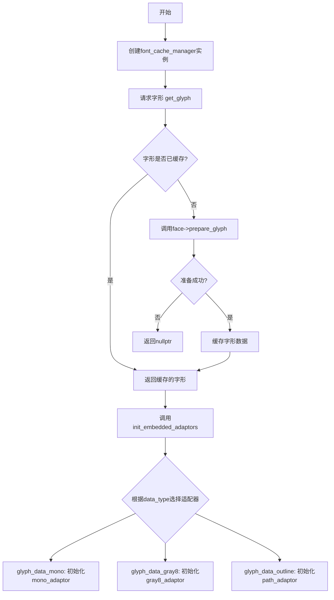

## 类结构

```
agg::fman (命名空间)
├── glyph_data_type (枚举)
├── cached_glyph (结构体)
├── cached_glyphs (类)
├── glyph_rendering (枚举)
└── font_cache_manager<T> (模板类)
    └── cached_font (内部类)
```

## 全局变量及字段


### `cached_glyph.cached_font`
    
指向缓存字体的指针，用于标识字形所属的字体

类型：`void*`
    


### `cached_glyph.glyph_code`
    
字形代码，标识特定的字符或符号

类型：`unsigned`
    


### `cached_glyph.glyph_index`
    
字形索引，字体内部的字形编号

类型：`unsigned`
    


### `cached_glyph.data`
    
指向字形数据的指针，存储字形的位图或轮廓数据

类型：`int8u*`
    


### `cached_glyph.data_size`
    
字形数据的大小，以字节为单位

类型：`unsigned`
    


### `cached_glyph.data_type`
    
字形数据类型，指示数据的格式（单色、灰度8位、轮廓等）

类型：`glyph_data_type`
    


### `cached_glyph.bounds`
    
字形的边界矩形，定义字形在画布上的位置和尺寸

类型：`rect_i`
    


### `cached_glyph.advance_x`
    
X轴前进距离，表示绘制完当前字形后水平移动的距离

类型：`double`
    


### `cached_glyph.advance_y`
    
Y轴前进距离，表示绘制完当前字形后垂直移动的距离

类型：`double`
    


### `cached_glyphs.m_allocator`
    
内存块分配器，用于高效分配字形缓存的内存

类型：`block_allocator`
    


### `cached_glyphs.m_glyphs`
    
字形指针的二维数组，用于按字形代码高字节和低字节索引缓存的字形

类型：`cached_glyph**[256]`
    


### `font_cache_manager<FontEngine>.m_engine`
    
字体引擎的引用，提供字体相关的底层操作接口

类型：`font_engine_type&`
    


### `font_cache_manager<FontEngine>.m_path_adaptor`
    
路径适配器，用于处理轮廓类型的字形数据

类型：`path_adaptor_type`
    


### `font_cache_manager<FontEngine>.m_gray8_adaptor`
    
灰度8位适配器，用于处理灰度级别的字形数据

类型：`gray8_adaptor_type`
    


### `font_cache_manager<FontEngine>.m_gray8_scanline`
    
灰度8位扫描线对象，用于读取灰度字形的扫描线数据

类型：`gray8_scanline_type`
    


### `font_cache_manager<FontEngine>.m_mono_adaptor`
    
单色适配器，用于处理单色（1位）字形数据

类型：`mono_adaptor_type`
    


### `font_cache_manager<FontEngine>.m_mono_scanline`
    
单色扫描线对象，用于读取单色字形的扫描线数据

类型：`mono_scanline_type`
    


### `cached_font.m_engine`
    
字体引擎引用，提供字体底层的访问接口

类型：`font_engine_type&`
    


### `cached_font.m_face`
    
已加载字体面的指针，包含字体的度量信息和字形数据

类型：`loaded_face*`
    


### `cached_font.m_height`
    
字体高度，设置或请求的字体大小高度值

类型：`double`
    


### `cached_font.m_width`
    
字体宽度，设置或请求的字体大小宽度值

类型：`double`
    


### `cached_font.m_hinting`
    
字形微调标志，指示是否启用字体微调以提高清晰度

类型：`bool`
    


### `cached_font.m_rendering`
    
字形渲染模式，指定渲染方式（原生单色、灰度、AGG渲染等）

类型：`glyph_rendering`
    


### `cached_font.m_face_height`
    
字体面高度，从字体文件中读取的实际字体高度

类型：`double`
    


### `cached_font.m_face_width`
    
字体面宽度，从字体文件中读取的实际字体宽度

类型：`double`
    


### `cached_font.m_face_ascent`
    
字体上升量，基线到字形顶部的距离

类型：`double`
    


### `cached_font.m_face_descent`
    
字体下降量，基线到字形底部的距离

类型：`double`
    


### `cached_font.m_face_ascent_b`
    
字体大写上升量，用于大写字符的上升量

类型：`double`
    


### `cached_font.m_face_descent_b`
    
字体大写下降量，用于大写字符的下降量

类型：`double`
    


### `cached_font.m_glyphs`
    
字形缓存管理器，管理当前字体所有缓存的字形

类型：`cached_glyphs`
    
    

## 全局函数及方法


### `cached_glyphs`

`cached_glyphs` 是 AGG 字体缓存管理模块中的核心类，负责字形（glyph）的缓存管理。该类使用二维指针数组（256x256）存储字形数据，通过高位字节（MSB）和低位字节（LSB）构建快速查找索引，并使用 block_allocator 进行内存管理，避免频繁的系统内存分配。

参数：

返回值：

#### 流程图

```mermaid
flowchart TD
    A[开始] --> B{查找字形<br/>find_glyph}
    B --> C[计算MSB = glyph_code >> 8 & 0xFF]
    C --> D{m_glyphs[MSB]是否存在?}
    D -->|否| E[返回 nullptr]
    D -->|是| F[返回 m_glyphs[MSB][LSB]]
    
    G[缓存字形<br/>cache_glyph] --> H[计算MSB]
    H --> I{m_glyphs[MSB]是否存在?}
    I -->|否| J[分配256个指针数组<br/>m_allocator.allocate]
    I -->|是| K{该位置是否已有字形?}
    J --> L[初始化为0]
    L --> K
    K -->|是| M[返回 nullptr 不覆盖]
    K -->|否| N[分配cached_glyph结构<br/>m_allocator.allocate]
    N --> O[填充字形数据]
    O --> P[返回并存储指针]
    
    F --> Q[结束]
    M --> Q
    P --> Q
```

#### 带注释源码

```cpp
namespace agg {

namespace fman {

  //---------------------------------------------------------glyph_data_type
  // 字形数据类型枚举
  enum glyph_data_type
  {
    glyph_data_invalid = 0,  // 无效数据类型
    glyph_data_mono    = 1,  // 单色位图
    glyph_data_gray8   = 2,  // 8位灰度
    glyph_data_outline = 3   // 轮廓/矢量路径
  };


  //-------------------------------------------------------------cached_glyph
  // 字形缓存结构体 - 存储单个字形的所有相关信息
  struct cached_glyph
  {
    void *			cached_font;    // 指向缓存字体的指针
    unsigned		glyph_code;     // Unicode 或字形代码
    unsigned        glyph_index;    // 字形索引
    int8u*          data;           // 字形数据指针
    unsigned        data_size;      // 数据大小
    glyph_data_type data_type;      // 数据类型
    rect_i          bounds;         // 字形边界框
    double          advance_x;      // X轴前进距离
    double          advance_y;      // Y轴前进距离
  };


  //--------------------------------------------------------------cached_glyphs
  // 字形缓存管理器类 - 管理字形的存储和检索
  class cached_glyphs
  {
  public:
    // 内存块大小枚举 - 16KB 减去 16 字节头部开销
    enum block_size_e { block_size = 16384-16 };

    //--------------------------------------------------------------------
    // 构造函数 - 初始化内存分配器和字形指针数组
    cached_glyphs()
      : m_allocator(block_size)  // 初始化块分配器
    { 
      // 将 256 个指向指针数组的指针初始化为 0
      memset(m_glyphs, 0, sizeof(m_glyphs)); 
    }

    //--------------------------------------------------------------------
    // 查找字形方法 - 根据字形代码查找缓存的字形
    // 参数: glyph_code - 要查找的 Unicode 或字形代码
    // 返回: 指向缓存字形的指针，如果未找到则返回 nullptr
    const cached_glyph* find_glyph(unsigned glyph_code) const
    {
      // 计算高位字节索引 (MSB) - 使用 256 个桶
      unsigned msb = (glyph_code >> 8) & 0xFF;
      
      // 检查高位字节对应的桶是否存在
      if(m_glyphs[msb])
      {
        // 计算低位字节索引 (LSB) 并返回对应字形
        return m_glyphs[msb][glyph_code & 0xFF];
      }
      return 0;  // 未找到
    }

    //--------------------------------------------------------------------
    // 缓存字形方法 - 将新字形添加到缓存中
    // 参数:
    //   cached_font - 指向所属字体缓存的指针
    //   glyph_code - Unicode 或字形代码
    //   glyph_index - 字形索引
    //   data_size - 字形数据大小
    //   data_type - 字形数据类型
    //   bounds - 字形边界矩形
    //   advance_x - X轴前进距离
    //   advance_y - Y轴前进距离
    // 返回: 指向新缓存字形的指针，如果已存在则返回 nullptr
    cached_glyph* cache_glyph(
      void *			cached_font,     // 字体缓存指针
      unsigned        glyph_code,      // 字形代码
      unsigned        glyph_index,     // 字形索引
      unsigned        data_size,       // 数据大小
      glyph_data_type data_type,       // 数据类型
      const rect_i&   bounds,          // 边界矩形
      double          advance_x,       // X前进量
      double          advance_y)       // Y前进量
    {
      // 计算高位字节索引
      unsigned msb = (glyph_code >> 8) & 0xFF;
      
      // 如果高位字节桶不存在，则创建
      if(m_glyphs[msb] == 0)
      {
        // 分配 256 个指针的数组
        m_glyphs[msb] =
          (cached_glyph**)m_allocator.allocate(sizeof(cached_glyph*) * 256,
          sizeof(cached_glyph*));
        // 初始化为 0
        memset(m_glyphs[msb], 0, sizeof(cached_glyph*) * 256);
      }

      // 计算低位字节索引
      unsigned lsb = glyph_code & 0xFF;
      
      // 如果该位置已有字形，不覆盖，返回 nullptr
      if(m_glyphs[msb][lsb]) return 0; 

      // 分配字形结构体内存
      cached_glyph* glyph =
        (cached_glyph*)m_allocator.allocate(sizeof(cached_glyph),
        sizeof(double));

      // 填充字形数据
      glyph->cached_font		  = cached_font;
      glyph->glyph_code		  = glyph_code;
      glyph->glyph_index        = glyph_index;
      glyph->data               = m_allocator.allocate(data_size);  // 分配数据空间
      glyph->data_size          = data_size;
      glyph->data_type          = data_type;
      glyph->bounds             = bounds;
      glyph->advance_x          = advance_x;
      glyph->advance_y          = advance_y;
      
      // 存储并返回指针
      return m_glyphs[msb][lsb] = glyph;
    }

  private:
    // 块内存分配器 - 一次分配大块内存用于多个字形
    block_allocator m_allocator;
    
    // 二维字形指针数组 - 256x256 的稀疏矩阵
    // 第一维使用高位字节索引，第二维使用低位字节索引
    cached_glyph**   m_glyphs[256];
  };

}
}
```


### `cached_glyphs.find_glyph`

该函数用于在缓存的字形表中查找指定字形码对应的缓存字形，使用高字节（MSB）作为一级索引，低字节（LSB）作为二级索引，实现高效的O(1)字形缓存查找。

参数：

- `glyph_code`：`unsigned`，要查找的字形码（Unicode码点或字形索引）

返回值：`const cached_glyph*`，返回指向缓存字形的常量指针，如果未找到则返回`nullptr`

#### 流程图

```mermaid
flowchart TD
    A[开始查找字形] --> B[提取glyph_code的高字节msb = (glyph_code >> 8) & 0xFF]
    B --> C{检查m_glyphs[msb]是否存在?}
    C -->|否| D[返回nullptr]
    C -->|是| E[提取glyph_code的低字节lsb = glyph_code & 0xFF]
    E --> F[返回m_glyphs[msb][lsb]]
    F --> G[结束]
```

#### 带注释源码

```cpp
//--------------------------------------------------------------------
const cached_glyph* find_glyph(unsigned glyph_code) const
{
    // 计算字形码的高字节（Most Significant Byte）
    // 取glyph_code的8-15位，作为一级数组索引
    unsigned msb = (glyph_code >> 8) & 0xFF;
    
    // 检查该高字节对应的字形指针数组是否已分配
    if(m_glyphs[msb])
    {
        // 计算字形码的低字节（Least Significant Byte）
        // 取glyph_code的0-7位，作为二级数组索引
        // 返回该位置存储的缓存字形指针（可能为nullptr）
        return m_glyphs[msb][glyph_code & 0xFF];
    }
    
    // 如果一级索引指向的数组不存在，说明该字形未被缓存
    // 返回nullptr表示查找失败
    return 0;
}
```


### `cached_glyphs.cache_glyph`

该方法用于将字形数据缓存到内部数据结构中，使用字形码的高位字节和低位字节作为二级索引，实现高效的字形查找。如果指定位置的字形已存在，则返回空指针以避免覆盖。

参数：

- `cached_font`：`void *`，指向关联的字体缓存对象
- `glyph_code`：`unsigned`，字形的唯一标识代码
- `glyph_index`：`unsigned`，字形在字体中的索引
- `data_size`：`unsigned`，字形数据的大小（字节数）
- `data_type`：`glyph_data_type`，字形数据的类型（如单色、灰度或轮廓）
- `bounds`：`const rect_i&`，字形的边界矩形
- `advance_x`：`double`，字形在X方向的推进距离
- `advance_y`：`double`，字形在Y方向的推进距离

返回值：`cached_glyph *`，返回指向已缓存字形的指针；如果该字形已缓存则返回 `nullptr`

#### 流程图

```mermaid
flowchart TD
    A[开始 cache_glyph] --> B[计算 msb = (glyph_code >> 8) & 0xFF]
    B --> C{检查 m_glyphs[msb] 是否存在}
    C -->|否| D[分配 256个 cached_glyph* 数组]
    D --> E[初始化数组为零]
    E --> F[计算 lsb = glyph_code & 0xFF]
    C -->|是| F
    F --> G{检查 m_glyphs[msb][lsb] 是否已有字形}
    G -->|是| H[返回 nullptr 不覆盖]
    G -->|否| I[分配 cached_glyph 结构]
    I --> J[填充字形各字段数据]
    J --> K[将字形指针存入数组]
    K --> L[返回字形指针]
    H --> L
```

#### 带注释源码

```cpp
//--------------------------------------------------------------------
cached_glyph* cache_glyph(
  void *			cached_font,      // 关联的字体缓存对象指针
  unsigned        glyph_code,       // 字形代码（如Unicode码点）
  unsigned        glyph_index,      // 字形在字体中的索引位置
  unsigned        data_size,        // 字形像素数据的大小
  glyph_data_type data_type,        // 字形数据类型：mono/gray8/outline
  const rect_i&   bounds,           // 字形的边界矩形区域
  double          advance_x,        // X方向字间距推进量
  double          advance_y)        // Y方向字间距推进量
{
  // 提取字形代码的高位字节(第8-15位)作为一级索引
  unsigned msb = (glyph_code >> 8) & 0xFF;
  
  // 如果该高位字节对应的数组不存在，则创建
  // 使用 block_allocator 分配内存，每块 16384-16 字节
  if(m_glyphs[msb] == 0)
  {
    m_glyphs[msb] =
      (cached_glyph**)m_allocator.allocate(sizeof(cached_glyph*) * 256,
      sizeof(cached_glyph*));
    // 将新分配的数组初始化为零，确保空指针状态
    memset(m_glyphs[msb], 0, sizeof(cached_glyph*) * 256);
  }

  // 提取字形代码的低位字节(第0-7位)作为二级索引
  unsigned lsb = glyph_code & 0xFF;
  
  // 如果该位置已存在字形，直接返回 nullptr
  // 这样设计可以防止已缓存的字形被意外覆盖
  if(m_glyphs[msb][lsb]) return 0; // Already exists, do not overwrite

  // 为 cached_glyph 结构分配内存
  // 按 double 对齐，确保成员访问效率
  cached_glyph* glyph =
    (cached_glyph*)m_allocator.allocate(sizeof(cached_glyph),
    sizeof(double));

  // 填充字形结构的所有字段
  glyph->cached_font		  = cached_font;    // 关联字体指针
  glyph->glyph_code		  = glyph_code;     // 字形代码
  glyph->glyph_index        = glyph_index;    // 字形索引
  glyph->data               = m_allocator.allocate(data_size); // 分配像素数据区
  glyph->data_size          = data_size;      // 数据大小
  glyph->data_type          = data_type;      // 数据类型
  glyph->bounds             = bounds;         // 边界矩形
  glyph->advance_x          = advance_x;      // X推进量
  glyph->advance_y          = advance_y;      // Y推进量
  
  // 将新创建的字形指针存入数组并返回
  return m_glyphs[msb][lsb] = glyph;
}
```


### `font_cache_manager<FontEngine>.font_cache_manager`

这是 `font_cache_manager` 类模板的构造函数，用于初始化字体缓存管理器。它接收一个字体引擎引用和一个可选的最大字体数量参数，将字体引擎引用存储到成员变量中，为后续的字形缓存和渲染操作提供基础。

参数：

- `engine`：`font_engine_type&`，字体引擎的引用，用于获取字体信息和渲染字形
- `max_fonts`：`unsigned`，指定最大缓存字体数量，默认为32（当前实现中未使用此参数）

返回值：无（构造函数）

#### 流程图

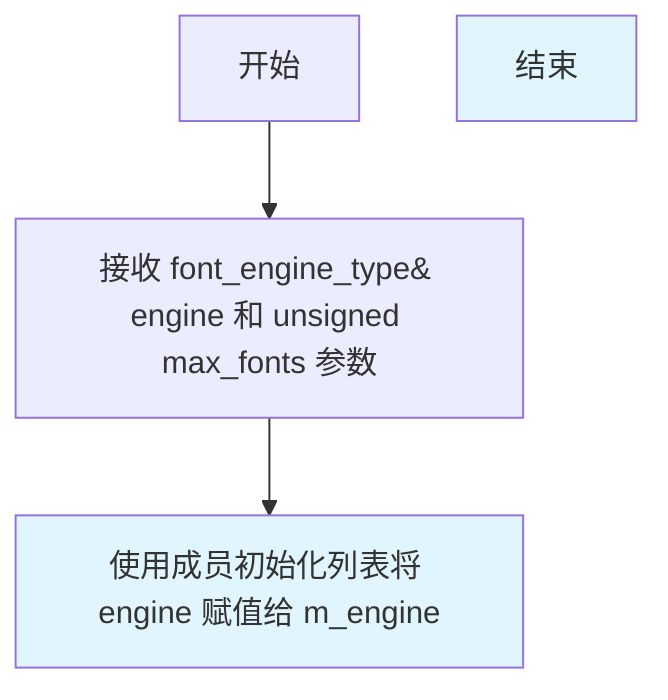

#### 带注释源码

```cpp
//--------------------------------------------------------------------
font_cache_manager(font_engine_type& engine, unsigned max_fonts=32)
  :m_engine(engine)  // 使用成员初始化列表将传入的字体引擎引用初始化 m_engine
{ 
  // 构造函数体为空
  // 注意：max_fonts 参数被定义但未使用，这是潜在的技术债务
  // 预期功能：应该使用 max_fonts 来预分配字体缓存空间
}
```


### `font_cache_manager<FontEngine>.init_embedded_adaptors`

该方法根据传入缓存字形的数据类型（单色位图、灰度8位或轮廓），初始化相应的内嵌适配器（path_adaptor、gray8_adaptor或mono_adaptor），使字体缓存管理器能够将字形数据传递给渲染管线进行绘制。

参数：

- `gl`：`const cached_glyph*`，指向缓存字形结构的指针，包含字形数据和元信息
- `x`：`double`，字形渲染的起始X坐标
- `y`：`double`，字形渲染的起始Y坐标
- `scale`：`double`，缩放因子，用于轮廓类型字形的缩放，默认为1.0

返回值：`void`，无返回值

#### 流程图

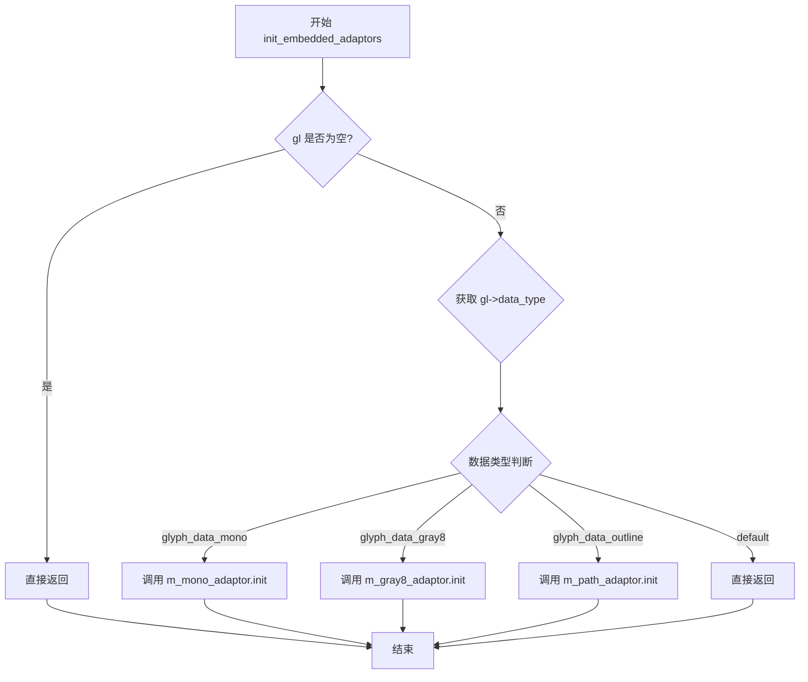

#### 带注释源码

```cpp
//-----------------------------------------------------------------------------
// 方法: init_embedded_adaptors
// 功能: 根据字形数据类型初始化相应的渲染适配器
// 参数:
//   gl    - 指向cached_glyph的指针，包含字形数据和数据类型信息
//   x     - 字形渲染的X坐标起始位置
//   y     - 字形渲染的Y坐标起始位置
//   scale - 缩放因子，仅对轮廓类型字形有效，默认为1.0
// 返回: void
//-----------------------------------------------------------------------------
void init_embedded_adaptors(const cached_glyph* gl,
  double x, double y,
  double scale=1.0)
{
  // 检查字形指针是否有效
  if(gl)
  {
    // 根据字形数据类型选择对应的适配器进行初始化
    switch(gl->data_type)
    {
    default: 
      // 无效数据类型，直接返回
      return;
      
    case glyph_data_mono:
      // 单色位图数据类型，初始化mono适配器
      // 传入字形数据、数据大小和渲染坐标
      m_mono_adaptor.init(gl->data, gl->data_size, x, y);
      break;

    case glyph_data_gray8:
      // 灰度8位数据类型，初始化gray8适配器
      // 传入字形数据、数据大小和渲染坐标
      m_gray8_adaptor.init(gl->data, gl->data_size, x, y);
      break;

    case glyph_data_outline:
      // 轮廓数据类型，初始化path适配器
      // 额外传入scale参数用于轮廓缩放
      m_path_adaptor.init(gl->data, gl->data_size, x, y, scale);
      break;
    }
  }
}
```


### `font_cache_manager<FontEngine>.path_adaptor`

该方法是 `font_cache_manager` 类的简单访问器方法，用于获取字形轮廓渲染所使用的路径适配器（path_adaptor）的引用，使调用者能够访问内部存储的路径适配器实例进行 glyph outline 的渲染操作。

参数： 无

返回值：`path_adaptor_type&`，返回对内部成员变量 `m_path_adaptor` 的引用，该引用指向用于渲染字形轮廓（glyph outline）的路径适配器对象。

#### 流程图

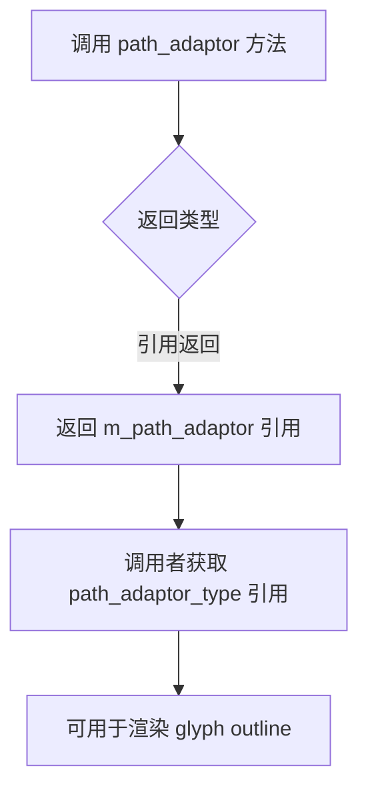

#### 带注释源码

```cpp
//--------------------------------------------------------------------
    // 访问器方法：获取路径适配器的引用
    // 该方法返回内部成员变量 m_path_adaptor 的引用，
    // 允许调用者直接操作用于渲染 glyph outline 的路径适配器
    //--------------------------------------------------------------------
    path_adaptor_type&   path_adaptor()   
    { 
        return m_path_adaptor;   // 返回成员变量的引用，无副本拷贝开销
    }
```

**补充说明**：

- `path_adaptor_type` 是从 `FontEngine` 模板参数中 typedef 得到的类型：`typedef typename font_engine_type::path_adaptor_type path_adaptor_type;`
- `m_path_adaptor` 是该类的私有成员变量，类型为 `path_adaptor_type`
- 该方法为内联实现，返回引用而非副本，避免了不必要的数据拷贝
- 结合 `init_embedded_adaptors` 方法使用：当 glyph 的 `data_type` 为 `glyph_data_outline` 时，会调用 `m_path_adaptor.init()` 初始化适配器，随后通过 `path_adaptor()` 获取该适配器进行渲染


### `font_cache_manager<FontEngine>.gray8_adaptor`

该方法是 `font_cache_manager` 模板类的成员函数，提供对内部灰度8位渲染适配器（gray8_adaptor_type）的访问接口。通过返回成员变量 `m_gray8_adaptor` 的引用，允许调用者在外部获取并使用字形的灰度8位扫描线数据进行渲染操作。

参数：无

返回值：`gray8_adaptor_type&`，返回灰度8位渲染适配器的引用，用于访问字形的灰度8位扫描线数据

#### 流程图

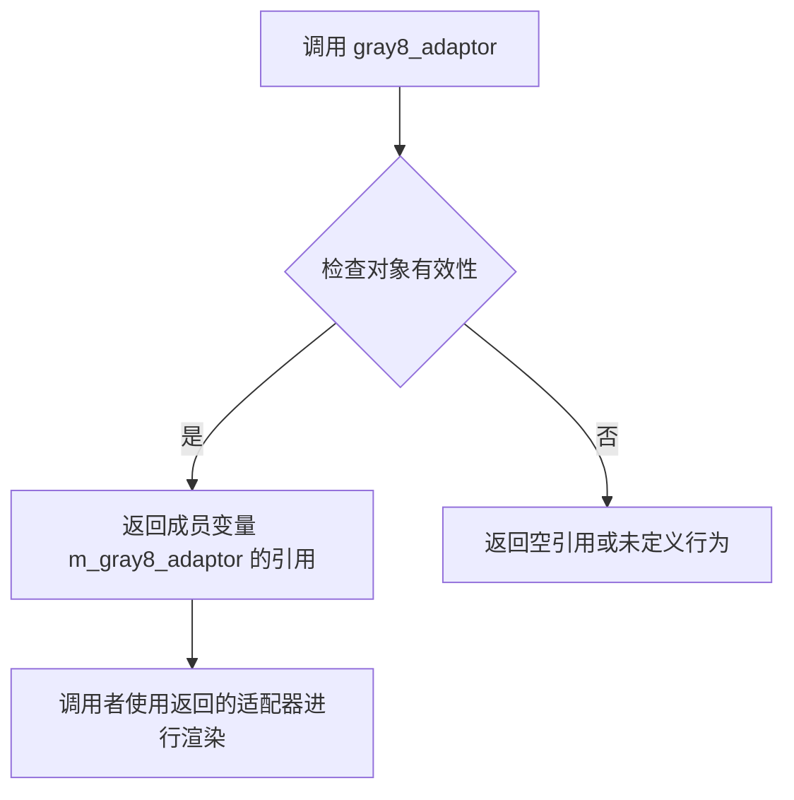

#### 带注释源码

```cpp
//--------------------------------------------------------------------
/// 获取灰度8位渲染适配器的引用
/// @return gray8_adaptor_type& 灰度8位渲染适配器的引用
gray8_adaptor_type&  gray8_adaptor()  
{ 
    // 直接返回内部成员变量 m_gray8_adaptor 的引用
    // 该成员变量在 init_embedded_adaptors 方法中被初始化
    // 用于处理 glyph_data_gray8 类型的字形数据
    return m_gray8_adaptor;  
}
```

#### 上下文信息

**所属类**: `font_cache_manager<FontEngine>`

**关键成员变量关联**:
- `m_gray8_adaptor`：灰度8位渲染适配器类型实例
- `m_gray8_scanline`：灰度8位扫描线类型实例
- `m_gray8_adaptor` 在 `init_embedded_adaptors` 方法中通过 `gl->data_type == glyph_data_gray8` 条件被初始化

**调用链**:
1. 外部代码调用 `gray8_adaptor()` 获取适配器引用
2. 通常在渲染流程中配合 `init_embedded_adaptors()` 使用
3. 该适配器用于处理 8位灰度（256级灰度）字形渲染

**潜在优化空间**:
- 当前方法无任何边界检查或空值保护，如果对象未正确初始化可能导致未定义行为
- 可考虑添加调试模式下的断言检查
- 返回引用而非指针虽然提高了使用便利性，但降低了空值检测能力


### `font_cache_manager<FontEngine>.gray8_scanline`

该方法用于获取灰度8位扫描线适配器的引用，使外部代码能够直接访问和管理字形的灰度8位扫描线渲染功能。

参数：
- （无参数）

返回值：`gray8_scanline_type&`，返回灰度8位扫描线对象的引用，用于扫描线渲染

#### 流程图

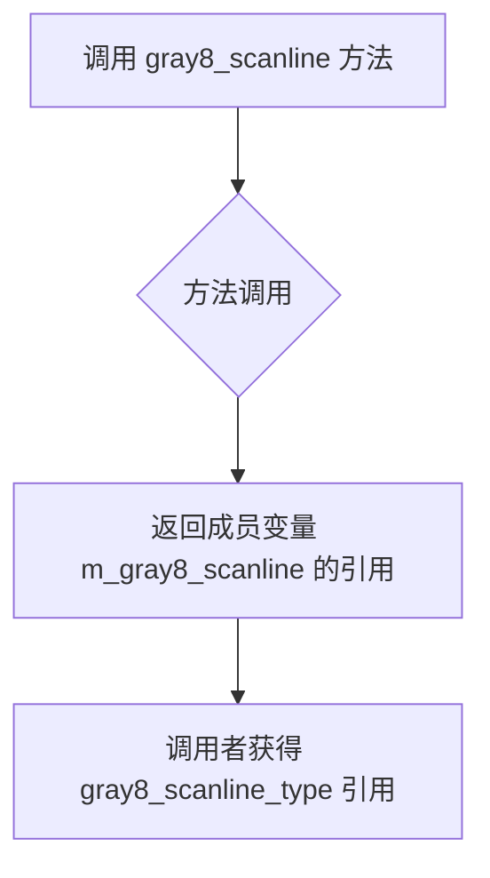

#### 带注释源码

```cpp
//------------------------------------------------------font_cache_manager
template<class FontEngine> class font_cache_manager
{
public:
    // 类型定义部分省略...

    //--------------------------------------------------------------------
    // 获取灰度8位扫描线适配器的引用
    // 参数：无
    // 返回值：gray8_scanline_type& - 灰度8位扫描线对象的引用
    gray8_scanline_type& gray8_scanline() 
    { 
        return m_gray8_scanline; 
    }
    
    // 其他访问器方法...
    path_adaptor_type&   path_adaptor()   { return m_path_adaptor;   }
    gray8_adaptor_type&  gray8_adaptor()  { return m_gray8_adaptor;  }
    mono_adaptor_type&   mono_adaptor()   { return m_mono_adaptor;   }
    mono_scanline_type&  mono_scanline()  { return m_mono_scanline;  }

private:
    //--------------------------------------------------------------------
    font_cache_manager(const self_type&);
    const self_type& operator = (const self_type&);

    font_engine_type&   m_engine;
    path_adaptor_type   m_path_adaptor;
    gray8_adaptor_type  m_gray8_adaptor;
    gray8_scanline_type m_gray8_scanline;  // 灰度8位扫描线成员变量
    mono_adaptor_type   m_mono_adaptor;
    mono_scanline_type  m_mono_scanline;
};
```

#### 补充说明

- **类型别名**：`gray8_scanline_type` 是 `typename gray8_adaptor_type::embedded_scanline` 的别名
- **设计意图**：提供对内部 `m_gray8_scanline` 成员的直接访问，允许调用者使用该扫描线进行字形渲染
- **返回值特性**：返回引用而非拷贝，避免不必要的性能开销，同时允许调用者修改扫描线状态
- **与其他方法的关系**：与 `gray8_adaptor()` 方法配合使用，`gray8_adaptor()` 初始化数据，`gray8_scanline()` 提供扫描线渲染能力


### `font_cache_manager<FontEngine>.mono_adaptor()`

该方法返回单色字形渲染适配器的引用，用于处理单色位图字形数据，使调用者能够对单色字形进行光栅化操作。

参数：
- 无

返回值：`mono_adaptor_type&`，单色字形适配器的引用，用于单色字形的扫描线处理。

#### 流程图

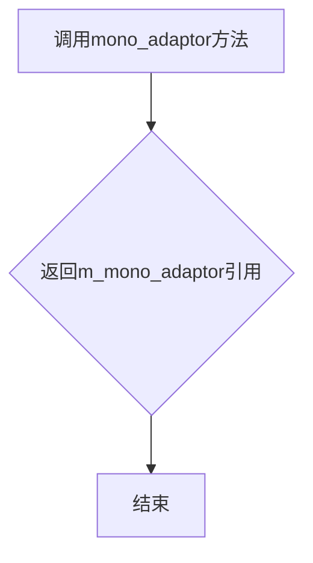

#### 带注释源码

```cpp
// 返回单色字形适配器的引用
// 该适配器用于处理单色位图字形数据，提供扫描线访问接口
mono_adaptor_type&   mono_adaptor()   
{ 
    // 直接返回内部成员m_mono_adaptor的引用，允许调用者直接操作适配器
    return m_mono_adaptor;   
}
```


### `font_cache_manager<FontEngine>.mono_scanline`

该方法是字体缓存管理器的成员函数，用于获取单色扫描线（mono_scanline）对象的引用，以便在渲染单色位图字体时进行扫描线处理。

参数：
- 无

返回值：`mono_scanline_type&`，返回单色扫描线对象的引用，用于执行单色字形的扫描线渲染操作。

#### 流程图

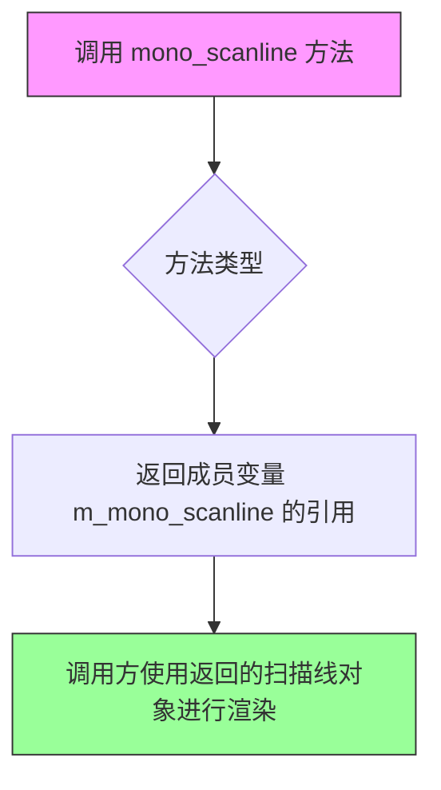

#### 带注释源码

```
//--------------------------------------------------------------------
    // 获取单色扫描线对象的引用
    // 返回类型：mono_scanline_type& (mono_adaptor_type::embedded_scanline)
    // 功能：返回内部成员变量 m_mono_scanline 的引用，供调用者使用
    //       该扫描线对象用于单色位图字形的扫描线渲染
    //--------------------------------------------------------------------
    mono_scanline_type&  mono_scanline()
    { 
        return m_mono_scanline;  // 返回单色扫描线成员变量的引用
    }
```

#### 补充说明

**设计目标**：
- 该方法是访问器模式（Accessor）的实现，提供对内部单色扫描线对象的只读访问
- 返回引用而非副本是为了避免不必要的对象拷贝，提高渲染效率

**在类中的上下文**：
```cpp
// 成员变量声明
mono_adaptor_type   m_mono_adaptor;   // 单色适配器
mono_scanline_type  m_mono_scanline;  // 单色扫描线

// 相关方法 - 初始化嵌入适配器
void init_embedded_adaptors(const cached_glyph* gl,
    double x, double y,
    double scale=1.0)
{
    if(gl)
    {
        switch(gl->data_type)
        {
        default: return;
        case glyph_data_mono:
            m_mono_adaptor.init(gl->data, gl->data_size, x, y);
            break;
        // ... 其他case
        }
    }
}
```

**使用场景**：
当渲染模式为 `glyph_ren_native_mono` 或 `glyph_ren_agg_mono` 时，会使用单色扫描线进行字形渲染。调用流程通常是：先通过 `init_embedded_adaptors` 初始化 `m_mono_adaptor`，然后通过 `mono_scanline()` 获取对应的扫描线对象进行实际渲染。


### `cached_font`（构造函数）

`cached_font` 是 `font_cache_manager` 模板类中的内部结构体，其构造函数用于初始化字体缓存对象，接收字体引擎、字面、尺寸、渲染模式等参数，并完成字体度量信息的初始化。

参数：

- `engine`：`font_engine_type&`，字体引擎引用，用于管理字体资源
- `face`：`typename FontEngine::loaded_face *`，已加载的字面对象指针
- `height`：`double`，字体高度
- `width`：`double`，字体宽度
- `hinting`：`bool`，是否启用字体微调
- `rendering`：`glyph_rendering`，字形渲染模式（单色、灰度、轮廓等）

返回值：无返回值（构造函数）

#### 流程图

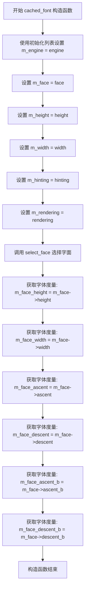

#### 带注释源码

```cpp
cached_font(
    font_engine_type& engine,                              // 字体引擎引用
    typename FontEngine::loaded_face *face,               // 已加载的字面对象指针
    double height,                                         // 字体高度
    double width,                                          // 字体宽度
    bool hinting,                                          // 是否启用字体微调
    glyph_rendering rendering )                           // 字形渲染模式
    : m_engine( engine )                                   // 初始化成员变量：字体引擎
    , m_face( face )                                       // 初始化成员变量：字面对象
    , m_height( height )                                   // 初始化成员变量：字体高度
    , m_width( width )                                    // 初始化成员变量：字体宽度
    , m_hinting( hinting )                                // 初始化成员变量：微调标志
    , m_rendering( rendering )                            // 初始化成员变量：渲染模式
  {
    select_face();                                         // 选择字面实例
    m_face_height=m_face->height();                        // 获取字面高度
    m_face_width=m_face->width();                          // 获取字面宽度
    m_face_ascent=m_face->ascent();                       // 获取字面上升量
    m_face_descent=m_face->descent();                     // 获取字面下降量
    m_face_ascent_b=m_face->ascent_b();                   // 获取字面B模式上升量
    m_face_descent_b=m_face->descent_b();                 // 获取字面B模式下降量
  }
```


### `cached_font.height()`

该方法是一个const成员函数，用于获取缓存字体的字面高度（face height），直接返回在构造函数中从字体引擎获取并存储的 `m_face_height` 值。

参数： 无

返回值：`double`，返回缓存字体的字面高度（从基线到顶部的距离）

#### 流程图

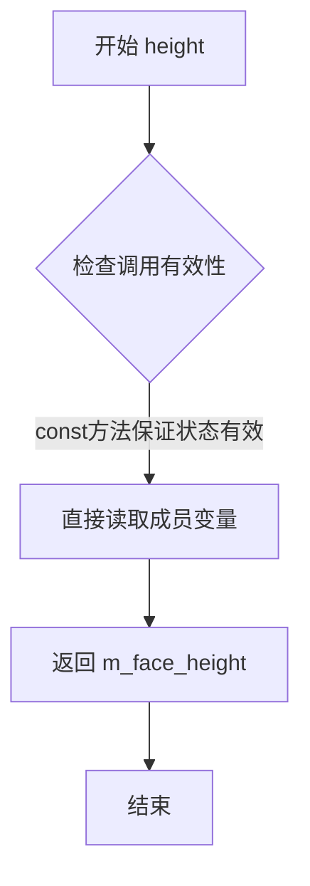

#### 带注释源码

```cpp
// 获取字体的字面高度
// 该方法返回在cached_font构造时从字体引擎获取并缓存的m_face_height值
// 这是一个const方法，保证不会修改对象状态
// 返回值: double - 字体的字面高度（从基线到顶部的距离）
double height() const
{
  // 直接返回缓存的字面高度值
  // 该值在构造函数中通过 m_face->height() 获取并存储
  return m_face_height;
}
```


### `cached_font.width()`

`cached_font.width()` 是 `font_cache_manager` 模板类内部嵌套的 `cached_font` 结构体的成员方法，用于获取当前字体的宽度信息。该方法直接返回构造函数中从字体引擎获取并缓存的 `m_face_width` 成员变量，提供对字体宽度的只读访问。

参数：该方法没有参数。

返回值：`double`，返回字体的宽度。

#### 流程图

```mermaid
graph TD
    A[调用 cached_font.width()] --> B{检查调用权限}
    B -->|合法调用| C[返回 m_face_width]
    B -->|非法调用| D[编译错误]
    C --> E[结束]
```

#### 带注释源码

```cpp
//----------------------------------------------------------------------------
// Anti-Grain Geometry - Version 2.4
//----------------------------------------------------------------------------

namespace agg {

namespace fman {

  //------------------------------------------------------font_cache_manager
  template<class FontEngine> class font_cache_manager
  {
    // 内部嵌套结构体 cached_font
    struct cached_font
    {
      //--------------------------------------------------------------------
      // 构造函数
      // 初始化字体引擎、字面、尺寸等信息，并从字面获取宽度信息
      cached_font(
        font_engine_type& engine,
        typename FontEngine::loaded_face *face,
        double height,
        double width,
        bool hinting,
        glyph_rendering rendering )
        : m_engine( engine )
        , m_face( face )
        , m_height( height )
        , m_width( width )
        , m_hinting( hinting )
        , m_rendering( rendering )
      {
        // 选择字面
        select_face();
        // 从字面获取高度信息
        m_face_height=m_face->height();
        // 从字面获取宽度信息
        m_face_width=m_face->width();
        // 获取 ascent 信息
        m_face_ascent=m_face->ascent();
        // 获取 descent 信息
        m_face_descent=m_face->descent();
        // 获取 ascent_b 信息
        m_face_ascent_b=m_face->ascent_b();
        // 获取 descent_b 信息
        m_face_descent_b=m_face->descent_b();
      }

      //--------------------------------------------------------------------
      // 获取字体高度
      // 返回值：double - 字体高度
      double height() const
      {
        return m_face_height;
      }

      //--------------------------------------------------------------------
      // 获取字体宽度
      // 参数：无
      // 返回值：double - 字体宽度
      double width() const
      {
        // 直接返回缓存的字体宽度值
        // 该值在构造函数中通过 m_face->width() 获取并缓存
        return m_face_width;
      }

      //--------------------------------------------------------------------
      // 获取字体的 ascent 值
      double ascent() const
      {
        return m_face_ascent;
      }

      //--------------------------------------------------------------------
      // 获取字体的 descent 值
      double descent() const
      {
        return m_face_descent;
      }

      //--------------------------------------------------------------------
      // 获取字体的 ascent_b 值
      double ascent_b() const
      {
        return m_face_ascent_b;
      }

      //--------------------------------------------------------------------
      // 获取字体的 descent_b 值
      double descent_b() const
      {
        return m_face_descent_b;
      }

      //--------------------------------------------------------------------
      // 添加字距调整（kerning）信息
      bool add_kerning( const cached_glyph *first, const cached_glyph *second, double* x, double* y)
      {
        if( !first || !second )
          return false;
        select_face();
        return m_face->add_kerning(
          first->glyph_index, second->glyph_index, x, y );
      }

      //--------------------------------------------------------------------
      // 选择字面实例
      void select_face()
      {
        m_face->select_instance( m_height, m_width, m_hinting, m_rendering );
      }

      //--------------------------------------------------------------------
      // 获取字形（glyph）数据
      const cached_glyph *get_glyph(unsigned cp)
      {
        const cached_glyph *glyph=m_glyphs.find_glyph(cp);
        if( glyph==0 )
        {
          typename FontEngine::prepared_glyph prepared;
          select_face();
          bool success=m_face->prepare_glyph(cp, &prepared);
          if( success )
          {
            glyph=m_glyphs.cache_glyph(
              this,
              prepared.glyph_code,
              prepared.glyph_index,
              prepared.data_size,
              prepared.data_type,
              prepared.bounds,
              prepared.advance_x,
              prepared.advance_y );
            assert( glyph!=0 );
            m_face->write_glyph_to(&prepared,glyph->data);
          }
        }
        return glyph;
      }

      //--------------------------------------------------------------------
      // 成员变量
      font_engine_type&   m_engine;              // 字体引擎引用
      typename FontEngine::loaded_face *m_face; // 字面指针
      double              m_height;              // 请求的字体高度
      double              m_width;               // 请求的字体宽度
      bool                m_hinting;             // 是否启用字体提示
      glyph_rendering     m_rendering;           // 字形渲染方式
      double              m_face_height;         // 字面实际高度
      double              m_face_width;          // 字面实际宽度
      double              m_face_ascent;         // 字面 ascent
      double              m_face_descent;        // 字面 descent
      double              m_face_ascent_b;       // 字面 ascent_b
      double              m_face_descent_b;      // 字面 descent_b
      cached_glyphs       m_glyphs;              // 字形缓存管理
    };

    // ... 其余 font_cache_manager 类实现 ...
  };

}
}

#endif
```

#### 详细分析

1. **方法功能**：
   - `width()` 方法是 `cached_font` 结构体的常量成员函数，用于获取字体的宽度
   - 它返回在构造时从底层字面对象（`m_face`）获取并缓存的 `m_face_width` 值

2. **设计目的**：
   - 该方法提供了对字体宽度信息的封装访问
   - 作为 const 方法，它不会修改对象状态，符合设计原则
   - 宽度值在构造时获取并缓存，避免重复查询，提高性能

3. **与其他方法的关系**：
   - 与 `height()` 方法对称，用于获取字体的高度信息
   - 构造过程中同时初始化了多个字体度量值（ascent、descent等），通过相应的访问器方法提供

4. **使用场景**：
   - 当需要获取字体的宽度用于文本布局、渲染坐标计算等操作时调用此方法
   - 是字体缓存管理系统中获取字体基本信息的重要组成部分


### `cached_font.ascent`

返回字体的 ascent（上升高度），即大写字母顶部到基线的距离。

参数：

- （无）

返回值：`double`，返回字体的 ascent 值（m_face_ascent），表示大写字母顶部到基线的距离。

#### 流程图

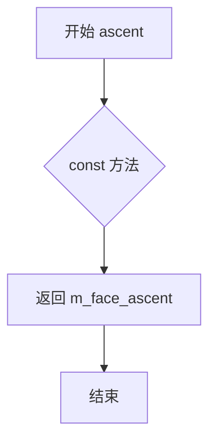

#### 带注释源码

```cpp
//----------------------------------------------------------------------------
// Anti-Grain Geometry - Version 2.4
//----------------------------------------------------------------------------

namespace agg {

namespace fman {

  //------------------------------------------------------font_cache_manager
  template<class FontEngine> class font_cache_manager
  {
    // ... 省略其他代码 ...

    // 内部类 cached_font，表示一个缓存的字体实例
    struct cached_font
    {
      //--------------------------------------------------------------------
      // 构造函数，初始化字体缓存
      cached_font(
        font_engine_type& engine,
        typename FontEngine::loaded_face *face,
        double height,
        double width,
        bool hinting,
        glyph_rendering rendering )
        : m_engine( engine )
        , m_face( face )
        , m_height( height )
        , m_width( width )
        , m_hinting( hinting )
        , m_rendering( rendering )
      {
        select_face();
        m_face_height=m_face->height();
        m_face_width=m_face->width();
        // 获取字体的各个度量值
        m_face_ascent=m_face->ascent();      // 大写字母上升高度
        m_face_descent=m_face->descent();    // 下降高度
        m_face_ascent_b=m_face->ascent_b();  // 基线上升高度
        m_face_descent_b=m_face->descent_b();// 基线下降高度
      }

      //--------------------------------------------------------------------
      // 获取字体高度
      double height() const
      {
        return m_face_height;
      }

      //--------------------------------------------------------------------
      // 获取字体宽度
      double width() const
      {
        return m_face_width;
      }

      //--------------------------------------------------------------------
      // 【目标方法】获取字体的 ascent（上升高度）
      // ascent 是大写字母顶部到基线的距离
      double ascent() const
      {
        return m_face_ascent;
      }

      //--------------------------------------------------------------------
      // 获取字体的 descent（下降高度）
      double descent() const
      {
        return m_face_descent;
      }

      //--------------------------------------------------------------------
      // 获取字体的 ascent_b（基线上升高度）
      double ascent_b() const
      {
        return m_face_ascent_b;
      }

      //--------------------------------------------------------------------
      // 获取字体的 descent_b（基线下降高度）
      double descent_b() const
      {
        return m_face_descent_b;
      }

      //--------------------------------------------------------------------
      // 添加字距调整（kerning）
      bool add_kerning( const cached_glyph *first, const cached_glyph *second, double* x, double* y)
      {
        if( !first || !second )
          return false;
        select_face();
        return m_face->add_kerning(
          first->glyph_index, second->glyph_index, x, y );
      }

      //--------------------------------------------------------------------
      // 选择字体面
      void select_face()
      {
        m_face->select_instance( m_height, m_width, m_hinting, m_rendering );
      }

      //--------------------------------------------------------------------
      // 获取字形缓存
      const cached_glyph *get_glyph(unsigned cp)
      {
        const cached_glyph *glyph=m_glyphs.find_glyph(cp);
        if( glyph==0 )
        {
          typename FontEngine::prepared_glyph prepared;
          select_face();
          bool success=m_face->prepare_glyph(cp, &prepared);
          if( success )
          {
            glyph=m_glyphs.cache_glyph(
              this,
              prepared.glyph_code,
              prepared.glyph_index,
              prepared.data_size,
              prepared.data_type,
              prepared.bounds,
              prepared.advance_x,
              prepared.advance_y );
            assert( glyph!=0 );
            m_face->write_glyph_to(&prepared,glyph->data);
          }
        }
        return glyph;
      }

      //--------------------------------------------------------------------
      // 成员变量
      font_engine_type&   m_engine;           // 字体引擎引用
      typename FontEngine::loaded_face *m_face; // 加载的字体面
      double              m_height;           // 字体高度
      double              m_width;            // 字体宽度
      bool                m_hinting;          // 是否启用微调
      glyph_rendering     m_rendering;        // 字形渲染类型
      double              m_face_height;      // 字体面高度
      double              m_face_width;       // 字体面宽度
      double              m_face_ascent;      // 大写字母上升高度（ascent）
      double              m_face_descent;     // 下降高度（descent）
      double              m_face_ascent_b;    // 基线上升高度
      double              m_face_descent_b;   // 基线下降高度
      cached_glyphs       m_glyphs;           // 字形缓存集合
    };
    
    // ... 省略其他代码 ...
  };

}
}
```


### `cached_font.descent()`

该方法是`cached_font`内部类的成员函数，用于获取字体的大写字母下降值（descent），即大写字母基线以下的距离。它直接返回内部缓存的`m_face_descent`成员变量，无需任何计算或外部查询。

参数：此方法无参数

返回值：`double`，返回大写字母的下降值（即基线以下的部分，以字体设计单位计）

#### 流程图

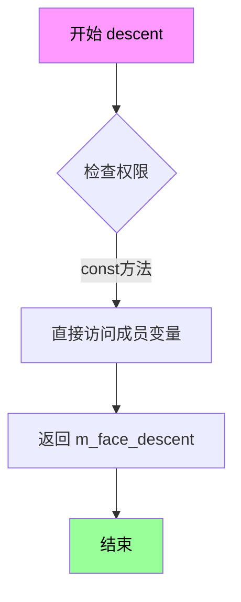

#### 带注释源码

```cpp
//----------------------------------------------------------------------------
// cached_font 内部类的 descent() 方法
// 功能：返回字体的大写字母下降值（ascent_b对应的下降值）
//----------------------------------------------------------------------------

// 方法签名：无参数，返回double类型的下降值
// const修饰符表明该方法不会修改对象状态
double descent() const
{
    // 直接返回成员变量m_face_descent
    // 该值在构造函数中通过select_face()选择字体后，
    // 调用m_face->descent()获取并缓存
    return m_face_descent;
}

// 相关的成员变量定义（在cached_font结构体中）
// double m_face_descent;  // 存储大写字母的下降值
```

#### 补充说明

| 项目 | 说明 |
|------|------|
| **所属类** | `font_cache_manager<FontEngine>::cached_font`（模板类内部结构体） |
| **调用场景** | 在渲染文本时获取字体的垂直度量信息，用于文本布局和对齐计算 |
| **关联方法** | `ascent()`（上升值）、`ascent_b()`（大写上升值）、`descent_b()`（大写下降值） |
| **数据来源** | 由`FontEngine::loaded_face`接口的`descent()`方法在构造函数中初始化 |
| **设计模式** | 值缓存模式（Value Caching）：在构造时获取并缓存，避免重复查询底层字体引擎 |


### `cached_font.ascent_b()`

该方法用于获取字体的 ascent_b 成员变量值，即字体在基线以上的垂直上升距离（用于某些字体系统的垂直排版或特殊渲染需求）。

参数：無

返回值：`double`，返回字体的 ascent_b 值，表示字体基线以上的上升高度。

#### 流程图

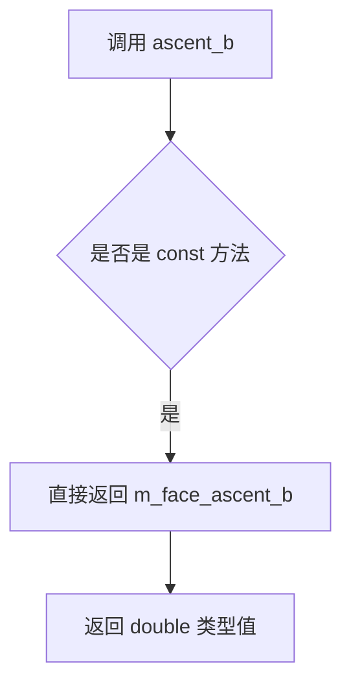

#### 带注释源码

```cpp
//----------------------------------------------------------------------------
// Anti-Grain Geometry - Version 2.4
// Copyright (C) 2002-2005 Maxim Shemanarev (http://www.antigrain.com)
//
// Permission to copy, use, modify, sell and distribute this software
// is granted provided this copyright notice appears in all copies.
// This software is provided "as is" without express or implied
// warranty, and with no claim as to its suitability for any purpose.
//----------------------------------------------------------------------------

#ifndef AGG_FONT_CACHE_MANAGER2_INCLUDED
#define AGG_FONT_CACHE_MANAGER2_INCLUDED

#include <cassert>
#include <exception>
#include <string.h>
#include "agg_array.h"

namespace agg {

namespace fman {
  //---------------------------------------------------------glyph_data_type
  enum glyph_data_type
  {
    glyph_data_invalid = 0,
    glyph_data_mono    = 1,
    glyph_data_gray8   = 2,
    glyph_data_outline = 3
  };


  //-------------------------------------------------------------cached_glyph
  struct cached_glyph
  {
    void *			cached_font;
    unsigned		glyph_code;
    unsigned        glyph_index;
    int8u*          data;
    unsigned        data_size;
    glyph_data_type data_type;
    rect_i          bounds;
    double          advance_x;
    double          advance_y;
  };


  //--------------------------------------------------------------cached_glyphs
  class cached_glyphs
  {
  public:
    enum block_size_e { block_size = 16384-16 };

    //--------------------------------------------------------------------
    cached_glyphs()
      : m_allocator(block_size)
    { memset(m_glyphs, 0, sizeof(m_glyphs)); }

    //--------------------------------------------------------------------
    const cached_glyph* find_glyph(unsigned glyph_code) const
    {
      unsigned msb = (glyph_code >> 8) & 0xFF;
      if(m_glyphs[msb])
      {
        return m_glyphs[msb][glyph_code & 0xFF];
      }
      return 0;
    }

    //--------------------------------------------------------------------
    cached_glyph* cache_glyph(
      void *			cached_font,
      unsigned        glyph_code,
      unsigned        glyph_index,
      unsigned        data_size,
      glyph_data_type data_type,
      const rect_i&   bounds,
      double          advance_x,
      double          advance_y)
    {
      unsigned msb = (glyph_code >> 8) & 0xFF;
      if(m_glyphs[msb] == 0)
      {
        m_glyphs[msb] =
          (cached_glyph**)m_allocator.allocate(sizeof(cached_glyph*) * 256,
          sizeof(cached_glyph*));
        memset(m_glyphs[msb], 0, sizeof(cached_glyph*) * 256);
      }

      unsigned lsb = glyph_code & 0xFF;
      if(m_glyphs[msb][lsb]) return 0; // Already exists, do not overwrite

      cached_glyph* glyph =
        (cached_glyph*)m_allocator.allocate(sizeof(cached_glyph),
        sizeof(double));

      glyph->cached_font		  = cached_font;
      glyph->glyph_code		  = glyph_code;
      glyph->glyph_index        = glyph_index;
      glyph->data               = m_allocator.allocate(data_size);
      glyph->data_size          = data_size;
      glyph->data_type          = data_type;
      glyph->bounds             = bounds;
      glyph->advance_x          = advance_x;
      glyph->advance_y          = advance_y;
      return m_glyphs[msb][lsb] = glyph;
    }

  private:
    block_allocator m_allocator;
    cached_glyph**   m_glyphs[256];
  };


  //------------------------------------------------------------------------
  enum glyph_rendering
  {
    glyph_ren_native_mono,
    glyph_ren_native_gray8,
    glyph_ren_outline,
    glyph_ren_agg_mono,
    glyph_ren_agg_gray8
  };


  //------------------------------------------------------font_cache_manager
  template<class FontEngine> class font_cache_manager
  {
  public:
    typedef FontEngine font_engine_type;
    typedef font_cache_manager<FontEngine> self_type;
    typedef typename font_engine_type::path_adaptor_type   path_adaptor_type;
    typedef typename font_engine_type::gray8_adaptor_type  gray8_adaptor_type;
    typedef typename gray8_adaptor_type::embedded_scanline gray8_scanline_type;
    typedef typename font_engine_type::mono_adaptor_type   mono_adaptor_type;
    typedef typename mono_adaptor_type::embedded_scanline  mono_scanline_type;

    //============================================================
    // 内部类：cached_font
    // 该类用于管理单个字体缓存，包含字体的各种度量信息和字形缓存
    //============================================================
    struct cached_font
    {
      //--------------------------------------------------------------------
      // 构造函数
      // 参数：
      //   engine - 字体引擎引用
      //   face - 已加载的字体外观指针
      //   height - 字体高度
      //   width - 字体宽度
      //   hinting - 是否启用字形微调
      //   rendering - 字形渲染方式
      //--------------------------------------------------------------------
      cached_font(
        font_engine_type& engine,
        typename FontEngine::loaded_face *face,
        double height,
        double width,
        bool hinting,
        glyph_rendering rendering )
        : m_engine( engine )
        , m_face( face )
        , m_height( height )
        , m_width( width )
        , m_hinting( hinting )
        , m_rendering( rendering )
      {
        select_face();
        m_face_height=m_face->height();
        m_face_width=m_face->width();
        m_face_ascent=m_face->ascent();
        m_face_descent=m_face->descent();
        // 初始化 ascent_b 成员变量，从底层字体外观获取
        m_face_ascent_b=m_face->ascent_b();
        // 初始化 descent_b 成员变量
        m_face_descent_b=m_face->descent_b();
      }

      //--------------------------------------------------------------------
      // 获取字体高度
      // 返回：字体高度值
      //--------------------------------------------------------------------
      double height() const
      {
        return m_face_height;
      }

      //--------------------------------------------------------------------
      // 获取字体宽度
      // 返回：字体宽度值
      //--------------------------------------------------------------------
      double width() const
      {
        return m_face_width;
      }

      //--------------------------------------------------------------------
      // 获取字体的上升高度（ascent）
      // 返回：字体的上升高度
      //--------------------------------------------------------------------
      double ascent() const
      {
        return m_face_ascent;
      }

      //--------------------------------------------------------------------
      // 获取字体的下降高度（descent）
      // 返回：字体的下降高度
      //--------------------------------------------------------------------
      double descent() const
      {
        return m_face_descent;
      }

      //--------------------------------------------------------------------
      // 获取字体的 ascent_b 值
      // 这是目标方法，用于获取字体基线以上的垂直上升距离
      // 返回：double 类型的 ascent_b 值
      //--------------------------------------------------------------------
      double ascent_b() const
      {
        return m_face_ascent_b;
      }

      //--------------------------------------------------------------------
      // 获取字体的 descent_b 值
      // 返回：double 类型的 descent_b 值
      //--------------------------------------------------------------------
      double descent_b() const
      {
        return m_face_descent_b;
      }

      //--------------------------------------------------------------------
      // 添加字距调整（kerning）
      // 参数：
      //   first - 第一个字形的缓存指针
      //   second - 第二个字形的缓存指针
      //   x - 水平方向调整值的输出参数
      //   y - 垂直方向调整值的输出参数
      // 返回：是否成功应用字距调整
      //--------------------------------------------------------------------
      bool add_kerning( const cached_glyph *first, const cached_glyph *second, double* x, double* y)
      {
        if( !first || !second )
          return false;
        select_face();
        return m_face->add_kerning(
          first->glyph_index, second->glyph_index, x, y );
      }

      //--------------------------------------------------------------------
      // 选择字体外观
      // 根据当前的高度、宽度、微调和渲染设置选择合适的字体实例
      //--------------------------------------------------------------------
      void select_face()
      {
        m_face->select_instance( m_height, m_width, m_hinting, m_rendering );
      }

      //--------------------------------------------------------------------
      // 获取字形
      // 参数：
      //   cp - 字符码点
      // 返回：缓存的字形指针，如果未找到则返回 nullptr
      //--------------------------------------------------------------------
      const cached_glyph *get_glyph(unsigned cp)
      {
        const cached_glyph *glyph=m_glyphs.find_glyph(cp);
        if( glyph==0 )
        {
          typename FontEngine::prepared_glyph prepared;
          select_face();
          bool success=m_face->prepare_glyph(cp, &prepared);
          if( success )
          {
            glyph=m_glyphs.cache_glyph(
              this,
              prepared.glyph_code,
              prepared.glyph_index,
              prepared.data_size,
              prepared.data_type,
              prepared.bounds,
              prepared.advance_x,
              prepared.advance_y );
            assert( glyph!=0 );
            m_face->write_glyph_to(&prepared,glyph->data);
          }
        }
        return glyph;
      }

      //--------------------------------------------------------------------
      // 成员变量声明
      //--------------------------------------------------------------------
      font_engine_type&   m_engine;              // 字体引擎引用
      typename FontEngine::loaded_face *m_face;  // 已加载的字体外观指针
      double				m_height;              // 字体高度
      double				m_width;               // 字体宽度
      bool				m_hinting;             // 是否启用微调
      glyph_rendering		m_rendering;           // 字形渲染方式
      double				m_face_height;         // 字体外观的高度
      double				m_face_width;          // 字体外观的宽度
      double				m_face_ascent;         // 字体的上升高度
      double				m_face_descent;        // 字体的下降高度
      double				m_face_ascent_b;       // 字体的 ascent_b 值（基线以上的上升距离）
      double				m_face_descent_b;      // 字体的 descent_b 值
      cached_glyphs		m_glyphs;              // 字形缓存管理器
    };

    //--------------------------------------------------------------------
    // font_cache_manager 构造函数
    // 参数：
    //   engine - 字体引擎引用
    //   max_fonts - 最大字体数量，默认为32
    //--------------------------------------------------------------------
    font_cache_manager(font_engine_type& engine, unsigned max_fonts=32)
      :m_engine(engine)
    { }

    //--------------------------------------------------------------------
    // 初始化嵌入的适配器
    // 参数：
    //   gl - 缓存的字形指针
    //   x - X 坐标
    //   y - Y 坐标
    //   scale - 缩放因子，默认为1.0
    //--------------------------------------------------------------------
    void init_embedded_adaptors(const cached_glyph* gl,
      double x, double y,
      double scale=1.0)
    {
      if(gl)
      {
        switch(gl->data_type)
        {
        default: return;
        case glyph_data_mono:
          m_mono_adaptor.init(gl->data, gl->data_size, x, y);
          break;

        case glyph_data_gray8:
          m_gray8_adaptor.init(gl->data, gl->data_size, x, y);
          break;

        case glyph_data_outline:
          m_path_adaptor.init(gl->data, gl->data_size, x, y, scale);
          break;
        }
      }
    }


    //--------------------------------------------------------------------
    // 获取路径适配器
    //--------------------------------------------------------------------
    path_adaptor_type&   path_adaptor()   { return m_path_adaptor;   }
    //--------------------------------------------------------------------
    // 获取灰度8位适配器
    //--------------------------------------------------------------------
    gray8_adaptor_type&  gray8_adaptor()  { return m_gray8_adaptor;  }
    //--------------------------------------------------------------------
    // 获取灰度8位扫描线
    //--------------------------------------------------------------------
    gray8_scanline_type& gray8_scanline() { return m_gray8_scanline; }
    //--------------------------------------------------------------------
    // 获取单色适配器
    //--------------------------------------------------------------------
    mono_adaptor_type&   mono_adaptor()   { return m_mono_adaptor;   }
    //--------------------------------------------------------------------
    // 获取单色扫描线
    //--------------------------------------------------------------------
    mono_scanline_type&  mono_scanline()  { return m_mono_scanline;  }


  private:
    //--------------------------------------------------------------------
    // 私有拷贝构造函数（禁用）
    //--------------------------------------------------------------------
    font_cache_manager(const self_type&);
    //--------------------------------------------------------------------
    // 私有赋值运算符（禁用）
    //--------------------------------------------------------------------
    const self_type& operator = (const self_type&);

    font_engine_type&   m_engine;           // 字体引擎引用
    path_adaptor_type   m_path_adaptor;     // 路径适配器
    gray8_adaptor_type  m_gray8_adaptor;    // 灰度8位适配器
    gray8_scanline_type m_gray8_scanline;   // 灰度8位扫描线
    mono_adaptor_type   m_mono_adaptor;     // 单色适配器
    mono_scanline_type  m_mono_scanline;    // 单色扫描线
  };

}
}

#endif
```


### `cached_font.descent_b()`

返回字体的底部下降值（descent_b），用于文本渲染时的垂直定位计算。

参数：
- （无）

返回值：`double`，返回字体的底部下降值（descent_b），表示字体基线以下的像素高度。

#### 流程图

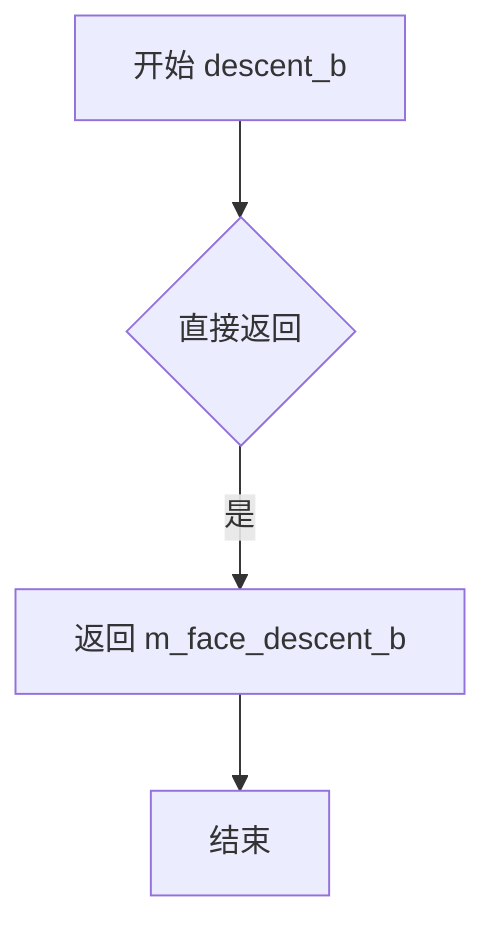

#### 带注释源码

```cpp
// 返回字体的底部下降值（descent_b）
// descent_b 表示字体基线以下的像素高度，用于文本垂直定位
double descent_b() const
{
    // 直接返回成员变量 m_face_descent_b
    // 该值在 cached_font 构造函数中从底层字体引擎获取
    return m_face_descent_b;
}
```


### `cached_font.add_kerning`

该方法用于在两个缓存的字形之间应用字距调整（kerning），通过调用底层字体引擎的 `add_kerning` 函数来获取和设置字形之间的间距调整值。

参数：

- `first`：`const cached_glyph *`，第一个字形的缓存数据指针
- `second`：`const cached_glyph *`，第二个字形的缓存数据指针
- `x`：`double *`，指向存储 X 轴字距调整值的 double 变量的指针
- `y`：`double *`，指向存储 Y 轴字距调整值的 double 变量的指针

返回值：`bool`，如果成功应用了字距调整则返回 `true`，如果任一参数为空则返回 `false`

#### 流程图

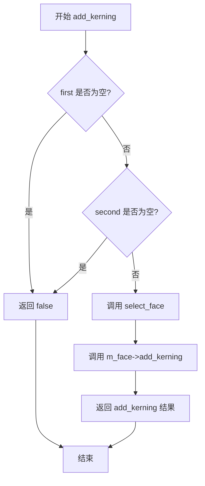

#### 带注释源码

```
// 该方法用于应用字距调整（Kerning），即调整两个字符之间的间距
// 参数：
//   first  - 第一个字形的缓存数据指针
//   second - 第二个字形的缓存数据指针
//   x      - 输出参数，存储 X 轴方向的距离调整值
//   y      - 输出参数，存储 Y 轴方向的距离调整值
// 返回值：
//   bool   - 成功返回 true，失败返回 false
bool add_kerning( const cached_glyph *first, const cached_glyph *second, double* x, double* y)
{
    // 检查两个字形指针是否有效，如果任一为空则无法进行字距调整
    if( !first || !second )
        return false;
    
    // 确保当前使用正确的字体实例（高度、宽度、提示和渲染模式）
    select_face();
    
    // 调用底层字体面的字距调整功能，传入两个字形的索引和调整值存储位置
    // 字形索引（glyph_index）是字形在字体中的唯一标识
    return m_face->add_kerning(
        first->glyph_index,  // 第一个字形的索引
        second->glyph_index, // 第二个字形的索引
        x,                   // X 轴调整值输出
        y );                 // Y 轴调整值输出
}
```


### `cached_font.select_face()`

该方法负责调用底层字体引擎的 `select_instance` 接口，根据当前缓存字体的参数（高度、宽度、提示模式、渲染模式）选择并激活对应的字体实例。它是一个内部核心方法，确保在获取字形前选中正确的字体变体。

参数：（无参数）

返回值：`void`，无返回值

#### 流程图

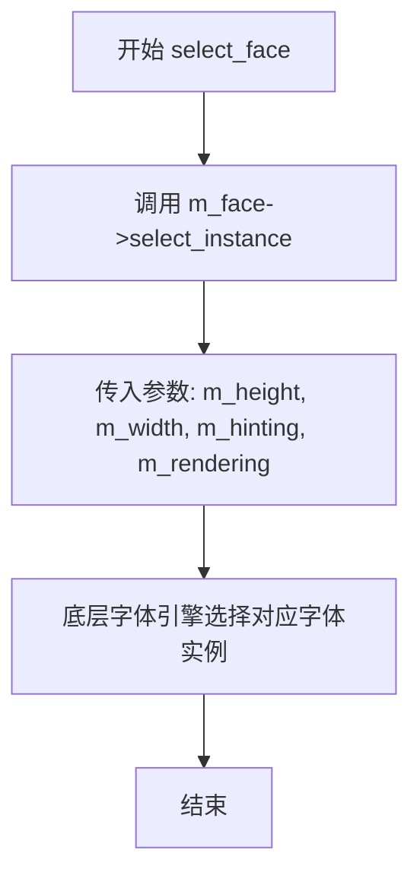

#### 带注释源码

```cpp
//----------------------------------------------------------------------------
// select_face 方法实现
// 位于 cached_font 结构体内部
//----------------------------------------------------------------------------

// 无参数的成员方法
void select_face()
{
    // 调用底层字体引擎的 select_instance 方法
    // 参数说明：
    //   m_height   - 字体高度
    //   m_width    - 字体宽度
    //   m_hinting  - 是否启用字体微调提示
    //   m_rendering - 渲染模式（单色、灰度、轮廓等）
    m_face->select_instance( m_height, m_width, m_hinting, m_rendering );
}
```


### `cached_font.get_glyph`

该方法用于获取指定字符码点的字形数据。首先在内部缓存中查找对应的字形，如果存在则直接返回；如果不存在，则调用字体引擎准备字形，将其缓存并写入数据，最后返回字形指针。

参数：

- `cp`：`unsigned`，字符码点（Unicode code point）

返回值：`const cached_glyph*`，返回指向缓存字形结构的指针，如果字形准备失败则返回 nullptr

#### 流程图

```mermaid
graph TD
    A[开始 get_glyph] --> B{在缓存中查找字形}
    B -->|找到| C[返回缓存的字形]
    B -->|未找到| D[调用字体引擎准备字形]
    D --> E{准备是否成功}
    E -->|成功| F[缓存字形数据]
    F --> G[写入字形数据到缓存]
    G --> H[返回字形指针]
    E -->|失败| I[返回 nullptr]
```

#### 带注释源码

```cpp
const cached_glyph *get_glyph(unsigned cp)
{
    // 第一步：在缓存中查找是否已有该字形
    const cached_glyph *glyph = m_glyphs.find_glyph(cp);
    
    // 如果缓存中没有该字形
    if( glyph == 0 )
    {
        // 声明一个prepared_glyph结构用于存储字体引擎准备的字形数据
        typename FontEngine::prepared_glyph prepared;
        
        // 确保使用正确的字体面（face）
        select_face();
        
        // 调用字体引擎准备字形数据
        bool success = m_face->prepare_glyph(cp, &prepared);
        
        // 如果准备成功
        if( success )
        {
            // 将字形缓存到内部缓存结构中
            glyph = m_glyphs.cache_glyph(
                this,                       // 当前cached_font实例
                prepared.glyph_code,        // 字形代码
                prepared.glyph_index,       // 字形索引
                prepared.data_size,         // 字形数据大小
                prepared.data_type,         // 字形数据类型
                prepared.bounds,            // 字形边界
                prepared.advance_x,         // X轴前进距离
                prepared.advance_y );       // Y轴前进距离
            
            // 断言确保缓存成功
            assert( glyph != 0 );
            
            // 将字形数据写入缓存的内存中
            m_face->write_glyph_to(&prepared, glyph->data);
        }
    }
    
    // 返回字形指针（如果查找失败或准备失败则返回nullptr）
    return glyph;
}
```

## 关键组件


### glyph_data_type 枚举

定义字形数据类型枚举，包括无效(glyph_data_invalid)、单色(glyph_data_mono)、灰度8位(glyph_data_gray8)和轮廓(glyph_data_outline)四种类型，用于区分不同的字形渲染方式。

### cached_glyph 结构体

缓存的字形数据结构，包含字形代码、索引、数据指针、数据大小、数据类型、边界框和推进距离等字段，用于存储单个字形的完整信息。

### cached_glyphs 类

字形缓存容器类，使用256x256的二维指针数组通过glyph_code的高8位(msb)和低8位(lsb)进行索引，配合block_allocator进行内存分配，实现字形的存储和查找。

### glyph_rendering 枚举

定义字形渲染方式枚举，包括本地单色、本地灰度、轮廓、AGG单色和AGG灰度五种渲染模式。

### cached_font 结构体

缓存的字体对象，封装字体引擎和已加载字面，包含字形缓存管理(get_glyph)、字面选择(select_face)和字距调整(add_kerning)功能，实现字形的惰性加载和缓存机制。

### font_cache_manager 模板类

字体缓存管理器模板类，管理字体引擎和多种自适应器(path_adaptor、gray8_adaptor、mono_adaptor)，通过init_embedded_adaptors方法根据字形数据类型初始化相应的自适应器，提供统一的访问接口。

### block_allocator 内存管理

代码中隐式使用的block_allocator用于高效分配固定大小(16384-16字节)的内存块，减少碎片并提高缓存性能。

### 字形索引机制

通过glyph_code的位操作((glyph_code >> 8) & 0xFF和glyph_code & 0xFF)实现256x256的二维索引矩阵，支持最多65536个不同字形代码的缓存。

### 惰性加载实现

cached_font::get_glyph方法实现惰性加载逻辑，仅在缓存未命中时才调用prepare_glyph和write_glyph_to生成字形数据，避免启动时预加载所有字形。

### 多格式支持

通过data_type分支和对应的adaptor初始化，支持单色、灰度8位和轮廓三种字形格式的渲染管线。


## 问题及建议


### 已知问题

-   **未使用的构造函数参数**：`font_cache_manager` 构造函数接收 `max_fonts` 参数但从未使用，导致参数无意义
-   **缺失的资源释放机制**：`cached_glyphs` 类使用 `block_allocator` 分配内存，但没有任何析构函数或显式的释放方法，会导致内存泄漏
-   **不安全的错误处理**：大量使用 `assert()` 而非适当的错误处理机制，在 Release 模式下会导致程序崩溃
-   **缺少虚析构函数**：`cached_glyphs` 类作为管理资源的类，缺少虚析构函数可能导致多态删除问题
-   **硬编码的魔数**：块大小 `16384-16` 和数组大小 `256` 是硬编码的常量，缺乏可配置性
-   **不完整的拷贝控制**：复制构造函数和赋值运算符被私有化但未实现，阻止了类的正常使用
-   **类型安全问题**：大量使用 C 风格类型转换（如 `(cached_glyph*)`、`(cached_glyph**)`），缺乏类型安全保护
-   **弱类型设计**：使用 `void*` 作为 `cached_font` 类型，丢失了类型信息
-   **命名不一致**：某些地方使用缩写（如 `msb`/`lsb`），而其他地方使用完整单词，降低了可读性
-   **线程不安全**：多线程环境下访问缓存可能产生数据竞争，缺乏同步机制
-   **缺失边界检查**：在数组访问（如 `m_glyphs[msb]`）前虽然有检查，但对 `glyph_code` 的有效性验证不足
-   **API 设计不完整**：`font_cache_manager` 类没有提供清除缓存的方法

### 优化建议

-   移除未使用的 `max_fonts` 参数，或实现其应有的功能
-   为 `cached_glyphs` 类添加析构函数以释放 `block_allocator` 分配的内存
-   将 `assert()` 替换为适当的错误返回机制或异常处理
-   将硬编码值提取为具名常量，并提供配置接口
-   使用 `static_cast` 等 C++ 类型转换替代 C 风格转换
-   考虑使用智能指针管理 `cached_glyph` 的生命周期
-   为需要拷贝的类实现正确的拷贝控制，或使用 `= delete` 明确禁止
-   添加线程安全的缓存访问机制（如互斥锁或原子操作）
-   增加字形代码的有效性验证
-   添加 `clear()` 方法以支持缓存的手动清理
-   统一命名规范，提高代码可读性


## 其它


### 设计目标与约束

本模块的核心设计目标是优化字体渲染性能，通过缓存机制避免重复的字体数据计算和内存分配，减少每次渲染字形时的开销。系统需要满足以下约束：内存使用可控（使用block_allocator进行固定大小块分配）、缓存查询时间复杂度为O(1)、支持多种字形数据类型（单色、灰度8位、轮廓）、模板化设计以支持不同的字体引擎实现。

### 错误处理与异常设计

本模块采用轻量级错误处理策略以保持高性能。使用assert宏验证关键假设（如缓存创建成功），当内存分配失败或字形已存在时返回nullptr或0值，不抛出异常。调用方需要自行检查返回值并处理可能的失败情况。cache_glyph方法在字形已缓存时返回0而非覆盖现有数据，这是一个设计选择以保证缓存稳定性。

### 数据流与状态机

系统包含两个主要数据流：
1. 字形查询流程：请求字形(glyph_code) → 查询缓存(find_glyph) → 缓存命中则返回 → 缓存未命中则调用FontEngine生成字形 → 写入缓存 → 返回字形指针
2. 字形渲染流程：根据data_type选择合适的适配器(mono/gray8/path_adaptor) → 初始化适配器 → 进行扫描线或路径渲染

状态转换主要发生在：
- 缓存状态：未初始化 → 部分填充 → 满载
- 字形数据类型：invalid → (mono | gray8 | outline)

### 外部依赖与接口契约

本模块依赖以下外部组件：
1. FontEngine模板参数：需提供loaded_face接口（包含height、width、ascent、descent、select_instance、prepare_glyph、add_kerning、write_glyph_to方法）
2. path_adaptor_type：用于渲染轮廓字形的路径适配器
3. gray8_adaptor_type及其embedded_scanline：用于灰度8位字形渲染
4. mono_adaptor_type及其embedded_scanline：用于单色字形渲染
5. block_allocator：来自agg_array.h的内存分配器
6. rect_i：矩形整数结构

调用方需保证FontEngine实现的线程安全性，且传入的参数（如glyph_code）需在有效范围内（0-65535）。

### 内存管理策略

本模块使用block_allocator进行内存管理，采用固定大小块分配策略（block_size = 16384-16字节）。cached_glyphs类使用二级指针数组（256×256）管理字形缓存，通过msb（高8位）和lsb（低8位）索引。内存分配按需进行，首次访问某字形时触发分配，已缓存字形不会重复分配。

### 线程安全性分析

本模块本身不包含线程同步机制，cached_glyphs和font_cache_manager类均非线程安全。FontEngine和block_allocator的线程安全性由调用方保证。在多线程环境下，每个线程应拥有独立的font_cache_manager实例，或在外部实现加锁保护。

### 配置参数与常量

本模块包含以下可配置参数：
- block_size：内存块大小（16384-16字节）
- max_fonts：最大字体数量（默认32，在font_cache_manager构造函数中声明但未实际使用）
- glyph_data_type枚举值：glyph_data_invalid(0)、glyph_data_mono(1)、glyph_data_gray8(2)、glyph_data_outline(3)
- glyph_rendering枚举值：glyph_ren_native_mono、glyph_ren_native_gray8、glyph_ren_outline、glyph_ren_agg_mono、glyph_ren_agg_gray8

    