# `matplotlib\extern\agg24-svn\include\agg_gamma_functions.h` 详细设计文档

这是一个gamma函数库，提供了多种图像灰度/颜色校正算法的实现，包括无操作、幂函数、阈值、线性和乘法gamma校正，以及sRGB与线性颜色空间之间的转换函数。该库是Anti-Grain Geometry (AGG) 2.4图形库的一部分，用于图像处理中的颜色空间转换和亮度调整。

## 整体流程

```mermaid
graph TD
    A[开始] --> B{调用gamma函数}
    B --> C{gamma类型}
    C -->|gamma_none| D[返回原值 x]
    C -->|gamma_power| E[返回 pow(x, m_gamma)]
    C -->|gamma_threshold| F{ x < m_threshold? }
    F -- 是 --> G[返回 0.0]
    F -- 否 --> H[返回 1.0]
    C -->|gamma_linear| I{ x 范围检查 }
    I -->|x < m_start| J[返回 0.0]
    I -->|x > m_end| K[返回 1.0]
    I -->|其他| L[返回归一化值]
    C -->|gamma_multiply| M[计算 y = x * m_mul]
    M --> N{ y > 1.0? }
    N -- 是 --> O[返回 1.0]
    N -- 否 --> P[返回 y]
    Q[sRGB转换] --> R{sRGB_to_linear}
    R --> S{ x <= 0.04045? }
    S -- 是 --> T[返回 x/12.92]
    S -- 否 --> U[返回 pow((x+0.055)/1.055, 2.4)]
    V[线性转换] --> W{linear_to_sRGB}
    W --> X{ x <= 0.0031308? }
    X -- 是 --> Y[返回 x*12.92]
    X -- 否 --> Z[返回 1.055*pow(x, 1/2.4) - 0.055]
```

## 类结构

```
agg (命名空间)
├── gamma_none (struct)
├── gamma_power (class)
├── gamma_threshold (class)
├── gamma_linear (class)
├── gamma_multiply (class)
├── sRGB_to_linear (全局函数)
└── linear_to_sRGB (全局函数)
```

## 全局变量及字段


### `gamma_power.m_gamma`
    
存储gamma幂函数的指数值，用于调整图像的伽马曲线

类型：`double`
    


### `gamma_threshold.m_threshold`
    
存储阈值参数，用于将输入值二值化为0或1

类型：`double`
    


### `gamma_linear.m_start`
    
存储线性gamma函数的起始值，定义输入范围的低端

类型：`double`
    


### `gamma_linear.m_end`
    
存储线性gamma函数的结束值，定义输入范围的高端

类型：`double`
    


### `gamma_multiply.m_mul`
    
存储乘法因子，用于对输入值进行线性缩放处理

类型：`double`
    
    

## 全局函数及方法


### `sRGB_to_linear`

该函数实现将sRGB颜色值转换为线性颜色空间的值，依据sRGB标准定义的分段转换公式进行处理。

参数：

- `x`：`double`，输入的sRGB颜色分量值，范围通常为[0.0, 1.0]

返回值：`double`，转换后的线性颜色空间值

#### 流程图

```mermaid
flowchart TD
    A[开始 sRGB_to_linear] --> B{x <= 0.04045?}
    B -->|是| C[返回 x / 12.92]
    B -->|否| D[返回 pow&#40;&#40;x + 0.055&#41; / 1.055, 2.4&#41;]
    C --> E[结束]
    D --> E
```

#### 带注释源码

```cpp
//----------------------------------------------------------------------------
// sRGB to Linear conversion function
// Implements the sRGB gamma transformation according to IEC 61966-2-1 standard
//----------------------------------------------------------------------------

// 将sRGB颜色值转换为线性颜色空间
// 参数: x - sRGB颜色分量值 [0.0, 1.0]
// 返回: 线性颜色空间值
inline double sRGB_to_linear(double x)
{
    // 使用分段函数进行转换：
    // 1. 对于低值部分（x <= 0.04045），使用线性公式近似
    // 2. 对于高值部分，使用伽马曲线公式 (x+0.055)/1.055 的2.4次幂
    return (x <= 0.04045) ? (x / 12.92) : pow((x + 0.055) / (1.055), 2.4);
}
```

#### 相关设计信息

**设计目标与约束**

- 遵循IEC 61966-2-1 sRGB标准
- 分段线性转换确保数值稳定性，避免在接近0处使用幂函数导致的精度问题

**外部依赖**

- `<math.h>`：提供pow函数支持
- 使用标准数学库函数pow进行指数运算

**潜在优化空间**

- 可考虑使用查找表(LUT)进行批量颜色转换以提升性能
- 对于实时渲染场景，可使用近似多项式替代pow函数
- 阈值0.04045和系数12.92、0.055、1.055、2.4可提取为常量以提高可维护性


### `linear_to_sRGB`

该函数实现将线性颜色空间的数值转换为 sRGB 颜色空间数值的转换，使用分段函数处理低值和高值情况，符合 IEC 标准 sRGB 转换公式。

参数：

- `x`：`double`，线性颜色空间的值，范围通常在 0.0 到 1.0 之间

返回值：`double`，转换后的 sRGB 颜色空间值

#### 流程图

```mermaid
flowchart TD
    A[开始] --> B{x <= 0.0031308?}
    B -->|是| C[返回 x * 12.92]
    B -->|否| D[返回 1.055 * pow(x, 1/2.4) - 0.055]
    C --> E[结束]
    D --> E
```

#### 带注释源码

```cpp
// 将线性颜色空间值转换为 sRGB 颜色空间值
// 使用 IEC 标准 sRGB 转换公式
// 参数 x: 线性颜色空间的值 (0.0-1.0)
// 返回值: sRGB 颜色空间的值
inline double linear_to_sRGB(double x)
{
    // 使用分段函数处理：
    // 当 x 较小时使用线性近似（避免幂运算的不稳定性）
    // 当 x 较大时使用完整的 sRGB 伽马校正公式
    return (x <= 0.0031308) ? (x * 12.92) : (1.055 * pow(x, 1 / 2.4) - 0.055);
}
```


### `gamma_none.operator()`

该函数是 Anti-Grain Geometry 库中 gamma 校正模块的一部分，实现了恒等映射（identity mapping），即直接返回输入值而不做任何变换。这在需要默认或空 gamma 校正的场景下作为占位符使用。

参数：

- `x`：`double`，待校正的输入值，范围通常为 [0.0, 1.0]

返回值：`double`，校正后的输出值，由于是恒等函数，返回值与输入值相同

#### 流程图

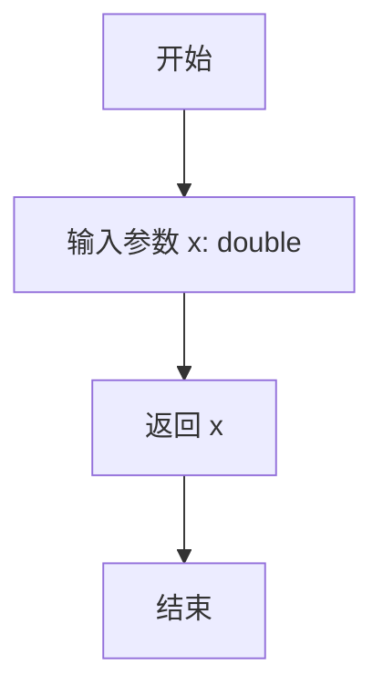

#### 带注释源码

```cpp
//===============================================================gamma_none
// 这是一个空操作（no-op）的 gamma 校正函数结构体
// 用于需要默认 gamma 曲线但又不希望进行任何实际校正的场景
struct gamma_none
{
    // 重载函数调用运算符，实现恒等映射
    // 参数 x: 输入的灰度/亮度值，范围通常为 [0.0, 1.0]
    // 返回值: 直接返回输入值 x，不做任何变换
    double operator()(double x) const { return x; }
};
```

#### 关联信息

**所属类/结构体**：`gamma_none`

**设计意图**：

- 提供一个"无操作"的 gamma 校正实现
- 作为默认或空实现的占位符
- 在需要可配置 gamma 函数但希望使用默认恒等映射的场景下使用
- 符合策略模式（Strategy Pattern）的设计，允许统一接口调用不同的 gamma 校正算法

**const 限定符的作用**：
- 确保 operator() 不会修改对象状态
- 允许在 const 上下文中使用该函数对象


### 1. 代码核心功能概述
该代码文件定义在 Anti-Grain Geometry (AGG) 图形库中，提供了一组用于图像伽马（Gamma）校正的函数对象（Functors）。这些类通过重载 `operator()`，将输入的像素值（0.0-1.0）映射为校正后的输出值，用于调整图像的亮度和对比度。

### 2. 文件整体运行流程
该文件主要定义了 `agg` 命名空间下的多个 functor 类。应用程序在需要对图像进行伽马校正时，会创建相应的 functor 对象（如 `gamma_power`），并将其传递给渲染管线。渲染过程中，图像每个像素的通道值都会调用该 functor 的 `operator()` 进行转换。

### 3. 类的详细信息

#### 3.1 `gamma_power` 类
该类使用幂函数实现伽马校正。

**类字段：**
- `m_gamma`：类型 `double`，存储幂函数的指数值。

**类方法：**
- `gamma_power(double g)`：构造函数，用给定的指数初始化。
- `void gamma(double g)`：设置伽马值。
- `double gamma() const`：获取当前的伽马值。
- **`double operator() (double x) const`**：核心功能方法，执行幂运算转换。

*(注：以下为任务要求的重点提取内容)*

### `{函数名}.{方法名}` (或 `{类名}.{方法名}`)

**`gamma_power::operator()`**

#### 描述
这是 `gamma_power` 类的核心调用运算符（Functor Interface）。它接收一个归一化（0.0-1.0）的输入值，利用存储的指数 `m_gamma` 计算其幂值，从而实现非线性的亮度映射。

参数：
- `x`：`double`，待转换的输入值（通常为像素颜色分量，范围 0.0 - 1.0）。

返回值：`double`，经过伽马幂函数校正后的输出值。

#### 流程图

```mermaid
graph TD
    A[开始: 输入 x] --> B{获取成员变量 m_gamma}
    B --> C[执行数学运算: pow(x, m_gamma)]
    C --> D[返回结果]
    D --> E[结束: 输出校正值]
```

#### 带注释源码

```cpp
// Gamma Power Functor 的重载调用运算符
// 参数: x - 输入值 (0.0 - 1.0)
// 返回: 伽马校正后的值
double operator() (double x) const
{
    // 使用 C++ 标准库 pow 函数计算 x 的 m_gamma 次幂
    return pow(x, m_gamma);
}
```

### 6. 潜在的技术债务或优化空间
- **性能优化**：`pow()` 函数在某些架构上开销较大。如果 `m_gamma` 是常数（如 1.0/2.2），可以考虑使用查表法（Lookup Table）或专用指令进行优化。
- **边界处理**：当前实现未对 `x` 的取值范围进行校验（虽然文档约定是 0-1）。若 `x < 0` 或 `m_gamma < 0`，可能导致未定义行为或浮点错误。

### 7. 其它项目
- **设计目标**：提供轻量级、函数式的伽马校正接口，适配AGG的渲染管线。
- **接口契约**：调用者需确保输入值 `x` 在 `[0, 1]` 区间内，且 `m_gamma` 不为负数，以获得符合预期的视觉效果。


### `gamma_power.gamma_power(double g)`

这是一个构造函数，用于创建gamma_power对象并初始化内部的gamma值。该构造函数接受一个double类型的参数g，并将其赋值给私有成员变量m_gamma。

参数：

- `g`：`double`，gamma值，用于设置gamma_power类的gamma参数

返回值：`void`，构造函数无返回值

#### 流程图

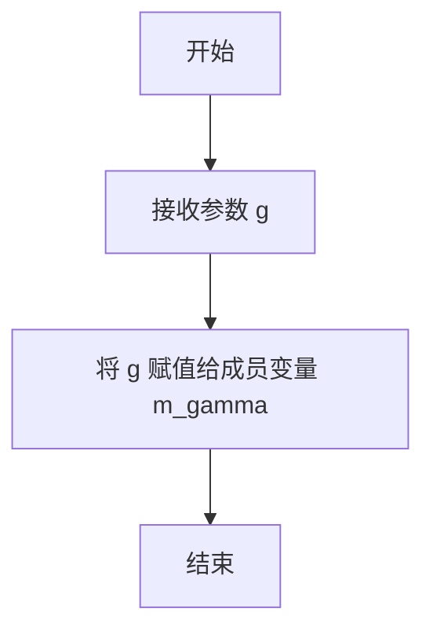

#### 带注释源码

```cpp
//----------------------------------------------------------------------------
// 构造函数：gamma_power
// 参数：
//   g - double类型，用于设置gamma值
// 功能：初始化m_gamma成员变量
//----------------------------------------------------------------------------
gamma_power(double g) : m_gamma(g) {}
```


### `gamma_power.gamma`

设置Gamma值，用于调整图像的伽马校正参数。

参数：

- `g`：`double`，要设置的Gamma值，用于控制图像亮度的非线性变换

返回值：`void`，无返回值

#### 流程图

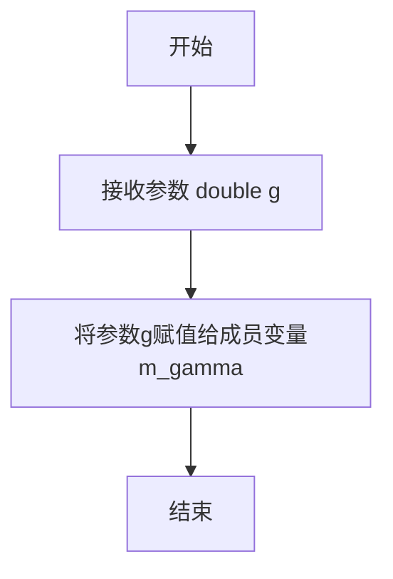

#### 带注释源码

```
//----------------------------------------------------------------------------
// 设置Gamma值的成员方法
//----------------------------------------------------------------------------
// 参数: g - double类型，要设置的Gamma值
// 返回: void，无返回值
// 作用: 将传入的Gamma值g赋值给类的私有成员变量m_gamma
//       该成员变量用于控制operator()中的幂函数变换
//----------------------------------------------------------------------------
void gamma(double g) 
{ 
    m_gamma = g;  // 将参数g赋值给私有成员变量m_gamma，完成Gamma值的设置
}
```


### `gamma_power.gamma`

该函数是 `gamma_power` 类的常量成员方法，用于获取当前设置的 gamma 校正值。

参数：
- （无参数）

返回值：`double`，返回存储在成员变量 `m_gamma` 中的 gamma 幂值。

#### 流程图

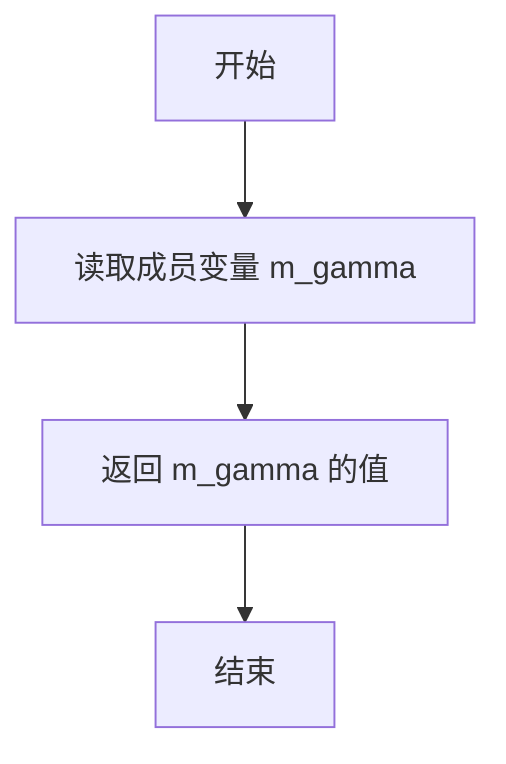

#### 带注释源码

```cpp
// 返回存储的 gamma 值
// 该函数为 const 成员函数，不会修改对象状态
// 返回值：double 类型的 gamma 幂值
double gamma() const { return m_gamma; }
```


### `gamma_power::operator()`

这是 `gamma_power` 类的调用运算符重载函数，用于对输入值进行 gamma 校正运算。它接受一个 double 类型的输入 x，通过 `pow(x, m_gamma)` 计算并返回 gamma 校正后的值，实现图像灰度或颜色的非线性变换。

参数：

- `x`：`double`，输入值，表示需要 gamma 校正的原始值，通常范围在 [0.0, 1.0] 之间

返回值：`double`，返回经过 gamma 校正后的值，计算结果为 x 的 m_gamma 次幂

#### 流程图

```mermaid
flowchart TD
    A[开始 operator()] --> B[输入参数 x]
    B --> C[调用 pow函数<br/>result = pow(x, m_gamma)]
    C --> D[返回 result]
    D --> E[结束]
    
    style A fill:#f9f,stroke:#333
    style D fill:#9f9,stroke:#333
    style E fill:#9f9,stroke:#333
```

#### 带注释源码

```cpp
// gamma_power 类中的调用运算符重载实现
// 文件: agg_gamma_functions.hpp
// 命名空间: agg

//----------------------------------------------------------------------------
// gamma_power::operator()
// 功能: 对输入值 x 进行 gamma 校正运算
// 参数: 
//   x - double 类型的输入值，通常为归一化的灰度值或颜色分量 [0.0, 1.0]
// 返回值:
//   double - 经过 gamma 校正后的值，范围通常在 [0.0, 1.0]
//----------------------------------------------------------------------------

double operator() (double x) const
{
    // 使用标准库 pow 函数计算 x 的 m_gamma 次幂
    // m_gamma 是类成员变量，通过构造函数或 gamma() 方法设置
    // 
    // Gamma 校正原理:
    // - 当 gamma > 1.0: 增强暗部细节，压暗亮部（扩展暗调）
    // - 当 gamma < 1.0: 增强亮部细节，提亮暗部（扩展亮调）
    // - 当 gamma = 1.0: 线性映射，无校正效果
    //
    // 数学公式: output = input^gamma
    // 典型应用: 显示器 gamma 校正、图像处理、色彩管理
    
    return pow(x, m_gamma);  // 调用 <cmath> 中的 pow 函数
}
```

#### 完整类定义参考

```cpp
//==============================================================gamma_power
// Gamma 校正函数类 - 使用幂函数进行 gamma 校正
// 用于图像处理中的灰度/颜色非线性变换
//============================================================================
class gamma_power
{
public:
    //------------------------------------------------------------------------
    // 构造函数
    //------------------------------------------------------------------------
    gamma_power() : m_gamma(1.0) {}          // 默认 gamma 值为 1.0（无校正）
    gamma_power(double g) : m_gamma(g) {}    // 使用指定 gamma 值初始化
    
    //------------------------------------------------------------------------
    // 设置 gamma 值
    //------------------------------------------------------------------------
    void gamma(double g) { m_gamma = g; }    // 修改 gamma 值
    double gamma() const { return m_gamma; } // 获取当前 gamma 值
    
    //------------------------------------------------------------------------
    // operator() - 调用运算符重载
    // 参数: x - double 类型的输入值
    // 返回: double - gamma 校正后的值
    //------------------------------------------------------------------------
    double operator() (double x) const
    {
        return pow(x, m_gamma);
    }

private:
    double m_gamma;  // gamma 指数值，控制校正曲线
};
```


### `gamma_threshold.gamma_threshold`

该类是 Anti-Grain Geometry 库中的 gamma 校正函数组件之一，核心功能为实现阈值（Threshold） gamma 变换：通过重载函数调用运算符 `operator()`，将输入的 double 类型数值与预设的阈值进行比较，当输入值小于阈值时返回 0.0，否则返回 1.0，常用于图像处理中的二值化或对比度增强场景。

参数：

- `x`：`double`，输入的待处理数值，表示需要进行 gamma 变换的输入值

返回值：`double`，返回变换后的结果，当 x < m_threshold 时返回 0.0，否则返回 1.0

#### 流程图

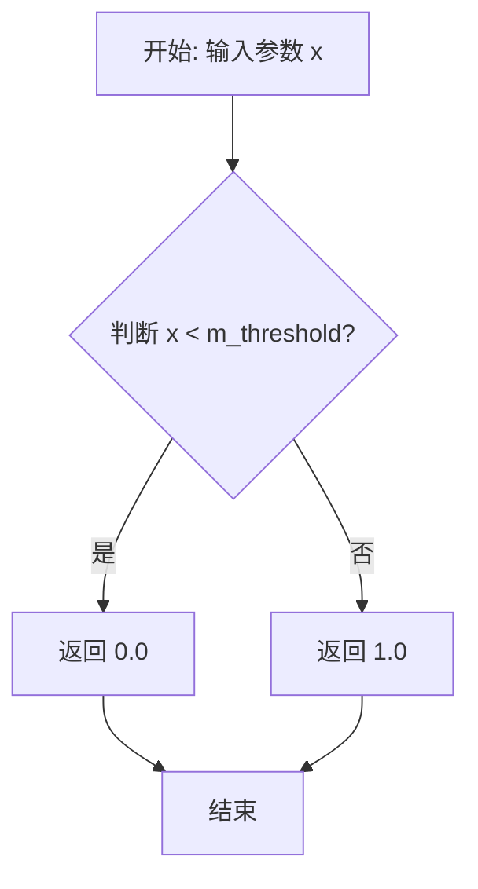

#### 带注释源码

```cpp
// gamma_threshold 类的核心成员函数实现
// 该函数重载了 operator()，使 gamma_threshold 对象可以像函数一样被调用
// 参数 x: double 类型，输入的 gamma 值
// 返回值: double 类型，根据阈值判断返回 0.0 或 1.0
double operator() (double x) const
{
    // 使用三元运算符进行阈值判断
    // 如果 x 小于阈值 m_threshold，返回 0.0
    // 否则返回 1.0
    return (x < m_threshold) ? 0.0 : 1.0;
}
```

#### 完整类定义源码

```cpp
//==========================================================gamma_threshold
// 阈值 gamma 变换类
// 用于实现二值化或阈值类型的 gamma 校正功能
class gamma_threshold
{
public:
    // 构造函数（默认），将阈值初始化为 0.5
    gamma_threshold() : m_threshold(0.5) {}
    
    // 构造函数（带参数），使用指定值初始化阈值
    gamma_threshold(double t) : m_threshold(t) {}

    // 设置阈值
    void threshold(double t) { m_threshold = t; }
    
    // 获取阈值
    double threshold() const { return m_threshold; }

    // 重载函数调用运算符，实现 functor 功能
    // 参数 x: double 类型，输入的待处理数值
    // 返回值: double 类型，阈值为界返回 0.0 或 1.0
    double operator() (double x) const
    {
        return (x < m_threshold) ? 0.0 : 1.0;
    }

private:
    // 私有成员变量，存储阈值
    double m_threshold;
};
```


### `gamma_threshold.gamma_threshold`

这是一个构造函数，用于创建 `gamma_threshold` 类的实例，并将阈值 `m_threshold` 初始化为传入的参数 `t`。

参数：

- `t`：`double`，用于设置阈值的参数。

返回值：`void`（构造函数）。

#### 流程图

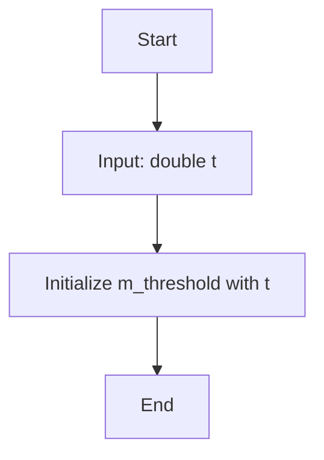

#### 带注释源码

```cpp
// 构造函数定义，接受一个 double 类型的参数 t
// 参数 t: 阈值，将被赋值给成员变量 m_threshold
gamma_threshold(double t) : m_threshold(t) {}
```


### `gamma_threshold.threshold`

该方法用于设置 gamma_threshold 类的阈值参数，通过将传入的阈值参数赋值给内部成员变量 m_threshold 来更新阈值。

参数：

- `t`：`double`，用于设置 gamma 阈值函数的阈值参数

返回值：`void`，无返回值，用于修改内部阈值状态

#### 流程图

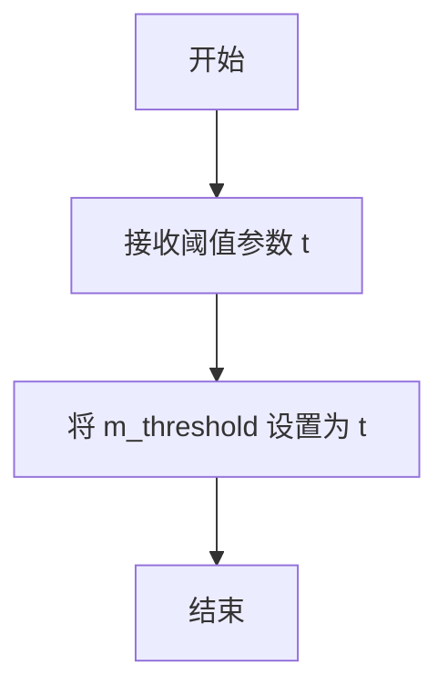

#### 带注释源码

```cpp
// 设置阈值的方法
// 参数: t - double类型的阈值，用于设置m_threshold的值
// 返回值: void，无返回值
void threshold(double t) 
{ 
    m_threshold = t;   // 将传入的参数t赋值给成员变量m_threshold
}
```


### `gamma_threshold.threshold`

该方法是一个const成员函数，用于获取gamma_threshold类的阈值参数。在图像处理中，gamma_threshold实现阈值函数，将输入值x与阈值m_threshold比较，小于阈值返回0.0，否则返回1.0，常用于图像二值化或对比度增强。

参数：

- （无参数）

返回值：`double`，返回当前设置的阈值m_threshold值

#### 流程图

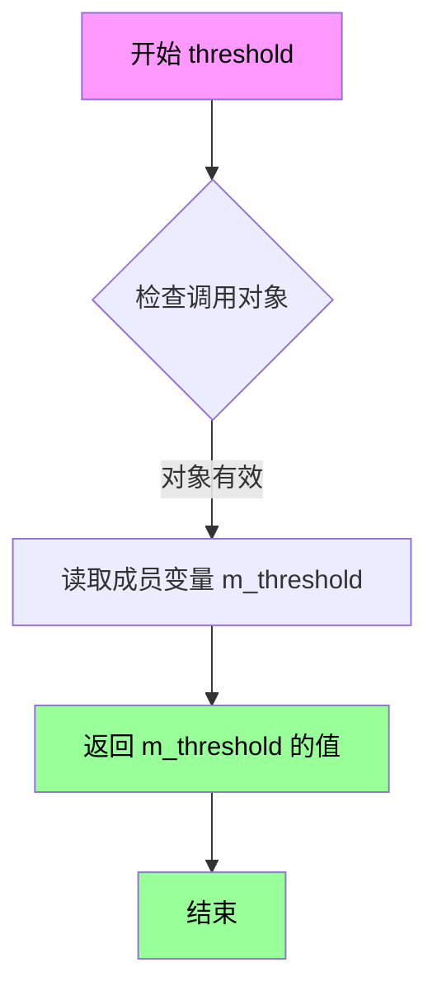

#### 带注释源码

```cpp
// 命名空间开始
namespace agg
{
    // gamma_threshold 类定义
    // 该类实现阈值型gamma函数，用于图像处理中的阈值操作
    class gamma_threshold
    {
    public:
        // 默认构造函数，初始化阈值为0.5
        gamma_threshold() : m_threshold(0.5) {}
        
        // 带参构造函数，使用指定值初始化阈值
        gamma_threshold(double t) : m_threshold(t) {}

        // setter方法：设置阈值
        void threshold(double t) { m_threshold = t; }
        
        // getter方法（当前分析的方法）：获取阈值
        // 返回类型：double
        // 访问权限：const成员函数，不修改对象状态
        double threshold() const { return m_threshold; }

        // 重载括号运算符，实现函数对象
        // 对输入x进行阈值处理：小于阈值返回0.0，否则返回1.0
        double operator() (double x) const
        {
            return (x < m_threshold) ? 0.0 : 1.0;
        }

    private:
        // 成员变量：存储阈值
        double m_threshold;
    };
}
```


### `gamma_threshold.operator()`

对输入值进行阈值二值化处理。当输入值小于阈值时返回 0.0，否则返回 1.0，实现简单的二值化映射功能。

参数：

- `x`：`double`，输入的灰度值或需要二值化的数值

返回值：`double`，当 x < m_threshold 时返回 0.0，否则返回 1.0

#### 流程图

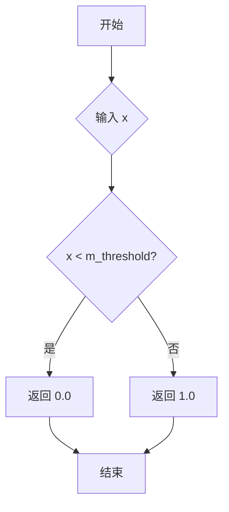

#### 带注释源码

```cpp
//==========================================================gamma_threshold
class gamma_threshold
{
public:
    // 构造函数，使用默认阈值 0.5
    gamma_threshold() : m_threshold(0.5) {}
    
    // 构造函数，使用指定阈值 t 初始化
    gamma_threshold(double t) : m_threshold(t) {}

    // 设置阈值
    void threshold(double t) { m_threshold = t; }
    
    // 获取当前阈值
    double threshold() const { return m_threshold; }

    // 重载 operator()，实现函数对象
    // 参数 x: 输入的灰度值 [0.0, 1.0]
    // 返回值: 二值化结果，当 x < m_threshold 时返回 0.0，否则返回 1.0
    double operator() (double x) const
    {
        return (x < m_threshold) ? 0.0 : 1.0;  // 三元运算符实现阈值判断
    }

private:
    double m_threshold;  // 阈值成员变量，默认为 0.5
};
```


### `gamma_linear.gamma_linear()`

gamma_linear 类的构造函数，用于初始化线性伽马校正的起始值和结束值。如果未提供参数，则使用默认值 m_start=0.0 和 m_end=1.0。

参数：

- `s`：`double`，线性伽马变换的起始值（阈值下限），默认为 0.0
- `e`：`double`，线性伽马变换的结束值（阈值上限），默认为 1.0

返回值：无（构造函数）

#### 流程图

```mermaid
flowchart TD
    A[开始] --> B{是否传入参数 s 和 e?}
    -->|是| C[使用传入的 s 初始化 m_start]
    C --> D[使用传入的 e 初始化 m_end]
    --> F[结束]
    |否| E[使用默认值 m_start=0.0, m_end=1.0]
    --> F[结束]
```

#### 带注释源码

```cpp
//============================================================gamma_linear
class gamma_linear
{
public:
    // 默认构造函数，初始化 m_start 为 0.0，m_end 为 1.0
    // 即默认情况下输入值从 0 到 1 进行线性映射
    gamma_linear() : m_start(0.0), m_end(1.0) {}

    // 带参构造函数，使用传入的 s 和 e 初始化 m_start 和 m_end
    // 参数 s: 线性变换的起始阈值
    // 参数 e: 线性变换的结束阈值
    gamma_linear(double s, double e) : m_start(s), m_end(e) {}

    // 设置函数，同时设置起始值和结束值
    void set(double s, double e) { m_start = s; m_end = e; }
    
    // 设置起始值
    void start(double s) { m_start = s; }
    
    // 设置结束值
    void end(double e) { m_end = e; }
    
    // 获取起始值
    double start() const { return m_start; }
    
    // 获取结束值
    double end() const { return m_end; }

    // 重载函数调用运算符，实现线性伽马变换的核心逻辑
    // 参数 x: 输入的原始值（通常在 0.0 到 1.0 之间）
    // 返回值: 伽马校正后的值
    //   - 如果 x < m_start，返回 0.0
    //   - 如果 x > m_end，返回 1.0
    //   - 否则返回 (x - m_start) / (m_end - m_start) 的线性映射结果
    double operator() (double x) const
    {
        if(x < m_start) return 0.0;
        if(x > m_end) return 1.0;
        return (x - m_start) / (m_end - m_start);
    }

private:
    double m_start;  // 线性伽马变换的起始阈值
    double m_end;    // 线性伽马变换的结束阈值
};
```


### `gamma_linear.gamma_linear`

该构造函数用于创建 gamma_linear 类实例，接收起始和结束阈值参数，初始化内部的 m_start 和 m_end 成员变量，用于定义线性gamma校正的输入范围。

参数：

- `s`：`double`，gamma校正的起始阈值（start value），定义输入范围的低端边界
- `e`：`double`，gamma校正的结束阈值（end value），定义输入范围的高端边界

返回值：`void`，构造函数无返回值

#### 流程图

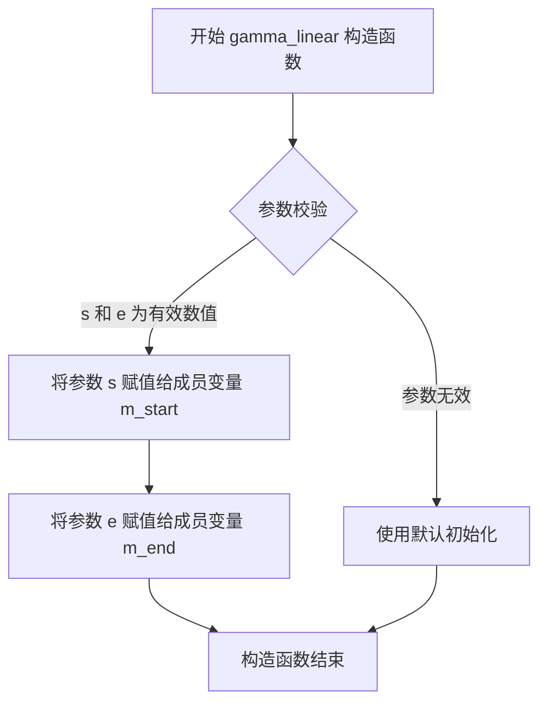

#### 带注释源码

```cpp
//============================================================gamma_linear
class gamma_linear
{
    public:
        // 默认构造函数，将起始和结束阈值初始化为 0.0 和 1.0
        gamma_linear() : m_start(0.0), m_end(1.0) {}

        // 带参数构造函数，使用传入的 s 和 e 初始化 m_start 和 m_end
        // 参数:
        //   s - gamma校正的起始阈值（输入范围下限）
        //   e - gamma校正的结束阈值（输入范围上限）
        gamma_linear(double s, double e) : m_start(s), m_end(e) {}

        // 设置函数，同时设置起始和结束阈值
        void set(double s, double e) { m_start = s; m_end = e; }
        
        // 设置起始阈值
        void start(double s) { m_start = s; }
        
        // 设置结束阈值
        void end(double e) { m_end = e; }
        
        // 获取起始阈值
        double start() const { return m_start; }
        
        // 获取结束阈值
        double end() const { return m_end; }

        // 重载函数调用运算符，实现gamma线性变换函数
        // 参数 x: 输入值
        // 返回值: 
        //   - 如果 x < m_start，返回 0.0
        //   - 如果 x > m_end，返回 1.0
        //   - 否则返回 (x - m_start) / (m_end - m_start) 的线性映射值
        double operator() (double x) const
        {
            if(x < m_start) return 0.0;
            if(x > m_end) return 1.0;
            return (x - m_start) / (m_end - m_start);
        }

    private:
        double m_start;  // gamma校正的起始阈值
        double m_end;    // gamma校正的结束阈值
};
```


### `gamma_linear.set`

设置线性伽马函数的起始值和结束值，用于定义输入值的线性映射范围。该方法允许在对象创建后动态调整伽马曲线的阈值。

参数：

- `s`：`double`，伽马线性变换的起始阈值（start value）
- `e`：`double`，伽马线性变换的结束阈值（end value）

返回值：`void`，无返回值

#### 流程图

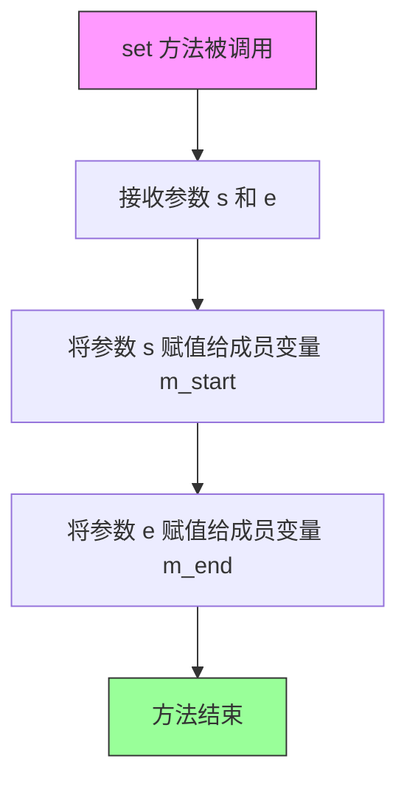

#### 带注释源码

```cpp
// 设置线性伽马函数的起始和结束阈值
// 参数 s: 起始阈值（m_start），定义映射范围的低端
// 参数 e: 结束阈值（m_end），定义映射范围的高端
void set(double s, double e) 
{ 
    m_start = s;  // 将传入的起始值 s 赋值给成员变量 m_start
    m_end = e;    // 将传入的结束值 e 赋值给成员变量 m_end
}
```

#### 关联信息

该方法与 `gamma_linear` 类的其他接口配合使用：

| 成员方法 | 功能 |
|---------|------|
| `start(double s)` | 单独设置起始值 |
| `end(double e)` | 单独设置结束值 |
| `start() const` | 获取当前起始值 |
| `end() const` | 获取当前结束值 |
| `operator()(double x) const` | 应用伽马变换，使用 m_start 和 m_end 进行线性映射 |

#### 使用示例

```cpp
// 创建 gamma_linear 对象并设置阈值
gamma_linear g;
g.set(0.2, 0.8);  // 设置映射范围为 [0.2, 0.8]

// 输入值小于 0.2 时返回 0.0
// 输入值大于 0.8 时返回 1.0
// 输入值在 [0.2, 0.8] 范围内时，返回 (x - 0.2) / 0.6
```


### `gamma_linear.start`

设置 gamma 线性函数的起始阈值，用于定义 gamma 校正曲线的线性映射起始点。

参数：

- `s`：`double`，设置 gamma 线性变换的起始值（m_start），用于控制输入值在哪个点开始进行线性映射

返回值：`void`，无返回值，仅用于修改对象内部状态

#### 流程图

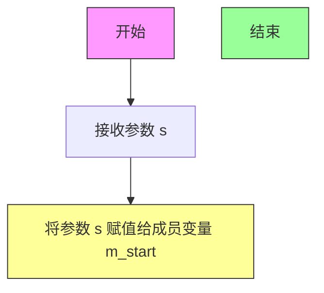

#### 带注释源码

```cpp
// 设置 gamma 线性函数的起始值
// 参数 s: double 类型，表示要设置的起始阈值
// 返回值: void，无返回值
void start(double s) 
{ 
    m_start = s;  // 将传入的参数 s 赋值给私有成员变量 m_start
}
```

#### 关联信息

该方法属于 `gamma_linear` 类，该类用于实现分段线性 gamma 校正功能：

- **m_start**：`double` 类型，gamma 线性映射的起始阈值
- **m_end**：`double` 类型，gamma 线性映射的结束阈值
- **operator()**：重载函数调用运算符，实现 gamma 校正计算：当输入值 x 小于 m_start 时返回 0.0，大于 m_end 时返回 1.0，否则返回归一化的线性映射值 `(x - m_start) / (m_end - m_start)`


### `gamma_linear.end`

该方法为 `gamma_linear` 类的成员函数，用于设置gamma线性变换的结束阈值。

参数：

- `e`：`double`，表示gamma线性变换的结束值

返回值：`void`，无返回值，仅用于设置成员变量

#### 流程图

```mermaid
graph TD
    A[开始] --> B[接收参数 e (double类型)]
    B --> C[将参数 e 的值赋给成员变量 m_end]
    C --> D[结束]
```

#### 带注释源码

```cpp
//============================================================gamma_linear
class gamma_linear
{
    ...
    // 设置gamma线性变换的结束阈值
    // 参数 e: 新的结束值，将被赋值给 m_end
    void end(double e) { m_end = e; }
    ...
};
```


### `gamma_linear.start`

获取 gamma_linear 类的起始阈值（start）值。该方法是 const 成员函数，用于返回线性 gamma 变换的起始点 m_start，允许在常量对象上调用。

参数： 无

返回值：`double`，返回线性 gamma 变换的起始阈值 m_start

#### 流程图

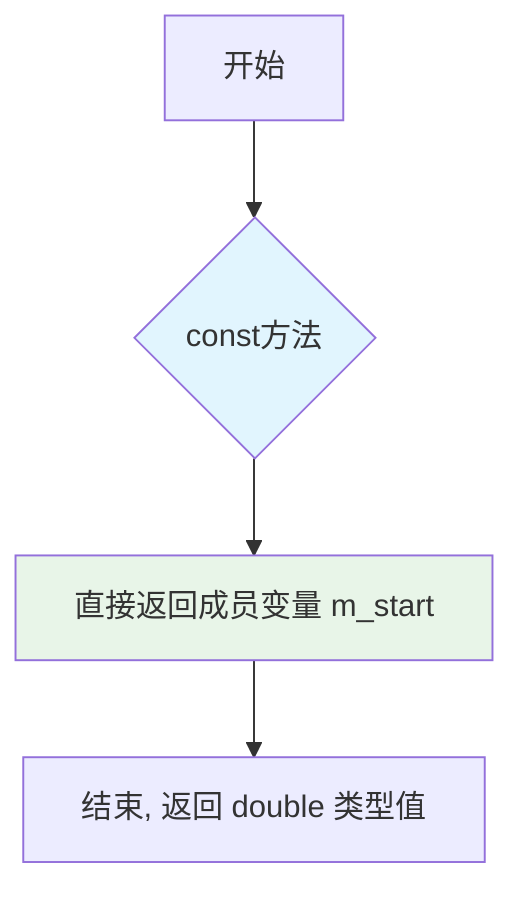

#### 带注释源码

```cpp
// 获取 gamma 线性变换的起始阈值
// @return double 返回起始阈值 m_start 的值
double start() const 
{ 
    return m_start;  // 返回私有成员变量 m_start 的值
}
```


### `gamma_linear.end`

获取 gamma_linear 对象的结束值（上限阈值），用于定义 gamma 线性变换的范围上限。

参数：空

返回值：`double`，返回 gamma 线性变换的结束值（上限值）m_end

#### 流程图

```mermaid
flowchart TD
    A[开始] --> B{方法调用}
    B --> C[返回成员变量 m_end 的值]
    C --> D[结束]
```

#### 带注释源码

```cpp
// 获取 gamma 线性变换的结束值（上限）
// 参数：无
// 返回值：double - 返回 gamma 线性变换的范围上限值
double end() const { return m_end; }
```


### `gamma_linear.operator()`

该方法是 `gamma_linear` 类的函数调用运算符重载，实现了线性gamma校正功能。它将输入值 `x` 通过线性映射转换到 [0, 1] 区间，当输入值在起始值和结束值之间时进行线性插值，超出范围则分别返回边界值。

参数：

- `x`：`double`，待转换的输入值

返回值：`double`，转换后的线性gamma值

#### 流程图

```mermaid
flowchart TD
    A[开始] --> B{x < m_start?}
    B -- 是 --> C[返回 0.0]
    B -- 否 --> D{x > m_end?}
    D -- 是 --> E[返回 1.0]
    D -- 否 --> F[计算: (x - m_start) / (m_end - m_start)]
    F --> G[返回计算结果]
    C --> H[结束]
    E --> H
    G --> H
```

#### 带注释源码

```cpp
//==========================================================gamma_linear
class gamma_linear
{
public:
    // 默认构造函数，初始化起始值为0.0，结束值为1.0
    gamma_linear() : m_start(0.0), m_end(1.0) {}
    
    // 带参构造函数，使用指定的起始值和结束值初始化
    gamma_linear(double s, double e) : m_start(s), m_end(e) {}

    // 设置起始值和结束值
    void set(double s, double e) { m_start = s; m_end = e; }
    
    // 设置起始值
    void start(double s) { m_start = s; }
    
    // 设置结束值
    void end(double e) { m_end = e; }
    
    // 获取起始值
    double start() const { return m_start; }
    
    // 获取结束值
    double end() const { return m_end; }

    // 函数调用运算符重载，实现线性gamma校正
    // 参数：x - 输入的double类型值
    // 返回值：double类型，为经过线性映射后的结果
    double operator() (double x) const
    {
        // 如果输入值小于起始值，返回0.0（下限截断）
        if(x < m_start) return 0.0;
        
        // 如果输入值大于结束值，返回1.0（上限截断）
        if(x > m_end) return 1.0;
        
        // 在起始值和结束值之间时，进行线性插值计算
        // 计算公式：(x - start) / (end - start)
        return (x - m_start) / (m_end - m_start);
    }

private:
    double m_start;  // 线性映射的起始值
    double m_end;    // 线性映射的结束值
};
```


### `gamma_multiply.gamma_multiply()`

该函数是 `gamma_multiply` 类的构造函数，用于初始化一个伽马校正乘法函数对象，默认将乘数设为1.0，可接受一个double参数指定乘数值。

参数：

-  `v`：`double`，传入的乘数值，用于控制伽马校正的乘法因子

返回值：`void`（构造函数无返回值）

#### 流程图

```mermaid
flowchart TD
    A[开始] --> B{是否传入参数v?}
    B -->|是| C[使用参数v初始化m_mul]
    B -->|否| D[使用默认值1.0初始化m_mul]
    C --> E[构造函数结束]
    D --> E
```

#### 带注释源码

```cpp
//==========================================================gamma_multiply
class gamma_multiply
{
public:
    // 默认构造函数，将乘数m_mul初始化为1.0
    gamma_multiply() : m_mul(1.0) {}
    
    // 带参数构造函数，使用传入的值v初始化乘数m_mul
    // 参数v: double类型，表示伽马校正的乘法因子
    gamma_multiply(double v) : m_mul(v) {}

    // 设置乘数值
    void value(double v) { m_mul = v; }
    
    // 获取乘数值
    double value() const { return m_mul; }

    // 函数调用运算符重载，实现伽马校正的乘法功能
    // 参数x: double类型，输入值（通常在0.0-1.0范围内）
    // 返回值: double类型，乘法后的结果，会限制在0.0-1.0范围内
    double operator() (double x) const
    {
        double y = x * m_mul;  // 将输入值乘以乘数
        if(y > 1.0) y = 1.0;   // 如果结果超过1.0则限制为1.0
        return y;              // 返回处理后的值
    }

private:
    double m_mul;  // 私有成员变量，存储乘法因子
};
```


### `gamma_multiply::gamma_multiply`

构造函数，用于创建 gamma_multiply 类的实例并初始化乘数因子。

参数：

- `v`：`double`，用于设置 gamma 变换的乘数因子值

返回值：`gamma_multiply`，返回新创建的 gamma_multiply 对象实例

#### 流程图

```mermaid
graph TD
    A[开始] --> B[接收参数 v: double]
    B --> C[将 v 赋值给成员变量 m_mul]
    D[开始] --> E[接收参数 x: double]
    E --> F[计算 y = x * m_mul]
    F --> G{判断 y > 1.0?}
    G -->|是| H[y = 1.0]
    G -->|否| I[返回 y]
    H --> I
    I --> J[结束]
    
    style A fill:#f9f,color:#000
    style D fill:#9f9,color:#000
    style J fill:#9f9,color:#000
```

#### 带注释源码

```cpp
//==========================================================gamma_multiply
class gamma_multiply
{
public:
    // 默认构造函数，将乘数因子初始化为 1.0
    gamma_multiply() : m_mul(1.0) {}
    
    // 带参数构造函数，使用给定的值 v 初始化乘数因子
    // 参数: v - double 类型，用于设置 gamma 变换的乘数因子
    gamma_multiply(double v) : m_mul(v) {}

    // 设置乘数因子的值
    // 参数: v - double 类型，新的乘数因子值
    void value(double v) { m_mul = v; }
    
    // 获取乘数因子的当前值
    // 返回: double 类型的乘数因子值
    double value() const { return m_mul; }

    // 重载函数调用运算符，执行 gamma 变换
    // 参数: x - double 类型，输入的灰度值，范围 [0.0, 1.0]
    // 返回: double 类型，变换后的灰度值，范围 [0.0, 1.0]
    double operator() (double x) const
    {
        // 将输入值乘以乘数因子
        double y = x * m_mul;
        
        // 如果结果超过 1.0，则限制为 1.0（防止溢出）
        if(y > 1.0) y = 1.0;
        
        // 返回变换后的值
        return y;
    }

private:
    // 成员变量：存储乘数因子
    double m_mul;
};
```

---

### `gamma_multiply::operator()`

重载函数调用运算符，执行 gamma 乘法变换操作。

参数：

- `x`：`double`，输入的灰度/颜色值，范围通常为 [0.0, 1.0]

返回值：`double`，经过 gamma 乘法变换后的值，范围为 [0.0, 1.0]

#### 流程图

```mermaid
flowchart TD
    A[开始] --> B[接收输入 x]
    B --> C[计算 y = x * m_mul]
    C --> D{判断 y > 1.0?}
    D -->|是| E[将 y 设为 1.0]
    D -->|否| F[保持 y 不变]
    E --> G[返回 y]
    F --> G
    G --> H[结束]
```

#### 带注释源码

```cpp
// 重载函数调用运算符，执行 gamma 乘法变换
// 参数: x - double 类型，输入值，范围 [0.0, 1.0]
// 返回: double 类型，变换后的值，范围 [0.0, 1.0]
double operator() (double x) const
{
    // 第一步：将输入值乘以存储的乘数因子 m_mul
    double y = x * m_mul;
    
    // 第二步：如果计算结果超过 1.0，则限制为 1.0
    // 这确保输出值始终在有效范围内 [0.0, 1.0]
    if(y > 1.0) y = 1.0;
    
    // 第三步：返回变换后的值
    return y;
}
```


### `gamma_multiply.value`

该方法是 gamma_multiply 类的成员函数，用于设置内部乘数因子 m_mul 的值。这是一个 setter 方法，用于配置 gamma 校正的乘法因子。

参数：

- `v`：`double`，要设置的乘数值，用于控制 gamma 曲线的乘法因子

返回值：`void`，无返回值，仅用于设置内部状态

#### 流程图

```mermaid
graph TD
    A[开始] --> B[接收参数 v: double]
    B --> C[将 m_mul 设置为 v]
    C --> D[结束]
```

#### 带注释源码

```cpp
// 设置乘数因子的值
// 参数 v: double类型，要设置的乘数值
// 返回值: void，无返回值
void value(double v) 
{ 
    m_mul = v;  // 将传入的值赋给私有成员变量 m_mul
}
```


### `gamma_multiply.value`

获取gamma_multiply对象的乘数因子值。该方法是一个const成员函数，用于返回存储在私有成员变量m_mul中的gamma乘数值，允许外部代码查询当前设置的乘法因子。

参数：

- （无参数）

返回值：`double`，返回存储在m_mul成员变量中的gamma乘数因子值。

#### 流程图

```mermaid
graph TD
    A[开始] --> B[返回成员变量 m_mul 的值]
    B --> C[结束]
```

#### 带注释源码

```cpp
// 获取gamma乘数因子值
// 返回类型：double
// 返回值：存储在m_mul中的乘数因子，用于gamma校正计算
double value() const { return m_mul; }
```


### `gamma_multiply.operator()`

该函数是一个函数对象（functor），实现伽马校正中的乘法功能。它将输入值乘以一个可配置的乘数，并对结果进行 clamping 处理，确保输出值始终在 [0.0, 1.0] 范围内。

参数：

- `x`：`double`，输入值，待乘法的原始数值

返回值：`double`，乘积结果，如果超过 1.0 则返回 1.0，否则返回实际乘积

#### 流程图

```mermaid
flowchart TD
    A[开始: operator&#40;&#93;] --> B[接收输入参数 x]
    B --> C[计算 y = x * m_mul]
    C --> D{判断 y > 1.0?}
    D -->|是| E[设置 y = 1.0]
    D -->|否| F[保持 y 不变]
    E --> G[返回 y]
    F --> G
    G --> H[结束]
```

#### 带注释源码

```cpp
// gamma_multiply 类的 operator() 方法实现
// 这是一个函数对象（functor），用于伽马校正中的乘法运算
double operator() (double x) const
{
    // 第一步：将输入值 x 与成员变量 m_mul 相乘
    // m_mul 是可配置的乘数，通过构造函数或 value() 方法设置
    double y = x * m_mul;
    
    // 第二步：Clamping 处理
    // 如果乘积超过 1.0，则限制在 1.0 范围内
    // 这是因为伽马校正的输出通常需要保持在 [0.0, 1.0] 的标准颜色范围内
    if(y > 1.0) y = 1.0;
    
    // 第三步：返回处理后的结果
    return y;
}
```

#### 补充说明

| 项目 | 说明 |
|------|------|
| **所属类** | `gamma_multiply` |
| **类功能** | 实现乘法类型的伽马校正函数 |
| **成员变量依赖** | `m_mul` (double) - 乘数因子，默认值为 1.0 |
| **设计模式** | Functor（函数对象）模式 |
| **典型用途** | 在图像处理中调整亮度或对比度，通过乘法因子控制输出 |
| **边界情况** | 当 x=0 时返回 0；当 x*m_mul≥1 时返回 1.0 |


## 关键组件


### gamma_none

无gamma校正的恒等函数，直接返回输入值，用于不需要gamma校正的场景

### gamma_power

幂函数gamma校正类，通过指定的gamma值对输入进行幂运算，常用于非线性亮度调整

### gamma_threshold

阈值gamma函数类，将输入值与阈值比较后输出0或1，实现二值化效果

### gamma_linear

线性gamma校正类，在指定起始和结束范围内进行线性插值，用于分段线性色调映射

### gamma_multiply

乘法gamma校正类，将输入值乘以系数后限制在1.0以内，实现简单的增益调整

### sRGB_to_linear

sRGB到线性颜色空间的转换函数，处理gamma解码

### linear_to_sRGB

线性到sRGB颜色空间的转换函数，处理gamma编码


## 问题及建议


### 已知问题

- **缺乏输入验证**：各个 gamma 类的 setter 方法未对输入参数进行有效性检查，如 `gamma_power` 未验证 gamma 值不能为负数或零，`gamma_linear` 未验证 `m_start < m_end` 的关系，`gamma_multiply` 未验证乘数范围
- **浮点数比较问题**：`gamma_linear` 中使用 `x < m_start` 和 `x > m_end` 与浮点数直接比较，可能在边界情况下产生意外结果；`sRGB_to_linear` 和 `linear_to_sRGB` 中使用 `==` 比较浮点数
- **代码重复**：各 gamma 类存在大量重复代码模式（构造函数、getter/setter 方法），缺乏统一的基类或接口设计
- **sRGB 转换函数精度**：使用简化的阈值方法进行 sRGB 转换，而 sRGB 规范实际有更复杂的分段多项式算法，当前实现精度可能不足
- **缺少错误处理机制**：对于无效输入没有明确的错误处理或异常抛出策略
- **C++ 标准兼容性**：使用了 C 风格的头文件 `<math.h>` 而非 C++ 标准化的 `<cmath>`
- **可扩展性差**：新增 gamma 函数需要大量重复代码，缺乏模板或策略模式的支持
- **缺少文档**：代码缺少对数学原理、参数取值范围、用途等的注释说明

### 优化建议

- 为各 setter 方法添加参数有效性验证，超出合理范围时抛出异常或返回错误码
- 考虑将公共功能抽取到抽象基类或策略接口中，减少代码重复
- 使用 `std::numeric_limits` 或 epsilon 值进行浮点数比较，避免直接比较
- 引入更精确的 sRGB 转换实现，或提供高精度版本供选择
- 迁移到 `<cmath>` 并使用 `std::pow` 等标准库函数
- 添加模板元编程或策略模式支持，提高可扩展性
- 考虑增加查表法实现的选项以优化频繁调用场景的性能
- 为关键函数添加详细的文档注释，说明数学原理和参数约束
- 添加单元测试代码覆盖各种边界情况和输入组合


## 其它


### 设计目标与约束

本模块的设计目标是为AGGG图形库提供一套完整且高效的gamma校正功能，支持多种gamma变换算法，以满足不同图像处理场景的需求。设计约束包括：所有gamma函数必须实现函数对象（functor）接口，保持一致的调用方式；所有计算必须在double精度下进行以保证图像质量；模块必须保持零依赖（仅依赖标准数学库和agg_basics.h）；所有函数必须为inline以避免函数调用开销。

### 错误处理与异常设计

本模块采用错误处理策略为"无异常"设计，理由如下：gamma函数接收的输入值通常在[0,1]范围内，属于预定义的定义域；数学运算（pow、比较运算）不会抛出C++异常；性能要求决定避免异常处理开销。边界情况处理方式：当输入x超出[0,1]范围时，gamma_none返回原值，gamma_linear返回0.0或1.0，gamma_multiply进行截断处理。对于NaN和Inf输入，pow函数的行为未定义，但根据实际使用场景，输入值应始终为有效数值。

### 外部依赖与接口契约

本模块的外部依赖包括：标准数学库`<math.h>`中的pow函数；agg_basics.h头文件（提供基础类型定义和工具宏）。接口契约规定：所有gamma类必须提供operator()(double x) const方法，接受[0,1]范围的double值并返回[0,1]范围的double值；所有gamma类应提供getter和setter方法用于参数配置；sRGB转换函数为独立inline函数，接受[0,1]范围值并返回同样范围值。

### 性能考量

本模块的性能优化策略包括：所有实现均为inline函数，编译器可在调用点展开以消除函数调用开销；gamma_none为最简单的空操作，适用于不需要gamma校正的场景；所有运算符重载方法均为const，保证线程安全性和编译器优化可能性；不使用动态内存分配，所有状态存储在栈上。对于大规模图像处理场景，建议使用gamma_none作为默认类型以获得最佳性能。

### 兼容性考虑

本模块的兼容性特性包括：使用C++兼容的C头文件`<math.h>`而非`<cmath>`以保证与旧代码的兼容性；所有类均在agg命名空间内，符合AGGG库的命名规范；支持C++03及以上标准的编译器；double类型的引入确保了与IEEE 754双精度浮点标准的兼容性。潜在的平台相关性问题：pow函数的精度依赖于数学库实现，不同平台可能存在微小差异。

### 使用示例

典型使用场景包括：创建gamma_power对象进行幂律gamma校正：`gamma_power g(2.2); double result = g(0.5);` 进行sRGB到线性颜色空间转换：`double linear = sRGB_to_linear(0.5);` 在图像渲染管线中应用gamma校正循环处理每个像素通道值。示例代码展示了如何将gamma函数与AGGG的渲染管线集成，实现自动gamma校正功能。

### 相关标准参考

本模块涉及的标准参考包括：sRGB颜色空间标准（IEC 61966-2-1），sRGB_to_linear和linear_to_sRGB函数实现了标准中定义的光电转换特性（OETF）和电光转换特性（EOTF）；Gamma校正概念参考Wikipedia关于Gamma Correction的技术说明；AGGG库自身的编码规范和API设计原则。幂函数gamma（gamma_power）遵循幂律变换公式output = input^γ，其中γ为gamma值。

    