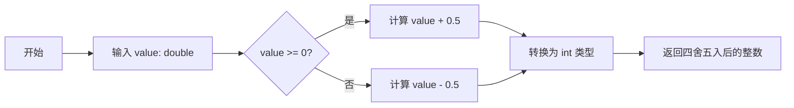
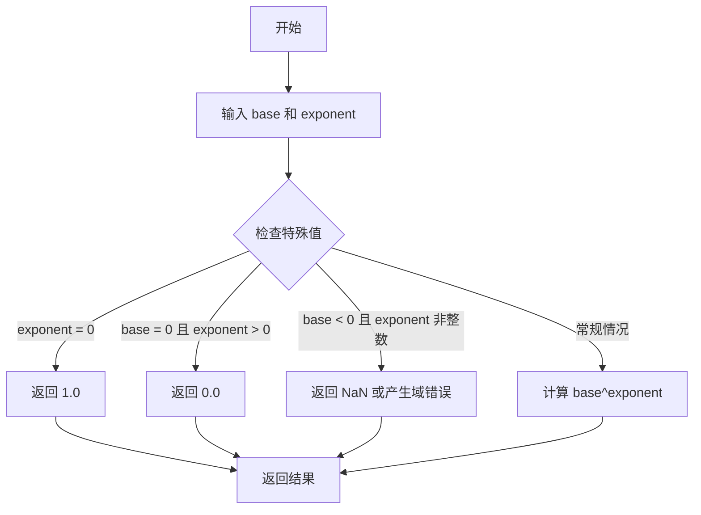
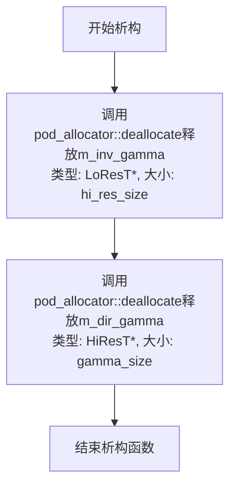
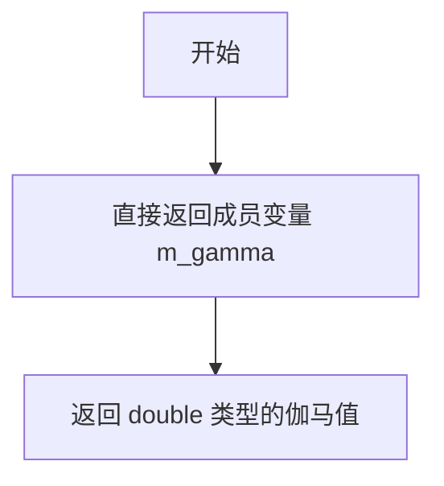
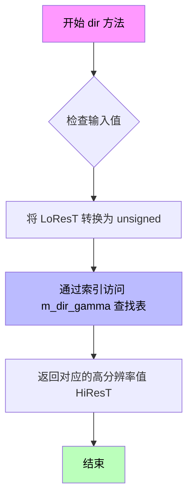
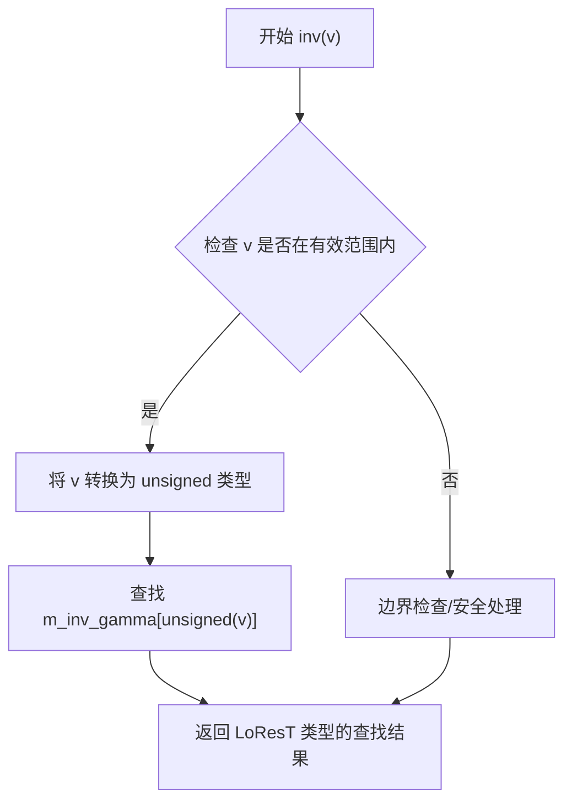
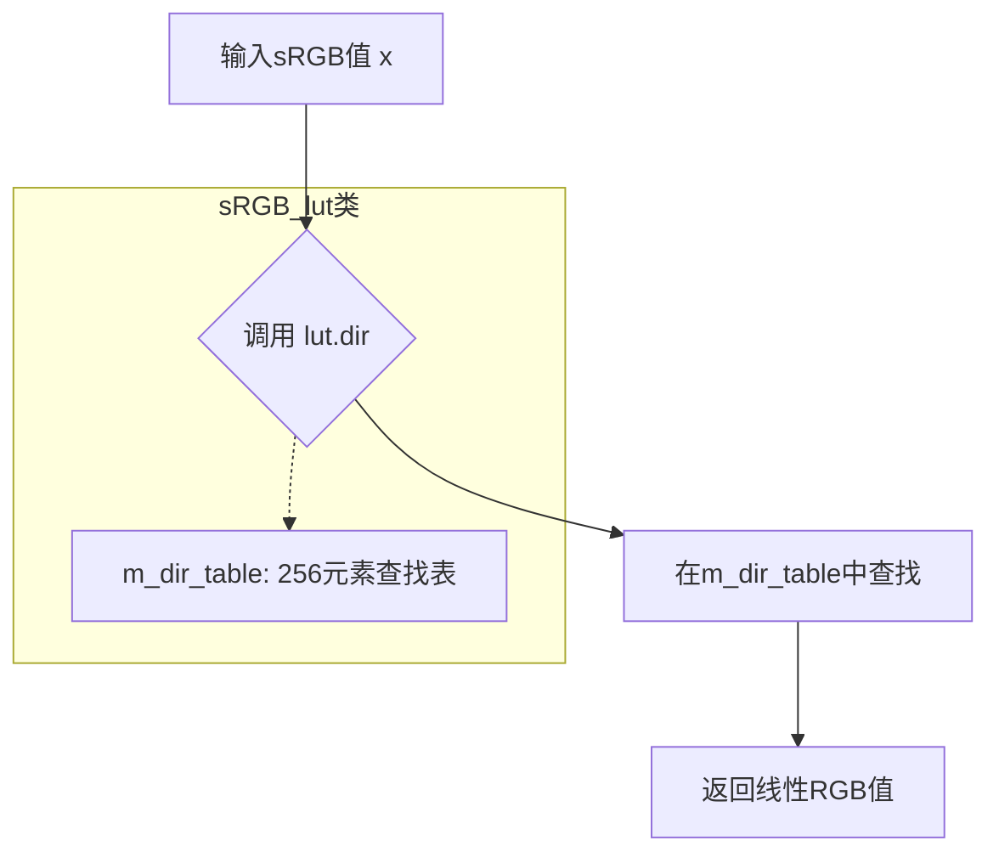

```mermaid
flowchart TD
    A[开始: 输入sRGB值 x] --> B{检查 x <= 0.04045?}
    B -->|是| C[返回 x / 12.92]
    B -->|否| D[计算 pow&#40;x + 0.055&#41; / 1.055&#41; 的 gamma 2.4 次方]
    D --> E[返回计算结果]
    C --> F[结束: 返回线性值]
    E --> F
```

# `matplotlib\extern\agg24-svn\include\agg_gamma_lut.h` 详细设计文档

该文件实现了Anti-Grain Geometry库中的伽马校正查找表和sRGB色彩空间转换功能。通过模板类gamma_lut提供可配置的伽马值查找表，支持正向(低分辨率到高分辨率)和反向(高分辨率到低分辨率)转换；同时提供sRGB_lut和sRGB_conv系列类，实现sRGB与线性色彩空间的快速转换，支持float、int16u、int8u等多种数据类型。

## 整体流程

```mermaid
graph TD
    A[开始] --> B[创建gamma_lut对象或sRGB_lut对象]
    B --> C{对象类型?}
    C -->|gamma_lut| D[分配m_dir_gamma和m_inv_gamma内存]
    D --> E[初始化查找表数组]
    E --> F[调用gamma(double g)设置伽马值]
    F --> G[计算正向查找表: pow(i/gamma_mask, gamma) * hi_res_mask]
    G --> H[计算反向查找表: pow(i/hi_res_mask, 1/gamma) * gamma_mask]
    C -->|sRGB_lut| I[初始化m_dir_table和m_inv_table]
    I --> J[调用sRGB_to_linear生成正向表]
    J --> K[调用sRGB_to_linear生成反向表(用二分查找优化)]
    K --> L[用户调用dir()或inv()进行颜色转换]
    L --> M[返回转换后的颜色值]
    M --> N[结束]
```

## 类结构

```
gamma_lut<LoResT, HiResT, GammaShift, HiResShift> (模板类)
sRGB_lut_base<LinearType> (抽象基类)
├── sRGB_lut<float> (特化)
├── sRGB_lut<int16u> (特化)
└── sRGB_lut<int8u> (特化)
sRGB_conv_base<T> (静态工具基类)
└── sRGB_conv<T> (特化)
    ├── sRGB_conv<float>
    ├── sRGB_conv<int16u>
    └── sRGB_conv<int8u>
```

## 全局变量及字段


### `gamma_shift`
    
伽马查找表移位值，决定表大小

类型：`unsigned (枚举常量)`
    


### `gamma_size`
    
伽马查找表大小，等于1左移gamma_shift位

类型：`unsigned (枚举常量)`
    


### `gamma_mask`
    
伽马查找表掩码，用于索引计算

类型：`unsigned (枚举常量)`
    


### `hi_res_shift`
    
高分辨率移位值，决定高精度表大小

类型：`unsigned (枚举常量)`
    


### `hi_res_size`
    
高分辨率查找表大小，等于1左移hi_res_shift位

类型：`unsigned (枚举常量)`
    


### `hi_res_mask`
    
高分辨率查找表掩码，用于索引计算

类型：`unsigned (枚举常量)`
    


### `m_gamma`
    
伽马值

类型：`double`
    


### `m_dir_gamma`
    
正向伽马查找表指针

类型：`HiResT*`
    


### `m_inv_gamma`
    
反向伽马查找表指针

类型：`LoResT*`
    


### `m_dir_table[256]`
    
sRGB到线性正向查找表

类型：`LinearType`
    


### `m_inv_table[256]`
    
线性到sRGB反向查找表

类型：`LinearType`
    


### `lut`
    
静态查找表实例，用于sRGB颜色空间转换

类型：`static sRGB_lut<T>`
    


### `gamma_lut.gamma_shift`
    
伽马查找表移位值，决定表大小

类型：`unsigned (枚举常量)`
    


### `gamma_lut.gamma_size`
    
伽马查找表大小，等于1左移gamma_shift位

类型：`unsigned (枚举常量)`
    


### `gamma_lut.gamma_mask`
    
伽马查找表掩码，用于索引计算

类型：`unsigned (枚举常量)`
    


### `gamma_lut.hi_res_shift`
    
高分辨率移位值，决定高精度表大小

类型：`unsigned (枚举常量)`
    


### `gamma_lut.hi_res_size`
    
高分辨率查找表大小，等于1左移hi_res_shift位

类型：`unsigned (枚举常量)`
    


### `gamma_lut.hi_res_mask`
    
高分辨率查找表掩码，用于索引计算

类型：`unsigned (枚举常量)`
    


### `gamma_lut.m_gamma`
    
伽马值

类型：`double`
    


### `gamma_lut.m_dir_gamma`
    
正向伽马查找表指针

类型：`HiResT*`
    


### `gamma_lut.m_inv_gamma`
    
反向伽马查找表指针

类型：`LoResT*`
    


### `sRGB_lut_base.m_dir_table[256]`
    
sRGB到线性正向查找表

类型：`LinearType`
    


### `sRGB_lut_base.m_inv_table[256]`
    
线性到sRGB反向查找表

类型：`LinearType`
    


### `sRGB_conv_base.lut`
    
静态查找表实例，用于sRGB颜色空间转换

类型：`static sRGB_lut<T>`
    
    

## 全局函数及方法


### `sRGB_to_linear`

将sRGB色彩空间的8位值转换为线性色彩空间的值。该函数根据sRGB标准规范，使用分段函数处理低于0.04045的值（使用线性公式）和高于该阈值的值（使用幂函数公式），实现精确的色彩空间转换。

参数：
- `x`：`double`，表示sRGB色彩空间的输入值，范围在[0, 1]之间

返回值：`double`，返回线性色彩空间的输出值，范围在[0, 1]之间

#### 流程图



#### 带注释源码

```cpp
// sRGB 转线性色彩的转换公式（根据 IEC 61966-2-1 标准）
// 当输入值小于等于 0.04045 时，使用线性公式
// 当输入值大于 0.04045 时，使用 gamma 2.4 的幂函数公式
//
// 参数 x: double 类型，sRGB 色彩空间的输入值，范围 [0, 1]
// 返回值: double 类型，线性色彩空间的输出值，范围 [0, 1]
double sRGB_to_linear(double x)
{
    if (x <= 0.04045) 
    {
        // 对于低值使用线性转换
        return x / 12.92;
    }
    else 
    {
        // 对于高值使用 gamma 2.4 的幂函数转换
        return pow((x + 0.055) / 1.055, 2.4);
    }
}
```

**注意**：由于该函数在 `agg_gamma_functions.h` 中声明但未在当前代码文件中定义，上述源码是基于 sRGB 标准（IEC 61966-2-1）推断的标准实现。该函数在代码中被 `sRGB_lut` 类的模板特化版本广泛用于生成查找表（Lookup Table），以优化实时渲染中的色彩转换性能。


### `linear_to_sRGB`

该函数执行线性RGB到sRGB颜色空间的转换。根据代码中的调用上下文，它接受一个线性颜色值（范围0.0-1.0的double类型），返回对应的sRGB值。这是sRGB颜色空间转换的逆过程，用于将线性颜色空间的值转换为适用于显示的伽马校正后的sRGB值。

参数：

- `x`：`double`，线性空间的颜色值，范围通常在0.0到1.0之间

返回值：`double`，sRGB空间的颜色值，范围在0.0到1.0之间

#### 流程图

```mermaid
flowchart TD
    A[开始: 输入线性值 x] --> B{判断 x <= 0.0031308?}
    B -- 是 --> C[返回 x * 12.92]
    B -- 否 --> D[计算 1.055 * pow(x, 1/2.4) - 0.055]
    C --> E[返回结果]
    D --> E
    E[结束: 返回sRGB值]
```

#### 带注释源码

```
// 该函数在 agg_gamma_functions.h 中声明，此处为推断的实现
// 基于代码中的调用方式：linear_to_sRGB(i / 255.0)
// 函数将线性颜色空间值转换为sRGB颜色空间值
// 
// 参数:
//   x: double类型的线性空间值，范围0.0-1.0
// 返回值:
//   double类型的sRGB空间值，范围0.0-1.0
//
// 转换公式（基于sRGB标准）：
// 如果 x <= 0.0031308: result = x * 12.92
// 否则: result = 1.055 * pow(x, 1/2.4) - 0.055
//
// 在代码中的使用示例（agg_gamma_lut.h第217行）:
// m_inv_table[i] = uround(255.0 * linear_to_sRGB(i / 255.0));
// 这里将归一化的线性值转换为sRGB后再映射到8位色深

double linear_to_sRGB(double x)
{
    if (x <= 0.0031308)
    {
        return x * 12.92;
    }
    return 1.055 * pow(x, 1.0/2.4) - 0.055;
}
```

#### 备注

由于 `linear_to_sRGB` 函数的实际源码不在给定的 `agg_gamma_lut.h` 文件中（而是在 `agg_gamma_functions.h` 中声明），以上源码是基于：
1. sRGB颜色空间的标准转换公式
2. 代码中对该函数的使用方式（传入 `i / 255.0` 格式的归一化值，返回值被乘以255或65535用于查表）

该函数是sRGB色彩管理的关键组成部分，与 `sRGB_to_linear` 函数互为逆操作。


### `uround`

uround 是一个辅助函数，用于将浮点数四舍五入为最接近的整数。该函数在图像处理库中广泛使用，特别是在 gamma 校正查找表和 sRGB 颜色空间转换中，负责将浮点计算结果转换为整数索引或像素值。

参数：

- `value`：`double`，要四舍五入的浮点数值

返回值：`int`，四舍五入后的整数值

#### 流程图



#### 带注释源码

```
// uround - 将浮点数四舍五入到最接近的整数
// 参数: value - 要四舍五入的 double 类型值
// 返回值: int - 四舍五入后的整数结果
// 
// 工作原理:
//   - 对于正数: value + 0.5 后向下取整
//   - 对于负数: value - 0.5 后向下取整
//   - 这实现了标准的"四舍五入"行为
//
// 使用场景:
//   - 在 gamma_lut 类中，将 pow() 计算的浮点结果转换为整数索引
//   - 在 sRGB 转换中，将归一化的颜色值 [0,1] 转换为 8位/16位像素值
//   - 例如: uround(255.0 * sRGB_to_linear(i / 255.0)) 将 [0,1] 范围的值映射到 [0,255]
//
inline int uround(double value)
{
    // 处理正负数的四舍五入
    // 正数加上 0.5 后取整，负数减去 0.5 后取整
    return value >= 0 ? int(value + 0.5) : int(value - 0.5);
}
```

**注意**：由于 `uround` 函数的实现声明在 `agg_basics.h` 头文件中（当前代码段通过 `#include "agg_basics.h"` 引用），而具体实现未在当前代码段中给出。上述源码是基于该函数在代码中的使用方式（将浮点乘积结果转换为整数）推断出的典型实现。


### `pow`

标准库数学函数，计算指定底数的指定次幂。在 `agg::gamma_lut` 类的 `gamma(double g)` 方法中用于生成伽马校正查找表。

参数：

- `base`：`double`，底数（基数）
- `exponent`：`double`，指数（幂）

返回值：`double`，返回 `base` 的 `exponent` 次幂

#### 流程图



#### 带注释源码

```cpp
// 标准库 pow 函数声明 (来自 <math.h> 或 <cmath>)
// 原型: double pow(double base, double exponent);
//       float pow(float base, float exponent);
//       long double pow(long double base, long double exponent);

// 在 agg::gamma_lut<>::gamma(double g) 中的使用示例:
//
// 第一次调用: 计算正向伽马查找表
// ----------------------------------------
// for(i = 0; i < gamma_size; i++)
// {
//     // 将索引 [0, gamma_size) 映射到 [0, 1) 范围
//     // 然后应用伽马校正: output = input^gamma
//     m_dir_gamma[i] = (HiResT)
//         uround(pow(i / double(gamma_mask), m_gamma) * double(hi_res_mask));
//     // 
//     // 参数说明:
//     //   base (i / double(gamma_mask)): 归一化的输入值，范围 [0, 1)
//     //   exponent (m_gamma): 伽马值，通常大于 1
//     // 返回: 输入值的伽马校正结果
// }
//
// 第二次调用: 计算逆向伽马查找表
// ----------------------------------------
// double inv_g = 1.0 / g;  // 计算伽马值的倒数
// for(i = 0; i < hi_res_size; i++)
// {
//     // 将索引 [0, hi_res_size) 映射到 [0, 1) 范围
//     // 然后应用反向伽马校正: output = input^(1/gamma)
//     m_inv_gamma[i] = (LoResT)
//         uround(pow(i / double(hi_res_mask), inv_g) * double(gamma_mask));
//     // 
//     // 参数说明:
//     //   base (i / double(hi_res_mask)): 归一化的输入值，范围 [0, 1)
//     //   exponent (inv_g): 伽马值的倒数，用于反向校正
//     // 返回: 输入值的反向伽马校正结果
// }

// 示例计算:
// 假设 gamma = 2.2, gamma_mask = 255, hi_res_mask = 255
// i = 128 时:
//   base = 128 / 255 ≈ 0.502
//   exponent = 2.2
//   pow(0.502, 2.2) ≈ 0.218
//   结果 * 255 ≈ 55.6 → 四舍五入为 56
```


### `gamma_lut::~gamma_lut()`

析构函数，用于释放gamma_lut类实例在构造函数中动态分配的两个查找表（正向伽马表和反向伽马表）的内存资源，确保无内存泄漏。

参数：

- 无参数

返回值：`void`，无返回值，仅执行资源清理操作

#### 流程图



#### 带注释源码

```cpp
~gamma_lut()
{
    // 释放反向伽马查找表(inverse gamma lookup table)的内存
    // 该表在构造函数中使用pod_allocator为m_inv_gamma分配
    // 参数hi_res_size表示要释放的元素个数
    pod_allocator<LoResT>::deallocate(m_inv_gamma, hi_res_size);
    
    // 释放正向伽马查找表(direct gamma lookup table)的内存
    // 该表在构造函数中使用pod_allocator为m_dir_gamma分配
    // 参数gamma_size表示要释放的元素个数
    pod_allocator<HiResT>::deallocate(m_dir_gamma, gamma_size);
}
```


### `gamma_lut.gamma_lut()`

默认构造函数，初始化单位伽马表（gamma=1.0），分配并初始化直接映射的查找表。

参数：
- （无）

返回值：（无），构造函数无返回值

#### 流程图

```mermaid
flowchart TD
    A[开始] --> B[设置 m_gamma = 1.0]
    B --> C[分配 m_dir_gamma 数组<br/>大小: gamma_size = 1 << GammaShift]
    C --> D[分配 m_inv_gamma 数组<br/>大小: hi_res_size = 1 << HiResShift]
    D --> E{循环 i = 0 到 gamma_size-1}
    E -->|是| F[m_dir_gamma[i] = i << (hi_res_shift - gamma_shift)]
    F --> E
    E -->|否| G{循环 i = 0 到 hi_res_size-1}
    G -->|是| H[m_inv_gamma[i] = i >> (hi_res_shift - gamma_shift)]
    H --> G
    G -->|否| I[结束]
    
    style A fill:#f9f,color:#000
    style I fill:#9f9,color:#000
```

#### 带注释源码

```cpp
// 默认构造函数
// 功能：初始化单位伽马表（gamma=1.0），分配直接映射查找表
// 说明：当gamma=1.0时，直接映射意味着输出值等于输入值（线性关系）
gamma_lut() : 
    // 初始化伽马值为1.0（单位伽马，线性映射）
    m_gamma(1.0), 
    // 分配直接映射表（正向转换表）内存
    // 大小为 gamma_size = 1 << GammaShift (默认256)
    m_dir_gamma(pod_allocator<HiResT>::allocate(gamma_size)),
    // 分配逆映射表（反向转换表）内存
    // 大小为 hi_res_size = 1 << HiResShift (默认256)
    m_inv_gamma(pod_allocator<LoResT>::allocate(hi_res_size))
{
    unsigned i;
    
    // 初始化直接映射表 m_dir_gamma
    // 当gamma=1.0时，直接映射：输出值 = 输入值（线性关系）
    // 公式：m_dir_gamma[i] = i << (hi_res_shift - gamma_shift)
    //       即：将低分辨率索引映射到高分辨率空间
    for(i = 0; i < gamma_size; i++)
    {
        m_dir_gamma[i] = HiResT(i << (hi_res_shift - gamma_shift));
    }

    // 初始化逆映射表 m_inv_gamma
    // 当gamma=1.0时，逆映射：输出值 = 输入值（线性关系）
    // 公式：m_inv_gamma[i] = i >> (hi_res_shift - gamma_shift)
    //       即：将高分辨率索引映射到低分辨率空间
    for(i = 0; i < hi_res_size; i++)
    {
        m_inv_gamma[i] = LoResT(i >> (hi_res_shift - gamma_shift));
    }
}
```


### `gamma_lut::gamma_lut(double g)`

这是 `gamma_lut` 类的带参数构造函数，用于创建并初始化一个伽马查找表对象，同时设置指定的伽马值。该构造函数分配正向和逆向伽马查找表的内存空间，并通过调用 `gamma(g)` 方法完成查找表的预计算。

参数：

- `g`：`double`，伽马值，用于调整图像的灰度响应曲线。值大于1使图像变亮，值小于1使图像变暗，值为1表示线性响应

返回值：无（构造函数，隐式返回对象实例）

#### 流程图

```mermaid
flowchart TD
    A[开始构造 gamma_lut 对象] --> B[初始化成员变量<br/>m_gamma = 1.0]
    B --> C[分配 m_dir_gamma 数组<br/>大小为 gamma_size]
    C --> D[分配 m_inv_gamma 数组<br/>大小为 hi_res_size]
    D --> E[调用 gamma(g) 方法]
    E --> F[设置 m_gamma = g]
    F --> G[计算正向伽马查找表<br/>m_dir_gamma[i] = pow(i/gamma_mask, g) * hi_res_mask]
    G --> H[计算逆伽马值 inv_g = 1.0/g]
    H --> I[计算逆向伽马查找表<br/>m_inv_gamma[i] = pow(i/hi_res_mask, inv_g) * gamma_mask]
    I --> J[结束构造]
```

#### 带注释源码

```cpp
//----------------------------------------------------------------------------
// 带参数构造函数
// 参数: g - double类型，伽马值，用于控制图像亮度响应
//----------------------------------------------------------------------------
gamma_lut(double g) :
    // 初始化列表：先设置默认伽马值为1.0
    m_gamma(1.0), 
    // 为正向查找表分配内存空间，大小为 gamma_size
    m_dir_gamma(pod_allocator<HiResT>::allocate(gamma_size)),
    // 为逆向查找表分配内存空间，大小为 hi_res_size
    m_inv_gamma(pod_allocator<LoResT>::allocate(hi_res_size))
{
    // 调用 gamma(g) 方法设置实际的伽马值
    // 该方法会：
    // 1. 将成员变量 m_gamma 设置为参数 g
    // 2. 根据公式预计算正向伽马查找表 m_dir_gamma
    //    公式：output = (input / gamma_mask) ^ gamma * hi_res_mask
    // 3. 计算逆伽马值 inv_gamma = 1 / gamma
    // 4. 根据公式预计算逆向伽马查找表 m_inv_gamma
    //    公式：output = (input / hi_res_mask) ^ (1/gamma) * gamma_mask
    gamma(g);
}
```


### gamma_lut.gamma(double g)

设置伽马值并重建查找表。该方法接收一个伽马校正参数，重新计算正向（直接）查找表 m_dir_gamma 和逆向（逆）查找表 m_inv_gamma，用于图像处理中的伽马校正操作。

参数：

- `g`：`double`，伽马值，用于非线性亮度校正。值为 1.0 时为线性，值大于 1.0 时增强暗部细节，值小于 1.0 时增强亮部细节。

返回值：`void`，无返回值。

#### 流程图

```mermaid
flowchart TD
    A[开始 gamma g] --> B[设置 m_gamma = g]
    B --> C[初始化循环 i = 0 到 gamma_size]
    C --> D{是否满足 i < gamma_size?}
    D -->|是| E[计算 m_dir_gamma[i] = uround<br/>pow(i / gamma_mask, m_gamma)<br/>* hi_res_mask]
    E --> F[i++]
    F --> D
    D -->|否| G[计算 inv_g = 1.0 / g]
    G --> H[初始化循环 i = 0 到 hi_res_size]
    H --> I{是否满足 i < hi_res_size?}
    I -->|是| J[计算 m_inv_gamma[i] = uround<br/>pow(i / hi_res_mask, inv_g)<br/>* gamma_mask]
    J --> K[i++]
    K --> I
    I -->|否| L[结束]
```

#### 带注释源码

```cpp
// 设置伽马值并重建查找表
// 参数 g: double 类型，表示伽马校正值
// 返回值: void
void gamma(double g) 
{
    // 步骤1: 保存传入的伽马值到成员变量
    m_gamma = g;

    // 步骤2: 重建正向查找表 (dir_gamma)
    // 将输入值 [0, gamma_mask] 映射到 [0, hi_res_mask]
    // 使用幂函数实现伽马校正: output = input^gamma
    unsigned i;
    for(i = 0; i < gamma_size; i++)
    {
        m_dir_gamma[i] = (HiResT)
            uround(pow(i / double(gamma_mask), m_gamma) * double(hi_res_mask));
    }

    // 步骤3: 计算逆伽马值 (用于反向查找)
    double inv_g = 1.0 / g;
    
    // 步骤4: 重建逆向查找表 (inv_gamma)
    // 将高分辨率值 [0, hi_res_mask] 映射回 [0, gamma_mask]
    // 使用逆伽马值进行反向校正: output = input^(1/gamma)
    for(i = 0; i < hi_res_size; i++)
    {
        m_inv_gamma[i] = (LoResT)
            uround(pow(i / double(hi_res_mask), inv_g) * double(gamma_mask));
    }
}
```


### `gamma_lut.gamma() const`

获取当前伽马值。该函数是 `gamma_lut` 类的 const 成员函数，用于返回在构造或通过 `gamma(double g)` 方法设置的伽马校正值。

参数：  
无参数

返回值：`double`，返回当前设置的伽马值（默认为 1.0）

#### 流程图



#### 带注释源码

```cpp
// 获取当前伽马值的 const 成员函数
// 参数: 无
// 返回值: double - 当前设置的伽马值
double gamma() const
{
    return m_gamma;  // 直接返回私有成员变量 m_gamma，该变量存储当前伽马校正值
}
```


### `gamma_lut.dir`

该函数是 `gamma_lut` 类中的正向转换方法，负责将低分辨率输入值通过查找表转换为高分辨率输出值。它利用预先计算好的查找表 `m_dir_gamma` 进行高效的 gamma 校正正向转换。

参数：

- `v`：`LoResT`，低分辨率输入值，待转换的低精度 gamma 值

返回值：`HiResT`，高分辨率输出值，经过 gamma 校正转换后的高精度值

#### 流程图



#### 带注释源码

```cpp
//----------------------------------------------------------------------------
// 正向转换函数：将低分辨率值转换为高分辨率值
//----------------------------------------------------------------------------
// 参数：
//   v - LoResT 类型的低分辨率输入值
// 返回值：
//   HiResT 类型的高分辨率转换结果
//----------------------------------------------------------------------------
HiResT dir(LoResT v) const 
{ 
    // 使用查找表进行快速转换
    // 1. 将输入值 v 转换为 unsigned 类型作为数组索引
    // 2. 从预计算的 m_dir_gamma 查找表中获取对应的高分辨率值
    // 
    // m_dir_gamma 表在 gamma_lut 构造函数或 gamma() 方法中初始化
    // 该表存储了 gamma 校正后的映射关系
    return m_dir_gamma[unsigned(v)]; 
}
```

---

### 补充信息

| 项目 | 描述 |
|------|------|
| **所属类** | `gamma_lut<LoResT, HiResT, GammaShift, HiResShift>` |
| **模板参数** | `LoResT` (默认 `int8u`)、`HiResT` (默认 `int8u`)、`GammaShift` (默认 8)、`HiResShift` (默认 8) |
| **访问权限** | `const` 成员函数，不修改对象状态 |
| **查找表大小** | `gamma_size = 1 << GammaShift` (默认 256) |
| **关联数据成员** | `m_dir_gamma` - 存储正向转换映射的查找表 |

### 技术说明

- **时间复杂度**：O(1)，数组索引访问
- **空间复杂度**：O(gamma_size) 的查找表存储
- **转换方向**：低分辨率 → 高分辨率 (正向 gamma 转换)
- **查找表初始化**：在构造函数中通过线性映射初始化，在 `gamma()` 方法中通过幂函数计算初始化


### `gamma_lut.inv`

该方法是 `gamma_lut` 类的反向转换函数，通过查找预计算的反向伽马查找表（`m_inv_gamma`），将高分辨率值（HiResT）转换为对应的低分辨率值（LoResT），实现高效的伽马校正逆变换。

参数：

-  `v`：`HiResT`，高分辨率类型的输入值，通常为经过伽马校正的像素值

返回值：`LoResT`，低分辨率类型的输出值，为经过逆伽马校正后的线性空间值

#### 流程图



#### 带注释源码

```cpp
// 反向转换函数：将高分辨率值转换为低分辨率值
// 参数 v: HiResT类型，期望输入的范围在[0, hi_res_mask]之间
// 返回: LoResT类型，查找表返回的逆伽马校正值
LoResT inv(HiResT v) const 
{ 
    // 通过预计算的反向查找表 m_inv_gamma 进行O(1)时间复杂度的查找
    // m_inv_gamma 在 gamma_lut 构造函数或 gamma() 方法中被初始化
    // 该查找表存储了逆伽马函数的值，用于快速将伽马校正后的值转换回线性空间
    return m_inv_gamma[unsigned(v)]; 
}
```

---

**补充说明**：

- **设计目标**：通过预计算查找表（Lookup Table, LUT）实现高效的伽马逆转换，避免在每次调用时进行昂贵的幂运算 (`pow`)
- **性能特点**：时间复杂度为 O(1)，空间复杂度为 O(hi_res_size)
- **查找表初始化**：`m_inv_gamma` 在 `gamma()` 方法中通过公式 `pow(i / double(hi_res_mask), inv_g) * double(gamma_mask)` 填充，其中 `inv_g = 1.0 / m_gamma`
- **类型转换**：使用 `unsigned(v)` 确保数组索引为非负整数
- **潜在优化空间**：可考虑添加边界检查以防止越界访问，特别是在调试模式下


### `sRGB_lut_base.dir`

该方法实现从 sRGB 颜色空间到线性颜色空间的直接转换，通过查表方式将 8 位无符号整数（sRGB 值）转换为线性空间表示值。

参数：

- `v`：`int8u`，输入的 sRGB 值（0-255 之间的无符号字节）

返回值：`LinearType`，转换后的线性空间值（类型模板参数决定，可能是 float、int16u 或 int8u）

#### 流程图

```mermaid
flowchart TD
    A[开始 dir 方法] --> B[输入参数 v: int8u]
    B --> C[直接数组查找 m_dir_table[v]]
    C --> D[返回线性空间值 LinearType]
    D --> E[结束]
    
    style A fill:#f9f,stroke:#333
    style D fill:#9f9,stroke:#333
```

#### 带注释源码

```cpp
// sRGB_lut_base 类中的 dir 方法实现
// 该类是一个模板类，用于存储 sRGB 到线性空间的转换查找表
template<class LinearType>
class sRGB_lut_base
{
public:
    // dir 方法：将 sRGB 值转换为线性空间值
    // 参数 v: int8u 类型，表示 sRGB 值（0-255）
    // 返回值: LinearType 类型，转换后的线性空间值
    // 实现原理：直接通过数组索引查找，O(1) 时间复杂度
    LinearType dir(int8u v) const
    {
        // 使用查找表 m_dir_table 直接返回对应的线性值
        // m_dir_table 在派生类的构造函数中被初始化
        // 查找操作只需要一次数组访问，非常高效
        return m_dir_table[v];
    }

protected:
    // 方向转换表（sRGB -> 线性），256 个元素
    LinearType m_dir_table[256];
    
    // 逆方向转换表（线性 -> sRGB），256 个元素
    // 用于 inv 方法中的二分查找
    LinearType m_inv_table[256];
};
```

#### 补充说明

| 项目 | 说明 |
|------|------|
| **所属类** | `sRGB_lut_base<LinearType>` |
| **方法类型** | 常量成员函数（const） |
| **时间复杂度** | O(1) - 简单的数组索引访问 |
| **空间复杂度** | O(1) - 无额外空间分配 |
| **设计目的** | 提供快速的无 gamma 校正的 sRGB 到线性空间转换 |
| **查找表初始化** | 在派生类 `sRGB_lut` 的构造函数中完成，根据 `LinearType` 类型（float/int16u/int8u）采用不同的缩放策略 |
| **使用场景** | 图形渲染中的颜色空间转换，特别是需要批量处理像素颜色值时 |


### `sRGB_lut_base.inv`

该函数实现线性到sRGB颜色的逆转换（未展开的二分查找），通过在预计算的查找表中进行高效的二分搜索，将线性颜色值映射为8位无符号整数sRGB值。

参数：

- `v`：`LinearType`，线性颜色输入值（模板类型，可以是float、int16u或int8u）

返回值：`int8u`，对应的sRGB颜色值（0-255）

#### 流程图

```mermaid
flowchart TD
    A[开始: 输入线性值 v] --> B[初始化 x = 0]
    B --> C{v > m_inv_table[128]?}
    C -->|是| D[x = 128]
    C -->|否| E[继续]
    D --> E
    E --> F{v > m_inv_table[x + 64]?}
    F -->|是| G[x += 64]
    F -->|否| H[继续]
    G --> H
    H --> I{v > m_inv_table[x + 32]?}
    I -->|是| J[x += 32]
    I -->|否| K[继续]
    J --> K
    K --> L{v > m_inv_table[x + 16]?}
    L -->|是| M[x += 16]
    L -->|否| N[继续]
    M --> N
    N --> O{v > m_inv_table[x + 8]?}
    O -->|是| P[x += 8]
    O -->|否| Q[继续]
    P --> Q
    Q --> R{v > m_inv_table[x + 4]?}
    R -->|是| S[x += 4]
    R -->|否| T[继续]
    S --> T
    T --> U{v > m_inv_table[x + 2]?}
    U -->|是| V[x += 2]
    U -->|否| W[继续]
    V --> W
    W --> X{v > m_inv_table[x + 1]?}
    X -->|是| Y[x += 1]
    X -->|否| Z[继续]
    Y --> Z
    Z --> AA[返回 x]
```

#### 带注释源码

```cpp
// 线性到sRGB的逆转换函数（未展开的二分查找）
// 使用展开的二分搜索在查找表中快速定位对应的sRGB值
int8u inv(LinearType v) const
{
    // 展开的二分查找算法
    // 从中间值128开始，逐步缩小搜索范围
    int8u x = 0;
    
    // 第一步：检查是否在[128, 255]区间
    if (v > m_inv_table[128]) x = 128;
    
    // 第二步：在[128, 192]或[0, 128]区间内继续搜索
    if (v > m_inv_table[x + 64]) x += 64;
    
    // 第三步：继续二分，范围缩小到原范围的1/4
    if (v > m_inv_table[x + 32]) x += 32;
    
    // 第四步：范围缩小到1/8
    if (v > m_inv_table[x + 16]) x += 16;
    
    // 第五步：范围缩小到1/16
    if (v > m_inv_table[x + 8]) x += 8;
    
    // 第六步：范围缩小到1/32
    if (v > m_inv_table[x + 4]) x += 4;
    
    // 第七步：范围缩小到1/64
    if (v > m_inv_table[x + 2]) x += 2;
    
    // 第八步：最后检查最后两个候选值，确定最终sRGB值
    if (v > m_inv_table[x + 1]) x += 1;
    
    // 返回找到的sRGB索引值（0-255）
    return x;
}
```


### `sRGB_lut<float>.sRGB_lut()`

该构造函数用于初始化float类型的sRGB查找表，生成正向（sRGB到线性）和逆向（线性到sRGB）的转换查找表，用于图像处理中的颜色空间转换。

参数：

- （无参数）

返回值：`void`，构造函数无返回值

#### 流程图

```mermaid
flowchart TD
    A[开始 sRGB_lut 构造函数] --> B[初始化 m_dir_table[0] = 0]
    B --> C[初始化 m_inv_table[0] = 0]
    C --> D{i = 1 to 255}
    D --> E[计算 m_dir_table[i]<br/>sRGB到线性转换]
    E --> F[计算 m_inv_table[i]<br/>使用-0.5偏移改善精度]
    F --> D
    D --> G[结束循环]
    G --> H[查找表初始化完成]
```

#### 带注释源码

```cpp
template<>
class sRGB_lut<float> : public sRGB_lut_base<float>
{
public:
    // 构造函数：初始化float类型的sRGB查找表
    sRGB_lut()
    {
        // 生成查找表
        // m_dir_table: sRGB -> 线性空间转换表
        // m_inv_table: 线性空间 -> sRGB转换表（使用-0.5偏移优化精度）
        
        // 初始化索引0的值
        m_dir_table[0] = 0;
        m_inv_table[0] = 0;
        
        // 填充1-255的查找表
        for (unsigned i = 1; i <= 255; ++i)
        {
            // 浮点RGB范围是[0,1]
            // 正向转换：sRGB值转换为线性空间值
            m_dir_table[i] = float(sRGB_to_linear(i / 255.0));
            
            // 逆向转换：线性空间值转换为sRGB值
            // 使用(i - 0.5)/255.0偏移来改善精度
            m_inv_table[i] = float(sRGB_to_linear((i - 0.5) / 255.0));
        }
    }
};
```


### `sRGB_lut<int16u>::sRGB_lut()`

这是一个针对16位无符号整数（`int16u`）的sRGB查找表构造函数，通过初始化两个查找表（`m_dir_table`和`m_inv_table`）将sRGB色彩空间与线性色彩空间进行双向转换，其中`m_dir_table`用于sRGB到线性转换，`m_inv_table`用于线性到sRGB的反向转换。

参数：无参数（默认构造函数）

返回值：无返回值（构造函数）

#### 流程图

```mermaid
flowchart TD
    A[开始: 构造函数 sRGB_lut<int16u>] --> B[m_dir_table[0] = 0]
    B --> C[m_inv_table[0] = 0]
    C --> D{i = 1 to 255}
    D -->|Yes| E[计算: value = sRGB_to_linear(i / 255.0)]
    E --> F[m_dir_table[i] = uround&#40;65535.0 * value&#41;]
    F --> G[计算: value = sRGB_to_linear&#40;&#40;i - 0.5&#41; / 255.0&#41;]
    G --> H[m_inv_table[i] = uround&#40;65535.0 * value&#41;]
    H --> I[i++]
    I --> D
    D -->|No| J[结束: 查找表初始化完成]
```

#### 带注释源码

```cpp
// 针对 int16u (16位无符号整数) 的 sRGB_lut 特化版本
template<>
class sRGB_lut<int16u> : public sRGB_lut_base<int16u>
{
public:
    // 构造函数：初始化 sRGB 到线性空间的查找表
    sRGB_lut()
    {
        // ------------------- 初始化查找表 -------------------
        
        // 第一个元素设为 0（sRGB 值 0 对应线性值 0）
        m_dir_table[0] = 0;      // sRGB->Linear 查找表
        m_inv_table[0] = 0;      // Linear->sRGB 查找表
        
        // 遍历 1-255 的所有可能 sRGB 值
        for (unsigned i = 1; i <= 255; ++i)
        {
            // ------------------- 正向转换表 (sRGB -> Linear) -------------------
            // 16位RGB范围是 [0, 65535]
            // 将 sRGB 值 (i/255.0) 转换为线性值，然后映射到 16 位范围
            // sRGB_to_linear() 执行标准的 sRGB gamma 校正逆变换
            m_dir_table[i] = uround(65535.0 * sRGB_to_linear(i / 255.0));
            
            // ------------------- 反向转换表 (Linear -> sRGB) -------------------
            // 使用 (i - 0.5) / 255.0 进行中点采样，以减少量化误差
            // 将线性值映射回 16 位范围
            m_inv_table[i] = uround(65535.0 * sRGB_to_linear((i - 0.5) / 255.0));
        }
    }
};
```


### `sRGB_lut<int8u>::sRGB_lut()`

该函数是 `sRGB_lut` 模板类针对 8 位无符号整数（`int8u`）的构造函数，用于在初始化时生成 sRGB 到线性颜色空间和线性到 sRGB 的双向查找表。由于是 8 位精度，逆转换可以直接使用查找表而无需二分搜索。

参数：
- 无

返回值：
- 无（构造函数）

#### 流程图

```mermaid
flowchart TD
    A[开始构造函数] --> B[设置 m_dir_table[0] = 0]
    B --> C[设置 m_inv_table[0] = 0]
    C --> D{循环 i = 1 到 255}
    D -->|是| E[计算 sRGB_to_linear(i / 255.0)]
    E --> F[计算 uround(255.0 * 结果)]
    F --> G[存入 m_dir_table[i]]
    G --> H[计算 linear_to_sRGB(i / 255.0)]
    H --> I[计算 uround(255.0 * 结果)]
    I --> J[存入 m_inv_table[i]]
    J --> D
    D -->|否| K[结束循环]
    K --> L[构造函数完成]
```

#### 带注释源码

```cpp
// 8位无符号整数的sRGB查找表特化版本
template<>
class sRGB_lut<int8u> : public sRGB_lut_base<int8u>
{
public:
    // 构造函数：初始化sRGB到线性空间的查找表
    sRGB_lut()
    {
        // 生成查找表（方向表：sRGB -> 线性）
        // 索引0直接设置为0
        m_dir_table[0] = 0;
        
        // 生成逆查找表（线性 -> sRGB）
        // 索引0直接设置为0
        m_inv_table[0] = 0;
        
        // 遍历1-255，填充完整的256元素查找表
        for (unsigned i = 1; i <= 255; ++i)
        {
            // 8位RGB使用简单的双向查找表
            // 转换公式：sRGB值 / 255.0 归一化到[0,1]，然后转换为线性值，再乘以255并四舍五入
            
            // 填充方向查找表（sRGB -> 线性）
            m_dir_table[i] = uround(255.0 * sRGB_to_linear(i / 255.0));
            
            // 填充逆查找表（线性 -> sRGB）
            // 对于int8u类型，这是简单的直接查找，无需二分搜索
            m_inv_table[i] = uround(255.0 * linear_to_sRGB(i / 255.0));
        }
    }

    // 逆转换函数：线性值转sRGB值（针对8位的特化实现）
    // 使用简单的数组查找，比基类的二分搜索更高效
    int8u inv(int8u v) const
    {
        // 直接从预计算的逆查找表中返回对应值
        return m_inv_table[v];
    }
};
```


### `sRGB_lut<int8u>::inv`

该函数是`sRGB_lut<int8u>`类的成员方法，提供了一个简单的直接查找表方式将线性色彩空间的8位值逆向转换为sRGB色彩空间。与其他类型（如float、int16u）使用二分查找不同，int8u特化版本由于表较小且值域有限，可以直接通过数组索引完成转换，具有最高的性能。

参数：

- `v`：`int8u`，要转换的线性色彩空间的8位无符号整数值

返回值：`int8u`，对应的sRGB色彩空间的8位无符号整数值

#### 流程图

```mermaid
flowchart TD
    A[开始 inv 函数] --> B[接收输入参数 v]
    B --> C[直接查找 m_inv_table 数组]
    C --> D{索引 v 是否在有效范围 [0, 255] 内}
    D -->|是| E[返回 m_inv_table[v]]
    D -->|否| F[返回越界值或未定义行为]
    E --> G[结束]
```

#### 带注释源码

```cpp
// sRGB_lut 类的 int8u 特化版本中的 inv 方法
// 该方法重写了基类 sRGB_lut_base<int8u> 中的通用实现
// 对于 8 位类型，逆向转换可以直接通过查找表完成，无需二分查找

int8u inv(int8u v) const
{
    // 在这个案例中，逆向转换是一个简单的查找操作。
    // m_inv_table 在构造函数中已经初始化，
    // 其中存储了线性到 sRGB 的预计算映射值
    return m_inv_table[v];
}
```


### `sRGB_conv_base.rgb_from_sRGB`

该方法为静态模板方法，负责将8位无符号整数形式的sRGB值通过查找表转换为线性色彩空间的值。这是sRGB色彩转换流程的核心组件，利用预计算的查找表（Lookup Table, LUT）实现高效的色彩空间转换。

参数：

-  `x`：`int8u`，输入的sRGB值，范围0-255，表示sRGB色彩空间中的一个颜色分量

返回值：`T`，转换后的线性RGB值，类型由模板参数T决定（可为float、int16u或int8u），表示线性色彩空间中对应的颜色分量

#### 流程图



#### 带注释源码

```cpp
// sRGB_conv_base类的静态方法实现
// 该类作为sRGB颜色转换的基类，封装了查找表对象
template<class T>
class sRGB_conv_base
{
public:
    // 将sRGB值转换为线性RGB值
    // 参数x: sRGB色彩空间的颜色分量，范围0-255
    // 返回值: 线性色彩空间对应的颜色分量，类型T由模板参数指定
    static T rgb_from_sRGB(int8u x)
    {
        // 调用内部静态查找表对象的dir方法进行转换
        // sRGB_lut<T>::dir方法执行直接的表查找
        return lut.dir(x);
    }

    // 将线性RGB值转换回sRGB值
    static int8u rgb_to_sRGB(T x)
    {
        // 使用逆查找表进行转换
        return lut.inv(x);
    }

private:
    // 静态查找表对象，为所有sRGB_conv_base<T>实例共享
    // sRGB_lut<T>根据T的类型(float/int16u/int8u)实例化不同的特化版本
    static sRGB_lut<T> lut;
};

// 静态成员定义
// 这是模板类静态成员的定义方式，在头文件中完成
template<class T>
sRGB_lut<T> sRGB_conv_base<T>::lut;
```

#### 详细说明

**查找表结构**：
`sRGB_lut`类维护两个256元素的数组：
- `m_dir_table`：sRGB到线性空间的正向转换表
- `m_inv_table`：线性到sRGB空间的逆向转换表

**转换原理**：
该方法使用空间换时间的策略，通过预计算256个sRGB值对应的线性值并存储在数组中，使得运行时只需进行数组索引操作即可完成转换，避免了复杂的幂运算（`pow`函数），显著提升性能。

**模板特化支持**：
`rgb_from_sRGB`的返回值类型T由`sRGB_conv`的特化版本决定：
- `float`：返回[0,1]范围的浮点线性值
- `int16u`：返回[0,65535]范围的16位整数线性值
- `int8u`：返回[0,255]范围的8位整数线性值


### `sRGB_conv_base.rgb_to_sRGB`

该静态方法用于将线性RGB值转换为其对应的sRGB值，通过查询预计算的查找表（lookup table）实现高效的色彩空间转换。

参数：

- `x`：`T`，线性RGB值，输入类型为模板参数T（如float、int16u或int8u），表示线性色彩空间中的颜色值

返回值：`int8u`，返回转换后的sRGB值，范围为0-255的8位无符号整数

#### 流程图

```mermaid
flowchart TD
    A[开始: 输入线性RGB值 x] --> B{调用 lut.inv(x)}
    B --> C[在sRGB查找表中执行逆转换]
    C --> D[返回sRGB值]
    D --> E[结束]
    
    subgraph sRGB_lut<T>
    B
    C
    end
```

#### 带注释源码

```cpp
// sRGB_conv_base.rgb_to_sRGB 的实现
// 位于 agg 命名空间的 sRGB_conv_base 模板类中

template<class T>
class sRGB_conv_base
{
public:
    // 将线性RGB值转换为sRGB值的静态方法
    // 参数 x: T类型的线性RGB值
    // 返回: int8u类型的sRGB值 (0-255)
    static int8u rgb_to_sRGB(T x)
    {
        // 调用静态成员lut的inv方法进行逆转换
        // lut 是 sRGB_lut<T> 类型的静态查找表对象
        // 该查找表在类外通过 sRGB_lut<T> sRGB_conv_base<T>::lut; 定义
        return lut.inv(x);
    }

private:
    // 静态成员：sRGB查找表
    // 在类外实例化，用于存储预计算的sRGB转换值
    static sRGB_lut<T> lut;
};

// 静态成员的类外定义
// 为每个模板实例创建独立的lut对象
template<class T>
sRGB_lut<T> sRGB_conv_base<T>::lut;
```


### `sRGB_conv<float>.alpha_from_sRGB`

将 sRGB Alpha 值（0-255 的 8 位无符号整数）转换为线性空间的 Alpha 值（0.0-1.0 的浮点数）。该函数是 sRGB 颜色空间转换的一部分，用于在 sRGB 和线性颜色空间之间进行 Alpha 通道的转换。

参数：

-  `x`：`int8u`，从 sRGB 颜色空间获取的 Alpha 值，范围为 0-255

返回值：`float`，线性空间下的 Alpha 值，范围为 0.0-1.0

#### 流程图

```mermaid
flowchart TD
    A[开始] --> B[输入 x: int8u (0-255)]
    B --> C[计算 x / 255.0]
    C --> D[转换为 float 类型]
    D --> E[返回 float 结果]
    E --> F[结束]
    
    style A fill:#f9f,color:#000
    style F fill:#f9f,color:#000
    style E fill:#9f9,color:#000
```

#### 带注释源码

```cpp
// sRGB_conv<float> 类的静态方法
// 功能：将 sRGB 空间的 Alpha 值转换为线性空间的 Alpha 值
// 参数：x - sRGB 空间的 Alpha 值（int8u 类型，范围 0-255）
// 返回值：线性空间的 Alpha 值（float 类型，范围 0.0-1.0）
static float alpha_from_sRGB(int8u x)
{
    // 将 0-255 范围的整数除以 255.0，转换为 0.0-1.0 范围的浮点数
    // 这里没有应用完整的 sRGB 到线性 gamma 转换曲线
    // 因为 Alpha 通道通常被视为线性值（不像颜色值需要 gamma 校正）
    return float(x / 255.0);
}
```


### `sRGB_conv<float>.alpha_to_sRGB`

将线性空间的 alpha 值（float 类型，范围 0~1）转换为 sRGB 空间的 alpha 值（int8u 类型，范围 0~255）。

参数：

- `x`：`float`，线性空间的 alpha 值，范围 [0, 1]

返回值：`int8u`，sRGB 空间的 alpha 值，范围 [0, 255]

#### 流程图

```mermaid
flowchart TD
    A[开始] --> B{输入 x}
    B --> C{x <= 0?}
    C -->|是| D[返回 0]
    C -->|否| E{x >= 1?}
    E -->|是| F[返回 255]
    E -->|否| G[计算 int8u&#40;0.5 + x \* 255&#41;]
    G --> H[返回结果]
    D --> I[结束]
    F --> I
    H --> I
```

#### 带注释源码

```cpp
// sRGB_conv<float> 类的静态成员函数
// 功能：将线性空间的 float 类型 alpha 值转换为 sRGB 空间的 int8u 类型值
// 参数：x - 线性空间的 alpha 值，范围 [0, 1]
// 返回值：sRGB 空间的 alpha 值，范围 [0, 255]
static int8u alpha_to_sRGB(float x)
{
    // 如果值小于等于0，返回最小值0
    if (x <= 0) return 0;
    // 如果值大于等于1，返回最大值255
    else if (x >= 1) return 255;
    // 否则进行线性插值转换，并四舍五入
    // 公式：0.5 + x * 255 实现四舍五入
    else return int8u(0.5 + x * 255);
}
```


### `sRGB_conv<int16u>.alpha_from_sRGB`

将8位sRGB格式的Alpha值（0-255）转换为16位线性Alpha值（0-65535），通过将输入字节左移8位后再与原字节进行按位或操作，实现快速的字节复制式扩展。

参数：

- `x`：`int8u`，输入的8位无符号整数，表示sRGB空间的Alpha值（0-255）

返回值：`int16u`，返回16位无符号整数，表示线性空间的Alpha值（0-65535）

#### 流程图

```mermaid
flowchart TD
    A[开始: 输入x int8u] --> B{检查x是否有效}
    B -->|是| C[计算 x << 8]
    C --> D[计算 (x << 8) | x]
    D --> E[返回结果 int16u]
    B -->|否| F[返回0]
    
    style A fill:#e1f5fe
    style E fill:#c8e6c9
    style F fill:#ffcdd2
```

#### 带注释源码

```
// sRGB_conv<int16u> 类模板的静态成员函数
// 功能：将sRGB空间的8位Alpha值转换为线性空间的16位Alpha值
// 实现原理：使用字节复制方式快速扩展位宽
// 例如：输入0xAB (171) -> 输出0xABAB (43707)
static int16u alpha_from_sRGB(int8u x)
{
    // 算法说明：
    // 1. x << 8：将8位值左移8位，得到0xAB00
    // 2. (x << 8) | x：将移位后的值与原值进行按位或，得到0xABAB
    // 
    // 这种实现是一种近似的线性转换，假设sRGB gamma曲线对Alpha通道的影响可以忽略
    // 优点：计算速度快，无需查表或浮点运算
    // 精度：对于8位输入，输出精度约为8位（高位复制了低位）
    
    return (x << 8) | x;
}
```


### `sRGB_conv<int16u>.alpha_to_sRGB`

将16位Alpha值转换为8位sRGB格式的Alpha值（0-65535 → 0-255）。

参数：
- `x`：`int16u`，输入的16位Alpha值，范围0-65535

返回值：`int8u`，转换后的8位sRGB Alpha值，范围0-255

#### 流程图

```mermaid
flowchart TD
    A[开始] --> B[输入 int16u x]
    B --> C{x >> 8}
    C --> D[返回 int8u]
    D --> E[结束]
    
    style A fill:#f9f,color:#000
    style E fill:#f9f,color:#000
```

#### 带注释源码

```cpp
// sRGB_conv<int16u> 模板特化类的静态方法
// 将16位Alpha值转换为8位sRGB格式
static int8u alpha_to_sRGB(int16u x)
{
    // 通过右移8位将16位值（0-65535）转换为8位值（0-255）
    // 相当于 x / 256，但使用位运算更高效
    return x >> 8;
}
```


### `sRGB_conv<int8u>.alpha_from_sRGB`

该函数是`sRGB_conv`类针对8位无符号整数的模板特化实现，用于将sRGB颜色空间的Alpha值转换为线性颜色空间的Alpha值。由于8位Alpha值在sRGB和线性空间中使用相同的0-255范围，因此该转换是一个直接透传操作。

参数：

- `x`：`int8u`，输入的sRGB颜色空间的Alpha值（8位无符号整数，范围0-255）

返回值：`int8u`，线性颜色空间的Alpha值（8位无符号整数，范围0-255）

#### 流程图

```mermaid
flowchart TD
    A[开始] --> B[输入参数 x: int8u]
    B --> C{参数类型为 int8u?}
    C -->|是| D[直接返回 x]
    D --> E[返回结果: int8u]
    E --> F[结束]
    
    style D fill:#90EE90,stroke:#333,stroke-width:2px
```

#### 带注释源码

```cpp
// sRGB_conv<int8u> 的模板特化
// 针对8位无符号整数的Alpha转换
template<>
class sRGB_conv<int8u> : public sRGB_conv_base<int8u>
{
public:
    // 从sRGB转换Alpha值（8位）
    // 对于8位Alpha，sRGB和线性空间的表示范围相同（0-255），
    // 因此这是一个恒等映射，无需任何转换
    static int8u alpha_from_sRGB(int8u x)
    {
        return x;  // 直接返回输入值，因为sRGB和线性Alpha在8位下等价
    }

    // 线性转sRGB的Alpha值（8位）
    // 同样使用恒等映射
    static int8u alpha_to_sRGB(int8u x)
    {
        return x;  // 直接返回输入值
    }
};
```


### `sRGB_conv<int8u>::alpha_to_sRGB`

将8位无符号整数的Alpha值从线性空间转换为sRGB空间。对于int8u类型，由于8位值的线性空间和sRGB空间值域范围相同（0-255），转换是恒等映射，直接返回输入值。

参数：

- `x`：`int8u`，输入的8位无符号整数Alpha值（线性空间）

返回值：`int8u`，转换后的8位无符号整数Alpha值（sRGB空间）

#### 流程图

```mermaid
flowchart TD
    A[开始] --> B[输入参数 x: int8u]
    B --> C{直接返回}
    C --> D[返回 x: int8u]
    D --> E[结束]
```

#### 带注释源码

```cpp
// sRGB_conv<int8u> 特化类的 alpha_to_sRGB 静态方法
// 用于将8位Alpha值从线性空间转换到sRGB空间
template<>
class sRGB_conv<int8u> : public sRGB_conv_base<int8u>
{
public:
    // 将8位Alpha值从sRGB空间转换到线性空间（此处为恒等转换）
    static int8u alpha_from_sRGB(int8u x)
    {
        return x;
    }

    // 将8位Alpha值从线性空间转换到sRGB空间
    // 对于int8u类型，线性空间和sRGB空间的值域都是0-255
    // 因此直接返回输入值，无需任何转换
    static int8u alpha_to_sRGB(int8u x)
    {
        return x;
    }
};
```

## 关键组件


### gamma_lut

伽马查找表模板类，通过预计算的查找表实现高效的伽马值转换，支持自定义低分辨率和高分辨率数据类型及移位参数。

### sRGB_lut_base

sRGB颜色空间转换的基类，提供正向查找表(m_dir_table)和逆向查找表(m_inv_table)，使用展开的二分搜索实现高效的逆转换。

### sRGB_lut<float>

sRGB转换的float类型特化版本，将8位输入转换为0-1范围的浮点数RGB值。

### sRGB_lut<int16u>

sRGB转换的16位无符号整数特化版本，将8位输入转换为0-65535范围的线性RGB值。

### sRGB_lut<int8u>

sRGB转换的8位无符号整数特化版本，使用简单的双向查找表进行转换，逆转换直接查表无需二分搜索。

### sRGB_conv_base

sRGB转换的公共基类模板，内部包含静态sRGB_lut实例，提供RGB值与sRGB之间的静态转换方法。

### sRGB_conv<float>

sRGB转换的float类型特化，处理alpha通道的sRGB与线性空间转换。

### sRGB_conv<int16u>

sRGB转换的16位无符号整数特化，使用位移操作实现alpha通道的快速转换。

### sRGB_conv<int8u>

sRGB转换的8位无符号整数特化，alpha通道直接返回原值无需转换。

### 伽马参数与规模常量

gamma_shift、gamma_size、gamma_mask、hi_res_shift、hi_res_size、hi_res_mask等枚举常量，定义了伽马查找表的规模和掩码参数。


## 问题及建议


### 已知问题

- **内存管理风险**：gamma_lut类使用原始指针和pod_allocator手动分配/释放内存，未使用智能指针，且未实现拷贝构造函数和赋值运算符（仅声明为private），存在潜在的内存泄漏或双重释放风险
- **边界检查缺失**：dir()和inv()方法直接将参数转换为unsigned后访问数组，未进行边界验证，可能导致越界访问
- **接口行为不一致**：sRGB_lut的inv()方法在不同模板特化中实现不同：float和int16u使用二进制展开搜索，而int8u直接查表，违反里氏替换原则
- **线程安全问题**：sRGB_conv_base使用静态成员lut对象，虽然查找表是只读的，但在多线程环境下静态初始化存在竞态条件风险（C++11之前）
- **计算重复执行**：gamma_lut的gamma()方法每次调用都重新计算两个查找表的全部值，没有缓存或增量更新机制
- **浮点数处理混淆**：sRGB_lut<float>的m_inv_table使用sRGB_to_linear函数填充，但注释不清晰，可能导致维护困难
- **除法性能开销**：gamma()方法循环中执行大量除法操作（i / double(gamma_mask)），可预先计算倒数减少除法
- **模板代码重复**：三个sRGB_lut特化版本中存在重复的表格初始化逻辑，可提取到基类或使用CRTP模式

### 优化建议

- 使用std::unique_ptr或std::vector替代原始指针管理内存
- 为dir()和inv()方法添加模板参数约束或运行时边界检查
- 统一sRGB_lut各特化版本的inv()接口行为，或使用_tag_invoke等进行策略化设计
- 将静态lut对象改为函数局部静态对象（C++11线程安全）或使用Meyers Singleton模式
- 考虑使用缓存机制，仅在gamma值变化显著时重新计算查找表
- 预计算除数倒数，将除法替换为乘法
- 使用模板元编程或宏减少特化版本的代码重复
- 为关键函数添加const noexcept说明符，提高编译器优化可能性

## 其它


### 设计目标与约束

本模块的设计目标是为图形渲染系统提供高效的gamma校正和sRGB颜色空间转换功能。核心约束包括：(1) 使用查找表(LUT)而非实时计算，以空间换时间，满足实时渲染的性能要求；(2) 支持可配置的分辨率参数(GammaShift和HiResShift)，允许在不同应用场景下权衡精度与内存占用；(3) 模板参数设计支持多种数据类型(int8u、int16u、float)，适应不同的颜色深度需求；(4) sRGB查找表采用未展开的二分查找实现逆转换，平衡查找效率与代码复杂度。

### 错误处理与异常设计

代码采用C++异常安全的方式设计，但错误处理相对简单：(1) 内存分配失败时，pod_allocator的行为取决于底层实现，假设 allocator 已正确配置；(2) 数值计算中的除零风险通过gamma_mask和hi_res_mask非零检查得到部分缓解（均为2^n-1形式）；(3) sRGB逆转换的二分查找未对边界进行显式检查，假设输入值在有效范围内[0, 255]；(4) 缺少显式的参数验证，如gamma()方法未检查g是否为正数，可能导致后续pow()计算产生NaN。

### 数据流与状态机

数据流遵循以下模式：(1) 初始化阶段：构造函数分配查找表内存并填充默认线性映射；(2) 配置阶段：调用gamma(double g)重新计算正向和逆向查找表；(3) 查询阶段：通过dir()方法将低分辨率输入映射到高分辨率输出，通过inv()执行反向映射。sRGB模块类似但更简单：构造函数中一次性生成两个方向的查找表，运行时仅执行表查询操作。无复杂状态机设计，对象状态仅由m_gamma值和两个查找表数组决定。

### 外部依赖与接口契约

本模块依赖以下外部组件：(1) `agg_basics.h` - 提供基本类型定义(int8u、int16u)和pod_allocator内存分配器；(2) `agg_gamma_functions.h` - 提供sRGB与线性颜色空间的转换函数(sRGB_to_linear、linear_to_sRGB)；(3) `<math.h>` - 提供pow()和标准数学函数。接口契约包括：(1) gamma_lut的模板参数LoResT和HiResT必须为整数类型，且HiResT能容纳gamma_size范围内的值；(2) GammaShift和HiResShift必须为正整数，且HiResShift >= GammaShift以保证映射正确；(3) sRGB_lut的LinearType模板参数必须支持算术运算和类型转换。

### 性能考虑与基准测试

性能优化策略包括：(1) 查找表O(1)查询复杂度 vs 实时pow()计算的显著差异；(2) sRGB逆转换采用手动展开的8次比较而非循环，消除了循环开销和分支预测惩罚；(3) sRGB_lut<int8u>的inv()针对8位情况使用直接查找而非二分搜索。潜在性能瓶颈：(1) gamma()方法中的两次完整表重建，对于实时gamma调整场景可能较重；(2) sRGB转换未使用SIMD向量化指令。内存占用：gamma_lut默认配置下约需(256+256)*1字节 = 512字节；sRGB_lut固定使用256*4*2 = 2KB。

### 使用示例与调用模式

典型使用场景包括：(1) 创建gamma校正器：`gamma_lut<> g(2.2); HiResT result = g.dir(low_input);`；(2) sRGB颜色转换：`int8u linear_val = sRGB_conv<float>::rgb_from_sRGB(srgb_byte); int8u srgb_byte = sRGB_conv<float>::rgb_to_sRGB(linear_val);`；(3) 图像处理管线中作为颜色管理组件嵌入。调用注意事项：gamma_lut对象创建开销较高（内存分配），建议复用而非频繁创建销毁；sRGB_conv为静态类无需实例化。

### 版本兼容性说明

该代码源自AGG 2.4版本，具有良好的向后兼容性：(1) 模板实现无二进制接口问题；(2) 命名空间agg保持稳定；(3) sRGB相关类为后期新增功能，对原有gamma_lut API无影响。已知限制：依赖C++模板特化机制，某些极端编译器版本可能存在兼容性问题。

### 测试策略建议

建议的测试覆盖点包括：(1) gamma_lut边界测试：输入0和最大值时的输出正确性；(2) gamma值边界测试：g=1.0应返回线性映射，g极端值(如0.1、10.0)的数值稳定性；(3) 往返转换一致性：dir(inv(x))应接近x；(4) sRGB标准合规性：验证转换结果符合IEC 61966-2-1标准；(5) 内存泄漏检测：多次创建销毁gamma_lut对象；(6) 性能回归测试：确保查询操作在规定时钟周期内完成。


    