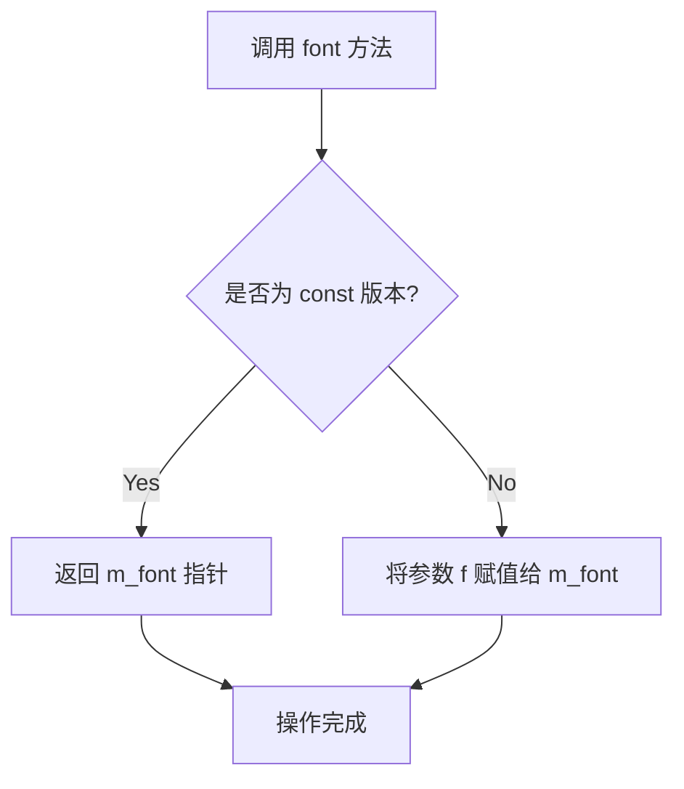
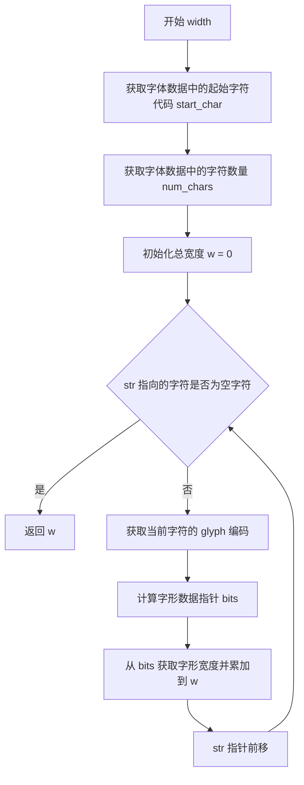

# `matplotlib\extern\agg24-svn\include\agg_glyph_raster_bin.h` 详细设计文档

这是Anti-Grain Geometry (AGG) 图形库中的一个模板类，用于将位图字体（binary glyph）光栅化为像素扫描线（span），支持大端和小端字节序的字体数据格式，主要用于2D图形渲染中的文本绘制。

## 整体流程

```mermaid
graph TD
    A[开始] --> B[创建glyph_raster_bin实例]
    B --> C{检测字节序}
    C --> D[调用height()获取字体高度]
    C --> E[调用base_line()获取基线]
    D --> F[调用width()计算字符串宽度]
    E --> G[调用prepare()准备glyph]
    G --> H[计算glyph边界框]
    H --> I[调用span()生成扫描线]
    I --> J[返回cover_type数组]
    J --> K[结束]
```

## 类结构

```
agg::glyph_raster_bin<ColorT> (模板类)
└── 内部结构: glyph_rect (嵌套结构体)
```

## 全局变量及字段


### `glyph_raster_bin<ColorT>.m_font`
    
字体数据指针，指向嵌入式字体位图数据

类型：`const int8u*`
    


### `glyph_raster_bin<ColorT>.m_big_endian`
    
标记大端字节序，用于跨平台读取字体数据

类型：`bool`
    


### `glyph_raster_bin<ColorT>.m_span`
    
扫描线缓冲区，存储单行像素的覆盖率信息

类型：`cover_type[32]`
    


### `glyph_raster_bin<ColorT>.m_bits`
    
当前glyph位数据指针，指向字形像素位图起始位置

类型：`const int8u*`
    


### `glyph_raster_bin<ColorT>.m_glyph_width`
    
glyph像素宽度，表示字形的水平像素数

类型：`unsigned`
    


### `glyph_raster_bin<ColorT>.m_glyph_byte_width`
    
glyph字节宽度，表示字形位图的行字节数

类型：`unsigned`
    


### `glyph_rect.x1`
    
左边框，矩形左边界x坐标

类型：`int`
    


### `glyph_rect.y1`
    
上边框，矩形上边界y坐标

类型：`int`
    


### `glyph_rect.x2`
    
右边框，矩形右边界x坐标

类型：`int`
    


### `glyph_rect.y2`
    
下边框，矩形下边界y坐标

类型：`int`
    


### `glyph_rect.dx`
    
水平步进，下一个glyph的x轴偏移量

类型：`double`
    


### `glyph_rect.dy`
    
垂直步进，下一个glyph的y轴偏移量

类型：`double`
    
    

## 全局函数及方法


### `glyph_raster_bin<ColorT>.glyph_raster_bin(const int8u* font)`

该构造函数是 `glyph_raster_bin` 类的初始化方法，负责接收字体数据指针并检测系统字节序（big-endian 或 little-endian），同时初始化内部状态，是整个光栅化处理流程的入口点。

参数：

- `font`：`const int8u*`，指向字体数据的指针，包含字体高度、基线、字符映射和位图信息

返回值：无（构造函数）

#### 流程图

```mermaid
flowchart TD
    A[开始构造 glyph_raster_bin] --> B[接收 font 参数]
    B --> C[将 font 指针赋值给 m_font 成员变量]
    D[字节序检测] --> E[int t = 1]
    E --> F{*(char*)&t == 0?}
    F -->|是| G[m_big_endian = true<br/>系统为大端字节序]
    F -->|否| H[m_big_endian = false<br/>系统为小端字节序]
    C --> I[memset m_span 数组为0<br/>初始化32字节的span缓冲区]
    G --> I
    H --> I
    I --> J[结束构造]
    
    style A fill:#e1f5fe
    style J fill:#e8f5e8
    style I fill:#fff3e0
```

#### 带注释源码

```cpp
//--------------------------------------------------------------------
glyph_raster_bin(const int8u* font) :
    m_font(font),              // 将传入的字体数据指针初始化为成员变量 m_font
    m_big_endian(false)        // 默认为小端字节序，后续会检测修正
{
    // 字节序检测：通过判断整数1的内存表示来确定系统字节序
    // 如果最低地址存放的是0（高位在前），则是大端(Big-Endian)系统
    int t = 1;
    if(*(char*)&t == 0)        // 检查整数1的第一个字节是否为0
    {
        m_big_endian = true;   // 系统为大端字节序，需要调整多字节数据的读取顺序
    }
    
    // 初始化 m_span 数组为0，该数组用于存储光栅化时的覆盖信息
    // 每次调用 span() 方法时会填充此缓冲区
    memset(m_span, 0, sizeof(m_span));
}
```


### `glyph_raster_bin<ColorT>.font()`

该方法为模板类 `glyph_raster_bin` 的字体数据指针访问器，包含两个重载版本：
- **getter 版本（const）**：获取当前关联的字体数据指针
- **setter 版本**：设置/更新内部保存的字体数据指针

参数：

- `f`：`const int8u*`，待设置的字体数据指针（新值）

返回值：`const int8u*`（getter版本），返回当前保存的字体数据指针；`void`（setter版本），无返回值

#### 流程图



#### 带注释源码

```cpp
//--------------------------------------------------------------------
/// 获取字体数据指针（const 版本）
/// @return const int8u* 当前关联的字体数据指针
const int8u* font() const { return m_font; }

/// 设置字体数据指针
/// @param f 新的字体数据指针
void font(const int8u* f) { m_font = f; }
```


### `glyph_raster_bin<ColorT>::height()`

该方法是 `glyph_raster_bin` 类的常量成员函数，用于获取字体的整体高度。高度值存储在字体数据的第一个字节（`m_font[0]`）中，返回值为 `double` 类型。由于该方法被声明为 `const`，因此不会修改对象状态。

参数：此方法无参数。

返回值：`double`，返回字体的整体高度（像素值），该值取自字体数据的第0个字节。

#### 流程图

```mermaid
flowchart TD
    A[开始 height] --> B[直接访问 m_font[0]]
    B --> C[将 m_font[0] 转换为 double 类型]
    C --> D[返回高度值]
```

#### 带注释源码

```cpp
//--------------------------------------------------------------------
double height() const 
{ 
    // 直接从字体数据的第一个字节获取高度值
    // m_font[0] 存储字体的整体高度（以像素为单位）
    return m_font[0]; 
}
```


### `glyph_raster_bin<ColorT>.base_line`

获取字体的基线偏移量，用于文本渲染时的垂直定位。

参数：

- （无参数）

返回值：`double`，返回字体的基线偏移量，用于确定文本相对于基线的垂直位置。

#### 流程图

```mermaid
flowchart TD
    A[开始] --> B[读取m_font[1]]
    B --> C[返回基线偏移值]
    C --> D[结束]
```

#### 带注释源码

```cpp
//--------------------------------------------------------------------
/// @brief 获取字体的基线偏移量
/// @return double 字体基线相对于顶部的偏移量
/// @note 基线偏移量存储在字体数据的第二个字节(m_font[1])中
///       通常用于确定文本绘制的垂直起始位置
double base_line() const 
{ 
    return m_font[1];  // 直接返回字体数据中索引为1的字节作为基线偏移量
}
```


### `glyph_raster_bin<ColorT>.width`

该方法用于计算给定字符串的总像素宽度，通过遍历字符串中的每个字符，从字体数据中查找对应字形的宽度并累加返回。

参数：

- `str`：`const CharT*`，要计算宽度的字符串指针

返回值：`double`，字符串的总像素宽度

#### 流程图



#### 带注释源码

```cpp
//--------------------------------------------------------------------
template<class CharT>
double width(const CharT* str) const
{
    // 从字体数据中获取起始字符代码（第一个可显示字符的编码）
    unsigned start_char = m_font[2];
    
    // 从字体数据中获取字符数量（字体包含的连续字符数）
    unsigned num_chars = m_font[3];

    // 初始化总宽度累加器
    unsigned w = 0;
    
    // 遍历字符串中的每个字符，直到遇到空字符结束符
    while(*str)
    {
        // 获取当前字符的编码
        unsigned glyph = *str;
        
        // 计算字形数据在字体数组中的偏移位置
        // 偏移量 = 4（文件头） + num_chars * 2（字符索引表） + 字形索引值
        // value() 函数从指定位置读取16位字形数据指针
        const int8u* bits = m_font + 4 + num_chars * 2 + 
                            value(m_font + 4 + (glyph - start_char) * 2);
                            
        // 获取字形宽度并累加到总宽度
        w += *bits;
        
        // 移动到字符串中的下一个字符
        ++str;
    }
    
    // 返回计算得到的总像素宽度
    return w;
}
```


### `glyph_raster_bin<ColorT>.prepare`

该方法根据传入的坐标和glyph编码，从字体数据中提取对应的glyph位图信息，计算glyph的像素边界矩形（x1, y1, x2, y2），并根据flip参数决定是否垂直翻转渲染，最终将结果通过glyph_rect结构体输出，供后续渲染调用。

参数：

- `r`：`glyph_rect*`，指向glyph矩形的指针，用于输出计算得到的glyph边界和偏移量
- `x`：`double`，glyph的左下角x坐标
- `y`：`double`，glyph的左下角y坐标
- `glyph`：`unsigned`，要渲染的glyph字符编码
- `flip`：`bool`，是否垂直翻转glyph（用于处理不同坐标系方向）

返回值：`void`，无返回值，结果通过glyph_rect结构体指针参数输出

#### 流程图

```mermaid
flowchart TD
    A[开始 prepare] --> B[获取字体数据: start_char = m_font[2], num_chars = m_font[3]]
    --> C[计算glyph在字体表中的索引偏移]
    --> D[定位glyph数据指针: m_bits = m_font + 4 + num_chars * 2 + value(...)]
    --> E[读取glyph宽度: m_glyph_width = *m_bits++]
    --> F[计算字节宽度: m_glyph_byte_width = (m_glyph_width + 7) >> 3]
    --> G[设置x坐标: r->x1 = int(x), r->x2 = r->x1 + m_glyph_width - 1]
    --> H{flip?}
    -->|true| I[翻转模式: r->y1 = int(y) - m_font[0] + m_font[1], r->y2 = r->y1 + m_font[0] - 1]
    --> J[设置偏移: r->dx = m_glyph_width, r->dy = 0]
    --> K[结束]
    -->|false| L[正常模式: r->y1 = int(y) - m_font[1] + 1, r->y2 = r->y1 + m_font[0] - 1]
    --> J
```

#### 带注释源码

```cpp
//----------------------------------------------------------------------------
// 准备glyph渲染参数
//----------------------------------------------------------------------------
void prepare(glyph_rect* r, double x, double y, unsigned glyph, bool flip)
{
    // 从字体头部获取起始字符编码和字符总数
    // m_font[2] 存储起始字符, m_font[3] 存储字符数量
    unsigned start_char = m_font[2];
    unsigned num_chars = m_font[3];

    // 计算glyph在字体数据表中的偏移位置
    // 字体数据结构: [0]=高度 [1]=基线 [2]=起始字符 [3]=字符数 [4...]=偏移量表 [之后]=位图数据
    // offset = 4 + num_chars * 2 + value(偏移量表项)
    m_bits = m_font + 4 + num_chars * 2 + 
             value(m_font + 4 + (glyph - start_char) * 2);

    // 读取glyph像素宽度 (第一个字节为宽度, 之后是位图数据)
    m_glyph_width = *m_bits++;
    
    // 计算glyph位图的字节宽度 (每行像素需要的字节数, 向上取整到字节)
    // 例如: 宽度9像素需要2字节, 宽度16像素需要2字节
    m_glyph_byte_width = (m_glyph_width + 7) >> 3;

    // 设置glyph的X轴边界 (左闭右闭区间)
    r->x1 = int(x);  // 左边界
    r->x2 = r->x1 + m_glyph_width - 1;  // 右边界 = 左边界 + 宽度 - 1

    // 根据flip参数计算Y轴边界
    if(flip)
    {
        // 翻转模式: 用于从下到上的坐标系 (如Windows GDI)
        // y1是顶部边界, y2是底部边界
        r->y1 = int(y) - m_font[0] + m_font[1];  // 顶部 = y - 高度 + 基线偏移
        r->y2 = r->y1 + m_font[0] - 1;           // 底部 = 顶部 + 高度 - 1
    }
    else
    {
        // 正常模式: 用于从上到下的坐标系 (如TrueType/OpenType)
        // y1是底部边界, y2是顶部边界
        r->y1 = int(y) - m_font[1] + 1;          // 底部 = y - 基线 + 1
        r->y2 = r->y1 + m_font[0] - 1;           // 顶部 = 底部 + 高度 - 1
    }
    
    // 设置glyph后的推进距离 (用于下一个glyph的定位)
    r->dx = m_glyph_width;   // X轴推进宽度
    r->dy = 0;               // Y轴不推进
}
```


### `glyph_raster_bin<ColorT>.span`

该函数是 Anti-Grain Geometry 库中光栅化二值字形的核心方法，负责将字形的位图数据转换为第 i 条扫描线的覆盖率（cover）类型数组。它从位图中逐位读取像素数据，根据每个比特位是 1 还是 0 来填充 `cover_full` 或 `cover_none`，从而生成可用于光栅渲染的扫描线数据。

参数：

- `i`：`unsigned`，表示要生成的扫描线索引（从顶部开始计算）

返回值：`const cover_type*`，返回指向包含扫描线覆盖率数据的数组指针

#### 流程图

```mermaid
flowchart TD
    A[span 开始] --> B[计算实际扫描线索引<br/>i = m_font[0] - i - 1]
    B --> C[计算扫描线起始位置<br/>bits = m_bits + i * m_glyph_byte_width]
    C --> D[初始化循环变量<br/>val = *bits, nb = 0]
    D --> E{遍历像素 j < m_glyph_width}
    E -->|是| F[判断当前位<br/>val & 0x80]
    F -->|1| G[m_span[j] = cover_full]
    F -->|0| H[m_span[j] = cover_none]
    G --> I[val 左移 1 位]
    H --> I
    I --> J{已处理 8 位 nb >= 8?}
    J -->|是| K[读取下一个字节<br/>val = *++bits, nb = 0]
    J -->|否| L[继续下一像素]
    K --> L
    L --> E
    E -->|否| M[返回 m_span 数组]
    M --> N[span 结束]
```

#### 带注释源码

```cpp
//----------------------------------------------------------------------------
// Anti-Grain Geometry - Version 2.4
// 生成第i条扫描线的cover类型数组
//----------------------------------------------------------------------------
const cover_type* span(unsigned i)
{
    // 计算实际扫描线索引（从底部开始计算）
    // m_font[0] 存储字形高度，i 是从顶部开始的扫描线索引
    // 因此需要翻转：bottom_line_index = height - top_line_index - 1
    i = m_font[0] - i - 1;
    
    // 计算当前扫描线在位图数据中的起始位置
    // m_bits 指向当前字形位图的起始位置
    // 每行占用 m_glyph_byte_width 字节
    const int8u* bits = m_bits + i * m_glyph_byte_width;
    
    // 初始化循环变量
    unsigned j;                      // 像素计数器
    unsigned val = *bits;            // 当前字节值
    unsigned nb = 0;                 // 已处理位数计数器 (0-7)
    
    // 遍历该扫描线上的每个像素
    for(j = 0; j < m_glyph_width; ++j)
    {
        // 判断当前最高位是否为 1
        // 0x80 = 10000000b，检查最高位
        m_span[j] = (cover_type)((val & 0x80) ? cover_full : cover_none);
        
        // 将字节值左移一位，为下一个像素做准备
        val <<= 1;
        
        // 增加已处理位数计数
        if(++nb >= 8)
        {
            // 已处理完当前字节，读取下一个字节
            val = *++bits;
            // 重置位数计数器
            nb = 0;
        }
    }
    
    // 返回填充好的扫描线数据数组
    return m_span;
}
```


### `glyph_raster_bin<ColorT>.value`

该方法是一个私有成员函数，负责从字体数据中读取16位字形索引值。它通过检测系统字节序（大小端），将输入指针指向的2字节数据正确转换为16位无符号整数，确保在不同平台下都能正确解析字形索引。

参数：

- `p`：`const int8u*`，指向要读取的16位字形索引数据的指针

返回值：`int16u`，返回读取到的16位字形索引值

#### 流程图

```mermaid
flowchart TD
    A[value方法开始] --> B{检测字节序: m_big_endian}
    B -->|大端系统| C[读取p[1]作为低字节]
    C --> D[读取p[0]作为高字节]
    D --> G[返回16位值]
    B -->|小端系统| E[读取p[0]作为低字节]
    E --> F[读取p[1]作为高字节]
    F --> G
```

#### 带注释源码

```cpp
//--------------------------------------------------------------------
int16u value(const int8u* p) const
{
    // 定义一个16位无符号整数用于存储结果
    int16u v;
    
    // 根据系统字节序进行不同的读取操作
    if(m_big_endian)
    {
        // 大端序系统：高位字节在前，低位字节在后
        // 将p[1]写入v的低8位
        *(int8u*)&v = p[1];
        // 将p[0]写入v的高8位
        *((int8u*)&v + 1) = p[0];
    }
    else
    {
        // 小端序系统：低位字节在前，高位字节在后
        // 将p[0]写入v的低8位
        *(int8u*)&v = p[0];
        // 将p[1]写入v的高8位
        *((int8u*)&v + 1) = p[1];
    }
    
    // 返回转换后的16位字形索引值
    return v;
}
```

## 关键组件


### glyph_raster_bin 类模板

核心类，负责将字体数据光栅化为二值（黑白）位图，支持big-endian和little-endian字节序处理。

### glyph_rect 结构体

存储字形边界框信息，包含坐标(x1,y1,x2,y2)和位移(dx,dy)。

### prepare 方法

准备字形数据，计算字形边界框，并初始化内部指针指向字体位图数据。

### span 方法

核心渲染方法，将字形位图数据转换为覆盖类型(cover_type)数组，每像素一个覆盖值，用于抗锯齿渲染。

### value 方法

私有方法，处理跨平台字节序问题，将2字节的字体索引值从字体数据的big-endian或little-endian格式转换为主机字节序。

### width 方法

模板方法，计算给定字符串的像素宽度，通过遍历每个字符的字形宽度累加得到。

### m_span 成员

cover_type类型数组，大小32，用于临时存储一行像素的覆盖值，作为span()方法的返回值缓冲区。

### m_bits 成员

指向当前字形位图数据的指针，用于后续span()方法的位展开操作。

### m_glyph_width 和 m_glyph_byte_width 成员

存储当前字形的宽度（像素）和字节宽度（(width+7)/8），用于位图遍历。

### m_big_endian 成员

布尔标志，记录当前平台是否为big-endian字节序，用于value()方法的字节序转换。


## 问题及建议


### 已知问题

-   **缓冲区溢出风险**：`m_span[32]` 数组大小硬编码为32，如果字形宽度超过32像素，`span()` 方法会导致缓冲区溢出（写入 m_span[j] 时 j 可能大于31）
-   **缺少边界检查**：在 `width()` 和 `prepare()` 方法中，没有验证 `glyph` 是否在有效范围内（start_char 到 start_char+num_chars），可能导致读取越界内存
-   **不可靠的字节序检测**：使用 `*(char*)&t == 0` 检测大端序不够可靠，且在不同编译环境下可能产生未定义行为
-   **违反严格别名规则**：`value()` 方法中通过 `*(int8u*)&v` 和 `*((int8u*)&v + 1)` 进行类型双关访问同一内存，可能触发严格别名规则违规，导致未定义行为
-   **未使用的变量**：`width()` 方法中 `str` 参数声明了但未实际使用其字符内容来计算宽度（虽然遍历了字符串但只用到了指针）

### 优化建议

-   将 `m_span` 数组改为动态分配，根据 `m_glyph_width` 动态创建适当大小的缓冲区，或使用 `std::vector<cover_type>`
-   在 `width()` 和 `prepare()` 方法中添加 `glyph` 范围验证，确保 `glyph >= start_char && glyph < start_char + num_chars`
-   使用标准库提供的字节序检测方法或 `std::endian`（C++20）来检测字节序
-   使用 `union` 或 `memcpy` 来替代指针类型转换进行 16 位值的大端/小端转换，避免严格别名规则问题
-   修复 `width()` 方法中宽度计算逻辑，确保正确累加每个字形的宽度值
-   考虑将关键方法（如 `span()`、`value()`）标记为 `inline` 以提高性能
-   添加 `const` 修饰符到不会修改成员变量的方法上，增强代码可读性和编译器优化机会


## 其它


### 一段话描述

glyph_raster_bin是Anti-Grain Geometry库中的一个模板类，负责将位图字体（binary font）光栅化为像素扫描线，用于二维图形渲染。该类通过读取字体位图数据，计算字形矩形的覆盖范围，并生成对应的覆盖类型（cover_type）数组，供下游渲染器使用。

### 整体运行流程

1. 构造函数初始化：接收字体数据指针，检测系统字节序（big-endian/little-endian），清空span缓冲区
2. 准备阶段（prepare方法）：根据传入的字符码获取对应字形数据，计算字形在目标位置的像素边界矩形
3. 渲染阶段（span方法）：按行扫描字形位图，将每行像素转换为cover_type覆盖值，供渲染管线消费

### 类详细信息

#### 类名：glyph_raster_bin<ColorT>

**类字段：**

| 字段名 | 类型 | 描述 |
|--------|------|------|
| m_font | const int8u* | 指向字体数据的指针，包含字形位图信息 |
| m_big_endian | bool | 标记系统字节序，true表示大端序 |
| m_span | cover_type[32] | 临时缓冲区，存储单行像素的覆盖类型 |
| m_bits | const int8u* | 指向当前字形位图数据的指针 |
| m_glyph_width | unsigned | 当前字形的像素宽度 |
| m_glyph_byte_width | unsigned | 当前字形位图的字节宽度（按列对齐8像素） |

**类方法：**

##### 构造函数 glyph_raster_bin(const int8u* font)
- 参数：font - 字体数据指针
- 返回值：无
- 功能：初始化字体数据指针，检测系统字节序，清空span缓冲区

##### 字体访问器 font()
- 参数：无
- 返回值：const int8u*
- 功能：获取当前字体数据指针

##### 字体修改器 font(const int8u* f)
- 参数：f - 新的字体数据指针
- 返回值：void
- 功能：设置新的字体数据指针

##### 高度获取 height()
- 参数：无
- 返回值：double
- 功能：获取字体高度（m_font[0]）

##### 基线获取 base_line()
- 参数：无
- 返回值：double
- 功能：获取字体基线位置（m_font[1]）

##### 宽度计算 width(const CharT* str)
- 参数：str - 字符串指针
- 返回值：double
- 功能：计算整个字符串的像素宽度，遍历每个字符累加字形宽度

##### 准备方法 prepare(glyph_rect* r, double x, double y, unsigned glyph, bool flip)
- 参数：r - 字形矩形输出指针，x,y - 目标位置，glyph - 字符码，flip - 是否垂直翻转
- 返回值：void
- 功能：定位字形位图数据，计算目标绘制矩形，设置相关成员变量

##### 扫描线生成 span(unsigned i)
- 参数：i - 行索引（从下往上计数）
- 返回值：const cover_type*
- 功能：生成指定行的覆盖类型数组，将位图转换为cover_type

##### 内部方法 value(const int8u* p)
- 参数：p - 指向2字节数据的指针
- 返回值：int16u
- 功能：根据字节序正确读取16位无符号整数

### 关键组件信息

| 组件名称 | 描述 |
|----------|------|
| glyph_rect | 结构体，存储字形边界矩形和位移向量 |
| cover_type | 来自agg_basics.h的覆盖类型定义，表示像素覆盖程度 |
| int8u/uint8_t | 8位无符号整型别名 |
| int16u/uint16_t | 16位无符号整型别名 |

### 设计目标与约束

- **核心目标**：提供高效的位图字体光栅化能力，支持任意字体高度（受32像素限制）
- **约束条件**：m_span数组固定为32字节，理论上最大支持32像素高度的字形
- **字节序处理**：必须正确处理大端和小端系统，确保字体数据的可移植性
- **无动态内存**：类内部不分配堆内存，所有操作使用栈上缓冲区

### 错误处理与异常设计

- **参数校验缺失**：width()方法未检查字符是否在字体范围内，可能导致越界访问
- **保护机制**：prepare()方法假设glyph在有效范围内，未进行边界检查
- **防御性编程建议**：添加字符范围验证，返回默认字形或零宽度
- **无异常抛出**：代码采用传统的C风格错误处理，不使用异常机制

### 数据流与状态机

- **初始化状态**：m_font有效，m_big_endian已确定，m_span已清零
- **准备状态**：prepare()调用后，m_bits指向当前字形位图，m_glyph_width/m_glyph_byte_width已设置
- **渲染状态**：span()方法可多次调用，每次返回一行的覆盖数据
- **状态转换**：初始化→准备→渲染（可循环）

### 外部依赖与接口契约

- **依赖头文件**：agg_basics.h（提供cover_type、cover_full、cover_none等定义）
- **字体数据格式**：自定义二进制格式，包含高度、基线、字符范围、字形位图等字段
- **输入契约**：font参数必须指向有效的字体数据，glyph参数必须在start_char和num_chars范围内
- **输出契约**：span()返回的数组长度等于m_glyph_width

### 性能考虑与优化空间

- **热点分析**：span()方法中的位操作和循环是性能关键路径
- **位操作优化**：当前使用逐位左移和条件判断，可考虑查表法优化
- **内联建议**：所有短小方法应声明为inline以减少函数调用开销
- **SIMD潜在优化**：大量像素处理时可考虑SIMD指令加速

### 内存管理

- **栈上分配**：所有成员变量均为POD类型，无堆内存分配
- **缓冲区限制**：m_span[32]固定大小，限制了最大处理字形高度为32像素
- **生命周期**：调用者负责确保font指针在对象生命周期内有效

### 平台兼容性

- **字节序依赖**：通过m_big_endian动态检测，支持跨平台使用
- **指针类型**：使用int8u/uint8u等平台无关类型别名
- **无平台特定代码**：纯C++实现，无操作系统相关依赖

### 线程安全性

- **非线程安全**：类内部包含可变状态（m_bits、m_glyph_width等），多线程环境下需要外部同步
- **只读操作**：height()、base_line()、font()等const方法在无并发修改时可安全并发调用
- **建议**：多线程场景下每个线程应拥有独立的glyph_raster_bin实例

### 使用示例

```cpp
// 典型用法
glyph_raster_bin<rgba8> renderer(font_data);
glyph_raster_bin<rgba8>::glyph_rect rect;
renderer.prepare(&rect, 100.0, 200.0, 'A', false);

for(int y = rect.y1; y <= rect.y2; ++y)
{
    const cover_type* span_data = renderer.span(y - rect.y1);
    // 处理span_data中的覆盖值
}
```

### 潜在技术债务与优化空间

1. **32像素高度限制**：m_span[32]硬编码，应考虑动态分配或模板参数化
2. **越界风险**：字符码未做范围验证，可能访问非法内存
3. **代码复用**：value()方法可提取为独立的字节序处理工具类
4. **可读性优化**：位操作逻辑复杂，添加详细注释有助于维护
5. **API完整性**：缺少错误状态查询接口，建议添加valid()方法

    