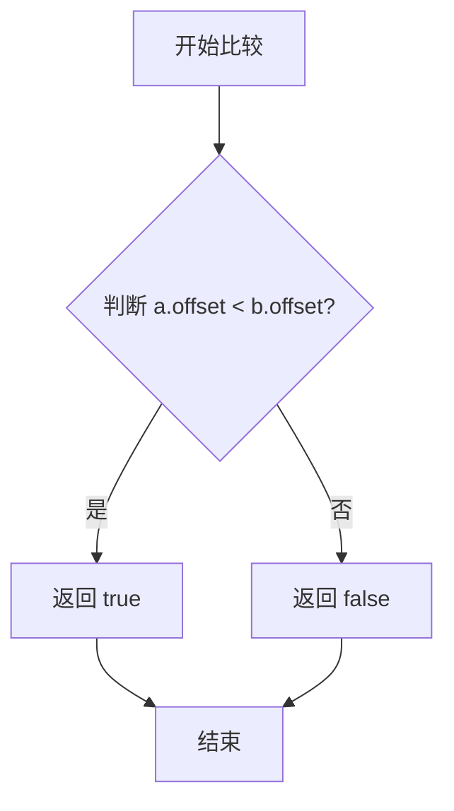
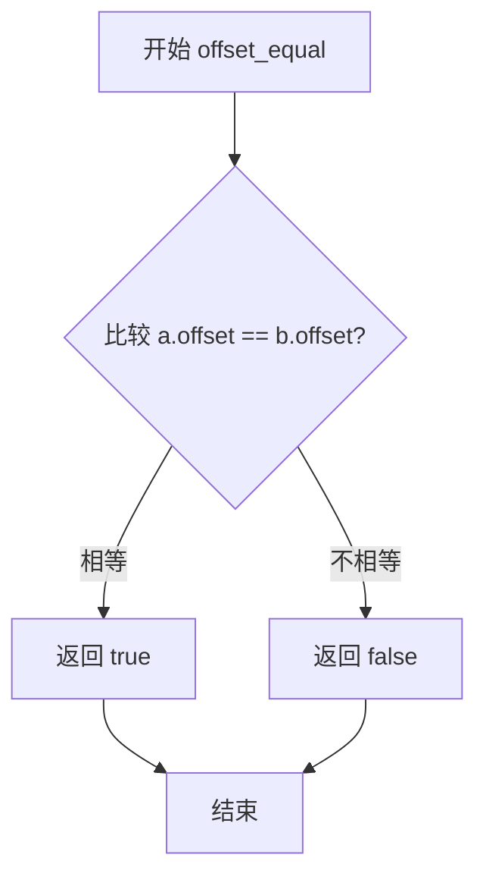
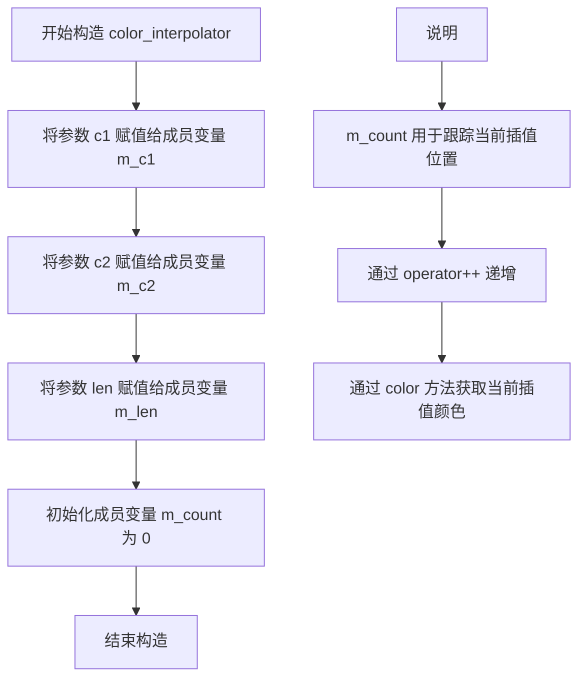
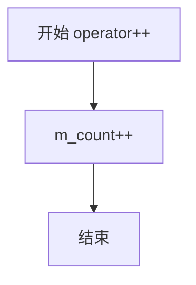
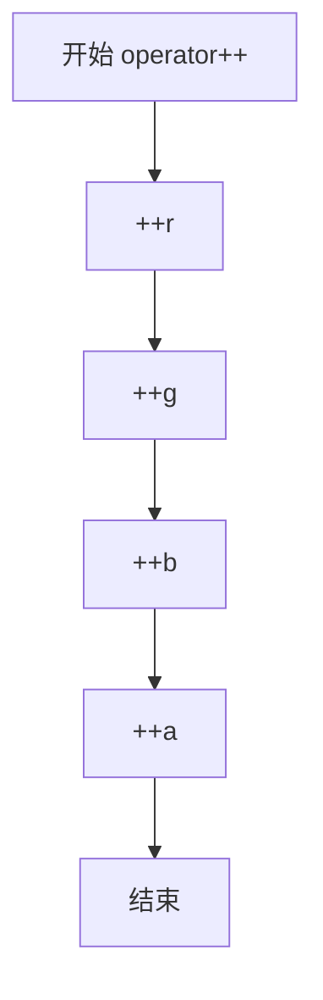
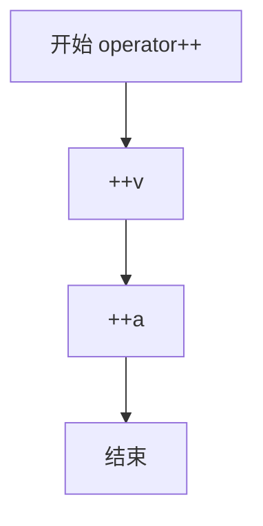
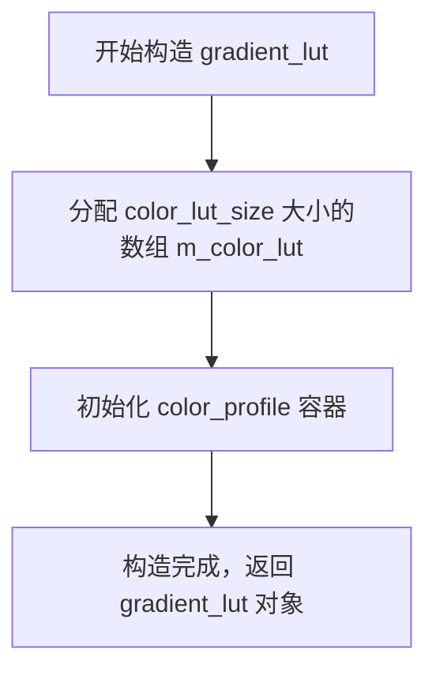
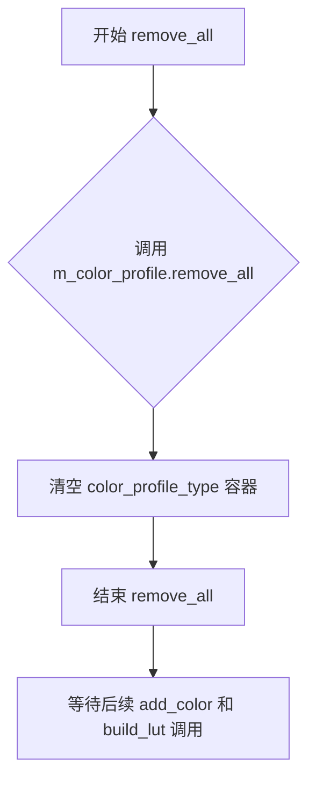
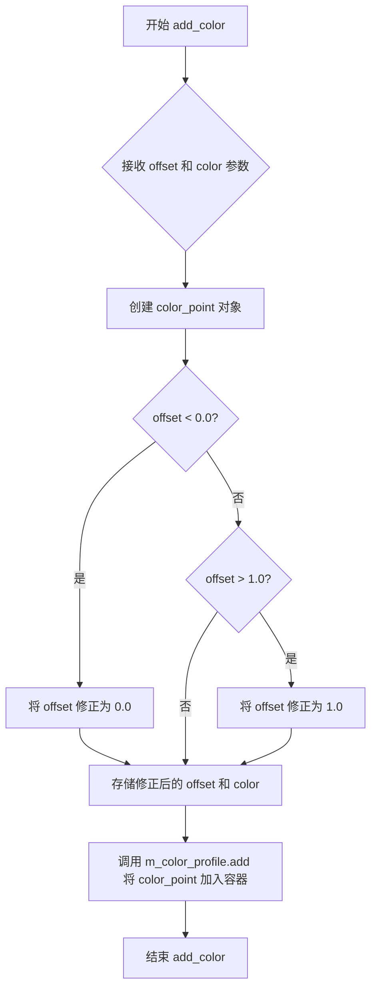

# `matplotlib\extern\agg24-svn\include\agg_gradient_lut.h` 详细设计文档

该文件是Anti-Grain Geometry (AGG) 库的一部分，定义了一套颜色梯度查找表（Gradient Look-Up Table）生成机制。它通过模板类 `gradient_lut` 允许用户定义一组带有偏移量（offset）的颜色停止点，并利用颜色插值器 `color_interpolator` 在这些点之间进行平滑过渡，生成一个预计算的查找表数组，以支持高效的图形渐变渲染。代码包含了针对 `rgba8` 和 `gray8` 颜色类型的特化优化。

## 整体流程

```mermaid
graph TD
    A[开始] --> B[创建 gradient_lut 实例]
    B --> C[调用 add_color 添加颜色停止点]
    C --> D{是否需要继续添加?}
    D -- 是 --> C
    D -- 否 --> E[调用 build_lut 构建查找表]
    E --> F[对颜色配置按偏移量排序]
    F --> G[去除重复偏移量]
    G --> H{颜色点数量 >= 2?}
    H -- 否 --> I[结束]
    H -- 是 --> J[遍历颜色点区间]
    J --> K[实例化 color_interpolator]
    K --> L[循环调用 ci.color() 填充 m_color_lut]
    L --> J
    J --> I
```

## 类结构

```
agg (命名空间)
├── color_interpolator (结构体模板/仿函数)
│   ├── 特化: color_interpolator<rgba8> (针对8位RGB+Alpha的优化)
│   └── 特化: color_interpolator<gray8> (针对8位灰度+Alpha的优化)
└── gradient_lut (类模板)
    └── 内部结构体: color_point (颜色点数据结构)
```

## 全局变量及字段


### `color_interpolator.m_c1`
    
起始颜色

类型：`color_type`
    


### `color_interpolator.m_c2`
    
结束颜色

类型：`color_type`
    


### `color_interpolator.m_len`
    
插值总长度

类型：`unsigned`
    


### `color_interpolator.m_count`
    
当前步进计数

类型：`unsigned`
    


### `color_interpolator<rgba8>.r, g, b, a`
    
rgba8特化中的分量插值器

类型：`agg::dda_line_interpolator<14>`
    


### `color_interpolator<gray8>.v, a`
    
gray8特化中的分量插值器

类型：`agg::dda_line_interpolator<14>`
    


### `gradient_lut.m_color_profile`
    
存储color_point的动态数组，保存原始颜色配置

类型：`color_profile_type (agg::pod_bvector<color_point, 4>)`
    


### `gradient_lut.m_color_lut`
    
存储最终渐变颜色的固定数组（查找表）

类型：`color_lut_type (agg::pod_array<color_type>)`
    


### `color_point.offset`
    
颜色停止点的偏移量，范围[0,1]

类型：`double`
    


### `color_point.color`
    
对应偏移位置的颜色值

类型：`color_type`
    
    

## 全局函数及方法


### `gradient_lut.offset_less`

该函数是 `gradient_lut` 类的私有静态成员函数，作为比较函数用于 `quick_sort` 排序算法，通过比较两个 `color_point` 对象的 `offset` 成员值来确定它们在颜色梯度查找表中的相对顺序。

参数：

- `a`：`const color_point&`，第一个参与比较的颜色点对象
- `b`：`const color_point&`，第二个参与比较的颜色点对象

返回值：`bool`，当 `a` 的偏移值小于 `b` 的偏移值时返回 `true`，否则返回 `false`

#### 流程图



#### 带注释源码

```cpp
// 私有静态成员函数，作为 quick_sort 的比较函数
// 用于按照 offset 字段对 color_point 进行升序排序
static bool offset_less(const color_point& a, const color_point& b)
{
    // 比较两个 color_point 的 offset 成员
    // 返回 true 表示 a 应该排在 b 之前（升序）
    return a.offset < b.offset;
}
```


### `gradient_lut.offset_equal`

私有静态判等函数，用于在构建梯度查找表时检测并移除具有相同偏移量的颜色站点。该函数作为谓词传递给 `remove_duplicates` 算法，确保梯度定义中不会出现重复的颜色偏移点。

参数：

- `a`：`const color_point&`，第一个要比较的颜色站点，包含偏移量和颜色值
- `b`：`const color_point&`，第二个要比较的颜色站点，包含偏移量和颜色值

返回值：`bool`，如果两个颜色站点的偏移量相等则返回 `true`，否则返回 `false`

#### 流程图



#### 带注释源码

```cpp
// 私有静态成员函数，作为 remove_duplicates 的比较谓词
// 用于检测 color_profile 中是否有重复偏移量的颜色站点
static bool offset_equal(const color_point& a, const color_point& b)
{
    // 直接比较两个颜色站点的偏移量是否相等
    // 使用 == 操作符比较双精度浮点数
    return a.offset == b.offset;
}
```


### `gradient_lut<T,S>::build_lut`

该方法是 `gradient_lut` 类的核心成员函数，负责根据已添加的颜色站点（color stops）构建颜色查找表（Color LUT）。它首先对颜色配置文件进行排序和去重，然后通过循环插值的方式在相邻颜色站点之间生成平滑过渡的颜色值，最终填充 `m_color_lut` 数组以供梯度渲染使用。

参数：  
- 该方法无显式参数（成员函数，通过 `this` 指针访问成员变量）

返回值：`void`，无返回值（直接修改成员变量 `m_color_lut`）

#### 流程图

```mermaid
flowchart TD
    A[开始 build_lut] --> B{颜色配置文件数量 >= 2?}
    B -->|否| C[直接返回，不做任何处理]
    B -->|是| D[quick_sort: 按 offset 排序颜色站点]
    D --> E[remove_duplicates: 移除重复的 offset]
    E --> F[计算第一个颜色的起始索引 start]
    F --> G[填充从 0 到 start 的 LUT 为起始颜色]
    G --> H[遍历 i 从 1 到 color_profile.size-1]
    H --> I[计算当前站点索引 end]
    I --> J[创建插值器 ci: 相邻两点间颜色插值]
    J --> K{start < end?}
    K -->|是| L[设置 LUT[start] 为插值颜色]
    L --> M[start++, 插值器++]
    M --> K
    K -->|否| N[更新 start = end]
    N --> H
    H --> O[填充剩余 LUT 为最后颜色]
    O --> P[结束]
```

#### 带注释源码

```cpp
//------------------------------------------------------------------------
// 构建颜色查找表（Build Gradient Lut）
// 该方法根据已添加的颜色站点生成完整的颜色渐变查找表
//------------------------------------------------------------------------
template<class T, unsigned S>
void gradient_lut<T,S>::build_lut()
{
    // 步骤1: 对颜色配置文件按 offset 进行快速排序
    // 确保颜色站点按照从 0 到 1 的顺序排列
    quick_sort(m_color_profile, offset_less);
    
    // 步骤2: 移除具有相同 offset 的重复颜色站点
    // remove_duplicates 返回去重后的元素数量，cut_at 截断向量
    m_color_profile.cut_at(remove_duplicates(m_color_profile, offset_equal));
    
    // 步骤3: 检查是否有足够的颜色进行插值（至少需要2个颜色）
    if(m_color_profile.size() >= 2)
    {
        unsigned i;              // 循环计数器
        unsigned start = uround(m_color_profile[0].offset * color_lut_size);  // 第一个颜色的起始位置
        unsigned end;            // 当前颜色段的结束位置
        color_type c = m_color_profile[0].color;  // 当前颜色值
        
        // 步骤4: 填充查找表的前半部分（从0到第一个颜色站点的位置）
        // 如果第一个 offset 大于 0，则用第一个颜色填充前面的空间
        for(i = 0; i < start; i++) 
        {
            m_color_lut[i] = c;
        }
        
        // 步骤5: 遍历所有相邻的颜色站点对，进行线性插值
        // 从第二个站点开始（索引1），因为索引0已在前面处理
        for(i = 1; i < m_color_profile.size(); i++)
        {
            // 计算当前颜色站点的结束位置
            end  = uround(m_color_profile[i].offset * color_lut_size);
            
            // 创建颜色插值器，在前一个颜色和当前颜色之间生成渐变
            // 插值范围包括 start 和 end（故 +1）
            interpolator_type ci(m_color_profile[i-1].color, 
                                 m_color_profile[i  ].color, 
                                 end - start + 1);
            
            // 逐步填充 start 到 end 之间的所有颜色值
            while(start < end)
            {
                // 获取当前插值步的颜色并写入 LUT
                m_color_lut[start] = ci.color();
                ++ci;              // 推进插值器到下一步
                ++start;           // 移动到下一个 LUT 位置
            }
        }
        
        // 步骤6: 填充查找表的剩余部分
        // 用最后一个颜色填充从最后一个站点到 LUT 末尾的所有位置
        c = m_color_profile.last().color;  // 获取最后一个颜色站点
        for(; end < m_color_lut.size(); end++)
        {
            m_color_lut[end] = c;
        }
    }
}
```

---

### 补充信息

**关键组件说明：**

| 组件名称 | 说明 |
|---------|------|
| `m_color_profile` | 存储颜色站点的向量，每个站点包含 offset 和 color |
| `m_color_lut` | 最终生成的颜色查找表数组，大小为 `color_lut_size`（默认256） |
| `color_interpolator` | 颜色插值器类，负责在两个颜色之间生成渐变颜色 |
| `quick_sort` | 快速排序算法，对颜色站点按 offset 排序 |
| `remove_duplicates` | 移除重复的颜色站点 |
| `uround` | 四舍五入到最近的整数 |

**潜在的技术债务或优化空间：**

1. **插值算法单一**：当前仅支持线性插值，可考虑添加其他插值方式（如余弦插值、样条插值）以获得更平滑的渐变效果
2. **边界处理**：当颜色站点数量少于2时直接返回，无错误提示或默认值处理
3. **性能优化**：可考虑使用 SIMD 指令加速颜色插值计算，特别是对 rgba8 的特化版本
4. **内存预分配**：color_lut_type 使用固定大小，可根据实际需求动态调整大小

**外部依赖与接口契约：**

- 依赖 `agg::pod_bvector` 和 `agg::pod_array` 进行内存管理
- 依赖 `agg::quick_sort` 和 `agg::remove_duplicates` 进行排序和去重
- 使用前需先调用 `remove_all()` 清空配置，然后至少调用两次 `add_color()` 添加颜色站点，最后调用 `build_lut()` 构建 LUT
- 构建完成后，LUT 可直接供 `span_gradient` 等渲染类使用，通过 `operator[]` 按索引访问颜色值


### `color_interpolator.color_interpolator(c1, c2, len)`

构造函数，用于初始化颜色插值器，接收起始颜色、结束颜色和插值长度三个参数，建立从颜色c1到颜色c2的渐变插值状态机。

参数：

- `c1`：`const color_type&`，起始颜色，插值渐变的起点
- `c2`：`const color_type&`，结束颜色，插值渐变的终点
- `len`：`unsigned`，插值长度，定义了从起点到终点之间的采样步数

返回值：`无`（构造函数不返回值）

#### 流程图



#### 带注释源码

```cpp
//----------------------------------------------------------------------------
// Anti-Grain Geometry - Version 2.4
// 颜色插值器模板类 - 通用实现
//----------------------------------------------------------------------------

template<class ColorT> struct color_interpolator
{
public:
    // 类型别名，定义颜色类型
    typedef ColorT color_type;

    //-----------------------------------------------------------------------
    // 构造函数：初始化颜色插值器
    // 参数：
    //   c1  - 起始颜色（插值起点）
    //   c2  - 结束颜色（插值终点）
    //   len - 插值长度（总步数）
    //-----------------------------------------------------------------------
    color_interpolator(const color_type& c1, 
                       const color_type& c2, 
                       unsigned len) :
        m_c1(c1),      // 初始化起始颜色成员
        m_c2(c2),      // 初始化结束颜色成员
        m_len(len),   // 初始化插值长度
        m_count(0)    // 初始化计数器为0，表示从起点开始
    {}

    //-----------------------------------------------------------------------
    // 前置递增运算符：移动到下一个插值点
    // 内部递增 m_count 计数器
    //-----------------------------------------------------------------------
    void operator ++ ()
    {
        ++m_count;  // 计数器加1，准备获取下一个插值颜色
    }

    //-----------------------------------------------------------------------
    // 获取当前插值颜色
    // 根据当前计数器位置，计算起点到终点之间的渐变颜色
    // 返回值：
    //   当前计数器位置的插值颜色
    //-----------------------------------------------------------------------
    color_type color() const
    {
        // 使用颜色的 gradient 方法进行线性插值
        // 计算公式：m_c1 + (m_c2 - m_c1) * (m_count / m_len)
        return m_c1.gradient(m_c2, double(m_count) / m_len);
    }

private:
    color_type m_c1;   // 起始颜色
    color_type m_c2;   // 结束颜色
    unsigned   m_len; // 插值总长度/步数
    unsigned   m_count; // 当前插值位置计数器
};

//==========================================================================
// Fast specialization for rgba8
// rgba8 类型的特化实现，使用 dda_line_interpolator 进行高速插值
//==========================================================================
template<> struct color_interpolator<rgba8>
{
public:
    typedef rgba8 color_type;

    // 构造函数：为 RGBA 四个通道分别创建 DDA 线性插值器
    color_interpolator(const color_type& c1, 
                       const color_type& c2, 
                       unsigned len) :
        r(c1.r, c2.r, len), // R通道插值器
        g(c1.g, c2.g, len), // G通道插值器
        b(c1.b, c2.b, len), // B通道插值器
        a(c1.a, c2.a, len)  // A通道插值器
    {}

    // 前置递增：同时递增四个通道的插值器
    void operator ++ ()
    {
        ++r; ++g; ++b; ++a;
    }

    // 获取当前插值颜色
    color_type color() const
    {
        return color_type(r.y(), g.y(), b.y(), a.y());
    }

private:
    // 使用 dda_line_interpolator<14> 进行定点数高速插值
    agg::dda_line_interpolator<14> r, g, b, a;
};

//==========================================================================
// Fast specialization for gray8
// gray8 类型的特化实现
//==========================================================================
template<> struct color_interpolator<gray8>
{
public:
    typedef gray8 color_type;

    // 构造函数：为灰度和透明度创建 DDA 线性插值器
    color_interpolator(const color_type& c1, 
                       const color_type& c2, 
                       unsigned len) :
        v(c1.v, c2.v, len), // 灰度值插值器
        a(c1.a, c2.a, len)  // 透明度插值器
    {}

    // 前置递增
    void operator ++ ()
    {
        ++v; ++a;
    }

    // 获取当前插值颜色
    color_type color() const
    {
        return color_type(v.y(), a.y());
    }

private:
    agg::dda_line_interpolator<14> v, a;
};
```

#### 设计说明

该构造函数采用了**模板方法模式**和**特化优化**的设计思想：

1. **通用模板**：提供通用的颜色插值接口，适用于任意颜色类型
2. **特化优化**：针对常用的 `rgba8` 和 `gray8` 类型提供特化实现，使用 `dda_line_interpolator` 进行定点数高速运算，避免浮点开销
3. **状态机模式**：通过 `operator++` 和 `color()` 方法实现迭代器风格的状态推进


### `color_interpolator<ColorT>::operator++()`

前置递增操作符重载，用于增加内部计数器以计算渐变过程中的下一个颜色位置。该方法通过递增m_count来推进颜色插值的进度，配合color()方法可获取当前插值颜色。

参数：
- （无参数）

返回值：`void`，无返回值，仅更新内部状态

#### 流程图



#### 带注释源码

```cpp
// 前置递增操作符重载
void operator ++ ()
{
    // 递增内部计数器m_count
    // 每次调用后，count增加1，用于计算下一个插值位置
    // 当与color()配合使用时，可遍历从起始颜色到结束颜色的整个渐变过程
    ++m_count;
}
```

---

### `color_interpolator<rgba8>::operator++()`

针对rgba8颜色类型的特化版本，使用dda_line_interpolator进行高效的颜色插值计算。前置递增操作同时推进四个通道（r、g、b、a）的插值器，以计算下一个渐变颜色。

参数：
- （无参数）

返回值：`void`，无返回值

#### 流程图



#### 带注释源码

```cpp
// rgba8特化版本的前置递增操作符
// 使用dda_line_interpolator<14>进行高效的整数线性插值
void operator ++ ()
{
    // 递增红色通道插值器
    ++r;
    // 递增绿色通道插值器
    ++g;
    // 递增蓝色通道插值器
    ++b;
    // 递增透明度通道插值器
    ++a;
    // 四个通道同时递增，保证颜色各分量同步推进
}
```

---

### `color_interpolator<gray8>::operator++()`

针对gray8灰度颜色类型的特化版本，使用两个dda_line_interpolator分别处理灰度值（v）和透明度（a）。前置递增操作同时推进两个插值器。

参数：
- （无参数）

返回值：`void`，无返回值

#### 流程图



#### 带注释源码

```cpp
// gray8特化版本的前置递增操作符
// 灰度颜色只有两个通道：灰度值v和透明度a
void operator ++ ()
{
    // 递增灰度值插值器
    ++v;
    // 递增透明度插值器
    ++a;
    // 两个通道同时递增
}
```


### `color_interpolator.color()`

返回当前计算出的颜色值（通过 gradient 函数），用于在颜色插值过程中获取当前步骤的颜色。

#### 主模板版本

参数： 无

返回值： `color_type`，当前计算出的颜色值，通过在 m_c1 和 m_c2 之间进行梯度计算得到，位置由 m_count/m_len 决定。

#### 流程图

```mermaid
flowchart TD
    A[开始 color] --> B[计算比例: double(m_count / m_len)]
    B --> C[调用 m_c1.gradient(m_c2, 比例)]
    C --> D[返回计算出的颜色]
```

#### 带注释源码

```cpp
// 主模板版本
color_type color() const
{
    // 计算当前进度比例：已迭代次数 / 总长度
    // m_count: 当前迭代计数
    // m_len: 梯度总长度
    double ratio = double(m_count) / m_len;
    
    // 调用 color_type 的 gradient 方法进行颜色插值
    // 从起始颜色 m_c1 渐变到结束颜色 m_c2
    // ratio 为 0.0 时返回 m_c1，为 1.0 时返回 m_c2
    return m_c1.gradient(m_c2, ratio);
}
```

---

### `color_interpolator<rgba8>.color()`

返回当前计算出的 rgba8 颜色值，使用 dda_line_interpolator 快速插值。

参数： 无

返回值： `rgba8`，当前计算出的 RGBA 颜色值，由 r、g、b、a 四个通道的插值器分别计算得出。

#### 流程图

```mermaid
flowchart TD
    A[开始 color] --> B[获取红色分量: r.y()]
    B --> C[获取绿色分量: g.y()]
    C --> D[获取蓝色分量: b.y()]
    D --> E[获取透明度分量: a.y()]
    E --> F[构造 rgba8 颜色对象并返回]
```

#### 带注释源码

```cpp
// rgba8 特化版本 - 使用 dda_line_interpolator 实现快速插值
color_type color() const
{
    // dda_line_interpolator 的 y() 方法返回当前插值点的高度值
    // r, g, b, a 分别是四个通道的 dda 插值器
    // 每次 ++ 操作后，插值器会自动推进到下一个点
    return color_type(r.y(), g.y(), b.y(), a.y());
}
```

---

### `color_interpolator<gray8>.color()`

返回当前计算出的 gray8 灰度颜色值，使用 dda_line_interpolator 快速插值。

参数： 无

返回值： `gray8`，当前计算出的灰度颜色值，包含灰度值(v)和透明度(a)两个分量。

#### 流程图

```mermaid
flowchart TD
    A[开始 color] --> B[获取灰度分量: v.y()]
    B --> C[获取透明度分量: a.y()]
    C --> D[构造 gray8 颜色对象并返回]
```

#### 带注释源码

```cpp
// gray8 特化版本 - 使用 dda_line_interpolator 实现快速插值
color_type color() const
{
    // v: 灰度值通道的 dda 插值器
    // a: 透明度通道的 dda 插值器
    // 返回当前插值点的灰度和透明度
    return color_type(v.y(), a.y());
}
```


### `gradient_lut::gradient_lut()` （构造函数）

该构造函数是 `gradient_lut` 模板类的构造函数，用于初始化一个大小为 `color_lut_size`（默认256）的颜色查找表数组，为后续的颜色渐变构建提供存储空间。

参数：
- 无

返回值：
- 无（构造函数，不返回任何值）

#### 流程图



#### 带注释源码

```cpp
//------------------------------------------------------------------------
// gradient_lut 构造函数
// 模板参数:
//   ColorInterpolator - 颜色插值器类型，用于在两个颜色之间进行插值
//   ColorLutSize - 颜色查找表的大小，默认256
//------------------------------------------------------------------------
template<class ColorInterpolator, unsigned ColorLutSize> class gradient_lut
{
public:
    //--------------------------------------------------------------------
    // 构造函数：初始化颜色查找表数组
    // 初始化列表中创建了大小为 color_lut_size 的 m_color_lut 数组
    //--------------------------------------------------------------------
    gradient_lut() : m_color_lut(color_lut_size) {}
    
    // ... 其他成员和方法 ...
    
private:
    //--------------------------------------------------------------------
    // 私有成员变量
    //--------------------------------------------------------------------
    color_profile_type  m_color_profile;  // 颜色配置文件，存储颜色停点
    color_lut_type      m_color_lut;      // 颜色查找表数组，存储最终渐变颜色
};
```

---

### 1. 一段话描述

`gradient_lut` 类是一个颜色渐变查找表（Gradient Lookup Table）模板类，用于在图形渲染中创建平滑的颜色渐变。它通过存储预计算的颜色值数组来提高渐变渲染效率，支持任意颜色类型和插值器，并遵循SVG规范的颜色停点（color stop）定义方式。

---

### 2. 文件的整体运行流程

该代码文件（`agg_gradient_lut.hpp`）属于 Anti-Grain Geometry (AGG) 图形库的颜色渐变模块，其主要运行流程如下：

1. **定义颜色插值器** (`color_interpolator`)：提供在不同颜色之间进行线性插值的功能
2. **实例化渐变查找表** (`gradient_lut`)：创建颜色查找表对象
3. **添加颜色停点**：通过 `add_color()` 方法添加渐变的起止颜色
4. **构建查找表**：调用 `build_lut()` 方法根据颜色停点预计算所有渐变颜色
5. **查询颜色**：通过 `operator[]` 获取任意位置的颜色值

---

### 3. 类的详细信息

#### 3.1 `gradient_lut` 类

**类字段：**

| 字段名 | 类型 | 描述 |
|--------|------|------|
| `m_color_profile` | `color_profile_type` (pod_bvector) | 存储颜色停点信息的容器 |
| `m_color_lut` | `color_lut_type` (pod_array) | 预计算的颜色渐变数组 |

**类方法：**

| 方法名 | 参数 | 返回值 | 描述 |
|--------|------|--------|------|
| `gradient_lut()` | 无 | 无 | 构造函数，初始化颜色查找表数组 |
| `remove_all()` | 无 | `void` | 清除所有颜色停点 |
| `add_color()` | `offset: double`, `color: const color_type&` | `void` | 添加颜色停点，offset范围[0,1] |
| `build_lut()` | 无 | `void` | 根据颜色停点构建渐变查找表 |
| `size()` | 无 | `static unsigned` | 返回颜色查找表大小 |
| `operator[]` | `i: unsigned` | `const color_type&` | 通过索引访问颜色值 |

---

#### 3.2 `color_interpolator` 类（模板）

**类字段：**

| 字段名 | 类型 | 描述 |
|--------|------|------|
| `m_c1` | `color_type` | 渐变起始颜色 |
| `m_c2` | `color_type` | 渐变结束颜色 |
| `m_len` | `unsigned` | 渐变长度 |
| `m_count` | `unsigned` | 当前插值位置计数器 |

**类方法：**

| 方法名 | 参数 | 返回值 | 描述 |
|--------|------|--------|------|
| `color_interpolator()` | `c1: const color_type&`, `c2: const color_type&`, `len: unsigned` | 构造函数 | 初始化插值器 |
| `operator++()` | 无 | `void` | 前置递增，跳到下一个颜色位置 |
| `color()` | 无 | `color_type` | 获取当前位置的颜色值 |

---

#### 3.3 全局函数和类型

| 名称 | 类型 | 描述 |
|------|------|------|
| `color_point` | 结构体 | 存储单个颜色停点的偏移量和颜色 |
| `offset_less` | 静态函数 | 比较两个颜色停点的偏移量（小于） |
| `offset_equal` | 函数对象 | 比较两个颜色停点的偏移量（等于） |

---

### 4. 关键组件信息

| 组件名称 | 一句话描述 |
|----------|------------|
| `color_interpolator` | 颜色插值器模板类，提供在两种颜色之间进行线性插值的功能 |
| `gradient_lut` | 颜色渐变查找表类，通过预计算存储渐变颜色数组提高渲染效率 |
| `pod_bvector` | POD类型向量容器，用于存储颜色停点配置 |
| `pod_array` | POD类型数组容器，存储预计算的颜色值 |
| `dda_line_interpolator` | DDA（数字微分分析器）线段插值器，用于高效的数值插值 |

---

### 5. 潜在的技术债务或优化空间

1. **硬编码的插值精度**：`color_interpolator<rgba8>` 中使用了硬编码的 `dda_line_interpolator<14>`，14位的精度可能不适用于所有场景

2. **内存分配策略**：构造函数中直接分配固定大小的数组，缺乏动态调整能力，可能造成内存浪费

3. **缺乏错误处理**：`build_lut()` 方法中当颜色停点少于2个时直接返回，没有给出任何警告或错误提示

4. **模板代码膨胀**：每个 `ColorInterpolator` 和 `ColorLutSize` 组合都会生成独立的代码，可能导致可执行文件体积增大

5. **重复计算风险**：`build_lut()` 每次调用都会重新计算整个查找表，没有缓存机制

6. **类型安全**：使用 `unsigned` 类型处理偏移量计算，可能在极端情况下出现整数溢出

---

### 6. 其它项目

#### 6.1 设计目标与约束

- **目标**：提供高效的运行时颜色渐变查询，通过预计算避免实时插值计算
- **约束**：颜色停点偏移量必须在 [0, 1] 范围内；至少需要2个颜色停点才能构建有效渐变
- **兼容性**：遵循SVG规范的颜色渐变定义方式

#### 6.2 错误处理与异常设计

- 颜色停点偏移量会自动 clamp 到 [0, 1] 范围
- 当颜色停点数量少于2时，`build_lut()` 不会修改查找表
- 没有使用异常机制，依赖断言和返回值进行错误处理

#### 6.3 数据流与状态机

```
[初始状态] 
    ↓ add_color()
[颜色停点添加状态]
    ↓ build_lut()
[渐变表构建状态] 
    ↓ operator[]()
[颜色查询状态]
```

#### 6.4 外部依赖与接口契约

- 依赖 `agg_array.h`：提供 `pod_bvector` 和 `pod_array` 容器
- 依赖 `agg_dda_line.h`：提供 DDA 插值器
- 依赖 `agg_color_rgba.h` 和 `agg_color_gray.h`：提供颜色类型定义
- 可直接与 `span_gradient` 类配合使用，作为其 ColorF 模板参数


### `gradient_lut.remove_all()`

该函数用于清空梯度颜色查找表的颜色配置文件（m_color_profile），重置所有已添加的颜色站点，为重新构建新的渐变颜色查找表做准备。

参数：
- （无参数）

返回值：`void`，无返回值描述

#### 流程图



#### 带注释源码

```cpp
//------------------------------------------------------------------------
// template<class T, unsigned S>
// void gradient_lut<T,S>::remove_all()
//
// 功能：清空颜色配置文件，重置渐变查找表
// 参数：无
// 返回值：void
// 说明：
//   - 该方法调用成员变量 m_color_profile 的 remove_all() 方法
//   - m_color_profile 类型为 pod_bvector<color_point, 4>
//   - 用于清除所有之前通过 add_color() 添加的颜色站点
//   - 通常在构建新的渐变颜色查找表前调用
//   - 配合 add_color() 和 build_lut() 使用
//------------------------------------------------------------------------
template<class T, unsigned S>
void gradient_lut<T,S>::remove_all()
{ 
    m_color_profile.remove_all(); 
}
```


### `gradient_lut.add_color`

向颜色查找表配置中添加颜色停止点（color stop），该方法会自动将 offset 参数修正到 [0, 1] 合法范围内，并将其与对应颜色一同存储到颜色配置文件中，以供后续 `build_lut()` 生成渐变查找表使用。

参数：

- `offset`：`double`，颜色停止点的位置偏移量，范围应为 [0, 1]，方法内部会自动将超出此范围的值修正到边界（小于 0 则设为 0，大于 1 则设为 1）
- `color`：`const color_type&`，颜色停止点对应的颜色值，color_type 由模板参数 ColorInterpolator 的 color_type 决定（如 rgba8、gray8 等）

返回值：`void`，无返回值

#### 流程图



#### 带注释源码

```cpp
//------------------------------------------------------------------------
// 向颜色查找表配置中添加颜色停止点
// offset: 颜色位置偏移量，范围 [0, 1]，超出范围会自动修正
// color:  对应偏移位置的颜色值
//------------------------------------------------------------------------
template<class T, unsigned S>
void gradient_lut<T,S>::add_color(double offset, const color_type& color)
{
    // 创建 color_point 对象，在其构造函数中会自动修正 offset 到 [0,1] 范围
    // color_point 构造函数逻辑：
    //   if(offset < 0.0) offset = 0.0;
    //   if(offset > 1.0) offset = 1.0;
    m_color_profile.add(color_point(offset, color));
}
```

#### 相关内部类型说明

```cpp
// 内部存储颜色停止点的结构体
struct color_point
{
    double     offset;   // 修正后的偏移量 [0, 1]
    color_type color;    // 对应颜色

    // 构造函数中自动修正 offset 范围
    color_point(double off, const color_type& c) : 
        offset(off), color(c)
    {
        if(offset < 0.0) offset = 0.0;
        if(offset > 1.0) offset = 1.0;
    }
};

// 颜色配置文件容器类型，使用 pod_bvector 存储 color_point
typedef agg::pod_bvector<color_point, 4> color_profile_type;
```


### `gradient_lut<T,S>::build_lut()`

该方法负责构建梯度查找表（Gradient Lookup Table）。其核心逻辑是：首先对用户添加的颜色点配置按偏移量（offset）进行排序，然后去除重复的偏移量，接着使用颜色插值器在已排序的颜色点之间进行线性插值，最终生成完整的颜色查找表供渐变渲染使用。

参数：无（成员方法，通过this访问实例状态）

返回值：`void`，无返回值

#### 流程图

```mermaid
flowchart TD
    A[开始 build_lut] --> B[对 m_color_profile 按 offset 排序]
    B --> C[去除重复的 color_point]
    C --> D{颜色点数量 >= 2?}
    D -->|否| E[直接返回]
    D -->|是| F[计算起始索引 start = uround(offset0 * color_lut_size)]
    F --> G[用第一个颜色填充 m_color_lut[0...start-1]]
    G --> H[遍历 i = 1 到 size-1]
    H --> I[计算结束索引 end = uround(offseti * color_lut_size)]
    I --> J[创建插值器 ci 相邻两点之间]
    J --> K[循环填充 start 到 end-1]
    K --> L{start < end?}
    L -->|是| M[m_color_lut[start] = ci.color<br/>++ci<br/>++start]
    M --> L
    L -->|否| N[start = end<br/>i++]
    N --> H
    H --> O{遍历完成?}
    O -->|否| I
    O -->|是| P[用最后一个颜色填充 m_color_lut[end...size-1]]
    P --> Q[结束]
```

#### 带注释源码

```cpp
//------------------------------------------------------------------------
template<class T, unsigned S>
void gradient_lut<T,S>::build_lut()
{
    // 步骤1: 对颜色配置按偏移量排序
    // 使用快速排序，确保颜色点按offset从小到大排列
    quick_sort(m_color_profile, offset_less);
    
    // 步骤2: 去除重复的偏移量
    // remove_duplicates返回去重后的有效元素数量
    // cut_at将容器截断到该数量，移除重复项
    m_color_profile.cut_at(remove_duplicates(m_color_profile, offset_equal));
    
    // 步骤3: 检查是否有足够的颜色点进行插值
    // 至少需要两个颜色点才能形成渐变
    if(m_color_profile.size() >= 2)
    {
        unsigned i;
        unsigned start = uround(m_color_profile[0].offset * color_lut_size);  // 起始索引
        unsigned end;                                                         // 结束索引
        color_type c = m_color_profile[0].color;                              // 当前颜色
        
        // 步骤4: 填充查找表的起始部分（从0到第一个颜色点位置）
        for(i = 0; i < start; i++) 
        {
            m_color_lut[i] = c;
        }
        
        // 步骤5: 遍历每对相邻的颜色点，使用插值器填充中间区域
        for(i = 1; i < m_color_profile.size(); i++)
        {
            // 计算当前颜色点对应的查找表索引
            end  = uround(m_color_profile[i].offset * color_lut_size);
            
            // 创建颜色插值器，在相邻两个颜色之间进行线性插值
            // 插值范围包括start和end
            interpolator_type ci(m_color_profile[i-1].color, 
                                 m_color_profile[i  ].color, 
                                 end - start + 1);
            
            // 逐个填充查找表位置
            while(start < end)
            {
                m_color_lut[start] = ci.color();  // 获取插值颜色
                ++ci;                              // 推进插值器
                ++start;                           // 移动到下一个位置
            }
        }
        
        // 步骤6: 填充查找表的末尾部分（从最后一个颜色点到表尾）
        c = m_color_profile.last().color;
        for(; end < m_color_lut.size(); end++)
        {
            m_color_lut[end] = c;
        }
    }
}
```


### `gradient_lut::size()`

这是一个静态成员方法，用于返回颜色梯度查找表（color lookup table）的大小。该方法是`gradient_lut`类与`span_gradient`类集成的接口之一，允许后者查询查找表的容量以进行颜色插值。

参数：该方法没有参数。

返回值：`unsigned`，返回模板参数`ColorLutSize`的值（默认为256），表示颜色查找表中可用的颜色条目数量。

#### 流程图

```mermaid
graph TD
    A[开始调用 size()] --> B{返回 color_lut_size}
    B --> C[结束]
```

#### 带注释源码

```cpp
//------------------------------------------------------------------------
// gradient_lut<T,S>::size 的实现
//------------------------------------------------------------------------
template<class ColorInterpolator, unsigned ColorLutSize>
class gradient_lut
{
public:
    //--------------------------------------------------------------------
    // 静态方法size()
    // 功能：返回颜色查找表的大小
    // 参数：无
    // 返回值：unsigned类型，返回模板参数ColorLutSize的值
    //--------------------------------------------------------------------
    static unsigned size() 
    { 
        // 直接返回模板参数ColorLutSize（默认为256）
        // 这是一个编译时常量，用于定义颜色梯度的分辨率
        return color_lut_size; 
    }
    
    // 类的其他成员...
};
```

#### 上下文信息

**类信息：**
- **类名**：`gradient_lut<ColorInterpolator, ColorLutSize>`
- **模板参数**：
  - `ColorInterpolator`：颜色插值器类型（如`color_interpolator<rgba8>`）
  - `ColorLutSize`：颜色查找表大小，默认为256

**相关常量：**
- `color_lut_size`：枚举常量，等于模板参数`ColorLutSize`，在类内部使用

**使用场景：**
该方法通常与`span_gradient`类配合使用，后者需要知道颜色查找表的大小来正确渲染梯度填充。

#### 潜在优化空间

1. **constexpr化**：如果编译器支持，可以将`size()`方法声明为`constexpr`，这样可以在编译时获取查找表大小，可能有助于编译器进行更多优化。
   
2. **内联提示**：该方法已经非常简短，编译器很可能会自动内联，但显式使用`inline`关键字可以确保这一点。

#### 设计备注

该方法是`gradient_lut`类对外接口的一部分，满足了`span_gradient`类所需的"size-index接口"（Size-index Interface）。这种设计遵循了AGG库的一致性原则，允许不同的颜色查找表实现可以互换使用。


### `gradient_lut::operator[]`

该方法是一个常量成员方法，返回查找表（Look-Up Table）中第 i 个位置的颜色值。它通过下标操作符提供对预计算梯度颜色的直接访问，是 `span_gradient` 等类使用此查找表的核心接口。

参数：

- `i`：`unsigned`，表示查找表的索引位置，范围应在 [0, color_lut_size) 之间

返回值：`const color_type&`，返回对应索引位置的颜色常引用，颜色类型由模板参数决定（可能是 rgba8 或 gray8 等）

#### 流程图

```mermaid
flowchart TD
    A[开始访问 operator[]] --> B{检查索引 i 是否有效}
    B -->|有效| C[从 m_color_lut 数组中获取第 i 个元素]
    C --> D[返回 color_type 常引用]
    B -->|无效| E[未定义行为/越界访问]
    D --> F[结束]
    E --> F
```

#### 带注释源码

```cpp
//----------------------------------------------------------------------------
// gradient_lut::operator[]
// 常量下标操作符重载，用于访问梯度查找表中的颜色值
//----------------------------------------------------------------------------
const color_type& operator [] (unsigned i) const 
{ 
    // 直接返回内部颜色查找表数组中第 i 个元素的常量引用
    // m_color_lut 是通过 build_lut() 方法预计算好的颜色数组
    // i 的有效范围为 [0, color_lut_size)，通常为 [0, 256)
    return m_color_lut[i]; 
}
```

## 关键组件


### color_interpolator 模板类

颜色插值器，负责在两种颜色之间生成渐变序列。通过模板特化为 rgba8 和 gray8 提供快速实现。

### color_interpolator<rgba8> 特化版本

针对 RGBA8 颜色类型的快速插值实现，使用 dda_line_interpolator 进行高效计算。

### color_interpolator<gray8> 特化版本

针对灰度8颜色类型的快速插值实现，同样使用 dda_line_interpolator 优化性能。

### gradient_lut 模板类

梯度查找表核心类，管理颜色渐变的构建和查询。提供 add_color、build_lut 等接口，支持 SVG 规范的梯度停点定义。

### color_point 结构体

颜色停点结构体，包含 offset（偏移量 0-1）和 color（颜色），用于描述渐变中的颜色节点。

### m_color_profile 成员变量

颜色配置文件，存储 color_point 的动态数组，用于记录渐变过程中的所有颜色停点。

### m_color_lut 成员变量

颜色查找表数组，存储预计算的颜色值，用于快速颜色查询。

### offset_less 静态函数

比较函数，用于按偏移量排序颜色停点。

### offset_equal 静态函数

比较函数，用于检测相同样式的颜色停点。

### remove_all 方法

清空颜色配置文件，重置渐变状态。

### add_color 方法

添加颜色停点，将新的颜色及其偏移量添加到配置文件。

### build_lut 方法

构建梯度查找表，核心算法包括排序、去除重复、插值计算生成最终的颜色数组。


## 问题及建议


### 已知问题

- **模板特化不完整**：仅对 `rgba8` 和 `gray8` 提供了 `color_interpolator` 的特化版本，其他颜色类型（如 `rgba16`、`rgba32`、`gray16` 等）将使用通用的模板实现，使用 `double` 运算进行梯度计算，性能显著低于特化版本。

- **浮点精度误差**：在 `build_lut()` 中使用 `uround()` 将浮点 offset 转换为整数索引时，可能因浮点精度问题导致边界索引计算不准确，特别是在 offset 接近 0 或 1 时。

- **无效输入无反馈**：当用户未正确使用 API（如未添加足够颜色、忘记调用 `build_lut()`、或添加相同 offset 的多个颜色点）时，程序不会产生任何警告或错误指示，导致渐变查找表处于无效状态。

- **重复点去重逻辑不完善**：`remove_duplicates` 仅基于 offset 值去重，如果存在多个相同 offset 但不同颜色的点，会保留最后一个，之前的颜色会被静默丢弃，可能导致非预期结果。

- **排序算法稳定性**：代码使用 `quick_sort` 对颜色点排序，但未说明其稳定性。如果存在相同 offset 的点，排序顺序可能不确定，影响最终颜色映射。

- **模板参数无校验**：`ColorLutSize` 模板参数没有约束，允许传入 0 或极小值，可能导致除零错误或内存分配失败。

### 优化建议

- **扩展特化版本**：为更多常用颜色类型（如 `rgba16`、`gray16`、`rgba32`）添加 `color_interpolator` 特化，使用 `dda_line_interpolator` 或类似优化技术提升性能。

- **增加状态验证**：在 `gradient_lut` 类中添加内部状态标志（如 `m_built`），在 `build_lut()` 中验证颜色点数量是否足够（≥2），并提供 `is_valid()` 方法供外部检查。

- **改进错误处理**：在 `add_color()` 中添加参数校验（如 offset 范围、颜色有效性），对无效输入抛出异常或返回错误码；考虑使用 `std::pair` 或结构体存储去重信息，向用户反馈有多少个重复点被忽略。

- **优化内存布局**：考虑使用 `std::vector` 替代固定大小的 `pod_array`，根据实际使用的颜色点数量动态分配内存，特别是在 `ColorLutSize` 很大的场景下可节省空间。

- **文档增强**：补充关于浮点精度限制、API 使用顺序要求、多重颜色点处理规则的文档说明，帮助用户正确使用该类。

- **添加单元测试**：为边界条件（如 offset=0/1、极小 len、相邻颜色点、重复 offset 等）编写测试用例，确保去重和插值逻辑的正确性。


## 其它


### 设计目标与约束

本模块的设计目标是为AGG图形库提供一个高效的、可复用的颜色渐变查找表构建机制。通过预计算颜色渐变并在运行时进行快速查询，提升渐变渲染的性能。设计约束包括：(1) 模板参数ColorInterpolator必须提供color()方法和++操作符重载；(2) ColorLutSize必须为正整数，默认为256；(3) 颜色停止点(offset)必须落在[0,1]范围内；(4) 至少需要两个颜色停止点才能构建有效的渐变查找表。

### 错误处理与异常设计

本模块采用无异常设计策略，通过条件检查和断言来处理错误情况。在color_point构造函数中，offset值会被自动限制在[0,1]范围内，超出范围的值会被Clamp处理。build_lut()方法要求颜色配置文件中至少包含两个颜色点，否则不会执行构建逻辑。所有内存分配失败时，pod_bvector和pod_array会调用其内部的重分配机制处理。模块不抛出任何异常，调用者需确保输入参数的合法性。

### 数据流与状态机

gradient_lut类存在三种状态转换：(1) 初始状态（Empty）：调用remove_all()后进入此状态；(2) 配置状态（Configuring）：调用add_color()添加颜色停止点，可多次调用；(3) 构建状态（Built）：调用build_lut()后完成，此时m_color_lut已生成完整渐变数据。状态转换流程：Empty -> Configuring -> Built，或者从Built回到Empty重新开始。

### 外部依赖与接口契约

本模块依赖以下AGG内部头文件：agg_array.h（提供pod_bvector和pod_array容器）、agg_dda_line.h（提供dda_line_interpolator用于高效数值插值）、agg_color_rgba.h（rgba8颜色类型定义）、agg_color_gray.h（gray8颜色类型定义）。模块提供的公开接口契约包括：remove_all()必须首先调用；add_color()的offset参数必须在[0,1]范围内，至少需要调用2次；build_lut()调用后不能再添加新颜色；size()返回固定值ColorLutSize；operator[]用于索引查询越界行为未定义。

### 性能考虑与基准测试

颜色插值使用dda_line_interpolator<14>进行14位精度的整数插值，避免浮点运算开销。build_lut()算法时间复杂度为O(n log n)，其中n为颜色停止点数量，主要开销在快速排序阶段。查询操作operator[]为O(1)时间复杂度。典型使用场景下，构建256级灰度渐变约需微秒级时间，RGBA8彩色渐变约需数十微秒。建议在渐变参数不变的情况下重复使用同一个gradient_lut实例。

### 内存管理

m_color_profile使用pod_bvector<color_point, 4>存储，颜色停止点预分配4个元素的基址，动态增长时以2倍扩展。m_color_lut使用pod_array<color_type>存储，大小固定为ColorLutSize。所有内存分配在栈上或通过预分配完成，运行时无动态内存请求。对象析构时自动释放所有关联内存，无资源泄漏风险。

### 线程安全性

本模块的gradient_lut类是非线程安全的。多个线程同时访问同一个gradient_lut实例进行读写操作时，需要外部同步机制。推荐的使用模式是每个线程拥有独立的gradient_lut实例，或者在多线程环境下使用互斥锁保护共享实例的访问。

### 使用示例

典型的线性渐变构建与使用流程：gradient_lut<color_interpolator<rgba8>, 256> lut; lut.remove_all(); lut.add_color(0.0, rgba8(255, 0, 0, 255)); lut.add_color(1.0, rgba8(0, 0, 255, 255)); lut.build_lut(); color_type c = lut[128]; // 获取中间颜色

多色渐变示例：lut.add_color(0.0, rgba8(255, 0, 0, 255)); lut.add_color(0.5, rgba8(0, 255, 0, 255)); lut.add_color(1.0, rgba8(0, 0, 255, 255));

### 扩展性设计

模块通过模板参数支持扩展新的颜色空间，只需实现相应的color_interpolator特化版本。ColorLutSize模板参数允许调整查找表分辨率，高分辨率可获得更平滑的渐变效果但占用更多内存。颜色停止点数据结构color_point对偏移量和颜色的封装便于未来添加Gamma校正或其他属性。

### 兼容性考虑

本代码遵循AGG库的跨平台设计原则，不依赖特定平台特性。所有类型和函数均位于agg命名空间中，避免全局命名冲突。模板实现全部包含在头文件中，支持C++标准模板库的编译器均可使用。代码兼容C++03标准。

    