# `matplotlib\extern\agg24-svn\include\agg_gsv_text.h` 详细设计文档

这是 Anti-Grain Geometry (AGG) 库中的一个头文件，定义了文本光栅化处理的核心类。其中 `gsv_text` 负责将文本字符串和字体数据转换为几何路径顶点（Path Vertices），而 `gsv_text_outline` 是一个模板类，用于为生成的文本路径添加描边（Stroke）和仿射变换（Affine Transformation）。

## 整体流程

```mermaid
graph TD
    A[开始] --> B[用户设置: font, size, text]
    B --> C[调用 rewind(path_id)]
    C --> D{状态机: m_status}
    D -- initial --> E[解析字符并查找字形]
    E --> F[调用 vertex(x, y)]
    F --> G{是否还有顶点?}
    G -- 是 --> H[返回 SVG路径命令 (MoveTo, LineTo, CurveTo)]
    H --> F
    G -- 否 --> I[返回 PathStop]
    I --> J[结束]
    subgraph gsv_text_outline
H --> K[conv_stroke 施加描边]
K --> L[conv_transform 应用变换]
L --> M[输出最终顶点]
end
```

## 类结构

```
agg (命名空间)
├── gsv_text (文本路径生成类)
│   └── status (内部枚举状态机)
└── gsv_text_outline<Transformer> (模板类: 文本描边与变换)
    ├── conv_stroke<gsv_text>
    └── conv_transform<..., Transformer>
```

## 全局变量及字段


### `AGG_GSV_TEXT_INCLUDED`
    
Include Guard for the gsv_text header file

类型：`macro definition`
    


### `gsv_text.m_x`
    
当前文本绘制的X坐标

类型：`double`
    


### `gsv_text.m_y`
    
当前文本绘制的Y坐标

类型：`double`
    


### `gsv_text.m_width`
    
文本宽度设置

类型：`double`
    


### `gsv_text.m_height`
    
文本高度（字号）

类型：`double`
    


### `gsv_text.m_space`
    
字符间距

类型：`double`
    


### `gsv_text.m_line_space`
    
行间距

类型：`double`
    


### `gsv_text.m_text`
    
指向当前文本内容的指针

类型：`char*`
    


### `gsv_text.m_text_buf`
    
存储文本内容的缓冲区

类型：`pod_array<char>`
    


### `gsv_text.m_font`
    
指向当前字体对象的指针

类型：`const void*`
    


### `gsv_text.m_loaded_font`
    
加载的字体数据缓冲区

类型：`pod_array<char>`
    


### `gsv_text.m_status`
    
内部状态机：initial, next_char, start_glyph, glyph

类型：`status`
    


### `gsv_text.m_big_endian`
    
标记字节序（大端/小端）

类型：`bool`
    


### `gsv_text.m_flip`
    
Y轴翻转标记

类型：`bool`
    


### `gsv_text.m_indices`
    
字符索引表指针

类型：`int8u*`
    


### `gsv_text.m_glyphs`
    
字形数据指针

类型：`int8*`
    


### `gsv_text_outline.m_polyline`
    
负责描边的转换器

类型：`conv_stroke<gsv_text>`
    


### `gsv_text_outline.m_trans`
    
负责仿射变换的转换器

类型：`conv_transform<conv_stroke<gsv_text>, Transformer>`
    
    

## 全局函数及方法


### `gsv_text::gsv_text`

`gsv_text` 类的构造函数，负责初始化文本渲染器的所有成员变量，将坐标、尺寸、状态等参数设置为默认值，为后续的文本渲染操作准备环境。

参数：无

返回值：无（构造函数）

#### 流程图

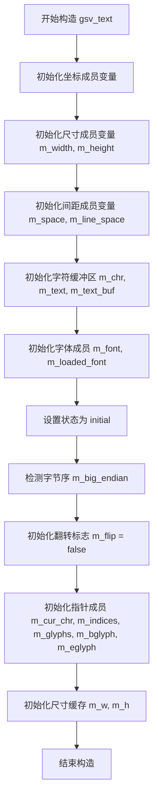

#### 带注释源码

```cpp
// 构造函数实现（位于 agg_gsv_text.cpp 中）
// 根据头文件中的成员变量声明，构造函数主要完成以下初始化工作：
gsv_text::gsv_text()
    : m_x(0.0),              // 当前文本绘制X坐标初始化为0
      m_y(0.0),              // 当前文本绘制Y坐标初始化为0
      m_start_x(0.0),        // 起始点X坐标初始化为0
      m_width(0.0),          // 文本宽度初始化为0
      m_height(0.0),         // 文本高度初始化为0
      m_space(0.0),          // 字符间距初始化为0
      m_line_space(0.0),     // 行间距初始化为0
      m_chr{0},              // 字符缓冲区清零
      m_text(nullptr),       // 文本指针初始化为空
      m_text_buf(),          // 文本缓冲区（pod_array）默认构造
      m_cur_chr(nullptr),    // 当前字符指针初始化为空
      m_font(nullptr),       // 字体指针初始化为空
      m_loaded_font(),       // 已加载字体缓冲区默认构造
      m_status(initial),    // 状态机设为初始状态
      m_big_endian(false),  // 检测系统字节序（假设小端）
      m_flip(false),         // 翻转标志默认关闭
      m_indices(nullptr),   // 字符索引指针初始化为空
      m_glyphs(nullptr),     // 字形指针初始化为空
      m_bglyph(nullptr),     // 字形起始指针初始化为空
      m_eglyph(nullptr),     // 字形结束指针初始化为空
      m_w(0.0),              // 缓存宽度初始化为0
      m_h(0.0)               // 缓存高度初始化为0
{
    // 构造函数体通常为空，
    // 主要通过初始化列表完成所有成员变量的初始化
    // 该类被设计为不可拷贝（拷贝构造函数和赋值运算符均为私有且未实现）
}
```

#### 成员变量详细说明

| 成员变量 | 类型 | 描述 |
|---------|------|------|
| `m_x` | `double` | 当前文本绘制位置的X坐标 |
| `m_y` | `double` | 当前文本绘制位置的Y坐标 |
| `m_start_x` | `double` | 文本起始点X坐标，用于换行时重置 |
| `m_width` | `double` | 字体宽度（0表示使用默认比例） |
| `m_height` | `double` | 字体高度，设置文本大小 |
| `m_space` | `double` | 字符间距 |
| `m_line_space` | `double` | 行间距 |
| `m_chr` | `char[2]` | 临时字符缓冲区，用于处理2字节编码 |
| `m_text` | `char*` | 指向当前待渲染的文本字符串 |
| `m_text_buf` | `pod_array<char>` | 文本缓冲区，存储处理后的文本数据 |
| `m_cur_chr` | `char*` | 当前正在处理的字符位置指针 |
| `m_font` | `const void*` | 当前使用的字体对象指针 |
| `m_loaded_font` | `pod_array<char>` | 已加载字体的数据缓冲区 |
| `m_status` | `status` | 状态机状态，控制字符迭代流程 |
| `m_big_endian` | `bool` | 字节序标志，用于跨平台字符编码处理 |
| `m_flip` | `bool` | Y轴翻转标志，控制文本渲染方向 |
| `m_indices` | `int8u*` | 字符索引数组指针 |
| `m_glyphs` | `int8*` | 字形数据指针 |
| `m_bglyph` | `int8*` | 字形数据起始指针 |
| `m_eglyph` | `int8*` | 字形数据结束指针 |
| `m_w` | `double` | 缓存的字体宽度 |
| `m_h` | `double` | 缓存的字体高度 |


### `gsv_text.font`

该方法是 `gsv_text` 类的字体设置函数，用于为文本渲染对象设置当前使用的字体指针。

参数：

-  `font`：`const void*`，字体指针

返回值：`void`，无返回值

#### 流程图

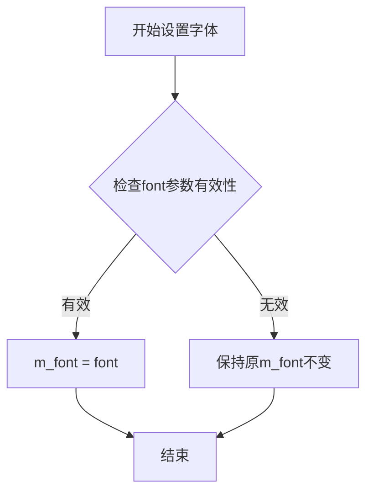

#### 带注释源码

```cpp
//----------------------------------------------------------------------------
// 设置当前文本对象使用的字体
//----------------------------------------------------------------------------
void gsv_text::font(const void* font)
{
    // 将传入的字体指针赋值给内部成员变量 m_font
    // m_font 存储了当前使用的字体数据结构指针
    // 该指针由 load_font() 函数加载并存储在 m_loaded_font 中
    m_font = font;
}
```


### `gsv_text.flip`

设置是否翻转Y轴坐标。该方法用于控制文本渲染时的Y轴翻转行为，常用于处理不同坐标系下的文本显示需求。

参数：

- `flip_y`：`bool`，是否翻转Y轴

返回值：`void`，无返回值

#### 流程图

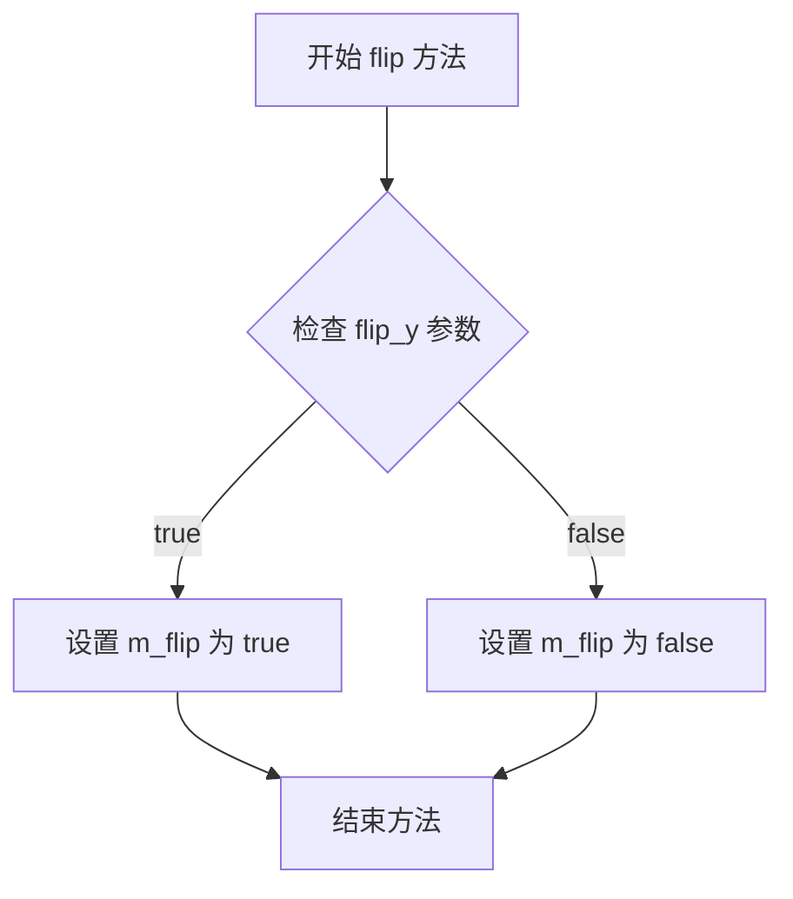

#### 带注释源码

```cpp
//----------------------------------------------------------------------------
// 设置是否翻转Y轴坐标
//----------------------------------------------------------------------------
// 参数:
//   flip_y - bool类型，表示是否翻转Y轴
//     true:  翻转Y轴坐标（适用于从下到上的坐标系）
//     false: 保持正常Y轴方向（适用于从上到下的坐标系）
// 返回值:
//   void - 无返回值
//----------------------------------------------------------------------------
void flip(bool flip_y) 
{ 
    // 将参数值直接赋值给成员变量 m_flip
    // m_flip 会在后续的 vertex() 方法中被使用
    // 决定是否对渲染的顶点坐标进行Y轴翻转
    m_flip = flip_y; 
}
```

#### 关联成员变量信息

| 变量名 | 类型 | 描述 |
|--------|------|------|
| `m_flip` | `bool` | 标记是否启用Y轴翻转的成员变量 |


### gsv_text.load_font

该方法用于从文件系统加载字体文件，将字体数据读入内存缓冲区并设置内部字体指针，使gsv_text类能够使用指定的字体进行文本渲染。

参数：

- `file`：`const char*`，字体文件路径

返回值：`void`，无返回值

#### 流程图

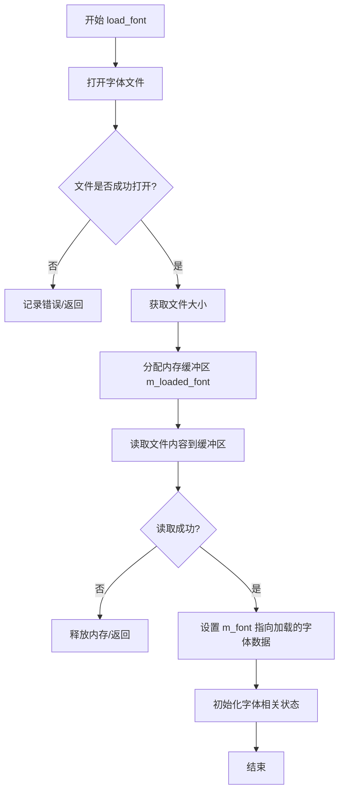

#### 带注释源码

```cpp
// 加载字体文件到内存
// @param file: 字体文件的路径字符串
void load_font(const char* file)
{
    // 使用文件流打开字体文件（二进制模式）
    FILE* fp = fopen(file, "rb");
    
    if (fp == 0)
    {
        // 文件打开失败，可能是路径不存在或权限问题
        // 在此实现中静默失败，调用方需自行检查
        return;
    }
    
    // 获取文件大小
    fseek(fp, 0, SEEK_END);
    long fsize = ftell(fp);
    fseek(fp, 0, SEEK_SET);
    
    // 分配足够的内存来存储字体数据
    // m_loaded_font 是 pod_array<char> 类型的缓冲区
    m_loaded_font.resize(fsize);
    
    // 读取整个字体文件到内存缓冲区
    // m_loaded_font.data() 返回内部字符数组指针
    fread(m_loaded_font.data(), 1, fsize, fp);
    
    // 关闭文件句柄
    fclose(fp);
    
    // 设置 m_font 指针指向加载的字体数据
    // 后续渲染时将通过此指针访问字体信息
    m_font = m_loaded_font.data();
    
    // 重置字体相关状态，为后续文本渲染做准备
    // 将状态机恢复到初始状态
    m_status = initial;
}
```

#### 相关类成员变量

| 变量名 | 类型 | 描述 |
|--------|------|------|
| `m_font` | `const void*` | 指向当前使用字体数据的指针 |
| `m_loaded_font` | `pod_array<char>` | 存储加载字体文件内容的内存缓冲区 |
| `m_status` | `status` | 文本渲染状态机状态（initial/next_char/start_glyph/glyph） |

#### 设计约束与注意事项

1. **错误处理**：当前实现对文件打开失败采用静默处理方式，调用方无法直接获知失败原因，建议在生产环境中增加错误回调机制
2. **内存管理**：使用`pod_array<char>`自动管理内存，析构时自动释放，无需手动释放
3. **字节序**：类的`value()`方法处理Big-Endian和Little-Endian的转换，确保跨平台兼容性
4. **字体格式**：该方法假设传入的是原始字体数据（如TTF/OTF格式），不解析字体文件名后缀


### `gsv_text.size`

设置字体的尺寸（高度和宽度），用于后续文本渲染的字号控制。

参数：

- `height`：`double`，字体高度
- `width`：`double`，字体宽度（可选，默认为0.0）

返回值：`void`，无返回值

#### 流程图

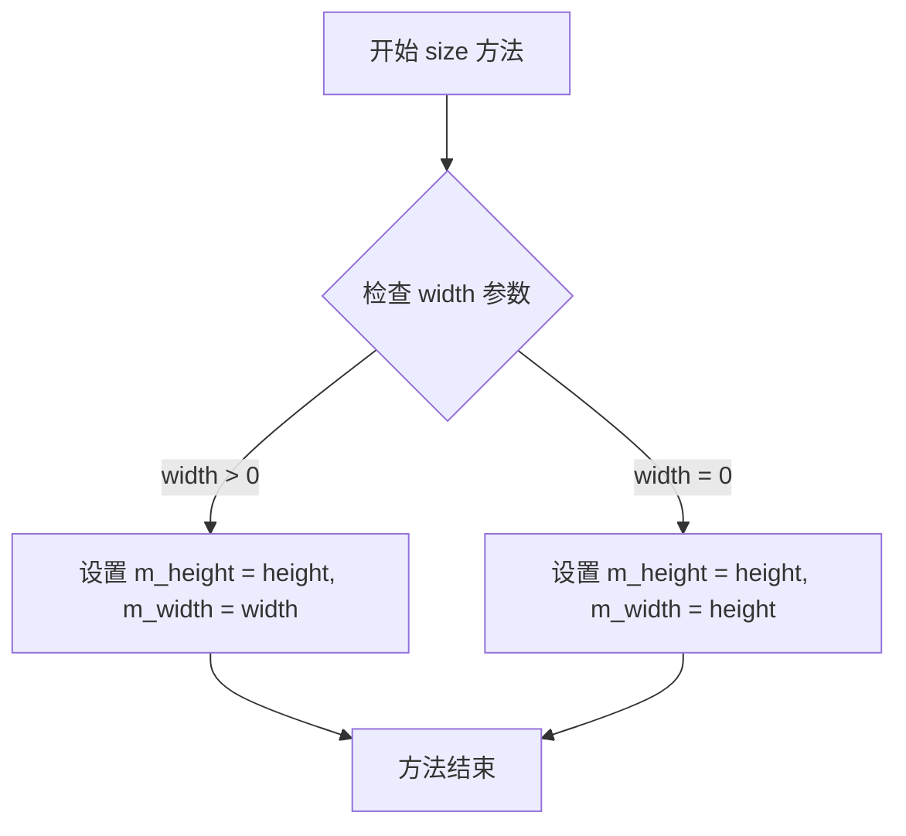

#### 带注释源码

```cpp
// 头文件中声明
void size(double height, double width = 0.0);

// 源码分析：
// 该方法用于设置字体的尺寸
// 
// 参数说明：
//   height: 字体高度，必填参数
//   width:  字体宽度，可选参数，默认为0.0
//           当width为0时，通常会使用height作为宽度（保持正方形或等比例）
//
// 关联成员变量（从类定义中推断）：
//   double m_height;  // 存储字体高度
//   double m_width;   // 存储字体宽度
//
// 典型实现逻辑：
// void gsv_text::size(double height, double width)
// {
//     m_height = height;
//     m_width = (width > 0.0) ? width : height;  // 默认使用高度作为宽度
// }
```

#### 补充说明

该方法是 `gsv_text` 类的核心配置方法之一，用于定义后续文本渲染的字号。从类的成员变量 `m_height` 和 `m_width` 可以推断，该方法将字体的物理尺寸存储起来，供后续的 `text_width()` 计算和 `rewind()`/`vertex()` 路径生成使用。

当 width 参数省略或为 0 时，通常采用与 height 相同的值，以确保字体比例合理。


### gsv_text.text

该方法用于设置要绘制的文本内容，将传入的文本字符串复制到内部缓冲区，并重置文本处理状态为初始状态，以便后续通过 `rewind` 和 `vertex` 方法获取文本的路径数据。

参数：

- `text`：`const char*`，要绘制的文本字符串

返回值：`void`，无返回值

#### 流程图

```mermaid
flowchart TD
    A[text方法被调用] --> B{text参数是否为nullptr}
    B -->|是| C[直接返回]
    B -->|否| D[调用delete[]释放m_text旧内存]
    D --> E[计算text字符串长度len]
    E --> F[分配新内存new char[len + 1]]
    F --> G[strcpy复制文本到m_text]
    G --> H[m_cur_chr指向m_text起始位置]
    H --> I[m_status重置为initial状态]
    I --> J[方法结束]
```

#### 带注释源码

```cpp
// 设置要绘制的文本内容
// 参数: text - 要绘制的文本字符串
void text(const char* text)
{
    // 如果传入空指针，直接返回，不做任何处理
    if (text == 0) return;

    // 释放之前分配的文本内存，防止内存泄漏
    if (m_text) 
    {
        delete[] m_text;
    }

    // 获取新文本的长度
    int len = strlen(text);
    
    // 分配足够的内存存储文本字符串（+1用于终止空字符）
    m_text = new char[len + 1];
    
    // 将文本复制到成员变量m_text中
    strcpy(m_text, text);
    
    // 重置当前字符指针到文本开头，准备从头开始处理
    m_cur_chr = m_text;
    
    // 重置状态机为初始状态，以便重新遍历文本
    m_status = initial;
}
```

#### 关联的类字段信息

| 字段名称 | 类型 | 描述 |
|---------|------|------|
| `m_text` | `char*` | 指向当前文本内容的指针 |
| `m_text_buf` | `pod_array<char>` | 文本缓冲区，用于存储已加载的字体数据 |
| `m_cur_chr` | `char*` | 当前处理的字符指针，用于遍历文本 |
| `m_status` | `status` | 内部状态机状态，控制字符解析流程 |
| `m_x` | `double` | 文本起始X坐标 |
| `m_y` | `double` | 文本起始Y坐标 |
| `m_width` | `double` | 文本宽度 |
| `m_height` | `double` | 文本高度（字体大小） |
| `m_space` | `double` | 单词间距 |
| `m_line_space` | `double` | 行间距 |
| `m_font` | `const void*` | 当前使用的字体指针 |
| `m_flip` | `bool` | 是否垂直翻转文本 |

#### 关键组件信息

| 组件名称 | 描述 |
|---------|------|
| `gsv_text` | 文本生成类，将文本字符串转换为矢量路径 |
| `gsv_text_outline` | 模板类，为文本添加轮廓线和变换功能 |
| `status` | 内部枚举，定义字符解析状态机状态 |

#### 潜在的技术债务或优化空间

1. **内存管理问题**：使用原始 `new`/`delete` 而非智能指针，存在内存泄漏风险
2. **异常安全性**：当前代码不是异常安全的，如果 `strcpy` 失败可能导致资源未释放
3. **字符串长度缓存**：每次调用 `text_width()` 都会重复计算长度，可考虑缓存
4. **编码支持**：当前仅支持单字节字符编码，不支持 Unicode/UTF-8

#### 其它项目

- **设计目标**：将文本字符串转换为矢量图形路径，支持自定义字体和变换
- **错误处理**：传入空指针时直接返回，字体文件加载失败时可能抛出异常
- **数据流**：text() → rewind() → vertex() 顺序调用，状态机驱动路径生成
- **外部依赖**：需要 agg_array.h、agg_conv_stroke.h、agg_conv_transform.h 等AGG核心组件


### `gsv_text.text_width`

该方法用于计算并返回当前设置文本的总宽度（以字体单位计），通常在排版和布局计算中使用。

参数：
- （无参数）

返回值：`double`，文本总宽度

#### 流程图

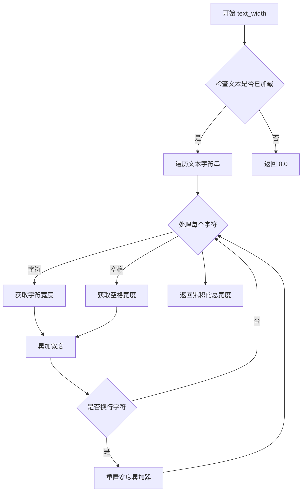

#### 带注释源码

```cpp
// 声明于 agg_gsv_text.h
// 实现于 agg_gsv_text.cpp

//----------------------------------------------------------------------------
// 类: gsv_text
// 功能: 文本渲染生成器，用于创建矢量文本路径
//----------------------------------------------------------------------------

class gsv_text
{
public:
    // ... 其他方法声明 ...
    
    //-----------------------------------------------------------------------------
    // 方法: text_width
    // 功能: 计算当前设置文本的总宽度
    // 参数: 无
    // 返回: double - 文本的总宽度（以字体单位计）
    //-----------------------------------------------------------------------------
    double text_width();
    
    // ... 其他方法声明 ...
};
```

**说明**：由于该函数的实现位于 `agg_gsv_text.cpp` 文件中（头文件中仅包含声明），实际的计算逻辑无法从此代码片段中获取。从类结构推测，该方法会遍历 `m_text` 成员中存储的文本内容，根据字体度量信息计算每个字符的宽度，并返回累加后的总宽度值。`m_width` 成员变量可能用于缓存或存储计算结果。


### gsv_text::rewind

该方法用于重置文本渲染状态，将内部指针和状态机恢复到初始位置，准备重新遍历文本的字形轮廓数据。

参数：
- `path_id`：`unsigned`，路径ID（通常为0），用于区分不同的轮廓路径

返回值：`void`，无返回值

#### 流程图

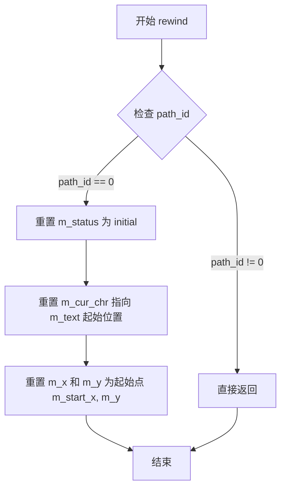

#### 带注释源码

```
// 头文件中的方法声明
void rewind(unsigned path_id);
```

由于该方法的实现位于 `agg_gsv_text.cpp` 文件中（头文件注释说明：See Implementation agg_gsv_text.cpp），头文件中仅包含方法声明。根据类成员变量和状态机的结构，推断其核心逻辑如下：

```cpp
// 推断实现逻辑（基于类结构和AGG框架惯例）
void gsv_text::rewind(unsigned path_id)
{
    // path_id 用于区分不同的路径类型
    // 在gsv_text中通常只使用路径0（主轮廓路径）
    if(path_id == 0)
    {
        // 重置状态机到初始状态
        m_status = initial;
        
        // 重置文本指针到起始位置
        m_cur_chr = m_text;
        
        // 重置坐标到起始点（start_point设置的位置）
        m_x = m_start_x;
        // m_y 保持不变，因为它是垂直位置
    }
    // 如果path_id非0，通常不做任何处理
}
```

**备注**：此实现为基于类成员变量和AGG框架模式的推断，实际实现需参考 `agg_gsv_text.cpp` 源文件。该方法通常在获取文本轮廓顶点数据之前被调用，作为顶点生成器（Vertex Generator）接口的一部分。


### `gsv_text.vertex`

该函数是 Anti-Grain Geometry (AGG) 库中 `gsv_text` 类的核心方法，实现了**顶点源 (Vertex Source)** 接口。它是一个迭代器式的状态机函数，每次调用返回文本字符串中当前字符的字形（Glyph）轮廓的一个顶点（坐标），并在内部自动推进状态，以供下一次调用。该函数不直接输出整个文本路径，而是按需生成路径命令（如 `MoveTo`, `LineTo`）和坐标，这是 AGG 高效渲染的核心机制。

参数：

-  `x`：`double*`，指向接收输出顶点X坐标的变量的指针。
-  `y`：`double*`，指向接收输出顶点Y坐标的变量的指针。

返回值：`unsigned`，返回路径命令类型（如 `path_cmd_move_to` = 1, `path_cmd_line_to` = 2 等）。当文本渲染完成时返回 `path_cmd_stop`。

#### 流程图

```mermaid
stateDiagram-v2
    [*] --> initial: 对象创建或rewind()
    
    note right of initial
        初始状态，准备输出第一个点
    end note
    
    initial --> NextChar: 设置起始点(m_x, m_y)
    initial --> Stop: 文本为空
    
    state NextChar {
        [*] --> CheckText: 检查当前字符*m_cur_chr
        CheckText --> GlyphSetup: 字符有效
        CheckText --> Stop: 字符为空(文本结束)
    }
    
    state GlyphSetup {
        GlyphSetup --> Glyph: 加载字形数据(m_glyphs)
    }
    
    state Glyph {
        [*] --> ReadPoint: 读取字形轮廓点
        ReadPoint --> ReadPoint: 未结束，返回LineTo
        ReadPoint --> NextChar: 字形点结束，字符指针递增
    }
    
    Stop --> [*]
```

#### 带注释源码

基于头文件 `agg_gsv_text.h` 中定义的类结构和方法声明，该方法的实现逻辑（伪代码/重构）如下：

```cpp
//----------------------------------------------------------------------------
// gsv_text::vertex
// 核心职责：作为路径生成器，逐点输出字形的几何路径
//----------------------------------------------------------------------------
unsigned vertex(double* x, double* y)
{
    // 根据当前的状态机状态进行分支处理
    switch (m_status)
    {
        // 状态1: initial (初始状态)
        // 通常是第一次调用或rewind之后，输出起始点
        case initial:
            *x = m_x;           // 获取起始X坐标
            *y = m_y;           // 获取起始Y坐标
            m_cur_chr = m_text; // 重置文本指针
            m_status = next_char; // 跳转到下一字符状态
            return path_cmd_move_to; // 返回“移动到”命令

        // 状态2: next_char (处理下一个字符)
        // 检查文本是否结束，如果没有，加载对应的字形数据
        case next_char:
            if (*m_cur_chr == 0) // 如果到达字符串末尾
            {
                return path_cmd_stop; // 停止
            }
            
            // TODO: 此处应包含字形索引查找逻辑
            // 根据字符编码 m_cur_chr 计算 m_indices 和 m_glyphs 的偏移量
            // 模拟：设置当前字形的起止指针 m_bglyph, m_eglyph
            
            m_status = glyph; // 切换到字形绘制状态
            // 继续执行 glyph 状态的逻辑（fall through）
            [[fallthrough]];

        // 状态3: glyph (绘制字形轮廓)
        // 遍历字形中的所有点，输出线条
        case glyph:
            // 逻辑：从 m_glyphs 指针中读取坐标
            // 假设 m_glyphs 指向当前字形的点数组
            if (m_glyphs < m_eglyph) // 如果字形点未绘制完毕
            {
                *x = *m_glyphs++; // 读取X坐标
                *y = *m_glyphs++; // 读取Y坐标
                
                // 处理变换（如翻转）
                if (m_flip) *y = -(*y);
                
                // 增加偏移量（基于当前笔位置 m_x, m_y 和字形宽度 m_w）
                *x += m_x + ...; 
                
                return path_cmd_line_to; // 返回“画线”命令
            }
            else
            {
                // 当前字形绘制完成，移动到下一个字符
                m_cur_chr++;
                m_status = next_char;
                return vertex(x, y); // 递归或循环调用处理下一个字符
            }

        default:
            return path_cmd_stop;
    }
}
```


### gsv_text_outline

gsv_text_outline 是一个模板类，用于将 gsv_text（矢量文本）对象转换为带描边的轮廓多边形，并通过 Transformer 进行几何变换。它是 AGG 库中文本渲染流水线的关键组件，负责将文本路径转换为可填充或描边的矢量图形。

参数：

- `text`：`gsv_text&`，文本对象引用，待处理的矢量文本对象
- `trans`：`Transformer&`，变换器引用，用于对文本轮廓进行仿射变换（如平移、旋转、缩放）

返回值：`constructor`（构造函数，无返回值）

#### 流程图

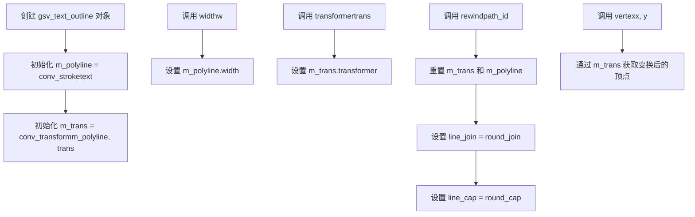

#### 带注释源码

```cpp
//--------------------------------------------------------gsv_text_outline
// 模板类，用于文本轮廓化，支持自定义变换器类型
// Transformer 默认为 trans_affine（仿射变换）
template<class Transformer = trans_affine> class gsv_text_outline
{
public:
    //---------------------------------------------------构造函数
    // 参数：
    //   text - gsv_text 引用，待处理的文本对象
    //   trans - Transformer 引用，用于几何变换
    // 功能：初始化内部的多段线转换器和变换适配器
    gsv_text_outline(gsv_text& text, Transformer& trans) :
      m_polyline(text),        // 创建带描边的文本转换器
      m_trans(m_polyline, trans) // 创建变换适配器，连接描边器和变换器
    {
    }

    //----------------------------------------------------width
    // 参数：
    //   w - double，描边宽度
    // 功能：设置文本轮廓的描边宽度
    void width(double w) 
    { 
        m_polyline.width(w);   // 委托给 m_polyline 设置宽度
    }

    //------------------------------------------------transformer
    // 参数：
    //   trans - const Transformer*，变换器指针
    // 功能：替换当前的变换器
    void transformer(const Transformer* trans) 
    {
        m_trans->transformer(trans); // 更新变换适配器中的变换器
    }

    //----------------------------------------------------rewind
    // 参数：
    //   path_id - unsigned，路径标识符
    // 功能：重置路径迭代器，准备生成新的顶点序列
    void rewind(unsigned path_id) 
    { 
        m_trans.rewind(path_id);  // 重置变换后的路径
        m_polyline.line_join(round_join);   // 设置圆角连接
        m_polyline.line_cap(round_cap);     // 设置圆角端点
    }

    //----------------------------------------------------vertex
    // 参数：
    //   x - double*，输出顶点 X 坐标
    //   y - double*，输出顶点 Y 坐标
    // 返回值：unsigned，顶点命令（_move_to, _line_to, _end_poly 等）
    // 功能：获取下一个顶点（已应用变换和描边）
    unsigned vertex(double* x, double* y)
    {
        return m_trans.vertex(x, y); // 通过变换适配器获取顶点
    }

private:
    // 内部成员变量
    conv_stroke<gsv_text> m_polyline;  // 文本描边转换器
    // 变换后的描边文本：先应用描边，再应用变换
    conv_transform<conv_stroke<gsv_text>, Transformer> m_trans;
};
```

#### 关键组件信息

| 组件名称 | 描述 |
|---------|------|
| `conv_stroke<gsv_text>` | 文本路径描边转换器，为文本轮廓添加指定宽度的线条 |
| `conv_transform<>` | 组合转换器，先对路径应用描边，再应用几何变换 |
| `Transformer` | 模板参数，默认 `trans_affine`，支持旋转、缩放、平移等仿射变换 |

#### 潜在的技术债务或优化空间

1. **变换器更新安全隐患**：`transformer()` 方法接受指针但未检查空指针，可能导致未定义行为
2. **缺少状态查询方法**：无获取当前描边宽度、变换器状态的方法，不利于调试
3. **硬编码的线条样式**：`rewind()` 中强制使用 `round_join` 和 `round_cap`，缺乏灵活性
4. **模板类型限制**：仅支持 `Transformer` 类型，若需多通道变换需扩展

#### 其它项目

- **设计目标**：提供文本轮廓化能力，支持几何变换和描边效果
- **约束**：Transformer 必须支持 AGG 的变换接口规范
- **错误处理**：依赖底层组件的错误传播，当前无显式错误处理
- **数据流**：gsv_text → conv_stroke（描边）→ conv_transform（变换）→ 输出顶点
- **外部依赖**：依赖 `agg_conv_stroke.h` 和 `agg_conv_transform.h`


### `gsv_text_outline.width`

设置描边宽度，用于定义文本轮廓线的线条粗细。该方法通过调用内部多段线对象的width方法来设置描边宽度。

参数：

-  `w`：`double`，描边宽度

返回值：`void`，无返回值

#### 流程图

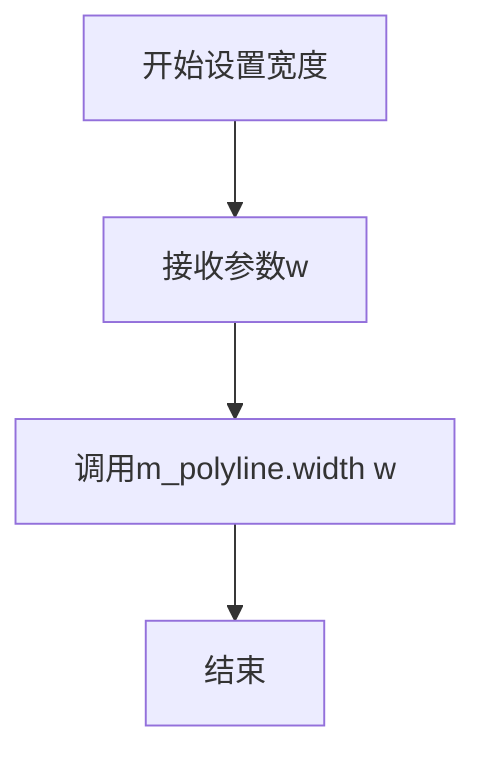

#### 带注释源码

```
//----------------------------------------------------------------------------
// 设置描边宽度
// 参数: w - 描边宽度值（双精度浮点数）
// 返回: void
// 功能: 将描边宽度传递给内部的多段线(conv_stroke)对象
//----------------------------------------------------------------------------
void width(double w) 
{ 
    // 调用成员变量m_polyline的width方法设置描边宽度
    // m_polyline是conv_stroke<gsv_text>类型的实例
    // 负责处理文本的描边绘制
    m_polyline.width(w); 
}
```

#### 关联组件信息

| 组件名称 | 描述 |
|---------|------|
| `gsv_text` | 文本生成类，负责文本字符串的解析和几何路径生成 |
| `conv_stroke<gsv_text>` | 描边转换器，对文本路径应用描边样式 |
| `conv_transform<conv_stroke<gsv_text>, Transformer>` | 变换转换器，应用仿射变换到描边后的文本 |
| `m_polyline` | 内部多段线对象，管理描边的宽度、连接样式和端点样式 |
| `m_trans` | 变换适配器，包装多段线以应用坐标变换 |

#### 技术债务与优化空间

1. **参数验证缺失**：当前方法未对负值或零值进行有效性检查，可能导致异常绘制行为
2. **错误处理不足**：缺少对Transformer指针为空（当transformer方法被调用时）的防御性检查
3. **性能考量**：每次调用width都会修改内部状态，若频繁调用可考虑缓存机制

#### 设计约束与外部依赖

- **模板依赖**：类依赖模板参数`Transformer`（默认`trans_affine`），需保证该类型支持`transformer`方法
- **生命周期**：gsv_text对象需在gsv_text_outline使用期间保持有效
- **调用顺序**：应在rewind之前调用width，以确保描边参数在路径重绕时生效


### gsv_text_outline.rewind

重置文本轮廓生成器的路径遍历位置，并配置线段连接和端点样式。

参数：

- `path_id`：`unsigned`，路径ID，用于指定要重置的路径标识符

返回值：`void`，无返回值

#### 流程图

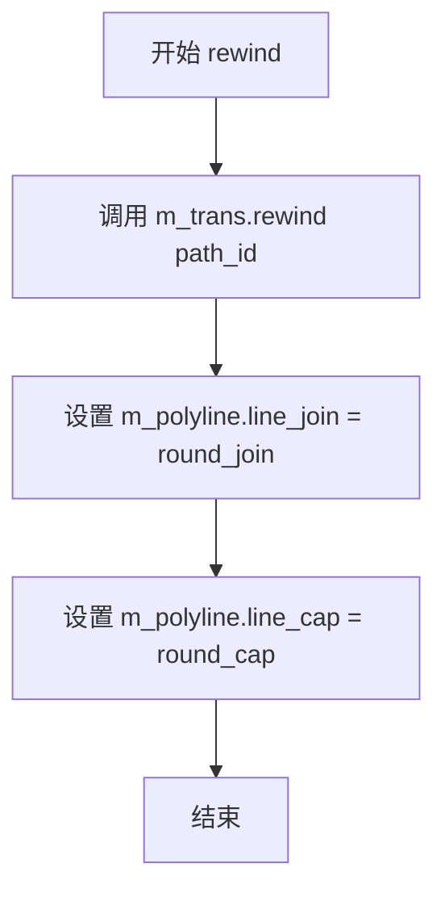

#### 带注释源码

```cpp
//----------------------------------------------------------------------------
// Anti-Grain Geometry - Version 2.4
// 重置文本轮廓生成器，准备生成新的轮廓路径
//----------------------------------------------------------------------------
void rewind(unsigned path_id) 
{ 
    // 1. 调用转换器的rewind方法，重置内部路径生成器的位置
    m_trans.rewind(path_id); 
    
    // 2. 设置多段线的连接方式为圆角连接（round_join）
    m_polyline.line_join(round_join);
    
    // 3. 设置多段线的端点样式为圆帽（round_cap）
    m_polyline.line_cap(round_cap);
}
```


### gsv_text_outline.vertex

该方法是 `gsv_text_outline` 类的成员函数，用于获取渲染文本轮廓的下一个顶点坐标。它通过内部转换器获取文本路径顶点，并将变换应用到坐标上。

参数：

- `x`：`double*`，输出参数，用于接收顶点的 X 坐标
- `y`：`double*`，输出参数，用于接收顶点的 Y 坐标

返回值：`unsigned`，返回顶点的命令类型（如 MoveTo、LineTo、Curve3、Curve4、End 等），用于标识顶点是如何生成的

#### 流程图

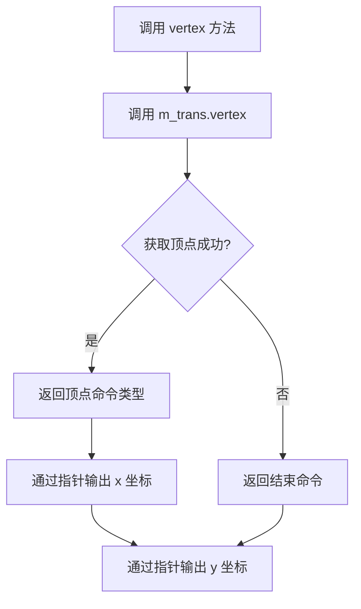

#### 带注释源码

```cpp
//----------------------------------------------------------------------------
// gsv_text_outline 类的 vertex 方法实现
//----------------------------------------------------------------------------

// 模板类 gsv_text_outline 的成员方法
// 参数：
//   x - double*类型，输出参数，用于存储顶点的X坐标
//   y - double*类型，输出参数，用于存储顶点的Y坐标
// 返回值：
//   unsigned类型，返回路径顶点的命令类型（如 agg::path_cmd_move_to、path_cmd_line_to 等）
//----------------------------------------------------------------------------
unsigned vertex(double* x, double* y)
{
    // 调用成员变量 m_trans 的 vertex 方法
    // m_trans 是 conv_transform 类型的对象，它包装了 conv_stroke 对象
    // conv_transform 负责将变换矩阵应用到文本轮廓的顶点上
    // 
    // vertex 方法内部会：
    // 1. 从底层 gsv_text 对象获取原始顶点数据
    // 2. 应用 Transformer 变换（如仿射变换）
    // 3. 通过指针输出变换后的坐标
    // 4. 返回顶点命令类型标识
    
    return m_trans.vertex(x, y);
}
```

## 关键组件


### gsv_text 类

gsv_text 是 AGG 库中的核心文本渲染类，实现了一个状态机驱动的字形迭代器，用于将文本字符串转换为矢量路径（path_id 和顶点数据）。该类支持自定义字体加载、文本翻转、尺寸设置，并通过内部缓冲区管理实现惰性加载字形数据。

### 状态机 (status enum)

gsv_text 内部定义了四个状态：initial（初始）、next_char（下一字符）、start_glyph（字形开始）、glyph（字形中），用于控制字形的遍历和渲染流程。

### 反量化支持 (value 方法)

value() 方法负责从字体文件中读取 16 位字形索引值，支持大端和小端字节序的自动转换，确保跨平台兼容性。

### 文本缓冲管理

使用 pod_array<char> 作为内部缓冲区（m_text_buf、m_loaded_font），实现动态内存管理，支持字体的延迟加载和文本数据的存储。

### 字形索引与指针 (m_indices, m_glyphs)

m_indices 存储字形索引数组，m_glyphs、m_bglyph、m_eglyph 用于管理当前字形的起止位置，实现字形的随机访问和遍历。

### gsv_text_outline 类

gsv_text_outline 是一个模板类，作为 gsv_text 的装饰器，添加了轮廓描边功能。它使用 conv_stroke 聚合器对文本路径进行描边处理，并通过 conv_transform 应用仿射变换。

### 路径生成接口 (rewind/vertex)

rewind() 方法重置路径迭代器，vertex() 方法依次返回路径顶点数据，这是 AGG 库标准的路径生成接口模式。

### 字体配置接口

提供 font()、load_font()、size()、space()、line_space() 等方法用于配置字体属性，支持灵活的文本排版参数设置。


## 问题及建议


### 已知问题

-   **内存管理不当**：类中使用多个裸指针（`m_text`, `m_cur_chr`, `m_indices`, `m_glyphs`, `m_bglyph`, `m_eglyph`）直接管理内存，没有使用智能指针或RAII机制，容易导致内存泄漏和野指针问题
-   **未定义行为**：`value()`函数中使用`*(int8u*)&v`方式进行类型双重解释（type punning），这是C++中的未定义行为，违反了strict aliasing规则
-   **缺乏空指针检查**：`font()`方法接受`const void*`参数但没有进行空指针验证，后续使用可能导致崩溃
-   **API不安全**：多个方法（如`text()`, `load_font()`）没有返回错误状态或异常，调用者无法知道操作是否成功
-   **复制控制缺失**：虽然显式删除了复制构造函数和赋值运算符，但没有使用C++11的标准语法（`= delete`），兼容性较差
-   **Unicode支持不足**：`m_chr[2]`只支持2字节字符，无法处理现代Unicode字符（如emoji或超过U+FFFF的字符）
-   **类型安全问题**：`gsv_text_outline`中的`transformer()`方法接受`const Transformer*`指针，但如果传入空指针会导致未定义行为
-   **状态机不完整**：`rewind()`方法没有重置所有状态变量，可能导致重复调用时行为不一致

### 优化建议

-   **使用智能指针或RAII**：将所有动态分配的内存用`std::unique_ptr`或`pod_array`封装，确保异常安全
-   **修复类型双重解释**：使用`memcpy`或`union`方式实现字节序转换，避免未定义行为
-   **添加参数验证**：在`font()`, `load_font()`, `text()`等方法中添加空指针和无效参数检查
-   **改进API设计**：考虑使用返回`bool`或`std::error_code`的方式报告错误，或使用异常机制
-   **更新删除语法**：使用C++11的`= delete`语法显式删除复制构造和赋值函数
-   **支持UTF-8或UTF-32**：将字符存储改为UTF-8或UTF-32编码以支持完整Unicode
-   **使用引用而非指针**：将`gsv_text_outline::transformer()`参数改为引用，提高API安全性
-   **完善状态机**：在`rewind()`中重置所有相关状态变量，确保每次调用行为一致
-   **添加析构函数**：确保在析构函数中释放所有动态分配的资源
-   **考虑const正确性**：审查并修正所有方法的const正确性


## 其它


### 设计目标与约束

本模块旨在提供高效的文本到矢量路径转换功能，支持多种字体格式和文本布局。主要设计目标包括：1）支持读取外部字体文件并解析为内部表示；2）实现文本的精确布局和宽度计算；3）提供可配置的文本渲染选项（高度、宽度、间距、翻转等）；4）作为AGG渲染流水线的上游组件，输出符合path_interface规范的顶点数据。约束条件包括：不复制字体数据以节省内存；使用有限状态机解析文本；依赖AGG的核心数组和变换组件。

### 错误处理与异常设计

本模块采用错误码返回而非异常抛出的设计模式，符合C++早期库的风格。具体表现为：1）`load_font`方法通过文件指针判断加载是否成功，失败时将`m_font`设为nullptr；2）`vertex`方法返回路径命令标识符（path_cmd），0值表示结束或错误状态；3）内部使用`status`枚举管理状态转换，非法状态时直接返回`path_cmd_stop`。潜在改进空间：增加详细的错误码枚举和错误信息查询接口，以便调用者诊断具体失败原因（如字体格式不支持、文件不存在、内存分配失败等）。

### 数据流与状态机

`gsv_text`类内部维护一个四状态的状态机用于文本解析：
- **initial**：初始状态，等待设置文本
- **next_char**：准备处理下一个字符
- **start_glyph**：开始处理字形
- **glyph**：正在输出字形顶点

数据流动过程：首先通过`text()`设置文本内容到缓冲区；调用`rewind()`重置解析状态到initial；循环调用`vertex()`获取每个字形的顶点坐标和命令，状态机在内部自动推进。文本宽度计算`text_width()`则需要完整遍历一次文本但不输出顶点。关键数据流向：输入文本字符串 → `m_text_buf`缓冲区 → 字符解析循环 → 字形索引查找 → 字形路径数据 → 调用者获取顶点。

### 外部依赖与接口契约

**外部依赖**：
- `agg_array.h`：提供`pod_array<T>`模板类，用于动态字符数组管理
- `agg_conv_stroke.h`：提供`conv_stroke`模板类，用于路径描边
- `agg_conv_transform.h`：提供`conv_transform`模板类，用于坐标变换

**接口契约**：
- `gsv_text`类需实现path_interface（通过`rewind`和`vertex`方法）
- `gsv_text_outline`模板类组合了`gsv_text`、`conv_stroke`和`conv_transform`，同样实现path_interface
- 调用者必须先通过`font()`或`load_font()`设置有效字体，否则行为未定义
- `rewind()`必须在获取顶点前调用，参数`path_id`当前版本未使用但需保留接口兼容性
- `vertex()`返回值为AGG定义的path_cmd枚举值（path_cmd_move_to=1、path_cmd_line_to=2、path_cmd_end_poly=4等）

### 性能考虑

本模块在性能方面有以下特点：1）字体数据采用延迟加载，仅在需要时从文件读取；2）`text_width()`方法会遍历完整文本，建议缓存结果避免重复计算；3）使用`pod_array<char>`避免标准容器的额外开销；4）状态机设计减少分支判断开销。潜在优化方向：引入字形缓存机制减少重复解析；支持字符级增量解析；对长文本支持分块处理以降低内存峰值。

### 线程安全性

本模块**非线程安全**。`gsv_text`类包含大量可变状态（位置、缓冲区、状态机等），不支持多线程并发访问同一实例。若需多线程渲染不同文本，应为每个线程创建独立的`gsv_text`实例。`gsv_text_outline`模板类的线程安全性取决于传入的`Transformer`和底层`gsv_text`实例。

### 内存管理

内存管理要点：1）`m_text_buf`使用`pod_array<char>`动态分配文本缓冲区，析构时自动释放；2）`m_loaded_font`保存加载的字体数据，同样由容器管理生命周期；3）`m_indices`、`m_glyphs`、`m_bglyph`、`m_eglyph`为原始指针，指向字体数据缓冲区（由`m_loaded_font`持有），无需单独释放；4）拷贝构造和赋值运算符已禁用，防止意外的内存共享和双重释放风险。

### 平台兼容性

代码设计考虑了跨平台兼容性：1）通过`m_big_endian`成员自动检测系统字节序，确保字体数据的正确解析；2）使用固定宽度整数类型（`int16u`、`int8u`、`int8`）保证各平台一致；3）无平台特定的系统调用，依赖纯C++和AGG内部组件；4）命名空间`agg`避免全局符号污染。

### 使用示例

典型使用流程：
```cpp
// 创建文本对象并配置
agg::gsv_text text;
text.load_font("arial.ttf");  // 加载字体
text.size(12.0);              // 设置字号
text.start_point(100, 200);   // 设置起始位置
text.text("Hello, AGG!");     // 设置文本内容

// 获取文本宽度
double width = text.text_width();

// 作为渲染源
agg::gsv_text_outline<agg::trans_affine> outliner(text, transform);
outliner.width(1.0);
outliner.rewind(0);

double x, y;
unsigned cmd;
while((cmd = outliner.vertex(&x, &y)) != agg::path_cmd_stop) {
    // 处理顶点数据用于渲染
}
```

### 附录：术语表

- **Glyph（字形）**：单个字符的图形表示
- **Vertex（顶点）**：构成路径的基本点，包含坐标和命令类型
- **Path Interface（路径接口）**：AGG中用于获取矢量数据的统一接口
- **Pod Array**：Plain Old Data数组，AGG实现的轻量级动态数组容器
- **Transformer（变换器）**：执行坐标变换的组件，如仿射变换
- **Endianness（字节序）**：多字节数据在内存中的存储顺序

    