# `matplotlib\extern\agg24-svn\include\agg_image_accessors.h` 详细设计文档

这是Anti-Grain Geometry (AGG) 2D图形库中的图像像素访问器头文件，提供了多种图像像素访问策略，支持不同的边界处理模式（裁剪、克隆、包装），用于在图形渲染过程中安全、高效地访问像素数据。

## 整体流程

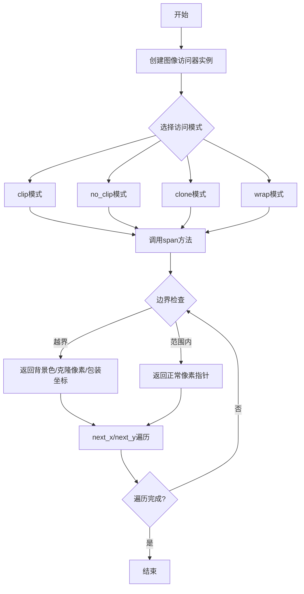

## 类结构

```
agg::image_accessor_clip<PixFmt> (模板类-裁剪访问器)
agg::image_accessor_no_clip<PixFmt> (模板类-无裁剪访问器)
agg::image_accessor_clone<PixFmt> (模板类-克隆访问器)
agg::image_accessor_wrap<PixFmt, WrapX, WrapY> (模板类-包装访问器)
agg::wrap_mode_repeat (重复包装模式)
agg::wrap_mode_repeat_pow2 (2幂次重复包装)
agg::wrap_mode_repeat_auto_pow2 (自动2幂次重复包装)
agg::wrap_mode_reflect (反射包装模式)
agg::wrap_mode_reflect_pow2 (2幂次反射包装)
agg::wrap_mode_reflect_auto_pow2 (自动2幂次反射包装)
```

## 全局变量及字段


### `image_accessor_clip.m_pixf`
    
指向像素格式对象的指针，用于访问图像数据

类型：`const pixfmt_type*`
    


### `image_accessor_clip.m_bk_buf`
    
背景色缓冲区，当访问超出图像边界时返回此默认颜色

类型：`int8u[pix_width]`
    


### `image_accessor_clip.m_x, m_x0, m_y`
    
当前像素坐标，m_x0用于记录span起始X位置

类型：`int`
    


### `image_accessor_clip.m_pix_ptr`
    
指向当前像素数据的指针，用于高效遍历

类型：`const int8u*`
    


### `image_accessor_no_clip.m_pixf`
    
指向像素格式对象的指针，用于访问图像数据

类型：`const pixfmt_type*`
    


### `image_accessor_no_clip.m_x, m_y`
    
当前像素坐标

类型：`int`
    


### `image_accessor_no_clip.m_pix_ptr`
    
指向当前像素数据的指针，用于高效遍历

类型：`const int8u*`
    


### `image_accessor_clone.m_pixf`
    
指向像素格式对象的指针，用于访问图像数据

类型：`const pixfmt_type*`
    


### `image_accessor_clone.m_x, m_x0, m_y`
    
当前像素坐标，m_x0用于记录span起始X位置

类型：`int`
    


### `image_accessor_clone.m_pix_ptr`
    
指向当前像素数据的指针，用于高效遍历

类型：`const int8u*`
    


### `image_accessor_wrap.m_pixf`
    
指向像素格式对象的指针，用于访问图像数据

类型：`const pixfmt_type*`
    


### `image_accessor_wrap.m_row_ptr`
    
指向当前行起始位置的指针

类型：`const int8u*`
    


### `image_accessor_wrap.m_x`
    
当前X坐标

类型：`int`
    


### `image_accessor_wrap.m_wrap_x`
    
X轴坐标包装策略，处理图像边缘的环绕逻辑

类型：`WrapX`
    


### `image_accessor_wrap.m_wrap_y`
    
Y轴坐标包装策略，处理图像边缘的环绕逻辑

类型：`WrapY`
    


### `wrap_mode_repeat.m_size`
    
图像尺寸，用于计算环绕范围

类型：`unsigned`
    


### `wrap_mode_repeat.m_add`
    
增量值，用于优化取模运算

类型：`unsigned`
    


### `wrap_mode_repeat.m_value`
    
当前坐标值

类型：`unsigned`
    


### `wrap_mode_repeat_pow2.m_mask`
    
位掩码，用于2的幂次方的快速取模

类型：`unsigned`
    


### `wrap_mode_repeat_pow2.m_value`
    
当前坐标值

类型：`unsigned`
    


### `wrap_mode_repeat_auto_pow2.m_size`
    
图像尺寸，用于计算环绕范围

类型：`unsigned`
    


### `wrap_mode_repeat_auto_pow2.m_add`
    
增量值，用于非2的幂次方的取模运算

类型：`unsigned`
    


### `wrap_mode_repeat_auto_pow2.m_mask`
    
位掩码，用于2的幂次方的快速取模

类型：`unsigned`
    


### `wrap_mode_repeat_auto_pow2.m_value`
    
当前坐标值

类型：`unsigned`
    


### `wrap_mode_reflect.m_size`
    
图像尺寸，用于计算反射范围

类型：`unsigned`
    


### `wrap_mode_reflect.m_size2`
    
2倍尺寸，用于反射算法计算

类型：`unsigned`
    


### `wrap_mode_reflect.m_add`
    
增量值，用于优化取模运算

类型：`unsigned`
    


### `wrap_mode_reflect.m_value`
    
当前坐标值

类型：`unsigned`
    


### `wrap_mode_reflect_pow2.m_size`
    
图像尺寸，用于计算反射范围

类型：`unsigned`
    


### `wrap_mode_reflect_pow2.m_mask`
    
位掩码，用于2的幂次方的快速取模和反射

类型：`unsigned`
    


### `wrap_mode_reflect_pow2.m_value`
    
当前坐标值

类型：`unsigned`
    


### `wrap_mode_reflect_auto_pow2.m_size`
    
图像尺寸，用于计算反射范围

类型：`unsigned`
    


### `wrap_mode_reflect_auto_pow2.m_size2`
    
2倍尺寸，用于反射算法计算

类型：`unsigned`
    


### `wrap_mode_reflect_auto_pow2.m_add`
    
增量值，用于非2的幂次方的取模运算

类型：`unsigned`
    


### `wrap_mode_reflect_auto_pow2.m_mask`
    
位掩码，用于2的幂次方的快速取模和反射

类型：`unsigned`
    


### `wrap_mode_reflect_auto_pow2.m_value`
    
当前坐标值

类型：`unsigned`
    
    

## 全局函数及方法


### `image_accessor_clip.image_accessor_clip`

这是 `image_accessor_clip` 类的默认构造函数，用于构造一个不带任何参数的对象实例，将内部指针初始化为空，背景缓冲区保持未初始化状态。

参数：无

返回值：无（构造函数）

#### 流程图

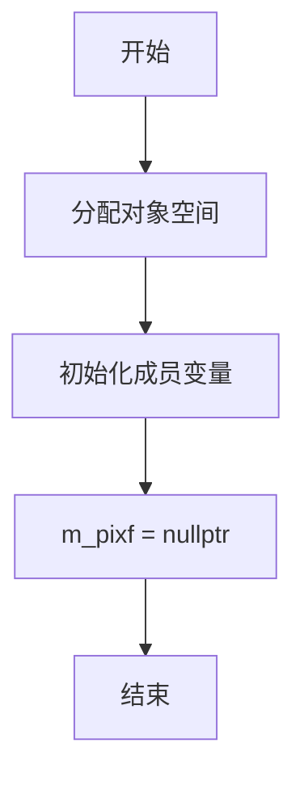

#### 带注释源码

```cpp
// 默认构造函数
// 功能：创建一个image_accessor_clip对象，初始状态下不关联任何像素格式
//       所有成员变量被初始化为其类型的默认值
image_accessor_clip() {}
// 备注：
// - m_pixf 指针将被默认初始化为 nullptr
// - m_bk_buf 数组内容未定义（只有在调用background_color或带参数构造函数时才会被填充）
// - m_x, m_x0, m_y 整型变量被默认初始化为未定义值
// - m_pix_ptr 指针被默认初始化为 nullptr
```


### `image_accessor_clip.image_accessor_clip`

带像素格式和背景色的构造函数，用于初始化图像访问器，并设置超出图像边界时使用的背景颜色。

参数：

- `pixf`：`pixfmt_type&`，像素格式对象的引用，用于访问图像像素数据
- `bk`：`const color_type&`，背景颜色的常量引用，当访问超出图像边界时返回该颜色

返回值：`无`（构造函数无返回值）

#### 流程图

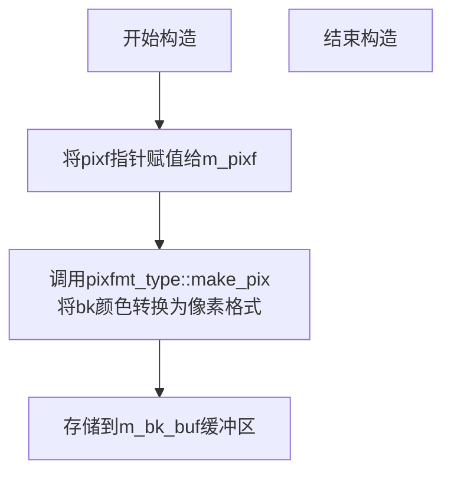

#### 带注释源码

```cpp
/// @brief 带像素格式和背景色的构造函数
/// @param pixf 像素格式对象引用，用于访问图像像素
/// @param bk 背景颜色，当访问超出图像边界时返回此颜色
explicit image_accessor_clip(pixfmt_type& pixf, 
                             const color_type& bk) : 
    m_pixf(&pixf)  // 将传入的像素格式对象指针保存到成员变量
{
    // 使用像素格式的make_pix函数将背景颜色转换为
    // 像素格式并存储到背景缓冲区m_bk_buf中
    pixfmt_type::make_pix(m_bk_buf, bk);
}
```


### `image_accessor_clip.attach`

该方法用于将像素格式对象附加到图像访问器，使其能够访问底层像素数据。

参数：

- `pixf`：`pixfmt_type&`，待附加的像素格式对象引用

返回值：`void`，无返回值

#### 流程图

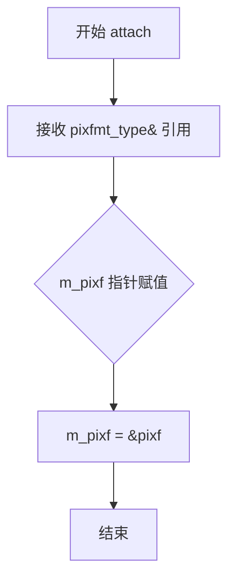

#### 带注释源码

```cpp
//----------------------------------------------------------------------------
// image_accessor_clip::attach - 附加像素格式
//----------------------------------------------------------------------------
// 参数:
//   pixfmt_type& pixf - 待附加的像素格式对象引用
// 返回值:
//   void - 无返回值
// 功能:
//   将传入的 pixfmt_type 对象地址赋值给成员指针 m_pixf
//   使得该访问器能够操作底层像素数据
//----------------------------------------------------------------------------
void attach(pixfmt_type& pixf)
{
    // 将像素格式对象的地址赋值给成员指针
    // 此后可以通过 m_pixf 访问底层像素数据
    m_pixf = &pixf;
}
```


### `image_accessor_clip.background_color`

设置图像访问器的背景色，用于在像素坐标超出图像范围时返回默认的背景颜色。

参数：

- `bk`：`const color_type&`，背景色引用，指定超出图像范围时使用的填充颜色

返回值：`void`，无返回值

#### 流程图

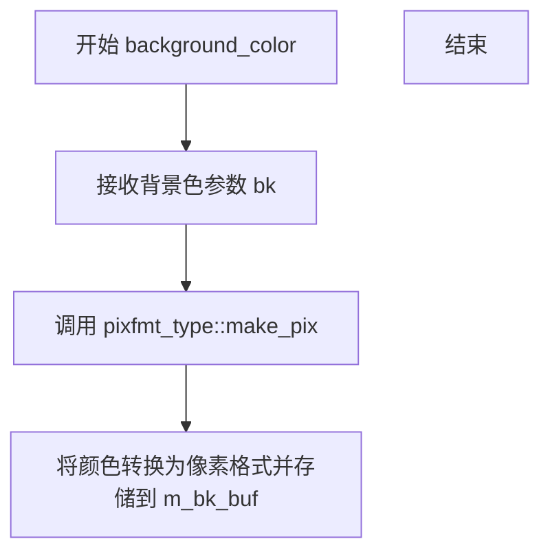

#### 带注释源码

```cpp
// 设置背景色方法
// 参数: bk - 背景色的颜色值（常量引用）
// 返回值: void（无返回值）
void background_color(const color_type& bk)
{
    // 使用像素格式的make_pix函数将颜色类型转换为
    // 像素数据并存储到背景缓冲区 m_bk_buf 中
    // 这样在访问超出图像范围的像素时，会返回此背景色
    pixfmt_type::make_pix(m_bk_buf, bk);
}
```

#### 所属类概述

**类名**: `image_accessor_clip`

**类功能**: 模板类，用于在图像渲染时提供像素访问功能，支持边界裁剪处理。当访问的像素坐标超出图像范围时，自动返回预设的背景色。

**关键成员变量**:

- `m_pixf`：指向像素格式对象的指针
- `m_bk_buf`：背景色像素缓冲区
- `m_x, m_x0, m_y`：当前像素坐标
- `m_pix_ptr`：当前像素数据指针


### `image_accessor_clip.pixel`

获取单个像素的私有方法，用于在图像坐标越界时返回背景颜色缓冲区指针。

参数：无（成员方法，通过 `m_x`、`m_y` 隐含获取坐标）

返回值：`const int8u*`，返回像素数据指针——若坐标在图像有效范围内则返回实际像素指针，否则返回背景颜色缓冲区指针

#### 流程图

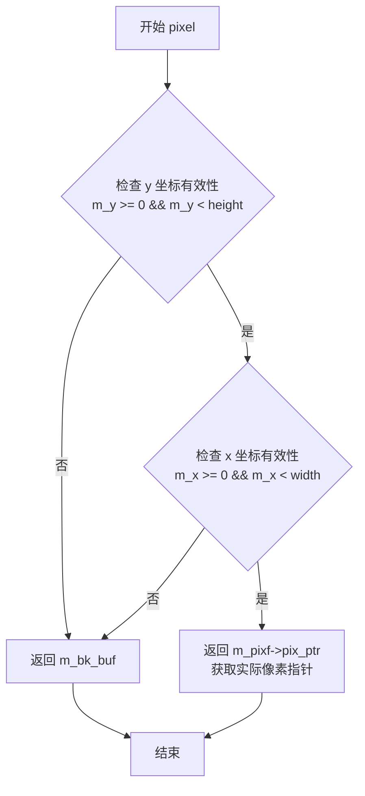

#### 带注释源码

```cpp
// 私有方法：通过类成员变量 m_x, m_y 获取像素指针
// 若坐标越界则返回背景颜色缓冲区，避免访问违规内存
AGG_INLINE const int8u* pixel() const
{
    // 检查坐标 (m_x, m_y) 是否在图像有效范围内
    if(m_y >= 0 && m_y < (int)m_pixf->height() &&
       m_x >= 0 && m_x < (int)m_pixf->width())
    {
        // 坐标有效，返回实际像素数据指针
        return m_pixf->pix_ptr(m_x, m_y);
    }
    // 坐标越界，返回预设的背景颜色缓冲区指针
    return m_bk_buf;
}
```


### `image_accessor_clip.span`

该函数是 `image_accessor_clip` 类模板的成员方法，用于获取图像中指定坐标开始的像素行（span）。函数首先检查请求的像素范围是否在图像边界内：如果在范围内，则直接返回指向实际像素数据的指针；如果超出边界，则返回指向背景颜色缓冲区的指针，实现图像边缘的剪裁功能。

参数：

- `x`：`int`，像素行的起始 X 坐标（列索引）
- `y`：`int`，像素行的 Y 坐标（行索引）
- `len`：`unsigned`，像素行的长度（像素数量）

返回值：`const int8u*`，返回指向像素数据的常量指针。如果请求的像素范围完全在图像内部，返回指向实际图像像素的指针；否则返回指向背景颜色缓冲区的指针。

#### 流程图

```mermaid
flowchart TD
    A[开始 span] --> B[设置 m_x = m_x0 = x, m_y = y]
    B --> C{检查边界条件:<br/>y >= 0 && y < height &&<br/>x >= 0 && x + len <= width?}
    C -->|是| D[返回 m_pixf->pix_ptr(x, y) 指针]
    C -->|否| E[设置 m_pix_ptr = 0]
    E --> F[调用 pixel() 方法]
    F --> G{检查坐标是否在图像范围内:<br/>m_y >= 0 && m_y < height &&<br/>m_x >= 0 && m_x < width}
    G -->|是| H[返回 m_bk_buf 背景色缓冲区]
    G -->|否| H
    D --> I[结束]
    H --> I
```

#### 带注释源码

```cpp
AGG_INLINE const int8u* span(int x, int y, unsigned len)
{
    // 保存起始坐标到成员变量，供后续 next_x/next_y 使用
    m_x = m_x0 = x;
    m_y = y;
    
    // 边界检查：确保整个像素行都在图像有效范围内
    if(y >= 0 && y < (int)m_pixf->height() &&    // Y 坐标在垂直范围内
       x >= 0 && x+(int)len <= (int)m_pixf->width())  // X 坐标 + 长度在水平范围内
    {
        // 如果完全在范围内，直接返回指向该行像素的指针
        return m_pix_ptr = m_pixf->pix_ptr(x, y);
    }
    
    // 超出边界：标记当前像素指针无效
    m_pix_ptr = 0;
    
    // 调用 pixel() 方法处理边界情况，返回背景色或边界像素
    return pixel();
}
```


### `image_accessor_clip.next_x()`

该方法是 `image_accessor_clip` 类的成员函数，用于在扫描线渲染过程中移动到下一个X像素位置。当当前像素指针有效时，直接向后移动一个像素的宽度；当指针无效（超出图像边界）时，增加X坐标并返回边界处理后的像素数据（背景色）。

参数：无

返回值：`const int8u*`，返回指向下一个像素数据的指针，如果超出边界则返回背景色缓冲区指针

#### 流程图

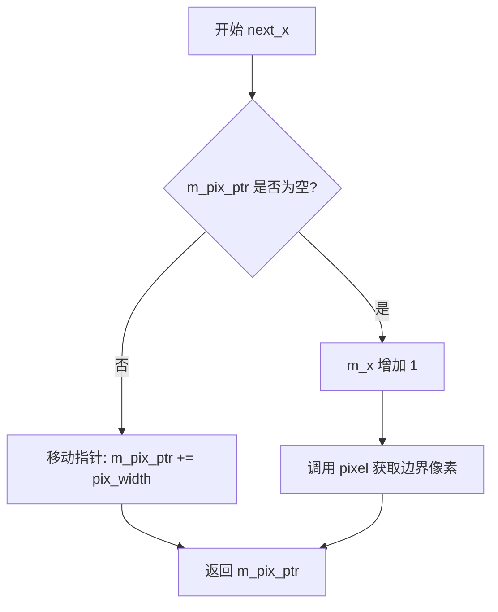

#### 带注释源码

```
        // 在扫描线渲染时，移动到下一个X像素位置
        AGG_INLINE const int8u* next_x()
        {
            // 如果当前像素指针有效（位于图像范围内）
            if(m_pix_ptr) 
                // 直接向后移动一个像素的宽度，返回移动后的指针
                return m_pix_ptr += pix_width;
            
            // 否则（当前像素指针无效，已超出图像边界）
            // 增加X坐标
            ++m_x;
            
            // 调用pixel()方法进行边界处理，返回背景色或边界像素
            return pixel();
        }
```


### `image_accessor_clip.next_y()`

该方法用于在图像像素访问过程中移动到下一个Y像素行。它递增内部Y坐标，重置X坐标到当前扫描行的起始位置，然后返回指向新像素位置的指针。如果新位置超出图像边界，则返回背景颜色缓冲区。

参数：

- （无显式参数，但使用类成员变量：`m_y` 当前Y坐标，`m_x0` 当前扫描行起始X坐标）

返回值：`const int8u*`，返回指向下一个Y行像素数据的指针，若超出边界则返回背景缓冲区指针

#### 流程图

```mermaid
flowchart TD
    A[开始 next_y] --> B[++m_y: Y坐标加1]
    B --> C[m_x = m_x0: 重置X坐标]
    C --> D{m_pix_ptr非空 且<br/>m_y在有效范围内?}
    D -->|是| E[m_pix_ptr = m_pixf->pix_ptr<br/>(m_x, m_y)]
    E --> F[返回 m_pix_ptr]
    D -->|否| G[m_pix_ptr = 0]
    G --> H[返回 pixel()]
    H --> I{边界检查}
    I -->|在范围内| J[返回像素指针]
    I -->|超出范围| K[返回背景缓冲区]
    F --> L[结束]
    J --> L
    K --> L
```

#### 带注释源码

```
//----------------------------------------------------------------------------
// Anti-Grain Geometry - Version 2.4
//----------------------------------------------------------------------------

// image_accessor_clip::next_y - 移动到下一个Y像素行
//
// 功能说明:
//   此方法在渲染扫描线时由渲染器调用，用于获取下一行像素数据。
//   它管理Y坐标的递增、边界检查，并返回正确的像素指针。
//
// 工作原理:
//   1. 递增Y坐标 m_y
//   2. 重置X坐标到扫描行起始位置 m_x0
//   3. 检查当前位置是否有效（在图像范围内且之前有过有效像素）
//   4. 若有效则直接计算新像素位置并返回
//   5. 若无效则调用pixel()进行边界检查并返回背景或像素指针
//
// 使用场景:
//   - 图像渲染器遍历图像像素时
//   - 需要处理边缘情况的图像采样
//----------------------------------------------------------------------------

AGG_INLINE const int8u* next_y()
{
    // 步骤1: 递增Y坐标，移动到下一行
    ++m_y;
    
    // 步骤2: 重置X坐标到当前扫描行的起始位置
    // m_x0 保存了当前span起始的X坐标
    m_x = m_x0;
    
    // 步骤3: 检查当前位置是否有效
    // 条件说明:
    //   - m_pix_ptr 非空: 表示之前已经成功获取过像素指针
    //   - m_y >= 0: Y坐标在图像顶部边界之内
    //   - m_y < m_pixf->height(): Y坐标在图像底部边界之内
    if(m_pix_ptr && 
       m_y >= 0 && m_y < (int)m_pixf->height())
    {
        // 步骤3a: 有效位置，直接计算新像素指针并返回
        // 使用pix_ptr获取指定坐标的像素数据起始位置
        return m_pix_ptr = m_pixf->pix_ptr(m_x, m_y);
    }
    
    // 步骤4: 位置无效（超出边界），清除像素指针
    m_pix_ptr = 0;
    
    // 步骤5: 调用pixel()进行完整的边界检查
    // pixel()会检查X和Y坐标，返回:
    //   - 边界内的像素指针
    //   - 边界外的背景颜色缓冲区
    return pixel();
}
```


### `image_accessor_no_clip.image_accessor_no_clip()`

该函数是 `image_accessor_no_clip` 类的默认构造函数，用于构造一个不进行边界裁剪的图像像素访问器对象。默认构造函数不接收任何参数，也不初始化任何成员变量，调用者需要在后续通过 `attach()` 方法或带参数的构造函数来关联具体的像素格式对象。

参数：空（无参数）

返回值：空（无返回值，构造函数）

#### 流程图

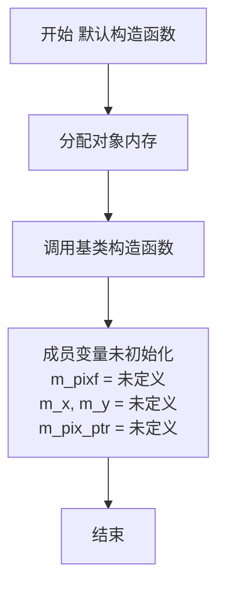

#### 带注释源码

```cpp
//--------------------------------------------------image_accessor_no_clip
template<class PixFmt> class image_accessor_no_clip
{
public:
    // 类型别名定义 - 用于获取像素格式的相关类型信息
    typedef PixFmt   pixfmt_type;
    typedef typename pixfmt_type::color_type color_type;   // 颜色类型
    typedef typename pixfmt_type::order_type order_type;    // 通道顺序类型
    typedef typename pixfmt_type::value_type value_type;    // 像素值类型
    
    // 枚举 - 像素宽度（字节数）
    enum pix_width_e { pix_width = pixfmt_type::pix_width };

    //======================================== 默认构造函数
    // 功能：构造一个空的图像访问器，不初始化任何成员
    // 注意：使用此对象前必须通过attach()或带参构造函数关联pixfmt
    image_accessor_no_clip() {}  
    
    //======================================== 带参构造函数
    // 参数：pixf - 像素格式对象引用
    // 功能：构造并关联像素格式对象
    explicit image_accessor_no_clip(pixfmt_type& pixf) : 
        m_pixf(&pixf) 
    {}

    //======================================== 关联像素格式对象
    // 参数：pixf - 像素格式对象引用
    // 功能：将访问器与具体的像素格式对象关联
    void attach(pixfmt_type& pixf)
    {
        m_pixf = &pixf;
    }

    //======================================== 获取像素行指针
    // 参数：
    //   x - 起始X坐标
    //   y - Y坐标
    //   len - 像素行长度（本实现中未使用）
    // 返回值：指向像素行的指针
    // 注意：不进行任何边界检查，调用者需确保坐标有效
    AGG_INLINE const int8u* span(int x, int y, unsigned)
    {
        m_x = x;
        m_y = y;
        return m_pix_ptr = m_pixf->pix_ptr(x, y);
    }

    //======================================== 移动到下一个像素（X方向）
    // 返回值：指向下一个像素的指针
    // 注意：不检查是否超出图像边界
    AGG_INLINE const int8u* next_x()
    {
        return m_pix_ptr += pix_width;
    }

    //======================================== 移动到下一行像素（Y方向）
    // 返回值：指向下一行像素的指针
    // 注意：不检查是否超出图像边界
    AGG_INLINE const int8u* next_y()
    {
        ++m_y;
        return m_pix_ptr = m_pixf->pix_ptr(m_x, m_y);
    }

private:
    const pixfmt_type* m_pixf;    // 指向像素格式对象的指针
    int                m_x, m_y;  // 当前像素坐标
    const int8u*       m_pix_ptr; // 当前像素数据指针
};
```


### `image_accessor_no_clip.image_accessor_no_clip`

这是一个模板类 `image_accessor_no_clip` 的显式构造函数，用于初始化图像访问器并关联一个像素格式对象。该类提供了无需边界检查的像素访问功能，适用于图像处理场景中需要快速访问像素数据的场合。

参数：

- `pixfmt_type& pixf`：`pixfmt_type`（模板类型），对像素格式对象的引用，用于提供底层图像像素数据的访问接口

返回值：无返回值（构造函数）

#### 流程图

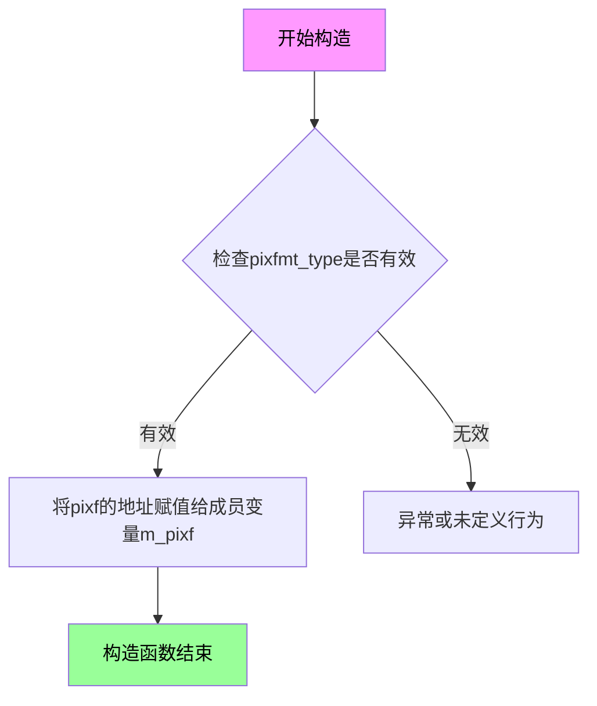

#### 带注释源码

```cpp
// image_accessor_no_clip 类的显式构造函数
// 参数：pixf - 对像素格式对象的引用，用于后续像素数据的读取
explicit image_accessor_no_clip(pixfmt_type& pixf) : 
    m_pixf(&pixf)    // 将传入的像素格式对象的地址存储到成员指针变量中
{}

// 完整类定义上下文（供参考）
/*
template<class PixFmt> class image_accessor_no_clip
{
public:
    typedef PixFmt   pixfmt_type;
    typedef typename pixfmt_type::color_type color_type;
    typedef typename pixfmt_type::order_type order_type;
    typedef typename pixfmt_type::value_type value_type;
    enum pix_width_e { pix_width = pixfmt_type::pix_width };

    // 默认构造函数
    image_accessor_no_clip() {}
    
    // 显式构造函数 - 题目要求分析的函数
    explicit image_accessor_no_clip(pixfmt_type& pixf) : 
        m_pixf(&pixf) 
    {}

    // 附加方法：attach 用于重新关联像素格式对象
    void attach(pixfmt_type& pixf)
    {
        m_pixf = &pixf;
    }

    // 成员变量
private:
    const pixfmt_type* m_pixf;    // 指向像素格式对象的指针
    int                m_x, m_y; // 当前访问的像素坐标
    const int8u*       m_pix_ptr;// 指向当前像素行的指针
};
*/
```


### `image_accessor_no_clip.attach`

该方法用于将像素格式（pixfmt_type）对象附加到图像访问器中，以便后续的图像像素读取操作能够访问底层图像数据。

参数：

-  `pixf`：`pixfmt_type&`，像素格式对象的引用，用于指定要访问的图像数据源

返回值：`void`，无返回值

#### 流程图

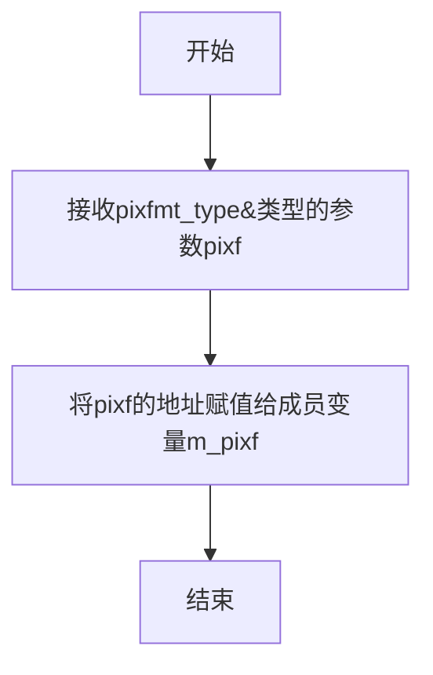

#### 带注释源码

```cpp
// 类模板 image_accessor_no_clip 的成员方法 attach
// 功能：将像素格式对象附加到当前图像访问器
// 参数：pixf - pixfmt_type&，像素格式对象的引用
// 返回值：void，无返回值
void attach(pixfmt_type& pixf)
{
    // 将传入的像素格式对象的地址赋值给成员指针 m_pixf
    // 这样后续的 span()、next_x()、next_y() 等方法就能通过 m_pixf 访问图像数据
    m_pixf = &pixf;
}
```


### `image_accessor_no_clip.span`

获取指定位置的像素行指针（无裁剪模式）

参数：

- `x`：`int`，要获取的像素行的起始X坐标
- `y`：`int`，像素行的Y坐标
- `unsigned`：（未命名参数），像素行长度（在该实现中未使用）

返回值：`const int8u*`，返回指向像素数据的指针

#### 流程图

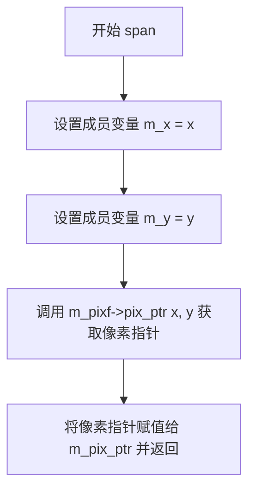

#### 带注释源码

```
AGG_INLINE const int8u* span(int x, int y, unsigned)
{
    // 将传入的x坐标保存到成员变量m_x中，用于后续的next_y操作
    m_x = x;
    
    // 将传入的y坐标保存到成员变量m_y中
    m_y = y;
    
    // 直接调用pixfmt的pix_ptr方法获取指定坐标的像素指针，
    // 不进行任何边界检查（无裁剪模式），然后将其保存到m_pix_ptr并返回
    return m_pix_ptr = m_pixf->pix_ptr(x, y);
}
```


### `image_accessor_no_clip.next_x()`

该函数用于在图像像素行内移动到下一个X像素位置，通过直接增加像素指针来实现高效的像素遍历。

参数：无

返回值：`const int8u*`，返回移动后的当前像素指针，指向行中的下一个像素位置

#### 流程图

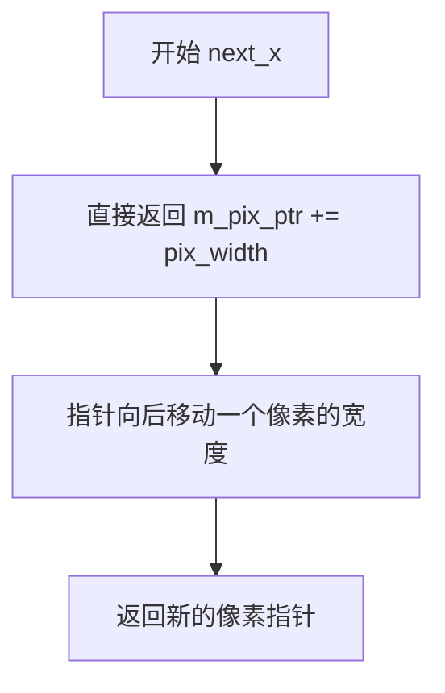

#### 带注释源码

```
// image_accessor_no_clip 类中的 next_x 方法
// 位置：agg_image_accessors.h 文件中 image_accessor_no_clip 类的成员方法

// 方法原型：
// AGG_INLINE const int8u* next_x()
// 参数：无
// 返回值：const int8u* - 移动后的像素指针

AGG_INLINE const int8u* next_x()
{
    // 核心逻辑：将当前像素指针 m_pix_ptr 增加一个像素的宽度（pix_width）
    // 这是一个直接指针算术操作，用于在像素行内快速移动到下一个像素位置
    // 不进行任何边界检查（这是与 image_accessor_clip 的主要区别）
    // 
    // m_pix_ptr: 指向当前像素的指针
    // pix_width: 像素格式的宽度（以字节为单位），由模板参数 PixFmt 决定
    // 
    // 返回值：更新后的 m_pix_ptr 指针，指向行中的下一个像素
    
    return m_pix_ptr += pix_width;
}
```


### `image_accessor_no_clip.next_y`

该方法用于在图像像素访问过程中移动到下一个Y坐标行，通过递增m_y坐标并重新计算像素指针来获取新行的像素数据。

参数：

- （无显式参数）

返回值：`const int8u*`，返回指向新Y坐标位置像素数据的指针

#### 流程图

```mermaid
flowchart TD
    A[开始 next_y] --> B[递增 m_y: m_y++]
    B --> C[计算新像素指针: m_pixf->pix_ptr(m_x, m_y)]
    C --> D[赋值给 m_pix_ptr]
    E[返回 m_pix_ptr] --> F[结束]
    D --> E
```

#### 带注释源码

```cpp
// image_accessor_no_clip 类中的 next_y 方法
// 功能：移动到图像的下一行（下一个Y像素）
// 参数：无
// 返回值：const int8u* - 指向新行像素数据的指针

AGG_INLINE const int8u* next_y()
{
    // 步骤1：递增Y坐标，移动到下一行
    ++m_y;
    
    // 步骤2：使用更新后的m_x和m_y坐标，
    //        通过pixfmt获取新行像素数据的起始指针
    // 步骤3：将新指针赋值给成员变量m_pix_ptr并返回
    return m_pix_ptr = m_pixf->pix_ptr(m_x, m_y);
}
```


### image_accessor_clone.image_accessor_clone

这是 `image_accessor_clone` 类的默认构造函数，用于创建一个不关联任何像素格式的图像访问器对象。该构造函数是模板类的一部分，不接受任何参数，返回类型为 `image_accessor_clone` 类型本身（隐式返回）。

参数：无

返回值：`image_accessor_clone<PixFmt>`，返回新创建的图像访问器对象实例

#### 流程图

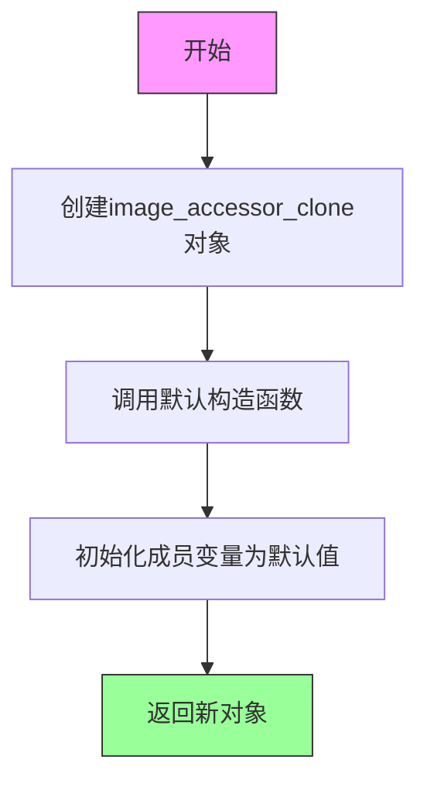

#### 带注释源码

```cpp
//----------------------------------------------------image_accessor_clone
template<class PixFmt> class image_accessor_clone
{
public:
    // 类型别名定义
    typedef PixFmt   pixfmt_type;
    typedef typename pixfmt_type::color_type color_type;
    typedef typename pixfmt_type::order_type order_type;
    typedef typename pixfmt_type::value_type value_type;
    
    // 枚举：像素宽度
    enum pix_width_e { pix_width = pixfmt_type::pix_width };

    // 默认构造函数
    // 功能：创建一个未初始化的图像访问器，不关联任何像素格式
    // 注意：m_pixf指针未初始化，使用前需调用attach()或带参数的构造函数
    image_accessor_clone() {}
    
    // 带参数构造函数
    explicit image_accessor_clone(pixfmt_type& pixf) : 
        m_pixf(&pixf) 
    {}

    // 附加像素格式
    void attach(pixfmt_type& pixf)
    {
        m_pixf = &pixf;
    }

private:
    // 私有方法：获取像素指针，处理边界克隆情况
    AGG_INLINE const int8u* pixel() const
    {
        int x = m_x;
        int y = m_y;
        
        // 边界检查：如果坐标为负数，克隆到0
        if(x < 0) x = 0;
        if(y < 0) y = 0;
        
        // 边界检查：如果坐标超出范围，克隆到最后一个像素
        if(x >= (int)m_pixf->width())  x = m_pixf->width() - 1;
        if(y >= (int)m_pixf->height()) y = m_pixf->height() - 1;
        
        return m_pixf->pix_ptr(x, y);
    }

public:
    // 获取一行像素span
    AGG_INLINE const int8u* span(int x, int y, unsigned len)
    {
        m_x = m_x0 = x;
        m_y = y;
        
        // 快速路径：完全在图像范围内
        if(y >= 0 && y < (int)m_pixf->height() &&
           x >= 0 && x+len <= (int)m_pixf->width())
        {
            return m_pix_ptr = m_pixf->pix_ptr(x, y);
        }
        
        // 慢速路径：需要边界处理
        m_pix_ptr = 0;
        return pixel();
    }

    // 移动到下一个像素（X方向）
    AGG_INLINE const int8u* next_x()
    {
        if(m_pix_ptr) return m_pix_ptr += pix_width;
        ++m_x;
        return pixel();
    }

    // 移动到下一行（Y方向）
    AGG_INLINE const int8u* next_y()
    {
        ++m_y;
        m_x = m_x0;
        if(m_pix_ptr && 
           m_y >= 0 && m_y < (int)m_pixf->height())
        {
            return m_pix_ptr = m_pixf->pix_ptr(m_x, m_y);
        }
        m_pix_ptr = 0;
        return pixel();
    }

private:
    // 私有成员变量
    const pixfmt_type* m_pixf;    // 像素格式指针
    int                m_x, m_x0, m_y;  // 当前坐标和起始X坐标
    const int8u*       m_pix_ptr; // 当前像素指针
};
```


### `image_accessor_clone.pixfmt_type&`

这是一个带像素格式的构造函数，用于初始化 `image_accessor_clone` 对象，将传入的像素格式引用存储到内部指针中，并设置图像访问器的克隆模式。

参数：
- `pixf`：`pixfmt_type&`，对像素格式对象的引用，用于初始化图像访问器

返回值：无（构造函数）

#### 流程图

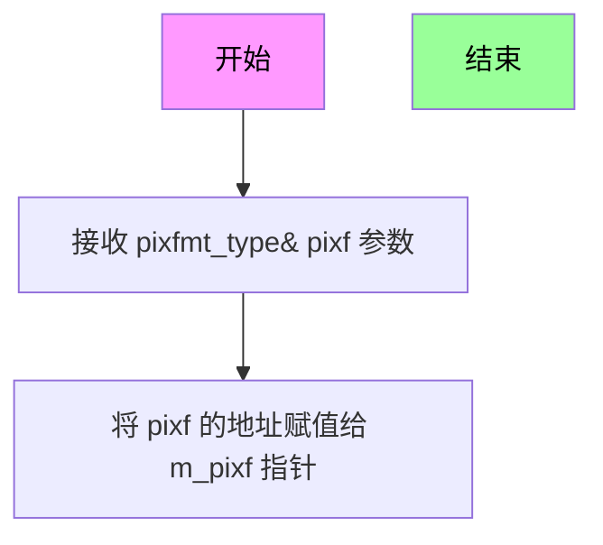

#### 带注释源码

```cpp
// 构造函数：带像素格式的构造函数
// 参数：pixf - 对像素格式对象的引用，用于初始化图像访问器
explicit image_accessor_clone(pixfmt_type& pixf) : 
    m_pixf(&pixf)     // 将传入的像素格式引用转换为指针并存储到成员变量 m_pixf
{}
```

#### 备注

这是一个显式（explicit）构造函数，接受一个 `pixfmt_type` 类型的引用参数。该构造函数的主要功能是将传入的像素格式对象的地址存储到成员变量 `m_pixf` 中，使得 `image_accessor_clone` 类能够通过该指针访问底层像素数据。在克隆模式下，当访问超出图像边界的像素时，会自动克隆边缘像素的值（通过将越界坐标裁剪到图像边界来实现）。


### `image_accessor_clone.attach`

将像素格式对象附加到 `image_accessor_clone` 实例中，更新内部维护的像素格式指针，使其指向传入的 pixfmt_type 对象，从而允许图像访问器操作指定的像素格式数据。

参数：

- `pixf`：`pixfmt_type&`，要附加的像素格式对象的引用，image_accessor_clone 将使用此对象进行像素读取操作

返回值：`void`，无返回值

#### 流程图

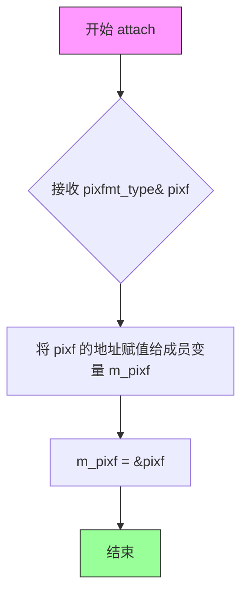

#### 带注释源码

```cpp
// 在 image_accessor_clone 类中定义
void attach(pixfmt_type& pixf)
{
    // 将传入的像素格式对象的地址赋值给成员指针 m_pixf
    // 使得 image_accessor_clone 可以通过该指针访问像素数据
    m_pixf = &pixf;
}
```

#### 补充说明

该方法是 `image_accessor_clone` 模板类的成员函数，属于 AGG (Anti-Grain Geometry) 库中的图像访问器组件。该方法允许在对象构造后动态更换所关联的像素格式，提供了灵活性。与 `image_accessor_clip::attach` 和 `image_accessor_no_clip::attach` 的功能相同，但 `image_accessor_clone` 采用了边界克隆（clamp）策略：当访问超出图像边界时，会自动将坐标裁剪到图像边缘，而不是返回背景色或进行其他处理。


### image_accessor_clone.pixel

获取单个像素的指针（私有方法）。该方法将坐标限制在图像边界范围内（边界克隆），确保即使请求的坐标超出图像范围，也能返回有效的像素指针，而不是空指针。

参数：无

返回值：`const int8u*`，返回像素数据的指针，如果坐标超出边界则返回边界坐标处的像素指针

#### 流程图

```mermaid
flowchart TD
    A[开始 pixel] --> B[获取当前坐标 m_x, m_y]
    B --> C{x < 0?}
    C -->|是| D[x = 0]
    C -->|否| E{x >= width?}
    D --> E
    E -->|是| F[x = width - 1]
    E -->|否| G{y < 0?}
    F --> G
    G -->|是| H[y = 0]
    G -->|否| I{y >= height?}
    H --> J
    I -->|是| K[y = height - 1]
    I -->|否| J
    K --> J
    J --> L[返回 pix_ptr(x, y)]
```

#### 带注释源码

```
    private:
        // 私有方法：获取单个像素指针，进行边界克隆处理
        AGG_INLINE const int8u* pixel() const
        {
            // 获取当前缓存的坐标值
            int x = m_x;
            int y = m_y;
            
            // X坐标下边界检查：如果x小于0，则克隆到边界0
            if(x < 0) x = 0;
            
            // Y坐标下边界检查：如果y小于0，则克隆到边界0
            if(y < 0) y = 0;
            
            // X坐标上边界检查：如果x超出图像宽度，则克隆到最后一个像素
            if(x >= (int)m_pixf->width())  x = m_pixf->width() - 1;
            
            // Y坐标上边界检查：如果y超出图像高度，则克隆到最后一个像素
            if(y >= (int)m_pixf->height()) y = m_pixf->height() - 1;
            
            // 返回边界克隆后的像素指针
            return m_pixf->pix_ptr(x, y);
        }
```

#### 关联字段信息

该方法使用的类成员变量：

| 字段名 | 类型 | 描述 |
|--------|------|------|
| `m_pixf` | `const pixfmt_type*` | 指向像素格式对象的指针 |
| `m_x` | `int` | 当前X坐标（缓存） |
| `m_y` | `int` | 当前Y坐标（缓存） |

#### 设计说明

1. **边界克隆策略**：该方法实现了"边界克隆"（boundary cloning）策略，当访问坐标超出图像范围时，不是返回空指针或黑色像素，而是返回边界处的像素值。这种方式在纹理映射和图像处理中可以避免边缘伪影。

2. **const成员函数**：该方法声明为const，表明它不会修改类的成员状态（尽管成员变量m_x和m_y是mutable的或者在调用前已被设置）。

3. **内联标记**：使用`AGG_INLINE`标记，提示编译器进行内联优化以提高性能。


### `image_accessor_clone.span`

获取像素行数据。该方法返回指向图像中指定位置像素行的指针，当坐标超出图像边界时，会自动将坐标钳制到图像边缘（克隆边缘像素）。

参数：

- `x`：`int`，像素行的起始 X 坐标
- `y`：`int`，像素行的 Y 坐标
- `len`：`unsigned`，像素行的长度

返回值：`const int8u*`，指向像素行数据的指针

#### 流程图

```mermaid
flowchart TD
    A[span 开始] --> B[设置 m_x = m_x0 = x, m_y = y]
    B --> C{检查边界: y >= 0 && y < height && x >= 0 && x+len <= width}
    C -->|是| D[返回 m_pix_ptr = m_pixf->pix_ptr(x, y)]
    C -->|否| E[设置 m_pix_ptr = 0]
    E --> F[调用 pixel&#40;&#41; 返回钳制后的像素]
    D --> G[返回像素指针]
    F --> G
```

#### 带注释源码

```cpp
AGG_INLINE const int8u* span(int x, int y, unsigned len)
{
    // 保存当前坐标到成员变量，供 next_x/next_y 使用
    m_x = m_x0 = x;
    m_y = y;
    
    // 检查请求的像素 span 是否完全在图像边界内
    if(y >= 0 && y < (int)m_pixf->height() &&
       x >= 0 && x+len <= (int)m_pixf->width())
    {
        // 在边界内，直接返回图像像素指针
        return m_pix_ptr = m_pixf->pix_ptr(x, y);
    }
    
    // 超出边界，设置指针为空，调用 pixel() 进行坐标钳制
    m_pix_ptr = 0;
    return pixel();
}
```


### `image_accessor_clone.next_x()`

该方法是 `image_accessor_clone` 类模板的成员函数，用于在扫描线渲染过程中沿 X 轴（水平方向）移动到下一个像素位置。如果当前像素指针有效，则直接递增像素缓冲区指针；否则递增 X 坐标并返回边缘克隆（clamp）后的像素指针。

#### 参数

- （无显式参数，使用类成员变量 `m_pix_ptr`、`m_x` 和 `pix_width`）

#### 返回值

`const int8u*`，返回指向下一个像素数据的常量指针。如果当前像素在图像边界内，则返回递增后的像素缓冲区指针；如果在边界外，则返回经边缘处理后的像素指针。

#### 流程图

```mermaid
flowchart TD
    A[开始 next_x] --> B{m_pix_ptr 是否非空?}
    B -->|是| C[m_pix_ptr += pix_width]
    C --> D[返回 m_pix_ptr]
    B -->|否| E[m_x++]
    E --> F[调用 pixel 方法]
    F --> G[返回 clamp 后的像素指针]
    
    style B fill:#f9f,color:#000
    style C fill:#9f9,color:#000
    style E fill:#9f9,color:#000
    style F fill:#ff9,color:#000
```

#### 带注释源码

```cpp
// image_accessor_clone 类模板中 next_x 方法的实现
// 位置: agg_image_accessors.hpp (约第216-220行)

AGG_INLINE const int8u* next_x()
{
    // 检查当前像素指针是否有效（非空且在有效范围内）
    if(m_pix_ptr) 
    {
        // 有效：直接将像素缓冲区指针向前移动一个像素的字节数
        // pix_width 是像素格式的宽度（字节数），如 RGB24 为 3，RGBA32 为 4
        return m_pix_ptr += pix_width;
    }
    else
    {
        // 无效（出界）：增加 X 坐标，然后调用 pixel() 方法
        // pixel() 会将坐标 clamp 到图像边界内并返回对应的像素指针
        ++m_x;
        return pixel();
    }
}
```

#### 关键上下文信息

**所属类：`image_accessor_clone`**

该类是AGG库中的一种图像访问器实现，特点是在访问超出图像边界时采用"克隆"策略——即取最近的边缘像素值。这种策略通过 `pixel()` 私有方法实现：

```cpp
// pixel() 方法实现（边缘克隆逻辑）
AGG_INLINE const int8u* pixel() const
{
    int x = m_x;
    int y = m_y;
    
    // 将负坐标 clamp 到 0
    if(x < 0) x = 0;
    if(y < 0) y = 0;
    
    // 将超出边界的坐标 clamp 到最大有效索引
    if(x >= (int)m_pixf->width())  x = m_pixf->width() - 1;
    if(y >= (int)m_pixf->height()) y = m_pixf->height() - 1;
    
    // 返回 clamp 后的像素指针
    return m_pixf->pix_ptr(x, y);
}
```

**相关成员变量：**

| 变量名 | 类型 | 描述 |
|--------|------|------|
| `m_pixf` | `const pixfmt_type*` | 指向像素格式对象的指针 |
| `m_x` | `int` | 当前像素的 X 坐标 |
| `m_x0` | `int` | 扫描线起始 X 坐标 |
| `m_y` | `int` | 当前像素的 Y 坐标 |
| `m_pix_ptr` | `const int8u*` | 当前像素数据的缓冲区指针 |

#### 技术债务与优化空间

1. **重复代码**：`image_accessor_clip` 和 `image_accessor_clone` 类的 `next_x()` 和 `next_y()` 方法实现几乎完全相同，可考虑提取为基类或模板化逻辑
2. **内联效率**：虽然使用了 `AGG_INLINE` 宏进行内联建议，但在某些编译器配置下可显式使用 `__forceinline` 或 `inline` 关键字确保强制内联
3. **边界检查开销**：每次调用都会检查 `m_pix_ptr` 是否为空，可考虑在调用前通过调用者的状态管理来避免此分支


### `image_accessor_clone.next_y()`

该方法是 `image_accessor_clone` 类的成员函数，用于在图像像素遍历过程中移动到下一行（下一个Y像素）。它递增Y坐标，重置X坐标为当前扫描行的起始位置，并返回下一行像素数据的指针。如果目标位置超出图像边界，则返回边界像素的克隆值。

参数：无（成员方法，使用类内部状态）

返回值：`const int8u*`，返回指向下一个Y像素行的像素数据指针，如果超出边界则返回边界像素的克隆值

#### 流程图

```mermaid
flowchart TD
    A[开始 next_y] --> B[++m_y 递增Y坐标]
    B --> C[m_x = m_x0 重置X坐标为扫描行起始位置]
    C --> D{m_pix_ptr != nullptr<br/>且<br/>0 <= m_y < m_pixf->height()}
    D -->|是| E[m_pix_ptr = m_pixf->pix_ptr<br/>(m_x, m_y) 获取新行像素指针]
    E --> F[返回 m_pix_ptr]
    D -->|否| G[m_pix_ptr = 0 设为空]
    G --> H[返回 pixel() 获取边界像素]
    F --> I[结束]
    H --> I
```

#### 带注释源码

```cpp
//----------------------------------------------------image_accessor_clone
// image_accessor_clone 类 - 图像像素访问器（边界克隆模式）
// 当访问超出图像边界时，自动克隆边缘像素值
//----------------------------------------------------

template<class PixFmt> class image_accessor_clone
{
public:
    // 类型定义
    typedef PixFmt   pixfmt_type;                    // 像素格式类型
    typedef typename pixfmt_type::color_type color_type;      // 颜色类型
    typedef typename pixfmt_type::order_type order_type;      // 颜色通道顺序
    typedef typename pixfmt_type::value_type value_type;      // 像素值类型
    enum pix_width_e { pix_width = pixfmt_type::pix_width };   // 像素宽度（字节）

    // 构造函数
    image_accessor_clone() {}
    explicit image_accessor_clone(pixfmt_type& pixf) : 
        m_pixf(&pixf)                                 // 初始化像素格式指针
    {}

    // 附加像素格式对象
    void attach(pixfmt_type& pixf)
    {
        m_pixf = &pixf;
    }

private:
    //------------------------------------------pixel() - 获取边界克隆像素
    // 私有方法：当访问超出图像边界时，返回边界像素的克隆值
    // 实现逻辑：
    //   1. 将负坐标 clamp 到 0
    //   2. 将超出图像尺寸的坐标 clamp 到图像边缘-1
    //   3. 返回克隆后的边界像素指针
    AGG_INLINE const int8u* pixel() const
    {
        int x = m_x;                                  // 拷贝当前坐标
        int y = m_y;
        
        // 边界检查和坐标钳制（clamp）
        if(x < 0) x = 0;                              // X负值钳制到0
        if(y < 0) y = 0;                              // Y负值钳制到0
        if(x >= (int)m_pixf->width())  x = m_pixf->width() - 1;   // X超界钳制到右边缘
        if(y >= (int)m_pixf->height()) y = m_pixf->height() - 1;  // Y超界钳制到下边缘
        
        return m_pixf->pix_ptr(x, y);                 // 返回边界像素指针
    }

public:
    //-----------------------------------------span() - 获取扫描行像素起始指针
    // 参数：
    //   x - 起始X坐标
    //   y - Y坐标
    //   len - 扫描行长度（用于边界检查）
    // 返回：指向像素数据的指针
    AGG_INLINE const int8u* span(int x, int y, unsigned len)
    {
        m_x = m_x0 = x;                               // 保存起始X和当前X
        m_y = y;                                      // 保存当前Y
        
        // 检查是否完全在图像范围内
        if(y >= 0 && y < (int)m_pixf->height() &&
           x >= 0 && x+(int)len <= (int)m_pixf->width())
        {
            // 完全在范围内，直接返回像素指针
            return m_pix_ptr = m_pixf->pix_ptr(x, y);
        }
        
        // 超出范围，标记需要边界处理
        m_pix_ptr = 0;
        return pixel();                              // 返回边界克隆像素
    }

    //------------------------------------------next_x() - 移动到下一个X像素
    // 在当前扫描行内移动到下一个像素位置
    AGG_INLINE const int8u* next_x()
    {
        if(m_pix_ptr) return m_pix_ptr += pix_width; // 正常情况直接偏移
        ++m_x;                                         // 边界模式需更新X坐标
        return pixel();                                // 返回边界像素
    }

    //==========================================next_y() - 移动到下一个Y像素
    // 核心功能：移动到图像的下一行
    // 实现逻辑：
    //   1. 递增Y坐标（m_y++）
    //   2. 重置X坐标为扫描行起始位置（m_x = m_x0）
    //   3. 如果之前在有效范围内且新行仍在范围内，更新像素指针
    //   4. 否则返回边界克隆像素
    //==========================================
    AGG_INLINE const int8u* next_y()
    {
        ++m_y;                                        // Step 1: 递增Y坐标，移动到下一行
        m_x = m_x0;                                   // Step 2: 重置X坐标为该行起始位置
        
        // Step 3: 检查是否仍在有效图像范围内
        if(m_pix_ptr &&                               // 之前扫描行有效
           m_y >= 0 && m_y < (int)m_pixf->height()) // 新行在图像高度范围内
        {
            // 仍在有效范围内，更新像素指针到新行
            return m_pix_ptr = m_pixf->pix_ptr(m_x, m_y);
        }
        
        // Step 4: 超出边界（可能是最后一行或更下一行）
        m_pix_ptr = 0;                                // 标记需要边界处理
        return pixel();                               // 返回边界克隆像素（最后一行或边缘像素）
    }

private:
    const pixfmt_type* m_pixf;                        // 像素格式对象指针
    int                m_x, m_x0, m_y;                // m_x:当前X, m_x0:扫描行起始X, m_y:当前Y
    const int8u*       m_pix_ptr;                    // 当前像素行指针缓存
};
```


### `image_accessor_wrap.image_accessor_wrap()`

默认构造函数，用于构造一个未绑定任何像素格式的`image_accessor_wrap`对象。该构造函数是一个无参构造函数，不执行任何初始化操作，允许对象在后续通过`attach()`方法绑定具体的像素格式和包装器。

参数：
- 无

返回值：
- 无（构造函数）

#### 流程图

```mermaid
graph TD
    A[开始] --> B[调用默认构造函数]
    B --> C[不执行任何初始化操作]
    C --> D[对象构造完成<br/>m_pixf = 未初始化<br/>m_wrap_x = 未初始化<br/>m_wrap_y = 未初始化<br/>m_row_ptr = 未初始化<br/>m_x = 未初始化]
    D --> E[对象可后续通过attach方法绑定像素格式]
    E --> F[结束]
```

#### 带注释源码

```cpp
//-----------------------------------------------------image_accessor_wrap
// 模板类：image_accessor_wrap
// 用途：提供基于包装器（WrapX/WrapY）的图像像素访问功能，支持平铺/重复/反射等环绕模式
// 模板参数：
//   - PixFmt: 像素格式类（如agg::pixfmt_alpha8, agg::pixfmt_rgb24等）
//   - WrapX: X轴环绕模式类（如wrap_mode_repeat, wrap_mode_reflect等）
//   - WrapY: Y轴环绕模式类
template<class PixFmt, class WrapX, class WrapY> class image_accessor_wrap
{
public:
    // 类型定义
    typedef PixFmt   pixfmt_type;                      // 像素格式类型
    typedef typename pixfmt_type::color_type color_type;       // 颜色类型
    typedef typename pixfmt_type::order_type order_type;       // 颜色通道顺序
    typedef typename pixfmt_type::value_type value_type;       // 像素值类型
    enum pix_width_e { pix_width = pixfmt_type::pix_width };   // 像素宽度（字节数）

    //========================================================image_accessor_wrap()
    // 默认构造函数
    // 描述：创建一个未初始化的image_accessor_wrap对象
    // 注意：使用此构造函数创建的对象需要在后续通过attach()方法绑定像素格式
    //       否则访问像素时行为未定义
    image_accessor_wrap() {}
    
    //========================================================image_accessor_wrap(pixfmt_type&)
    // 带参构造函数
    // 参数：
    //   - pixfmt_type& pixf: 像素格式引用，用于访问图像数据
    // 描述：创建并绑定像素格式，同时初始化X/Y轴包装器
    explicit image_accessor_wrap(pixfmt_type& pixf) : 
        m_pixf(&pixf),                  // 保存像素格式指针
        m_wrap_x(pixf.width()),        // 用图像宽度初始化X轴包装器
        m_wrap_y(pixf.height())        // 用图像高度初始化Y轴包装器
    {}

    //========================================================attach()
    // 方法：attach
    // 参数：
    //   - pixfmt_type& pixf: 像素格式引用
    // 返回值：void
    // 描述：绑定像素格式对象（不重新初始化包装器）
    void attach(pixfmt_type& pixf)
    {
        m_pixf = &pixf;
    }

    //========================================================span()
    // 方法：span
    // 参数：
    //   - int x: 起始X坐标
    //   - int y: Y坐标
    //   - unsigned: 跨度长度（未使用）
    // 返回值：const int8u*，指向像素数据的指针
    // 描述：获取指定位置的一行像素数据起始指针，应用X/Y轴环绕模式
    AGG_INLINE const int8u* span(int x, int y, unsigned)
    {
        m_x = x;                                                // 保存起始X坐标
        m_row_ptr = m_pixf->pix_ptr(0, m_wrap_y(y));           // 获取行起始指针，Y坐标经过包装器处理
        return m_row_ptr + m_wrap_x(x) * pix_width;            // 返回X坐标经过包装器处理后的像素指针
    }

    //========================================================next_x()
    // 方法：next_x
    // 参数：无
    // 返回值：const int8u*，指向下一个像素的指针
    // 描述：移动到同一行中的下一个像素位置
    AGG_INLINE const int8u* next_x()
    {
        int x = ++m_wrap_x;                                     // X坐标包装器递增
        return m_row_ptr + x * pix_width;                      // 返回新位置的像素指针
    }

    //========================================================next_y()
    // 方法：next_y
    // 参数：无
    // 返回值：const int8u*，指向下一行像素的指针
    // 描述：移动到下一行（Y递增），X坐标重置为起始位置
    AGG_INLINE const int8u* next_y()
    {
        m_row_ptr = m_pixf->pix_ptr(0, ++m_wrap_y);             // Y坐标包装器递增，获取新行指针
        return m_row_ptr + m_wrap_x(m_x) * pix_width;          // 返回新行中X坐标经过包装处理后的像素指针
    }

private:
    // 成员变量
    const pixfmt_type* m_pixf;      // 像素格式指针，指向外部图像数据
    const int8u*       m_row_ptr;  // 当前行像素数据指针，用于缓存
    int                m_x;        // 当前X坐标（用于next_y时恢复）
    WrapX              m_wrap_x;   // X轴环绕模式包装器
    WrapY              m_wrap_y;   // Y轴环绕模式包装器
};
```


### `image_accessor_wrap.image_accessor_wrap(pixfmt_type&)`

带像素格式的构造函数，用于初始化图像访问包装器，将像素格式对象包装起来，并初始化X和Y方向的环绕模式。

参数：

- `pixf`：`pixfmt_type&`，对像素格式对象的引用，用于访问底层图像数据

返回值：无（构造函数），返回类型为 `void`（隐式）

#### 流程图

```mermaid
flowchart TD
    A[开始构造] --> B[将pixf的地址赋值给m_pixf指针]
    B --> C[使用pixf.width初始化m_wrap_x]
    C --> D[使用pixf.height初始化m_wrap_y]
    D --> E[构造完成]
```

#### 带注释源码

```cpp
// 带像素格式的构造函数
// 参数：pixf - 对像素格式对象的引用，用于访问底层图像数据
explicit image_accessor_wrap(pixfmt_type& pixf) : 
    m_pixf(&pixf),           // 将传入的像素格式对象地址存储到成员指针
    m_wrap_x(pixf.width()), // 使用图像宽度初始化X方向的环绕模式
    m_wrap_y(pixf.height()) // 使用图像高度初始化Y方向的环绕模式
{}
```

#### 补充说明

这是一个模板类构造函数，其功能包括：
1. **初始化像素格式指针**：将传入的 `pixfmt_type` 对象的地址存储到成员变量 `m_pixf` 中，以便后续访问图像数据
2. **初始化环绕模式**：使用图像的宽度和高度分别初始化 `WrapX` 和 `WrapY` 类型的环绕策略，用于处理超出图像边界的坐标映射
3. **类型安全**：使用 `explicit` 关键字防止隐式类型转换，避免意外的构造行为

#### 设计考量

- **模板设计**：该类是模板类，支持不同的像素格式（`PixFmt`）和环绕模式（`WrapX`、`WrapY`）组合
- **组合模式**：通过组合不同的环绕模式类（如 `wrap_mode_repeat`、`wrap_mode_reflect` 等），可以实现多种图像边缘处理策略
- **性能优化**：初始化时直接获取图像尺寸，避免后续调用时重复查询


### `image_accessor_wrap.attach`

附加像素格式对象到图像访问包装器，使其能够访问指定的像素格式数据。

参数：

- `pixf`：`pixfmt_type&`，要附加的像素格式对象的引用

返回值：`void`，无返回值

#### 流程图

```mermaid
flowchart TD
    A[开始 attach] --> B[输入: pixfmt_type& pixf]
    B --> C{m_pixf = &pixf}
    C --> D[将 pixf 的地址赋给成员指针 m_pixf]
    D --> E[结束 attach]
    
    style A fill:#f9f,stroke:#333
    style E fill:#9f9,stroke:#333
```

#### 带注释源码

```cpp
// 在 image_accessor_wrap 类中
//-----------------------------------------------------image_accessor_wrap
template<class PixFmt, class WrapX, class WrapY> class image_accessor_wrap
{
public:
    // ... 类型定义和枚举 ...

    // 构造函数，使用给定的像素格式对象初始化包装器
    // 同时根据像素格式的宽高初始化换行对象 WrapX 和 WrapY
    explicit image_accessor_wrap(pixfmt_type& pixf) : 
        m_pixf(&pixf), 
        m_wrap_x(pixf.width()), 
        m_wrap_y(pixf.height())
    {}

    // 附加像素格式对象
    // 参数: pixf - 要附加的像素格式引用
    // 功能: 将外部传入的像素格式对象的地址保存到成员指针 m_pixf 中
    //       以便后续通过该指针访问像素数据
    void attach(pixfmt_type& pixf)
    {
        m_pixf = &pixf;  // 保存像素格式对象的地址
    }

    // ... 其他方法 ...

private:
    const pixfmt_type* m_pixf;  // 指向像素格式对象的指针
    const int8u*       m_row_ptr;  // 当前行像素数据的指针
    int                m_x;  // 当前 x 坐标
    WrapX              m_wrap_x;  // x 方向换行策略对象
    WrapY              m_wrap_y;  // y 方向换行策略对象
};
```


### `image_accessor_wrap.span`

该方法是 `image_accessor_wrap` 类的成员函数，用于获取指定行（span）的像素数据指针，支持图像的平铺（wrap）模式访问。

参数：

- `x`：`int`，指定像素行的起始X坐标
- `y`：`int`，指定像素行的Y坐标
- `len`：`unsigned`，指定像素行的长度（该参数在当前实现中未使用）

返回值：`const int8u*`，返回指向像素行数据的常量指针

#### 流程图

```mermaid
flowchart TD
    A[开始 span] --> B[将参数x赋值给成员变量m_x]
    B --> C[调用m_wrap_y获取包装后的Y坐标]
    C --> D[调用m_pixf->pix_ptr获取第0列对应行的指针]
    D --> E[调用m_wrap_x获取包装后的X坐标]
    E --> F[计算最终像素指针: m_row_ptr + m_wrap_x(x) * pix_width]
    F --> G[返回像素指针]
```

#### 带注释源码

```cpp
// image_accessor_wrap::span 方法实现
// 获取指定坐标位置的像素行指针
// 参数: x - 起始X坐标, y - Y坐标, len - 像素行长度(本实现中未使用)
// 返回: 指向像素行数据的常量指针
AGG_INLINE const int8u* span(int x, int y, unsigned)
{
    // 1. 保存起始X坐标到成员变量，供next_y方法使用
    m_x = x;
    
    // 2. 使用WrapY包装器处理Y坐标(实现平铺效果)，获取该行的起始指针
    // pix_ptr(0, y) 获取第0列指定行的指针
    m_row_ptr = m_pixf->pix_ptr(0, m_wrap_y(y));
    
    // 3. 使用WrapX包装器处理X坐标，计算偏移量
    // m_wrap_x(x) 返回包装后的X坐标，乘以像素宽度得到字节偏移
    // 4. 返回该像素行的起始指针
    return m_row_ptr + m_wrap_x(x) * pix_width;
}
```


### `image_accessor_wrap.next_x`

该方法用于在图像像素行内移动到下一个X像素位置，通过递增X方向的包装计数器并计算新像素的内存指针地址，实现无缝遍历图像像素的功能。

参数：
- （无参数）

返回值：`const int8u*`，返回指向图像中下一个像素数据的指针

#### 流程图

```mermaid
flowchart TD
    A[开始 next_x] --> B[++m_wrap_x 递增X包装计数器]
    B --> C[计算新像素位置: x = m_wrap_x当前值]
    C --> D[计算指针偏移: m_row_ptr + x * pix_width]
    D --> E[返回新像素指针]
```

#### 带注释源码

```cpp
// image_accessor_wrap 模板类的 next_x 方法实现
// 功能：移动到当前像素行中的下一个X像素位置
AGG_INLINE const int8u* next_x()
{
    // 1. 使用WrapX的++运算符递增包装计数器
    //    这会处理边界情况（如重复或反射模式）
    int x = ++m_wrap_x;
    
    // 2. 计算新像素的内存地址
    //    m_row_ptr: 指向当前行起始位置的指针
    //    x: 新的X坐标（已包装）
    //    pix_width: 每个像素占用的字节数（如RGB为3，RGBA为4）
    return m_row_ptr + x * pix_width;
}
```

#### 上下文信息

**所属类**：image_accessor_wrap

**类字段依赖**：
- `m_row_ptr`：const int8u*，指向当前像素行起始位置的指针
- `m_wrap_x`：WrapX，X方向的坐标包装器（处理重复/反射模式）
- `pix_width`：enum常量，每个像素的字节宽度

**设计意图**：
该方法是AGG图像访问器模式的核心组成部分，用于扫描线渲染时的高效像素遍历。配合`span()`和`next_y()`方法，可以实现对图像的连续像素访问，同时支持多种坐标包装模式（重复、反射等）。


### `image_accessor_wrap.next_y()`

移动到下一个Y像素，并返回该行对应的像素数据指针。

参数：

- （无参数）

返回值：`const int8u*`，返回下一行像素数据的指针（用于图像采样）。

#### 流程图

```mermaid
flowchart TD
    A[开始 next_y] --> B[++m_wrap_y Y坐标递增]
    B --> C[m_pixf->pix_ptr<br/>获取新行起始指针]
    C --> D[计算列偏移量<br/>m_wrap_x(m_x) * pix_width]
    D --> E[返回 m_row_ptr + 偏移量]
    E --> F[结束]
```

#### 带注释源码

```
AGG_INLINE const int8u* next_y()
{
    // 1. 增加Y方向的包装器（处理Y坐标越界，如重复/反射模式）
    m_row_ptr = m_pixf->pix_ptr(0, ++m_wrap_y);
    
    // 2. 使用X方向的包装器计算当前X坐标对应的列偏移量
    //    并返回指向目标像素的指针
    return m_row_ptr + m_wrap_x(m_x) * pix_width;
}
```

#### 关键说明

| 要素 | 说明 |
|------|------|
| **所属类** | `image_accessor_wrap<PixFmt, WrapX, WrapY>` |
| **调用场景** | 在图像采样遍历行时，被渲染器循环调用以获取每一行的像素数据 |
| **包装器作用** | `WrapX` 和 `WrapY` 决定坐标越界时的行为（如重复、反射等） |
| **与 next_x 区别** | `next_x` 只递增X指针；`next_y` 需要重新计算行指针并重新应用X坐标包装 |


### `wrap_mode_repeat.wrap_mode_repeat`

该函数是 `wrap_mode_repeat` 类的默认构造函数，用于初始化环绕模式的重计算器，将成员变量 m_size、m_add 和 m_value 初始化为 0。

参数：无

返回值：无（构造函数）

#### 流程图

```mermaid
graph TD
    A[开始] --> B{调用 wrap_mode_repeat 默认构造函数}
    B --> C[将 m_size 设为 0]
    C --> D[将 m_add 设为 0]
    D --> E[将 m_value 设为 0]
    E --> F[结束 - 对象已创建]
    
    style A fill:#f9f,stroke:#333
    style F fill:#9f9,stroke:#333
```

#### 带注释源码

```cpp
//--------------------------------------------------------wrap_mode_repeat
//  wrap_mode_repeat 类 - 重复环绕模式封装类
//  用于在图像处理中实现坐标的重复环绕（Repeat Wrapping）
//  即当坐标超出范围时，会从头重新开始计算
//-----------------------------------------------------wrap_mode_repeat
class wrap_mode_repeat
{
    public:
        // 默认构造函数
        // 功能：将所有成员变量初始化为0
        // 参数：无
        // 返回值：无（构造函数不返回任何值）
        wrap_mode_repeat() {}
        
        // 带参数的构造函数
        // 参数：size - 环绕的大小/边界值
        // 功能：根据给定大小初始化环绕模式计算器
        wrap_mode_repeat(unsigned size) : 
            m_size(size),                                      // 设置环绕大小
            m_add(size * (0x3FFFFFFF / size)),                 // 计算累加值用于优化
            m_value(0)                                         // 初始化当前值为0
        {}

        // 重载函数调用运算符 - 将输入值 v 转换为环绕后的值
        // 参数：v - 输入的坐标值（可能为负数或超出范围）
        // 返回值：环绕后的有效坐标值 [0, m_size-1]
        AGG_INLINE unsigned operator() (int v)
        { 
            // 通过加上一个大的偏移量再取模，实现负数也能正确环绕
            return m_value = (unsigned(v) + m_add) % m_size; 
        }

        // 前置递增运算符 - 递增当前值，实现重复遍历
        // 参数：无
        // 返回值：递增后的值
        AGG_INLINE unsigned operator++ ()
        {
            ++m_value;                                         // 先递增
            if(m_value >= m_size) m_value = 0;                // 如果超出范围则回绕到0
            return m_value;
        }
        
    private:
        unsigned m_size;      // 环绕的大小/边界
        unsigned m_add;       // 预计算的偏移量，用于优化负数环绕计算
        unsigned m_value;     // 当前的值/位置
};
```


### `wrap_mode_repeat.wrap_mode_repeat(unsigned)`

带尺寸的构造函数，初始化重复包装模式的核心参数，用于图像处理中的坐标映射，实现基于取模运算的坐标重复功能。

参数：

-  `size`：`unsigned`，表示图像或纹理在X/Y方向上的尺寸，用于计算包装模式的范围

返回值：`void`（构造函数无返回值）

#### 流程图

```mermaid
flowchart TD
    A[开始] --> B[接收size参数]
    B --> C[初始化m_size = size]
    C --> D[计算m_add = size * (0x3FFFFFFF / size)]
    D --> E[初始化m_value = 0]
    E --> F[结束]
```

#### 带注释源码

```cpp
//--------------------------------------------------------wrap_mode_repeat
class wrap_mode_repeat
{
    public:
        // 默认构造函数，不进行任何初始化
        wrap_mode_repeat() {}
        
        // 带尺寸的构造函数，初始化重复包装模式的核心参数
        // 参数：size - 图像或纹理在X/Y方向上的尺寸
        wrap_mode_repeat(unsigned size) : 
            m_size(size),                        // 保存尺寸用于取模运算
            m_add(size * (0x3FFFFFFF / size)),   // 计算加法因子用于坐标映射
            m_value(0)                           // 初始化当前值为0
        {}

        // 重载函数调用运算符，将输入坐标v映射到[0, size)范围内
        // 使用高效的加法和取模运算代替除法
        AGG_INLINE unsigned operator() (int v)
        { 
            return m_value = (unsigned(v) + m_add) % m_size; 
        }

        // 重载前缀递增运算符，实现坐标的循环递增
        // 当值达到size时自动回绕到0
        AGG_INLINE unsigned operator++ ()
        {
            ++m_value;
            if(m_value >= m_size) m_value = 0;
            return m_value;
        }
        
    private:
        unsigned m_size;    // 包装模式的尺寸，即图像宽度或高度
        unsigned m_add;     // 预计算的加法因子，用于优化取模运算
        unsigned m_value;   // 当前映射后的坐标值
};
```


### `wrap_mode_repeat.operator()(int)`

该方法是 `wrap_mode_repeat` 类的函数调用运算符重载，用于实现图像坐标的重复包装模式（Repeat Wrapping）。它将输入的整数坐标值通过加法偏移和取模运算，映射到 `[0, m_size-1]` 范围内，实现坐标的循环重复效果。

参数：

- `v`：`int`，输入的坐标值，可以是任意整数

返回值：`unsigned`，包装后的坐标值，范围在 `[0, m_size-1]` 之间

#### 流程图

```mermaid
flowchart TD
    A[开始执行 operator] --> B[将 v 转换为无符号整型并加上 m_add]
    B --> C[计算 result = (v + m_add) % m_size]
    C --> D[将结果存储到 m_value]
    E[返回 m_value] --> F[结束]
```

#### 带注释源码

```cpp
// wrap_mode_repeat 类 - 实现坐标重复包装模式
class wrap_mode_repeat
{
public:
    // 默认构造函数
    wrap_mode_repeat() {}
    
    // 带参数构造函数，初始化包装大小和偏移量
    // size: 包装区域的大小（图像宽度或高度）
    wrap_mode_repeat(unsigned size) : 
        m_size(size), 
        // 计算偏移加法值，使用大数乘法避免除法
        m_add(size * (0x3FFFFFFF / size)),
        m_value(0)
    {}

    // 函数调用运算符 - 核心包装逻辑
    // v: 输入的坐标值（可以是负数）
    // 返回: 包装后的非负坐标值 [0, m_size-1]
    AGG_INLINE unsigned operator() (int v)
    { 
        // 1. 将输入值 v 转换为无符号类型并加上偏移量 m_add
        // 2. 使用模运算 m_size 确保结果在 [0, m_size-1] 范围内
        // 3. 将结果保存到成员变量 m_value 并返回
        return m_value = (unsigned(v) + m_add) % m_size; 
    }

    // 前置递增运算符 - 用于遍历时的坐标递增
    AGG_INLINE unsigned operator++ ()
    {
        ++m_value;
        // 如果超出范围则回到 0，实现循环
        if(m_value >= m_size) m_value = 0;
        return m_value;
    }
    
private:
    unsigned m_size;  // 包装区域的大小（图像尺寸）
    unsigned m_add;  // 预计算的偏移量，用于优化取模运算
    unsigned m_value; // 当前包装后的坐标值
};
```

#### 设计说明

该方法主要用于图像处理中的纹理寻址模式。当图像坐标超出有效范围时，重复包装模式会让坐标"环绕"——例如，当 x 坐标超过图像宽度时，会从 0 重新开始计数。这种模式在游戏纹理贴图、纹理坐标映射等场景中广泛应用。

**技术特点：**
1. **偏移量优化**：通过预先计算 `m_add` 值，避免了对负数直接取模可能带来的问题
2. **位运算友好**：`wrap_mode_repeat_pow2` 专门针对 2 的幂次大小进行了优化，使用位运算代替模运算
3. **状态维护**：通过成员变量 `m_value` 保持当前状态，支持连续的坐标递增操作


### `wrap_mode_repeat.operator++()`

前置递增运算符，用于将内部计数器递增1，并在达到上限时自动回绕到0，实现循环递增功能。

参数：（无参数）

返回值：`unsigned`，返回递增后的当前值

#### 流程图

```mermaid
flowchart TD
    A[开始 operator++] --> B[m_value 自增1]
    B --> C{m_value >= m_size?}
    C -->|是| D[m_value 设为0]
    C -->|否| E[保持当前值]
    D --> F[返回 m_value]
    E --> F
```

#### 带注释源码

```cpp
// 前置递增运算符实现
AGG_INLINE unsigned operator++ ()
{
    ++m_value;                  // 将内部计数器 m_value 加1
    if(m_value >= m_size)       // 检查是否超过或等于模数大小
        m_value = 0;            // 如果超过则回绕到0，实现循环效果
    return m_value;             // 返回递增后的值
}
```


### `wrap_mode_repeat_pow2.wrap_mode_repeat_pow2()`

这是 `wrap_mode_repeat_pow2` 类的默认构造函数，用于初始化一个用于图像坐标包装（wrap）的对象，适用于大小为2的幂次的图像尺寸。此默认构造函数不执行任何显式初始化，将使用成员变量的默认值。

参数：

- （无参数）

返回值：无（`void`），构造函数不返回任何值

#### 流程图

```mermaid
graph TD
    A[开始] --> B[进入默认构造函数]
    B --> C[构造函数体为空]
    C --> D[结束 - 成员变量使用默认值]
```

#### 带注释源码

```cpp
//---------------------------------------------------wrap_mode_repeat_pow2
class wrap_mode_repeat_pow2
{
public:
    // 默认构造函数
    // 功能：不执行任何显式初始化，成员变量 m_mask 和 m_value 将被默认初始化为未定义值
    // 注意：此类通常配合有参构造函数使用，默认构造函数主要用于满足模板或容器要求
    wrap_mode_repeat_pow2() {}
    
    // 带参数的构造函数（供參考）
    // 参数：size - 图像尺寸，用于计算位掩码
    wrap_mode_repeat_pow2(unsigned size) : m_value(0)
    {
        // 计算不大于size的最大2的幂次减1的掩码
        // 例如：size=5时，m_mask=3 (二进制11)
        // size=8时，m_mask=7 (二进制111)
        m_mask = 1;
        while(m_mask < size) m_mask = (m_mask << 1) | 1;
        m_mask >>= 1;
    }
    
    // 函数调用运算符：返回包装后的坐标值
    // 参数：v - 原始坐标值（可为负数）
    // 返回值：包装后的有效坐标值（0到m_mask之间）
    AGG_INLINE unsigned operator() (int v)
    { 
        return m_value = unsigned(v) & m_mask;
    }
    
    // 前置自增运算符：递增坐标值并返回
    // 返回值：递增后的坐标值，超出范围时回绕
    AGG_INLINE unsigned operator++ ()
    {
        ++m_value;
        if(m_value > m_mask) m_value = 0;
        return m_value;
    }

private:
    unsigned m_mask;   // 位掩码，用于快速取模运算（2的幂次-1）
    unsigned m_value;  // 当前坐标值
};
```


### `wrap_mode_repeat_pow2::wrap_mode_repeat_pow2(unsigned)`

带尺寸的构造函数，用于初始化图像坐标的重复包装模式（基于2的幂次）。该构造函数接收一个尺寸参数，通过位运算计算出对应的掩码（Mask），以便在后续操作中通过简单的按位与运算实现高效的坐标环绕。

参数：

-  `size`：`unsigned`，需要包装的尺寸（例如图像的宽度或高度）。

返回值：`void`，无返回值（构造函数）。

#### 流程图

```mermaid
graph TD
    A([开始: 构造函数 size]) --> B[m_value 设为 0]
    B --> C[m_mask 设为 1]
    C --> D{循环: m_mask < size?}
    D -- 是 --> E[m_mask = (m_mask << 1) | 1]
    E --> D
    D -- 否 --> F[m_mask = m_mask >> 1]
    F --> G([结束])
```

#### 带注释源码

```cpp
// 构造函数：接收尺寸参数 size，初始化包装模式
wrap_mode_repeat_pow2(unsigned size) : m_value(0)
{
    // 初始化掩码为 1 (二进制 01)
    m_mask = 1;
    
    // 计算掩码：
    // 该循环确保 m_mask 变成 1, 3, 7, 15... (即比 size 大的最小全1二进制数)
    // 例如 size=4 时: 1->3->7, size=8 时: 1->3->7->15
    while(m_mask < size) m_mask = (m_mask << 1) | 1;
    
    // 右移一位，最终得到类似 0, 1, 3, 7... 的掩码
    // 例如 size=4 -> mask=3 (0b11), size=8 -> mask=7 (0b111)
    // 这样在 operator() 中使用 v & mask 即可实现环绕，且仅需位运算，速度极快
    m_mask >>= 1;
}
```


### `wrap_mode_repeat_pow2::operator()`

该函数是 `wrap_mode_repeat_pow2` 类的函数调用运算符重载，用于将任意整数坐标映射到基于2的幂次方的图像区域内，实现重复（repeat）包裹模式。

参数：

- `v`：`int`，待映射的坐标值（可以是负数或超出图像宽高的值）

返回值：`unsigned`，映射后的无符号坐标值，范围在 `[0, m_mask]` 之间

#### 流程图

```mermaid
flowchart TD
    A[开始 operator&#40;int v&#41;] --> B{检查 m_mask 是否有效}
    B -->|m_mask > 0| C[执行按位与运算: m_value = unsigned&#40;v&#41; & m_mask]
    B -->|m_mask == 0| D[理论上不会到达这里, 因为构造函数保证 m_mask 至少为1]
    C --> E[返回 m_value]
    D --> E
```

#### 带注释源码

```cpp
//---------------------------------------------------wrap_mode_repeat_pow2
class wrap_mode_repeat_pow2
{
public:
    // 默认构造函数，不初始化任何成员
    wrap_mode_repeat_pow2() {}
    
    // 带参数的构造函数
    wrap_mode_repeat_pow2(unsigned size) : m_value(0)
    {
        // 计算掩码：找到大于等于size的最小2^n - 1
        // 例如：size=5 -> m_mask=7 (111b), size=8 -> m_mask=7 (111b)
        m_mask = 1;
        while(m_mask < size) m_mask = (m_mask << 1) | 1;
        // 右移一位，最终掩码为 2^n - 1
        // 例如：size=5 -> m_mask=3 (011b), size=8 -> m_mask=7 (111b)
        m_mask >>= 1;
    }
    
    // 函数调用运算符，将整数坐标v映射到[0, m_mask]范围内
    // 利用位运算 & m_mask 实现快速的模运算（仅当m_mask+1为2的幂次时有效）
    AGG_INLINE unsigned operator() (int v)
    { 
        // 将v强制转换为unsigned后与m_mask进行按位与操作
        // 效果等同于 v % (m_mask + 1)
        return m_value = unsigned(v) & m_mask;
    }
    
    // 前置递增运算符，用于顺序遍历时自动换行
    AGG_INLINE unsigned operator++ ()
    {
        ++m_value;
        // 如果超过掩码范围则回到0
        if(m_value > m_mask) m_value = 0;
        return m_value;
    }
    
private:
    unsigned m_mask;  // 掩码值，用于位运算，等于2^n - 1
    unsigned m_value; // 当前索引值，保存上次计算的结果
};
```


### `wrap_mode_repeat_pow2.operator++`

前置递增运算符，用于将内部计数器递增并返回递增后的值。当值超过掩码时自动回绕到0，实现2的幂次方的循环wrap效果。

参数：
- （无参数）

返回值：`unsigned`，返回递增并经过wrap处理后的当前值

#### 流程图

```mermaid
flowchart TD
    A[开始 operator++] --> B[++m_value: 将m_value加1]
    B --> C{m_value > m_mask?}
    C -->|是| D[m_value = 0: 回绕到0]
    C -->|否| E[保持当前值]
    D --> F[返回 m_value]
    E --> F
```

#### 带注释源码

```cpp
//---------------------------------------------------wrap_mode_repeat_pow2
class wrap_mode_repeat_pow2
{
    // ... 构造函数和其他成员
    
    // 前置递增运算符重载
    // 功能：将m_value递增，如果超过m_mask则回绕到0
    // 参数：无
    // 返回值：递增后的m_value（unsigned类型）
    AGG_INLINE unsigned operator++ ()
    {
        ++m_value;           // 先将值递增1
        if(m_value > m_mask) // 检查是否超过掩码（2的幂次方-1）
        {
            m_value = 0;     // 如果超过，则回绕到0，实现循环效果
        }
        return m_value;      // 返回当前值
    }
    
private:
    unsigned m_mask;   // 掩码值，等于2^n - 1，用于快速取模
    unsigned m_value;  // 当前计数值，范围[0, m_mask]
};
```


### `wrap_mode_repeat_auto_pow2.wrap_mode_repeat_auto_pow2()`

这是 `wrap_mode_repeat_auto_pow2` 类的默认构造函数，用于初始化一个图像坐标包装模式对象。该类实现了自动检测尺寸是否为2的幂次方的重复包装模式，如果是2的幂次方则使用位掩码优化（性能更高），否则使用模运算。

参数：
- （无参数）

返回值：无（构造函数）

#### 流程图

```mermaid
flowchart TD
    A[开始] --> B[调用默认构造函数 wrap_mode_repeat_auto_pow2]
    B --> C[初始化成员变量为默认值]
    C --> D[结束]
    
    style A fill:#f9f,color:#000
    style D fill:#9f9,color:#000
```

#### 带注释源码

```cpp
//----------------------------------------------wrap_mode_repeat_auto_pow2
class wrap_mode_repeat_auto_pow2
{
public:
    // 默认构造函数
    // 功能：创建一个未初始化的包装模式对象
    // 注意：所有成员变量将被默认初始化（对于基本类型为未定义值，但实际使用中通常为0）
    wrap_mode_repeat_auto_pow2() {}
    
    // 带参数构造函数
    // 参数：size - 图像尺寸
    // 功能：根据size自动选择最优的包装模式
    //   - 如果size是2的幂次方：使用位掩码(m_mask)进行快速取模
    //   - 否则：使用乘法逆元(m_add)进行模运算
    wrap_mode_repeat_auto_pow2(unsigned size) :
        m_size(size),                           // 保存原始尺寸
        m_add(size * (0x3FFFFFFF / size)),      // 计算乘法逆元，用于非2幂次方的模运算
        m_mask((m_size & (m_size-1)) ? 0 : m_size-1),  // 如果是2的幂次方则计算掩码，否则为0
        m_value(0)                              // 初始化当前值为0
    {}

    // 函数调用运算符重载
    // 参数：v - 输入的坐标值（可以是负数）
    // 返回值：包装后的非负坐标值
    //   - 如果m_mask非0（2的幂次方）：使用位运算 & m_mask 快速取模
    //   - 否则：使用模运算 (v + m_add) % m_size
    AGG_INLINE unsigned operator() (int v) 
    { 
        if(m_mask) return m_value = unsigned(v) & m_mask;
        return m_value = (unsigned(v) + m_add) % m_size;
    }
    
    // 前置自增运算符重载
    // 功能：将当前值递增1，如果达到size则回到0
    // 返回值：递增后的值
    AGG_INLINE unsigned operator++ ()
    {
        ++m_value;
        if(m_value >= m_size) m_value = 0;
        return m_value;
    }

private:
    unsigned m_size;     // 原始尺寸
    unsigned m_add;      // 乘法逆元，用于非2幂次方的模运算优化
    unsigned m_mask;     // 位掩码，2的幂次方时为size-1，否则为0
    unsigned m_value;    // 当前坐标值
};
```


### `wrap_mode_repeat_auto_pow2.wrap_mode_repeat_auto_pow2(unsigned)`

该构造函数是 `wrap_mode_repeat_auto_pow2` 类的带尺寸参数构造函数，用于初始化一个支持自动选择最佳重复模式（幂次和非幂次）的包装模式对象。构造函数根据传入的 size 自动判断是否为 2 的幂次，并相应地设置掩码或加法器，以在后续的坐标映射中实现高效的取模运算。

参数：
- `size`：`unsigned`，包装模式的尺寸，用于决定重复周期的长度

返回值：`void`，构造函数无返回值

#### 流程图

```mermaid
flowchart TD
    A[开始] --> B[接收size参数]
    B --> C[初始化m_size = size]
    D[计算m_add] --> E[m_add = size * 0x3FFFFFFF / size]
    F[计算m_mask] --> G{size是2的幂次?}
    G -->|是| H[m_mask = size - 1]
    G -->|否| I[m_mask = 0]
    H --> J[初始化m_value = 0]
    I --> J
    E --> F
    J --> K[结束]
```

#### 带注释源码

```cpp
// 带尺寸的构造函数
// 参数：size - 包装模式的尺寸
// 功能：根据size自动选择最佳重复模式（幂次或非幂次）
wrap_mode_repeat_auto_pow2(unsigned size) :
    m_size(size),                        // 保存尺寸值
    m_add(size * (0x3FFFFFFF / size)),   // 计算用于非幂次情况的加法器（优化取模运算）
    m_mask((m_size & (m_size-1)) ? 0 : m_size-1),  // 判断是否为2的幂次：是则掩码为size-1，否则为0
    m_value(0)                           // 初始化当前值为0
{}
```

#### 成员变量说明

| 变量名 | 类型 | 描述 |
|--------|------|------|
| `m_size` | `unsigned` | 包装模式的尺寸，决定重复周期 |
| `m_add` | `unsigned` | 用于非幂次情况的加法器，优化取模运算 |
| `m_mask` | `unsigned` | 2的幂次掩码，为0表示使用普通取模，否则使用位运算 |
| `m_value` | `unsigned` | 当前坐标值，用于operator++操作 |


### `wrap_mode_repeat_auto_pow2::operator()(int)`

该函数是 `wrap_mode_repeat_auto_pow2` 类的函数调用运算符（functor），用于实现自动选择最优的图片坐标包装模式。如果图像尺寸是 2 的幂次方，则使用位掩码（& m_mask）进行高效的模运算；否则使用传统的加法取模方式。

参数：
- `v`：`int`，输入的坐标值（可以是负数），需要进行坐标边界包装处理

返回值：`unsigned`，包装后的非负坐标值，范围在 [0, m_size-1] 之间

#### 流程图

```mermaid
flowchart TD
    A[开始 operator()(int v)] --> B{m_mask != 0?}
    B -->|Yes| C[使用位掩码模式]
    B -->|No| D[使用加法取模模式]
    C --> E[m_value = unsigned(v) & m_mask]
    D --> F[m_value = (unsigned(v) + m_add) % m_size]
    E --> G[返回 m_value]
    F --> G
```

#### 带注释源码

```cpp
// 函数调用运算符的重载，实现坐标的自动包装
// 根据图像尺寸是否2的幂次方自动选择最优算法
AGG_INLINE unsigned operator() (int v) 
{ 
    // m_mask 非0表示图像尺寸是2的幂次方
    if(m_mask) 
        // 使用位运算代替模运算，大幅提升性能
        // 例如：m_mask=15(0b1111)时，v=20则20&15=4，等价于20%16
        return m_value = unsigned(v) & m_mask;
    
    // 图像尺寸不是2的幂次方时，使用传统的加法取模方式
    // m_add 是预计算的偏移量，用于处理负数坐标
    return m_value = (unsigned(v) + m_add) % m_size;
}
```


### `wrap_mode_repeat_auto_pow2.operator++()`

该方法为 `wrap_mode_repeat_auto_pow2` 类的前置递增运算符重载，实现循环计数器的递增功能，当值超过指定大小时自动回绕到 0，适用于图像像素坐标的包装（wrap）模式。

参数：无

返回值：`unsigned`，返回递增后的当前值，如果值超过 `m_size` 则自动回绕到 0。

#### 流程图

```mermaid
flowchart TD
    A[开始 operator++] --> B[++m_value]
    B --> C{m_value >= m_size?}
    C -->|是| D[m_value = 0]
    C -->|否| E[保持 m_value 不变]
    D --> F[返回 m_value]
    E --> F
```

#### 带注释源码

```cpp
// 前置递增运算符重载
// 功能：递增内部计数器 m_value，如果超过 m_size 则回绕到 0
// 实现循环计数器的行为，用于图像坐标的包装模式
AGG_INLINE unsigned operator++ ()
{
    ++m_value;                    // 先将 m_value 递增 1
    
    // 检查是否超过设定的范围大小
    if(m_value >= m_size) 
    {
        m_value = 0;               // 如果超过或等于 m_size，回绕到 0
    }
    
    return m_value;                // 返回递增后的值
}
```


### wrap_mode_reflect.wrap_mode_reflect()

该函数是 `wrap_mode_reflect` 类的默认构造函数，用于初始化反射包装模式的核心参数，为后续的坐标映射提供基础状态。

参数： 无

返回值： 无（构造函数）

#### 流程图

```mermaid
graph TD
    A[开始默认构造] --> B[分配对象内存]
    B --> C[初始化成员变量为默认值]
    C --> D[m_size = 0]
    D --> E[m_size2 = 0]
    E --> F[m_add = 0]
    F --> G[m_value = 0]
    G --> H[结束构造]
```

#### 带注释源码

```cpp
//-------------------------------------------------------wrap_mode_reflect
class wrap_mode_reflect
{
public:
    // 默认构造函数
    // 功能：创建一个未初始化的wrap_mode_reflect对象
    //       所有成员变量将被默认初始化为0
    wrap_mode_reflect() {}
    
    // 带参构造函数（为完整功能提供）
    // 参数：size - 包装区域的宽度/高度
    // 功能：初始化反射模式所需的所有参数
    wrap_mode_reflect(unsigned size) : 
        m_size(size),          // 存储原始尺寸
        m_size2(size * 2),     // 计算2倍尺寸用于反射计算
        m_add(m_size2 * (0x3FFFFFFF / m_size2)), // 计算加法因子用于快速取模
        m_value(0)             // 初始化当前值为0
    {}

    // 重载operator()，实现反射映射
    // 参数：v - 输入坐标值
    // 返回值：反射后的坐标值
    AGG_INLINE unsigned operator()(int v)
    { 
        m_value = (unsigned(v) + m_add) % m_size2;
        if(m_value >= m_size) return m_size2 - m_value - 1;
        return m_value;
    }

    // 重载operator++，实现递增并反射
    // 返回值：递增后的反射坐标值
    AGG_INLINE unsigned operator++ ()
    {
        ++m_value;
        if(m_value >= m_size2) m_value = 0;
        if(m_value >= m_size) return m_size2 - m_value - 1;
        return m_value;
    }

private:
    unsigned m_size;    // 原始尺寸
    unsigned m_size2;  // 2倍尺寸
    unsigned m_add;    // 加法因子
    unsigned m_value;  // 当前值
};
```


### `wrap_mode_reflect.wrap_mode_reflect(unsigned)`

这是一个带尺寸参数的构造函数，用于初始化反射模式（reflect mode）的环绕坐标计算器。该构造函数接收图像或纹理的尺寸参数，并预先计算用于高效反射算法的各项辅助值（如两倍尺寸、加法偏移量等），为后续的坐标映射提供支持。

参数：

- `size`：`unsigned`，表示图像或纹理在对应维度上的尺寸，用于计算反射范围

返回值：无（构造函数）

#### 流程图

```mermaid
flowchart TD
    A[开始构造 wrap_mode_reflect] --> B[接收 size 参数]
    B --> C[计算 m_size = size]
    D[计算 m_size2 = size * 2]
    E[计算 m_add = m_size2 * 0x3FFFFFFF / m_size2]
    F[初始化 m_value = 0]
    C --> D
    D --> E
    E --> F
    F --> G[构造完成]
```

#### 带注释源码

```cpp
// 反射模式环绕坐标计算器的构造函数
// 参数 size: 图像或纹理在对应维度上的尺寸
wrap_mode_reflect(unsigned size) : 
    m_size(size),          // 保存原始尺寸
    m_size2(size * 2),     // 计算两倍尺寸，用于反射算法
    // 计算加法偏移量，使用大整数乘法和除法避免溢出
    // 0x3FFFFFFF 是一个接近 INT_MAX/2 的常数，用于确保加法运算不溢出
    m_add(m_size2 * (0x3FFFFFFF / m_size2)),
    m_value(0)             // 初始化当前值为0
{}
```

#### 成员变量说明

| 变量名 | 类型 | 描述 |
|--------|------|------|
| `m_size` | `unsigned` | 原始尺寸，定义反射区间的长度 |
| `m_size2` | `unsigned` | 两倍尺寸，用于反射算法的边界计算 |
| `m_add` | `unsigned` | 预计算的加法偏移量，用于优化取模运算 |
| `m_value` | `unsigned` | 当前坐标值，跟踪反射后的位置 |


### `wrap_mode_reflect.operator()(int)`

该函数是 wrap_mode_reflect 类的函数调用运算符重载，实现反射（镜像）包装模式，将任意整数坐标映射到 [0, size-1] 范围内，当坐标超出边界时进行镜像反射。

参数：

- `v`：`int`，待映射的坐标值，可以是任意整数（包括负数）

返回值：`unsigned`，映射后的坐标值，范围为 [0, m_size-1]，采用反射模式

#### 流程图

```mermaid
flowchart TD
    A[开始 operator()(int v)] --> B[计算 m_value = (unsigned(v) + m_add) % m_size2]
    B --> C{m_value >= m_size?}
    C -->|是| D[返回 m_size2 - m_value - 1]
    C -->|否| E[返回 m_value]
    D --> F[结束]
    E --> F
```

#### 带注释源码

```cpp
// wrap_mode_reflect 类的函数调用运算符实现
// 用于将任意整数坐标映射到 [0, size-1] 范围，采用反射/镜像模式
AGG_INLINE unsigned operator() (int v)
{ 
    // 第一步：将输入坐标 v 转换为正数并取模
    // m_add 是一个预计算的值，用于处理负数情况
    // m_size2 = size * 2，是反射周期的长度
    m_value = (unsigned(v) + m_add) % m_size2;
    
    // 第二步：判断是否需要进行反射
    // 如果 m_value >= m_size，说明坐标超出了 [0, size-1] 范围
    // 此时需要反射回来：例如 size=10 时，12 反射为 7 (20-12-1=7)
    if(m_value >= m_size) return m_size2 - m_value - 1;
    
    // 如果在正常范围内，直接返回
    return m_value;
}
```


### `wrap_mode_reflect::operator++()`

这是 `wrap_mode_reflect` 类的前置递增运算符，用于实现反射（镜像）模式的坐标递增。该方法递增内部计数器 `m_value`，并根据反射规则返回正确的索引值：当值小于 `m_size` 时直接返回，否则返回反射索引。

参数：

- （无参数，这是前置递增运算符，不需要显式参数）

返回值：`unsigned`，递增后的反射索引值，范围在 `[0, m_size-1]` 或 `[0, m_size2-1]` 之间。

#### 流程图

```mermaid
flowchart TD
    A[开始 operator++] --> B[++m_value]
    B --> C{m_value >= m_size2?}
    C -->|是| D[m_value = 0]
    C -->|否| E{m_value >= m_size?}
    D --> F[返回 m_size2 - m_value - 1]
    E -->|是| F
    E -->|否| G[返回 m_value]
    F --> H[结束]
    G --> H
```

#### 带注释源码

```cpp
// 前置递增运算符，用于在反射模式下计算下一个坐标索引
// 反射模式：0, 1, 2, ..., size-1, size-2, size-3, ..., 0, 1, ...
AGG_INLINE unsigned operator++ ()
{
    ++m_value;                       // 先递增内部计数器
    
    // 检查是否超出2倍大小范围，如果是则循环回0
    if(m_value >= m_size2) m_value = 0;
    
    // 如果值大于等于m_size，则返回反射索引（镜像位置）
    if(m_value >= m_size) return m_size2 - m_value - 1;
    
    // 否则直接返回当前值
    return m_value;
}
```


### `wrap_mode_reflect_pow2.wrap_mode_reflect_pow2()`

默认构造函数，用于创建 wrap_mode_reflect_pow2 类的实例，将所有成员变量初始化为默认值（0），不进行任何像素宽度相关的计算。

参数：

- （无参数）

返回值：无返回值（构造函数）

#### 流程图

```mermaid
graph TD
    A[开始] --> B[初始化 m_size = 0]
    B --> C[初始化 m_mask = 0]
    C --> D[初始化 m_value = 0]
    D --> E[结束]
```

#### 带注释源码

```cpp
//--------------------------------------------------wrap_mode_reflect_pow2
class wrap_mode_reflect_pow2
{
public:
    // 默认构造函数
    // 功能：将所有成员变量初始化为0，不做任何计算
    // 适用场景：需要先声明后初始化的场景，或与带参数的构造函数配合使用
    wrap_mode_reflect_pow2() {}
    
    // 带参数的构造函数
    // 参数：size - 图像的宽度/高度
    // 功能：根据size计算反射模式所需的掩码m_mask和对应的最大索引m_size
    wrap_mode_reflect_pow2(unsigned size) : m_value(0)
    {
        m_mask = 1;
        m_size = 1;
        while(m_mask < size) 
        {
            m_mask = (m_mask << 1) | 1;  // 生成掩码：1, 3, 7, 15, ...
            m_size <<= 1;                // 记录对应的幂值：2, 4, 8, 16, ...
        }
    }
    
    // 重载operator()，实现反射映射
    // 参数：v - 原始坐标值
    // 返回值：反射后的坐标值
    AGG_INLINE unsigned operator() (int v)
    { 
        m_value = unsigned(v) & m_mask;
        if(m_value >= m_size) return m_mask - m_value;
        return m_value;
    }
    
    // 重载operator++，实现坐标递增
    // 返回值：递增后的坐标值
    AGG_INLINE unsigned operator++ ()
    {
        ++m_value;
        m_value &= m_mask;
        if(m_value >= m_size) return m_mask - m_value;
        return m_value;
    }
    
private:
    unsigned m_size;    // 存储反射模式的有效范围（2的幂次）
    unsigned m_mask;    // 用于位运算的掩码（m_size-1）
    unsigned m_value;   // 当前索引值
};
```


### `wrap_mode_reflect_pow2.wrap_mode_reflect_pow2(unsigned)`

该函数是 `wrap_mode_reflect_pow2` 类的带参构造函数。它用于初始化“反射（Reflect）”模式的图像坐标包裹算法，并针对尺寸为 2 的幂次方（Power of Two）的情况进行了优化。构造函数通过计算位掩码（m_mask）和反射边界（m_size），使得后续的坐标映射可以使用高效的位运算（AND）替代取模和条件判断，从而提升渲染性能。

参数：

-  `size`：`unsigned`，需要包裹的图像区域宽度或高度（像素数）。

返回值：`void`（构造函数）。

#### 流程图

```mermaid
graph TD
    A[开始: 接收 size] --> B[初始化列表: m_value = 0]
    B --> C[设置: m_mask = 1]
    C --> D[设置: m_size = 1]
    D --> E{循环: m_mask < size}
    E -- 是 --> F[m_mask = (m_mask << 1) | 1<br/>生成掩码序列: 1, 3, 7, 15...]
    F --> G[m_size = m_size << 1<br/>对应倍数: 1, 2, 4, 8...]
    G --> E
    E -- 否 --> H[结束]
    
    style F fill:#f9f,stroke:#333,stroke-width:2px
    style G fill:#f9f,stroke:#333,stroke-width:2px
```

#### 带注释源码

```cpp
//--------------------------------------------------wrap_mode_reflect_pow2
class wrap_mode_reflect_pow2
{
public:
    // 默认构造函数，不进行任何初始化
    wrap_mode_reflect_pow2() {}

    // 带尺寸的构造函数
    // 参数: size - 图像的宽度或高度
    wrap_mode_reflect_pow2(unsigned size) : m_value(0)
    {
        // 初始化掩码为 1 (二进制 1)
        m_mask = 1;
        // 初始化基础大小为 1
        m_size = 1;
        
        // 循环计算掩码和大小
        // 目的：找到一个大于等于 size 的掩码 (形如 1, 3, 7, 15...)
        // 同时记录对应的 2 的幂次方作为反射边界
        while(m_mask < size) 
        {
            // m_mask 左移一位并加 1，形成 111... 形式的掩码
            m_mask = (m_mask << 1) | 1;
            // m_size 左移一位，记录 2 的幂次 (1, 2, 4, 8...)
            m_size <<= 1;
        }
    }
    
    // ... 其他成员函数
```


### `wrap_mode_reflect_pow2.operator()(int)`

该函数是 `wrap_mode_reflect_pow2` 类的函数调用运算符重载，实现基于2的幂次的镜像反射（reflect）包装模式。它通过位运算将任意整数坐标映射到有效的图像索引范围内，当坐标超出图像尺寸时自动进行镜像反射，而不是简单的截断或重复。

参数：

- `v`：`int`，输入的坐标值（可以是任意整数），需要被映射到有效的图像索引范围

返回值：`unsigned`，返回映射后的非负索引值，范围在 `[0, m_size-1]` 之间

#### 流程图

```mermaid
flowchart TD
    A[输入坐标 v] --> B[计算 m_value = v & m_mask]
    B --> C{m_value >= m_size?}
    C -->|是| D[返回 m_mask - m_value]
    C -->|否| E[返回 m_value]
    D --> F[返回映射后的索引]
    E --> F
```

#### 带注释源码

```
// 函数调用运算符重载 - 实现基于2的幂次的镜像反射包装模式
// 参数 v: 输入的整数坐标值
// 返回值: 映射后的非负索引值
AGG_INLINE unsigned operator() (int v)
{ 
    // 使用位与操作将坐标限制在掩码范围内（快速取模）
    m_value = unsigned(v) & m_mask;
    
    // 如果索引值大于等于图像尺寸，进行镜像反射
    // 反射公式: m_mask - m_value 将坐标映射到有效范围内
    if(m_value >= m_size) return m_mask - m_value;
    
    // 如果在有效范围内，直接返回索引值
    return m_value;
}
```

#### 补充说明

该方法通过位运算（`& m_mask`）替代传统的取模运算（`% size`），在尺寸为2的幂次时可以显著提升性能。镜像反射模式的原理是：当坐标超出边界时，不是简单截断或重复，而是像镜子一样"反射"回来。例如，尺寸为8的图像，索引7之后的下一个索引是6，然后是5，以此类推，形成 0→1→2→3→4→5→6→7→6→5→4→3→2→1→0→1→... 的循环模式。


### `wrap_mode_reflect_pow2.operator++`

该方法是 `wrap_mode_reflect_pow2` 类的前置递增运算符，用于实现基于2的幂次的反射（镜像）包装模式。在反射模式下，当坐标超出范围时会镜像回溯，该方法递增内部计数值并返回正确的反射坐标值。

参数：
- 无

返回值：`unsigned`，返回递增后的反射坐标值

#### 流程图

```mermaid
graph TD
    A[开始 operator++] --> B[m_value++]
    B --> C[m_value &= m_mask]
    C --> D{m_value >= m_size?}
    D -->|是| E[return m_mask - m_value]
    D -->|否| F[return m_value]
    E --> G[结束]
    F --> G
```

#### 带注释源码

```cpp
//--------------------------------------------------wrap_mode_reflect_pow2
class wrap_mode_reflect_pow2
{
public:
    wrap_mode_reflect_pow2() {}
    wrap_mode_reflect_pow2(unsigned size) : m_value(0)
    {
        m_mask = 1;
        m_size = 1;
        while(m_mask < size) 
        {
            m_mask = (m_mask << 1) | 1;
            m_size <<= 1;
        }
    }
    
    // 反射包装函数：将任意坐标v映射到[0, m_size)范围内
    // 使用位掩码实现高效取模，映射规则为镜像反射
    AGG_INLINE unsigned operator() (int v)
    { 
        m_value = unsigned(v) & m_mask;
        if(m_value >= m_size) return m_mask - m_value;
        return m_value;
    }
    
    // 前置递增运算符：递增m_value并返回反射后的坐标值
    // 反射模式：0,1,2,3,2,1,0,1,2...
    AGG_INLINE unsigned operator++ ()
    {
        ++m_value;                    // 递增当前值
        m_value &= m_mask;            // 使用位掩码保持值在有效范围内
        if(m_value >= m_size)         // 判断是否超过反射点
            return m_mask - m_value;  // 超过则返回镜像值（反射）
        return m_value;                // 未超过则直接返回
    }
    
private:
    unsigned m_size;    // 原始大小（2的幂次）
    unsigned m_mask;    // 位掩码（m_size-1，用于快速取模）
    unsigned m_value;  // 当前坐标值
};
```


### `wrap_mode_reflect_auto_pow2.wrap_mode_reflect_auto_pow2()`

这是 Anti-Grain Geometry 库中 `wrap_mode_reflect_auto_pow2` 类的默认构造函数，用于初始化一个支持自动检测并优化 2 的幂次大小的反射模式（reflect）图像包装器。该类提供了高效的图像坐标映射功能，当尺寸为 2 的幂次时使用位运算优化，否则使用取模运算。

参数：
- 无参数

返回值：无返回值（构造函数）

#### 流程图

```mermaid
flowchart TD
    A[开始] --> B[调用默认构造函数]
    B --> C[将所有成员变量初始化为默认值]
    C --> D[m_size = 0]
    D --> E[m_size2 = 0]
    E --> F[m_add = 0]
    F --> G[m_mask = 0]
    G --> H[m_value = 0]
    H --> I[结束]
```

#### 带注释源码

```cpp
//---------------------------------------------wrap_mode_reflect_auto_pow2
class wrap_mode_reflect_auto_pow2
{
public:
    // 默认构造函数
    // 功能：创建 wrap_mode_reflect_auto_pow2 对象，所有成员变量初始化为 0
    // 说明：当使用默认构造函数时，后续需要通过带参数的构造函数或赋值来设置尺寸
    wrap_mode_reflect_auto_pow2() {}
    
    // 带参数构造函数（供参数版本使用）
    wrap_mode_reflect_auto_pow2(unsigned size) :
        m_size(size),              // 原始尺寸
        m_size2(size * 2),         // 2倍尺寸，用于反射计算
        m_add(m_size2 * (0x3FFFFFFF / m_size2)),  // 用于避免取模运算的加法值
        m_mask((m_size2 & (m_size2-1)) ? 0 : m_size2-1),  // 2的幂次掩码，0表示非2的幂次
        m_value(0)                 // 当前索引值
    {}

    // 函数调用运算符：给定坐标v，返回反射后的索引
    AGG_INLINE unsigned operator() (int v) 
    { 
        // 如果是2的幂次，使用位运算优化；否则使用取模运算
        m_value = m_mask ? unsigned(v) & m_mask : 
                          (unsigned(v) + m_add) % m_size2;
        // 反射逻辑：如果值大于等于尺寸，返回镜像索引
        if(m_value >= m_size) return m_size2 - m_value - 1;
        return m_value;            
    }
    
    // 前置递增运算符：移动到下一个反射位置
    AGG_INLINE unsigned operator++ ()
    {
        ++m_value;
        if(m_value >= m_size2) m_value = 0;
        if(m_value >= m_size) return m_size2 - m_value - 1;
        return m_value;
    }

private:
    unsigned m_size;      // 原始尺寸
    unsigned m_size2;     // 2倍尺寸
    unsigned m_add;       // 用于优化的加法值
    unsigned m_mask;      // 2的幂次掩码，0表示非2的幂次
    unsigned m_value;     // 当前索引值
};
```


### `wrap_mode_reflect_auto_pow2::wrap_mode_reflect_auto_pow2(unsigned)`

带尺寸的构造函数，用于初始化反射换行模式，并自动检测是否使用2的幂次方优化。

参数：

-  `size`：`unsigned`，图像或纹理区域的尺寸，用于计算换行参数

返回值：无（构造函数）

#### 流程图

```mermaid
flowchart TD
    A[开始构造函数] --> B{size > 0?}
    B -->|是| C[计算 m_size = size]
    C --> D[计算 m_size2 = size * 2]
    D --> E[计算 m_add = m_size2 * 0x3FFFFFFF / m_size2]
    E --> F{检查 m_size2 是否为2的幂次?}
    F -->|是| G[m_mask = m_size2 - 1]
    F -->|否| H[m_mask = 0]
    G --> I[m_value = 0]
    H --> I
    I --> J[结束构造函数]
    B -->|否| K[使用默认构造函数]
    K --> J
```

#### 带注释源码

```cpp
//---------------------------------------------wrap_mode_reflect_auto_pow2
class wrap_mode_reflect_auto_pow2
{
    public:
        // 默认构造函数，不进行任何初始化
        wrap_mode_reflect_auto_pow2() {}
        
        // 带尺寸的构造函数
        // 参数: size - 图像或纹理区域的尺寸
        // 功能: 初始化反射换行模式的各项参数，并自动检测是否可以使用2的幂次方优化
        wrap_mode_reflect_auto_pow2(unsigned size) :
            m_size(size),                      // 存储原始尺寸
            m_size2(size * 2),                 // 计算2倍尺寸，用于反射计算
            // 计算加法因子，用于非幂次情况的模运算优化
            // 0x3FFFFFFF 是一个大奇数，用于避免除法
            m_add(m_size2 * (0x3FFFFFFF / m_size2)),
            // 自动检测：如果size2是2的幂次，则设置掩码为size2-1，否则为0
            // 例如：size2=8时，m_mask=7（二进制0111）
            // 例如：size2=10时，m_mask=0
            m_mask((m_size2 & (m_size2-1)) ? 0 : m_size2-1),
            m_value(0)                         // 初始值为0
        {}
```


### `wrap_mode_reflect_auto_pow2::operator()(int)`

该函数是 `wrap_mode_reflect_auto_pow2` 类的函数调用运算符，用于实现基于反射（Mirror）的图像像素坐标环绕模式。当坐标超出图像边界时，通过反射方式映射到有效范围内，支持自动检测并使用幂次方2的优化算法。

参数：

- `v`：`int`，输入的坐标值（可以是负数或超出图像宽高的值）

返回值：`unsigned`，映射到有效范围内的坐标值（0 到 size-1）

#### 流程图

```mermaid
flowchart TD
    A[输入坐标 v] --> B{m_mask 是否存在?}
    B -- 是 --> C[m_value = unsigned(v) & m_mask]
    B -- 否 --> D[m_value = (unsigned(v) + m_add) % m_size2]
    C --> E{m_value >= m_size?}
    D --> E
    E -- 是 --> F[return m_size2 - m_value - 1]
    E -- 否 --> G[return m_value]
    F --> H[返回反射后的坐标]
    G --> H
```

#### 带注释源码

```cpp
// 函数调用运算符 - 实现反射模式的坐标映射
// 参数 v: 输入的坐标值（可能是负数或超出范围）
// 返回值: 映射到有效范围内的坐标值
AGG_INLINE unsigned operator() (int v) 
{ 
    // 如果 m_mask 存在（size2 是2的幂次），使用位运算优化
    // 否则使用模运算处理任意大小
    m_value = m_mask ? unsigned(v) & m_mask : 
                      (unsigned(v) + m_add) % m_size2;
    
    // 如果映射后的值在第二象限（size 到 size2-1），需要进行反射
    // 反射公式: size2 - m_value - 1
    if(m_value >= m_size) return m_size2 - m_value - 1;
    
    // 直接返回映射后的值（位于第一象限 0 到 size-1）
    return m_value;            
}
```


### wrap_mode_reflect_auto_pow2.operator++()

这是 wrap_mode_reflect_auto_pow2 类的前置递增运算符，用于在反射包裹模式下计算下一个索引值，支持自动检测尺寸是否为2的幂次方并进行优化。

参数：无（成员函数，隐式使用 this 指针）

返回值：`unsigned`，返回递增后的索引值

#### 流程图

```mermaid
flowchart TD
    A[开始 operator++] --> B[m_value 自增1]
    B --> C{m_value >= m_size2?}
    C -->|是| D[m_value 设为0]
    C -->|否| E{m_value >= m_size?}
    D --> E
    E -->|是| F[返回 m_size2 - m_value - 1]
    E -->|否| G[返回 m_value]
    F --> H[结束]
    G --> H
```

#### 带注释源码

```cpp
// 前置递增运算符，用于计算反射模式下的下一个索引值
// 支持自动检测尺寸是否为2的幂次方，并使用位操作优化
AGG_INLINE unsigned operator++ ()
{
    // 步骤1: 将当前值m_value增加1
    ++m_value;
    
    // 步骤2: 检查是否超过2倍尺寸，如果是则循环回0
    // 这是包裹（wrap）逻辑，确保值在[0, 2*m_size)范围内
    if(m_value >= m_size2) m_value = 0;
    
    // 步骤3: 检查是否处于反射区域
    // 如果m_value >= m_size，说明进入了反射区域（从m_size到2*m_size-1）
    // 此时需要返回镜像位置：2*m_size - m_value - 1
    // 例如：m_size=4时，位置4映射到3，位置5映射到2，位置6映射到1，位置7映射到0
    if(m_value >= m_size) return m_size2 - m_value - 1;
    
    // 步骤4: 如果不在反射区域，直接返回当前值
    return m_value;
}
```

## 关键组件


### image_accessor_clip

带裁剪功能的图像访问器模板类，当像素坐标超出图像边界时返回指定的背景颜色。支持attach和background_color方法用于动态绑定像素格式和设置背景色。

### image_accessor_no_clip

无裁剪的图像访问器模板类，直接访问像素数据，不进行边界检查。适用于已知访问范围在图像内部的场景，提供最基本的像素读取功能。

### image_accessor_clone

克隆边界模式的图像访问器，当坐标超出边界时自动映射到最近的边界像素。实现了边缘像素的镜像/克隆效果。

### image_accessor_wrap

通用坐标包装访问器模板类，结合WrapX和WrapY参数实现多种图像平铺模式。通过模板参数支持重复、反射等多种坐标映射策略。

### wrap_mode_repeat

重复包装模式类，将坐标映射到[0, size)范围内，通过取模运算实现图像的重复平铺。包含预计算加法因子以优化性能。

### wrap_mode_repeat_pow2

2的幂次重复包装模式类，专门针对大小为2的幂次的图像优化。使用位运算(& m_mask)替代取模，性能更优。

### wrap_mode_repeat_auto_pow2

自动选择重复包装模式类，根据图像大小自动选择最优实现。如果是2的幂次使用位运算，否则使用普通取模。

### wrap_mode_reflect

反射/镜像包装模式类，实现类似纹理的反射平铺效果。坐标在边界处产生镜像反射，支持无缝纹理映射。

### wrap_mode_reflect_pow2

2的幂次反射包装模式类，针对2的幂次大小的图像优化。使用位运算实现反射逻辑，提供高效的性能。

### wrap_mode_reflect_auto_pow2

自动选择反射包装模式类，根据图像大小自动选择最优实现。综合了size、size2、mask和add多个参数实现智能切换。


## 问题及建议


### 已知问题

-   **代码重复**：image_accessor_clip、image_accessor_no_clip、image_accessor_clone 三个类结构高度相似，存在大量重复代码（如 span、next_x、next_y 方法），增加维护成本。
-   **错误处理不足**：缺乏对空指针（m_pixf 可能为 nullptr）的检查，可能导致运行时崩溃；wrap_mode 类在 size 为 0 时可能引发除零错误。
-   **类型安全风险**：大量使用裸指针（raw pointer）而非智能指针；频繁使用 C 风格类型转换（如 `(int)m_pixf->height()`），降低类型安全性。
-   **缺乏文档和注释**：代码无功能说明，变量名不直观（如 m_add、m_mask、m_value），使得代码难以理解和维护。
-   **性能优化空间**：wrap_mode 类中使用取模运算（%）在运行时开销较大，尤其在循环中；image_accessor_clip 的 pixel() 方法每次调用都进行边界检查，可考虑内联或缓存优化。
-   **不符合现代 C++ 规范**：未使用 nullptr、constexpr、override 等关键字；部分代码仍依赖 C 风格数组和宏（如 AGG_INLINE），降低可读性。
-   **线程安全问题**：类中包含可变状态（如 m_x、m_y、m_value），但未提供同步机制，不支持多线程并发访问。
-   **可扩展性有限**：wrap_mode 仅支持 repeat 和 reflect 模式，缺少其他常见模式（如 mirror、clamp）；image_accessor_wrap 缺乏边界验证。

### 优化建议

-   **重构代码**：通过继承或组合提取公共基类，减少 image_accessor 类之间的代码重复；将 wrap_mode 的公共逻辑抽象到基类或模板。
-   **加强错误处理**：在构造函数和方法中添加断言或异常处理，确保 m_pixf 不为空，size 参数有效；考虑使用异常机制报告错误。
-   **提升类型安全**：使用 std::unique_ptr 或 std::shared_ptr 管理指针；避免不必要的类型转换，必要时使用 static_cast 并添加注释。
-   **添加文档注释**：为每个类和方法添加 Doxygen 风格注释，说明功能、参数、返回值；改进变量命名使其更直观（如将 m_add 改为 m_offset）。
-   **性能优化**：将 wrap_mode 中的取模运算替换为位运算（尤其是对于 2 的幂大小）；使用 constexpr 优化编译时常量计算；考虑将频繁调用的方法声明为 inline。
-   **采用现代 C++ 特性**：用 nullptr 替代 NULL 或 0；使用 constexpr 声明编译时常量；使用 override 关键字标记覆盖方法；考虑使用 auto 简化代码。
-   **考虑线程安全**：如果需要多线程支持，使用原子操作或互斥锁保护共享状态；或提供线程局部存储版本。
-   **扩展功能**：增加更多 wrap 模式（如 mirror、clamp 等）；在 image_accessor_wrap 中添加边界检查选项。
-   **代码质量**：统一代码风格；移除未使用的成员变量（如 image_accessor_clip 中的 m_x0 在某些路径中未使用）；优化内存对齐。
-   **测试与验证**：编写单元测试覆盖边界条件；使用性能基准测试验证优化效果。


## 其它


### 设计目标与约束

本模块的设计目标是提供一套灵活、高效的图像像素访问机制，支持多种边界处理策略（裁剪、克隆、重复、反射等），以满足图形渲染中不同的纹理映射需求。设计约束包括：模板类设计以支持任意像素格式；内联函数优化以保证性能；零拷贝原则避免额外内存分配；只读访问接口保证线程安全性。

### 错误处理与异常设计

本模块采用无异常设计模式，主要通过返回值进行错误状态指示而非抛出异常。边界检查在pixel()、span()、next_x()、next_y()等方法内部完成，当访问超出图像边界时，根据不同的访问器类型返回背景色缓冲区、边缘像素或通过包装模式计算合法坐标。所有内存分配在栈上完成，避免了动态内存分配失败的情况。

### 数据流与状态机

图像访问器内部维护有限状态机：初始状态（未初始化）-> 绑定状态（已attach图像）-> 遍历状态（span调用后）。状态转换由以下方法驱动：attach()将访问器绑定到像素格式对象；span(x,y,len)初始化一行像素访问并返回起始指针；next_x()沿X轴移动到下一个像素；next_y()移动到下一行。状态转换过程中维护m_x、m_y、m_x0、m_pix_ptr等状态变量。

### 外部依赖与接口契约

本模块依赖agg_basics.h中定义的基础类型（int8u、AGG_INLINE等）和模板参数PixFmt（像素格式类）。PixFmt必须提供pix_ptr(x,y)方法返回像素数据指针，width()和height()方法返回图像尺寸，color_type、order_type、value_type类型定义，以及pix_width常量。调用方必须保证PixFmt对象在访问器整个生命周期内保持有效。

### 性能考虑

所有关键访问方法均使用AGG_INLINE标记为内联函数以消除函数调用开销。image_accessor_no_clip提供最快访问速度适用于坐标已确认在范围内的场景。包装模式类使用取模运算或位运算（当尺寸为2的幂次时）实现周期索引，其中位运算版本（*_pow2系列）性能最优。预计算m_add、m_mask等值避免运行时重复计算。

### 内存管理

本模块采用栈上内存管理策略，不进行任何堆内存分配。image_accessor_clip使用固定大小数组m_bk_buf[pix_width]存储背景色像素，避免每次越界访问时分配内存。所有指针（m_pixf、m_pix_ptr、m_row_ptr）仅持有引用，不负责生命周期管理。

### 线程安全性

所有图像访问器类设计为无状态或只读状态，线程安全。多个线程可以并发读取同一像素格式对象而无需同步。但需注意：如果PixFmt对象本身非线程安全，则需外部保证。访问器对象本身不包含可变状态，可安全地在多线程间共享使用。

### 可扩展性设计

本模块通过模板参数实现可扩展性：PixFmt支持任意像素格式；WrapX、WrapY支持自定义包装策略。用户可以通过实现特定的包装接口类来添加新的边界处理策略。image_accessor_wrap模板类提供了扩展其他包装模式的通用机制。

### 平台兼容性

本模块使用标准C++语法，仅依赖<inttypes.h>或类似基础类型定义。AGG_INLINE宏在编译时控制函数内联。像素格式宽度通过模板枚举pix_width获取，确保跨平台时字节序一致性由PixFmt的order_type控制。所有整数类型明确指定符号和宽度以保证可移植性。

### 使用示例与注意事项

典型使用流程：创建PixFmt对象 -> 构造相应的image_accessor类型 -> 调用span()获取像素行 -> 循环调用next_x()遍历像素。注意事项：image_accessor_no_clip不进行边界检查，调用前必须保证坐标在有效范围内；包装模式类需在构造时传入图像尺寸以初始化包装计算器；当处理大量小图像时，image_accessor_clip的背景色缓冲区可能导致轻微的栈空间占用。

    