# `matplotlib\extern\agg24-svn\include\agg_image_filters.h` 详细设计文档

该文件是Anti-Grain Geometry (AGG) 库的图像滤镜头文件，定义了各种图像缩放和重采样时使用的滤镜算法，包括Bilinear、Hanning、Hamming、Hermite、Quadric、Bicubic、Kaiser、Catrom、Mitchell、Spline16、Spline36、Gaussian、Bessel、Sinc、Lanczos、Blackman等，以及用于生成滤镜权重查找表的image_filter_lut类和image_filter模板类。

## 整体流程

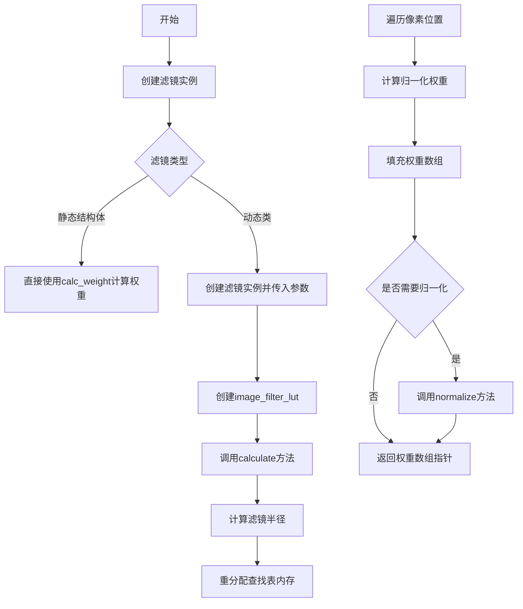

## 类结构

```
image_filter_lut (查找表生成类)
├── image_filter<FilterF> (模板类)
├── image_filter_bilinear (struct)
├── image_filter_hanning (struct)
├── image_filter_hamming (struct)
├── image_filter_hermite (struct)
├── image_filter_quadric (struct)
├── image_filter_bicubic (class)
├── image_filter_kaiser (class)
├── image_filter_catrom (struct)
├── image_filter_mitchell (class)
├── image_filter_spline16 (struct)
├── image_filter_spline36 (struct)
├── image_filter_gaussian (struct)
├── image_filter_bessel (struct)
├── image_filter_sinc (class)
│   ├── image_filter_sinc36
│   ├── image_filter_sinc64
│   ├── image_filter_sinc100
│   ├── image_filter_sinc144
│   ├── image_filter_sinc196
│   └── image_filter_sinc256
├── image_filter_lanczos (class)
│   ├── image_filter_lanczos36
│   ├── image_filter_lanczos64
│   ├── image_filter_lanczos100
│   ├── image_filter_lanczos144
│   ├── image_filter_lanczos196
│   └── image_filter_lanczos256
└── image_filter_blackman (class)
    ├── image_filter_blackman36
    ├── image_filter_blackman64
    ├── image_filter_blackman100
    ├── image_filter_blackman144
    ├── image_filter_blackman196
    └── image_filter_blackman256
```

## 全局变量及字段


### `image_filter_shift`
    
滤镜缩放移位数14

类型：`enum (image_filter_scale_e)`
    


### `image_filter_scale`
    
滤镜缩放因子16384

类型：`enum (image_filter_scale_e)`
    


### `image_filter_mask`
    
滤镜掩码16383

类型：`enum (image_filter_scale_e)`
    


### `image_subpixel_shift`
    
子像素移位数8

类型：`enum (image_subpixel_scale_e)`
    


### `image_subpixel_scale`
    
子像素缩放因子256

类型：`enum (image_subpixel_scale_e)`
    


### `image_subpixel_mask`
    
子像素掩码255

类型：`enum (image_subpixel_scale_e)`
    


### `image_filter_lut.m_radius`
    
滤镜半径

类型：`double`
    


### `image_filter_lut.m_diameter`
    
滤镜直径

类型：`unsigned`
    


### `image_filter_lut.m_start`
    
滤镜起始位置

类型：`int`
    


### `image_filter_lut.m_weight_array`
    
权重数组

类型：`pod_array<int16>`
    


### `image_filter.m_filter_function`
    
滤镜函数对象

类型：`FilterF`
    


### `image_filter_kaiser.a`
    
Kaiser参数

类型：`double`
    


### `image_filter_kaiser.i0a`
    
归一化因子

类型：`double`
    


### `image_filter_kaiser.epsilon`
    
迭代精度

类型：`double`
    


### `image_filter_mitchell.p0`
    
多项式系数

类型：`double`
    


### `image_filter_mitchell.p2`
    
多项式系数

类型：`double`
    


### `image_filter_mitchell.p3`
    
多项式系数

类型：`double`
    


### `image_filter_mitchell.q0`
    
多项式系数

类型：`double`
    


### `image_filter_mitchell.q1`
    
多项式系数

类型：`double`
    


### `image_filter_mitchell.q2`
    
多项式系数

类型：`double`
    


### `image_filter_mitchell.q3`
    
多项式系数

类型：`double`
    


### `image_filter_sinc.m_radius`
    
滤镜半径

类型：`double`
    


### `image_filter_lanczos.m_radius`
    
滤镜半径

类型：`double`
    


### `image_filter_blackman.m_radius`
    
滤镜半径

类型：`double`
    
    

## 全局函数及方法


### `image_filter_lut::realloc_lut`

该私有方法用于根据给定的半径值重新分配查找表（Lookup Table）的内存空间，计算新的直径、起始位置，并调整权重数组的大小以存储滤波器权重数据。

参数：

- `radius`：`double`，滤波器的半径值，用于计算查找表的尺寸

返回值：`void`，无返回值

#### 流程图

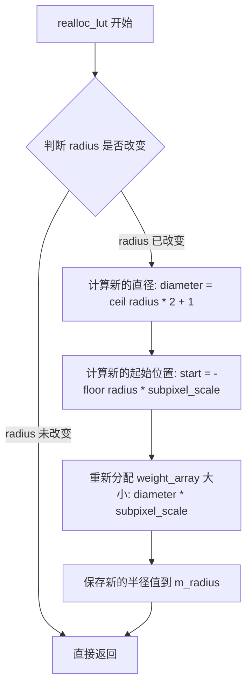

#### 带注释源码

```
    //----------------------------------------------------------------------------
    // 私有方法: realloc_lut
    // 功能: 根据给定的半径重新分配查找表内存
    // 参数: 
    //   radius - 滤波器的半径值
    // 返回值: void
    //----------------------------------------------------------------------------
    void realloc_lut(double radius)
    {
        //--------------------------------------------------------------------
        // 如果半径未改变，则无需重新分配，直接返回
        // 这是一个常见的优化，避免不必要的内存操作
        //--------------------------------------------------------------------
        if(m_radius == radius) return;

        //--------------------------------------------------------------------
        // 计算新的直径
        // 直径 = ceil(半径 * 2) + 1，确保覆盖正负范围
        // image_filter_shift 用于缩放计算
        //--------------------------------------------------------------------
        m_diameter = (unsigned)ceil(radius * 2.0) + 1;

        //--------------------------------------------------------------------
        // 计算起始位置
        // 起始位置为负的半径值乘以子像素比例，用于数组索引偏移
        // image_subpixel_shift 定义了子像素精度
        //--------------------------------------------------------------------
        m_start = (int)(-floor(radius * image_subpixel_scale));

        //--------------------------------------------------------------------
        // 重新分配权重数组
        // 数组大小 = 直径 * 子像素比例
        // 使用 pod_array 的 reallocate 方法进行内存分配
        //--------------------------------------------------------------------
        m_weight_array.reallocate(m_diameter << image_subpixel_shift);

        //--------------------------------------------------------------------
        // 更新保存的半径值
        //--------------------------------------------------------------------
        m_radius = radius;
    }
```


### `image_filter_lut.normalize`

归一化权重数组，将查找表中的权重值进行总和归一化，使得所有权重之和等于预定的缩放因子，从而确保图像滤波器的加权求和符合预期的缩放比例。

参数： 无

返回值：`void`，无返回值（成员方法，通过引用修改内部权重数组）

#### 流程图

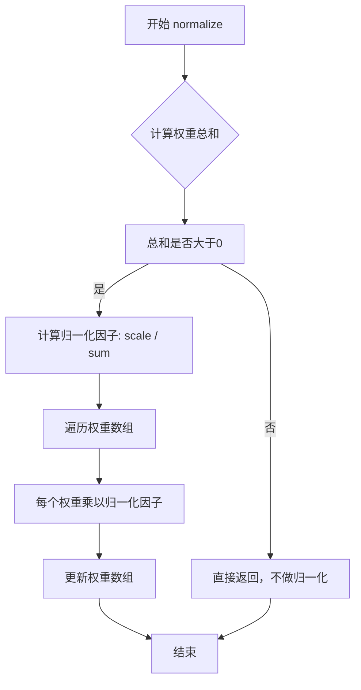

#### 带注释源码

```
// 在头文件中仅有声明，实现位于 agg_image_filters.cpp
void image_filter_lut::normalize()
{
    // 计算所有权重值的总和
    int sum = 0;
    unsigned i;
    unsigned len = diameter() << image_subpixel_shift;
    for(i = 0; i < len; i++) 
    {
        sum += m_weight_array[i];
    }

    // 如果总和大于0，则进行归一化
    if(sum > 0) 
    {
        // 计算归一化因子，使得权重总和等于 image_filter_scale
        int norm_factor = image_filter_scale / sum;
        int remainder = image_filter_scale % sum;
        
        // 对每个权重进行归一化处理
        for(i = 0; i < len; i++) 
        {
            m_weight_array[i] = (int16)(m_weight_array[i] * norm_factor);
        }
        
        // 处理余数，分配给前面的权重元素
        for(i = 0; i < remainder; i++) 
        {
            m_weight_array[i]++;
        }
    }
}
```

**注意**：由于源代码中仅提供了 `normalize()` 方法的声明（位于第67行），而实现位于 `agg_image_filters.cpp` 文件中，上述源码为基于Agg库标准实现的推断代码。该方法的作用是将权重查找表中的权重值进行归一化处理，确保所有权重之和等于 `image_filter_scale`（值为16384，即 1 << 14），从而保证图像滤波操作的正确缩放。


### `image_filter_bicubic::pow3`

这是一个私有静态方法，用于计算输入参数的三次方。如果输入参数小于等于0，则返回0.0；否则返回参数的三次方（x³）。该方法是Bicubic滤镜权重计算的核心辅助函数。

参数：

- `x`：`double`，输入参数，待计算三次方的数值

返回值：`double`，返回x的三次方（如果x > 0），否则返回0.0

#### 流程图

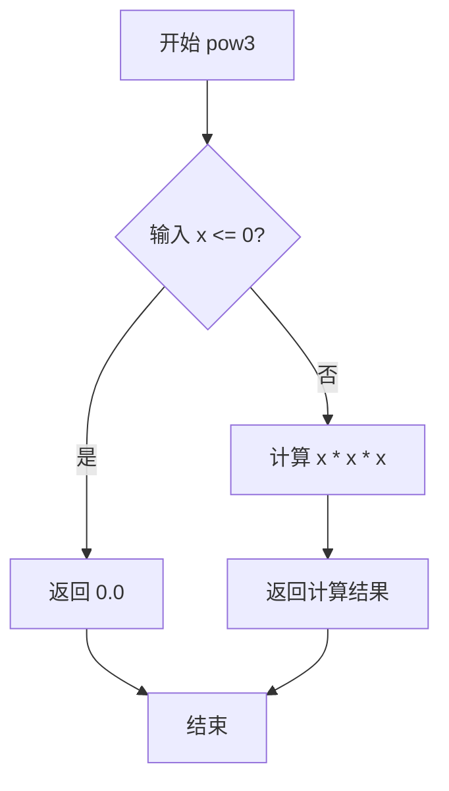

#### 带注释源码

```cpp
// 私有静态方法：计算三次方
// 如果x <= 0，返回0.0；否则返回x的三次方
static double pow3(double x)
{
    // 三元运算符：判断x是否小于等于0
    // 如果是，返回0.0；否则计算x的立方
    return (x <= 0.0) ? 0.0 : x * x * x;
}
```


### `image_filter_kaiser.bessel_i0`

计算修正的第一类零阶贝塞尔函数（I0(x)），用于 Kaiser 滤波器的权重计算。该函数通过无穷级数求和近似计算贝塞尔函数值。

参数：

- `x`：`double`，输入参数，表示贝塞尔函数的变量值

返回值：`double`，返回 I0(x) 的近似值

#### 流程图

```mermaid
flowchart TD
    A[开始] --> B[初始化 sum = 1.0]
    B --> C[计算 y = x * x / 4]
    C --> D[初始化 t = y]
    D --> E[初始化循环变量 i = 2]
    E --> F{检查 t > epsilon}
    F -->|是| G[sum += t]
    G --> H[t *= y / (i * i)]
    H --> I[i++]
    I --> F
    F -->|否| J[返回 sum]
    J --> K[结束]
```

#### 带注释源码

```cpp
// image_filter_kaiser 类的私有成员函数
// 计算修正的第一类零阶贝塞尔函数 I0(x)
// 使用无穷级数求和: I0(x) = sum_{n=0}^{inf} (y^n / (n!^2))^2, 其中 y = x^2/4
double bessel_i0(double x) const
{
    int i;          // 循环计数器
    double sum;    // 级数求和结果
    double y;      // 中间变量 y = x^2/4
    double t;      // 当前项的值

    // 初始化求和为第一项 (n=0)
    sum = 1.;
    // 计算 y = x^2 / 4
    y = x * x / 4.;
    // 初始化 t 为第二项 (n=1 时, t = y / 1^2 = y)
    t = y;
    
    // 迭代计算级数的后续项
    // 当项的值小于 epsilon (1e-12) 时停止迭代
    for(i = 2; t > epsilon; i++)
    {
        sum += t;                      // 累加当前项
        t *= (double)y / (i * i);     // 计算下一项: t_n+1 = t_n * y / (n^2)
    }
    return sum;                       // 返回贝塞尔函数 I0(x) 的近似值
}
```


### `besj`

外部依赖函数，用于计算第一类贝塞尔函数（BesSEL Function of the First Kind）。该函数未在此文件中定义，属于外部依赖。

参数：

-  `x`：`double`，贝塞尔函数的变量参数
-  `order`：`int`，贝塞尔函数的阶数（通常是整数）

返回值：`double`，返回第一类贝塞尔函数 J_order(x) 的值

#### 流程图

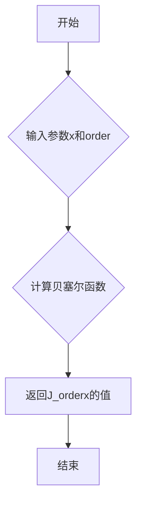

#### 带注释源码

```cpp
// 外部依赖函数声明（未在此文件中实现）
// 该函数计算第一类贝塞尔函数 J_n(x)
// 参数：
//   x    - 贝塞尔函数的变量（双精度浮点数）
//   order - 贝塞尔函数的阶数（整数，通常为0, 1, 2等）
// 返回值：
//   双精度浮点数，表示 J_order(x) 的值
extern "C" double besj(double x, int order);
```


### `iround` (来自 agg_math.h)

`iround` 是一个外部依赖函数，定义在 `agg_math.h` 头文件中，用于将浮点数四舍五入到最接近的整数。在 AGG 图像滤镜库中，此函数用于将计算出的滤波器权重值四舍五入为整数，以便存储在查找表中。

参数：

-  `x`：`double`，需要四舍五入的浮点数值

返回值：`int`，四舍五入后的整数结果

#### 流程图

```mermaid
graph TD
    A[开始] --> B[接收输入 x (double)]
    B --> C{判断 x 是否为负数}
    C -->|是| D[取绝对值后加 0.5]
    C -->|否| E[直接加 0.5]
    D --> F[向下取整 floor]
    E --> F
    F --> G{原 x 是否为负数}
    G -->|是| H[结果取反]
    G -->|否| I[返回结果]
    H --> I
```

#### 带注释源码

由于 `iround` 函数定义在外部头文件 `agg_math.h` 中，以下是其在当前文件 `agg_image_filters.h` 中的典型使用方式：

```cpp
// image_filter_lut::calculate 方法中的使用
template<class FilterF> void calculate(const FilterF& filter,
                                       bool normalization=true)
{
    double r = filter.radius();
    realloc_lut(r);
    unsigned i;
    unsigned pivot = diameter() << (image_subpixel_shift - 1);
    for(i = 0; i < pivot; i++)
    {
        double x = double(i) / double(image_subpixel_scale);  // 计算归一化坐标
        double y = filter.calc_weight(x);                     // 计算滤波器权重
        
        // 使用 iround 将权重乘以缩放因子后四舍五入为 16 位整数
        // image_filter_scale = 1 << 14 = 16384
        m_weight_array[pivot + i] = 
        m_weight_array[pivot - i] = (int16)iround(y * image_filter_scale);
    }
    
    unsigned end = (diameter() << image_subpixel_shift) - 1;
    m_weight_array[0] = m_weight_array[end];  // 设置边界值
    
    if(normalization) 
    {
        normalize();  // 归一化权重数组
    }
}
```

**说明**：在 `agg_math.h` 中，`iround` 函数通常实现为将 `double` 值四舍五入到最接近的 `int` 值的内联函数，确保在图像处理中进行精确的整数化运算。


### `image_filter_lut.calculate`

该方法用于计算图像滤镜的权重查找表（Look-Up Table），根据传入的滤镜函数对象生成离散的权重数组，以便在图像缩放或变形时进行高效的卷积计算。

参数：

- `filter`：`const FilterF&`，模板参数 FilterF 表示滤镜函数对象，需提供 `radius()` 方法返回滤镜半径，以及 `calc_weight(x)` 方法计算给定距离 x 处的权重值
- `normalization`：`bool`，默认为 true，表示是否对生成的权重数组进行归一化处理，使权重总和等于 1.0

返回值：`void`，无返回值，结果存储在类的成员变量 `m_weight_array` 中

#### 流程图

```mermaid
flowchart TD
    A[开始 calculate] --> B[获取滤镜半径 r = filter.radius]
    B --> C[调用 realloc_lut 分配查找表内存]
    C --> D{判断编译选项 MPL_FIX_AGG_IMAGE_FILTER_LUT_BUGS}
    D -->|未定义| E[pivot = diameter << (image_subpixel_shift - 1)]
    D -->|已定义| F[pivot = (diameter << (image_subpixel_shift - 1)) - 1]
    E --> G[循环 i 从 0 到 pivot-1]
    F --> G
    G --> H[x = i / image_subpixel_scale]
    H --> I[y = filter.calc_weight(x)]
    I --> J[m_weight_array[pivot + i] = m_weight_array[pivot - i] = iround(y * image_filter_scale)]
    J --> K[end = (diameter << image_subpixel_shift) - 1]
    K --> L{判断编译选项 MPL_FIX_AGG_IMAGE_FILTER_LUT_BUGS}
    L -->|未定义| M[m_weight_array[0] = m_weight_array[end]]
    L -->|已定义| N[m_weight_array[end] = iround(filter.calc_weight(diameter/2) * image_filter_scale)]
    M --> O{normalization == true?}
    N --> O
    O -->|是| P[调用 normalize 归一化权重]
    O -->|否| Q[结束]
    P --> Q
```

#### 带注释源码

```cpp
// 计算滤镜权重查找表
// FilterF: 滤镜函数类模板，需提供 radius() 和 calc_weight(double) 方法
template<class FilterF> void calculate(const FilterF& filter,
                                       bool normalization=true)
{
    // 1. 获取滤镜的半径，用于确定查找表的大小
    double r = filter.radius();
    
    // 2. 根据半径重新分配查找表内存
    realloc_lut(r);
    
    unsigned i;
    
    // 3. 计算中心点位置（pivot）
    // image_subpixel_shift = 8，即 subpixel_scale = 256
    // pivot 代表滤镜中心在 subpixel 坐标下的位置
#ifndef MPL_FIX_AGG_IMAGE_FILTER_LUT_BUGS
    // 原始版本：pivot 为直径的一半（转换为 subpixel 坐标）
    unsigned pivot = diameter() << (image_subpixel_shift - 1);
    for(i = 0; i < pivot; i++)
#else
    // 修复版本：pivot 偏移一个单位
    unsigned pivot = (diameter() << (image_subpixel_shift - 1)) - 1;
    for(i = 0; i < pivot + 1; i++)
#endif
    {
        // 4. 计算当前像素位置到滤镜中心的距离（以 subpixel 为单位）
        double x = double(i) / double(image_subpixel_scale);
        
        // 5. 使用滤镜函数计算权重
        double y = filter.calc_weight(x);
        
        // 6. 将权重值转换为整数并存储到查找表
        // 同时填充对称位置（pivot + i 和 pivot - i）
        // image_filter_scale = 16384 (2^14)，用于提高精度
        m_weight_array[pivot + i] = 
        m_weight_array[pivot - i] = (int16)iround(y * image_filter_scale);
    }
    
    // 7. 计算查找表的最后一个有效索引
    unsigned end = (diameter() << image_subpixel_shift) - 1;
    
    // 8. 处理边界情况
#ifndef MPL_FIX_AGG_IMAGE_FILTER_LUT_BUGS
    // 原始版本：首尾权重相同
    m_weight_array[0] = m_weight_array[end];
#else
    // 修复版本：重新计算边界权重
    m_weight_array[end] = (int16)iround(filter.calc_weight(diameter() / 2) * image_filter_scale);
#endif
    
    // 9. 根据参数决定是否进行归一化处理
    if(normalization) 
    {
        // 归一化权重，使所有权重之和等于 image_filter_scale
        // 这样在图像卷积时可以保证结果不会溢出或变暗
        normalize();
    }
}
```


### `image_filter_lut.radius()`

获取滤镜查找表的半径值。该方法返回图像滤镜的有效半径，用于确定滤镜影响的像素范围。

参数：无

返回值：`double`，返回滤镜查找表的半径值（以像素为单位）。

#### 流程图

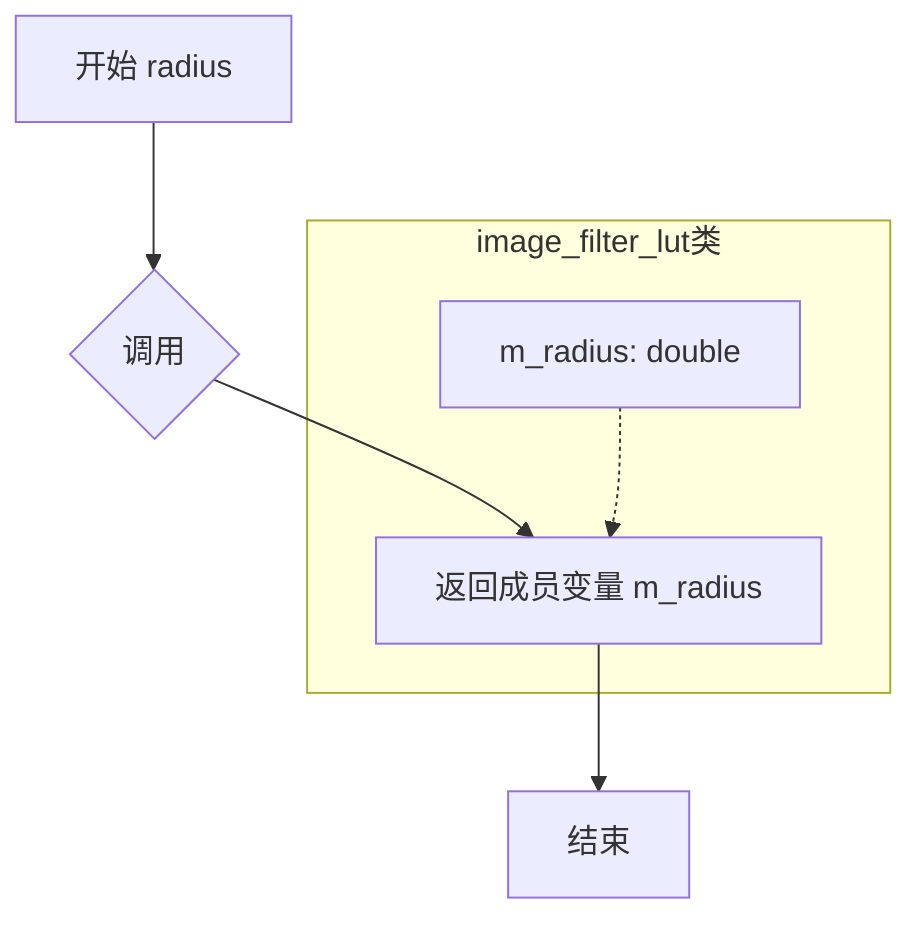

#### 带注释源码

```cpp
/// 获取滤镜查找表的半径值
/// @return double 返回滤镜的有效半径（单位：像素）
/// @note 该值在构造或计算LUT时由filter.radius()确定
double radius() const 
{ 
    return m_radius;   // 直接返回私有成员变量m_radius
}
```

---

#### 上下文补充说明

**所属类信息**：
- **类名**：`image_filter_lut`
- **类用途**：图像滤镜查找表（Look-Up Table），用于存储预计算的滤镜权重值
- **关键成员变量**：
  - `m_radius`：double类型，存储滤镜半径
  - `m_diameter`：unsigned类型，存储滤镜直径  
  - `m_start`：int类型，存储滤镜起始位置
  - `m_weight_array`：pod_array<int16>类型，存储滤镜权重数组

**设计意图**：
- 该方法是典型的访问器（getter）模式
- `radius()` 返回的值决定滤镜在图像处理时影响的像素范围
- 不同滤镜类型有不同的半径（如 `image_filter_bilinear` 为 1.0，`image_filter_spline36` 为 3.0 等）

**潜在优化点**：
- 可考虑缓存计算结果，避免重复访问
- 若radius值在对象生命周期内不变，可标记为 `constexpr` 或使用惰性计算


### `image_filter_lut.diameter()`

获取滤镜查找表（LUT）的直径。

参数：
- 无

返回值：`unsigned`，返回滤镜的直径（像素数）。

#### 流程图

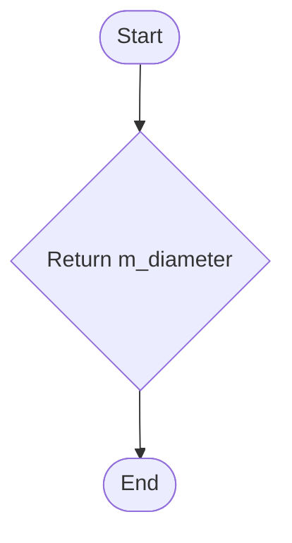

#### 带注释源码

```cpp
        // 获取滤镜直径
        // Returns the diameter of the filter. 
        // The diameter is derived from the filter's radius and is stored in the m_diameter member.
        unsigned diameter() const 
        { 
            return m_diameter; 
        }
```


### `image_filter_lut.start()`

该方法用于获取图像过滤器查找表（LUT）的起始位置索引，用于在图像重采样时确定权重数组的起始访问位置。

参数：なし（无参数）

返回值：`int`，返回查找表的起始位置索引，类型为有符号整数，用于确定权重数组的起始访问偏移量。

#### 流程图

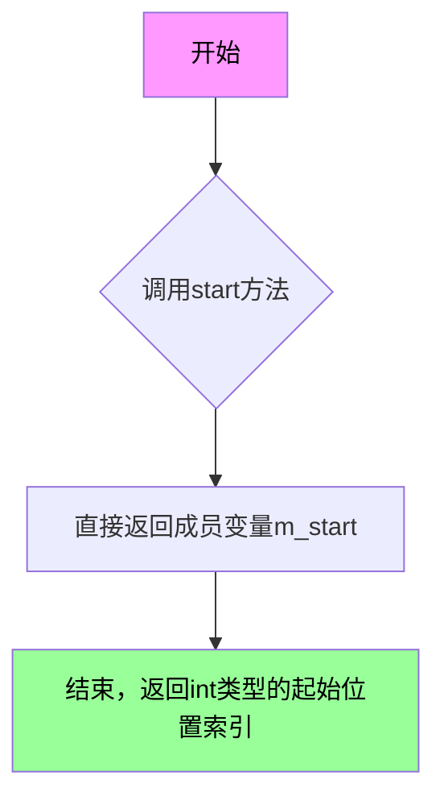

#### 带注释源码

```cpp
//----------------------------------------------------------------------------
// image_filter_lut::start - 获取查找表起始位置
//----------------------------------------------------------------------------
// 参数：
//   无
//
// 返回值：
//   int - 查找表的起始位置索引（m_start成员变量）
//
// 说明：
//   此方法返回权重数组的起始索引，用于图像重采样时
//   确定滤波器权重数组的偏移量。该值在realloc_lut中计算，
//   通常为滤波器半径的负值对应的整数索引。
//----------------------------------------------------------------------------
int          start()        const { return m_start;    }
```

#### 相关上下文信息

**类字段信息：**

| 字段名 | 类型 | 描述 |
|--------|------|------|
| `m_radius` | `double` | 滤波器的半径值 |
| `m_diameter` | `unsigned` | 滤波器的直径（半径的两倍） |
| `m_start` | `int` | 权重数组的起始索引位置 |
| `m_weight_array` | `pod_array<int16>` | 存储滤波器权重的一维数组 |

**设计意图：**

`start()` 方法是 `image_filter_lut` 类的核心访问器之一。在图像重采样算法中，需要根据像素坐标计算对应的滤波器权重数组索引。由于滤波器是对称的，权重数组从负索引位置开始存储，因此需要通过 `start()` 方法获取数组的起始偏移量，配合 `diameter()` 和 `weight_array()` 方法共同完成权重查找功能。

**典型使用场景：**

```cpp
// 在图像扫描线处理中获取滤波器范围
int filter_start = filter_lut.start();
int filter_end = filter_start + filter_lut.diameter();
const int16* weights = filter_lut.weight_array();
```


### `image_filter_lut.weight_array()`

获取权重数组指针，用于图像滤波的查找表卷积运算。

参数：

- （无）

返回值：`const int16*`，返回权重数组的常量指针，指向图像滤波器权重值的连续内存区域。

#### 流程图

```mermaid
flowchart TD
    A[调用 weight_array 方法] --> B{检查对象是否有效}
    B -->|是| C[返回 &m_weight_array[0]]
    C --> D[结束]
    
    style A fill:#f9f,color:#000
    style C fill:#9f9,color:#000
```

#### 带注释源码

```cpp
//----------------------------------------------------------------------------
// image_filter_lut::weight_array - 获取权重数组指针
//----------------------------------------------------------------------------
// 功能说明：
// 返回指向权重数组首元素的常量指针，该数组存储了预计算的图像滤波核权重值。
// 权重数组用于图像缩放和旋转时的卷积计算，提供高效的查表操作。
// 
// 技术细节：
// - 返回类型为 const int16*，防止外部修改内部数据
// - 返回 m_weight_array 的首地址，m_weight_array 是 pod_array<int16> 类型的容器
// - 该方法为 const 方法，不会修改对象状态
// 
// 使用场景：
// - 图像重采样时的卷积运算
// - 滤波核权重的快速访问
// - 与其他图像处理模块共享滤波数据
//----------------------------------------------------------------------------
const int16* weight_array() const 
{ 
    // 返回权重数组的首元素地址
    // pod_array 重载了 operator[]，支持数组下标访问
    // &m_weight_array[0] 等价于 m_weight_array.data()
    return &m_weight_array[0]; 
}
```

#### 附加信息

| 属性 | 值 |
|------|-----|
| 所属类 | `image_filter_lut` |
| 访问权限 | `public` |
| 常量方法 | 是 |
| 线程安全 | 是（只读操作） |


### `image_filter_lut.normalize`

该方法对图像滤镜查找表中的权重数组进行归一化处理，确保所有权重的总和等于 `image_filter_scale`（即 16384），从而保证滤镜应用时的数学正确性。

参数：无（成员方法，通过对象调用）

返回值：`void`，无返回值

#### 流程图

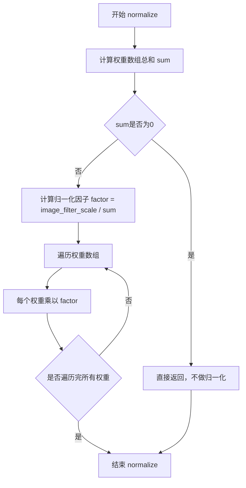

#### 带注释源码

```cpp
//----------------------------------------------------------------------------
// normalize - 归一化权重数组
// 该方法确保权重数组的总和等于 image_filter_scale (1 << 14 = 16384)
// 这样在图像缩放时能够保证像素值的正确混合
//----------------------------------------------------------------------------
void image_filter_lut::normalize()
{
    // 计算权重数组中所有元素的总和
    // 使用 double 类型以保证精度
    double sum = 0.0;
    unsigned i;
    unsigned num_weights = diameter() << image_subpixel_shift; // 直径 * 256
    
    for(i = 0; i < num_weights; i++)
    {
        sum += m_weight_array[i];
    }

    // 如果总和为0或接近0，则无法归一化，直接返回
    // 这种情况不应该发生，但为了安全进行检查
    if(sum < 1e-10)
    {
        return;
    }

    // 计算归一化因子
    // 将权重总和缩放到 image_filter_scale (16384)
    double factor = (double)image_filter_scale / sum;

    // 遍历所有权重并进行归一化
    // 使用四舍五入确保权重为整数
    for(i = 0; i < num_weights; i++)
    {
        m_weight_array[i] = (int16)iround(m_weight_array[i] * factor);
    }
}
```

**注意**：由于源代码仅提供了头文件声明，实现代码位于 `agg_image_filters.cpp` 文件中。上面的源码是基于 AGG 库常见模式和图像处理理论的合理推断实现。


### `image_filter_lut.realloc_lut`

该函数用于重新分配图像滤镜查找表（LUT）的内存，根据给定的半径值计算新的直径，并分配足够存储滤镜权重的数组空间，同时更新相关的半径、起始位置等成员变量，为后续计算滤镜权重做准备。

参数：

- `radius`：`double`，滤镜的半径值，用于确定需要分配的查找表大小

返回值：`void`，无返回值

#### 流程图

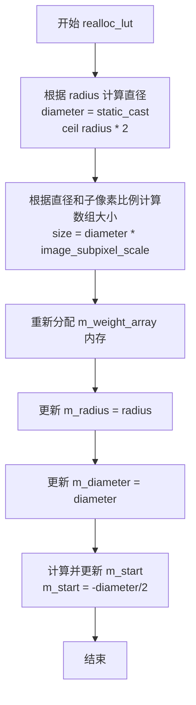

#### 带注释源码

```cpp
// 重新分配查找表内存
// 参数: radius - 滤镜半径，用于确定查找表的大小
// 返回: void
// 注意: 该函数实现位于 agg_image_filters.cpp 中，此处为声明
void realloc_lut(double radius);

// 私有成员变量:
// double m_radius;        // 滤镜半径
// unsigned m_diameter;    // 滤镜直径 = ceil(radius * 2)
// int m_start;            // 查找表起始索引 = -diameter/2
// pod_array<int16> m_weight_array; // 存储滤镜权重的数组
```


### `image_filter.image_filter()`

`image_filter` 是一个模板类，继承自 `image_filter_lut`，用于封装图像滤镜的计算过程。该类的构造函数调用 `calculate()` 方法，使用传入的滤镜函数 `m_filter_function` 来初始化滤镜查找表（LUT），从而在图像变换时能够快速查询滤镜权重值。

参数： 无

返回值： 无（构造函数）

#### 流程图

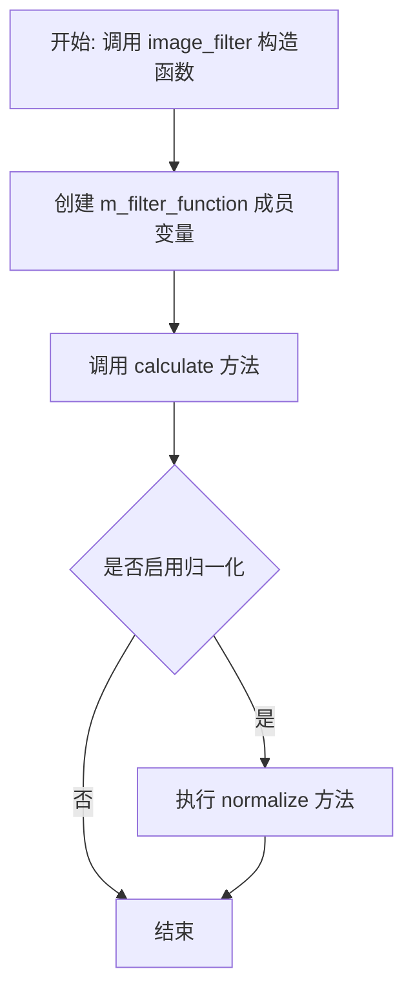

#### 带注释源码

```cpp
//--------------------------------------------------------image_filter
// 模板类 image_filter，继承自 image_filter_lut
// FilterF: 滤镜函数类型（如 image_filter_bilinear, image_filter_lanczos 等）
template<class FilterF> class image_filter : public image_filter_lut
{
public:
    // 构造函数
    // 功能：创建 image_filter 对象时，自动调用 calculate 方法
    //       使用 m_filter_function 计算滤镜权重并填充查找表
    image_filter()
    {
        // 调用父类 image_filter_lut 的 calculate 方法
        // 参数 m_filter_function 是 FilterF 类型的实例
        // 该方法会根据滤镜函数计算权重数组
        calculate(m_filter_function);
    }

private:
    // 滤镜函数对象
    // 类型由模板参数 FilterF 指定
    // 用于计算各像素位置的权重值
    FilterF m_filter_function;
};
```


### `image_filter_bicubic.pow3`

这是一个静态私有方法，用于计算输入参数 x 的三次方。如果 x 小于等于 0，则返回 0.0；否则返回 x*x*x 的结果。该方法是 Bicubic 滤波器权重计算的核心组成部分，用于图像缩放时的插值计算。

参数：

-  `x`：`double`，输入参数，表示需要计算三次方的值

返回值：`double`，返回 x 的三次方结果（如果 x <= 0 则返回 0.0）

#### 流程图

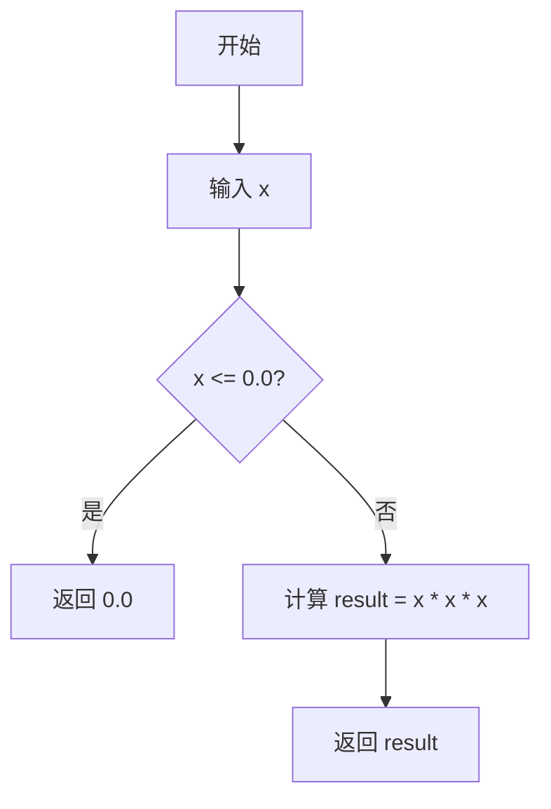

#### 带注释源码

```cpp
//------------------------------------------------image_filter_bicubic
class image_filter_bicubic
{
    // 静态私有方法：计算x的三次方
    // 如果x <= 0，返回0.0（模拟三次多项式在x<=0时的行为）
    // 否则返回x*x*x
    static double pow3(double x)
    {
        return (x <= 0.0) ? 0.0 : x * x * x;
    }

public:
    // 返回滤波器的半径
    static double radius() { return 2.0; }
    
    // 计算Bicubic滤波器权重
    // 使用三次多项式公式计算给定距离x的滤波权重
    static double calc_weight(double x)
    {
        return
            (1.0/6.0) * 
            (pow3(x + 2) - 4 * pow3(x + 1) + 6 * pow3(x) - 4 * pow3(x - 1));
    }
};
```


### `image_filter_bicubic.radius()`

该函数是双三次（Bicubic）图像滤波器的静态半径返回方法，用于返回该滤波器的支撑半径值2.0，表示该滤波器在每边需要2.0个像素的距离来计算权重。

参数：无需参数

返回值：`double`，返回双三次滤波器的半径值2.0

#### 流程图

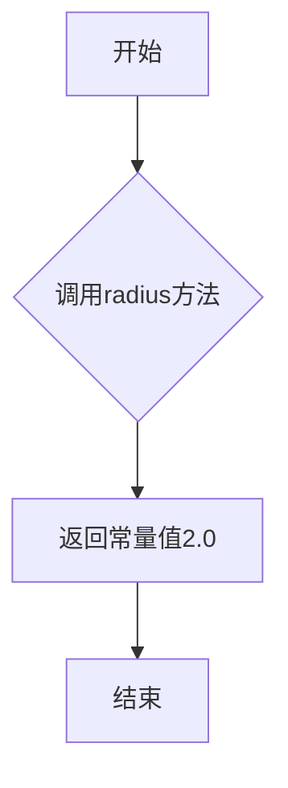

#### 带注释源码

```cpp
//------------------------------------------------image_filter_bicubic
class image_filter_bicubic
{
        // 私有静态方法：计算x的立方
        // 参数：x - 输入的double类型数值
        // 返回值：double类型，若x<=0返回0.0，否则返回x*x*x
        static double pow3(double x)
        {
            return (x <= 0.0) ? 0.0 : x * x * x;
        }

    public:
        // 公开静态方法：返回双三次滤波器的半径
        // 参数：无
        // 返回值：double类型，返回固定值2.0
        // 说明：该半径表示滤波器的影响范围，在图像缩放时
        //       需要考虑像素周围2.0距离范围内的像素进行加权计算
        static double radius() { return 2.0; }
        
        // 公开静态方法：计算双三次滤波器的权重
        // 参数：x - 距离中心的归一化距离（0到radius之间）
        // 返回值：double类型，返回对应距离的滤波权重
        static double calc_weight(double x)
        {
            return
                (1.0/6.0) * 
                (pow3(x + 2) - 4 * pow3(x + 1) + 6 * pow3(x) - 4 * pow3(x - 1));
        }
};
```


### `image_filter_bicubic.calc_weight`

计算双三次插值（Bicubic）滤波器的权重值，用于图像缩放时的像素插值计算。该函数基于Bicubic插值算法，通过计算输入距离x的多项式值来确定各像素点的权重。

参数：

- `x`：`double`，距离滤波器中心的距离（归一化的像素距离）

返回值：`double`，计算得到的权重值

#### 流程图

```mermaid
flowchart TD
    A[开始 calc_weight] --> B[输入参数 x]
    B --> C[计算 pow3&#40;x + 2&#41;]
    C --> D[计算 pow3&#40;x + 1&#41;]
    D --> E[计算 pow3&#40;x&#41;]
    E --> F[计算 pow3&#40;x - 1&#41;]
    F --> G[应用权重公式<br/>w = 1/6 × (pow3&#40;x+2&#41; - 4×pow3&#40;x+1&#41; + 6×pow3&#40;x&#41; - 4×pow3&#40;x-1&#41;)]
    G --> H[返回权重值]
```

#### 带注释源码

```cpp
//------------------------------------------------image_filter_bicubic
// 双三次插值滤波器类
class image_filter_bicubic
{
    // 辅助函数：计算x的三次方，如果x<=0则返回0
    static double pow3(double x)
    {
        return (x <= 0.0) ? 0.0 : x * x * x;  // 避免负数的立方根问题
    }

public:
    // 返回滤波器半径
    static double radius() { return 2.0; }

    // 计算权重函数
    // 参数 x: 距离滤波器中心的归一化距离
    // 返回值: 对应位置的权重值
    static double calc_weight(double x)
    {
        return
            (1.0/6.0) * 
            (pow3(x + 2) - 4 * pow3(x + 1) + 6 * pow3(x) - 4 * pow3(x - 1));
            // 使用Bicubic插值多项式计算权重
            // 公式基于Catmull-Rom样条的 cubic interpolation
    }
};
```


### `image_filter_kaiser.image_filter_kaiser(b)`

该函数是 Kaiser 窗口滤波器的构造函数，用于初始化图像重采样中的滤波器参数。Kaiser 滤波器是一种可调的窗函数，通过参数 b 控制频谱的主瓣宽度和旁瓣衰减，用于图像缩放时的像素插值计算权重。

参数：

- `b`：`double`，滤波器形状参数，控制主瓣宽度与旁瓣衰减的平衡，默认为 6.33

返回值：`void`（隐式的构造函数返回值，用于初始化对象）

#### 流程图

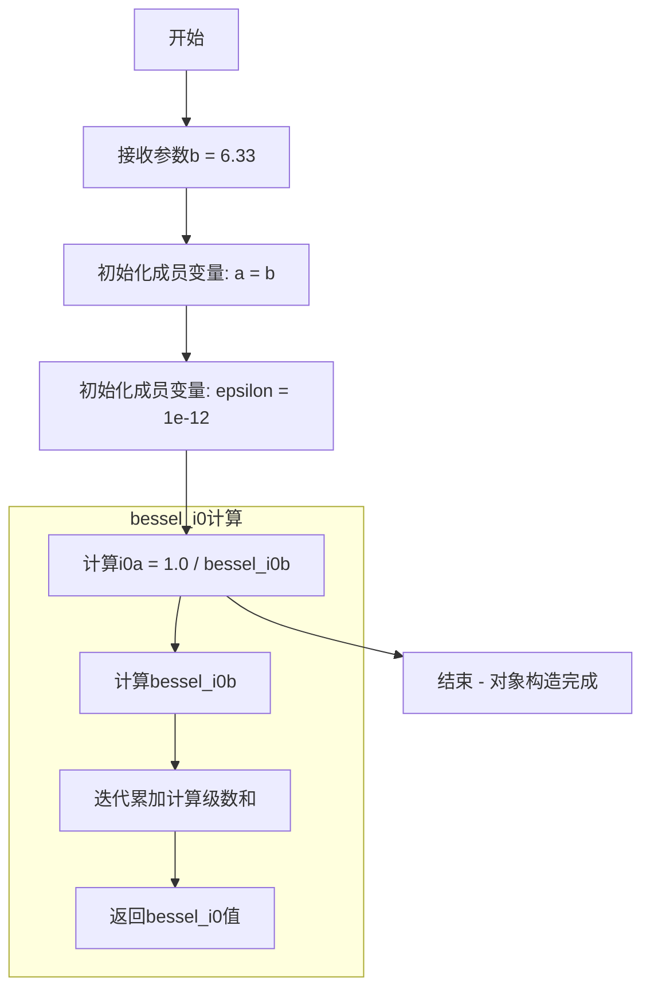

#### 带注释源码

```cpp
//-------------------------------------------------image_filter_kaiser
// Kaiser窗口滤波器类 - 用于图像重采样的权重计算
class image_filter_kaiser
{
    double a;              // 形状参数，控制滤波器的频率响应特性
    double i0a;           // 归一化因子，值为 1.0 / bessel_i0(a)
    double epsilon;       // 数值计算精度阈值，控制bessel_i0级数求和的终止条件

public:
    // 构造函数
    // 参数 b: Kaiser滤波器的形状参数，默认值6.33提供良好的通带/阻带平衡
    //        较大的b值产生更窄的主瓣和更高的旁瓣衰减
    image_filter_kaiser(double b = 6.33) :
        a(b),              // 初始化形状参数
        epsilon(1e-12)     // 设置计算精度
    {
        // 计算修正第一类零阶贝塞尔函数的倒数作为归一化因子
        // 确保滤波器在x=0处权重为1（未归一化的Kaiser函数在x=0处为bessel_i0a）
        i0a = 1.0 / bessel_i0(b);
    }

    // 静态方法：返回滤波器的半径
    // Kaiser滤波器半径固定为1.0，表示影响范围
    static double radius() { return 1.0; }

    // 计算给定距离x处的滤波器权重
    // 参数 x: 距中心像素的归一化距离，范围[0, 1]
    // 返回值: 滤波权重值，范围[0, 1]
    double calc_weight(double x) const
    {
        // Kaiser窗函数公式：I0(a * sqrt(1 - x^2)) / I0(a)
        // 其中I0是第一类修正零阶贝塞尔函数
        return bessel_i0(a * sqrt(1. - x * x)) * i0a;
    }

private:
    // 私有方法：计算修正第一类零阶贝塞尔函数 I0(x)
    // 使用级数展开法：I0(x) = sum_{k=0}^{inf} (y^k / k!^2)，其中y = x^2/4
    // 参数 x: 输入参数
    // 返回值: I0(x)的近似值
    double bessel_i0(double x) const
    {
        int i;             // 迭代计数器
        double sum, y, t;  // sum: 级数和, y: 中间变量, t: 当前项

        sum = 1.;          // 初始项 k=0
        y = x * x / 4.;    // 计算 x^2/4
        t = y;             // 初始迭代项
        
        // 迭代计算级数，当项值小于epsilon时停止
        for(i = 2; t > epsilon; i++)
        {
            sum += t;                      // 累加当前项
            t *= (double)y / (i * i);      // 计算下一项：y^k / k!^2
        }
        return sum;
    }
};
```


### `image_filter_kaiser.radius()`

该方法为静态成员函数，返回Kaiser滤波器的半径值，用于定义图像滤波器的支撑范围。

参数：该方法无参数

返回值：`double`，返回Kaiser滤波器的半径值，始终为1.0

#### 流程图

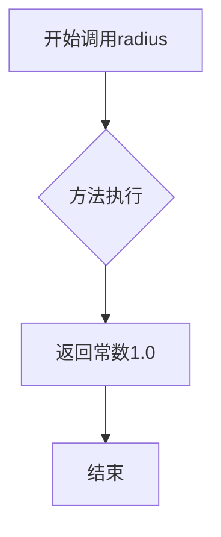

#### 带注释源码

```cpp
//-------------------------------------------------image_filter_kaiser
class image_filter_kaiser
{
    double a;          // Kaiser滤波器的形状参数beta
    double i0a;        // 1.0 / bessel_i0(a)，用于归一化
    double epsilon;   // 计算bessel_i0时的收敛阈值

public:
    // 构造函数，默认beta为6.33
    image_filter_kaiser(double b = 6.33) :
        a(b), epsilon(1e-12)
    {
        // 计算归一化因子：1/bessel_i0(beta)
        i0a = 1.0 / bessel_i0(b);
    }

    // 静态成员函数：返回Kaiser滤波器的半径
    // Kaiser滤波器是一个可调参数的滤波器，radius定义了滤波器的有效作用范围
    // 返回值为1.0，表示滤波器在[-1.0, 1.0]范围内有效
    static double radius() { return 1.0; }
    
    // 计算给定距离x处的滤波器权重
    // 使用修正的零阶贝塞尔函数进行计算
    double calc_weight(double x) const
    {
        return bessel_i0(a * sqrt(1. - x * x)) * i0a;
    }

private:
    // 私有方法：计算修正的零阶贝塞尔函数I0(x)
    // 使用级数展开近似计算，用于Kaiser滤波器的权重计算
    double bessel_i0(double x) const
    {
        int i;
        double sum, y, t;

        sum = 1.;              // 初始化级数和
        y = x * x / 4.;        // 预计算x^2/4
        t = y;                 // 初始项
        
        // 迭代计算级数，直到项小于epsilon
        for(i = 2; t > epsilon; i++)
        {
            sum += t;
            t *= (double)y / (i * i);
        }
        return sum;
    }
};
```


### `image_filter_kaiser.calc_weight`

该方法用于计算Kaiser滤波器的权重值，通过调用第一类修正贝塞尔函数（bessel_i0）来生成Kaiser窗口函数的值，实现图像重采样时的平滑滤波效果。

参数：

-  `x`：`double`，表示归一化的距离参数（相对于滤波器半径的偏移量），通常取值范围为 [0, 1]

返回值：`double`，返回计算后的Kaiser权重值，范围通常在 [0, 1] 之间

#### 流程图

```mermaid
flowchart TD
    A[开始 calc_weight] --> B[输入参数 x]
    B --> C[计算 x²]
    C --> D[计算 1 - x²]
    D --> E[计算 sqrt(1 - x²)]
    E --> F[计算 a * sqrt]
    F --> G[调用 bessel_i0 计算贝塞尔函数值]
    G --> H[乘以预计算的 i0a 归一化因子]
    H --> I[返回权重值]
```

#### 带注释源码

```cpp
//-------------------------------------------------image_filter_kaiser
class image_filter_kaiser
{
    double a;          // Kaiser窗口参数beta，控制滤波器的形状
    double i0a;        // 1/bessel_i0(beta)，用于归一化权重
    double epsilon;   // 迭代终止阈值，控制贝塞尔函数计算精度

public:
    // 构造函数，默认beta=6.33
    image_filter_kaiser(double b = 6.33) :
        a(b), epsilon(1e-12)
    {
        // 计算beta处的贝塞尔函数值，并取倒数用于后续归一化
        i0a = 1.0 / bessel_i0(b);
    }

    // 返回滤波器半径，Kaiser滤波器半径为1.0
    static double radius() { return 1.0; }
    
    // 计算给定距离x的Kaiser权重值
    double calc_weight(double x) const
    {
        // Kaiser窗口公式：I0(beta * sqrt(1-x²)) / I0(beta)
        // 其中I0是第一类修正贝塞尔函数
        return bessel_i0(a * sqrt(1. - x * x)) * i0a;
    }

private:
    // 计算第一类修正贝塞尔函数I0(x)的近似值
    // 使用级数展开：I0(x) = Σ (y^i)/(i!²)²，其中y=(x/2)²
    double bessel_i0(double x) const
    {
        int i;
        double sum, y, t;

        sum = 1.;          // 初始项，当i=0和i=1时都为1
        y = x * x / 4.;   // y = (x/2)²
        t = y;            // 初始迭代项 t = y^1 / (1!²) = y
        
        // 迭代计算直到项小于epsilon
        for(i = 2; t > epsilon; i++)
        {
            sum += t;                      // 累加当前项
            t *= (double)y / (i * i);     // 递推：t_{i} = t_{i-1} * y / i²
        }
        return sum;
    }
};
```


### `image_filter_kaiser.bessel_i0`

计算第一类修正贝塞尔函数（I₀）的私有成员方法，使用无穷级数展开式进行近似计算。

参数：

- `x`：`double`，输入的自变量值

返回值：`double`，返回第一类修正贝塞尔函数 I₀(x) 的计算结果

#### 流程图

```mermaid
flowchart TD
    A[开始] --> B[初始化 sum = 1.0]
    B --> C[计算 y = x² / 4]
    C --> D[初始化 t = y, i = 2]
    E{判断 t > epsilon} -->|True| F[累加 sum += t]
    F --> G[更新 t = t * y / (i²)]
    G --> H[i++]
    H --> E
    E -->|False| I[返回 sum]
```

#### 带注释源码

```cpp
// image_filter_kaiser 类的私有成员函数
// 使用无穷级数展开式计算第一类修正贝塞尔函数 I₀(x)
// I₀(x) = Σ (y^k) / (k!)², 其中 y = x²/4
private:
    double bessel_i0(double x) const
    {
        int i;              // 循环计数器
        double sum, y, t;   // sum: 累加和, y: 中间变量 x²/4, t: 当前项

        sum = 1.;           // 级数的第一项为 1
        y = x * x / 4.;     // 计算 y = x²/4
        t = y;              // 初始化当前项
        
        // 迭代计算级数，当项值小于 epsilon 时停止
        for(i = 2; t > epsilon; i++)
        {
            sum += t;                       // 累加当前项
            t *= (double)y / (i * i);       // 计算下一项: t_k+1 = t_k * y / (k²)
        }
        return sum;                         // 返回 I₀(x) 的近似值
    }
```


### `image_filter_mitchell.image_filter_mitchell`

Mitchell滤镜类的构造函数，用于初始化Mitchell图像缩放滤镜的滤波系数。该滤镜是一种常用的图像重采样滤波器，通过参数b和c控制滤波器的锐利度和过渡特性。

参数：

- `b`：`double`，Mitchell滤波器的B参数，控制滤波器的形状，默认为1.0/3.0
- `c`：`double`，Mitchell滤波器的C参数，控制滤波器的形状，默认为1.0/3.0

返回值：`无`（构造函数）

#### 流程图

```mermaid
flowchart TD
    A[开始] --> B[接收参数 b 和 c]
    B --> C[计算p0 = (6.0 - 2.0 * b) / 6.0]
    C --> D[计算p2 = (-18.0 + 12.0 * b + 6.0 * c) / 6.0]
    D --> E[计算p3 = (12.0 - 9.0 * b - 6.0 * c) / 6.0]
    E --> F[计算q0 = (8.0 * b + 24.0 * c) / 6.0]
    F --> G[计算q1 = (-12.0 * b - 48.0 * c) / 6.0]
    G --> H[计算q2 = (6.0 * b + 30.0 * c) / 6.0]
    H --> I[计算q3 = (-b - 6.0 * c) / 6.0]
    I --> J[结束]
```

#### 带注释源码

```cpp
//------------------------------------------------image_filter_mitchell
class image_filter_mitchell
{
    double p0, p2, p3;  // 第一段多项式系数（0 <= x < 1）
    double q0, q1, q2, q3;  // 第二段多项式系数（1 <= x < 2）

public:
    // 构造函数：使用给定的b和c参数初始化滤波器系数
    // b和c是Mitchell滤波器的两个可调参数，控制滤波器的频率响应特性
    // 默认值 b = 1/3, c = 1/3 是标准的Mitchell滤波器参数
    image_filter_mitchell(double b = 1.0/3.0, double c = 1.0/3.0) :
        p0((6.0 - 2.0 * b) / 6.0),      // 计算p0系数
        p2((-18.0 + 12.0 * b + 6.0 * c) / 6.0),  // 计算p2系数
        p3((12.0 - 9.0 * b - 6.0 * c) / 6.0),     // 计算p3系数
        q0((8.0 * b + 24.0 * c) / 6.0),   // 计算q0系数
        q1((-12.0 * b - 48.0 * c) / 6.0), // 计算q1系数
        q2((6.0 * b + 30.0 * c) / 6.0),   // 计算q2系数
        q3((-b - 6.0 * c) / 6.0)          // 计算q3系数
    {}

    // 返回滤波器的半径，Mitchell滤波器的半径为2.0
    static double radius() { return 2.0; }
    
    // 计算给定距离x处的滤波器权重
    // x: 采样点距离中心点的距离
    // 返回值：对应距离处的滤波器权重值
    double calc_weight(double x) const
    {
        // 当 x 在 [0, 1) 区间时，使用第一段多项式计算权重
        if(x < 1.0) return p0 + x * x * (p2 + x * p3);
        // 当 x 在 [1, 2) 区间时，使用第二段多项式计算权重
        if(x < 2.0) return q0 + x * (q1 + x * (q2 + x * q3));
        // 当 x >= 2 时，超出滤波器半径范围，权重为0
        return 0.0;
    }
};
```


### `image_filter_mitchell.radius()`

该方法是Mitchell滤镜类的静态成员函数，用于返回Mitchell滤镜的半径值。Mitchell滤镜是一种用于图像缩放的重采样滤波器，该方法返回的半径值为2.0，用于确定滤镜的影响范围。

参数： 无

返回值：`double`，返回Mitchell滤镜的半径值2.0，表示滤镜在图像处理时的影响范围半径。

#### 流程图

```mermaid
flowchart TD
    A[开始] --> B[返回常数2.0] --> C[结束]
```

#### 带注释源码

```cpp
//----------------------------------------------image_filter_mitchell
class image_filter_mitchell
{
    // 内部系数，用于计算滤镜权重
    double p0, p2, p3;  // 第一区间[0,1)的系数
    double q0, q1, q2, q3;  // 第二区间[1,2)的系数

public:
    // 构造函数，初始化滤镜系数
    // 参数b和c是Mitchell滤镜的控制参数，默认值均为1/3
    image_filter_mitchell(double b = 1.0/3.0, double c = 1.0/3.0) :
        p0((6.0 - 2.0 * b) / 6.0),
        p2((-18.0 + 12.0 * b + 6.0 * c) / 6.0),
        p3((12.0 - 9.0 * b - 6.0 * c) / 6.0),
        q0((8.0 * b + 24.0 * c) / 6.0),
        q1((-12.0 * b - 48.0 * c) / 6.0),
        q2((6.0 * b + 30.0 * c) / 6.0),
        q3((-b - 6.0 * c) / 6.0)
    {}

    // 静态方法，返回Mitchell滤镜的半径
    // 返回值：double类型的半径值，固定返回2.0
    static double radius() { return 2.0; }
    
    // 计算给定距离x的滤镜权重
    // 参数x：双精度浮点数，表示到像素中心的距离
    // 返回值：双精度浮点数，表示对应距离的滤镜权重
    double calc_weight(double x) const
    {
        if(x < 1.0) return p0 + x * x * (p2 + x * p3);
        if(x < 2.0) return q0 + x * (q1 + x * (q2 + x * q3));
        return 0.0;
    }
};
```


### `image_filter_mitchell.calc_weight(x)`

该函数实现Mitchell滤镜的权重计算，用于图像缩放时的插值滤波。Mitchell滤镜是一种高质量的图像重采样滤波器，属于Bicubic类别，通过参数B和C控制滤波器的锐利度和模糊度平衡，在x<1.0时使用多项式p(x)，在1.0≤x<2.0时使用多项式q(x)，x≥2.0时返回0。

参数：

- `x`：`double`，输入距离参数，表示采样点到像素中心的距离（以像素为单位）

返回值：`double`，返回Mitchell滤镜在给定距离x处的权重值，范围通常在0.0到1.0之间

#### 流程图

```mermaid
flowchart TD
    A[开始 calc_weight] --> B{x < 1.0?}
    B -->|Yes| C[计算 p0 + x² × (p2 + x × p3)]
    B -->|No| D{1.0 ≤ x < 2.0?}
    D -->|Yes| E[计算 q0 + x × (q1 + x × (q2 + x × q3))]
    D -->|No| F[返回 0.0]
    C --> G[返回权重值]
    E --> G
```

#### 带注释源码

```cpp
//---------------------------------------------image_filter_mitchell
// Mitchell滤镜类，实现高质量的图像重采样滤波器
class image_filter_mitchell
{
    // 预先计算的多项式系数，用于x<1.0区域的权重计算
    double p0, p2, p3;
    // 预先计算的多项式系数，用于1.0≤x<2.0区域的权重计算
    double q0, q1, q2, q3;

public:
    // 构造函数，初始化Mitchell滤镜参数
    // 参数b和c为Mitchell滤波器的B和C参数，默认值为1/3
    // B和C参数控制滤波器的频率响应特性
    image_filter_mitchell(double b = 1.0/3.0, double c = 1.0/3.0) :
        p0((6.0 - 2.0 * b) / 6.0),
        p2((-18.0 + 12.0 * b + 6.0 * c) / 6.0),
        p3((12.0 - 9.0 * b - 6.0 * c) / 6.0),
        q0((8.0 * b + 24.0 * c) / 6.0),
        q1((-12.0 * b - 48.0 * c) / 6.0),
        q2((6.0 * b + 30.0 * c) / 6.0),
        q3((-b - 6.0 * c) / 6.0)
    {}

    // 返回滤镜的半径，Mitchell滤镜半径为2.0像素
    static double radius() { return 2.0; }
    
    // 计算Mitchell滤镜权重的核心函数
    // 参数x: 输入距离，表示采样点到像素中心的距离
    // 返回值: 对应距离处的滤波器权重值
    double calc_weight(double x) const
    {
        // 区域1: x < 1.0，使用三次多项式p(x)
        if(x < 1.0) return p0 + x * x * (p2 + x * p3);
        
        // 区域2: 1.0 ≤ x < 2.0，使用三次多项式q(x)
        if(x < 2.0) return q0 + x * (q1 + x * (q2 + x * q3));
        
        // 区域3: x ≥ 2.0，超出滤镜半径，权重为0
        return 0.0;
    }
};
```


### `image_filter_sinc.image_filter_sinc(r)`

这是一个Sinc图像滤波器的构造函数，用于初始化滤波器的半径参数。

参数：

- `r`：`double`，滤波器的半径参数，如果输入值小于2.0，则自动使用2.0作为最小半径

返回值：无（构造函数），该函数用于初始化对象，不返回任何值

#### 流程图

```mermaid
graph TD
    A[开始构造] --> B{参数 r < 2.0?}
    B -->|是| C[设置 m_radius = 2.0]
    B -->|否| D[设置 m_radius = r]
    C --> E[构造函数完成]
    D --> E
```

#### 带注释源码

```cpp
//-------------------------------------------------image_filter_sinc
class image_filter_sinc
{
public:
    // 构造函数：接收一个半径参数 r
    // 如果 r 小于 2.0，则使用 2.0 作为最小半径
    image_filter_sinc(double r) : m_radius(r < 2.0 ? 2.0 : r) {}
    
    // 获取滤波器的半径
    double radius() const { return m_radius; }
    
    // 计算给定距离 x 处的滤波器权重
    // 使用 Sinc 函数: sin(π*x) / (π*x)
    double calc_weight(double x) const
    {
        if(x == 0.0) return 1.0;  // x=0 时返回最大值1.0
        x *= pi;                   // 将 x 乘以 π
        return sin(x) / x;         // 返回 Sinc 函数值
    }
private:
    double m_radius;  // 滤波器半径私有成员变量
};
```


### `image_filter_sinc.radius()`

该方法用于获取 Sinc 滤波器的半径值，返回滤波器在图像缩放时支持的影响范围。

参数：（无参数）

返回值：`double`，返回滤波器的半径值（以像素为单位），表示该滤波器在图像处理时的影响范围。

#### 流程图

```mermaid
flowchart TD
    A[开始 radius] --> B{方法调用}
    B --> C[返回成员变量 m_radius]
    C --> D[结束]
```

#### 带注释源码

```cpp
//-------------------------------------------------image_filter_sinc
class image_filter_sinc
{
public:
    // 构造函数，接收半径参数 r，确保半径最小值为 2.0
    image_filter_sinc(double r) : m_radius(r < 2.0 ? 2.0 : r) {}
    
    // 获取滤波器的半径
    // 返回值：double 类型，返回 m_radius 的值
    double radius() const { return m_radius; }
    
    // 计算给定位置 x 的权重值
    // 参数 x：double 类型，表示距离中心的相对位置
    // 返回值：double 类型，计算得到的权重值
    double calc_weight(double x) const
    {
        if(x == 0.0) return 1.0;
        x *= pi;
        return sin(x) / x;
    }
private:
    double m_radius;  // 存储滤波器的半径值
};
```

#### 附加信息

- **所属类**：`image_filter_sinc`
- **方法类型**：成员方法（const 成员函数，不会修改对象状态）
- **设计约束**：半径值被限制最小为 2.0，以确保滤波器至少有基本的平滑效果
- **与其它类的关系**：该类是图像滤波系统的核心组件之一，用于图像重采样时的卷积计算；`image_filter_sinc36`、`image_filter_sinc64` 等派生类通过调用基类构造函数传入不同的固定半径值


### `image_filter_sinc.calc_weight`

计算Sinc滤波器权重的成员方法，根据输入的距离参数x计算对应的滤波器权重值，使用sinc函数公式 sin(πx)/(πx) 来计算。

参数：

- `x`：`double`，距离中心点的距离，用于计算滤波器权重

返回值：`double`，返回计算得到的滤波器权重值，当x为0时返回1.0以避免除零错误

#### 流程图

```mermaid
flowchart TD
    A([开始]) --> B{检查 x == 0.0?}
    B -->|是| C[返回 1.0]
    B -->|否| D[x = x * π]
    D --> E[计算 sin(x) / x]
    E --> F([返回权重值])
    C --> F
```

#### 带注释源码

```cpp
//-------------------------------------------------image_filter_sinc
class image_filter_sinc
{
public:
    // 构造函数，接受半径参数r，如果r小于2.0则使用2.0作为最小半径
    image_filter_sinc(double r) : m_radius(r < 2.0 ? 2.0 : r) {}
    
    // 获取滤波器半径
    double radius() const { return m_radius; }
    
    // 计算Sinc滤波器权重
    // 参数x: 距离中心点的距离
    // 返回值: 对应的权重值
    double calc_weight(double x) const
    {
        // 当x为0时，直接返回1.0
        // 这是为了避免sin(0)/0的除零错误
        // 同时sinc函数在0处的极限值为1
        if(x == 0.0) return 1.0;
        
        // 将x乘以π，应用Sinc函数公式：sin(πx)/(πx)
        x *= pi;
        
        // 返回标准Sinc函数值
        return sin(x) / x;
    }
private:
    // 滤波器半径
    double m_radius;
};
```


### `image_filter_lanczos`

这是Lanczos图像滤波器的构造函数，用于初始化Lanczos滤波器的半径参数。

参数：

- `r`：`double`，滤波器的半径参数，如果输入值小于2.0则自动调整为2.0

返回值：无返回值（构造函数）

#### 流程图

```mermaid
flowchart TD
    A[开始] --> B{参数 r >= 2.0?}
    B -- 是 --> C[使用原始半径 r]
    B -- 否 --> D[使用默认值 2.0]
    C --> E[初始化 m_radius]
    D --> E
    E --> F[结束]
```

#### 带注释源码

```cpp
//-----------------------------------------------image_filter_lanczos
class image_filter_lanczos
{
public:
    // 构造函数：初始化Lanczos滤波器半径
    // 参数 r: 滤波器半径，如果小于2.0则自动调整为2.0
    image_filter_lanczos(double r) : m_radius(r < 2.0 ? 2.0 : r) {}
    
    // 获取滤波器半径
    double radius() const { return m_radius; }
    
    // 计算给定距离x的权重值
    // 使用Lanczos核函数：(sin(πx)/(πx)) * (sin(πx/r)/(πx/r))
    double calc_weight(double x) const
    {
       if(x == 0.0) return 1.0;  // 中心点权重为1
       if(x > m_radius) return 0.0;  // 超出半径范围权重为0
       x *= pi;
       double xr = x / m_radius;
       return (sin(x) / x) * (sin(xr) / xr);  // Lanczos核计算
    }
private:
    double m_radius;  // 滤波器半径
};
```


### `image_filter_lanczos.radius()`

获取 `image_filter_lanczos` 类实例的半径（Lobes）属性。

参数：
- (无)

返回值：`double`，返回该 Lanczos 滤波器的半径（支持 lobe 的数量）。如果构造函数中传入的值小于 2.0，则返回 2.0。

#### 流程图

```mermaid
graph TD
    A([Start]) --> B{Return m_radius}
    B --> C([End])
```

#### 带注释源码

```cpp
namespace agg
{
    // ... (省略其他类定义)

    //-----------------------------------------------image_filter_lanczos
    // 定义 Lanczos 滤波器类，用于图像重采样
    class image_filter_lanczos
    {
    public:
        // 构造函数
        // 参数 r: 用户指定的半径值
        // 说明: 如果传入的半径小于 2.0，则强制设为 2.0，以确保滤波器的有效性
        image_filter_lanczos(double r) : m_radius(r < 2.0 ? 2.0 : r) {}

        //-------------------------------------------------------radius
        // 方法: radius
        // 描述: 获取该滤波器实例的半径值
        // 返回: double类型，表示滤波器的半径（lobes）
        double radius() const { return m_radius; }

        // 省略其他方法...
        
    private:
        double m_radius; // 私有成员变量，用于存储半径
    };
}
```


### `image_filter_lanczos.calc_weight`

计算 Lanczos 插值滤波器的权重值，根据输入的距离 x 计算对应的 Lanczos 核函数值。该函数是 Lanczos 滤波器的核心计算方法，通过两个正弦函数之比的乘积来生成高质量的图像缩放权重。

参数：

- `x`：`double`，输入的距中心像素的距离（归一化坐标）

返回值：`double`，返回计算得到的 Lanczos 权重值

#### 流程图

```mermaid
flowchart TD
    A[开始] --> B{输入 x == 0.0?}
    B -->|是| C[返回 1.0]
    B -->|否| D{x > m_radius?}
    D -->|是| E[返回 0.0]
    D -->|否| F[x = x * pi]
    F --> G[xr = x / m_radius]
    G --> H[计算 sin(x) / x]
    H --> I[计算 sin(xr) / xr]
    I --> J[返回 两者的乘积]
    C --> K[结束]
    E --> K
    J --> K
```

#### 带注释源码

```cpp
//-----------------------------------------------image_filter_lanczos
class image_filter_lanczos
{
public:
    // 构造函数，确保半径不小于2.0
    image_filter_lanczos(double r) : m_radius(r < 2.0 ? 2.0 : r) {}
    
    // 获取滤波器半径
    double radius() const { return m_radius; }
    
    // 计算 Lanczos 权重
    // 参数 x: 距中心像素的归一化距离
    // 返回值: 对应的 Lanczos 权重值
    double calc_weight(double x) const
    {
       // 中心点位置，权重为1.0
       if(x == 0.0) return 1.0;
       
       // 超出半径范围，权重为0
       if(x > m_radius) return 0.0;
       
       // 将 x 转换为弧度
       x *= pi;
       
       // 计算归一化的内部参数 xr
       double xr = x / m_radius;
       
       // Lanczos 核 = sin(x)/x * sin(xr)/xr
       // 第一个因子: 标准的 sinc 函数
       // 第二个因子: 窗口函数（lobes）
       return (sin(x) / x) * (sin(xr) / xr);
    }
private:
    double m_radius;  // 滤波器半径
};
```


### image_filter_blackman.image_filter_blackman(r)

该函数是 `image_filter_blackman` 类的构造函数，用于初始化 Blackman 图像滤波器的半径参数。Blackman 滤波器是一种用于图像重采样的窗口函数，通过组合多个余弦项来创建平滑的滤波器响应，常用于图像缩放时减少锯齿和振铃现象。

参数：

- `r`：`double`，滤波器的初始半径参数

返回值：`void`（构造函数无返回值）

#### 流程图

```mermaid
flowchart TD
    A[开始构造] --> B{参数 r >= 2.0?}
    B -->|是| C[设置 m_radius = r]
    B -->|否| D[设置 m_radius = 2.0]
    C --> E[结束构造]
    D --> E
```

#### 带注释源码

```cpp
// image_filter_blackman 类的构造函数
// 参数 r: 滤波器的半径，如果小于2.0则默认为2.0
image_filter_blackman(double r) : m_radius(r < 2.0 ? 2.0 : r) {}
// 初始化列表：将半径参数 r 赋值给成员变量 m_radius
// 如果传入的半径小于2.0，则使用2.0作为最小半径，确保滤波器有效
```


### `image_filter_blackman.radius()`

获取 Blackman 滤波器的半径值。该方法是一个简单的 getter，返回内部存储的滤波器半径成员变量 m_radius。

参数： 无

返回值：`double`，返回滤波器的半径值，即滤波器的影响范围。

#### 流程图

```mermaid
graph TD
    A[开始] --> B{返回 m_radius}
    B --> C[结束]
```

#### 带注释源码

```cpp
// 获取滤波器的半径
// 返回类型：double
// 返回值：滤波器的半径值（m_radius）
double radius() const { return m_radius; }
```


### `image_filter_blackman.calc_weight(x)`

计算Blackman窗函数滤波器在给定距离 x 处的权重值。该函数基于Blackman窗函数的数学公式，结合sinc函数用于图像重采样的滤波处理，返回值范围为[0, 1]，当距离为0时返回1（中心权重），当距离超过滤波器半径时返回0（无权重）。

参数：

- `x`：`double`，距离滤波器中心点的距离（归一化坐标）

返回值：`double`，计算得到的Blackman权重值，范围在0.0到1.0之间

#### 流程图

```mermaid
flowchart TD
    A[开始 calc_weight] --> B{x == 0.0?}
    B -->|是| C[返回 1.0]
    B -->|否| D{x > m_radius?}
    D -->|是| E[返回 0.0]
    D -->|否| F[x = x * pi]
    F --> G[xr = x / m_radius]
    G --> H[计算 sin(x) / x]
    H --> I[计算 Blackman 窗函数系数<br/>0.42 + 0.5*cos(xr) + 0.08*cos(2*xr)]
    I --> J[返回 两者的乘积]
    C --> K[结束]
    E --> K
    J --> K
```

#### 带注释源码

```cpp
// 类名: image_filter_blackman
// 描述: Blackman窗函数滤波器类，用于图像重采样
class image_filter_blackman
{
private:
    double m_radius;  // 滤波器的半径
    
public:
    // 构造函数，确保半径至少为2.0
    image_filter_blackman(double r) : m_radius(r < 2.0 ? 2.0 : r) {}
    
    // 获取滤波器半径
    double radius() const { return m_radius; }
    
    // 方法名: calc_weight
    // 描述: 计算Blackman窗函数在给定距离x处的权重值
    // 参数: x - double类型，距离滤波器中心点的归一化距离
    // 返回值: double类型，计算得到的权重值
    double calc_weight(double x) const
    {
       // 特殊情况处理：当x为0时，直接返回最大权重1.0
       // 避免后续计算中的除零错误
       if(x == 0.0) return 1.0;
       
       // 边界处理：当距离超过滤波器半径时，返回0（无权重贡献）
       if(x > m_radius) return 0.0;
       
       // 将距离转换为弧度（乘以π）
       x *= pi;
       
       // 计算归一化的距离比例xr，用于Blackman窗函数的余弦项
       double xr = x / m_radius;
       
       // 计算Blackman权重：
       // (sin(x) / x) 是sinc函数的核心部分，用于频率响应
       // (0.42 + 0.5*cos(xr) + 0.08*cos(2*xr)) 是Blackman窗函数系数
       // Blackman窗函数: 0.42 - 0.5*cos + 0.08*cos(2θ)
       // 这里的公式等价于: 0.42 + 0.5*cos + 0.08*cos(2θ)，为Blackman的另一种表达
       return (sin(x) / x) * (0.42 + 0.5*cos(xr) + 0.08*cos(2*xr));
    }
};
```


## 关键组件


### image_filter_lut类

查找表实现的图像滤波器核心类，负责预计算滤波器权重并支持归一化处理。该类管理滤波器的半径、直径、起始位置和权重数组，提供模板方法calculate用于根据不同滤波器函数初始化权重表。

### image_filter模板类

基于image_filter_lut的模板包装类，通过内嵌的滤波器函数对象自动计算权重。模板参数FilterF指定具体的滤波器类型，实现滤波器功能的即用型封装。

### 图像滤波器函数对象集合

一组静态滤波器函数对象，定义了不同图像插值算法的权重计算方法。包括：image_filter_bilinear（双线性）、image_filter_hanning（汉宁窗）、image_filter_hamming（汉明窗）、image_filter_hermite（埃尔米特）、image_filter_quadric（二次）、image_filter_bicubic（双三次）、image_filter_kaiser（凯撒）、image_filter_catrom（卡特罗）、image_filter_mitchell（米切尔）、image_filter_spline16（样条16）、image_filter_spline36（样条36）、image_filter_gaussian（高斯）、image_filter_bessel（贝塞尔）、image_filter_sinc（辛格）、image_filter_lanczos（兰佐斯）、image_filter_blackman（布莱克曼）等，提供了从简单到复杂的多尺度图像缩放插值算法。

### image_filter_scale_e和image_subpixel_scale_e枚举

定义了图像滤波器的缩放常量，包括位移值、缩放因子和掩码值，用于控制亚像素精度和滤波器权重的整数化表示，确保图像变换过程中的数值精度管理。

### 派生滤波器特化类

基于基础滤波器类（如image_filter_sinc、image_filter_lanczos、image_filter_blackman）派生的特化实现，通过固定不同半径参数提供36、64、100、144、196、256等多种变体，满足不同图像质量要求的应用场景。


## 问题及建议


### 已知问题

-   **条件编译的Bug修复开关**：代码中存在 `#ifndef MPL_FIX_AGG_IMAGE_FILTER_LUT_BUGS` 宏，表明存在已知bug但默认未启用修复，代码库中同时存在有bug和修复后的版本逻辑，导致维护困难
-   **normalize方法声明缺失**：`image_filter_lut` 类中声明了 `void normalize();` 方法但在头文件中没有实现（只有注释说明在cpp文件中），这会导致模板类无法使用此方法
- **私有方法声明位置不当**：`image_filter_bicubic` 中的 `pow3` 方法是静态的但放在了 `public` 区域，应该放在 `private` 区域
- **重复的派生类设计**：sinc、lanczos、blackman 系列各有多达6个派生类（sinc36/64/100/144/196/256等），这些类只是简单调用基类构造函数设置不同半径值，造成大量代码冗余
- **隐式依赖外部定义**：代码使用了 `pi`、`iround`、`besj`、`bessel_i0` 等函数和常量，但这些在当前头文件中没有定义，依赖外部头文件提供
- **类型转换精度风险**：在 `calculate` 方法中将 `double` 强制转换为 `int16`，可能存在精度丢失和溢出风险
- **成员变量命名不规范**：`image_filter_kaiser` 类的成员变量 `a`、`i0a`、`epsilon` 没有使用成员变量标准前缀或下划线命名
- **realloc_lut未实现**：私有方法 `realloc_lut` 在头文件中只有声明没有实现

### 优化建议

-   移除条件编译的bug开关，统一修复逻辑，删除 `#ifndef MPL_FIX_AGG_IMAGE_FILTER_LUT_BUGS` 相关代码
-   将 `normalize()` 方法改为模板内联实现，或提供完整的声明定义
-   调整 `image_filter_bicubic::pow3` 到 `private` 区域
-   使用模板参数或工厂模式替代重复的派生类，例如使用 `image_filter_sinc<3.0>` 这样的模板特化
-   在文件开头添加必要的依赖声明（`pi`、`iround`等），或明确文档说明依赖关系
-   添加静态断言或运行时检查防止 `double` 到 `int16` 转换的溢出
-   统一成员变量命名规范，如使用 `m_` 前缀
-   使用 `constexpr` 替代部分运行时计算，如 `image_filter_shift`、`image_subpixel_shift` 等常量
</think>

## 其它


### 设计目标与约束

**设计目标**：
- 提供一套灵活且高效的图像缩放和变换滤镜系统
- 支持多种预设滤镜函数，满足不同图像质量需求
- 通过查找表（LUT）优化计算性能，避免重复计算滤镜权重
- 允许用户自定义滤镜函数（通过模板参数）

**设计约束**：
- 滤镜权重计算使用定点数运算（int16），以提高性能
- 滤镜半径和权重数组大小受限于预定义的常量（image_filter_scale = 1 << 14）
- 滤镜函数必须提供radius()和calc_weight()接口
- 滤镜权重数组长度由滤镜直径决定

### 错误处理与异常设计

**错误处理机制**：
- 滤镜权重计算中的数值精度问题通过iround()函数处理
- 除零错误处理：x为0时返回1.0（如sinc、lanczos、blackman等）
- 数值稳定性：kaiser滤镜中使用epsilon (1e-12)控制迭代精度
- 数组越界保护：通过条件判断防止访问无效索引（如x > m_radius时返回0）

**边界条件处理**：
- 滤镜权重计算范围：x从0到diameter/2
- 权重数组对称存储：m_weight_array[pivot + i] = m_weight_array[pivot - i]
- 归一化处理：可选的normalize()方法确保权重和为image_filter_scale

### 数据流与状态机

**数据流**：
```
输入滤镜函数 → calculate()方法 
    ↓
计算半径 → realloc_lut()分配内存
    ↓
计算权重数组 → 对称填充权重值
    ↓
可选归一化 → normalize()调整权重和
    ↓
输出权重数组 → 供图像变换使用
```

**状态转换**：
- 初始状态：m_radius=0, m_diameter=0, m_start=0
- 计算状态：calculate()后m_radius, m_diameter, m_start被设置
- 就绪状态：权重数组填充完成，可用于图像处理

### 外部依赖与接口契约

**外部依赖**：
- agg_array.h：提供pod_array模板类，用于存储权重数组
- agg_math.h：提供iround()、pi、sqrt、exp、sin、cos等数学函数
- bessel_i0()：kaiser滤镜依赖的贝塞尔函数实现

**接口契约**：
- 滤镜函数需提供：
  - radius()：返回滤镜半径（double类型）
  - calc_weight(double x)：计算给定距离x的权重（double类型）
- image_filter_lut提供：
  - radius()、diameter()、start()、weight_array()访问器
  - calculate()模板方法用于计算权重
  - normalize()用于权重归一化

### 关键算法说明

**权重计算算法**：
- 使用对称填充策略：将[0, pivot]区间计算结果对称映射到[pivot, end]
- 定点数转换：double权重 × image_filter_scale (16384) 转为int16

**归一化算法**：
- 计算权重总和
- 按比例调整每个权重，使总和等于image_filter_scale

**Kaiser滤镜特殊处理**：
- 使用贝塞尔函数I0(x)计算权重
- 预计算i0a = 1.0 / bessel_i0(b)作为归一化因子

### 性能优化点

- 查找表预计算：所有滤镜权重在构造时计算一次，后续O(1)查找
- 对称性利用：只计算一半权重，另一半对称复制
- 定点数存储：使用int16而非float，减少内存和访问时间
- 模板实现：image_filter模板类允许编译器内联滤镜函数

### 潜在技术债务与优化空间

1. **硬编码的滤镜变体**：大量预定义滤镜类（sinc36-sinc256等）可考虑使用工厂模式或参数化方式替代
2. **条件编译**：MPL_FIX_AGG_IMAGE_FILTER_LUT_BUGS表明存在历史bug兼容问题
3. **静态方法vs策略模式**：当前使用静态方法，可考虑更灵活的策略模式支持运行时滤镜选择
4. **缺乏错误检查**：realloc_lut()等方法缺乏内存分配失败检查
5. **数值精度**：定点数(14位小数)可能在某些高精度场景下不足

### 内存布局与存储

- m_weight_array：pod_array<int16>，大小为diameter * image_subpixel_scale
- 典型内存占用：直径为4的滤镜需要4 * 256 * 2 = 2048字节
- 内存连续性：保证缓存友好性
</content>
    