# `matplotlib\extern\agg24-svn\include\agg_line_aa_basics.h` 详细设计文档

这是Anti-Grain Geometry (AGG) 库的反锯齿线条渲染基础模块，提供了线条子像素坐标系统、线条参数管理、坐标转换函数以及角平分线计算等功能，用于实现高质量的抗锯齿线条绘制。

## 整体流程

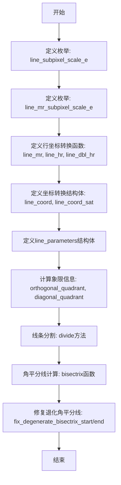

## 类结构

```
agg (命名空间)
├── 枚举: line_subpixel_scale_e
├── 枚举: line_mr_subpixel_scale_e
├── 结构体: line_coord (坐标转换)
├── 结构体: line_coord_sat (饱和坐标转换)
└── 结构体: line_parameters (线条参数)
```

## 全局变量及字段


### `line_subpixel_shift`
    
子像素精度移位值，值为8，表示将坐标放大2^8=256倍进行亚像素级计算

类型：`enum value (int)`
    


### `line_subpixel_scale`
    
子像素缩放因子，值为256，用于将浮点坐标转换为整数子像素坐标

类型：`enum value (int)`
    


### `line_subpixel_mask`
    
子像素掩码，值为255，用于取子像素坐标的低位部分

类型：`enum value (int)`
    


### `line_max_coord`
    
最大坐标值，约为2.68亿，用于饱和运算防止整数溢出

类型：`enum value (int)`
    


### `line_max_length`
    
最大线条长度，值为1<<18=262144，用于限制线条长度

类型：`enum value (int)`
    


### `line_mr_subpixel_shift`
    
中分辨率子像素移位值，值为4，用于中等精度计算

类型：`enum value (int)`
    


### `line_mr_subpixel_scale`
    
中分辨率子像素缩放因子，值为16

类型：`enum value (int)`
    


### `line_mr_subpixel_mask`
    
中分辨率子像素掩码，值为15

类型：`enum value (int)`
    


### `line_parameters.x1`
    
线条起点X坐标

类型：`int`
    


### `line_parameters.y1`
    
线条起点Y坐标

类型：`int`
    


### `line_parameters.x2`
    
线条终点X坐标

类型：`int`
    


### `line_parameters.y2`
    
线条终点Y坐标

类型：`int`
    


### `line_parameters.dx`
    
X轴差值绝对值

类型：`int`
    


### `line_parameters.dy`
    
Y轴差值绝对值

类型：`int`
    


### `line_parameters.sx`
    
X轴步进方向 (+1/-1)

类型：`int`
    


### `line_parameters.sy`
    
Y轴步进方向 (+1/-1)

类型：`int`
    


### `line_parameters.vertical`
    
是否垂直线条

类型：`bool`
    


### `line_parameters.inc`
    
步进增量

类型：`int`
    


### `line_parameters.len`
    
线条长度

类型：`int`
    


### `line_parameters.octant`
    
八分圆编号

类型：`int`
    


### `line_parameters.s_orthogonal_quadrant[8]`
    
正交象限查找表

类型：`static const int8u`
    


### `line_parameters.s_diagonal_quadrant[8]`
    
对角象限查找表

类型：`static const int8u`
    
    

## 全局函数及方法


### `line_mr`

该函数用于将子像素精度坐标转换为中等分辨率坐标，通过右移位操作实现从高精度（8位子像素）到中等精度（4位子像素）的降采样转换。

参数：

- `x`：`int`，输入的子像素坐标值（8位精度，即1/256单位）

返回值：`int`，转换后的中等分辨率坐标值（4位精度，即1/16单位）

#### 流程图

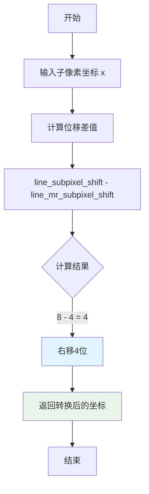

#### 带注释源码

```cpp
//------------------------------------------------------------------line_mr
// 函数：line_mr - 子像素到中分辨率坐标转换
// 功能：将8位子像素精度的坐标值转换为4位中分辨率精度的坐标值
// 实现方式：通过右移位操作实现降采样（除以16）
AGG_INLINE int line_mr(int x) 
{ 
    // line_subpixel_shift = 8 (高精度子像素)
    // line_mr_subpixel_shift = 4 (中分辨率子像素)
    // 差值为4，即右移4位相当于除以 2^4 = 16
    // 这样将1/256精度转换为1/16精度
    return x >> (line_subpixel_shift - line_mr_subpixel_shift); 
}
```


### `line_hr`

该函数用于将中等分辨率（mr，medium resolution）的坐标值转换为高分辨率（hr，high resolution）的子像素坐标值，通过左移位操作实现分辨率的提升（从4位子像素精度扩展到8位子像素精度）。

参数：

- `x`：`int`，输入的中等分辨率（mr）坐标值

返回值：`int`，转换后的高分辨率（hr）子像素坐标值

#### 流程图

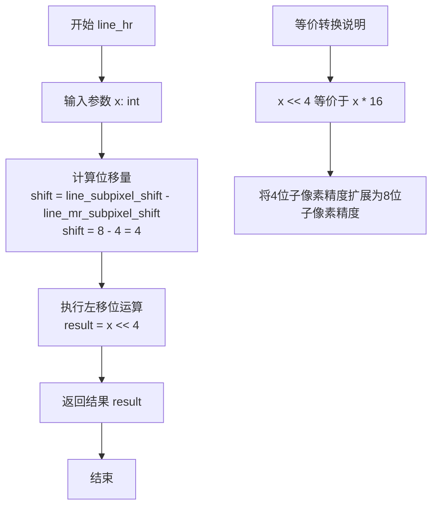

#### 带注释源码

```cpp
//-------------------------------------------------------------------line_hr
// 功能：将中等分辨率(mr)的坐标转换为高分辨率(hr)的子像素坐标
// 说明：mr分辨率使用4位子像素精度(line_mr_subpixel_shift=4)
//      hr分辨率使用8位子像素精度(line_subpixel_shift=8)
//      转换通过左移4位实现(即乘以16)
AGG_INLINE int line_hr(int x) 
{ 
    // line_subpixel_shift = 8
    // line_mr_subpixel_shift = 4
    // 位移量 = 8 - 4 = 4
    // 相当于 x * (1 << 4) = x * 16
    return x << (line_subpixel_shift - line_mr_subpixel_shift); 
}
```

#### 补充说明

| 常量 | 值 | 说明 |
|------|-----|------|
| `line_subpixel_shift` | 8 | 高分辨率子像素精度位数 |
| `line_mr_subpixel_shift` | 4 | 中等分辨率子像素精度位数 |
| 转换因子 | 16 (2⁴) | 从mr到hr的放大倍数 |


### `line_dbl_hr`

该函数是Anti-Grain Geometry库中用于将整数坐标值转换为子像素精度的内联辅助函数，通过将输入值左移8位（乘以256）来实现双精度到子像素级别的坐标转换。

参数：

- `x`：`int`，输入的整数坐标值（通常是线段端点的整数坐标）

返回值：`int`，转换后的子像素精度坐标值（输入值左移8位，即乘以line_subpixel_scale）

#### 流程图

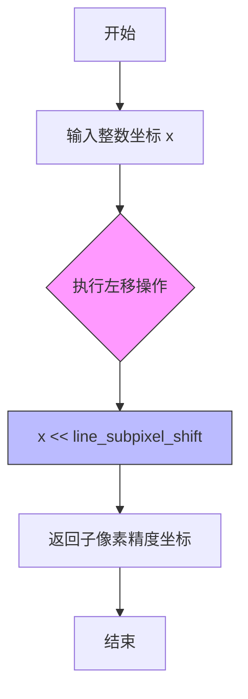

#### 带注释源码

```cpp
//---------------------------------------------------------------line_dbl_hr
// 函数：line_dbl_hr
// 用途：将整数坐标值转换为子像素精度的双精度表示
// 参数：x - 输入的整数坐标值
// 返回值：转换后的子像素精度坐标值（整数）
AGG_INLINE int line_dbl_hr(int x) 
{ 
    // line_subpixel_shift = 8，因此该操作等价于 x * 256
    // 用于将低分辨率整数坐标扩展到高分辨率子像素坐标系统
    return x << line_subpixel_shift;
}
```


### `line_coord::conv`

将双精度浮点数转换为子像素坐标的静态方法，通过乘以子像素比例因子并四舍五入得到整数坐标值。

参数：

- `x`：`double`，输入的双精度浮点数，表示需要转换的坐标值

返回值：`int`，转换后的子像素坐标（整数）

#### 流程图

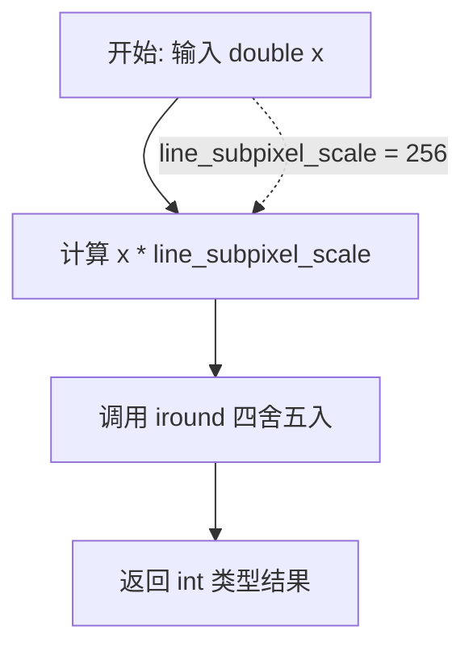

#### 带注释源码

```cpp
//---------------------------------------------------------------line_coord
struct line_coord
{
    // 将双精度浮点数转换为子像素坐标（整数）
    // 参数 x: double类型的输入坐标值
    // 返回值: int类型的子像素坐标，经过四舍五入的整数
    AGG_INLINE static int conv(double x)
    {
        // 乘以子像素比例因子(1<<8=256)并四舍五入为整数
        return iround(x * line_subpixel_scale);
    }
};
```


### `line_coord_sat::conv`

将双精度浮点数乘以子像素比例因子后，转换为整数坐标，并使用饱和算子将结果限制在 `line_max_coord` 范围内，防止整数溢出（静态方法）。

参数：

-  `x`：`double`，输入的双精度浮点数，表示需要转换的坐标值

返回值：`int`，返回饱和处理后的子像素整数坐标

#### 流程图

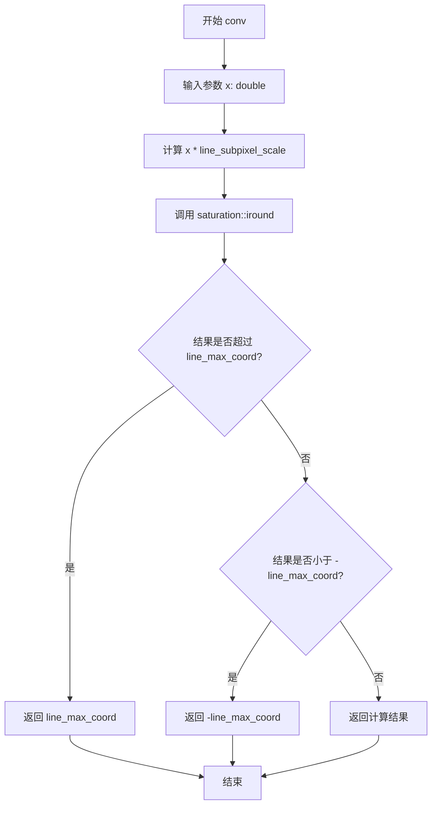

#### 带注释源码

```cpp
//-----------------------------------------------------------line_coord_sat
// 结构体：line_coord_sat
// 用途：提供带饱和功能的子像素坐标转换
//-----------------------------------------------------------
struct line_coord_sat
{
    //-------------------------------------------------------------conv
    // 方法：conv
    // 功能：将双精度浮点数转换为带饱和的子像素整数坐标
    // 参数：
    //   - x: double，输入的双精度浮点数坐标值
    // 返回值：int，饱和处理后的子像素整数坐标
    // 说明：
    //   - 使用 line_subpixel_scale (256) 将输入值转换为子像素精度
    //   - 通过 saturation<line_max_coord>::iround 实现饱和四舍五入
    //   - line_max_coord = (1 << 28) - 1 = 268,435,455
    //   - 防止坐标值超出允许范围导致整数溢出
    //-------------------------------------------------------------
    AGG_INLINE static int conv(double x)
    {
        // 调用饱和转换函数：
        // 1. 将 x 乘以 line_subpixel_scale (256) 转换为子像素坐标
        // 2. 使用 iround 四舍五入到整数
        // 3. 使用 saturation 模板将结果限制在 [-line_max_coord, line_max_coord] 范围内
        return saturation<line_max_coord>::iround(x * line_subpixel_scale);
    }
};
```


### bisectrix

计算两条线段的角平分线，并将角平分线与第一条线段(l1)的交点坐标通过输出参数返回。该函数用于在反锯齿线条渲染中确定两条线段之间的平滑过渡点。

参数：

- `l1`：`const line_parameters&`，第一条线段的参数结构体，包含起点(x1,y1)、终点(x2,y2)、长度(len)及方向信息
- `l2`：`const line_parameters&`，第二条线段的参数结构体，包含起点(x1,y1)、终点(x2,y2)、长度(len)及方向信息
- `x`：`int*`，输出参数，返回角平分线与第一条线段交点的X坐标
- `y`：`int*`，输出参数，返回角平分线与第一条线段交点的Y坐标

返回值：`void`，无返回值，结果通过x和y指针参数输出

#### 流程图

```mermaid
flowchart TD
    A[开始 bisectrix] --> B[获取l1的方向向量<br/>dx1 = l1.x2 - l1.x1<br/>dy1 = l1.y2 - l1.y1]
    B --> C[获取l2的方向向量<br/>dx2 = l2.x2 - l2.x1<br/>dy2 = l2.y2 - l2.y1]
    C --> D[计算l1的单位方向向量<br/>len1 = l1.len]
    D --> E[计算l2的单位方向向量<br/>len2 = l2.len]
    E --> F[将方向向量归一化为单位向量<br/>nx1 = dx1/len1, ny1 = dy1/len1<br/>nx2 = dx2/len2, ny2 = dy2/len2]
    F --> G[计算角平分线方向<br/>bx = nx1 + nx2<br/>by = ny1 + ny2]
    G --> H[归一化角平分线向量<br/>blen = sqrt(bx² + by²)<br/>bx /= blen, by /= blen]
    H --> I[根据l1起点和角平分线方向计算交点<br/>x = l1.x1 + bx * len1<br/>y = l1.y1 + by * len1]
    I --> J[结束，返回交点坐标]
```

#### 带注释源码

```cpp
//----------------------------------------------------------------------------
// Anti-Grain Geometry - Version 2.4
// 计算两线条的角平分线函数声明
//----------------------------------------------------------------------------

//----------------------------------------------------------------bisectrix
// 函数: bisectrix
// 描述: 计算两条线段的角平分线，确定两条线段之间的平滑过渡点
// 参数:
//   l1 - 第一条线段的参数结构体(line_parameters类型)
//   l2 - 第二条线段的参数结构体(line_parameters类型)
//   x  - 输出参数，返回角平分线与l1交点的X坐标(指针)
//   y  - 输出参数，返回角平分线与l1交点的Y坐标(指针)
// 返回: void (无返回值，通过指针参数输出结果)
//
// 注意: 此函数仅包含声明，实现位于 agg_line_aa_basics.cpp 中
//       实现逻辑大致如下:
//       1. 获取两条线段的方向向量
//       2. 将方向向量归一化为单位向量
//       3. 计算两个单位向量的和，得到角平分线方向
//       4. 归一化角平分线向量
//       5. 从l1的起点(x1,y1)沿角平分线方向偏移l1的长度，得到交点坐标
//----------------------------------------------------------------------------
void bisectrix(const line_parameters& l1, 
               const line_parameters& l2, 
               int* x, int* y);

//----------------------------------------------------------------------------
// 相关辅助函数说明:
//----------------------------------------------------------------------------

// fix_degenerate_bisectrix_start
// 修正角平分线起点退化问题，当角平分线与线段端点过于接近时，
// 将起点调整到线段端点的正交方向上

// fix_degenerate_bisectrix_end  
// 修正角平分线终点退化问题，当角平分线与线段端点过于接近时，
// 将终点调整到线段端点的正交方向上
```


### `fix_degenerate_bisectrix_start`

该函数用于修复退化的角平分线起点。当角平分线起点与线段端点距离过近时，通过调整坐标到线段起点沿法线方向偏移的位置，确保角平分线计算的数值稳定性。

参数：

- `lp`：`const line_parameters&`，线段参数结构体，包含线段端点坐标(x1, y1), (x2, y2)、长度(len)等信息
- `x`：`int*`，指向角平分线起点x坐标的指针，用于输入和输出
- `y`：`int*`，指向角平分线起点y坐标的指针，用于输入和输出

返回值：`void`，无返回值，通过指针参数直接修改坐标值

#### 流程图

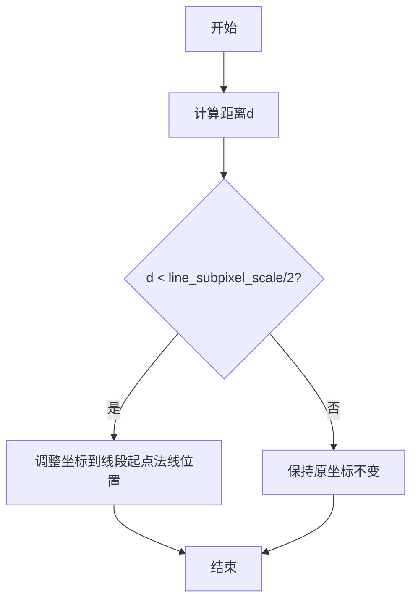

#### 带注释源码

```cpp
//-------------------------------------------fix_degenerate_bisectrix_start
void inline fix_degenerate_bisectrix_start(const line_parameters& lp, 
                                           int* x, int* y)
{
    // 计算角平分线起点(x,y)到线段终点(x2,y2)的垂直距离
    // 使用向量叉积原理：(P - Q) × (dx, dy) / |dl|
    // 其中 P=(x,y), Q=(x2,y2), (dx,dy) = (x2-x1, y2-y1)
    int d = iround((double(*x - lp.x2) * double(lp.y2 - lp.y1) - 
                    double(*y - lp.y2) * double(lp.x2 - lp.x1)) / lp.len);
    
    // 如果距离小于亚像素阈值的一半，认为角平分线退化
    // 需要将起点调整到线段起点的法线方向位置
    if(d < line_subpixel_scale/2)
    {
        // 将x坐标调整到 (x1 + dy, y1 - dx)
        // 即线段起点沿法向量方向偏移一个单位
        *x = lp.x1 + (lp.y2 - lp.y1);
        *y = lp.y1 - (lp.x2 - lp.x1);
    }
}
```


### `fix_degenerate_bisectrix_end`

该函数用于修复退化的角平分线终点。在渲染抗锯齿线条时，当两条线段形成的角平分线退化（即角度极小或两条线段近似共线）时，角平分线终点可能计算不准确。该函数通过计算点到线段的距离来判断角平分线是否退化，并在必要时将终点修正为线段终点的法向量偏移位置。

参数：

- `lp`：`const line_parameters&`，包含线条起点(x1,y1)和终点(x2,y2)以及线条长度等参数的线条参数结构体
- `x`：`int*`，指向待修复的角平分线终点X坐标的指针，函数可能修改该值
- `y`：`int*`，指向待修复的角平分线终点Y坐标的指针，函数可能修改该值

返回值：`void`，无返回值，结果通过指针参数x和y直接修改

#### 流程图

```mermaid
flowchart TD
    A[开始] --> B[计算距离d]
    B --> C{d < line_subpixel_scale/2?}
    C -->|是| D[修正终点坐标]
    C -->|否| E[保持原坐标不变]
    D --> F[结束]
    E --> F
    
    B描述: 计算点到线段的垂直距离
    D描述: x = x2 + (y2 - y1), y = y2 - (x2 - x1)
```

#### 带注释源码

```cpp
//---------------------------------------------fix_degenerate_bisectrix_end
// 该函数修复退化的角平分线终点
// 当角平分线与线段方向几乎平行时（即角度很小），角平分线终点会不准确
// 此时需要将终点修正为线段终点的法向量偏移位置
void inline fix_degenerate_bisectrix_end(const line_parameters& lp, 
                                         int* x, int* y)
{
    // 计算当前点(x,y)到线段(lp.x1,lp.y1)-(lp.x2,lp.y2)的垂直距离
    // 使用叉积公式：d = |(P-P1) × (P2-P1)| / |P2-P1|
    // 这里计算的是有符号距离，用于判断角平分线是否退化
    int d = iround((double(*x - lp.x2) * double(lp.y2 - lp.y1) - 
                    double(*y - lp.y2) * double(lp.x2 - lp.x1)) / lp.len);
    
    // 如果距离小于亚像素分辨率的一半，认为角平分线退化
    // 此时将终点修正为线段终点的法向量偏移
    // 法向量为 (y2-y1, -(x2-x1))，即线段方向的垂线
    if(d < line_subpixel_scale/2)
    {
        *x = lp.x2 + (lp.y2 - lp.y1);  // X坐标加上法向量的X分量
        *y = lp.y2 - (lp.x2 - lp.x1);  // Y坐标加上法向量的Y分量
    }
}
```


### `line_coord.conv`

将双精度浮点坐标转换为子像素级别的整数坐标，通过乘以子像素比例因子并四舍五入实现高精度坐标到低精度整数空间的映射。

参数：

- `x`：`double`，输入的双精度浮点数坐标值（可以是线段的端点坐标、长度等）

返回值：`int`，转换后的子像素坐标整数（基于 `line_subpixel_scale` = 256 的精度）

#### 流程图

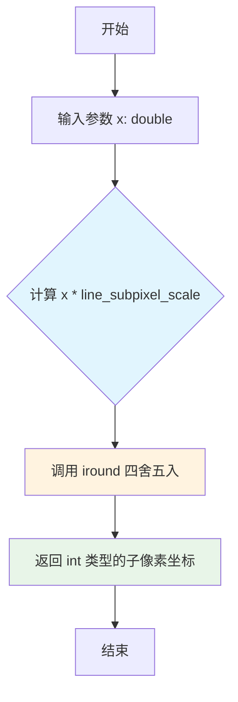

#### 带注释源码

```cpp
//---------------------------------------------------------------line_coord
struct line_coord
{
    //-------------------------------------------------------------conv
    // 将双精度坐标转换为子像素坐标
    // 参数: x - double类型的输入坐标值
    // 返回: int - 转换后的子像素整数坐标
    AGG_INLINE static int conv(double x)
    {
        return iround(x * line_subpixel_scale);  // 乘以256并进行四舍五入
    }
};
```

#### 相关上下文信息

| 元素 | 名称 | 类型 | 描述 |
|------|------|------|------|
| 枚举 | `line_subpixel_scale_e` | `enum` | 定义子像素缩放相关常量 |
| 常量 | `line_subpixel_shift` | `int` | 子像素移位值，固定为 8 |
| 常量 | `line_subpixel_scale` | `int` | 子像素比例因子，值为 256 (1 << 8) |
| 常量 | `line_subpixel_mask` | `int` | 子像素掩码，值为 255 |
| 函数 | `iround` | `function` | 四舍五入函数，将浮点数转换为最接近的整数 |
| 相关结构体 | `line_coord_sat` | `struct` | 带饱和限幅的坐标转换结构体 |

#### 技术说明

- **设计目标**：该函数用于在抗锯齿线段渲染时，将高精度的浮点坐标转换为低精度的整数子像素坐标，以便进行离散化的光栅计算
- **转换原理**：将输入坐标乘以 256（2^8），实现 8 位的子像素精度，相当于将每个像素分为 256 个子单元
- **四舍五入**：使用 `iround` 而非直接截断，以减少量化误差带来的渲染偏差
- **内联优化**：使用 `AGG_INLINE` 标记鼓励编译器进行内联展开，减少函数调用开销


### `line_coord_sat.conv`

该函数用于将双精度浮点坐标转换为带饱和限制的子像素整数坐标，确保转换结果不会超出规定的最大坐标范围。

参数：

- `x`：`double`，待转换的双精度浮点坐标值

返回值：`int`，转换后的子像素整数坐标值，已进行饱和处理

#### 流程图

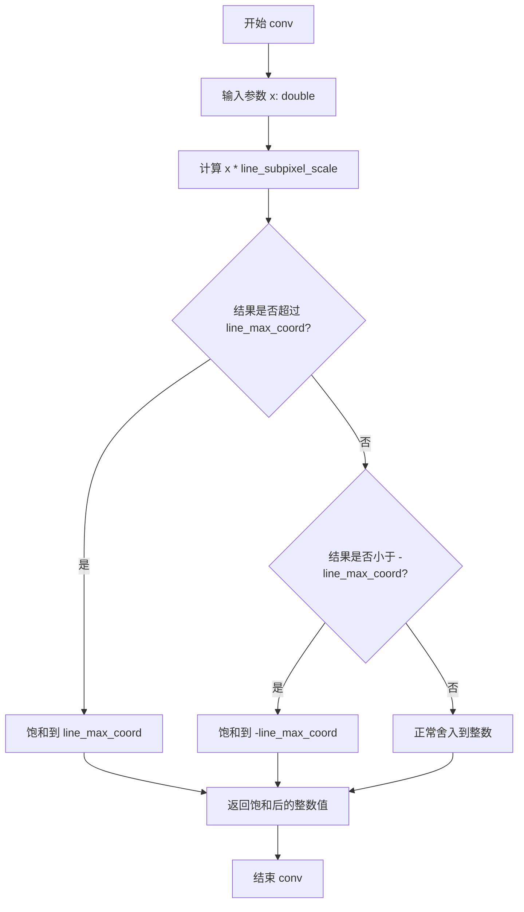

#### 带注释源码

```cpp
//-----------------------------------------------------------line_coord_sat
// 结构体：line_coord_sat
// 用途：提供带饱和限制的子像素坐标转换功能
// 饱和限制：line_max_coord = (1 << 28) - 1 = 268,435,455
struct line_coord_sat
{
    // 方法：conv
    // 参数：x - double类型的浮点坐标值
    // 返回值：int - 转换后的子像素整数坐标
    // 核心逻辑：将输入坐标乘以子像素缩放因子(256)，然后进行饱和舍入
    AGG_INLINE static int conv(double x)
    {
        // 使用saturation模板进行饱和舍入
        // 如果乘积超过line_max_coord，则返回line_max_coord
        // 如果乘积小于-line_max_coord，则返回-line_max_coord
        // 这样可以防止坐标值溢出
        return saturation<line_max_coord>::iround(x * line_subpixel_scale);
    }
};
```


### `line_parameters.line_parameters()`

默认构造函数，用于构造一个`line_parameters`对象，不进行任何初始化操作，成员变量保持未定义状态。

参数：

- （无）

返回值：`void`（构造函数无返回值，但会构造一个`line_parameters`类型的对象）

#### 流程图

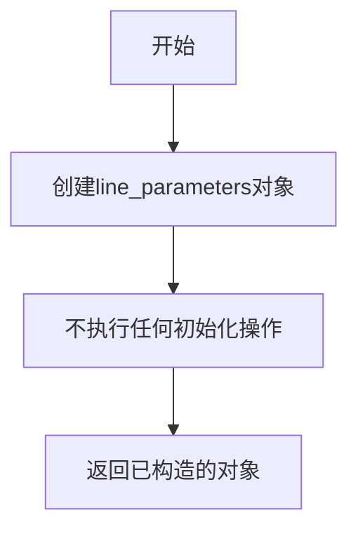

#### 带注释源码

```cpp
//----------------------------------------------------------------------------
// Anti-Grain Geometry - Version 2.4
//----------------------------------------------------------------------------
// 默认构造函数
// 功能：构造一个line_parameters对象，不初始化任何成员变量
// 注意：使用此构造函数后，成员变量x1, y1, x2, y2, dx, dy, sx, sy, 
//       vertical, inc, len, octant的值是未定义的，需要通过赋值或
//       使用带参数的构造函数来初始化
//----------------------------------------------------------------------------
line_parameters() {}
```


### `line_parameters.line_parameters`

带参构造函数，用于初始化线参数结构体，计算线段的各个参数包括方向、步进、八分圆等，用于反锯齿线段的渲染。

参数：

-  `x1_`：`int`，线段起点的x坐标
-  `y1_`：`int`，线段起点的y坐标
-  `x2_`：`int`，线段终点的x坐标
-  `y2_`：`int`，线段终点的y坐标
-  `len_`：`int`，线段的长度（以亚像素为单位）

返回值：无（构造函数），该函数初始化`line_parameters`对象的所有成员变量。

#### 流程图

```mermaid
graph TD
    A[开始] --> B[初始化x1, y1, x2, y2]
    B --> C[计算dx = abs{x2 - x1}]
    C --> D[计算dy = abs{y2 - y1}]
    D --> E[确定sx: x2 > x1 ? 1 : -1]
    E --> F[确定sy: y2 > y1 ? 1 : -1]
    F --> G[确定vertical: dy >= dx]
    G --> H[确定inc: vertical ? sy : sx]
    H --> I[设置len = len_]
    I --> J[计算octant: (sy & 4) | (sx & 2) | vertical]
    J --> K[结束]
```

#### 带注释源码

```cpp
// 带参构造函数，初始化线参数结构体的所有成员
line_parameters(int x1_, int y1_, int x2_, int y2_, int len_) :
    // 直接赋值起点和终点坐标
    x1(x1_), y1(y1_), x2(x2_), y2(y2_), 
    // 计算线段在x和y方向的投影长度（绝对值）
    dx(abs(x2_ - x1_)),
    dy(abs(y2_ - y1_)),
    // 确定x方向步进符号：向右为1，向左为-1
    sx((x2_ > x1_) ? 1 : -1),
    // 确定y方向步进符号：向下为1，向上为-1
    sy((y2_ > y1_) ? 1 : -1),
    // 判断线段方向：dy >= dx 表示更偏向垂直方向
    vertical(dy >= dx),
    // 确定主步进方向：如果更垂直则沿y方向步进，否则沿x方向步进
    inc(vertical ? sy : sx),
    // 存储线段长度
    len(len_),
    // 计算八分圆编号：用于确定线段所在的45度八分区域
    // sy&4 取符号位, sx&2 取符号位, vertical 取方向位
    octant((sy & 4) | (sx & 2) | int(vertical))
{
}
```


### `line_parameters.orthogonal_quadrant()`

获取正交象限值，通过查找静态数组 `s_orthogonal_quadrant` 中与当前八分圆（octant）索引对应的象限编号，用于确定线段在八分圆系统中的正交方向类别。

参数：该方法无显式参数（隐式使用 `this` 指针）

返回值：`unsigned`，返回正交象限编号（0-3），表示线段所在的正交象限类别

#### 流程图

```mermaid
flowchart TD
    A[开始] --> B[获取当前对象的 octant 值]
    B --> C[查找静态数组 s_orthogonal_quadrant[octant]]
    C --> D[返回正交象限值]
    D --> E[结束]
```

#### 带注释源码

```cpp
//---------------------------------------------------------------------
// 获取正交象限
// 正交象限将8个八分圆映射为4个象限（0-3）
// 通过静态查找表 s_orthogonal_quadrant[octant] 获取对应的象限值
// octant 由线段的方向决定：(sy & 4) | (sx & 2) | vertical
//---------------------------------------------------------------------

// 源码位于 line_parameters 结构体内部
unsigned orthogonal_quadrant() const 
{ 
    // s_orthogonal_quadrant 是静态成员数组，存储8个八分圆到4个正交象限的映射
    // octant 的计算：sy*4 + sx*2 + vertical
    // 其中 sy, sx 是方向符号 (+1/-1), vertical 表示是否垂直
    // 返回值范围 0-3，表示正交象限编号
    return s_orthogonal_quadrant[octant]; 
}
```

#### 相关上下文信息

| 名称 | 类型 | 描述 |
|------|------|------|
| `octant` | `int` | 八分圆编号（0-7），由方向符号和垂直标志计算得出 |
| `s_orthogonal_quadrant` | `static const int8u[8]` | 静态查找表，将8个八分圆映射为4个正交象限 |
| `sx` | `int` | X轴方向符号（1或-1） |
| `sy` | `int` | Y轴方向符号（1或-1） |
| `vertical` | `bool` | 标志位，表示线段是否垂直（dy >= dx） |


### `line_parameters.diagonal_quadrant()`

获取线段所在的对角象限编号，用于确定线段在八叉象限系统中的对角位置。该方法通过查表方式，根据八象限编码（octant）返回对应的对角象限值，这在反锯齿线段渲染算法中用于确定线段的步进方向和渲染策略。

参数： （无）

返回值：`unsigned`，返回线段所在的对角象限编号（0-3），对应四个对角区域：右下、右上、左上、左下。

#### 流程图

```mermaid
flowchart TD
    A[开始 diagonal_quadrant] --> B[读取成员变量 octant]
    B --> C[访问静态查找表 s_diagonal_quadrant[octant]]
    C --> D[返回对角象限值]
    
    style A fill:#f9f,color:#000
    style D fill:#9f9,color:#000
```

#### 带注释源码

```cpp
//---------------------------------------------------------------------
// 获取对角象限
// 对角象限将八象限进一步划分为四个对角区域：
// - 0: 右下象限 (octant 0,1)
// - 1: 右上象限 (octant 2,3)  
// - 2: 左上象限 (octant 4,5)
// - 3: 左下象限 (octant 6,7)
// 
// 对角象限用于确定线段渲染时的对角步进策略
unsigned diagonal_quadrant() const 
{ 
    // 通过八象限编码查表获取对应的对角象限
    // s_diagonal_quadrant 是一个静态查找表
    return s_diagonal_quadrant[octant];   
}
```

---

### 关联信息

#### 静态查找表说明

`line_parameters` 结构体包含两个静态成员表，用于象限映射：

| 静态成员 | 类型 | 描述 |
|---------|------|------|
| `s_orthogonal_quadrant[8]` | `const int8u` | 正交象限查找表，将八象限映射到四正交象限 |
| `s_diagonal_quadrant[8]` | `const int8u` | 对角象限查找表，将八象限映射到四对角象限 |

#### 象限编码规则（octant）

`octant` 值由三个标志位组合计算：
- `(sy & 4)` - Y方向标志（1表示向下）
- `(sx & 2)` - X方向标志（1表示向右）
- `int(vertical)` - 垂直/水平标志（1表示垂直为主）

#### 与相关方法的对比

| 方法 | 功能 | 返回值范围 |
|------|------|-----------|
| `orthogonal_quadrant()` | 获取正交（垂直/水平）象限 | 0-3 |
| `diagonal_quadrant()` | 获取对角象限 | 0-3 |
| `same_orthogonal_quadrant()` | 比较两线段是否在同一正交象限 | bool |
| `same_diagonal_quadrant()` | 比较两线段是否在同一对角象限 | bool |


### `line_parameters.same_orthogonal_quadrant`

判断两条线段是否处于相同的正交象限（正交象限指由坐标轴划分的四个区域：右上、左上、左下、右下）。该函数通过比较当前线段与目标线段的 `octant` 值所对应的正交象限编号来确定它们是否在同一象限。

参数：

- `lp`：`const line_parameters&`，目标线参数，包含要比较的线段的端点坐标和象限信息

返回值：`bool`，如果两条线段在同一正交象限返回 `true`，否则返回 `false`

#### 流程图

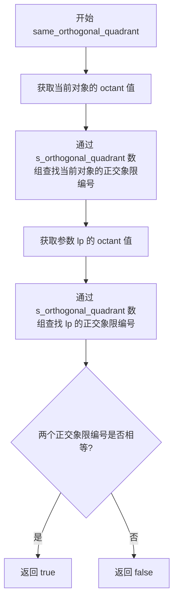

#### 带注释源码

```cpp
//---------------------------------------------------------------------
// 判断两条线段是否在同一正交象限
// 正交象限：将平面划分为4个区域（右上、左上、左下、右下）
// 该函数用于线段渲染时的优化，判断两条线段是否需要使用不同的渲染逻辑
bool same_orthogonal_quadrant(const line_parameters& lp) const
{
    // octant 是一个0-7的值，编码了线段的方向信息
    // s_orthogonal_quadrant 是一个静态查找表，将 octant 映射到正交象限编号
    // 比较两个线段的正交象限编号是否相同
    return s_orthogonal_quadrant[octant] == s_orthogonal_quadrant[lp.octant];
}
```


### `line_parameters.same_diagonal_quadrant`

该函数用于判断两条线段是否处于同一对角象限，通过比较两个线段参数的八分象限（octant）所对应的对角象限值来确定，适用于线段渲染时的象限相关计算。

参数：
- `lp`：`const line_parameters&`，要比较的另一条线段的参数对象

返回值：`bool`，如果两条线段在同一对角象限则返回 true，否则返回 false

#### 流程图

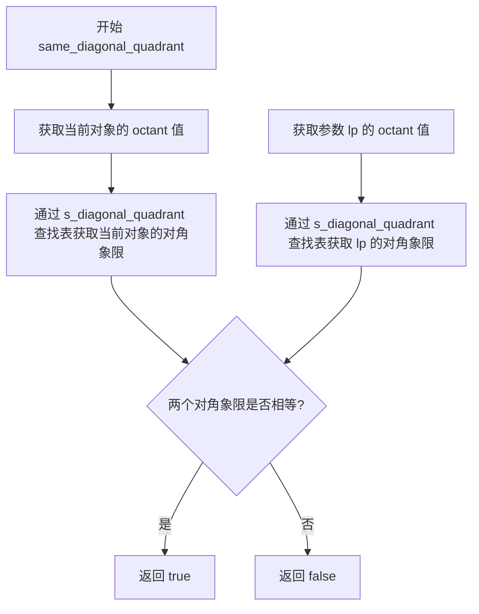

#### 带注释源码

```cpp
//---------------------------------------------------------------------
// 函数：same_diagonal_quadrant
// 功能：判断两条线段是否在同一对角象限
// 参数：
//   lp - const line_parameters&，另一条线段的参数对象
// 返回值：
//   bool - 同一对角象限返回 true，否则返回 false
//---------------------------------------------------------------------
bool same_diagonal_quadrant(const line_parameters& lp) const
{
    // octant 计算方式：(sy & 4) | (sx & 2) | int(vertical)
    // sy, sx 为方向符号（1 或 -1），vertical 表示是否接近垂直
    // s_diagonal_quadrant 是一个静态查找表，将 octant 映射到对角象限
    // 对角象限将 8 个 octant 归类为 4 个对角区域
    
    return s_diagonal_quadrant[octant] == s_diagonal_quadrant[lp.octant];
}
```


### `line_parameters.divide`

该方法用于将一条线段在中间点分割成两段等长的子线段，通过计算中点坐标并分别设置两段线段的起点和终点，同时更新相关的长度、增量等参数。

参数：

- `lp1`：`line_parameters&`，输出参数，分割后的第一段线段
- `lp2`：`line_parameters&`，输出参数，分割后的第二段线段

返回值：`void`，无返回值

#### 流程图

```mermaid
flowchart TD
    A[开始 divide] --> B[计算中点 xmid = (x1 + x2) >> 1]
    B --> C[计算中点 ymid = (y1 + y2) >> 1]
    C --> D[计算半长 len2 = len >> 1]
    D --> E[复制当前对象到 lp1 和 lp2]
    E --> F[设置 lp1 的终点: x2=xmid, y2=ymid]
    F --> G[设置 lp1 的长度: len=len2]
    G --> H[重新计算 lp1 的 dx 和 dy]
    H --> I[设置 lp2 的起点: x1=xmid, y1=ymid]
    I --> J[设置 lp2 的长度: len=len2]
    J --> K[重新计算 lp2 的 dx 和 dy]
    K --> L[结束]
```

#### 带注释源码

```cpp
//-----------------------------------------------------------------------------
// 方法: divide
// 功能: 将线段分割成两段等长的子线段
// 参数:
//   lp1 - line_parameters&, 输出参数，分割后的第一段线段
//   lp2 - line_parameters&, 输出参数，分割后的第二段线段
// 返回值: void
//-----------------------------------------------------------------------------
void divide(line_parameters& lp1, line_parameters& lp2) const
{
    // 计算线段中点的x坐标 (右移1位相当于除以2)
    int xmid = (x1 + x2) >> 1;
    
    // 计算线段中点的y坐标 (右移1位相当于除以2)
    int ymid = (y1 + y2) >> 1;
    
    // 计算分割后的线段长度 (原长度的一半)
    int len2 = len >> 1;

    // 将当前线段参数复制到输出参数lp1和lp2
    lp1 = *this;
    lp2 = *this;

    // 设置第一段线段lp1的终点为中点
    lp1.x2  = xmid;
    lp1.y2  = ymid;
    
    // 设置第一段线段lp1的长度为原长度的一半
    lp1.len = len2;
    
    // 重新计算第一段线段lp1的dx (x方向距离)
    lp1.dx  = abs(lp1.x2 - lp1.x1);
    
    // 重新计算第一段线段lp1的dy (y方向距离)
    lp1.dy  = abs(lp1.y2 - lp1.y1);

    // 设置第二段线段lp2的起点为中点
    lp2.x1  = xmid;
    lp2.y1  = ymid;
    
    // 设置第二段线段lp2的长度为原长度的一半
    lp2.len = len2;
    
    // 重新计算第二段线段lp2的dx (x方向距离)
    lp2.dx  = abs(lp2.x2 - lp2.x1);
    
    // 重新计算第二段线段lp2的dy (y方向距离)
    lp2.dy  = abs(lp2.y2 - lp2.y1);
}
```

## 关键组件


### 线条子像素刻度枚举 (line_subpixel_scale_e)

定义线条绘制时的子像素精度参数，包括子像素移位值、缩放因子、掩码和最大坐标值，用于实现高质量的抗锯齿线条渲染。

### 中分辨率子像素刻度枚举 (line_mr_subpixel_scale_e)

定义中等分辨率的子像素参数，用于某些特定线条算法的中间计算，提供比标准子像素更粗的粒度。

### 坐标转换函数 (line_mr, line_hr, line_dbl_hr)

三个内联函数用于在不同子像素精度之间进行坐标转换：line_mr将高分辨率坐标转换为中分辨率，line_hr将中分辨率转换为高分辨率，line_dbl_hr将坐标放大一个子像素级别。

### 坐标转换结构体 (line_coord, line_coord_sat)

提供静态方法将浮点坐标转换为整数子像素坐标。line_coord进行饱和转换，line_coord_sat进行饱和处理以防止溢出。

### 线条参数结构体 (line_parameters)

存储线条的完整参数信息，包括起点终点坐标、增量方向、线条长度、八分圆信息等，并提供象限计算和线条分割功能。

### 分角线计算函数 (bisectrix)

计算两条线段之间的分角线（bisectrix）坐标，用于确定线条端点的适当位置，确保线条连接处平滑过渡。

### 分角线起点修复函数 (fix_degenerate_bisectrix_start)

修复线条起点处退化的分角线情况，当计算出的分角线过于靠近起点时，进行修正以确保线条渲染的正确性。

### 分角线终点修复函数 (fix_degenerate_bisectrix_end)

修复线条终点处退化的分角线情况，确保线条端点的渲染质量，与起点修复函数配合使用。


## 问题及建议


### 已知问题

- **静态成员变量只声明未定义**：`line_parameters` 结构体中声明了 `static const int8u s_orthogonal_quadrant[8]` 和 `static const int8u s_diagonal_quadrant[8]`，但头文件中仅声明而未定义，依赖外部实现文件提供定义，可能导致链接错误。
- **枚举类型缺乏类型安全**：使用传统 `enum` 而非 C++11 的 `enum class`，可能导致隐式转换和命名空间污染。
- **构造函数未初始化所有成员**：`line_parameters()` 默认构造函数为空，可能导致成员变量处于未定义状态。
- **魔法数字**：代码中直接使用数值如 `line_subpixel_scale/2`、`4`、`8` 等，缺乏有意义的命名，降低可读性。
- **函数声明与实现分离**：`bisectrix` 函数仅在头文件中声明，依赖外部实现文件 `agg_line_aa_basics.cpp`，增加维护复杂度。
- **指针参数设计**：`bisectrix` 函数使用 `int* x, int* y` 而非更安全的引用，可能产生空指针解引用风险。

### 优化建议

- **使用 enum class 替代传统 enum**：将 `line_subpixel_scale_e` 和 `line_mr_subpixel_scale_e` 改为 `enum class`，提升类型安全性和作用域限制。
- **完善默认构造函数**：在 `line_parameters()` 中对所有成员变量进行初始化，避免未定义行为。
- **提取魔法数字**：将硬编码数值定义为具名常量，例如将 `line_subpixel_scale/2` 提取为 `line_subpixel_half_scale`。
- **使用引用替代指针**：将 `bisectrix` 函数的指针参数改为引用，提高 API 安全性并增强可读性。
- **统一内联函数风格**：将 `fix_degenerate_bisectrix_start` 和 `fix_degenerate_bisectrix_end` 明确标记为 `inline` 或移至实现文件，保持代码风格一致。
- **补充文档注释**：为关键函数和枚举值添加详细文档，说明其在抗锯齿算法中的作用和数学原理。


## 其它


### 设计目标与约束

本模块旨在提供高质量的反锯齿线段渲染基础功能，支持亚像素级别的线段计算和坐标转换。设计目标包括：实现高效的线段参数化计算、支持8个八分圆（octant）的线段方向识别、提供线段分割（divide）和角平分线（bisectrix）计算能力。约束条件包括：使用整型算术避免浮点运算开销、坐标值限制在line_max_coord范围内、线段长度限制在line_max_length范围内。

### 错误处理与异常设计

本模块采用断言和边界检查相结合的错误处理机制。对于可能导致除零的错误（如lp.len为0），调用方需确保传入有效的线段参数。坐标转换函数line_coord::conv和line_coord_sat::conv使用saturation模板进行饱和计算，防止数值溢出。角平分线修复函数fix_degenerate_bisectrix_start和fix_degenerate_bisectrix_end通过比较计算得到的d值与line_subpixel_scale/2来处理退化情况。

### 数据流与状态机

本模块的数据流主要分为三个阶段：参数初始化阶段、线段计算阶段、结果修正阶段。line_parameters结构体在构造时完成八分圆判定（octant）和正交/对角象限计算，后续操作通过查表方式获取象限信息。divide方法将线段递归分割为两段子线段，用于支持曲线细分算法。bisectrix函数计算两条线段之间的角平分线坐标，供反锯齿渲染算法使用。

### 外部依赖与接口契约

本模块依赖agg命名空间下的agg_basics.h头文件，主要使用其中的iround函数（四舍五入）、saturation模板（饱和运算）和int8u类型定义。IRound函数实现浮点数到整数的精确转换，saturation模板确保数值不超过指定最大值。调用方需保证传入的线段端点坐标在合理范围内，且len参数与实际线段长度一致。line_parameters::divide方法要求len必须大于0，否则dx和dy计算可能异常。

### 性能考虑与优化策略

本模块大量使用inline内联函数以消除函数调用开销。line_parameters构造函数中通过预计算sx、sy、vertical、inc、octant等派生属性，将多次比较和运算集中在初始化阶段。orthogonal_quadrant和diagonal_quadrant方法使用静态查找表（s_orthogonal_quadrant和s_diagonal_quadrant数组）替代条件判断，将O(1)的查表操作作为主要优化手段。坐标转换使用位移运算而非乘除法，提高计算效率。

### 线程安全性

本模块为纯计算函数库，不包含静态可变状态或全局变量。line_parameters结构体的所有成员函数均为const类型，不修改对象状态。静态常量数组s_orthogonal_quadrant和s_diagonal_quadrant为只读数据，可在多线程环境下安全访问。模块本身不涉及线程同步机制，线程安全性完全依赖于调用方的正确使用。

### 内存管理

本模块不进行动态内存分配，所有数据结构均为栈上分配或静态存储。line_parameters结构体包含12个整型成员和一个bool成员，总内存占用较小。divide方法通过引用参数返回分割结果，避免额外的内存分配。调用方需注意避免栈空间溢出，当处理超长线段数组时应考虑堆分配策略。

### 平台兼容性

本模块使用标准C++编写，不依赖特定平台API。AGG_INLINE宏用于控制函数内联策略，在不同编译器环境下可自适应调整。int8u类型定义位于agg_basics.h中，需确保该头文件正确引入。代码不包含任何汇编指令或平台特定优化，保持良好的跨平台特性。亚像素缩放因子line_subpixel_shift=8适用于大多数32位平台。

### 关键算法说明

本模块的核心算法包括：Bresenham线段算法所需的八分圆判定（通过octant值确定线段走向）、线段角度平分线计算（用于抗锯齿填充）、退化情况处理（防止零长度线段导致的计算错误）。八分圆编码规则：sy&4 + sx&2 + vertical，组合成0-7的8种状态，对应8个方向区。

### 配置参数说明

line_subpixel_shift配置亚像素精度为8位（256级），可通过修改该值调整精度。line_subpixel_scale为256，line_subpixel_mask为255，用于掩码运算。line_max_coord限制坐标范围为(1<<28)-1，约2.68亿。line_max_length限制线段最大长度为1<<18，即262144亚像素单位。

    