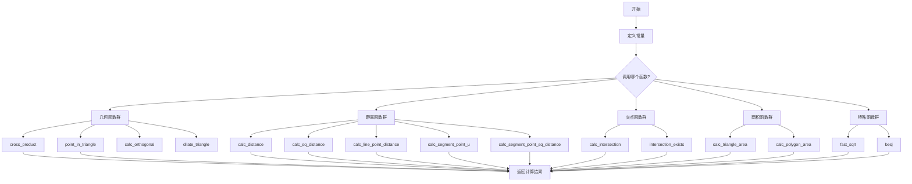
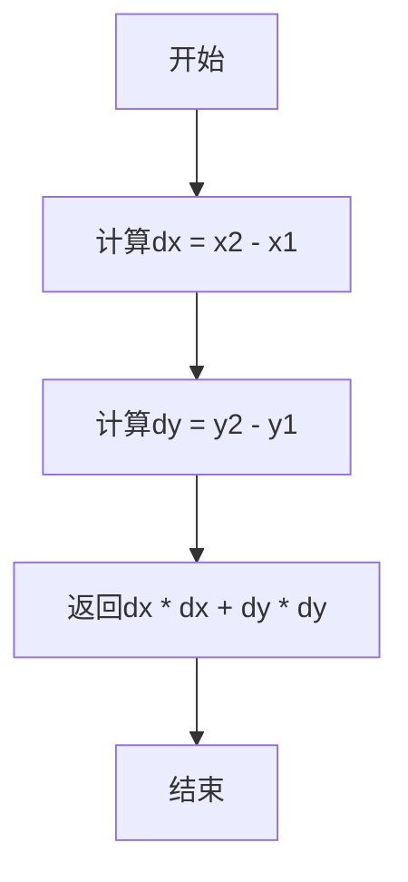
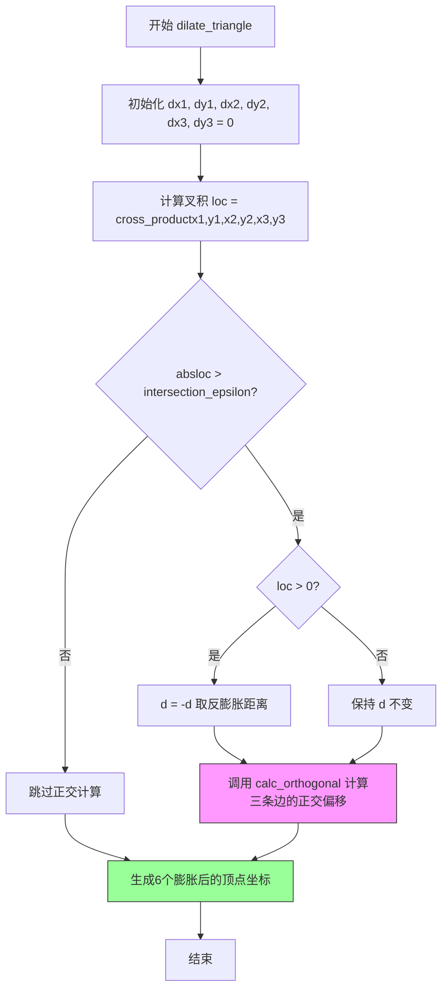
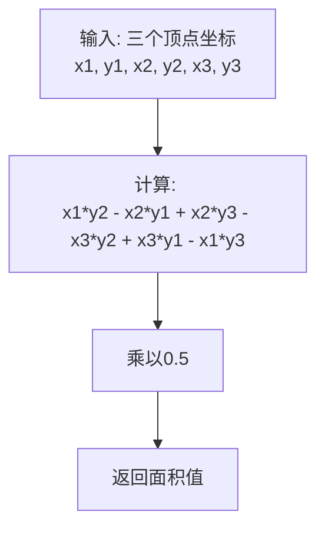

# `matplotlib\extern\agg24-svn\include\agg_math.h` 详细设计文档

Anti-Grain Geometry库的数学工具头文件，提供了一系列用于2D图形渲染的数学辅助函数，包括几何计算（叉积、点在三角形内判断）、距离计算（点距离、线段距离）、交点计算、三角形/多边形面积计算、快速平方根以及贝塞尔函数等。

## 整体流程



## 类结构

```
agg (命名空间)
├── 全局常量
│   ├── vertex_dist_epsilon
│   └── intersection_epsilon
├── 全局变量
│   ├── g_sqrt_table[1024]
│   └── g_elder_bit_table[256]
└── 全局函数 (无类定义)
    ├── 几何计算函数
    ├── 距离计算函数
    ├── 交点计算函数
    ├── 面积计算函数
    └── 特殊数学函数
```

## 全局变量及字段


### `vertex_dist_epsilon`
    
顶点重合检测的最大距离阈值（epsilon），用于判断两点是否重合

类型：`const double`
    


### `intersection_epsilon`
    
线段相交计算的epsilon值，用于防止除零错误和精度问题

类型：`const double`
    


### `g_sqrt_table`
    
快速整数平方根计算的查找表，包含1024个16位无符号整数

类型：`int16u[1024]`
    


### `g_elder_bit_table`
    
最高有效位查找表，用于快速确定整数中最高位的位置

类型：`int8[256]`
    


    

## 全局函数及方法


### `cross_product`

该函数用于计算两个向量的叉积（Cross Product），在二维平面中通过三个点来计算：给定两点 (x1,y1) 和 (x2,y2) 构成的向量，以及点 (x,y) 到点 (x2,y2) 构成的向量，函数返回这两个向量的叉积值。该值可用于判断点相对于有向直线的位置关系，是图形算法中常用的基础数学工具。

参数：

- `x1`：`double`，第一个点的 x 坐标（向量起点）
- `y1`：`double`，第一个点的 y 坐标（向量起点）
- `x2`：`double`，第二个点的 x 坐标（向量终点）
- `y2`：`double`，第二个点的 y 坐标（向量终点）
- `x`：`double`，待测试点的 x 坐标
- `y`：`double`，待测试点的 y 坐标

返回值：`double`，返回两个向量的叉积结果（标量值）

#### 流程图

```mermaid
flowchart TD
    A[开始 cross_product] --> B[接收6个参数: x1, y1, x2, y2, x, y]
    B --> C[计算第一个表达式: (x - x2) * (y2 - y1)]
    C --> D[计算第二个表达式: (y - y2) * (x2 - x1)]
    D --> E[计算叉积: 第一个表达式 - 第二个表达式]
    E --> F[返回叉积结果]
    F --> G[结束]
    
    style C fill:#e1f5fe
    style D fill:#e1f5fe
    style E fill:#fff3e0
```

#### 带注释源码

```cpp
//------------------------------------------------------------cross_product
// 计算两个向量的叉积（2D版本）
// 参数说明：
//   (x1, y1) - 第一个向量起点
//   (x2, y2) - 第一个向量终点，同时也是第二个向量的起点
//   (x, y)   - 第二个向量的终点
// 返回值：
//   叉积结果 > 0: 点(x,y)在有向线段(x1,y1)->(x2,y2)的左侧
//   叉积结果 < 0: 点(x,y)在有向线段(x1,y1)->(x2,y2)的右侧
//   叉积结果 = 0: 点(x,y)在线段上（共线）
AGG_INLINE double cross_product(double x1, double y1, 
                                double x2, double y2, 
                                double x,  double y)
{
    // 叉积公式：v1 × v2 = (x2-x1)*(y-y2) - (y2-y1)*(x-x2)
    // 为便于理解，这里使用等效形式：
    // (x - x2) * (y2 - y1) - (y - y2) * (x2 - x1)
    // 
    // 第一个向量：v1 = (x2 - x1, y2 - y1)，从(x1,y1)指向(x2,y2)
    // 第二个向量：v2 = (x - x2, y - y2)，从(x2,y2)指向(x,y)
    // 叉积 v1 × v2 = v1.x * v2.y - v1.y * v2.x
    
    return (x - x2) * (y2 - y1) - (y - y2) * (x2 - x1);
}
```


### `point_in_triangle`

该函数用于判断一个给定点是否位于由三个顶点构成的三角形内部。它通过计算该点到三角形每条边的叉积，并根据所有叉积的符号是否一致来确定点是否在三角形内。如果三个叉积值同号（全部为正或全部为负），则返回 true，表示点在三角形内部；否则返回 false，表示点在三角形外部。

参数：

-  `x1`：`double`，三角形第一个顶点的 x 坐标
-  `y1`：`double`，三角形第一个顶点的 y 坐标
-  `x2`：`double`，三角形第二个顶点的 x 坐标
-  `y2`：`double`，三角形第二个顶点的 y 坐标
-  `x3`：`double`，三角形第三个顶点的 x 坐标
-  `y3`：`double`，三角形第三个顶点的 y 坐标
-  `x`：`double`，待检测点的 x 坐标
-  `y`：`double`，待检测点的 y 坐标

返回值：`bool`，如果给定点位于三角形内部则返回 true，否则返回 false

#### 流程图

```mermaid
flowchart TD
    A[开始 point_in_triangle] --> B[计算 cp1 = cross_product<br/>(x1, y1, x2, y2, x, y) < 0.0]
    B --> C[计算 cp2 = cross_product<br/>(x2, y2, x3, y3, x, y) < 0.0]
    C --> D[计算 cp3 = cross_product<br/>(x3, y3, x1, y1, x, y) < 0.0]
    D --> E{判断 cp1 == cp2}
    E -->|是| F{判断 cp2 == cp3}
    E -->|否| G[返回 false]
    F -->|是| H[返回 true]
    F -->|否| G
```

#### 带注释源码

```cpp
//--------------------------------------------------------point_in_triangle
AGG_INLINE bool point_in_triangle(double x1, double y1, 
                                  double x2, double y2, 
                                  double x3, double y3, 
                                  double x,  double y)
{
    // 计算从第一个顶点到第二个顶点构成的向量与
    // 从第一个顶点到待检测点向量的叉积，判断待检测点
    // 是在该边的内侧还是外侧（小于0表示在一侧）
    bool cp1 = cross_product(x1, y1, x2, y2, x, y) < 0.0;
    
    // 计算从第二个顶点到第三个顶点构成的向量与
    // 从第二个顶点到待检测点向量的叉积
    bool cp2 = cross_product(x2, y2, x3, y3, x, y) < 0.0;
    
    // 计算从第三个顶点到第一个顶点构成的向量与
    // 从第三个顶点到待检测点向量的叉积
    bool cp3 = cross_product(x3, y3, x1, y1, x, y) < 0.0;
    
    // 只有当三个叉积的符号完全一致时，
    // 才说明待检测点位于三角形的内部
    // 如果点在边上，cp1、cp2、cp3都为false，条件也满足
    return cp1 == cp2 && cp2 == cp3 && cp3 == cp1;
}
```


### `calc_distance`

该函数用于计算二维平面内两点之间的欧几里得距离，通过勾股定理返回正 Euclidean 距离值。

参数：

- `x1`：`double`，第一点的 X 坐标
- `y1`：`double`，第一点的 Y 坐标
- `x2`：`double`，第二点的 X 坐标
- `y2`：`double`，第二点的 Y 坐标

返回值：`double`，两点之间的欧几里得距离

#### 流程图

```mermaid
flowchart TD
    A[开始] --> B[输入参数 x1, y1, x2, y2]
    B --> C[计算差值 dx = x2 - x1]
    C --> D[计算差值 dy = y2 - y1]
    D --> E[计算距离: sqrt(dx*dx + dy*dy)]
    E --> F[返回距离值]
```

#### 带注释源码

```cpp
//-----------------------------------------------------------calc_distance
// 函数功能: 计算两点之间的欧几里得距离
// 实现原理: 使用勾股定理 sqrt((x2-x1)² + (y2-y1)²)
AGG_INLINE double calc_distance(double x1, double y1, double x2, double y2)
{
    // 计算 x 方向的差值
    double dx = x2 - x1;
    
    // 计算 y 方向的差值
    double dy = y2 - y1;
    
    // 使用勾股定理计算欧几里得距离并返回
    // 公式: distance = sqrt(dx² + dy²)
    return sqrt(dx * dx + dy * dy);
}
```


### `calc_sq_distance`

该函数用于计算两点之间的平方欧几里得距离，通过返回坐标差的平方和来避免开方运算，从而提高性能，常用于需要比较距离大小而不需要实际距离值的场景。

参数：

- `x1`：`double`，第一个点的 X 坐标
- `y1`：`double`，第一个点的 Y 坐标
- `x2`：`double`，第二个点的 X 坐标
- `y2`：`double`，第二个点的 Y 坐标

返回值：`double`，两点之间距离的平方

#### 流程图



#### 带注释源码

```cpp
//--------------------------------------------------------calc_sq_distance
AGG_INLINE double calc_sq_distance(double x1, double y1, double x2, double y2)
{
    double dx = x2-x1;    // 计算X轴方向的距离差
    double dy = y2-y1;    // 计算Y轴方向的距离差
    return dx * dx + dy * dy;  // 返回平方距离，避免了sqrt运算
}
```


### `calc_line_point_distance`

该函数用于计算二维空间中从指定线段到某一点的垂直距离。如果线段长度小于顶点距离阈值（表示两点重合），则返回点到线段起点的距离；否则计算点到线段的垂直距离。

参数：

- `x1`：`double`，线段起点的 X 坐标
- `y1`：`double`，线段起点的 Y 坐标
- `x2`：`double`，线段终点的 X 坐标
- `y2`：`double`，线段终点的 Y 坐标
- `x`：`double`，目标点的 X 坐标
- `y`：`double`，目标点的 Y 坐标

返回值：`double`，点到线段的垂直距离

#### 流程图

```mermaid
flowchart TD
    A[开始计算点到线段距离] --> B[计算线段在X轴的投影dx = x2 - x1]
    B --> C[计算线段在Y轴的投影dy = y2 - y1]
    C --> D[计算线段长度d = sqrt(dx² + dy²)]
    D --> E{判断 d < vertex_dist_epsilon?}
    E -->|是| F[调用calc_distance计算点到起点距离]
    E -->|否| G[计算垂直距离: ((x-x2)*dy - (y-y2)*dx) / d]
    F --> H[返回计算结果]
    G --> H
```

#### 带注释源码

```cpp
//------------------------------------------------calc_line_point_distance
// 计算点到线段的垂直距离
// 参数:
//   x1, y1 - 线段起点坐标
//   x2, y2 - 线段终点坐标
//   x, y   - 目标点坐标
// 返回值:
//   点到线段的垂直距离，如果线段退化为点则返回点到该点的距离
AGG_INLINE double calc_line_point_distance(double x1, double y1, 
                                           double x2, double y2, 
                                           double x,  double y)
{
    // 计算线段在X轴的投影长度
    double dx = x2 - x1;
    
    // 计算线段在Y轴的投影长度
    double dy = y2 - y1;
    
    // 计算线段的长度（欧几里得距离）
    double d = sqrt(dx * dx + dy * dy);
    
    // 如果线段长度小于顶点距离阈值（表示两点重合或非常接近）
    if(d < vertex_dist_epsilon)
    {
        // 返回点到线段起点的距离
        return calc_distance(x1, y1, x, y);
    }
    
    // 计算点到线段的垂直距离
    // 使用向量叉积的原理：|AB × AP| / |AB|
    // 其中 AB = (x2-x1, y2-y1), AP = (x-x1, y-y1)
    // 化简后得: ((x-x2)*dy - (y-y2)*dx) / d
    return ((x - x2) * dy - (y - y2) * dx) / d;
}
```


### `calc_segment_point_u`

该函数用于计算点在线段上的投影参数u（即点在线段所在直线上的投影位置与线段长度的比例），返回值为0~1表示投影点位于线段内部，大于1表示投影点位于线段延长线终点一侧，小于0表示投影点位于线段延长线起点一侧。

参数：

- `x1`：`double`，线段起点X坐标
- `y1`：`double`，线段起点Y坐标
- `x2`：`double`，线段终点X坐标
- `y2`：`double`，线段终点Y坐标
- `x`：`double`，目标点X坐标
- `y`：`double`，目标点Y坐标

返回值：`double`，投影参数u（无单位），表示目标点在线段上的相对位置

#### 流程图

```mermaid
flowchart TD
    A[开始计算calc_segment_point_u] --> B[计算线段向量<br/>dx = x2 - x1<br/>dy = y2 - y1]
    B --> C{dx == 0 且 dy == 0?}
    C -->|是| D[返回 0<br/>线段退化为点]
    C -->|否| E[计算点向量<br/>pdx = x - x1<br/>pdy = y - y1]
    E --> F[计算参数u<br/>u = (pdx*dx + pdy*dy) / (dx*dx + dy*dy)]
    F --> G[返回 u]
```

#### 带注释源码

```cpp
//--------------------------------------------------------calc_line_point_u
// 计算点(x,y)在线段(x1,y1)-(x2,y2)上的投影参数u
// u = 0 表示投影点与(x1,y1)重合
// u = 1 表示投影点与(x2,y2)重合
// u < 0 表示投影点在线段起点外侧
// u > 1 表示投影点在线段终点外侧
AGG_INLINE double calc_segment_point_u(double x1, double y1, 
                                       double x2, double y2, 
                                       double x,  double y)
{
    // 计算线段的方向向量
    double dx = x2 - x1;
    double dy = y2 - y1;

    // 检查线段是否退化为一个点（长度为0）
    if(dx == 0 && dy == 0)
    {
	    return 0;  // 退化为点时返回0，避免除零错误
    }

    // 计算从线段起点到目标点的向量
    double pdx = x - x1;
    double pdy = y - y1;

    // 计算投影参数u：
    // 分子：点积 (pdx*dx + pdy*dy)，表示目标点在线段方向上的投影长度
    // 分母：线段长度的平方 (dx*dx + dy*dy)
    // 结果u表示目标点在线段上的归一化位置
    return (pdx * dx + pdy * dy) / (dx * dx + dy * dy);
}
```


### `calc_segment_point_sq_distance`

该函数用于计算二维平面上任意点到线段上最近点的平方距离。当已知参数u时，直接使用u判断点是靠近线段起点、终点还是在线段上；若未提供u，则自动通过`calc_segment_point_u`计算后再调用带u的重载版本。

#### 参数

- `x1`：`double`，线段起点的X坐标
- `y1`：`double`，线段起点的Y坐标
- `x2`：`double`，线段终点的X坐标
- `y2`：`double`，线段终点的Y坐标
- `x`：`double`，目标点的X坐标
- `y`：`double`，目标点的Y坐标
- `u`：`double`（仅重载版本有），目标点在线段上的参数化位置，取值范围[0,1]

#### 返回值

- `double`：目标点到线段上最近点的平方距离（未开方）

#### 流程图

```mermaid
flowchart TD
    A[开始] --> B{判断 u 参数是否存在}
    
    B -->|有 u| C{u <= 0?}
    B -->|无 u| D[调用 calc_segment_point_u 计算 u]
    D --> C
    
    C -->|是| E[返回点到线段起点 x1,y1 的平方距离]
    C -->|否| F{u >= 1?}
    
    F -->|是| G[返回点到线段终点 x2,y2 的平方距离]
    F -->|否| H[计算最近点坐标: x1+u*(x2-x1), y1+u*(y2-y1)]
    H --> I[返回点到最近点的平方距离]
    
    E --> J[结束]
    G --> J
    I --> J
```

#### 带注释源码

```cpp
// 重载版本1：带参数u的版本
// 参数u表示目标点在线段上的参数化位置（0<=u<=1）
AGG_INLINE double calc_segment_point_sq_distance(double x1, double y1, 
                                                 double x2, double y2, 
                                                 double x,  double y,
                                                 double u)
{
    // 如果u小于等于0，点靠近线段起点
    if(u <= 0)
    {
        // 返回目标点到线段起点的平方距离
        return calc_sq_distance(x, y, x1, y1);
    }
    else 
    // 如果u大于等于1，点靠近线段终点
    if(u >= 1)
    {
        // 返回目标点到线段终点的平方距离
        return calc_sq_distance(x, y, x2, y2);
    }
    // u在(0,1)范围内，点在线段上
    // 计算最近点坐标：线段起点 + u * 线段方向向量
    return calc_sq_distance(x, y, x1 + u * (x2 - x1), y1 + u * (y2 - y1));
}

// 重载版本2：不带参数u的便捷版本
// 自动计算u后再调用带参数的版本
AGG_INLINE double calc_segment_point_sq_distance(double x1, double y1, 
                                                 double x2, double y2, 
                                                 double x,  double y)
{
    // 调用calc_segment_point_u计算参数u
    return 
        calc_segment_point_sq_distance(
            x1, y1, x2, y2, x, y,
            calc_segment_point_u(x1, y1, x2, y2, x, y));
}
```


### `calc_intersection`

计算两条二维线段的交点，如果存在交点则返回true并通过指针参数输出交点坐标；若两条直线平行或接近平行（分母绝对值小于 epsilon）则返回false。

参数：

- `ax`：`double`，线段A的起点X坐标
- `ay`：`double`，线段A的起点Y坐标
- `bx`：`double`，线段A的终点X坐标
- `by`：`double`，线段A的终点Y坐标
- `cx`：`double`，线段B的起点X坐标
- `cy`：`double`，线段B的起点Y坐标
- `dx`：`double`，线段B的终点X坐标
- `dy`：`double`，线段B的终点Y坐标
- `x`：`double*`，指向double的指针，用于输出交点的X坐标
- `y`：`double*`，指向double的指针，用于输出交点的Y坐标

返回值：`bool`，如果存在交点返回true，否则返回false（当两条直线平行时）

#### 流程图

```mermaid
flowchart TD
    A[开始 calc_intersection] --> B[计算分子 num = (ay-cy) * (dx-cx) - (ax-cx) * (dy-cy)]
    B --> C[计算分母 den = (bx-ax) * (dy-cy) - (by-ay) * (dx-cx)]
    C --> D{den的绝对值 < intersection_epsilon?}
    D -->|是| E[返回 false - 直线平行]
    D -->|否| F[计算比例 r = num / den]
    F --> G[计算交点 x = ax + r * (bx-ax)]
    G --> H[计算交点 y = ay + r * (by-ay)]
    H --> I[返回 true - 交点存在]
```

#### 带注释源码

```cpp
//-------------------------------------------------------calc_intersection
// 计算两条线段的交点
// 参数说明：
//   (ax, ay) - 线段A的起点
//   (bx, by) - 线段A的终点
//   (cx, cy) - 线段B的起点
//   (dx, dy) - 线段B的终点
//   (x, y)   - 输出参数，交点坐标的指针
// 返回值：
//   true  - 找到交点
//   false - 直线平行，无交点
AGG_INLINE bool calc_intersection(double ax, double ay, double bx, double by,
                                  double cx, double cy, double dx, double dy,
                                  double* x, double* y)
{
    // 计算分子：基于行列式方法求解两条直线的交点
    // 这里使用参数方程表示两条直线：
    // 直线A: P = A + r(B-A) = (ax, ay) + r((bx-ax), (by-ay))
    // 直线B: P = C + s(D-C) = (cx, cy) + s((dx-cx), (dy-cy))
    // 求解 r 和 s 的系数
    double num = (ay-cy) * (dx-cx) - (ax-cx) * (dy-cy);
    
    // 计算分母（平行检测）
    // 如果分母接近0，表示两条直线平行或接近平行
    double den = (bx-ax) * (dy-cy) - (by-ay) * (dx-cx);
    
    // 使用epsilon进行平行检测，避免浮点数精度问题
    if(fabs(den) < intersection_epsilon) return false;
    
    // 计算参数 r（交点在线段A上的比例位置）
    double r = num / den;
    
    // 根据参数r计算交点的笛卡尔坐标
    *x = ax + r * (bx-ax);
    *y = ay + r * (by-ay);
    
    return true;
}
```


### `intersection_exists`

该函数用于判断两条线段是否相交（存在交点），通过计算线段端点相对于另一条线段的相对位置关系来确定，具有较高执行效率但无法灵活控制边界条件。

参数：

- `x1`：`double`，第一条线段起点的 X 坐标
- `y1`：`double`，第一条线段起点的 Y 坐标
- `x2`：`double`，第一条线段终点的 X 坐标
- `y2`：`double`，第一条线段终点的 Y 坐标
- `x3`：`double`，第二条线段起点的 X 坐标
- `y3`：`double`，第二条线段起点的 Y 坐标
- `x4`：`double`，第二条线段终点的 X 坐标
- `y4`：`double`，第二条线段终点的 Y 坐标

返回值：`bool`，如果两条线段相交则返回 `true`，否则返回 `false`

#### 流程图

```mermaid
flowchart TD
    A[开始 intersection_exists] --> B[计算第一条线段向量<br/>dx1 = x2 - x1<br/>dy1 = y2 - y1]
    B --> C[计算第二条线段向量<br/>dx2 = x4 - x3<br/>dy2 = y4 - y3]
    C --> D[计算端点3相对于线段1的位置<br/>expr1 = (x3 - x2) * dy1 - (y3 - y2) * dx1 < 0.0]
    D --> E[计算端点4相对于线段1的位置<br/>expr2 = (x4 - x2) * dy1 - (y4 - y2) * dx1 < 0.0]
    E --> F{expr1 != expr2}
    F -->|是| G[计算端点1相对于线段2的位置<br/>expr3 = (x1 - x4) * dy2 - (y1 - y4) * dx2 < 0.0]
    F -->|否| H[返回 false]
    G --> I[计算端点2相对于线段2的位置<br/>expr4 = (x2 - x4) * dy2 - (y2 - y4) * dx2 < 0.0]
    I --> J{expr3 != expr4}
    J -->|是| K[返回 true]
    J -->|否| H
    K --> L[结束]
    H --> L
```

#### 带注释源码

```cpp
//-----------------------------------------------------intersection_exists
// 判断两条线段是否有交点
// 参数: (x1,y1)-(x2,y2) 为第一条线段, (x3,y3)-(x4,y4) 为第二条线段
AGG_INLINE bool intersection_exists(double x1, double y1, double x2, double y2,
                                    double x3, double y3, double x4, double y4)
{
    // 计算第一条线段的方向向量
    // 优点: 运算开销较小
    // 缺点: 无法灵活控制边界条件（Less 或 LessEqual）
    double dx1 = x2 - x1;
    double dy1 = y2 - y1;
    double dx2 = x4 - x3;
    double dy2 = y4 - y3;

    // 使用向量叉积判断端点是否位于线段异侧
    // 第一个条件: 端点3和端点4在线段1的异侧
    // 第二个条件: 端点1和端点2在线段2的异侧
    // 只有两个条件同时满足,两条线段才相交
    return ((x3 - x2) * dy1 - (y3 - y2) * dx1 < 0.0) != 
           ((x4 - x2) * dy1 - (y4 - y2) * dx1 < 0.0) &&
           ((x1 - x4) * dy2 - (y1 - y4) * dx2 < 0.0) !=
           ((x2 - x4) * dy2 - (y2 - y4) * dx2 < 0.0);

    // ================================================
    // 以下是另一种更精确但开销更大的实现方案
    // 优点: 可以灵活处理边界条件
    // 缺点: 包含除法运算,性能较低
    // ------------------------------------------------
    // double den  = (x2-x1) * (y4-y3) - (y2-y1) * (x4-x3);
    // if(fabs(den) < intersection_epsilon) return false;
    // double nom1 = (x4-x3) * (y1-y3) - (y4-y3) * (x1-x3);
    // double nom2 = (x2-x1) * (y1-y3) - (y2-y1) * (x1-x3);
    // double ua = nom1 / den;
    // double ub = nom2 / den;
    // return ua >= 0.0 && ua <= 1.0 && ub >= 0.0 && ub <= 1.0;
}
```


### `calc_orthogonal`

该函数计算给定线段(x1,y1)-(x2,y2)的正交向量（即垂直于线段的向量），返回长度为thickness的垂直向量。该函数常用于计算线段的法向量或平行线偏移。

参数：

- `thickness`：`double`，厚度/距离参数，指定要计算的垂直向量的长度
- `x1`：`double`，线段起点的X坐标
- `y1`：`double`，线段起点的Y坐标
- `x2`：`double`，线段终点的X坐标
- `y2`：`double`，线段终点的Y坐标
- `x`：`double*`，输出参数，返回垂直向量的X分量
- `y`：`double*`，输出参数，返回垂直向量的Y分量

返回值：`void`，无返回值，结果通过指针参数输出

#### 流程图

```mermaid
flowchart TD
    A[开始] --> B[计算dx = x2 - x1]
    B --> C[计算dy = y2 - y1]
    C --> D[计算d = sqrt(dx*dx + dy*dy)]
    D --> E{判断 d 是否为0}
    E -->|是| F[计算 *x = thickness * dy / d<br/>*y = -thickness * dx / d]
    E -->|否| G[可能导致除零错误]
    F --> H[结束]
    G --> H
```

#### 带注释源码

```cpp
//--------------------------------------------------------calc_orthogonal
// 功能：计算线段的正交（垂直）向量
// 原理：将方向向量(dx, dy)旋转90度得到(-dy, dx)，
//       再乘以thickness/d进行归一化
AGG_INLINE void calc_orthogonal(double thickness,  // 垂直向量长度
                                double x1, double y1,  // 线段起点坐标
                                double x2, double y2,  // 线段终点坐标
                                double* x, double* y)  // 输出：垂直向量
{
    // 计算线段的方向向量
    double dx = x2 - x1;
    double dy = y2 - y1;
    
    // 计算线段长度（欧几里得距离）
    double d = sqrt(dx*dx + dy*dy); 
    
    // 计算垂直向量：旋转90度并缩放
    // 旋转公式：(dx, dy) -> (-dy, dx)
    // 再除以长度d进行归一化，最后乘以thickness得到指定长度
    *x =  thickness * dy / d;
    *y = -thickness * dx / d;
}
```

#### 备注

该函数存在潜在的除零风险：当线段长度d接近0时（两点重合），会导致除零错误。建议在使用前调用`vertex_dist_epsilon`进行判断。该函数被`dilate_triangle`函数调用，用于实现三角形的膨胀/收缩效果。


### `dilate_triangle`

该函数用于对三角形进行膨胀（dilate）操作，通过计算每条边的正交向量并将三角形顶点沿法线方向偏移指定的距离，生成一个包含6个顶点的膨胀后多边形（实际为六边形）。函数会根据三角形的顶点顺序（顺时针或逆时针）自动调整偏移方向。

参数：

- `x1`：`double`，三角形第一个顶点的 X 坐标
- `y1`：`double`，三角形第一个顶点的 Y 坐标
- `x2`：`double`，三角形第二个顶点的 X 坐标
- `y2`：`double`，三角形第二个顶点的 Y 坐标
- `x3`：`double`，三角形第三个顶点的 X 坐标
- `y3`：`double`，三角形第三个顶点的 Y 坐标
- `x`：`double*`，输出参数，返回膨胀后多边形的 X 坐标数组（6个元素）
- `y`：`double*`，输出参数，返回膨胀后多边形的 Y 坐标数组（6个元素）
- `d`：`double`，膨胀距离，即顶点沿法线方向偏移的大小

返回值：`void`，无返回值，结果通过 x 和 y 指针参数输出

#### 流程图



#### 带注释源码

```cpp
//--------------------------------------------------------dilate_triangle
// 对三角形进行膨胀操作，生成一个六边形
// 参数：
//   x1, y1, x2, y2, x3, y3 - 三角形三个顶点的坐标
//   x, y - 输出参数，返回膨胀后的6个顶点坐标
//   d - 膨胀距离
AGG_INLINE void dilate_triangle(double x1, double y1,
                                double x2, double y2,
                                double x3, double y3,
                                double *x, double* y,
                                double d)
{
    // 初始化三条边的偏移量为0
    double dx1=0.0;
    double dy1=0.0; 
    double dx2=0.0;
    double dy2=0.0; 
    double dx3=0.0;
    double dy3=0.0; 
    
    // 计算三角形的叉积，用于判断顶点顺序和有效面积
    // 叉积 > 0 表示顺时针，< 0 表示逆时针
    double loc = cross_product(x1, y1, x2, y2, x3, y3);
    
    // 如果三角形有有效的面积（非退化）
    if(fabs(loc) > intersection_epsilon)
    {
        // 顺时针顺序时，需要反转膨胀方向
        if(cross_product(x1, y1, x2, y2, x3, y3) > 0.0) 
        {
            d = -d;
        }
        
        // 计算三条边的正交（法线）偏移向量
        // 第一条边：顶点1到顶点2
        calc_orthogonal(d, x1, y1, x2, y2, &dx1, &dy1);
        // 第二条边：顶点2到顶点3
        calc_orthogonal(d, x2, y2, x3, y3, &dx2, &dy2);
        // 第三条边：顶点3到顶点1
        calc_orthogonal(d, x3, y3, x1, y1, &dx3, &dy3);
    }
    
    // 生成膨胀后的6个顶点，按顺序输出
    // 顶点1偏移dx1,dy1
    *x++ = x1 + dx1;  *y++ = y1 + dy1;
    // 顶点2偏移dx1,dy1（与顶点1共享同一条边的偏移）
    *x++ = x2 + dx1;  *y++ = y2 + dy1;
    // 顶点2偏移dx2,dy2
    *x++ = x2 + dx2;  *y++ = y2 + dy2;
    // 顶点3偏移dx2,dy2
    *x++ = x3 + dx2;  *y++ = y3 + dy2;
    // 顶点3偏移dx3,dy3
    *x++ = x3 + dx3;  *y++ = y3 + dy3;
    // 顶点1偏移dx3,dy3
    *x++ = x1 + dx3;  *y++ = y1 + dy3;
}
```


### `calc_triangle_area`

该函数用于计算三角形的面积，利用Shoelace公式（高斯面积公式）通过三个顶点坐标求解。

参数：

- `x1`：`double`，第一个顶点的X坐标
- `y1`：`double`，第一个顶点的Y坐标
- `x2`：`double`，第二个顶点的X坐标
- `y2`：`double`，第二个顶点的Y坐标
- `x3`：`double`，第三个顶点的X坐标
- `y3`：`double`，第三个顶点的Y坐标

返回值：`double`，三角形的面积（带符号，取决于顶点顺序）

#### 流程图



#### 带注释源码

```cpp
//------------------------------------------------------calc_triangle_area
// 函数功能: 使用Shoelace公式计算三角形面积
// 参数: 
//   x1, y1 - 第一个顶点坐标
//   x2, y2 - 第二个顶点坐标
//   x3, y3 - 第三个顶点坐标
// 返回值: 三角形面积（double类型）
AGG_INLINE double calc_triangle_area(double x1, double y1,
                                     double x2, double y2,
                                     double x3, double y3)
{
    // 使用Shoelace公式（行列式法）计算三角形面积
    // 原理: 面积 = 0.5 * |x1(y2-y3) + x2(y3-y1) + x3(y1-y2)|
    // 展开后得到: 0.5 * (x1*y2 - x2*y1 + x2*y3 - x3*y2 + x3*y1 - x1*y3)
    return (x1*y2 - x2*y1 + x2*y3 - x3*y2 + x3*y1 - x1*y3) * 0.5;
}
```


### `agg::calc_polygon_area`

该函数是一个模板函数，使用鞋带公式（Shoelace Formula）计算任意多边形的面积。它通过遍历多边形顶点，计算相邻顶点与原点构成的平行四边形面积之和，最后取绝对值的一半得到多边形面积。

参数：

- `st`：`const Storage&`，一个支持 `size()` 方法和下标操作符 `[]` 的容器，元素需包含 `x` 和 `y` 成员（通常为顶点坐标），代表多边形的顶点序列

返回值：`double`，返回多边形的面积（绝对值，确保结果为正）

#### 流程图

```mermaid
flowchart TD
    A[开始 calc_polygon_area] --> B[初始化 sum=0.0]
    B --> C[获取第一个顶点坐标 st[0].x, st[0].y]
    C --> D[保存起始点 xs=x, ys=y]
    D --> E{遍历 i 从 1 到 st.size-1}
    E -->|是| F[获取当前顶点 v = st[i]]
    F --> G[累加面积: sum += x * v.y - y * v.x]
    G --> H[更新 x = v.x, y = v.y]
    H --> E
    E -->|否| I[计算最终面积: (sum + x * ys - y * xs) * 0.5]
    I --> J[返回面积绝对值]
    J --> K[结束]
```

#### 带注释源码

```cpp
//-------------------------------------------------------calc_polygon_area
// 使用鞋带公式计算多边形面积
// template<class Storage> 
//     Storage 类型必须满足以下要求：
//     1. 提供 size() 方法返回顶点数量
//     2. 支持下标操作符 [] 访问元素
//     3. 元素类型需包含 x 和 y 成员（顶点坐标）
template<class Storage> 
double calc_polygon_area(const Storage& st)
{
    unsigned i;
    double sum = 0.0;           // 累计面积计算值
    
    // 获取多边形第一个顶点作为起点
    double x  = st[0].x;        // 当前顶点 x 坐标
    double y  = st[0].y;        // 当前顶点 y 坐标
    double xs = x;              // 保存起始点 x 坐标（用于闭合多边形）
    double ys = y;              // 保存起始点 y 坐标（用于闭合多边形）

    // 遍历所有顶点（从第二个开始）
    for(i = 1; i < st.size(); i++)
    {
        // 获取当前顶点
        const typename Storage::value_type& v = st[i];
        
        // 鞋带公式核心计算：累加 (x1*y2 - y1*x2)
        // 这里使用前一个顶点 (x,y) 和当前顶点 (v.x, v.y)
        sum += x * v.y - y * v.x;
        
        // 更新当前顶点为下一轮计算的前一个顶点
        x = v.x;
        y = v.y;
    }
    
    // 闭合多边形：加上最后一个顶点与起始顶点构成的面积
    // 最终面积取绝对值并除以2
    return (sum + x * ys - y * xs) * 0.5;
}
```


### fast_sqrt

快速整数平方根函数，使用查表法和位操作实现高性能的整数平方根计算，支持x86汇编优化和纯C实现两种版本。

参数：

- `val`：`unsigned`，要计算平方根的无符号整数

返回值：`unsigned`，输入整数的整数平方根结果（向下取整）

#### 流程图

```mermaid
flowchart TD
    A[开始 fast_sqrt] --> B{检测处理器架构}
    B -->|x86 MSVC| C[使用汇编实现]
    B -->|其他平台| D[使用纯C实现]
    
    C --> C1[使用bsr指令找最高有效位]
    C --> C2[查表g_sqrt_table]
    C --> C3[移位得到结果]
    C --> E[返回结果]
    
    D --> D1[查找最高有效位位置]
    D --> D1
    D1 --> D2{bit > 0?}
    D2 -->|是| D3[计算移位值]
    D2 -->|否| D4[shift = 11]
    D3 --> D5[val右移bit<<1位]
    D5 --> D6[查表g_sqrt_table[val]]
    D6 --> D7[结果右移shift位]
    D7 --> E
    
    E[返回 unsigned sqrt]
```

#### 带注释源码

```cpp
//---------------------------------------------------------------fast_sqrt
//Fast integer Sqrt - really fast: no cycles, divisions or multiplications
#if defined(_MSC_VER)
#pragma warning(push)
#pragma warning(disable : 4035) //Disable warning "no return value"
#endif
AGG_INLINE unsigned fast_sqrt(unsigned val)
{
#if defined(_M_IX86) && defined(_MSC_VER) && !defined(AGG_NO_ASM)
    //For Ix86 family processors this assembler code is used. 
    //The key command here is bsr - determination the number of the most 
    //significant bit of the value. For other processors
    //(and maybe compilers) the pure C "#else" section is used.
    __asm
    {
        mov ebx, val          // 将输入值加载到ebx寄存器
        mov edx, 11           // 初始化移位计数器为11
        bsr ecx, ebx          // 找最高有效位位置
        sub ecx, 9           // 减去9得到调整后的位偏移
        jle less_than_9_bits // 如果结果<=0，跳转到处理少于9位的情况
        shr ecx, 1           // 位偏移除以2
        adc ecx, 0           // 如果原位偏移为奇数，则加1
        sub edx, ecx         // 更新移位计数器
        shl ecx, 1           // 恢复位移值用于右移
        shr ebx, cl          // 右移输入值
less_than_9_bits:
        xor eax, eax         // 清空eax寄存器
        mov  ax, g_sqrt_table[ebx*2] // 查表获取平方根近似值
        mov ecx, edx         // 移位量放入ecx
        shr eax, cl          // 根据移位量调整结果
    }
#else

    //This code is actually pure C and portable to most 
    //arcitectures including 64bit ones. 
    unsigned t = val;        // 备份输入值
    int bit = 0;             // 最高有效位位置
    unsigned shift = 11;     // 初始移位值

    //The following piece of code is just an emulation of the
    //Ix86 assembler command "bsr" (see above). However on old
    //Intels (like Intel MMX 233MHz) this code is about twice 
    //faster (sic!) then just one "bsr". On PIII and PIV the
    //bsr is optimized quite well.
    // 查找最高有效位位置（模拟bsr指令）
    bit = t >> 24;           // 先检查高8位
    if(bit)
    {
        // 高8位非0，使用g_elder_bit_table查表
        bit = g_elder_bit_table[bit] + 24;
    }
    else
    {
        // 检查次高8位
        bit = (t >> 16) & 0xFF;
        if(bit)
        {
            bit = g_elder_bit_table[bit] + 16;
        }
        else
        {
            // 检查次次高8位
            bit = (t >> 8) & 0xFF;
            if(bit)
            {
                bit = g_elder_bit_table[bit] + 8;
            }
            else
            {
                // 低8位，直接查表
                bit = g_elder_bit_table[t];
            }
        }
    }

    //This code calculates the sqrt.
    bit -= 9;                // 减去9得到相对于平方根表的偏移
    if(bit > 0)              // 如果需要进一步处理
    {
        // 计算实际移位量：bit/2 + bit%2
        bit = (bit >> 1) + (bit & 1);
        shift -= bit;        // 调整最终移位值
        val >>= (bit << 1);  // 右移2*bit位，减少查表范围
    }
    // 查表得到平方根值，然后根据shift进行最终移位
    return g_sqrt_table[val] >> shift;
#endif
}
#if defined(_MSC_VER)
#pragma warning(pop)
#endif
```


### `besj`

该函数实现了第一类贝塞尔函数（Bessel function of the first kind），用于计算给定阶数 n 和输入值 x 的 Bessel 函数 J_n(x) 的值。函数采用递推算法，通过从高阶开始计算然后递推到目标阶数，以获得数值稳定性。

参数：

- `x`：`double`，需要计算 Bessel 函数的自变量值
- `n`：`int`，Bessel 函数的阶数（要求 >= 0）

返回值：`double`，返回计算得到的 Bessel 函数值 J_n(x)

#### 流程图

```mermaid
flowchart TD
    A[开始 besj] --> B{n < 0?}
    B -->|是| C[返回 0]
    B -->|否| D{|x| <= 1E-6?}
    D -->|是| E{n != 0?}
    D -->|否| F[初始化 m1, m2]
    E -->|是| G[返回 0]
    E -->|否| H[返回 1]
    F --> I{m1 > m2?}
    I -->|是| J[m2 = m1]
    I -->|否| K[继续]
    J --> L[开始递推循环]
    K --> L
    L --> M[初始化 c2, c3, c4, m8]
    M --> N[计算 c6 递推]
    N --> O{找到目标阶数 n?}
    O -->|是| P[保存 b = c6]
    O -->|否| Q[继续]
    P --> R{累加 c4}
    Q --> R
    R --> S{满足收敛条件?}
    S -->|是| T[返回 b / c4]
    S -->|否| U[m2 += 3, 继续循环]
    U --> L
```

#### 带注释源码

```
//--------------------------------------------------------------------besj
// Function BESJ calculates Bessel function of first kind of order n
// Arguments:
//     n - an integer (>=0), the order
//     x - value at which the Bessel function is required
//--------------------
// C++ Mathematical Library
// Convereted from equivalent FORTRAN library
// Converetd by Gareth Walker for use by course 392 computational project
// All functions tested and yield the same results as the corresponding
// FORTRAN versions.
//
// If you have any problems using these functions please report them to
// M.Muldoon@UMIST.ac.uk
//
// Documentation available on the web
// http://www.ma.umist.ac.uk/mrm/Teaching/392/libs/392.html
// Version 1.0   8/98
// 29 October, 1999
//--------------------
// Adapted for use in AGG library by Andy Wilk (castor.vulgaris@gmail.com)
//------------------------------------------------------------------------
inline double besj(double x, int n)
{
    // 负阶数返回0（数学定义上Bessel函数在负阶时有其他定义，但这里简单处理）
    if(n < 0)
    {
        return 0;
    }
    
    // 收敛阈值
    double d = 1E-6;
    double b = 0;
    
    // 对于x接近0的情况
    if(fabs(x) <= d) 
    {
        // J_0(0) = 1, J_n(0) = 0 (n != 0)
        if(n != 0) return 0;
        return 1;
    }
    
    double b1 = 0; // b1是上一次迭代的值
    
    // 设置递推起始阶数
    int m1 = (int)fabs(x) + 6;
    if(fabs(x) > 5) 
    {
        // 对于较大x，使用更优化的起始阶数公式
        m1 = (int)(fabs(1.4 * x + 60 / x));
    }
    
    // 确保计算的阶数足够高
    int m2 = (int)(n + 2 + fabs(x) / 4);
    if (m1 > m2) 
    {
        m2 = m1;
    }
    
    // 从高阶向低阶递推计算
    for(;;) 
    {
        double c3 = 0;
        double c2 = 1E-30;  // 避免除零
        double c4 = 0;
        int m8 = 1;
        
        // 符号控制，用于累加
        if (m2 / 2 * 2 == m2) 
        {
            m8 = -1;
        }
        
        int imax = m2 - 2;
        
        // 核心递推循环：从 m2 递推到 1
        for (int i = 1; i <= imax; i++) 
        {
            // 递推公式: J_{k-1} = (2k/x)*J_k - J_{k+1}
            // 逆推: J_{k+1} = (2k/x)*J_k - J_{k-1}
            double c6 = 2 * (m2 - i) * c2 / x - c3;
            c3 = c2;
            c2 = c6;
            
            // 记录目标阶数的值
            if(m2 - i - 1 == n)
            {
                b = c6;
            }
            
            m8 = -1 * m8;
            if (m8 > 0)
            {
                c4 = c4 + 2 * c6;
            }
        }
        
        // 处理最后两项
        double c6 = 2 * c2 / x - c3;
        if(n == 0)
        {
            b = c6;
        }
        c4 += c6;
        
        // 归一化
        b /= c4;
        
        // 检查收敛性
        if(fabs(b - b1) < d)
        {
            return b;
        }
        
        b1 = b;
        m2 += 3;  // 增加阶数重试
    }
}
```


## 关键组件


### 几何计算核心函数库

提供基础几何运算功能，包括叉积计算、点三角形判定、欧氏距离与平方距离计算、点到直线/线段距离计算等核心几何操作，是AGG图形库的基础数学工具。

### 交点检测与计算模块

实现两条线段的交点计算（calc_intersection）和交点存在性判断（intersection_exists），用于图形渲染中的线段相交检测，支持精确的浮点数比较和边界条件处理。

### 三角形与多边形处理模块

包含三角形膨胀（dilate_triangle）、三角形面积计算（calc_triangle_area）和多边形面积计算（calc_polygon_area模板函数），用于图形填充和矢量渲染中的区域计算。

### 快速整数平方根引擎

使用查表法实现高性能整数平方根计算，包含g_sqrt_table[1024]和g_elder_bit_table[256]两个查找表，并针对x86处理器提供了汇编优化版本，在不支持汇编的环境下使用纯C++实现。

### 贝塞尔函数计算器

实现第一类贝塞尔函数（besj）的数值计算，采用向后递推算法确定初始阶数，支持任意非负整数阶数，源自FORTRAN数学库并针对AGG库进行了适配。

### 全局数学常量定义

定义vertex_dist_epsilon（1e-14）和intersection_epsilon（1e-30）两个浮点精度常量，用于几何计算中的容差判断，确保数值计算的稳定性。


## 问题及建议


### 已知问题

- **浮点数比较使用精确相等**：`calc_segment_point_u`函数中使用`dx == 0 && dy == 0`进行浮点数相等性判断，这在浮点数运算中是不安全的，应使用epsilon比较。
- **极小的epsilon值**：`intersection_epsilon`被设置为1.0e-30，这个值过小可能导致除法运算中的数值不稳定，且与`vertex_dist_epsilon`（1e-14）差异巨大，缺乏一致性。
- **模板函数无约束检查**：`calc_polygon_area`函数使用模板参数`Storage`，但未对其进行任何接口约束（无`static_assert`或C++20 concepts），可能导致编译错误或运行时错误。
- **内联汇编平台限制**：`fast_sqrt`函数中的x86汇编代码仅支持MSVC编译器，且使用了过时的汇编语法，缺少对x64架构的支持。
- **未使用的参数/死代码**：`intersection_exists`函数中包含一段被注释掉的备选实现代码，增加了代码理解难度。
- **Bessel函数数值稳定性**：`besj`函数中使用`1E-30`作为初始值，当x很大时递推可能不稳定，且对n<0直接返回0缺乏明确的数学说明。
- **重复计算**：`calc_segment_point_sq_distance`函数在计算后返回平方距离时调用`calc_sq_distance`，存在多次计算参数的可能性。

### 优化建议

- 使用`std::fabs(dx) < epsilon && std::fabs(dy) < epsilon`替代浮点精确相等判断。
- 统一epsilon值或使用分层策略，如将`intersection_epsilon`调整为更合理的值（如1e-12），并添加注释说明各epsilon的用途。
- 为`calc_polygon_area`添加模板约束或静态断言，检查`Storage`类型是否具有`size()`方法和`operator[]`。
- 移除x86内联汇编，统一使用纯C++实现或使用编译器内置函数（`__builtin_sqrt`）来提高可移植性。
- 清理注释掉的死代码，保持代码简洁。
- 为`besj`函数添加参数验证和数值稳定性处理，或考虑使用更稳健的实现（如引用成熟的数值库）。
- 考虑使用`constexpr`函数替代部分在编译期可确定的计算。
- 添加`const`限定符到不会修改成员变量的函数中，提高代码可读性和编译器优化机会。


## 其它


### 设计目标与约束

本代码是Anti-Grain Geometry (AGG) 库的数学工具模块，旨在提供高性能的2D几何计算功能。核心目标包括：1) 提供基础几何运算（距离、交叉点、点在三角形内判断等）；2) 实现Bessel函数用于高级曲线处理；3) 提供快速整数平方根算法以优化性能。约束条件：使用C++内联函数以减少调用开销，依赖标准数学库math.h，支持x86汇编优化路径同时保留纯C++可移植实现。

### 错误处理与异常设计

本模块采用传统的C风格错误处理方式，不抛出异常。具体机制包括：1) 使用返回布尔值表示计算成功与否（如calc_intersection、intersection_exists）；2) 使用Epsilon值进行浮点数比较，避免除零错误（intersection_epsilon=1.0e-30）；3) 对边界情况返回默认值（如calc_segment_point_u在长度为0时返回0，besj在|x|<1E-6时根据阶数返回0或1）。调用者需要自行检查返回值并处理错误情况。

### 数据流与状态机

本模块为无状态工具库，不涉及数据流或状态机。所有函数均为纯函数，给定相同输入总是产生相同输出，不依赖或修改任何全局状态（仅读取只读全局查找表）。函数调用关系为链式调用，例如calc_segment_point_sq_distance调用calc_segment_point_u获取参数u后再计算距离。这种设计保证了函数的可重入性和线程安全性。

### 外部依赖与接口契约

**外部依赖**：1) 标准C库math.h（提供sqrt、fabs等数学函数）；2) agg_basics.h（提供int8、int16u等基础类型定义）。**接口契约**：1) 所有几何函数接受double类型坐标参数，返回double类型结果；2) 布尔返回函数在失败时返回false并通过指针输出参数返回计算结果；3) 全局查找表g_sqrt_table[1024]和g_elder_bit_table[256]必须在使用前由其他模块初始化；4) fast_sqrt函数输入为无符号整数，输出为无符号整数平方根的近似值。

### 性能考虑与优化空间

本模块包含多项性能优化：1) 使用AGG_INLINE内联关键字减少函数调用开销；2) fast_sqrt针对x86平台使用汇编指令bsr快速定位最高位，同时提供查表法加速；3) 预计算交叉乘积、距离平方等中间值避免重复计算。优化空间：1) 当前besj函数使用固定迭代次数，可考虑增加自适应终止条件；2) 纯C++版本的fast_sqrt可进一步优化位操作；3) 可考虑使用SIMD指令批量处理向量运算。

### 线程安全性

本模块所有函数均为线程安全。分析如下：1) 所有函数均为无状态纯函数，不包含静态变量或全局可变状态；2) 只读全局常量（vertex_dist_epsilon、intersection_epsilon）和只读查找表（g_sqrt_table、g_elder_bit_table）在多线程环境下只读访问是安全的；3) 函数参数均为值传递或指针输入，无共享可变状态。因此可以在多线程环境中放心使用，无需额外同步机制。

### 平台兼容性

本模块支持多平台但有差异：1) x86汇编优化仅在MSVC编译器的_M_IX86架构下启用；2) AGG_NO_ASM宏可强制禁用汇编版本；3) 纯C++版本使用位操作实现bsr功能，可在x86、ARM、MIPS等架构上运行；4) MSVC特定pragma用于抑制警告，GCC/Clang需自行处理。跨平台建议：在非x86架构上自动回退到纯C++实现，或使用条件编译选择合适的优化路径。

### 精度与数值稳定性

本模块使用Epsilon值控制精度和稳定性：1) vertex_dist_epsilon=1e-14用于判断顶点是否重合；2) intersection_epsilon=1e-30用于避免除零错误；3) besj函数使用1e-6作为收敛判定阈值。数值稳定性考虑：calc_line_point_distance在线段长度为0时回退到点距离计算；calc_segment_point_sq_distance通过参数u判断点是在线段内部还是端点附近。这些设计有效避免了NaN和Inf的产生。


    