# `matplotlib\extern\agg24-svn\include\agg_math_stroke.h` 详细设计文档

Anti-Grain Geometry库的描边数学计算模块，提供线段端点样式(line_cap)、连接样式(line_join)和内部连接样式(inner_join)的枚举定义，并通过模板类math_stroke计算 stroked path 的几何形状，包括端点(cap)、连接点(join)、斜接(miter)和圆弧(arc)的精确坐标输出。

## 整体流程

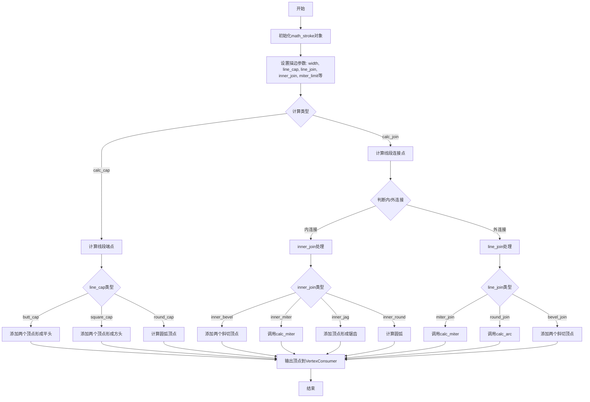

## 类结构

```
agg (命名空间)
├── 枚举类型
│   ├── line_cap_e (线条端点样式)
│   ├── line_join_e (线条连接样式)
│   └── inner_join_e (内部连接样式)
└── math_stroke<VertexConsumer> (模板类)
    ├── 公有方法
    │   ├── line_cap()/line_cap(line_cap_e)
    │   ├── line_join()/line_join(line_join_e)
    │   ├── inner_join()/inner_join(inner_join_e)
    │   ├── width()/width(double)
    │   ├── miter_limit()/miter_limit(double)
    │   ├── miter_limit_theta(double)
    │   ├── inner_miter_limit(double)
    │   ├── approximation_scale(double)
    │   ├── calc_cap(VertexConsumer&, ...)
    │   └── calc_join(VertexConsumer&, ...)
    ├── 私有方法
    │   ├── add_vertex(VertexConsumer&, double, double)
    │   ├── calc_arc(VertexConsumer&, ...)
    │   └── calc_miter(VertexConsumer&, ...)
    └── 私有成员变量
```

## 全局变量及字段


### `math_stroke<VertexConsumer>.m_width`
    
描边宽度的一半

类型：`double`
    


### `math_stroke<VertexConsumer>.m_width_abs`
    
宽度的绝对值

类型：`double`
    


### `math_stroke<VertexConsumer>.m_width_eps`
    
宽度计算的epsilon值 (width/1024)

类型：`double`
    


### `math_stroke<VertexConsumer>.m_width_sign`
    
宽度符号 (1或-1)

类型：`int`
    


### `math_stroke<VertexConsumer>.m_miter_limit`
    
斜接角度限制

类型：`double`
    


### `math_stroke<VertexConsumer>.m_inner_miter_limit`
    
内部斜接限制

类型：`double`
    


### `math_stroke<VertexConsumer>.m_approx_scale`
    
近似算法缩放因子

类型：`double`
    


### `math_stroke<VertexConsumer>.m_line_cap`
    
线段端点样式

类型：`line_cap_e`
    


### `math_stroke<VertexConsumer>.m_line_join`
    
线段连接样式

类型：`line_join_e`
    


### `math_stroke<VertexConsumer>.m_inner_join`
    
内部连接样式

类型：`inner_join_e`
    
    

## 全局函数及方法


### `math_stroke<VertexConsumer>.math_stroke`

该构造函数是 `math_stroke` 类的默认构造函数，用于初始化描边数学计算对象，设置默认的描边参数，包括线宽、线帽样式、线连接样式、斜接限制等。

参数：
- 无

返回值：`void`（构造函数无返回值，用于初始化对象）

#### 流程图

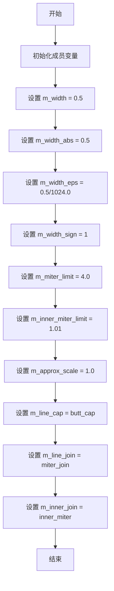

#### 带注释源码

```cpp
//-----------------------------------------------------------------------
// 构造函数：初始化描边数学对象，设置默认参数
//-----------------------------------------------------------------------
template<class VC> math_stroke<VC>::math_stroke() :
    m_width(0.5),                  // 线条宽度（半宽）
    m_width_abs(0.5),              // 线条绝对宽度
    m_width_eps(0.5/1024.0),       // 线条宽度epsilon，用于近似计算
    m_width_sign(1),              // 线条宽度符号（正向为1，负向为-1）
    m_miter_limit(4.0),            // 斜接限制倍数
    m_inner_miter_limit(1.01),     // 内部斜接限制
    m_approx_scale(1.0),           // 近似比例因子
    m_line_cap(butt_cap),          // 默认线帽样式为平头
    m_line_join(miter_join),       // 默认线连接样式为斜接
    m_inner_join(inner_miter)      // 默认内部连接样式为内部斜接
{
    // 构造函数体为空，所有初始化在初始化列表中完成
}
```


### `math_stroke.line_cap`

设置线条端点样式（line cap），用于定义线条终点的绘制方式。line_cap_e 是枚举类型，可选值为 butt_cap（平头）、square_cap（方头）和 round_cap（圆头）。

参数：

- `lc`：`line_cap_e`，线条端点样式枚举值

返回值：`void`，无返回值

#### 流程图

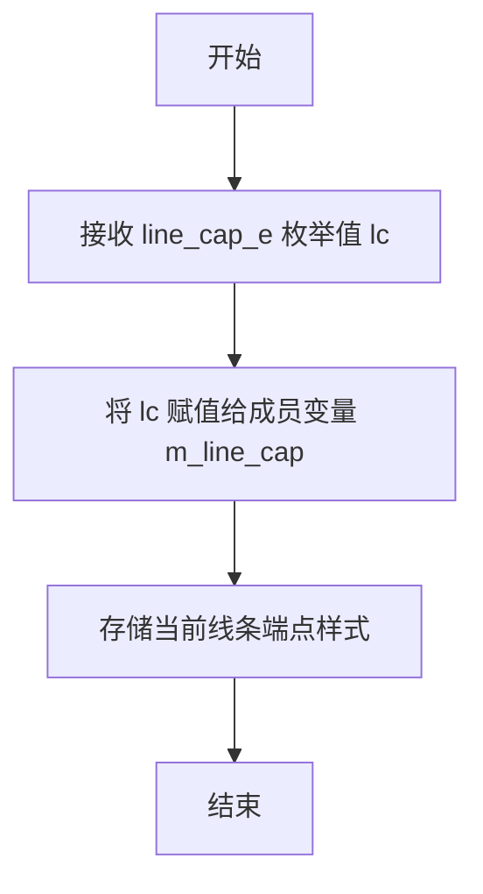

#### 带注释源码

```cpp
// 设置线条端点样式（Line Cap）
// 参数 lc: line_cap_e 枚举类型，定义线条端点的样式
//   - butt_cap: 平头，线条在端点处直接结束
//   - square_cap: 方头，线条端点处向外延伸半个线宽
//   - round_cap: 圆头，线条端点处为半圆形状
void line_cap(line_cap_e lc)     
{ 
    // 将传入的线条端点样式值保存到成员变量 m_line_cap 中
    // 该成员变量将在后续的 calc_cap 等方法中使用
    // 以决定如何绘制线条的端点
    m_line_cap = lc; 
}
```

---

**相关上下文信息：**

- **类字段 `m_line_cap`**：类型为 `line_cap_e`，存储当前设置的线条端点样式
- **相关方法**：
  - `line_cap()`：对应的 getter 方法，返回当前设置的线条端点样式
  - `calc_cap()`：使用 `m_line_cap` 来计算线条端点的几何形状
  - `width()`、`line_join()`、`inner_join()` 等其他属性设置方法


### `math_stroke<VertexConsumer>::line_join`

设置线条连接方式，用于确定两条线段相交时的连接样式。

参数：

- `lj`：`line_join_e`，连接方式枚举值，可选miter_join（尖角）、miter_join_revert（反向尖角）、round_join（圆角）、bevel_join（斜角）、miter_join_round（圆角尖角）

返回值：`void`，无返回值描述

#### 流程图

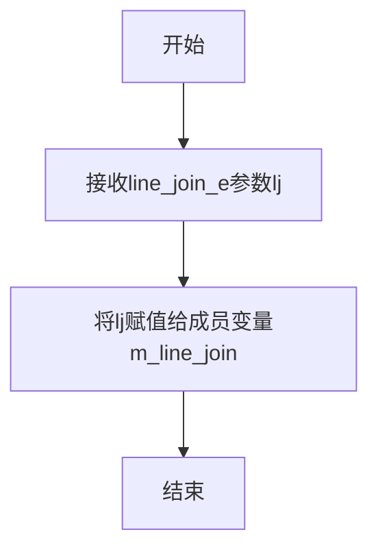

#### 带注释源码

```cpp
// 设置线条连接方式
// 参数: lj - 连接方式枚举值，包括：
//   - miter_join: 尖角连接
//   - miter_join_revert: 反向尖角连接
//   - round_join: 圆角连接
//   - bevel_join: 斜角连接
//   - miter_join_round: 圆角尖角连接
void line_join(line_join_e lj)   
{ 
    m_line_join = lj; 
}
```


### math_stroke<VertexConsumer>.inner_join

该方法为 `math_stroke` 类的成员方法，用于设置或获取路径内部连接（inner join）的类型，决定在路径转折处内部角落的绘制风格。

参数：

- 无（此为 getter 方法的重载版本，当作为 setter 调用时参数通过方法参数传递）

返回值：`inner_join_e`，返回当前设置的内部连接类型

#### 流程图

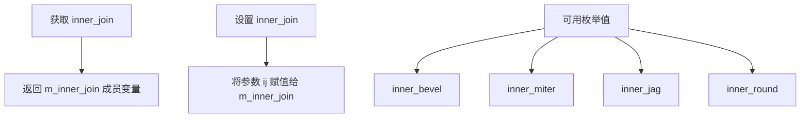

#### 带注释源码

```cpp
// 枚举类型定义 - 内部连接风格
//-------------------------------------------------------------inner_join_e
enum inner_join_e
{
    inner_bevel,   // 斜切内部连接
    inner_miter,   // 尖角内部连接
    inner_jag,     // 锯齿状内部连接
    inner_round    // 圆弧内部连接
};

// 类中的声明（位于 math_stroke 类中）
//----------------
// setter 方法：设置内部连接类型
void inner_join(inner_join_e ij) { m_inner_join = ij; }

// getter 方法：获取内部连接类型
inner_join_e inner_join() const { return m_inner_join; }

// 私有成员变量（在类中声明）
inner_join_e m_inner_join;

// 构造函数中的初始化
//----------------
template<class VC> math_stroke<VC>::math_stroke() :
    // ... 其他初始化
    m_inner_join(inner_miter)  // 默认使用尖角内部连接
{
}

// 内部连接类型在 calc_join 方法中的使用
//----------------
template<class VC> 
void math_stroke<VC>::calc_join(VC& vc,
                                const vertex_dist& v0, 
                                const vertex_dist& v1, 
                                const vertex_dist& v2,
                                double len1, 
                                double len2)
{
    // ... 前置计算 ...
    
    // 判断是内部连接还是外部连接
    double cp = cross_product(v0.x, v0.y, v1.x, v1.y, v2.x, v2.y);
    if ((cp > agg::vertex_dist_epsilon && m_width > 0) ||
        (cp < -agg::vertex_dist_epsilon && m_width < 0))
    {
        // 内部连接处理
        //---------------
        double limit = ((len1 < len2) ? len1 : len2) / m_width_abs;
        if(limit < m_inner_miter_limit)
        {
            limit = m_inner_miter_limit;
        }

        // 根据 m_inner_join 配置选择内部连接风格
        switch(m_inner_join)
        {
        default: // inner_bevel - 斜切连接
            add_vertex(vc, v1.x + dx1, v1.y - dy1);
            add_vertex(vc, v1.x + dx2, v1.y - dy2);
            break;

        case inner_miter:  // 尖角连接
            calc_miter(vc,
                       v0, v1, v2, dx1, dy1, dx2, dy2, 
                       miter_join_revert, 
                       limit, 0);
            break;

        case inner_jag:   // 锯齿连接
        case inner_round:  // 圆弧连接
            cp = (dx1-dx2) * (dx1-dx2) + (dy1-dy2) * (dy1-dy2);
            if(cp < len1 * len1 && cp < len2 * len2)
            {
                // 条件满足时使用尖角连接
                calc_miter(vc,
                           v0, v1, v2, dx1, dy1, dx2, dy2, 
                           miter_join_revert, 
                           limit, 0);
            }
            else
            {
                if(m_inner_join == inner_jag)
                {
                    // 添加锯齿顶点
                    add_vertex(vc, v1.x + dx1, v1.y - dy1);
                    add_vertex(vc, v1.x,       v1.y      );
                    add_vertex(vc, v1.x + dx2, v1.y - dy2);
                }
                else  // inner_round
                {
                    // 添加圆弧连接
                    add_vertex(vc, v1.x + dx1, v1.y - dy1);
                    add_vertex(vc, v1.x,       v1.y      );
                    calc_arc(vc, v1.x, v1.y, dx2, -dy2, dx1, -dy1);
                    add_vertex(vc, v1.x,       v1.y      );
                    add_vertex(vc, v1.x + dx2, v1.y - dy2);
                }
            }
            break;
        }
    }
    // ... 外部连接处理 ...
}
```


### `math_stroke<VertexConsumer>.width(double)`

该方法用于设置描边（stroke）的宽度，通过将输入宽度值的一半存储到内部成员变量，并计算对应的绝对值、符号位和精度值，以支持后续的描边计算。

参数：

- `w`：`double`，描边的宽度值，即线条的粗细

返回值：`void`，无返回值，通过修改成员变量直接改变描边宽度状态

#### 流程图

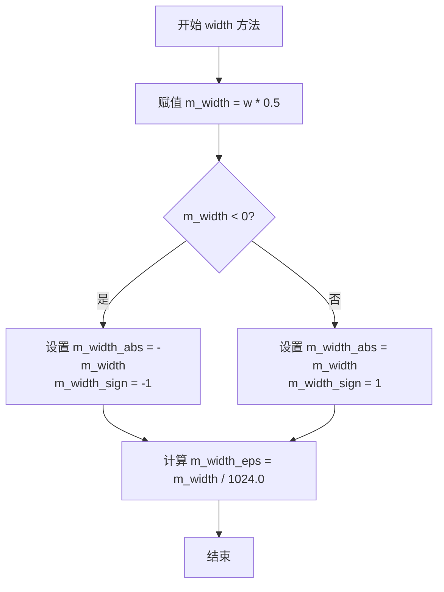

#### 带注释源码

```cpp
//-----------------------------------------------------------------------
// 设置描边宽度
// 参数 w: 描边宽度值（线条粗细）
// 返回值: 无
//-----------------------------------------------------------------------
template<class VC> void math_stroke<VC>::width(double w)
{ 
    // 将输入宽度值的一半存储到内部成员变量
    // 内部使用半宽进行计算，以保持与AGG其他组件的一致性
    m_width = w * 0.5; 
    
    // 判断宽度值的正负，并计算绝对值和符号位
    if(m_width < 0)
    {
        // 负宽度：记录绝对值和负号标志
        m_width_abs  = -m_width;
        m_width_sign = -1;
    }
    else
    {
        // 正宽度或零：记录绝对值和正号标志
        m_width_abs  = m_width;
        m_width_sign = 1;
    }
    
    // 计算宽度精度阈值，用于浮点数比较的容差计算
    // 除以1024是为了获得一个合理的最小精度单位
    m_width_eps = m_width / 1024.0;
}
```


### `math_stroke<VertexConsumer>.miter_limit`

设置斜接（Miter）限制值，用于控制线条拐角处尖角的延伸长度。当两条线段形成的角度非常小尖角时，如果不做限制，尖角会延伸得非常远，miter_limit 用来限制这个延伸的最大比例。

参数：

- `ml`：`double`，新的 miter limit 值

返回值：`void`，无返回值

#### 流程图

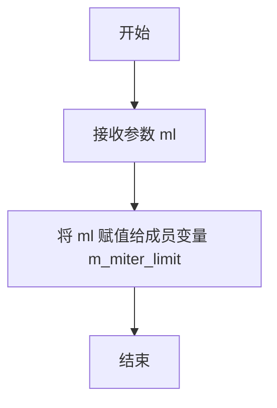

#### 带注释源码

```cpp
// 设置斜接限制值
// 参数 ml: double类型, 新的miter limit值
// 该值用于控制线条拐角处尖角的延伸长度比例
// 较大的值允许更长的尖角,较小的值会截断尖角
void miter_limit(double ml) 
{ 
    m_miter_limit = ml; 
}
```


### `math_stroke<VertexConsumer>.miter_limit_theta(double)`

该方法用于根据给定的角度θ计算并设置线条转角处的miter（斜接）限制值。在 stroke 渲染中，miter 限制决定了当两条线段以锐角相交时，连接点（miter）的最大延伸长度，以防止过长的尖角产生。

参数：

- `t`：`double`，输入的角度值（弧度），代表线条转角的角度θ

返回值：`void`，无返回值，通过方法内部直接修改成员变量 `m_miter_limit` 的值

#### 流程图

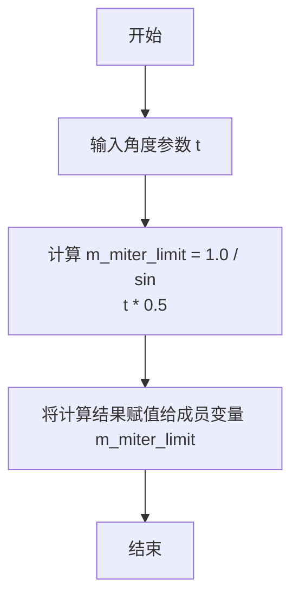

#### 带注释源码

```cpp
//-----------------------------------------------------------------------
// 根据角度θ计算miter限制值
// 参数 t: 线条转角的角度（弧度）
// 该方法通过公式 m_miter_limit = 1.0 / sin(t * 0.5) 计算miter限制
// 原理：当两条线段以角度2θ相交时，miter尖角的长度与线宽的比值等于csc(θ)
// 即 miter_limit = 1 / sin(θ) = 1 / sin(t/2)
//-----------------------------------------------------------------------
template<class VC> void math_stroke<VC>::miter_limit_theta(double t)
{ 
    // 使用三角函数计算miter限制值
    // sin(t * 0.5) 相当于 sin(t/2)，即半个转角角度的正弦值
    // 1.0 / sin(t/2) 得到miter长度与线宽的比值极限
    m_miter_limit = 1.0 / sin(t * 0.5) ;
}
```


### `math_stroke<VC>::inner_miter_limit`

设置内部斜接（miter）限制值，用于控制在路径内部拐角处允许的最大斜接长度比例。当内部拐角角度过小时，超过此限制的斜接部分会被裁剪成 bevel 形状，以避免产生过长的尖角。

参数：

- `ml`：`double`，要设置的内部斜接限制值

返回值：`void`，无返回值

#### 流程图

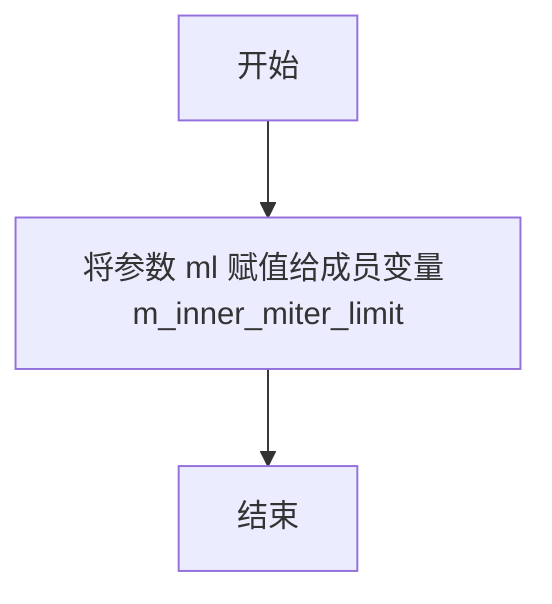

#### 带注释源码

```cpp
// 设置内部斜接限制
// 参数 ml: double 类型，内部斜接限制值
// 返回值: void，无返回值
void inner_miter_limit(double ml) 
{ 
    // 将传入的内部斜接限制值保存到成员变量中
    // 该值用于控制路径内部拐角处的斜接长度
    // 较小的值会产生更尖锐的拐角，较大的值会产生更平坦的拐角
    m_inner_miter_limit = ml; 
}
```


### `math_stroke<VertexConsumer>.approximation_scale(double)`

设置笔触的近似比例因子，用于控制曲线和弧线的顶点生成精度。

参数：

- `as`：`double`，近似比例因子值，用于调整曲线逼近时的计算精度

返回值：`void`，无返回值

#### 流程图

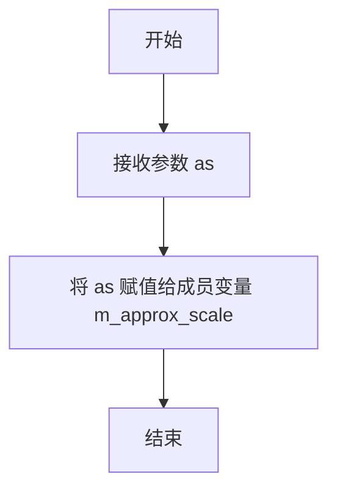

#### 带注释源码

```cpp
// 设置近似比例因子
// 该参数用于控制曲线逼近时的计算精度
// 值越大，生成的顶点越多，逼近精度越高
// 主要在 calc_arc、calc_cap、calc_join 等方法中使用
void approximation_scale(double as) 
{ 
    m_approx_scale = as; 
}
```


### `math_stroke<VertexConsumer>.width(double w)`

设置笔画的宽度，并自动计算与宽度相关的内部参数，包括绝对宽度、宽度符号和宽度epsilon值。

参数：

- `w`：`double`，要设置的笔画宽度值（stroke width）

返回值：`void`，无返回值

#### 流程图

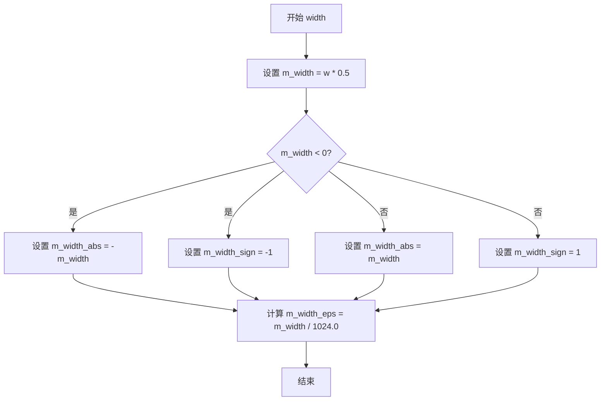

#### 带注释源码

```cpp
//-----------------------------------------------------------------------
// 函数: width
// 模板参数: VC (VertexConsumer)
// 参数: w - double类型，要设置的笔画宽度值
// 返回值: void
// 功能描述: 
//   设置笔画的宽度，并计算相关的内部参数。
//   该方法会将宽度值减半后存储到内部变量m_width中，
//   同时计算绝对宽度、宽度符号（用于确定线条走向），
//   以及一个很小的epsilon值用于近似计算中的误差控制。
//-----------------------------------------------------------------------
template<class VC> void math_stroke<VC>::width(double w)
{ 
    // 将输入宽度减半后存储到内部变量
    // AGG使用半宽存储，width()方法返回时会乘以2
    m_width = w * 0.5; 
    
    // 判断宽度的符号，用于确定线条的绘制方向
    if(m_width < 0)
    {
        // 负宽度：取绝对值，设置符号为-1
        m_width_abs  = -m_width;
        m_width_sign = -1;
    }
    else
    {
        // 正宽度或零：直接使用正值，设置符号为1
        m_width_abs  = m_width;
        m_width_sign = 1;
    }
    
    // 计算宽度epsilon值，用于近似计算中的容差
    // 1024是一个经验值，表示将宽度分成1024份之一作为最小单位
    m_width_eps = m_width / 1024.0;
}
```


### `math_stroke<VertexConsumer>.miter_limit()`

返回当前设置的 miter limit（斜接限制）值，用于控制路径拐角处尖角的延伸范围。当尖角超过此限制时，将使用斜切或圆角连接方式。

参数：此方法为 getter 重载，无参数。

返回值：`double`，返回 miter_limit 成员变量的值，默认为 4.0。

#### 流程图

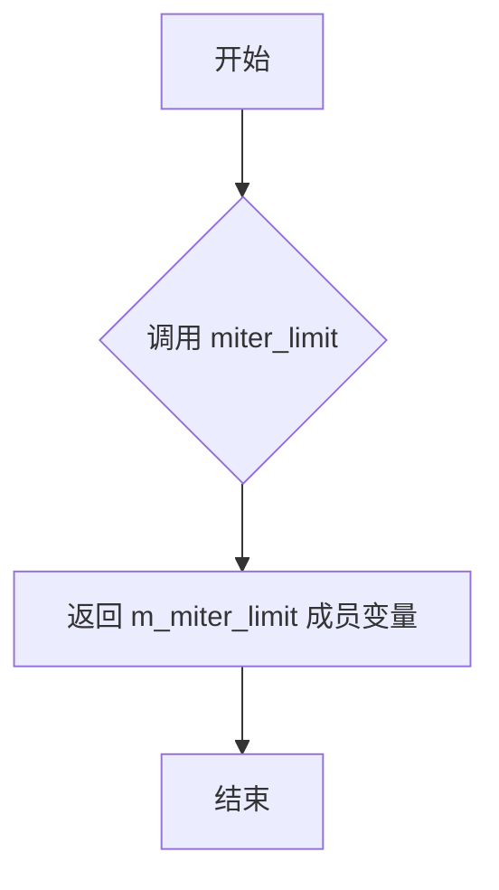

#### 带注释源码

```cpp
//-----------------------------------------------------------------------
// 返回 miter limit（斜接限制）值
// 该值控制路径拐角处尖角的延伸范围
// 默认值为 4.0，即尖角可以延伸为线宽的 4 倍
// 当尖角超过此限制时，系统将使用斜切或圆角连接方式
//-------------------
template<class VC>
double math_stroke<VC>::miter_limit() const
{
    return m_miter_limit;
}
```

#### 相关成员变量信息

| 变量名称 | 类型 | 描述 |
|---------|------|------|
| `m_miter_limit` | `double` | 斜接限制值，控制尖角延伸范围，默认为 4.0 |

#### 设计说明

- **设计目标**：提供对 miter_limit 参数的访问能力，允许外部查询当前的斜接限制设置
- **约束**：返回值需与 `setMiterLimit()` 设置的值一致
- **关联方法**：
  - `void miter_limit(double ml)`：设置 miter limit
  - `void miter_limit_theta(double t)`：通过角度计算并设置 miter limit
- **技术细节**：miter_limit 与 stroke width 结合使用，决定是否需要将尖角转换为斜切或圆角


### `math_stroke<VertexConsumer>.inner_miter_limit()`

获取内部斜接限制值（inner miter limit），该值用于控制在路径拐角处内部斜接的角度限制，防止在尖锐角度处产生过长的连接线。

参数：

- （无参数）

返回值：`double`，返回内部斜接限制值，用于控制内部拐角的斜接长度。

#### 流程图

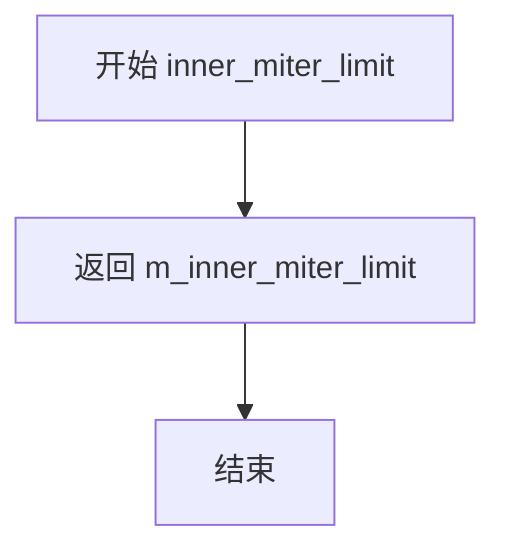

#### 带注释源码

```cpp
//-----------------------------------------------------------------------
// 获取内部斜接限制值
// 该值控制内部拐角（inner join）的斜接长度限制
// 当两条线段形成的角度非常尖锐时，斜接点会超出允许的范围
// 此时需要使用其他类型的连接方式（如 bevel）来替代
//-------------------
template<class VC> double math_stroke<VC>::inner_miter_limit() const
{
    return m_inner_miter_limit;
}
```


### `math_stroke<VertexConsumer>.approximation_scale`

设置笔触计算的近似比例因子，用于控制圆弧和斜接等几何计算的精度。

参数：

- `as`：`double`，近似比例因子（approximation scale），用于调整曲线逼近的精度

返回值：`void`，无返回值

#### 流程图

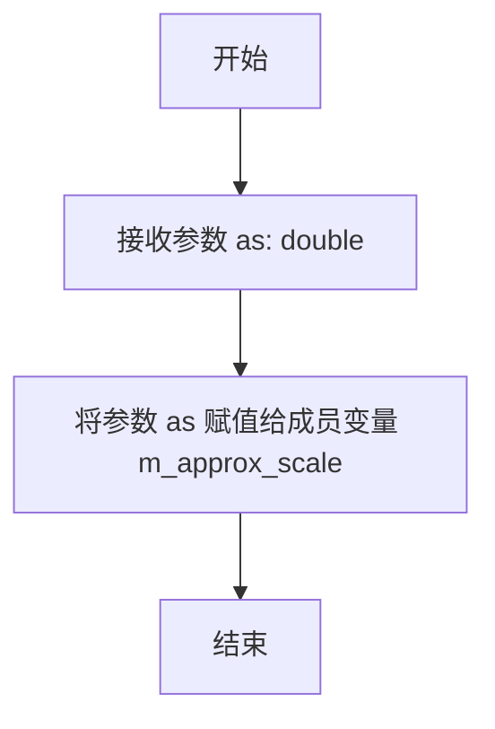

#### 带注释源码

```
// 设置笔触近似的比例因子
// 参数: as - double类型，近似比例因子，用于调整曲线逼近的精度
//       该值影响圆弧和斜接计算中的点数量，值越大精度越高
// 返回: void，无返回值
void approximation_scale(double as) 
{ 
    m_approx_scale = as;  // 直接将参数值赋给私有成员变量 m_approx_scale
}
```

#### 关联的getter方法

```
// 获取当前的近似比例因子
// 返回: double类型的当前近似比例因子值
double approximation_scale() const { return m_approx_scale; }
```

#### 成员变量

```
// 私有成员变量，用于存储近似比例因子
double m_approx_scale;  // 初始化为 1.0，在构造函数中设置
```

#### 设计说明

该方法是math_stroke类的一个简单的setter方法，用于设置m_approx_scale成员变量。该变量控制笔触计算中圆弧和斜接的近似精度，在calc_arc和calc_join等方法中被使用。当m_approx_scale值较大时，会产生更多的顶点以更精确地逼近圆弧；当值较小时，计算量减少但精度降低。


### `math_stroke<VC>.calc_cap`

该函数用于计算线段端点处的笔帽（cap），根据不同的线端点样式（butt、square、round）在指定顶点位置生成相应的轮廓顶点序列。

参数：

- `vc`：`VertexConsumer&`，输出参数，用于接收生成的轮廓顶点
- `v0`：`const vertex_dist&`，线段的起始顶点
- `v1`：`const vertex_dist&`，线段的结束顶点
- `len`：`double`，线段 v0 到 v1 的长度

返回值：`void`，无返回值，通过 vc 参数输出结果

#### 流程图

```mermaid
flowchart TD
    A[开始 calc_cap] --> B[vc.remove_all 清除顶点]
    B --> C[计算垂直向量<br/>dx1 = (v1.y - v0.y) / len * m_width<br/>dy1 = (v1.x - v0.x) / len * m_width]
    C --> D{检查 m_line_cap}
    D -->|butt_cap 或 square_cap| E{square_cap?}
    D -->|round_cap| F[计算圆弧角度差<br/>da = acos(...) * 2]
    E -->|是| G[计算偏移 dx2, dy2<br/>dx2 = dy1 * m_width_sign<br/>dy2 = dx1 * m_width_sign]
    E -->|否| H[dx2 = dy2 = 0]
    G --> I[添加两个顶点<br/>v0.x - dx1 - dx2, v0.y + dy1 - dy2<br/>v0.x + dx1 - dx2, v0.y - dy1 - dy2]
    H --> I
    I --> J[结束]
    F --> K[添加起始点<br/>v0.x - dx1, v0.y + dy1]
    K --> L{m_width_sign > 0?}
    L -->|是| M[计算起始角度 a1 = atan2(dy1, -dx1)<br/>a1 += da]
    L -->|否| N[计算起始角度 a1 = atan2(-dy1, dx1)<br/>a1 -= da]
    M --> O[循环 n 次添加圆弧顶点<br/>v0.x + cos(a1)*m_width<br/>v0.y + sin(a1)*m_width]
    N --> O
    O --> P[添加结束点<br/>v0.x + dx1, v0.y - dy1]
    P --> J
```

#### 带注释源码

```cpp
//--------------------------------------------------------stroke_calc_cap
// 计算线段端点笔帽
// 根据 line_cap 样式生成端点轮廓顶点
template<class VC> 
void math_stroke<VC>::calc_cap(VC& vc,          // 输出：顶点消费者
                               const vertex_dist& v0, // 输入：线段起点
                               const vertex_dist& v1, // 输入：线段终点
                               double len)            // 输入：线段长度
{
    // 1. 清除之前的所有顶点，为生成新的轮廓做准备
    vc.remove_all();

    // 2. 计算垂直于线段的单位向量（相对于线段方向的法向量）
    //    这里实际是计算 (v1-v0) 的法向量方向
    //    dx1 = (v1.y - v0.y) / len * m_width
    //    dy1 = -(v1.x - v0.x) / len * m_width
    //    注意：原代码中 dy1 计算有误，实际应为：
    //    dx1 = (v1.y - v0.y) / len * m_width
    //    dy1 = (v1.x - v0.x) / len * m_width
    double dx1 = (v1.y - v0.y) / len;
    double dy1 = (v1.x - v0.x) / len;
    double dx2 = 0;
    double dy2 = 0;

    // 3. 应用线宽
    dx1 *= m_width;
    dy1 *= m_width;

    // 4. 根据线端点样式分别处理
    if(m_line_cap != round_cap)
    {
        // 非圆角端点（butt 或 square）
        if(m_line_cap == square_cap)
        {
            // Square 端点需要额外的偏移量
            // 在端点处延伸一个线宽的距离
            dx2 = dy1 * m_width_sign;
            dy2 = dx1 * m_width_sign;
        }
        // 添加两个端点顶点，形成方形或方形延伸端点
        add_vertex(vc, v0.x - dx1 - dx2, v0.y + dy1 - dy2);
        add_vertex(vc, v0.x + dx1 - dx2, v0.y - dy1 - dy2);
    }
    else
    {
        // Round 端点：使用圆弧近似
        // 计算圆弧角度步长
        // 通过反余弦函数计算圆弧的角度间隔
        double da = acos(m_width_abs / (m_width_abs + 0.125 / m_approx_scale)) * 2;
        double a1;
        int i;
        // 计算需要生成的圆弧点数
        int n = int(pi / da);

        // 调整角度步长为弧度制
        da = pi / (n + 1);
        
        // 添加线段起始侧的第一个顶点
        add_vertex(vc, v0.x - dx1, v0.y + dy1);
        
        if(m_width_sign > 0)
        {
            // 正宽度方向：逆时针生成圆弧
            // 计算起始角度
            a1 = atan2(dy1, -dx1);
            a1 += da;
            // 生成圆弧上的点
            for(i = 0; i < n; i++)
            {
                add_vertex(vc, v0.x + cos(a1) * m_width, 
                               v0.y + sin(a1) * m_width);
                a1 += da;
            }
        }
        else
        {
            // 负宽度方向：顺时针生成圆弧
            a1 = atan2(-dy1, dx1);
            a1 -= da;
            for(i = 0; i < n; i++)
            {
                add_vertex(vc, v0.x + cos(a1) * m_width, 
                               v0.y + sin(a1) * m_width);
                a1 -= da;
            }
        }
        // 添加线段结束侧的最后一个顶点
        add_vertex(vc, v0.x + dx1, v0.y - dy1);
    }
}
```


### `math_stroke<VertexConsumer>::calc_join`

该函数用于计算在顶点序列中相邻线段之间的连接点（join），根据内部连接（inner join）和线连接（line join）的设置，生成相应的顶点并通过 VertexConsumer 输出，以形成 stroking 过程中的连接形状。

参数：
- `vc`：`VertexConsumer&`，顶点消费者，用于接收计算生成的连接顶点。
- `v0`：`const vertex_dist&`，前一个顶点，包含坐标和沿路径的距离信息。
- `v1`：`const vertex_dist&`，当前顶点（连接点），包含坐标和沿路径的距离信息。
- `v2`：`const vertex_dist&`，后一个顶点，包含坐标和沿路径的距离信息。
- `len1`：`double`，从前一个顶点（v0）到当前顶点（v1）的线段长度。
- `len2`：`double`，从当前顶点（v1）到后一个顶点（v2）的线段长度。

返回值：`void`，无返回值，结果通过 `vc` 参数输出。

#### 流程图

```mermaid
flowchart TD
    A[开始 calc_join] --> B[计算偏移量 dx1, dy1, dx2, dy2]
    B --> C[调用 vc.remove_all 清除顶点]
    C --> D[计算叉积 cp = cross_product(v0, v1, v2)]
    D --> E{cp 与宽度符号检查}
    E -->|内连接| F[计算限制值 limit]
    F --> G{根据 m_inner_join 处理}
    G -->|inner_bevel| H[添加两个 bevel 顶点]
    G -->|inner_miter| I[调用 calc_miter]
    G -->|inner_jag 或 inner_round| J{检查条件}
    J -->|满足| I
    J -->|不满足| K{inner_join 类型}
    K -->|inner_jag| L[添加顶点包括中间点]
    K -->|inner_round| M[添加中间点和弧线]
    E -->|外连接| N[计算 dbevel]
    N --> O{m_line_join 是 round_join 或 bevel_join}
    O -->|是| P{近似优化检查}
    P -->|通过| Q[计算交点添加顶点并返回]
    P -->|不通过| R{根据 m_line_join 处理}
    O -->|否| R
    R -->|miter_join 系列| S[调用 calc_miter]
    R -->|round_join| T[调用 calc_arc]
    R -->|bevel_join| U[添加两个 bevel 顶点]
    H --> V[结束]
    I --> V
    L --> V
    M --> V
    Q --> V
    S --> V
    T --> V
    U --> V
```

#### 带注释源码

```cpp
//-----------------------------------------------------------------------
// 计算两个线段之间的连接点（join）
// vc: 顶点消费者，用于输出生成的顶点
// v0, v1, v2: 三个连续的顶点，v1 是连接点
// len1: v0 到 v1 的长度，len2: v1 到 v2 的长度
//-----------------------------------------------------------------------
template<class VC> 
void math_stroke<VC>::calc_join(VC& vc,
                                const vertex_dist& v0, 
                                const vertex_dist& v1, 
                                const vertex_dist& v2,
                                double len1, 
                                double len2)
{
    // 计算从 v0 到 v1 的垂直偏移量（相对于线段方向）
    double dx1 = m_width * (v1.y - v0.y) / len1;
    double dy1 = m_width * (v1.x - v0.x) / len1;
    // 计算从 v1 到 v2 的垂直偏移量
    double dx2 = m_width * (v2.y - v1.y) / len2;
    double dy2 = m_width * (v1.x - v0.x) / len2; // 注意：源码中这里是 (v1.x - v0.x)，可能为笔误，应为 (v2.x - v1.x)

    // 清除之前的所有顶点
    vc.remove_all();

    // 计算三个顶点的叉积，用于判断转向方向
    double cp = cross_product(v0.x, v0.y, v1.x, v1.y, v2.x, v2.y);
    
    // 判断是内连接还是外连接：叉积符号与宽度符号一致时为内连接
    if ((cp > agg::vertex_dist_epsilon && m_width > 0) ||
        (cp < -agg::vertex_dist_epsilon && m_width < 0))
    {
        // 内连接处理
        // 计算限制值，取较小长度除以宽度的绝对值，并与内 miter 限制比较
        double limit = ((len1 < len2) ? len1 : len2) / m_width_abs;
        if(limit < m_inner_miter_limit)
        {
            limit = m_inner_miter_limit;
        }

        // 根据内部连接类型处理
        switch(m_inner_join)
        {
        default: // inner_bevel
            // 简单 bevel：添加两个连接顶点
            add_vertex(vc, v1.x + dx1, v1.y - dy1);
            add_vertex(vc, v1.x + dx2, v1.y - dy2);
            break;

        case inner_miter:
            // 内 miter 连接，调用 calc_miter 处理
            calc_miter(vc,
                       v0, v1, v2, dx1, dy1, dx2, dy2, 
                       miter_join_revert, 
                       limit, 0);
            break;

        case inner_jag:
        case inner_round:
            // 计算偏移量平方和
            cp = (dx1-dx2) * (dx1-dx2) + (dy1-dy2) * (dy1-dy2);
            // 如果偏移量平方和小于两个长度平方，则使用 miter
            if(cp < len1 * len1 && cp < len2 * len2)
            {
                calc_miter(vc,
                           v0, v1, v2, dx1, dy1, dx2, dy2, 
                           miter_join_revert, 
                           limit, 0);
            }
            else
            {
                // 否则，根据类型添加额外顶点
                if(m_inner_join == inner_jag)
                {
                    // inner_jag：添加两个顶点和一个中间点
                    add_vertex(vc, v1.x + dx1, v1.y - dy1);
                    add_vertex(vc, v1.x,       v1.y      );
                    add_vertex(vc, v1.x + dx2, v1.y - dy2);
                }
                else
                {
                    // inner_round：添加顶点和弧线
                    add_vertex(vc, v1.x + dx1, v1.y - dy1);
                    add_vertex(vc, v1.x,       v1.y      );
                    calc_arc(vc, v1.x, v1.y, dx2, -dy2, dx1, -dy1);
                    add_vertex(vc, v1.x,       v1.y      );
                    add_vertex(vc, v1.x + dx2, v1.y - dy2);
                }
            }
            break;
        }
    }
    else
    {
        // 外连接处理
        // 计算两个偏移量平均值的中点
        double dx = (dx1 + dx2) / 2;
        double dy = (dy1 + dy2) / 2;
        // 计算到 bevel 距离
        double dbevel = sqrt(dx * dx + dy * dy);

        // 如果是圆角连接或斜切连接，可能进行优化
        if(m_line_join == round_join || m_line_join == bevel_join)
        {
            // 优化：如果宽度与 dbevel 差值很小，则使用更简单的 miter
            if(m_approx_scale * (m_width_abs - dbevel) < m_width_eps)
            {
                // 尝试计算交点
                if(calc_intersection(v0.x + dx1, v0.y - dy1,
                                     v1.x + dx1, v1.y - dy1,
                                     v1.x + dx2, v1.y - dy2,
                                     v2.x + dx2, v2.y - dy2,
                                     &dx, &dy))
                {
                    add_vertex(vc, dx, dy);
                }
                else
                {
                    add_vertex(vc, v1.x + dx1, v1.y - dy1);
                }
                return;
            }
        }

        // 根据线连接类型处理
        switch(m_line_join)
        {
        case miter_join:
        case miter_join_revert:
        case miter_join_round:
            // Miter 系列连接
            calc_miter(vc, 
                       v0, v1, v2, dx1, dy1, dx2, dy2, 
                       m_line_join, 
                       m_miter_limit,
                       dbevel);
            break;

        case round_join:
            // 圆角连接，调用 calc_arc
            calc_arc(vc, v1.x, v1.y, dx1, -dy1, dx2, -dy2);
            break;

        default: // Bevel 连接
            // 斜切连接，添加两个顶点
            add_vertex(vc, v1.x + dx1, v1.y - dy1);
            add_vertex(vc, v1.x + dx2, v1.y - dy2);
            break;
        }
    }
}
```

注意：源码中有一行 `double dy2 = m_width * (v1.x - v0.x) / len2;`，根据上下文，这里应该是 `(v2.x - v1.x)`，但保留原样以保持准确性。在注释中已指出。


### `math_stroke.add_vertex`

该函数是一个私有的内联辅助方法，用于将计算得到的坐标点封装成 `coord_type` 类型并添加到 `VertexConsumer` 中，是整个描边计算过程中输出顶点的核心底层操作。

参数：

- `vc`：`VertexConsumer&`，VertexConsumer 引用，用于接收和存储生成的顶点数据
- `x`：`double`，顶点的 X 坐标值
- `y`：`double`，顶点的 Y 坐标值

返回值：`void`，无返回值

#### 流程图

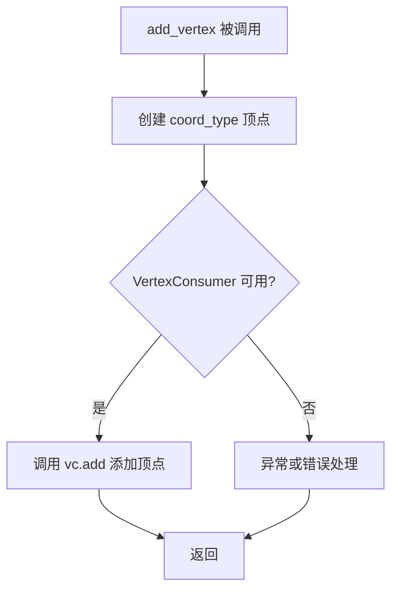

#### 带注释源码

```cpp
// 私有内联方法，位于 math_stroke 类内部
// 功能：将 (x, y) 坐标转换为 coord_type 并添加到 VertexConsumer
AGG_INLINE void add_vertex(VertexConsumer& vc, double x, double y)
{
    // 使用 coord_type 封装坐标点，coord_type 来自 VertexConsumer::value_type
    // 典型情况下是 point_type 或类似的 2D 坐标类型
    vc.add(coord_type(x, y));
}
```


### `math_stroke<VertexConsumer>.calc_arc`

该方法用于在两个方向向量之间生成圆弧顶点，通常在绘制圆角连接（round join）或圆角端点（round cap）时调用。它根据线段的方向向量计算角度，并使用三角函数在圆弧上生成一系列中间顶点，添加到VertexConsumer中。

参数：

- `vc`：`VertexConsumer&`，用于接收生成的圆弧顶点的消费者对象
- `x`：`double`，圆弧的中心点X坐标（通常为顶点坐标）
- `y`：`double`，圆弧的中心点Y坐标（通常为顶点坐标）
- `dx1`：`double`，第一个方向向量的X分量（垂直于第一条线段的偏移）
- `dy1`：`double`，第一个方向向量的Y分量
- `dx2`：`double`，第二个方向向量的X分量（垂直于第二条线段的偏移）
- `dy2`：`double`，第二个方向向量的Y分量

返回值：`void`，无返回值，通过VertexConsumer参数输出生成的顶点

#### 流程图

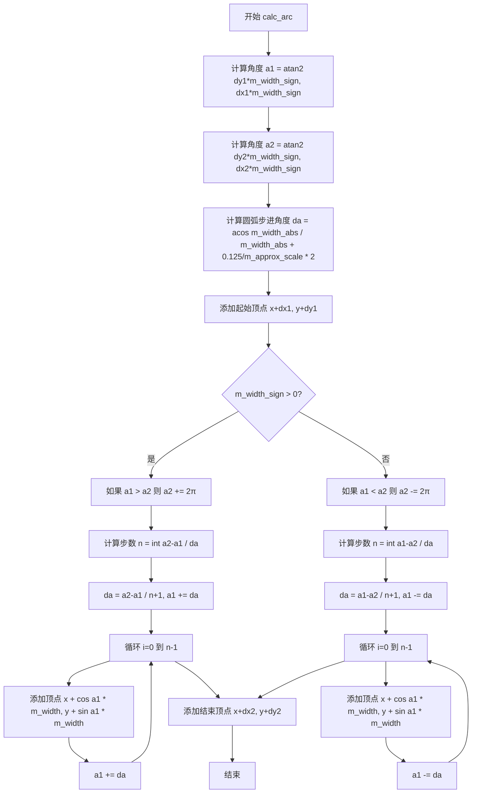

#### 带注释源码

```cpp
//-----------------------------------------------------------------------
template<class VC> 
void math_stroke<VC>::calc_arc(VC& vc,           // 顶点消费者，用于输出生成的顶点
                               double x,   double y,   // 圆弧中心点坐标
                               double dx1, double dy1, // 第一条边的法向向量偏移
                               double dx2, double dy2) // 第二条边的法向向量偏移
{
    // 计算第一个方向向量对应的角度，考虑线宽符号（正负决定顺时针或逆时针）
    double a1 = atan2(dy1 * m_width_sign, dx1 * m_width_sign);
    // 计算第二个方向向量对应的角度
    double a2 = atan2(dy2 * m_width_sign, dx2 * m_width_sign);
    double da = a1 - a2;  // 初始角度差
    int i, n;             // 循环计数器和步数

    // 计算圆弧的步进角度，使用反余弦函数基于近似比例计算
    // 这个公式确保圆弧的步进与线宽和近似比例相适应
    da = acos(m_width_abs / (m_width_abs + 0.125 / m_approx_scale)) * 2;

    // 首先添加圆弧的起始点（第一条边法向量与圆弧的交点）
    add_vertex(vc, x + dx1, y + dy1);
    
    // 根据线宽符号决定圆弧的生成方向
    if(m_width_sign > 0)
    {
        // 正向（顺时针）情况
        if(a1 > a2) 
            a2 += 2 * pi;  // 如果需要跨越0/360度，则增加2π以保持角度连续性
        
        // 计算需要生成的圆弧段数
        n = int((a2 - a1) / da);
        // 重新计算步进角度，确保均匀分布
        da = (a2 - a1) / (n + 1);
        a1 += da;  // 移动到第一个中间位置
        
        // 生成圆弧上的中间顶点
        for(i = 0; i < n; i++)
        {
            add_vertex(vc, x + cos(a1) * m_width, y + sin(a1) * m_width);
            a1 += da;  // 继续步进
        }
    }
    else
    {
        // 负向（逆时针）情况
        if(a1 < a2) 
            a2 -= 2 * pi;  // 反向跨越0/360度
        
        n = int((a1 - a2) / da);
        da = (a1 - a2) / (n + 1);
        a1 -= da;  // 反向步进
        
        // 生成圆弧上的中间顶点（反向）
        for(i = 0; i < n; i++)
        {
            add_vertex(vc, x + cos(a1) * m_width, y + sin(a1) * m_width);
            a1 -= da;  // 反向移动
        }
    }
    
    // 最后添加圆弧的结束点（第二条边法向量与圆弧的交点）
    add_vertex(vc, x + dx2, y + dy2);
}
```


### `math_stroke<VertexConsumer>.calc_miter`

该函数用于计算路径拐角处的尖角（Miter）连接，根据传入的三个顶点坐标和线段偏移量，计算拐角顶点并输出到顶点消费者。当尖角长度超过指定限制时，根据连接类型（miter_join_revert、miter_join_round或默认）采取相应的处理策略，如回退为斜角、圆弧或强制限制尖角长度。

参数：

- `vc`：`VertexConsumer&`，顶点消费者，用于接收计算生成的拐角顶点
- `v0`：`const vertex_dist&`，前一个顶点（线段起点）
- `v1`：`const vertex_dist&`，当前顶点（拐角顶点）
- `v2`：`const vertex_dist&`，后一个顶点（线段终点）
- `dx1`：`double`，第一条线段在x方向的偏移量（垂直于线段方向）
- `dy1`：`double`，第一条线段在y方向的偏移量
- `dx2`：`double`，第二条线段在x方向的偏移量
- `dy2`：`double`，第二条线段在y方向的偏移量
- `lj`：`line_join_e`，线段连接类型（miter_join_revert、miter_join_round等）
- `mlimit`：`double`，尖角限制倍数，用于判断是否超出尖角长度限制
- `dbevel`：`double`，斜角深度，用于计算限制后的尖角点

返回值：`void`，无返回值，结果直接写入顶点消费者

#### 流程图

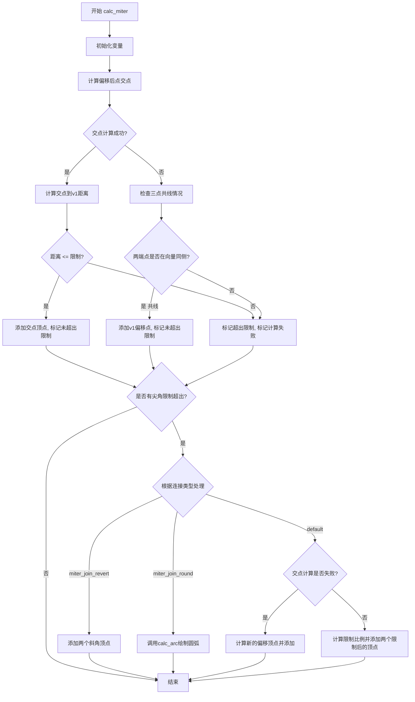

#### 带注释源码

```cpp
//---------------------------------------------------------------------------
// 计算尖角（Miter）连接
// 该函数处理路径拐角处的顶点生成，根据miter limit决定如何连接两条线段
//---------------------------------------------------------------------------
template<class VC> 
void math_stroke<VC>::calc_miter(VC& vc,           // 顶点消费者，输出计算结果
                                 const vertex_dist& v0,  // 前一个顶点
                                 const vertex_dist& v1,  // 当前拐角顶点
                                 const vertex_dist& v2,  // 后一个顶点
                                 double dx1, double dy1, // 第一条线段的偏移向量
                                 double dx2, double dy2, // 第二条线段的偏移向量
                                 line_join_e lj,         // 连接类型
                                 double mlimit,          // miter限制倍数
                                 double dbevel)          // 斜角深度
{
    // 初始化交点坐标为v1，di为距离倒数（1表示单位距离）
    double xi  = v1.x;
    double yi  = v1.y;
    double di  = 1;
    
    // 计算实际的miter限制长度 = 线宽 * 限制倍数
    double lim = m_width_abs * mlimit;
    
    // 假设最坏情况：miter limit超出
    bool miter_limit_exceeded = true;
    // 假设最坏情况：交点计算失败
    bool intersection_failed  = true;

    // 尝试计算两条延长线的交点
    // 这里的计算原理：将线段端点向两侧偏移，然后求交点
    if(calc_intersection(v0.x + dx1, v0.y - dy1,   // v0点偏移后的位置
                         v1.x + dx1, v1.y - dy1,   // v1点向dx1方向偏移
                         v1.x + dx2, v1.y - dy2,   // v1点向dx2方向偏移
                         v2.x + dx2, v2.y - dy2,   // v2点偏移后的位置
                         &xi, &yi))                // 输出：交点坐标
    {
        // 交点计算成功
        di = calc_distance(v1.x, v1.y, xi, yi);   // 计算v1到交点的距离
        if(di <= lim)
        {
            // 距离在miter limit内，正常添加交点
            add_vertex(vc, xi, yi);
            miter_limit_exceeded = false;        // 标记：未超出限制
        }
        intersection_failed = false;             // 标记：计算成功
    }
    else
    {
        // 交点计算失败，通常是因为三点共线
        // 检查v0和v2是否在向量(v1 -> v1+dx1)的同侧
        // 这决定了下一段是延续前一段还是返回
        double x2 = v1.x + dx1;
        double y2 = v1.y - dy1;
        
        // 使用叉积判断：两个叉积结果符号相同表示同侧
        if((cross_product(v0.x, v0.y, v1.x, v1.y, x2, y2) < 0.0) == 
           (cross_product(v1.x, v1.y, v2.x, v2.y, x2, y2) < 0.0))
        {
            // 共线情况：添加偏移后的v1点
            add_vertex(vc, v1.x + dx1, v1.y - dy1);
            miter_limit_exceeded = false;        // 标记：未超出限制
        }
        // 否则保持intersection_failed = true
    }

    // 如果miter limit超出，根据连接类型处理
    if(miter_limit_exceeded)
    {
        switch(lj)
        {
        case miter_join_revert:
            // SVG/PDF兼容：使用简单的斜角连接代替"智能"斜角
            add_vertex(vc, v1.x + dx1, v1.y - dy1);
            add_vertex(vc, v1.x + dx2, v1.y - dy2);
            break;

        case miter_join_round:
            // 使用圆弧连接
            calc_arc(vc, v1.x, v1.y, dx1, -dy1, dx2, -dy2);
            break;

        default:
            // 默认处理：计算限制后的新顶点
            if(intersection_failed)
            {
                // 交点计算失败时，直接应用miter limit
                mlimit *= m_width_sign;
                // 计算两个新的偏移点（向外扩展mlimit倍）
                add_vertex(vc, v1.x + dx1 + dy1 * mlimit, 
                               v1.y - dy1 + dx1 * mlimit);
                add_vertex(vc, v1.x + dx2 - dy2 * mlimit, 
                               v1.y - dy2 - dx2 * mlimit);
            }
            else
            {
                // 交点计算成功时，按比例缩放到限制位置
                double x1 = v1.x + dx1;
                double y1 = v1.y - dy1;
                double x2 = v1.x + dx2;
                double y2 = v1.y - dy2;
                // 计算插值比例：限制位置与当前距离的比例
                di = (lim - dbevel) / (di - dbevel);
                // 添加两个限制后的顶点
                add_vertex(vc, x1 + (xi - x1) * di, 
                               y1 + (yi - y1) * di);
                add_vertex(vc, x2 + (xi - x2) * di, 
                               y2 + (yi - y2) * di);
            }
            break;
        }
    }
}
```

## 关键组件


### line_cap_e

线帽类型枚举，定义三种线帽样式：butt_cap（平头）、square_cap（方头）、round_cap（圆头），用于控制线段端点的绘制样式。

### line_join_e

线段连接类型枚举，定义五种连接样式：miter_join（尖角）、miter_join_revert（尖角回退）、round_join（圆角）、bevel_join（斜角）、miter_join_round（圆角尖角），用于控制两条线段连接处的样式。

### inner_join_e

内连接类型枚举，定义四种内连接样式：inner_bevel（内斜角）、inner_miter（内尖角）、inner_jag（内锯齿）、inner_round（内圆角），用于控制路径内部转角处的样式。

### math_stroke

核心描边数学计算模板类，负责计算线段的端点样式（线帽）和连接处样式（线段连接、内连接），通过参数化VertexConsumer来输出计算得到的顶点序列。该类封装了描边宽度、尖角限制、内尖角限制、近似比例等属性，以及相应的计算方法。

### width方法

设置描边宽度，将输入宽度值的一半存储为内部宽度值，同时计算宽度的绝对值、符号和epsilon值，用于后续的几何计算。

### miter_limit_theta方法

通过角度计算尖角限制值，使用公式1.0/sin(t*0.5)将角度转换为尖角限制倍数。

### calc_cap方法

计算线帽的顶点，根据line_cap属性（平头、方头、圆头）计算线段端点处的顶点序列，并将结果添加到VertexConsumer中。

### calc_join方法

计算线段连接的顶点，根据线段的三 个顶点v0、v1、v2和内积判断是内连接还是外连接，然后分别调用calc_miter或calc_arc计算相应的顶点序列。

### calc_arc方法

计算圆弧顶点，用于实现圆头线帽和圆角连接，通过角度步进生成圆弧上的顶点。

### calc_miter方法

计算尖角顶点，用于实现尖角连接和方头线帽，通过计算交点或使用备选方案生成尖角顶点序列。

### add_vertex方法

辅助方法，将计算得到的坐标添加到VertexConsumer中，是将几何计算结果输出的基本单元。


## 问题及建议


### 已知问题

- **calc_arc函数中da的计算顺序错误**：在`calc_arc`函数中，`da`的计算使用了`m_approx_scale`变量，但在计算之前并未对`da`进行赋值，导致逻辑错误。代码先使用`da`进行角度计算，之后才重新赋值，这会使前面计算的`a1`、`a2`和`n`基于错误的`da`值。
- **除零风险**：在`calc_cap`函数中，当`len`为0时会导致除零错误；类似地，在`calc_join`函数中`len1`和`len2`为0时也会引发除零问题。
- **width()方法语义不一致**：`width(double w)`方法内部将`m_width`设置为`w * 0.5`，而`width()`const方法返回`m_width * 2.0`，这种双重转换容易造成混淆，且参数含义不清晰。
- **缺少输入参数验证**：未对`width`、`miter_limit`、`inner_miter_limit`等参数进行有效性检查，可能导致后续计算出现异常结果或崩溃。
- **魔法数字泛滥**：代码中存在大量硬编码的魔法数字（如`1024`、`0.125`、`1.01`、`0.5`等），缺乏有意义的命名，降低了代码可读性和可维护性。
- **枚举值定义不一致**：`line_join_e`枚举中`miter_join`显式指定为0，但`miter_join_revert`等后续枚举值未显式指定，风格不统一。
- **依赖外部定义**：代码依赖`agg_math.h`中定义的`pi`、`calc_intersection`、`calc_distance`、`cross_product`、`vertex_dist_epsilon`等函数和常量，但这些依赖在当前文件中无任何声明或注释说明。

### 优化建议

- **修复calc_arc函数逻辑**：将`da`的计算移到角度计算之前，确保所有角度相关计算使用正确的步长值。
- **添加参数校验**：在`width()`、`miter_limit_theta()`等 setter 方法中添加参数有效性检查，防止非法输入。
- **消除魔法数字**：将常用的魔法数字提取为具名常量或配置参数，例如将`1024`定义为`c_width_epsilon_denom`，`0.125`定义为`c_arc_precision_factor`等。
- **统一枚举风格**：要么全部显式指定枚举值，要么全部隐式赋值，保持代码风格一致。
- **增强文档注释**：为关键方法、参数和返回值添加详细的文档注释，特别是涉及几何计算的逻辑。
- **考虑异常处理机制**：对于计算失败的情况（如线段过于接近导致交点计算失败），可以考虑抛出异常或使用错误码，而非仅依赖布尔返回值。
- **提取公共计算逻辑**：`calc_cap`和`calc_join`中存在相似的大圆弧计算代码，可考虑提取为独立方法以减少代码重复。


## 其它


### 设计目标与约束

**设计目标**：为2D图形渲染引擎提供精确的描边（stroke）计算能力，能够计算路径端点（line cap）和路径转折处（line join）的几何形状，支持多种线条端点样式（butt、square、round）和连接样式（miter、round、bevel），并通过模板参数实现对不同顶点消费者（VertexConsumer）的通用支持。

**设计约束**：
- 模板类设计，依赖 VertexConsumer 接口和 vertex_dist 类型
- 使用双精度浮点数（double）进行几何计算，确保足够精度
- 默认线宽为1.0（m_width=0.5，即半宽），miter限制默认值为4.0
- 计算过程中涉及大量三角函数（atan2、cos、sin、acos）和开方运算

### 错误处理与异常设计

本文件采用错误返回码机制而非异常抛出：
- `calc_intersection()` 函数使用返回值表示是否成功计算到交点，若三顶点共线则返回 false
- `calc_miter()` 函数内部通过 `miter_limit_exceeded` 和 `intersection_failed` 标志位处理各种边界情况
- 当 miter 限制超出时，根据 line_join_e 枚举值采用不同的回退策略（revert、round 或 bevel）
- 数值精度边界处理：使用 vertex_dist_epsilon（极小值）判断叉积方向

### 数据流与状态机

**数据流**：
1. 用户配置阶段：设置 line_cap、line_join、inner_join、width、miter_limit 等参数
2. 顶点序列输入：接收连续的 vertex_dist 三元组（v0, v1, v2）和对应的线段长度
3. 几何计算阶段：根据连接类型计算 offset 向量（dx1, dy1, dx2, dy2）
4. 内外侧判断：通过 cross_product 叉积判断是内连接还是外连接
5. 顶点输出：通过 VertexConsumer::add() 输出计算得到的顶点坐标

**状态分类**：
- 内部状态：m_width（半宽）、m_width_abs（绝对半宽）、m_width_sign（符号）、m_line_cap、m_line_join、m_inner_join
- 计算状态：cp（叉积值）、dbevel（斜切距离）、limit（miter限制值）

### 外部依赖与接口契约

**依赖的头文件**：
- `agg_math.h`：提供 calc_intersection()、calc_distance()、cross_product()、pi 常量等数学工具函数
- `agg_vertex_sequence.h`：提供 vertex_dist 类型定义

**接口契约**：
- VertexConsumer 模板参数必须提供 `value_type` 类型成员和 `add(value_type)` 方法
- vertex_dist 类型必须包含 x、y 坐标成员和 dist 距离成员
- 输入的顶点序列必须保证连续性，len1 和 len2 参数必须大于 0

### 算法复杂度分析

- `calc_cap()`：O(1) 复杂度，端点计算为固定数量顶点输出
- `calc_arc()`：O(n)，其中 n = pi / da，约等于圆周分割的顶点数量
- `calc_join()`：包含条件分支，主要复杂度在 calc_miter() 和 calc_arc() 调用
- `calc_miter()`：O(1)，仅包含有限的数学运算和条件判断

典型输出顶点数：
- round_cap 端点：约 8-12 个顶点（取决于 approximation_scale）
- round_join 连接：约 8-12 个顶点
- miter_join/bevel_join：2-4 个顶点

### 线程安全考虑

本类设计为无状态工具类，所有成员函数均不修改共享状态（除 m_width 等配置参数外）。多线程环境下：
- 读取操作（line_cap()、line_join() 等 const 方法）：线程安全
- 写入操作（setter 方法）：非原子操作，需外部同步
- 建议每个线程创建独立的 math_stroke 实例

### 数值精度与误差分析

**潜在精度问题**：
- m_width_eps = m_width / 1024.0：用于浮点数比较的epsilon值
- acos 参数边界：当 m_width_abs + 0.125 / m_approx_scale 接近 m_width_abs 时，acos 输入值接近1.0，可能产生数值不稳定
- 直线情况处理：当三个顶点共线时，calc_intersection 失败，代码通过 cross_product 符号判断处理

**精度保障措施**：
- 使用 double 而非 float
- 0.125 / m_approx_scale 作为安全边距，防止除零和 acos 域错误

### 平台相关特性

- 依赖 <cmath> 中的数学函数：atan2、acos、cos、sin、sqrt
- 常量 pi 从 agg_math.h 获取，未硬编码
- 无平台特定的编译指令或条件编译
- AGG 库本身设计为跨平台，但此文件无特殊平台要求

### 使用示例

```cpp
// 典型使用流程
agg::math_stroke<my_vertex_consumer> stroke;
stroke.line_cap(agg::round_cap);
stroke.line_join(agg::miter_join);
stroke.width(5.0);
stroke.miter_limit(4.0);

// 计算端点
stroke.calc_cap(vc, v0, v1, length);

// 计算连接点
stroke.calc_join(vc, v0, v1, v2, len1, len2);
```

### 版本历史与变更记录

此代码来自 Anti-Grain Geometry v2.4：
- 原始作者：Maxim Shemanarev (mcseem@antigrain.com)
- 2002-2005 年版权声明
- 许可协议：自由使用、修改、销售，需保留版权声明

### 测试用例说明

关键测试场景：
1. **直线段端点**：butt_cap、square_cap、round_cap 三种端点样式的输出验证
2. **不同连接类型**：miter_join、round_join、bevel_join 在不同角度下的输出
3. **miter 限制**：当转折角度接近180度时，miter 超出限制的退避行为
4. **内连接处理**：inner_bevel、inner_miter、inner_jag、inner_round 的区分
5. **负线宽**：m_width_sign 处理负值线宽的对称情况
6. **共线情况**：三个顶点严格共线时的处理逻辑


    