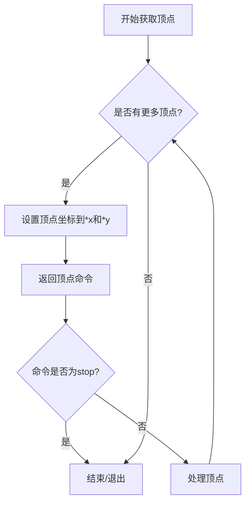
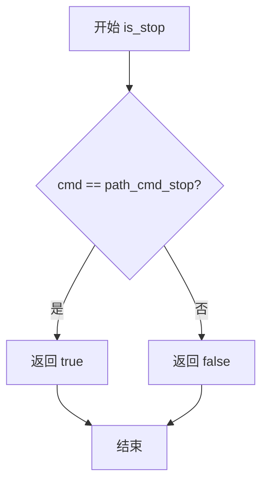
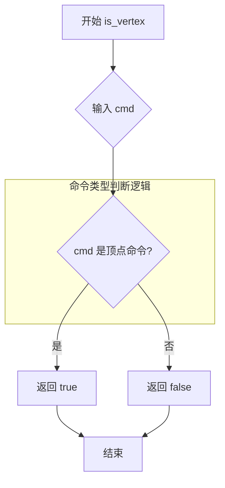
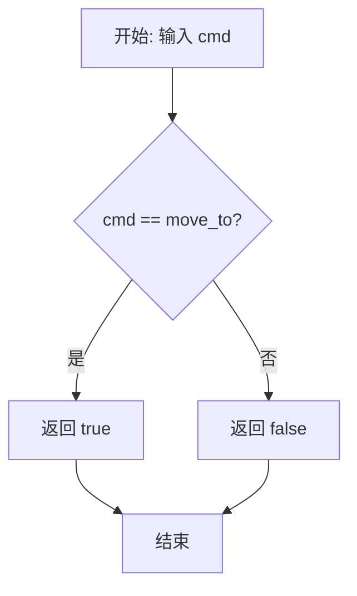
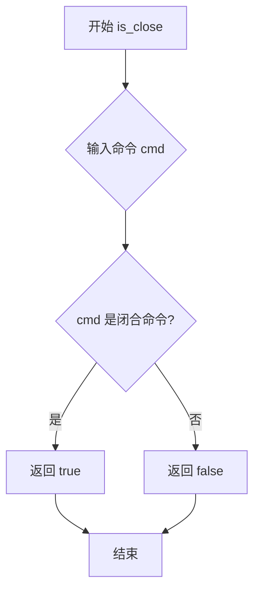
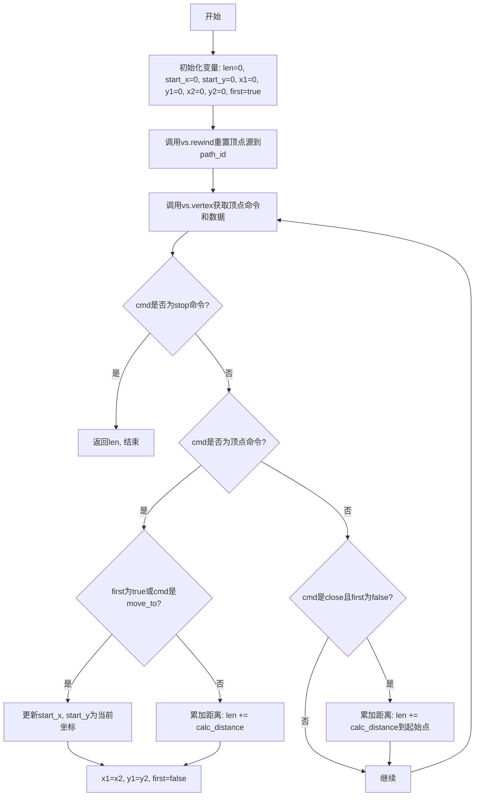

# `matplotlib\extern\agg24-svn\include\agg_path_length.h` 详细设计文档

这是Anti-Grain Geometry (AGG) 库中的一个路径长度计算工具函数，使用模板实现以支持任意类型的顶点源。该函数通过遍历路径中的所有顶点，计算相邻顶点之间的欧几里得距离并累加，同时处理移动命令和闭合命令，最终返回路径的总长度。

## 整体流程

```mermaid
graph TD
    A[开始] --> B[初始化变量: len=0, start_x=0, start_y=0, x1=0, y1=0, x2=0, y2=0, first=true]
    B --> C[调用 vs.rewind(path_id) 重置顶点源]
    C --> D[调用 vs.vertex(&x2, &y2) 获取顶点]
    D --> E{is_stop(cmd)?}
    E -- 是 --> F[返回路径长度 len]
    E -- 否 --> G{is_vertex(cmd)?}
    G -- 是 --> H{first || is_move_to(cmd)?}
    H -- 是 --> I[start_x=x2, start_y=y2, first=false]
    H -- 否 --> J[len += calc_distance(x1,y1,x2,y2)]
    J --> K[x1=x2, y1=y2, first=false]
    G -- 否 --> L{is_close(cmd) && !first?}
    L -- 是 --> M[len += calc_distance(x1,y1,start_x,start_y)]
    L -- 否 --> D
    I --> D
    K --> D
    M --> D
```

## 类结构

```
agg (命名空间)
└── path_length (模板函数)
```

## 全局变量及字段


### `len`
    
累积的路径总长度

类型：`double`
    


### `start_x`
    
路径起始点X坐标

类型：`double`
    


### `start_y`
    
路径起始点Y坐标

类型：`double`
    


### `x1`
    
前一个顶点X坐标

类型：`double`
    


### `y1`
    
前一个顶点Y坐标

类型：`double`
    


### `x2`
    
当前顶点X坐标

类型：`double`
    


### `y2`
    
当前顶点Y坐标

类型：`double`
    


### `first`
    
标记是否为第一个顶点

类型：`bool`
    


### `cmd`
    
当前顶点命令类型

类型：`unsigned`
    


    

## 全局函数及方法


### `path_length<VertexSource>`

计算并返回指定路径的总长度。通过遍历路径的所有顶点，累加相邻顶点之间的距离，特别处理了移动命令（不计入长度）和闭合命令（连接终点与起点）。

参数：

- `vs`：`VertexSource&`，顶点源引用，提供路径的顶点数据
- `path_id`：`unsigned`，路径ID，默认为0，用于指定要计算长度的路径

返回值：`double`，路径的总长度

#### 流程图

```mermaid
flowchart TD
    A[开始 path_length] --> B[初始化变量: len=0, first=true]
    B --> C[调用 vs.rewind(path_id) 回到路径起点]
    C --> D[获取下一个顶点 cmd = vs.vertex(&x2, &y2)]
    D --> E{is_stop(cmd)?}
    E -->|是| F[返回 len]
    E -->|否| G{is_vertex(cmd)?}
    G -->|是| H{first 或 is_move_to(cmd)?}
    H -->|是| I[更新 start_x, start_y 为当前点]
    H -->|否| J[len += calc_distance(x1,y1, x2,y2)]
    I --> K[x1=x2, y1=y2, first=false]
    J --> K
    G -->|否| L{is_close(cmd) 且 !first?}
    L -->|是| M[len += calc_distance(x1,y1, start_x, start_y)]
    L -->|否| N[继续]
    M --> N
    N --> D
    K --> D
```

#### 带注释源码

```cpp
//----------------------------------------------------------------------------
// Anti-Grain Geometry - Version 2.4
// 计算路径长度的模板函数
//----------------------------------------------------------------------------

template<class VertexSource> 
double path_length(VertexSource& vs, unsigned path_id = 0)
{
    // 累计路径长度
    double len = 0.0;
    // 路径起点坐标（用于close命令时计算最后一段距离）
    double start_x = 0.0;
    double start_y = 0.0;
    // 前一个顶点的坐标
    double x1 = 0.0;
    double y1 = 0.0;
    // 当前顶点的坐标
    double x2 = 0.0;
    double y2 = 0.0;
    // 标记是否处理第一个顶点
    bool first = true;

    // 当前获取到的绘图命令
    unsigned cmd;
    // 将顶点源重置到指定路径的起始位置
    vs.rewind(path_id);
    
    // 遍历路径中的所有顶点
    while(!is_stop(cmd = vs.vertex(&x2, &y2)))
    {
        // 判断当前命令是否为顶点命令（move_to, line_to, curve3, curve4等）
        if(is_vertex(cmd))
        {
            // 如果是第一个顶点或者是move_to命令，记录起点
            if(first || is_move_to(cmd))
            {
                start_x = x2;
                start_y = y2;
            }
            else
            {
                // 累加当前线段的长度到总长度
                len += calc_distance(x1, y1, x2, y2);
            }
            // 更新前一个顶点为当前顶点
            x1 = x2;
            y1 = y2;
            first = false;
        }
        else
        {
            // 如果是close命令且不是第一个点，连接终点与起点
            if(is_close(cmd) && !first)
            {
                len += calc_distance(x1, y1, start_x, start_y);
            }
        }
    }
    // 返回计算得到的路径总长度
    return len;
}
```


### `agg::path_length`

该模板函数用于计算顶点源（VertexSource）中指定路径的几何长度，通过遍历路径的所有顶点，累加相邻顶点之间的欧几里得距离，最终返回路径的总长度。

参数：
- `vs`：`VertexSource&`，顶点源对象引用，需提供 `rewind()` 和 `vertex()` 方法
- `path_id`：`unsigned`，可选参数（默认为0），指定要计算长度的路径标识符

返回值：`double`，返回指定路径的总长度

#### 流程图

```mermaid
flowchart TD
    A[开始 path_length] --> B[初始化变量<br/>len=0, start_x=0, start_y=0<br/>x1=0, y1=0, x2=0, y2=0<br/>first=true]
    B --> C[调用 vs.rewind(path_id)<br/>重置顶点源到路径起始位置]
    C --> D{获取下一个顶点<br/>cmd = vs.vertex(&x2, &y2)}
    D --> E{is_stop(cmd)?}
    E -->|是| F[返回 len]
    E -->|否| G{is_vertex(cmd)?}
    G -->|是| H{first 或 is_move_to(cmd)?}
    H -->|是| I[start_x=x2, start_y=y2<br/>记录起始点]
    H -->|否| J[len += calc_distance(x1,y1,x2,y2)<br/>累加距离]
    I --> K[x1=x2, y1=y2<br/>first=false]
    J --> K
    G -->|否| L{is_close(cmd) 且 !first?}
    L -->|是| M[len += calc_distance(x1,y1,start_x,start_y)<br/>闭合路径]
    L -->|否| K
    M --> K
    K --> D
```

#### 带注释源码

```cpp
//----------------------------------------------------------------------------
// Anti-Grain Geometry - Version 2.4
// 计算路径长度的模板函数
//----------------------------------------------------------------------------

#ifndef AGG_PATH_LENGTH_INCLUDED
#define AGG_PATH_LENGTH_INCLUDED

#include "agg_math.h"  // 包含数学辅助函数

namespace agg
{
    // 模板函数：计算顶点源中指定路径的总长度
    // VertexSource：顶点源类型，需提供 rewind() 和 vertex() 方法
    // path_id：路径标识符，用于选择要计算长度的路径
    template<class VertexSource> 
    double path_length(VertexSource& vs, unsigned path_id = 0)
    {
        double len = 0.0;        // 累计路径长度
        double start_x = 0.0;    // 路径起始点X坐标
        double start_y = 0.0;    // 路径起始点Y坐标
        double x1 = 0.0;         // 前一个顶点X坐标
        double y1 = 0.0;         // 前一个顶点Y坐标
        double x2 = 0.0;         // 当前顶点X坐标
        double y2 = 0.0;         // 当前顶点Y坐标
        bool first = true;       // 标记是否为第一个顶点

        unsigned cmd;  // 路径命令（move_to, line_to, curve_to, close, stop等）

        // 调用 VertexSource 的 rewind 方法
        // 功能：重置顶点源到指定路径的起始位置
        // 参数：path_id - 要重置的路径标识符
        vs.rewind(path_id);

        // 遍历路径上的所有顶点
        // vertex() 方法返回当前顶点坐标，并通过 cmd 参数返回路径命令
        while(!is_stop(cmd = vs.vertex(&x2, &y2)))
        {
            // 检查当前命令是否为顶点命令（move_to, line_to, curve_to等）
            if(is_vertex(cmd))
            {
                // 如果是第一个顶点或者是 move_to 命令
                // 记录路径的起始点（用于后续计算闭合路径的距离）
                if(first || is_move_to(cmd))
                {
                    start_x = x2;
                    start_y = y2;
                }
                else
                {
                    // 累加当前顶点与前一个顶点之间的距离
                    len += calc_distance(x1, y1, x2, y2);
                }
                // 更新前一个顶点坐标
                x1 = x2;
                y1 = y2;
                first = false;
            }
            else
            {
                // 如果是 close 命令且不是第一个点
                // 计算从当前点到起始点的距离（闭合路径）
                if(is_close(cmd) && !first)
                {
                    len += calc_distance(x1, y1, start_x, start_y);
                }
            }
        }
        // 返回计算得到的路径总长度
        return len;
    }
}

#endif
```

### 关键组件信息

| 组件名称 | 描述 |
|---------|------|
| `VertexSource` | 顶点源抽象接口，需实现 `rewind()` 和 `vertex()` 方法 |
| `rewind(path_id)` | 重置顶点源到指定路径的起始位置，准备遍历该路径的顶点 |
| `vertex(&x, &y)` | 获取下一个顶点，通过参数返回顶点坐标，返回路径命令 |
| `is_stop(cmd)` | 判断命令是否为停止命令（结束标志） |
| `is_vertex(cmd)` | 判断命令是否为顶点命令（move_to, line_to, curve_to等） |
| `is_move_to(cmd)` | 判断命令是否为移动命令（起点） |
| `is_close(cmd)` | 判断命令是否为闭合命令 |
| `calc_distance(x1,y1,x2,y2)` | 计算两点之间的欧几里得距离 |

### 潜在的技术债务或优化空间

1. **缺少边界检查**：未检查 VertexSource 是否有效或是否支持指定的 path_id
2. **精度问题**：使用 double 类型，对于极长路径可能存在累积误差
3. **未处理曲线**：仅计算顶点间直线距离，未考虑贝塞尔曲线等曲线类型的精确长度
4. **函数职责**：路径长度计算与顶点遍历耦合，可考虑分离出独立的路径迭代器

### 其它项目

**设计目标**：提供一种通用的路径长度计算机制，适用于各种顶点源实现

**约束**：
- VertexSource 必须实现标准的路径遍历接口
- 路径命令遵循 AGG 的路径命令约定

**错误处理**：
- 当前实现无显式错误处理，依赖 VertexSource 的正确实现
- 对于无效的 path_id 行为未定义

**外部依赖**：
- `agg_math.h`：提供数学辅助函数（is_stop, is_vertex, is_move_to, is_close, calc_distance）
- VertexSource 接口：调用方需提供符合约定的顶点源实现


### `VertexSource.vertex`

获取下一个顶点的坐标

参数：

- `x`：`double*`，指向用于接收顶点X坐标的double型指针
- `y`：`double*`，指向用于接收顶点Y坐标的double型指针

返回值：`unsigned`，返回当前顶点的命令类型（如移动到、线条到、关闭路径、停止等）

#### 流程图



#### 带注释源码

```cpp
// 在path_length函数中的调用上下文：
unsigned cmd;  // 用于存储顶点命令
vs.rewind(path_id);  // 重置顶点源到指定路径ID的起始位置

// 核心调用：获取下一个顶点
while(!is_stop(cmd = vs.vertex(&x2, &y2)))
{
    // vertex方法返回当前顶点的命令类型
    // &x2和&y2是输出参数，用于接收顶点的X和Y坐标
    // 返回值cmd是unsigned类型，表示顶点命令
    // is_stop()检查是否已经到达路径终点
    
    if(is_vertex(cmd))  // 判断是否为顶点命令
    {
        if(first || is_move_to(cmd))  // 如果是第一个点或是移动命令
        {
            start_x = x2;  // 记录起始点
            start_y = y2;
        }
        else  // 否则是线条命令，计算距离并累加
        {
            len += calc_distance(x1, y1, x2, y2);
        }
        x1 = x2;  // 更新上一个顶点位置
        y1 = y2;
        first = false;
    }
    else
    {
        // 处理其他命令类型
        if(is_close(cmd) && !first)  // 关闭路径命令
        {
            len += calc_distance(x1, y1, start_x, start_y);  // 闭合路径
        }
    }
}
```

#### 备注

- `VertexSource` 是一个抽象基类或接口，具体实现决定了顶点数据的来源
- `vertex` 方法通常采用访问者模式或迭代器模式设计
- 返回的命令类型定义在AGG库中，包括：`path_cmd_move_to`、`path_cmd_line_to`、`path_cmd_curve3`、`path_cmd_curve4`、`path_cmd_close`、`path_cmd_stop` 等
- 该方法通常会修改传入指针所指向的内存位置来输出坐标值


### `is_stop(cmd)`

判断给定的路径命令是否为停止命令，用于控制路径遍历循环的终止。

参数：
- `cmd`：`unsigned`，路径命令值，表示从顶点源获取的命令类型。

返回值：`bool`，如果命令是停止命令（path_cmd_stop）则返回 true，否则返回 false。

#### 流程图



#### 带注释源码

```cpp
// 在 AGG 库中，is_stop 通常定义在 agg_path_commands.h 或类似头文件中
// 这里提供基于 AGG 标准的典型实现

namespace agg
{
    // 判断命令是否为停止命令
    // cmd: 路径命令值，通常是无符号整数
    // 返回: 如果命令等于 path_cmd_stop 则返回 true，否则返回 false
    inline bool is_stop(unsigned cmd)
    {
        return cmd == path_cmd_stop; // path_cmd_stop 是 AGG 定义的停止命令常量
    }
}
```

**注意**：在提供的代码文件中，`is_stop` 函数未直接定义，而是作为 AGG 库的全局函数使用。该函数通常与 `path_length` 函数配合，用于遍历路径顶点时检测停止条件。


### `is_vertex(cmd)`

该函数用于判断给定的路径命令（cmd）是否为顶点命令（Vertex Command），即是否为绘制命令（如移动、画线、曲线等），而非控制命令（如停止、闭合等）。

参数：

- `cmd`：`unsigned`（或类似的整型），路径命令标识符，用于表示路径操作的具体类型

返回值：`bool`，如果命令是顶点命令（如 move_to、line_to、curve3、curve4 等）则返回 true，否则返回 false

#### 流程图



#### 带注释源码

```cpp
//----------------------------------------------------------------------------
// Anti-Grain Geometry - Version 2.4
// Copyright (C) 2002-2005 Maxim Shemanarev (http://www.antigrain.com)
//
// Permission to copy, use, modify, sell and distribute this software 
// is granted provided this copyright notice appears in all copies. 
// This software is provided "as is" without express or implied
// warranty, and with no claim as to its suitability for any purpose.
//----------------------------------------------------------------------------
// Contact: mcseem@antigrain.com
//          mcseemagg@yahoo.com
//          http://www.antigrain.com
//----------------------------------------------------------------------------
#ifndef AGG_PATH_LENGTH_INCLUDED
#define AGG_PATH_LENGTH_INCLUDED

#include "agg_math.h"

namespace agg
{
    // 模板函数 path_length：计算给定路径的总体长度
    // VertexSource：顶点源类型，必须提供 vertex() 和 rewind() 方法
    // path_id：路径标识符，默认为 0
    template<class VertexSource> 
    double path_length(VertexSource& vs, unsigned path_id = 0)
    {
        double len = 0.0;        // 累计路径长度
        double start_x = 0.0;   // 路径起始点 X 坐标
        double start_y = 0.0;   // 路径起始点 Y 坐标
        double x1 = 0.0;        // 前一个顶点 X 坐标
        double y1 = 0.0;        // 前一个顶点 Y 坐标
        double x2 = 0.0;        // 当前顶点 X 坐标
        double y2 = 0.0;        // 当前顶点 Y 坐标
        bool first = true;      // 标记是否为第一个顶点

        unsigned cmd;           // 路径命令标识符
        
        // 重置顶点源到指定路径的起始位置
        vs.rewind(path_id);
        
        // 遍历路径上的所有顶点
        // is_vertex(cmd) 在此处被调用，用于判断当前命令是否为顶点命令
        while(!is_stop(cmd = vs.vertex(&x2, &y2)))
        {
            if(is_vertex(cmd))  // 判断 cmd 是否为顶点命令（绘制命令）
            {
                // 如果是第一个顶点或者是 move_to 命令，更新起始点
                if(first || is_move_to(cmd))
                {
                    start_x = x2;
                    start_y = y2;
                }
                else
                {
                    // 累加当前线段的长度到总长度
                    len += calc_distance(x1, y1, x2, y2);
                }
                // 更新前一个顶点的坐标
                x1 = x2;
                y1 = y2;
                first = false;
            }
            else
            {
                // 如果是闭合命令且不是第一个顶点，闭合路径
                if(is_close(cmd) && !first)
                {
                    // 累加从当前点到起始点的距离（闭合路径）
                    len += calc_distance(x1, y1, start_x, start_y);
                }
            }
        }
        return len;
    }
}

#endif

// 注意：is_vertex() 函数本身并未在此文件中定义
// 它是 AGG 库中的辅助函数，通常作为内联函数或宏定义实现
// 用于判断路径命令是否为顶点绘制命令（move_to, line_to, curve3, curve4 等）
// 其实现通常类似于：
// inline bool is_vertex(unsigned cmd) 
// { 
//     return (cmd & ~path_flags) < path_cmd_end; 
// }
```


### `is_move_to(cmd)`

该函数是 Anti-Grain Geometry (AGG) 库中的辅助函数，用于判断给定的路径命令标识符是否为移动命令（move_to）。在计算路径长度的算法中，用于识别每段路径的起点。

参数：

- `cmd`：`unsigned`（或枚举类型），路径命令标识符，用于表示不同的绘图命令（如 move_to、line_to、curve_to、close_path 等）

返回值：`bool`，如果 `cmd` 表示移动命令（move_to）则返回 `true`，否则返回 `false`

#### 流程图



#### 带注释源码

```
// 注：is_move_to 函数的实现不在给定代码段中，以下为根据 AGG 库上下文的推断实现
// 该函数通常作为内联函数或宏定义实现，用于快速判断命令类型

inline bool is_move_to(unsigned cmd)
{
    // 在 AGG 库中，命令通常由绘图命令和操作标志组合而成
    // move_to 命令的底层数值通常为 1 或具体的枚举值
    // 函数返回该命令是否为移动到新位置的命令
    return cmd == path_cmd_move_to;  // path_cmd_move_to 是 AGG 内部定义的常量
}

// 或者另一种可能的实现方式（基于位运算）：
inline bool is_move_to(unsigned cmd)
{
    // 提取命令的基本类型（去除操作标志）
    return (cmd & path_cmd_mask) == path_cmd_move_to;
}
```

**注意**：给定代码段中仅包含 `is_move_to` 函数的**调用**，其**实现定义**位于 AGG 库的其他头文件（如 `agg_path_commands.h` 或类似文件）中。上述源码为根据 AGG 库架构和代码上下文的合理推断。


### `is_close`

该函数用于判断给定的路径命令标识符是否为闭合命令（如闭合路径命令），通常返回布尔值以确定是否需要将当前点与路径起点连接以形成闭合路径。

参数：

- `cmd`：`unsigned`，路径命令标识符，用于判断该命令是否为闭合命令（如 AGG 库中定义的 `path_cmd_close` 或类似的闭合命令）

返回值：`bool`，如果命令是闭合命令则返回 true，否则返回 false

#### 流程图



#### 带注释源码

```
// 注意：由于 is_close 函数定义在 agg_math.h 头文件中，
// 以下源码是基于 AGG 库常见模式的推断实现

bool is_close(unsigned cmd)
{
    // AGG 中闭合命令的标识符通常为 path_cmd_close
    // 该函数通过比较命令标识符来判断是否为闭合命令
    // 
    // 参数:
    //   cmd - 路径命令标识符（来自 vertex_source 的 vertex() 方法返回）
    //
    // 返回值:
    //   true - 如果命令是闭合命令 (path_cmd_close)
    //   false - 其他情况
    
    return cmd == path_cmd_close;
}
```

> **注意**：由于 `is_close` 函数的实际定义位于 `agg_math.h` 头文件中（代码中通过 `#include "agg_math.h"` 引入），而该头文件的具体实现未在当前代码片段中提供。上述源码是基于 AGG 库常见模式的合理推断。实际的函数实现可能涉及更复杂的位操作或命令类型判断逻辑。


### `calc_distance`

该函数用于计算平面坐标系中两个点 `(x1, y1)` 和 `(x2, y2)` 之间的欧几里得距离。在 AGG 库中，此函数定义在 `agg_math.h` 头文件内，被 `path_length` 等路径计算函数调用，用于累加路径的直线段长度。

参数：
- `x1`：`double`，第一个点的 X 坐标。
- `y1`：`double`，第一个点的 Y 坐标。
- `x2`：`double`，第二个点的 X 坐标。
- `y2`：`double`，第二个点的 Y 坐标。

返回值：`double`，返回两点之间的直线距离。

#### 流程图

```mermaid
graph TD
    A[开始] --> B[输入参数 x1, y1, x2, y2]
    B --> C[计算差值 dx = x2 - x1]
    B --> D[计算差值 dy = y2 - y1]
    C --> E[计算距离平方和 sum = dx*dx + dy*dy]
    D --> E
    E --> F[开平方根 distance = sqrt(sum)]
    F --> G[返回 distance]
```

#### 带注释源码

```cpp
//----------------------------------------------------------------------------
// 计算两点之间的欧几里得距离 (Euclidean distance)
//----------------------------------------------------------------------------
// 参数说明:
//   x1, y1: 起始点的坐标
//   x2, y2: 结束点的坐标
// 返回值:
//   double: 两点之间的直线距离
//----------------------------------------------------------------------------
inline double calc_distance(double x1, double y1, double x2, double y2)
{
    // 计算 X 轴上的增量
    double dx = x2 - x1;
    
    // 计算 Y 轴上的增量
    double dy = y2 - y1;
    
    // 根据欧几里得距离公式: sqrt(dx^2 + dy^2) 计算距离
    // 也可以使用 std::hypot(dx, dy) 以获得更好的数值稳定性
    return sqrt(dx * dx + dy * dy);
}
```

## 关键组件


### path_length 函数模板

核心功能：计算给定路径的总长度，通过遍历顶点源中的所有顶点，累加各线段之间的距离，支持move_to命令重置起点以及close命令闭合路径。

### VertexSource 模板参数

顶点源接口，传入的模板类型需提供rewind()和vertex()方法，用于迭代访问路径的顶点数据。

### 路径遍历逻辑

使用while循环结合is_stop(cmd = vs.vertex(&x2, &y2))判断是否到达路径终点，持续读取顶点数据直到遇到停止命令。

### 距离计算组件

调用calc_distance(x1, y1, x2, y2)函数计算两点间的欧几里得距离，用于累加线段长度。

### 命令判断函数组

is_vertex()判断是否为顶点命令、is_move_to()判断是否为移动命令、is_close()判断是否为闭合命令、is_stop()判断是否为停止命令，用于解析路径命令类型。

### 状态管理变量

first标志追踪是否为第一个顶点、start_x/start_y记录路径起始点、x1/y1和x2/y2分别保存上一个和当前顶点坐标，用于路径长度计算过程中的状态维护。


## 问题及建议


### 已知问题

-   **变量初始化问题**：`cmd` 变量在循环条件 `while(!is_stop(cmd = vs.vertex(&x2, &y2)))` 中被赋值，但在第一次迭代前未初始化就直接用于 `is_vertex(cmd)` 判断。虽然逻辑上第一次迭代会先赋值，但代码结构不够清晰，存在潜在风险
-   **模板类型安全缺失**：函数模板未对 VertexSource 类型进行约束，如果该类型缺少 `rewind()` 或 `vertex()` 方法，只会在模板实例化时才会报错，编译期无法提前检测
-   **缺少输入验证**：未对 `path_id` 参数进行有效性验证，如果传入超出范围的路径ID，可能导致未定义行为
-   **连续 move_to 处理**：当路径中出现连续的 `move_to` 命令时，当前逻辑会将后续的 `move_to` 当作普通顶点处理，这可能导致长度计算不够精确
-   **无异常处理机制**：当 VertexSource 内部发生错误时，函数没有错误返回机制或异常抛出，无法向调用者传递错误状态

### 优化建议

-   **重构循环逻辑**：将 `cmd` 的初始化移入循环内部，使逻辑更清晰，例如使用 `do-while` 结构或者在循环开始前先获取第一个顶点
-   **添加类型约束**：使用 C++ 概念(Concepts) 或静态断言来约束 VertexSource 类型必须包含 `rewind(unsigned)` 和 `vertex(double*, double*)` 方法
-   **增加路径ID验证**：在调用 `vs.rewind(path_id)` 前验证路径ID的有效性，或提供接口查询有效路径数量
-   **优化长度计算**：考虑在连续 `move_to` 情况下添加警告或日志，当前实现虽然功能正确但语义上可商榷
-   **添加错误处理**：考虑返回 `std::optional<double>` 或添加错误码参数，使函数能够报告计算过程中的异常情况


## 其它


### 一段话描述

该代码是Anti-Grain Geometry库中的一个模板函数`path_length`，用于计算给定顶点源（VertexSource）中指定路径的近似长度，通过遍历路径的所有顶点并累加相邻顶点之间的欧几里得距离来得到路径总长度。

### 文件的整体运行流程

该函数接受一个VertexSource类型引用和一个可选的路径ID作为参数。首先调用rewind方法将顶点源重置到指定路径的起始位置，然后进入循环读取顶点。对于每个读取到的顶点，如果是非停止命令且是顶点命令，则判断是否是移动命令（move_to）或者第一个顶点，若是则更新起始点坐标，否则累加当前点到前一个点的距离。如果是关闭命令（close）且不是第一个点，则累加当前点到起始点的距离。最后返回计算得到的路径总长度。

### 全局变量信息

- **len**: double类型，存储路径的累积长度，初始值为0.0
- **start_x**: double类型，存储路径起始点的x坐标，初始值为0.0
- **start_y**: double类型，存储路径起始点的y坐标，初始值为0.0
- **x1**: double类型，存储前一个顶点的x坐标，初始值为0.0
- **y1**: double类型，存储前一个顶点的y坐标，初始值为0.0
- **x2**: double类型，存储当前读取顶点的x坐标，初始值为0.0
- **y2**: double类型，存储当前读取顶点的y坐标，初始值为0.0
- **first**: bool类型，标记是否处理第一个顶点，初始值为true

### 全局函数信息

#### path_length

- **名称**: path_length
- **参数**:
  - **vs**: VertexSource&类型，模板参数，表示顶点源引用，提供路径顶点数据
  - **path_id**: unsigned类型，可选参数，默认值为0，指定要计算长度的路径ID
- **返回值类型**: double
- **返回值描述**: 返回计算得到的路径近似长度
- **mermaid流程图**:



- **带注释源码**:

```cpp
template<class VertexSource> 
double path_length(VertexSource& vs, unsigned path_id = 0)
{
    double len = 0.0;           // 累积路径长度
    double start_x = 0.0;       // 路径起始点x坐标
    double start_y = 0.0;       // 路径起始点y坐标
    double x1 = 0.0;            // 前一个顶点x坐标
    double y1 = 0.0;            // 前一个顶点y坐标
    double x2 = 0.0;            // 当前顶点x坐标
    double y2 = 0.0;            // 当前顶点y坐标
    bool first = true;          // 标记是否为第一个顶点

    unsigned cmd;               // 当前命令类型
    vs.rewind(path_id);         // 重置顶点源到指定路径起始位置
    
    // 遍历路径所有顶点
    while(!is_stop(cmd = vs.vertex(&x2, &y2)))
    {
        if(is_vertex(cmd))      // 如果是顶点命令
        {
            if(first || is_move_to(cmd))  // 如果是第一个顶点或移动命令
            {
                start_x = x2;   // 更新起始点坐标
                start_y = y2;
            }
            else                // 普通顶点，累加距离
            {
                len += calc_distance(x1, y1, x2, y2);
            }
            x1 = x2;             // 更新前一个顶点坐标
            y1 = y2;
            first = false;
        }
        else                    // 非顶点命令（可能是线段、关闭等）
        {
            if(is_close(cmd) && !first)  // 关闭命令且非第一个点
            {
                len += calc_distance(x1, y1, start_x, start_y);  // 闭合路径
            }
        }
    }
    return len;                 // 返回计算得到的路径长度
}
```

### 关键组件信息

- **VertexSource模板参数**: 泛型顶点源接口，需要提供rewind()和vertex()方法
- **calc_distance函数**: 外部依赖函数，用于计算两点之间的欧几里得距离
- **is_stop/is_vertex/is_move_to/is_close函数**: 外部依赖的路径命令判断函数

### 设计目标与约束

- **设计目标**: 提供一个通用的路径长度计算方法，能够处理任意实现VertexSource接口的顶点源
- **约束条件**: 
  - 依赖VertexSource接口正确实现rewind和vertex方法
  - 依赖agg_math.h中定义的辅助函数进行距离计算和命令判断
  - 不处理曲线（如贝塞尔曲线）的精确长度，仅使用直线近似

### 错误处理与异常设计

- **无显式错误处理**: 代码未包含任何异常抛出机制
- **潜在错误情况**:
  - 如果VertexSource的vertex方法返回无效数据，可能导致计算错误
  - 如果vs.rewind无效的path_id，可能导致无限循环或未定义行为
  - 输入参数未进行有效性验证

### 数据流与状态机

- **数据流**: 
  - 输入: VertexSource对象和路径ID
  - 处理: 遍历顶点源，累加顶点间距离
  - 输出: double类型的路径总长度
- **状态机**: 
  - 状态由first标志位和命令类型共同控制
  - first=true: 等待第一个顶点（设置起始点）
  - first=false: 正常累加距离或处理关闭命令

### 外部依赖与接口契约

- **依赖的外部接口**:
  - VertexSource::rewind(unsigned path_id): void - 重置到指定路径
  - VertexSource::vertex(double* x, double* y): unsigned - 获取下一个顶点
  - calc_distance(double x1, double y1, double x2, double y2): double - 计算距离
  - is_stop(unsigned cmd): bool - 判断是否为停止命令
  - is_vertex(unsigned cmd): bool - 判断是否为顶点命令
  - is_move_to(unsigned cmd): bool - 判断是否为移动命令
  - is_close(unsigned cmd): bool - 判断是否为关闭命令

### 潜在的技术债务或优化空间

- **近似计算**: 使用直线段近似曲线长度，对于包含曲线段的路径精度不足
- **缺乏输入验证**: 未对path_id和vs的有效性进行验证
- **变量声明位置**: 变量在函数开始处统一声明，不符合现代C++最佳实践
- **无缓存机制**: 每次调用都重新遍历整个路径，可考虑缓存结果
- **精度问题**: 累加大量小距离时可能存在浮点数精度损失
- **未使用的变量**: 函数参数path_id在某些实现中可能未被正确处理

### 其它项目

- **线程安全性**: 该函数本身是线程安全的（无共享状态），但依赖于传入的VertexSource对象的线程安全性
- **性能考虑**: 时间复杂度为O(n)，其中n为路径顶点数量；空间复杂度为O(1)
- **可移植性**: 使用标准C++模板，不依赖平台特定代码
- **代码风格**: 遵循AGG库的统一代码风格，使用命名空间agg避免全局污染

    