# `matplotlib\extern\agg24-svn\include\agg_path_storage.h` 详细设计文档

这是Anti-Grain Geometry (AGG)库的核心组件，实现了2D矢量图形的路径存储和管理功能。代码提供了高效的顶点块存储机制，支持各种路径命令（move_to、line_to、curve、arc等），并包含顶点修改、变换、多边形方向调整等高级操作，是AGG库进行2D图形渲染的基础设施。

## 整体流程

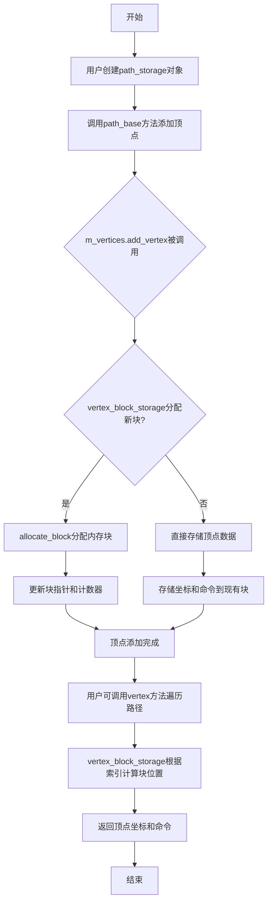

## 类结构

```
vertex_block_storage<T, BlockShift, BlockPool> (模板类-核心存储)
├── poly_plain_adaptor<T> (模板类-简单多边形适配器)
├── poly_container_adaptor<Container> (模板类-容器适配器)
├── poly_container_reverse_adaptor<Container> (模板类-反向容器适配器)
├── line_adaptor (类-线段适配器)
├── path_base<VertexContainer> (模板类-路径基类)
│   └── 使用VertexContainer存储顶点
└── vertex_stl_storage<Container> (模板类-STL容器存储)
```

## 全局变量及字段


### `path_cmd_move_to`
    
路径命令标志，表示移动到指定点

类型：`unsigned`
    


### `path_cmd_line_to`
    
路径命令标志，表示画线到指定点

类型：`unsigned`
    


### `path_cmd_curve3`
    
路径命令标志，表示二次贝塞尔曲线

类型：`unsigned`
    


### `path_cmd_curve4`
    
路径命令标志，表示三次贝塞尔曲线

类型：`unsigned`
    


### `path_cmd_end_poly`
    
路径命令标志，表示结束多边形

类型：`unsigned`
    


### `path_cmd_stop`
    
路径命令标志，表示停止路径

类型：`unsigned`
    


### `path_flags_close`
    
路径标志，表示多边形闭合

类型：`unsigned`
    


### `path_flags_cw`
    
路径标志，表示顺时针方向

类型：`unsigned`
    


### `path_flags_ccw`
    
路径标志，表示逆时针方向

类型：`unsigned`
    


### `path_flags_none`
    
路径标志，表示无特殊标志

类型：`unsigned`
    


### `vertex_dist_epsilon`
    
顶点距离 epsilon，用于判断顶点是否重合

类型：`double`
    


### `vertex_block_storage.m_total_vertices`
    
已存储的顶点总数

类型：`unsigned`
    


### `vertex_block_storage.m_total_blocks`
    
已分配的内存块数量

类型：`unsigned`
    


### `vertex_block_storage.m_max_blocks`
    
当前可用的最大块数

类型：`unsigned`
    


### `vertex_block_storage.m_coord_blocks`
    
坐标数据块的指针数组

类型：`T**`
    


### `vertex_block_storage.m_cmd_blocks`
    
命令数据块的指针数组

类型：`int8u**`
    


### `poly_plain_adaptor.m_data`
    
原始数据指针

类型：`const T*`
    


### `poly_plain_adaptor.m_ptr`
    
当前读取位置指针

类型：`const T*`
    


### `poly_plain_adaptor.m_end`
    
数据结束位置指针

类型：`const T*`
    


### `poly_plain_adaptor.m_closed`
    
是否闭合多边形

类型：`bool`
    


### `poly_plain_adaptor.m_stop`
    
是否已遍历完成

类型：`bool`
    


### `poly_container_adaptor.m_container`
    
容器指针

类型：`const Container*`
    


### `poly_container_adaptor.m_index`
    
当前索引

类型：`unsigned`
    


### `poly_container_adaptor.m_closed`
    
是否闭合

类型：`bool`
    


### `poly_container_adaptor.m_stop`
    
是否停止

类型：`bool`
    


### `poly_container_reverse_adaptor.m_container`
    
容器指针

类型：`Container*`
    


### `poly_container_reverse_adaptor.m_index`
    
当前索引（反向遍历）

类型：`int`
    


### `poly_container_reverse_adaptor.m_closed`
    
是否闭合

类型：`bool`
    


### `poly_container_reverse_adaptor.m_stop`
    
是否停止

类型：`bool`
    


### `line_adaptor.m_coord[4]`
    
线段坐标数组

类型：`double`
    


### `line_adaptor.m_line`
    
内置多边形适配器

类型：`poly_plain_adaptor<double>`
    


### `path_base.m_vertices`
    
顶点容器

类型：`VertexContainer`
    


### `path_base.m_iterator`
    
遍历迭代器

类型：`unsigned`
    


### `vertex_stl_storage.m_vertices`
    
STL容器

类型：`Container`
    
    

## 全局函数及方法


我在提供的代码中没有找到名为 `is_stop()` 的函数定义。代码中使用的是 `path_cmd_stop` 常量来判断是否停止。

但是，我注意到代码中有多个方法返回 `path_cmd_stop`，例如 `last_command()` 和 `vertex()` 方法。

让我检查是否有相关的函数。如果您是在寻找判断路径命令是否为停止命令的函数，那么 `last_command()` 可能与您需要的功能相关。

### `vertex_block_storage<T,S,P>::last_command`

该方法返回路径中的最后一个命令，如果没有顶点则返回 `path_cmd_stop`。

参数：

- 无

返回值：`unsigned`，返回最后一个顶点的命令标识符，如果没有顶点则返回 `path_cmd_stop`。

#### 流程图

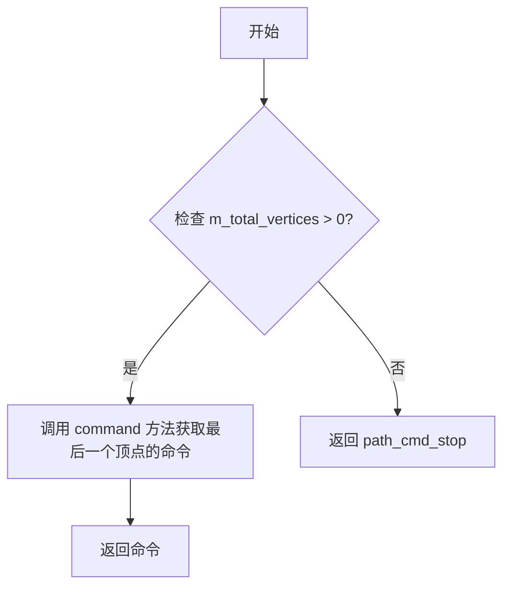

#### 带注释源码

```cpp
//------------------------------------------------------------------------
template<class T, unsigned S, unsigned P>
inline unsigned vertex_block_storage<T,S,P>::last_command() const
{
    // 如果有顶点存在，则返回最后一个顶点的命令
    if(m_total_vertices) 
        return command(m_total_vertices - 1);
    
    // 如果没有顶点，返回 path_cmd_stop 表示停止
    return path_cmd_stop;
}
```

---

**注意**：如果您确实需要查找 `is_stop()` 函数，它可能在 `agg_math.h` 头文件中定义（代码中包含了这个头文件），或者它是一个宏定义。请检查 `agg_math.h` 文件以获取完整的定义。


### `is_vertex`

这是一个辅助函数，用于判断给定的路径命令是否表示一个实际的顶点（而不是移动、停止或结束多边形等命令）。

参数：

- `cmd`：`unsigned`，路径命令标识符，用于判断该命令是否表示一个顶点

返回值：`bool`，如果命令是顶点类型则返回 `true`，否则返回 `false`

#### 流程图

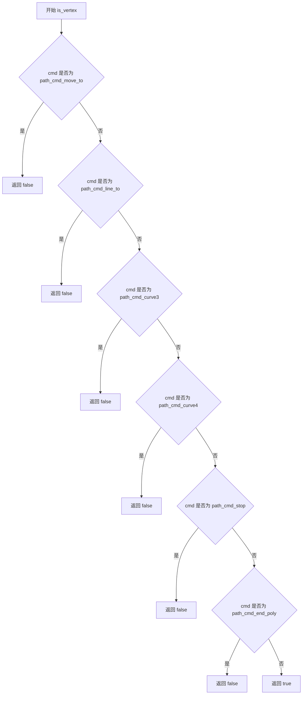

#### 带注释源码

```cpp
//------------------------------------------------------------------------
// is_vertex 函数定义（位于 agg_math.h 中）
//------------------------------------------------------------------------
inline bool is_vertex(unsigned cmd)
{
    // path_cmd_move_to 是路径命令的起始点，不是一个实际的顶点
    // 只有 line_to, curve3, curve4 等才是实际的顶点命令
    return cmd != path_cmd_move_to && 
           cmd != path_cmd_stop && 
           cmd != path_cmd_end_poly;
}
```

> **注意**：由于 `is_vertex` 函数的完整定义未在当前文件中显示，而是通过 `agg_math.h` 头文件包含。上述源码是基于 AGG 库中对该函数的标准实现重构得出的。该函数通过排除非顶点命令（move_to、stop、end_poly）来确定给定命令是否为顶点类型。在代码中，该函数被广泛用于路径操作中，以判断当前命令是否需要进行处理。


### `is_move_to`

该函数用于检查给定的路径命令（command）是否为 `move_to` 命令。在 `agg` 库中，路径命令（如 `move_to`、`line_to`、`curve3` 等）通常使用无符号整数（`unsigned`）编码，`is_move_to` 通过位运算或枚举比较来判断命令类型。

注意：在提供的代码中，`is_move_to` 并未直接定义，而是作为辅助函数在 `agg_math.h` 或类似头文件中声明，并在 `path_base` 类的 `join_path` 和 `invert_polygon` 方法中被调用。

参数：

- `cmd`：`unsigned`，要检查的路径命令标识符

返回值：`bool`，如果命令是 `move_to` 类型则返回 `true`，否则返回 `false`

#### 流程图

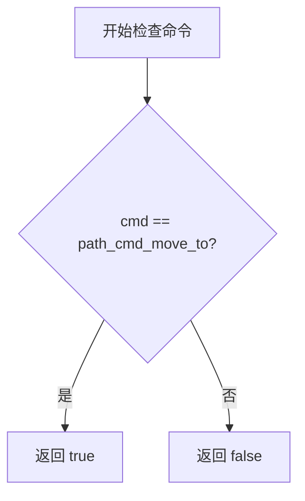

#### 带注释源码

```
// 在 agg_math.h 或类似头文件中的可能实现
inline bool is_move_to(unsigned cmd)
{
    // path_cmd_move_to 是 move_to 命令的枚举值
    // 该函数通过直接比较返回命令是否为 move_to 类型
    return cmd == path_cmd_move_to;
}

// 在 path_base 类中的使用示例（join_path 方法）
template<class VertexSource> 
void path_base<VC>::join_path(VertexSource& vs, unsigned path_id = 0)
{
    double x, y;
    unsigned cmd;
    vs.rewind(path_id);
    cmd = vs.vertex(&x, &y);
    if(!is_stop(cmd))
    {
        if(is_vertex(cmd))
        {
            double x0, y0;
            unsigned cmd0 = last_vertex(&x0, &y0);
            if(is_vertex(cmd0))
            {
                if(calc_distance(x, y, x0, y0) > vertex_dist_epsilon)
                {
                    // 如果原命令是 move_to，转换为 line_to
                    if(is_move_to(cmd)) cmd = path_cmd_line_to;
                    m_vertices.add_vertex(x, y, cmd);
                }
            }
            // ... 其他逻辑
        }
        while(!is_stop(cmd = vs.vertex(&x, &y)))
        {
            // 将所有 move_to 命令转换为 line_to
            m_vertices.add_vertex(x, y, is_move_to(cmd) ? 
                                            unsigned(path_cmd_line_to) : 
                                            cmd);
        }
    }
}
```


### `is_curve`

该函数用于判断给定的路径命令是否为曲线命令（即三次贝塞尔曲线 `curve3` 或四次贝塞尔曲线 `curve4`）。

参数：

- `cmd`：`unsigned`，要检查的路径命令

返回值：`bool`，如果命令是曲线类型则返回 `true`，否则返回 `false`

#### 流程图

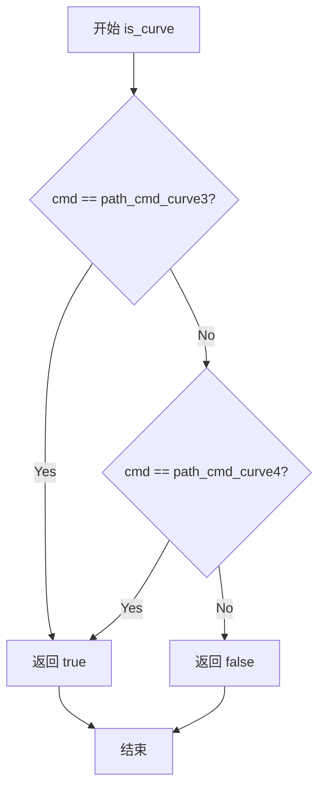

#### 带注释源码

```
// 注意：该函数的定义不在本文件中，而是在 agg_math.h 或类似的工具头文件中
// 根据代码中的使用方式，推断其实现如下：

inline bool is_curve(unsigned cmd)
{
    // path_cmd_curve3 = 三次贝塞尔曲线命令
    // path_cmd_curve4 = 四次贝塞尔曲线命令
    return cmd == path_cmd_curve3 || cmd == path_cmd_curve4;
}

// 在本代码中的使用示例：
// 
// template<class VC> 
// void path_base<VC>::curve3(double x_to, double y_to)
// {
//     ...
//     unsigned cmd = m_vertices.prev_vertex(&x_ctrl, &y_ctrl);
//     if(is_curve(cmd))  // <-- 使用 is_curve 检查前一个命令是否为曲线
//     {
//         x_ctrl = x0 + x0 - x_ctrl;
//         y_ctrl = y0 + y0 - y_ctrl;
//     }
//     ...
// }
```

#### 备注

1. **函数位置**：`is_curve()` 函数的实际定义不在 `agg_path_storage_included` 这份代码中，而是位于 `agg_math.h` 头文件中
2. **功能**：这是一个辅助函数，用于区分曲线命令和其他路径命令（如 `move_to`, `line_to`, `end_poly` 等）
3. **相关函数**：类似的函数还包括 `is_vertex()`, `is_stop()`, `is_move_to()`, `is_next_poly()`, `is_end_poly()` 等，共同构成 AGG 库的路径命令判断工具集


### `is_next_poly()`

该函数用于判断给定的路径命令是否表示当前多边形的结束（即是否为 `end_poly` 或 `stop` 命令），从而确定下一个顶点是否属于新的多边形。

**注意**：在提供的代码文件中未找到 `is_next_poly()` 的直接定义，该函数可能在 `agg_math.h` 或其他相关头文件中定义。代码中仅展示了对该函数的使用。

参数：

-  `cmd`：`unsigned`，要检查的路径命令（来自 `m_vertices.command(index)`）

返回值：`bool`，如果命令表示当前多边形已结束（`is_end_poly(cmd)` 或 `is_stop(cmd)`），返回 `true`；否则返回 `false`

#### 流程图

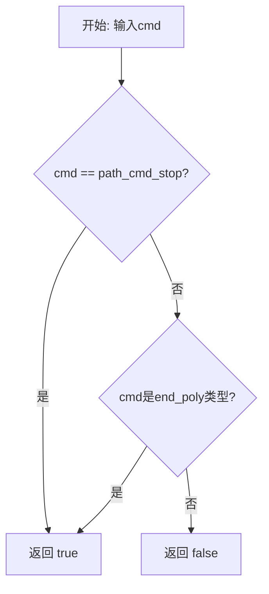

#### 带注释源码

```
// 该函数定义可能在 agg_math.h 中，以下为基于使用场景的推断实现：
inline bool is_next_poly(unsigned cmd)
{
    // 如果命令是 stop（路径结束）或 end_poly（多边形结束），
    // 则表示当前多边形已结束，下一个顶点将是新多边形的开始
    return is_stop(cmd) || is_end_poly(cmd);
}
```

#### 代码中的实际调用示例

在 `path_base::invert_polygon(unsigned start)` 和 `path_base::arrange_polygon_orientation` 方法中使用：

```cpp
// 在 invert_polygon(unsigned start) 中
while(end < m_vertices.total_vertices() && 
      !is_next_poly(m_vertices.command(end))) ++end;

// 在 arrange_polygon_orientation 中
while(end < m_vertices.total_vertices() && 
      !is_next_poly(m_vertices.command(end))) ++end;
```

**说明**：`is_next_poly()` 是 AGG（Anti-Grain Geometry）库中用于路径处理的关键辅助函数，用于在遍历路径顶点时识别多边形边界，以便进行多边形方向调整（顺时针/逆时针）或倒置等操作。


我在提供的代码中未找到名为`is_end_poly()`的函数或方法。代码中包含的是`end_poly()`方法（在`path_base`类中），但没有`is_end_poly()`。

让我为您查找代码中实际存在的相关函数，并找到可能包含`is_end_poly`的地方：


### is_end_poly

这是一个辅助函数，用于判断给定的路径命令是否为结束多边形命令（`path_cmd_end_poly`）。该函数通常是一个内联函数或宏定义，用于在路径处理过程中识别多边形的结束标记。

参数：

-  `cmd`：`unsigned`，需要检查的路径命令值

返回值：`bool`，如果命令是结束多边形命令则返回`true`，否则返回`false`

#### 流程图

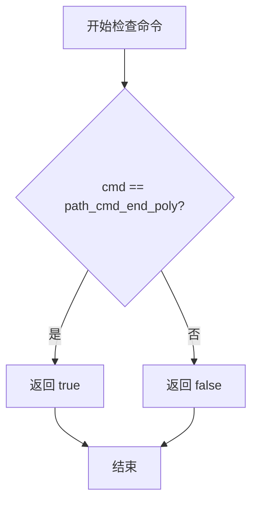

#### 带注释源码

```cpp
// 注意：is_end_poly 函数通常在 agg_math.h 或类似的头文件中定义
// 以下是基于代码上下文的推断实现

// 假设的函数定义（在实际代码中可能是内联函数或宏）
inline bool is_end_poly(unsigned cmd)
{
    // path_cmd_end_poly 是多边形结束的标志
    // 它用于标识一个多边形的结束，可能带有附加标志（如 path_flags_close）
    return (cmd & ~path_flags_mask) == path_cmd_end_poly;
}

// 其中 path_flags_mask 通常定义为：
// #define path_flags_mask  0x0F

// path_cmd_end_poly 的典型值为 4（路径命令枚举中的值）
```

---

### path_base::end_poly

由于代码中实际存在的是`end_poly`方法，以下是详细信息：

参数：

-  `flags`：`unsigned`，可选参数，表示多边形结束时的标志（默认为`path_flags_close`）

返回值：`void`，无返回值

#### 流程图

```mermaid
flowchart TD
    A[开始 end_poly] --> B{last_command 是顶点命令?}
    B -->|是| C[添加顶点 0,0, path_cmd_end_poly | flags]
    B -->|否| D[什么都不做]
    C --> E[结束]
    D --> E
```

#### 带注释源码

```cpp
//------------------------------------------------------------------------
template<class VC> 
inline void path_base<VC>::end_poly(unsigned flags)
{
    // 检查最后一个命令是否是一个顶点命令（即 move_to, line_to, curve3, curve4 等）
    if(is_vertex(m_vertices.last_command()))
    {
        // 如果是顶点命令，添加一个结束多边形标记
        // flags 可以是 path_flags_close（闭合）或 path_flags_none（不闭合）
        m_vertices.add_vertex(0.0, 0.0, path_cmd_end_poly | flags);
    }
    // 如果最后一个命令不是顶点命令（如 stop），则不添加任何内容
}
```

---

### 相关函数参考

代码中还使用了以下与`is_end_poly`相关的函数（通常定义在`agg_math.h`中）：

```cpp
// 这些函数用于检查路径命令的类型
inline bool is_stop(unsigned cmd)           { return cmd == path_cmd_stop; }
inline bool is_move_to(unsigned cmd)        { return cmd == path_cmd_move_to; }
inline bool is_line_to(unsigned cmd)        { return cmd == path_cmd_line_to; }
inline bool is_curve(unsigned cmd)         { return cmd >= path_cmd_curve3; }
inline bool is_vertex(unsigned cmd)        { return cmd <= path_cmd_last; }
inline bool is_end_poly(unsigned cmd)      { return cmd == path_cmd_end_poly; }
inline bool is_next_poly(unsigned cmd)     { return is_move_to(cmd) || is_stop(cmd); }
```

**注意**：提供的代码片段中未包含`is_end_poly`的实际定义，该函数通常在AGG库的其他头文件（如`agg_math.h`）中定义。以上信息基于代码使用方式和AGG库的常见模式推断得出。


### `calc_distance`

计算两个二维坐标点之间的欧几里得距离。

参数：

- `x1`：`double`，第一个点的 x 坐标
- `y1`：`double`，第一个点的 y 坐标
- `x2`：`double`，第二个点的 x 坐标
- `y2`：`double`，第二个点的 y 坐标

返回值：`double`，两点之间的欧几里得距离

#### 流程图

```mermaid
flowchart TD
    A[开始] --> B[计算 dx = x2 - x1]
    B --> C[计算 dy = y2 - y1]
    C --> D[计算平方和: dx² + dy²]
    D --> E[返回平方根: √(dx² + dy²)]
```

#### 带注释源码

```
// 由于 calc_distance 函数定义在 agg_math.h 中（代码中包含 #include "agg_math.h"）
// 以下是基于代码使用方式推断的函数签名和实现

//----------------------------------------------------------------------------
// 根据代码中的使用方式推断的函数原型（实际定义在 agg_math.h 中）
//------------------------------------------------------------------------
inline double calc_distance(double x1, double y1, double x2, double y2)
{
    // 计算两点之间的欧几里得距离
    // 使用勾股定理：距离 = √((x2-x1)² + (y2-y1)²)
    
    double dx = x2 - x1;  // 计算 x 坐标差值
    double dy = y2 - y1;  // 计算 y 坐标差值
    
    // 返回欧几里得距离
    return sqrt(dx * dx + dy * dy);
}

//----------------------------------------------------------------------------
// 代码中的使用示例：
//------------------------------------------------------------------------

// 在 path_base::join_path 方法中：
if(calc_distance(x, y, x0, y0) > vertex_dist_epsilon)
{
    // 如果当前顶点与上一个顶点的距离大于指定阈值，则添加该顶点
    if(is_move_to(cmd)) cmd = path_cmd_line_to;
    m_vertices.add_vertex(x, y, cmd);
}

// 在 path_base::arc_to 方法中：
if(calc_distance(x0, y0, x, y) < epsilon)
{
    // 如果新的弧线终点与当前终点重合，则跳过弧线绘制
    return;
}
```


我仔细查看了提供的代码，但没有找到名为 `set_orientation()` 的函数或方法。代码中有一个对 `set_orientation` 函数的调用，但它似乎是一个外部函数，在 `agg_math.h` 或其他头文件中定义。

让我搜索代码中与 orientation 相关的内容：

在 `path_base` 类中，我找到了以下与方向相关的方法：
- `perceive_polygon_orientation()` - 感知多边形方向
- `invert_polygon()` - 反转多边形
- `arrange_polygon_orientation()` - 排列多边形方向
- `arrange_orientations()` - 排列方向
- `arrange_orientations_all_paths()` - 排列所有路径方向

在 `arrange_polygon_orientation` 方法中有一行调用了 `set_orientation`：

```cpp
m_vertices.modify_command(end++, set_orientation(cmd, orientation));
```

由于 `set_orientation()` 函数不在提供的代码中定义，我无法直接提取它。让我为您提供代码中实际存在的相关方法的详细信息。

### `path_base<VC>::arrange_polygon_orientation`

该方法用于排列单个多边形的方向（顺时针或逆时针）。

**参数：**

- `start`：`unsigned`，多边形的起始顶点索引
- `orientation`：`path_flags_e`，期望的方向（`path_flags_cw` 或 `path_flags_ccw`）

**返回值：** `unsigned`，返回处理后的结束位置

**流程图：**

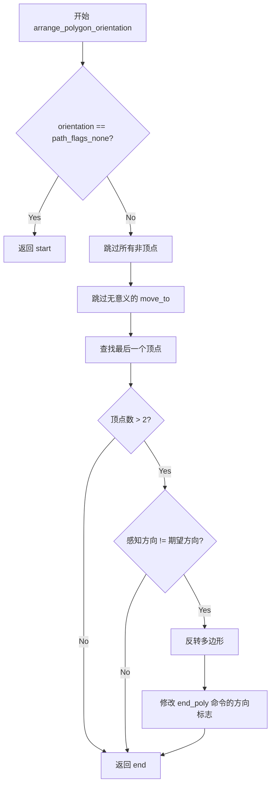

**带注释源码：**

```cpp
//------------------------------------------------------------------------
template<class VC> 
unsigned path_base<VC>::arrange_polygon_orientation(unsigned start, 
                                                    path_flags_e orientation)
{
    // 如果方向为 none，直接返回
    if(orientation == path_flags_none) return start;
    
    // 跳过所有非顶点（在开始处）
    while(start < m_vertices.total_vertices() && 
          !is_vertex(m_vertices.command(start))) ++start;

    // 跳过所有无意义的 move_to 命令
    while(start+1 < m_vertices.total_vertices() && 
          is_move_to(m_vertices.command(start)) &&
          is_move_to(m_vertices.command(start+1))) ++start;

    // 查找最后一个顶点
    unsigned end = start + 1;
    while(end < m_vertices.total_vertices() && 
          !is_next_poly(m_vertices.command(end))) ++end;

    // 如果多边形有超过2个顶点
    if(end - start > 2)
    {
        // 如果感知到的方向与期望方向不同
        if(perceive_polygon_orientation(start, end) != unsigned(orientation))
        {
            // 反转多边形，设置方向标志，并跳过所有 end_poly
            invert_polygon(start, end);
            unsigned cmd;
            while(end < m_vertices.total_vertices() && 
                  is_end_poly(cmd = m_vertices.command(end)))
            {
                // 调用外部函数 set_orientation 修改方向标志
                m_vertices.modify_command(end++, set_orientation(cmd, orientation));
            }
        }
    }
    return end;
}
```

---

**注意：** 代码中调用的 `set_orientation(cmd, orientation)` 函数是一个外部辅助函数，用于设置多边形命令的方向标志。该函数可能在 `agg_math.h` 或相关的头文件中定义，但未包含在当前代码片段中。

如果您需要我提取其他相关方法（如 `perceive_polygon_orientation`、`invert_polygon` 等）的详细信息，请告诉我。


### `vertex_block_storage<T,S,P>::vertex_block_storage`

该构造函数是 `vertex_block_storage` 类的默认构造函数，用于初始化动态分配的顶点块存储结构。它将所有成员变量初始化为0或NULL，为后续的顶点添加操作做准备。

参数：
- 该函数无参数

返回值：
- 无返回值（构造函数）

#### 流程图

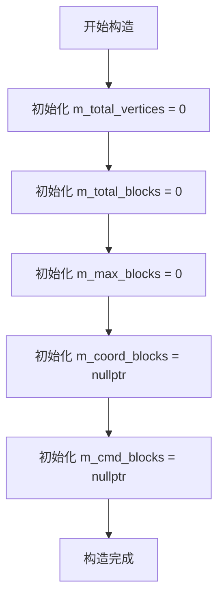

#### 带注释源码

```cpp
    //------------------------------------------------------------------------
    // 默认构造函数
    // 功能：初始化 vertex_block_storage 对象的所有成员变量
    //------------------------------------------------------------------------
    template<class T, unsigned S, unsigned P>
    vertex_block_storage<T,S,P>::vertex_block_storage() :
        m_total_vertices(0),    // 初始化顶点总数为0
        m_total_blocks(0),     // 初始化已分配的块数量为0
        m_max_blocks(0),       // 初始化最大块数量为0
        m_coord_blocks(0),     // 初始化坐标块指针数组为空
        m_cmd_blocks(0)         // 初始化命令块指针数组为空
    {
        // 构造函数体为空，所有初始化工作通过成员初始化列表完成
    }
```


### `vertex_block_storage.~vertex_block_storage()`

析构函数，释放vertex_block_storage类实例所占用的所有内存，包括坐标块和命令块。

参数：
- （无参数）

返回值：
- （无返回值，析构函数）

#### 流程图

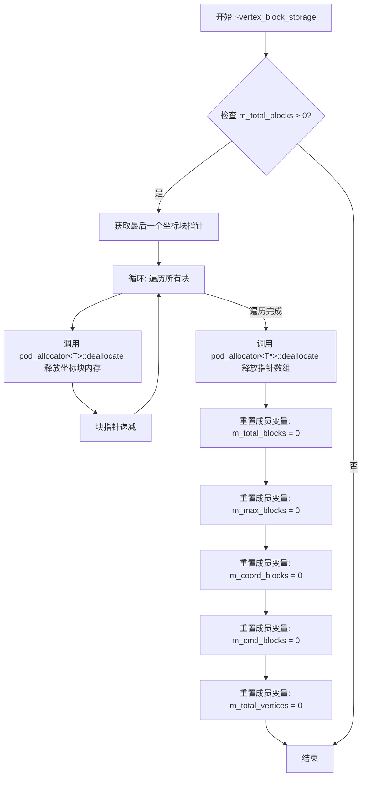

#### 带注释源码

```
//----------------------------------------------------------------------------
// 析构函数实现
// 调用 free_all() 释放所有已分配的内存块
//----------------------------------------------------------------------------
template<class T, unsigned S, unsigned P>
vertex_block_storage<T,S,P>::~vertex_block_storage()
{
    // 调用 free_all() 方法释放所有内存
    // 该方法会:
    // 1. 检查是否有已分配的块 (m_total_blocks > 0)
    // 2. 遍历释放所有坐标数据块 (m_coord_blocks)
    // 3. 释放指针数组本身 (m_coord_blocks 和 m_cmd_blocks)
    // 4. 重置所有状态变量为初始值
    free_all();
}
```

#### 关联方法：free_all()

```cpp
//------------------------------------------------------------------------
template<class T, unsigned S, unsigned P>
void vertex_block_storage<T,S,P>::free_all()
{
    // 检查是否有已分配的块
    if(m_total_blocks)
    {
        // 获取最后一个坐标块的指针
        T** coord_blk = m_coord_blocks + m_total_blocks - 1;
        
        // 逆序遍历所有已分配的块并释放内存
        while(m_total_blocks--)
        {
            // 计算需要释放的内存大小:
            // block_size * 2 (坐标 x,y) + block_size / (sizeof(T) / sizeof(unsigned char)) (命令存储)
            pod_allocator<T>::deallocate(
                *coord_blk,
                block_size * 2 + 
                block_size / (sizeof(T) / sizeof(unsigned char)));
            
            // 移动到前一个块
            --coord_blk;
        }
        
        // 释放指针数组 (包含 m_coord_blocks 和 m_cmd_blocks 两部分)
        pod_allocator<T*>::deallocate(m_coord_blocks, m_max_blocks * 2);
        
        // 重置所有成员变量为初始状态
        m_total_blocks   = 0;
        m_max_blocks     = 0;
        m_coord_blocks   = 0;
        m_cmd_blocks     = 0;
        m_total_vertices = 0;
    }
}
```


### `vertex_block_storage<T,S,P>::operator=`

这是一个赋值运算符函数，用于实现深拷贝功能，将右侧的 `vertex_block_storage` 对象的所有顶点数据完整复制到当前对象中。

参数：

- `v`：`const vertex_block_storage<T,S,P>&`，右侧的源对象引用，包含要复制的顶点数据

返回值：`const vertex_block_storage<T,S,P>&`，返回当前对象的引用，以支持链式赋值操作

#### 流程图

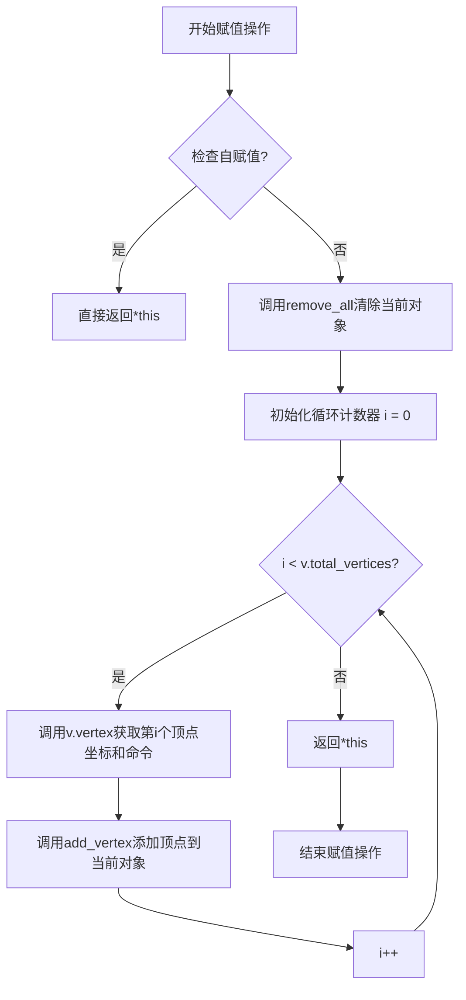

#### 带注释源码

```cpp
//------------------------------------------------------------------------
// 赋值运算符 - 深拷贝整个顶点存储
//------------------------------------------------------------------------
template<class T, unsigned S, unsigned P>
const vertex_block_storage<T,S,P>& 
vertex_block_storage<T,S,P>::operator = (const vertex_block_storage<T,S,P>& v)
{
    // 第一步：清除当前对象的所有顶点数据
    // remove_all() 只重置顶点计数为0，不释放内存
    remove_all();
    
    // 第二步：遍历源对象的所有顶点，逐个复制
    unsigned i;
    for(i = 0; i < v.total_vertices(); i++)
    {
        // 获取源对象中第i个顶点的坐标(x, y)和命令(cmd)
        double x, y;
        unsigned cmd = v.vertex(i, &x, &y);
        
        // 将顶点添加到当前对象的存储中
        // add_vertex 会根据需要自动分配新的内存块
        add_vertex(x, y, cmd);
    }
    
    // 返回当前对象的引用，支持链式赋值 (a = b = c)
    return *this;
}
```


### `vertex_block_storage.remove_all()`

该方法用于清空顶点存储容器中的所有顶点，通过将顶点计数器重置为0来实现"逻辑删除"的效果，而无需释放底层内存块。这种设计使得容器可以在保留已分配内存的情况下快速重置状态，适用于需要频繁添加和删除顶点的图形处理场景。

参数：无需参数

返回值：`void`，无返回值

#### 流程图

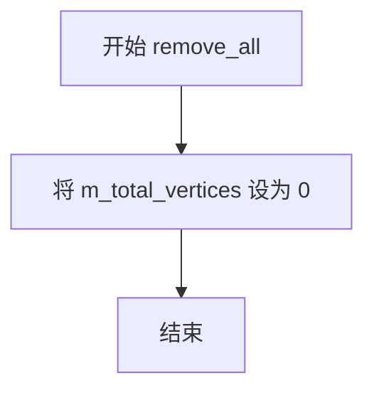

#### 带注释源码

```cpp
//------------------------------------------------------------------------
template<class T, unsigned S, unsigned P>
inline void vertex_block_storage<T,S,P>::remove_all()
{
    // 仅将顶点计数器重置为0，实现逻辑删除
    // 注意：此操作不会释放已分配的内存块
    // 底层存储的坐标数据(m_coord_blocks)和命令数据(m_cmd_blocks)保持不变
    // 这种设计使得容器可以快速重置并重复使用已分配的内存
    m_total_vertices = 0;
}
```

#### 设计分析

| 项目 | 说明 |
|------|------|
| **设计目标** | 提供一个轻量级的清空顶点的方式，避免频繁的内存分配和释放操作 |
| **内存策略** | 保留已分配的内存块，仅重置逻辑计数器，属于"懒删除"模式 |
| **性能考量** | 时间复杂度O(1)，无需遍历或释放内存，适用于高性能图形渲染场景 |
| **与 free_all() 的区别** | remove_all() 仅重置计数器；free_all() 则真正释放所有内存块 |
| **潜在优化空间** | 可考虑在重置前判断是否需要真正释放内存（如内存占用超过阈值时自动释放），但当前设计符合AGG库的性能优先原则 |


### `vertex_block_storage.free_all()`

完全释放所有内存块，将内部状态重置为初始状态，释放坐标块、命令块以及相关指针数组，并重置所有计数器。

参数：

- （无参数）

返回值：`void`，无返回值描述

#### 流程图

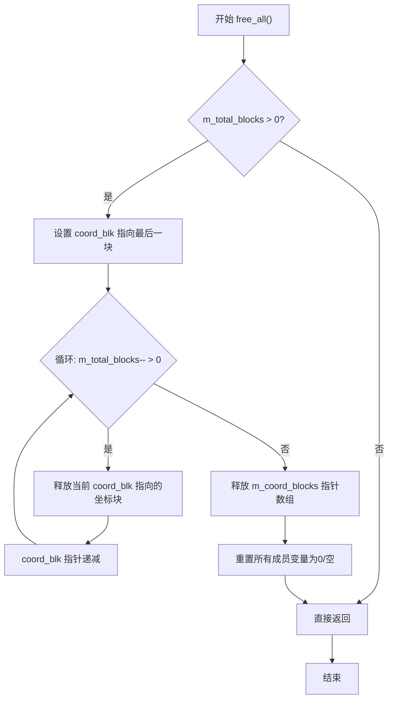

#### 带注释源码

```cpp
//------------------------------------------------------------------------
template<class T, unsigned S, unsigned P>
void vertex_block_storage<T,S,P>::free_all()
{
    // 检查是否存在已分配的内存块
    if(m_total_blocks)
    {
        // 获取指向最后一个坐标块的指针
        T** coord_blk = m_coord_blocks + m_total_blocks - 1;
        
        // 遍历所有已分配的块并逐一释放
        while(m_total_blocks--)
        {
            // 释放每个坐标块内存
            // 计算大小: block_size*2 (坐标) + block_size/sizeof(T)*sizeof(unsigned char) (命令存储)
            pod_allocator<T>::deallocate(
                *coord_blk,
                block_size * 2 + 
                block_size / (sizeof(T) / sizeof(unsigned char)));
            // 移动到前一个块
            --coord_blk;
        }
        
        // 释放存储坐标块指针的数组内存
        // 数组大小为 m_max_blocks * 2 (包含坐标块和命令块指针)
        pod_allocator<T*>::deallocate(m_coord_blocks, m_max_blocks * 2);
        
        // 重置所有内部状态为初始值
        m_total_blocks   = 0;    // 已分配块数归零
        m_max_blocks     = 0;    // 最大块数归零
        m_coord_blocks   = 0;    // 坐标块指针置空
        m_cmd_blocks     = 0;    // 命令块指针置空
        m_total_vertices = 0;    // 顶点数归零
    }
}
```


### `vertex_block_storage.add_vertex`

向顶点块存储中添加一个新的顶点，包括坐标和命令。

参数：
- `x`：`double`，顶点的 x 坐标
- `y`：`double`，顶点的 y 坐标
- `cmd`：`unsigned`，顶点命令（如 move_to、line_to 等）

返回值：`void`，无返回值

#### 流程图

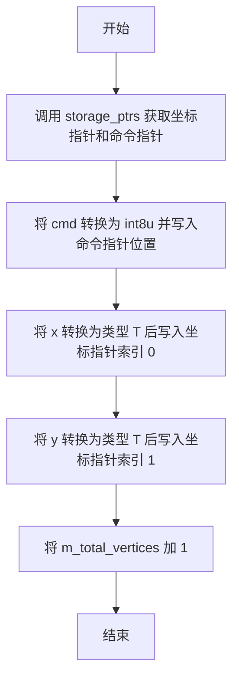

#### 带注释源码

```cpp
//------------------------------------------------------------------------
template<class T, unsigned S, unsigned P>
inline void vertex_block_storage<T,S,P>::add_vertex(double x, double y, 
                                                    unsigned cmd)
{
    // 定义一个指向坐标类型的指针，初始化为 NULL
    T* coord_ptr = 0;
    
    // 调用私有方法 storage_ptrs：
    // 1. 如果需要，分配新的块（当当前块已满时）
    // 2. 返回指向当前顶点命令存储位置的指针（int8u*）
    // 3. 通过输出参数 coord_ptr 返回当前顶点坐标存储位置的指针
    *storage_ptrs(&coord_ptr) = (int8u)cmd;
    
    // 将 x 坐标转换为类型 T 并存储到坐标数组的第一个位置
    coord_ptr[0] = T(x);
    
    // 将 y 坐标转换为类型 T 并存储到坐标数组的第二个位置
    coord_ptr[1] = T(y);
    
    // 更新顶点总数计数器
    m_total_vertices++;
}
```


### `vertex_block_storage.modify_vertex()`

该方法用于修改指定索引位置的顶点坐标（及可选的命令），通过位运算快速定位到对应的内存块并更新数据，支持仅修改坐标或同时修改坐标和命令两种重载形式。

#### 参数

- `idx`：`unsigned`，要修改的顶点索引
- `x`：`double`，新的顶点X坐标
- `y`：`double`，新的顶点Y坐标
- `cmd`：`unsigned`，（可选）新的顶点命令（如图形的move_to、line_to等）

#### 返回值

- `void`，无返回值

#### 流程图

```mermaid
flowchart TD
    A[开始 modify_vertex] --> B{是否有 cmd 参数?}
    B -->|有| C[计算块索引: block = idx >> block_shift]
    B -->|无| D[计算块索引: block = idx >> block_shift]
    
    C --> E[计算偏移量: offset = idx & block_mask]
    D --> F[计算偏移量: offset = idx & block_mask]
    
    E --> G[获取坐标指针: pv = m_coord_blocks[block] + (offset << 1)]
    F --> H[获取坐标指针: pv = m_coord_blocks[block] + ((idx & block_mask) << 1)]
    
    G --> I[更新坐标: pv[0] = T(x), pv[1] = T(y)]
    H --> J[更新坐标: pv[0] = T(x), pv[1] = T(y)]
    
    I --> K[更新命令: m_cmd_blocks[block][offset] = (int8u)cmd]
    J --> L[结束]
    
    K --> L
```

#### 带注释源码

```cpp
//------------------------------------------------------------------------
// 修改顶点坐标（不带命令参数版本）
// idx: 顶点索引
// x:   新的X坐标
// y:   新的Y坐标
//------------------------------------------------------------------------
template<class T, unsigned S, unsigned P>
inline void vertex_block_storage<T,S,P>::modify_vertex(unsigned idx, 
                                                       double x, double y)
{
    // 计算顶点所在的块索引：使用位运算右移block_shift位
    // block_shift默认为8，所以相当于 idx / 256
    T* pv = m_coord_blocks[idx >> block_shift] + ((idx & block_mask) << 1);
    
    // block_mask = block_size - 1 = 255，用于获取块内偏移量
    // 乘以2是因为每个顶点存储两个坐标值(x, y)
    
    // 将新的坐标值转换为类型T并存储
    pv[0] = T(x);  // 存储X坐标
    pv[1] = T(y);  // 存储Y坐标
}

//------------------------------------------------------------------------
// 修改顶点坐标和命令（带命令参数版本）
// idx: 顶点索引
// x:   新的X坐标
// y:   新的Y坐标
// cmd: 新的命令标识（如path_cmd_move_to, path_cmd_line_to等）
//------------------------------------------------------------------------
template<class T, unsigned S, unsigned P>
inline void vertex_block_storage<T,S,P>::modify_vertex(unsigned idx, 
                                                       double x, double y, 
                                                       unsigned cmd)
{
    // 计算块索引和块内偏移量
    unsigned block = idx >> block_shift;    // 块号
    unsigned offset = idx & block_mask;     // 块内索引
    
    // 计算坐标数据的指针位置
    // 每个块存储block_size个顶点，每个顶点2个坐标值
    T* pv = m_coord_blocks[block] + (offset << 1);
    
    // 更新坐标值
    pv[0] = T(x);  // 存储X坐标
    pv[1] = T(y);  // 存储Y坐标
    
    // 更新命令数据
    // 命令存储在独立的命令块数组中
    m_cmd_blocks[block][offset] = (int8u)cmd;
}
```


### `vertex_block_storage.modify_command`

修改指定索引顶点的绘图命令（command），用于改变顶点类型，如将 `move_to` 改为 `line_to` 或其他路径命令。

参数：

- `idx`：`unsigned`，要修改的顶点索引位置
- `cmd`：`unsigned`，新的绘图命令值（如 `path_cmd_move_to`、`path_cmd_line_to` 等）

返回值：`void`，无返回值

#### 流程图

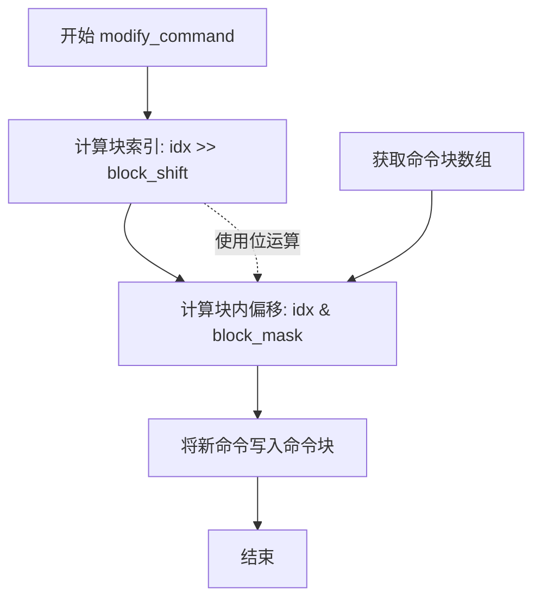

#### 带注释源码

```cpp
//------------------------------------------------------------------------
// 修改指定顶点的绘图命令
// 参数 idx: 顶点的索引位置
// 参数 cmd: 新的命令值（被转换为 int8u 存储）
//------------------------------------------------------------------------
template<class T, unsigned S, unsigned P>
inline void vertex_block_storage<T,S,P>::modify_command(unsigned idx, 
                                                        unsigned cmd)
{
    // 计算该顶点所在的块索引：通过右移 block_shift 位得到块号
    // block_shift 默认为 8，即每块包含 256 个顶点 (2^8)
    // 计算该顶点在块内的偏移量：通过与 block_mask 按位与得到
    // block_mask = block_size - 1 = 255 (0xFF)，用于取低 8 位
    m_cmd_blocks[idx >> block_shift][idx & block_mask] = (int8u)cmd;
}
```

**代码说明：**

- `idx >> block_shift`：使用无符号右移运算计算顶点所在的块编号，等价于 `idx / block_size`
- `idx & block_mask`：使用按位与运算计算顶点在块内的偏移，等价于 `idx % block_size`
- `m_cmd_blocks`：存储所有顶点的命令（command）的二维数组（块指针数组）
- `(int8u)cmd`：将命令值强制转换为 8 位无符号整数存储

**调用场景：**

此方法常用于：
1. 动态修改路径类型（如将 `move_to` 改为 `line_to`）
2. 路径变换后的命令更新
3. 多边形方向重排（`arrange_polygon_orientation`）中修改方向标志


### `vertex_block_storage.swap_vertices`

交换顶点存储中两个顶点的位置，包括坐标和命令。

参数：

- `v1`：`unsigned`，第一个顶点的索引
- `v2`：`unsigned`，第二个顶点的索引

返回值：`void`，无返回值

#### 流程图

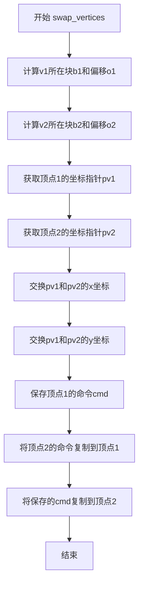

#### 带注释源码

```cpp
//------------------------------------------------------------------------
template<class T, unsigned S, unsigned P>
inline void vertex_block_storage<T,S,P>::swap_vertices(unsigned v1, unsigned v2)
{
    // 计算第一个顶点所在的块索引（通过右移block_shift位）
    unsigned b1 = v1 >> block_shift;
    
    // 计算第二个顶点所在的块索引
    unsigned b2 = v2 >> block_shift;
    
    // 计算第一个顶点在块内的偏移量（通过与block_mask进行按位与操作）
    unsigned o1 = v1 & block_mask;
    
    // 计算第二个顶点在块内的偏移量
    unsigned o2 = v2 & block_mask;
    
    // 计算第一个顶点的坐标指针（每个顶点占2个T类型的空间：x和y）
    T* pv1 = m_coord_blocks[b1] + (o1 << 1);
    
    // 计算第二个顶点的坐标指针
    T* pv2 = m_coord_blocks[b2] + (o2 << 1);
    
    // 临时变量用于交换
    T  val;
    
    // 交换第一个顶点的x坐标与第二个顶点的x坐标
    val = pv1[0]; pv1[0] = pv2[0]; pv2[0] = val;
    
    // 交换第一个顶点的y坐标与第二个顶点的y坐标
    val = pv1[1]; pv1[1] = pv2[1]; pv2[1] = val;
    
    // 保存第一个顶点的命令
    int8u cmd = m_cmd_blocks[b1][o1];
    
    // 将第二个顶点的命令复制到第一个顶点的位置
    m_cmd_blocks[b1][o1] = m_cmd_blocks[b2][o2];
    
    // 将保存的命令复制到第二个顶点的位置
    m_cmd_blocks[b2][o2] = cmd;
}
```


### `vertex_block_storage.last_command`

获取路径中最后一个顶点的命令标识符。如果路径中没有任何顶点，则返回 `path_cmd_stop`（停止命令）。

参数：

- （无参数）

返回值：`unsigned`，返回路径中最后一个顶点的命令标识符（如 `path_cmd_move_to`、`path_cmd_line_to` 等），如果没有顶点则返回 `path_cmd_stop`。

#### 流程图

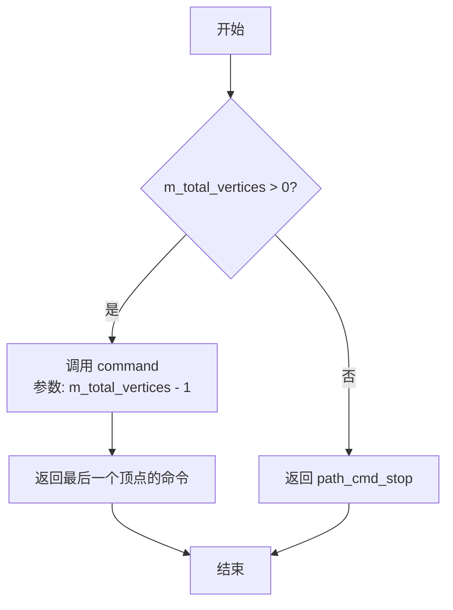

#### 带注释源码

```cpp
//------------------------------------------------------------------------
template<class T, unsigned S, unsigned P>
inline unsigned vertex_block_storage<T,S,P>::last_command() const
{
    // 检查是否存在至少一个顶点
    if(m_total_vertices) 
        // 如果有顶点，调用 command() 方法获取最后一个顶点的命令
        // m_total_vertices - 1 是最后一个顶点的索引
        return command(m_total_vertices - 1);
    
    // 如果没有任何顶点，返回 path_cmd_stop 表示停止/无效命令
    return path_cmd_stop;
}
```


### `vertex_block_storage.last_vertex`

获取路径存储中的最后一个顶点，如果存在则返回其坐标和命令，否则返回停止命令。

参数：

- `x`：`double*`，指向用于存储最后一个顶点 x 坐标的变量的指针
- `y`：`double*`，指向用于存储最后一个顶点 y 坐标的变量的指针

返回值：`unsigned`，返回最后一个顶点的路径命令（如 `path_cmd_move_to`、`path_cmd_line_to` 等），如果没有任何顶点则返回 `path_cmd_stop`

#### 流程图

```mermaid
flowchart TD
    A[开始 last_vertex] --> B{是否有顶点<br/>m_total_vertices > 0?}
    B -->|是| C[调用 vertex 方法<br/>获取索引 m_total_vertices - 1 的顶点]
    C --> D[返回顶点命令和坐标]
    B -->|否| E[返回 path_cmd_stop]
    D --> F[结束]
    E --> F
```

#### 带注释源码

```cpp
//------------------------------------------------------------------------
// 获取路径中的最后一个顶点
//------------------------------------------------------------------------
template<class T, unsigned S, unsigned P>
inline unsigned vertex_block_storage<T,S,P>::last_vertex(double* x, double* y) const
{
    // 检查是否有存储任何顶点
    if(m_total_vertices) 
    {
        // 如果有顶点，调用 vertex() 方法获取最后一个顶点
        // 索引为 total_vertices - 1（即 m_total_vertices - 1）
        return vertex(m_total_vertices - 1, x, y);
    }
    
    // 如果没有顶点（m_total_vertices 为 0），返回停止命令
    return path_cmd_stop;
}
```

**代码说明**：

1. **参数说明**：
   - `x`：输出参数，用于接收最后一个顶点的 x 坐标
   - `y`：输出参数，用于接收最后一个顶点的 y 坐标

2. **返回值说明**：
   - 当存在顶点时，返回最后一个顶点的命令类型（如 `path_cmd_move_to`、`path_cmd_line_to`、`path_cmd_curve3` 等）
   - 当不存在任何顶点时，返回 `path_cmd_stop` 表示路径结束或无效

3. **实现逻辑**：
   - 该方法首先检查 `m_total_vertices` 是否大于 0
   - 如果有顶点，通过调用内部的 `vertex()` 方法获取索引为 `total_vertices - 1`（即最后一个）的顶点数据
   - 如果没有顶点，直接返回 `path_cmd_stop`

4. **调用关系**：
   - 内部调用 `vertex()` 方法来获取指定索引的顶点，该方法通过块存储机制检索坐标和命令


### `vertex_block_storage.prev_vertex`

获取前一个顶点（即倒数第二个顶点）的坐标和命令。

参数：

- `x`：`double*`，用于输出前一个顶点的 X 坐标
- `y`：`double*`，用于输出前一个顶点的 Y 坐标

返回值：`unsigned`，返回前一个顶点的命令类型（如果顶点数量小于 2，则返回 `path_cmd_stop`）

#### 流程图

```mermaid
flowchart TD
    A[开始 prev_vertex] --> B{检查 m_total_vertices > 1?}
    B -->|是| C[调用 vertex 方法获取索引 m_total_vertices - 2 的顶点]
    B -->|否| D[返回 path_cmd_stop]
    C --> E[返回顶点命令类型]
    D --> E
```

#### 带注释源码

```cpp
//------------------------------------------------------------------------
template<class T, unsigned S, unsigned P>
inline unsigned vertex_block_storage<T,S,P>::prev_vertex(double* x, double* y) const
{
    // 检查是否有至少两个顶点（需要存在"前一个"顶点）
    if(m_total_vertices > 1) 
    {
        // 如果有至少两个顶点，调用 vertex() 方法获取倒数第二个顶点
        // 索引为 m_total_vertices - 2（即最后一个顶点的前一个）
        return vertex(m_total_vertices - 2, x, y);
    }
    
    // 如果顶点数量不足2个，返回 path_cmd_stop 表示没有前一个顶点
    return path_cmd_stop;
}
```

**说明**：此方法用于获取路径中最后一个顶点的前一个顶点。当需要处理曲线或进行某些几何计算时（例如三次贝塞尔曲线控制点计算），经常需要访问前一个顶点。该实现通过调用 `vertex()` 方法并使用索引 `m_total_vertices - 2` 来获取倒数第二个顶点。如果存储的顶点数量少于 2 个（即没有前一个顶点存在），则返回 `path_cmd_stop` 并将 x、y 参数保持不变（在 `vertex()` 方法中已设置为 0.0）。


### `vertex_block_storage.last_x()`

获取存储中最后一个顶点的X坐标。

参数：无

返回值：`double`，返回最后一个顶点的X坐标值；如果没有存储任何顶点，则返回0.0。

#### 流程图

```mermaid
flowchart TD
    A[开始] --> B{m_total_vertices > 0?}
    B -->|是| C[计算索引 idx = m_total_vertices - 1]
    C --> D[计算块索引: idx >> block_shift]
    D --> E[计算块内偏移: (idx & block_mask) << 1]
    E --> F[返回 m_coord_blocks[块索引][块内偏移]]
    B -->|否| G[返回 0.0]
    F --> H[结束]
    G --> H
```

#### 带注释源码

```cpp
//------------------------------------------------------------------------
template<class T, unsigned S, unsigned P>
inline double vertex_block_storage<T,S,P>::last_x() const
{
    // 检查是否存在至少一个顶点
    if(m_total_vertices)
    {
        // 获取最后一个顶点的索引（从0开始）
        unsigned idx = m_total_vertices - 1;
        
        // 计算该顶点所在的块索引（通过右移block_shift位）
        // block_shift默认为8，即每块包含256个顶点
        // 计算块内偏移量：由于每个顶点存储X和Y两个坐标，
        // 所以偏移量需要乘以2（通过左移1位实现）
        return m_coord_blocks[idx >> block_shift][(idx & block_mask) << 1];
    }
    
    // 没有顶点时返回默认值0.0
    return 0.0;
}
```


### `vertex_block_storage.last_y()`

获取存储在容器中的最后一个顶点的Y坐标。如果容器中没有顶点，则返回0.0。

参数：无

返回值：`double`，返回最后一个顶点的Y坐标，如果没有顶点则返回0.0

#### 流程图

```mermaid
flowchart TD
    A[开始 last_y] --> B{是否有顶点?}
    B -->|是| C[计算最后一个顶点的索引]
    C --> D[根据索引计算块内偏移量]
    D --> E[获取Y坐标值]
    E --> F[返回Y坐标]
    B -->|否| G[返回0.0]
    F --> H[结束]
    G --> H
```

#### 带注释源码

```cpp
//------------------------------------------------------------------------
// 获取最后一个顶点的Y坐标
// 如果存在至少一个顶点，则计算并返回其Y坐标；否则返回0.0
//------------------------------------------------------------------------
template<class T, unsigned S, unsigned P>
inline double vertex_block_storage<T,S,P>::last_y() const
{
    // 检查是否存在至少一个顶点
    if(m_total_vertices)
    {
        // 计算最后一个顶点的索引（从0开始）
        unsigned idx = m_total_vertices - 1;
        
        // 使用位运算计算块索引：idx >> block_shift 相当于 idx / block_size
        // 使用位运算计算块内偏移：idx & block_mask 相当于 idx % block_size
        // Y坐标存储在X坐标之后的相邻位置，所以需要 << 1 并 + 1
        // 即：((idx & block_mask) << 1) + 1 = (idx % block_size) * 2 + 1
        return m_coord_blocks[idx >> block_shift][((idx & block_mask) << 1) + 1];
    }
    
    // 没有顶点时返回默认值0.0
    return 0.0;
}
```

---

**技术说明**：
- 该方法使用位运算（`>>` 和 `&`）来高效计算块索引和块内偏移
- 顶点数据以交错方式存储（X0, Y0, X1, Y1, ...），因此Y坐标的偏移量是X坐标偏移量+1
- 返回0.0作为空容器时的默认值，这与`last_x()`方法的行为一致


### `vertex_block_storage.total_vertices`

获取当前存储的顶点总数。

参数：无

返回值：`unsigned`，返回已添加到存储中的顶点总数。

#### 流程图

```mermaid
flowchart TD
    A[开始] --> B[直接返回成员变量 m_total_vertices]
    B --> C[结束，返回顶点数量]
```

#### 带注释源码

```cpp
//------------------------------------------------------------------------
template<class T, unsigned S, unsigned P>
inline unsigned vertex_block_storage<T,S,P>::total_vertices() const
{
    // 直接返回成员变量 m_total_vertices，该变量在每次调用 add_vertex() 时递增
    // 在调用 remove_all() 时重置为 0
    return m_total_vertices;
}
```


### `vertex_block_storage.vertex`

获取指定索引的顶点坐标和命令。该方法通过索引直接访问预先分块存储的顶点数据，返回对应顶点的坐标值及关联的绘图命令。

参数：

- `idx`：`unsigned`，要获取的顶点的索引（从 0 开始）
- `x`：`double*`，用于输出顶点 x 坐标的指针
- `y`：`double*`，用于输出顶点 y 坐标的指针

返回值：`unsigned`，顶点关联的命令标识符（如 `path_cmd_move_to`、`path_cmd_line_to`、`path_cmd_stop` 等）

#### 流程图

```mermaid
flowchart TD
    A[开始] --> B[计算块号 nb = idx >> block_shift]
    B --> C[计算块内偏移: pv = m_coord_blocks[nb] + ((idx & block_mask) << 1)]
    C --> D[从坐标块读取: *x = pv[0], *y = pv[1]]
    D --> E[从命令块读取: cmd = m_cmd_blocks[nb][idx & block_mask]]
    E --> F[返回命令 cmd]
```

#### 带注释源码

```cpp
//------------------------------------------------------------------------
template<class T, unsigned S, unsigned P>
inline unsigned vertex_block_storage<T,S,P>::vertex(unsigned idx, 
                                                    double* x, double* y) const
{
    // 通过位运算计算该顶点所在的块号
    // block_shift 为模板参数，默认值为 8，即每块包含 256 个顶点
    unsigned nb = idx >> block_shift;
    
    // 计算在当前块内的坐标偏移量
    // 每个顶点占用 2 个 T 类型的空间（x 和 y）
    // block_mask = block_size - 1，用于获取块内索引
    const T* pv = m_coord_blocks[nb] + ((idx & block_mask) << 1);
    
    // 读取顶点的 x 和 y 坐标
    *x = pv[0];
    *y = pv[1];
    
    // 从命令块中获取该顶点对应的命令
    // 命令存储在独立的字节块中，与坐标块一一对应
    return m_cmd_blocks[nb][idx & block_mask];
}
```


### `vertex_block_storage::command`

获取指定索引位置的顶点命令（Command），该命令指示顶点的操作类型，如移动（move_to）、画线（line_to）、曲线（curve3、curve4）等。这是路径存储中标识每个顶点几何意义的关键字段。

参数：

- `idx`：`unsigned`，要获取命令的顶点索引，索引从 0 开始

返回值：`unsigned`，返回指定索引处的命令值，命令值定义了顶点的类型和属性

#### 流程图

```mermaid
graph TD
    A[开始: 输入索引 idx] --> B[计算块索引<br/>block = idx >> block_shift]
    B --> C[计算块内偏移<br/>offset = idx & block_mask]
    C --> D[从命令块数组获取命令<br/>cmd = m_cmd_blocks[block][offset]]
    D --> E[返回命令值]
```

#### 带注释源码

```cpp
//------------------------------------------------------------------------
// 获取指定索引处的顶点命令
// 该方法通过位运算快速定位命令存储位置
// 参数: idx - 顶点索引
// 返回: 对应索引处的命令值
//------------------------------------------------------------------------
template<class T, unsigned S, unsigned P>
inline unsigned vertex_block_storage<T,S,P>::command(unsigned idx) const
{
    // 使用位运算计算块索引和块内偏移
    // block_shift 控制每块的元素数量（通常是 8，即 256 个元素一块）
    // block_mask 是 block_size - 1，用于取模运算
    // idx >> block_shift 相当于 idx / block_size
    // idx & block_mask 相当于 idx % block_size
    return m_cmd_blocks[idx >> block_shift][idx & block_mask];
}
```

---

**技术说明**：该方法使用位运算代替除法和取模运算，提高访问效率。`block_shift` 默认为 8，意味着每块包含 256 个顶点；`block_mask` 为 255，用于快速计算块内偏移。这种块存储结构适用于大量顶点的路径存储，可有效降低内存分配开销并提高缓存局部性。


### `vertex_block_storage.allocate_block`

该方法负责在顶点块存储中分配新的内存块。当需要访问超出当前已分配块数量的块时，会自动扩展内存块数组，分配新的坐标块和命令块，并更新块计数器和指针数组。

参数：

- `nb`：`unsigned`，要分配的块编号（block number），表示需要访问的第 nb 个内存块

返回值：`void`，无返回值。方法通过修改类的成员变量（`m_coord_blocks`、`m_cmd_blocks`、`m_max_blocks`、`m_total_blocks`）来完成内存块的分配和扩展。

#### 流程图

```mermaid
flowchart TD
    A[开始 allocate_block] --> B{nb >= m_max_blocks?}
    B -->|是| C[计算新容量: m_max_blocks + block_pool]
    C --> D[分配新的坐标块指针数组 new_coords]
    D --> E[计算新命令块指针数组地址 new_cmds]
    E --> F{m_coord_blocks 是否已存在?}
    F -->|是| G[复制旧的坐标块指针到新数组]
    G --> H[复制旧的控制块指针到新数组]
    H --> I[释放旧的块指针数组内存]
    F -->|否| J[跳过复制直接使用新数组]
    J --> K[更新 m_coord_blocks 和 m_cmd_blocks 指向新数组]
    K --> L[m_max_blocks += block_pool 扩展容量]
    L --> M[为当前块 nb 分配坐标内存]
    B -->|否| N[跳过内存扩展直接分配当前块]
    M --> O[计算命令块地址并赋值给 m_cmd_blocks[nb]]
    N --> O
    O --> P[m_total_blocks++ 增加块计数]
    P --> Q[结束 allocate_block]
```

#### 带注释源码

```cpp
//------------------------------------------------------------------------
// 功能: 分配新的内存块用于存储顶点数据
// 参数: nb - 需要分配的块编号
//------------------------------------------------------------------------
template<class T, unsigned S, unsigned P>
void vertex_block_storage<T,S,P>::allocate_block(unsigned nb)
{
    // 检查是否需要扩展块数组
    if(nb >= m_max_blocks) 
    {
        // 计算新数组的大小: 原有块数 + 预分配的块池大小
        // 乘以2是因为坐标块和命令块指针数组是连续存储的
        T** new_coords = 
            pod_allocator<T*>::allocate((m_max_blocks + block_pool) * 2);

        // 命令块指针数组紧跟在坐标块指针数组后面
        // 通过指针偏移计算命令块数组的起始位置
        unsigned char** new_cmds = 
            (unsigned char**)(new_coords + m_max_blocks + block_pool);

        // 如果之前已经有分配的块，需要复制旧的指针到新数组
        if(m_coord_blocks)
        {
            // 复制坐标块指针数组
            memcpy(new_coords, 
                   m_coord_blocks, 
                   m_max_blocks * sizeof(T*));

            // 复制命令块指针数组
            memcpy(new_cmds, 
                   m_cmd_blocks, 
                   m_max_blocks * sizeof(unsigned char*));

            // 释放旧的指针数组内存
            pod_allocator<T*>::deallocate(m_coord_blocks, m_max_blocks * 2);
        }
        
        // 更新类成员指向新分配的内存
        m_coord_blocks = new_coords;
        m_cmd_blocks   = new_cmds;
        
        // 增加最大块数容量
        m_max_blocks  += block_pool;
    }
    
    // 为指定块 nb 分配坐标数据内存
    // 分配大小 = block_size * 2 (存储x,y坐标) + 额外空间用于命令存储
    m_coord_blocks[nb] = 
        pod_allocator<T>::allocate(block_size * 2 + 
               block_size / (sizeof(T) / sizeof(unsigned char)));

    // 命令块紧跟在坐标数据后面
    // 坐标数据占用 block_size * 2 个T类型元素的空间
    m_cmd_blocks[nb]  = 
        (unsigned char*)(m_coord_blocks[nb] + block_size * 2);

    // 增加已分配块的计数
    m_total_blocks++;
}
```


### `vertex_block_storage.storage_ptrs`

获取指向当前顶点存储位置的指针，用于添加新顶点时快速访问坐标和命令存储块。

参数：

- `xy_ptr`：`T**`，指向坐标指针的指针，用于输出坐标块的起始位置

返回值：`int8u*`，命令块的起始位置（用于写入顶点命令）

#### 流程图

```mermaid
flowchart TD
    A[开始: storage_ptrs] --> B[计算块索引: nb = m_total_vertices >> block_shift]
    B --> C{nb >= m_total_blocks?}
    C -->|是| D[调用 allocate_block 分配新块]
    C -->|否| E[计算坐标位置: xy_ptr = m_coord_blocks[nb] + ((m_total_vertices & block_mask) << 1)]
    D --> E
    E --> F[返回命令块位置: m_cmd_blocks[nb] + (m_total_vertices & block_mask)]
    F --> G[结束]
```

#### 带注释源码

```cpp
//------------------------------------------------------------------------
// 获取存储指针 - 用于添加新顶点时获取坐标和命令存储位置
//------------------------------------------------------------------------
template<class T, unsigned S, unsigned P>
int8u* vertex_block_storage<T,S,P>::storage_ptrs(T** xy_ptr)
{
    // 计算当前顶点所在的块索引（块号 = 顶点总数 / 块大小）
    unsigned nb = m_total_vertices >> block_shift;
    
    // 如果块号大于等于已分配的块数，需要分配新块
    if(nb >= m_total_blocks)
    {
        allocate_block(nb);
    }
    
    // 计算坐标存储位置：
    // m_coord_blocks[nb] - 获取目标块的首地址
    // ((m_total_vertices & block_mask) << 1) - 计算在块内的偏移量（每个顶点占2个坐标值：x和y）
    *xy_ptr = m_coord_blocks[nb] + ((m_total_vertices & block_mask) << 1);
    
    // 返回命令存储位置：
    // m_cmd_blocks[nb] - 命令块首地址
    // (m_total_vertices & block_mask) - 块内偏移量
    return m_cmd_blocks[nb] + (m_total_vertices & block_mask);
}
```


### `poly_plain_adaptor<T>::poly_plain_adaptor()`

这是 `poly_plain_adaptor` 类的默认构造函数，用于构造一个空的平面多边形适配器，初始化所有成员变量为默认值。

参数： 无

返回值： 无（构造函数）

#### 流程图

```mermaid
graph TD
    A[开始构造] --> B[初始化 m_data = 0]
    B --> C[初始化 m_ptr = 0]
    C --> D[初始化 m_end = 0]
    D --> E[初始化 m_closed = false]
    E --> F[初始化 m_stop = false]
    F --> G[结束构造]
```

#### 带注释源码

```cpp
// 默认构造函数
// 用途：构造一个空的平面多边形适配器
// 初始化所有成员变量为默认值
poly_plain_adaptor() : 
    m_data(0),    // 指向顶点数据的指针，初始为nullptr
    m_ptr(0),     // 当前读取位置的指针，初始为nullptr
    m_end(0),     // 数据结束位置的指针，初始为nullptr
    m_closed(false), // 标记多边形是否闭合，初始为false
    m_stop(false)   // 标记是否已遍历完所有顶点，初始为false
{}
```


### poly_plain_adaptor.poly_plain_adaptor()

这是 `poly_plain_adaptor` 类的带参构造函数，用于初始化一个多边形顶点适配器，将原始顶点数据转换为符合 AGG 渲染引擎要求的顶点源（VertexSource）接口。

参数：

- `data`：`const T*`，指向顶点坐标数据的指针，数据格式为交替的 x, y 坐标
- `num_points`：`unsigned`，顶点数量
- `closed`：`bool`，标识多边形是否闭合

返回值：无（构造函数，隐式返回类类型实例）

#### 带注释源码

```cpp
// 带参构造函数
// 参数：
//   data        - 指向顶点数据的指针（T类型数组，格式为x0,y0,x1,y1,...）
//   num_points  - 顶点数量
//   closed      - 是否闭合多边形（true表示闭合，false表示开放折线）
poly_plain_adaptor(const T* data, unsigned num_points, bool closed) :
    m_data(data),      // 保存原始数据指针，用于rewind时重置m_ptr
    m_ptr(data),       // 初始化读取指针，指向第一个顶点
    m_end(data + num_points * 2), // 计算数据结束位置（每个顶点2个坐标x,y）
    m_closed(closed),  // 保存闭合状态，用于vertex()中判断是否需要添加path_cmd_end_poly
    m_stop(false)      // 初始化停止标志，防止重复返回path_cmd_end_poly
{}
```


### `poly_plain_adaptor.init()`

该方法用于初始化 `poly_plain_adaptor` 适配器，设置顶点数据指针、遍历指针、结束指针、闭合状态标志以及停止标志，以便后续可以通过 `vertex()` 方法遍历多边形的顶点。

参数：

- `data`：`const T*`，指向多边形顶点数据的指针
- `num_points`：`unsigned`，多边形顶点的数量
- `closed`：`bool`，表示多边形是否闭合（true 表示闭合，false 表示不闭合）

返回值：`void`，无返回值

#### 流程图

```mermaid
flowchart TD
    A[开始 init] --> B[设置 m_data = data]
    B --> C[设置 m_ptr = data]
    C --> D[计算 m_end = data + num_points * 2]
    D --> E[设置 m_closed = closed]
    E --> F[设置 m_stop = false]
    F --> G[结束 init]
```

#### 带注释源码

```
//----------------------------------------------------------------------------
// 初始化 poly_plain_adaptor 适配器
// 参数:
//   data       - 指向顶点数据的指针
//   num_points - 顶点的数量
//   closed     - 是否闭合多边形
//----------------------------------------------------------------------------
void init(const T* data, unsigned num_points, bool closed)
{
    m_data = data;               // 保存顶点数据的起始地址
    m_ptr = data;                // 设置遍历指针为起始位置
    m_end = data + num_points * 2; // 计算结束位置（每个点包含x,y两个坐标）
    m_closed = closed;           // 保存闭合状态标志
    m_stop = false;              // 重置停止标志，准备遍历
}
```


### `poly_plain_adaptor.rewind()`

重置遍历位置，将内部指针重置为指向数据起始位置，并清除停止标志，以便重新遍历多边形顶点。

参数：

- `path_id`：`unsigned`，未使用的参数，为保持接口兼容性而保留（用于支持多路径遍历接口）

返回值：`void`，无返回值

#### 流程图

```mermaid
flowchart TD
    A[开始 rewind] --> B{m_ptr = m_data}
    B --> C{m_stop = false}
    C --> D[结束]
```

#### 带注释源码

```cpp
//------------------------------------------------------------------------
// 重置遍历位置，将指针 m_ptr 重新指向数据起始位置 m_data
// 并清除停止标志 m_stop，以便后续调用 vertex() 时可以重新遍历顶点
//------------------------------------------------------------------------
void rewind(unsigned)
{
    m_ptr = m_data;   // 将遍历指针重置到数据起始位置
    m_stop = false;   // 清除停止标志，允许继续返回顶点
}
```

---

### 所属类的完整信息

#### 类：`poly_plain_adaptor<T>`

poly_plain_adaptor 是一个简单的适配器类，用于将原始顶点数组（以平铺格式存储）适配为符合 AGG 库 vertex_source 概念的接口。该类主要用于处理多边形和多段线的顶点数据遍历。

**类字段：**

- `m_data`：`const T*`，指向顶点数据起始位置的指针
- `m_ptr`：`const T*`，当前遍历位置的指针
- `m_end`：`const T*`，指向顶点数据结束位置的指针
- `m_closed`：`bool`，标记多边形是否闭合
- `m_stop`：`bool`，标记是否已遍历完所有顶点

**关键组件：**

- `init()`：初始化适配器，设定数据指针、顶点数和闭合标志
- `vertex()`：获取下一个顶点，返回对应的路径命令
- `rewind()`：重置遍历位置，允许重新遍历

---

### 技术债务与优化空间

1. **未使用的参数**：`rewind(unsigned)` 参数 `path_id` 未被使用，这是为了与 `vertex_source` 接口的其他实现保持一致性（如 `path_base` 类中使用 `path_id` 来指定路径索引）。可以考虑添加注释说明这是接口兼容性的需要。
2. **缺乏边界检查**：虽然内部有 `m_ptr` 和 `m_end` 的比较，但在某些边界情况下可能需要更健壮的检查。
3. **无异常处理**：该实现不抛出异常，但在极端内存情况下 `allocate_block` 可能失败。

---

### 其它项目

**设计目标与约束：**
- 该类是模板类，支持任意数值类型 T（通常为 `double` 或 `float`）
- 设计为轻量级适配器，不管理内存，数据由外部提供
- 符合 AGG 库的 vertex_source 概念，提供 `rewind()` 和 `vertex()` 接口

**错误处理与异常设计：**
- 不抛出异常，依赖调用者确保传入的指针有效
- `vertex()` 方法在遍历完成后返回 `path_cmd_stop` 作为结束标记

**数据流与状态机：**
- 初始状态：`m_ptr` 指向 `m_data`，`m_stop` 为 `false`
- 遍历状态：每次调用 `vertex()` 后 `m_ptr` 前移
- 结束状态：当 `m_ptr >= m_end` 时返回结束命令；若 `m_closed` 为 true，则额外返回闭合多边形的命令


### `poly_plain_adaptor.vertex()`

该函数是 `poly_plain_adaptor` 类的核心方法，用于从顶点数据数组中依次读取下一个顶点坐标，并根据当前读取位置返回相应的路径命令（如 `path_cmd_move_to` 或 `path_cmd_line_to`），当所有顶点读取完毕后，根据多边形是否闭合返回结束命令或停止命令。

参数：

- `x`：`double*`，指向用于存储读取的顶点 X 坐标的 double 型指针
- `y`：`double*`，指向用于存储读取的顶点 Y 坐标的 double 型指针

返回值：`unsigned`，返回路径命令标识符，表示当前顶点的类型（如 `path_cmd_move_to`、`path_cmd_line_to`、`path_cmd_end_poly | path_flags_close` 或 `path_cmd_stop`）

#### 流程图

```mermaid
flowchart TD
    A[开始 vertex] --> B{检查 m_ptr < m_end}
    B -->|是| C{m_ptr == m_data<br>判断是否为第一个顶点}
    C -->|是| D[读取 *m_ptr 到 x<br>m_ptr++<br>读取 *m_ptr 到 y<br>m_ptr++]
    C -->|否| E[读取 *m_ptr 到 x<br>m_ptr++<br>读取 *m_ptr 到 y<br>m_ptr++]
    D --> F[返回 path_cmd_move_to]
    E --> G[返回 path_cmd_line_to]
    B -->|否| H[设置 *x = 0.0<br>*y = 0.0]
    H --> I{m_closed 且 !m_stop}
    I -->|是| J[设置 m_stop = true<br>返回 path_cmd_end_poly | path_flags_close]
    I -->|否| K[返回 path_cmd_stop]
    F --> L[结束]
    G --> L
    J --> L
    K --> L
```

#### 带注释源码

```cpp
//------------------------------------------------------------------------
// poly_plain_adaptor::vertex()
// 获取路径中的下一个顶点
// 参数:
//   double* x - 输出参数，用于存储顶点的 X 坐标
//   double* y - 输出参数，用于存储顶点的 Y 坐标
// 返回:
//   unsigned - 路径命令:
//     path_cmd_move_to         - 第一个顶点，表示移动到该点
//     path_cmd_line_to         - 后续顶点，表示画线到该点
//     path_cmd_end_poly        - 多边形结束（当 closed=true 时）
//     path_flags_close         - 闭合标志（与 end_poly 组合使用）
//     path_cmd_stop            - 停止命令，表示没有更多顶点
//------------------------------------------------------------------------
template<class T>
unsigned poly_plain_adaptor<T>::vertex(double* x, double* y)
{
    // 检查是否还有未读取的顶点
    if(m_ptr < m_end)
    {
        // 判断当前是否指向第一个顶点（m_data 是起始指针）
        bool first = m_ptr == m_data;
        
        // 读取 X 坐标，指针后移
        *x = *m_ptr++;
        // 读取 Y 坐标，指针后移
        *y = *m_ptr++;
        
        // 根据是否为第一个顶点返回对应的命令
        // 第一个顶点返回 move_to，后续顶点返回 line_to
        return first ? path_cmd_move_to : path_cmd_line_to;
    }
    
    // 所有顶点已读取完毕
    // 将输出坐标设为 0.0
    *x = *y = 0.0;
    
    // 如果多边形是闭合的且尚未返回过结束命令
    if(m_closed && !m_stop)
    {
        // 标记已处理结束命令，避免重复返回
        m_stop = true;
        // 返回闭合多边形的结束命令
        return path_cmd_end_poly | path_flags_close;
    }
    
    // 返回停止命令，表示没有更多顶点
    return path_cmd_stop;
}
```


### `poly_container_adaptor.poly_container_adaptor()` - 默认构造函数

这是 `poly_container_adaptor` 类的默认构造函数，用于初始化适配器对象，将容器指针置为 nullptr，索引归零，关闭状态和停止标志设为 false，从而创建一个空的顶点容器适配器。

参数：无

返回值：无（构造函数）

#### 流程图

```mermaid
flowchart TD
    A[开始] --> B[设置 m_container = nullptr]
    B --> C[设置 m_index = 0]
    C --> D[设置 m_closed = false]
    D --> E[设置 m_stop = false]
    E --> F[结束]
```

#### 带注释源码

```cpp
//-------------------------------------------------poly_container_adaptor
template<class Container> class poly_container_adaptor
{
public:
    // 类型定义：提取容器中存储的顶点类型
    typedef typename Container::value_type vertex_type;

    // 默认构造函数：初始化所有成员变量为默认状态
    poly_container_adaptor() : 
        m_container(0),    // 容器指针初始化为 nullptr（空指针）
        m_index(0),         // 顶点索引初始化为 0（从头开始）
        m_closed(false),   // 关闭状态初始化为 false（非闭合多边形）
        m_stop(false)       // 停止标志初始化为 false（未停止遍历）
    {}
    
    // ... 其余代码
```

#### 成员变量说明

| 成员变量 | 类型 | 描述 |
|---------|------|------|
| `m_container` | `const Container*` | 指向顶点数据容器的指针，为 nullptr 时表示空适配器 |
| `m_index` | `unsigned` | 当前遍历到的顶点索引位置 |
| `m_closed` | `bool` | 标记多边形是否闭合 |
| `m_stop` | `bool` | 标记是否已遍历完所有顶点 |


### `poly_container_adaptor.poly_container_adaptor()`

带参构造函数，用于初始化一个多边形容器适配器对象，将外部容器作为顶点数据源，并指定多边形是否闭合。

参数：

- `data`：`const Container&`，引用到包含顶点数据的容器对象
- `closed`：`bool`，标志位，指示多边形是否闭合（true表示闭合，false表示不闭合）

返回值：无（构造函数，不返回任何值）

#### 流程图

```mermaid
graph TD
    A[开始构造] --> B[接收data和closed参数]
    B --> C[将data的地址赋值给m_container指针]
    C --> D[初始化m_index为0]
    D --> E[将closed参数赋值给m_closed成员变量]
    E --> F[初始化m_stop为false]
    F --> G[构造完成]
```

#### 带注释源码

```cpp
//-------------------------------------------------poly_container_adaptor
template<class Container> class poly_container_adaptor
{
public:
    typedef typename Container::value_type vertex_type;

    // 默认构造函数（无参）
    poly_container_adaptor() : 
        m_container(0),    // 初始化容器指针为空
        m_index(0),         // 初始化索引为0
        m_closed(false),    // 初始化为不闭合
        m_stop(false)       // 初始化停止标志为false
    {}

    // 带参构造函数 - 本次提取的目标
    poly_container_adaptor(const Container& data, bool closed) :
        m_container(&data),    // 将传入容器的地址赋给成员指针
        m_index(0),             // 初始化遍历索引为0
        m_closed(closed),       // 将closed参数保存到成员变量
        m_stop(false)           // 初始化停止标志为false，表示可以继续遍历
    {}
    // ... rest of class
```


### `poly_container_adaptor.init()`

初始化 `poly_container_adaptor` 适配器，将外部容器数据与适配器关联，并设置多边形的闭合状态。该方法是 `poly_container_adaptor` 类的核心初始化函数，用于在运行时动态绑定顶点容器，使适配器能够像顶点源一样被AGG库使用。

参数：

- `data`：`const Container&`，要关联的顶点容器引用，包含所有顶点数据
- `closed`：`bool`，表示多边形是否闭合，true 表示闭合多边形（首尾相连）

返回值：`void`，无返回值

#### 流程图

```mermaid
flowchart TD
    A[开始 init] --> B[设置 m_container = &data]
    B --> C[设置 m_index = 0]
    C --> D[设置 m_closed = closed]
    D --> E[设置 m_stop = false]
    E --> F[结束 init]
```

#### 带注释源码

```cpp
//-------------------------------------------------poly_container_adaptor
template<class Container> class poly_container_adaptor
{
public:
    // 内部类型定义：顶点的值类型
    typedef typename Container::value_type vertex_type;

    // 默认构造函数，初始化为空状态
    poly_container_adaptor() : 
        m_container(0),     // 容器指针置空
        m_index(0),         // 顶点索引从头开始
        m_closed(false),    // 默认不闭合
        m_stop(false)       // 未到达终点
    {}

    // 带参构造函数，直接初始化并关联容器
    poly_container_adaptor(const Container& data, bool closed) :
        m_container(&data), // 保存容器地址
        m_index(0),          // 顶点索引从头开始
        m_closed(closed),   // 设置闭合标志
        m_stop(false)        // 未到达终点
    {}

    //============================================================
    // init: 初始化/重置适配器状态
    // 参数:
    //   data   - 要关联的顶点容器引用
    //   closed - 是否闭合多边形
    // 返回值: void
    //============================================================
    void init(const Container& data, bool closed)
    {
        // 将容器地址赋给成员指针，使其指向外部数据
        m_container = &data;
        
        // 重置顶点索引，从第一个顶点开始读取
        m_index = 0;
        
        // 设置多边形闭合标志
        m_closed = closed;
        
        // 重置停止标志，允许读取顶点
        m_stop = false;
    }

    // rewind: 将读取位置重置到起点
    void rewind(unsigned)
    {
        m_index = 0;
        m_stop = false;
    }

    // vertex: 获取下一个顶点
    unsigned vertex(double* x, double* y)
    {
        // 检查是否还有未读取的顶点
        if(m_index < m_container->size())
        {
            // 判断是否为第一个顶点
            bool first = m_index == 0;
            
            // 获取当前顶点并递增索引
            const vertex_type& v = (*m_container)[m_index++];
            
            // 提取顶点坐标
            *x = v.x;
            *y = v.y;
            
            // 第一个顶点返回 move_to，后续顶点返回 line_to
            return first ? path_cmd_move_to : path_cmd_line_to;
        }
        
        // 无顶点可读时设置默认坐标
        *x = *y = 0.0;
        
        // 如果多边形闭合且未发送结束标志
        if(m_closed && !m_stop)
        {
            m_stop = true;
            // 返回闭合多边形结束命令
            return path_cmd_end_poly | path_flags_close;
        }
        
        // 已无顶点，返回停止命令
        return path_cmd_stop;
    }

private:
    const Container* m_container;  // 指向顶点容器的指针
    unsigned m_index;             // 当前读取的顶点索引
    bool     m_closed;             // 多边形是否闭合
    bool     m_stop;               // 是否已发送结束标志
};
```


### `poly_container_adaptor.rewind()`

重置 `poly_container_adaptor` 适配器的遍历状态，将当前索引重置为 0 并清除结束标志，以便重新遍历容器中的顶点。

参数：

-  `path_id`：`unsigned`，该参数未使用，是为保持与 `vertex_source` 接口兼容而保留的占位参数

返回值：`void`，无返回值

#### 流程图

```mermaid
flowchart TD
    A[开始 rewind] --> B[设置 m_index = 0]
    B --> C[设置 m_stop = false]
    C --> D[结束]
```

#### 带注释源码

```cpp
//------------------------------------------------------------------------
template<class Container> class poly_container_adaptor
{
    // ... 其他成员 ...

    //-------------------------------------------------rewind
    // 重置遍历状态，准备重新从第一个顶点开始读取
    void rewind(unsigned)
    {
        m_index = 0;   // 将当前顶点索引重置为 0，从容器起始位置开始
        m_stop = false; // 清除结束标志，允许继续返回顶点数据
    }

    // ... 其他成员 ...
private:
    const Container* m_container; // 指向顶点容器的指针
    unsigned m_index;             // 当前遍历到的顶点索引
    bool     m_closed;            // 标记多边形是否闭合
    bool     m_stop;              // 标记是否已到达终点
};
```


### `poly_container_adaptor.vertex()`

该方法是 `poly_container_adaptor` 类的核心成员函数，实现了 VertexSource 概念中的顶点遍历接口。它通过内部索引遍历关联的容器，每次调用返回一个顶点的坐标（x, y）以及对应的路径命令（move_to 表示起点，line_to 表示后续点），当所有顶点遍历完毕后返回停止命令；如果多边形是闭合的，则在最后一个顶点后返回闭合多边形命令。

参数：
- `x`：`double*`，指向用于存储顶点 x 坐标的变量的指针
- `y`：`double*`，指向用于存储顶点 y 坐标的变量的指针

返回值：`unsigned`，返回路径命令标识符（如 `path_cmd_move_to`、`path_cmd_line_to`、`path_cmd_end_poly | path_flags_close` 或 `path_cmd_stop`）

#### 流程图

```mermaid
flowchart TD
    A([开始]) --> B{索引 < 容器大小?}
    B -->|是| C{索引 == 0?}
    B -->|否| D[设置 x=0, y=0]
    C -->|是| F[获取顶点, 索引++]
    F --> G[返回 path_cmd_move_to]
    C -->|否| H[获取顶点, 索引++]
    H --> I[返回 path_cmd_line_to]
    D --> J{closed? 且 !stop?}
    J -->|是| K[stop=true]
    K --> L[返回 path_cmd_end_poly | path_flags_close]
    J -->|否| M[返回 path_cmd_stop]
    G --> N([结束])
    I --> N
    L --> N
    M --> N
```

#### 带注释源码

```cpp
unsigned vertex(double* x, double* y)
{
    // 检查是否还有未遍历的顶点
    if(m_index < m_container->size())
    {
        // 判断当前顶点是否为路径的起点（第一个顶点）
        bool first = m_index == 0;
        // 从容器中获取当前顶点并递增索引
        const vertex_type& v = (*m_container)[m_index++];
        // 将顶点的 x 和 y 坐标写入输出参数
        *x = v.x;
        *y = v.y;
        // 如果是第一个顶点返回 move_to 命令，否则返回 line_to 命令
        return first ? path_cmd_move_to : path_cmd_line_to;
    }
    // 所有顶点已遍历完毕，将坐标置零
    *x = *y = 0.0;
    // 如果多边形是闭合的且尚未发送过结束命令
    if(m_closed && !m_stop)
    {
        // 标记已发送结束命令，防止重复发送
        m_stop = true;
        // 返回闭合多边形命令
        return path_cmd_end_poly | path_flags_close;
    }
    // 返回停止命令，表示路径遍历结束
    return path_cmd_stop;
}
```


### `poly_container_reverse_adaptor.poly_container_reverse_adaptor`

这是 `poly_container_reverse_adaptor` 类的默认构造函数，用于创建一个反向遍历容器内容的适配器对象的默认（空）实例。

参数：无

返回值：无（构造函数），但会构造一个 `poly_container_reverse_adaptor` 类型对象

#### 流程图

```mermaid
graph TD
    A[开始构造] --> B[将 m_container 设为 nullptr / 0]
    B --> C[将 m_index 设为 -1]
    C --> D[将 m_closed 设为 false]
    D --> E[将 m_stop 设为 false]
    E --> F[构造完成, 返回对象实例]
```

#### 带注释源码

```cpp
//------------------------------------------------------------------------
// poly_container_reverse_adaptor 的默认构造函数
// 这是一个反转遍历适配器的默认构造方式,用于创建一个空的适配器实例
// 在使用前需要通过 init() 方法或带参数的构造函数来初始化
//------------------------------------------------------------------------
poly_container_reverse_adaptor() : 
    m_container(0),    // 容器指针初始化为 nullptr (空指针)
    m_index(-1),       // 索引初始化为 -1,表示尚未开始遍历
    m_closed(false),   // 标记是否闭合多边形,默认 false
    m_stop(false)      // 标记是否已遍历结束,默认 false
{}
```


### `poly_container_reverse_adaptor.poly_container_reverse_adaptor()` - 带参构造函数

这是一个模板类构造函数，用于创建一个反向遍历多边形容器顶点的适配器对象。该构造函数接收一个容器引用和一个布尔标志，将适配器内部指针指向容器末尾，使得后续调用 `vertex()` 方法时能够从最后一个顶点向前遍历到第一个顶点，支持闭合多边形的路径命令生成。

参数：

- `data`：`Container&`，要反向遍历的多边形容器引用
- `closed`：`bool`，表示多边形是否闭合，闭合时会在遍历结束后生成闭合路径命令

返回值：无（构造函数）

#### 流程图

```mermaid
flowchart TD
    A[开始构造] --> B[将m_container指向data]
    --> C[初始化m_index为-1]
    --> D[设置m_closed为closed参数]
    --> E[初始化m_stop为false]
    --> F[构造完成]
```

#### 带注释源码

```cpp
//-----------------------------------------poly_container_reverse_adaptor
// 带参构造函数
// 参数说明：
//   data   - 引用要反向遍历的容器对象
//   closed - 指示该多边形路径是否需要闭合
template<class Container> class poly_container_reverse_adaptor
{
public:
    typedef typename Container::value_type vertex_type;

    // 默认构造函数，所有成员初始化为默认值
    poly_container_reverse_adaptor() : 
        m_container(0),    // 空指针
        m_index(-1),       // 从-1开始，首次vertex调用时会设置为size-1
        m_closed(false),  // 默认不闭合
        m_stop(false)     // 未停止
    {}

    // 带参构造函数 - 从代码中提取
    // 功能：初始化适配器，使其从容器最后一个顶点开始反向遍历
    poly_container_reverse_adaptor(Container& data, bool closed) :
        m_container(&data),    // 保存容器地址，用于后续访问
        m_index(-1),           // 初始索引为-1，在rewind或首次vertex调用时设置为size-1
        m_closed(closed),      // 保存闭合标志，决定是否输出闭合命令
        m_stop(false)          // 初始化为未停止状态
    {}
    
    // 其它成员方法...
    
private:
    Container* m_container;  // 指向多边形容器的指针
    int  m_index;            // 当前遍历索引（反向）
    bool m_closed;           // 多边形是否闭合
    bool m_stop;             // 是否已输出完所有顶点
};
```


### `poly_container_reverse_adaptor.init()`

该方法用于初始化反向容器适配器，将容器引用和闭合标志存储到成员变量中，并将索引设置为容器的最后一个位置，以便后续从后向前遍历顶点。

参数：

- `data`：`Container&`，要反向遍历的容器引用，包含顶点数据
- `closed`：`bool`，表示多边形是否闭合（闭合为 true，否则为 false）

返回值：`void`，无返回值

#### 流程图

```mermaid
flowchart TD
    A[开始 init] --> B[设置 m_container = &data]
    B --> C[计算 m_index = m_container->size() - 1]
    C --> D[设置 m_closed = closed]
    D --> E[设置 m_stop = false]
    E --> F[结束]
```

#### 带注释源码

```cpp
//------------------------------------------------------------------------
template<class Container>
void poly_container_reverse_adaptor<Container>::init(Container& data, bool closed)
{
    // 将传入的容器引用存储到成员指针中
    m_container = &data;
    
    // 设置索引为容器大小减1，即最后一个元素的位置
    // 这样后续调用 vertex() 时会从后向前遍历
    m_index = m_container->size() - 1;
    
    // 存储闭合状态标志
    m_closed = closed;
    
    // 重置停止标志，表示尚未到达遍历起点
    m_stop = false;
}
```


### `poly_container_reverse_adaptor.rewind`

重置容器的遍历索引，使其可以从最后一个顶点开始反向遍历。该方法是 VertexSource 概念的一部分，允许调用者将遍历状态重置为初始状态，以便重新读取顶点数据。

参数：

- `path_id`：`unsigned`，未使用的参数，为保持 VertexSource 接口一致性而保留。在调用时通常传入 0。

返回值：`void`，无返回值。

#### 流程图

```mermaid
flowchart TD
    A[开始 rewind] --> B{检查 m_container 是否为空}
    B -->|是| C[保持 m_index 为 -1]
    B -->|否| D[计算容器大小]
    D --> E[m_index = m_container->size - 1]
    E --> F[m_stop = false]
    C --> G[结束]
    F --> G
```

#### 带注释源码

```cpp
//------------------------------------------------------------------------
// poly_container_reverse_adaptor 类的 rewind 方法
// 该方法实现 VertexSource 接口的遍历重置功能
//------------------------------------------------------------------------
void rewind(unsigned)
{
    // 参数 unsigned 未使用，保持接口一致性
    // m_container->size() 获取容器中的顶点总数
    // 由于是反向遍历，初始索引设为最后一个顶点的位置（即 size-1）
    m_index = m_container->size() - 1;
    
    // 重置停止标志，允许再次获取结束多边形的命令
    // 当 m_stop 为 true 时，vertex() 方法会在遍历结束后返回 path_cmd_stop
    m_stop = false;
}
```


### `poly_container_reverse_adaptor.vertex()`

该函数是 `poly_container_reverse_adaptor` 类的核心方法，用于以逆序方式从容器中获取顶点数据。它从容器末尾开始向前遍历，每次调用返回下一个顶点坐标，并自动生成相应的路径命令（move_to 或 line_to），当遍历完成后返回停止命令或闭合多边形命令。

参数：

- `x`：`double*`，输出参数，返回顶点的 X 坐标
- `y`：`double*`，输出参数，返回顶点的 Y 坐标

返回值：`unsigned`，返回路径命令标识符，可以是 `path_cmd_move_to`（首个顶点）、`path_cmd_line_to`（后续顶点）、`path_cmd_end_poly | path_flags_close`（闭合多边形）或 `path_cmd_stop`（遍历结束）

#### 流程图

```mermaid
flowchart TD
    A[调用 vertex] --> B{m_index >= 0?}
    B -->|是| C{首次调用?}
    B -->|否| D[设置 x=0, y=0]
    C -->|是| E[计算 first = true]
    C -->|否| F[计算 first = false]
    E --> G[获取顶点 v = (*m_container)[m_index--]]
    F --> G
    G --> H[提取顶点坐标 *x = v.x, *y = v.y]
    H --> I{first?}
    I -->|是| J[返回 path_cmd_move_to]
    I -->|否| K[返回 path_cmd_line_to]
    D --> L{m_closed 且 !m_stop?}
    J --> M[结束]
    K --> M
    L -->|是| N[m_stop = true]
    L -->|否| O[返回 path_cmd_stop]
    N --> P[返回 path_cmd_end_poly | path_flags_close]
    O --> M
    P --> M
```

#### 带注释源码

```cpp
//------------------------------------------------------------------------
// poly_container_reverse_adaptor::vertex
// 功能：以逆序方式获取下一个顶点
// 参数：x, y - 输出参数，用于存储顶点的坐标
// 返回值：路径命令标识符
//------------------------------------------------------------------------
unsigned vertex(double* x, double* y)
{
    // 检查是否还有未遍历的顶点（索引从 size-1 到 0）
    if(m_index >= 0)
    {
        // 判断当前顶点是否为第一个被访问的（即原容器的最后一个）
        bool first = m_index == int(m_container->size() - 1);
        
        // 从容器中获取当前索引位置的顶点，并递减索引
        const vertex_type& v = (*m_container)[m_index--];
        
        // 将顶点坐标拷贝到输出参数
        *x = v.x;
        *y = v.y;
        
        // 第一个顶点返回 move_to 命令（路径起点）
        // 后续顶点返回 line_to 命令（路径连线）
        return first ? path_cmd_move_to : path_cmd_line_to;
    }
    
    // 已遍历完所有顶点，设置坐标为 0
    *x = *y = 0.0;
    
    // 如果路径需要闭合且尚未设置停止标志
    if(m_closed && !m_stop)
    {
        m_stop = true;  // 设置停止标志，防止重复返回闭合命令
        // 返回闭合多边形命令
        return path_cmd_end_poly | path_flags_close;
    }
    
    // 路径遍历完成，返回停止命令
    return path_cmd_stop;
}
```


### `line_adaptor.line_adaptor()`

这是 `line_adaptor` 类的默认构造函数，用于创建一个空的线段适配器对象，初始化内部坐标数组和顶点迭代器。

参数：该函数无参数

返回值：`void`，构造函数不返回任何值

#### 流程图

```mermaid
graph TD
    A[开始 line_adaptor 默认构造函数] --> B[初始化成员变量]
    B --> C[创建 poly_plain_adaptor 对象 m_line]
    C --> D[传入参数: m_coord数组, 2个点, false不闭合]
    D --> E[结束构造函数]
    
    style A fill:#f9f,stroke:#333
    style E fill:#9f9,stroke:#333
```

#### 带注释源码

```cpp
//--------------------------------------------------------line_adaptor
class line_adaptor
{
public:
    // 定义值类型为 double，用于坐标计算
    typedef double value_type;

    // 默认构造函数
    // 功能：创建空的线段适配器，初始化内部状态
    // 初始化列表：将 m_line (poly_plain_adaptor) 用初始坐标数组 m_coord 初始化
    //             传入参数：m_coord数组指针，点数为2（2个顶点：起点和终点），closed=false（不闭合）
    line_adaptor() : m_line(m_coord, 2, false) 
    {
        // m_coord[4] 数组在类定义中默认初始化为 {0.0, 0.0, 0.0, 0.0}
        // 4个元素含义：[0]=x1起点x, [1]=y1起点y, [2]=x2终点x, [3]=y2终点y
        // m_line 内部指针指向 m_coord，初始时无有效数据，等待后续 init() 或构造函数设置
    }
    
    // 带参构造函数重载
    // 参数：x1,y1 起点坐标；x2,y2 终点坐标
    line_adaptor(double x1, double y1, double x2, double y2) :
        m_line(m_coord, 2, false)
    {
        // 将传入的坐标值存入内部坐标数组
        m_coord[0] = x1;
        m_coord[1] = y1;
        m_coord[2] = x2;
        m_coord[3] = y2;
    }
    
    // 初始化方法：设置线段坐标并重置迭代器
    void init(double x1, double y1, double x2, double y2)
    {
        m_coord[0] = x1;
        m_coord[1] = y1;
        m_coord[2] = x2;
        m_coord[3] = y2;
        m_line.rewind(0);  // 重置顶点迭代器到起点
    }

    // 实现 VertexSource 接口的 rewind 方法
    void rewind(unsigned)
    {
        m_line.rewind(0);  // 委托给 poly_plain_adaptor 重置
    }

    // 实现 VertexSource 接口的 vertex 方法
    // 返回值：path_cmd_move_to（首个顶点）或 path_cmd_line_to（后续顶点）或 path_cmd_stop（结束）
    unsigned vertex(double* x, double* y)
    {
        return m_line.vertex(x, y);  // 委托给 poly_plain_adaptor 获取顶点
    }

private:
    // 内部坐标存储：4个double值存储线段起点和终点
    double                     m_coord[4];
    // 多边形适配器：负责迭代顶点并生成路径命令
    poly_plain_adaptor<double> m_line;
};
```


### `line_adaptor.line_adaptor()` - 带参构造函数

该构造函数是 `line_adaptor` 类的参数化构造器，用于通过指定线段的两个端点坐标来初始化 `line_adaptor` 对象。构造过程中会将四个坐标值（x1, y1, x2, y2）存储到内部的双精度浮点数组中，并初始化内部的 `poly_plain_adaptor` 适配器以支持顶点迭代。

参数：

- `x1`：`double`，线段起点的 X 坐标
- `y1`：`double`，线段起点的 Y 坐标
- `x2`：`double`，线段终点的 X 坐标
- `y2`：`double`，线段终点的 Y 坐标

返回值：无返回值（构造函数）

#### 流程图

```mermaid
graph TD
    A[开始执行 line_adaptor 构造函数] --> B[接收参数: x1, y1, x2, y2]
    B --> C[执行成员初始化列表: m_line(m_coord, 2, false)]
    C --> D[初始化 m_coord 数组]
    D --> E[m_coord[0] = x1]
    E --> F[m_coord[1] = y1]
    F --> G[m_coord[2] = x2]
    G --> H[m_coord[3] = y2]
    H --> I[结束]
```

#### 带注释源码

```cpp
//--------------------------------------------------------line_adaptor
    class line_adaptor
    {
    public:
        // 类型定义：使用 double 作为值类型
        typedef double value_type;

        // 默认构造函数：初始化一个空的线段适配器
        line_adaptor() : m_line(m_coord, 2, false) {}

        // 带参构造函数：通过两个端点坐标初始化线段适配器
        // 参数：
        //   x1 - 线段起点的 X 坐标
        //   y1 - 线段起点的 Y 坐标
        //   x2 - 线段终点的 X 坐标
        //   y2 - 线段终点的 Y 坐标
        line_adaptor(double x1, double y1, double x2, double y2) :
            m_line(m_coord, 2, false)  // 初始化 poly_plain_adaptor，传入坐标数组、点数(2)和闭合标志(false)
        {
            // 将四个坐标值存储到内部数组中
            m_coord[0] = x1;  // 存储起点 X 坐标
            m_coord[1] = y1;  // 存储起点 Y 坐标
            m_coord[2] = x2;  // 存储终点 X 坐标
            m_coord[3] = y2;  // 存储终点 Y 坐标
        }
        
        // 初始化方法：用于在构造后重新设置线段端点
        void init(double x1, double y1, double x2, double y2)
        {
            m_coord[0] = x1;
            m_coord[1] = y1;
            m_coord[2] = x2;
            m_coord[3] = y2;
            m_line.rewind(0);  // 重置适配器迭代状态
        }

        // 倒回方法：用于将顶点迭代器重置到起点
        void rewind(unsigned)
        {
            m_line.rewind(0);
        }

        // 顶点方法：获取当前顶点坐标并返回路径命令
        unsigned vertex(double* x, double* y)
        {
            return m_line.vertex(x, y);
        }

    private:
        double                     m_coord[4];  // 存储线段坐标的数组：{x1, y1, x2, y2}
        poly_plain_adaptor<double> m_line;      // 内部的顶点源适配器
    };
```


### `line_adaptor.init()`

该方法用于初始化线段适配器，设置线段的起点和终点坐标，并将内部顶点迭代器重置到起始位置，以便后续通过 vertex() 方法遍历线段顶点。

参数：

- `x1`：`double`，线段起点的 X 坐标
- `y1`：`double`，线段起点的 Y 坐标
- `x2`：`double`，线段终点的 X 坐标
- `y2`：`double`，线段终点的 Y 坐标

返回值：`void`，无返回值

#### 流程图

```mermaid
flowchart TD
    A[开始 init] --> B[将 x1 存入 m_coord[0]]
    B --> C[将 y1 存入 m_coord[1]]
    C --> D[将 x2 存入 m_coord[2]]
    D --> E[将 y2 存入 m_coord[3]]
    E --> F[调用 m_line.rewind0 重置顶点迭代器]
    F --> G[结束]
```

#### 带注释源码

```cpp
//--------------------------------------------------------line_adaptor
class line_adaptor
{
public:
    typedef double value_type;

    // 默认构造函数，初始化空的线段适配器
    line_adaptor() : m_line(m_coord, 2, false) {}
    
    // 带参数构造函数，直接初始化线段坐标
    line_adaptor(double x1, double y1, double x2, double y2) :
        m_line(m_coord, 2, false)
    {
        m_coord[0] = x1;
        m_coord[1] = y1;
        m_coord[2] = x2;
        m_coord[3] = y2;
    }
    
    // 初始化线段方法 - 设置线段的四个坐标值并重置迭代器
    void init(double x1, double y1, double x2, double y2)
    {
        // 存储线段起点坐标 (x1, y1) 到数组前两位
        m_coord[0] = x1;
        m_coord[1] = y1;
        // 存储线段终点坐标 (x2, y2) 到数组后两位
        m_coord[2] = x2;
        m_coord[3] = y2;
        // 重置 poly_plain_adaptor 的迭代器，准备从头开始读取顶点
        m_line.rewind(0);
    }

    // 重置顶点读取位置到线段起点
    void rewind(unsigned)
    {
        m_line.rewind(0);
    }

    // 获取下一个顶点，适配器模式，将调用委托给内部的 m_line 对象
    unsigned vertex(double* x, double* y)
    {
        return m_line.vertex(x, y);
    }

private:
    // 存储线段坐标的数组：[x1, y1, x2, y2]
    double                     m_coord[4];
    // 内部的多边形平面适配器，用于将线段作为顶点源暴露
    poly_plain_adaptor<double> m_line;
};
```


### `line_adaptor.rewind`

重置 line_adaptor 的遍历索引，将内部指针重新指向数据起始位置，以便重新读取顶点数据。

参数：

- `path_id`：`unsigned`，路径标识符（在此实现中未使用，仅为兼容 VertexSource 接口而保留）

返回值：`void`，无返回值

#### 流程图

```mermaid
flowchart TD
    A[开始 rewind] --> B[调用 m_line.rewind]
    B --> C[将 poly_plain_adaptor 的遍历指针重置为起始位置]
    C --> D[将 m_stop 标志设为 false]
    D --> E[结束]
```

#### 带注释源码

```cpp
//--------------------------------------------------------line_adaptor
class line_adaptor
{
public:
    typedef double value_type;

    line_adaptor() : m_line(m_coord, 2, false) {}
    line_adaptor(double x1, double y1, double x2, double y2) :
        m_line(m_coord, 2, false)
    {
        m_coord[0] = x1;
        m_coord[1] = y1;
        m_coord[2] = x2;
        m_coord[3] = y2;
    }
    
    void init(double x1, double y1, double x2, double y2)
    {
        m_coord[0] = x1;
        m_coord[1] = y1;
        m_coord[2] = x2;
        m_coord[3] = y2;
        m_line.rewind(0);
    }

    //--------------------------- 目标方法 ---------------------------
    // 重置遍历索引，将内部适配器的指针重新指向数据起始位置
    // 参数 path_id 在此实现中未使用，仅为兼容 VertexSource 接口而保留
    void rewind(unsigned)
    {
        // 调用底层 poly_plain_adaptor 的 rewind 方法
        // 该方法会将 m_ptr 重置为 m_data，m_stop 设为 false
        m_line.rewind(0);
    }
    //---------------------------------------------------------------

    unsigned vertex(double* x, double* y)
    {
        return m_line.vertex(x, y);
    }

private:
    double                     m_coord[4];          // 存储线段的四个坐标值 (x1, y1, x2, y2)
    poly_plain_adaptor<double> m_line;              // 底层的多边形平面适配器
};
```


### `line_adaptor.vertex()`

获取直线段的当前顶点，并返回该顶点的命令类型。

参数：

- `x`：`double*`，指向用于存储顶点 x 坐标的变量的指针
- `y`：`double*`，指向用于存储顶点 y 坐标的变量的指针

返回值：`unsigned`，返回当前顶点的命令类型（如 `path_cmd_move_to`、`path_cmd_line_to`、`path_cmd_end_poly` 或 `path_cmd_stop`）

#### 流程图

```mermaid
flowchart TD
    A[开始 vertex] --> B{内部指针 m_ptr < m_end?}
    B -->|是| C[计算是否为第一个顶点: m_ptr == m_data]
    B -->|否| D{x 和 y 设为 0}
    D --> E{m_closed 且 !m_stop?}
    E -->|是| F[m_stop = true]
    F --> G[返回 path_cmd_end_poly | path_flags_close]
    E -->|否| H[返回 path_cmd_stop]
    C --> I[读取 *m_ptr++ 作为 x]
    J[读取 *m_ptr++ 作为 y]
    I --> K{first?}
    K -->|是 (第一个顶点)| L[返回 path_cmd_move_to]
    K -->|否 (后续顶点)| M[返回 path_cmd_line_to]
```

#### 带注释源码

```cpp
//--------------------------------------------------------line_adaptor
class line_adaptor
{
public:
    typedef double value_type;

    line_adaptor() : m_line(m_coord, 2, false) {}
    line_adaptor(double x1, double y1, double x2, double y2) :
        m_line(m_coord, 2, false)
    {
        m_coord[0] = x1;
        m_coord[1] = y1;
        m_coord[2] = x2;
        m_coord[3] = y2;
    }
    
    void init(double x1, double y1, double x2, double y2)
    {
        m_coord[0] = x1;
        m_coord[1] = y1;
        m_coord[2] = x2;
        m_coord[3] = y2;
        m_line.rewind(0);
    }

    void rewind(unsigned)
    {
        m_line.rewind(0);
    }

    //------------------------------------------------------------------------
    // 获取直线段的当前顶点
    // 参数:
    //   x - 输出参数，存储顶点 x 坐标
    //   y - 输出参数，存储顶点 y 坐标
    // 返回值:
    //   顶点命令类型: path_cmd_move_to (首个点), path_cmd_line_to (后续点),
    //                 path_cmd_end_poly | path_flags_close (封闭多边形), 
    //                 path_cmd_stop (无更多顶点)
    //------------------------------------------------------------------------
    unsigned vertex(double* x, double* y)
    {
        // 直接委托给 poly_plain_adaptor 的 vertex 方法
        return m_line.vertex(x, y);
    }

private:
    double                     m_coord[4];           // 存储线段端点坐标: [x1, y1, x2, y2]
    poly_plain_adaptor<double> m_line;               // 多边形适配器，用于迭代顶点
};
```


### `path_base::path_base()`

这是 `path_base` 类的默认构造函数，用于初始化一个空的路径容器对象。

参数：
- （无参数）

返回值：
- （无返回值，构造函数）

#### 流程图

```mermaid
flowchart TD
    A[开始创建 path_base 对象] --> B[调用默认构造函数]
    B --> C[初始化 m_vertices 容器]
    C --> D[将 m_iterator 设置为 0]
    D --> E[完成对象创建]
```

#### 带注释源码

```cpp
//------------------------------------------------------------------------
// path_base 的默认构造函数
// 初始化成员变量：
//   - m_vertices: 使用默认构造函数初始化 VertexContainer 容器
//   - m_iterator: 设置为 0，表示从头开始遍历路径顶点
//------------------------------------------------------------------------
template<class VertexContainer> 
path_base<VertexContainer>::path_base() : 
    m_vertices(),    // 构造空的顶点容器
    m_iterator(0)   // 初始化迭代器为 0
{
    // 构造函数体为空，所有初始化工作在初始化列表中完成
}
```

---

**文档补充说明：**

| 项目 | 说明 |
|------|------|
| **类名** | `path_base<VertexContainer>` |
| **方法名** | `path_base()` |
| **访问级别** | `public` |
| **功能描述** | 构造一个空的路径基础对象，初始化顶点容器和遍历迭代器 |
| **初始化行为** | `m_vertices` 使用默认构造，`m_iterator` 设为 0 |
| **异常安全性** | 不抛出异常（仅初始化内置类型和调用容器默认构造） |


### `path_base.remove_all`

移除路径中的所有顶点并将遍历迭代器重置为起始位置，使路径变为空状态。

参数：无

返回值：`void`，无返回值

#### 流程图

```mermaid
flowchart TD
    A[开始 remove_all] --> B[调用 m_vertices.remove_all 清除顶点计数]
    B --> C[设置 m_iterator = 0 重置遍历迭代器]
    C --> D[结束]
```

#### 带注释源码

```
// 在 path_base 类模板中
// 命名空间: agg
// 文件位置: 大约第 620 行左右

template<class VertexContainer> class path_base
{
public:
    // 构造函数，初始化顶点容器和遍历迭代器
    // path_base() : m_vertices(), m_iterator(0) {}

    //----------------------------------------------------------------------
    // remove_all - 移除所有顶点并重置遍历迭代器
    //----------------------------------------------------------------------
    void remove_all() 
    { 
        // 调用底层顶点容器的 remove_all 方法
        // 该操作通常只是将顶点计数器置零，并不真正释放内存
        m_vertices.remove_all(); 
        
        // 重置遍历迭代器为 0，使其指向路径起始位置
        m_iterator = 0; 
    }
    
    // free_all - 释放所有内存并重置遍历迭代器（与 remove_all 的区别在于是否释放内存）
    void free_all()   
    { 
        m_vertices.free_all();   
        m_iterator = 0; 
    }

private:
    VertexContainer m_vertices;  // 底层顶点容器，存储路径的顶点数据
    unsigned        m_iterator;  // 遍历迭代器，记录当前遍历到的顶点位置
};
```

#### 底层实现依赖

`remove_all()` 方法依赖于 `VertexContainer` 的 `remove_all()` 实现。以 `vertex_block_storage` 为例：

```
// vertex_block_storage 的 remove_all 实现
// 文件位置: 大约第 140 行左右

template<class T, unsigned S, unsigned P>
inline void vertex_block_storage<T,S,P>::remove_all()
{
    // 仅仅将顶点计数置零，保留已分配的内存块
    // 内存将在对象销毁或调用 free_all 时被释放
    m_total_vertices = 0;
}
```


### `path_base.free_all()`

释放path_base类中所有顶点数据占用的内存，并将内部迭代器重置为0。该方法通过调用底层VertexContainer的free_all()方法来释放所有内存块，同时将m_iterator设置为0以重置遍历状态。

参数：

- 无参数

返回值：`void`，无返回值

#### 流程图

```mermaid
flowchart TD
    A[开始 free_all] --> B{检查 m_total_blocks > 0?}
    B -->|否| C[直接跳到最后重置状态]
    B -->|是| D[获取最后一个坐标块指针 coord_blk]
    D --> E[循环释放所有坐标块]
    E --> F[调用 pod_allocator::deallocate 释放 coord_blk]
    F --> G{还有更多块?}
    G -->|是| H[移动到前一个块]
    H --> F
    G -->|否| I[释放坐标块数组 m_coord_blocks]
    I --> J[重置所有成员变量为0/null]
    J --> K[调用 m_vertices.free_all]
    K --> L[设置 m_iterator = 0]
    C --> L
    L --> M[结束]
```

#### 带注释源码

```cpp
//------------------------------------------------------------------------
template<class VC> 
inline void path_base<VC>::free_all()
{
    // 调用底层容器的free_all方法释放所有顶点内存
    m_vertices.free_all();
    
    // 重置内部迭代器为0
    m_iterator = 0;
}

// 下面是底层 vertex_block_storage::free_all() 的实现
//------------------------------------------------------------------------
template<class T, unsigned S, unsigned P>
void vertex_block_storage<T,S,P>::free_all()
{
    // 只有当存在分配的块时才执行释放操作
    if(m_total_blocks)
    {
        // 获取最后一个坐标块的指针
        T** coord_blk = m_coord_blocks + m_total_blocks - 1;
        
        // 遍历所有已分配的块并释放它们
        while(m_total_blocks--)
        {
            // 计算要释放的内存大小：
            // block_size * 2 存储坐标 (x, y)
            // block_size / (sizeof(T) / sizeof(unsigned char)) 存储命令
            pod_allocator<T>::deallocate(
                *coord_blk,
                block_size * 2 + 
                block_size / (sizeof(T) / sizeof(unsigned char)));
            
            // 移动到前一个块
            --coord_blk;
        }
        
        // 释放坐标块指针数组本身
        pod_allocator<T*>::deallocate(m_coord_blocks, m_max_blocks * 2);
        
        // 重置所有成员变量为初始状态
        m_total_blocks   = 0;   // 已分配块数
        m_max_blocks     = 0;   // 最大块数
        m_coord_blocks   = 0;   // 坐标块指针数组
        m_cmd_blocks     = 0;   // 命令块指针数组
        m_total_vertices = 0;  // 顶点总数
    }
}
```


### `path_base.start_new_path()`

开始新路径的方法，用于在路径存储中创建一个新的子路径（轮廓）。该方法会在上一个路径的末尾添加一个停止命令（如果尚未存在），并返回新路径的起始索引作为路径ID，后续可通过该ID使用 `rewind()` 方法重新定位到此路径。

参数：无

返回值：`unsigned`，返回新路径的起始顶点索引（路径ID），即当前总顶点数，可用于后续调用 `rewind(path_id)` 来定位到此路径的开头。

#### 流程图

```mermaid
flowchart TD
    A[开始 start_new_path] --> B{检查最后一个命令是否为 stop}
    B -->|否 C1| C[在路径末尾添加顶点 0.0, 0.0, path_cmd_stop]
    C --> D[返回当前总顶点数作为新路径ID]
    B -->|是 C2| D
    D --> E[结束]
```

#### 带注释源码

```cpp
//------------------------------------------------------------------------
// path_base::start_new_path - 开始新路径
//------------------------------------------------------------------------
template<class VC> 
unsigned path_base<VC>::start_new_path()
{
    // 检查当前路径的最后一个命令是否为停止命令
    // 如果不是停止命令，说明当前路径还没有被正确关闭
    if(!is_stop(m_vertices.last_command()))
    {
        // 在当前路径末尾添加一个停止顶点，作为路径分隔符
        // 这样可以将当前路径与后续的新路径区分开来
        m_vertices.add_vertex(0.0, 0.0, path_cmd_stop);
    }
    
    // 返回当前顶点容器的总顶点数量
    // 这个索引值将作为新路径的ID，可用于后续的rewind()调用
    // 来将迭代器移动到新路径的起始位置
    return m_vertices.total_vertices();
}
```


### `path_base.move_to`

该方法用于在路径中创建一个新的子路径（contour），将当前绘制点移动到指定的坐标位置。它通过调用底层顶点容器的添加顶点功能，将带有 "move_to" 命令的顶点加入到路径存储中。

参数：

- `x`：`double`，目标点的 X 坐标
- `y`：`double`，目标点的 Y 坐标

返回值：`void`，无返回值

#### 流程图

```mermaid
graph TD
    A[开始 move_to] --> B{检查路径状态}
    B --> C[调用 m_vertices.add_vertex]
    C --> D[传入参数: x, y, path_cmd_move_to]
    D --> E[底层 vertex_container 添加顶点]
    E --> F[结束]
```

#### 带注释源码

```cpp
//------------------------------------------------------------------------
// 将当前点移动到指定位置 (x, y)
// 这会开始一个新的子路径/轮廓
//------------------------------------------------------------------------
template<class VC> 
inline void path_base<VC>::move_to(double x, double y)
{
    // 调用底层顶点容器的 add_vertex 方法
    // 参数:
    //   x - 目标点的 X 坐标
    //   y - 目标点的 Y 坐标
    //   path_cmd_move_to - 命令标志,表示这是一个移动到操作
    //                     之后将从此点开始绘制新的线条
    m_vertices.add_vertex(x, y, path_cmd_move_to);
}
```


### `path_base.move_rel`

该方法用于在路径中执行相对移动操作，通过将相对坐标（dx, dy）转换为绝对坐标，并在路径中添加一个移动到（move_to）命令，以建立一个新的子路径起点。

参数：

- `dx`：`double`，相对移动的 X 轴增量
- `dy`：`double`，相对移动的 Y 轴增量

返回值：`void`，无返回值

#### 流程图

```mermaid
flowchart TD
    A[开始 move_rel] --> B{是否存在顶点}
    B -->|是| C[调用 rel_to_abs 转换坐标]
    B -->|否| D[dx, dy 保持不变]
    C --> E[将 dx, dy 转换为绝对坐标]
    E --> F[调用 add_vertex 添加顶点]
    D --> F
    F --> G[命令设置为 path_cmd_move_to]
    G --> H[结束]
```

#### 带注释源码

```cpp
//------------------------------------------------------------------------
template<class VC> 
inline void path_base<VC>::move_rel(double dx, double dy)
{
    // 第一步：调用 rel_to_abs 将相对坐标转换为绝对坐标
    // rel_to_abs 会检查路径中是否有顶点，如果有则加上最后一个顶点的坐标
    rel_to_abs(&dx, &dy);
    
    // 第二步：向顶点容器中添加顶点
    // 参数：绝对坐标 x, 绝对坐标 y, 命令为 path_cmd_move_to
    // path_cmd_move_to 表示这是一个新的子路径起点
    m_vertices.add_vertex(dx, dy, path_cmd_move_to);
}

//------------------------------------------------------------------------
// 辅助函数：rel_to_abs - 将相对坐标转换为绝对坐标
template<class VC> 
inline void path_base<VC>::rel_to_abs(double* x, double* y) const
{
    // 检查路径中是否有顶点
    if(m_vertices.total_vertices())
    {
        double x2;
        double y2;
        // 获取最后一个顶点的坐标
        if(is_vertex(m_vertices.last_vertex(&x2, &y2)))
        {
            // 将相对增量加上最后一个顶点的坐标，得到绝对坐标
            *x += x2;
            *y += y2;
        }
    }
}
```


### `path_base.line_to`

该方法用于在当前路径中添加一条从当前位置到指定坐标的直线段。它通过调用底层顶点容器的 `add_vertex` 方法，将目标点坐标与 `path_cmd_line_to` 命令一起存储到路径中。

参数：

- `x`：`double`，目标点的X坐标
- `y`：`double`，目标点的Y坐标

返回值：`void`，无返回值

#### 流程图

```mermaid
flowchart TD
    A[开始 line_to] --> B{检查顶点容器}
    B -->|有顶点| C[调用 add_vertex 添加顶点]
    B -->|无顶点| D[调用 add_vertex 添加顶点]
    C --> E[使用 path_cmd_line_to 命令]
    D --> E
    E --> F[结束]
    
    style A fill:#f9f,color:#333
    style C fill:#9f9,color:#333
    style E fill:#ff9,color:#333
    style F fill:#9ff,color:#333
```

#### 带注释源码

```cpp
//------------------------------------------------------------------------
// template<class VC> 
// inline void path_base<VC>::line_to(double x, double y)
// 功能：向路径中添加一条到指定坐标的直线
// 参数：
//   x - 目标点的X坐标（double类型）
//   y - 目标点的Y坐标（double类型）
// 返回值：无（void）
//------------------------------------------------------------------------
template<class VC> 
inline void path_base<VC>::line_to(double x, double y)
{
    // 调用底层顶点容器的add_vertex方法
    // 参数1: x坐标
    // 参数2: y坐标  
    // 参数3: path_cmd_line_to命令，表示这是一个线段终点
    m_vertices.add_vertex(x, y, path_cmd_line_to);
}
```


### `path_base.line_rel()`

该方法用于在路径中添加一条相对坐标的直线。它首先通过 `rel_to_abs` 方法将相对坐标 `(dx, dy)` 转换为绝对坐标，然后调用 `m_vertices.add_vertex` 将绝对坐标作为 `path_cmd_line_to` 命令添加到顶点存储中。

参数：

- `dx`：`double`，相对位置的 x 方向偏移量
- `dy`：`double`，相对位置的 y 方向偏移量

返回值：`void`，无返回值

#### 流程图

```mermaid
flowchart TD
    A[开始 line_rel] --> B{检查是否有顶点}
    B -->|是| C[调用 rel_to_abs 将相对坐标转为绝对坐标]
    B -->|否| D[保持原坐标]
    C --> E[调用 m_vertices.add_vertex 添加直线顶点]
    D --> E
    E --> F[结束]
```

#### 带注释源码

```cpp
//------------------------------------------------------------------------
// 相对画线方法 - 根据当前最后一个顶点的位置，加上相对偏移量，
// 然后以绝对坐标形式添加一个直线顶点到路径中
//------------------------------------------------------------------------
template<class VC> 
inline void path_base<VC>::line_rel(double dx, double dy)
{
    // 调用 rel_to_abs 将相对坐标 (dx, dy) 转换为绝对坐标
    // 该方法会检查路径中是否存在上一个顶点，如果存在则将
    // 相对偏移量加上上一个顶点的坐标得到绝对坐标
    rel_to_abs(&dx, &dy);
    
    // 将计算得到的绝对坐标 (dx, dy) 作为直线命令添加到顶点存储中
    // path_cmd_line_to 表示这是一个直线到命令
    m_vertices.add_vertex(dx, dy, path_cmd_line_to);
}
```


### `path_base.hline_to`

该方法用于从当前路径点绘制一条水平线到指定的x坐标位置，y坐标保持为当前点的y坐标不变。

参数：

- `x`：`double`，目标水平线的目标点x坐标

返回值：`void`，无返回值

#### 流程图

```mermaid
graph TD
    A[开始 hline_to] --> B[获取当前点的y坐标: last_y]
    B --> C[添加顶点: 坐标为 x, last_y, 命令为 path_cmd_line_to]
    C --> D[结束]
```

#### 带注释源码

```cpp
//------------------------------------------------------------------------
// 从当前点绘制水平线到指定x坐标
//------------------------------------------------------------------------
template<class VC> 
inline void path_base<VC>::hline_to(double x)
{
    // 获取当前路径的最后一个顶点的y坐标
    // 然后以该y坐标和传入的x坐标创建一个新的线段顶点
    m_vertices.add_vertex(x, last_y(), path_cmd_line_to);
}
```


### `path_base.hline_rel()`

该方法用于在路径中添加一条相对于当前终点的水平线。它通过将相对水平位移转换为绝对坐标，然后在指定高度添加一个线段顶点。

参数：

- `dx`：`double`，水平方向的相对位移（相对x坐标增量）

返回值：`void`，无返回值

#### 流程图

```mermaid
flowchart TD
    A[开始 hline_rel] --> B[设置 dy = 0]
    B --> C[调用 rel_to_abs 将相对坐标转换为绝对坐标]
    C --> D{存在顶点?}
    D -->|是| E[dx = dx + last_x, dy = dy + last_y]
    D -->|否| F[保持原值]
    E --> G[调用 m_vertices.add_vertex添加顶点]
    F --> G
    G --> H[结束]
```

#### 带注释源码

```cpp
//------------------------------------------------------------------------
template<class VC> 
inline void path_base<VC>::hline_rel(double dx)
{
    // 1. 初始化垂直位移为0（水平线只在x方向有位移）
    double dy = 0;
    
    // 2. 调用rel_to_abs将相对坐标(dx, dy)转换为绝对坐标
    //    如果存在上一个顶点，则dx会加上last_x，dy会加上last_y
    //    如果没有上一个顶点，则保持原值不变
    rel_to_abs(&dx, &dy);
    
    // 3. 添加一个线段顶点到路径存储中
    //    使用path_cmd_line_to命令表示绘制直线
    m_vertices.add_vertex(dx, dy, path_cmd_line_to);
}
```

**相关函数说明：**

- `rel_to_abs()`: 将相对坐标转换为绝对坐标，如果存在上一个顶点，则将相对位移加上最后一个顶点的坐标
- `m_vertices.add_vertex()`: 底层的顶点存储方法，将顶点及其命令添加到路径中


### path_base.vline_to

该方法用于在路径中添加一个垂直线段，从当前路径的最后一个顶点位置（保持 x 坐标不变）延伸到指定的 y 坐标位置。

参数：

- `y`：`double`，目标点的 y 坐标

返回值：`void`，无返回值

#### 流程图

```mermaid
graph TD
    A[开始 vline_to] --> B[获取当前路径最后一个顶点的 x 坐标]
    B --> C[调用 m_vertices.add_vertex 添加顶点]
    C --> D[使用 last_x 作为 x 坐标]
    C --> E[使用传入的 y 参数作为 y 坐标]
    D --> F[命令为 path_cmd_line_to]
    E --> F
    F --> G[结束]
```

#### 带注释源码

```cpp
//------------------------------------------------------------------------
template<class VC> 
inline void path_base<VC>::vline_to(double y)
{
    // 添加一个垂直线顶点
    // x 坐标保持为路径中最后一个顶点的 x 坐标（通过 last_x() 获取）
    // y 坐标使用传入的参数
    // 命令为 path_cmd_line_to，表示绘制直线
    m_vertices.add_vertex(last_x(), y, path_cmd_line_to);
}
```


### `path_base.vline_rel`

该方法用于在路径中添加一条相对垂直线（相对于当前终点位置），通过将相对坐标转换为绝对坐标后，调用 `add_vertex` 添加顶点命令。

参数：

- `dy`：`double`，相对垂直位移（相对于当前终点的 y 坐标）

返回值：`void`，无返回值

#### 流程图

```mermaid
flowchart TD
    A[开始 vline_rel] --> B[初始化 dx = 0]
    B --> C[调用 rel_to_abs 转换坐标]
    C --> D[dx 保持为 0, dy 变为绝对坐标]
    D --> E[调用 m_vertices.add_vertex 添加顶点]
    E --> F[命令为 path_cmd_line_to]
    F --> G[结束]
```

#### 带注释源码

```cpp
//------------------------------------------------------------------------
template<class VC> 
inline void path_base<VC>::vline_rel(double dy)
{
    // 初始化 dx 为 0，因为是垂直线，x 方向没有位移
    double dx = 0;
    
    // 调用 rel_to_abs 将相对坐标转换为绝对坐标
    // 该方法会获取当前终点的位置，并将 dx, dy 加上当前终点坐标
    rel_to_abs(&dx, &dy);
    
    // 向顶点容器添加新顶点，命令为 path_cmd_line_to（画线命令）
    m_vertices.add_vertex(dx, dy, path_cmd_line_to);
}
```


### path_base.arc_to()

该函数用于在路径中添加一个SVG风格的椭圆弧（Elliptical Arc），根据提供的椭圆半径、旋转角度、弧标志（large_arc_flag 和 sweep_flag）计算并生成椭圆弧路径。如果椭圆参数无效或弧无法表示，则退化为直线连接。

参数：

- `rx`：`double`，椭圆弧的 X 轴半径（取绝对值）
- `ry`：`double`，椭圆弧的 Y 轴半径（取绝对值）
- `angle`：`double`，椭圆弧的旋转角度（以度为单位）
- `large_arc_flag`：`bool`，大弧标志，决定是绘制大弧还是小弧
- `sweep_flag`：`bool`，扫掠标志，决定弧的绘制方向（顺时针或逆时针）
- `x`：`double`，椭圆弧终点的 X 坐标
- `y`：`double`，椭圆弧终点的 Y 坐标

返回值：`void`，无返回值

#### 流程图

```mermaid
flowchart TD
    A[arc_to 调用] --> B{路径中是否有顶点且最后一个命令是顶点?}
    B -->|否| C[执行 move_to(x, y)]
    B -->|是| D[获取上一个顶点坐标 x0, y0]
    D --> E[rx = abs(rx), ry = abs(ry)]
    E --> F{rx < epsilon 或 ry < epsilon?}
    F -->|是| G[执行 line_to(x, y), 返回]
    F -->|否| H{端点距离 calc_distance(x0,y0,x,y) < epsilon?}
    H -->|是| I[直接返回, 不添加顶点]
    H -->|否| J[创建 bezier_arc_svg 对象 a]
    J --> K{a.radii_ok?}
    K -->|是| L[执行 join_path(a) 添加弧]
    K -->|否| M[执行 line_to(x, y)]
```

#### 带注释源码

```cpp
//------------------------------------------------------------------------
template<class VC> 
void path_base<VC>::arc_to(double rx, double ry,
                           double angle,
                           bool large_arc_flag,
                           bool sweep_flag,
                           double x, double y)
{
    // 检查路径中是否有顶点且最后一个命令是有效的顶点命令
    if(m_vertices.total_vertices() && is_vertex(m_vertices.last_command()))
    {
        const double epsilon = 1e-30;  // 极小值阈值，用于浮点数比较
        double x0 = 0.0;
        double y0 = 0.0;
        
        // 获取上一个顶点的坐标作为弧的起点
        m_vertices.last_vertex(&x0, &y0);

        // 确保半径为正数（取绝对值）
        rx = fabs(rx);
        ry = fabs(ry);

        // 确保半径有效
        //-------------------------
        if(rx < epsilon || ry < epsilon) 
        {
            // 如果半径无效，则退化为直线连接
            line_to(x, y);
            return;
        }

        // 检查起点和终点是否重合
        if(calc_distance(x0, y0, x, y) < epsilon)
        {
            // 如果端点 (x, y) 和 (x0, y0) 相同，
            // 则相当于省略椭圆弧段，直接返回
            return;
        }
        
        // 使用 SVG 规范创建贝塞尔弧对象
        bezier_arc_svg a(x0, y0, rx, ry, angle, large_arc_flag, sweep_flag, x, y);
        
        // 检查弧的参数是否有效
        if(a.radii_ok())
        {
            // 参数有效，将弧路径连接到当前路径
            join_path(a);
        }
        else
        {
            // 参数无效，退化为直线连接
            line_to(x, y);
        }
    }
    else
    {
        // 路径为空或最后一个命令不是顶点命令时，
        // 直接移动到目标点作为新路径的起点
        move_to(x, y);
    }
}
```


### `path_base.arc_rel()`

该方法用于在当前路径中添加一条相对椭圆弧。它首先通过调用 `rel_to_abs` 将相对坐标偏移量转换为绝对坐标，然后调用 `arc_to` 方法完成椭圆弧的绘制。这是 SVG 路径规范中椭圆弧命令（A）的相对版本实现。

参数：

- `rx`：`double`，椭圆弧的 X 轴半径
- `ry`：`double`，椭圆弧的 Y 轴半径
- `angle`：`double`，椭圆弧的旋转角度（弧度制）
- `large_arc_flag`：`bool`，SVG 规范中的大弧标志，决定是使用大角度弧还是小角度弧
- `sweep_flag`：`bool`，SVG 规范中的扫掠标志，决定弧的绘制方向（顺时针或逆时针）
- `dx`：`double`，目标点相对于当前点的 X 坐标偏移量
- `dy`：`double`，目标点相对于当前点的 Y 坐标偏移量

返回值：`void`，无返回值

#### 流程图

```mermaid
graph TD
    A[开始 arc_rel] --> B[调用 rel_to_abs 将相对坐标 dx, dy 转换为绝对坐标]
    B --> C[调用 arc_to rx, ry, angle, large_arc_flag, sweep_flag, dx, dy]
    C --> D[结束]
```

#### 带注释源码

```cpp
//------------------------------------------------------------------------
// relative_arc_to - 在路径中添加相对椭圆弧
//------------------------------------------------------------------------
template<class VC> 
void path_base<VC>::arc_rel(double rx, double ry,
                            double angle,
                            bool large_arc_flag,
                            bool sweep_flag,
                            double dx, double dy)
{
    // 第一步：将相对坐标 (dx, dy) 转换为绝对坐标
    // rel_to_abs 函数会获取上一个顶点的位置，然后加上偏移量
    rel_to_abs(&dx, &dy);
    
    // 第二步：调用 arc_to 方法，传入绝对坐标完成椭圆弧的绘制
    // arc_to 方法内部会处理各种边界情况（如半径为0、点重合等）
    arc_to(rx, ry, angle, large_arc_flag, sweep_flag, dx, dy);
}
```


### path_base.curve3()

添加一个二次贝塞尔曲线到当前路径。该函数有两种重载形式：第一种直接指定控制点和终点坐标；第二种仅指定终点坐标，控制点会根据前一顶点的位置自动计算（实现平滑曲线连续性）。

参数：

- `x_ctrl`：`double`，二次贝塞尔曲线的控制点X坐标
- `y_ctrl`：`double`，二次贝塞尔曲线的控制点Y坐标
- `x_to`：`double`，二次贝塞尔曲线的终点X坐标
- `y_to`：`double`，二次贝塞尔曲线的终点Y坐标
- `x_to`（重载版本）：`double`，仅指定终点X坐标，控制点自动计算
- `y_to`（重载版本）：`double`，仅指定终点Y坐标，控制点自动计算

返回值：`void`，无返回值

#### 流程图

```mermaid
flowchart TD
    A[开始 curve3] --> B{判断是否已有顶点}
    B -->|否| C[不添加任何顶点]
    B -->|是| D{获取前一个顶点}
    D --> E{前一个命令是否为曲线命令?}
    E -->|是| F[计算对称控制点<br/>x_ctrl = x0 + x0 - x_ctrl<br/>y_ctrl = y0 + y0 - y_ctrl]
    E -->|否| G[使用当前点作为控制点<br/>x_ctrl = x0<br/>y_ctrl = y0]
    F --> H[调用curve3重载添加曲线]
    G --> H
    H --> I[添加控制点顶点<br/>add_vertex x_ctrl, y_ctrl, path_cmd_curve3]
    I --> J[添加终点顶点<br/>add_vertex x_to, y_to, path_cmd_curve3]
    J --> K[结束]
    
    C --> K
```

#### 带注释源码

```cpp
//------------------------------------------------------------------------
// 第一种重载：直接指定控制点和终点
//------------------------------------------------------------------------
template<class VC> 
void path_base<VC>::curve3(double x_ctrl, double y_ctrl, 
                           double x_to,   double y_to)
{
    // 将控制点作为顶点添加到路径容器，使用path_cmd_curve3命令标识
    m_vertices.add_vertex(x_ctrl, y_ctrl, path_cmd_curve3);
    
    // 将终点作为顶点添加到路径容器，同样使用path_cmd_curve3命令标识
    // 注意：二次贝塞尔曲线需要两个curve3命令顶点来表示完整的曲线
    m_vertices.add_vertex(x_to,   y_to,   path_cmd_curve3);
}

//------------------------------------------------------------------------
// 第二种重载：仅指定终点，控制点自动计算（用于平滑曲线连接）
//------------------------------------------------------------------------
template<class VC> 
void path_base<VC>::curve3(double x_to, double y_to)
{
    double x0;
    double y0;
    
    // 获取当前路径的最后一个顶点
    if(is_vertex(m_vertices.last_vertex(&x0, &y0)))
    {
        double x_ctrl;
        double y_ctrl; 
        
        // 获取倒数第二个顶点（即前一个曲线的控制点或端点）
        unsigned cmd = m_vertices.prev_vertex(&x_ctrl, &y_ctrl);
        
        if(is_curve(cmd))
        {
            // 如果前一个命令是曲线命令，则计算对称的控制点
            // 实现平滑的C1连续性：通过镜像前一个控制点得到新控制点
            x_ctrl = x0 + x0 - x_ctrl;
            y_ctrl = y0 + y0 - y_ctrl;
        }
        else
        {
            // 如果前一个命令不是曲线（是直线或move_to）
            // 则使用当前端点作为控制点，这将创建一条二次贝塞尔曲线
            // 该曲线起点为(x0,y0)，控制点为(x0,y0)，终点为(x_to,y_to)
            x_ctrl = x0;
            y_ctrl = y0;
        }
        
        // 调用第一种重载，添加计算得到的控制点和终点
        curve3(x_ctrl, y_ctrl, x_to, y_to);
    }
    // 如果没有前一个顶点，则不执行任何操作
}
```


### path_base<VC>::curve3_rel

描述：该方法用于在路径中添加一条相对二次贝塞尔曲线（Quadratic Bezier Curve），通过将相对坐标（dx, dy）转换为绝对坐标后，将控制点和目标点作为曲线命令添加到顶点存储中。当只提供目标点时，会自动根据前一个控制点计算隐式控制点。

参数：

- `dx_ctrl`：`double`，相对控制点的 X 轴位移
- `dy_ctrl`：`double`，相对控制点的 Y 轴位移
- `dx_to`：`double`，相对目标点的 X 轴位移
- `dy_to`：`double`，相对目标点的 Y 轴位移

返回值：`void`，无返回值

#### 流程图

```mermaid
flowchart TD
    A[开始 curve3_rel] --> B{是否有顶点存在?}
    B -->|否| C[直接添加顶点]
    B -->|是| D[调用 rel_to_abs 转换相对坐标]
    D --> E[dx_ctrl += last_x, dy_ctrl += last_y]
    E --> F[dx_to += last_x, dy_to += last_y]
    F --> G[添加控制点顶点: add_vertex dx_ctrl, dy_ctrl, path_cmd_curve3]
    G --> H[添加目标点顶点: add_vertex dx_to, dy_to, path_cmd_curve3]
    C --> I[结束]
    H --> I
```

#### 带注释源码

```cpp
//------------------------------------------------------------------------
// path_base<VC>::curve3_rel - 相对二次贝塞尔曲线（带显式控制点）
// 参数：
//   dx_ctrl, dy_ctrl - 相对控制点坐标（相对于当前最后顶点）
//   dx_to,   dy_to   - 相对目标点坐标（相对于当前最后顶点）
//------------------------------------------------------------------------
template<class VC> 
void path_base<VC>::curve3_rel(double dx_ctrl, double dy_ctrl, 
                               double dx_to,   double dy_to)
{
    // Step 1: 将相对控制点坐标转换为绝对坐标
    // rel_to_abs 会检查是否有顶点存在，如果有则加上最后顶点的坐标
    rel_to_abs(&dx_ctrl, &dy_ctrl);
    
    // Step 2: 将相对目标点坐标转换为绝对坐标
    rel_to_abs(&dx_to,   &dy_to);
    
    // Step 3: 添加控制点，使用 path_cmd_curve3 命令标识这是曲线控制点
    m_vertices.add_vertex(dx_ctrl, dy_ctrl, path_cmd_curve3);
    
    // Step 4: 添加目标点，同样使用 path_cmd_curve3 命令
    // 连续两个 curve3 命令定义了一条完整的二次贝塞尔曲线
    m_vertices.add_vertex(dx_to,   dy_to,   path_cmd_curve3);
}
```

---

### path_base<VC>::curve3_rel（重载版本）

描述：该重载方法用于添加只有目标点的相对二次贝塞尔曲线，控制点会根据前一个曲线命令自动计算（通过反射前一个控制点得到）。

参数：

- `dx_to`：`double`，相对目标点的 X 轴位移
- `dy_to`：`double`，相对目标点的 Y 轴位移

返回值：`void`，无返回值

#### 流程图

```mermaid
flowchart TD
    A[开始 curve3_rel dx_to, dy_to] --> B[调用 rel_to_abs 转换相对坐标]
    B --> C[调用 curve3 绝对坐标版本]
    C --> D{前一个命令是曲线命令?}
    D -->|是| E[计算反射控制点: x_ctrl = x0 + x0 - x_ctrl]
    D -->|否| F[使用当前点作为控制点]
    E --> G[添加曲线顶点]
    F --> G
    G --> H[结束]
```

#### 带注释源码

```cpp
//------------------------------------------------------------------------
// path_base<VC>::curve3_rel - 相对二次贝塞尔曲线（隐式控制点）
// 参数：
//   dx_to, dy_to - 相对目标点坐标（相对于当前最后顶点）
// 说明：
//   当不提供显式控制点时，自动使用前一个顶点的反射作为控制点
//   这种方式可以实现平滑的样条曲线连接
//------------------------------------------------------------------------
template<class VC> 
void path_base<VC>::curve3_rel(double dx_to, double dy_to)
{
    // Step 1: 将相对坐标转换为绝对坐标
    rel_to_abs(&dx_to, &dy_to);
    
    // Step 2: 调用 curve3 的绝对坐标版本，内部会自动计算隐式控制点
    // curve3(double x_to, double y_to) 方法会：
    //   1. 获取当前最后顶点坐标 (x0, y0)
    //   2. 获取前一个顶点作为控制点 (x_ctrl, y_ctrl)
    //   3. 如果前一个命令是曲线命令，则反射控制点：x_ctrl = x0 + x0 - x_ctrl
    //   4. 否则使用当前点 (x0, y0) 作为控制点
    //   5. 调用 curve3(x_ctrl, y_ctrl, x_to, y_to) 添加曲线
    curve3(dx_to, dy_to);
}
```


### path_base.curve4()

三次贝塞尔曲线（第四个重载版本），用于添加一条三次贝塞尔曲线，当只提供第二个控制点和终点时，自动计算第一个控制点（通过对前一个顶点进行镜像得到）。

参数：

- `x_ctrl2`：`double`，第二个控制点的 X 坐标
- `y_ctrl2`：`double`，第二个控制点的 Y 坐标
- `x_to`：`double`，曲线终点的 X 坐标
- `y_to`：`double`，曲线终点的 Y 坐标

返回值：`void`，无返回值

#### 流程图

```mermaid
flowchart TD
    A[开始 curve4] --> B{检查最后一个顶点是否为有效顶点}
    B -->|是| C[获取最后顶点坐标 x0, y0]
    B -->|否| H[直接返回，不添加曲线]
    C --> D[获取前一个顶点坐标 x_ctrl1, y_ctrl1]
    D --> E{前一个命令是否为曲线命令}
    E -->|是| F[镜像计算第一个控制点: x_ctrl1 = x0 + x0 - x_ctrl1, y_ctrl1 = y0 + y0 - y_ctrl1]
    E -->|否| G[第一个控制点等于最后顶点: x_ctrl1 = x0, y_ctrl1 = y0]
    F --> I[调用 curve4 重载方法添加三个顶点]
    G --> I
    H --> J[结束]
    I --> J
```

#### 带注释源码

```cpp
//------------------------------------------------------------------------
template<class VC> 
void path_base<VC>::curve4(double x_ctrl2, double y_ctrl2, 
                           double x_to,    double y_to)
{
    // 获取当前路径的最后一个顶点坐标
    double x0;
    double y0;
    
    // 检查最后一个顶点是否是有效的几何顶点（不是 move_to, stop 等命令）
    if(is_vertex(last_vertex(&x0, &y0)))
    {
        // 定义第一个控制点的坐标
        double x_ctrl1;
        double y_ctrl1; 
        
        // 获取前一个顶点的坐标
        unsigned cmd = prev_vertex(&x_ctrl1, &y_ctrl1);
        
        // 如果前一个命令是曲线命令（curve3 或 curve4）
        // 则通过镜像方式计算第一个控制点
        if(is_curve(cmd))
        {
            // 镜像计算：保持与前一个控制点相对于终点的对称性
            x_ctrl1 = x0 + x0 - x_ctrl1;
            y_ctrl1 = y0 + y0 - y_ctrl1;
        }
        else
        {
            // 如果前一个命令不是曲线，则第一个控制点与最后顶点重合
            x_ctrl1 = x0;
            y_ctrl1 = y0;
        }
        
        // 调用另一个 curve4 重载方法，添加三个顶点到路径
        // 依次为：第一控制点、第二控制点、终点
        curve4(x_ctrl1, y_ctrl1, x_ctrl2, y_ctrl2, x_to, y_to);
    }
}
```


### `path_base.curve4_rel`

该方法用于在路径中添加一条相对坐标的三次贝塞尔曲线（相对三次贝塞尔曲线）。它首先将相对坐标（dx, dy）转换为绝对坐标，然后依次将两个控制点和一个终点作为曲线命令添加到顶点容器中。

参数：

- `dx_ctrl1`：`double`，第一个控制点的相对X坐标（相对于当前终点）
- `dy_ctrl1`：`double`，第一个控制点的相对Y坐标（相对于当前终点）
- `dx_ctrl2`：`double`，第二个控制点的相对X坐标（相对于当前终点）
- `dy_ctrl2`：`double`，第二个控制点的相对Y坐标（相对于当前终点）
- `dx_to`：`double`，曲线终点的相对X坐标（相对于当前终点）
- `dy_to`：`double`，曲线终点的相对Y坐标（相对于当前终点）

返回值：`void`，无返回值

#### 流程图

```mermaid
flowchart TD
    A[开始 curve4_rel] --> B[调用 rel_to_abs 将 dx_ctrl1, dy_ctrl1 转换为绝对坐标]
    B --> C[调用 rel_to_abs 将 dx_ctrl2, dy_ctrl2 转换为绝对坐标]
    C --> D[调用 rel_to_abs 将 dx_to, dy_to 转换为绝对坐标]
    D --> E[添加第一个控制点到顶点容器]
    E --> F[添加第二个控制点到顶点容器]
    F --> G[添加曲线终点到顶点容器]
    G --> H[结束]
```

#### 带注释源码

```cpp
//------------------------------------------------------------------------
// 将相对三次贝塞尔曲线的相对坐标转换为绝对坐标并添加到路径中
//------------------------------------------------------------------------
template<class VC> 
void path_base<VC>::curve4_rel(double dx_ctrl1, double dy_ctrl1, 
                               double dx_ctrl2, double dy_ctrl2, 
                               double dx_to,    double dy_to)
{
    // 第一步：将第一个控制点的相对坐标转换为绝对坐标
    // rel_to_abs 函数会根据上一个顶点的位置，将相对坐标加上当前终点坐标
    rel_to_abs(&dx_ctrl1, &dy_ctrl1);
    
    // 第二步：将第二个控制点的相对坐标转换为绝对坐标
    rel_to_abs(&dx_ctrl2, &dy_ctrl2);
    
    // 第三步：将曲线终点的相对坐标转换为绝对坐标
    rel_to_abs(&dx_to,    &dy_to);
    
    // 第四步：依次将两个控制点和一个终点添加到顶点容器
    // path_cmd_curve4 表示这是三次贝塞尔曲线的控制点/终点命令
    m_vertices.add_vertex(dx_ctrl1, dy_ctrl1, path_cmd_curve4);
    m_vertices.add_vertex(dx_ctrl2, dy_ctrl2, path_cmd_curve4);
    m_vertices.add_vertex(dx_to,    dy_to,    path_cmd_curve4);
}
```


### `path_base.end_poly`

结束当前多边形（End Polygon），向路径存储中添加一个结束多边形命令，用于标记当前轮廓的结束。该方法确保只在当前最后一个命令是有效顶点时才添加结束标记，常用于闭合多边形或结束开放路径。

参数：

- `flags`：`unsigned`，用于指定多边形的标志位，如 `path_flags_close`（闭合多边形）或 `path_flags_none`（不闭合）

返回值：`void`，无返回值

#### 流程图

```mermaid
flowchart TD
    A[开始 end_poly] --> B{检查最后命令是否为顶点}
    B -->|是顶点| C[添加结束顶点 0.0, 0.0, path_cmd_end_poly | flags]
    B -->|不是顶点| D[什么都不做，直接返回]
    C --> E[结束]
    D --> E
```

#### 带注释源码

```cpp
//------------------------------------------------------------------------
// 结束当前多边形
// flags: 指定多边形标志，如 path_flags_close 表示闭合多边形
//------------------------------------------------------------------------
template<class VC> 
inline void path_base<VC>::end_poly(unsigned flags)
{
    // 检查当前路径的最后一个命令是否为有效顶点
    // is_vertex() 检查命令是否是 move_to, line_to, curve3, curve4 等顶点命令
    // 只有当最后一个命令是顶点时，才添加结束标记
    if(is_vertex(m_vertices.last_command()))
    {
        // 向顶点容器添加一个结束多边形命令
        // 坐标 (0.0, 0.0) 在 end_poly 中没有实际意义
        // 关键是命令类型：path_cmd_end_poly 与 flags 的组合
        // path_cmd_end_poly | path_flags_close 表示闭合多边形
        // path_cmd_end_poly | path_flags_none 表示不闭合（开放路径）
        m_vertices.add_vertex(0.0, 0.0, path_cmd_end_poly | flags);
    }
    // 如果最后一个命令不是顶点（如 path_cmd_stop），则不执行任何操作
    // 这是为了避免在空路径或仅有 move_to 的路径上添加无效的 end_poly
}
```

#### 关联函数 `close_polygon`

在 `path_base` 类中，`close_polygon` 是 `end_poly` 的便捷包装器：

```cpp
//------------------------------------------------------------------------
template<class VC> 
inline void path_base<VC>::close_polygon(unsigned flags)
{
    // 直接调用 end_poly，并强制添加 path_flags_close 标志
    end_poly(path_flags_close | flags);
}
```

#### 使用示例

```cpp
// 创建路径并结束多边形
path_storage ps;
ps.move_to(0, 0);      // 移动到起点
ps.line_to(100, 0);    // 画线
ps.line_to(100, 100);  // 画线
ps.line_to(0, 100);    // 画线
ps.close_polygon();    // 闭合多边形（自动回到起点）

// 或者使用 end_poly 不闭合
ps.move_to(200, 200);
ps.line_to(300, 200);
ps.line_to(300, 300);
ps.end_poly(path_flags_none);  // 不闭合，形成开放路径
```


### `path_base.close_polygon`

该函数用于闭合当前打开的多边形路径，通过调用 `end_polygon` 方法添加结束标志来标记多边形的闭合。

参数：

- `flags`：`unsigned`，表示闭合多边形时的附加标志（如路径方向等）

返回值：`void`，无返回值

#### 流程图

```mermaid
flowchart TD
    A[开始 close_polygon] --> B[调用 end_poly<br/>参数: path_flags_close | flags]
    B --> C{end_poly: 检查最后命令<br/>is_vertex?}
    C -->|是| D[添加结束顶点<br/>命令: path_cmd_end_poly | flags]
    D --> E[结束]
    C -->|否| E
```

#### 带注释源码

```cpp
//------------------------------------------------------------------------
// 闭合当前多边形路径
// 参数 flags: 附加的路径标志，如 path_flags_close
// 该函数内部调用 end_poly，将 path_flags_close 与用户提供的 flags 合并
//------------------------------------------------------------------------
template<class VC> 
inline void path_base<VC>::close_polygon(unsigned flags)
{
    // 调用 end_poly，传入闭合标志
    // end_poly 内部会检查是否有有效的顶点，然后添加结束多边形命令
    end_poly(path_flags_close | flags);
}
```


### `path_base<VC>::total_vertices()`

获取路径中存储的顶点总数。该方法委托给内部容器 `m_vertices` 的 `total_vertices()` 方法，返回当前路径包含的所有顶点的数量。

参数：
- （无）

返回值：`unsigned`，返回路径中顶点的总数。

#### 流程图

```mermaid
flowchart TD
    A[调用 path_base::total_vertices] --> B{检查 m_vertices 是否存在}
    B -->|是| C[调用 m_vertices.total_vertices]
    B -->|否| D[返回 0]
    C --> E[返回 unsigned 类型的顶点总数]
```

#### 带注释源码

```cpp
//------------------------------------------------------------------------
template<class VC> 
inline unsigned path_base<VC>::total_vertices() const
{
    // 委托给内部容器 m_vertices 的 total_vertices() 方法
    // m_vertices 是 VertexContainer 类型的成员变量
    // 返回路径中存储的顶点总数（unsigned 类型）
    return m_vertices.total_vertices();
}
```


### `path_base.rel_to_abs`

将相对坐标转换为绝对坐标。该方法通过获取路径中最后一个顶点的坐标，将传入的相对偏移量（dx, dy）加上该坐标值，从而得到绝对坐标。

参数：

- `x`：`double*`，输入输出参数，表示x方向的相对偏移量，方法执行后变为绝对x坐标
- `y`：`double*`，输入输出参数，表示y方向的相对偏移量，方法执行后变为绝对y坐标

返回值：`void`，无返回值（通过指针参数返回结果）

#### 流程图

```mermaid
flowchart TD
    A[开始 rel_to_abs] --> B{路径中是否有顶点?}
    B -->|否| C[直接返回，不做任何修改]
    B -->|是| D[获取最后一个顶点的坐标 x2, y2]
    E{最后一个顶点是否为有效顶点命令?} -->|否| C
    E -->|是| F[x = x + x2]
    F --> G[y = y + y2]
    G --> H[结束]
```

#### 带注释源码

```cpp
//------------------------------------------------------------------------
// 将相对坐标转换为绝对坐标
// 该函数被 rel 系列方法（如 move_rel, line_rel 等）调用
// 用于将相对坐标转换为绝对坐标
//------------------------------------------------------------------------
template<class VC> 
inline void path_base<VC>::rel_to_abs(double* x, double* y) const
{
    // 检查路径中是否有顶点
    if(m_vertices.total_vertices())
    {
        double x2;  // 存储最后一个顶点的x坐标
        double y2;  // 存储最后一个顶点的y坐标
        
        // 获取最后一个顶点及其命令
        if(is_vertex(m_vertices.last_vertex(&x2, &y2)))
        {
            // 如果最后一个顶点是有效的顶点命令，则将相对坐标转换为绝对坐标
            // 绝对坐标 = 相对坐标 + 最后一个顶点的坐标
            *x += x2;
            *y += y2;
        }
    }
}
```


### `path_base<VC>::last_vertex`

获取路径中最后一个顶点的坐标和命令。

参数：

- `x`：`double*`，指向用于存储最后一个顶点 x 坐标的double变量的指针
- `y`：`double*`，指向用于存储最后一个顶点 y 坐标的double变量的指针

返回值：`unsigned`，返回最后一个顶点的命令（如 `path_cmd_move_to`、`path_cmd_line_to` 等），如果路径为空则返回 `path_cmd_stop`

#### 流程图

```mermaid
flowchart TD
    A[开始] --> B{检查路径是否有顶点<br/>m_total_vertices > 0?}
    B -->|是| C[调用 vertex 方法<br/>获取索引 m_total_vertices-1 的顶点]
    C --> D[返回顶点命令]
    B -->|否| E[设置 x=0.0, y=0.0]
    E --> F[返回 path_cmd_stop]
```

#### 带注释源码

```cpp
//------------------------------------------------------------------------
template<class VC> 
inline unsigned path_base<VC>::last_vertex(double* x, double* y) const
{
    // 委托给底层容器 m_vertices 的 last_vertex 方法
    // m_vertices 的类型由模板参数 VertexContainer 决定
    // 可能是 vertex_block_storage 或 vertex_stl_storage
    return m_vertices.last_vertex(x, y);
}
```

#### 底层实现（vertex_block_storage）

```cpp
//------------------------------------------------------------------------
template<class T, unsigned S, unsigned P>
inline unsigned vertex_block_storage<T,S,P>::last_vertex(double* x, double* y) const
{
    // 如果有顶点存在，则调用 vertex() 获取最后一个顶点的坐标和命令
    // 最后一个顶点的索引为 total_vertices - 1
    if(m_total_vertices) 
        return vertex(m_total_vertices - 1, x, y);
    
    // 如果没有顶点，设置坐标为0并返回停止命令
    return path_cmd_stop;
}
```

#### 底层实现（vertex_stl_storage）

```cpp
//------------------------------------------------------------------------
unsigned last_vertex(double* x, double* y) const
{
    // 检查容器是否为空
    if(m_vertices.size() == 0)
    {
        // 空容器时设置输出参数为0.0
        *x = *y = 0.0;
        // 返回停止命令
        return path_cmd_stop;
    }
    // 调用 vertex 方法获取最后一个顶点（索引为 size-1）
    return vertex(m_vertices.size() - 1, x, y);
}
```


### `path_base<VC>::prev_vertex`

该方法用于获取路径中前一个顶点（即倒数第二个顶点）的坐标和命令。如果路径中顶点数量少于2个，则返回停止命令。

参数：

- `x`：`double*`，指向用于存储前一个顶点 x 坐标的指针
- `y`：`double*`，指向用于存储前一个顶点 y 坐标的指针

返回值：`unsigned`，返回前一个顶点的命令标识（如 `path_cmd_move_to`、`path_cmd_line_to` 等），如果顶点数量不足则返回 `path_cmd_stop`

#### 流程图

```mermaid
graph TD
A[开始 prev_vertex] --> B{路径顶点总数 > 1?}
B -- 是 --> C[调用 m_vertices.prev_vertex<br/>获取索引为 total_vertices-2 的顶点]
B -- 否 --> D[返回 path_cmd_stop]
C --> E[返回顶点命令]
D --> E
```

#### 带注释源码

```cpp
//------------------------------------------------------------------------
// template<class VC> 
// inline unsigned path_base<VC>::prev_vertex(double* x, double* y) const
// 功能：获取路径中前一个顶点（即倒数第二个顶点）的坐标和命令
// 参数：
//   x - double*，输出参数，用于存储前一个顶点的 x 坐标
//   y - double*，输出参数，用于存储前一个顶点的 y 坐标
// 返回值：
//   unsigned - 前一个顶点的命令标识，如果顶点数量不足2个则返回 path_cmd_stop
//------------------------------------------------------------------------
template<class VC> 
inline unsigned path_base<VC>::prev_vertex(double* x, double* y) const
{
    // 委托给底层容器 m_vertices（VertexContainer 类型）获取前一个顶点
    // VertexContainer 可以是 vertex_block_storage 或 vertex_stl_storage 等
    return m_vertices.prev_vertex(x, y);
}
```

#### 相关底层实现（vertex_block_storage）

```cpp
//------------------------------------------------------------------------
// inline unsigned vertex_block_storage<T,S,P>::prev_vertex(double* x, double* y) const
// 功能：获取存储中前一个顶点的坐标和命令
//------------------------------------------------------------------------
template<class T, unsigned S, unsigned P>
inline unsigned vertex_block_storage<T,S,P>::prev_vertex(double* x, double* y) const
{
    // 只有当存储的顶点数量大于1时才有"前一个顶点"
    if(m_total_vertices > 1) 
        // 获取索引为 total_vertices - 2 的顶点（即倒数第二个）
        return vertex(m_total_vertices - 2, x, y);
    // 否则返回停止命令
    return path_cmd_stop;
}
```


### `path_base.last_x()`

获取路径中最后一个顶点的 x 坐标。如果没有顶点，则返回 0.0。

参数：无

返回值：`double`，返回路径中最后一个顶点的 x 坐标值。

#### 流程图

```mermaid
flowchart TD
    A[开始 last_x] --> B{是否有顶点?}
    B -->|是| C[计算最后一个顶点的索引]
    B -->|否| D[返回 0.0]
    C --> E[调用 m_vertices.last_x 获取 x 坐标]
    E --> F[返回 x 坐标]
    D --> F
```

#### 带注释源码

```cpp
//------------------------------------------------------------------------
// 获取路径中最后一个顶点的 x 坐标
//------------------------------------------------------------------------
template<class VC> 
inline double path_base<VC>::last_x() const
{
    // 委托给底层容器 m_vertices 的 last_x 方法
    // 如果没有顶点，底层实现会返回 0.0
    return m_vertices.last_x();
}
```


### `path_base.last_y()`

获取路径中最后一个顶点的 Y 坐标。

参数：
- （无）

返回值：`double`，返回路径中最后一个顶点的 Y 坐标，如果路径为空则返回 0.0。

#### 流程图

```mermaid
graph TD
    A[开始] --> B{检查是否有顶点}
    B -->|有顶点| C[获取最后一个顶点的索引]
    C --> D[调用 m_vertices.last_y 获取 Y 坐标]
    D --> E[返回 Y 坐标]
    B -->|无顶点| F[返回 0.0]
    F --> E
```

#### 带注释源码

```cpp
//------------------------------------------------------------------------
// 获取路径中最后一个顶点的 Y 坐标
// 如果路径中没有顶点，则返回 0.0
//------------------------------------------------------------------------
template<class VC> 
inline double path_base<VC>::last_y() const
{
    // 委托给 m_vertices 对象（VertexContainer）获取最后一个顶点的 Y 坐标
    return m_vertices.last_y();
}
```


### `path_base::vertex(unsigned idx, double* x, double* y)`

该方法是 `path_base` 类的常量成员函数，用于根据给定索引从路径中检索顶点坐标及其关联的命令。它直接委托给底层顶点容器的 `vertex` 方法，是实现 VertexSource 概念的关键组成部分。

参数：

- `idx`：`unsigned`，要检索的顶点索引，范围从 0 到 total_vertices()-1
- `x`：`double*`，输出参数，用于返回顶点的 x 坐标
- `y`：`double*`，用于返回顶点的 y 坐标

返回值：`unsigned`，返回与该顶点关联的命令（如 `path_cmd_move_to`、`path_cmd_line_to` 等），如果索引无效则返回底层容器的对应值

#### 流程图

```mermaid
flowchart TD
    A[开始 vertex] --> B{检查索引有效性}
    B -->|索引有效| C[调用 m_vertices.vertex获取坐标和命令]
    B -->|索引无效| D[返回底层容器的默认值]
    C --> E[将坐标写入输出参数]
    E --> F[返回命令码]
    D --> F
```

#### 带注释源码

```cpp
//------------------------------------------------------------------------
template<class VC> 
inline unsigned path_base<VC>::vertex(unsigned idx, double* x, double* y) const
{
    // 直接委托给底层顶点容器的 vertex 方法
    // m_vertices 是 VertexContainer 类型的成员变量
    // 该方法返回顶点的命令标识符（如 move_to, line_to, curve3 等）
    return m_vertices.vertex(idx, x, y);
}
```


### `path_base.command()`

获取路径中指定索引处的命令（绘图指令），用于获取顶点的操作类型，如移动、画线、曲线等。

参数：

- `idx`：`unsigned`，要获取命令的顶点索引

返回值：`unsigned`，返回指定索引处的命令（path_cmd_move_to、path_cmd_line_to、path_cmd_curve3 等）

#### 流程图

```mermaid
flowchart TD
    A[开始 command] --> B{检查索引有效性}
    B -->|索引有效| C[调用 m_vertices.command idx]
    C --> D[返回命令值]
    B -->|索引无效| E[返回 path_cmd_stop]
```

#### 带注释源码

```cpp
//------------------------------------------------------------------------
template<class VC> 
inline unsigned path_base<VC>::command(unsigned idx) const
{
    // 委托给底层顶点容器的 command 方法获取指定索引处的命令
    // idx: 顶点索引
    // 返回: 对应的绘图命令 (path_cmd_move_to, path_cmd_line_to, 
    //       path_cmd_curve3, path_cmd_stop 等)
    return m_vertices.command(idx);
}
```


### `path_base.modify_vertex()` - 修改顶点坐标

该方法用于修改路径中指定索引位置的顶点坐标（不修改命令），是 `path_base` 类的成员方法，通过委托给内部的 `vertex_container`（如 `vertex_block_storage`）实现实际的顶点修改操作。

参数：

- `idx`：`unsigned`，要修改的顶点索引
- `x`：`double`，新的顶点 X 坐标
- `y`：`double`，新的顶点 Y 坐标

返回值：`void`，无返回值

#### 流程图

```mermaid
flowchart TD
    A[开始 modify_vertex] --> B[验证索引有效性]
    B --> C{索引是否越界?}
    C -->|是| D[行为未定义 - 取决于底层容器]
    C -->|否| E[计算块索引和偏移量]
    E --> F[定位顶点数据指针]
    F --> G[更新 X 坐标: pv[0] = T(x)]
    G --> H[更新 Y 坐标: pv[1] = T(y)]
    H --> I[结束]
```

#### 带注释源码

```cpp
//------------------------------------------------------------------------
// 修改指定索引的顶点坐标（仅修改坐标，不修改命令）
//------------------------------------------------------------------------
template<class VC> 
void path_base<VC>::modify_vertex(unsigned idx, double x, double y)
{
    // 委托给内部的 VertexContainer 进行实际修改
    // VertexContainer 可以是 vertex_block_storage 或 vertex_stl_storage
    m_vertices.modify_vertex(idx, x, y);
}

// 对应的 vertex_block_storage 中的实现（底层实现）：
//------------------------------------------------------------------------
template<class T, unsigned S, unsigned P>
inline void vertex_block_storage<T,S,P>::modify_vertex(unsigned idx, 
                                                       double x, double y)
{
    // 计算块索引：idx >> block_shift 相当于 idx / block_size
    // 计算块内偏移：idx & block_mask 相当于 idx % block_size
    // 每个顶点占用2个T类型的空间（x和y），所以偏移量要乘以2 (<< 1)
    T* pv = m_coord_blocks[idx >> block_shift] + ((idx & block_mask) << 1);
    
    // 更新顶点坐标
    pv[0] = T(x);  // X坐标
    pv[1] = T(y);  // Y坐标
}
```

---

### `path_base.modify_vertex()` - 修改顶点坐标和命令

该方法用于修改路径中指定索引位置的顶点坐标及其关联的命令（如 move_to、line_to、curve3 等），允许同时更新顶点的位置和绘图命令类型。

参数：

- `idx`：`unsigned`，要修改的顶点索引
- `x`：`double`，新的顶点 X 坐标
- `y`：`double`，新的顶点 Y 坐标
- `cmd`：`unsigned`，新的命令标识符（如 `path_cmd_move_to`、`path_cmd_line_to` 等）

返回值：`void`，无返回值

#### 流程图

```mermaid
flowchart TD
    A[开始 modify_vertex with cmd] --> B[验证索引有效性]
    B --> C{索引是否越界?}
    C -->|是| D[行为未定义 - 取决于底层容器]
    C -->|否| E[计算块索引: idx >> block_shift]
    E --> F[计算块内偏移: idx & block_mask]
    F --> G[定位顶点坐标数据指针]
    G --> H[定位命令数据指针]
    H --> I[更新 X 坐标: pv[0] = T(x)]
    I --> J[更新 Y 坐标: pv[1] = T(y)]
    J --> K[更新命令: m_cmd_blocks[block][offset] = cmd]
    K --> L[结束]
```

#### 带注释源码

```cpp
//------------------------------------------------------------------------
// 修改指定索引的顶点坐标和命令
//------------------------------------------------------------------------
template<class VC> 
void path_base<VC>::modify_vertex(unsigned idx, double x, double y, unsigned cmd)
{
    // 委托给内部的 VertexContainer 进行实际修改
    m_vertices.modify_vertex(idx, x, y, cmd);
}

// 对应的 vertex_block_storage 中的实现（底层实现）：
//------------------------------------------------------------------------
template<class T, unsigned S, unsigned P>
inline void vertex_block_storage<T,S,P>::modify_vertex(unsigned idx, 
                                                       double x, double y, 
                                                       unsigned cmd)
{
    // 计算块索引
    unsigned block = idx >> block_shift;
    
    // 计算块内偏移
    unsigned offset = idx & block_mask;
    
    // 定位顶点坐标数据（每个顶点占2个T类型空间：x和y）
    T* pv = m_coord_blocks[block] + (offset << 1);
    
    // 更新顶点坐标
    pv[0] = T(x);  // X坐标
    pv[1] = T(y);  // Y坐标
    
    // 更新命令数据
    m_cmd_blocks[block][offset] = (int8u)cmd;
}
```


### `path_base.modify_command()`

修改指定索引处的顶点命令（Path Command），用于改变路径中某个顶点的绘制指令类型，例如将 `line_to` 改为 `move_to`，或修改多边形的闭合标志等。

参数：

- `idx`：`unsigned`，要修改的顶点索引（从 0 开始）
- `cmd`：`unsigned`，新的命令值（如 `path_cmd_move_to`、`path_cmd_line_to`、`path_cmd_end_poly` 等）

返回值：`void`，无返回值

#### 流程图

```mermaid
flowchart TD
    A[开始 modify_command] --> B{验证索引有效性}
    B -->|索引有效| C[调用 m_vertices.modify_command]
    C --> D[在底层 vertex_block_storage 中修改命令]
    D --> E[结束]
    
    style A fill:#f9f,color:#000
    style E fill:#9f9,color:#000
```

#### 带注释源码

```cpp
//------------------------------------------------------------------------
// 修改指定顶点的命令（Path Command）
//------------------------------------------------------------------------
template<class VC> 
void path_base<VC>::modify_command(unsigned idx, unsigned cmd)
{
    // idx: 要修改的顶点索引
    // cmd: 新的命令值，如 path_cmd_move_to, path_cmd_line_to, 
    //      path_cmd_end_poly | path_flags_close 等
    //
    // 该方法直接委托给底层容器 m_vertices 的 modify_command 方法
    // 底层实现位于 vertex_block_storage 类中，使用块存储结构
    // 通过位运算计算块索引和块内偏移量来定位命令存储位置
    m_vertices.modify_command(idx, cmd);
}

// 底层 vertex_block_storage 的实现参考：
// inline void vertex_block_storage<T,S,P>::modify_command(unsigned idx, 
//                                                       unsigned cmd)
// {
//     // idx >> block_shift: 计算块索引（block index）
//     // idx & block_mask:  计算块内偏移量（offset）
//     m_cmd_blocks[idx >> block_shift][idx & block_mask] = (int8u)cmd;
// }
```


### `path_base.rewind`

重置路径迭代器到指定路径的起始位置，允许后续的 `vertex()` 调用从该路径的第一个顶点开始遍历。

参数：

- `path_id`：`unsigned`，路径标识符，指定要重置到的路径起始位置（通常是 `start_new_path()` 返回的路径起始索引）

返回值：`void`，无返回值

#### 流程图

```mermaid
flowchart TD
    A[开始 rewind] --> B{检查 path_id}
    B --> C[将 m_iterator 设置为 path_id]
    C --> D[结束]
    
    style A fill:#f9f,color:#000
    style D fill:#9f9,color:#000
```

#### 带注释源码

```cpp
//------------------------------------------------------------------------
// 重置路径迭代器
// 该方法是 VertexSource 接口的一部分
// path_id 参数指定要遍历的路径的起始索引
// 之后调用 vertex() 将从该位置开始返回顶点数据
//------------------------------------------------------------------------
template<class VC> 
inline void path_base<VC>::rewind(unsigned path_id)
{
    // 将内部迭代器 m_iterator 设置为指定的 path_id
    // 这样后续调用 vertex() 会从该路径的第一个顶点开始
    m_iterator = path_id;
}
```


### `path_base.arrange_polygon_orientation()`

该方法用于调整单个多边形的顶点方向（顺时针或逆时针），通过计算多边形当前的方向并与目标方向比较，若不匹配则翻转顶点顺序，同时更新相关的结束多边形命令标志。

参数：

- `start`：`unsigned`，多边形的起始顶点索引，指定从哪个顶点开始处理多边形
- `orientation`：`path_flags_e`，目标方向，期望的多边形方向（顺时针 `path_flags_cw` 或逆时针 `path_flags_ccw`）

返回值：`unsigned`，返回处理结束后多边形结束顶点的索引位置，供后续调用使用

#### 流程图

```mermaid
flowchart TD
    A[开始: arrange_polygon_orientation] --> B{orientation == path_flags_none?}
    B -->|是| C[直接返回start]
    B -->|否| D[跳过所有非顶点命令]
    D --> E[跳过连续的无意义move_to命令]
    E --> F[查找多边形最后一个顶点索引end]
    F --> G{end - start > 2?}
    G -->|否| L[返回end]
    G -->|是| H{perceive_polygon_orientation<br/>(start, end) != orientation?}
    H -->|否| L
    H -->|是| I[调用invert_polygon翻转顶点顺序]
    I --> J[遍历end后的end_poly命令]
    J --> K[修改end_poly命令的方向标志]
    K --> L[返回end]
```

#### 带注释源码

```cpp
//------------------------------------------------------------------------
template<class VC> 
unsigned path_base<VC>::arrange_polygon_orientation(unsigned start, 
                                                    path_flags_e orientation)
{
    // 如果orientation为path_flags_none，表示不调整方向，直接返回起始位置
    if(orientation == path_flags_none) return start;
    
    // 跳过所有非顶点命令（找到第一个实际顶点）
    while(start < m_vertices.total_vertices() && 
          !is_vertex(m_vertices.command(start))) ++start;

    // 跳过连续的无意义move_to命令（处理多个连续起点的情况）
    while(start+1 < m_vertices.total_vertices() && 
          is_move_to(m_vertices.command(start)) &&
          is_move_to(m_vertices.command(start+1))) ++start;

    // 查找多边形的结束位置（下一个多边形的起点或路径结束）
    unsigned end = start + 1;
    while(end < m_vertices.total_vertices() && 
          !is_next_poly(m_vertices.command(end))) ++end;

    // 只有顶点数大于2的多边形才需要调整方向
    if(end - start > 2)
    {
        // 计算当前多边形方向并与目标方向比较
        if(perceive_polygon_orientation(start, end) != unsigned(orientation))
        {
            // 方向不匹配，调用invert_polygon翻转顶点顺序
            invert_polygon(start, end);
            
            // 遍历多边形后面的end_poly命令，更新其方向标志
            unsigned cmd;
            while(end < m_vertices.total_vertices() && 
                  is_end_poly(cmd = m_vertices.command(end)))
            {
                // 使用set_orientation修改命令的方向标志
                m_vertices.modify_command(end++, set_orientation(cmd, orientation));
            }
        }
    }
    // 返回处理结束后的位置，供arrange_orientations继续处理下一个多边形
    return end;
}
```


### `path_base.arrange_orientations()`

该函数用于调整路径中单个多边形的方向，通过调用 `arrange_polygon_orientation` 处理从起始索引开始的多边形，将其顶点顺序调整为指定的顺时针（CW）或逆时针（CCW）方向，并返回处理结束后下一个多边形的起始位置索引。

参数：

- `start`：`unsigned`，表示要处理的多边形的起始顶点索引
- `orientation`：`path_flags_e`，期望的多边形方向（`path_flags_cw` 为顺时针，`path_flags_ccw` 为逆时针，`path_flags_none` 表示不改变方向）

返回值：`unsigned`，返回处理完成后下一个多边形的起始索引位置

#### 流程图

```mermaid
flowchart TD
    A[开始 arrange_orientations] --> B{orientation != path_flags_none?}
    B -->|否| C[直接返回 start]
    B -->|是| D{start < m_vertices.total_vertices?}
    D -->|否| E[返回 start]
    D -->|是| F[调用 arrange_polygon_orientation]
    F --> G{is_stop command?}
    G -->|是| H[start++, break]
    G -->|否| I[继续循环]
    H --> E
    I --> D
```

#### 带注释源码

```
//------------------------------------------------------------------------
// template<class VC> 
// unsigned path_base<VC>::arrange_orientations(unsigned start, 
//                                              path_flags_e orientation)
// 描述：调整路径中从start开始的多边形方向为指定的方向
// 参数：
//   start：unsigned类型，表示要处理的多边形起始顶点索引
//   orientation：path_flags_e类型，期望的方向（cw/ccw/none）
// 返回值：unsigned类型，返回处理完成后下一个多边形的起始索引
//------------------------------------------------------------------------
template<class VC> 
unsigned path_base<VC>::arrange_orientations(unsigned start, 
                                             path_flags_e orientation)
{
    // 如果方向不是 path_flags_none，则进行处理
    if(orientation != path_flags_none)
    {
        // 遍历所有多边形，从 start 开始
        while(start < m_vertices.total_vertices())
        {
            // 调用 arrange_polygon_orientation 调整当前多边形方向
            start = arrange_polygon_orientation(start, orientation);
            
            // 检查当前命令是否为停止命令
            if(is_stop(m_vertices.command(start)))
            {
                // 移动到下一个顶点并退出循环
                ++start;
                break;
            }
        }
    }
    // 返回处理完成后的起始索引
    return start;
}
```


### `path_base.arrange_orientations_all_paths`

调整当前存储中所有路径的方向，使所有多边形都具有指定的方向（顺时针或逆时针）。

参数：

- `orientation`：`path_flags_e`，目标方向，指定为 `path_flags_cw`（顺时针）或 `path_flags_ccw`（逆时针），如果为 `path_flags_none` 则不进行任何调整

返回值：`void`，无返回值

#### 流程图

```mermaid
flowchart TD
    A[开始] --> B{orientation == path_flags_none?}
    B -->|是| C[直接返回，不做任何操作]
    B -->|否| D[start = 0]
    D --> E{start < m_vertices.total_vertices?}
    E -->|否| F[结束]
    E -->|是| G[start = arrange_orientations<br/>(start, orientation)]
    G --> E
```

#### 带注释源码

```cpp
//------------------------------------------------------------------------
// 调整所有路径的方向，使所有多边形都具有指定的方向
// orientation: 目标方向，path_flags_cw=顺时针, path_flags_ccw=逆时针
// 如果 orientation 为 path_flags_none，则不进行任何调整
//------------------------------------------------------------------------
template<class VC> 
void path_base<VC>::arrange_orientations_all_paths(path_flags_e orientation)
{
    // 只有在指定了有效方向时才执行调整操作
    if(orientation != path_flags_none)
    {
        // 从第一个顶点开始（索引0）
        unsigned start = 0;
        
        // 遍历所有顶点，持续调用 arrange_orientations 调整每个多边形的方向
        // 每次调用返回下一个多边形的起始位置
        while(start < m_vertices.total_vertices())
        {
            start = arrange_orientations(start, orientation);
        }
    }
}
```


### `path_base<VC>::invert_polygon(unsigned start)`

该方法用于反转指定起始位置的多边形顶点顺序。它首先跳过非顶点和无效的move_to命令，找到多边形的起始和结束索引，然后通过调用带两个参数的重载版本实现顶点的逆序排列。

参数：
- `start`：`unsigned`，多边形的起始索引，表示从该位置开始反转多边形

返回值：`void`，无返回值

#### 流程图

```mermaid
flowchart TD
    A[开始 invert_polygon] --> B{检查 start 位置是否为顶点}
    B -->|否| C[start++]
    C --> B
    B -->|是| D{检查相邻 move_to}
    D -->|是| E[start++]
    E --> D
    D -->|否| F[找到 end 位置]
    F --> G[调用 invert_polygon(start, end)]
    G --> H[结束]
```

#### 带注释源码

```cpp
//------------------------------------------------------------------------
template<class VC> 
void path_base<VC>::invert_polygon(unsigned start)
{
    // 跳过开头所有的非顶点命令（如 path_cmd_stop, path_cmd_end_poly 等）
    while(start < m_vertices.total_vertices() && 
          !is_vertex(m_vertices.command(start))) ++start;

    // 跳过所有无意义的 move_to 命令（连续的 move_to 只保留第一个）
    while(start+1 < m_vertices.total_vertices() && 
          is_move_to(m_vertices.command(start)) &&
          is_move_to(m_vertices.command(start+1))) ++start;

    // 查找多边形的最后一个顶点位置
    // 遇到下一个多边形的标志（move_to 或 stop）时停止
    unsigned end = start + 1;
    while(end < m_vertices.total_vertices() && 
          !is_next_poly(m_vertices.command(end))) ++end;

    // 调用重载版本，实际执行多边形反转
    invert_polygon(start, end);
}
```


### `path_base.flip_x()`

水平翻转路径中的所有顶点，在 x1 和 x2 指定的范围内对顶点进行水平镜像变换。

参数：

- `x1`：`double`，水平翻转的第一个边界 x 坐标（参考轴）
- `x2`：`double`，水平翻转的第二个边界 x 坐标（镜像轴）

返回值：`void`，无返回值

#### 流程图

```mermaid
flowchart TD
    A[开始 flip_x] --> B[初始化循环变量 i = 0]
    B --> C{i < m_vertices.total_vertices?}
    C -->|Yes| D[获取第 i 个顶点坐标和命令]
    D --> E{is_vertex(cmd)?}
    E -->|Yes| F[计算新 x 坐标: x2 - x + x1]
    F --> G[修改顶点为新坐标 x2 - x + x1, y]
    E -->|No| H[跳过非顶点命令]
    G --> I[i++]
    H --> I
    I --> C
    C -->|No| J[结束 flip_x]
```

#### 带注释源码

```
//------------------------------------------------------------------------
// 水平翻转路径中的所有顶点
// x1: 第一个边界 x 坐标
// x2: 第二个边界 x 坐标
// 变换公式: new_x = x2 - x + x1
// 这等价于相对于 x1 和 x2 中点的镜像变换
//------------------------------------------------------------------------
template<class VC> 
void path_base<VC>::flip_x(double x1, double x2)
{
    unsigned i;              // 循环计数器
    double x, y;             // 顶点坐标临时变量
    
    // 遍历所有顶点
    for(i = 0; i < m_vertices.total_vertices(); i++)
    {
        // 获取第 i 个顶点的坐标和命令
        unsigned cmd = m_vertices.vertex(i, &x, &y);
        
        // 仅处理顶点命令（跳过 move_to, line_to 等命令）
        if(is_vertex(cmd))
        {
            // 计算水平翻转后的新 x 坐标
            // 公式: x2 - x + x1 实现相对于 [x1, x2] 区间的镜像
            m_vertices.modify_vertex(i, x2 - x + x1, y);
        }
    }
}
```


### `path_base.flip_y`

该方法用于垂直翻转路径中所有顶点的Y坐标，通过指定的Y轴范围（y1到y2）进行对称变换，使路径围绕这两点构成的中线进行垂直翻转。

参数：

- `y1`：`double`，翻转前的参考Y坐标边界
- `y2`：`double`，翻转后的参考Y坐标边界

返回值：`void`，无返回值

#### 流程图

```mermaid
graph TD
    A[开始 flip_y] --> B[遍历所有顶点 i = 0 到 total_vertices]
    B --> C{i < total_vertices?}
    C -->|是| D[获取第i个顶点的坐标 x, y 和命令 cmd]
    D --> E{is_vertex(cmd)?}
    E -->|是| F[计算新Y坐标: newY = y2 - y + y1]
    E -->|否| G[不修改, 继续下一个顶点]
    F --> H[调用 modify_vertex(i, x, newY)]
    H --> I[i++]
    I --> C
    C -->|否| J[结束]
    G --> I
```

#### 带注释源码

```cpp
//------------------------------------------------------------------------
template<class VC> 
void path_base<VC>::flip_y(double y1, double y2)
{
    unsigned i;          // 循环计数器
    double x, y;        // 暂存顶点的坐标
    
    // 遍历路径中的所有顶点
    for(i = 0; i < m_vertices.total_vertices(); i++)
    {
        // 获取当前顶点的坐标(x,y)和命令类型(cmd)
        unsigned cmd = m_vertices.vertex(i, &x, &y);
        
        // 仅处理实际的顶点命令(不包括move_to, line_to等绘图命令)
        if(is_vertex(cmd))
        {
            // 垂直翻转公式: newY = y2 - y + y1
            // 这实现了围绕(y1+y2)/2线的对称翻转
            m_vertices.modify_vertex(i, x, y2 - y + y1);
        }
    }
}
```


### `path_base.concat_path()`

该方法用于将另一个符合 VertexSource 接口的路径对象的顶点数据直接追加（拼接）到当前 `path_base` 对象的内部容器中。它按原样复制顶点命令（例如 `move_to`、`line_to` 等），不会修改笔的当前位置或命令类型，因此适用于连接独立的路径段。

参数：
- `vs`：`VertexSource&`，源路径对象的引用。该对象需提供 `rewind(unsigned path_id)` 和 `vertex(double* x, double* y)` 方法以遍历顶点。
- `path_id`：`unsigned`，指定要连接的源路径中的子路径编号（通常对应 `start_new_path` 返回的路径起始索引），默认为 0。

返回值：`void`，无返回值。操作直接修改当前 `path_base` 对象的内部状态。

#### 流程图

```mermaid
flowchart TD
    A([Start]) --> B[调用 vs.rewind(path_id) 初始化源路径迭代器]
    B --> C[调用 vs.vertex(&x, &y) 获取顶点坐标和命令]
    C --> D{is_stop(cmd)?}
    D -->|Yes| E([End])
    D -->|No| F[调用 m_vertices.add_vertex(x, y, cmd) 追加顶点])
    F --> C
```

#### 带注释源码

```cpp
        // 拼接路径。该路径将按原样添加。
        //--------------------------------------------------------------------
        template<class VertexSource> 
        void concat_path(VertexSource& vs, unsigned path_id = 0)
        {
            double x, y;
            unsigned cmd;
            // 将源路径 vs 的迭代器重置到指定 path_id 的起始位置
            vs.rewind(path_id);
            
            // 循环遍历源路径中的所有顶点，直到遇到停止命令 (path_cmd_stop)
            while(!is_stop(cmd = vs.vertex(&x, &y)))
            {
                // 将源路径的顶点 (包含坐标 x, y 和命令 cmd) 添加到当前路径的顶点容器末尾
                m_vertices.add_vertex(x, y, cmd);
            }
        }
```


### `path_base.join_path`

该方法用于将另一个路径源（VertexSource）的轮廓连接到当前路径的末尾。与 `concat_path`（合并路径）不同，`join_path` 模拟“画笔始终落下”的行为，即在连接处如果路径未闭合且新路径的起点与原路径终点不重合，会自动将新路径的起始命令（`move_to`）改为连线命令（`line_to`），以确保路径绘制的连续性。

参数：

-  `vs`：`VertexSource &`，要连接的路径源对象引用。
-  `path_id`：`unsigned`，指定要连接的路径在 `vs` 中的 ID，默认为 0。

返回值：`void`（无返回值）

#### 流程图

```mermaid
flowchart TD
    A([开始 join_path]) --> B[vs.rewind(path_id)]
    B --> C[读取第一个顶点 cmd, x, y]
    C --> D{is_stop(cmd)?}
    D -- 是 --> Z([结束])
    D -- 否 --> E{is_vertex(cmd)?}
    
    E -- 否 --> L[循环读取后续顶点]
    E -- 是 --> F[获取当前路径最后一个顶点 x0, y0, cmd0]
    
    F --> G{is_vertex(cmd0)?}
    
    G -- 是 --> H{距离 calc_distance > epsilon?}
    H -- 否 --> L
    H -- 是 --> I{is_move_to(cmd)?}
    I -- 是 --> J[cmd = path_cmd_line_to]
    I -- 否 --> K[cmd 保持不变]
    J --> K
    K --> M[添加顶点 m_vertices.add_vertex]
    
    G -- 否 --> N{is_stop(cmd0)?}
    N -- 是 --> O[cmd = path_cmd_move_to]
    N -- 否 --> P{is_move_to(cmd)?}
    P -- 是 --> Q[cmd = path_cmd_line_to]
    P -- 否 --> R[cmd 保持不变]
    O --> M
    Q --> R
    R --> M
    
    M --> L
    
    L --> S[读取下一个顶点 cmd, x, y]
    S --> T{is_stop(cmd)?}
    T -- 否 --> U{is_move_to(cmd)?}
    T -- 是 --> Z
    U -- 是 --> V[cmd = path_cmd_line_to]
    U -- 否 --> W[cmd 保持不变]
    V --> X[添加顶点]
    W --> X
    X --> S
```

#### 带注释源码

```cpp
//------------------------------------------------------------------------
// Join path. The path is joined with the existing one, that is, 
// it behaves as if the pen of a plotter was always down (drawing)
//--------------------------------------------------------------------
template<class VertexSource> 
void path_base<VC>::join_path(VertexSource& vs, unsigned path_id = 0)
{
    double x, y;
    unsigned cmd;
    
    // 1. 初始化路径源，重置到指定路径的起始位置
    vs.rewind(path_id);
    
    // 2. 读取第一个顶点
    cmd = vs.vertex(&x, &y);
    
    // 3. 如果不是结束命令，则处理连接逻辑
    if(!is_stop(cmd))
    {
        // 4. 如果第一个是有效的顶点命令
        if(is_vertex(cmd))
        {
            // 获取当前路径的最后一个顶点信息
            double x0, y0;
            unsigned cmd0 = last_vertex(&x0, &y0);
            
            // 判断当前路径是否已有顶点
            if(is_vertex(cmd0))
            {
                // 如果当前路径非空，检查连接点距离
                if(calc_distance(x, y, x0, y0) > vertex_dist_epsilon)
                {
                    // 如果距离足够远，且新路径起点是 move_to，
                    // 则将其改为 line_to，模拟画笔落下连接
                    if(is_move_to(cmd)) cmd = path_cmd_line_to;
                    m_vertices.add_vertex(x, y, cmd);
                }
                // 如果距离很近（小于 epsilon），则忽略该顶点，避免重复
            }
            else
            {
                // 当前路径为空（或最后一个是 stop）
                if(is_stop(cmd0))
                {
                    // 如果原路径完全是空的，强制设为 move_to 开始新路径
                    cmd = path_cmd_move_to;
                }
                else
                {
                    // 原路径有结束标记，但非空，如果是 move_to 也改为 line_to
                    if(is_move_to(cmd)) cmd = path_cmd_line_to;
                }
                m_vertices.add_vertex(x, y, cmd);
            }
        }
        
        // 5. 循环读取并添加剩余的所有顶点
        while(!is_stop(cmd = vs.vertex(&x, &y)))
        {
            // 后续顶点如果是 move_to，全部改为 line_to，保持笔落下状态
            m_vertices.add_vertex(x, y, is_move_to(cmd) ? 
                                            unsigned(path_cmd_line_to) : 
                                            cmd);
        }
    }
}
```


### `path_base.concat_poly()`

拼接多边形/折线到当前路径。该方法接受一个多边形顶点数组（以平面数组形式存储，x、y交替），将其通过 `poly_plain_adaptor` 适配器转换为顶点源，然后调用 `concat_path` 方法将多边形作为独立路径连接到现有路径的末尾。

参数：

- `data`：`const T*`，多边形顶点数据数组指针，存储方式为 `[x0, y0, x1, y1, ...]`
- `num_points`：`unsigned`，多边形顶点的数量
- `closed`：`bool`，指示多边形是否闭合（若为 true，则在末尾添加闭合标志）

返回值：`void`，无返回值

#### 流程图

```mermaid
flowchart TD
    A[开始 concat_poly] --> B[创建 poly_plain_adaptor 对象]
    B --> C[调用 concat_path 方法]
    C --> D{遍历顶点源}
    D -->|获取顶点| E[调用 m_vertices.add_vertex 添加顶点]
    E --> D
    D -->|遍历结束| F[结束]
```

#### 带注释源码

```cpp
//--------------------------------------------------------------------
/// Concatenate polygon/polyline. 
/// @param data       多边形顶点数据数组指针，存储方式为 [x0, y0, x1, y1, ...]
/// @param num_points 多边形顶点的数量
/// @param closed     指示多边形是否闭合
//--------------------------------------------------------------------
template<class T> void concat_poly(const T* data, 
                                   unsigned num_points,
                                   bool closed)
{
    // 创建多边形适配器，将平面数组数据转换为符合 VertexSource 概念的顶点源
    poly_plain_adaptor<T> poly(data, num_points, closed);
    
    // 调用 concat_path 将适配器中的顶点依次添加到当前路径
    // concat_path 会保留原始的 move_to、line_to 等命令
    concat_path(poly);
}
```


### `path_base.join_poly()`

该函数用于将多边形或折线连续地连接到当前路径，类似于画笔始终保持下放状态的绘图操作。它通过创建 `poly_plain_adaptor` 适配器来包装原始点数据，并调用 `join_path` 方法实现连续连接。

参数：

- `data`：`const T*`，指向多边形/折线点数据的指针
- `num_points`：`unsigned`，点的数量
- `closed`：`bool`，表示多边形是否闭合

返回值：`void`，无返回值

#### 流程图

```mermaid
flowchart TD
    A[开始 join_poly] --> B[创建 poly_plain_adaptor 适配器]
    B --> C[调用 join_path 适配器]
    C --> D{处理第一个顶点}
    D -->|存在上一顶点且距离>epsilon| E[将 move_to 转换为 line_to]
    D -->|否则| F[保持或修改命令]
    E --> G[添加顶点到路径]
    F --> G
    G --> H{继续获取顶点}
    H -->|未结束| I[将后续 move_to 转换为 line_to]
    I --> G
    H -->|结束| J[结束 join_poly]
```

#### 带注释源码

```cpp
// Join polygon/polyline continuously.
//--------------------------------------------------------------------
template<class T> void join_poly(const T* data, 
                                 unsigned num_points,
                                 bool closed)
{
    // 创建多边形适配器，将原始点数据封装为符合 VertexSource 接口的对象
    // poly_plain_adaptor 会依次返回各顶点的 path_cmd_move_to 或 path_cmd_line_to 命令
    poly_plain_adaptor<T> poly(data, num_points, closed);
    
    // 调用 join_path 方法进行连续连接
    // join_path 与 concat_path 的区别在于：
    // - concat_path：添加新的轮廓（pen 抬起）
    // - join_path：连续绘制（pen 保持下放，如果新路径第一个命令是 move_to 会自动转为 line_to）
    join_path(poly);
}
```

#### 相关调用链

```
join_poly() 
  → poly_plain_adaptor<T>  (适配器封装)
    → join_path()         (核心连接逻辑)
      → m_vertices.add_vertex()  (添加到顶点存储)
```

#### 使用示例

```cpp
// 示例：连接一个三角形到当前路径
double triangle[] = {0,0, 10,0, 5,10};
path_base<vertex_block_storage<double>> path;
path.move_to(0, 0);
path.join_poly(triangle, 3, true);  // 三角形闭合连接到现有路径
```


### `path_base.translate()`

该方法用于平移路径中从指定路径ID开始的所有顶点，通过将每个顶点的坐标加上给定的偏移量(dx, dy)来实现路径的平移操作。

参数：

- `dx`：`double`，X轴方向的平移距离
- `dy`：`double`，Y轴方向的平移距离
- `path_id`：`unsigned`，要平移的起始路径ID，默认为0

返回值：`void`，无返回值

#### 流程图

```mermaid
flowchart TD
    A[开始 translate] --> B[获取总顶点数 num_ver]
    B --> C[循环: path_id < num_ver]
    C --> D{获取顶点命令}
    D --> E{是 stop 命令?}
    E -->|是| F[跳出循环]
    E -->|否| G{是顶点命令?}
    G -->|是| H[计算新坐标: x += dx, y += dy]
    H --> I[修改顶点位置]
    G -->|否| J[继续下一顶点]
    I --> J
    J --> C
    C -->|path_id >= num_ver| K[结束]
```

#### 带注释源码

```
//------------------------------------------------------------------------
// 平移路径中从指定path_id开始的所有顶点
//------------------------------------------------------------------------
template<class VC> 
void path_base<VC>::translate(double dx, double dy, unsigned path_id)
{
    // 获取路径中的总顶点数
    unsigned num_ver = m_vertices.total_vertices();
    
    // 遍历从path_id开始的所有顶点
    for(; path_id < num_ver; path_id++)
    {
        double x, y;
        // 获取当前索引处的顶点坐标和命令
        unsigned cmd = m_vertices.vertex(path_id, &x, &y);
        
        // 如果遇到停止命令，停止遍历
        if(is_stop(cmd)) break;
        
        // 如果当前命令是顶点命令（而非move_to、line_to等绘图命令）
        if(is_vertex(cmd))
        {
            // 将顶点坐标加上平移量
            x += dx;
            y += dy;
            
            // 修改顶点位置为平移后的新坐标
            m_vertices.modify_vertex(path_id, x, y);
        }
    }
}
```


### `path_base.translate_all_paths`

平移所有路径（translate all paths），该方法遍历路径中的所有顶点，对每个顶点的坐标（x, y）加上指定的偏移量（dx, dy），实现对整个路径的平移变换。

参数：

- `dx`：`double`，X轴方向的平移距离
- `dy`：`double`，Y轴方向的平移距离

返回值：`void`，无返回值

#### 流程图

```mermaid
flowchart TD
    A[开始 translate_all_paths] --> B[获取总顶点数 num_ver]
    B --> C{idx < num_ver?}
    C -->|Yes| D[获取第idx个顶点的坐标x, y和命令cmd]
    C -->|No| H[结束]
    D --> E{is_vertex(cmd)?}
    E -->|Yes| F[x = x + dx, y = y + dy]
    E -->|No| G[idx++]
    F --> I[修改第idx个顶点为新坐标x, y]
    I --> G[idx++]
    G --> C
```

#### 带注释源码

```cpp
//------------------------------------------------------------------------
template<class VC> 
void path_base<VC>::translate_all_paths(double dx, double dy)
{
    unsigned idx;                          // 循环索引
    unsigned num_ver = m_vertices.total_vertices();  // 获取路径中的总顶点数
    // 遍历所有顶点
    for(idx = 0; idx < num_ver; idx++)
    {
        double x, y;
        // 获取当前索引处的顶点坐标和命令
        if(is_vertex(m_vertices.vertex(idx, &x, &y)))
        {
            // 如果是有效的顶点命令，则进行平移
            x += dx;   // X坐标增加dx偏移量
            y += dy;   // Y坐标增加dy偏移量
            // 将平移后的顶点坐标写回存储
            m_vertices.modify_vertex(idx, x, y);
        }
    }
}
```


### `path_base.transform`

对路径中的顶点进行仿射变换（通过传入的变换矩阵或变换对象），支持只变换指定路径ID的顶点。

参数：

- `trans`：`const Trans&`，仿射变换矩阵/对象（如旋转、缩放、平移矩阵），需提供 `transform(&x, &y)` 方法
- `path_id`：`unsigned`，要变换的起始路径ID，默认为0

返回值：`void`，无返回值

#### 流程图

```mermaid
flowchart TD
    A[开始 transform] --> B[获取总顶点数 num_ver]
    B --> C[从 path_id 开始遍历]
    C --> D{path_id < num_ver?}
    D -->|否| E[结束]
    D -->|是| F[获取当前顶点坐标 x, y 和命令 cmd]
    F --> G{is_stop cmd?}
    G -->|是| E
    G -->|否| H{is_vertex cmd?}
    H -->|否| I[path_id++, 继续循环]
    H -->|是| J[调用 trans.transform 对 x, y 进行变换]
    J --> K[调用 modify_vertex 保存变换后的顶点]
    K --> I
```

#### 带注释源码

```cpp
//--------------------------------------------------------------------
template<class Trans>
void path_base<VC>::transform(const Trans& trans, unsigned path_id)
{
    // 获取路径中总顶点数
    unsigned num_ver = m_vertices.total_vertices();
    
    // 遍历从 path_id 开始的顶点
    for(; path_id < num_ver; path_id++)
    {
        double x, y;
        // 获取当前索引处的顶点坐标和命令
        unsigned cmd = m_vertices.vertex(path_id, &x, &y);
        
        // 如果遇到停止命令，退出循环
        if(is_stop(cmd)) break;
        
        // 只处理实际顶点（不包括 move_to, line_to 等命令本身）
        if(is_vertex(cmd))
        {
            // 调用传入的变换对象的 transform 方法进行坐标变换
            trans.transform(&x, &y);
            
            // 将变换后的坐标写回顶点存储
            m_vertices.modify_vertex(path_id, x, y);
        }
    }
}
```


### `path_base<VC>::transform_all_paths`

该方法用于对路径存储中的所有顶点应用给定的几何变换（平移、旋转、缩放、仿射变换等），遍历所有路径的所有顶点并逐个调用变换对象的transform方法来修改顶点坐标。

参数：

- `trans`：`const Trans&`，几何变换对象（如仿射变换矩阵），该对象需提供 `transform(double* x, double* y)` 方法来原地修改坐标

返回值：`void`，无返回值

#### 流程图

```mermaid
flowchart TD
    A[开始 transform_all_paths] --> B[获取总顶点数 num_ver = m_vertices.total_vertices]
    B --> C[初始化 idx = 0]
    C --> D{idx < num_ver?}
    D -->|是| E[获取第idx个顶点的坐标和命令<br/>m_vertices.vertex]
    E --> F{is_vertex 命令?}
    F -->|是| G[调用 trans.transform(&x, &y)<br/>原地变换坐标]
    G --> H[调用 m_vertices.modify_vertex<br/>保存变换后的坐标]
    H --> I[idx++]
    I --> D
    F -->|否| I
    D -->|否| J[结束]
```

#### 带注释源码

```cpp
//--------------------------------------------------------------------
template<class Trans>
void path_base<VC>::transform_all_paths(const Trans& trans)
{
    unsigned idx;
    // 获取当前路径容器中的总顶点数
    unsigned num_ver = m_vertices.total_vertices();
    
    // 遍历所有顶点（包括所有路径）
    for(idx = 0; idx < num_ver; idx++)
    {
        double x, y;
        // 获取第idx个顶点的坐标和命令
        // 如果该位置存储的是顶点命令，则进行变换
        if(is_vertex(m_vertices.vertex(idx, &x, &y)))
        {
            // 调用变换对象的transform方法原地修改坐标
            trans.transform(&x, &y);
            // 将变换后的新坐标写回顶点存储
            m_vertices.modify_vertex(idx, x, y);
        }
    }
}
```

**说明**：该方法与 `transform` 方法的区别在于：`transform` 方法仅对指定路径ID之后的顶点进行变换（遇到 `path_cmd_stop` 命令会停止），而 `transform_all_paths` 会遍历并变换所有路径的所有顶点，不受路径分隔符影响。


### `vertex_stl_storage.remove_all()`

该方法用于清除 `vertex_stl_storage` 容器中的所有顶点数据，重置容器为空状态。

参数：

- （无参数）

返回值：`void`，无返回值描述

#### 流程图

```mermaid
flowchart TD
    A[开始 remove_all] --> B{检查容器状态}
    B -->|容器已有数据| C[调用 m_vertices.clear]
    B -->|容器为空| D[直接返回]
    C --> E[重置 m_total_vertices 计数]
    E --> F[结束]
    D --> F
```

#### 带注释源码

```cpp
//------------------------------------------------------------------------
template<class Container>
inline void vertex_stl_storage<Container>::remove_all()
{
    // 调用底层容器的 clear 方法清除所有顶点数据
    // 该操作会释放内存但保留容器的容量（与 free_all 的区别）
    m_vertices.clear();
}
```


### `vertex_stl_storage.free_all`

释放顶点容器中的所有元素，清空所有存储的顶点数据。

参数：
- 无

返回值：`void`，无返回值

#### 流程图

```mermaid
graph TD
A[开始] --> B[调用 m_vertices.clear]
B --> C[结束]
```

#### 带注释源码

```cpp
// 释放所有顶点数据
void free_all()   
{ 
    m_vertices.clear(); // 清空底层容器，释放所有存储的顶点
}
```


### `vertex_stl_storage.add_vertex`

将一个新的顶点（包含坐标和命令）添加到内部的 STL 容器中。

参数：

- `x`：`double`，顶点的 x 坐标
- `y`：`double`，顶点的 y 坐标
- `cmd`：`unsigned`，顶点命令标识（如 path_cmd_move_to、path_cmd_line_to 等）

返回值：`void`，无返回值

#### 流程图

```mermaid
flowchart TD
    A[开始 add_vertex] --> B[接收参数 x, y, cmd]
    B --> C[将 double 类型的 x 转换为 value_type 类型]
    C --> D[将 double 类型的 y 转换为 value_type 类型]
    D --> E[将 unsigned 类型的 cmd 转换为 int8u 类型]
    E --> F[构造 vertex_type 对象]
    F --> G[调用 m_vertices.push_back 将顶点添加到容器]
    G --> H[结束]
```

#### 带注释源码

```cpp
//------------------------------------------------------------------------
// 添加顶点到 STL 容器中
//------------------------------------------------------------------------
template<class Container>
void vertex_stl_storage<Container>::add_vertex(double x, double y, unsigned cmd)
{
    // 使用 push_back 将新顶点添加到容器末尾
    // vertex_type 包含三个成员：x, y, cmd（坐标和命令）
    m_vertices.push_back(vertex_type(value_type(x),    // 将 x 转换为模板类型 T
                                     value_type(y),    // 将 y 转换为模板类型 T
                                     int8u(cmd)));     // 将命令转换为单字节整数
}
```

#### 关联信息

**所属类**：`vertex_stl_storage`

**类功能描述**：一个基于 STL 容器的顶点存储适配器，允许使用 std::vector、pod_bvector 等容器来存储顶点数据。

**关键成员变量**：

- `m_vertices`：`Container` 类型，存储顶点的 STL 容器

**设计特点**：

- 该方法是泛型的，适用于任何符合要求的 STL 容器（如 std::vector、pod_bvector 等）
- 内部自动进行类型转换：将 double 转换为模板指定的 value_type，将 unsigned 转换为 int8u
- 使用 push_back 操作，添加操作时间复杂度为均摊 O(1)

**调用场景**：
该方法被 `path_base` 类的各种路径绘制方法（如 `move_to`、`line_to`、`curve3`、`curve4` 等）调用，用于将几何图形的顶点数据添加到路径存储中。


### `vertex_stl_storage.modify_vertex()`

修改顶点容器中指定索引位置的顶点坐标，可选地同时修改顶点的命令标识符。

参数：

- `idx`：`unsigned`，要修改的顶点索引，指定在 `m_vertices` 容器中的位置
- `x`：`double`，新的 x 坐标值
- `y`：`double`，新的 y 坐标值
- `cmd`：`unsigned`（可选），新的命令标识符，用于指定顶点的类型（如 move_to、line_to 等）

返回值：`void`，无返回值

#### 流程图

```mermaid
flowchart TD
    A[开始 modify_vertex] --> B{是否提供 cmd 参数?}
    B -->|否| C[获取 m_vertices[idx] 的引用]
    B -->|是| D[获取 m_vertices[idx] 的引用]
    C --> E[将 x 转换为 value_type 并赋值给 v.x]
    E --> F[将 y 转换为 value_type 并赋值给 v.y]
    F --> G[结束]
    D --> H[将 x 转换为 value_type 并赋值给 v.x]
    H --> I[将 y 转换为 value_type 并赋值给 v.y]
    I --> J[将 cmd 转换为 int8u 并赋值给 v.cmd]
    J --> G
```

#### 带注释源码

```cpp
//------------------------------------------------------------------------
// 修改顶点坐标（不含命令）
//------------------------------------------------------------------------
void modify_vertex(unsigned idx, double x, double y)
{
    // 获取指定索引位置的顶点引用
    vertex_type& v = m_vertices[idx];
    
    // 将输入的 double 类型坐标转换为容器的 value_type 并赋值
    v.x = value_type(x);
    v.y = value_type(y);
}

//------------------------------------------------------------------------
// 修改顶点坐标和命令标识符
//------------------------------------------------------------------------
void modify_vertex(unsigned idx, double x, double y, unsigned cmd)
{
    // 获取指定索引位置的顶点引用
    vertex_type& v = m_vertices[idx];
    
    // 更新坐标值
    v.x   = value_type(x);
    v.y   = value_type(y);
    
    // 更新命令标识符（如 path_cmd_move_to、path_cmd_line_to 等）
    v.cmd = int8u(cmd);
}
```


### `vertex_stl_storage.modify_command`

修改存储在指定索引位置的顶点的命令（command）值。该方法允许直接更新路径中某个顶点的绘制命令，如将 `move_to` 改为 `line_to` 等。

参数：

- `idx`：`unsigned`，要修改的顶点索引位置
- `cmd`：`unsigned`，新的命令值（如 `path_cmd_move_to`、`path_cmd_line_to` 等）

返回值：`void`，无返回值

#### 流程图

```mermaid
graph TD
    A[开始 modify_command] --> B{验证索引有效性}
    B -->|索引有效| C[将 cmd 转换为 int8u 类型]
    C --> D[直接赋值给 m_vertices[idx].cmd]
    D --> E[结束]
    B -->|索引无效| E
```

#### 带注释源码

```cpp
// 修改指定索引处顶点的命令
// 参数 idx: 顶点索引
// 参数 cmd: 新的命令值
void modify_command(unsigned idx, unsigned cmd)
{
    // 直接将命令值赋给对应顶点的 cmd 成员
    // 使用 int8u 类型转换确保命令值在有效范围内（0-255）
    m_vertices[idx].cmd = int8u(cmd);
}
```


### `vertex_stl_storage.swap_vertices`

交换容器中指定索引位置的两个顶点数据（包括坐标和命令）。

参数：

- `v1`：`unsigned`，第一个顶点的索引位置
- `v2`：`unsigned`，第二个顶点的索引位置

返回值：`void`，无返回值

#### 流程图

```mermaid
flowchart TD
    A[开始 swap_vertices] --> B[保存顶点v1到临时变量t]
    B --> C[将顶点v2的数据复制到顶点v1的位置]
    C --> D[将临时变量t中的数据复制到顶点v2的位置]
    D --> E[结束]
```

#### 带注释源码

```cpp
//-----------------------------------------------------vertex_stl_storage
template<class Container> class vertex_stl_storage
{
    // ... 其他成员 ...

    // 交换两个指定索引位置的顶点数据
    void swap_vertices(unsigned v1, unsigned v2)
    {
        // 步骤1: 将第一个顶点(v1)的数据保存到临时变量t中
        // 这里会复制整个vertex_type结构体，包括x, y坐标和cmd命令
        vertex_type t = m_vertices[v1];
        
        // 步骤2: 将第二个顶点(v2)的数据复制到第一个顶点(v1)的位置
        // 这会覆盖原来v1位置的x, y坐标和cmd命令
        m_vertices[v1] = m_vertices[v2];
        
        // 步骤3: 将临时变量t中保存的原v1数据复制到第二个顶点(v2)的位置
        // 完成两个顶点位置的交换
        m_vertices[v2] = t;
    }

    // ... 其他成员 ...

private:
    // 存储顶点的容器，可以是std::vector或pod_bvector等
    Container m_vertices;
};
```


### `vertex_stl_storage.last_command`

获取路径中最后一个顶点的命令（Command）。该方法返回存储容器中最后一个顶点关联的操作命令，如果容器为空则返回路径停止命令。

参数：该函数无参数。

返回值：`unsigned`，返回路径中最后一个顶点的命令值（如 move_to、line_to、curve3 等），如果没有任何顶点则返回 `path_cmd_stop`。

#### 流程图

```mermaid
flowchart TD
    A[开始执行 last_command] --> B{m_vertices 是否为空?}
    B -->|是| C[返回 path_cmd_stop]
    B -->|否| D[获取 m_vertices.size - 1 作为索引]
    D --> E[返回 m_vertices[最后索引].cmd]
    C --> F[结束]
    E --> F
```

#### 带注释源码

```cpp
// 获取路径中最后一个顶点的命令
unsigned last_command() const
{
    // 使用三元运算符判断容器是否为空
    // 如果容器中有顶点，返回最后一个顶点的 cmd（命令）字段
    // 如果容器为空，返回 path_cmd_stop（路径停止命令）
    return m_vertices.size() ? 
        m_vertices[m_vertices.size() - 1].cmd : 
        path_cmd_stop;
}
```

#### 补充说明

- **函数作用**：该方法是 `vertex_stl_storage` 类的查询方法，用于获取最近添加的顶点的命令类型。在路径构建过程中，命令用于描述顶点如何被处理（例如 `path_cmd_move_to` 表示移动到某点，`path_cmd_line_to` 表示画线到某点）。
- **性能特征**：该方法的时间复杂度为 O(1)，因为直接访问容器的最后一个元素，无需遍历。
- **与 `vertex_block_storage` 的区别**：该实现使用 STL 风格的容器（由模板参数 `Container` 指定），而 `vertex_block_storage` 使用自定义的块存储结构。两者的 `last_command()` 实现逻辑相似，但存储方式不同。


### `vertex_stl_storage.last_vertex`

获取路径中的最后一个顶点（x, y 坐标）及其关联的命令。如果容器为空，则返回停止命令并将坐标设为零。

参数：

- `x`：`double*`，指向用于存储最后一个顶点 x 坐标的 double 类型指针
- `y`：`double*`，指向用于存储最后一个顶点 y 坐标的 double 类型指针

返回值：`unsigned`，返回最后一个顶点的路径命令（如 `path_cmd_move_to`、`path_cmd_line_to` 等），如果容器为空则返回 `path_cmd_stop`

#### 流程图

```mermaid
flowchart TD
    A[开始 last_vertex] --> B{容器大小是否为0?}
    B -->|是| C[设置 *x = 0.0, *y = 0.0]
    C --> D[返回 path_cmd_stop]
    B -->|否| E[调用 vertex with index = size-1]
    E --> F[获取顶点数据并返回]
```

#### 带注释源码

```cpp
//------------------------------------------------------------------------
// 获取路径中的最后一个顶点
// 参数:
//   double* x - 用于存储最后一个顶点 x 坐标的指针
//   double* y - 用于存储最后一个顶点 y 坐标的指针
// 返回:
//   unsigned - 最后一个顶点的路径命令，如果容器为空则返回 path_cmd_stop
//------------------------------------------------------------------------
unsigned last_vertex(double* x, double* y) const
{
    // 检查容器是否为空
    if(m_vertices.size() == 0)
    {
        // 空容器时设置坐标为 0.0 并返回停止命令
        *x = *y = 0.0;
        return path_cmd_stop;
    }
    // 容器非空时，调用 vertex() 方法获取最后一个顶点（索引为 size-1）
    return vertex(m_vertices.size() - 1, x, y);
}
```


### `vertex_stl_storage.prev_vertex()`

获取路径中前一个顶点（即倒数第二个顶点）的坐标和命令。当顶点数量少于2个时，返回停止命令。

参数：

- `x`：`double*`，输出参数，返回前一个顶点的 X 坐标
- `y`：`double*`，输出参数，返回前一个顶点的 Y 坐标

返回值：`unsigned`，返回前一个顶点的命令类型（如 `path_cmd_move_to`、`path_cmd_line_to` 等），如果顶点数量不足2个则返回 `path_cmd_stop`

#### 流程图

```mermaid
flowchart TD
    A[开始 prev_vertex] --> B{检查顶点数量 m_vertices.size() < 2?}
    B -->|是| C[设置 x = 0.0, y = 0.0]
    C --> D[返回 path_cmd_stop]
    B -->|否| E[调用 vertex 方法获取索引 m_vertices.size() - 2]
    E --> F[返回 vertex 方法的结果]
    D --> G[结束]
    F --> G
```

#### 带注释源码

```cpp
//-----------------------------------------------------vertex_stl_storage
template<class Container> class vertex_stl_storage
{
    // ... 其他成员 ...

    //------------------------------------------------------------------------
    // 获取前一个顶点（倒数第二个顶点）的坐标和命令
    // 参数:
    //   x - 输出参数，用于返回前一个顶点的X坐标
    //   y - 输出参数，用于返回前一个顶点的Y坐标
    // 返回值:
    //   unsigned - 前一个顶点的命令类型，如果顶点数量不足2个返回 path_cmd_stop
    //------------------------------------------------------------------------
    unsigned prev_vertex(double* x, double* y) const
    {
        // 如果顶点总数少于2个，无法获取前一个顶点
        if(m_vertices.size() < 2)
        {
            // 将坐标置为0
            *x = *y = 0.0;
            // 返回停止命令，表示没有有效的前一个顶点
            return path_cmd_stop;
        }
        // 调用 vertex 方法，传入倒数第二个顶点的索引 (size-2)
        return vertex(m_vertices.size() - 2, x, y);
    }

    // ... 其他成员 ...
private:
    Container m_vertices;  // 存储顶点的容器
};
```


### `vertex_stl_storage.last_x()`

获取当前路径中最后一个顶点的 X 坐标。如果存储中没有顶点，则返回 0.0。

参数： 无

返回值：`double`，返回最后一个顶点的 X 坐标值，如果没有顶点则返回 0.0

#### 流程图

```mermaid
flowchart TD
    A[开始 last_x] --> B{检查是否有顶点}
    B -->|有顶点| C[获取最后一个顶点的索引]
    B -->|无顶点| D[返回 0.0]
    C --> E[返回最后一个顶点的 x 坐标]
    E --> F[结束]
    D --> F
```

#### 带注释源码

```cpp
//------------------------------------------------------------------------
template<class Container>
inline double vertex_stl_storage<Container>::last_x() const
{
    // 如果容器中有顶点元素，则返回最后一个顶点的 x 坐标
    // 否则返回默认值 0.0
    // 
    // 实现逻辑：
    // 1. 检查 m_vertices 容器是否为空
    // 2. 如果不为空，通过 m_vertices.size() - 1 获取最后一个元素的索引
    // 3. 访问该元素的 x 成员并返回
    // 4. 如果容器为空，直接返回 0.0
    //
    // 参数：无
    // 返回值：double - 最后一个顶点的 X 坐标，无顶点时为 0.0
    return m_vertices.size() ? m_vertices[m_vertices.size() - 1].x : 0.0;
}
```


### `vertex_stl_storage.last_y()`

获取顶点容器中最后一个顶点的Y坐标。

参数： 无

返回值：`double`，返回最后一个顶点的Y坐标；如果容器为空，则返回0.0。

#### 流程图

```mermaid
flowchart TD
    A[开始 last_y] --> B{检查 m_vertices.size}
    B -->|size > 0| C[返回 m_vertices[size-1].y]
    B -->|size == 0| D[返回 0.0]
    C --> E[结束]
    D --> E
```

#### 带注释源码

```cpp
//------------------------------------------------------------------------
template<class Container>
inline double vertex_stl_storage<Container>::last_y() const
{
    // 如果容器中有顶点，返回最后一个顶点的Y坐标
    // 否则返回默认值0.0
    return m_vertices.size() ? m_vertices[m_vertices.size() - 1].y : 0.0;
}
```

#### 完整上下文（类中位置）

```cpp
//-----------------------------------------------------vertex_stl_storage
template<class Container> class vertex_stl_storage
{
public:
    typedef typename Container::value_type vertex_type;
    typedef typename vertex_type::value_type value_type;

    // ... 其他方法 ...

    double last_x() const
    {
        return m_vertices.size() ? m_vertices[m_vertices.size() - 1].x : 0.0;
    }

    // 获取最后一个顶点的Y坐标
    double last_y() const
    {
        return m_vertices.size() ? m_vertices[m_vertices.size() - 1].y : 0.0;
    }

    // ... 其他方法 ...

private:
    Container m_vertices;
};
```


### `vertex_stl_storage.total_vertices`

返回STL容器中存储的顶点总数。

参数：
- （无参数）

返回值：`unsigned`，返回当前存储的顶点总数。

#### 流程图

```mermaid
graph LR
    A[调用 total_vertices] --> B[返回 m_vertices.size]
```

#### 带注释源码

```cpp
// 返回顶点总数
// 返回值：unsigned - 当前容器中存储的顶点总数
unsigned total_vertices() const
{
    return m_vertices.size();  // 返回底层STL容器的元素个数
}
```


### `vertex_stl_storage.vertex()`

获取指定索引位置的顶点数据，包括坐标和命令标识。

参数：

- `idx`：`unsigned`，要获取的顶点索引，范围从 0 到 total_vertices()-1
- `x`：`double*`，输出参数，用于存储顶点的 x 坐标
- `y`：`double*`，输出参数，用于存储顶点的 y 坐标

返回值：`unsigned`，返回指定索引处顶点的命令标识（command），如 `path_cmd_move_to`、`path_cmd_line_to`、`path_cmd_stop` 等

#### 流程图

```mermaid
flowchart TD
    A[开始 vertex] --> B{检查索引是否有效}
    B -->|索引有效| C[从 m_vertices 容器获取顶点]
    C --> D[将顶点 x 坐标写入 *x]
    E[将顶点 y 坐标写入 *y]
    D --> E
    E --> F[返回顶点的命令标识 cmd]
    B -->|索引无效| G[行为未定义]
    F --> H[结束]
```

#### 带注释源码

```cpp
//------------------------------------------------------------------------
// vertex_stl_storage::vertex - 获取指定索引的顶点
// 参数:
//   idx: 顶点索引 (unsigned)
//   x:   输出参数，接收顶点的 x 坐标 (double*)
//   y:   输出参数，接收顶点的 y 坐标 (double*)
// 返回值: 顶点的命令标识 (unsigned)
//------------------------------------------------------------------------
unsigned vertex(unsigned idx, double* x, double* y) const
{
    // 从 STL 容器中获取指定索引的顶点引用
    const vertex_type& v = m_vertices[idx];
    
    // 将顶点的 x 坐标赋值给输出参数
    *x = v.x;
    
    // 将顶点的 y 坐标赋值给输出参数
    *y = v.y;
    
    // 返回该顶点的命令标识，用于描述顶点的类型
    // (例如: move_to, line_to, curve3, curve4, end_poly, stop 等)
    return v.cmd;
}
```


### `vertex_stl_storage.command`

获取指定索引处的路径命令（command）。该方法根据给定的索引，从内部存储的顶点容器中检索对应顶点的命令标识符，用于描述该顶点的操作类型（如移动、画线、闭合多边形等）。

参数：

- `idx`：`unsigned`，顶点索引，指定要获取命令的顶点位置（从0开始）

返回值：`unsigned`，返回与指定索引顶点关联的命令标识符，标识该顶点的操作类型（如 `path_cmd_move_to`、`path_cmd_line_to`、`path_cmd_end_poly` 等）

#### 流程图

```mermaid
graph TD
    A[开始] --> B{检查索引是否在有效范围内}
    B -->|索引有效| C[从 m_vertices 容器中获取第 idx 个顶点]
    C --> D[返回顶点的 cmd 字段]
    B -->|索引无效| E[行为未定义 - 可能越界]
    D --> F[结束]
```

#### 带注释源码

```cpp
//----------------------------------------------------------------------------
// Anti-Grain Geometry - Version 2.4
// 路径存储模块 - vertex_stl_storage 类定义
//----------------------------------------------------------------------------

//-----------------------------------------------------vertex_stl_storage
// 模板类 vertex_stl_storage
// 这是一个使用 STL 容器（如 std::vector 或 pod_bvector）存储顶点的适配器类
// Container 参数指定了底层使用的容器类型
//----------------------------------------------------------------------------
template<class Container> class vertex_stl_storage
{
public:
    // 类型定义
    typedef typename Container::value_type vertex_type;          // 顶点类型
    typedef typename vertex_type::value_type value_type;         // 坐标值类型

    //------------------------------------------------------------------------
    // 清除所有顶点数据
    //------------------------------------------------------------------------
    void remove_all() { m_vertices.clear(); }
    
    //------------------------------------------------------------------------
    // 释放所有内存（与 remove_all 等效）
    //------------------------------------------------------------------------
    void free_all()   { m_vertices.clear(); }

    //------------------------------------------------------------------------
    // 添加顶点
    // x, y: 顶点的坐标值
    // cmd:  路径命令（如 move_to, line_to 等）
    //------------------------------------------------------------------------
    void add_vertex(double x, double y, unsigned cmd)
    {
        m_vertices.push_back(vertex_type(value_type(x), 
                                         value_type(y), 
                                         int8u(cmd)));
    }

    //------------------------------------------------------------------------
    // 修改顶点坐标（不修改命令）
    // idx: 顶点索引
    // x, y: 新的坐标值
    //------------------------------------------------------------------------
    void modify_vertex(unsigned idx, double x, double y)
    {
        vertex_type& v = m_vertices[idx];
        v.x = value_type(x);
        v.y = value_type(y);
    }

    //------------------------------------------------------------------------
    // 修改顶点坐标和命令
    // idx: 顶点索引
    // x, y: 新的坐标值
    // cmd: 新的命令
    //------------------------------------------------------------------------
    void modify_vertex(unsigned idx, double x, double y, unsigned cmd)
    {
        vertex_type& v = m_vertices[idx];
        v.x   = value_type(x);
        v.y   = value_type(y);
        v.cmd = int8u(cmd);
    }

    //------------------------------------------------------------------------
    // 修改指定顶点的命令
    // idx: 顶点索引
    // cmd: 新的命令
    //------------------------------------------------------------------------
    void modify_command(unsigned idx, unsigned cmd)
    {
        m_vertices[idx].cmd = int8u(cmd);
    }

    //------------------------------------------------------------------------
    // 交换两个顶点的位置
    // v1, v2: 要交换的两个顶点的索引
    //------------------------------------------------------------------------
    void swap_vertices(unsigned v1, unsigned v2)
    {
        vertex_type t = m_vertices[v1];
        m_vertices[v1] = m_vertices[v2];
        m_vertices[v2] = t;
    }

    //------------------------------------------------------------------------
    // 获取最后一个顶点的命令
    // 返回最后一个顶点的命令，如果容器为空则返回 path_cmd_stop
    //------------------------------------------------------------------------
    unsigned last_command() const
    {
        return m_vertices.size() ? 
            m_vertices[m_vertices.size() - 1].cmd : 
            path_cmd_stop;
    }

    //------------------------------------------------------------------------
    // 获取最后一个顶点的坐标和命令
    // x, y: 输出参数，用于返回坐标
    // 返回最后一个顶点的命令
    //------------------------------------------------------------------------
    unsigned last_vertex(double* x, double* y) const
    {
        if(m_vertices.size() == 0)
        {
            *x = *y = 0.0;
            return path_cmd_stop;
        }
        return vertex(m_vertices.size() - 1, x, y);
    }

    //------------------------------------------------------------------------
    // 获取倒数第二个顶点的坐标和命令
    // x, y: 输出参数，用于返回坐标
    // 返回倒数第二个顶点的命令
    //------------------------------------------------------------------------
    unsigned prev_vertex(double* x, double* y) const
    {
        if(m_vertices.size() < 2)
        {
            *x = *y = 0.0;
            return path_cmd_stop;
        }
        return vertex(m_vertices.size() - 2, x, y);
    }

    //------------------------------------------------------------------------
    // 获取最后一个顶点的 x 坐标
    //------------------------------------------------------------------------
    double last_x() const
    {
        return m_vertices.size() ? m_vertices[m_vertices.size() - 1].x : 0.0;
    }

    //------------------------------------------------------------------------
    // 获取最后一个顶点的 y 坐标
    //------------------------------------------------------------------------
    double last_y() const
    {
        return m_vertices.size() ? m_vertices[m_vertices.size() - 1].y : 0.0;
    }

    //------------------------------------------------------------------------
    // 获取容器中存储的顶点总数
    //------------------------------------------------------------------------
    unsigned total_vertices() const
    {
        return m_vertices.size();
    }

    //------------------------------------------------------------------------
    // 获取指定索引处的顶点坐标和命令
    // idx: 顶点索引
    // x, y: 输出参数，用于返回坐标
    // 返回对应顶点的命令
    //------------------------------------------------------------------------
    unsigned vertex(unsigned idx, double* x, double* y) const
    {
        const vertex_type& v = m_vertices[idx];
        *x = v.x;
        *y = v.y;
        return v.cmd;
    }

    //------------------------------------------------------------------------
    // 获取指定索引处的路径命令（当前方法）
    // idx: 顶点索引，指定要获取命令的顶点位置
    // 返回: 对应顶点的命令标识符
    //------------------------------------------------------------------------
    unsigned command(unsigned idx) const
    {
        return m_vertices[idx].cmd;
    }

private:
    // 底层容器，存储所有的顶点数据
    Container m_vertices;
};
```

## 关键组件


### vertex_block_storage

基于块内存分配策略的顶点数据存储容器，支持动态扩展和高效访问。

### poly_plain_adaptor

将简单坐标数组转换为符合顶点源接口的适配器，支持多边形路径的构建。

### poly_container_adaptor

将STL容器（如vector）中的顶点数据转换为AGG顶点源接口的适配器。

### poly_container_reverse_adaptor

反向遍历容器中顶点的适配器，用于处理需要逆序访问路径的场景。

### line_adaptor

处理两点间线段的适配器，将线段坐标转换为路径顶点源。

### path_base

路径构建的基类，提供完整的路径操作接口，包括直线、曲线、弧线等绘制方法。

### vertex_stl_storage

使用STL容器（如vector）存储顶点的模板类实现，提供与vertex_block_storage相同的接口。

### path_storage

path_base的具体实现，使用vertex_block_storage作为底层存储容器。


## 问题及建议


### 已知问题

-   **低效的深拷贝实现**：`vertex_block_storage` 的拷贝构造函数和赋值运算符 (`operator=`) 采用逐个顶点遍历的方式调用 `add_vertex`，时间复杂度为 O(N)。这不仅导致了二次分配（每次添加都可能触发内存重分配），也丧失了块存储（Block Storage）所带来的内存布局性能优势，严重影响大型路径数据的复制性能。
-   **缺乏边界安全检查**：类方法如 `vertex()`, `modify_vertex()`, `command()` 等直接访问数组索引，未对传入的 `idx` 进行边界验证。在生产环境中，若传入超出 `total_vertices()` 范围的索引，将导致未定义行为（内存越界），调试困难。
-   **内存管理的脆弱性**：手动计算内存偏移量（例如 `block_size * 2 + block_size / (sizeof(T) / sizeof(unsigned char))`）并将命令数据指针映射到坐标数据块的末尾。这种紧密耦合的内存布局虽然高效（零指针开销），但极易因类型大小（`sizeof(T)`）变化导致对齐错误或溢出，且代码可读性和可维护性较差。
-   **类型定义过时**：代码大量使用 `int8u`, `unsigned` 等非标准类型，缺乏对 `<cstdint>` 的现代 C++ 类型支持，降低了代码的跨平台移植性和可读性。
-   **逻辑歧义风险**：`path_base` 中的 `transform` 和 `translate` 方法将 `path_id` 参数作为起始顶点索引使用，并会遍历处理该索引之后的**所有**后续路径（直到数据结束）。这意味着如果用户想仅转换某一个独立的子路径（Contour），调用该方法会意外修改后续的所有子路径，可能导致难以察觉的逻辑错误。

### 优化建议

-   **优化拷贝机制**：重写 `vertex_block_storage` 的拷贝赋值运算符。首先通过计算源数据的总块数，预先分配目标存储的内存块（使用 `reserve` 或模拟 `allocate_block`），然后直接使用 `memcpy` 或逐块拷贝数据，避免逐个顶点的循环和频繁的内存重新分配。
-   **增强类型安全**：使用 `<cstdint>` 中的标准类型（如 `uint8_t`, `uint32_t`）替换 `int8u` 等别名，并使用 C++ 的 `static_cast` 替代 C 风格的强制类型转换，提高编译时的类型检查能力。
-   **引入调试辅助**：在访问方法（如 `vertex`, `command`）中添加断言（Assert）来检查索引是否越界，仅在调试构建时启用，以确保在开发阶段快速发现问题，而不影响发布版本的性能。
-   **重构内存分配逻辑**：将 `allocate_block` 中的内存大小计算逻辑封装为更清晰的辅助函数或常量，减少魔法数字（Magic Numbers）的使用，提高代码可读性。考虑使用更易读的位运算或显式表达式。
-   **明确接口语义**：建议重载或修改 `transform` 方法，使其默认仅影响当前指定的路径段（由 `path_id` 指定的一个独立轮廓），或者添加明确的文档说明其当前“向后处理所有路径”的行为，以避免用户的误用。

## 其它


### 设计目标与约束

本代码的设计目标是提供一个高效、灵活的2D图形路径存储和管理系统，支持各种图元（直线、曲线、圆弧）的存储和操作。约束条件包括：模板参数T必须支持双精度浮点数转换，块存储大小默认为256个顶点，坐标类型和命令类型需兼容int8u的无符号转换。

### 错误处理与异常设计

代码采用返回值而非异常机制处理错误。对于无效操作（如端点相同、半径为0的圆弧），直接退化为简单图元（如直线）。当访问越界或无顶点时，返回path_cmd_stop命令。内存分配失败时依赖pod_allocator的底层处理。关键检查点：arc_to中epsilon比较、rel_to_abs中的顶点存在性验证、vertex访问时的边界检查。

### 数据流与状态机

路径数据流遵循"添加->存储->遍历"模式。状态机包含三种主要状态：路径构建中（可添加图元）、路径已关闭（遇path_cmd_stop）、迭代完成（m_iterator >= total_vertices）。start_new_path创建新轮廓，end_poly/close_polygon关闭当前多边形，rewind重置迭代器位置。vertex方法按顺序返回坐标和命令，遇到STOP命令或越界时终止迭代。

### 外部依赖与接口契约

主要依赖：agg_math.h（数学计算）、agg_array.h（数组和内存分配器）、agg_bezier_arc.h（贝塞尔和圆弧计算）。pod_allocator提供底层内存管理。外部接口契约：VertexContainer需实现add_vertex、modify_vertex、vertex、command、total_vertices等方法；VertexSource需实现rewind和vertex方法；Transform模板需提供transform(double* x, double* y)方法。

### 关键组件信息

**vertex_block_storage**：采用块链式存储的顶点容器，支持O(1)随机访问和动态扩容。
**path_base**：核心路径操作类，提供完整的路径构建、修改、变换接口。
**poly_plain_adaptor**：将C风格数组转换为VertexSource接口的适配器。
**poly_container_adaptor**：将STL容器转换为VertexSource接口的适配器。
**line_adaptor**：将两点线段转换为VertexSource接口的适配器。

### 潜在的技术债务与优化空间

1. **内存碎片**：块式存储可能导致内存碎片，建议使用内存池预分配。
2. **模板代码膨胀**：多个模板实例可能产生重复代码，建议使用显式实例化。
3. **双精度精度**：对于大规模坐标可能存在精度损失风险。
4. **缺乏线程安全**：多线程环境下需自行加锁。
5. **API一致性**：部分方法存在重载但行为略有差异（如curve3的两个重载）。

### 其它设计考量

路径方向约定采用右手坐标系，逆时针为CCW，顺时针为CW。多路径管理通过start_new_path返回值作为path_id进行索引。相对坐标（rel方法）自动转换为绝对坐标。SVG路径兼容性好，支持SVG标准的arc参数语义。
    