# `matplotlib\extern\agg24-svn\include\agg_path_storage_integer.h` 详细设计文档

这是Anti-Grain Geometry (AGG) 库的路径存储整数实现，提供了高效的整数坐标路径存储和序列化功能，用于2D图形渲染中的路径数据管理，支持move_to、line_to、curve3、curve4等绘图命令的存储与遍历。

## 整体流程

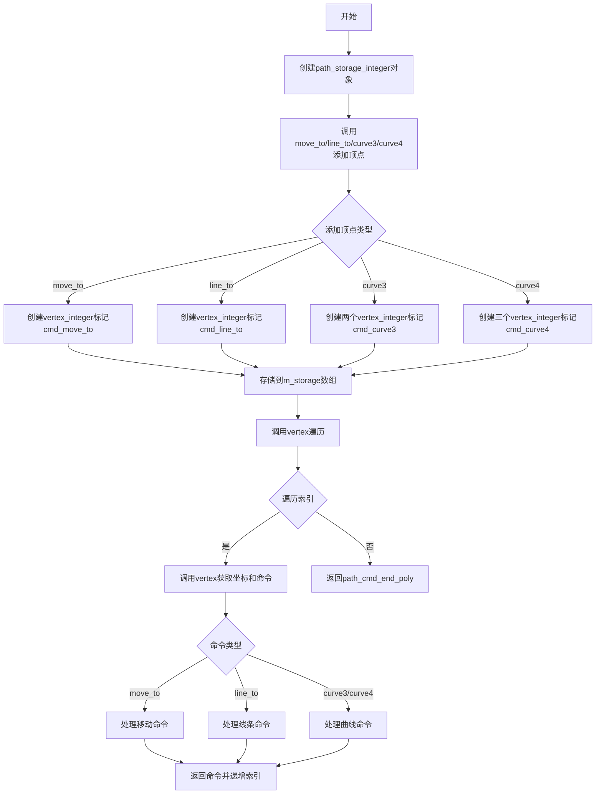

## 类结构

```
vertex_integer<T, CoordShift> (模板结构体)
├── 枚举: path_cmd (cmd_move_to, cmd_line_to, cmd_curve3, cmd_curve4)
├── 枚举: coord_scale_e (coord_shift, coord_scale)
└── 字段: x, y (T类型)
path_storage_integer<T, CoordShift> (模板类)
├── 字段: m_storage (pod_bvector存储顶点)
├── 字段: m_vertex_idx (遍历索引)
├── 字段: m_closed (闭合标志)
└── 方法: move_to, line_to, curve3, curve4, close_polygon, vertex, serialize, rewind, bounding_rect
serialized_integer_path_adaptor<T, CoordShift> (模板类)
├── 字段: m_data, m_end, m_ptr (序列化数据指针)
├── 字段: m_dx, m_dy, m_scale (变换参数)
├── 字段: m_vertices (顶点计数)
└── 方法: init, rewind, vertex
```

## 全局变量及字段


### `vertex_integer<T, CoordShift>.vertex_integer<T, CoordShift>`
    
存储编码后的顶点坐标和路径命令的模板结构体

类型：`struct template`
    


### `vertex_integer<T, CoordShift>.x`
    
存储编码后的x坐标

类型：`T`
    


### `vertex_integer<T, CoordShift>.y`
    
存储编码后的y坐标

类型：`T`
    


### `vertex_integer<T, CoordShift>.path_cmd`
    
路径命令枚举：cmd_move_to=0, cmd_line_to=1, cmd_curve3=2, cmd_curve4=3

类型：`enum`
    


### `vertex_integer<T, CoordShift>.coord_scale_e`
    
坐标缩放枚举：coord_shift坐标移位数, coord_scale缩放因子

类型：`enum`
    


### `path_storage_integer<T, CoordShift>.path_storage_integer<T, CoordShift>`
    
整数坐标路径存储的模板类，用于存储和遍历路径顶点

类型：`class template`
    


### `path_storage_integer<T, CoordShift>.m_storage`
    
存储顶点的数组

类型：`pod_bvector<vertex_integer_type, 6>`
    


### `path_storage_integer<T, CoordShift>.m_vertex_idx`
    
当前遍历位置索引

类型：`unsigned`
    


### `path_storage_integer<T, CoordShift>.m_closed`
    
路径闭合状态标志

类型：`bool`
    


### `serialized_integer_path_adaptor<T, CoordShift>.serialized_integer_path_adaptor<T, CoordShift>`
    
序列化整数路径适配器，用于从序列化数据中读取路径顶点

类型：`class template`
    


### `serialized_integer_path_adaptor<T, CoordShift>.m_data`
    
序列化数据起始指针

类型：`const int8u*`
    


### `serialized_integer_path_adaptor<T, CoordShift>.m_end`
    
序列化数据结束指针

类型：`const int8u*`
    


### `serialized_integer_path_adaptor<T, CoordShift>.m_ptr`
    
当前读取位置指针

类型：`const int8u*`
    


### `serialized_integer_path_adaptor<T, CoordShift>.m_dx`
    
x方向平移量

类型：`double`
    


### `serialized_integer_path_adaptor<T, CoordShift>.m_dy`
    
y方向平移量

类型：`double`
    


### `serialized_integer_path_adaptor<T, CoordShift>.m_scale`
    
缩放因子

类型：`double`
    


### `serialized_integer_path_adaptor<T, CoordShift>.m_vertices`
    
已遍历顶点数

类型：`unsigned`
    
    

## 全局函数及方法


### `memcpy`

`memcpy` 是 C/C++ 标准库函数，用于从源内存地址复制指定字节数的连续数据到目标内存地址。在此代码中用于将顶点数据序列化到字节数组，或从字节数组反序列化恢复顶点数据对象。

参数：

- `dest`：`void*`，目标内存地址，指向数据复制到的位置
- `src`：`const void*`，源内存地址，指向要复制的数据起始位置
- `n`：`size_t`，要复制的字节数

返回值：`void*`，返回目标内存地址（dest）

#### 流程图

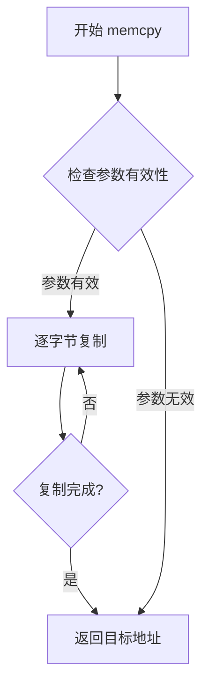

#### 带注释源码

```cpp
// 使用位置1: path_storage_integer::serialize 方法中
void serialize(int8u* ptr) const
{
    unsigned i;
    for(i = 0; i < m_storage.size(); i++)
    {
        // 将顶点数据从 m_storage[i] 复制到 ptr 指向的内存位置
        // 复制大小为 sizeof(vertex_integer_type) 字节
        // 这是序列化过程：将内存中的顶点对象转换为字节流
        memcpy(ptr, &m_storage[i], sizeof(vertex_integer_type));
        ptr += sizeof(vertex_integer_type);
    }
}

// 使用位置2: serialized_integer_path_adaptor::vertex 方法中
unsigned vertex(double* x, double* y)
{
    // ...
    vertex_integer_type v;
    
    // 从 m_ptr 指向的字节流中复制 sizeof(vertex_integer_type) 字节
    // 到 v 对象中，这是反序列化过程：将字节流转换回顶点对象
    memcpy(&v, m_ptr, sizeof(vertex_integer_type));
    
    unsigned cmd = v.vertex(x, y, m_dx, m_dy, m_scale);
    // ...
}
```


### `vertex_integer<T, CoordShift>.vertex_integer()` - 默认构造函数

一个简单的默认构造函数，不执行任何操作，用于创建 vertex_integer 对象。

参数：无

返回值：无（构造函数）

#### 流程图

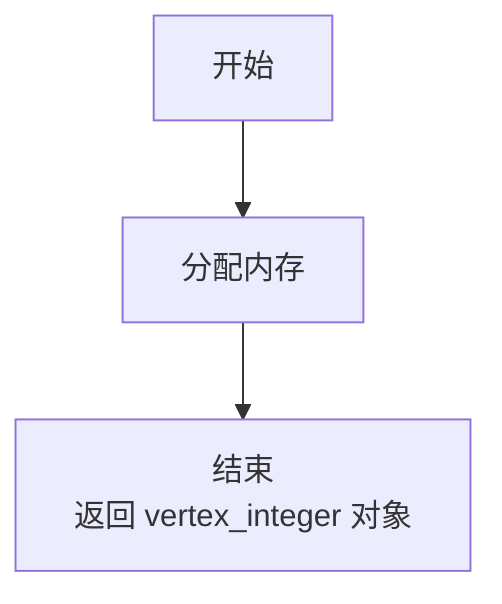

#### 带注释源码

```cpp
template<class T, unsigned CoordShift=6> struct vertex_integer
{
    // ... 其他成员 ...

    T x, y;  // 存储坐标值，低位用于存储命令标志

    // 默认构造函数
    // 不进行任何初始化操作，x 和 y 的值将是未定义的（取决于 T 类型）
    vertex_integer() {}

    // 参数化构造函数
    // x_: X 坐标
    // y_: Y 坐标
    // flag: 命令标志（0=move_to, 1=line_to, 2=curve3, 3=curve4）
    vertex_integer(T x_, T y_, unsigned flag) :
        x(((x_ << 1) & ~1) | (flag & 1)),
        y(((y_ << 1) & ~1) | (flag >> 1)) {}

    // ... 其他成员 ...
};
```


### `vertex_integer<T, CoordShift>.vertex_integer`

这是一个带参数的构造函数，用于将坐标值和命令标志编码到内部存储的x、y成员变量中。该构造函数通过位操作将命令标志（move_to、line_to、curve3、curve4）编码到坐标值的最低位，以便在有限的空间内同时存储坐标和路径命令信息。

参数：

- `x_`：`T`，原始的X坐标值
- `y_`：`T`，原始的Y坐标值
- `flag`：`unsigned`，命令标志，用于指定路径命令类型（cmd_move_to=0, cmd_line_to=1, cmd_curve3=2, cmd_curve4=3）

返回值：无（构造函数）

#### 流程图

```mermaid
flowchart TD
    A[开始执行 vertex_integer 构造函数] --> B[接收参数 x_, y_, flag]
    B --> C[计算x坐标编码: x = ((x_ << 1) & ~1) | (flag & 1)]
    C --> D[计算y坐标编码: y = ((y_ << 1) & ~1) | (flag >> 1)]
    D --> E[将编码后的坐标存储到成员变量x和y]
    E --> F[构造函数结束]
    
    style A fill:#f9f,stroke:#333
    style F fill:#9f9,stroke:#333
```

#### 带注释源码

```cpp
// 带参数构造函数
// 参数说明：
//   x_: T类型，原始X坐标
//   y_: T类型，原始Y坐标
//   flag: unsigned类型，命令标志（低2位编码命令类型）
// 功能说明：
//   将坐标值左移1位以腾出最低位，然后通过位操作将命令标志编码到x和y的最低位
//   x的最低位存储 flag的第0位 (flag & 1)
//   y的最低位存储 flag的第1位 (flag >> 1)
//   这样可以通过 (x & 1) 和 (y & 1) 的组合来恢复命令类型
vertex_integer(T x_, T y_, unsigned flag) :
    // 对x_左移1位，低位清零（& ~1），然后或上flag的最低位
    // 相当于 x = (x_ << 1) | (flag & 1)
    x(((x_ << 1) & ~1) | (flag &  1)),
    // 对y_左移1位，低位清零，然后或上flag的第1位
    // 相当于 y = (y_ << 1) | ((flag >> 1) & 1)
    y(((y_ << 1) & ~1) | (flag >> 1)) {}
```


### `vertex_integer<T, CoordShift>.vertex`

该方法负责解码并返回顶点坐标和对应的路径命令。它从内部存储的整数坐标中提取实际的坐标值，并结合提供的平移量(dx, dy)和缩放因子(scale)进行坐标变换，同时从坐标的低位bits中解析出关联的路径绘制命令。

参数：

- `x_`：`double*`，输出参数，用于接收解码后的X坐标（经过平移和缩放变换）
- `y_`：`double*`，输出参数，用于接收解码后的Y坐标（经过平移和缩放变换）
- `dx`：`double`，可选参数，X轴平移量，默认为0
- `dy`：`double`，可选参数，Y轴平移量，默认为0
- `scale`：`double`，可选参数，坐标缩放因子，默认为1.0

返回值：`unsigned`，返回当前顶点对应的路径命令类型（`path_cmd_move_to`、`path_cmd_line_to`、`path_cmd_curve3`、`path_cmd_curve4` 或 `path_cmd_stop`）

#### 流程图

```mermaid
flowchart TD
    A[开始 vertex] --> B[解码X坐标: x_ = dx + (x>>1)/coord_scale * scale]
    B --> C[解码Y坐标: y_ = dy + (y>>1)/coord_scale * scale]
    C --> D{提取命令标志<br/>((y & 1) << 1) | (x & 1)}
    D -->|0| E[返回 cmd_move_to]
    D -->|1| F[返回 cmd_line_to]
    D -->|2| G[返回 cmd_curve3]
    D -->|3| H[返回 cmd_curve4]
    E --> I[结束]
    F --> I
    G --> I
    H --> I
```

#### 带注释源码

```cpp
//----------------------------------------------------------------------------
// vertex_integer 结构体的 vertex 方法实现
// 用于从整数编码的坐标中解码出实际的浮点坐标，并返回对应的路径命令
//----------------------------------------------------------------------------
unsigned vertex(double* x_, double* y_, 
                double dx=0, double dy=0,
                double scale=1.0) const
{
    // 步骤1: 解码X坐标
    // x >> 1: 移除最低位（命令标志位），获取实际坐标值
    // double(x >> 1): 转换为浮点数
    // / coord_scale: 除以坐标缩放因子（2^CoordShift）还原原始精度
    // * scale: 应用用户提供的缩放因子
    // + dx: 加上X轴平移量
    *x_ = dx + (double(x >> 1) / coord_scale) * scale;

    // 步骤2: 解码Y坐标（与X坐标相同的处理流程）
    *y_ = dy + (double(y >> 1) / coord_scale) * scale;

    // 步骤3: 从坐标的低位bits中提取内嵌的命令标志
    // y & 1: 取Y坐标最低位（bit 0）
    // (y & 1) << 1: 将Y的最低位移到bit 1位置
    // x & 1: 取X坐标最低位（bit 0）
    // | : 组合成2位的命令标志 (00=move_to, 01=line_to, 10=curve3, 11=curve4)
    switch(((y & 1) << 1) | (x & 1))
    {
        // 根据标志位返回对应的路径命令
        case cmd_move_to: return path_cmd_move_to;  // 命令0: 移动到
        case cmd_line_to: return path_cmd_line_to;  // 命令1: 直线到
        case cmd_curve3:  return path_cmd_curve3;    // 命令2: 3次贝塞尔曲线
        case cmd_curve4:  return path_cmd_curve4;    // 命令3: 4次贝塞尔曲线
    }
    
    // 默认情况返回停止命令
    return path_cmd_stop;
}
```


### `path_storage_integer<T, CoordShift>.path_storage_integer()`

该函数是 `path_storage_integer` 类的默认构造函数，用于初始化路径存储对象的内部状态，将存储数组、顶点索引和闭合标志设置为初始值。

参数：无（默认构造函数）

返回值：`void`，无返回值（构造函数）

#### 流程图

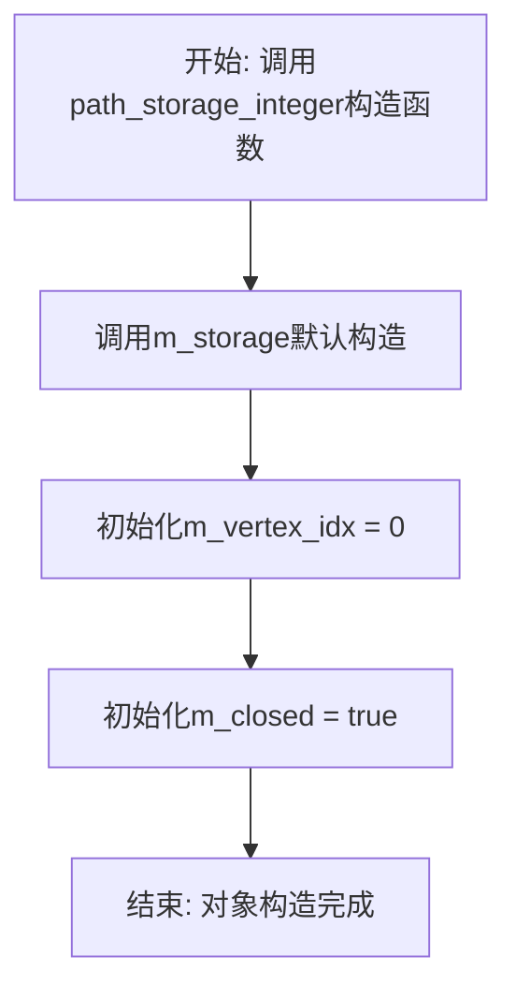

#### 带注释源码

```cpp
//--------------------------------------------------------------------
path_storage_integer() : m_storage(), m_vertex_idx(0), m_closed(true) {}
/*
 * 构造函数说明：
 * - m_storage(): 调用pod_bvector的默认构造函数，初始化顶点存储数组
 * - m_vertex_idx(0): 将顶点索引初始化为0，用于后续遍历顶点
 * - m_closed(true): 将闭合标志设置为true，表示路径初始为闭合状态
 *
 * 参数：无
 * 返回值：无（构造函数）
 */
```


### `path_storage_integer<T, CoordShift>.remove_all()`

清空 path_storage_integer 中存储的所有顶点数据，将内部存储容器重置为空状态。

参数： 无

返回值：`void`，无返回值描述

#### 流程图

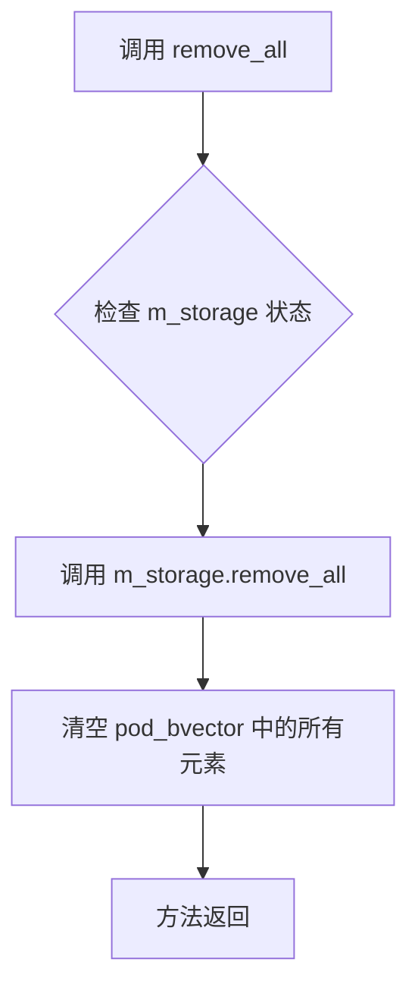

#### 带注释源码

```cpp
//--------------------------------------------------------------------
void remove_all() 
{ 
    // 调用内部存储对象 m_storage 的 remove_all 方法
    // 该操作会清空 pod_bvector 中所有的 vertex_integer_type 元素
    // 并将容器大小重置为 0，但保留已分配的内存空间以备后续使用
    m_storage.remove_all(); 
}
```


### `path_storage_integer<T, CoordShift>::move_to`

将指定的坐标点作为路径的起始点（move_to 命令）添加到内部路径存储中。

参数：
- `x`：`T`，目标点的 X 坐标。
- `y`：`T`，目标点的 Y 坐标。

返回值：`void`，无返回值。

#### 流程图

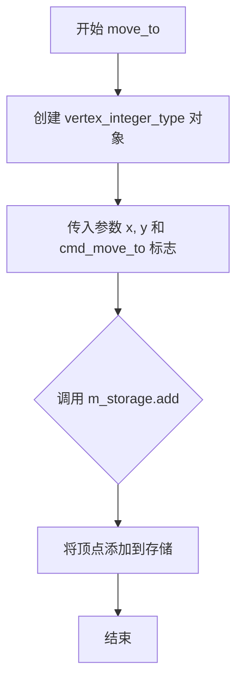

#### 带注释源码

```cpp
//--------------------------------------------------------------------
void move_to(T x, T y)
{
    // 创建一个 vertex_integer_type 对象，
    // 其中 x, y 是坐标，vertex_integer_type::cmd_move_to 表示这是一个 'move_to' 命令
    // 然后将该顶点添加到内部存储 m_storage 中
    m_storage.add(vertex_integer_type(x, y, vertex_integer_type::cmd_move_to));
}
```


### `path_storage_integer<T, CoordShift>.line_to`

将一条直线段的目标点（端点）作为路径顶点添加到内部存储中，使用 `cmd_line_to` 命令标记该顶点类型。

参数：

- `x`：`T`，目标点的 X 坐标（整数类型）
- `y`：`T`，目标点的 Y 坐标（整数类型）

返回值：`void`，无返回值

#### 流程图

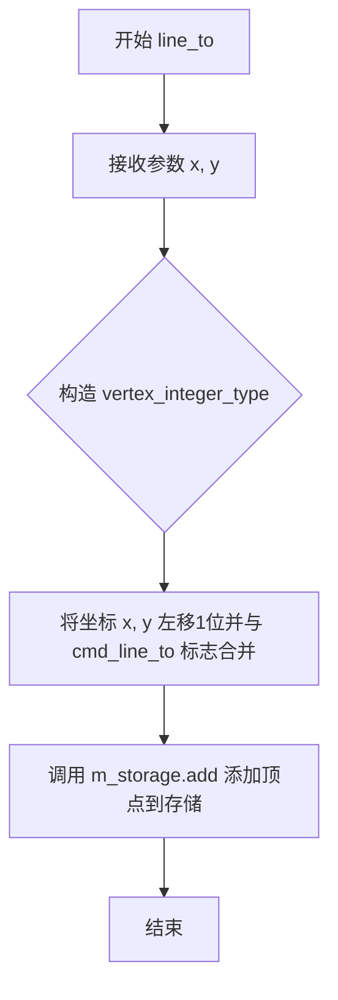

#### 带注释源码

```cpp
//--------------------------------------------------------------------
void line_to(T x, T y)
{
    // 创建一个 vertex_integer_type 对象
    // 参数 x, y 为传入的坐标
    // 第三个参数为命令标志 cmd_line_to = 1，表示这是一个 line_to 顶点
    // 内部会将坐标编码：将 x, y 左移1位后，低位用于存储命令标志
    // 然后调用成员容器 m_storage 的 add 方法将顶点添加到存储中
    m_storage.add(vertex_integer_type(x, y, vertex_integer_type::cmd_line_to));
}
```


### `path_storage_integer<T, CoordShift>.curve3`

该方法用于向路径存储中添加二次贝塞尔曲线（Quadratic Bezier Curve）的控制点和终点，将两个顶点依次压入内部存储队列，支持整数坐标的精确路径表示。

参数：

- `x_ctrl`：`T`，二次贝塞尔曲线的控制点 X 坐标
- `y_ctrl`：`T`，二次贝塞尔曲线的控制点 Y 坐标
- `x_to`：`T`，二次贝塞尔曲线的终点 X 坐标
- `y_to`：`T`，二次贝塞尔曲线的终点 Y 坐标

返回值：`void`，无返回值，通过内部存储 `m_storage` 保存曲线顶点数据

#### 流程图

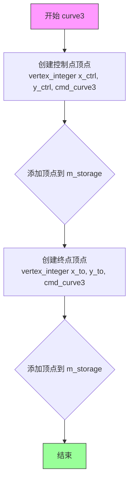

#### 带注释源码

```cpp
//------------------------------------------------------------------------------
// 向路径存储中添加二次贝塞尔曲线（Quadratic Bezier）顶点
// 二次贝塞尔曲线需要1个控制点和1个终点，共2个顶点
//------------------------------------------------------------------------------
void curve3(T x_ctrl,  T y_ctrl,   // 控制点坐标
            T x_to,    T y_to)     // 终点坐标
{
    // 添加控制点顶点，使用 cmd_curve3 标记该顶点为曲线控制点
    // vertex_integer 构造函数会将坐标左移1位并嵌入命令标志位
    // 格式: x = ((x_ << 1) & ~1) | (flag & 1)
    //       y = ((y_ << 1) & ~1) | (flag >> 1)
    m_storage.add(vertex_integer_type(x_ctrl, y_ctrl, vertex_integer_type::cmd_curve3));
    
    // 添加终点顶点，同样使用 cmd_curve3 标记
    // 终点和控制点都使用相同的 cmd_curve3 命令
    // 在后续 vertex() 调用时会根据顶点顺序识别为二次贝塞尔曲线
    m_storage.add(vertex_integer_type(x_to,   y_to,   vertex_integer_type::cmd_curve3));
}
```


### `path_storage_integer<T, CoordShift>.curve4`

该方法用于向路径存储中添加四次贝塞尔曲线的三个顶点（两个控制点和一个终点），将曲线控制点坐标与曲线命令标记封装为 `vertex_integer_type` 对象并存储到内部数组中。

参数：

- `x_ctrl1`：`T`，第一个控制点的 X 坐标
- `y_ctrl1`：`T`，第一个控制点的 Y 坐标
- `x_ctrl2`：`T`，第二个控制点的 X 坐标
- `y_ctrl2`：`T`，第二个控制点的 Y 坐标
- `x_to`：`T`，曲线终点的 X 坐标
- `y_to`：`T`，曲线终点的 Y 坐标

返回值：`void`，无返回值

#### 流程图

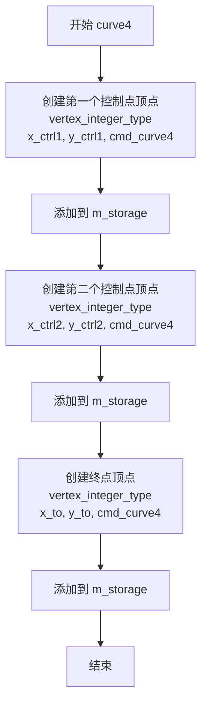

#### 带注释源码

```cpp
//--------------------------------------------------------------------
void curve4(T x_ctrl1, T y_ctrl1, 
            T x_ctrl2, T y_ctrl2, 
            T x_to,    T y_to)
{
    // 添加第一个控制点 (x_ctrl1, y_ctrl1)，标记为 cmd_curve4
    // vertex_integer 构造函数会将坐标左移1位并编码命令标志
    m_storage.add(vertex_integer_type(x_ctrl1, y_ctrl1, vertex_integer_type::cmd_curve4));
    
    // 添加第二个控制点 (x_ctrl2, y_ctrl2)，标记为 cmd_curve4
    m_storage.add(vertex_integer_type(x_ctrl2, y_ctrl2, vertex_integer_type::cmd_curve4));
    
    // 添加曲线终点 (x_to, y_to)，标记为 cmd_curve4
    // 注意：三次曲线需要2个顶点（1个控制点+1个终点），四次曲线需要3个顶点
    m_storage.add(vertex_integer_type(x_to,    y_to,    vertex_integer_type::cmd_curve4));
}
```


### `path_storage_integer<T, CoordShift>.close_polygon()`

关闭多边形的空实现方法，用于接口兼容性占位。该方法在当前实现中不做任何操作，主要为保持与其它路径存储类（如 `path_storage`）的接口一致性。

参数： 无

返回值： `void`，无返回值

#### 流程图

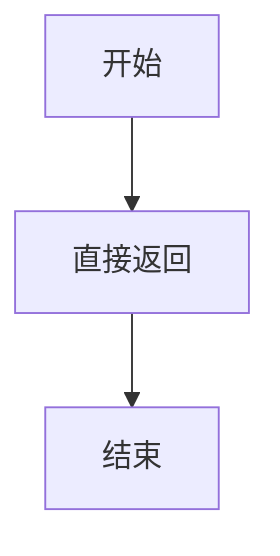

#### 带注释源码

```cpp
//--------------------------------------------------------------------
void close_polygon() {}
//--------------------------------------------------------------------
```


### `path_storage_integer<T, CoordShift>.size() const`

该方法返回路径存储器中存储的顶点数量，用于获取当前路径中的顶点数。

参数：  
无

返回值：`unsigned`，返回存储在 `m_storage` 中的顶点数量（即路径的顶点数）。

#### 流程图

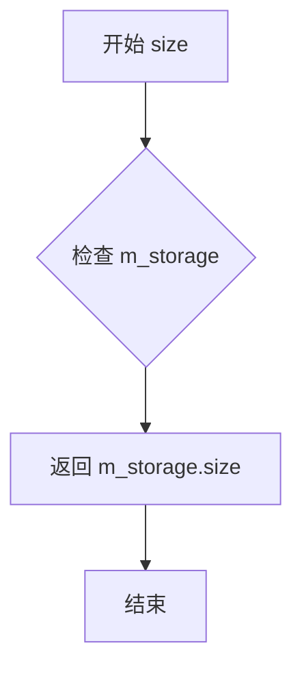

#### 带注释源码

```cpp
// 返回路径存储中顶点的数量
// 该方法是一个const成员函数，保证不会修改对象状态
// 返回值类型为unsigned，表示存储的vertex_integer_type元素的数量
unsigned size() const 
{ 
    // m_storage是pod_bvector类型的成员变量，存储了所有的顶点数据
    // 调用其size()方法获取当前存储的顶点数量
    return m_storage.size(); 
}
```


### `path_storage_integer<T, CoordShift>.vertex`

获取指定索引的顶点坐标和路径命令。该方法从内部存储中检索指定索引的顶点数据，通过调用 `vertex_integer` 类的 `vertex` 方法将整数坐标转换为浮点数坐标，并返回相应的路径命令类型。

参数：

- `idx`：`unsigned`，要检索的顶点索引
- `x`：`double*`，输出参数，用于存储检索到的顶点的x坐标
- `y`：`double*`，输出参数，用于存储检索到的顶点的y坐标

返回值：`unsigned`，返回顶点对应的路径命令类型（如 `path_cmd_move_to`、`path_cmd_line_to`、`path_cmd_curve3`、`path_cmd_curve4` 或 `path_cmd_stop`）

#### 流程图

```mermaid
flowchart TD
    A[开始 vertex] --> B{验证索引有效性}
    B -->|索引有效| C[调用 m_storage[idx].vertex]
    C --> D[vertex_integer.vertex 执行坐标转换]
    D --> E[提取坐标和命令标志位]
    E --> F{根据标志位确定命令类型}
    F -->|cmd_move_to| G[返回 path_cmd_move_to]
    F -->|cmd_line_to| H[返回 path_cmd_line_to]
    F -->|cmd_curve3| I[返回 path_cmd_curve3]
    F -->|cmd_curve4| J[返回 path_cmd_curve4]
    F -->|其他情况| K[返回 path_cmd_stop]
    G --> L[结束]
    H --> L
    I --> L
    J --> L
    K --> L
```

#### 带注释源码

```cpp
//----------------------------------------------------------------------------
// 获取指定索引的顶点坐标和路径命令
//----------------------------------------------------------------------------
unsigned vertex(unsigned idx, double* x, double* y) const
{
    //---------------------------------------------------
    // 参数说明：
    //   idx - 要检索的顶点索引（从0开始）
    //   x   - 输出参数，返回顶点的x坐标（浮点数）
    //   y   - 输出参数，返回顶点的y坐标（浮点数）
    //返回值：
    //   返回顶点类型命令：
    //     path_cmd_move_to = 1  表示移动到点
    //     path_cmd_line_to = 2  表示画线到点
    //     path_cmd_curve3  = 3  表示三次贝塞尔曲线
    //     path_cmd_curve4  = 4  表示四次贝塞尔曲线
    //     path_cmd_stop    = 0  表示停止/无效
    //---------------------------------------------------
    
    // 直接调用内部存储数组中指定索引的 vertex_integer 对象的 vertex 方法
    // 该方法会：
    //   1. 将整数坐标 (x >> 1) 右移1位去除标志位
    //   2. 除以 coord_scale (1 << CoordShift) 进行缩放
    //   3. 根据坐标的低2位确定路径命令类型
    //   4. 将转换后的浮点坐标写入 x 和 y 参数
    return m_storage[idx].vertex(x, y);
}
```


### `path_storage_integer<T, CoordShift>.byte_size()`

该方法是一个const成员函数，用于计算path_storage_integer对象序列化所需的字节大小，通过将内部存储的顶点数量乘以单个顶点类型的字节数来实现。

参数：

- （无参数）

返回值：`unsigned`，返回将当前路径存储序列化为字节数组所需的字节数。

#### 流程图

```mermaid
flowchart TD
    A[开始 byte_size] --> B[获取 m_storage 元素个数]
    B --> C[获取 vertex_integer_type 类型大小]
    C --> D[计算: size * sizeof(vertex_integer_type)]
    D --> E[返回计算的字节数]
```

#### 带注释源码

```cpp
//----------------------------------------------------------------------------
// 计算序列化字节大小
// 返回路径存储对象序列化所需的字节数
//----------------------------------------------------------------------------
unsigned byte_size() const 
{ 
    // m_storage.size() - 获取存储的顶点数量
    // sizeof(vertex_integer_type) - 获取单个顶点的字节大小
    // 两者相乘得到总字节大小
    return m_storage.size() * sizeof(vertex_integer_type); 
}
```

#### 补充说明

| 项目 | 说明 |
|------|------|
| **所属类** | `path_storage_integer<T, CoordShift>` |
| **访问权限** | public const 成员函数 |
| **计算逻辑** | 顶点数量 × 单个顶点类型大小 |
| **序列化对应** | 与 `serialize()` 方法配合使用 |
| **性能特点** | O(1) 时间复杂度，仅一次乘法运算 |


### `path_storage_integer<T, CoordShift>.serialize`

该方法将路径存储对象中所有顶点数据（vertex_integer类型）以二进制方式复制到指定的内存缓冲区中，实现路径数据的序列化输出。

参数：

- `ptr`：`int8u*`，指向目标内存缓冲区的指针，用于存储序列化后的顶点数据

返回值：`void`，无返回值

#### 流程图

```mermaid
flowchart TD
    A[开始 serialize] --> B{遍历索引 i < m_storage.size}
    B -->|是| C[获取当前顶点 m_storage[i]
    C --> D[memcpy 复制顶点数据到 ptr]
    D --> E[ptr 指针偏移 sizeof vertex_integer_type]
    E --> F[i++]
    F --> B
    B -->|否| G[结束 serialize]
```

#### 带注释源码

```cpp
//--------------------------------------------------------------------
void serialize(int8u* ptr) const
{
    // 声明循环计数器
    unsigned i;
    
    // 遍历路径存储中的所有顶点
    for(i = 0; i < m_storage.size(); i++)
    {
        // 使用 memcpy 将第 i 个顶点的二进制数据复制到目标缓冲区
        // vertex_integer_type 包含坐标和命令标志信息
        memcpy(ptr, &m_storage[i], sizeof(vertex_integer_type));
        
        // 将指针向前移动，为下一个顶点数据腾出空间
        // 每个 vertex_integer_type 占用的字节数由 sizeof 确定
        ptr += sizeof(vertex_integer_type);
    }
}
```


### `path_storage_integer<T, CoordShift>.rewind`

重置路径遍历索引和闭合状态的方法，用于将路径顶点遍历位置重置为起始点，并标记路径为未闭合状态，以便重新开始遍历路径顶点。

参数：

-  `{参数}`：`unsigned`，预留参数，当前实现中未使用，仅为保持API一致性

返回值：`void`，无返回值

#### 流程图

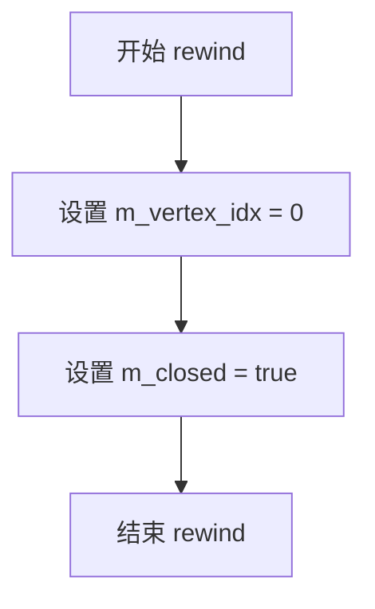

#### 带注释源码

```cpp
//--------------------------------------------------------------------
void rewind(unsigned) 
{ 
    // 将顶点索引重置为0，从路径的第一个顶点开始遍历
    m_vertex_idx = 0; 
    
    // 将闭合标志设置为true，表示路径初始状态为已闭合
    // 后续通过vertex()方法遍历时会被设置为false
    m_closed = true;
}
```


### `path_storage_integer<T, CoordShift>.vertex(double* x, double* y)`

该方法是`path_storage_integer`类的核心遍历方法，用于按顺序获取路径中的下一个顶点。它通过内部索引`m_vertex_idx`遍历存储的顶点数组，并根据当前顶点的编码命令返回相应的路径指令，同时处理多边形的闭合逻辑。

参数：

- `x`：`double*`，指向用于输出顶点x坐标的double型指针
- `y`：`double*`，指向用于输出顶点y坐标的double型指针

返回值：`unsigned`，返回路径命令类型，包括`path_cmd_move_to`、`path_cmd_line_to`、`path_cmd_curve3`、`path_cmd_curve4`、`path_cmd_stop`或`path_cmd_end_poly | path_flags_close`

#### 流程图

```mermaid
flowchart TD
    A[开始 vertex] --> B{存储大小<2 或<br/>索引>存储大小?}
    B -->|是| C[设置x=0, y=0]
    C --> D[返回 path_cmd_stop]
    B -->|否| E{索引 == 存储大小?}
    E -->|是| F[设置x=0, y=0]
    F --> G[索引++]
    G --> H[返回 path_cmd_end_poly<br/>| path_flags_close]
    E -->|否| I[获取当前顶点命令]
    I --> J{是move_to且<br/>未闭合?}
    J -->|是| K[设置x=0, y=0]
    K --> L[标记为已闭合]
    L --> M[返回 path_cmd_end_poly<br/>| path_flags_close]
    J -->|否| N[标记为未闭合]
    N --> O[索引++]
    O --> P[返回命令]
```

#### 带注释源码

```cpp
//----------------------------------------------------------------------------
// 方法: path_storage_integer<T, CoordShift>::vertex
// 功能: 遍历获取下一个顶点，返回对应的路径命令
// 参数:
//   x - double*，输出参数，用于存储顶点的x坐标
//   y - double*，输出参数，用于存储顶点的y坐标
// 返回: unsigned，路径命令类型
//----------------------------------------------------------------------------
unsigned vertex(double* x, double* y)
{
    // 检查存储是否有足够的顶点，以及索引是否越界
    // 如果存储为空或索引超出范围，返回停止命令
    if(m_storage.size() < 2 || m_vertex_idx > m_storage.size()) 
    {
        *x = 0;
        *y = 0;
        return path_cmd_stop;
    }
    
    // 如果已经遍历完所有顶点
    // 返回结束多边形命令并带有关闭标志
    if(m_vertex_idx == m_storage.size())
    {
        *x = 0;
        *y = 0;
        ++m_vertex_idx;  // 增加索引防止重复调用
        return path_cmd_end_poly | path_flags_close;
    }
    
    // 获取当前索引处的顶点命令
    // vertex_integer结构体中编码了命令信息（低2位）
    unsigned cmd = m_storage[m_vertex_idx].vertex(x, y);
    
    // 如果是move_to命令且多边形未闭合
    // 意味着需要在这里关闭前一个多边形
    if(is_move_to(cmd) && !m_closed)
    {
        *x = 0;
        *y = 0;
        m_closed = true;  // 标记为已闭合状态
        return path_cmd_end_poly | path_flags_close;
    }
    
    // 标记为未闭合（正在遍历中）
    m_closed = false;
    
    // 移动到下一个顶点
    ++m_vertex_idx;
    
    // 返回当前顶点的命令类型
    return cmd;
}
```


### `path_storage_integer<T, CoordShift>.bounding_rect() const`

该方法计算并返回路径存储中所有顶点的边界矩形，通过遍历内部存储的所有顶点坐标，找出x和y坐标的最小值和最大值组成矩形区域。

参数：该方法无参数（const成员函数）

返回值：`rect_d`，返回包含路径所有顶点坐标的边界矩形（x1, y1为最小坐标，x2, y2为最大坐标）

#### 流程图

```mermaid
flowchart TD
    A[开始 bounding_rect] --> B{检查 m_storage.size == 0?}
    B -->|是| C[设置 bounds 为 (0,0,0,0)]
    B -->|否| D[初始化 bounds 为极大值/极小值]
    D --> E[初始化 i = 0]
    E --> F{i < m_storage.size?}
    F -->|是| G[获取当前顶点坐标 x, y]
    G --> H{更新 bounds.x1}
    H -->|x < bounds.x1| I[bounds.x1 = x]
    H -->|x >= bounds.x1| J{更新 bounds.y1}
    J -->|y < bounds.y1| K[bounds.y1 = y]
    J -->|y >= bounds.y1| L{更新 bounds.x2}
    L -->|x > bounds.x2| M[bounds.x2 = x]
    L -->|x <= bounds.x2| N{更新 bounds.y2}
    N -->|y > bounds.y2| O[bounds.y2 = y]
    N -->|y <= bounds.y2| P[i++]
    O --> P
    P --> F
    F -->|否| Q[返回 bounds]
    C --> Q
```

#### 带注释源码

```cpp
//-----------------------------------------------------------------------------
// 计算路径的边界矩形
//-----------------------------------------------------------------------------
rect_d bounding_rect() const
{
    // 初始化边界矩形为极端值
    // x1, y1 设为很大的正数 (1e100)
    // x2, y2 设为很大的负数 (-1e100)
    rect_d bounds(1e100, 1e100, -1e100, -1e100);
    
    // 检查路径存储是否为空
    if(m_storage.size() == 0)
    {
        // 空路径时返回零矩形
        bounds.x1 = bounds.y1 = bounds.x2 = bounds.y2 = 0.0;
    }
    else
    {
        unsigned i;
        // 遍历所有顶点，找出最小和最大坐标
        for(i = 0; i < m_storage.size(); i++)
        {
            double x, y;
            // 获取当前顶点的实际坐标（反序列化）
            m_storage[i].vertex(&x, &y);
            
            // 更新最小x坐标
            if(x < bounds.x1) bounds.x1 = x;
            
            // 更新最小y坐标
            if(y < bounds.y1) bounds.y1 = y;
            
            // 更新最大x坐标
            if(x > bounds.x2) bounds.x2 = x;
            
            // 更新最大y坐标
            if(y > bounds.y2) bounds.y2 = y;
        }
    }
    
    // 返回计算得到的边界矩形
    return bounds;
}
```


### `serialized_integer_path_adaptor<T, CoordShift>.serialized_integer_path_adaptor() - 默认构造函数`

该默认构造函数用于初始化serialized_integer_path_adaptor对象，将所有成员变量设置为初始状态，使其成为一个无效的路径适配器。

参数：
- （无）

返回值：
- （无返回值，这是构造函数）

#### 流程图

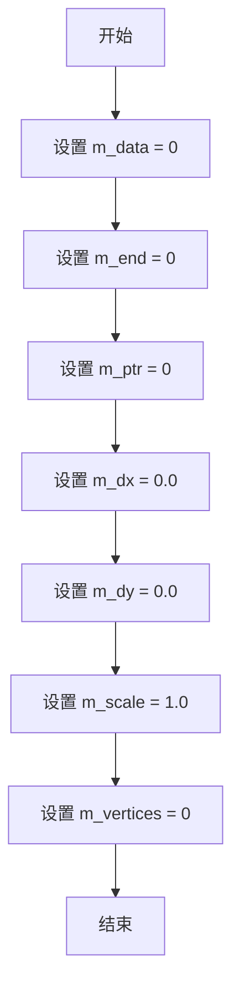

#### 带注释源码

```cpp
//--------------------------------------------------------------------
serialized_integer_path_adaptor() :
    m_data(0),       // 初始化为nullptr，表示没有数据
    m_end(0),        // 初始化为nullptr，表示结束位置无效
    m_ptr(0),        // 初始化为nullptr，表示读取位置无效
    m_dx(0.0),       // 初始化X偏移量为0.0
    m_dy(0.0),       // 初始化Y偏移量为0.0
    m_scale(1.0),    // 初始化缩放因子为1.0（无缩放）
    m_vertices(0)    // 初始化顶点数为0
{}
```


### `serialized_integer_path_adaptor<T, CoordShift>.serialized_integer_path_adaptor(const int8u* data, unsigned size, double dx, double dy)`

该构造函数用于使用给定的序列化整数路径数据、数据大小以及坐标偏移量初始化`serialized_integer_path_adaptor`对象，将内部指针设置为数据起始位置，并重置顶点计数器。

参数：
- `data`：`const int8u*`，指向序列化整数路径数据的指针
- `size`：`unsigned`，数据的大小（字节数）
- `dx`：`double`，X方向的偏移量，用于坐标变换
- `dy`：`double`，Y方向的偏移量，用于坐标变换

返回值：`无`（构造函数不返回值）

#### 流程图

```mermaid
graph TD
    A[开始] --> B[设置 m_data = data]
    B --> C[设置 m_end = data + size]
    C --> D[设置 m_ptr = data]
    D --> E[设置 m_dx = dx]
    E --> F[设置 m_dy = dy]
    F --> G[设置 m_vertices = 0]
    G --> H[结束]
    note: 注意：m_scale 在此构造函数中未初始化，可能保持未定义状态
```

#### 带注释源码

```cpp
//--------------------------------------------------------------------
serialized_integer_path_adaptor(const int8u* data, unsigned size,
                                double dx, double dy) :
    m_data(data),          // 初始化数据指针
    m_end(data + size),    // 初始化结束指针
    m_ptr(data),           // 初始化当前指针
    m_dx(dx),              // 初始化X偏移
    m_dy(dy),              // 初始化Y偏移
    m_vertices(0)          // 初始化顶点计数
{}
// 注意：m_scale 成员变量在此构造函数中未被显式初始化，
// 可能保持默认值或未定义状态，具体取决于编译器行为。
// 如需初始化，应在初始化列表中添加 m_scale(1.0)。
```


### `serialized_integer_path_adaptor<T, CoordShift>.init`

该方法用于初始化序列化整数路径适配器，设置数据指针、结束指针、当前读取位置指针、坐标偏移量和缩放比例，将顶点数计数器重置为零，以便后续可以通过 `vertex` 方法遍历序列化数据中的路径顶点。

参数：

- `data`：`const int8u*`，指向序列化顶点数据的起始指针
- `size`：`unsigned`，序列化数据的总字节数
- `dx`：`double`，X轴方向的偏移量，用于坐标变换
- `dy`：`double`，Y轴方向的偏移量，用于坐标变换
- `scale`：`double`，缩放因子，用于坐标变换，默认为1.0

返回值：`void`，无返回值

#### 流程图

```mermaid
flowchart TD
    A[开始] --> B[设置m_data为data]
    B --> C[设置m_end为data + size]
    C --> D[设置m_ptr为data]
    D --> E[设置m_dx为dx]
    E --> F[设置m_dy为dy]
    F --> G[设置m_scale为scale]
    G --> H[设置m_vertices为0]
    H --> I[结束]
```

#### 带注释源码

```cpp
//--------------------------------------------------------------------
void init(const int8u* data, unsigned size, 
          double dx, double dy, double scale=1.0)
{
    // 设置数据起始指针
    m_data     = data;
    
    // 设置数据结束指针（指向数据末尾的下一个字节）
    m_end      = data + size;
    
    // 设置当前读取指针，指向数据起始位置
    m_ptr      = data;
    
    // 设置X轴偏移量，用于顶点坐标变换
    m_dx       = dx;
    
    // 设置Y轴偏移量，用于顶点坐标变换
    m_dy       = dy;
    
    // 设置缩放因子，用于顶点坐标变换
    m_scale    = scale;
    
    // 重置顶点数计数器为0，开始新的遍历
    m_vertices = 0;
}
```


### `serialized_integer_path_adaptor<T, CoordShift>.rewind(unsigned)`

该方法用于重置序列化整数路径适配器的读取位置，将内部指针重置到数据起始处，并重置顶点计数器，以便重新遍历路径数据。

参数：

-  `{参数}`：`unsigned`，未使用的参数，仅为保持接口一致性而存在

返回值：`void`，无返回值

#### 流程图

```mermaid
flowchart TD
    A[开始 rewind] --> B[m_ptr = m_data]
    B --> C[m_vertices = 0]
    C --> D[结束 rewind]
```

#### 带注释源码

```cpp
//--------------------------------------------------------------------
void rewind(unsigned) 
{ 
    // 将读取指针重置到数据起始位置
    m_ptr      = m_data; 
    
    // 重置顶点计数器为0
    m_vertices = 0;
}
```


### `serialized_integer_path_adaptor<T, CoordShift>.vertex`

该方法是从序列化整数路径适配器的底层数据中顺序读取下一个顶点坐标，根据当前读取位置处理数据边界和路径命令，并返回相应的路径指令（如移动、线段、曲线等），同时支持坐标偏移和缩放。

参数：

- `x`：`double*`，输出参数，用于存储读取的顶点的X坐标（经过偏移和缩放计算）
- `y`：`double*`，输出参数，用于存储读取的顶点的Y坐标（经过偏移和缩放计算）

返回值：`unsigned`，返回路径命令类型（如 `path_cmd_move_to`、`path_cmd_line_to`、`path_cmd_curve3`、`path_cmd_curve4`、`path_cmd_stop` 或 `path_cmd_end_poly | path_flags_close`）

#### 流程图

```mermaid
flowchart TD
    A[开始 vertex] --> B{m_data == 0 或 m_ptr > m_end?}
    B -->|是| C[设置 x=0, y=0, 返回 path_cmd_stop]
    B -->|否| D{m_ptr == m_end?}
    D -->|是| E[设置 x=0, y=0, m_ptr前进, 返回 path_cmd_end_poly | path_flags_close]
    D -->|否| F[从m_ptr读取vertex_integer_type到v]
    F --> G[调用v.vertex获取坐标和命令]
    G --> H{是move_to且m_vertices > 2?}
    H -->|是| I[设置x=0, y=0, m_vertices=0, 返回path_cmd_end_poly | path_flags_close]
    H -->|否| J[m_vertices++, m_ptr前进]
    J --> K[返回命令cmd]
    C --> L[结束]
    E --> L
    I --> L
    K --> L
```

#### 带注释源码

```cpp
// 从序列化数据中读取下一个顶点
// 参数:
//   x: 输出参数，接收读取的顶点的X坐标
//   y: 输出参数，接收读取的顶点的Y坐标
// 返回值: unsigned类型，表示路径命令类型
unsigned vertex(double* x, double* y)
{
    // 检查数据指针是否有效且未超出范围
    // 如果数据为空(m_data==0)或读取位置已超过结束位置(m_ptr>m_end)
    if(m_data == 0 || m_ptr > m_end) 
    {
        // 返回停止命令，并将坐标置零
        *x = 0;
        *y = 0;
        return path_cmd_stop;
    }

    // 检查是否已到达数据末尾
    if(m_ptr == m_end)
    {
        // 到达末尾，返回多边形结束并闭合的命令
        *x = 0;
        *y = 0;
        // 注意：这里指针前进sizeof(vertex_integer_type)，虽然已到末尾
        // 但保持与后续读取时的指针步长一致
        m_ptr += sizeof(vertex_integer_type);
        return path_cmd_end_poly | path_flags_close;
    }

    // 从当前指针位置读取一个顶点整数结构
    vertex_integer_type v;
    // 使用memcpy从二进制数据中拷贝顶点数据
    memcpy(&v, m_ptr, sizeof(vertex_integer_type));
    
    // 调用顶点整数的vertex方法，传入偏移和缩放参数
    // 获取实际坐标和对应的路径命令
    unsigned cmd = v.vertex(x, y, m_dx, m_dy, m_scale);
    
    // 判断当前命令是否为move_to且已读取超过2个顶点
    // 如果是，说明需要闭合前一个多边形
    if(is_move_to(cmd) && m_vertices > 2)
    {
        *x = 0;
        *y = 0;
        m_vertices = 0;  // 重置顶点计数，准备开始新的多边形
        return path_cmd_end_poly | path_flags_close;
    }
    
    // 正常情况：顶点计数递增，指针前进到下一个顶点
    ++m_vertices;
    m_ptr += sizeof(vertex_integer_type);
    
    // 返回当前顶点的路径命令
    return cmd;
}
```

## 关键组件


### vertex_integer<T, CoordShift>

用于存储整数顶点坐标的模板结构体，通过位操作将顶点坐标与路径命令标志打包存储，支持坐标缩放和惰性解码。

### path_storage_integer<T, CoordShift>

整数路径存储类，使用 pod_bvector 管理顶点集合，提供 move_to、line_to、curve3、curve4 等路径构建方法，支持序列化与反序列化。

### serialized_integer_path_adaptor<T, CoordShift>

序列化整数路径适配器类，实现惰性加载机制，通过内存块直接读取顶点数据，支持坐标偏移（dx, dy）和缩放（scale）变换。

### m_storage

path_storage_integer 类的成员变量，类型为 pod_bvector<vertex_integer_type, 6>，用于存储所有顶点数据的动态数组。

### m_vertex_idx

path_storage_integer 类的成员变量，类型为 unsigned，记录当前遍历到的顶点索引位置。

### m_closed

path_storage_integer 类的成员变量，类型为 bool，表示当前路径是否已关闭。

### vertex_integer::vertex()

顶点解码方法，将打包的整数坐标和命令标志解码为双精度浮点数坐标，支持坐标偏移和缩放参数。

### path_storage_integer::vertex()

路径顶点遍历方法，按索引顺序返回顶点，支持路径自动闭合和端点处理。

### serialized_integer_path_adaptor::vertex()

序列化适配器的顶点读取方法，从内存块中惰性加载顶点数据，支持流式解码和路径自动闭合检测。

### rect_d bounding_rect()

计算路径的外接矩形边界，用于视口裁剪和边界检测。


## 问题及建议


### 已知问题

- **空的 close_polygon() 方法**：close_polygon() 方法实现为空，调用该方法不会产生任何效果，可能导致多边形无法正确闭合
- **硬编码的边界值**：bounding_rect() 使用硬编码的 1e100 和 -1e100 作为初始边界值，可能导致浮点溢出或精度问题
- **memcpy 的安全性问题**：serialize() 和 vertex() 方法中直接使用 memcpy 复制 vertex_integer_type 对象，存在潜在的对齐问题和类型惩罚（type punning）问题
- **vertex() 方法的错误处理不一致**：path_storage_integer::vertex() 和 serialized_integer_path_adaptor::vertex() 在边界情况下的错误处理行为不完全一致
- **缺少参数验证**：move_to、line_to、curve3、curve4 等方法缺少对输入参数的边界检查，可能导致整数溢出
- ** CoordShift 模板参数不可配置**：path_storage_integer 类内部的 vertex_integer 使用固定的 CoordShift，无法在运行时调整坐标精度

### 优化建议

- 实现 close_polygon() 方法或添加断言/异常以提示功能未完成
- 使用 std::numeric_limits<double>::max() 替代硬编码的 1e100，或使用更安全的初始值
- 使用 std::memcpy 的替代方案或添加适当的编译器属性来避免类型惩罚警告
- 统一 vertex() 方法的错误处理逻辑，确保一致的返回值和坐标设置
- 添加输入参数的边界检查，防止整数溢出
- 考虑将 CoordShift 作为构造参数或添加 setter 方法以支持运行时调整

## 其它


### 设计目标与约束

该代码是Anti-Grain Geometry (AGG) 库的一部分，主要设计目标是为图形渲染引擎提供整数坐标路径存储功能。通过使用整数运算替代浮点数运算，在保证足够精度的前提下提升路径数据的存储和序列化效率。坐标通过左移位操作存储整数部分，低位用于存储路径命令标识，实现空间节约。模板参数CoordShift（默认值为6）控制坐标精度，值为6表示除以64进行缩放。T类型参数支持不同整数类型（int、short等），但实际使用中通常为int32或int16。

### 错误处理与异常设计

该代码采用无异常设计模式，所有错误通过返回值进行标识。关键错误处理场景包括：vertex()方法在索引越界时返回path_cmd_stop；bounding_rect()在存储为空时返回零矩形；serialize()方法要求调用者确保目标缓冲区足够大；vertex_integer_type的构造函数对坐标进行截断处理而非报错。代码中不存在try-catch块，所有边界检查均通过条件判断实现，适用于嵌入式或高性能场景。

### 数据流与状态机

path_storage_integer内部维护三个关键状态：m_storage（顶点数据存储）、m_vertex_idx（当前读取位置）、m_closed（多边形闭合标记）。vertex()方法实现了有限状态机：初始状态（idx=0）读取第一个命令；当遇到move_to且之前未闭合时自动插入闭合命令；读取到末尾时返回end_poly|close标志。serialized_integer_path_adaptor类似但更简化，仅需维护m_ptr指针和m_vertices计数器。坐标数据流为：用户调用move_to/line_to/curve3/curve4 → 构造vertex_integer对象 → 添加到pod_bvector存储 → 通过vertex()方法以双精度浮点数输出。

### 外部依赖与接口契约

核心依赖包括：agg_array.h（提供pod_bvector模板类）；string.h（提供memcpy和memset）。该代码与AGG库其他组件的契约如下：vertex()方法返回的path_cmd值必须与agg_basics.h中定义一致；bounding_rect()返回的rect_d类型需与agg_basics.h兼容；serialize()输出格式需与serialized_integer_path_adaptor的输入格式完全匹配。模板参数T必须为整数类型，CoordShift必须为正偶数以确保正确的位运算行为。

### 性能考虑与优化空间

性能特征：添加顶点操作（move_to/line_to等）为O(1)摊销复杂度；序列化操作为O(n)连续内存复制；边界计算为O(n)全量遍历。优化建议：bounding_rect()每次调用均重新计算，可考虑缓存机制或增量更新；serialize()使用逐个memcpy，可改为批量内存复制；m_closed标志在rewind()后重置但实际使用中可能不需要每次都重置。当前实现在坐标压缩时使用位移操作，符合高性能设计原则，但缺少内联提示可能导致编译器生成非最优代码。

### 线程安全性

该代码本身不包含任何线程同步机制。path_storage_integer和serialized_integer_path_adaptor类均为非线程安全类：多个线程同时读取m_storage可能引发数据竞争（尽管pod_bvector的读操作通常安全）；多个线程同时写入（add操作）会直接导致数据损坏。如需在多线程环境使用，调用者必须在外部进行同步，或为每个线程提供独立的实例。AGG库整体采用单线程设计假设，此实现符合该设计哲学。

### 内存管理与资源释放

内存管理完全依赖pod_bvector<T, 6>模板类：构造函数使用默认初始化，m_storage初始为空；remove_all()调用pod_bvector的clear()方法释放所有元素但保留预分配内存；析构函数自动释放所有资源。不存在显式的内存池或自定义分配器。序列化函数serialize()的内存分配由调用者负责，调用者需预先分配size() * sizeof(vertex_integer_type)字节的缓冲区。内存布局采用紧凑的C风格结构体数组，缓存友好度高。

### 精度与数值范围

坐标存储采用定点数格式：实际坐标 = 存储整数 >> 1 / (1 << CoordShift)。当CoordShift=6时，存储值1代表实际坐标1/64。对于32位有符号整数T，最大可表示坐标范围约为±32767 * 64 ≈ ±2097152（2的31次方除以64）。如果需要更大坐标范围，需选择更大的CoordShift值或使用int64作为T。vertex()输出为双精度浮点数，精度损失仅在坐标值极大时明显。bounding_rect()使用1e100作为初始边界值，存在数值溢出风险。

### 兼容性考虑

该代码设计用于C++98标准环境，不依赖C++11及以上特性。无虚函数，无动态多态。模板实现全部放在头文件中，支持显式实例化。坐标存储格式为二进制兼容的struct布局，与AGG库的其他路径存储实现（如path_storage）可通过适配器互相转换。建议在升级编译器或平台时验证pod_bvector的内存布局未发生变化。

### 使用示例与典型用例

典型用法：创建path_storage_integer<int>对象；调用move_to()设置起点；多次调用line_to()或curve3()/curve4()添加路径段；通过rewind()和vertex()遍历所有顶点；使用bounding_rect()获取包围盒；通过serialize()进行二进制序列化或传输。serialized_integer_path_adaptor则用于反向操作：从二进制数据恢复路径并作为渲染源。适用于矢量图形编辑器、游戏引擎路径数据序列化、GIS系统坐标存储等场景。


    