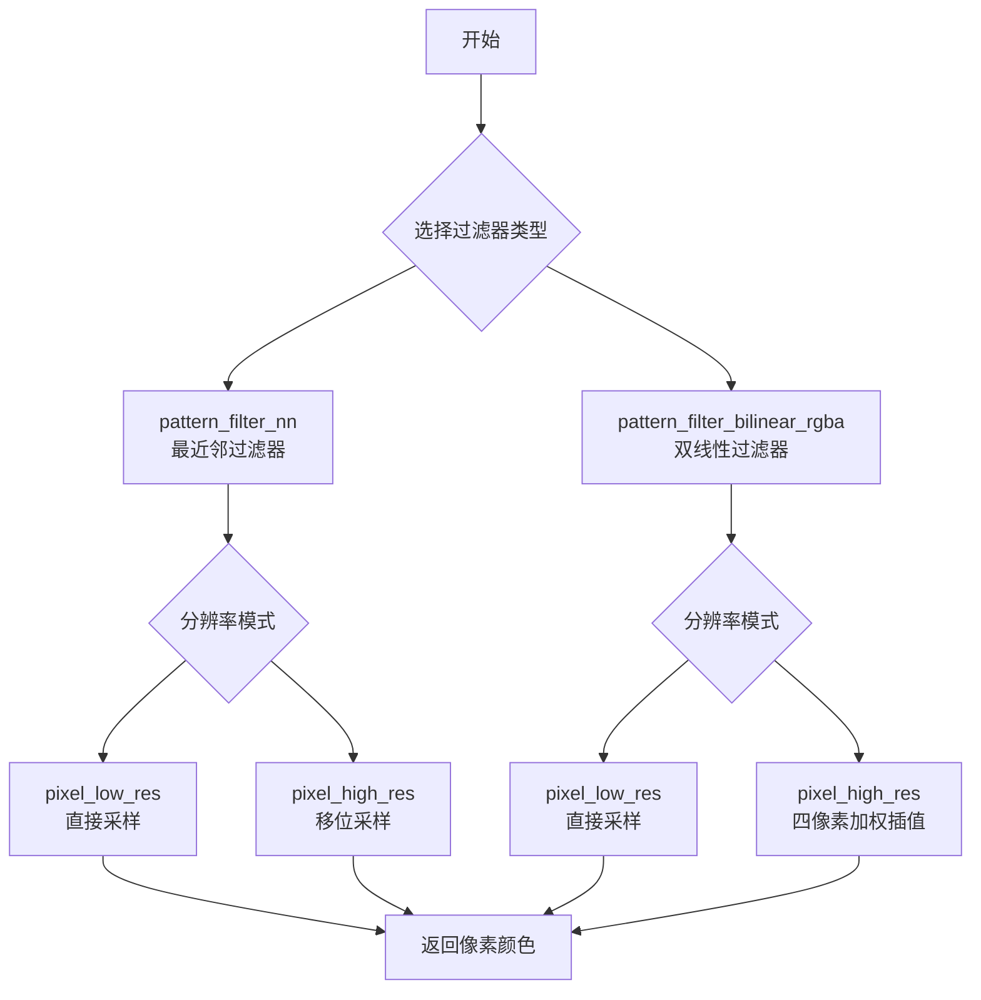
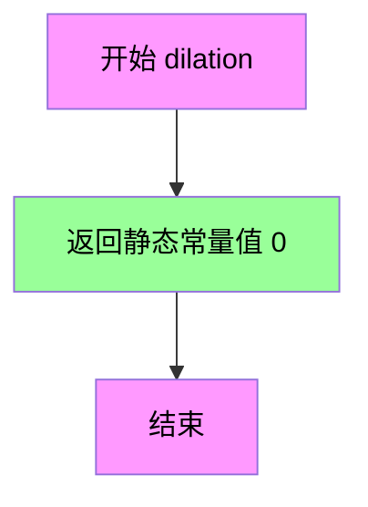
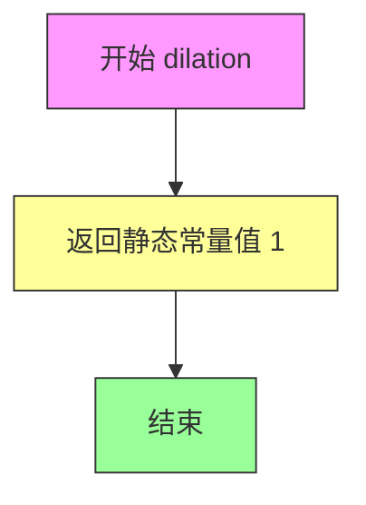

# `matplotlib\extern\agg24-svn\include\agg_pattern_filters_rgba.h` 详细设计文档

Anti-Grain Geometry库中的图像模式过滤器实现，提供最近邻（Nearest Neighbor）和双线性（Bilinear）两种采样算法的模板类，用于在不同分辨率下对RGBA图像进行像素采样和插值。

## 整体流程



## 类结构

```
agg::pattern_filter_nn (模板结构体)
├── pattern_filter_nn_rgba8 (实例)
└── pattern_filter_nn_rgba16 (实例)
agg::pattern_filter_bilinear_rgba (模板结构体)
├── pattern_filter_bilinear_rgba8 (实例)
├── pattern_filter_bilinear_rgba16 (实例)
└── pattern_filter_bilinear_rgba32 (实例)
```

## 全局变量及字段


### `pattern_filter_nn_rgba8`
    
针对rgba8颜色类型的最近邻插值滤波器特化版本

类型：`pattern_filter_nn<rgba8>`
    


### `pattern_filter_nn_rgba16`
    
针对rgba16颜色类型的最近邻插值滤波器特化版本

类型：`pattern_filter_nn<rgba16>`
    


### `pattern_filter_bilinear_rgba8`
    
针对rgba8颜色类型的双线性插值滤波器特化版本

类型：`pattern_filter_bilinear_rgba<rgba8>`
    


### `pattern_filter_bilinear_rgba16`
    
针对rgba16颜色类型的双线性插值滤波器特化版本

类型：`pattern_filter_bilinear_rgba<rgba16>`
    


### `pattern_filter_bilinear_rgba32`
    
针对rgba32颜色类型的双线性插值滤波器特化版本

类型：`pattern_filter_bilinear_rgba<rgba32>`
    


### `line_subpixel_shift`
    
线条子像素坐标的移位量，用于将整数坐标转换为子像素精度

类型：`常量整数`
    


### `line_subpixel_mask`
    
子像素坐标的掩码，用于提取子像素部分

类型：`常量整数`
    


### `line_subpixel_scale`
    
子像素坐标的缩放因子，通常是2的line_subpixel_shift次方

类型：`常量整数`
    


### `pattern_filter_nn.color_type`
    
模板参数ColorT的类型别名，表示所使用的颜色类型

类型：`typedef ColorT color_type`
    


### `pattern_filter_bilinear_rgba.color_type`
    
模板参数ColorT的类型别名，表示所使用的颜色类型

类型：`typedef ColorT color_type`
    


### `pattern_filter_bilinear_rgba.value_type`
    
颜色分量值类型，来自color_type的value_type嵌套类型，用于表示单个颜色通道的类型

类型：`typedef typename color_type::value_type value_type`
    


### `pattern_filter_bilinear_rgba.calc_type`
    
计算类型，来自color_type的calc_type嵌套类型，用于插值计算时避免溢出，通常是比value_type更大的整数类型

类型：`typedef typename color_type::calc_type calc_type`
    
    

## 全局函数及方法


### `pattern_filter_nn.dilation`

这是一个静态成员方法，返回最近邻（Nearest Neighbor）图案过滤器的膨胀值（Dilation）。该方法返回0，表示最近邻过滤不需要进行像素膨胀操作，这是与双线性过滤（dilation=1）的关键区别。

参数：

- （无参数）

返回值：`unsigned`，返回膨胀因子值，当前实现固定返回0，表示该过滤器不需要膨胀。

#### 流程图



#### 带注释源码

```cpp
//=======================================================pattern_filter_nn
// 最近邻图案过滤器模板类
template<class ColorT> struct pattern_filter_nn
{
    // 声明颜色类型别名，由模板参数ColorT指定
    typedef ColorT color_type;
    
    // 静态方法：返回最近邻过滤器的膨胀值
    // 最近邻过滤不做任何插值，因此膨胀值为0
    // 与双线性过滤器（dilation=1）形成对比
    static unsigned dilation() { return 0; }

    // 低分辨率像素读取方法，直接从缓冲区读取单个像素
    static void AGG_INLINE pixel_low_res(color_type const* const* buf, 
                                         color_type* p, int x, int y)
    {
        // 直接赋值，不需要任何插值计算
        *p = buf[y][x];
    }

    // 高分辨率像素读取方法，进行子像素坐标到低分辨率的映射
    static void AGG_INLINE pixel_high_res(color_type const* const* buf, 
                                          color_type* p, int x, int y)
    {
        // 通过右移操作（除以2^line_subpixel_shift）将高分辨率坐标映射到低分辨率
        *p = buf[y >> line_subpixel_shift]
                [x >> line_subpixel_shift];
    }
};
```


### `pattern_filter_nn.pixel_low_res`

该函数是最近邻（Nearest Neighbor）插值滤镜的底层像素采样方法，用于直接从2D颜色缓冲区中读取指定坐标的像素值，不进行任何插值计算，适用于低分辨率图像采样场景。

参数：

-  `buf`：`color_type const* const*`，输入的二维颜色缓冲区指针（常量指针的常量指针，确保缓冲区不被修改）
-  `p`：`color_type*`，输出像素的指针，用于存储读取到的颜色值
-  `x`：`int`，要读取像素的X坐标（列索引）
-  `y`：`int`，要读取像素的Y坐标（行索引）

返回值：`void`，无返回值，结果通过输出参数 `p` 传递

#### 流程图

```mermaid
flowchart TD
    A[开始 pixel_low_res] --> B[输入参数: buf, p, x, y]
    B --> C{参数有效性检查}
    C -->|通过| D[计算缓冲区索引: buf[y][x]]
    D --> E[将颜色值赋值给输出像素: *p = buf[y][x]]
    E --> F[结束函数]
    
    style D fill:#e1f5fe
    style E fill:#e1f5fe
```

#### 带注释源码

```cpp
// 静态成员函数：最近邻插值低分辨率像素采样
// 该函数是pattern_filter_nn模板类的核心方法，实现最简单的最近邻采样
static void AGG_INLINE pixel_low_res(color_type const* const* buf, 
                                     color_type* p, int x, int y)
{
    // 参数说明：
    //   buf    - 指向颜色缓冲区的二维指针，第一维是行（y），第二维是列（x）
    //   p      - 输出参数，指向目标像素位置，用于存储读取的颜色值
    //   x      - 像素的X坐标（列索引，从0开始）
    //   y      - 像素的Y坐标（行索引，从0开始）
    
    // 核心逻辑：直接数组索引，无任何缩放或插值计算
    // 将缓冲区中坐标(y, x)处的颜色值完整复制到输出像素p指向的地址
    // 这种采样方式适用于低分辨率图像，保留了原始像素的最近邻特性
    *p = buf[y][x];
}
```

#### 上下文补充说明

该函数属于 Anti-Grain Geometry (AGG) 图形库中的模式滤镜系统。作为模板类 `pattern_filter_nn` 的静态成员函数，它被设计为可复用于不同的颜色类型（如 rgba8、rgba16）。

**设计特点：**
- **静态方法**：无需实例化即可调用，契合滤镜函数的工具类特性
- **AGG_INLINE 装饰符**：提示编译器进行内联优化，提升高频调用性能
- **零开销抽象**：在编译期绑定颜色类型，无运行时多态开销

**关联方法对比：**
- `pixel_high_res()`：使用位运算（右移）进行坐标缩放，支持高分辨率坐标到低分辨率缓冲区的映射
- `dilation()`：返回膨胀值（该滤镜为0），用于确定采样邻域范围


### `pattern_filter_nn.pixel_high_res`

这是Anti-Grain Geometry库中最近邻（Nearest Neighbor）插值过滤器的高分辨率像素采样方法。该方法接收高分辨率坐标(x, y)，通过右移`line_subpixel_shift`位将其转换为低分辨率缓冲区坐标，然后从二维颜色缓冲区中提取对应的像素值并写入输出指针。

参数：

- `buf`：`color_type const* const*`，指向二维颜色缓冲区的指针的指针，用于存储图案像素数据
- `p`：`color_type*`，输出颜色指针，用于存储采样后的像素值
- `x`：`int`，采样点的x坐标（高分辨率亚像素坐标）
- `y`：`int`，采样点的y坐标（高分辨率亚像素坐标）

返回值：`void`，无返回值，结果通过输出指针参数`p`返回

#### 流程图

```mermaid
flowchart TD
    A[开始 pixel_high_res] --> B[接收参数 buf, p, x, y]
    B --> C{计算低分辨率坐标}
    C --> D[x_lr = x >> line_subpixel_shift]
    D --> E[y_lr = y >> line_subpixel_shift]
    E --> F[从缓冲区读取像素: p = buf[y_lr][x_lr]]
    F --> G[结束]
    
    style A fill:#e1f5fe
    style F fill:#c8e6c9
    style G fill:#ffe0b2
```

#### 带注释源码

```cpp
// pattern_filter_nn 模板结构体的高分辨率像素采样方法
// 这是一个最近邻插值过滤器，用于在高分辨率坐标下采样图案像素
static void AGG_INLINE pixel_high_res(color_type const* const* buf, 
                                      color_type* p, int x, int y)
{
    // 将高分辨率坐标（右移line_subpixel_shift位）转换为低分辨率缓冲区坐标
    // line_subpixel_shift通常是用于亚像素精度的移位量
    // 例如：如果line_subpixel_shift为8，则高分辨率坐标除以256得到低分辨率坐标
    *p = buf[y >> line_subpixel_shift]
            [x >> line_subpixel_shift];
}
```


### `pattern_filter_bilinear_rgba.dilation`

该静态方法用于返回双线性图像滤波器的膨胀系数（dilation），表示该滤波器在处理图像时需要扩展的像素边界宽度。由于双线性插值需要访问邻近像素，其膨胀值为1，表明需要在原像素周围扩展1像素的缓冲区域。

参数： 无

返回值：`unsigned`，返回值为1，表示双线性滤波器需要1像素的膨胀边界。

#### 流程图



#### 带注释源码

```cpp
//===========================================pattern_filter_bilinear_rgba
// 双线性RGBA图像滤波器模板类
template<class ColorT> struct pattern_filter_bilinear_rgba
{
    // 类型定义
    typedef ColorT color_type;                      // 颜色类型
    typedef typename color_type::value_type value_type;    // 颜色分量值类型
    typedef typename color_type::calc_type calc_type;      // 计算用类型（防止溢出）

    //===============================================dilation
    // 功能：获取滤波器的膨胀系数
    // 说明：双线性插值需要访问周围4个像素点，因此需要1像素的边界扩展
    // 返回：unsigned类型的膨胀值，当前固定返回1
    static unsigned dilation() { return 1; }

    // 其它方法...
    // static void AGG_INLINE void pixel_low_res(...)
    // static AGG_INLINE void pixel_high_res(...)
};
```


### `pattern_filter_bilinear_rgba.pixel_low_res`

该静态内联函数是双线性纹理过滤器在低分辨率下的像素读取实现，负责从颜色缓冲区中直接获取指定坐标(x, y)处的像素值，并将其复制到目标像素指针中，适用于不需要进行亚像素插值的场景。

参数：

-  `buf`：`color_type const* const*`，输入颜色缓冲区，表示二维图像像素数组
-  `p`：`color_type*`，输出像素指针，用于存储从缓冲区读取的像素值
-  `x`：`int`，要读取像素的x坐标（列索引）
-  `y`：`int`，要读取像素的y坐标（行索引）

返回值：`void`，无返回值，通过p指针输出像素值

#### 流程图

```mermaid
flowchart TD
    A[开始读取像素] --> B{验证坐标有效性}
    B -->|坐标有效| C[从缓冲区读取像素: buf[y][x]
    C --> D[将像素值复制到输出指针: *p = buf[y][x]
    D --> E[结束]
    B -->|坐标无效| E
```

#### 带注释源码

```cpp
// 静态内联函数：低分辨率像素读取
// 该函数是pattern_filter_bilinear_rgba模板结构体的静态成员方法
// 用于在低分辨率模式下直接从缓冲区读取像素值，不进行插值计算
static AGG_INLINE void pixel_low_res(color_type const* const* buf, 
                                     color_type* p, int x, int y)
{
    // 直接将缓冲区中坐标(y, x)处的像素值复制到输出指针p
    // 这里的操作是最简单的最近邻采样（Nearest Neighbor），
    // 适用于低分辨率或不需要平滑过渡的场景
    // 
    // 参数说明：
    //   buf - 指向颜色缓冲区指针的常量指针（二维数组）
    //   p   - 指向目标像素的指针，用于输出结果
    //   x   - 像素的x坐标（列索引）
    //   y   - 像素的y坐标（行索引）
    // 
    // 注意：此函数假设调用者已经确保坐标在有效范围内
    *p = buf[y][x];
}
```


### `pattern_filter_bilinear_rgba::pixel_high_res`

该函数实现了双线性插值算法，用于在给定的高分辨率（子像素级）坐标下从图像缓冲区中采样颜色值。它通过计算四个最近邻像素的加权平均来得出目标像素的颜色，支持RGBA8、RGBA16和RGBA32等颜色类型，是Anti-Grain Geometry库中图案填充和图像缩放的核心组件。

参数：

- `buf`：`color_type const* const*`，指向二维颜色数组的指针，表示图像缓冲区
- `p`：`color_type*`，指向输出像素颜色的指针，函数计算结果将存储于此
- `x`：`int`，X轴子像素坐标（高精度整数表示）
- `y`：`int`，Y轴子像素坐标（高精度整数表示）

返回值：`void`，无直接返回值，结果通过`p`指针输出

#### 流程图

```mermaid
flowchart TD
    A[开始执行 pixel_high_res] --> B[初始化累加器 r=g=b=a=0]
    B --> C[计算低分辨率坐标: x_lr = x >> shift, y_lr = y >> shift]
    C --> D[计算分数坐标: x & mask, y & mask]
    D --> E[获取第一行像素指针 ptr = buf[y_lr] + x_lr]
    E --> F[计算权重1: (scale-x)*(scale-y), 累加到r,g,b,a]
    F --> G[指针递增, 获取右侧像素]
    G --> H[计算权重2: x*(scale-y), 累加]
    H --> I[切换到第二行: ptr = buf[y_lr+1] + x_lr]
    I --> J[计算权重3: (scale-x)*y, 累加]
    J --> K[指针递增, 获取右下角像素]
    K --> L[计算权重4: x*y, 累加]
    L --> M[右移结果: downshift r,g,b,a]
    M --> N[写入目标像素 p->r, p->g, p->b, p->a]
    N --> O[结束]
```

#### 带注释源码

```cpp
// 高分辨率双线性插值像素采样函数
// 对四个相邻像素进行加权平均计算
static AGG_INLINE void pixel_high_res(color_type const* const* buf, 
                                      color_type* p, int x, int y)
{
    //------------------------------------------ 
    // 步骤1: 初始化颜色分量累加器
    // 用于累积四个像素的加权颜色值
    //------------------------------------------ 
    calc_type r, g, b, a;
    r = g = b = a = 0;

    //------------------------------------------ 
    // 步骤2: 计算低分辨率整数坐标
    // 通过右移将子像素坐标转换为像素坐标
    // line_subpixel_shift 通常为 8 或 16
    //------------------------------------------ 
    calc_type weight;
    int x_lr = x >> line_subpixel_shift;
    int y_lr = y >> line_subpixel_shift;

    //------------------------------------------ 
    // 步骤3: 提取分数部分坐标
    // 通过与掩码按位与获取 subpixel 精度
    //------------------------------------------ 
    x &= line_subpixel_mask;
    y &= line_subpixel_mask;
    
    //------------------------------------------ 
    // 步骤4: 获取左上角像素指针
    // buf[y_lr] 指向第 y_lr 行
    // x_lr 是该行中的列索引
    //------------------------------------------ 
    const color_type* ptr = buf[y_lr] + x_lr;

    //------------------------------------------ 
    // 步骤5: 计算左上像素权重并累加
    // 权重 = (1-fx) * (1-fy)
    //------------------------------------------ 
    weight = (line_subpixel_scale - x) * 
             (line_subpixel_scale - y);
    r += weight * ptr->r;
    g += weight * ptr->g;
    b += weight * ptr->b;
    a += weight * ptr->a;

    //------------------------------------------ 
    // 步骤6: 移动到右上角像素并累加
    // 权重 = fx * (1-fy)
    //------------------------------------------ 
    ++ptr;

    weight = x * (line_subpixel_scale - y);
    r += weight * ptr->r;
    g += weight * ptr->g;
    b += weight * ptr->b;
    a += weight * ptr->a;

    //------------------------------------------ 
    // 步骤7: 移动到左下角像素并累加
    // 权重 = (1-fx) * fy
    //------------------------------------------ 
    ptr = buf[y_lr + 1] + x_lr;

    weight = (line_subpixel_scale - x) * y;
    r += weight * ptr->r;
    g += weight * ptr->g;
    b += weight * ptr->b;
    a += weight * ptr->a;

    //------------------------------------------ 
    // 步骤8: 移动到右下角像素并累加
    // 权重 = fx * fy
    //------------------------------------------ 
    ++ptr;

    weight = x * y;
    r += weight * ptr->r;
    g += weight * ptr->g;
    b += weight * ptr->b;
    a += weight * ptr->a;

    //------------------------------------------ 
    // 步骤9: 右移并写入最终结果
    // 累加器右移 2*subpixel_shift 位得到平均值
    //------------------------------------------ 
    p->r = (value_type)color_type::downshift(r, line_subpixel_shift * 2);
    p->g = (value_type)color_type::downshift(g, line_subpixel_shift * 2);
    p->b = (value_type)color_type::downshift(b, line_subpixel_shift * 2);
    p->a = (value_type)color_type::downshift(a, line_subpixel_shift * 2);
}
```

## 关键组件


### pattern_filter_nn

最近邻（Nearest Neighbor）模式过滤器模板类，提供最基础的像素采样功能，无任何插值计算，适用于需要快速但精度较低的图像缩放场景。

### pattern_filter_bilinear_rgba

双线性插值模式过滤器模板类，通过对四个相邻像素进行加权平均实现平滑的图像缩放，支持亚像素级精度采样，能够有效消除最近邻缩放产生的锯齿效应。

### dilation()

静态方法，返回滤波器的膨胀系数。最近邻滤镜返回0（无需扩展采样区域），双线性滤镜返回1（需要访问周围1像素范围）。

### pixel_low_res

低分辨率像素读取函数，提供最基础的直接像素访问，将输入坐标映射到缓冲区对应位置并返回像素值，无任何插值处理。

### pixel_high_res (pattern_filter_nn)

高分辨率像素读取函数，使用坐标右移操作（除以line_subpixel_scale）实现亚像素到低分辨率缓冲区的映射。

### pixel_high_res (pattern_filter_bilinear_rgba)

双线性插值核心实现函数，通过计算当前像素与四个相邻像素的距离权重，进行加权求和得到最终颜色值，使用downshift实现颜色值的缩放回归。

### 类型别名定义

预定义的模板实例化别名，包括pattern_filter_nn_rgba8、pattern_filter_nn_rgba16、pattern_filter_bilinear_rgba8、pattern_filter_bilinear_rgba16、pattern_filter_bilinear_rgba32，提供常用的8位、16位、32位RGBA颜色格式的滤波器类型。


## 问题及建议


### 已知问题

-   **代码重复**：`pattern_filter_bilinear_rgba` 的 `pixel_low_res` 方法与 `pattern_filter_nn` 的 `pixel_low_res` 实现完全相同，造成代码重复
-   **命名不一致**：`pattern_filter_nn` 没有 `_rgba` 后缀，而 `pattern_filter_bilinear_rgba` 有，两者命名风格不统一
-   **魔法数字**：`line_subpixel_shift * 2` 在 `downshift` 调用中出现，未定义为其含义的常量，语义不明确
-   **外部依赖未声明**：代码依赖 `line_subpixel_shift`、`line_subpixel_scale`、`line_subpixel_mask` 和 `line_subpixel_scale` 等全局常量，但未在头文件中看到这些值的来源，耦合度高
-   **潜在整数溢出**：双线性过滤中 `weight * ptr->r` 等乘法操作使用 `calc_type` 计算，当 `weight` 和颜色值较大时可能发生溢出
-   **精度损失风险**：强制类型转换 `(value_type)` 直接转换 `calc_type` 到 `value_type`，可能导致精度损失

### 优化建议

-   将 `pixel_low_res` 抽取为基类或静态函数，消除重复代码
-   统一命名风格，建议将 `pattern_filter_nn` 改名为 `pattern_filter_nn_rgba` 或为 `pattern_filter_bilinear_rgba` 移除 `_rgba` 后缀
-   定义常量 `pixel_shift_x2 = line_subpixel_shift * 2` 或使用有意义的常量名替代魔法数字
-   在注释或文档中明确说明 `line_subpixel_shift` 等全局变量的来源和预期值范围
-   考虑添加溢出检查或使用更大的中间计算类型（如 32 位累加器）来防止溢出
-   考虑使用 `std::min`/`std::max` 或饱和算术来确保结果在有效范围内
-   对于性能敏感场景，可考虑使用 SIMD 指令集优化双线性插值计算


## 其它


### 设计目标与约束

该代码实现RGBA颜色空间的模式滤波器，提供最近邻插值和双线性插值两种滤波算法，用于图像模式/纹理的像素采样。设计约束包括：模板参数ColorT必须实现r、g、b、a颜色通道和downshift静态方法；依赖line_subpixel_shift和line_subpixel_scale等预定义常量；仅处理整数坐标的低分辨率和高分辨率像素访问。

### 错误处理与异常设计

该代码为模板库，不包含异常抛出逻辑。所有错误通过返回值或断言处理：像素坐标越界未做检查，调用方需确保x、y参数在有效范围内；除零错误不可能发生，因line_subpixel_shift为正整常数；内存访问依赖调用方保证buf指针有效性。

### 数据流与状态机

数据流为：输入buffer（二维颜色指针数组）→坐标计算（位移操作）→权重计算→颜色通道加权求和→downshift移位输出。无状态机设计，所有方法为无状态静态函数。

### 外部依赖与接口契约

外部依赖包括：agg_basics.h（基础类型定义）、agg_line_aa_basics.h（line_subpixel_shift等常量）、agg_color_rgba.h（rgba8、rgba16、rgba32颜色类型）。接口契约：ColorT需包含value_type和calc_type类型定义，r/g/b/a成员，downshift静态方法；buf参数为二维颜色指针数组，p为输出颜色对象。

### 性能考量

采用模板内联(AGG_INLINE)优化高频调用；双线性滤波使用单次乘法和移位替代除法；权重预计算减少运行时开销；无动态内存分配。建议在性能关键路径使用high_res版本前进行坐标预计算。

### 线程安全性

所有函数为无状态静态方法，不涉及共享状态，无线程安全问题。但调用方需保证buf指向的内存数据在多线程访问时的同步。

### 内存管理

无动态内存分配，依赖调用方传入的buffer指针。dilation()返回值为滤波器膨胀参数，nn为0，双线形为1，用于调用方计算内存边界。

### 配置与可扩展性

通过模板参数ColorT支持不同颜色格式（rgba8、rgba16、rgba32等）；可继承pattern_filter_nn或pattern_filter_bilinear_rgba实现自定义滤波器；可添加新的pixel_low_res/pixel_high_res变体支持其他插值算法（如双三次）。

### 兼容性考虑

符合C++98标准；使用命名空间agg避免全局命名污染；条件编译保护防止头文件重复包含；跨平台实现无平台特定代码。

### 编码规范与约定

采用下划线命名法（snake_case）；类型名后缀T表示模板参数；静态方法dilation返回膨胀半径；AGG_INLINE宏控制内联展开；const修饰符确保方法不修改输入数据。

    